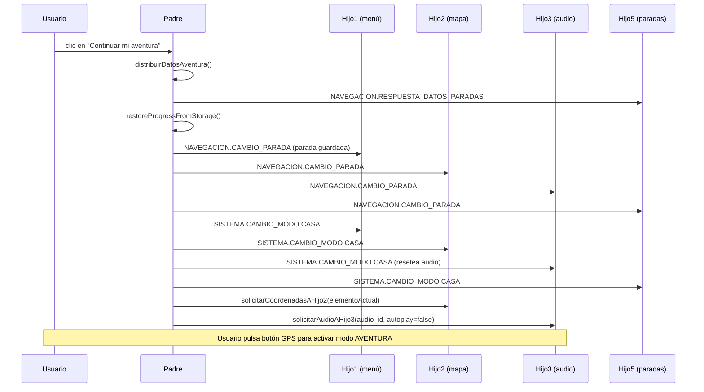

# Valencia VGuides — Guía Completa de la Aplicación

> **Versión**: 1.0.0  
> **Dominio**: valenciavguides.es

---

## Pendiente antes del despliegue en producción

Estas dos tareas **no tienen urgencia en desarrollo local** (VS Code) pero deben hacerse antes de publicar en el servidor real:

### 1. CSP: eliminar `unsafe-inline`

**Qué es:** `codigo-padre.html` lleva un `<meta>` CSP con `script-src 'self' 'unsafe-inline'`. El `unsafe-inline` anula la protección real del CSP — si alguien inyectara un script en la página, el navegador lo ejecutaría igualmente.

**Por qué no se toca ahora:** Con ficheros estáticos no hay forma de generar nonces dinámicos. La solución correcta es mover la CSP a cabeceras HTTP del servidor Express (no al meta tag), donde cada petición puede incluir un nonce único por script inline.

**Qué hacer al desplegar:**

1. Eliminar el `<meta http-equiv="Content-Security-Policy">` de `codigo-padre.html`.
2. En `backend/server.js`, añadir la CSP como cabecera HTTP con `helmet.contentSecurityPolicy()` y nonces generados por petición.
3. Pasar el nonce a cada `<script>` inline del padre mediante un paso de templating (o mover los scripts inline a ficheros externos `.js`).

### 2. Console.log: usar `logger.js` en producción

**Qué es:** 12+ archivos (`app.js`, `api-client.js`, `funciones-mapa.js`, `mensajeria.js`, `state-manager.js`, etc.) usan `console.log/warn/error` directos en lugar de pasar por `js/logger.js`. En producción, cualquier usuario con DevTools ve estados internos, rutas de datos e IDs de mensajes.

**Por qué no se toca ahora:** En desarrollo los logs son útiles.

**Qué hacer al desplegar:** Dos opciones (elegir una):

- **Opción A (rápida):** Añadir al inicio de `backend/server.js` o del HTML de producción un override global que silencie console en `NODE_ENV=production`: `if (process.env.NODE_ENV === 'production') { console.log = console.debug = () => {}; }`.
- **Opción B (limpia):** Reemplazar los `console.*` directos por llamadas a `logger.*` en cada archivo. `logger.js` ya tiene niveles configurables — en producción basta con `logger.setLevel('WARN')`.

### 3. Configuración del servidor de producción

Pasos operacionales — no son cambios de código. El código ya tiene guards en `backend/server.js` (líneas 42-51) que llaman a `process.exit(1)` si faltan las variables en producción.

#### Paso 1 — Generar JWT_SECRET seguro

```bash
node -e "console.log(require('crypto').randomBytes(64).toString('hex'))"
```

Copiar la cadena resultante al `.env` como `JWT_SECRET`.

#### Paso 2 — Crear `backend/.env` (a partir de `backend/.env.example`)

```ini
NODE_ENV=production
AUTH_ENABLED=true
JWT_SECRET=<cadena-64-bytes-generada-en-paso-1>
DOMAIN=valenciavguides.es
CERT_PATH=./certs/cert.pem
KEY_PATH=./certs/key.pem
PORT=3001
```

#### Paso 3 — Lanzar el servidor estático con `PROTECT_DATA=true`

`js/server.js` (puerto 8080) bloquea el acceso directo a los ficheros de datos cuando `PROTECT_DATA=true`:

```bash
PROTECT_DATA=true node js/server.js

# Con PM2:
pm2 start js/server.js --name vv-static -e PROTECT_DATA=true
```

#### Paso 4 — Verificar arranque correcto

```bash
cd backend && NODE_ENV=production node server.js
# Si falta JWT_SECRET o AUTH_ENABLED no está activo: el proceso termina con exit code 1
```

**Criterios de aceptación:**

- `JWT_SECRET` ≥ 64 bytes hex → servidor arranca sin error CRITICAL.
- `/api/aventuras` responde `401 Unauthorized` sin token (`AUTH_ENABLED=true` activo).
- `process.env.NODE_ENV === 'production'` visible en logs de arranque.
- `curl -I https://valenciavguides.es/js/coordenadas-aventuras.js` devuelve `403 Forbidden`.

### 4. Font Awesome: auto-alojar o añadir SRI

**Qué es:** `audio-hijo3.html` carga Font Awesome desde un CDN externo (`cdnjs.cloudflare.com`). SonarLint advierte que un recurso externo sin hash de integridad podría servir código modificado si el CDN es comprometido. La advertencia está desactivada en `.vscode/settings.json` (`Web:S5725`) durante el desarrollo.

**Por qué no se toca ahora:** El riesgo es bajo (es CSS, no JS, y Cloudflare es muy seguro). Además, la solución definitiva depende de una decisión de arquitectura.

**Qué hacer al desplegar — elegir una opción:**

- **Opción A (recomendada):** Servir Font Awesome desde el propio servidor. Descargar `all.min.css` y las fuentes `.woff2` a `css/vendor/fontawesome/` y cambiar el `<link>` para que apunte a esa ruta local. Elimina la dependencia de red y el aviso desaparece.
- **Opción B:** Mantener el CDN y añadir el atributo `integrity`. El hash oficial está en la propia página de cdnjs.cloudflare.com junto a cada versión. Ejemplo:

  ```html
  <link rel="stylesheet"
        href="https://cdnjs.cloudflare.com/ajax/libs/font-awesome/6.0.0-beta3/css/all.min.css"
        integrity="sha384-<hash-de-cdnjs>"
        crossorigin="anonymous">
  ```

  Si se actualiza la versión de Font Awesome hay que actualizar el hash también.

---

## Índice

1. [¿Qué es Valencia VGuides?](#1-qué-es-valencia-vguides)
2. [Cómo funciona a vista de pájaro](#2-cómo-funciona-a-vista-de-pájaro)
3. [Iconografía visual: emojis, marcadores y polylines](#3-iconografía-visual-emojis-marcadores-y-polylines)
4. [La arquitectura padre-hijo (iframes)](#4-la-arquitectura-padre-hijo-iframes)
5. [El código padre: el cerebro de todo](#5-el-código-padre-el-cerebro-de-todo)
6. [Las páginas hijo y qué hace cada una](#6-las-páginas-hijo-y-qué-hace-cada-una)
7. [Cómo se comunican padre e hijos (mensajería)](#7-cómo-se-comunican-padre-e-hijos-mensajería)
8. [Las aventuras: estructura y flujo completo](#8-las-aventuras-estructura-y-flujo-completo)
9. [Los datos de la aplicación](#9-los-datos-de-la-aplicación)
10. [Idiomas y traducciones](#10-idiomas-y-traducciones)
11. [El mapa y el GPS](#11-el-mapa-y-el-gps)
12. [Los audios](#12-los-audios)
13. [Los retos y puzzles](#13-los-retos-y-puzzles)
14. [Los textos narrativos](#14-los-textos-narrativos)
15. [Los vídeos](#15-los-vídeos)
16. [El backend (servidor)](#16-el-backend-servidor)
17. [Seguridad y protección](#17-seguridad-y-protección)
18. [El sistema de tests](#18-el-sistema-de-tests)
19. [PWA y Service Worker](#19-pwa-y-service-worker)
20. [Estructura de carpetas](#20-estructura-de-carpetas)
21. [Cómo arrancar la aplicación en local](#21-cómo-arrancar-la-aplicación-en-local)
22. [Preparación para producción](#22-preparación-para-producción)
23. [Glosario de términos](#23-glosario-de-términos)
24. [La experiencia del usuario: narrativa completa del modo AVENTURA](#24-la-experiencia-del-usuario-narrativa-completa-del-modo-aventura)
25. [Los controladores JS: roles, comunicación e inicialización](#25-los-controladores-js-roles-comunicación-e-inicialización)
26. [El asistente de soporte (hijo 6)](#26-el-asistente-de-soporte-hijo-6)

---

## 1. ¿Qué es Valencia VGuides?

Valencia VGuides es una audioguía interactiva con GPS de la Valencia histórica. Es una aplicación web (funciona en el navegador del móvil) que guía a los turistas por las calles de Valencia a través de aventuras.

Cada aventura es un recorrido por distintos puntos de interés (llamados **paradas**). En cada parada, el turista:

- Ve su posición en un **mapa interactivo** con 4 modos de visualización: satélite, mapa callejero, callejero claro y nocturno.
- Escucha un **audio** explicando la historia del lugar.
- Lee un **texto narrativo** con información detallada.
- Resuelve un **reto** (pregunta, puzzle, o texto libre) para avanzar.
- Ve un **vídeo** relacionado con el monumento.

La aplicación soporta **12 idiomas**: español, inglés, francés, italiano, neerlandés, japonés, alemán, chino simplificado, polaco, portugués, ruso y ucraniano.

Actualmente hay **7 aventuras planificadas**. Están disponibles las **Aventuras 1, 2, 3, 4, 5 y Fallas**. La **Aventura 34km** sigue marcada como no disponible en el índice de aventuras.

---

## 2. Cómo funciona a vista de pájaro

Imagina la aplicación como una **televisión con muchos canales**. La pantalla principal (el "padre") es el televisor, y cada canal es una página diferente (un "hijo") que se carga dentro del televisor.

```text
┌──────────────────────────────────────────────┐
│           codigo-padre.html                   │
│           (el televisor)                      │
│                                               │
│  ┌─────────────────────────────────────────┐  │
│  │                                         │  │
│  │    iframe activo (el canal visible)     │  │
│  │                                         │  │
│  │    Puede ser:                           │  │
│  │    - En-busca-del-tesoro.html           │  │
│  │    - coordenadas-hijo2.html (mapa)      │  │
│  │    - audio-hijo3.html                   │  │
│  │    - retos-hijo4.html                   │  │
│  │    - puzzle.html                        │  │
│  │    - etc.                               │  │
│  │                                         │  │
│  └─────────────────────────────────────────┘  │
│                                               │
│  [Botón GPS]  [Botón Mapa]  [Botón Casa]     │
└──────────────────────────────────────────────┘
```

El padre decide qué hijo se ve. Los hijos le envían mensajes al padre ("he terminado el reto", "el usuario ha pulsado esto"), y el padre les responde ("vale, ahora muestra la parada 5", "cambia al modo aventura").

Todo esto ocurre mediante un sistema de **mensajes** llamado `postMessage`, que es la forma estándar en que los iframes se comunican en un navegador.

---

## 3. Iconografía visual: emojis, marcadores y polylines

> Referencia rápida de todos los elementos visuales que el usuario ve durante la aventura: emojis en la interfaz, marcadores en el mapa y líneas de ruta.

### 3.1. Emojis en las pantallas de selección (En-busca-del-tesoro.html)

Estos emojis aparecen durante las 16 pantallas de demo/selección, antes de que comience la aventura.

| Emoji | Dónde aparece | Para qué sirve |
|-------|---------------|-----------------|
| → | Botones de avanzar/confirmar (P1, P4, P5, P6, P8, P9, P10, P11, P12, P13, P14, P15, P16) | Flecha de navegación "ir a la siguiente pantalla" |
| ➜ | Botón grande del puzzle (P8) | Flecha gruesa para continuar tras completar el puzzle |
| ✓ | Feedback de código correcto (P15) | Indicar respuesta/código correcto |
| ✗ | Botones rojos de rechazo (P3, P8), feedback de código incorrecto (P15) | Cancelar selección o indicar respuesta incorrecta |
| 🎬 | Pantalla de vídeo (P11) | Placeholder para el vídeo introductorio (aún no implementado) |
| 💳 | Pantalla de pago (P14) | Icono de la pasarela de pago (aún no implementada) |
| 🔑 | Pantalla de activación (P15) | Indica que se necesita un código de acceso |
| ✒️ | Pantalla de activación (P15) | Acompañamiento visual del campo de entrada |
| ❓ | Pantalla de activación (P15) | Indica ayuda o instrucciones |
| 🚀 | Botón de iniciar aventura (P15) | Avanza a P16 (normativa); la aventura se lanza al aceptar en P16 |
| 🔇 | Overlay de aviso (confirmación en P8) | Indica que no hay audio disponible para la combinación idioma+aventura |

### 3.2. Emojis en los botones de selección de aventura (P7)

Cada aventura muestra una línea de estadísticas con emojis universales (no necesitan traducción):

| Emoji | Significado | Ejemplo |
|-------|-------------|---------|
| 👣 | Vehículo: a pie | Aventuras 1, 2 y Fallas |
| 🚲 | Vehículo: bicicleta | Aventuras 3, 4 y 5 |
| 🛴 | Vehículo: patinete | Aventuras 3, 4 y 5 (combinado con 🚲) |
|🏛️  🚲🛴👣 | Vehículo: mixto | Aventura 34km |
| | Número de monumentos | `🏛️19` = 19 monumentos |
| 📍 | Número de paradas | `📍41` = 41 paradas |
| 🧩 | Número de retos | `🧩30` = 30 retos |
| ⏳ | Tiempo máximo para completar | `⏳max60h` = 60 horas |

### 3.3. Emojis durante la aventura activa

Una vez en modo AVENTURA, estos emojis aparecen en la interfaz de juego:

| Emoji | Componente | Para qué sirve |
|-------|------------|-----------------|
| 🛰️ | Hijo 5 (botón casa) | Botón de activación/desactivación del GPS. Muestra "ON" (verde) en aventura, "OFF" (rojo) en casa |
| 🎯 | Hijo 5 (lista de paradas) | Identifica las **paradas** (puntos de interés) en la lista lateral |
| 🛣️ | Hijo 5 (lista de paradas) | Identifica los **tramos** (caminos entre paradas) en la lista lateral |
| 📌 | Hijo 5 (lista de paradas) | Identifica el **punto de inicio** de la ruta |
| ❓ | Hijo 5 (lista de paradas) | Tipo de punto desconocido (fallback) |
| ✖ | Hijo 2 (overlay fuera de rango) | Botón para cerrar el aviso de "estás fuera de rango" |
| 🔄 | Puzzle (puzzle.html) | Reiniciar el puzzle |
| ⏸️ / ▶️ | Puzzle (puzzle.html) | Pausar / reanudar el puzzle |
| ↑ | Mapa (funciones-mapa.js) | Flecha de orientación del dispositivo sobre la posición del usuario |

### 3.4. Emojis en los retos (hijo 4)

| Emoji / Elemento | Cuándo aparece | Significado |
|-------------------|----------------|-------------|
| Borde **verde** | Al acertar un reto | Respuesta correcta |
| Borde **rojo** | Al fallar un reto | Respuesta incorrecta |
| Animación de **fuegos artificiales** (chispas de colores) | Al acertar | Celebración visual. 15 explosiones con 30 chispas cada una |
| Vibración del móvil (300 ms) | Al fallar | Feedback háptico de error |
| 🆘❓ Botón SOS (`#btnMostrarRespuesta`) | Siempre visible | Muestra/oculta el panel con la respuesta correcta. Segunda pulsación lo esconde |
| 🌍 Botón continuar (`#btnNextAfterReto`) **rojo-opaco** | Antes de acertar | `.btn-mundo-verde` deshabilitado (`opacity: 0.45`, no interactivo) |
| 🌍 Botón continuar (`#btnNextAfterReto`) **verde brillante** | Después de acertar | `.btn-mundo-verde` habilitado, con elementos orbitando (➣ 🎯) en animación continua |
| 🌍 Botón puzzle (`#btn-puzzle-continuar`) | Cuando el puzzle se completa | Mismo estilo `.btn-mundo-verde` con orbiting; oculto hasta que `puzzle.html` envía `puzzle-state-completed` |

### 3.5. Marcadores en el mapa

El mapa usa emojis y formas coloreadas como marcadores sobre las paradas:

| Marcador | Forma | Color | Cuándo aparece |
|----------|-------|-------|----------------|
| 📌 | Emoji chincheta | — | **Punto de inicio** de la ruta |
| 🎯 | Emoji diana | — | **Paradas** (puntos de interés) y **punto final** de la ruta |
| ● (círculo CSS) | Círculo sólido con borde blanco y sombra | `#F44336` rojo | Marcador de inicio alternativo |
| ● (círculo CSS) | Círculo sólido con borde blanco y sombra | `#4CAF50` verde | Marcador de parada alternativo |
| ● (círculo pulsante) | Círculo con relleno semitransparente | `#4285F4` azul Google | **Posición del usuario** en tiempo real. El radio del círculo refleja la precisión del GPS |
| ↑ (flecha) | Texto rotado según brújula | `#0066cc` azul oscuro | **Dirección** a la que apunta el dispositivo del usuario |

### 3.6. Polylines (líneas de ruta en el mapa)

Las polylines son las líneas que se dibujan en el mapa para mostrar rutas, tramos y navegación. Sus estilos varían según el tipo:

| Tipo de polyline | Color | Grosor base | Opacidad | Patrón | Cuándo se dibuja |
|-----------------|-------|-------------|----------|--------|------------------|
| **Ruta principal** | `#0077ff` (azul) | 6 px | 0.8 | Sólido | Al activar la aventura. Muestra todo el recorrido completo |
| **Tramo normal** | `#3388ff` (azul claro) | 4 px | 0.7 | Sólido | Al seleccionar un tramo específico entre dos paradas |
| **Tramo destacado** | `#ff4500` (naranja-rojo) | 6 px | 0.9 | Sólido | Cuando un tramo está activo o enfatizado (el actual) |
| **Línea de navegación** | `#3388ff` (azul claro) | 2 px | 0.7 | Discontinuo `10, 10` | Cuando el usuario está a más de 50 m de la ruta. Muestra el camino de vuelta |

**Escalado dinámico:** Todos los grosores se multiplican por un factor de escala que depende del tamaño de la pantalla y el nivel de zoom del mapa. La función `getPolylineEscalado()` calcula los valores finales.

**Comportamiento automático:**

- La **polyline de navegación** aparece automáticamente cuando el usuario se aleja más de 50 metros de la ruta. Incluye los waypoints intermedios del tramo para guiar al usuario por el camino correcto (no en línea recta).
- Se **elimina automáticamente** cuando el usuario vuelve a estar dentro de los 50 metros.
- Todas las polylines se posicionan con `zIndex 500` para aparecer por encima del mapa base pero por debajo de los marcadores.

### 3.7. Botones del hijo 2 (coordenadas) — iconos por imagen

Los 6 botones del panel de coordenadas no usan emojis sino imágenes PNG personalizadas:

| Botón | Imagen | Archivo |
|-------|--------|---------|
| GPS (ruta A→B) | Foto de ruta | `imagenes/imagenes-aplicación/fotoruta-A-B.png` |
| Imagen (monumento) | Foto cercana del monumento | `imagenes/imagenes-aplicación/H2-fotoproximo-monumento.png` |
| Vídeo (dron) | Fotograma de dron | `imagenes/imagenes-aplicación/H2-fotodron.png` |
| Ubicación (distancia) | Foto de distancia | `imagenes/imagenes-aplicación/H2-fotodistancia.png` |
| Mapa completo (moderno) | Miniatura de mapa moderno | `imagenes/imagenes-aplicación/H2-fotomapa-moderno.png` |
| Mapa vintage (artístico) | Miniatura de mapa vintage | `imagenes/imagenes-aplicación/H2-fotomapa-vintage.png` |

### 3.8. Código de colores de estado en botones

| Color | Estado | Significado |
|-------|--------|-------------|
| 🟢 Verde (`#4CAF50` / `#27ae60` / `#28a745`) | Habilitado / activo | El usuario puede pulsar este botón |
| 🔴 Rojo (`#f44336` / `#e74c3c` / `#dc3545`) | Deshabilitado / inactivo | El botón está bloqueado (no se puede usar) |
| 🔵 Azul (degradado) | Estado por defecto | Botón GPS en estado neutral |
| 🟡 Amarillo | Tramo (en lista de paradas) | Identifica los botones de tramo en hijo 5 |
| 🟠 Naranja (`#f5a623`) | Overlay de texto/audio | Fondo de los cuadros de texto narrativo y audio de introducción |

---

## 4. La arquitectura padre-hijo (iframes)

### ¿Qué es un iframe?

Un iframe es una "ventana dentro de otra ventana" en una página web. La aplicación tiene una página principal (`codigo-padre.html`) que carga otras páginas dentro de sí misma como iframes.

### ¿Por qué usar iframes?

- **Aislamiento**: cada hijo tiene su propio espacio. Si un hijo falla, los demás siguen funcionando.
- **Organización**: cada hijo se encarga de una función específica (mapa, audio, retos...).

### Race conditions en recarga de iframes

La aplicación tenía múltiples race conditions al acceder concurrentemente a `estado.hijosInicializados` sin sincronización. Esto afectaba a 4 funciones que usaban polling para esperar `HIJO_LISTO`:
- `_esperarHijoListo` (5 lugares)
- `_esperarHijosCargados`
- `_cargarIframesHijosConEspera`
- `_esperarHijosCriticosRest`

**Solución implementada: Sistema de eventos**

Se implementó un sistema de eventos centralizado en `state-manager.js` que elimina el polling y usa Promises para esperar `HIJO_LISTO`.

**Implementación en state-manager.js:**

```javascript
// Agregar al objeto state
hijosListosPromises: new Map(),

// Agregar mutex
hijosListosPromises: new SimpleMutex(),

// Funciones del sistema de eventos
export async function crearPromiseHijoListo(hijoId) {
  return await mutexes.hijosListosPromises.runExclusive(() => {
    return new Promise((resolve, reject) => {
      if (state.hijosListosPromises.has(hijoId)) {
        reject(new Error(`Promise ya existe para ${hijoId}`));
        return;
      }
      const timeout = setTimeout(() => {
        state.hijosListosPromises.delete(hijoId);
        reject(new Error(`Timeout esperando HIJO_LISTO de ${hijoId}`));
      }, 15000);
      state.hijosListosPromises.set(hijoId, { resolve, reject, timeout });
    });
  });
}

export async function marcarHijoListo(hijoId) {
  return await mutexes.hijosListosPromises.runExclusive(() => {
    const promiseData = state.hijosListosPromises.get(hijoId);
    if (promiseData) {
      clearTimeout(promiseData.timeout);
      promiseData.resolve();
      state.hijosListosPromises.delete(hijoId);
    }
  });
}

export async function cancelarPromiseHijoListo(hijoId) {
  return await mutexes.hijosListosPromises.runExclusive(() => {
    const promiseData = state.hijosListosPromises.get(hijoId);
    if (promiseData) {
      clearTimeout(promiseData.timeout);
      promiseData.reject(new Error(`Promise cancelada para ${hijoId}`));
      state.hijosListosPromises.delete(hijoId);
    }
  });
}
```

**Implementación en codigo-padre.html:**

1. **Handler HIJO_LISTO** (línea 6053):
```javascript
estado.hijosInicializados.add(hijoId);
// Marcar hijo como listo en sistema de eventos
if (globalThis.__stateManager && typeof globalThis.__stateManager.marcarHijoListo === 'function') {
    await globalThis.__stateManager.marcarHijoListo(hijoId);
}
```

2. **_esperarHijoListo** (línea 6587):
```javascript
function _esperarHijoListo(iframeId) {
    if (globalThis.__stateManager && typeof globalThis.__stateManager.crearPromiseHijoListo === 'function') {
        return globalThis.__stateManager.crearPromiseHijoListo(iframeId);
    }
    // Fallback a polling si state-manager no disponible
    return new Promise((resolve, reject) => {
        // ... polling fallback
    });
}
```

3. **_esperarHijosCargados** (línea 10846):
```javascript
async function _esperarHijosCargados(idsRecargados, estado, logPrefix) {
    const promesas = idsRecargados.map(id => {
        if (globalThis.__stateManager && typeof globalThis.__stateManager.crearPromiseHijoListo === 'function') {
            return globalThis.__stateManager.crearPromiseHijoListo(id);
        }
        // Fallback a polling
        return new Promise((resolve) => {
            const check = () => {
                if (estado.hijosInicializados.has(id)) resolve();
                else setTimeout(check, 200);
            };
            check();
        });
    });
    await Promise.all(promesas);
}
```

4. **_cargarIframesHijosConEspera** (línea 11118):
```javascript
async function _cargarIframesHijosConEspera(iframesHijos, estado, logPrefix) {
    const promesas = idsRecargados.map(id => {
        if (globalThis.__stateManager && typeof globalThis.__stateManager.crearPromiseHijoListo === 'function') {
            return globalThis.__stateManager.crearPromiseHijoListo(id);
        }
        // Fallback a polling
        return new Promise((resolve) => {
            const check = () => {
                if (estado.hijosInicializados.has(id)) resolve();
                else setTimeout(check, 200);
            };
            check();
        });
    });
    await Promise.all(promesas);
}
```

5. **_esperarHijosCriticosRest** (línea 3996):
```javascript
async function _esperarHijosCriticosRest(logPrefix) {
    const hijosCriticos = ['hijo2', 'hijo3', 'hijo4'];
    const promesas = hijosCriticos.map(id => {
        if (globalThis.__stateManager && typeof globalThis.__stateManager.crearPromiseHijoListo === 'function') {
            return globalThis.__stateManager.crearPromiseHijoListo(id);
        }
        // Fallback a polling
        return new Promise((resolve) => {
            const check = () => {
                if (estado.hijosInicializados.has(id)) resolve();
                else setTimeout(check, 200);
            };
            check();
        });
    });
    await Promise.all(promesas);
}
```

**Ventajas:**
- Elimina polling en 7 lugares (5 de _esperarHijoListo + 2 de las funciones anteriores)
- Homogeneidad total: todas las esperas de HIJO_LISTO usan el mismo sistema
- Timeout de 30 segundos en `state-manager.js` para esperar `HIJO_LISTO`
- Sincronización con mutex para evitar race conditions
- Fallback a polling si state-manager no está disponible
- No afecta comunicación cruzada ni controladores
- Compatible con producción (HTTPS + backend)
- **Reutilización**: el mismo hijo se puede usar en diferentes contextos.

### Los hijos principales

| Iframe | ID | Archivo | Función |
|--------|----|---------|---------|
| Hijo 1 | `hijo1` | `En-busca-del-tesoro.html` | Menú principal, selección de aventura e idioma. Es la "pantalla de inicio" de la experiencia. |
| Hijo 2 | `hijo2` | `coordenadas-hijo2.html` | Mapa interactivo con GPS. Muestra las paradas, los tramos, y la posición del usuario. |
| Hijo 3 | `hijo3` | `audio-hijo3.html` | Reproductor de audio. Recibe del padre qué audio reproducir y lo controla. |
| Hijo 4 | `hijo4` | `retos-hijo4.html` | Muestra retos (preguntas de opción múltiple, texto libre, puzzles) y valida las respuestas. |
| Hijo 5 | `hijo5` | `boton-casa-hijo5.html` | Botón de "volver a casa" que sale del modo aventura. |
| Hijo 6 | `hijo6-chat` | `chat-hijo6.html` | Asistente de soporte FAQ en acordeón. Accesible desde un botón flotante propio del padre. |

### Otros hijos (pantallas secundarias)

| Archivo | Función |
|---------|---------|
| `agradecimientos.html` | Créditos y agradecimientos. |
| `videos-valencia-historica.html` | Galería de vídeos sobre Valencia. |
| `consejos-valencia.html` | Consejos prácticos para el turista. |
| `gastronomia.html` | Información gastronómica valenciana. |
| `paginas-oficiales-valencia.html` | Enlaces a webs oficiales de Valencia. |
| `mapa-completo.html` | Vista del mapa completo (todas las aventuras). |
| `puzzle.html` | Juego de puzzle interactivo. |

### El protocolo de arranque (handshake)

Cuando el padre carga un hijo, siguen este protocolo para asegurarse de que están preparados:

```text
Padre                           Hijo
  │                               │
  │────── carga iframe ──────────>│
  │                               │
  │<──── HIJO_PREPARADO ─────────│  "ya he cargado mi HTML"
  │                               │
  │────── PADRE_DATOS ───────────>│  "aquí tienes la aventura, idioma, parada..."
  │                               │
  │<──── HIJO_LISTO ─────────────│  "ya procesé los datos, estoy listo"
  │                               │
  │── PADRE_CONFIRMA_HIJO_LISTO ─>│  "perfecto, te confirmo"
  │                               │
  ▼                               ▼
  (comunicación normal)           (funcionando)
```

Este protocolo garantiza que nunca se envíen datos a un hijo que aún no esté preparado para recibirlos.

> **Nota de diseño — el timeout de HIJO_LISTO no es el único mecanismo de seguridad.**
> La secuencia es causal: el padre no asigna `src` a ningún iframe hasta tener registrado el handler de `HIJO_PREPARADO`. Al recibirlo, responde con `PADRE_DATOS` de forma automática e inmediata. El timeout solo actúa si el hijo se cuelga antes de enviar `HIJO_LISTO` (crash total), no como mecanismo normal de espera. Adicionalmente, el heartbeat continuo detecta hijos caídos y permite reenviar `CAMBIO_MODO` pendiente si llega un `HIJO_LISTO` tardío.

### Diagrama de arquitectura global

```mermaid
graph TD
    PADRE["codigo-padre.html (12.146 líneas)"]
    H1["hijo1 — En-busca-del-tesoro.html"]
    H2["hijo2 — coordenadas-hijo2.html"]
    H3["hijo3 — audio-hijo3.html"]
    H4["hijo4 — retos-hijo4.html"]
    H5["hijo5 — boton-casa-hijo5.html"]
    H6["hijo6-chat — chat-hijo6.html"]
    MSG["js/mensajeria.js"]
    SM["js/state-manager.js"]
    CONST["js/constants.js"]
    APP["js/app.js"]
    FMAP["js/funciones-mapa.js (4.362 líneas)"]
    CP["js/controladores-padre.js"]
    BE["backend/server.js"]
    AUTH["backend/auth.js"]
    DATA["backend/dataService.js"]

    PADRE -->|postMessage| H1
    PADRE -->|postMessage| H2
    PADRE -->|postMessage| H3
    PADRE -->|postMessage| H4
    PADRE -->|postMessage| H5
    PADRE -->|postMessage| H6
    PADRE -->|ESM import| MSG
    PADRE -->|ESM import| SM
    PADRE -->|ESM import| CONST
    PADRE -->|ESM import| APP
    PADRE -->|ESM import| FMAP
    PADRE -->|dynamic import| CP
    PADRE -->|fetch /api| BE
    BE --> AUTH
    BE --> DATA
```



### Diagrama de secuencia — Reanudación de aventura



---

## 5. El código padre: el cerebro de todo

El archivo `codigo-padre.html` es, con diferencia, el más grande y complejo del proyecto (más de 12.000 líneas). Es el **orquestador** de toda la aplicación.

### Responsabilidades del padre

1. **Gestión de iframes**: carga, muestra y oculta los hijos según el contexto.
2. **Estado centralizado**: guarda cuál es la aventura seleccionada, el idioma, la parada actual, el modo (casa/aventura), etc.
3. **Mensajería**: recibe mensajes de todos los hijos y les responde.
4. **GPS**: controla la geolocalización y la envía al hijo del mapa.
5. **Navegación**: decide cuándo cambiar de parada, cuándo mostrar un reto, cuándo reproducir un audio.
6. **Modos**: gestiona el cambio entre modo CASA (menú principal) y modo AVENTURA (recorrido activo).

### Modos de la aplicación

La aplicación tiene dos modos principales:

- **Modo CASA**: el usuario está en el menú principal. Puede elegir aventura, ver vídeos, leer consejos, etc.
- **Modo AVENTURA**: el usuario está haciendo un recorrido. El mapa está activo, el GPS funciona, y los retos aparecen en cada parada.

El padre gestiona la transición entre modos enviando mensajes `CAMBIO_MODO` a todos los hijos. Los hijos confirman que han entendido (`CAMBIO_MODO_ENTENDIDO`) y que han hecho la transición (`CAMBIO_MODO_EFECTUADO`).

### Los controladores de datos (js/controladores-padre.js)

Los 4 handlers que responden a peticiones de datos de aventuras están extraídos en el módulo `js/controladores-padre.js` (importado dinámicamente al final de Script 1 de `codigo-padre.html`). La función exportada es `registrarControladoresDatos(deps)`, que recibe todas sus dependencias por inyección:

| Handler | Tipo de mensaje | Responde con |
|---------|----------------|--------------|
| Datos de paradas para hijo5 | `NAVEGACION.SOLICITAR_DATOS_PARADAS` | `NAVEGACION.RESPUESTA_DATOS_PARADAS` |
| Metadatos de audio | `DATOS.SOLICITAR_AUDIOS` | `DATOS.CARGAR_AUDIOS` |
| Textos narrativos | `DATOS.SOLICITAR_TEXTOS` | `DATOS.CARGAR_TEXTOS` |
| Retos y respuestas | `DATOS.SOLICITAR_RETOS` | `DATOS.CARGAR_RETOS` |

Todos leen de `window.__vv_*` (datos cargados en FASE 2) y responden con `enviarMensaje`. Esto permite testear los handlers de forma aislada en Jest sin necesitar el HTML del padre.

### El state-manager (gestor de estado)

El estado de la aplicación se guarda en un único lugar: `js/state-manager.js`. Este módulo usa **mutex** (cerrojos) para evitar que dos operaciones modifiquen el mismo dato al mismo tiempo, lo cual causaría bugs difíciles de detectar.

Ejemplo de datos que guarda:

```javascript
{
    aventuraSeleccionada: "Aventura1",
    idiomaSeleccionado: "es",
    paradaActual: 5,
    modo: { actual: "AVENTURA", anterior: "CASA" },
    hijosInicializados: Set("hijo1", "hijo2", "hijo3", "hijo4", "hijo5"),
    gps: {
        activo: true,
        posicionUsuario: { lat: 39.4789, lng: -0.3762 },
        precision: 8  // metros
    }
}
```

---

## 6. Las páginas hijo y qué hace cada una

### En-busca-del-tesoro.html — pantalla de selección (iframe `id="seleccion"`)

**Primera pantalla que ve el usuario**. Se carga al arrancar la app en un iframe que ocupa toda la pantalla (`position:fixed; top:0; left:0; width:100%; height:100%; z-index:2000`). Gestiona el flujo completo de incorporación antes de que empiece la aventura: selección de idioma, selección de aventura, aceptación de términos, retos previos y código de activación. Cuando termina, avisa al padre para que cargue el resto de iframes y arranque la aventura.

Participa en el handshake estándar (`SISTEMA.HIJO_PREPARADO` → `SISTEMA.PADRE_DATOS` → `SISTEMA.HIJO_LISTO`) igual que cualquier otro hijo, pero es el ÚNICO iframe que se carga en el arranque inicial. El padre espera a que esta pantalla termine antes de cargar hijo1-opciones, hijo2, hijo3, hijo4 y hijo5.

**16 pantallas secuenciales** (se muestran y ocultan; solo una activa a la vez):

| Pantalla | Qué muestra |
|----------|-------------|
| P1 | Logo y botón "Empezar" |
| P2 | Selección de idioma — 12 banderas |
| P3 | Confirmación de idioma — "¿Estás seguro? [Sí/No]" |
| P4 | Imagen del título "En Busca del Tesoro" según idioma |
| P5 | Agradecimientos y fuentes — texto con scroll; botón → se activa al llegar al final |
| P6 | Términos y condiciones — texto legal con scroll; botón → bloqueado hasta el final |
| P7 | Selección de aventura — lista dinámica de aventuras disponibles |
| P8 | Confirmación de aventura — "Has elegido Aventura X. ¿Confirmas?" |
| P9 | Reto R1 — primer reto antes de empezar el recorrido |
| P10 | Puzzle — reto visual interactivo |
| P11 | Vídeo — introducción en vídeo de la aventura |
| P12 | Audio + texto — narración introductoria y texto de bienvenida |
| P13 | Reto R2 — segundo reto |
| P14 | Pago (stub) — pantalla de pago, actualmente sin implementar |
| P15 | Código de activación — el usuario introduce un código para desbloquear la aventura |
| P16 | Normativa y cumplimiento — aviso legal de seguridad vial con scroll; al aceptar, llama a `iniciarAventura()` |

**2 overlays adicionales** superpuestos a la pantalla activa:

- `#mapa-vintage-overlay`: imagen artística del recorrido, aparece al seleccionar aventura en P7.
- `#audio-warning-overlay`: avisa que la aventura funcionará sin audio si no hay archivos grabados para el idioma elegido; permite volver a elegir idioma o continuar sin audio.

**Mensajes que envía al padre** (vía `postMessage` a `window.location.origin`):

| Tipo de mensaje | Cuándo |
|---|---|
| `SISTEMA.HIJO_PREPARADO` | Al cargarse (arranque del handshake) |
| `SISTEMA.HIJO_LISTO` | Tras recibir y procesar `SISTEMA.PADRE_DATOS` |
| `SELECCION.IDIOMA_SELECCIONADO` | Al confirmar el idioma en P3 |
| `SELECCION.AVENTURA_SELECCIONADA` | Al confirmar la aventura en P8 |
| `SELECCION.AVENTURA_ACTIVADA` | Al validar el código de activación en P15 |
| `SELECCION.TERMINOS_ACEPTADOS` | Al aceptar los términos en P6 |
| `SELECCION.PREPARAR_HIJOS` | Cuando la selección está completa y el padre debe cargar el resto de iframes |
| `SISTEMA.HEARTBEAT_RESPONSE` | En respuesta al heartbeat del padre |
| `SISTEMA.CAMBIO_MODO_ENTENDIDO` / `CAMBIO_MODO_EFECTUADO` | Al recibir `SISTEMA.CAMBIO_MODO` |

**Propagación de idioma y aventura**: `seleccionarIdioma()` actualiza tres niveles simultáneamente — variable local, `estadoComponente.idiomaSeleccionado` y `window.idiomaSeleccionado` — para que todas las funciones internas (términos, textos, retos, audios) trabajen con el idioma correcto sin importar cómo accedan al valor. Lo mismo para `seleccionarAventura()`.

---

### Hijo 1: extrainfo-hijo1.html — panel de opciones extra (iframe `id="hijo1-opciones"`)

Panel lateral izquierdo con un botón principal "Más opciones" que despliega iconos flotantes de acceso a contenido complementario. Solo es visible durante la aventura (el padre lo carga y muestra al iniciar).

**Posición**: `position:fixed; left:1.5px; bottom:var(--gap-inferior)` — ocupa `var(--franja-lateral)` de ancho y `calc(6 × var(--franja-lateral) + 26px)` de alto, alineado con la columna izquierda de iframes.

**Contenido del menú desplegable** (iconos flotantes, se muestran/ocultan al pulsar el botón principal):

| Icono | Abre | Descripción |
|---|---|---|
| `#icono-gastronomia` | `gastronomia.html` | Guía gastronómica de Valencia |
| `#icono-informacion` | `consejos-valencia.html` | Consejos e información práctica |
| `#icono-historia` | `videos-valencia-historica.html` | Vídeos de historia de Valencia |
| `#icono-paginas-oficiales` | `paginas-oficiales-valencia.html` | Páginas oficiales del Ayuntamiento |
| `#icono-temporizador` | (no abre URL) | Activa/desactiva el temporizador de cuenta atrás |

Los iconos se posicionan dinámicamente sobre el botón principal usando las dimensiones reales del iframe. Al pulsar cualquier icono (excepto el temporizador), el padre abre la URL correspondiente en una ventana flotante/modal.

**Temporizador integrado**: contiene su propia lógica de cuenta atrás. Al pulsar `#icono-temporizador`, envía un mensaje al padre para que muestre/oculte la ventana del temporizador (los estilos del temporizador viven en el padre, no en el hijo). El temporizador se detiene y resetea automáticamente al volver al modo casa o al finalizar la aventura.

**Mensajes que envía al padre**:

| Tipo de mensaje | Cuándo |
|---|---|
| `SISTEMA.HIJO_PREPARADO` | Al cargarse |
| `SISTEMA.HIJO_LISTO` | Tras inicializarse |
| `SISTEMA.HEARTBEAT_RESPONSE` | En respuesta al heartbeat |
| `SISTEMA.CAMBIO_MODO_ENTENDIDO` / `CAMBIO_MODO_EFECTUADO` | Al recibir `SISTEMA.CAMBIO_MODO` |
| Mensaje de toggle temporizador | Al pulsar `#icono-temporizador` |
| Métricas GPS (`MONITOREO.METRICA`) | Al detectar errores de geolocalización |

### Hijo 2: coordenadas-hijo2.html (el mapa)

Muestra un mapa interactivo usando **Leaflet** (biblioteca de mapas de código abierto). Características:

- **4 modos de mapa** seleccionables mediante un botón desplegable con **borde naranja**, situado en la **esquina superior derecha**: satélite (ESRI), mapa Voyager (Carto), callejero claro (Carto Positron) y nocturno (Carto Dark Matter). El botón principal es más grande que los elementos del desplegable. Ver sección 11 para detalles completos.
- Marcadores para cada **parada** del recorrido.
- **Polylines** (líneas) que conectan las paradas mostrando la ruta.
- **Posición del usuario** en tiempo real mediante GPS.
- Detección de **proximidad**: cuando el usuario se acerca a una parada, el sistema lo detecta.
- **Brújula**: el mapa puede rotar según la orientación del dispositivo.

### Hijo 3: audio-hijo3.html (el reproductor)

Reproduce los audios narrativos de cada parada. Usa el elemento `<audio>` nativo de HTML5 con barra de progreso y título de pista, pero sin botón local de play/pausa: el control de reproducción vive ahora en el padre mediante un botón central desplegable con acciones play, pause, stop y replay. El padre le dice qué audio reproducir enviándole la URL del fichero MP3.

**Layout interno** (ver sección de layout de iframes más abajo para dimensiones):

```text
┌──────────────────────────────────────────────────────────────────────┐
│  [████████████████████●░░░░░░░░░░  00:43 / 02:15  ]  ← barra top   │
├─────────────────────────────────────────────────┬────────────────────┤
│  [ Nombre de la pista actual             ]      │  ▶  🎯            │
│     (píldora con mismo estilo que barra)        │ play  retos        │
└─────────────────────────────────────────────────┴────────────────────┘
```

- **Fila superior**: barra de progreso a ancho completo del iframe, con el tiempo superpuesto centrado.
- **Fila inferior izquierda**: nombre de la pista — misma altura y estilo visual (píldora gris `#f0f0f0`, borde `#ddd`, `border-radius` = mitad del alto) que la barra de progreso.
- **Fila inferior derecha**: botón de retos, alineado al borde derecho del iframe. La reproducción ya no tiene botón local aquí; se controla desde el padre con el desplegable de audio.

### Hijo 4: retos-hijo4.html (los retos)

Muestra las preguntas y retos del recorrido. Soporta cuatro tipos de reto:

- **Opción única** (`tipo: "opcion"`): el usuario elige UNA respuesta entre varias (radio buttons).
- **Opción múltiple** (`tipo: "opcion-multiple"`): el usuario elige VARIAS respuestas correctas (checkboxes).
- **Texto libre** (`tipo: "texto"`): el usuario escribe la respuesta.
- **Puzzle** (`tipo: "puzzle"`): se carga `puzzle.html` en un iframe que ocupa toda la ventana flotante.

**Layout interno** (orden top → bottom en el DOM, flex-column):

```text
┌─ body (display:flex; flex-direction:column; min-height:100vh) ──────────┐
│  #reto (flex:1; overflow-y:auto)  ← pregunta + opciones de respuesta    │
│  #btn-puzzle-continuar            ← solo visible cuando puzzle completa  │
│  #button-container (flex-shrink:0)                                       │
│    [🆘❓ #btnMostrarRespuesta]  [🌍 #btnNextAfterReto]                  │
│  #respuestaCorrectaTexto (flex-shrink:0) ← panel SOS, oculto por defecto│
└─────────────────────────────────────────────────────────────────────────┘
```

En **modo puzzle** (`body.puzzle-mode`): `#reto` pasa a `height:100dvh`, elimina padding/borde y contiene el `#puzzleIframe` que también ocupa `100%`. El resto de elementos quedan ocultos o fuera de pantalla hasta que el puzzle se resuelve.

Cuando el usuario responde, el hijo4 comprueba si es correcto y le dice al padre el resultado mediante `RETO.COMPLETADO`.

### Hijo 5: boton-casa-hijo5.html

Barra de control superior siempre visible durante la aventura. Contiene el botón GPS on/off y los botones de parada y tramo para navegar por el recorrido. Cuando el usuario pulsa el GPS off, envía un mensaje al padre para que cambie a modo CASA.

**Posición en pantalla**: fijo en la parte superior (`position: fixed; top: 3px`), anclado a la izquierda con `left: 2px`, ancho `99vw`, altura `22vh`. El style inline del elemento `<iframe id="hijo5">` es el que realmente se aplica (tiene precedencia sobre el CSS), por lo que cualquier cambio de posición debe hacerse ahí, no solo en la hoja de estilos.

#### Layout interno de hijo5

```text
┌── #zona-boton-casa (flex-row, 99vw) ──────────────────────────────────────────┐
│  [🛰️]   │  [🎯 P1  Torres de Serranos ▶▶]  [🛣️ T1  Plaza de la… ▶▶]  ...  │
│  GPS     │  ←────────────── #paradas-window (flex:1, scroll horizontal) ─────→│
│  2.65rem │                                                                     │
└──────────┴─────────────────────────────────────────────────────────────────────┘
```

- **Botón GPS** (`#gps-casa-btn`): `width: 2.65rem` (mitad del tamaño anterior) para ceder el máximo espacio a los botones de paradas. Contenido centrado verticalmente.
- **`#paradas-window`**: `flex: 1`, absorbe todo el espacio restante. Scroll horizontal con `overflow-x: auto` en `#lista-paradas`.
- **Botones de parada/tramo** (`.parada-tramo-btn`): dos filas —
  - Fila 1: emoji + código corto (`🎯 P1`, `🛣️ T1`, `📌 Inicio`)
  - Fila 2: nombre completo de la parada/tramo en `font-size: 0.65em`
  - Si el nombre no cabe, se activa automáticamente el efecto **marquee** (igual que el título en hijo3): el texto se duplica y se desplaza con `animation: btn-marquee 8s linear infinite`.

### Hijo 6: chat-hijo6.html (el asistente de soporte)

Pantalla de ayuda FAQ en formato acordeón de dos niveles (tema → pregunta → respuesta). Se abre como ventana flotante mediante el botón fijo `#btn-chat-soporte` del padre, colocado encima de la columna derecha de controles. Soporta los mismos 12 idiomas que el resto de la app y adapta su contenido al estado actual de la aventura mediante marcadores dinámicos en el texto de respuesta.

Ver sección 26 para la documentación completa del chat.

---

### Sistema de layout y escalado de iframes (hijo1, hijo2, hijo3)

#### Variables CSS raíz (`codigo-padre.html`)

```css
:root {
    --franja-lateral:  clamp(62px, 7.2vh, 80px);  /* ancho de hijo1 y hijo2 */
    --franja-inferior: clamp(62px, 7.2vh, 80px);  /* unidad base de alto de hijo3 */
    --gap-inferior:    env(safe-area-inset-bottom, 0px); /* safe-area en iPhones con notch */
}
```

`clamp(mín, preferido, máx)` — la variable toma el valor `6.5vh` siempre que quede dentro del rango `[59 px, 75 px]`. En móviles típicos (altura ≈ 800–900 px) el valor resulta en ~59–65 px.

#### Posición y dimensiones de cada iframe en el padre

| iframe | Posición | Ancho | Alto | Fondo |
|--------|----------|-------|------|-------|
| **hijo1** (`hijo1-opciones`) | `right: calc(franja-lateral + 4.5px)`, `bottom: gap-inferior` | `--franja-lateral` | `6×F + 26 px` | `transparent` |
| **hijo2** | `right: 1.5px`, `bottom: gap-inferior` | `--franja-lateral` | `6×F + 26 px` | `transparent` |
| **hijo3** | `left: 0`, `bottom: gap-inferior` | `100vw - 2×franja-lateral - 5px` | `2×--franja-inferior` | `transparent` |
| **hijo4** | pantalla completa superpuesta | `100%` | `100%` | — |
| **hijo5** | `top: 3px`, `left: 2px` | `99vw` | `22vh` | `transparent` |

> **F** = valor de `--franja-lateral` en ese dispositivo (entre 59 y 75 px).

La fórmula `6×F + 26 px` garantiza que quepan exactamente 6 botones de diámetro `F - 2 px` con `gap: 6 px` y `padding-bottom: 3 px`.

#### Escalado de botones dentro de los iframes

Dentro de cada iframe, `100vh` equivale a la **altura del propio iframe** (no del viewport del padre). Todos los botones circulares usan `width/height = var(--btn-size)`:

| iframe | `--btn-size` | Resultado |
|--------|-------------|-----------|
| **hijo1 y hijo2** | `calc(var(--iframe-w) - 2px)` | ancho del iframe menos 2 px — mismo valor para ambos |
| **hijo3** (play y retos) | `calc(50vh - 4px)` | mitad del alto del iframe menos 4 px — el iframe mide `2×F`, así que el botón mide `F - 4 px` |

`--iframe-w` se inyecta en el `<head>` de hijo1 y hijo2:

```javascript
document.documentElement.style.setProperty('--iframe-w', window.innerWidth + 'px');
```

#### Alineación vertical entre hijo1 y hijo2

Ambos iframes tienen la misma altura y la misma posición `bottom`. Los botones están todos alineados a `bottom: 3px` del iframe mediante:

- **hijo2**: CSS flex `justify-content: flex-end` + `padding-bottom: 3px` + `gap: 6px`
- **hijo1**: JS calcula `posicionTop = iframeHeight - 3 - D - (i+1)×(D+6)` donde `D = iframeWidth - 2` (igual que `--btn-size` de hijo2)

El botón principal de hijo1 (`#mas-opciones`) usa CSS `bottom: 3px` directamente. Los sub-botones al desplegarse se posicionan con JS usando la misma base `bottom: 3px`.

#### Layout interno de hijo3 (dos filas)

```text
iframeHeight = 2×F  (≈ 118–150 px según pantalla)

┌─ fila superior: .progress-top-row ──────────────────────────────────────┐
│  height: calc(50vh - 7px)  =  F - 7px  [barra de progreso]              │
├─ gap: 6px (gap del flex-column) ────────────────────────────────────────┤
├─ fila inferior: .bottom-row ─────────────────────────────────────────────┤
│  flex: 1  (ocupa el resto)                                               │
│  ┌── .content-left ──────────────────────┐  ┌── .buttons-right ────────┐ │
│  │  height: calc(50vh - 7px)             │  │  gap: 6px                │ │
│  │  border-radius: calc((50vh-7px)/2)    │  │  margin-right: 3px       │ │
│  │  background: #f0f0f0                  │  │  [▶]  [🎯]               │ │
│  │  border: 1px solid #ddd               │  │  btn-size = 50vh - 4px   │ │
│  │  padding: 0 4px                       │  └──────────────────────────┘ │
│  └───────────────────────────────────────┘                               │
└─────────────────────────────────────────────────────────────────────────┘
```

- La píldora del título y la barra de progreso tienen exactamente el mismo alto (`50vh - 7px`) y el mismo estilo visual, formando un par visual coherente.
- El padding horizontal de `4px` en la píldora del título evita que el texto toque los bordes redondeados.
- Los iframes hijo1, hijo2 y hijo3 tienen `background: transparent` en el padre para que el mapa sea visible a través de ellos.

#### Estilo visual de los botones circulares (glossy + efecto pulsar)

Todos los botones circulares de los iframes de acción (hijo1, hijo2, hijo3) y los botones rectangulares de retos (hijo4) usan un acabado **glossy** mediante gradiente lineal y un efecto de hundimiento al pulsar. No tienen `box-shadow` en ningún estado.

**Botones verdes** (hijo1 `.boton-flotante` e `.icono-flotante`, hijo2 `.boton`, hijo3 `#retosBtn` y controles de audio del padre):

```css
background: linear-gradient(180deg, #43c465 0%, #28a745 50%, #1e8035 100%);
/* hijo1 usa 145deg — mismo esquema cromático */
```

- `:active`: `transform: scale(0.93)` — se encoge ligeramente para simular presión física.
- `box-shadow: none` en todos los estados (base, `:hover`, `:active`, `.activo`, `.disabled`).

**Botones azules** (hijo4 `button.btn`):

```css
background: linear-gradient(180deg, #2e9ee8 0%, #0077cc 50%, #005ba3 100%);
```

- `:active`: `transform: translateY(3px)` — se hunde hacia abajo (botones rectangulares).
- `#btnMostrarRespuesta` usa el mismo gradiente verde que los botones de hijo1/2/3.

La decisión de eliminar `box-shadow` fue deliberada: los iframes hijo1 y hijo2 tienen `overflow: hidden` para contener los botones dentro del iframe, lo que recortaría cualquier sombra exterior. El efecto de profundidad se logra exclusivamente con el gradiente y el `transform` en `:active`.

---

## 7. Cómo se comunican padre e hijos (mensajería)

### El sistema de mensajes

La comunicación se gestiona en `js/mensajeria.js`. Utiliza la API nativa del navegador `window.postMessage()` para enviar mensajes entre ventanas (el padre y sus iframes).

### Estructura de un mensaje

Todos los mensajes siguen este formato:

```javascript
{
    tipo: "SISTEMA.CAMBIO_PARADA",      // qué tipo de mensaje es
    origen: "padre",                      // quién lo envía
    destino: "hijo2",                     // a quién va
    timestamp: 1712456789000,             // cuándo se envió
    payload: {                            // los datos del mensaje
        paradaId: "P-5",
        aventuraId: "Aventura1"
    }
}
```

### Tipos de mensaje principales

| Categoría | Mensaje | Dirección | Significado |
|-----------|---------|-----------|-------------|
| **Sistema** | `HIJO_PREPARADO` | Hijo → Padre | "He cargado, envíame datos" |
| | `PADRE_DATOS` | Padre → Hijo | "Aquí tienes aventura, idioma, parada..." |
| | `HIJO_LISTO` | Hijo → Padre | "Ya estoy listo para funcionar" |
| | `CAMBIO_MODO` | Padre → Hijos | "Cambiamos a modo CASA/AVENTURA" |
| | `HEARTBEAT` | Padre ↔ Hijos | "¿Sigues vivo?" (latido cada 5 segundos) |
| | `ACK` | Cualquiera | "Mensaje recibido correctamente" |
| **Navegación** | `CAMBIO_PARADA` | Padre → Hijos (broadcast) | "Ahora estamos en la parada 5" |
| | `GPS.ACTIVAR` | Padre → Hijo2 | "Enciende el GPS" |
| | `UBICACION_ACTUALIZADA` | Padre → Hijo2 | "El usuario está en lat/lng tal" |
| | `PARADA_COMPLETADA` | Hijo → Padre | "El usuario ha completado esta parada" |
| **Datos** | `RETO.MOSTRAR` | Padre → Hijo4 | "Muestra el reto R-5" |
| | `RETO.RESULTADO` | Hijo4 → Padre | "El usuario respondió correctamente" |
| | `AUDIO.REPRODUCIR` | Padre → Hijo3 | "Reproduce este MP3" |

### Confirmaciones y reintentos

Cada mensaje enviado espera una confirmación (`ACK`) en un plazo de 5 segundos. Si no llega:

1. Se reintenta hasta **3 veces**.
2. Si tras 3 reintentos no hay respuesta, se registra un error.
3. Hay un timeout extendido de **10 segundos** para operaciones lentas.

### El heartbeat (latido)

Cada 5 segundos, el padre envía un "latido" a todos los hijos para comprobar que siguen funcionando. Si un hijo no responde, el padre puede intentar reconectarlo.

**Implementación actual:**

El heartbeat está completamente implementado con detección de hijos caídos:

- **Estado centralizado** en `js/state-manager.js`:
  - `heartbeat.activo`: Control de estado (solo AVENTURA)
  - `heartbeat.intervalo`: Referencia al setInterval
  - `heartbeat.heartbeatsFallidos`: Mapa hijoId → contador de fallidos
  - `heartbeat.ultimoHeartbeat`: Mapa hijoId → timestamp del último heartbeat
  - `heartbeat.hijosDesconectados`: Set de hijos marcados como desconectados

- **Lógica en `js/mensajeria.js`**:
  - `iniciarHeartbeat(intervalo)`: Inicia el heartbeat periódico
  - `pausarHeartbeat()`: Pausa el heartbeat y limpia el intervalo
  - `enviarHeartbeatAHijos()`: Envía heartbeat a hijos críticos (hijo2, hijo3, hijo4, hijo5)
  - `marcarHijoDesconectado(hijoId)`: Marca hijo como desconectado tras MAX_HEARTBEATS_FALLIDOS
  - `intentarReconectarHijo(hijoId)`: Recarga el iframe para reconectar
  - `procesarHeartbeatResponse(mensaje)`: Procesa respuesta de heartbeat, resetea contadores

- **Handler en `codigo-padre.html`**:
  - `SISTEMA.HEARTBEAT_RESPONSE`: Llama a `mensajeria.procesarHeartbeatResponse()` para procesar respuestas

- **Configuración en `js/config.js`**:
  - `MAX_HEARTBEATS_FALLIDOS`: 3 (número de heartbeats fallidos antes de marcar desconectado)
  - `INTERVALO_HEARTBEAT`: 5000ms (frecuencia del heartbeat)
  - `AUTO_RECONECTAR`: true (reconexión automática)

**Flujo completo:**

1. Al cambiar a modo AVENTURA, se llama `iniciarHeartbeat()` desde `_activarHeartbeatAventura()`
2. Cada 5 segundos, `enviarHeartbeatAHijos()` envía `SISTEMA.HEARTBEAT` a hijos críticos
3. Cada hijo incrementa su contador de fallidos en el state-manager
4. Si un hijo responde con `SISTEMA.HEARTBEAT_RESPONSE`, se resetea su contador
5. Si un hijo acumula MAX_HEARTBEATS_FALLIDOS (3), se marca como desconectado
6. Si AUTO_RECONECTAR está activo, se recarga el iframe del hijo desconectado
7. Al cambiar a modo CASA, se llama `pausarHeartbeat()` desde `_pausarHeartbeatCasa()`

---

## 8. Las aventuras: estructura y flujo completo

### ¿Qué es una aventura?

Una aventura es un recorrido turístico por Valencia. Cada aventura tiene:

- Un **nombre** (ej: "València centro histórico 1").
- Una lista de **paradas** (puntos de interés).
- **Tramos** (caminos entre paradas).
- **Retos** (preguntas para cada parada).
- **Audios** narrativos por parada e idioma.
- **Textos** descriptivos por parada e idioma.
- **Puzzles** asociados a ciertas paradas.

### El índice de aventuras

El fichero `js/indice-aventuras.js` define todas las aventuras, su disponibilidad y metadatos visuales:

| Aventura | Nombre | Distancia | Vehículo | Estado |
|----------|--------|-----------|----------|--------|
| 1 | València centro histórico 1 | ~4 km | 👣 Andando | ✅ Disponible |
| 2 | València centro histórico 2 | ~4 km | 👣 Andando |  ✅ Disponible  |
| 3 | València Ciudad de las Artes y las Ciencias | ~10 km | 🚲🛴 Bici/patinete |  ✅ Disponible  |
| 4 | València Parque de Cabecera y Viveros | ~10 km | 🚲🛴 Bici/patinete | ✅ Disponible |
| 5 | València murallas | ~6 km | 🚲🛴 Bici/patinete |  ✅ Disponible  |
| Fallas | València en Fallas | ~4 km | 👣 Andando | ✅ Disponible |
| 34km | València 34 kilómetros | ~34 km | 🚲🛴👣 Mixto | ❌ En desarrollo |

Cada aventura incluye los campos `distanciaKm` y `vehiculo` (emoji) que se muestran en los botones de selección.

### Pantalla de selección de aventura (P7)

Los botones de aventura muestran todo en una línea con stats visuales universales (sin necesidad de traducción):

```text
Nombre aventura    👣±4km 🏛️19 📍41 🧩30 ⏳max60h
```

- 👣/🚲🛴 = vehículo recomendado
- ±Xkm = distancia aproximada
- 🏛️ = monumentos | 📍 = paradas | 🧩 = retos
- ⏳maxXh = tiempo **máximo** para completar (no duración estimada)

Cada botón ocupa `width: 95vw; max-width: 95vw` para aprovechar toda la pantalla del móvil. La lista de aventuras (`.aventuras-lista`) también usa `width: 95vw`.

### Flujo completo de una aventura (usuario típico)

Esto es lo que experimenta el turista paso a paso:

```text
1. Abre la app en el móvil
   └── Se carga codigo-padre.html (modo CASA)
       └── Se carga En-busca-del-tesoro.html en el iframe principal

2. Pantalla de bienvenida (P1)
   └── Pulsa "Empezar"

3. Elige idioma (P2)
   └── Toca la bandera de España 🇪🇸

4. Confirma idioma (P3)
   └── "¿Español? SÍ"
   └── Si el idioma no tiene audios → aparece aviso overlay
       └── "SÍ, continuar sin audio" o "NO, volver a elegir"

5. Agradecimientos y fuentes (P5)
   └── Lee y acepta

6. Términos y condiciones (P6)
   └── Lee y acepta

7. Elige aventura (P7)
    └── Aventuras 1, 2, 3, 4, 5 y Fallas disponibles. Solo 34km sigue bloqueada.
   └── Pulsa "Aventura 1"

8. Confirma aventura (P8)
   └── "Has elegido Aventura 1. ¿Confirmas? SÍ"

9. Resuelve Reto 1 (P9)
   └── Pregunta de prueba para verificar que entiende el sistema

10. Resuelve Puzzle (P10)
   └── Puzzle visual interactivo

11. Ve vídeo introductorio (P11)
    └── Vídeo corto sobre Valencia

12. Escucha audio + lee texto (P12)
    └── Audio de bienvenida + texto narrativo de introducción

13. Resuelve Reto 2 (P13)
    └── Segunda pregunta

14. Pantalla de pago (P14) — actualmente un stub
    └── En el futuro: pago real

15. Código de activación (P15)
    └── Introduce un código recibido tras el pago
    └── ⚠️ Estado actual: validación local temporal con código "0000".
         La integración con backend y emisión de token JWT está pendiente de implementar.

16. Normativa y cumplimiento (P16)
    └── El botón solo se habilita al llegar al final del texto legal

17. ¡AVENTURA ACTIVADA! Se cambia a modo AVENTURA
    └── El padre carga el mapa (hijo2)
    └── Se activa el GPS
    └── El usuario ve la parada 0 (Torres de Serranos)

18. En cada parada:
    a. Ve el mapa con su posición y la parada
    b. Escucha el audio narrativo
    c. Lee el texto descriptivo
    d. Resuelve el reto de esa parada
    e. Avanza a la siguiente parada

19. Al completar todas las paradas → ¡Aventura completada!
    └── El padre envía AVENTURA.FINALIZADA al iframe del temporizador
```

### Cómo funciona la progresión internamente

El padre mantiene un **índice de progreso** (`estado.indiceProgreso`) que apunta al elemento actual dentro de un array ordenado. Este array es `elementosIDpadre` en `js/aventuras-ID-padre.js`, y tiene siempre la misma secuencia: intro → parada 0 → tramo 1 → parada 1 → tramo 2 → parada 2 → ...

#### Los dos arrays paralelos

La aventura se apoya en dos fuentes de datos que deben estar en sincronía:

| Array | Archivo | Contiene | Indexado por |
| --- | --- | --- | --- |
| `DATOS_PADRE[av][idioma].elementosIDpadre` | `aventuras-ID-padre.js` | Texto, audio, reto, tipo de elemento | `padreid` (`"padre-P3"`, `"padre-TR2"`) |
| `DATOS_AVENTURAS[av]["coordenadas-hijo2.html"].coordenadas` | `coordenadas-aventuras.js` | Coordenadas GPS, waypoints, imagen | `id` (`"P-3"`, `"TR-2"`) |

El `parada_id`/`tramo_id` del primer array (ej: `"P-3"`) debe coincidir exactamente con el `id` del segundo (ej: `"P-3"`). Si no coinciden, el sistema no puede cargar las coordenadas del elemento.

#### La progresión es estrictamente secuencial

El sistema **nunca salta elementos**. Si el GPS detecta que el usuario está físicamente más cerca de la parada 4 que del tramo 3, no ocurre nada: la comprobación GPS sólo evalúa el elemento activo en `estado.indiceProgreso`. Estar cerca de un elemento futuro es irrelevante para el sistema.

#### Cómo sabe el padre que un elemento está completado

Cada elemento activo tiene una entrada en `estado.pendingCompleciones` (clave: `padreid`). Esta entrada rastrea el estado de cada condición requerida:

**Para paradas e inicio:**

| Condición | Cómo se activa |
| --- | --- |
| `pending.audio = true` | Mensaje `AUDIO.FIN_REPRODUCCION` recibido de hijo3 |
| `pending.reto = true` | Mensaje `RETO.COMPLETADO` (correcto) recibido de hijo4 |
| **Completado cuando:** | `audio && reto` ambos verdaderos |

Si la parada no tiene reto (`reto_id` nulo), sólo se necesita el audio.

**Para tramos:**

| Condición | Cómo se activa |
| --- | --- |
| `pending.audio = true` | Mensaje `AUDIO.FIN_REPRODUCCION` recibido de hijo3 |
| `pending.llegada = true` | Mensaje `NAVEGACION.LLEGADA_DETECTADA` recibido de hijo2 (GPS dentro de tolerancia) |
| **Completado cuando:** | `audio && llegada` ambos verdaderos |

Cuando se cumplen ambas condiciones, `intentarCompletarElemento()` llama a `progresarSiguienteElemento()`, que incrementa `indiceProgreso` y activa el siguiente elemento. Los pendings tienen un TTL de 10 minutos para evitar que la aventura se quede bloqueada.

#### Fin de la aventura

Cuando `indiceProgreso` supera el último índice de `elementosIDpadre`, `obtenerElementoActual()` devuelve `null`. El padre envía entonces `AVENTURA.FINALIZADA` a `hijo1-opciones` (el iframe del temporizador). **La pantalla de fin de aventura (felicitación, resumen) está pendiente de implementar.**

### Reanudación de aventura (`ejecutarRestauracionAventura`)

Cuando el usuario recarga la página con una aventura en progreso, el padre detecta el progreso guardado en `localStorage` y muestra el botón "Continuar mi aventura". Al confirmarlo, se ejecuta `ejecutarRestauracionAventura()`. La secuencia correcta es:

```javascript
// 1. distribuirDatosAventura()          — envía datos de la aventura a todos los hijos
// 2. RESPUESTA_DATOS_PARADAS → hijo5    — para que hijo5 renderice la lista de paradas
// 3. restoreProgressFromStorage()       — broadcast CAMBIO_PARADA con la parada guardada
// 4. CAMBIO_MODO CASA → todos           — resetea estado de hijos (incluyendo hijo3)
// 5. solicitarCoordenadasAHijo2(elem)   — recarga el destino en el mapa
// 6. solicitarAudioAHijo3(id, false)    — recarga la pista de audio sin autoplay
```

El paso 4 es crítico: el manejador de `CAMBIO_MODO` en hijo2 y hijo3 resetea su estado interno. Sin los pasos 5 y 6 posteriores, ambos iframes quedarían vacíos. El autoplay es `false` porque el usuario no ha activado el modo AVENTURA todavía — lo hace manualmente pulsando el botón GPS, igual que en la primera vez.

#### Notas de implementación

**Scope de `obtenerElementoActual`**

`obtenerElementoActual()` está definida en el **Script 2** de `codigo-padre.html` (scope de módulo ES). `ejecutarRestauracionAventura()` vive en **Script 1**, un módulo diferente: no puede llamar directamente a funciones del otro módulo sin pasar por `globalThis`.

Por eso Script 2 la expone en el momento de evaluarse:

```javascript
globalThis.obtenerElementoActual = obtenerElementoActual;
```

Y las llamadas en Script 1 usan el patrón defensivo (el `typeof` no lanza si el identificador no existe):

```javascript
const _fn = globalThis.obtenerElementoActual
    || (typeof obtenerElementoActual === 'function' ? obtenerElementoActual : null);
estado.elementoActual = _fn ? _fn() : null;
```

**Por qué `INICIAR_AVENTURA` espera el handshake `HIJO_LISTO` y no solo el evento `load`**

Cuando el handler de `INICIAR_AVENTURA` recarga los iframes hijo1-hijo5, esperar el evento nativo `load` no es suficiente para saber que los handlers de los iframes están registrados. El navegador emite `load` al terminar de parsear el HTML, pero los módulos ES se evalúan de forma asíncrona en microtasks posteriores. En conexiones lentas (CDN en producción), los mensajes `CARGAR_COORDENADAS`, `CARGAR_AUDIOS`, etc. pueden llegar antes de que los receptores existan y se descartan silenciosamente.

Por eso, tras el `await Promise.all(promesasCarga)`, el código:

1. Elimina las entradas antiguas de `estado.hijosInicializados` para los iframes recargados.
2. Espera (polling cada 200 ms, timeout de 10 s) a que cada iframe complete el handshake `HIJO_LISTO` y vuelva a aparecer en `hijosInicializados`.
3. Solo entonces llama a `distribuirDatosAventura()`.

Esto garantiza que los handlers están registrados antes de recibir los datos, independientemente de la velocidad de la red.

---

### La Aventura 1 en números

| Dato | Valor |
|------|-------|
| Paradas totales | 41 |
| Tramos (caminos entre paradas) | 24 |
| Retos | 30 |
| Monumentos | 19 |
| Audios (por idioma) | 47 |
| Distancia aproximada | ~4 km por el casco histórico |
| Vehículo recomendado | 👣 Andando |
| Tiempo máximo | 60 horas |

---

## 9. Los datos de la aplicación

Toda la información de las aventuras (coordenadas GPS, textos, audios, retos, puzzles) se almacena en ficheros JavaScript en la carpeta `js/` y en ficheros JSON en `backend/data/`.

### Datos en el frontend (`js/`)

Estos ficheros se cargan directamente en el navegador:

| Fichero | Qué contiene | Estructura |
|---------|-------------|------------|
| `coordenadas-aventuras.js` | Latitud/longitud de cada parada y tramo, tipo (`parada`/`tramo`/`referencia`), nombre, número en mapa | `DATOS_AVENTURAS.Aventura1.coordenadas[]` |
| `textos-aventuras.js` | Textos narrativos HTML por parada e idioma | `TEXTOS_AVENTURAS.Aventura1.es[]` |
| `retos-aventuras.js` | Preguntas, opciones y respuestas correctas | `RETOS_AVENTURAS.Aventura1.es[]` |
| `audios-aventuras.js` | Metadatos de audios (título, fichero MP3) | `AUDIOS_AVENTURAS.Aventura1.es[]` |
| `puzzles-aventuras.js` | Definición de puzzles (imágenes) | `PUZZLES_AVENTURAS.Aventura1.puzzle_id[]` |
| `indice-aventuras.js` | Índice de aventuras, disponibilidad y metadatos | `INDICE_AVENTURAS.Aventura1` |
| `aventuras-ID-padre.js` | Secuencia ordenada de elementos (intro → parada → tramo → parada → …) que el padre recorre | `DATOS_PADRE.Aventura1.es.elementosIDpadre[]` |
| `mapa-vintage-aventuras.js` | Imágenes JPG de mapas artísticos por aventura | `MAPAS_VINTAGE.Aventura1[]` |
| `terminos-aventuras.js` | Texto legal de términos y condiciones en 12 idiomas | Objeto plano `TERMINOS.es`, `TERMINOS.en`, … |
| `agradecimientos-aventuras.js` | Texto de créditos/agradecimientos en 12 idiomas | Objeto plano `AGRADECIMIENTOS.es`, … |
| `normativa-cumplimiento.js` | Aviso legal de seguridad vial (requerido antes de iniciar aventura) en 12 idiomas | Objeto plano `NORMATIVA.es`, … |

### Datos en el backend (`backend/data/`)

Los mismos datos existen en formato JSON para ser servidos por la API:

| Fichero | Equivalente en frontend |
|---------|------------------------|
| `audios-aventuras.json` | `js/audios-aventuras.js` |
| `coordenadas-aventuras.json` | `js/coordenadas-aventuras.js` |
| `indice-aventuras.json` | `js/indice-aventuras.js` |
| `puzzles-aventuras.json` | `js/puzzles-aventuras.js` |
| `retos-aventuras.json` | `js/retos-aventuras.js` |

### ¿Por qué existen los datos en dos sitios?

Por una razón de diseño pensando en la seguridad futura:

- **Ahora (desarrollo)**: los datos se cargan directamente desde los ficheros JS en el navegador. Es más rápido y no necesita backend.
- **En producción (objetivo)**: los ficheros JS sensibles se bloquearán con 403. El frontend pedirá los datos al backend, que solo los entregará si el usuario tiene un **token de sesión válido**. Así nadie puede ver las coordenadas ni las respuestas de los retos sin haber pagado.

> ⚠️ **CRÍTICO — No activar `PROTECT_DATA=true` todavía**: el servidor estático ya bloquea los JS sensibles con 403 cuando esta flag está activa, pero `codigo-padre.html` y `En-busca-del-tesoro.html` siguen importándolos directamente (sin pasar por el backend). Activarla en producción rompería la carga de aventuras. Pendiente de migrar esos imports a `data-loader.js` en modo `'api'`.

El módulo `js/data-loader.js` gestiona esta transición. Tiene una variable `DATA_MODE`:

- `'local'`: carga desde ficheros JS (desarrollo).
- `'api'`: carga desde el backend con token (producción).

---

## 10. Idiomas y traducciones

### Idiomas soportados

| Código | Idioma | Bandera | Estado de audios |
|--------|--------|---------|-----------------|
| `es` | Español | 🇪🇸 | ✅ Grabados |
| `en` | Inglés | 🇬🇧 | ❌ Pendiente |
| `fr` | Francés | 🇫🇷 | ❌ Pendiente |
| `it` | Italiano | 🇮🇹 | ❌ Pendiente |
| `nl` | Neerlandés | 🇳🇱 | ❌ Pendiente |
| `ja` | Japonés | 🇯🇵 | ❌ Pendiente |
| `de` | Alemán | 🇩🇪 | ❌ Pendiente |
| `zh` | Chino simplificado | 🇨🇳 | ❌ Pendiente |
| `pl` | Polaco | 🇵🇱 | ❌ Pendiente |
| `pt` | Portugués | 🇵🇹 | ❌ Pendiente |
| `ru` | Ruso | 🇷🇺 | ❌ Pendiente |
| `uk` | Ucraniano | 🇺🇦 | ❌ Pendiente |

### ¿Qué está traducido?

- **Textos narrativos** (`textos-aventuras.js`): ✅ los 12 idiomas (66 entradas por idioma para Av1–5; los 6 idiomas nuevos —de, zh, pl, pt, ru, uk— en ficheros `parrafos-texto-*.json`).
- **Títulos de textos** (`title` en textos-aventuras.js): ✅ los 12 idiomas — "Parada" → Stop / Arrêt / Fermata / Halte / 停留所 / Haltestelle / 停靠站 / Przystanek / Parada / Остановка / Зупинка, "Tramo" → Section / Tronçon / Tratto / Traject / 区間 / Abschnitt / 路段 / Odcinek / Trecho / Участок / Ділянка.
- **Retos** (`retos-aventuras.js`): ✅ los 12 idiomas (preguntas, opciones y respuestas traducidas).
- **Audios** (`audios-aventuras.js`): solo español tiene archivos MP3 reales. Los demás 11 idiomas tienen la estructura preparada pero sin fichero.
- **Interfaz (botones, avisos)**: traducida en `En-busca-del-tesoro.html` con objetos como `AUDIO_WARNING_TEXTS`, `TEXTOS_CONFIRMACION`, etc.
- **Logo inline**: todas las menciones a "València be Guides" en los textos narrativos se han sustituido por una imagen del logo (`imagenes/imagenes-aplicación/logo_alargado_3.png`) renderizada con `height:1.4em` para escalar con el texto. Esto elimina la necesidad de traducir el nombre de la marca.

### El mapeo de idiomas

```javascript
MAPEO_IDIOMAS = {
    "es": { nombre: "Español",            bandera: "bandera_españa.png" },
    "en": { nombre: "English",            bandera: "bandera_inglesa.png" },
    "fr": { nombre: "Français",           bandera: "bandera_francia.png" },
    "it": { nombre: "Italiano",           bandera: "bandera_italia.png" },
    "nl": { nombre: "Nederlands",         bandera: "bandera_paises_bajos.png" },
    "ja": { nombre: "日本語",              bandera: "bandera_japon.png" },
    "de": { nombre: "Deutsch",            bandera: "bandera_alemania.png" },
    "zh": { nombre: "中文",               bandera: "bandera_china.png" },
    "pl": { nombre: "Polski",             bandera: "bandera_polonia.png" },
    "pt": { nombre: "Português",          bandera: "bandera_portugal.png" },
    "ru": { nombre: "Русский",            bandera: "bandera_rusia.png" },
    "uk": { nombre: "Українська",         bandera: "bandera_ucrania.png" }
}
```

---

## 11. El mapa y el GPS

### Tecnología usada

- **Leaflet 1.9.4**: biblioteca JavaScript de mapas interactivos de código abierto.
- **leaflet-rotate 0.2.8**: permite rotar el mapa (para brújula).
- **leaflet-geometryutil 0.10.1**: cálculos geométricos (distancias, puntos cercanos).

> **Servicio local (sin CDN):** los tres archivos anteriores se sirven desde `js/vendor/` (leaflet.css, leaflet.js, leaflet-rotate-src.js, leaflet.geometryutil.js). No hay dependencia de red en tiempo de carga — funciona sin conexión desde el primer render. Versiones fijadas y descargadas el 2026-05-26.

### Cómo funciona el mapa

1. El padre activa el GPS del dispositivo usando `navigator.geolocation.watchPosition()`.
2. Cada vez que se obtiene una nueva posición, el padre la envía al hijo2 (mapa).
3. El hijo2 actualiza el marcador del usuario en el mapa.
4. El padre calcula la **distancia** entre el usuario y el elemento activo.
5. Cuando el usuario entra en la tolerancia del elemento, se considera que ha "llegado" (sólo relevante para tramos — ver abajo).

### Fuente única de verdad del estado GPS

El estado GPS tiene una **única fuente de verdad**: el objeto `estadoMapa` dentro de `js/funciones-mapa.js`. Este objeto contiene `gpsActivo`, `posicionUsuario`, `precision`, etc.

Cada vez que el estado GPS cambia, la función `sincronizarEstadoGPSConPadre()` copia los valores relevantes a `window.estadoPadre.gps`. Esto permite que el resto del código del padre acceda al estado GPS mediante `window.estadoPadre.gps` sin acceder directamente a las variables internas de `funciones-mapa.js`.

No existe una tercera copia en `state-manager.js` — la única sincronización es `funciones-mapa.js → window.estadoPadre.gps`.

> **Nota de diseño — hub + adaptador, no duplicación.**
> `activarGPS()` / `desactivarGPS()` en `codigo-padre.html` son el **hub**: la única implementación real que llama a `navigator.geolocation.watchPosition`. `manejarGPSActivar()` / `manejarGPSDesactivar()` en `funciones-mapa.js` son el **adaptador**: detectan si están en el padre (`window.parent === window`) y delegan al hub, o si están en un iframe, envían postMessage al padre para que el hub actúe. No hay lógica duplicada — hay un único punto de ejecución real con una capa de enrutamiento.

### Reenvío GPS con confirmación y cola de pendientes

El reenvío de actualizaciones GPS a hijo2 usa un sistema robusto para asegurar que las actualizaciones no se pierdan, incluso si hijo2 está temporalmente desconectado.

**Implementación:**

- **Estado centralizado** en `js/state-manager.js`:
  - `gpsPendientes`: Array de mensajes GPS pendientes de envío
  - `getGpsPendientes()`, `setGpsPendientes()`, `agregarMensajeGPSAPendientes()`, `limpiarGpsPendientes()`

- **Reenvío con confirmación** en `codigo-padre.html` (líneas 8829-8861):
  - Usa `enviarMensajeConConfirmacion()` con timeout de 3 segundos
  - Si falla la confirmación, agrega el mensaje a `gpsPendientes`
  - Muestra indicador visual `imagen-no-gps.png` si hay mensajes pendientes

- **Funciones en `js/mensajeria.js`**:
  - `reenviarMensajesGPSAPendientes(hijoId)`: Reenvía mensajes pendientes cuando hijo se reconecta
  - Integrado con `procesarHeartbeatResponse()` para reenviar automáticamente cuando hijo2 se reconecta

- **Indicador visual** en `codigo-padre.html`:
  - Elemento `` con `imagen-no-gps.png`
  - Funciones `_mostrarIndicadorErrorGPS()` y `_ocultarIndicadorErrorGPS()`
  - Se muestra cuando hay mensajes GPS pendientes
  - Se oculta cuando el reenvío tiene éxito

**Flujo completo:**

1. GPS actualiza → Intenta enviar a hijo2 con `enviarMensajeConConfirmacion()`
2. Si falla la confirmación → Agrega a `gpsPendientes` + Muestra `imagen-no-gps.png`
3. Cuando hijo2 se reconecta → `procesarHeartbeatResponse()` detecta reconexión
4. `reenviarMensajesGPSAPendientes()` reenvía todos los mensajes pendientes
5. Limpia `gpsPendientes` + Oculta `imagen-no-gps.png`

**Ventajas:**

- No se pierden actualizaciones GPS si hijo2 está temporalmente desconectado
- El usuario ve indicador visual (`imagen-no-gps.png`) cuando hay problemas
- Reenvío automático cuando hijo2 se reconecta (no requiere intervención del usuario)
- Usa el sistema de heartbeat que ya implementamos para detectar reconexiones
- Indicador visual es multiidioma (imagen, no texto)

### Las coordenadas

Cada parada tiene esta estructura:

```javascript
{
    id: "P-5",                              // Identificador único
    tipo: "parada",                         // "inicio", "parada", o "tramo"
    parada: 5,                              // Número de parada
    nombre: "Plaza de la Virgen",           // Nombre del lugar
    coordenadas: { lat: 39.47546, lng: -0.37524 },
    imagen: "imagenes/imagenes-aventuras/plaza_de_la_virgen.jpg",
    video: "videos-aventuras/av1/parada_5.mp4"
}
```

Los tramos (caminos entre paradas) tienen **waypoints** (puntos intermedios) para dibujar la ruta con precisión:

```javascript
{
    id: "TR-5",
    tipo: "tramo",
    nombre: "Plaza de la Virgen → Catedral",
    inicio: { lat: 39.47546, lng: -0.37524 },
    waypoints: [
        { lat: 39.47540, lng: -0.37510 },
        { lat: 39.47535, lng: -0.37498 },
        // ... más puntos intermedios
    ],
    fin: { lat: 39.47530, lng: -0.37480 }
}
```

### Tolerancia GPS por tipo de elemento

La función `calcularToleranciaGPS()` en `js/funciones-mapa.js` determina cuántos metros de margen tiene el usuario para activar la "llegada". El cálculo es diferente según el tipo de elemento:

| Tipo | Tolerancia | Cómo se calcula | ¿Se usa para completar? |
| --- | --- | --- | --- |
| **Parada / inicio** | **50 m** (`RADIO_EXTENDIDO`) | Valor constante — es la **zona activa**, no de llegada | ❌ Las paradas se completan con audio + reto, no por GPS |
| **Tramo** | **dinámica** | Distancia máxima entre waypoints consecutivos + 20 m de buffer | ✅ `NAVEGACION.LLEGADA_DETECTADA` se dispara al entrar en esta zona |

> **Distinción clave**: `calcularToleranciaGPS()` devuelve 50 m para paradas, pero ese valor solo define la **zona de rango activo** (dentro de él los controles permanecen habilitados). La detección de llegada GPS (`NAVEGACION.LLEGADA_DETECTADA`) **solo se emite para tramos**, usando la tolerancia dinámica. Las paradas completan su secuencia cuando el usuario escucha el audio y supera el reto.

Para los tramos, la tolerancia dinámica se calcula a partir de la distancia entre waypoints: si el tramo tiene waypoints muy separados (calles largas), la tolerancia es mayor; si están muy juntos (callejones), más ajustada. El destino de un tramo es siempre su **último waypoint**.

> **Los waypoints intermedios no son checkpoints obligatorios.** La app no comprueba si el usuario pasó por cada punto intermedio. Solo verifica si llegó al radio del último waypoint. Los waypoints intermedios sirven para dibujar la polyline en el mapa y para calcular la tolerancia dinámica.

### Capas de mapa y selector de estilo

#### Dónde está implementado

El sistema de capas y el selector de mapa están implementados **directamente en el HTML**, no en módulos JS externos:

- **Mapa de aventura**: bloque `<script>` inline de `codigo-padre.html`, dentro de la función `inicializarMapa()` (buscar el comentario `// ── Capas de mapa + selector desplegable ──`). Las variables llevan prefijo `_` para evitar colisiones con el resto del código del padre (`_capaSatelite`, `_capaVoyager`, `_MODOS_MAPA`, etc.).
- **Mapa completo**: bloque `<script type="module">` de `mapa-completo.html`, justo después de crear la instancia `L.map('map', ...)`.

`funciones-mapa.js` **no gestiona las capas de tiles**. Recibe la instancia Leaflet ya configurada y se limita a registrarla. Tampoco `mapa-vintage-aventuras.js` tiene relación con estas capas (ese fichero configura los mapas artísticos JPG que se muestran en overlays).

#### Los 4 modos: origen de los tiles y URLs

Cada modo combina una **capa base** (imagen satelital o callejera) con una **capa de etiquetas** (nombres de calles y lugares) superpuesta. Ambas capas son gratuitas y no requieren clave de API.

##### Modo Satélite

Capa base: ESRI World Imagery — imágenes de satélite de alta resolución (Maxar/Earthstar Geographics).

```text
https://server.arcgisonline.com/ArcGIS/rest/services/World_Imagery/MapServer/tile/{z}/{y}/{x}
maxNativeZoom: 19  →  a partir de zoom 20-21 Leaflet amplía los tiles del nivel 19
```

##### Modo Mapa (Voyager)

Capa base: Carto Voyager sin etiquetas — estilo cartográfico limpio y moderno basado en OpenStreetMap.

```text
https://{s}.basemaps.cartocdn.com/rastertiles/voyager_nolabels/{z}/{x}/{y}{r}.png
```

##### Modo Callejero (Positron)

Capa base: Carto Light sin etiquetas — estilo blanco/gris minimalista. Se aplica `filter: saturate(1.6) contrast(1.05)` en el pane `callejeroPane` para compensar la palidez del estilo original. El pane propio evita que el filtro afecte a las capas base de los otros modos.

```text
https://{s}.basemaps.cartocdn.com/light_nolabels/{z}/{x}/{y}{r}.png
pane: 'callejeroPane'  →  z-index 200, filter saturate(1.6) contrast(1.05)
```

##### Modo Nocturno (Dark Matter)

Capa base: Carto Dark Matter sin etiquetas — fondo oscuro para uso nocturno.

```text
https://{s}.basemaps.cartocdn.com/dark_nolabels/{z}/{x}/{y}{r}.png
```

##### Capa de etiquetas — modos claro (satélite, mapa, callejero)

```text
https://{s}.basemaps.cartocdn.com/rastertiles/voyager_only_labels/{z}/{x}/{y}{r}.png
pane: 'labelsPane'      →  z-index 400, siempre por encima de la capa base
tileSize: 512           →  tiles del nivel anterior, 2× más grandes → texto más legible
zoomOffset: -1          →  compensa el nivel de zoom del truco anterior
filter: drop-shadow(0 0 1.5px #FFD700)  →  borde amarillo alrededor de letras negras
```

##### Capa de etiquetas — modo nocturno

```text
https://{s}.basemaps.cartocdn.com/dark_only_labels/{z}/{x}/{y}{r}.png
pane: 'labelsPane'      →  mismo pane, z-index 400
tileSize: 512, zoomOffset: -1  →  mismo truco de tamaño
filter: none            →  el texto ya es blanco de serie; no necesita filtro
```

El `{r}` al final de las URLs de Carto añade `@2x` en pantallas Retina cuando `detectRetina: true`.

#### Arquitectura de panes Leaflet

Leaflet gestiona el orden de renderizado mediante **panes** (divs con `z-index` controlados). El sistema usa tres panes:

| Pane | z-index | Qué contiene | CSS filter |
|------|---------|--------------|------------|
| `tilePane` (defecto) | 200 | Capas base de satélite, voyager y dark_nolabels | ninguno |
| `callejeroPane` (custom) | 200 | Capa base light_nolabels (callejero) | `saturate(1.6) contrast(1.05)` |
| `labelsPane` (custom) | 400 | Capa de etiquetas (siempre encima) | varía según modo (ver arriba) |

El filtro de `labelsPane` se actualiza dinámicamente al cambiar de modo:

```javascript
map.getPane('labelsPane').style.filter = nuevo.filtroCss;
// 'drop-shadow(0 0 1.5px #FFD700)'  para modos claro
// 'none'                             para nocturno
```

#### El botón selector desplegable

El selector se construye **íntegramente en JavaScript** (sin HTML adicional en la página) y se añade al DOM con `document.body.appendChild(selectorDiv)`. Esto garantiza que esté en el contexto de apilamiento raíz, no dentro del pane de Leaflet.

Estructura del selector:

```text
[Botón principal]   ← miniatura del modo activo, borde naranja
      │
[Botón Satélite ]   ┐
[Botón Mapa     ]   │ desplegable (max-height: 0 → 500px, transition 0.35s)
[Botón Callejero]   │
[Botón Nocturno ]   ┘
```

La miniatura de cada botón es un **tile real** de Valencia descargado directamente del proveedor al nivel de zoom 13 (coordenadas de tile x=4088, y=3115):

| Modo | URL del thumbnail |
|------|------------------|
| Satélite | `https://server.arcgisonline.com/.../tile/13/3115/4088` |
| Mapa | `https://a.basemaps.cartocdn.com/rastertiles/voyager/13/4088/3115.png` |
| Callejero | `https://a.basemaps.cartocdn.com/light_all/13/4088/3115.png` |
| Nocturno | `https://a.basemaps.cartocdn.com/dark_all/13/4088/3115.png` |

Propiedades del botón según contexto:

| Propiedad | Mapa de aventura | Mapa completo |
|-----------|-----------------|---------------|
| Posición | `position: fixed; top: calc(1vmin + 8px); right: calc(1vmin + 8px)` | `position: fixed; top: 2.5vmin; left: 2.5vmin` |
| Tamaño botón principal | `clamp(30px, 8.2vmin, 44px)` | `clamp(36px, 11vmin, 60px)` |
| Tamaño botones desplegables | `clamp(24px, 7vmin, 36px)` | `clamp(36px, 11vmin, 60px)` |
| Borde | `clamp(3.5px, 0.75vmin, 5px) solid #FF8C00` | `clamp(1.5px, 0.4vmin, 3px) solid #FF8C00` |
| `z-index` | `1000080` — supera hijo5 (z-index 1000000) | `1000` |
| Añadido a | `document.body` | `document.body` |

El botón se añade a `document.body` (no al contenedor de Leaflet) porque el `<div id="mapa">` tiene z-index 500, lo que haría que cualquier `position: absolute` dentro de él quedara por debajo de hijo5 (z-index 1000000). Al usar `position: fixed` sobre `body`, el z-index se resuelve en el contexto raíz del documento.

Además, en el mapa de aventura el selector no permanece siempre visible: una función centralizada (`actualizarVisibilidadSelectorMapa()`) lo oculta temporalmente cuando se abre el chat, un reto (`hijo4`) o cualquiera de los overlays de imagen, vídeo, error o iframe, y lo vuelve a mostrar al cerrarlos.

**Lógica de cambio de modo:**

```javascript
function cambiarModo(nuevoId) {
    if (nuevoId === modoActivo) return;
    const actual = MODOS_MAPA.find(m => m.id === modoActivo);
    const nuevo  = MODOS_MAPA.find(m => m.id === nuevoId);
    map.removeLayer(actual.capa);                          // quita base actual
    if (actual.etiqCapa !== nuevo.etiqCapa) {             // cambia etiquetas si difieren
        map.removeLayer(actual.etiqCapa);
        nuevo.etiqCapa.addTo(map);
    }
    map.getPane('labelsPane').style.filter = nuevo.filtroCss; // actualiza filtro
    nuevo.capa.addTo(map);                                 // añade nueva base
    modoActivo = nuevoId;
    actualizarBtnPrincipal();
}
```

Solo hay una capa base activa en cada momento. La capa de etiquetas solo se reemplaza al cambiar entre modos claro ↔ nocturno (las tres variantes claras comparten `capaEtiquetas`). En `codigo-padre.html` las variables llevan prefijo `_` (`_cambiarModo`, `_MODOS_MAPA`, etc.) para no contaminar el ámbito global.

---

### El mapa completo (`mapa-completo.html`)

Página independiente que muestra todas las paradas y la polyline de la aventura en un mapa con el mismo sistema de 4 modos descrito arriba. Se abre desde el botón `#btn-mapa-completo` de hijo2. Recibe la aventura activa por parámetro URL (`?aventura=Aventura1`).

**Tipos de elemento que dibuja:**

| `tipo` en coordenadas | Qué dibuja |
| --- | --- |
| `"parada"` / `"inicio"` | Puntos de la polyline (ruta a pie) |
| `"tramo"` | Waypoints de la polyline |
| `"referencia"` | Marcador interactivo con número y nombre del monumento |

**Marcadores de referencia:**  
Se crean con `L.divIcon` usando `iconSize: null` para que Leaflet no restrinja el tamaño a los 12×12 px por defecto (sin ese ajuste el número queda recortado). El marcador muestra `🏛️ N` donde N es `mapa_numero` del objeto.

**Popup al pulsar un marcador:**  
Muestra la imagen del monumento (`ref.imagen`) y en una sola línea el número y el nombre: `Nº N · Nombre del monumento`. El div secundario del nombre se oculta (`display: none`) para no consumir espacio y permitir que la imagen ocupe toda la altura disponible.

### Configuración del GPS (`js/config.js` → `CONFIG.GPS`)

| Parámetro | Valor | Descripción |
| --- | --- | --- |
| `ALTA_PRECISION` | `true` | Usa GPS real en vez de triangulación WiFi |
| `TIMEOUT` | 30.000 ms | Tiempo máximo de espera para obtener posición |
| `MAX_EDAD_CACHE` | 5.000 ms | Edad máxima de posición en caché para aceptarla como válida |
| `INTERVALO_ACTUALIZACION` | 7.000 ms | Frecuencia de actualización de posición |
| `DISTANCIA_MINIMA` | 5 m | Movimiento mínimo para considerar que el usuario se ha movido |
| `RADIO_PROXIMIDAD` | 20 m | El botón GPS se activa cuando el usuario está a ≤ 20 m de una parada |
| `RADIO_EXTENDIDO` | 50 m | Zona activa; fuera de estos 50 m aparece el overlay con cuenta atrás de 5 min |
| `PRECISION_MINIMA` | 25 m | Si la precisión GPS es peor que 25 m, la posición se ignora |
| `MUESTRAS_PROMEDIO` | 3 | Número de muestras para promediar la posición GPS |

### Rendimiento del zoom (`js/funciones-mapa.js`)

La animación de zoom al cambiar de parada usa Leaflet `flyTo` con la constante `durFase`:

| Fase | Duración | Descripción |
|---|---|---|
| Zoom out (alejar) | `durFase` = **0.35 s** | Solo si hay parada anterior — aleja para mostrar contexto |
| Zoom in (acercar) | `durFase × 1.5` = **0.525 s** | Acerca al destino al máximo de zoom |
| Timeout fallback | `durFase × 1000 + 600 ms` = **950 ms** | Si `moveend` no dispara, continúa tras este tiempo |

El valor anterior era `durFase = 0.7 s` (tiempo total ~2.9 s). Con `0.35 s` el tiempo total es ~1.45 s.

### Optimización CAMBIO_PARADA (`codigo-padre.html`)

> **Nota de diseño — patrón broadcast, no duplicación.**
> `CAMBIO_PARADA` se envía a todos los hijos (hijo1–hijo5 + funciones-mapa) y cada uno lo procesa de forma independiente. Que 6 ficheros tengan un listener para el mismo mensaje es correcto: es el fan-out intencional de esta arquitectura. `CAMBIO_PARADA_CONFIRMADO` existe como mecanismo opcional de diagnóstico — el padre nunca bloquea esperándolo.

El controlador `CAMBIO_PARADA` solicita datos a los hijos en paralelo. El audio (hijo3) se gestiona con **fire-and-forget** para no bloquear el cambio de parada:

```javascript
// Solo se awaita hijo2 (coordenadas/zoom) — el audio no bloquea
const paradaData = await (solicitudes.paradaData || Promise.resolve(null));
if (solicitudes.audio) {
    solicitudes.audio.catch(e => logger.warn('Audio fire-and-forget error:', e));
}
```

Antes se usaba `Promise.all([paradaData, audio])`, que podía bloquear hasta 10 s si hijo3 tardaba en responder (especialmente en modo CASA con doble `enviarMensajeConConfirmacion`).

---

## 12. Los audios

### Ubicación de los ficheros

Los archivos de audio están en `audios-aventuras/` organizados por idioma:

```text
audios-aventuras/
├── español/
│   ├── 01-Intro-ESPAÑOL-1.mp3
│   ├── 02-Intro ESPAÑOL-2.mp3
│   └── ... (más ficheros MP3)
├── english/       (vacío — pendiente de grabación)
├── frances/       (vacío)
├── italiano/      (vacío)
├── holandes/      (vacío)
└── japones/       (vacío)
```

### Cómo se reproducen

1. El padre decide que toca reproducir un audio (al llegar a una parada).
2. Busca en `AUDIOS_AVENTURAS[aventura][idioma]` el audio correspondiente.
3. Envía un mensaje `AUDIO.REPRODUCIR` al hijo3 con la URL del fichero.
4. El hijo3 carga el MP3 en su elemento `<audio>` y lo reproduce.

### El fichero de metadatos

En `js/audios-aventuras.js`, cada audio se define así:

```javascript
{
    id: "audio-Av1-P5-es",
    title: "Parada 5: Plaza de la Virgen",
    file: "audios-aventuras/español/05-Av1-Plaza-Virgen.mp3"
}
```

Si `file` está vacío (`""`), significa que el audio no existe aún para ese idioma.

### Aviso de audio no disponible

Cuando el usuario elige un idioma sin audios grabados, aparece un **modal overlay** (ventana emergente) que dice:

> "Los audios para este idioma aún no están disponibles. Puedes continuar la aventura sin audio. ¿Deseas continuar?"
>
> [SÍ, continuar sin audio] [NO, elegir otro idioma]

Este aviso se muestra en el idioma que el usuario ha seleccionado.

---

## 13. Los retos y puzzles

### Tipos de reto

| Tipo | Cómo funciona | Ejemplo |
|------|--------------|---------|
| `opcion` | El usuario elige UNA respuesta de varias opciones | "¿Cómo se llaman estas Torres?" → Torres de Serranos |
| `opcion-multiple` | El usuario elige VARIAS respuestas correctas | "Selecciona los monumentos góticos:" → [Lonja, Catedral] |
| `texto` | El usuario escribe la respuesta | "¿Cuál es el nombre de esta calle?" → "Calle Muro de Santa Ana" |
| `puzzle` | Se carga un puzzle visual que hay que resolver | Recomponer una imagen del monumento |

### Estructura de un reto

```javascript
{
    reto: 3,                                    // Número de reto
    id: "R3-Av1-es",                           // ID único
    tipo: "opcion",                            // Tipo de reto
    pregunta: "¿Cómo se llaman estas Torres?", // La pregunta
    opciones: [                                 // Las opciones (solo para tipo opcion)
        "Torres de Quart",
        "Torres de Serranos",
        "Torre del Miguelete",
        "Torre de Santa Catalina"
    ],
    correctas: ["Torres de Serranos"],          // Respuesta(s) correcta(s)
    multiple: false                             // ¿Permite selección múltiple?
}
```

### Seguridad de las respuestas

- **En desarrollo**: las respuestas correctas (`correctas`) están en el fichero JS del frontend. El usuario técnicamente podría verlas inspeccionando el código.
- **En producción**: el backend sirve los retos **sin incluir las respuestas correctas**. La validación se hace en el servidor: el frontend envía la respuesta al endpoint `POST /api/retos/:aventura/:idioma/:retoId/validar` y el servidor responde si es correcta o no.

### Los puzzles

Los puzzles son retos visuales donde el usuario debe recomponer una imagen. Cada puzzle tiene:

```javascript
{
    id: "PZ-01",
    imagen: "imagenes/imagenes-aventuras/plaza_de_la_virgen.jpg"
}
```

La lógica del puzzle (cortar la imagen, detectar posición correcta) está en `puzzle.html`.

#### Layout del puzzle: pantalla completa

El puzzle ocupa el 100 % de la pantalla en dos puntos:

**P9 de `En-busca-del-tesoro.html`** (puzzle introductorio): la pantalla tiene `padding: 0` y `#puzzle-container` tiene `width: 100%; height: 100%`. El botón "Continuar" es un **overlay circular verde** (`position: absolute; bottom: calc(var(--gap-inferior) + 1rem); right: 1rem`) que **empieza oculto** (`display: none`) y **solo aparece** (`display: flex`) cuando el puzzle envía el mensaje `puzzle-state-completed` o `puzzle-state-timeout`. Esto evita que el usuario avance antes de intentar el puzzle. Si hay error cargando el puzzle, el botón también aparece para no bloquear el flujo.

**`retos-hijo4.html`** (puzzles de aventura): el `body` usa `display: flex; flex-direction: column; min-height: 100vh`. El `#reto` tiene `flex: 1; min-height: 0` y el `#puzzleIframe` dentro también `flex: 1; min-height: 0`. Esta cadena flex hace que el iframe del puzzle ocupe todo el espacio disponible sin alturas fijas. Cuando el puzzle está activo, `body.puzzle-mode` elimina el padding, el borde y el título del cuadro de reto para una experiencia visual completamente limpia.

### El botón `.btn-mundo-verde` (continuar y puzzle)

Todos los botones de avance en `retos-hijo4.html` usan la clase `.btn-mundo-verde`: un botón circular verde con un sistema de elementos orbitando a su alrededor.

**Estructura HTML:**

```html
<button id="btnNextAfterReto" class="btn-mundo-verde">
  <div class="elemento-orbita retraso-1"><span class="flecha-v">➣</span></div>
  <div class="elemento-orbita retraso-2"><span class="diana">🎯</span></div>
  <div class="elemento-orbita retraso-3"><span class="flecha-v">➣</span></div>
  <div class="elemento-orbita retraso-4"><span class="diana">🎯</span></div>
</button>
```

**Claves CSS:**

- `.btn-mundo-verde`: `position: relative; border-radius: 50%; width/height: clamp(60px,15vmin,80px)`. Fondo verde glossy con gradiente. Cuando está deshabilitado (`[disabled]`): `opacity: 0.45; pointer-events: none`.
- `.elemento-orbita`: `position: absolute; top: 0; left: 0; width: 100%; height: 100%`. Cada uno tiene la animación `orbitaContinua` con `animation-delay` escalonado (`retraso-1` = 0s, `-2` = 0.75s, `-3` = 1.5s, `-4` = 2.25s). La animación los hace recorrer los bordes del botón en sentido antihorario.
- `.flecha-v` y `.diana`: `display: inline-block; font-size: clamp(22px,6vmin,30px)`.

**Botones en hijo4:**

| ID | Cuándo es visible | Inicio en |
| -- | ----------------- | --------- |
| `#btnNextAfterReto` | Siempre (deshabilitado hasta acertar) | `#button-container` |
| `#btn-puzzle-continuar` | Solo cuando `puzzle-state-completed` llega de `puzzle.html` | Encima de `#button-container` |

**Botón SOS (`#btnMostrarRespuesta`):** botón rectangular verde pequeño con texto `🆘❓`. Al pulsarlo muestra `#respuestaCorrectaTexto` (panel de respuesta correcta). Al pulsarlo de nuevo lo oculta. El panel tiene `flex-shrink: 0; overflow-y: auto; max-height: 4.5em` para no desbordar la ventana flotante.

#### Scroll horizontal en hijo5 — `min-width: 0`

`#paradas-window` (la lista horizontal de paradas en `boton-casa-hijo5.html`) es un flex item con `flex: 1`. Sin `min-width: 0`, el valor por defecto `min-width: auto` impide que el item se encoja por debajo del tamaño total de su contenido, anulando el `overflow-x: auto` de `#lista-paradas`. Con `min-width: 0` el item acepta el ancho asignado por flex y el scroll horizontal funciona correctamente.

---

## 14. Los textos narrativos

### Estructura

En `js/textos-aventuras.js`, cada texto se almacena como HTML:

```javascript
{
    id: "txt-Av1-P5-es",
    title: "Parada 5: Plaza de la Virgen",
    content: "<h1>Plaza de la Virgen</h1>\n<p>Esta plaza es el corazón de Valencia..."
}
```

### Contenido rico

Los textos incluyen HTML formateado: títulos, párrafos, negritas, saltos de línea. Esto permite que la presentación sea visualmente atractiva sin necesitar un editor de texto complejo.

### Logo inline en textos

Todas las ocurrencias de "València be Guides" en los campos `content` se han sustituido por una imagen inline del logo:

```html

```

Esto garantiza que el logo escala con el tamaño del texto y se ve correctamente en todos los idiomas sin necesidad de traducción.

### Estilo visual del cuadro de texto

- **En `codigo-padre.html`** (`.texto-parada-overlay`): fondo naranja (`#f5a623`), texto negro (`#111`).
- **En `En-busca-del-tesoro.html`** (P12 `.audio-overlay`): fondo naranja (`#f5a623`), texto negro (`#111`).

#### Sistema de diseño unificado para ventanas flotantes y overlays

Todas las ventanas flotantes con texto (`.reto-box`, cuadro P7, P13, P14, mapa vintage, aviso audio, modal de `coordenadas-hijo2.html`, cuadro de retos de `retos-hijo4.html`) usan:

- **Fondo:** `#fff8e7` (crema cálido, contraste legible sin el blanco puro).
- **Texto general (`html`, `body`):** `font-size: clamp(16px, 5vmin, 18px)` — escala entre 16 px (móvil pequeño) y 18 px (PC). El tope se redujo de 24 px a 18 px para evitar texto desproporcionado en pantallas grandes. **Excepción en `retos-hijo4.html`:** los títulos (`h3`) usan `clamp(20px, 6vmin, 26px)` y las opciones de respuesta (`.respuesta`) usan `clamp(18px, 5.5vmin, 22px)`, ya que necesitan ser algo más grandes para que los controles táctiles (radio/checkbox) sean cómodamente pulsables.
- **Texto del reto (`.reto-box`):** el cuadro de reto ocupa `flex: 1; min-height: 0; overflow-y: auto` para llenar toda la pantalla disponible (excepto el logo y el safe-area inferior). Al tener más espacio, el texto usa tamaños más legibles: título `clamp(16px, 4.5vmin, 20px)` y cuerpo `clamp(14px, 4vmin, 17px)`. Las pantallas P8 y P12 usan `justify-content: flex-start` para que el logo quede arriba y el cuadro de reto crezca hacia abajo.
- **Safe area inferior — cobertura completa:** la variable `--gap-inferior` (definida como `calc(1.5rem + env(safe-area-inset-bottom, 0px))` en `En-busca-del-tesoro.html` y en `codigo-padre.html`) está aplicada en **todos** los elementos que llegan al borde inferior: `.pantalla` base (cubre las 16 pantallas de una vez), `#pantalla12 .audio-overlay`, `#mapa-vintage-overlay`, `#audio-warning-overlay`, `#gps-restricted-overlay` (`codigo-padre.html`), `#monumento-overlay` (`mapa-completo.html`) y el botón de continuar del puzzle P10.
- **Ancho de botones/pestañas de selección de aventura:** `width: 95vw; max-width: 95vw` para aprovechar toda la pantalla del móvil.

#### Viewport dinámico — `100dvh` en pantallas de entrada y puzzle

iOS Safari calcula `100vh` incluyendo la barra del navegador (dirección + controles), lo que provoca que el contenido quede cortado o desborde en pantalla completa. La solución es declarar `height: 100dvh` inmediatamente después de `height: 100vh` — los navegadores modernos usan el segundo valor (viewport dinámico que excluye la UI del navegador); los antiguos ignoran `dvh` y usan `100vh`.

Este patrón está aplicado en:

- **`En-busca-del-tesoro.html`**: `.pantalla` (cubre las 16 pantallas de entrada), `#pantalla12 .audio-overlay`, `#mapa-vintage-overlay` y `#audio-warning-overlay`.
- **`puzzle.html`** (`body`): además de la doble declaración de altura, añade `padding-bottom: env(safe-area-inset-bottom, 0px)` y `box-sizing: border-box` para que el puzzle no quede bajo el indicador de inicio de iOS cuando se carga como iframe a pantalla completa desde `retos-hijo4.html`.

```css
/* Patrón correcto — no simplificar a solo uno de los dos valores */
height: 100vh;
height: 100dvh;
```

#### Temporizador de aventura (`.ventana-temporizador-padre`)

El temporizador que cuenta el tiempo de la aventura se muestra en `codigo-padre.html` como un elemento `position: fixed` con:

- **Posición**: borde **superior** de la pantalla (`top: env(safe-area-inset-top, 0px); bottom: auto`), `z-index: 2000000` (por encima de todo, incluido hijo5).
- **Forma**: `border-radius: 0 0 1rem 1rem` — redondeado solo en la parte inferior, como una pestaña que cuelga del borde superior.
- **Icono**: `imagenes/imagenes-aplicación/foto-temporizador.png` — imagen actualizada.

Se eligió la posición superior para evitar solapamiento con la barra de audio (hijo3) que ocupa el borde inferior.

#### Galería de imágenes (`.galeria-imagen-wrapper`)

La galería que muestra imágenes de cada parada en el overlay de `codigo-padre.html` usa un layout de columna flexible:

- **Contenedor overlay (`.media-contenedor`):** `width: min(95vw, 95vmin)` — en portrait mobile da el 95 % del ancho; en PC `vmin = vh` evita tamaños desproporcionados. Altura `calc(95vh - safe-area-top - safe-area-bottom)`.
- **Área de imagen:** `flex: 0 0 65%; height: 65%` — ocupa exactamente el 65 % de la ventana flotante.
- **Imagen dentro:** `width: 100%; height: 100%; object-fit: fill` — la imagen **se estira para llenar el wrapper exacto** sin recorte ni desbordamiento (acepta distorsión). Este es el valor por defecto para todas las imágenes de parada.
- **Texto de parada (`.texto-parada-overlay`):** `flex: 1; min-height: 0; overflow-y: auto` — ocupa **todo el espacio restante** después de la imagen. Si el contenido es corto no hay hueco en blanco debajo; si es largo aparece scroll.
- **Mapa vintage (botón H2 y En-busca-del-tesoro):** `mostrarImagenOverlay` acepta `opciones.objectFit`. El controlador `MOSTRAR_MAPA_JPG` pasa `{ objectFit: 'fill' }` y fuerza el wrapper a `100%` de altura (sin texto debajo), de modo que el mapa cubre toda la ventana flotante.

#### Imágenes de mapas vintage (`imagenes/imagenes-mapas-vintage/`)

| Archivo | Dimensiones | Orientación |
|---|---|---|
| `Av1_mapa.jpg` | 1241×1755 | Vertical ✓ |
| `Av2_Mapa.jpg` | — | Vertical ✓ |
| `Av3_Mapa.jpg` | 1755×1241 → rotada 90° | Vertical ✓ |
| `Av4_Mapa.jpg` | 2481×1755 → rotada 90° | Vertical ✓ |
| `Av5_Mapa.jpg` | 2481×1755 → rotada 90° | Vertical ✓ |

Todas las imágenes están en orientación vertical para coincidir con la ventana flotante en portrait. En `En-busca-del-tesoro.html` el overlay usa igualmente `object-fit: fill`.

### Traducciones

Cada parada tiene un texto en cada uno de los 12 idiomas. La estructura es:

```text
TEXTOS_AVENTURAS.Aventura1.es[0]  → Intro en español
TEXTOS_AVENTURAS.Aventura1.es[1]  → Parada 0 en español
TEXTOS_AVENTURAS.Aventura1.en[0]  → Intro en inglés
TEXTOS_AVENTURAS.Aventura1.en[1]  → Parada 0 en inglés
... etc.
```

Los `title` de cada entrada están traducidos al idioma correspondiente (ej: "Parada 5" en español → "Stop 5" en inglés → "Arrêt 5" en francés). Los nombres de monumentos se mantienen en su nombre original.

---

## 15. Los vídeos

### Ubicación

Los vídeos están en `videos-aventuras/` organizados por aventura:

```text
videos-aventuras/
├── av1/           (Aventura 1)
│   ├── parada_0.mp4
│   ├── parada_1.mp4
│   └── ...
├── av2/           (Aventura 2)
├── av3/           (Aventura 3)
├── Av34km/        (Aventura 34km)
└── avfallas/      (Aventura Fallas)
```

### Cómo se usan

- Cada TRAMO puede tener un vídeo asociado (definido en `coordenadas-aventuras.js` → campo `video`).
- Los vídeos se reproducen en el flujo de la aventura (pantalla P11 en En-busca-del-tesoro.html).
- También hay una galería general en `videos-valencia-historica.html`.

---

## 16. El backend (servidor)

### Tecnología

- **Node.js** (versión 18+)
- **Express** 4.18 — framework web
- **Helmet** — headers de seguridad HTTP
- **CORS** — control de orígenes cruzados
- **express-rate-limit** — limitación de peticiones
- **morgan** — logging de peticiones HTTP

### Puertos

| Servicio | Puerto | Descripción |
|----------|--------|-------------|
| Frontend (servidor estático) | 8080 | Sirve HTML, JS, CSS, imágenes, audios, vídeos |
| Backend (API) | 3001 | Sirve datos JSON y valida autenticación |

### Endpoints de la API

Todas las rutas comienzan con `/api/`:

| Método | Ruta | Protegida | Qué hace |
|--------|------|-----------|----------|
| `GET` | `/api/health` | No | Estado del servidor (ping) |
| `POST` | `/api/auth/activar` | No | Recibe código de activación, devuelve token JWT |
| `GET` | `/api/auth/verificar` | No | Comprueba si un token es válido |
| `GET` | `/api/aventuras` | Sí* | Lista todas las aventuras |
| `GET` | `/api/aventuras/:id` | Sí* | Detalle de una aventura |
| `GET` | `/api/aventuras/:id/completa` | Sí* | Todos los datos de una aventura |
| `GET` | `/api/health/ping` | No | Ping simple de conectividad |
| `GET` | `/api/coordenadas/:aventuraId` | Sí* | Coordenadas de todas las paradas |
| `GET` | `/api/coordenadas/:aventuraId/parada/:id` | Sí* | Coordenadas de una parada concreta |
| `GET` | `/api/coordenadas/:aventuraId/tramo/:id` | Sí* | Coordenadas de un tramo concreto |
| `GET` | `/api/coordenadas/:aventuraId/ruta/:desde/:hasta` | Sí* | Ruta entre dos puntos (polyline) |
| `GET` | `/api/audios/:aventuraId/:idioma` | Sí* | Metadatos de audios |
| `GET` | `/api/audios/:aventuraId/:idioma/parada/:id` | Sí* | Audio de una parada concreta |
| `GET` | `/api/retos/:aventuraId/:idioma` | Sí* | Retos (sin respuestas correctas) |
| `GET` | `/api/retos/:aventuraId/:idioma/:retoId` | Sí* | Un reto concreto (sin respuesta) |
| `POST` | `/api/retos/:aventuraId/:idioma/:retoId/validar` | Sí* | Valida una respuesta |
| `GET` | `/api/puzzles/intro` | Sí* | Puzzle de introducción |
| `GET` | `/api/puzzles/:aventuraId` | Sí* | Lista de puzzles de una aventura |
| `GET` | `/api/puzzles/:aventuraId/:puzzleId` | Sí* | Un puzzle concreto |

> *Sí\**: protegida con `requireAuth`. En desarrollo es pass-through (deja pasar todo). En producción requiere token JWT válido.

### El DataService

El fichero `backend/services/dataService.js` carga todos los JSON en memoria al arrancar y sirve como capa de acceso a datos. No usa base de datos: todo está en ficheros JSON.

```text
server.js → routes/*.js → dataService.js → data/*.json (en memoria)
```

### Validación de parámetros (middleware)

El fichero `backend/middleware/validation.js` valida que los parámetros que recibe la API sean correctos:

| Parámetro | Formato válido | Ejemplo |
|-----------|---------------|---------|
| `aventuraId` | `Aventura` + número | `Aventura1`, `Aventura7` |
| `idioma` | Uno de: es, en, fr, it, nl, ja, de, zh, pl, pt, ru, uk | `es` |
| `paradaId` | `P-` + número | `P-0`, `P-5` |
| `tramoId` | `TR-` + número | `TR-1`, `TR-5` |
| `retoId` | `R-` + número o `PZ-` + número | `R-3`, `PZ-01` |

Si cualquier parámetro es inválido, la API devuelve un error 400 con un mensaje claro.

---

## 17. Seguridad y protección

La aplicación tiene un sistema de seguridad completo preparado para producción. En desarrollo, todo funciona en modo "abierto" (pass-through) para facilitar el trabajo.

### Capas de seguridad implementadas

| Capa | Qué hace | Estado |
|------|---------|--------|
| **Helmet** | Añade headers de seguridad HTTP (CSP, XSS protection, etc.) | ✅ Activo siempre |
| **CORS** | Solo permite peticiones desde orígenes autorizados (localhost + dominio) | ✅ Activo siempre |
| **Rate Limit global** | Máximo 100 peticiones por IP cada 15 minutos | ✅ Activo siempre |
| **Rate Limit activación** | Máximo 10 intentos de activar código cada 15 minutos | ✅ Activo siempre |
| **Rate Limit retos** | Máximo 30 validaciones de reto cada 5 minutos | ✅ Activo siempre |
| **Penalización progresiva** | Tras cada fallo de activación, el tiempo de espera aumenta: 0s → 0s → 5s → 15s → 60s → 5 minutos | ✅ Activo siempre |
| **Ban automático de IP** | 20 fallos en 1 hora → IP bloqueada 24 horas | ✅ Activo siempre |
| **Sanitización de entrada** | Rechaza XSS (`<script>`), SQL injection (`SELECT FROM`), template injection (`${}`) | ✅ Activo siempre |
| **Validación de código** | Solo acepta letras, números, guiones. Máximo 50 caracteres. | ✅ Activo siempre |
| **Validación de respuestas** | Strip HTML, máximo 500 caracteres, máximo 20 opciones | ✅ Activo siempre |
| **Log de seguridad** | Todo evento sospechoso se registra en `backend/logs/security.log` | ✅ Activo siempre |
| **Autenticación JWT** | Token obligatorio para acceder a datos de aventuras | ⏸️ Preparado (activar con `AUTH_ENABLED=true`) |
| **Protección de ficheros** | Bloquea acceso directo a JS sensibles desde el navegador | ⏸️ Preparado (activar con `PROTECT_DATA=true`) |
| **`.gitignore`** | Impide que `.env`, certificados SSL y logs lleguen al repositorio | ✅ Activo |
| **Validación de arranque** | El servidor no arranca en producción si `JWT_SECRET` es débil o `AUTH_ENABLED` no es `true` | ✅ Activo |
| **JWT_SECRET privado** | El secreto JWT no se exporta fuera del módulo de autenticación | ✅ Activo |
| **PostMessage con origen específico** | Todos los `postMessage` usan `window.location.origin` en vez de `'*'`; los receptores verifican `event.origin` antes de procesar | ✅ Activo |
| **confirmListener por ID único** | Cada mensaje con confirmación genera un `idMensaje` único; el listener filtra por `event.data.idOriginal === idMensaje` para evitar resoluciones cruzadas entre mensajes concurrentes | ✅ Activo |

### El fichero de log de seguridad

Cada evento de seguridad se registra en `backend/logs/security.log` en formato JSON, una línea por evento:

```json
{"timestamp":"2026-04-06T23:12:14.882Z","type":"SUSPICIOUS_INPUT","ip":"::1","message":"Input sospechoso detectado y rechazado"}
{"timestamp":"2026-04-06T23:12:15.087Z","type":"AUTH_SUCCESS","ip":"::1","message":"[DEV] Activación exitosa: Aventura1"}
```

### El token de sesión

Cuando se active la autenticación, el flujo será:

1. El usuario paga y recibe un **código de activación** (ej: `VVG-2026-ABC123`).
2. Introduce el código en la pantalla P15 de En-busca-del-tesoro.html.
3. El frontend envía `POST /api/auth/activar` con el código.
4. El backend valida el código contra su base de datos.
5. Si es válido → devuelve un **token JWT** con duración de 24 horas.
6. El frontend guarda el token en `sessionStorage` (se borra al cerrar el navegador).
7. A partir de ese momento, todas las peticiones al backend incluyen el token.
8. Los datos de la aventura (coordenadas, textos, retos) solo se entregan con token válido.

### Cómo activar la seguridad completa

Tres variables de entorno en el backend:

```ini
AUTH_ENABLED=true              ← Activa la autenticación JWT
PROTECT_DATA=true              ← Bloquea acceso directo a ficheros JS sensibles
JWT_SECRET=clave-secreta-larga ← Clave para firmar tokens (cambiar en producción)
```

---

## 18. El sistema de tests

### Dos tipos de tests

La aplicación tiene dos sistemas de tests complementarios:

#### Tests del backend (Jest)

Ficheros `.test.js` en `tests/` que se ejecutan con `npm test` desde la carpeta `backend/`.

| Test | Qué verifica |
|------|-------------|
| `aventuras.test.js` | Que la API de aventuras devuelve datos correctos |
| `coordenadas.test.js` | Que las coordenadas se sirven correctamente |
| `audios.test.js` | Que los audios se sirven por aventura e idioma |
| `retos.test.js` | Que los retos se sirven sin respuestas y que la validación funciona |
| `puzzles.test.js` | Que los puzzles se sirven correctamente |
| `middleware.test.js` | Que la validación de parámetros funciona |
| `errors.test.js` | Que los errores se formatean bien |
| `health.test.js` | Que el endpoint de salud responde |
| `dataService.test.js` | Que el servicio de datos carga y busca correctamente |

Para ejecutarlos:

```bash
cd backend
npm test
```

#### Tests HTML del frontend (navegador)

Ficheros `test_*.html` en `tests/` que se abren directamente en el navegador.

Estos tests son necesarios porque la comunicación padre-hijo mediante iframes **no se puede simular en Jest**. Solo funciona en un navegador real.

| Test | Qué verifica |
|------|-------------|
| `test_hijo_handshake.html` | El protocolo de arranque padre↔hijo |
| `test-iframe-basico.html` | Comunicación básica entre iframes |
| `test_audio_distribution.html` | Que los datos de audio se cargan correctamente |
| `test_cambio_modo.html` | La transición CASA ↔ AVENTURA |
| `test_cambio_parada.html` | El cambio entre paradas |
| `master-test.html` | Panel de orquestación: ejecuta múltiples tests |

Para ejecutarlos: abrir el fichero HTML en el navegador (o desde `http://localhost:8080/tests/master-test.html`).

#### Tests E2E con Playwright (tests/e2e/)

Suite de tests end-to-end que verifican el comportamiento real del padre en el navegador. Requieren `node js/server.js` activo en el puerto 8080.

```bash
# Desde la raíz del proyecto:
.\node_modules\.bin\playwright.cmd test --project=chromium
```

| Spec | Tests | Qué verifica |
|------|-------|-------------|
| `01-fase1-boot.spec.js` | 9 | Orden de carga de módulos FASE 1 |
| `02-global-variables.spec.js` | 13 | Variables globales expuestas post-boot |
| `03-handler-registration.spec.js` | 7 | Handlers en state-manager (no en fallback local) |
| `04-iframe-dom.spec.js` | 4 | FASE 2: datos nulos antes de seleccionar aventura |
| `05-queues-draining.spec.js` | 7 | Colas drenadas; heartbeat no arranca en modo CASA |
| `06-race-conditions.spec.js` | 10 | 5 condiciones de carrera conocidas |
| `07-performance-baseline.spec.js` | 4 | Baseline de tiempo de arranque y conteo de handlers |
| `08-children-handshake.spec.js` | 14 | Infraestructura del handshake padre↔hijo |
| `09-mode-change.spec.js` | 17 | Protocolo cambio de modo CASA↔AVENTURA |
| `10-controladores-padre.spec.js` | 8 | Handlers extraídos a `js/controladores-padre.js` |

---

## 19. PWA y Service Worker

### ¿Qué es una PWA?

Una Progressive Web App (PWA) es una aplicación web que se comporta como una app nativa: se puede "instalar" en el móvil, funciona sin conexión (parcialmente), y tiene su propio icono.

### El manifest.json

Define cómo se ve la app cuando se instala en el móvil:

```json
{
    "name": "Valencia VGuides",
    "short_name": "VGuides",
    "description": "Audioguía interactiva con GPS de la Valencia histórica",
    "start_url": "/codigo-padre.html",
    "display": "standalone",
    "orientation": "portrait",
    "background_color": "#1a1a2e",
    "theme_color": "#ff8c00"
}
```

- Se abre en **modo standalone** (sin barra de direcciones del navegador).
- Solo en **vertical** (portrait).
- Colores: fondo oscuro (`#1a1a2e`), tema naranja (`#ff8c00`).

### El Service Worker (sw.js)

Gestiona el caché de la aplicación para que funcione sin conexión:

**Actualización del Service Worker:**

- **Polling periódico eliminado**: Se eliminó el polling periódico cada 5 minutos (innecesario)
- **Actualización en visibilitychange**: El Service Worker se actualiza cuando la app pasa a segundo plano
- **Manejo de errores**: Los errores de actualización se loguean como warnings en lugar de silenciarse

**Implementación en codigo-padre.html:**

```javascript
// Polling periódico eliminado (innecesario, ya se actualiza en visibilitychange)

// Intentar actualización cuando la app pasa a segundo plano
document.addEventListener('visibilitychange', () => {
    if (document.visibilityState === 'hidden') {
        try {
            registration.update();
        } catch (e) {
            logger.warn('Error actualizando Service Worker (background):', e);
        }
        intentarAplicarUpdatePendiente('background');
    } else {
        intentarAplicarUpdatePendiente('foreground');
    }
});
```

Gestiona el caché de la aplicación para que funcione sin conexión:

- **Se cachean** (preload al instalar): todos los HTML, todos los JS, los iconos.
- **NO se cachean** (siempre requieren red): audios MP3, vídeos MP4, imágenes de aventuras, llamadas a la API.
- **Estrategia**: Network First (intenta la red primero; si falla, usa caché).
- **Actualización**: `CACHE_VERSION` se genera automáticamente en `sw.js` mediante un hash del shell al hacer deploy. No es necesario cambiarlo manualmente.

---

## 20. Estructura de carpetas

```text
proyecto/
│
├── index.html                 ← Página de redirección → codigo-padre.html
├── codigo-padre.html          ← APLICACIÓN PRINCIPAL (padre)
├── En-busca-del-tesoro.html   ← Hijo 1: flujo de aventura
├── coordenadas-hijo2.html     ← Hijo 2: mapa GPS
├── audio-hijo3.html           ← Hijo 3: reproductor de audio
├── retos-hijo4.html           ← Hijo 4: retos y preguntas
├── boton-casa-hijo5.html      ← Hijo 5: botón volver a casa
├── puzzle.html                ← Juego de puzzle
├── mapa-completo.html         ← Mapa de todas las aventuras
├── agradecimientos.html       ← Créditos
├── videos-valencia-historica.html
├── consejos-valencia.html
├── gastronomia.html
├── paginas-oficiales-valencia.html
│
├── manifest.json              ← Configuración PWA
├── sw.js                      ← Service Worker (caché offline)
├── CNAME                      ← Dominio para GitHub Pages
│
├── js/                        ← Código JavaScript del frontend
│   ├── app.js                 ← Orquestación principal
│   ├── state-manager.js       ← Estado centralizado con mutex
│   ├── mensajeria.js          ← Comunicación padre↔hijos
│   ├── config.js              ← Configuración global
│   ├── constants.js           ← Constantes (tipos de mensaje, modos, etc.)
│   ├── logger.js              ← Sistema de logging
│   ├── utils.js               ← Utilidades generales
│   ├── api-client.js          ← Cliente HTTP para el backend
│   ├── data-loader.js         ← Cargador de datos (local/API)
│   ├── device-detection.js    ← Detección móvil/desktop
│   ├── error-handler-ui.js    ← Manejo visual de errores
│   ├── monitoreo.js           ← Métricas y monitorización
│   ├── validacion.js          ← Validación de datos
│   ├── suppress-warnings.js   ← Supresión de avisos de consola
│   ├── server.js              ← Servidor estático (puerto 8080)
│   ├── funciones-mapa.js      ← Funciones del mapa Leaflet
│   ├── mapa-vintage-aventuras.js
│   ├── coordenadas-aventuras.js   ← DATOS: coordenadas GPS
│   ├── textos-aventuras.js        ← DATOS: textos narrativos
│   ├── retos-aventuras.js         ← DATOS: retos y respuestas
│   ├── audios-aventuras.js        ← DATOS: metadatos de audio
│   ├── puzzles-aventuras.js       ← DATOS: puzzles
│   ├── indice-aventuras.js        ← DATOS: índice de aventuras
│   ├── aventuras-ID-padre.js
│   ├── terminos-aventuras.js
│   ├── agradecimientos-aventuras.js
│   ├── normativa-cumplimiento.js      ← DATOS: aviso legal de seguridad vial (12 idiomas)
│   └── controladores-padre.js        ← Handlers de datos extraídos (importado por codigo-padre.html)
│
├── backend/                   ← Servidor API (Node.js + Express)
│   ├── server.js              ← Punto de entrada del backend
│   ├── package.json           ← Dependencias npm
│   ├── routes/                ← Definición de endpoints API
│   │   ├── aventuras.js
│   │   ├── coordenadas.js
│   │   ├── audios.js
│   │   ├── retos.js
│   │   ├── puzzles.js
│   │   ├── health.js
│   │   └── auth.js
│   ├── services/
│   │   └── dataService.js     ← Carga y sirve datos JSON
│   ├── middleware/
│   │   ├── auth.js            ← Autenticación JWT
│   │   ├── validation.js      ← Validación de parámetros
│   │   ├── errorHandler.js    ← Manejo centralizado de errores
│   │   ├── ipBan.js           ← Ban automático de IPs
│   │   └── inputSanitizer.js  ← Sanitización de entrada
│   ├── utils/
│   │   ├── ApiError.js        ← Clase de errores
│   │   └── securityLogger.js  ← Logger de eventos de seguridad
│   ├── data/                  ← Datos JSON (servidos por la API)
│   └── logs/                  ← Logs del servidor
│
├── audios-aventuras/          ← Ficheros MP3 organizados por idioma
│   ├── español/
│   ├── english/
│   ├── frances/
│   ├── italiano/
│   ├── holandes/
│   └── japones/
│
├── videos-aventuras/          ← Vídeos MP4 organizados por aventura
│   ├── av1/
│   ├── av2/
│   └── ...
│
├── imagenes/                  ← Imágenes
│   ├── imagenes-aplicación/   ← Iconos, logos, UI
│   ├── imagenes-aventuras/    ← Fotos de monumentos
│   └── imagenes-mapas-vintage/ ← Tiles del mapa vintage
│
├── tests/                     ← Tests del backend (Jest) + frontend (HTML)
│
└── docs/                      ← Esta documentación
```

---

## 21. Cómo arrancar la aplicación en local

### Requisitos previos

- **Node.js** versión 18 o superior (`node --version` para comprobar).
- Un navegador moderno (Chrome, Firefox, Edge, Safari).

### Paso 1: Instalar dependencias del backend

```bash
cd backend
npm install
```

### Paso 2: Arrancar el servidor estático (frontend)

Desde la raíz del proyecto:

```bash
node js/server.js
```

Esto arranca un servidor en `http://localhost:8080`. Abre esa URL en el navegador.

### Paso 3: Arrancar el backend (opcional en desarrollo)

En otra terminal:

```bash
cd backend
npm run dev
```

Esto arranca la API en `http://localhost:3001`. Es necesario solo si quieres usar los endpoints del backend.

### Paso 4: Usar la aplicación

Abre `http://localhost:8080/codigo-padre.html` en el navegador (o simplemente `http://localhost:8080`, que redirige automáticamente).

---

## 22. Preparación para producción

### Checklist para el despliegue

1. **Verificar `.gitignore`**: asegurarse de que `backend/.env`, `backend/certs/` y `backend/logs/` están excluidos antes de cualquier `git push`. El fichero `.gitignore` ya está en la raíz del proyecto.

2. **HTTPS obligatorio**: la app usa GPS y Service Worker, que requieren HTTPS. Cloudflare lo ofrece gratis.

3. **Variables de entorno del backend**:

   ```ini
   NODE_ENV=production
   AUTH_ENABLED=true
   PROTECT_DATA=true
   JWT_SECRET=<clave-aleatoria-de-64-bytes-hex-minimo>
   DOMAIN=valenciavguides.es
   ```

4. **Instalar jsonwebtoken** (necesario para producción):

   ```bash
   cd backend
   npm install jsonwebtoken
   ```

5. **Configurar SSL**: el fichero `backend/setup-ssl.sh` tiene instrucciones para Let's Encrypt. Si usas Cloudflare, el SSL se configura automáticamente.

6. **Configurar DNS**: apuntar `valenciavguides.es` al servidor. El fichero `CNAME` ya está preparado para GitHub Pages (si se usa).

7. **DATA_MODE se detecta automáticamente** en `js/data-loader.js` según el hostname. En `localhost` usa `'local'` (importa JS directamente); en el dominio de producción usa `'api'` (llama al backend). No es necesario modificar el fichero.

8. **Actualizar CORS** en `backend/server.js`: los orígenes de producción ya están configurados (`https://valenciavguides.es`, `https://www.valenciavguides.es`).

### Seguridad ya preparada

Todo el sistema de seguridad (rate limiting, penalización progresiva, ban de IPs, sanitización, logging) **ya está activo**. Al cambiar `AUTH_ENABLED=true`:

- Los endpoints protegidos requerirán token JWT.
- Sin token válido → error 401.
- Los ficheros JS sensibles quedarán bloqueados si `PROTECT_DATA=true`.
- Las respuestas correctas de los retos nunca se enviarán al navegador.

---

## 23. Glosario de términos

| Término | Significado |
|---------|-------------|
| **Padre** | La página principal (`codigo-padre.html`) que contiene los iframes |
| **Hijo** | Una página cargada dentro de un iframe del padre |
| **Iframe** | Ventana incrustada dentro de otra página web |
| **PostMessage** | API del navegador para enviar mensajes entre ventanas |
| **Handshake** | Protocolo de saludo entre padre e hijo al arrancar |
| **Heartbeat** | Mensajes periódicos ("latidos") para verificar que un hijo sigue activo |
| **ACK** | Confirmación de que un mensaje fue recibido |
| **Parada** | Punto de interés en una aventura (un monumento, una plaza...) |
| **Tramo** | Camino entre dos paradas |
| **Reto** | Pregunta o desafío que el usuario debe resolver en cada parada |
| **Modo CASA** | Estado de la app cuando el usuario está en el menú principal |
| **Modo AVENTURA** | Estado de la app cuando el usuario está haciendo un recorrido |
| **PWA** | Progressive Web App — aplicación web instalable como app nativa |
| **Service Worker** | Script que gestiona el caché para funcionamiento offline |
| **JWT** | JSON Web Token — sistema de autenticación basado en tokens firmados |
| **Rate Limit** | Límite de peticiones por IP en un periodo de tiempo |
| **Sanitización** | Limpieza de datos de entrada para evitar ataques (XSS, SQL injection) |
| **Leaflet** | Biblioteca JavaScript para mapas interactivos |
| **Waypoints** | Puntos intermedios de una ruta en el mapa |
| **DataService** | Módulo del backend que carga y sirve los datos JSON |
| **Pass-through** | Modo en que el middleware de seguridad deja pasar todo (desarrollo) |
| **Polyline** | Línea dibujada en el mapa que conecta puntos (la ruta a pie) |
| **Mutex** | Cerrojo que impide que dos operaciones modifiquen el mismo dato simultáneamente |
| **Trunk** | Herramienta de análisis de código (linter) |

---

## 24. La experiencia del usuario: narrativa completa del modo AVENTURA

> Esta sección describe paso a paso qué vive el usuario desde que abre la aplicación hasta que completa una aventura, explicado de forma narrativa para que sea fácil de entender.

---

### 24.1. Abriendo la aplicación por primera vez

El turista abre el navegador de su móvil y entra en **valenciavguides.es**. La aplicación carga `codigo-padre.html`, que es el cerebro de todo. Lo primero que ve es una **animación de carga** (un Pac-Man animado) mientras se inicializan los sistemas internos.

En segundo plano, el padre:

- Registra el Service Worker para que la app funcione como PWA.
- Carga el sistema de mensajería entre iframes.
- Prepara el mapa base (Leaflet).
- Carga el iframe de selección (`En-busca-del-tesoro.html`).

La aplicación arranca en **modo CASA** — el estado "neutro" donde aún no hay aventura activa.

---

### 24.2. Las pantallas de demo (gratuitas)

Una vez cargado todo, el usuario ve la primera pantalla con el logo de Valencia VGuides. A partir de aquí recorre **16 pantallas** más **2 overlays** (mapa vintage y aviso de audio) dentro del iframe de selección. Todo es gratuito y forma la experiencia de demo:

**Pantalla 1 — Bienvenida.** El logo de la marca sobre fondo naranja. Un botón con una flecha invita a empezar.

**Pantalla 2 — Selección de idioma.** Aparecen **12 banderas**: España, inglés, Francia, Italia, Países Bajos, Japón, Alemania, China, Polonia, Portugal, Rusia y Ucrania. El usuario toca la bandera de su idioma. Ese idioma se guarda en `localStorage` como `vv_idioma` y se envía al padre mediante un mensaje `IDIOMA_SELECCIONADO`.

**Pantalla 3 — Confirmación de idioma.** Se muestra la bandera elegida. Dos botones: ✓ (verde) para confirmar o ✗ (rojo) para volver a elegir.

**Pantalla 4 — Imagen "En Busca del Tesoro".** Se muestra la imagen del título en el idioma seleccionado. Al pulsar `→` avanza a P5.

**Pantalla 5 — Agradecimientos y Fuentes.** Pantalla con fondo naranja `#ff8c00`. El texto de créditos y fuentes (cargado desde `js/agradecimientos-aventuras.js` en el idioma seleccionado) aparece en una caja `.texto-box.borde-azul` con scroll. El botón `→` está **deshabilitado** hasta que el usuario haga scroll hasta el final.

**Pantalla 6 — Términos y condiciones.** El cuadro de texto con scroll ocupa toda la pantalla disponible (`flex: 1`, `width: min(95vw, 92vmin)`) sin altura máxima fija. El botón `→` está **deshabilitado** hasta que el usuario haga scroll hasta el final del texto. Usa `padding-bottom: var(--gap-inferior)` para respetar la safe area.

**Pantalla 7 — Selección de aventura.** Se listan las aventuras disponibles. Cada botón tiene `width: 95vw` para aprovechar toda la pantalla del móvil, y muestra una línea con estadísticas visuales universales (no necesitan traducción):

```text
València centro histórico 1    👣±4km 🏛️19 📍41 🧩30 ⏳max60h
```

Actualmente las Aventuras 1, 2, 3, 4, 5 y Fallas están disponibles; solo 34km aparece bloqueada. Al tocar una aventura, se muestra un **overlay con el mapa vintage** del recorrido. La aventura se guarda en `localStorage` como `vv_aventura`.

**Pantalla 8 — Confirmación de aventura.** Similar a P3: se muestra el nombre de la aventura elegida con dos botones (→/✗). Si confirma, continúa.

**Pantalla 9 — Reto 1 (prueba de conocimiento).** Una pregunta con opciones tipo test. El botón de avanzar está deshabilitado hasta elegir respuesta. Si acierta, el borde se pone verde, aparece un ✓ y avanza automáticamente a P10 a los 1,5 segundos. Si falla, el borde se pone rojo, vibra el móvil (300 ms) y puede reintentar.

**Pantalla 10 — Puzzle interactivo.** Un puzzle visual cargado en un iframe interno (`puzzle.html`). El botón de continuar es un círculo verde (`position: absolute; bottom: calc(var(--gap-inferior) + 1rem)`) que empieza **oculto** (`display: none`) y solo aparece al completar el puzzle. Si la imagen del puzzle no existe, se salta automáticamente a P11. Durante esta pantalla, en segundo plano, el padre recibe `PREPARAR_HIJOS` y carga los iframes de los hijos.

**Pantalla 11 — Vídeo introductorio.** Actualmente es un placeholder ("Próximamente"). Un botón avanza a P12.

**Pantalla 12 — Audio y texto de introducción.** El usuario escucha un audio narrativo de bienvenida mientras lee un texto descriptivo con fondo naranja. Ambos se cargan desde `js/audios-aventuras.js` y `js/textos-aventuras.js` respectivamente, en el idioma seleccionado.

**Pantalla 13 — Reto 2 (pregunta de confirmación).** Una pregunta SÍ/NO traducida al idioma del usuario. Es una **puerta de seguridad**: si elige "SÍ", avanza a la pantalla de pago. Si elige "NO", **todo se reinicia** desde P1. Es la última oportunidad de arrepentirse.

**Pantalla 14 — Pantalla de pago.** Actualmente es un stub con texto "Próximamente". En el futuro integrará una pasarela de pago real. Por ahora avanza directamente a P15.

**Pantalla 15 — Código de activación.** El usuario introduce su email (campo cosmético, de momento deshabilitado) y un **código de activación** recibido tras la compra. El código se valida en tiempo real: si coincide, el borde se pone verde y se habilita el botón 🚀. El código de prueba actual es `0000`. Al pulsar el cohete avanza a P16.

**Pantalla 16 — Normativa y Cumplimiento.** Pantalla con fondo naranja más **imagen de fondo sutil** (`imagen-normativa.png` con capa naranja al 82% de opacidad). El aviso legal de seguridad vial (cargado desde `js/normativa-cumplimiento.js` en el idioma seleccionado) aparece en una caja `.texto-box.borde-azul` con scroll. El botón `→` está **deshabilitado** hasta llegar al final. Al aceptar:

1. Se envía un mensaje `INICIAR_AVENTURA` al padre con la aventura, el idioma y la marca de tiempo.
2. El padre guarda en `localStorage` la clave `vv_aventura_iniciada` con estos datos.
3. Se cargan los iframes hijos en paralelo (coordenadas, audio, opciones, botón casa).
4. Se distribuyen los datos de la aventura a todos los hijos.
5. Se oculta el iframe de selección.
6. Se muestran los iframes de juego.
7. **Se activa el modo AVENTURA.**

---

### 24.3. El modo AVENTURA comienza

En el instante en que el padre cambia a modo AVENTURA, ocurren varias cosas simultáneamente:

- **Se activa el GPS.** El navegador pide permiso de geolocalización (si no lo tenía ya). Se usa `watchPosition` con alta precisión (`enableHighAccuracy: true`), sin caché (`maximumAge: 0`) y un timeout de 35 segundos. Las posiciones se actualizan cada **7 segundos**.

- **Se inicia el heartbeat.** Cada **5 segundos** el padre envía un "latido" a todos los hijos para verificar que siguen vivos. Si un hijo falla **3 latidos consecutivos**, se marca como desconectado y se intenta reconectar.

- **Se establece la parada por defecto.** Si hay progreso guardado de una sesión anterior, se restaura. Si no, se posiciona en la primera parada (P-0, que suele ser Torres de Serranos en la Aventura 1).

- **Se muestran los controles de juego.** El usuario ve:
  - Un **mapa interactivo** con su posición GPS en tiempo real (icono azul pulsante). El modo por defecto es satélite; el usuario puede cambiarlo con el botón selector naranja de la esquina superior derecha.
  - Las **paradas** como marcadores en el mapa.
  - La **polyline** (línea de ruta) conectando las paradas.
  - Los **iframes hijos** posicionados en los bordes de la pantalla.

---

### 24.4. ¿Qué ve el usuario en la pantalla de aventura?

La pantalla de aventura se compone de varios elementos superpuestos:

**El mapa** (fondo completo): Ocupa toda la pantalla. Muestra la posición del usuario, las paradas y la ruta. Por defecto en modo satélite (ESRI); el botón selector naranja en la esquina superior derecha permite cambiar a Mapa Voyager, Callejero claro o Nocturno.

**Hijo 2 — Coordenadas** (esquina inferior-izquierda): Contiene **6 botones** organizados en 2 filas de 3:

| Botón | Icono | Función |
|-------|-------|---------|
| GPS | Ruta A→B | Abre la navegación GPS nativa (Google Maps / Apple Maps) hasta la parada actual |
| Imagen | Foto monumento | Muestra una foto de la parada actual en un overlay |
| Vídeo | Fotograma dron | Reproduce un vídeo aéreo del monumento |
| Ubicación | Foto distancia | Muestra una foto indicando dónde estás respecto a la parada |
| Mapa completo | Mapa moderno | Abre un mapa moderno a pantalla completa |
| Mapa vintage | Mapa antiguo | Abre el mapa artístico a pantalla completa |

**Hijo 3 — Audio** (borde inferior): Muestra un reproductor de audio con:

- Barra de progreso del audio con tiempo transcurrido.
- Título de pista.
- Botón **Retos** (abre el reto de la parada actual).
- El control de reproducción play/pause/stop/replay está en el padre, en un botón central desplegable que envía comandos al hijo3.

**Hijo 5 — Botón Casa** (esquina inferior-izquierda): Un botón cuadrado con emoji 🛰:

- En modo AVENTURA muestra **"ON"** con fondo verde.
- Al pulsarlo cambia a modo CASA (fondo rojo, "OFF"), detiene el GPS y vuelve a la pantalla de selección.
- Debajo se genera una **lista dinámica de paradas**: botones verdes (paradas), amarillos (tramos) y rojos (inicio), permitiendo saltar a cualquier punto del recorrido.

**Hijo 1 — Opciones** (esquina superior): Temporizador y ajustes de la aventura.

---

### 24.5. El usuario camina: dentro del radio de acción

Cuando el usuario está **dentro del radio de acción** (`RADIO_EXTENDIDO`, 50 m) de la parada o tramo actual, la experiencia está completa. Los dos radios tienen propósitos distintos:

| Constante | Valor | Propósito |
|-----------|-------|-----------|
| `RADIO_PROXIMIDAD` | **20 m** | Activa el botón GPS cuando el usuario está cerca de una **parada** (no es condición de completado) |
| `RADIO_EXTENDIDO` | **50 m** | Zona activa: dentro de ella todos los controles permanecen habilitados; al salir aparece el overlay de advertencia |
| Precisión mínima GPS | **25 m** | Si el GPS tiene peor precisión, se ignora la posición |
| Movimiento mínimo | **5 m** | Actualización de interfaz solo si se ha movido al menos 5 metros |

Mientras el usuario está **dentro de los 50 metros**:

- ✅ **Botón GPS**: deshabilitado (rojo) — no necesita navegación, ya está en el sitio.
- ✅ **Botón Imagen**: habilitado — puede ver la foto del monumento.
- ✅ **Botón Vídeo**: habilitado — puede ver el vídeo aéreo.
- ✅ **Botón Ubicación**: deshabilitado (rojo) — no necesita ver dónde ir.
- ✅ **Botones Mapas**: habilitados — puede ver el mapa completo o vintage.
- ✅ **Audio**: habilitado — puede escuchar la narración.
- ✅ **Retos**: habilitado — puede resolver el reto de la parada.

En esta situación ideal, el usuario escucha la historia, lee el texto, mira las fotos, ve el vídeo y resuelve el reto. Cuando lo resuelve correctamente, aparecen fuegos artificiales 🎆.

---

### 24.6. Caminando entre paradas: los tramos

Un **tramo** es el camino entre dos paradas. Cuando el usuario deja una parada y camina hacia la siguiente, el padre detecta que ha entrado en un tramo y ajusta el comportamiento:

- La **tolerancia de llegada** en tramo es **dinámica**: se calcula como la distancia máxima entre waypoints consecutivos + 20 metros de buffer. Esto permite que rutas más amplias tengan tolerancias mayores. (No confundir con `RADIO_PROXIMIDAD` — ese es un valor fijo de 20 m para paradas, no para tramos.)
- El audio del tramo (si existe) se carga automáticamente.
- El mapa muestra la polyline del tramo resaltada.
- El usuario puede ver los botones de imagen y vídeo del tramo (si existen).

La detección de **llegada** a la siguiente parada ocurre cuando el GPS indica que el usuario está a **20 metros o menos** de ella. En ese momento:

1. El padre actualiza `estado.paradaActual` e `indiceProgreso`.
2. Se envía un mensaje `CAMBIO_PARADA` a todos los hijos.
3. Cada hijo carga los datos de la nueva parada (audio, coordenadas, retos).
4. Se persiste el progreso en `localStorage` → `vv_progreso`.
5. La parada se marca como completada en `vv_paradas_completadas`.

---

### 24.7. Cuando el usuario se aleja demasiado: fuera del radio

Si el usuario se aleja más de **50 metros** de la ruta, el sistema lo detecta y **reacciona inmediatamente**:

**Fase 1 — Advertencia inmediata (0 a 5 minutos):**

- Un **overlay de advertencia** aparece al instante en la parte superior de la pantalla con la imagen `imagenes/imagenes-aplicación/foto-fuera-rango.png`. Tiene un botón ✖ naranja para cerrarlo.
- En el **borde inferior de la pantalla**, centrado horizontalmente, aparece un **temporizador de cuenta atrás de 5 minutos** con números rojos grandes (`05:00`) sobre fondo negro con borde rojo. Es muy visible y avisa al usuario del tiempo que le queda.
- Los botones **siguen funcionando con normalidad** durante la cuenta atrás.
- El usuario puede volver al radio sin consecuencias: si lo hace, el overlay y el countdown desaparecen inmediatamente y todo se reinicia.

**Fase 2 — Bloqueo total (después de 5 minutos fuera):**

Cuando el countdown llega a `00:00`:

**Lo que se deshabilita (rojo):**

- ❌ Botón GPS → rojo, deshabilitado.
- ❌ Botón Imagen → rojo, deshabilitado.
- ❌ Botón Vídeo → rojo, deshabilitado.
- ❌ Botones Mapas → deshabilitados.
- ❌ Audio → deshabilitado (rojo).
- ❌ Retos → deshabilitados (rojo).

**Lo único que se habilita (verde):**

- ✅ Botón Ubicación → **verde, habilitado**. Es la única forma de volver: muestra una polyline en el mapa desde la posición actual hasta la parada, indicando cómo regresar a la ruta.
- Se envía un mensaje `USUARIO_FUERA_RANGO` al padre.

**El razonamiento es:** si el usuario se ha perdido, no tiene sentido que escuche audios o vea fotos de un monumento que no está viendo. Lo único útil es ayudarle a volver. El botón de ubicación le muestra exactamente cómo regresar.

**¿Cómo se recupera?** Cuando el usuario vuelve a estar dentro de los 50 metros (en cualquier fase):

1. El overlay y el countdown se ocultan automáticamente.
2. Todos los botones se restauran a su estado normal.
3. El temporizador de "fuera de rango" se reinicia.
4. La experiencia continúa donde la dejó.

---

### 24.8. Los retos en cada parada

Cuando el usuario pulsa el botón **Retos** del hijo 3 (audio), se abre el **hijo 4** (retos) como un modal a pantalla completa. Los retos pueden ser de 4 tipos:

1. **Opción única** — Una pregunta con varias respuestas tipo radio button.
2. **Opción múltiple** — Pregunta con checkboxes (varias respuestas correctas).
3. **Texto libre** — El usuario escribe una respuesta.
4. **Puzzle** — Un puzzle interactivo en un iframe.

El botón de "Siguiente" empieza **rojo (deshabilitado)**. Solo se pone **verde (habilitado)** cuando el usuario acierta. Si falla:

- El borde se pone rojo.
- El móvil vibra como feedback háptico.
- Puede reintentar sin límite.

Si acierta:

- El borde se pone verde.
- Aparecen fuegos artificiales 🎆.
- El botón "Siguiente" se habilita (verde).
- Se envía `RETO.COMPLETADO` al padre.

---

### 24.9. Volver a modo CASA

En cualquier momento, el usuario puede pulsar el botón 🛰 **ON** del hijo 5 para cambiar a modo CASA. Cuando lo hace:

1. Se envía `SISTEMA.CAMBIO_MODO` con modo `casa` al padre.
2. El padre **limpia todo el estado persistido**: elimina `vv_aventura_iniciada`, `vv_progreso` y `vv_paradas_completadas` del `localStorage`.
3. Se detiene el GPS (`watchPosition` se cancela).
4. Se pausa el heartbeat para ahorrar batería.
5. Se ocultan los iframes de juego.
6. Se muestra el iframe de selección.
7. El botón cambia a "OFF" con fondo rojo.

**Nota importante:** Volver a CASA **borra el progreso**. El usuario no podrá retomar la aventura donde la dejó si pulsa este botón.

---

### 24.10. Cerrar o recargar la página: persistencia y reanudación

Si el usuario **cierra el navegador** o **recarga la página** (por accidente, por batería baja, o porque recibió una llamada), la aplicación no pierde el progreso. El sistema de persistencia guarda en `localStorage`:

| Clave | Contenido | Cuándo se guarda |
|-------|-----------|------------------|
| `vv_idioma` | Idioma seleccionado (ej: `es`) | Al seleccionar idioma en P2 |
| `vv_aventura` | Aventura seleccionada (ej: `1`) | Al seleccionar aventura en P5 |
| `vv_aventura_iniciada` | JSON con aventura, idioma y timestamp | Al aceptar la normativa en P16 |
| `vv_progreso` | JSON con índice, parada actual, total de paradas | En cada cambio de parada |
| `vv_paradas_completadas` | Mapa serializado de paradas completadas | Al completar cada parada |

Cuando el usuario vuelve a abrir la aplicación y el sistema detecta que hay una aventura activa (`vv_aventura_iniciada` existe), en lugar de empezar desde cero, aparece un **diálogo de reanudación** en el idioma guardado:

**Paso 1 — ¿Continuar o elegir otra?**

Se muestra un diálogo con fondo oscuro que dice:

> *"¡Aventura en curso!"*
>
> Tienes una aventura activa: **València centro histórico 1**
> Idioma: Español
> Progreso: parada 12 de 41
>
> **[ Continuar mi aventura ]** ← botón grande verde
>
> *Continuando automáticamente en 30s*
>
> [ Elegir otra aventura ] ← botón pequeño naranja

Si el usuario no toca nada, a los **30 segundos** se reanuda automáticamente (por si el turista tiene las manos ocupadas con el mapa o la cámara).

**Si elige "Continuar"** (o pasan 30 segundos):

1. Se restauran todas las variables globales (aventura, idioma).
2. Se oculta el iframe de selección.
3. Se muestran los iframes de juego.
4. Se restauran las paradas completadas.
5. Se cargan los datos de la aventura.
6. Se restaura el progreso (parada actual).
7. Se activa el modo AVENTURA y el GPS.
8. El usuario continúa exactamente donde lo dejó.

> **Pantalla de espera durante la restauración:** en cuanto el usuario pulsa "Continuar" (o se agota el contador de 30 s), el diálogo desaparece y se muestra inmediatamente la misma pantalla de carga con el comecocos (gradiente morado, pac-man animado, texto *"Preparando tu aventura… / Cargando datos, un momento…"*). Esto cubre el tiempo que tarda `distribuirDatosAventura` en enviar los datos a todos los iframes. La pantalla hace fade-out (0.5 s) en cuanto la distribución termina, incluso si ocurre algún error.

**Si elige "Elegir otra aventura"**, aparece un segundo diálogo de advertencia:

#### Paso 2 — Advertencia de pérdida de progreso

> *"⚠️ Atención"*
>
> Perderás todo el progreso de tu aventura actual:
> **València centro histórico 1 (Español)**
>
> **Además, necesitarás adquirir una nueva aventura.**
>
> **[ Volver a mi aventura ]** ← botón grande verde
>
> [ Sí, elegir otra aventura ] ← botón pequeño rojo

Si confirma que quiere otra aventura:

1. Se borran todas las claves `vv_*` del `localStorage`.
2. Se reinician las variables globales.
3. Se muestra el iframe de selección.
4. Se navega directamente a **P2 (selección de idioma)**, sin pasar por P1.
5. El usuario comienza el flujo de selección desde cero.

Ambos diálogos están **traducidos a los 12 idiomas** (español, inglés, francés, italiano, neerlandés, japonés, alemán, chino simplificado, polaco, portugués, ruso y ucraniano) y se muestran siempre en el idioma que el usuario tenía guardado.

---

### 24.11. Resumen visual del flujo completo

```text
┌─────────────────────────────────────────────────────────────┐
│                    USUARIO ABRE LA APP                      │
│                           │                                 │
│                    ¿Aventura activa?                        │
│                    /              \                          │
│                  SÍ                NO                        │
│                  │                  │                        │
│          Diálogo reanudación    Pantallas demo              │
│          /              \       P1→P2→P3→P4→P5→             │
│     Continuar      Elegir otra  P6→P7→P8→P9→P10→            │
│         │               │       P11→P12→P13                 │
│         │          Advertencia       │                      │
│         │          /        \        │                      │
│         │     Volver    Confirmar    │                      │
│         │       │           │        │                      │
│         │       │     Limpia todo    │                      │
│         │       │      → P2          │                      │
│         ▼       ▼                    ▼                      │
│    ┌──────────────────────────────────────┐                 │
│    │         MODO AVENTURA ACTIVO         │                 │
│    │                                      │                 │
│    │  GPS activo (cada 7s, alta precisión)│                 │
│    │  Heartbeat (cada 5s)                 │                 │
│    │  Mapa vintage con posición en vivo   │                 │
│    │                                      │                 │
│    │  ┌──── DENTRO 50m ────┐              │                 │
│    │  │ Imagen ✅ Vídeo ✅  │              │                 │
│    │  │ Audio  ✅ Retos ✅  │              │                 │
│    │  │ Mapas  ✅           │              │                 │
│    │  │ GPS    ❌ Ubic. ❌  │              │                 │
│    │  └────────────────────┘              │                 │
│    │                                      │                 │
│    │  ┌──── FUERA 50m >5min ──┐           │                 │
│    │  │ Imagen ❌ Vídeo ❌     │           │                 │
│    │  │ Audio  ❌ Retos ❌     │           │                 │
│    │  │ Mapas  ❌              │           │                 │
│    │  │ GPS    ❌ Ubic. ✅     │           │                 │
│    │  │ + OVERLAY ADVERTENCIA │           │                 │
│    │  └───────────────────────┘           │                 │
│    │                                      │                 │
│    │  Llegada a tramo: toleranciaGPS dinámica (≥50m)     │  │
│    │  Progreso guardado automáticamente   │                 │
│    │                                      │                 │
│    │  Botón 🛰 OFF → Volver a CASA       │                 │
│    │     (⚠️ borra progreso)              │                 │
│    └──────────────────────────────────────┘                 │
└─────────────────────────────────────────────────────────────┘
```

---

### 24.12. Valores técnicos de referencia

| Parámetro | Valor | Variable en código |
|-----------|-------|--------------------|
| `RADIO_PROXIMIDAD` — zona GPS-activo en paradas | 20 m | `config.js` — activa el botón GPS cuando el usuario está a ≤20m de una parada; no es condición de completado |
| `RADIO_EXTENDIDO` — zona de rango activo | 50 m | `config.js` — dentro: todos los controles habilitados; fuera: overlay de advertencia + cuenta atrás |
| Tolerancia de llegada a tramo | dinámica (distancia máx. entre waypoints + 20 m buffer) | `calcularToleranciaGPS()` en `funciones-mapa.js` — dispara `LLEGADA_DETECTADA` solo en tramos |
| Precisión mínima GPS aceptada | 25 m | `PRECISION_MINIMA` en `config.js` |
| Movimiento mínimo para actualizar | 5 m | `DISTANCIA_MINIMA` en `config.js` |
| Frecuencia actualización GPS | 7 s | `INTERVALO_ACTUALIZACION` en `config.js` |
| Frecuencia heartbeat | 5 s | `INTERVALO_HEARTBEAT` en `config.js` |
| Timeout GPS | 30 s | `TIMEOUT` en `config.js` |
| Timeout watchPosition | 35 s | `watchPosition` en `codigo-padre.html` |
| Tiempo fuera de rango antes de bloquear botones | 5 min | `tiempoFueraRequerido` en `coordenadas-hijo2.html` |
| Overlay + countdown fuera de rango | Inmediato al salir >50m | `verificarDistanciaYActualizarBotones` en `coordenadas-hijo2.html` |
| Heartbeats fallidos antes de reconexión | 3 | `MAX_HEARTBEATS_FALLIDOS` en `config.js` |
| Auto-continuación diálogo reanudación | 30 s | `mostrarDialogoReanudacion` en `codigo-padre.html` |

---

---

## 27. Cleanup de listeners en cambio de aventura/modo

Esta sección documenta el sistema de limpieza de listeners implementado para evitar la acumulación de event listeners cuando se cambia de aventura o modo.

### 27.1 Problema original

Los listeners registrados con `addEventListener` y los controladores registrados en `messagingAdapter._listenerRegistry` no se limpiaban automáticamente al cambiar de aventura o modo, lo que podía causar:
- Acumulación de listeners en memoria
- Ejecución múltiple de handlers
- Comportamiento impredecible
- Fugas de memoria

### 27.2 Solución implementada

**En el padre (codigo-padre.html):**
1. Se agregó la importación de `limpiarControladoresAntiguos` desde `js/state-manager.js`
2. Se llama a `limpiarControladoresAntiguos(0)` en `_hdl_SELECCION_AVENTURA_SELECCIONADA` (línea 10513)
3. Se llama a `limpiarControladoresAntiguos(0)` en `_hdl_SISTEMA_CAMBIO_MODO` (línea 6197)

**En los hijos (hijo2, hijo3, hijo4, hijo5):**
1. Se agregó cleanup de `messagingAdapter._listenerRegistry` en sus controladores `CAMBIO_MODO`
2. El cleanup se ejecuta al inicio del handler, antes de procesar el cambio de modo
3. Se limpian todos los listeners del registry y se vacía el Map

### 27.3 Archivos modificados

- `codigo-padre.html`: Líneas 2759-2764, 6189-6213, 10511-10519
- `coordenadas-hijo2.html`: Líneas 1916-1931
- `audio-hijo3.html`: Líneas 1428-1443
- `retos-hijo4.html`: Líneas 1441-1456
- `boton-casa-hijo5.html`: Líneas 1083-1094
- `js/state-manager.js`: Función `limpiarControladoresAntiguos`

### 27.4 Beneficios

- **Prevención de fugas de memoria:** Los listeners antiguos se eliminan sistemáticamente
- **Comportamiento predecible:** No hay acumulación de handlers que puedan causar efectos secundarios
- **Mejor rendimiento:** Menos listeners activos en cada cambio de aventura/modo
- **Logging de diagnóstico:** Se registra cuántos listeners fueron limpiados en cada operación

### 27.5 Notas importantes

- El cleanup en el padre usa `limpiarControladoresAntiguos(0)` para limpiar todos los controladores sin edad mínima
- El cleanup en los hijos es específico de `messagingAdapter._listenerRegistry`
- El cleanup en los hijos se ejecuta incluso si el cambio de modo falla posteriormente
- Se mantiene el listener de `pagehide` existente como fallback adicional

---

## 28. Implementación de restricciones GPS y comportamiento visual

Esta sección documenta los cambios implementados para las restricciones GPS y el comportamiento visual de polylines y emojis según los requisitos actualizados.

### 28.1 Parámetros GPS (valores actuales)

| Parámetro | Valor | Archivo | Línea |
|-----------|-------|---------|-------|
| `PRECISION_MINIMA` | 25 m | `js/config.js` | 110 |
| `INTERVALO_ACTUALIZACION` | 7.000 ms | `js/config.js` | 98 |
| `TIMEOUT` | 30.000 ms | `js/config.js` | 92 |
| `watchPosition timeout` | 35.000 ms | `codigo-padre.html` | 5122 |

### 28.2 Nuevos tipos de mensaje

**Archivo: `js/constants.js`**
- `GPS.VISUAL_ACTIVAR`: Activa visualización de polylines y emojis
- `GPS.VISUAL_DESACTIVAR`: Desactiva visualización de polylines y emojis
- `RETO.HABILITAR`: Habilita botón de retos después de audio 1 vez
- `RETO.ESTADO_CASA`: Controla estado de retos en modo CASA

### 28.3 Estado GPS visual

**Archivo: `codigo-padre.html`**
- Agregado campo `gps.visualActivo` al estado GPS (línea 3277)
- Agregado campo `gps.tramoAudioPendiente` para controlar audio de tramos (línea 3278)
- Agregado `audioEscuchadoPorParada` Map para rastrear audio por parada (línea 3280)

**Archivo: `js/funciones-mapa.js`**
- Agregado campo `gpsVisualActivo` a `estadoMapa` (línea 219)
- Sincronización de `gpsVisualActivo` en `sincronizarEstadoGPSConPadre` (línea 646)

### 28.4 Handlers GPS visual

**Archivo: `codigo-padre.html`**
- Handler `_hdl_NAVEGACION_GPS_VISUAL_ACTIVAR` (líneas 8739-8770)
  - Solo funciona en modo AVENTURA
  - Rechaza activación visual si el modo no es AVENTURA
- Handler `_hdl_NAVEGACION_GPS_VISUAL_DESACTIVAR` (líneas 8772-8803)
  - Solo funciona en modo AVENTURA
  - Rechaza desactivación visual si el modo no es AVENTURA
- Registro de handlers en `_regCtrl_GPS` (líneas 8948-8950)

**Archivo: `coordenadas-hijo2.html`**
- Envío de mensajes `GPS.VISUAL_ACTIVAR`/`DESACTIVAR` en click del botón GPS (líneas 1341-1354)

**Nota importante**: En modo CASA, el hijo5 controla la visualización de polylines y emojis, no estos handlers.

### 28.5 Lógica de botón GPS en tramos

**Archivo: `codigo-padre.html`**
- En `_hdl_NAVEGACION_CAMBIO_PARADA` (líneas 9577-9598):
  - Al entrar en tramo en modo AVENTURA: deshabilitar GPS, marcar audio pendiente
  - Al entrar en parada en modo AVENTURA: habilitar GPS

### 28.6 Lógica de botón GPS en paradas

**Archivo: `codigo-padre.html`**
- En `_hdl_RETO_COMPLETADO` (líneas 8552-8569):
  - Cuando se resuelve reto correctamente en parada: habilitar GPS

### 28.7 Lógica de retos en modo AVENTURA

**Archivo: `codigo-padre.html`**
- En `_hdl_AUDIO_FIN_REPRODUCCION` (líneas 10012-10030):
  - Registrar que audio fue escuchado para la parada actual
  - Enviar mensaje `RETO.HABILITAR` al hijo4

**Archivo: `retos-hijo4.html`**
- Handler `RETO.HABILITAR` (líneas 1753-1773):
  - Habilita botón de retos cuando audio se escucha 1 vez

### 28.8 Lógica de retos en modo CASA

**Archivo: `codigo-padre.html`**
- En `_hdl_NAVEGACION_CAMBIO_PARADA` (líneas 9620-9636):
  - En modo CASA: enviar `RETO.ESTADO_CASA` al hijo4
  - Habilitado en paradas, deshabilitado en tramos

**Archivo: `retos-hijo4.html`**
- Handler `RETO.ESTADO_CASA` (líneas 1775-1799):
  - Habilita/deshabilita botón de retos según tipo (parada/tramo)

### 28.9 Comportamiento de botones en modo CASA

**Verificación realizada:**
- **Hijo 2 (coordenadas-hijo2.html):**
  - Botones habilitados: imagen, mapa completo, mapa jpg
  - Botones deshabilitados: GPS, ubicación
- **Hijo 3 (audio-hijo3.html):**
  - Botón audio: habilitado (sin restricción específica en modo CASA)
- **Hijo 4 (retos-hijo4.html):**
  - Botón retos: controlado por `RETO.ESTADO_CASA` (habilitado en paradas, deshabilitado en tramos)

### 28.10 Resumen de archivos modificados

1. **js/config.js**: Parámetros GPS actualizados
2. **codigo-padre.html**: Estado GPS, handlers GPS visual, lógica de botones GPS y retos
3. **js/constants.js**: Nuevos tipos de mensaje
4. **js/funciones-mapa.js**: Estado GPS visual y sincronización
5. **coordenadas-hijo2.html**: Envío de mensajes GPS visual
6. **retos-hijo4.html**: Handlers RETO.HABILITAR y RETO.ESTADO_CASA

---

## 25. Los controladores JS: roles, comunicación e inicialización

Esta sección documenta el estado actual del código: qué módulo hace qué, en qué orden arranca todo, cómo viaja cada mensaje entre padre e hijos, quién lo recibe, por quién pasa, qué responde el receptor y cómo se gestiona esa comunicación.

---

### 25.1 Visión de conjunto

La aplicación tiene dos planos de código: el **padre** (`codigo-padre.html`, el documento raíz) y los **hijos** (iframes). Toda la comunicación entre ellos usa `postMessage`. La infraestructura de mensajería está en `js/mensajeria.js`, el estado global en `js/state-manager.js` y el director de orquesta es `js/app.js` — aunque buena parte de la lógica de inicialización real vive directamente en los Scripts inline de `codigo-padre.html`.

Nota de arquitectura: el audio quedó centralizado en el padre; `audio-hijo3.html` sigue reproduciendo y emitiendo estado, pero los comandos de play/pause/stop/replay salen del desplegable del padre, no de un botón local del iframe.
| Hijo 3 | `hijo3` | `audio-hijo3.html` | Reproductor de audio. Recibe del padre qué audio reproducir y responde a los comandos centralizados de reproducción. |

---

### 25.2 Orden de inicialización real

```text
~0 ms    proteccion.js          ← IIFE síncrono (se parsea antes que todo)
         → Bloquea F12, clic derecho, arrastre de media
         → Instala detector de DevTools por timing y resize

~30 ms   suppress-warnings.js  ← defer

~100 ms  js/vendor/: leaflet.js + leaflet-rotate-src.js + leaflet.geometryutil.js  (local, sin CDN)

~200 ms  state-manager.js      ← primer módulo ES6 en ejecutarse
         → Crea el objeto state con todos sus campos
         → Crea un SimpleMutex por campo (acceso serializado)
         → Expone window.__vv_stateManager

~300 ms  Cadena de imports ES6 (en paralelo):
         funciones-mapa.js
           └─ mensajeria.js
                └─ constants.js       (TIPOS_MENSAJE, TTL_LIMPIEZA, MODOS)
                └─ logger.js          (buffer 500 líneas, niveles DEBUG..NONE)
                └─ utils.js           (generarIdUnico, getPadreId, canonicalizarModo)
                └─ device-detection.js

~400 ms  Script 1 de codigo-padre.html ejecuta:
         await window.mensajeria.inicializarMensajeria({
             tipo: 'padre', id: 'padre',
             stateManager: window.__vv_stateManager
         })
         → Registra window.addEventListener('message', manejarMensajeEntrante)
         → Expone window.mensajeria y window.__vv_mensajeria
         → dispatchEvent('mensajeriaReady')   ← desbloquea app.js

~420 ms  app.js recibe el evento 'mensajeriaReady':
         → _registrarHandlersModo()
           Registra handlers CAMBIO_MODO_ENTENDIDO / CAMBIO_MODO_EFECTUADO
           (una sola vez, en Maps de módulo compartidos)
         → registrarControladoresApp()
           Migra handlers tempranos si los hay

~450 ms  Script 1 registra todos los controladores del padre:
         HIJO_PREPARADO, HIJO_LISTO, CAMBIO_MODO, GPS.*,
         NAVEGACION.*, DATOS.*, AUDIO.*, RETO.*, COORDINACION.*

~500 ms  Los iframes reciben sus src y cargan en paralelo:
         seleccion → En-busca-del-tesoro.html
         hijo2     → coordenadas-hijo2.html
         hijo3     → audio-hijo3.html
         hijo4     → retos-hijo4.html
         hijo5     → boton-casa-hijo5.html

~550 ms  Cada hijo:
         1. Ejecuta proteccion.js + suppress-warnings.js
         2. Ejecuta su cadena de imports propia
         3. Registra sus controladores (PADRE_DATOS, CAMBIO_MODO, HEARTBEAT…)
         4. Envía SISTEMA.HIJO_PREPARADO al padre

~600 ms  Padre recibe HIJO_PREPARADO de cada hijo:
         → Añade hijoId a state.estadoPadre.hijosInicializados (Set)
         → Responde con SISTEMA.ACK
         → Cuando todos los hijos esperados están en el Set:
              Envía SISTEMA.PADRE_DATOS a cada hijo con su paquete de datos

         ──── La aplicación está lista ────
```

**Por qué este orden importa:**

- `proteccion.js` debe ser el primero: si el usuario abre las DevTools durante la carga, la protección ya debe estar activa.
- `state-manager.js` debe preceder a `mensajeria.js`: la mensajería intenta conectarse al state-manager en su inicialización. Si no lo encuentra espera 10 ms y vuelve a intentarlo; si sigue sin estar disponible continúa con un mapa local de emergencia.
- Los handlers de ENTENDIDO/EFECTUADO se registran **antes** del primer cambio de modo gracias a `mensajeriaReadyPromise`, evitando la race condition de un cambio de modo que llega antes de que sus handlers estén listos.

---

### 25.3 Los módulos JS y su rol

#### Módulos de infraestructura

| Módulo | Rol | Expone |
|--------|-----|--------|
| `constants.js` | Fuente de verdad de todas las constantes. Define `TIPOS_MENSAJE` (árbol jerárquico con ~60 tipos), `MODOS`, `TTL_LIMPIEZA`, `ERRORES`, `ESTADOS`. Al final aplana el árbol en `TIPOS_MENSAJE_VALIDOS` para validación O(1). | `window.TIPOS_MENSAJE` (copia global para scripts no-módulo) |
| `state-manager.js` | Gestor de estado global con acceso serializado. Un `SimpleMutex` (Promise chain nativa, sin dependencias externas) por campo. Almacena `estadoPadre` (modo, parada, hijos, GPS, monitoreo), `aventuraSeleccionada`, `idiomaSeleccionado`, `controladores` (el Map de handlers), y flags booleanos de carga. | `window.__vv_stateManager` |
| `logger.js` | Logging centralizado con niveles DEBUG/INFO/WARN/ERROR/NONE. Buffer en memoria de 500 entradas. Limpieza por TTL variable según dispositivo (1 min móvil, 5 min desktop). Colorea la consola por nivel. | `default export logger` |
| `utils.js` | Funciones sin efectos secundarios: `generarIdUnico(prefijo)` → `prefijo-timestamp-base36`, `canonicalizarModo()` → `'casa'`\|`'aventura'`\|`null`, `getPadreId()`, `normalizarParadas()`. | Named exports |
| `device-detection.js` | Detecta tipo de dispositivo analizando `userAgent`. Resultados cacheados en el primer acceso. Usado en `constants.js` (TTLs) y en `mensajeria.js` (intervalo heartbeat). | `esMovil()`, `esIOS()`, `esAndroid()`, etc. |
| `validacion.js` | Registro de validadores por tipo con soporte de opciones (`requerido`, `defecto`, `min`, `max`, `transformar`). Tipos incluidos: string, number, boolean, array, object, coordenadas (lat/lng en rango), tipoMensaje, idUnico. | `validarDato()` |
| `error-handler-ui.js` | Muestra errores al usuario como toasts (máximo 3 simultáneos, duración 5 s) o modales. No interfiere con la lógica de negocio. Todos los valores dinámicos inyectados en `innerHTML` (título, código de error) pasan por `_escapeHtml()` para prevenir XSS. | `mostrarError()` |
| `suppress-warnings.js` | Silencia advertencias de consola de librerías de terceros (Leaflet). Se carga con `defer` justo tras `proteccion.js`. | — |

#### Módulos de comunicación y datos

| Módulo | Rol | Expone |
|--------|-----|--------|
| `mensajeria.js` | Bus central de comunicación padre↔hijos. Registro de handlers, envío dirigido o broadcast, cola de mensajes pendientes, sistema ACK/timeout, limpieza periódica por TTL. Delega al `state-manager` para almacenar handlers; fallback a mapa local si no está disponible. | `window.mensajeria` / `window.__vv_mensajeria` |
| `api-client.js` | Cliente HTTP para el backend. Detecta entorno automáticamente (localhost:3001 en dev, dominio real en prod). Implementa `TokenManager` (JWT en memoria + `sessionStorage`). | `window.TokenManager` |
| `data-loader.js` | Carga datos con doble modo: `'local'` (import JS directo) en localhost, `'api'` (backend + token) en producción. Cache interna (`Map`) para evitar peticiones repetidas. | `cargarCoordenadas()`, `cargarTextos()`, `cargarAudios()`, `cargarRetos()` |
| `monitoreo.js` | Métricas de rendimiento (tiempos de carga, latencias). `promesasPendientes` compartido con `app.js`. Historial en `state-manager.estadoPadre.monitoreo`. | `registrarMetrica()`, `promesasPendientes` |

#### Módulos de aplicación

| Módulo | Rol | Expone |
|--------|-----|--------|
| `app.js` | Exporta funciones que `codigo-padre.html` importa. Gestiona el protocolo bidireccional de cambio de modo, notificación de errores, coordinación entre hijos, métricas. La lógica de inicialización principal vive en los Scripts inline del HTML, no aquí. El intervalo de monitoreo de memoria se guarda en `globalThis.__vv_intervaloMemoria` con guard contra doble inicialización. | `actualizarInterfazModo()`, `manejarCambioModo()`, `solicitarDatosAHijo()`, `coordinarAccion()`, etc. |
| `funciones-mapa.js` | El módulo más grande (4.362 líneas). Recibe la instancia Leaflet ya creada en `codigo-padre.html` (con las capas de satélite/Carto ya cargadas) y la registra mediante `inicializarServicioMapa(mapInstance)`. Gestiona marcadores GPS, círculo de posición, brújula en tiempo real (`activarBrujula()`/`desactivarBrujula()`), polylines de ruta, marcadores de referencia. Calcula `calcularToleranciaGPS()`: 50 m fijo para paradas, dinámica para tramos. No añade capas de tiles propias cuando recibe una instancia existente. No tiene controladores de mensajes propios. El popup de referencias visuales escapa `nombre` y `mapa_numero` antes de inyectarlos en `innerHTML`. El efecto de pulso de llegada usa `_pulseTimeout` (módulo) con `clearTimeout` para evitar acumulación si llegan confirmaciones consecutivas. | `invalidarTamañoMapa()`, `diagnosticarMapa()`, `isMapInitialized()` |
| `proteccion.js` | IIFE de protección anti-inspección. Se ejecuta antes que cualquier módulo. Cuatro capas: teclas DevTools, clic derecho, arrastre de media, detector por timing/resize. Borra `window.RETOS_AVENTURAS` y coordenadas si detecta ≥2 intentos de debugger o ≥3 de resize. | — |

#### Ficheros de datos (sin lógica)

| Fichero | Qué contiene |
|---------|-------------|
| `coordenadas-aventuras.js` | Coordenadas GPS de paradas, tramos y referencias, por aventura. |
| `textos-aventuras.js` | Textos narrativos de cada parada en los 12 idiomas. |
| `audios-aventuras.js` | Rutas a los MP3 por parada e idioma. |
| `retos-aventuras.js` | Preguntas, opciones y respuestas correctas por aventura e idioma. |
| `puzzles-aventuras.js` | Definición de cada puzzle (tipo, piezas, solución). |
| `aventuras-ID-padre.js` | Arrays `elementosIDpadre`: la secuencia ordenada de elementos que el padre usa para saber en qué punto del recorrido está. |
| `mapa-vintage-aventuras.js` | Configuración de los mapas artísticos en formato JPG que se muestran en los overlays de `En-busca-del-tesoro.html` y `coordenadas-hijo2.html`. No gestiona tiles Leaflet — esos los configura directamente `codigo-padre.html`. |
| `indice-aventuras.js` | Metadatos de cada aventura: nombre, distancia, vehículo, disponibilidad. |

---

### 25.4 El sistema de monitoreo (`monitoreo.js`)

`monitoreo.js` se inicializa en Script 1 de `codigo-padre.html` y recoge métricas cada **30 segundos**. Cuando una métrica supera su umbral registra una alerta en la consola con el prefijo `[monitoreo]`.

#### Alertas y umbrales

| Alerta | Qué mide | Umbral | Fuente |
|--------|----------|--------|--------|
| `MEMORIA_ALTA` | `performance.memory.usedJSHeapSize` (heap JS del proceso) | **150 MB** | Chrome-only; no disponible en Safari/Firefox |
| `TIEMPO_RESPUESTA_ALTO` | Tiempo de respuesta promedio de mensajes entre padre e hijos | **1 000 ms** | Calculado sobre el historial de ACKs en `mensajeria.js` |
| `ERRORES_FRECUENTES` | Número de errores registrados en el último minuto | **10 errores/min** | Historial interno de `monitoreo.js` |

#### Sobre `MEMORIA_ALTA`

La API `performance.memory` solo existe en Chrome/Chromium. En Safari y Firefox la métrica no se recoge y la alerta nunca se dispara.

El heap JS de esta app en uso normal se sitúa entre **60–120 MB** (Leaflet + tiles en caché + módulos de las 6 aventuras + 5 iframes activos). El umbral está fijado en 150 MB para que la alerta solo aparezca ante un leak real: acumulación de listeners no eliminados, módulos cargados múltiples veces, o crecimiento progresivo del historial interno.

Si aparece `MEMORIA_ALTA` de forma sostenida (varias mediciones consecutivas, no solo una), los focos habituales son:

- Listeners de `message` registrados sin eliminarlos al recargar iframes.
- Arrays de historial (errores, métricas) que crecen sin límite de tamaño.
- Referencias a iframes ya descargados que impiden que el GC libere su memoria.

#### Historial y acceso en runtime

El historial de métricas se almacena en `state-manager.estadoPadre.monitoreo` y es accesible desde la consola con:

```javascript
globalThis.estadoPadre.monitoreo
```

---

### 25.5 La mensajería en profundidad

Todo el tráfico entre padre e hijos pasa por `js/mensajeria.js` usando `window.postMessage()`. Nunca hay llamadas directas a funciones de otro iframe.

#### Formato completo de un mensaje

```javascript
{
    tipo:                 'NAVEGACION.CAMBIO_PARADA',   // del árbol TIPOS_MENSAJE
    datos:                { paradaId: 'P-5' },
    id:                   'msg-1712456789-ab3f',         // generarIdUnico('msg')
    timestamp:            1712456789123,
    origen:               'hijo5',
    tipoOrigen:           'hijo',
    destino:              'padre',                        // opcional
    requiereConfirmacion: true                            // opcional
}
```

#### El árbol de tipos de mensaje (TIPOS_MENSAJE)

| Categoría | Mensajes principales |
|-----------|---------------------|
| `SISTEMA` | `HIJO_PREPARADO`, `HIJO_LISTO`, `PADRE_DATOS`, `PADRE_CONFIRMA_HIJO_LISTO`, `CAMBIO_MODO`, `CAMBIO_MODO_ENTENDIDO`, `CAMBIO_MODO_EFECTUADO`, `CAMBIO_MODO_APLICADO`, `HEARTBEAT`, `ACK`, `NACK`, `ERROR`, `CONFIRMACION` |
| `NAVEGACION` | `CAMBIO_PARADA`, `GPS.ACTIVAR`, `GPS.DESACTIVAR`, `GPS.UBICACION_ACTUALIZADA`, `GPS.ESTADO_GLOBAL`, `SOLICITAR_DATOS_PARADAS`, `RESPUESTA_DATOS_PARADAS`, `PARADA_COMPLETADA` |
| `DATOS` | Solicitudes y respuestas de coordenadas, audios, textos, retos |
| `AUDIO` | `REPRODUCIR_REQUEST`, `REPRODUCIR_RESPONSE`, `FIN_REPRODUCCION`, `ESTADO_ACTUALIZADO` |
| `RETO` | `MOSTRAR`, `RESULTADO`, `COMPLETADO`, `SOLICITAR_RETO`, `RESPUESTA_RETO` |
| `UI` | Notificaciones visuales, navegación externa |
| `MONITOREO` | Métricas y eventos internos |
| `COORDINACION` | Solicitudes de datos entre hijos coordinadas por el padre |
| `MAPA` | Operaciones sobre el mapa Leaflet |
| `SELECCION` | Cambios de idioma y aventura en la pantalla de selección |
| `AVENTURA` | Inicio, finalización y eventos de la aventura activa |

#### Cómo envía el padre a un hijo concreto

```javascript
// El padre llama a:
enviarMensaje('NAVEGACION.CAMBIO_PARADA', { paradaId: 'P-5' }, 'hijo2');

// Internamente en mensajeria.js — enviarMensajeInterno():
const iframeInfo = iframesRegistrados.get('hijo2');
const targetWindow = iframeInfo.elemento.contentWindow;
targetWindow.postMessage(mensajeCompleto, window.location.origin);
```

#### Cómo responde un hijo

```javascript
// En cualquier hijo (ej. hijo2):
window.parent.postMessage({
    tipo:      'SISTEMA.CONFIRMACION',
    idOriginal: mensaje.id,          // correlaciona con el mensaje original
    datos:     { exito: true },
    origen:    'hijo2',
    timestamp: Date.now()
}, window.location.origin);
```

#### La cola de mensajes

Si un mensaje llega antes de que el destino esté registrado, va a `colaMensajes`. Cuando `marcarScript2Listo()` se llama, la cola se vacía enviando los mensajes en orden.

#### Las confirmaciones (ACK / timeout)

```javascript
enviarMensajeConConfirmacion('DATOS.SOLICITAR_PARADAS', {}, { timeout: 5000 })
    .then(respuesta => { /* procesar */ })
    .catch(err => { /* timeout o error */ });
```

La promesa queda en `confirmacionesPendientes`. El receptor detecta `requiereConfirmacion: true` y envía `SISTEMA.CONFIRMACION` con `idOriginal`. Si el timeout (5 s por defecto, 10 s para operaciones lentas) expira sin confirmación, la promesa rechaza.

#### Filtrado por ID en confirmListener de hijos

Cada llamada a `enviarMensajeConConfirmacion` en los hijos genera un `idMensaje` único **antes** del timeout y filtra la confirmación con:

```javascript
&& event.data.idOriginal === idMensaje
```

Esto evita que dos mensajes concurrentes del mismo tipo resuelvan el listener del otro.

#### ACK garantizado aunque no haya handler

Los hijos 2, 3 y 4 usan `enviarMensajeConConfirmacion` para notificar al padre cuando terminan de cargar sus datos:

| Hijo | Mensaje enviado | Espera confirmación de |
|------|----------------|----------------------|
| hijo2 (`coordenadas-hijo2.html`) | `DATOS.COORDENADAS_CARGADAS` | padre |
| hijo3 (`audio-hijo3.html`) | `DATOS.AUDIOS_CARGADOS` | padre |
| hijo4 (`retos-hijo4.html`) | `DATOS.RETOS_CARGADOS` | padre |

**Regla importante:** `mensajeria.js` envía `SISTEMA.CONFIRMACION` para **cualquier** mensaje con `requiereConfirmacion: true`, aunque no haya un handler registrado en el mapa de controladores. Esto evita que los hijos sufran timeout (5 s) por un fallo de registro del handler en el padre. La confirmación significa "mensaje recibido", no "mensaje procesado".

```javascript
// mensajeria.js — siempre ACK si se requiere, con o sin handler
if (handler) {
    // ... ejecutar handler y confirmar
} else if (mensaje.requiereConfirmacion) {
    enviarConfirmacion(mensaje, null, event.source);  // ACK sin handler
}
```

> **Nota de depuración:** si un hijo muestra `Error: Timeout esperando confirmación` en el handler de carga de datos, la causa no es que los ficheros no existan — los datos ya se cargaron de los JSON centrales. El timeout ocurre en el paso de notificación al padre, no en la carga en sí.

#### El heartbeat

Cada 5 segundos el padre envía `SISTEMA.HEARTBEAT` a todos los hijos. Cada hijo responde con `ACK`. Si un hijo no responde en 3 heartbeats consecutivos (`MAX_HEARTBEATS_FALLIDOS` en `config.js`), el padre registra el fallo e intenta reconectar recargando el iframe.

---

### 25.6 El protocolo bidireccional de cambio de modo

`actualizarInterfazModo(estado, modo)` en `app.js` es la función más crítica de la aplicación. Orquesta un protocolo de 4 fases para garantizar que todos los hijos transicionan de modo de forma coordinada:

```text
1. CAMBIO_MODO enviado en paralelo a todos los hijos   (sin espera)
                │
2. Esperar CAMBIO_MODO_ENTENDIDO de cada hijo           (timeout 5 s)
   Cada hijo confirma que recibió la orden.
   El padre responde con ACK a cada ENTENDIDO.
                │
3. Esperar CAMBIO_MODO_EFECTUADO de cada hijo           (timeout 10 s)
   Cada hijo confirma que ya aplicó el cambio visualmente.
                │
4. CAMBIO_MODO_APLICADO enviado en paralelo a todos    (sin espera)
   Señal final: todos pueden proceder.
```

**Detalle de implementación**: los handlers de ENTENDIDO y EFECTUADO se registran **una sola vez** al inicio (en `_registrarHandlersModo()`, disparado por `mensajeriaReadyPromise`). Escriben en dos Maps de módulo (`_respuestasEntendidoActual`, `_respuestasEfectuadoActual`) que se limpian al inicio de cada llamada a `actualizarInterfazModo()`. Esto evita la race condition clásica de registrar y desregistrar handlers dentro del mismo ciclo de vida del modo.

---

### 25.7 El flujo completo de un cambio de parada

```text
USUARIO pulsa "Parada 5" en hijo5
│
▼ hijo5 → padre:
  window.parent.postMessage({
      tipo: 'NAVEGACION.CAMBIO_PARADA',
      datos: { paradaId: 'P-5' },
      origen: 'hijo5',
      id: 'msg-17...-abc'
  }, window.location.origin)
│
▼ mensajeria.js padre — manejarMensajeEntrante():
  1. Valida event.origin === window.location.origin  ✓
  2. mensaje.origen ('hijo5') ≠ componenteId ('padre')  ✓
  3. Busca handler en manejadores.get('NAVEGACION.CAMBIO_PARADA')
  4. Encuentra handler registrado en Script 1 de codigo-padre.html
  5. Lo ejecuta async
│
▼ Handler en codigo-padre.html:
  - Actualiza state-manager: paradaActual = 'P-5'
  - Obtiene datos de P-5 desde DATOS_PADRE[aventura][idioma]
  - Envía en paralelo a los hijos afectados:
      padre → hijo2: NAVEGACION.CAMBIO_PARADA  { coordenadas, imagen }
      padre → hijo3: AUDIO.REPRODUCIR_REQUEST  { url: 'audios/P5-es.mp3' }
      padre → hijo4: RETO.MOSTRAR              { reto: { pregunta, opciones } }
│
▼ mensajeria.js padre — enviarMensajeInterno() para cada hijo:
  iframesRegistrados.get('hijo2').elemento.contentWindow
      .postMessage(msg, window.location.origin)
│
▼ mensajeria.js hijo2 — manejarMensajeEntrante():
  1. Valida origen  ✓
  2. Handler 'NAVEGACION.CAMBIO_PARADA': mueve mapa, actualiza marcadores
  3. Si requiereConfirmacion:
       window.parent.postMessage({
           tipo: 'SISTEMA.CONFIRMACION',
           idOriginal: mensaje.id,
           datos: { exito: true }
       }, window.location.origin)
│
USUARIO responde al reto correctamente (en hijo4)
│
▼ hijo4 → padre:  RETO.COMPLETADO  { paradaId: 'P-5', correcto: true }
│
▼ Padre:
  - Desbloquea el avance a la siguiente parada
  - Determina el siguiente elemento: P-5 → TR-5 → P-6
  - Repite el flujo completo para el siguiente elemento
```

---

### 25.8 La seguridad desde el cliente

La sección 17 cubre la seguridad del backend. Esta sección cubre las capas en el navegador.

#### Primera capa: proteccion.js

IIFE que se ejecuta antes que cualquier módulo.

| Protección | Mecanismo | Efecto |
|-----------|-----------|--------|
| Teclas DevTools | `keydown` con `preventDefault()` | F12, Ctrl+Shift+I/J/C, Ctrl+U no abren nada |
| Clic derecho | `contextmenu` con `preventDefault()` | Menú contextual deshabilitado |
| Arrastre de media | `dragstart` en img, audio, video, a | Contenido no arrastrable |
| Detector por timing | `setInterval` + `debugger` + `performance.now()` | Si hay debugger adjunto, el tiempo entre instrucciones se dispara; se detecta y cuenta |
| Detector por resize | Compara `outerWidth/Height` vs `innerWidth/Height` | Las DevTools acopladas reducen la ventana interior |
| Borrado de datos | Tras ≥2 detecciones de debugger o ≥3 de resize | `delete window.RETOS_AVENTURAS`, borra coordenadas |
| Sin selección de texto | CSS `user-select: none` en `.protegido` y `.reto-contenido` | El usuario no puede copiar el texto de los retos |

#### Segunda capa: validación de origen en mensajería

```javascript
const origenPermitido =
    event.origin === window.location.origin  // mismo protocolo+dominio+puerto
    || event.origin === 'null'               // file:// en desarrollo
    || event.source === window;              // mensajes propios

if (!origenPermitido) return;               // descarte silencioso
if (!mensaje.tipo) return;
if (mensaje.origen === componenteId) return; // ignora mensajes propios
```

Un mensaje de una página externa maliciosa es descartado sin dejar rastro.

> **Restricción arquitectónica conocida — todos los iframes deben estar en el mismo origen.**
> El sistema usa `window.location.origin` como target en todos los `postMessage` y valida `event.origin` en todos los receptores. Si en el futuro algún iframe se sirve desde un CDN o subdominio diferente, la comunicación fallará silenciosamente (los mensajes se descartarán en la validación). Esto es una decisión de arquitectura consciente, no un olvido. Cambiar a orígenes múltiples requeriría un inventario completo de todos los puntos de envío y recepción.

#### Tercera capa: CSP en el padre

`codigo-padre.html` incluye una cabecera Content-Security-Policy que:

- Solo permite scripts de `'self'` (`script-src 'self' 'unsafe-inline'`) — sin orígenes externos
- Solo permite estilos de `'self'` y Google Fonts (`fonts.googleapis.com`)
- Solo permite conexiones a `'self'` (`connect-src 'self'`) — sin CDNs externos
- Convierte HTTP → HTTPS (`upgrade-insecure-requests`)

> **Nota:** La CSP fue endurecida el 2026-05-26 al migrar Leaflet y plugins a `js/vendor/`. Antes incluía `https://unpkg.com` y `https://cdnjs.cloudflare.com` en `script-src`, `style-src` y `connect-src`. Al eliminar esas dependencias externas, se eliminaron también esas concesiones del CSP, reduciendo la superficie de ataque de supply-chain.

#### Cuarta capa: token JWT en API

Cuando la aventura está activa en producción, cada petición al backend lleva el token en `Authorization: Bearer <token>`. El token se guarda en memoria y `sessionStorage`, no en cookies ni URLs. Duración: 24 horas. Si el backend responde 401, `TokenManager.clearToken()` lo elimina y el usuario debe reactivar.

---

### 25.9 El rol de cada hijo en la comunicación

#### Hijo 1 — En-busca-del-tesoro.html (la experiencia de selección)

El hijo más complejo. Gestiona las pantallas del flujo de incorporación (selección de idioma, aventura, retos previos, pago, código de activación). Contiene internamente un iframe propio para `puzzle.html`.

| Dirección | Tipo de mensaje | Cuándo |
|-----------|----------------|--------|
| Hijo → Padre | `SISTEMA.HIJO_PREPARADO` | Al cargarse |
| Padre → Hijo | `SISTEMA.PADRE_DATOS` | Con aventura e idioma disponibles |
| Hijo → Padre | `SELECCION.IDIOMA_SELECCIONADO` | Al confirmar idioma |
| Hijo → Padre | `SELECCION.AVENTURA_SELECCIONADA` | Al confirmar aventura |
| Hijo → Padre | `RETO.COMPLETADO` | Al resolver R1 y R2 |
| Hijo → Padre | `SELECCION.INICIAR_AVENTURA` | Al aceptar la normativa en P16 (lanza la aventura) |
| Padre → Hijo | `SISTEMA.CAMBIO_MODO` | Para ocultar la pantalla al comenzar la aventura |

#### Hijo 2 — coordenadas-hijo2.html (el mapa)

El mapa Leaflet vive aquí. Mantiene la posición del usuario y controla la proximidad a las paradas. Tiene atributo `allow="geolocation"` para pedir GPS desde el iframe.

| Dirección | Tipo de mensaje | Cuándo |
|-----------|----------------|--------|
| Hijo → Padre | `SISTEMA.HIJO_PREPARADO` | Al cargarse |
| Padre → Hijo | `SISTEMA.PADRE_DATOS` | Con coordenadas de toda la aventura |
| Hijo → Padre | `NAVEGACION.GPS.ACTIVAR` | Al pulsar el botón GPS |
| Padre → Hijo | `NAVEGACION.GPS.ESTADO_GLOBAL` | Confirmando estado del GPS |
| Hijo → Padre | `NAVEGACION.GPS.UBICACION_ACTUALIZADA` | Cada 7 s con la posición actual |
| Padre → Hijo | `NAVEGACION.CAMBIO_PARADA` | Al cambiar de parada activa |
| Hijo → Padre | `NAVEGACION.PARADA_COMPLETADA` | Cuando el GPS detecta llegada |
| Padre → Hijo | `DATOS.RESPUESTA_COORDENADAS` | Datos detallados de una parada concreta |

#### Hijo 3 — audio-hijo3.html (el reproductor)

Reproductor HTML5 con barra de progreso personalizada. No sabe en qué parada está: solo recibe una URL y la reproduce. Ya no muestra botón local de play/pausa; esa función está centralizada en el padre con el desplegable de audio.

| Dirección | Tipo de mensaje | Cuándo |
|-----------|----------------|--------|
| Hijo → Padre | `SISTEMA.HIJO_PREPARADO` | Al cargarse |
| Padre → Hijo | `SISTEMA.PADRE_DATOS` | Con la lista de URLs de audio de la aventura |
| Padre → Hijo | `AUDIO.REPRODUCIR_REQUEST` | Con la URL del MP3 de la parada actual |
| Padre → Hijo | `UI.ACCION_USUARIO` | Comandos `audio_control` para `play`, `pause`, `stop` y `replay` |
| Hijo → Padre | `AUDIO.REPRODUCIR_RESPONSE` | Confirmando que el audio ha empezado |
| Hijo → Padre | `AUDIO.FIN_REPRODUCCION` | Cuando el audio termina |
| Hijo → Padre | `AUDIO.ESTADO_ACTUALIZADO` | Periódicamente con el tiempo de reproducción |
| Padre → Hijo | `SISTEMA.CAMBIO_MODO` | Para detener el audio al volver al modo CASA |

#### Hijo 4 — retos-hijo4.html (los retos)

Muestra el reto de cada parada y valida la respuesta del usuario. El padre decide cuándo mostrar el reto; el hijo ejecuta la interacción.

| Dirección | Tipo de mensaje | Cuándo |
|-----------|----------------|--------|
| Hijo → Padre | `SISTEMA.HIJO_PREPARADO` | Al cargarse |
| Padre → Hijo | `SISTEMA.PADRE_DATOS` | Con todos los retos de la aventura en el idioma activo |
| Padre → Hijo | `RETO.MOSTRAR` | Con el objeto reto de la parada actual |
| Hijo → Padre | `RETO.COMPLETADO` | Cuando el usuario responde correctamente |
| Padre → Hijo | `DATOS.RESPUESTA_RETO` | Confirmación del padre (desbloquea el avance) |
| Padre → Hijo | `SISTEMA.CAMBIO_MODO` | Para ocultar el reto al volver al modo CASA |

La validación ocurre en dos pasos: el hijo llama a `window.ejecutarValidacion(reto, respuesta)` (función registrada por el padre mediante stub), que devuelve un booleano. Si es `true`, el hijo envía `RETO.COMPLETADO`.

#### Hijo 5 — boton-casa-hijo5.html (navegación y botón de casa)

Iframe transparente de pantalla completa. Muestra la lista scrollable de paradas y el botón GPS. El fondo es transparente para que el mapa se vea a través.

| Dirección | Tipo de mensaje | Cuándo |
|-----------|----------------|--------|
| Hijo → Padre | `SISTEMA.HIJO_PREPARADO` | Al cargarse |
| Padre → Hijo | `SISTEMA.PADRE_DATOS` | Con la lista de paradas y sus nombres |
| Padre → Hijo | `NAVEGACION.RESPUESTA_DATOS_PARADAS` | Datos detallados de todas las paradas |
| Hijo → Padre | `NAVEGACION.CAMBIO_PARADA` | Al pulsar una parada en la lista |
| Hijo → Padre | `SISTEMA.CAMBIO_MODO` | Al pulsar el botón 🏠 OFF (volver a CASA) |
| Hijo → Padre | `VV:PARADAS:READY` | Cuando el contenedor de paradas está en el DOM |
| Padre → Hijo | (inyección CSS/JS) | El padre inyecta estilos directamente tras `PARADAS:READY` para mantener la transparencia del iframe |

---

### 25.10 Referencias visuales en el mapa (tipo "referencia")

Una referencia visual es un monumento que **se menciona en el texto o audio de una parada** pero que el usuario **nunca visita físicamente**.

| Tipo | GPS | Audio | Reto | Marcador en mapa | En `elementosIDpadre` |
|------|-----|-------|------|------------------|-----------------------|
| `parada` / `inicio` | ✓ | ✓ | ✓ | 📌 / 🗺 | ✓ |
| `tramo` | ✓ (ruta) | ✓ | — | línea azul | ✓ |
| **`referencia`** | — | — | — | 🏛 pill naranja | **—** |

> **Regla crítica**: las referencias **nunca entran en `aventuras-ID-padre.js`**. Incluirla en `elementosIDpadre` rompe la secuencia del recorrido.

```javascript
// Ejemplo en coordenadas-aventuras.js:
{ tipo: "parada",     id: "P-6", coordenadas: { lat: 39.4785, lng: -0.3762 }, ... },
{ tipo: "referencia", id: "REF-7", mapa_numero: 7,
  coordenadas: { lat: 39.4790, lng: -0.3758 },
  nombre: "Iglesia de los Menas" },
{ tipo: "tramo",      id: "TR-6", ... }
```

El marcador es una píldora blanca con borde naranja (`#ff8c00`), emoji 🏛 a la izquierda y número de `mapa_numero` a la derecha. `zIndexOffset: 400`, por debajo de paradas visitadas (600).

---

### 25.11 Valoración: ¿es efectiva la comunicación?

**Lo que funciona bien:**

- **Origen estricto**: todos los `postMessage` usan `window.location.origin`; todos los receptores validan `event.origin`. Sin wildcards.
- **IDs únicos por mensaje**: `generarIdUnico('msg')` → timestamp + random. Las confirmaciones usan `idOriginal` para correlacionar. Los `confirmListener` en hijos filtran por `event.data.idOriginal === idMensaje`, evitando resoluciones cruzadas.
- **Protocolo bidireccional de modo**: 4 fases (CAMBIO_MODO → ENTENDIDO → EFECTUADO → APLICADO) con timeouts independientes y Maps de módulo compartidos. Evita duplicación de handlers.
- **State-manager con mutex**: serializa escrituras concurrentes en estado compartido.
- **Cola de mensajes**: mensajes que llegan antes de que el destino esté registrado esperan y se procesan en orden.
- **Heartbeat**: el padre detecta hijos sin respuesta y puede recargar el iframe.
- **puzzleListener lifecycle**: `window._puzzleListener` almacena el listener activo; se elimina y sustituye en cada re-inicialización para evitar acumulación de listeners.

**Deuda técnica activa (ver `docs/DEUDA-TECNICA-PRODUCCION.md` para detalle completo):**

- **DT-2 — Sistema de registro de handlers con fallbacks** ✅ investigado, cerrado: la apariencia de "triple sistema paralelo" (`registrarControlador_S1` → `sm.registrarManejador`, fallback `__vv_manejadoresLocales`, cola `__CONTROLADORES_PENDIENTES`) es una cadena de fallbacks defensiva e intencional. Las Vías 1 y 2 apuntan al mismo export; el Set `__CONTROLADOR_REGISTRADOS` evita dobles registros; la cola se drena con garantía tras `mensajeriaReady`. No requiere cambios de código.
- **DT-1 — Lógica dividida entre `app.js` y Scripts inline** ✅ Opción A y Opción B completadas: comentarios de referencia cruzada añadidos; 4 handlers de datos extraídos a `js/controladores-padre.js` (importación dinámica al final de Script 1). Suite Playwright E2E montada con 10 specs (105 tests en chromium). 105/105 tests pasan.

---

### 25.12 Catálogo completo de controladores

Referencia exhaustiva de cada handler registrado en el sistema. Para cada controlador se indica: qué mensaje escucha, quién lo envía, qué ejecuta, si genera respuesta y con qué propósito. Los mensajes usan siempre el bus centralizado (`js/mensajeria.js`). Los tipos de mensaje son constantes importadas desde `js/constants.js`.

---

#### 25.12.1 Handlers del PADRE (codigo-padre.html)

El padre es el único que conoce el estado global. Todos los mensajes de los hijos llegan aquí y el padre decide qué reenviar, a quién y cuándo.

| Handler (`TIPOS_MENSAJE.*`) | Enviado por | Qué ejecuta el padre | Responde con | Va a | Propósito |
|---|---|---|---|---|---|
| `SISTEMA.HIJO_PREPARADO` | Cualquier hijo al cargarse | Registra al hijo como preparado; prepara los datos de aventura+idioma del `DATOS_PADRE` en memoria | `SISTEMA.PADRE_DATOS` (paquete completo: aventura, idioma, modo, textos, lista de paradas, configuración) | El hijo que envió la señal | Arrancar el handshake de inicialización; el hijo no puede funcionar sin estos datos |
| `SISTEMA.HIJO_LISTO` | Cualquier hijo tras procesar `PADRE_DATOS` | Marca ese hijo como `listo=true` en el mapa interno; cuando todos los hijos esperados están listos, llama `_hijoListo_onTodosListos()` | `SISTEMA.PADRE_CONFIRMA_HIJO_LISTO` | El hijo que envió la señal | Completar la fase de handshake; saber cuándo la app está 100% operativa |
| `SISTEMA.CAMBIO_MODO_ENTENDIDO` | Cualquier hijo tras recibir `SISTEMA.CAMBIO_MODO` | Registra en un `Map` interno que ese hijo recibió y entendió el cambio de modo | (ninguna respuesta directa; el padre espera a `EFECTUADO`) | — | 2.ª fase del protocolo de cambio de modo; confirmar que el mensaje llegó |
| `SISTEMA.CAMBIO_MODO_EFECTUADO` | Cualquier hijo tras aplicar el modo visualmente | Registra que el hijo aplicó el modo; cuando todos los hijos confirman, cierra la transición | `SISTEMA.CAMBIO_MODO_APLICADO` | El hijo que envió `EFECTUADO` | 4.ª y última fase del protocolo; el padre acusa recibo para que el hijo libere recursos |
| `SISTEMA.HEARTBEAT_RESPONSE` | Cualquier hijo en respuesta al heartbeat | Resetea el contador de `heartbeatsFallidos` para ese hijo | (ninguna) | — | Confirmar que el hijo está vivo; si el contador supera `MAX_HEARTBEATS_FALLIDOS=3`, el padre recarga el iframe |
| `NAVEGACION.CAMBIO_PARADA` | Hijo 1 (lista) o Hijo 2 (mapa — clic en marcador) | Actualiza `estadoActual.paradaActual` en state-manager; calcula el índice; recupera coordenadas y datos de la parada | `NAVEGACION.CAMBIO_PARADA` (con coords) → Hijo 2; `AUDIO.REPRODUCIR_REQUEST` → Hijo 3; `RETO.MOSTRAR` → Hijo 4 | Hijo 2, Hijo 3, Hijo 4 (mensajes independientes) | Orquestar la transición completa a una nueva parada: mapa, audio y reto se actualizan simultáneamente |
| `AUDIO.FIN_REPRODUCCION` | Hijo 3 al terminar el audio | Registra que el audio completó; desbloquea el reto | `RETO.HABILITAR` | Hijo 4 | El reto solo se puede intentar después de escuchar el audio de la parada |
| `RETO.COMPLETADO` | Hijo 4 cuando el usuario resuelve el reto | Actualiza el progreso en state-manager; marca la parada como completada; habilita el GPS para avanzar; si es la última parada, dispara el flujo de fin de aventura | (múltiples acciones internas; no hay un único mensaje de respuesta) | — | Avanzar el estado del recorrido tras superar el reto |
| `NAVEGACION.LLEGADA_DETECTADA` | Hijo 2 cuando GPS detecta que el usuario entró en la **tolerancia dinámica del tramo** (`toleranciaGPS` ≥ 50 m, calculada por `calcularToleranciaGPS()`) | Marca el tramo como completado; llama a `_llegarAParada()` para avanzar al siguiente elemento de la secuencia | (lógica interna; puede enviar `NAVEGACION.CAMBIO_PARADA` a los hijos si hay siguiente parada) | — | Transición automática GPS — solo aplica a **tramos**; las paradas completan con audio + reto, no por GPS |
| `NAVEGACION.GPS_ACTIVADO` | Hijo 2 | Registra GPS activo en estado global | (ninguna) | — | Mantener el estado GPS sincronizado entre todos los módulos |
| `NAVEGACION.GPS_DESACTIVADO` | Hijo 2 | Registra GPS desactivado en estado global | (ninguna) | — | Ídem |
| `NAVEGACION.GPS_ERROR` | Hijo 2 | Registra el error GPS; puede mostrar UI de error en el padre | (ninguna directa; puede actualizar UI) | — | Informar al usuario de errores de geolocalización |
| `NAVEGACION.GPS_POSICION` | Hijo 2 (cada `INTERVALO_ACTUALIZACION=7s`) | Actualiza `estadoActual.posicionActual`; puede calcular distancias y disparar lógica de proximidad | (ninguna respuesta directa) | — | Mantener el estado de posición actualizado en el padre |
| `DATOS.SOLICITAR_COORDENADAS` | Hijo 2 durante su inicialización | Lee `DATOS_PADRE[aventura][idioma].coordenadas` | `DATOS.CARGAR_COORDENADAS` (array de elementos: paradas, tramos, referencias) | Hijo 2 | Hijo 2 no tiene datos propios; los pide al padre que los tiene en memoria |
| `DATOS.SOLICITAR_AUDIO` | Hijo 3 durante su inicialización | Lee `DATOS_PADRE[aventura][idioma].audios` | `DATOS.CARGAR_AUDIO` (mapa id→ruta de archivo) | Hijo 3 | Ídem para audio |
| `DATOS.SOLICITAR_RETO` | Hijo 4 durante su inicialización | Lee `DATOS_PADRE[aventura][idioma].retos` | `DATOS.CARGAR_RETO` (array de objetos reto) | Hijo 4 | Ídem para retos |
| `DATOS.SOLICITAR_CASA` | Hijo 5 durante su inicialización | Lee `DATOS_PADRE[aventura][idioma].casa` | `DATOS.CARGAR_CASA` (datos de pantalla de inicio) | Hijo 5 | Ídem para la pantalla de casa/inicio |
| `NAVEGACION.SOLICITAR_DATOS_PARADAS` | Hijo 5 | Lee la lista completa de paradas con sus nombres localizados | `NAVEGACION.RESPUESTA_DATOS_PARADAS` (array de paradas con nombre, número y estado) | Hijo 5 | Hijo 5 necesita los nombres de las paradas para renderizar los botones de la barra de navegación |
| `CHAT.CERRAR` | Hijo 6 (asistente) | Oculta el panel del asistente en el padre; libera el iframe | (ninguna) | — | El usuario pulsó el botón de cerrar dentro del iframe de soporte |

---

#### 25.12.2 Mensajes salientes del PADRE (inicia el padre, no en respuesta a nadie)

| Mensaje (`TIPOS_MENSAJE.*`) | Va a | Cuándo se envía | Propósito |
|---|---|---|---|
| `SISTEMA.PADRE_DATOS` | Hijo específico | En respuesta a `HIJO_PREPARADO` (handshake) | Entregar el paquete de datos inicial a cada hijo |
| `SISTEMA.PADRE_CONFIRMA_HIJO_LISTO` | Hijo específico | En respuesta a `HIJO_LISTO` | Confirmar que el padre tomó nota de que el hijo está listo |
| `SISTEMA.CAMBIO_MODO` | Todos los hijos | Cuando el usuario cambia de modo (AVENTURA/MAPA/MANUAL) | Iniciar el protocolo de cambio de modo; los hijos deben adaptar su interfaz |
| `SISTEMA.CAMBIO_MODO_APLICADO` | Hijo específico | En respuesta a `CAMBIO_MODO_EFECTUADO` | Cerrar la 4.ª fase del protocolo de modo; el hijo puede liberar recursos |
| `SISTEMA.HEARTBEAT` | Todos los hijos | Cada `INTERVALO_HEARTBEAT=5000ms` | Verificar que todos los hijos siguen vivos y respondiendo |
| `NAVEGACION.CAMBIO_PARADA` (broadcast) | Hijo 2 (con coords) | Al cambiar de parada (manual o GPS) | Actualizar el mapa con la nueva parada activa |
| `AUDIO.REPRODUCIR_REQUEST` | Hijo 3 | Al cambiar de parada | Ordenar a hijo 3 que cargue y reproduzca el audio de la nueva parada |
| `RETO.MOSTRAR` | Hijo 4 | Al cambiar de parada | Mostrar el reto asociado a la nueva parada (bloqueado hasta que termine el audio) |
| `RETO.HABILITAR` | Hijo 4 | Cuando hijo 3 notifica `FIN_REPRODUCCION` | Desbloquear el botón del reto para que el usuario pueda intentarlo |
| `NAVEGACION.RESPUESTA_DATOS_PARADAS` | Hijo 5 | En respuesta a `SOLICITAR_DATOS_PARADAS` | Entregar la lista de paradas para que hijo 5 la renderice en la barra de navegación |
| `DATOS.CARGAR_COORDENADAS` | Hijo 2 | En respuesta a `SOLICITAR_COORDENADAS` | Entregar el array de elementos del recorrido al mapa |
| `DATOS.CARGAR_AUDIO` | Hijo 3 | En respuesta a `SOLICITAR_AUDIO` | Entregar el mapa de rutas de audio |
| `DATOS.CARGAR_RETO` | Hijo 4 | En respuesta a `SOLICITAR_RETO` | Entregar el array de retos |
| `DATOS.CARGAR_CASA` | Hijo 5 | En respuesta a `SOLICITAR_CASA` | Entregar los datos de la pantalla de inicio |
| `CONTROL.HABILITAR` | Hijo específico | Al mostrar una pantalla | Activar el iframe (visible, interactivo) |
| `CONTROL.DESHABILITAR` | Hijo específico | Al ocultar una pantalla | Desactivar el iframe (oculto, sin eventos) |

---

#### 25.12.3 Handlers de la PANTALLA DE SELECCIÓN — En-busca-del-tesoro.html (iframe `id="seleccion"`)

Primera pantalla visible para el usuario. Cubre toda la ventana (`z-index:2000`). Gestiona el flujo completo de incorporación antes de que empiece la aventura. Participa en el handshake estándar igual que los hijos numerados, pero es el único iframe que el padre carga en el arranque inicial; el resto se carga cuando esta pantalla notifica que la selección está completa.

| Handler (`TIPOS_MENSAJE.*`) | Enviado por | Qué ejecuta | Responde con | Va a | Propósito |
|---|---|---|---|---|---|
| `SISTEMA.PADRE_DATOS` | Padre (handshake) | Recibe configuración inicial; prepara las 16 pantallas con el idioma por defecto | `SISTEMA.HIJO_LISTO` | Padre | Sin este paquete no puede cargar textos ni aventuras correctamente |
| `SISTEMA.PADRE_CONFIRMA_HIJO_LISTO` | Padre | Finaliza handshake; la pantalla queda lista para interacción del usuario | (ninguna) | — | Handshake |
| `SISTEMA.CAMBIO_MODO` | Padre | Cumple el protocolo (sin efecto visual — esta pantalla gestiona su visibilidad propia) | `SISTEMA.CAMBIO_MODO_ENTENDIDO`; `SISTEMA.CAMBIO_MODO_EFECTUADO` | Padre | Participar en el ciclo de vida del modo aunque no cambie de pantalla internamente |
| `SISTEMA.HEARTBEAT` | Padre | Responde inmediatamente | `SISTEMA.HEARTBEAT_RESPONSE` | Padre | Confirmar vida |

**Mensajes salientes de la pantalla de selección:**

| Mensaje | Va a | Cuándo | Propósito |
|---|---|---|---|
| `SISTEMA.HIJO_PREPARADO` | Padre | Al cargarse | Arrancar el handshake |
| `SISTEMA.HIJO_LISTO` | Padre | Tras procesar `PADRE_DATOS` | Completar el handshake |
| `SISTEMA.CAMBIO_MODO_ENTENDIDO` | Padre | Fase 2 protocolo modo | Sincronización |
| `SISTEMA.CAMBIO_MODO_EFECTUADO` | Padre | Fase 3 protocolo modo | Sincronización |
| `SISTEMA.HEARTBEAT_RESPONSE` | Padre | Confirmación vida | Heartbeat |
| `SELECCION.IDIOMA_SELECCIONADO` | Padre | Al confirmar idioma en P3 | Comunicar el idioma elegido para que el padre lo propague |
| `SELECCION.AVENTURA_SELECCIONADA` | Padre | Al confirmar aventura en P8 | Comunicar la aventura elegida |
| `SELECCION.AVENTURA_ACTIVADA` | Padre | Al validar código en P15 | Confirmar que la aventura está desbloqueada |
| `SELECCION.TERMINOS_ACEPTADOS` | Padre | Al aceptar términos en P6 | Registrar aceptación legal |
| `SELECCION.PREPARAR_HIJOS` | Padre | Cuando el flujo de selección completa (P16 aceptada) | Ordenar al padre que cargue el resto de iframes e inicie la aventura |

---

#### 25.12.4 Handlers del HIJO 1 — extrainfo-hijo1.html (iframe `id="hijo1-opciones"`)

Panel lateral izquierdo con un botón "Más opciones" que despliega iconos flotantes de acceso a contenido complementario. Solo activo durante la aventura. Posición: `position:fixed; left:1.5px; bottom:var(--gap-inferior); width:var(--franja-lateral); height:calc(6 × var(--franja-lateral) + 26px)`.

| Handler (`TIPOS_MENSAJE.*`) | Enviado por | Qué ejecuta | Responde con | Va a | Propósito |
|---|---|---|---|---|---|
| `SISTEMA.PADRE_DATOS` | Padre (handshake) | Guarda el idioma y la aventura activa; inicializa el botón y los iconos | `SISTEMA.HIJO_LISTO` | Padre | Recibir el contexto para mostrar los iconos correctos |
| `SISTEMA.PADRE_CONFIRMA_HIJO_LISTO` | Padre | Finaliza handshake; el botón queda interactivo | (ninguna) | — | Handshake |
| `SISTEMA.CAMBIO_MODO` | Padre | En modo `AVENTURA`/`MAPA` se muestra; en `CASA` se oculta | `SISTEMA.CAMBIO_MODO_ENTENDIDO`; `SISTEMA.CAMBIO_MODO_EFECTUADO` | Padre | El panel solo tiene sentido durante la aventura |
| `SISTEMA.HEARTBEAT` | Padre | Responde inmediatamente | `SISTEMA.HEARTBEAT_RESPONSE` | Padre | Confirmar vida |
| `CONTROL.HABILITAR` / `CONTROL.DESHABILITAR` | Padre | Activa/desactiva el iframe | (ninguna) | — | Ciclo de vida |

**Mensajes salientes de Hijo 1:**

| Mensaje | Va a | Cuándo | Propósito |
|---|---|---|---|
| `SISTEMA.HIJO_PREPARADO` | Padre | Al cargarse | Handshake |
| `SISTEMA.HIJO_LISTO` | Padre | Tras inicializarse | Handshake |
| `SISTEMA.CAMBIO_MODO_ENTENDIDO` | Padre | Fase 2 protocolo modo | Sincronización |
| `SISTEMA.CAMBIO_MODO_EFECTUADO` | Padre | Fase 3 protocolo modo | Sincronización |
| `SISTEMA.HEARTBEAT_RESPONSE` | Padre | Confirmación vida | Heartbeat |
| Mensaje toggle temporizador | Padre | Al pulsar `#icono-temporizador` | El padre muestra/oculta la ventana del temporizador |
| `MONITOREO.METRICA` (GPS error) | Padre | Al detectar error de geolocalización | Enviar métrica de error GPS para monitoreo |

---

#### 25.12.5 Handlers del HIJO 2 — coordenadas-hijo2.html (mapa Leaflet)

Motor de mapa y GPS. Renderiza el mapa Leaflet, los marcadores de paradas/tramos/referencias, la ruta del usuario y gestiona el `watchPosition` GPS.

| Handler (`TIPOS_MENSAJE.*`) | Enviado por | Qué ejecuta | Responde con | Va a | Propósito |
|---|---|---|---|---|---|
| `SISTEMA.PADRE_DATOS` | Padre | Guarda configuración; solicita `DATOS.SOLICITAR_COORDENADAS`; inicializa el mapa Leaflet | `SISTEMA.HIJO_LISTO` | Padre | Sin datos de coordenadas no hay mapa |
| `SISTEMA.PADRE_CONFIRMA_HIJO_LISTO` | Padre | Libera el confirmListener; el mapa queda en espera de interacción | (ninguna) | — | Finalizar handshake |
| `SISTEMA.CAMBIO_MODO` | Padre | Adapta el mapa al modo (ej.: en `MANUAL` muestra todos los marcadores; en `AVENTURA` solo los ya visitados o el activo) | `SISTEMA.CAMBIO_MODO_ENTENDIDO`; `SISTEMA.CAMBIO_MODO_EFECTUADO` | Padre | Cambiar el comportamiento visual del mapa según el modo |
| `SISTEMA.HEARTBEAT` | Padre | Responde inmediatamente | `SISTEMA.HEARTBEAT_RESPONSE` | Padre | Confirmar vida |
| `NAVEGACION.CAMBIO_PARADA` | Padre | Centra el mapa con `flyTo` en las coordenadas de la nueva parada; actualiza el marcador activo | (ninguna directa) | — | Sincronizar el mapa con la parada seleccionada |
| `DATOS.CARGAR_COORDENADAS` | Padre | Parsea el array de elementos (paradas, tramos, referencias); renderiza todos los marcadores y polilíneas | (ninguna) | — | Poblar el mapa con el recorrido completo de la aventura |
| `CONTROL.HABILITAR` | Padre | Muestra el iframe; reactiva el mapa (`invalidateSize()`) | (ninguna) | — | El mapa necesita `invalidateSize` tras hacerse visible para renderizar correctamente |
| `CONTROL.DESHABILITAR` | Padre | Oculta el iframe; pausa `watchPosition` si estaba activo | (ninguna) | — | Liberar recursos GPS al ocultar |

**Mensajes salientes de Hijo 2:**

| Mensaje | Va a | Cuándo | Propósito |
|---|---|---|---|
| `SISTEMA.HIJO_PREPARADO` | Padre | Al cargarse | Handshake |
| `SISTEMA.HIJO_LISTO` | Padre | Tras procesar datos y renderizar el mapa | Handshake |
| `SISTEMA.CAMBIO_MODO_ENTENDIDO` | Padre | Fase 2 protocolo modo | Sincronización |
| `SISTEMA.CAMBIO_MODO_EFECTUADO` | Padre | Fase 3 protocolo modo | Sincronización |
| `SISTEMA.HEARTBEAT_RESPONSE` | Padre | Confirmación vida | Heartbeat |
| `DATOS.SOLICITAR_COORDENADAS` | Padre | Tras recibir `PADRE_DATOS` | Pedir datos del recorrido |
| `NAVEGACION.GPS_ACTIVADO` | Padre | Al activar `watchPosition` | Estado GPS |
| `NAVEGACION.GPS_DESACTIVADO` | Padre | Al detener `watchPosition` | Estado GPS |
| `NAVEGACION.GPS_ERROR` | Padre | Cuando la API de geolocalización falla | Notificar error |
| `NAVEGACION.GPS_POSICION` | Padre | Cada `INTERVALO_ACTUALIZACION=7s` | Actualizar posición global |
| `NAVEGACION.LLEGADA_DETECTADA` | Padre | Cuando distancia ≤ `toleranciaGPS` dinámica del tramo (≥ 50 m) — solo para **tramos** | Disparar transición automática al siguiente elemento del recorrido |
| `NAVEGACION.CAMBIO_PARADA` | Padre | Al hacer clic en un marcador del mapa | El usuario seleccionó una parada tocando el mapa |

---

#### 25.12.6 Handlers del HIJO 3 — audio-hijo3.html (reproductor de audio)

Gestiona la reproducción del audio de guía de cada parada. Invisible para el usuario (iframe sin UI visible); toda su comunicación es por postMessage.

| Handler (`TIPOS_MENSAJE.*`) | Enviado por | Qué ejecuta | Responde con | Va a | Propósito |
|---|---|---|---|---|---|
| `SISTEMA.PADRE_DATOS` | Padre | Guarda datos de aventura; solicita `DATOS.SOLICITAR_AUDIO`; prepara el elemento `<audio>` | `SISTEMA.HIJO_LISTO` | Padre | Sin el mapa de rutas de audio no puede reproducir nada |
| `SISTEMA.PADRE_CONFIRMA_HIJO_LISTO` | Padre | Finaliza handshake | (ninguna) | — | Handshake |
| `SISTEMA.CAMBIO_MODO` | Padre | En `CASA` pausa o para el audio en curso | `SISTEMA.CAMBIO_MODO_ENTENDIDO`; `SISTEMA.CAMBIO_MODO_EFECTUADO` | Padre | No tiene sentido que el audio continúe si el usuario volvió al menú principal |
| `SISTEMA.HEARTBEAT` | Padre | Responde | `SISTEMA.HEARTBEAT_RESPONSE` | Padre | Confirmación vida |
| `AUDIO.REPRODUCIR_REQUEST` | Padre (al cambiar parada) | Carga la ruta del audio para esa parada (`DATOS.cargar_audio[idParada]`); inicia reproducción con `play()` | (el evento `ended` del `<audio>` dispara `FIN_REPRODUCCION` | — | Reproducir la audioguía de la parada activa |
| `AUDIO.PAUSAR` | Padre | Pausa la reproducción | (ninguna) | — | Permitir al usuario pausar manualmente |
| `AUDIO.REANUDAR` | Padre | Reanuda desde el punto de pausa | (ninguna) | — | Ídem |
| `AUDIO.PARAR` | Padre | Para y resetea el audio (`currentTime=0`) | (ninguna) | — | Parar completamente (ej.: al cambiar de parada antes de que termine) |
| `DATOS.CARGAR_AUDIO` | Padre | Guarda el mapa `{idParada → rutaArchivo}` en memoria | (ninguna) | — | Recibir el índice completo de archivos de audio |
| `CONTROL.HABILITAR` / `CONTROL.DESHABILITAR` | Padre | Activa/desactiva el iframe | (ninguna) | — | Ciclo de vida del iframe |

**Mensajes salientes de Hijo 3:**

| Mensaje | Va a | Cuándo | Propósito |
|---|---|---|---|
| `SISTEMA.HIJO_PREPARADO` | Padre | Al cargarse | Handshake |
| `SISTEMA.HIJO_LISTO` | Padre | Tras recibir mapa de audios | Handshake |
| `SISTEMA.CAMBIO_MODO_ENTENDIDO` | Padre | Fase 2 protocolo modo | Sincronización |
| `SISTEMA.CAMBIO_MODO_EFECTUADO` | Padre | Fase 3 protocolo modo | Sincronización |
| `SISTEMA.HEARTBEAT_RESPONSE` | Padre | Confirmación vida | Heartbeat |
| `DATOS.SOLICITAR_AUDIO` | Padre | Tras `PADRE_DATOS` | Pedir el mapa de rutas de audio |
| `AUDIO.FIN_REPRODUCCION` | Padre | Al finalizar el audio (`ended` event) | Notificar al padre; el padre enviará `RETO.HABILITAR` a hijo 4 |

---

#### 25.12.7 Handlers del HIJO 4 — retos-hijo4.html (retos y desafíos)

Muestra el reto interactivo de cada parada. Permanece bloqueado (no interactuable) hasta que hijo 3 notifica que el audio terminó.

| Handler (`TIPOS_MENSAJE.*`) | Enviado por | Qué ejecuta | Responde con | Va a | Propósito |
|---|---|---|---|---|---|
| `SISTEMA.PADRE_DATOS` | Padre | Guarda datos; solicita `DATOS.SOLICITAR_RETO`; prepara la UI | `SISTEMA.HIJO_LISTO` | Padre | Sin los datos de retos no puede mostrar nada |
| `SISTEMA.PADRE_CONFIRMA_HIJO_LISTO` | Padre | Finaliza handshake | (ninguna) | — | Handshake |
| `SISTEMA.CAMBIO_MODO` | Padre | Oculta/muestra el reto según el modo | `SISTEMA.CAMBIO_MODO_ENTENDIDO`; `SISTEMA.CAMBIO_MODO_EFECTUADO` | Padre | Adaptar la visibilidad del reto al modo activo |
| `SISTEMA.HEARTBEAT` | Padre | Responde | `SISTEMA.HEARTBEAT_RESPONSE` | Padre | Confirmación vida |
| `RETO.MOSTRAR` | Padre (al cambiar parada) | Renderiza el reto de la parada: pregunta, opciones (si las hay), estado bloqueado | (ninguna directa) | — | Presentar el reto visual al usuario; bloqueado hasta `RETO.HABILITAR` |
| `RETO.HABILITAR` | Padre (tras `FIN_REPRODUCCION`) | Desbloquea el botón del reto; activa la interacción del usuario | (ninguna) | — | El reto solo se puede intentar después de escuchar el audio |
| `DATOS.CARGAR_RETO` | Padre | Guarda el array de retos `[{idParada, tipo, pregunta, opciones, respuestaCorrecta}]` | (ninguna) | — | Recibir todos los retos de la aventura |
| `CONTROL.HABILITAR` / `CONTROL.DESHABILITAR` | Padre | Activa/desactiva el iframe | (ninguna) | — | Ciclo de vida |

**Mensajes salientes de Hijo 4:**

| Mensaje | Va a | Cuándo | Propósito |
|---|---|---|---|
| `SISTEMA.HIJO_PREPARADO` | Padre | Al cargarse | Handshake |
| `SISTEMA.HIJO_LISTO` | Padre | Tras recibir datos de retos | Handshake |
| `SISTEMA.CAMBIO_MODO_ENTENDIDO` | Padre | Fase 2 protocolo modo | Sincronización |
| `SISTEMA.CAMBIO_MODO_EFECTUADO` | Padre | Fase 3 protocolo modo | Sincronización |
| `SISTEMA.HEARTBEAT_RESPONSE` | Padre | Confirmación vida | Heartbeat |
| `DATOS.SOLICITAR_RETO` | Padre | Tras `PADRE_DATOS` | Pedir el array de retos |
| `RETO.COMPLETADO` | Padre | Cuando el usuario responde correctamente | Notificar al padre para avanzar el recorrido |

---

#### 25.12.8 Handlers del HIJO 5 — boton-casa-hijo5.html (barra de navegación superior)

Barra de control siempre visible durante la aventura. Contiene el botón GPS on/off (🛰️) y una lista horizontal scrollable de botones de parada y tramo para navegar el recorrido. Posición: `position:fixed; top:3px; height:22vh; width:99vw; z-index:1000000`. Es un iframe transparente — el mapa se ve a través.

| Handler (`TIPOS_MENSAJE.*`) | Enviado por | Qué ejecuta | Responde con | Va a | Propósito |
|---|---|---|---|---|---|
| `SISTEMA.PADRE_DATOS` | Padre | Guarda configuración; solicita `DATOS.SOLICITAR_CASA` (datos base) y `NAVEGACION.SOLICITAR_DATOS_PARADAS` (lista de paradas); inicializa la barra | `SISTEMA.HIJO_LISTO` | Padre | Sin los datos de paradas no puede renderizar los botones de navegación |
| `SISTEMA.PADRE_CONFIRMA_HIJO_LISTO` | Padre | Finaliza handshake; la barra queda interactiva | (ninguna) | — | Handshake |
| `SISTEMA.CAMBIO_MODO` | Padre | En `AVENTURA`/`MAPA` muestra la barra; en `CASA` la oculta | `SISTEMA.CAMBIO_MODO_ENTENDIDO`; `SISTEMA.CAMBIO_MODO_EFECTUADO` | Padre | La barra solo es visible durante la aventura |
| `SISTEMA.HEARTBEAT` | Padre | Responde | `SISTEMA.HEARTBEAT_RESPONSE` | Padre | Confirmación vida |
| `DATOS.CARGAR_CASA` | Padre | Recibe datos de configuración base | (ninguna) | — | Datos iniciales del componente |
| `NAVEGACION.RESPUESTA_DATOS_PARADAS` | Padre | Renderiza los botones de parada/tramo con emoji, código corto y nombre completo; activa el efecto marquee si el nombre no cabe | (ninguna) | — | Poblar la barra con los botones navegables de la aventura |
| `CONTROL.HABILITAR` / `CONTROL.DESHABILITAR` | Padre | Activa/desactiva el iframe | (ninguna) | — | Ciclo de vida |

**Mensajes salientes de Hijo 5:**

| Mensaje | Va a | Cuándo | Propósito |
|---|---|---|---|
| `SISTEMA.HIJO_PREPARADO` | Padre | Al cargarse | Handshake |
| `SISTEMA.HIJO_LISTO` | Padre | Tras recibir datos y renderizar los botones | Handshake |
| `SISTEMA.CAMBIO_MODO_ENTENDIDO` | Padre | Fase 2 protocolo modo | Sincronización |
| `SISTEMA.CAMBIO_MODO_EFECTUADO` | Padre | Fase 3 protocolo modo | Sincronización |
| `SISTEMA.HEARTBEAT_RESPONSE` | Padre | Confirmación vida | Heartbeat |
| `DATOS.SOLICITAR_CASA` | Padre | Tras `PADRE_DATOS` | Pedir datos de configuración base |
| `NAVEGACION.SOLICITAR_DATOS_PARADAS` | Padre | Tras `PADRE_DATOS` | Pedir la lista completa de paradas para renderizar botones |
| `NAVEGACION.CAMBIO_PARADA` | Padre | Al pulsar un botón de parada o tramo | Ordenar al padre que cambie la parada activa |
| `SISTEMA.CAMBIO_MODO` | Padre | Al pulsar el botón 🏠 GPS-OFF | Solicitar vuelta al modo `CASA` |
| `VV:PARADAS:READY` | Padre | Cuando el contenedor de paradas está en el DOM | El padre inyecta estilos directamente para mantener la transparencia del iframe |

---

#### 25.12.9 Handlers del HIJO 6 — chat-hijo6.html (asistente de soporte)

Panel FAQ de acordeón de dos niveles. No tiene lógica de aventura: su única comunicación con el padre es al cargarse y al cerrarse.

| Handler (`TIPOS_MENSAJE.*`) | Enviado por | Qué ejecuta | Responde con | Va a | Propósito |
|---|---|---|---|---|---|
| `SISTEMA.PADRE_DATOS` | Padre | Recibe el idioma activo; carga los textos del acordeón en ese idioma desde `js/chat-asistente.js` | `SISTEMA.HIJO_LISTO` | Padre | Renderizar el FAQ en el idioma correcto |
| `SISTEMA.PADRE_CONFIRMA_HIJO_LISTO` | Padre | Finaliza handshake | (ninguna) | — | Handshake |
| `SISTEMA.CAMBIO_MODO` | Padre | (sin efecto visible — el panel se gestiona por visibilidad en el padre) | `SISTEMA.CAMBIO_MODO_ENTENDIDO`; `SISTEMA.CAMBIO_MODO_EFECTUADO` | Padre | Cumplir el protocolo aunque este hijo no cambie de modo |
| `SISTEMA.HEARTBEAT` | Padre | Responde | `SISTEMA.HEARTBEAT_RESPONSE` | Padre | Confirmación vida |
| `CONTROL.HABILITAR` / `CONTROL.DESHABILITAR` | Padre | Activa/desactiva el iframe | (ninguna) | — | Ciclo de vida |

**Mensajes salientes de Hijo 6:**

| Mensaje | Va a | Cuándo | Propósito |
|---|---|---|---|
| `SISTEMA.HIJO_PREPARADO` | Padre | Al cargarse | Handshake |
| `SISTEMA.HIJO_LISTO` | Padre | Tras cargar los textos del FAQ | Handshake |
| `SISTEMA.CAMBIO_MODO_ENTENDIDO` | Padre | Fase 2 protocolo modo | Sincronización (protocolo obligatorio) |
| `SISTEMA.CAMBIO_MODO_EFECTUADO` | Padre | Fase 3 protocolo modo | Sincronización (protocolo obligatorio) |
| `SISTEMA.HEARTBEAT_RESPONSE` | Padre | Confirmación vida | Heartbeat |
| `CHAT.CERRAR` | Padre | Al pulsar el botón ✕ del panel | Ordenar al padre que oculte el panel de soporte |

---

#### 25.12.10 Flujo completo de una parada (resumen integrado)

```text
Usuario pulsa parada Nº3 en hijo 5 (barra de navegación)
  │
  └─▶ HIJO 5 envía NAVEGACION.CAMBIO_PARADA → PADRE
        │
        ├─▶ PADRE envía NAVEGACION.CAMBIO_PARADA (coords P3) → HIJO 2
        │     └─ Mapa centra en P3, actualiza marcador activo
        │
        ├─▶ PADRE envía AUDIO.REPRODUCIR_REQUEST (idParada=P3) → HIJO 3
        │     └─ Audio carga y reproduce; al terminar:
        │           └─ HIJO 3 envía AUDIO.FIN_REPRODUCCION → PADRE
        │                 └─▶ PADRE envía RETO.HABILITAR → HIJO 4
        │                       └─ Reto se desbloquea para el usuario
        │
        └─▶ PADRE envía RETO.MOSTRAR (idParada=P3) → HIJO 4
              └─ Reto se renderiza (bloqueado) mientras el audio suena

Usuario responde el reto correctamente
  └─▶ HIJO 4 envía RETO.COMPLETADO → PADRE
        └─ Padre avanza secuencia, habilita GPS para la siguiente parada

GPS detecta que el usuario llegó al final de un TRAMO (distancia ≤ toleranciaGPS dinámica)
  └─▶ HIJO 2 envía NAVEGACION.LLEGADA_DETECTADA → PADRE
        └─ Padre avanza automáticamente al siguiente elemento del recorrido
        (Nota: las PARADAS no usan GPS para completarse — completan con audio + reto)
```

---

### 25.13 Upgrade: Sistema de reintentos activos para HIJO_LISTO (Junio 2026)

#### Problema resuelto

**Problema crítico:** Los hijos (hijo2, hijo3, hijo4, hijo5) ocultaban su UI con `display: none` hasta recibir `PADRE_CONFIRMA_HIJO_LISTO`. Si ese mensaje se perdía (postMessage no garantiza entrega), la UI quedaba invisible para siempre.

**Por qué un timeout simple no era suficiente:**

- Un timeout fijo no es solución permanente en dispositivos lentos
- Si el dispositivo tarda más que el timeout, la UI sigue invisible
- No hay garantía de que el mensaje llegue dentro del tiempo especificado

#### Solución implementada: reintentos activos

Los hijos reenvían `HIJO_LISTO` periódicamente hasta recibir `PADRE_CONFIRMA_HIJO_LISTO`:

- **Reintentos activos:** el hijo solicita confirmación de forma activa, no espera pasivamente
- **El hijo ya tiene datos:** cuando envía `HIJO_LISTO` ya recibió `PADRE_DATOS` con aventura e idioma
- **Funciona en dispositivos lentos:** reintenta hasta recibir respuesta, sin límite de tiempo arbitrario
- **Fallback de seguridad:** después de 30 reintentos (30 segundos) muestra la UI como último recurso

#### Implementación técnica

**Variables añadidas en cada hijo (hijo2, hijo3, hijo4, hijo5):**

```javascript
let _reintentosHijoListo = 0;
const MAX_REINTENTOS_HIJO_LISTO = 30; // 30 segundos máximo
const INTERVALO_REINTENTO = 1000;     // 1 segundo
let _intervaloReintento = null;
```

**Función de reenvío:**

```javascript
async function enviarHijoListoConReintento() {
    try {
        await enviarMensaje({
            destino: getPadreId(),
            tipo: TIPOS_MENSAJE.SISTEMA.HIJO_LISTO,
            origen: CONFIG_HIJO.IFRAME_ID,
            datos: { componenteId: CONFIG_HIJO.COMPONENTE_ID, iframeId: CONFIG_HIJO.IFRAME_ID, timestamp: Date.now() }
        });
        _reintentosHijoListo++;
        if (_reintentosHijoListo < MAX_REINTENTOS_HIJO_LISTO) {
            _intervaloReintento = setTimeout(enviarHijoListoConReintento, INTERVALO_REINTENTO);
        } else {
            _uiConfirmado = true;
            mostrarUI(); // fallback tras 30s sin respuesta
        }
    } catch (error) { /* log */ }
}
```

**Limpieza del intervalo al recibir la confirmación:**

```javascript
registrarControladorSeguro(TIPOS_MENSAJE.SISTEMA.PADRE_CONFIRMA_HIJO_LISTO, async (mensaje) => {
    if (_intervaloReintento) {
        clearTimeout(_intervaloReintento);
        _intervaloReintento = null;
    }
    // ... resto del handler
});
```

#### Archivos modificados

- `retos-hijo4.html` — Líneas 1279-1283 (variables), 1315-1346 (reenvío), 1354-1359 (limpieza)
- `coordenadas-hijo2.html` — Líneas 1710-1714 (variables), 1728-1756 (reenvío), 1809-1814 (limpieza)
- `audio-hijo3.html` — Líneas 1144-1148 (variables), 1195-1226 (reenvío), 1247-1252 (limpieza)
- `boton-casa-hijo5.html` — Líneas 933-937 (variables), 989-1020 (reenvío), 1035-1040 (limpieza)

#### Flujo del handshake con reintentos

```text
1. HIJO_PREPARADO → padre
2. PADRE_DATOS → hijo  (con aventura e idioma)
3. Hijo procesa datos
4. HIJO_LISTO → padre  (intento 1)
   Si no llega PADRE_CONFIRMA_HIJO_LISTO en 1s → reintento 2, 3… hasta 30
   Si después de 30s sin respuesta → fallback: mostrar UI directamente
   Si llega PADRE_CONFIRMA_HIJO_LISTO en cualquier momento →
      limpiar intervalo → mostrar UI normalmente
```

---

## 26. El asistente de soporte (hijo 6)

### Descripción general

El asistente de soporte es una pantalla FAQ en formato acordeón de dos niveles. Se presenta como una ventana flotante que el usuario puede abrir desde el botón de soporte del padre mientras hace la aventura. Su función es resolver las dudas más frecuentes sin necesidad de salir de la app ni de chatear con nadie: el usuario despliega una categoría, pulsa la pregunta que le describe su problema y lee la respuesta.

**Archivos:**

- `chat-hijo6.html` — interfaz del acordeón (HTML/CSS/JS inline)
- `js/chat-asistente.js` — datos: preguntas, respuestas, temas e idiomas

### Estructura del acordeón

El acordeón tiene dos niveles de profundidad:

```text
[🎯 GPS y Ubicación]          ← botón de tema (nivel 1, naranja)
  [¿El GPS no me detecta?]    ← botón de pregunta (nivel 2, azul)
    El GPS necesita...        ← panel de respuesta (fondo blanco)
  [¿Estoy fuera de rango?]
    Si te alejas más...
[🔊 Audio]
  ...
```

- Al pulsar un tema, se despliega su lista de preguntas. Al pulsarlo de nuevo, se cierra.
- Al pulsar una pregunta, aparece la respuesta debajo. Al pulsarla de nuevo, se oculta.
- Varios temas o preguntas pueden estar abiertos a la vez.

### Los 7 temas y sus intenciones

La constante `ORDEN_TEMAS` define el orden de aparición. Cada tema agrupa entre 3 y 5 **intenciones** (preguntas predefinidas):

| Tema | Clave | Intenciones |
| ---- | ----- | ----------- |
| 📍 GPS y Ubicación | `GPS` | `GPS_NO_DETECTA`, `GPS_FUERA_RANGO`, `GPS_PERMISO_DENEGADO` |
| 🔊 Audio | `AUDIO` | `AUDIO_NO_SUENA`, `AUDIO_DETENIDO`, `AUDIO_IDIOMA_NO_DISPONIBLE`, `AUDIO_AUTOMATICO`, `AUDIO_VOLUMEN` |
| 🗺️ Navegación y Ruta | `NAVEGACION` | `PROXIMA_PARADA`, `PARADA_ACTUAL`, `PARADAS_RESTANTES`, `DESVIO_RUTA` |
| 💾 Progreso y Guardado | `PROGRESO` | `PROGRESO_GUARDAR`, `PROGRESO_RETOMAR`, `AVENTURA_COMPLETADA` |
| 🧩 Retos y Puzzles | `RETOS` | `RETO_NO_ENTIENDO`, `RETO_RESPUESTA_MAL`, `PUZZLE_AYUDA` |
| 📱 La Aplicación | `APP` | `APP_GENERAL`, `APP_SEGUNDO_PLANO`, `SIN_CONEXION`, `BOTONES_ESTADO` |
| ⏱️ Tiempo y Recorrido | `TIEMPO` | `TIEMPO_AGOTADO`, `TIEMPO_AVENTURA`, `PAUSAS_RUTA`, `ACCESO_MONUMENTOS` |

En total hay **26 intenciones**. Cada una tiene un texto de pregunta (botón nivel 2) y un texto de respuesta, ambos en los 12 idiomas soportados.

### Los datos: js/chat-asistente.js

Este módulo exporta todo lo que necesita la interfaz:

```javascript
export const IDIOMAS_SOPORTADOS  // ['es', 'en', 'fr', 'it', 'nl', 'ja', 'de', 'zh', 'pl', 'pt', 'ru', 'uk']
export const TEMAS_ETIQUETAS     // { GPS: { es: '📍 GPS y Ubicación', en: '...', ... }, ... }
export const ORDEN_TEMAS         // ['GPS', 'AUDIO', 'NAVEGACION', 'PROGRESO', 'RETOS', 'APP', 'TIEMPO']
export const TEMAS_AGRUPADOS     // { GPS: ['GPS_NO_DETECTA', ...], ... }
export const PREGUNTAS_SOPORTE   // { GPS_NO_DETECTA: { es: '...', en: '...', ... }, ... }
export const RESPUESTAS_SOPORTE  // { GPS_NO_DETECTA: { es: { texto: '...', imagen: null }, ... }, ... }
export function obtenerRespuesta(intencion, idioma, estadoPadre)
```

La estructura de `RESPUESTAS_SOPORTE` para cada intención e idioma:

```javascript
{
    texto:  'Texto de la respuesta. Puede incluir marcadores {{...}}.',
    imagen: 'ruta/imagen.png'  // o null si no hay imagen aclaratoria
}
```

### Marcadores dinámicos en las respuestas

El texto de cualquier respuesta puede incluir marcadores que se sustituyen en tiempo de ejecución con datos del estado actual de la aventura. La función `obtenerRespuesta()` realiza la sustitución:

| Marcador | Valor sustituido |
| -------- | --------------- |
| `{{PARADA_ACTUAL}}` | Nombre de la parada en la que el usuario se encuentra ahora |
| `{{PARADA_SIGUIENTE}}` | Nombre de la siguiente parada del recorrido |
| `{{PARADAS_RESTANTES}}` | Número de paradas que quedan hasta el final |
| `{{IDIOMA_ACTIVO}}` | Código del idioma seleccionado (`es`, `en`, etc.) |
| `{{AVENTURA}}` | Nombre de la aventura activa |

Ejemplo de respuesta con marcador:

```text
"Estás en {{PARADA_ACTUAL}}. La siguiente parada es {{PARADA_SIGUIENTE}}.
Te quedan {{PARADAS_RESTANTES}} paradas para completar la aventura."
```

Si el padre no ha enviado el valor correspondiente, el marcador se sustituye por cadena vacía.

### Comunicación con el padre (postMessage)

El hijo 6 sigue el mismo protocolo de arranque que los demás hijos:

| Dirección | Tipo de mensaje | Cuándo |
| --------- | --------------- | ------ |
| Hijo → Padre | `SISTEMA.HIJO_PREPARADO` | Al terminar de cargar, con `origen: 'hijo6-chat'` |
| Padre → Hijo | `CHAT.ESTADO_PADRE` o `SISTEMA.PADRE_DATOS` | El padre envía el estado actual (idioma, parada, aventura...) |
| Hijo → Padre | `CHAT.CERRAR` | Cuando el usuario pulsa el botón ✕ del header |

Al recibir `CHAT.ESTADO_PADRE` o `SISTEMA.PADRE_DATOS`, el hijo actualiza `estadoPadre` y reconstruye el acordeón completo con el nuevo idioma si ha cambiado.

### Soporte de idiomas

Al construir el acordeón, se filtra cada intención: si el texto de pregunta está vacío en el idioma actual **y** en el español de fallback, la pregunta no aparece. Esto permite publicar el chat con contenido parcial (algunas preguntas solo disponibles en ciertos idiomas) sin que aparezcan botones vacíos.

La lógica de fallback sigue el mismo patrón que en toda la app: si no hay texto para el idioma activo, se usa el español.

### Imágenes aclaratorias

Algunas respuestas pueden incluir una imagen aclaratoria (campo `imagen` en `RESPUESTAS_SOPORTE`). Si el campo no es `null`, se muestra debajo del texto con `width: 100%` y borde redondeado. Las imágenes viven en la carpeta `imagenes/` del proyecto y su ruta se especifica relativa a la raíz del servidor.

### Estado del contenido

Los textos de preguntas (`PREGUNTAS_SOPORTE`) y respuestas (`RESPUESTAS_SOPORTE`) están estructurados pero **pendientes de redacción**. Casi todas las cadenas son actualmente `''` o `{ texto: '', imagen: null }`. La única intención con contenido completo en los 12 idiomas es `DESVIO_RUTA`. El acordeón filtra automáticamente las preguntas sin texto, así que el chat puede desplegarse vacío mientras se rellena el contenido de forma incremental.

---

### Las etiquetas de tema en los 12 idiomas (`TEMAS_ETIQUETAS`)

La constante `TEMAS_ETIQUETAS` en `js/chat-asistente.js` define el texto del botón de nivel 1 para cada tema en cada idioma:

```javascript
export const TEMAS_ETIQUETAS = {
    GPS:        { es: '📍 GPS y Ubicación',      en: '📍 GPS & Location',        fr: '📍 GPS et Position',           it: '📍 GPS e Posizione',          nl: '📍 GPS en Locatie',         ja: '📍 GPS・位置情報',    de: '📍 GPS & Standort',          zh: '📍 GPS与位置',         pl: '📍 GPS i Lokalizacja',       pt: '📍 GPS e Localização',       ru: '📍 GPS и Местоположение',   uk: '📍 GPS та Місцезнаходження' },
    AUDIO:      { es: '🔊 Audio',                en: '🔊 Audio',                 fr: '🔊 Audio',                     it: '🔊 Audio',                    nl: '🔊 Audio',                  ja: '🔊 音声',             de: '🔊 Audio',                    zh: '🔊 音频',              pl: '🔊 Audio',                   pt: '🔊 Áudio',                   ru: '🔊 Аудио',                  uk: '🔊 Аудіо'                   },
    NAVEGACION: { es: '🗺️ Navegación y Ruta',   en: '🗺️ Navigation & Route',    fr: '🗺️ Navigation et Itinéraire', it: '🗺️ Navigazione e Percorso',  nl: '🗺️ Navigatie en Route',    ja: '🗺️ ナビゲーション',   de: '🗺️ Navigation & Route',      zh: '🗺️ 导航与路线',        pl: '🗺️ Nawigacja i Trasa',       pt: '🗺️ Navegação e Rota',        ru: '🗺️ Навигация и Маршрут',    uk: '🗺️ Навігація та Маршрут'    },
    PROGRESO:   { es: '💾 Progreso y Guardado',  en: '💾 Progress & Saving',     fr: '💾 Progression et Sauvegarde', it: '💾 Progresso e Salvataggio', nl: '💾 Voortgang en Opslaan',   ja: '💾 進行状況',          de: '💾 Fortschritt & Speichern',  zh: '💾 进度与保存',         pl: '💾 Postęp i Zapisywanie',    pt: '💾 Progresso e Guardar',     ru: '💾 Прогресс и Сохранение',  uk: '💾 Прогрес і Збереження'    },
    RETOS:      { es: '🧩 Retos y Puzzles',      en: '🧩 Challenges & Puzzles',  fr: '🧩 Défis et Puzzles',          it: '🧩 Sfide e Puzzle',           nl: '🧩 Uitdagingen en Puzzels', ja: '🧩 チャレンジ',        de: '🧩 Aufgaben & Rätsel',        zh: '🧩 挑战与拼图',         pl: '🧩 Wyzwania i Puzzle',       pt: '🧩 Desafios e Puzzles',      ru: '🧩 Задания и Головоломки',  uk: '🧩 Завдання та Пазли'       },
    APP:        { es: '📱 La Aplicación',        en: '📱 The App',               fr: "📱 L'Application",             it: "📱 L'Applicazione",           nl: '📱 De App',                 ja: '📱 アプリ',            de: '📱 Die App',                  zh: '📱 应用程序',           pl: '📱 Aplikacja',               pt: '📱 A Aplicação',             ru: '📱 Приложение',             uk: '📱 Додаток'                  },
    TIEMPO:     { es: '⏱️ Tiempo y Recorrido',   en: '⏱️ Time & Tour',           fr: '⏱️ Temps et Parcours',         it: '⏱️ Tempo e Percorso',         nl: '⏱️ Tijd en Rondleiding',   ja: '⏱️ 時間・ツアー',     de: '⏱️ Zeit & Tour',             zh: '⏱️ 时间与游览',         pl: '⏱️ Czas i Trasa',            pt: '⏱️ Tempo e Percurso',        ru: '⏱️ Время и Маршрут',        uk: '⏱️ Час та Маршрут'          },
};
```

---

### Catálogo completo de las 26 intenciones

Cada intención tiene: un clave (`GPS_NO_DETECTA`), su texto de pregunta en 12 idiomas (`PREGUNTAS_SOPORTE`), y su respuesta en 12 idiomas (`RESPUESTAS_SOPORTE`). Los textos marcados con ⚠️ están pendientes de redacción.

| Tema | Clave de intención | Estado |
| --- | --- | --- |
| GPS | `GPS_NO_DETECTA` | ⚠️ pendiente |
| GPS | `GPS_FUERA_RANGO` | ⚠️ pendiente |
| GPS | `GPS_PERMISO_DENEGADO` | ⚠️ pendiente |
| AUDIO | `AUDIO_NO_SUENA` | ⚠️ pendiente |
| AUDIO | `AUDIO_DETENIDO` | ⚠️ pendiente |
| AUDIO | `AUDIO_IDIOMA_NO_DISPONIBLE` | ⚠️ pendiente |
| AUDIO | `AUDIO_AUTOMATICO` | ⚠️ pendiente |
| AUDIO | `AUDIO_VOLUMEN` | ⚠️ pendiente |
| NAVEGACION | `PROXIMA_PARADA` | ⚠️ pendiente |
| NAVEGACION | `PARADA_ACTUAL` | ⚠️ pendiente |
| NAVEGACION | `PARADAS_RESTANTES` | ⚠️ pendiente |
| NAVEGACION | `DESVIO_RUTA` | ✅ completo (12 idiomas) |
| PROGRESO | `PROGRESO_GUARDAR` | ⚠️ pendiente |
| PROGRESO | `PROGRESO_RETOMAR` | ⚠️ pendiente |
| PROGRESO | `AVENTURA_COMPLETADA` | ⚠️ pendiente |
| RETOS | `RETO_NO_ENTIENDO` | ⚠️ pendiente |
| RETOS | `RETO_RESPUESTA_MAL` | ⚠️ pendiente |
| RETOS | `PUZZLE_AYUDA` | ⚠️ pendiente |
| APP | `APP_GENERAL` | ⚠️ pendiente |
| APP | `APP_SEGUNDO_PLANO` | ⚠️ pendiente |
| APP | `SIN_CONEXION` | ⚠️ pendiente |
| APP | `BOTONES_ESTADO` | ⚠️ pendiente |
| TIEMPO | `TIEMPO_AGOTADO` | ⚠️ pendiente |
| TIEMPO | `TIEMPO_AVENTURA` | ⚠️ pendiente |
| TIEMPO | `PAUSAS_RUTA` | ⚠️ pendiente |
| TIEMPO | `ACCESO_MONUMENTOS` | ⚠️ pendiente |

**Única respuesta redactada — `DESVIO_RUTA`** (ejemplo completo):

```javascript
DESVIO_RUTA: {
    es: { texto: 'Sí, puedes ir por donde quieras. La app solo comprueba que llegues al punto final del tramo, no que sigas exactamente el camino marcado.\n\nLa línea azul del mapa es una sugerencia de ruta, no un camino obligatorio. Si te desvías más de 50 metros, aparecerá una línea discontinua que te indica cómo volver a la ruta, pero no te bloquea ni te penaliza.', imagen: null },
    en: { texto: 'Yes, you can go any way you like. The app only checks that you reach the end point of the segment, not that you follow the exact path shown.\n\n...', imagen: null },
    // ... fr, it, nl, ja
}
```

---

### La función `obtenerRespuesta()`

Esta es la única función de negocio en `js/chat-asistente.js`. Recibe una clave de intención, el código de idioma y el estado del padre, y devuelve el objeto `{ texto, imagen }` con los marcadores dinámicos sustituidos:

```javascript
export function obtenerRespuesta(intencion, idioma, estadoPadre = {}) {
    const lang    = IDIOMAS_SOPORTADOS.includes(idioma) ? idioma : 'es';
    const mapa    = RESPUESTAS_SOPORTE[intencion];
    const entrada = mapa?.[lang] || mapa?.es || { texto: '', imagen: null };

    const texto = (entrada.texto || '')
        .replace(/\{\{PARADA_ACTUAL\}\}/g,     estadoPadre.paradaActualNombre    ?? '')
        .replace(/\{\{PARADA_SIGUIENTE\}\}/g,  estadoPadre.siguienteParadaNombre ?? '')
        .replace(/\{\{PARADAS_RESTANTES\}\}/g, estadoPadre.paradasRestantes      ?? '')
        .replace(/\{\{IDIOMA_ACTIVO\}\}/g,     estadoPadre.idioma                ?? lang)
        .replace(/\{\{AVENTURA\}\}/g,          estadoPadre.aventura              ?? '');

    return { texto, imagen: entrada.imagen || null };
}
```

El fallback de idioma (`mapa?.[lang] || mapa?.es`) garantiza que si el idioma activo no tiene texto, se usa el español.

El estado del padre que `obtenerRespuesta()` espera proviene de `construirEstadoChat()` en el padre:

```javascript
function construirEstadoChat() {
    var ep      = globalThis.estadoPadre || {};
    var paradas = globalThis.AVENTURA_PARADAS || [];
    var idx     = (typeof ep.indiceProgreso === 'number') ? ep.indiceProgreso : 0;
    return {
        idioma:               globalThis.idiomaSeleccionado || ep.idioma || 'es',
        aventura:             globalThis.aventuraSeleccionada || '',
        paradaActualNombre:   paradas[idx]?.nombre  || '',
        siguienteParadaNombre: paradas[idx + 1]?.nombre || '',
        paradasRestantes:     Math.max(0, paradas.length - 1 - idx)
    };
}
```

---

### Carga del iframe y apertura/cierre

El iframe `#hijo6-chat` existe en el DOM del padre con `src=""` y `display:none` desde el inicio. Se carga en diferido (lazy): la primera vez que el usuario pulsa el botón de soporte.

**Elemento iframe en `codigo-padre.html`:**

```html
<iframe id="hijo6-chat" src=""
    title="Asistente de soporte"
    aria-label="Chat de soporte operativo"
    style="position:fixed; top:0; left:0; width:100%; height:100%;
           z-index:1000020; border:none; display:none; visibility:hidden;
           background:rgba(0,0,0,0.45);"
    onload="handleIframeLoad('hijo6-chat')"
    onerror="handleIframeError('hijo6-chat', event)">
</iframe>
```

**Funciones de apertura y cierre en `codigo-padre.html`:**

```javascript
function abrirChat() {
    if (!chatCargado) {
        chatCargado = true;
        iframeChat.src = 'chat-hijo6.html'; // primera apertura: carga el iframe
        // Estado inicial se transmite vía handshake HIJO_PREPARADO → PADRE_DATOS
    } else {
        // Ya cargado: refrescar estado antes de mostrar
        iframeChat.contentWindow.postMessage(
            { tipo: 'CHAT.ESTADO_PADRE', datos: construirEstadoChat() },
            globalThis.location.origin
        );
    }
    iframeChat.style.display    = 'block';
    iframeChat.style.visibility = 'visible';
}

function cerrarChat() {
    iframeChat.style.display    = 'none';
    iframeChat.style.visibility = 'hidden';
}

// Expuesto globalmente para que hijo6 pueda llamarlo directamente si el postMessage falla
globalThis.cerrarChatSoporte = cerrarChat;
```

El padre también escucha `CHAT.CERRAR` vía `addEventListener('message')` como mecanismo de cierre por mensajería.

---

### Flujo de comunicación completo

```text
Usuario pulsa el botón de soporte (btn-chat-soporte)
  └─ abrirChat():
       - Si primera vez: carga chat-hijo6.html y espera handshake
       - Si ya cargado: envía CHAT.ESTADO_PADRE con estado actual

chat-hijo6.html carga y ejecuta el handshake normal:
  └─ SISTEMA.HIJO_PREPARADO → padre
  └─ padre responde SISTEMA.PADRE_DATOS (con idioma, parada, aventura, etc.)
  └─ chat-hijo6.html recibe PADRE_DATOS → construye acordeón en el idioma recibido
  └─ SISTEMA.HIJO_LISTO → padre (confirma inicialización)

Usuario pulsa una categoría (nivel 1) → se despliega la lista de preguntas
Usuario pulsa una pregunta (nivel 2) → se muestra la respuesta
  └─ obtenerRespuesta(intencion, idioma, estadoPadre) sustituye marcadores dinámicos

Usuario pulsa el botón ✕ de cerrar:
  1. Intenta llamar a globalThis.parent.cerrarChatSoporte() (acceso directo mismo origen)
  2. Intenta ocultar iframe por DOM directo
  3. postMessage { tipo: 'CHAT.CERRAR' } al padre

Padre recibe CHAT.CERRAR:
  └─ cerrarChat() → display:none, visibility:hidden
```

---

### Namespace CHAT.* (strings raw, no en constants.js)

Los tipos de mensaje específicos del asistente se usan como strings literales (no como constantes de `TIPOS_MENSAJE`) porque el módulo `constants.js` no incluye el namespace `CHAT` todavía. Los tipos en uso son:

| Tipo | Dirección | Cuándo |
| --- | --- | --- |
| `CHAT.ESTADO_PADRE` | Padre → Hijo | Al reabrir el chat ya cargado: refresca idioma y estado |
| `CHAT.CERRAR` | Hijo → Padre | El usuario pulsa ✕ |

El handshake principal sigue usando los tipos estándar `SISTEMA.*` (como todos los demás hijos). La `CHAT.ESTADO_PADRE` solo se usa en el path de reapertura; la primera carga usa el handshake `SISTEMA.HIJO_PREPARADO → SISTEMA.PADRE_DATOS`.

---

### Funcionamiento offline

El asistente es 100% offline:

- `js/chat-asistente.js` se incluye en el precache del Service Worker
- No hace ninguna petición de red durante el uso
- `estadoPadre` es estado en memoria del cliente
- Si la aventura no está inicializada, los marcadores `{{...}}` se sustituyen por `''` (cadena vacía)

---

### Spec de tipos de mensaje CHAT.* futuros (pendiente de implementar)

Este namespace fue diseñado para una versión futura del asistente con texto libre y procesamiento de intenciones. No está en `constants.js` ni implementado aún. Se documenta como referencia para la implementación futura:

```javascript
SOPORTE: {
    ABRIR:                'SOPORTE.ABRIR',                // padre muestra hijo6
    CERRAR:               'SOPORTE.CERRAR',               // hijo6 solicita cerrarse
    CONSULTA:             'SOPORTE.CONSULTA',             // hijo6 → padre: pregunta de texto libre
    RESPUESTA:            'SOPORTE.RESPUESTA',            // padre → hijo6: respuesta procesada
    CONTEXTO_ACTUALIZADO: 'SOPORTE.CONTEXTO_ACTUALIZADO', // padre → hijo6: parada cambió
    LIMPIAR_HISTORIAL:    'SOPORTE.LIMPIAR_HISTORIAL'     // padre → hijo6: resetear
}
```

---

## 29. Corrección de errores de inicialización (logger y sleep)

Esta sección documenta las correcciones realizadas para resolver los errores de ReferenceError que impedían el correcto funcionamiento de la aplicación.

### 29.1 Problema: "Uncaught ReferenceError: logger is not defined"

**Causa:**
El código usaba `logger.` directamente en múltiples lugares sin verificar si el objeto logger estaba disponible. Esto causaba errores cuando el módulo logger no se había cargado completamente o cuando se ejecutaba código antes de la inicialización.

**Solución implementada:**
Se reemplazaron todos los usos de `logger.` con `(globalThis.logger || console).` para proporcionar un fallback robusto a console cuando logger no está disponible.

**Cambios en codigo-padre.html:**
- Líneas 83, 86: `handleIframeError` - fallback para logger.error
- Líneas 201, 203: `handleIframeLoad` - fallback para logger.debug
- Líneas 2839, 7300, 11684: Corrección de imports de logger.js que fueron incorrectamente modificados
- Líneas 11782, 11821: Corrección de duplicaciones en globalThis.logger
- Todos los demás usos de logger. reemplazados con (globalThis.logger || console).

**Archivos afectados:**
- `codigo-padre.html` - ~100+ reemplazos de logger. por (globalThis.logger || console).

### 29.2 Problema: "Uncaught ReferenceError: Cannot access 'sleep' before initialization"

**Causa:**
La función `sleep(ms)` se definía demasiado tarde en el código (línea 6581), pero se usaba en múltiples lugares antes de esa definición (líneas 3036, 4021, 4028, 4055, etc.). Esto causaba ReferenceError cuando el código intentaba usar sleep antes de que estuviera definido.

**Solución implementada:**
Se movió la definición de `sleep(ms)` al principio de Script 1 y se hizo disponible globalmente en `globalThis.sleep` para que todos los scripts puedan usarla. Se eliminaron las definiciones duplicadas en Script 2 (líneas 7286 y 8373) y Script 4 (línea 11922).

**Cambios en codigo-padre.html:**
- Línea 2427: Definición de sleep al inicio de Script 1
- Línea 2429: `globalThis.sleep = sleep` para hacerla disponible globalmente
- Línea 7286: Eliminada definición duplicada de sleep en Script 2
- Línea 8373: Eliminada definición duplicada de sleep en Script 2
- Línea 11922: Eliminada definición duplicada de sleep en Script 4

**Definición de sleep:**
```javascript
function sleep(ms) {
    return new Promise(resolve => setTimeout(resolve, ms));
}
globalThis.sleep = sleep;
```

### 29.3 Problema: Timeout esperando HIJO_LISTO

**Causa:**
El timeout de 15 segundos en `state-manager.js` para esperar HIJO_LISTO era demasiado corto, causando falsos timeouts aunque el mensaje HIJO_LISTO se recibía correctamente.

**Solución implementada:**
Aumentado el timeout de 15 a 30 segundos en `state-manager.js` línea 255.

**Cambios en state-manager.js:**
- Línea 255: Timeout cambiado de 15000ms a 30000ms

**Cambios en sw.js:**
- Línea 83: CACHE_VERSION actualizado a 'v-c3d4e5f6g7h8'

### 29.4 Actualización del Service Worker

**Causa:**
El Service Worker cacheaba la versión anterior de codigo-padre.html, por lo que los cambios no se reflejaban al recargar la página.

**Solución implementada:**
Se actualizó el CACHE_VERSION en sw.js para forzar la invalidación del caché.

**Cambios en sw.js:**
- Línea 83: CACHE_VERSION actualizado de `v-7d9896fe7698` a `v-a1b2c3d4e5f6`

**Nota:**
En producción, el CACHE_VERSION debería generarse automáticamente mediante el script `tools/build-sw.js` que calcula un SHA-256 de los archivos. Este cambio manual es solo para desarrollo local.

### 29.5 Verificación del sistema HIJO_LISTO

Se verificó que el sistema de reconocimiento de hijos funciona correctamente después de las correcciones:

**Handler _hdl_SISTEMA_HIJO_LISTO (línea 6058):**
```javascript
estado.hijosInicializados.add(hijoId);
// Marcar hijo como listo en sistema de eventos
if (globalThis.__stateManager && typeof globalThis.__stateManager.marcarHijoListo === 'function') {
    await globalThis.__stateManager.marcarHijoListo(hijoId);
}
```

**Función _esperarHijoListo (línea 6601):**
```javascript
function _esperarHijoListo(iframeId) {
    if (globalThis.__stateManager && typeof globalThis.__stateManager.crearPromiseHijoListo === 'function') {
        return globalThis.__stateManager.crearPromiseHijoListo(iframeId);
    }
    // Fallback simple sin sleep (solo verificar estado actual)
    return new Promise((resolve, reject) => {
        const timeout = setTimeout(() => {
            if (globalThis.estadoPadre.hijosInicializados.has(iframeId)) {
                resolve();
            } else {
                reject(new Error(`Timeout esperando HIJO_LISTO de ${iframeId}`));
            }
        }, ajustarTimeoutPorConexion_S1(CONFIG.MENSAJERIA.TIMEOUTS.CONFIRMACION));
    });
}
```

**Estado del sistema:**
- ✅ Handler HIJO_LISTO llama correctamente a marcarHijoListo
- ✅ _esperarHijoListo usa el sistema de eventos con fallback
- ✅ Sistema de eventos en state-manager.js funciona correctamente
- ✅ No hay race conditions en el reconocimiento de hijos

### 29.6 Resumen de correcciones

| Error | Causa | Solución | Archivos modificados |
|-------|-------|----------|---------------------|
| logger is not defined | logger. usado sin verificar disponibilidad | Reemplazar con (globalThis.logger \|\| console). | codigo-padre.html |
| sleep before initialization | sleep definido después de su uso | Mover definición al inicio de Script 1 y 2 | codigo-padre.html |
| Caché antiguo | Service Worker cacheaba versión anterior | Actualizar CACHE_VERSION | sw.js |

**Resultado:**
Los errores de ReferenceError han sido resueltos. La aplicación ahora carga correctamente sin errores de inicialización de logger o sleep. El sistema de reconocimiento de hijos funciona correctamente con el sistema de eventos implementado en state-manager.js.

> `TIPOS_MENSAJE_VALIDOS` se actualiza automáticamente en `constants.js`: la función `_flattenTipos()` recorre el árbol de forma recursiva, así que no hay ningún paso adicional al añadir el nuevo namespace.

---
