# Valencia VGuides — Guía Completa de la Aplicación

> **Versión**: 1.0.0  
> **Dominio**: valenciavguides.es

---

## ⚠️ Pendiente antes del despliegue en producción

Hay tareas críticas sin resolver antes de publicar en `valenciavguides.es`. Ver **§22 — Preparación para producción** para la lista completa con detalle técnico y pasos de implementación.

---

## Índice

1. [¿Qué es Valencia VGuides?](#1-qué-es-valencia-vguides)
2. [Los modos de la aplicación (CASA y AVENTURA)](#2-los-modos-de-la-aplicación-casa-y-aventura)
3. [Cómo funciona a vista de pájaro](#3-cómo-funciona-a-vista-de-pájaro)
4. [Iconografía visual: emojis, marcadores y polylines](#4-iconografía-visual-emojis-marcadores-y-polylines)
5. [La arquitectura padre-hijo (iframes)](#5-la-arquitectura-padre-hijo-iframes)
6. [El código padre: el cerebro de todo](#6-el-código-padre-el-cerebro-de-todo)
7. [Las páginas hijo y qué hace cada una](#7-las-páginas-hijo-y-qué-hace-cada-una)
8. [Cómo se comunican padre e hijos (mensajería)](#8-cómo-se-comunican-padre-e-hijos-mensajería)
9. [Las aventuras: estructura y flujo completo](#9-las-aventuras-estructura-y-flujo-completo)
10. [Los datos y la comunicación de la aplicación](#10-los-datos-y-la-comunicación-de-la-aplicación)
11. [El mapa y el GPS](#11-el-mapa-y-el-gps)
12. [Los audios](#12-los-audios)
13. [Los retos y puzzles](#13-los-retos-y-puzzles)
14. [Los textos narrativos](#14-los-textos-narrativos)
15. [Los vídeos](#15-los-vídeos)
16. [El backend (servidor)](#16-el-backend-servidor)
17. [Seguridad y protección](#17-seguridad-y-protección)
18. [El sistema de tests](#18-el-sistema-de-tests)
19. [PWA y Service Worker](#19-pwa-y-service-worker)
20. [Estructura de carpetas](#20-estructura-de-carpetas)
21. [Cómo arrancar la aplicación en local](#21-cómo-arrancar-la-aplicación-en-local)
22. [Preparación para producción](#22-preparación-para-producción)
23. [Glosario de términos](#23-glosario-de-términos)
24. [La experiencia del usuario: narrativa completa del modo AVENTURA](#24-la-experiencia-del-usuario-narrativa-completa-del-modo-aventura)
25. [Los controladores JS: roles, comunicación e inicialización](#25-los-controladores-js-roles-comunicación-e-inicialización)
26. [El asistente de soporte (hijo 6)](#26-el-asistente-de-soporte-hijo-6)
27. [Cleanup de listeners en cambio de aventura o modo](#27-cleanup-de-listeners-en-cambio-de-aventura-o-modo)
28. [Implementación de restricciones GPS y comportamiento visual](#28-implementación-de-restricciones-gps-y-comportamiento-visual)
29. [Inicialización robusta: logger, sleep e HIJO_LISTO](#29-inicialización-robusta-logger-sleep-e-hijo_listo)
30. [Posibles problemas en modo aventura](#30-posibles-problemas-en-modo-aventura)
31. [Invariantes críticos del sistema de mensajería](#31-invariantes-críticos-del-sistema-de-mensajería)
32. [Video-intro — pantalla inicial de la PWA](#32-video-intro--pantalla-inicial-de-la-pwa)
33. [Robustez del sistema de handlers y mensajería](#33-robustez-del-sistema-de-handlers-y-mensajería)
34. [Gestión de UI distribuida: menús, audio y navegación](#34-gestión-de-ui-distribuida-menús-audio-y-navegación)

---

## 1. ¿Qué es Valencia VGuides?

Valencia VGuides es una audioguía interactiva con GPS de la Valencia histórica. Es una aplicación web (funciona en el navegador del móvil) que guía a los turistas por las calles de Valencia a través de aventuras.

Cada aventura es un recorrido por distintos puntos de interés (llamados **paradas**). En cada parada, el turista:

**Siempre presentes:**

- Ve su posición en un **mapa interactivo** con 4 modos de visualización: satélite, mapa callejero, callejero claro y nocturno.
- Lee un **texto narrativo** con información detallada.

**Presentes cuando la parada los tiene:**

- Escucha un **audio** explicando la historia del lugar (no todas las paradas tienen audio en todos los idiomas).
- Resuelve un **reto** (pregunta de opción múltiple, puzzle visual, o pregunta de reflexión libre) — obligatorio para marcar la parada como completada y poder avanzar a la siguiente.
- Ve un **vídeo** relacionado con el monumento (no todas las paradas tienen vídeo).

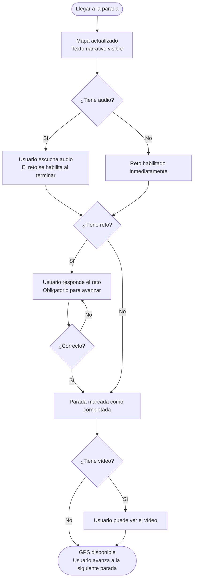

La aplicación soporta **12 idiomas**: español, inglés, francés, italiano, neerlandés, japonés, alemán, chino simplificado, polaco, portugués, ruso y ucraniano.

Actualmente hay **7 aventuras planificadas**, todas disponibles: **Aventuras 1, 2, 3, 4, 5, Fallas y 34km**.

---

## 2. Los modos de la aplicación (CASA y AVENTURA)

La aplicación opera en dos modos fundamentales que determinan el comportamiento de cada componente, cada botón y cada mensaje. El modo activo se almacena en `estado.modo.actual` (string: `'casa'` | `'aventura'`) y se propaga a todos los hijos críticos cada vez que cambia.

**Fuente de verdad del modo** (`globalThis.estadoPadre.modo`, `codigo-padre.html`, línea 3267):

```javascript
// Estado inicial al arrancar
modo: { actual: MODOS.CASA, anterior: null }

// Tras el primer cambio de modo (app.js lo amplía dinámicamente):
modo: {
    actual: 'casa' | 'aventura',
    anterior: 'casa' | 'aventura' | null,
    ultimoCambio: {
        timestamp: Number,
        origen: String,   // hijoId que originó el cambio
        motivo: String,
        opciones: Object
    }
}
```

**Persistencia**: el modo se guarda en `localStorage` como parte del objeto `vv_aventura_iniciada`. Al restaurar una sesión previa, `ejecutarRestauracionAventura()` lo lee y reposiciona el sistema.

---

### 2.1. MODO CASA

**Definición**: estado neutro y punto de partida de la aplicación. El usuario puede navegar por el contenido sin restricciones de posición GPS. No hay validación de distancia ni tracking activo de movimiento.

**Cuándo está activo**:

- Al arrancar la aplicación por primera vez (valor por defecto: `MODOS.CASA`, definido en `js/constants.js` línea 20-23).
- Inmediatamente tras completar las pantallas de demo y recibir `SELECCION.AVENTURA_ACTIVADA`.
- Cuando el usuario desactiva el GPS desde hijo5 estando en AVENTURA.

**Condiciones de estado en MODO CASA**:

- **GPS**: `watchPosition` puede estar activo pero las validaciones de distancia están desactivadas. Los overlays de "fuera de rango" y "siguiente parada" están ocultos.
- **Heartbeat**: detenido. El padre ha enviado `SISTEMA.HEARTBEAT_PAUSE` a sí mismo y a los hijos críticos.
- **Retos**: habilitados o deshabilitados por posición. Padre envía `RETO.ESTADO_CASA` a hijo4 con `{ tipo: 'parada', habilitado: true }` (parada → habilitado) o `{ tipo: 'tramo', habilitado: false }` (tramo → deshabilitado).
- **Navegación**: manual. El usuario selecciona paradas desde hijo5.
- **Audio**: reproducción bajo demanda, no automática.

**Flujo de interacción en MODO CASA**:


---

### 2.2. MODO AVENTURA

**Definición**: modo activo de juego. El GPS rastrea la posición del usuario en tiempo real, el heartbeat monitoriza que todos los hijos estén vivos, y el contenido se habilita automáticamente según la posición detectada.

**Cuándo está activo**:

- Cuando el usuario pulsa el botón GPS en hijo5 estando en MODO CASA.

**Condiciones de estado en MODO AVENTURA**:

- **GPS**: `watchPosition` activo con `enableHighAccuracy: true`, `timeout: 35000ms`, `maximumAge: 0`. Validaciones de distancia activas: radio de 20m por defecto para detectar llegada a una parada.
- **Heartbeat**: activo. Intervalo de 5000ms. Si un hijo falla 3 heartbeats consecutivos, se marca como desconectado y se intenta reconectar automáticamente.
- **Retos**: habilitados tras escuchar el audio de la parada (o inmediatamente si la parada no tiene audio). Padre envía `RETO.HABILITAR` a hijo4 con `{ razon: 'audio_escuchado_1vez' }` o `{ razon: 'sin_audio' }`.
- **Navegación**: automática. Padre detecta la posición GPS y envía `CAMBIO_PARADA` cuando el usuario entra en el radio de una parada o tramo.
- **Audio**: enviado automáticamente al cambiar de parada (`AUDIO.REPRODUCIR_REQUEST` a hijo3).

**Flujo de interacción en MODO AVENTURA**:

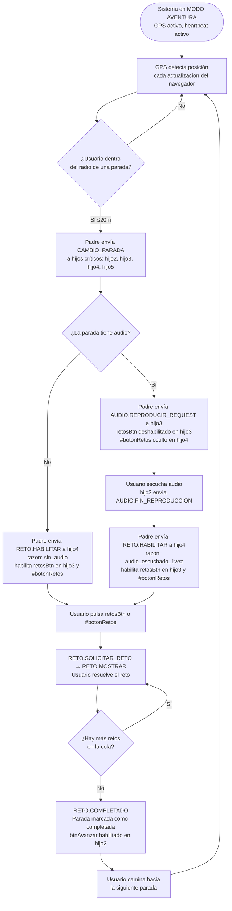

---

### 2.3. Inicialización y arranque

Al arrancar `codigo-padre.html`:

1. El modo inicial es `MODOS.CASA` (hardcoded en estado inicial, línea 3267).
2. Se comprueba si existe `vv_aventura_iniciada` en `localStorage`.
   - Si existe → `ejecutarRestauracionAventura()` (línea 4152) restaura el estado anterior.
   - Si no existe → la app queda en MODO CASA esperando que el usuario complete el flujo de incorporación.
3. En el flujo de incorporación, el padre no carga iframes ni activa GPS hasta que el usuario introduce un código de activación válido en P13 (señal `SELECCION.CODIGO_VALIDADO`). Antes de eso solo anota el idioma y la aventura elegidos en el estado interno.
4. Cuando `SELECCION.CODIGO_VALIDADO` llega: el padre activa el GPS, carga los iframes y distribuye datos — todo en paralelo mientras el usuario lee la normativa vial (P14).
5. Cuando `SELECCION.AVENTURA_ACTIVADA` llega (P16): si los iframes ya están cargados desde P13, el padre salta la recarga y solo sincroniza el estado de aventura. El segundo spin dura exactamente lo que quede de carga.

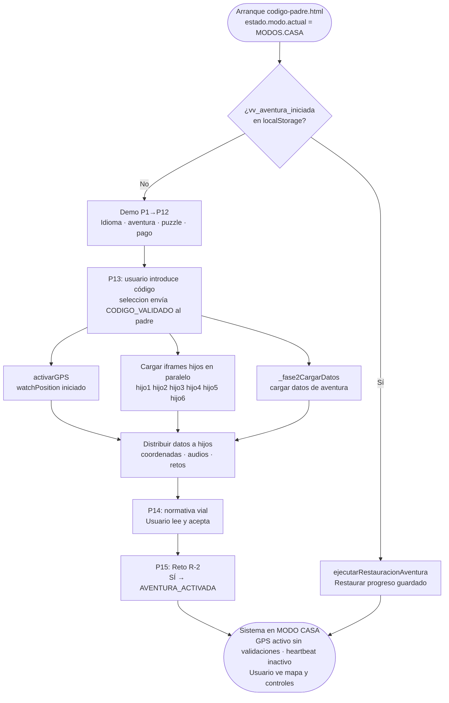

---

### 2.4. Cambio de modo: CASA → AVENTURA

**Disparador**: el usuario pulsa el botón GPS en hijo5. hijo5 envía `SISTEMA.CAMBIO_MODO` con `modo: 'aventura'` al padre.

**Controlador en padre**: `_hdl_SISTEMA_CAMBIO_MODO()` (línea 6019), que delega en `manejarCambioModo(estado, mensaje)` de `js/app.js`.

**Payload de `SISTEMA.CAMBIO_MODO`**:

```javascript
{
    tipo: 'SISTEMA.CAMBIO_MODO',
    origen: CONFIG_PADRE.ID,
    destino: hijoId,   // [hijo2, hijo3, hijo4, hijo5]
    datos: {
        modo: 'aventura',
        timestamp: Date.now(),
        propagadoDesde: 'hijo5',
        razon: 'cambio_modo_global',
        secuenciaCompleta: true
    }
}
```

**Secuencia completa** (`_propagarCambioModoAHijos`, línea 5925; `_activarHeartbeatAventura`, línea 5953):

> **Nota**: la activación de GPS es un flujo paralelo e independiente. Cuando hijo5 pulsa GPS activa, envía además `NAVEGACION.GPS.ACTIVAR` → `_hdl_NAVEGACION_GPS_ACTIVAR` (línea 8495) → `activarGPS()`. El flujo `CAMBIO_MODO` solo gestiona estado, propagación y heartbeat; no toca el watchPosition.

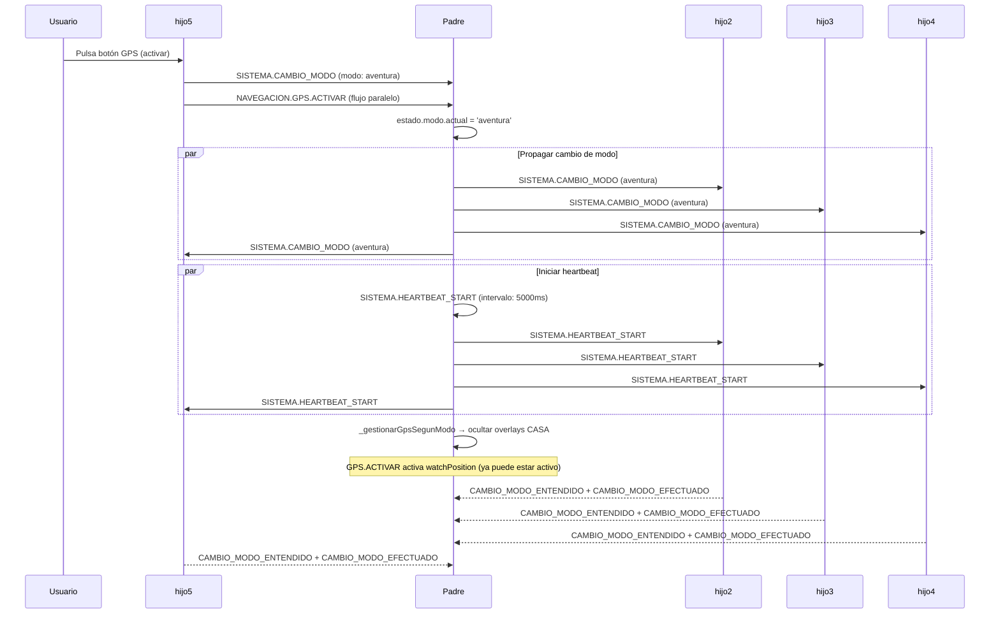

---

### 2.5. Cambio de modo: AVENTURA → CASA

**Disparador**: el usuario pulsa el botón GPS en hijo5 estando en AVENTURA. hijo5 envía `SISTEMA.CAMBIO_MODO` con `modo: 'casa'`.

**Secuencia** (`_transicionarAModoCasa()`):

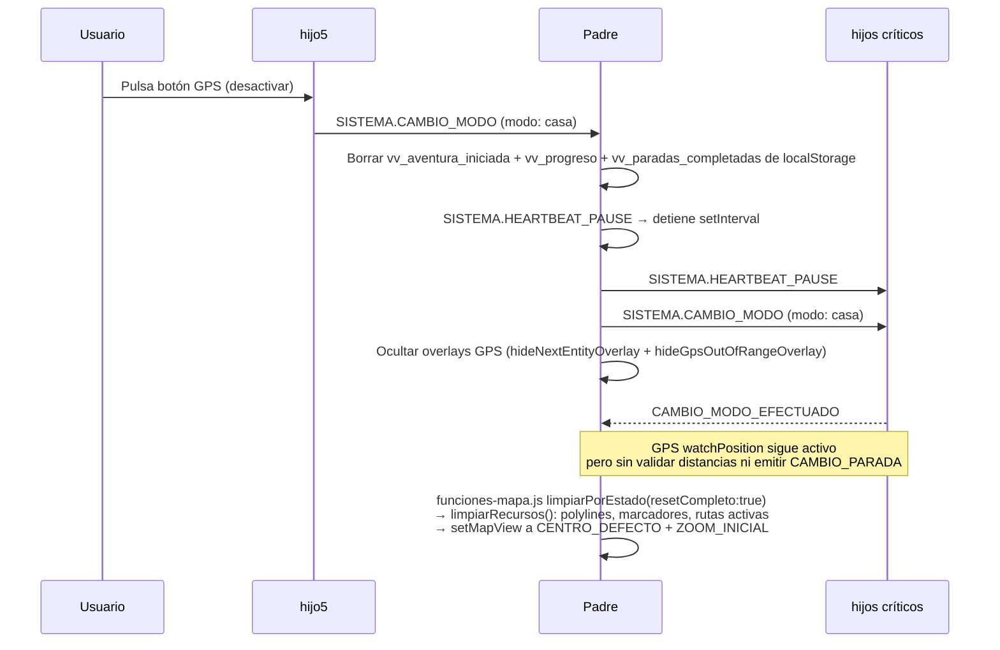

**Implementación de `limpiarPorEstado`**: `cambiarModo()` en `funciones-mapa.js`
asigna `estadoMapa.modo = modo` **antes** de llamar a `limpiarPorEstado`. Sin el
parámetro explícito `resetCompleto: true`, la comprobación interna
`modo !== estadoMapa.modo` siempre sería falsa (ya son iguales) y la rama de
limpieza de capas nunca se ejecutaría. La corrección captura el modo anterior en
`modoAnterior` antes de actualizar el estado:
`limpiarPorEstado({ modo, resetCompleto: modoAnterior !== modo })`.

**Estado en memoria durante CASA**: el borrado de localStorage afecta solo a la
persistencia. El estado en memoria de `codigo-padre.html` (`estadoPadre.paradaActual`,
`paradasCompletadas`, `elementoActual`) **no se limpia** al pasar a CASA. Mientras
el usuario no recargue la página, ese estado sigue presente.

**Retorno a AVENTURA (misma sesión)**: al reactivar el GPS,
`_activarParadaDefectoAventura()` envía `CAMBIO_PARADA` para padre-P-0. El GPS
detectará la posición real del usuario y emitirá el siguiente `CAMBIO_PARADA`
automáticamente. El progreso visual (`paradasCompletadas`) se mantiene desde memoria.

**Retorno a AVENTURA (sesión nueva — app cerrada en CASA)**: el localStorage fue
borrado. El progreso se pierde. No hay mecanismo de recuperación entre sesiones
cuando la app se cierra en modo CASA.

---

### 2.6. GPS: comportamiento según modo

**Parámetros de `watchPosition`** (función `activarGPS()`, línea 4895):

```javascript
navigator.geolocation.watchPosition(onGpsSuccess, onGpsError, {
    enableHighAccuracy: true,   // GPS + A-GPS, máxima precisión
    timeout: 35000,             // 35 s antes de reportar error
    maximumAge: 0               // Sin caché — siempre posición fresca
})
```

| Comportamiento GPS | MODO CASA | MODO AVENTURA |
|--------------------|-----------|---------------|
| `watchPosition` activo | Sí (no se detiene al salir de AVENTURA) | Sí |
| Validación de distancia a paradas | No | Sí (radio ~20m) |
| `CAMBIO_PARADA` automático | No | Sí, al entrar en radio |
| Overlay "fuera de rango" | Oculto | Visible si >50m de la ruta |
| Snap-to-route en tramos | No | Sí (`activarFlechaUsuario()`) |
| Marcador del usuario en mapa | 🛸 | ▲ triángulo azul `#4285F4`, rota con brújula |

**Ciclo de vida del GPS**:

El permiso GPS se solicita en P13 (cuando el usuario introduce el código de activación), no antes. Hasta ese momento `watchPosition` está inactivo aunque el usuario haya seleccionado la aventura.

Si en ese momento el permiso ya está denegado (`navigator.permissions.query` devuelve `'denied'`), la función `_irANormativa()` en selección muestra un aviso local en P13 y el usuario no avanza hasta resolver el permiso desde los ajustes del navegador. Si el permiso es `'prompt'` o `'granted'`, `activarGPS()` en el padre inicia `watchPosition` y la carga de iframes prosigue en paralelo. Si GPS lanza PERMISSION_DENIED en `_watchPositionError`, el padre limpia `watchId`, muestra `imagen-no-gps.png` sobre toda la pantalla con el botón 🛰️→🌐→⚙️, y el usuario no puede continuar hasta ir a los ajustes del sistema y pulsar de nuevo el botón (que llama `activarGPS()` desde el overlay).

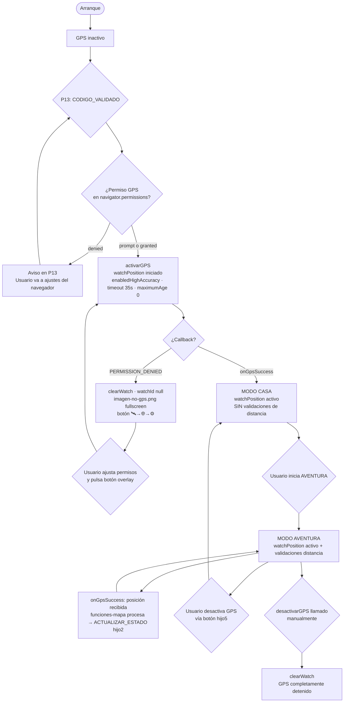

---

### 2.7. Heartbeat: monitorización de hijos

Solo activo en **MODO AVENTURA**. Detecta hijos colgados o desconectados.

**Configuración** (`js/config.js`):

- Intervalo: **5000 ms** (5 segundos)
- Máximo de fallos consecutivos antes de marcar como desconectado: **3**
- `AUTO_RECONECTAR: true` → recarga el iframe automáticamente

**Mensajes del heartbeat** (`js/constants.js`):

| Mensaje | Dirección | Significado |
|---------|-----------|-------------|
| `SISTEMA.HEARTBEAT_START` | padre → hijo | Iniciar ciclo de heartbeat |
| `SISTEMA.HEARTBEAT` | padre → hijo | Latido — "¿sigues vivo?" |
| `SISTEMA.HEARTBEAT_RESPONSE` | hijo → padre | "Sigo vivo" |
| `SISTEMA.HEARTBEAT_PAUSE` | padre → hijo | Detener heartbeat (al pasar a MODO CASA) |

**Flujo del heartbeat**:

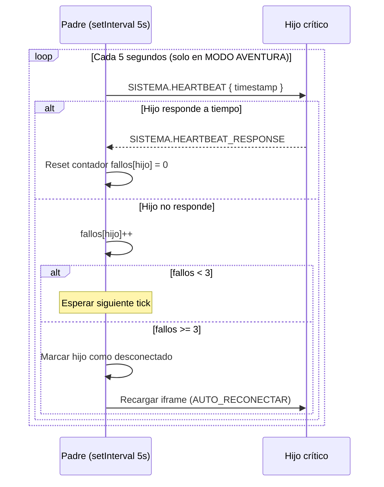

---

### 2.8. Controladores y funciones de cambio de modo

**Controladores registrados en `codigo-padre.html`**:

| Controlador | Línea | Tipo de mensaje | Qué hace |
|-------------|-------|-----------------|----------|
| `_hdl_SISTEMA_CAMBIO_MODO` | 6019 | `SISTEMA.CAMBIO_MODO` | Recibe petición, delega en `manejarCambioModo()` |
| Heartbeat handler | 6050 | `SISTEMA.HEARTBEAT` | Responde con `HEARTBEAT_RESPONSE` |
| `HEARTBEAT_RESPONSE` handler | 6098 | `SISTEMA.HEARTBEAT_RESPONSE` | Resetea contador de fallos del hijo |
| `CAMBIO_MODO_RESPONSE` handler | 6166 | `SISTEMA.CAMBIO_MODO_RESPONSE` | Actualiza estado del hijo en el padre |
| `_hdl_NAVEGACION_GPS_ACTIVAR` | 8495 | `NAVEGACION.GPS.ACTIVAR` | Activa watchPosition en modo AVENTURA |

**Funciones internas clave**:

| Función | Línea | Qué hace |
|---------|-------|----------|
| `manejarCambioModo(estado, mensaje)` | `js/app.js` | Orquesta la secuencia completa |
| `_propagarCambioModoAHijos()` | 5925 | Envía `CAMBIO_MODO` a cada hijo crítico |
| `_gestionarHeartbeatSegunModo()` | 5993 | Inicia o pausa heartbeat según el modo |
| `_activarHeartbeatAventura()` | 5953 | Envía `HEARTBEAT_START` a padre e hijos |
| `_transicionarAModoCasa()` | — | Limpia localStorage de progreso, pausa heartbeat y notifica a los hijos |
| `_gestionarGpsSegunModo()` | 6015 | Gestiona overlays GPS según modo (no toca watchPosition) |
| `activarGPS()` | 4895 | Inicia `watchPosition` (con mutex anti-duplicado) |
| `desactivarGPS()` | 4982 | Llama `clearWatch()` |
| `ejecutarRestauracionAventura()` | 4152 | Restaura sesión desde `localStorage` |
| `cambiarModo(modo)` | `js/funciones-mapa.js` | Captura `modoAnterior`, actualiza `estadoMapa.modo` y llama `limpiarPorEstado`. El orden de operaciones es crítico: `modoAnterior` debe capturarse **antes** de mutar `estadoMapa.modo`. |
| `limpiarPorEstado({ modo, resetCompleto })` | `js/funciones-mapa.js` | Elimina capas Leaflet activas (polylines, marcadores, rutas) y restablece la vista a `CENTRO_DEFECTO` / `ZOOM_INICIAL`. `resetCompleto:true` es obligatorio cuando se llama tras un cambio de modo, porque en ese punto `estadoMapa.modo` ya fue actualizado y la comprobación interna fallaría sin el flag explícito. |

---

### 2.9. Tabla comparativa: comportamiento de cada hijo por modo

| Hijo | MODO CASA | MODO AVENTURA |
|------|-----------|---------------|
| **hijo1** `extrainfo-hijo1.html` | Disponible, sin cambios. | Disponible, sin cambios. No tiene lógica específica de modo. |
| **hijo2** `coordenadas-hijo2.html` | Sin Leaflet — el mapa lo gestiona el padre. 6 botones de navegación activos. Sin validaciones de distancia. Sin overlay fuera de rango. Sin `CAMBIO_PARADA` automático. | Sin Leaflet — el mapa lo gestiona el padre. Detecta proximidad GPS a paradas/tramos. Overlay `#fuera-rango-overlay` activo si el usuario se aleja. `CAMBIO_PARADA` automático cuando `distancia ≤ RADIO_PARADA`. |
| **hijo3** `audio-hijo3.html` | Reproducción bajo demanda. `retosBtn` **habilitado inmediatamente** si la parada tiene `reto_id`; deshabilitado en tramos o paradas sin reto. | Audio enviado automáticamente al llegar a cada parada (`AUDIO.REPRODUCIR_REQUEST`). `retosBtn` habilitado tras `FIN_REPRODUCCION` (o inmediatamente si sin audio). |
| **hijo4** `retos-hijo4.html` | `#botonRetos-wrapper` visible. Habilitado en paradas, deshabilitado en tramos, controlado por `RETO.ESTADO_CASA`. | `#botonRetos-wrapper` oculto al llegar a una parada. Aparece y se habilita al recibir `RETO.HABILITAR` (tras audio o `razon: sin_audio`). |
| **hijo5** `boton-casa-hijo5.html` *(desarrollo)* | Botón GPS en rojo "OFF". Lista de paradas navegable manualmente. | Botón GPS en verde "ON". Lista de paradas actualizada automáticamente según progresión GPS. |
| **hijo6** `chat-hijo6.html` | Disponible sin cambios. | Disponible sin cambios. |

**Mensajes recibidos por cada hijo al cambiar de modo**:

| Hijo | → AVENTURA | → CASA |
|------|-----------|--------|
| hijo1 | `SISTEMA.CAMBIO_MODO` | `SISTEMA.CAMBIO_MODO` |
| hijo2 | `SISTEMA.CAMBIO_MODO` + `SISTEMA.HEARTBEAT_START` | `SISTEMA.CAMBIO_MODO` + `SISTEMA.HEARTBEAT_PAUSE` |
| hijo3 | `SISTEMA.CAMBIO_MODO` + `SISTEMA.HEARTBEAT_START` | `SISTEMA.CAMBIO_MODO` + `SISTEMA.HEARTBEAT_PAUSE` |
| hijo4 | `SISTEMA.CAMBIO_MODO` + `SISTEMA.HEARTBEAT_START` | `SISTEMA.CAMBIO_MODO` + `SISTEMA.HEARTBEAT_PAUSE` |
| hijo5 | `SISTEMA.CAMBIO_MODO` + `SISTEMA.HEARTBEAT_START` | `SISTEMA.CAMBIO_MODO` + `SISTEMA.HEARTBEAT_PAUSE` |
| hijo6 | `SISTEMA.CAMBIO_MODO` | `SISTEMA.CAMBIO_MODO` |

> El heartbeat es dinámico: `enviarHeartbeatAHijos()` en `mensajeria.js` usa `_hijosRegistrados` (Map poblado por cada `HIJO_PREPARADO`). Todos los hijos — incluidos hijo1, hijo6 y la pantalla de selección — reciben el pulso una vez registrados. `HEARTBEAT_START`/`PAUSE` se envían desde `codigo-padre.html` a hijo2/3/4/5 explícitamente (estos son los hijos con estado heartbeat en modo aventura).

---

## 3. Cómo funciona a vista de pájaro

Imagina la aplicación como una **pila de transparencias**. La pantalla principal (`codigo-padre.html`, el "padre") es el proyector, y cada transparencia es un iframe que se superpone sobre los demás. Varios pueden estar activos simultáneamente — unos visibles, otros invisibles pero escuchando mensajes.

El padre es el único que tiene visión global del sistema. Conoce el modo actual, el progreso de la aventura, las coordenadas de cada parada y el estado de todos los hijos. Los hijos solo conocen su propio dominio (el mapa, el audio, los retos...) y se comunican hacia arriba, al padre, que decide qué hacer con esa información.

### 3.1. La pila de iframes (orden z-index)

```text
┌────────────────────────────────────────────────────┐
│                codigo-padre.html                    │
│                (orquestador central)                │
│                                                     │
│  ▲ z-index más alto                                 │
│  │                                                  │
│  │  ┌─────────────────────────────────────────┐     │
│  │  │ boton-casa-hijo5.html  [DEV]            │     │
│  │  │ herramienta de desarrollo — no en PWA  │     │ ← simula navegación en modo CASA desde escritorio
│  │  └─────────────────────────────────────────┘     │
│  │  ┌─────────────────────────────────────────┐     │
│  │  │ retos-hijo4.html                        │     │ ← visible SOLO cuando el usuario inicia un reto
│  │  │ extrainfo-hijo1.html                    │     │ ← panel lateral de opciones extra
│  │  │ chat-hijo6.html  (carga lazy, 1er uso)  │     │ ← asistente de soporte FAQ
│  │  └─────────────────────────────────────────┘     │
│  │  ┌─────────────────────────────────────────┐     │
│  │  │ audio-hijo3.html  (invisible, siempre   │     │
│  │  │  activo en segundo plano)               │     │ ← solo reproduce audio, nunca visible
│  │  └─────────────────────────────────────────┘     │
│  │  ┌─────────────────────────────────────────┐     │
│  │  │ coordenadas-hijo2.html  (GPS + botones) │     │ ← siempre visible durante la aventura
│  │  └─────────────────────────────────────────┘     │
│  ▼ z-index más bajo                                 │
│                                                     │
│  Al inicio, En-busca-del-tesoro.html cubre          │
│  toda la pantalla (z-index máximo). Contiene        │
│  puzzle.html como sub-iframe propio — NO es         │
│  un hijo directo del padre.                         │
└────────────────────────────────────────────────────┘
```

**Notas sobre visibilidad**:

- `hijo3` (audio) nunca es visible — existe solo para reproducir audio en segundo plano.
- `hijo4` (retos) solo se hace visible cuando el padre llama `mostrarHijo4()` al recibir `RETO.SOLICITAR_RETO`. Al cerrarse el reto vuelve a `display:none`.
- `hijo6` (chat) se carga de forma lazy — solo se inicializa la primera vez que el usuario lo abre.
- `hijo5` es una herramienta de desarrollo exclusiva; no forma parte de la PWA real.

### 3.2. Arquitectura de comunicación

Los hijos **nunca se hablan entre sí directamente** — toda comunicación pasa por el padre mediante `postMessage`. El padre actúa como bus de mensajes central: recibe notificaciones de los hijos, toma decisiones y envía órdenes de vuelta.

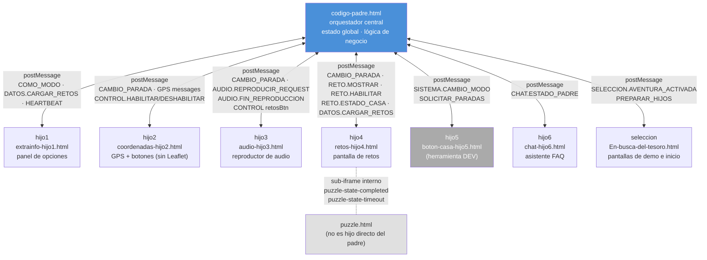

> Para el detalle de cada mensaje, controladores, payloads y comportamiento por modo ver **§2** y **§8**.

### 3.3. Ciclo de vida completo de una sesión

Este es el arco completo desde que el usuario abre la app hasta que completa la aventura:

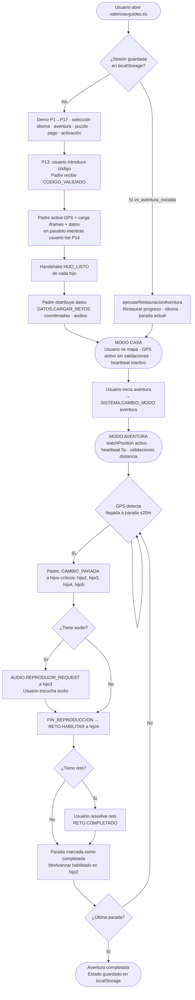

### 3.4. Modo CASA vs modo AVENTURA — qué cambia

La app siempre arranca en **modo CASA** (`estado.modo.actual = 'casa'`). El usuario pasa a **modo AVENTURA** cuando activa el GPS desde hijo5. Desde ese momento, el padre gestiona los dos modos de forma radicalmente diferente. La misma acción — cambiar de parada — produce efectos distintos según el modo activo.

**Resumen ejecutivo:**

| | Modo CASA | Modo AVENTURA |
|--|-----------|---------------|
| **GPS** | Activo (`watchPosition` continuo), sin validaciones de distancia | Activo (`watchPosition` continuo) + validaciones de distancia activas |
| **Heartbeat** | Pausado | Activo cada ~5 s |
| **Quién cambia de parada** | El usuario — pulsa una parada en hijo5 | El GPS — el padre detecta llegada (≤ 20 m) |
| **`retosBtn` al llegar a una parada** | Se habilita **inmediatamente** si la parada tiene reto | Arranca **deshabilitado** — se habilita solo cuando termina el audio |
| **Botón vídeo/dron (`#btn-video`)** | Habilitado inmediatamente si el elemento es tramo | Habilitado si elemento es tramo Y reto no activo |
| **Audio** | No se reproduce automáticamente | Se lanza solo al llegar a cada parada |
| **Botón "Avanzar" (hijo2)** | Sin efecto — no hay progresión automática por GPS | Se bloquea al entrar en cada parada; se desbloquea al completar audio + reto |
| **Polylines y marcadores del mapa** | Visibles **inmediatamente** tras dibujar | Ocultos (opacity 0) — se revelan cuando el usuario pulsa btn-avanzar (`pendingRevealNavegacion`) |

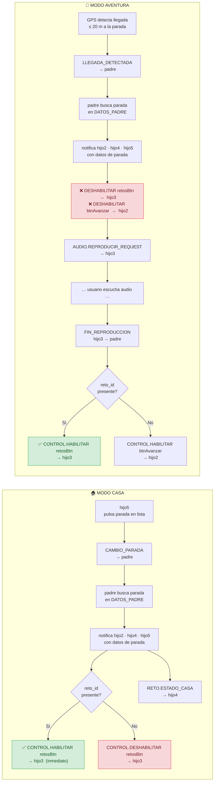

**Flujo CAMBIO_PARADA en modo CASA** — mensajes exactos cuando el usuario pulsa una parada en hijo5:

```text
hijo5  →  CAMBIO_PARADA { paradaId: "padre-P0" }  →  padre
padre  →  busca parada en DATOS_PADRE
padre  →  CAMBIO_PARADA { parada, coordenadas, audio_id, reto_id }  →  hijo2, hijo3, hijo4, hijo5
padre  →  CONTROL.HABILITAR { control: 'retosBtn' }  →  hijo3   ← inmediato si tiene reto_id
padre  →  RETO.ESTADO_CASA { habilitado: true }  →  hijo4         ← si es parada (no tramo)
```

**Flujo CAMBIO_PARADA en modo AVENTURA** — mensajes exactos cuando el GPS detecta llegada:

```text
hijo2  →  LLEGADA_DETECTADA { paradaId }  →  padre
padre  →  busca parada en DATOS_PADRE
padre  →  CAMBIO_PARADA { parada, coordenadas, audio_id, reto_id }  →  hijo2, hijo3, hijo4, hijo5
padre  →  CONTROL.DESHABILITAR { control: 'retosBtn' }  →  hijo3  ← bloqueado hasta audio
padre  →  CONTROL.DESHABILITAR { control: 'btnAvanzar' }  →  hijo2
padre  →  AUDIO.REPRODUCIR_REQUEST { audioId }  →  hijo3
     ... [usuario escucha audio] ...
hijo3  →  AUDIO.FIN_REPRODUCCION  →  padre
padre  →  CONTROL.HABILITAR { control: 'retosBtn' }  →  hijo3    ← ahora sí se habilita
```

> Para los detalles técnicos de `_configurarRetoBtn`, la búsqueda de paradas en `DATOS_PADRE` y la precedencia de IDs ver **§5** y **§6**.

---

## 4. Iconografía visual: emojis, marcadores y polylines

> Referencia rápida de todos los elementos visuales que el usuario ve durante la aventura: emojis en la interfaz, marcadores en el mapa y líneas de ruta.

### 4.1. Emojis en las pantallas de selección (En-busca-del-tesoro.html)

Estos emojis aparecen durante las 17 pantallas de demo/selección, antes de que comience la aventura.

| Emoji | Dónde aparece | Para qué sirve |
|-------|---------------|-----------------|
| → | Botones de avanzar/confirmar (P1, P4, P5, P9, P11, P12, P16) | Flecha de navegación "ir a la siguiente pantalla" |
| ➜ | Botón grande del puzzle (P6) | Flecha gruesa para continuar tras completar el puzzle |
| ✓ | Feedback de código correcto (P13) | Indicar código de activación correcto |
| ✗ | Botones rojos de rechazo (P3, P9), feedback de código incorrecto (P13) | Cancelar selección o indicar respuesta incorrecta |
| 🎬 | Pantalla de vídeo stub (P4) | Placeholder fijo de video introductorio |
| 💳 | Pantalla de pago (P12) | Icono de la pasarela de pago (aún no implementada) |
| 🔑 | Pantalla de activación (P13) | Indica que se necesita un código de acceso |
| ✒️ | Pantalla de activación (P13) | Acompañamiento visual del campo de entrada |
| ❓ | Pantalla de activación (P13) | Indica ayuda o instrucciones |
| 🚀 | Botón de iniciar aventura (P13) | Avanza a P14 (normativa); la aventura se lanza al aceptar en P15 |
| 🔇 | Overlay de aviso (confirmación en P9) | Indica que no hay audio disponible para la combinación idioma+aventura |

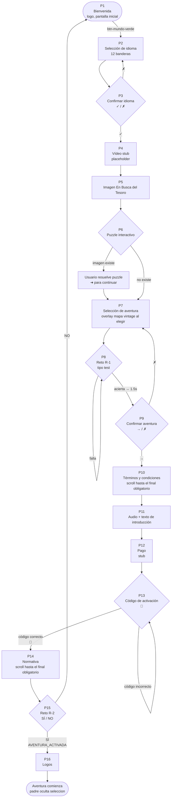

### 4.2. Emojis en los botones de selección de aventura (P7)

Cada aventura muestra una línea de estadísticas con emojis universales (no necesitan traducción):

| Emoji | Significado | Ejemplo |
|-------|-------------|---------|
| 👣 | Vehículo: a pie | Aventuras 1, 2 y Fallas |
| 🚲 | Vehículo: bicicleta | Aventuras 3, 4 y 5 |
| 🛴 | Vehículo: patinete | Aventuras 3, 4 y 5 (combinado con 🚲) |
|🏛️  🚲🛴👣 | Vehículo: mixto | Aventura 34km |
| | Número de monumentos | `🏛️19` = 19 monumentos |
| 📍 | Número de paradas | `📍41` = 41 paradas |
| 🧩 | Número de retos | `🧩30` = 30 retos |
| ⏳ | Tiempo máximo para completar | `⏳max60h` = 60 horas |

### 4.3. Emojis durante la aventura activa

Una vez en modo AVENTURA, estos emojis aparecen en la interfaz:

| Emoji | Componente | Para qué sirve |
|-------|------------|-----------------|
| ✖ | Hijo 2 (overlay fuera de rango) | Botón para cerrar el aviso de "estás fuera de rango" |
| 🔄 | Puzzle (puzzle.html) | Reiniciar el puzzle |
| ⏸️ / ▶️ | Puzzle (puzzle.html) | Pausar / reanudar el puzzle |
| ↑ | Mapa (funciones-mapa.js) | Flecha snap-to-route proyectada sobre la polyline del tramo activo |

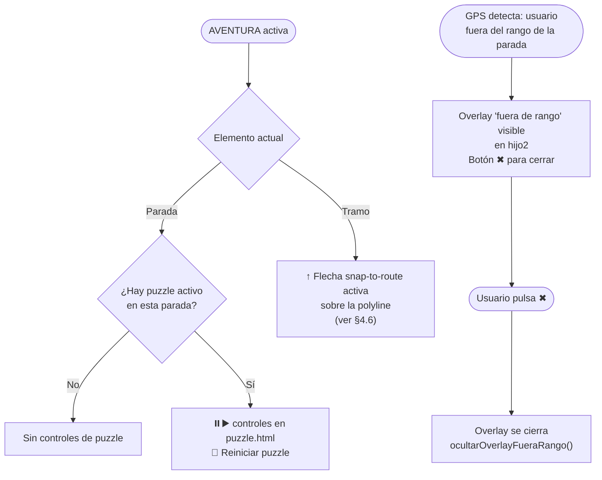

### 4.3b. Emojis en hijo5 (herramienta de desarrollo — no visible en la PWA final)

`boton-casa-hijo5.html` es una herramienta exclusiva de desarrollo para simular el modo CASA desde el escritorio. No aparece en la PWA real.

| Emoji | Componente | Para qué sirve |
|-------|------------|-----------------|
| 🛰️ | Hijo 5 (botón casa) | Botón de activación/desactivación del GPS. Muestra "ON" (verde) en aventura, "OFF" (rojo) en casa |
| 🎯 | Hijo 5 (lista de paradas) | Identifica las **paradas** (puntos de interés) en la lista lateral |
| 🛣️ | Hijo 5 (lista de paradas) | Identifica los **tramos** (caminos entre paradas) en la lista lateral |
| 📌 | Hijo 5 (lista de paradas) | Identifica el **punto de inicio** de la ruta |
| ? | Hijo 5 (lista de paradas) | Tipo de punto desconocido (fallback, texto plano, clase `default-btn`) |

### 4.4. Emojis en los retos (hijo 4)

| Emoji / Elemento | Cuándo aparece | Significado |
|-------------------|----------------|-------------|
| Borde **verde** | Al acertar un reto | Respuesta correcta |
| Borde **rojo** | Al fallar un reto | Respuesta incorrecta |
| Animación de **fuegos artificiales** (chispas de colores) | Al acertar | Celebración visual. 15 explosiones con 30 chispas cada una |
| Vibración del móvil (300 ms) | Al fallar | Feedback háptico de error |
| 🆘❓ Botón SOS (`#btnMostrarRespuesta`) | Siempre visible | Muestra/oculta el panel con la respuesta correcta. Segunda pulsación lo esconde |
| 🌍 Botón continuar (`#btnNextAfterReto`) **deshabilitado** | Antes de acertar | `.btn-mundo-verde:disabled` — `opacity: 0.35`, `cursor: not-allowed`, elementos orbita detenidos. No interactivo hasta respuesta correcta |
| 🌍 Botón continuar (`#btnNextAfterReto`) **verde brillante** | Después de acertar | `.btn-mundo-verde` habilitado, con elementos orbitando (➣ 🎯) en animación continua |
| 🌍 Botón puzzle (`#btn-puzzle-continuar`) | Cuando el puzzle se completa | Mismo estilo `.btn-mundo-verde` con orbiting; oculto hasta que `puzzle.html` envía `puzzle-state-completed` |


### 4.5. Marcadores en el mapa

El mapa usa emojis y formas coloreadas como marcadores sobre las paradas:

| Marcador | Forma | Color | Cuándo aparece |
|----------|-------|-------|----------------|
| 📌 | Emoji chincheta | — | **Punto de inicio** de la ruta |
| 🎯 | Emoji diana | — | **Paradas** (puntos de interés) y **punto final** de la ruta |
| ● (círculo CSS) | Círculo sólido con borde blanco y sombra | `#F44336` rojo | Marcador de inicio alternativo |
| ● (círculo CSS) | Círculo sólido con borde blanco y sombra | `#4CAF50` verde | Marcador de parada alternativo |
| ▲ (flecha GPS) | Triángulo CSS con borde blanco y punto central pulsante | `#4285F4` azul Google | **Posición real del usuario** en tiempo real (modo AVENTURA). Rota con la brújula del dispositivo vía `DeviceOrientationEvent` (hasta 30 veces/segundo sin recrear el marcador). En modo CASA aparece como 🛸 |
| ↑ (flecha snap-to-route) | Carácter `↑` rotado según brújula | `#0066cc` azul oscuro | **Posición del usuario proyectada sobre la polyline del tramo activo.** Solo aparece durante un tramo (no en paradas). Usa `L.GeometryUtil.closest()` para buscar el punto de la polyline más cercano al usuario y pone la flecha exactamente ahí — efecto "sigues el camino". Se activa en `completarCambioParada()` al detectar `tipo === 'tramo'` y se desactiva al volver a una parada. Se actualiza en cada posición GPS y en cada cambio de brújula |
| ○ (círculo 21 m) | Círculo `L.circle` radio 21 m | Borde rojo, relleno amarillo semitransparente | Acompaña siempre a la flecha snap-to-route. Indica la zona de tolerancia visual alrededor del punto proyectado |
| 🏛️ (píldora referencia) | Div CSS: píldora blanca con borde naranja | `#ff8c00` naranja | **Referencias visuales** — monumentos mencionados en el texto que el usuario nunca visita físicamente. Muestra el emoji 🏛️ a la izquierda y el número de `mapa_numero` a la derecha. Al pulsar abre un popup con el nombre del monumento. Escala dinámicamente con el zoom. `zIndexOffset: 400` (por debajo de paradas visitadas). Gestionado por `crearIconoReferencia()` y `dibujarReferencias()` en `funciones-mapa.js` |

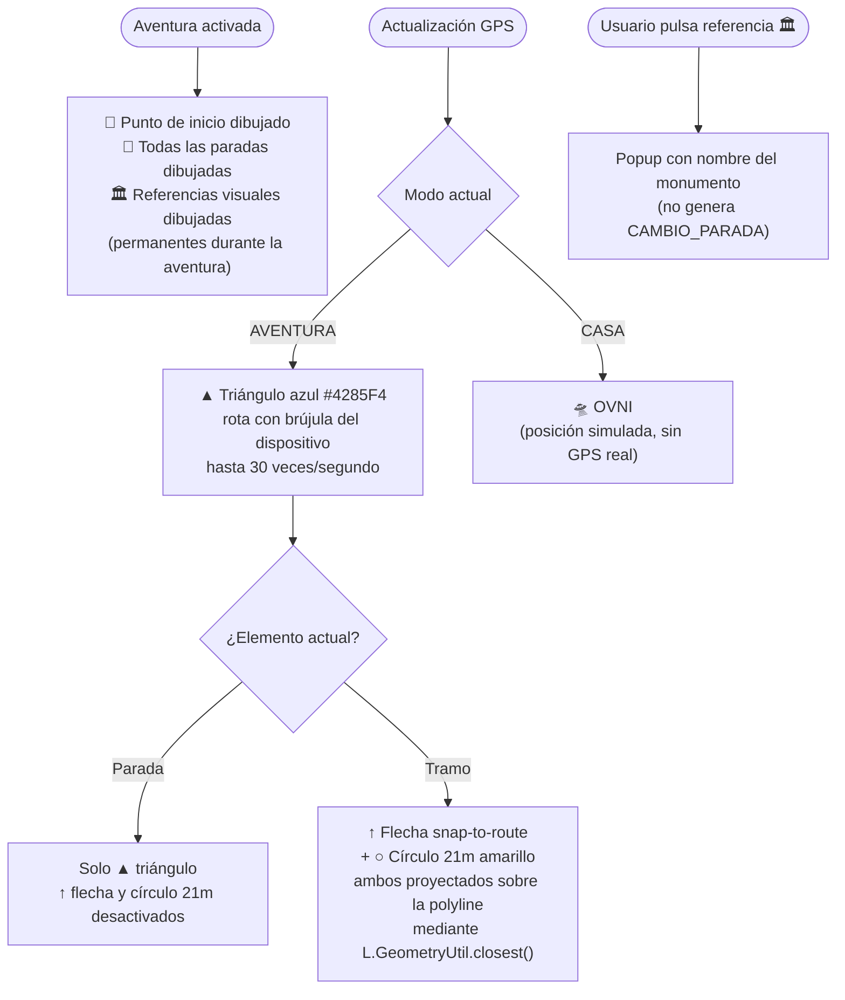

### 4.6. Polylines (líneas de ruta en el mapa)

Las polylines son las líneas que se dibujan en el mapa para mostrar rutas, tramos y navegación. Sus estilos varían según el tipo:

| Tipo de polyline | Color | Grosor base | Opacidad | Patrón | Cuándo se dibuja |
|-----------------|-------|-------------|----------|--------|------------------|
| **Ruta principal** | `#0077ff` (azul) | 6 px | 0.8 | Sólido | Al activar la aventura. Muestra todo el recorrido completo |
| **Tramo normal** | `#3388ff` (azul claro) | 4 px | 0.7 | Sólido | Al seleccionar un tramo específico entre dos paradas |
| **Tramo destacado** | `#ff4500` (naranja-rojo) | 6 px | 0.9 | Sólido | Cuando un tramo está activo o enfatizado (el actual) |
| **Línea de navegación** | `#3388ff` (azul claro) | 2 px | 0.7 | Discontinuo `10, 10` | Cuando el usuario está a más de 50 m de la ruta. Muestra el camino de vuelta |

**Escalado dinámico:** Todos los grosores se multiplican por un factor de escala que depende del tamaño de la pantalla y el nivel de zoom del mapa. La función `getPolylineEscalado()` calcula los valores finales.

**Comportamiento automático:**

- La **polyline de navegación** aparece automáticamente cuando el usuario se aleja más de 50 metros de la ruta. Incluye los waypoints intermedios del tramo para guiar al usuario por el camino correcto (no en línea recta).
- Se **elimina automáticamente** cuando el usuario vuelve a estar dentro de los 50 metros.
- También se puede activar **manualmente**: el usuario pulsa `btn-ubicacion` en hijo2, que envía `NAVEGACION.MOSTRAR_UBICACION_POLYLINE` `{ ubicacionUsuario, proximoElemento, centrar: true, zoom: 16 }` al padre. El padre dibuja la misma polyline discontinua desde la posición actual hasta la próxima parada.
- Todas las polylines se posicionan con `zIndex 500` para aparecer por encima del mapa base pero por debajo de los marcadores.

**Snap-to-route (flecha sobre la polyline):**

Cuando el padre cambia a un **tramo** (via `CAMBIO_PARADA` con `tipo === 'tramo'`), `completarCambioParada()` en `funciones-mapa.js`:

1. Guarda los puntos del tramo (inicio + waypoints intermedios + fin) en `estadoMapa.tramoWaypoints`.
2. Setea `estadoMapa.tramoActual` con el ID del tramo.
3. Llama a `activarFlechaUsuario()`, que registra un listener `zoomend` y pone `flechaActiva = true` (solo si el modo es `AVENTURA`).

Con `flechaActiva = true`, `actualizarPosicionFlecha()` se ejecuta en cada actualización GPS y en cada cambio de brújula. Calcula con `L.GeometryUtil.closest()` el punto de `estadoMapa.tramoWaypoints` más cercano al usuario y mueve la flecha `↑` y el círculo de 21 m exactamente a ese punto.

Cuando el padre cambia a una **parada**, `completarCambioParada()` llama a `desactivarFlechaUsuario()`: borra la flecha y el círculo del mapa, desregistra el listener `zoomend` y pone `flechaActiva = false`.

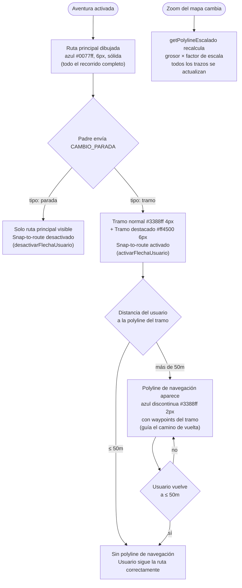

### 4.6b. Navegación guiada paso a paso (turn-by-turn) — decisión de diseño

**Estado: parcialmente implementado. Detenido intencionalmente.**

La app dispone de todos los datos necesarios para implementar instrucciones paso a paso tipo "gira a la derecha en 50 metros": los tramos tienen `waypoints` con coordenadas exactas de cada giro, el GPS actualiza posición en tiempo real, y `estadoMapa.tramoWaypoints` contiene la lista de puntos del tramo activo con sus coordenadas.

**Razón por la que no se ha terminado**: El modelo de experiencia elegido prioriza la exploración libre. El usuario ve la polyline completa del recorrido, la polyline de navegación de vuelta cuando se aleja de la ruta, y la flecha snap-to-route en los tramos. Eso es suficiente orientación sin imponer un camino rígido. Las instrucciones tipo GPS ("gira aquí") harían la aventura mecánica y reduciría el placer de descubrir el camino.

**Lo que está implementado hoy:**

| Elemento | Implementado | Descripción |
|---|---|---|
| Polyline de ruta completa | ✅ | Se dibuja al activar la aventura |
| Polyline de navegación (vuelta) | ✅ | Aparece si usuario se aleja >50 m |
| Flecha snap-to-route | ✅ | Solo en tramos; sigue el waypoint más cercano |
| Detección de proximidad a parada | ✅ | Radio configurable por aventura |
| Distancia al destino (en hijo2) | ✅ | Se actualiza con cada GPS |

**Lo que faltaría para turn-by-turn completo:**

1. Función que calcule la instrucción de giro: leer ángulo entre waypoints consecutivos de `estadoMapa.tramoWaypoints` y determinar "recto / izquierda / derecha" según la posición del usuario.
2. Umbral de activación: disparar la instrucción cuando el usuario esté a X metros del waypoint de giro.
3. Tipo de mensaje nuevo (`NAVEGACION.INSTRUCCION_TURNO`) para enviar la instrucción a hijo2 o al padre.
4. UI en hijo2 (o banner en el padre) que muestre la instrucción.
5. Opcional: síntesis de voz con `speechSynthesis` en hijo3 o en padre.

Si se decide implementar en el futuro, el punto de entrada natural es `actualizarPosicionFlecha()` en `funciones-mapa.js`, que ya se ejecuta en cada actualización GPS y tiene acceso a `estadoMapa.tramoWaypoints` y `estadoMapa.posicionUsuario`.

### 4.7. Botones del hijo 2 (coordenadas) — iconos por imagen

Los 6 botones del panel de `coordenadas-hijo2.html` no usan emojis sino imágenes PNG. Orden en el HTML (de arriba a abajo):

| ID | Imagen PNG | Mensaje enviado al padre | Acción |
|----|-----------|--------------------------|--------|
| `btn-mapa-completo` | `H2-fotomapa-moderno.png` | `NAVEGACION.MOSTRAR_MAPA_COMPLETO` `{ formato: 'html', url: 'mapa-completo.html?aventura=X' }` | Abre el mapa interactivo completo en overlay |
| `btn-mapa-jpg` | `H2-fotomapa-vintage.png` | `NAVEGACION.MOSTRAR_MAPA_VINTAGE` `{ formato: 'jpg', url: <urlMapaVintage> }` | Abre el JPG del mapa vintage de la aventura actual |
| `btn-video` | `H2-fotodron.png` | `_reproducirVideoParada()` (interno) | Solo disponible en **tramos**. Reproduce el vídeo de dron del tramo. Deshabilitado en paradas |
| `btn-imagen` | `H2-fotoproximo-monumento.png` | `UI.ACCION_USUARIO` `{ accion: 'mostrar-imagen', paradaActual, urlImagen, imagenes[], tipo, mapa_numero }` | Abre imagen o galería del monumento de la parada actual. **Siempre habilitado** en MODO AVENTURA: no se deshabilita con `fueraDeRango5min === true` (el usuario necesita ver qué está buscando), ni cuando el reto o el vídeo están activos (cubren toda la pantalla y el botón queda tapado). Solo se deshabilita cuando el padre envía `CONTROL.DESHABILITAR { control: 'btnImagen' }` |
| `btn-avanzar` | `fotoruta-A-B.png` | `NAVEGACION.GPS.ACTIVAR` `{ activar: bool, idParada, distancia }` | Botón de progresión y revelación de navegación. **En paradas** (completada: audio + reto): habilitado por el padre vía `CONTROL.HABILITAR { control: 'btnAvanzar', razon: 'parada_completada' }`. Al pulsar: establece `estado.pendingRevealNavegacion = true` y llama `progresarSiguienteElemento()` — el siguiente `CAMBIO_PARADA` muestra de inmediato la navegación del nuevo elemento. **En tramos**: habilitado por GPS cuando el usuario está a 5-50 m del inicio del tramo. Al pulsar: llama `revelarNavegacion()` directamente (polyline + 📌 + 🎯 ya estaban cargados pero ocultos). El GPS auto-avanza cuando el usuario llega al final del tramo. El tracking GPS **nunca se detiene** |
| `btn-ubicacion` | `H2-fotodistancia.png` | `NAVEGACION.MOSTRAR_UBICACION_POLYLINE` `{ ubicacionUsuario, proximoElemento, centrar: true, zoom: 16 }` | Muestra polyline de navegación desde posición actual hasta próxima parada. Cierra el overlay fuera de rango si estaba visible |

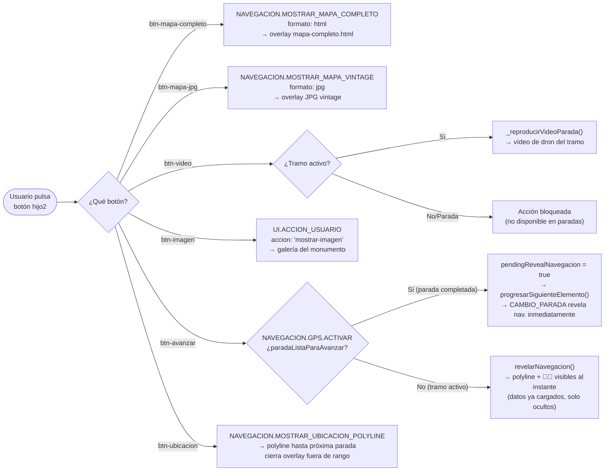

### 4.7b. Imagen de error GPS — overlay del padre

El archivo `imagenes/imagenes-aplicación/fotogpserror.png` lo usa `codigo-padre.html` (línea 5185) como imagen del overlay de error GPS (`#gps-error-img`). Se muestra cuando la precisión GPS es baja o la geolocalización falla. No es un botón de hijo2 — es un overlay gestionado directamente por el padre.

### 4.7c. Control de audio — overlay del padre (`#audio-control-overlay`)

El control de audio **no está en hijo3** — está en `codigo-padre.html` como un fieldset flotante superpuesto sobre el iframe de hijo3. Lo gestiona enteramente el padre.

**Estructura HTML:**

| ID | Imagen PNG | Función |
|----|-----------|---------|
| `#audio-main-toggle-btn` | `boton-audio-central.png` | Botón principal. Abre/cierra el dropdown de acciones. **Verde** si la parada tiene audio, **rojo** si no |
| `#audio-action-play` (`.audio-action-btn`) | `boton-audio-play.png` | Reproducir audio |
| `#audio-action-pause` (`.audio-action-btn`) | `boton-audio-pausa.png` | Pausar audio |
| `#audio-action-stop` (`.audio-action-btn`) | `boton-audio-stop.png` | Detener audio |
| `#audio-action-replay` (`.audio-action-btn`) | `boton-audio-replay.png` | Volver a escuchar desde el inicio |

Los 4 botones de acción están dentro de `#audio-control-dropdown` y son invisibles hasta que el usuario pulsa `#audio-main-toggle-btn` (el overlay adquiere la clase `.open`).

**Lógica de habilitación** — `actualizarEstadoControlesAudioPadre()` en `codigo-padre.html`:

```javascript
const hayAudio = !!obtenerAudioIdActivoPadre();
mainBtn.disabled = !hayAudio;          // verde si hay audio, rojo si no
actionButtons.forEach(btn => btn.disabled = !hayAudio);
if (!hayAudio) overlay.classList.remove('open'); // cierra dropdown si no hay audio
```

Se llama cada vez que cambia la parada activa. El botón **cambia de estado por parada** — algunas paradas no tienen audio y el botón permanece rojo.

> **Nota sobre el glow:** Los selectores CSS de glow (`#audio-main-toggle-btn:not(:disabled):not(.spinning)` y `.audio-action-btn:not(:disabled)`) no usan prefijo de modo. El `body` de `codigo-padre.html` nunca recibe la clase `modo-aventura` (solo los hijos la reciben vía CAMBIO_MODO), por lo que un prefijo `.modo-aventura` haría que el glow nunca disparara en el padre.

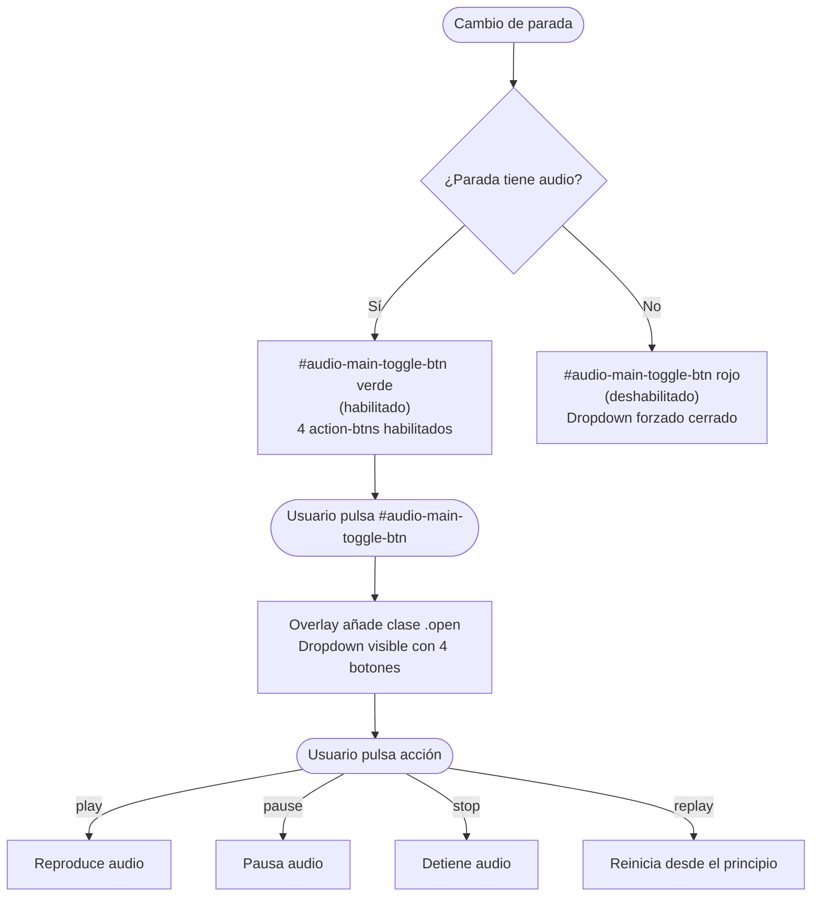

### 4.7d. Revelación de navegación en el mapa (`pendingRevealNavegacion`)

#### Principio de diseño

El comportamiento difiere según el modo:

- **Modo AVENTURA:** Cuando se avanza a un nuevo elemento, el mapa carga los datos de navegación (polyline azul, marcador 📌 inicio, marcador 🎯 fin) pero los mantiene **invisibles**. La navegación solo se muestra cuando el usuario pulsa `btn-avanzar` explícitamente. **Por qué:** El usuario necesita escuchar el audio y completar el reto antes de saber adónde ir.
- **Modo CASA:** La navegación se muestra **inmediatamente** tras dibujar los elementos — no hay audio obligatorio ni reto que completar antes de ver la ruta.

#### Mecanismo técnico: flag `pendingRevealNavegacion` (solo AVENTURA)

El flag `estado.pendingRevealNavegacion` (`boolean`, inicializado a `false` en `codigo-padre.html`) coordina cuándo mostrar la navegación **en modo AVENTURA**:

- **`false` (valor por defecto):** `completarCambioParada()` en `js/funciones-mapa.js` llama `_ocultarNavegacion()` tras dibujar los elementos.
- **`true`:** `completarCambioParada()` mantiene los elementos visibles y resetea el flag a `false`.

```text
CAMBIO_PARADA recibido
        │
        ▼
completarCambioParada():
  1. Limpia capas anteriores (polylines, tramo markers 📌🎯 — siempre, independiente del modo)
  2. Dibuja polyline (si tramo) + marcadores 📌🎯 (o 🎯 si parada)
  3. Hace zoom/flyTo al destino
  4. Decide visibilidad:
        ├─ pendingRevealNavegacion=true  → visible, resetea flag a false   [AVENTURA, btn-avanzar]
        ├─ modo ≠ 'aventura'             → visible inmediatamente          [CASA]
        └─ modo = 'aventura', flag=false → _ocultarNavegacion(): opacity 0 [AVENTURA, recién llegado]
```

**Código de `_ocultarNavegacion()`** (`js/funciones-mapa.js`):
```javascript
// Pone opacity:0 en todos los elementos de navegación activos
rutasActivas.forEach(r => r.setStyle({ opacity: 0 }));
marcadoresParadas.get('tramo-inicio-ruta')?.setOpacity(0);  // 📌
marcadoresParadas.get('tramo-fin-ruta')?.setOpacity(0);     // 🎯
marcadorParadaActual?.setOpacity(0);                         // 🎯 parada
estadoMapa.gpsVisualActivo = false;
```

**Código de `revelarNavegacion()`** (`js/funciones-mapa.js`, función exportada):
```javascript
// Restaura la visibilidad de los elementos ocultos
rutasActivas.forEach(r => r.setStyle({ opacity: 0.7 }));    // opacidad original del tramo
marcadoresParadas.get('tramo-inicio-ruta')?.setOpacity(1);
marcadoresParadas.get('tramo-fin-ruta')?.setOpacity(1);
marcadorParadaActual?.setOpacity(1);
estadoMapa.gpsVisualActivo = true;
```

#### Flujos por combinación de elementos

**Caso A — Parada → Tramo (btn-avanzar en parada completada):**

```text
Usuario escucha audio + completa reto en parada N
        │
        ▼
Padre: paradaListaParaAvanzar = true
       envía CONTROL.HABILITAR { control: 'btnAvanzar', razon: 'parada_completada' } → hijo2
        │
        ▼
Usuario pulsa btn-avanzar
        │
        ▼
_hdl_NAVEGACION_GPS_ACTIVAR():
  estado.paradaListaParaAvanzar = false
  estado.pendingRevealNavegacion = true   ← clave
  await progresarSiguienteElemento()      ← dispara CAMBIO_PARADA para Tramo 1
        │
        ▼
completarCambioParada() para Tramo 1:
  dibuja polyline azul + 📌 inicio + 🎯 fin
  hace flyTo al inicio del tramo
  ve pendingRevealNavegacion === true
  → deja polyline y markers VISIBLES
  → resetea flag a false
```

**Caso B — Parada → Parada (btn-avanzar en parada completada, sin tramo):**

Mismo flujo que caso A. `pendingRevealNavegacion = true` hace que `completarCambioParada()` deje visible el marcador 🎯 de la siguiente parada inmediatamente.

**Caso C — Tramo activo (btn-avanzar revela navegación sin avanzar):**

```text
CAMBIO_PARADA llega para Tramo N
        │
        ▼
completarCambioParada():
  dibuja polyline + 📌🎯
  pendingRevealNavegacion === false → _ocultarNavegacion()
  → poliline y markers OCULTOS
  → el mapa solo muestra la flecha GPS del usuario
        │
        ▼
Usuario pulsa btn-avanzar (habilitado por proximidad al inicio del tramo)
        │
        ▼
_hdl_NAVEGACION_GPS_ACTIVAR():
  paradaListaParaAvanzar === false (es tramo)
  → llama revelarNavegacion() DIRECTAMENTE
  → polyline + 📌🎯 se hacen visibles al instante (datos ya cargados)
  → NO hay progresarSiguienteElemento() — el GPS auto-avanza al llegar
```

**Caso D — GPS auto-avanza tramo (llega al final sin pulsar btn-avanzar):**

```text
Usuario llega al final del Tramo N (GPS detecta proximidad)
        │
        ▼
progresarSiguienteElemento() automático (sin pulsar btn-avanzar)
pendingRevealNavegacion === false (nadie pulsó el botón)
        │
        ▼
completarCambioParada() para la siguiente Parada M:
  dibuja 🎯 de la parada
  pendingRevealNavegacion === false → _ocultarNavegacion()
  → el 🎯 queda OCULTO
  → el usuario escucha el audio, completa el reto
  → btn-avanzar se habilita → usuario pulsa → Caso A o B
```

**Resumen de los 4 casos:**

| Transición | `pendingRevealNavegacion` al llegar | Navegación visible en CAMBIO_PARADA | Revelación |
|---|---|---|---|
| Parada→Tramo / Parada→Parada (btn-avanzar) | `true` | ✅ inmediata | Automática al cargar |
| Tramo activo (btn-avanzar) | n/a | — | `revelarNavegacion()` directo |
| GPS auto-avanza (llegada automática) | `false` | ❌ oculta | Al pulsar btn-avanzar siguiente |

### 4.7e. Overlay de error de contenido (`#error-overlay`)

`globalThis.mostrarErrorOverlay(mensajeError, tipo)` en `codigo-padre.html` (línea ~2080) muestra un overlay genérico para fallos de carga de **imagen, video o iframe** — p. ej. una URL de video mal formada (`new URL()` lanza excepción) o una URL de iframe vacía/inválida. No es una pantalla de "sin contenido asignado" (esas paradas/tramos siempre tienen imagen — ver §7.1) sino un fallo técnico real: dato corrupto o archivo movido/ausente en el servidor.

**Contenido del overlay:**

- ⚠️ (icono de aviso)
- **"404"** — código universal de error, sin traducción necesaria (sustituye al antiguo título "Error de contenido")
- `#error-message` — el mensaje de error técnico recibido como parámetro (no traducido; es información de diagnóstico, no prosa de usuario)
- Un único botón de cierre `×` (`.btn-cerrar-overlay`, esquina superior derecha) — universal, sin texto

**Garantía de salida:** `cerrarErrorOverlay()` está enlazado al botón `×` desde la creación del overlay (`overlay.querySelector('.btn-cerrar-overlay')?.addEventListener('click', cerrarErrorOverlay)`). Quita la clase `.visible` y elimina el nodo del DOM tras 400ms. No hay ningún estado en el que el overlay quede sin botón de cierre — siempre se crea junto con su listener antes de mostrarse (`overlay.classList.add('visible')` ocurre después).

**Disparadores confirmados:**

| Caso | Línea (`codigo-padre.html`) | Mensaje |
|---|---|---|
| Imagen con error personalizado | ~1749 | `mensajeError` recibido al renderizar imagen de parada/tramo |
| URL de video mal formada | ~1989/1998 | `No se pudo cargar el video: ${urlVideo}` |
| URL de iframe inválida o vacía | ~2135 | `No se pudo cargar el contenido HTML: URL inválida` |

### 4.8. Código de colores de estado en botones

| Color | Hex | Dónde aparece | Cuándo |
|-------|-----|---------------|--------|
| 🟢 Verde | `#1e7e34→#0d3a16` | `.boton` en hijo2, `.boton.habilitado` en hijo3 | Estado por defecto — botón activo y pulsable |
| 🔴 Rojo | `#dc3545→#c82333` (`opacity: 0.6`) | `.boton.disabled` en hijo2, `.boton.deshabilitado` en hijo3 | Botón bloqueado — GPS deshabilitado o precisión insuficiente |
| 🔵 Azul | `#007bff→#0056b3` | `.boton.activo` en hijo2 | Navegación revelada — `btn-avanzar` pulsado, polyline y marcadores visibles en el mapa |
| 🔵 Azul | `#0077cc` (inline) | `btnEnviar`, `btnNext` en hijo4 | Estado inicial/neutro de los botones de respuesta y continuar |
| 🟢 Verde | `#28a745` (inline) | `btnEnviar` en hijo4 | Respuesta correcta introducida |
| 🔴 Rojo | `#dc3545` (inline, 3 s) | `btnEnviar` en hijo4 | Respuesta incorrecta — vuelve a azul `#0077cc` tras 3 s |
| 🟢 Verde | `#28a745` (inline) | `btnNext` en hijo4 | Hay más retos en la cola tras acertar |
| ⬜ Gris | `#999` (inline) | `btnNext` en hijo4 | Último reto completado — ya no hay siguiente |
| 🟠 Naranja | `#ff8c00` | `.modal-close` en hijo2 | Botón de cerrar el modal de imagen/vídeo |

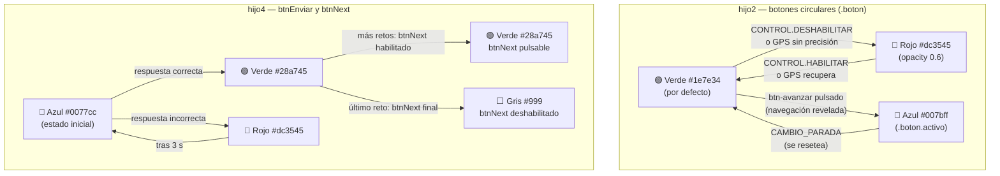

---

### 4.9. Animaciones de botones: glow y spin (ambos modos)

#### Tipos de animación

En ambos modos (CASA y AVENTURA) todos los botones habilitados tienen una animación de brillo interno ("glow") para guiar la atención del usuario. Los botones que requieren acción del usuario también realizan un giro ("spin") periódico para llamar la atención.

| Animación | Clase CSS / selector | Descripción visual | Intensidad |
|---|---|---|---|
| **Glow suave** | `animation: glow-suave 3s ease-in-out infinite` | Brillo interior que pulsa lentamente. Para botones siempre disponibles | `inset 0 0 8px rgba(255,255,255,0.15)` → `18px 0.38` |
| **Glow activo** | `animation: glow-activo 3s ease-in-out infinite` | Brillo interior más intenso y notable. Para botones que requieren acción | `inset 0 0 10px rgba(255,255,255,0.20)` → `26px 0.55` |
| **Spin** | clase `.spinning` añadida por JS | Giro de 4 vueltas (1440°) con rebote elástico al final. Dura 0.9 s | `@keyframes spin-btn/spin-ruleta` |

**Keyframes exactos** (definidos por archivo, mismo timing en todos):

```css
@keyframes glow-suave {
    0%, 100% { box-shadow: inset 0 0 8px rgba(255,255,255,0.15); }
    50%       { box-shadow: inset 0 0 18px rgba(255,255,255,0.38); }
}
@keyframes glow-activo {
    0%, 100% { box-shadow: inset 0 0 10px rgba(255,255,255,0.2); }
    50%       { box-shadow: inset 0 0 26px rgba(255,255,255,0.55); }
}
@keyframes spin-btn {          /* hijo2, hijo3, padre */
    0%   { transform: rotate(0deg); }
    60%  { transform: rotate(1080deg); }
    85%  { transform: rotate(1350deg); }
    100% { transform: rotate(1440deg); }
}
/* timing: 0.9s cubic-bezier(0.2, 0.8, 0.4, 1) forwards */
```

> En `extrainfo-hijo1.html` el keyframe equivalente se llama `spin-ruleta` (existe desde antes) con idéntico timing y ángulos.

#### Qué botón tiene qué animación

| Botón | Archivo | Glow | Spin | Condición CSS |
|---|---|---|---|---|
| `#mas-opciones` | hijo1 | Suave | ❌ (hijo1 excluido del spin) | `:not(.spinning)` |
| `.icono-flotante` ×5 | hijo1 | Suave | ❌ | siempre |
| `#audio-main-toggle-btn` | padre | **Activo** | ✅ | `:not(:disabled):not(.spinning)` |
| `.audio-action-btn` ×4 | padre | Suave | ❌ | `:not(:disabled)` |
| `btn-mapa-completo` | hijo2 | Suave | ❌ | `:not(.activo)` |
| `btn-mapa-jpg` | hijo2 | Suave | ❌ | `:not(.activo)` |
| `btn-imagen` | hijo2 | Suave | ❌ | `:not(.activo)` |
| `btn-video` | hijo2 | **Activo** | ✅ | `:not([disabled]):not(.activo)` |
| `btn-avanzar` | hijo2 | **Activo** | ✅ | `:not([disabled]):not(.activo)` |
| `btn-ubicacion` | hijo2 | **Activo** | ✅ | `:not([disabled]):not(.activo)` |
| `#retosBtn` | hijo3 | **Activo** | ✅ | `:not(:disabled):not(.activo)` |

**Por qué `:not(.activo)` en glow:** Cuando un botón tiene la clase `.activo` (el usuario acaba de pulsarlo y su contenido está abierto), tiene ya su propia indicación visual (fondo azul). No tiene sentido añadir glow encima.

**Por qué `:not([disabled])` en glow-activo:** Los botones glow-activo pueden estar deshabilitados (rojo, opacidad 0.6). Un botón deshabilitado no llama a la acción, así que tampoco debe brillar para llamarla.

**Por qué el `.spinning !important`:** La clase `.spinning` aplica un `animation` que sobrescribe el glow. Sin `!important`, el selector del glow (con ID, mayor especificidad `[1,2,0]`) ganaría al selector de la clase spinning `[0,1,0]`. El `!important` garantiza que el spin siempre anule el glow mientras dura el giro.

#### Lógica del spin (JS)

El spin aplica solo a los botones con **glow activo**. El comportamiento es idéntico en todos los archivos:

1. **Al llegar a cada nuevo elemento** (`CAMBIO_PARADA`): se inicia un `setInterval` de 5 000 ms para cada botón glow-activo del archivo.
2. **Cada 5 segundos**: si el botón NO está deshabilitado Y el usuario NO lo ha pulsado aún desde el último reset, se añade la clase `.spinning` al botón.
3. **Al terminar el giro** (evento `animationend`): se elimina `.spinning` — el glow reanuda automáticamente.
4. **En la primera pulsación** del botón: se llama `clearInterval`, se marca `pressed = true`. El spin se detiene para esa sesión de elemento.
5. **En el siguiente `CAMBIO_PARADA`**: el estado `pressed` se resetea a `false` y el intervalo se reinicia desde cero.

**Patrón de implementación** (idéntico en hijo2, hijo3, padre):

```javascript
// Al llegar a nueva parada/tramo:
function _iniciarSpinBtn(btn) {
    if (!btn) return;
    _detenerSpinBtn(btn);                        // limpia anterior
    const state = { intervalId: null, pressed: false };
    state.intervalId = setInterval(() => {
        if (state.pressed || btn.disabled) return;
        btn.classList.remove('spinning');
        void btn.offsetWidth;                    // fuerza reflow para reiniciar animación
        btn.classList.add('spinning');
        btn.addEventListener('animationend',
            () => btn.classList.remove('spinning'), { once: true });
    }, 5000);
    _spinState.set(btn.id, state);
    btn.addEventListener('click', () => {        // primer click detiene spin
        state.pressed = true;
        clearInterval(state.intervalId);
        _spinState.delete(btn.id);
    }, { once: true });
}
```

**Diferencias por archivo:**

| Archivo | Variable de estado | Reset activado por | Botones gestionados |
|---|---|---|---|
| `coordenadas-hijo2.html` | `_spinState` (Map) | Handler `CAMBIO_PARADA` → `_resetSpinsAventura()` | `btnVideo`, `btnAvanzar`, `btnUbicacion` |
| `audio-hijo3.html` | `_retosBtnSpinInterval` + `_retosBtnSpinPressed` | Handler `CAMBIO_PARADA` → `_resetSpinRetosBtn()` | `retosBtn` |
| `codigo-padre.html` | `_audioMainSpinInterval` + `_audioMainSpinPressed` | `progresarSiguienteElemento()` → `globalThis._resetSpinAudioMainPadre()` | `#audio-main-toggle-btn` |

> **Nota hijo1:** `#mas-opciones` ya tenía su propio spin en hijo1 (clase `.spinning` añadida en el evento `click` del botón). No tiene spin periódico — solo gira al pulsarse. Los cinco `.icono-flotante` tampoco tienen spin, solo glow suave.

---

## 5. La arquitectura padre-hijo (iframes)

### ¿Qué es un iframe?

Un iframe es una "ventana dentro de otra ventana" en una página web. La aplicación tiene una página principal (`codigo-padre.html`) que carga otras páginas dentro de sí misma como iframes.

### ¿Por qué usar iframes?

- **Aislamiento de estado**: cada hijo tiene su propio contexto JS. Un crash en hijo4 (retos) no corrompe el estado de hijo2 (mapa).
- **Recarga independiente**: el heartbeat puede recargar solo el iframe caído sin tocar el resto de la sesión.
- **Organización de responsabilidades**: cada hijo se encarga de un único dominio (mapa, audio, retos…). El padre no mezcla UI con lógica de otros dominios.
- **Comunicación explícita**: toda interacción entre componentes pasa por `postMessage` documentado. No hay acceso directo al DOM ajeno ni variables compartidas entre iframes.

### Espera de HIJO_LISTO: sistema de eventos centralizado

El padre nunca usa polling para esperar que un hijo esté listo. Usa **Promises** resueltas por eventos: `crearPromiseHijoListo(hijoId)` crea la Promise; `marcarHijoListo(hijoId)` la resuelve al recibir `HIJO_LISTO`. Ambas funciones viven en `js/state-manager.js` (timeout de 30 s como límite de seguridad). Si `state-manager` no está disponible, el fallback usa polling con `setTimeout(check, 200)` hasta que `hijosInicializados.has(hijoId)` sea `true`.

> **Invariante crítico — `_normalizarSetHijos` antes de asignar `src`:** en `_hdl_SELECCION_AVENTURA_ACTIVADA`, `_normalizarSetHijos` debe llamarse **antes** de `_cargarSoloIframeActivacion`. Si se llama después, existe una ventana donde un hijo puede enviar `HIJO_LISTO`, ser añadido a `hijosInicializados`, y luego ser borrado por `_normalizarSetHijos` — dejando `_esperarHijosCargados` esperando un segundo `HIJO_LISTO` que nunca llega (timeout a los 30 s, AVENTURA_ACTIVADA queda bloqueada). El orden correcto: eliminar entradas → asignar src → esperar HIJO_LISTO.
>
> Para el detalle técnico completo de la implementación (código de `crearPromiseHijoListo`, `marcarHijoListo`, fallbacks) ver **§25.3**.

### Los hijos principales

| Iframe | ID | Archivo | ¿Crítico? | Cuándo carga | Función |
|--------|----|---------|-----------|--------------|---------|
| Pantalla selección | `seleccion` | `En-busca-del-tesoro.html` | No | Al arrancar `codigo-padre.html` (único iframe con `src` desde el inicio) | Pantalla de incorporación: selección de idioma, aventura, retos previos y código de activación. Se oculta al iniciar la aventura. |
| Hijo 1 | `hijo1-opciones` | `extrainfo-hijo1.html` | No | Arranque inicial: `_cargarIframesHijos()`. Activación de aventura: `CODIGO_VALIDADO` (P13) → `cargarRestoDeiframes()` | Panel lateral izquierdo con botón "Más opciones". Despliega iconos de acceso a contenido complementario (temporizador, vídeos, etc.). |
| Hijo 2 | `hijo2` | `coordenadas-hijo2.html` | **Sí** | Arranque inicial: `_cargarIframesHijos()`. Activación de aventura: `CODIGO_VALIDADO` (P13) → `cargarRestoDeiframes()` | Motor GPS: detecta proximidad a paradas/tramos (Haversine), gestiona 6 botones de navegación, envía `LLEGADA_DETECTADA` al padre. Sin Leaflet — el mapa lo renderiza `codigo-padre.html` vía `funciones-mapa.js`. |
| Hijo 3 | `hijo3` | `audio-hijo3.html` | **Sí** | Arranque inicial: `_cargarIframesHijos()`. Activación de aventura: `CODIGO_VALIDADO` (P13) → `cargarRestoDeiframes()` | Reproductor de audio. Recibe del padre qué audio reproducir y lo controla. |
| Hijo 4 | `hijo4` | `retos-hijo4.html` | **Sí** | Arranque inicial: `_cargarIframesHijos()`. Activación de aventura: `CODIGO_VALIDADO` (P13) → `cargarRestoDeiframes()`. **No** forma parte del `Promise.all` de `AVENTURA_ACTIVADA` | Muestra retos (preguntas de opción múltiple, texto libre, puzzles) y valida las respuestas. |
| Hijo 5 | `hijo5` | `boton-casa-hijo5.html` | No | Arranque inicial: `_cargarIframesHijos()`. Activación de aventura: `CODIGO_VALIDADO` (P13) → `cargarHijoCasa()` (si ya está cargado, solo espera `HIJO_LISTO`) | **Solo desarrollo — no aparece en la PWA final.** Herramienta de prueba para simular el modo CASA desde escritorio. Contiene el botón GPS (🛰️) que envía `SISTEMA.CAMBIO_MODO` al padre. En la PWA real el usuario arranca siempre en modo AVENTURA directamente. |
| Hijo 6 | `hijo6-chat` | `chat-hijo6.html` | No | **Lazy** — `src=""` en HTML; se asigna al primer click en `#btn-chat-soporte` | Asistente de soporte FAQ en acordeón. Accesible desde un botón flotante propio del padre. |

> **Hijos críticos para heartbeat** (`hijo2`, `hijo3`, `hijo4`, `hijo5`): reciben `SISTEMA.HEARTBEAT` cada 5 s en MODO AVENTURA (array `hijosCriticos` en `mensajeria.js`). Si cualquiera no responde 3 heartbeats consecutivos, el padre lo recarga automáticamente (`AUTO_RECONECTAR: true`). Los hijos sin supervisión de heartbeat son hijo1 e hijo6. Nota: `hijo5` está en el ciclo de heartbeat aunque no sea "crítico" en el sentido de que no bloquea `_esperarHijosCargados` — su función en aventura es secundaria (tool de desarrollo).

### Otros hijos (pantallas secundarias)

| Archivo | Función |
|---------|---------|
| `videos-valencia-historica.html` | Galería de vídeos sobre Valencia. |
| `consejos-valencia.html` | Consejos prácticos para el turista. |
| `gastronomia.html` | Información gastronómica valenciana. |
| `paginas-oficiales-valencia.html` | Enlaces a webs oficiales de Valencia. |
| `mapa-completo.html` | Vista del mapa completo (todas las aventuras). |
| `puzzle.html` | Juego de puzzle interactivo — **componente interno** de `En-busca-del-tesoro.html`. No se carga directamente desde el padre; se embebe como sub-iframe dentro de la pantalla de selección cuando el usuario llega al reto puzzle (P6). |

### El protocolo de arranque (handshake)

Cuando el padre carga un hijo, siguen este protocolo para asegurarse de que están preparados:

```text
Padre                                Hijo
  │                                    │
  │──── asigna src al iframe ─────────>│  navegador carga el HTML
  │                                    │
  │<─── HIJO_PREPARADO ───────────────│  { componenteId, version, capacidades[], timestamp }
  │                                    │  "mi HTML está cargado"
  │                                    │
  │──── ACK (best-effort) ────────────>│  { tipoMensajeOriginal: 'SISTEMA.HIJO_PREPARADO' }
  │──── PADRE_DATOS ──────────────────>│  { modo, timestamp }
  │                                    │  "aquí tienes el modo actual"
  │                                    │
  │<─── HIJO_LISTO ───────────────────│  { componenteId, iframeId, timestamp }
  │                                    │  "procesé los datos, estoy listo"
  │                                    │
  │──── PADRE_CONFIRMA_HIJO_LISTO ────>│  { timestamp, mensaje }
  │                                    │  "confirmado — puedes hacer tu UI visible"
  │                                    │
  ▼                                    ▼
(comunicación normal)                (funcionando)
```

**Notas de implementación:**

- El ACK es **best-effort**: solo se envía si `enviarMensaje_S1` ya está disponible. No es crítico para la funcionalidad — PADRE_DATOS sigue igualmente.
- `PADRE_DATOS` del handshake lleva únicamente `{ modo, timestamp }`. Los datos completos de la aventura (idioma, coordenadas, retos, audios) **no viajan en este mensaje** — llegan mediante mensajes específicos (`DATOS.CARGAR_RETOS`, `NAVEGACION.RESPUESTA_DATOS_PARADAS`, etc.) después de que el hijo ya está listo.
- El padre registra los handlers `HIJO_PREPARADO` y `HIJO_LISTO` en Script 1 **antes de asignar `src` a ningún iframe** — esto garantiza que los mensajes tempranos nunca se pierdan.
- Diseño intencional: el timeout de 30 s en `state-manager.js` es el último recurso si el hijo se cuelga antes de enviar `HIJO_LISTO` (crash total), no como mecanismo normal de espera. El heartbeat continuo detecta hijos caídos tras arrancar y permite reenviar `CAMBIO_MODO` pendiente si llega un `HIJO_LISTO` tardío.

### Acciones adicionales tras HIJO_LISTO (por hijo)

`_hdl_SISTEMA_HIJO_LISTO` hace acciones extras según qué hijo acaba de completar el handshake. El flujo común (confirmar, actualizar estado) es igual para todos; lo específico por hijo:

| Hijo | Acción adicional tras `PADRE_CONFIRMA_HIJO_LISTO` |
|------|--------------------------------------------------|
| `hijo2` | Padre envía `NAVEGACION.RESPUESTA_DATOS_PARADAS` `{ paradas: [...] }` con la lista normalizada de paradas y tramos. **Condicional**: solo si `aventuraSeleccionada` e `idiomaSeleccionado` ya están establecidos en el momento del handshake; si no, `distribuirDatosAventura()` se encarga más tarde. |
| `hijo3` | Padre llama `_configurarRetoBtn()` para sincronizar el estado del botón de retos con la parada actual. **Condicional**: solo si hay parada activa en `estado.elementoActual`. El resultado depende del modo vigente (ver tabla §6 "Diferencias de comportamiento CASA vs AVENTURA"). |
| `hijo2` + `hijo3` + `hijo4` (los tres) | Al completarse el último de los tres hijos críticos, `_hijoListo_onTodosListos()` → envía `SISTEMA.CAMBIO_MODO { razon: 'sincronizacion_inicial' }` a los tres para alinear el modo actual (CASA o AVENTURA). |

> **hijo3 y el modo activo**: cuando `hijo3` envía `HIJO_LISTO` (arranque inicial o recarga por `AVENTURA_ACTIVADA`), el padre ejecuta `_configurarRetoBtn()` con la parada activa y el modo en curso. El modo determina el resultado: en CASA el botón `retosBtn` se habilita de inmediato si `reto_id` está presente; en AVENTURA arranca deshabilitado y solo se habilita cuando llega el evento `AUDIO.FIN_REPRODUCCION`. Este mismo `_configurarRetoBtn()` se llama también desde `_hdl_NAVEGACION_CAMBIO_PARADA` cada vez que el usuario cambia de parada, con la misma lógica dependiente del modo.

### Secuencia de inicialización completa

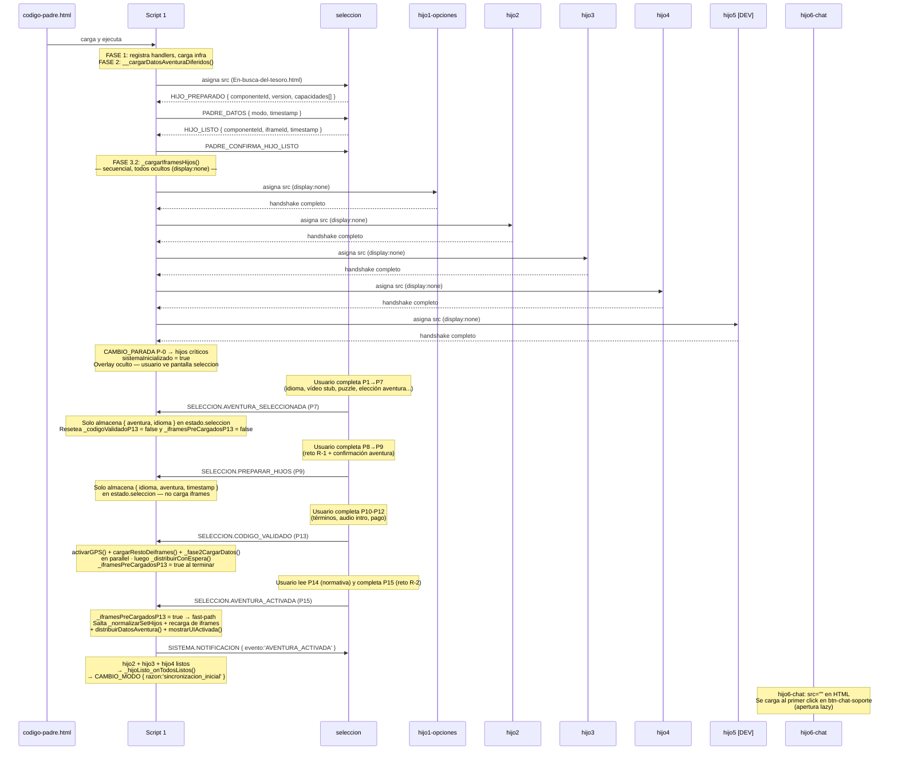

> **Carga secuencial en el arranque:** `_cargarIframesHijos()` usa un `for` loop que `await`ea el handshake de cada hijo antes de cargar el siguiente. Lo mismo en `cargarRestoDeiframes()` (activación via `CODIGO_VALIDADO` en P13). En cambio, `_hdl_SELECCION_AVENTURA_ACTIVADA` usa un fast-path cuando `_iframesPreCargadosP13 = true` — salta completamente la recarga porque los iframes ya están listos.

### Diagrama de arquitectura global

```mermaid
graph TD
    PADRE["codigo-padre.html (~11.400 líneas)"]
    SEL["seleccion — En-busca-del-tesoro.html"]
    PZ["puzzle.html\nsub-iframe interno de seleccion"]
    H1["hijo1-opciones — extrainfo-hijo1.html"]
    H2["hijo2 — coordenadas-hijo2.html"]
    H3["hijo3 — audio-hijo3.html"]
    H4["hijo4 — retos-hijo4.html"]
    H5["hijo5 — boton-casa-hijo5.html"]
    H6["hijo6-chat — chat-hijo6.html"]
    MSG["js/mensajeria.js"]
    SM["js/state-manager.js"]
    CONST["js/constants.js"]
    CFG["js/config.js"]
    APP["js/app.js"]
    FMAP["js/funciones-mapa.js (~4.000 líneas)"]
    CP["js/controladores-padre.js"]
    SRV["js/server.js (servidor estático)"]

    PADRE <-->|postMessage| SEL
    PADRE <-->|postMessage| H1
    PADRE <-->|postMessage| H2
    PADRE <-->|postMessage| H3
    PADRE <-->|postMessage| H4
    PADRE <-->|postMessage| H5
    PADRE <-->|postMessage| H6
    SEL -->|sub-iframe P9| PZ
    PADRE -->|dynamic import| MSG
    PADRE -->|dynamic import| SM
    PADRE -->|dynamic import| CONST
    PADRE -->|dynamic import| CFG
    PADRE -->|dynamic import| APP
    PADRE -->|dynamic import| FMAP
    PADRE -->|dynamic import| CP
    SRV -->|sirve estático| PADRE

    style H5 fill:#aaa,color:#fff
    style H6 fill:#e8f4f8,stroke:#0077cc
    style PZ fill:#e0e0e0,color:#555
```

> `hijo5` (gris) — solo desarrollo, no aparece en la PWA final. `hijo6-chat` (azul claro) — carga lazy al primer uso. `puzzle.html` (gris claro) — no es hijo directo del padre; es sub-iframe interno de `seleccion`.

### Diagrama de secuencia — Reanudación de aventura

Cuando el usuario vuelve a abrir la app y existe `vv_aventura_iniciada` en `localStorage`, el padre restaura el progreso y reposiciona cada hijo en la parada guardada.

```mermaid
sequenceDiagram
    participant U as Usuario
    participant P as Padre
    participant H1 as hijo1-opciones
    participant H2 as hijo2 (GPS)
    participant H3 as hijo3 (audio)
    participant H4 as hijo4 (retos)
    participant H5 as hijo5 [DEV]

    Note over P: ejecutarRestauracionAventura()<br/>Lee localStorage → restaura aventura, idioma, parada

    P->>P: distribuirDatosAventura()
    P->>H5: NAVEGACION.RESPUESTA_DATOS_PARADAS
    P->>P: restoreProgressFromStorage()

    par CAMBIO_PARADA a hijos críticos
        P->>H2: NAVEGACION.CAMBIO_PARADA { parada guardada }
        P->>H3: NAVEGACION.CAMBIO_PARADA { parada guardada }
        P->>H4: NAVEGACION.CAMBIO_PARADA { parada guardada }
        P->>H5: NAVEGACION.CAMBIO_PARADA { parada guardada }
    end

    par CAMBIO_MODO CASA a todos los hijos
        P->>H1: SISTEMA.CAMBIO_MODO { modo: casa }
        P->>H2: SISTEMA.CAMBIO_MODO { modo: casa }
        P->>H3: SISTEMA.CAMBIO_MODO { modo: casa, resetea audio }
        P->>H4: SISTEMA.CAMBIO_MODO { modo: casa }
        P->>H5: SISTEMA.CAMBIO_MODO { modo: casa }
    end

    P->>H2: solicitarCoordenadasAHijo2(elementoActual)
    P->>H3: solicitarAudioAHijo3(audio_id, autoplay=false)

    Note over U,H5: Sistema en MODO CASA con parada restaurada.<br/>Usuario pulsa botón GPS (hijo5 [DEV]) para activar AVENTURA.<br/>En la PWA real el GPS se activa directamente sin paso por hijo5.
```

---

## 6. El código padre: el cerebro de todo

El archivo `codigo-padre.html` (~11.400 líneas) es el **orquestador** de toda la aplicación: coordina la carga de iframes, gestiona el estado global, distribuye mensajes, ejecuta el GPS y toma todas las decisiones de navegación.

### Responsabilidades del padre

1. **Gestión de iframes**: carga, muestra, oculta y reconecta los hijos según el contexto.
2. **Estado centralizado**: guarda aventura seleccionada, idioma, parada actual, modo y estado GPS en `js/state-manager.js`.
3. **Mensajería**: recibe mensajes de todos los hijos y les responde a través de `js/mensajeria.js`.
4. **GPS**: ejecuta el único `navigator.geolocation.watchPosition()` de la app, directamente en `activarGPS()` (línea 4895 de `codigo-padre.html`). `funciones-mapa.js` solo actúa como adaptador — delega a `globalThis.activarGPS()` del padre. Las posiciones se distribuyen a hijo2 vía `NAVEGACION.ACTUALIZAR_ESTADO`. hijo2 no tiene `watchPosition` propio.
5. **Navegación**: decide cuándo cambiar de parada, cuándo mostrar un reto, cuándo reproducir un audio.
6. **Modos**: gestiona la transición entre `'casa'` y `'aventura'`, propagando `CAMBIO_MODO` a los hijos críticos y coordinando heartbeat y GPS.

### Estructura interna: los cuatro scripts module

`codigo-padre.html` contiene **cuatro** bloques `<script type="module">` con roles distintos. Más varios `<script>` regulares para utilidades síncronas (HTTPS redirect, stub `activarGPS`, image fallback, etc.).

| Script | Líneas | Rol principal |
|--------|--------|--------------|
| **Script 1** | 2404–7034 | Orquestador de arranque: FASE 1 infra → FASE 2 datos → FASE 3 iframes. Registra handlers del ciclo de vida: `SISTEMA.HIJO_PREPARADO`, `SISTEMA.HIJO_LISTO`, `SISTEMA.CAMBIO_MODO`, `SISTEMA.HEARTBEAT`, `SISTEMA.HIJO_FALLIDO`, `UI.ACCION_USUARIO`. Al final carga `js/controladores-padre.js`. |
| **Script 2** | 7059–10972 | Handlers de dominio: todos los `NAVEGACION.*` (GPS, CAMBIO_PARADA, LLEGADA_DETECTADA…), `RETO.*`, `SELECCION.*`, `AUDIO.*`, `UI.NAVEGACION_EXTERNA`, `SISTEMA.ADVERTENCIA`. Contiene `distribuirDatosAventura`. |
| **Script 3** | 10981–11107 | Utilidades de carga de iframes: `cargarIframeConDatos()` y backup de distribución `CARGAR_*`. |
| **Script 4** | 11173–11435 | "Migración de controladores y diagnóstico GPS": registra los controladores de `js/app.js` (`registrarControladoresApp`), `js/monitoreo.js` y `js/utils.js`; arranca el heartbeat GPS. |

> **Por qué Script 1 registra solo los handlers del ciclo de vida y Script 2 el resto:** Script 1 debe completar el registro de `HIJO_PREPARADO` / `HIJO_LISTO` / `CAMBIO_MODO` **antes** de asignar `src` a cualquier iframe. Los handlers de dominio (`NAVEGACION.*`, `RETO.*`, `SELECCION.*`) solo son necesarios una vez que los iframes están cargados, por lo que pueden vivir en Script 2 sin riesgo de llegar tarde.
>
> **Aislamiento de scope entre scripts:** Cada `<script type="module">` tiene su propio scope léxico. Las variables definidas localmente en Script 1 (p.ej. `sleep`, `enviarMensaje_S1`, `registrarIframe_S1`) **no son accesibles** en Scripts 2, 3 ni 4 a menos que se expongan explícitamente en `globalThis`. Por este motivo cada script define su propio alias de seguridad al inicio: `const sleep = globalThis.sleep || (ms => new Promise(r => setTimeout(r, ms)));`. Del mismo modo, las notificaciones de broadcast `AVENTURA_ACTIVADA` y `AVENTURA_INICIADA` que emite el handler de `SELECCION.AVENTURA_ACTIVADA` (Script 2) usan `enviarMensaje_S2` — intentar usar `enviarMensaje_S1` en Script 2 siempre devolvería `typeof === 'undefined'` y los broadcasts se perderían.

### Fases de inicialización

Script 1 ejecuta tres fases secuenciales antes de que la app sea interactiva:

#### FASE 1 — Infraestructura

Los módulos de infraestructura se cargan en un orden estricto por dependencias:

| Paso | Carga | Motivo del orden |
|------|-------|-----------------|
| 1 | `state-manager.js` (secuencial) | `mensajeria.js` necesita `__vv_stateManager` ya disponible |
| 2 | `mensajeria.js` (secuencial) | Debe existir antes de registrar cualquier handler |
| 3 | `validacion.js` + `funciones-mapa.js` (secuencial) | Otros módulos los importan como dependencia estática |
| 4 | `constants.js`, `utils.js`, `device-detection.js`, `logger.js`, `config.js`, `monitoreo.js`, `app.js` — `Promise.all` | Sin dependencias cruzadas entre ellos |

#### FASE 2 — Datos de aventura

Llamada automáticamente desde `ejecutarInicializacionAutomatica()` vía `__cargarDatosAventuraDiferidos()`. Los 5 módulos de datos no tienen imports cruzados: se cargan en paralelo con `Promise.all` y sus resultados se exponen en variables globales:

```text
coordenadas-aventuras.js  →  globalThis.__vv_DATOS_AVENTURAS
audios-aventuras.js       →  globalThis.__vv_AUDIOS_AVENTURAS
retos-aventuras.js        →  globalThis.__vv_RETOS_AVENTURAS
textos-aventuras.js       →  globalThis.__vv_TEXTOS_AVENTURAS
indice-aventuras.js       →  globalThis.__vv_INDICE_AVENTURAS
```

#### FASE 3 — Iframes

Necesita FASE 2 completa. Todo ocurre en el arranque, dentro de `ejecutarInicializacionAutomatica()`, antes de cualquier interacción del usuario:

1. `cargarIframeSoloSeleccion()` — asigna `src` a `seleccion` y espera su handshake
2. `_cargarIframesHijos()` — carga hijo1→hijo2→hijo3→hijo4→hijo5 **secuencialmente**, todos ocultos (`display:none`). No espera señal alguna de seleccion
3. Se envía `CAMBIO_PARADA { paradaId: 'P-0' }` a los hijos críticos (hijo2, hijo3, hijo4, hijo5) como estado inicial del mapa

Las señales `SELECCION.*` llegan **más tarde**, cuando el usuario completa el flujo de onboarding:

- `SELECCION.AVENTURA_SELECCIONADA` (P7) → solo almacena `{ aventura, idioma }` en `estado.seleccion`; resetea flags de P13; **no carga iframes ni activa GPS**
- `SELECCION.PREPARAR_HIJOS` (P9) → solo almacena `{ idioma, aventura, timestamp }` en `estado.seleccion`; **no carga iframes**
- `SELECCION.CODIGO_VALIDADO` (P13) → activa GPS + `cargarRestoDeiframes()` + `_fase2CargarDatos()` en **paralelo**; luego `_distribuirConEspera()`; marca `_iframesPreCargadosP13 = true`
- `SELECCION.AVENTURA_ACTIVADA` (P15/P16) → si `_iframesPreCargadosP13`: fast-path (sin recarga de iframes); si no: recarga normal hijo1/hijo2/hijo3/hijo5 vía `Promise.all`; distribuye datos y muestra UI

```mermaid
flowchart TD
    F1["FASE 1 — Infraestructura\nstate-manager → mensajeria → validacion+mapa\n→ 7 módulos en Promise.all"]
    F2["FASE 2 — Datos de aventura\nPromise.all 5 módulos .js\n→ globalThis.__vv_*"]
    F3A["FASE 3.1\ncargarIframeSoloSeleccion()\nseleccion cargado + handshake"]
    F3B["FASE 3.2\n_cargarIframesHijos()\nhijo1→2→3→4→5 secuencial\ntodos ocultos (display:none)"]
    FIN["✅ Sistema listo\nCAMBIO_PARADA P-0 enviado\noverlay oculto — usuario ve seleccion"]
    SEL_A["AVENTURA_SELECCIONADA (P7)\nsolo almacena estado.seleccion\nreset flags P13"]
    SEL_P["PREPARAR_HIJOS (P9)\nalmacena estado.seleccion\n(sin carga de iframes)"]
    SEL_CV["CODIGO_VALIDADO (P13)\nactivarGPS() + cargarRestoDeiframes()\n+ _fase2CargarDatos() en paralelo\n→ _distribuirConEspera()"]
    SEL_C["AVENTURA_ACTIVADA (P15→P16)\nfast-path si _iframesPreCargadosP13\no recarga normal hijo1/2/3/5\n+ distribuirDatosAventura()"]

    F1 --> F2 --> F3A --> F3B --> FIN
    FIN -.->|"más tarde:\nusuario completa\nonboarding"| SEL_A
    SEL_A --> SEL_P --> SEL_CV --> SEL_C

    style F1 fill:#fff3cd
    style F2 fill:#d4edda
    style F3A fill:#cce5ff
    style F3B fill:#cce5ff
    style FIN fill:#d1ecf1
    style SEL_A fill:#e8d5f5
    style SEL_P fill:#e8d5f5
    style SEL_C fill:#e8d5f5
```

> FASE 1 y FASE 2 terminan antes de asignar `src` a ningún iframe. Cuando llega el primer `HIJO_PREPARADO` ya existen todos los handlers y todos los datos de aventura.

### Registro de handlers: `registrarControladorSeguro`

Todos los handlers del padre se registran mediante `globalThis.registrarControladorSeguro(tipo, handler)`, definida en Script 1. Esta función:

1. **Deduplica**: mantiene `globalThis.__CONTROLADOR_REGISTRADOS` (un `Set`) — si el tipo ya está registrado, lo ignora con un `warn`. Cada tipo de mensaje tiene exactamente un handler en el padre.
2. **Encola si mensajería no está lista**: si `registrarControlador_S1` no está disponible aún, guarda el handler en `__CONTROLADORES_PENDIENTES` para procesarlo cuando mensajería esté lista.
3. **Fallback**: si `registrarControlador_S1` no está disponible pero `globalThis.mensajeria` sí, usa `mensajeria.registrarControlador` directamente.

**Reparto de handlers por prefijo (dentro de `codigo-padre.html`):**

| Prefijo | Registrado en | Ejemplos |
|---------|--------------|---------|
| `SISTEMA.*` | Script 1 | `HIJO_PREPARADO`, `HIJO_LISTO`, `CAMBIO_MODO`, `HEARTBEAT`, `HIJO_FALLIDO`, `CAMBIO_MODO_RESPONSE` |
| `NAVEGACION.*` | Script 2 | `CAMBIO_PARADA`, `LLEGADA_DETECTADA`¹, `GPS.ACTIVAR`, `GPS.DESACTIVAR` |
| `RETO.*` | Script 2 | `SOLICITAR_RETO`, `OCULTAR`, `COMPLETADO`, `MOSTRADO` |
| `SELECCION.*` | Script 2 | `PREPARAR_HIJOS`, `CODIGO_VALIDADO`, `AVENTURA_SELECCIONADA`, `AVENTURA_ACTIVADA`, `IDIOMA_SELECCIONADO` |
| `AUDIO.*` | Script 2 | `ESTADO_ACTUALIZADO`, `FIN_REPRODUCCION` |
| `DATOS.*` | `codigo-padre.html` (`_regCtrl_DatosRespuestas`) + `js/controladores-padre.js` | `COORDENADAS_CARGADAS`, `AUDIOS_CARGADOS`, `RETOS_CARGADOS`, `TEXTOS_CARGADOS`; fallbacks: `SOLICITAR_AUDIOS`, `SOLICITAR_RETOS`, `SOLICITAR_TEXTOS`, `SOLICITAR_DATOS_PARADAS` |

### Modos de la aplicación

La aplicación tiene dos modos, cuyos valores corresponden a las constantes `MODOS.CASA = 'casa'` y `MODOS.AVENTURA = 'aventura'` de `js/constants.js`:

- **`'casa'`**: menú principal — selección de aventura, vídeos, consejos. Heartbeat pausado; localStorage de progreso limpiado (`vv_aventura_iniciada`, `vv_progreso`, `vv_paradas_completadas`).
- **`'aventura'`**: recorrido activo — mapa, GPS, retos. Heartbeat activo cada ~5 s (ajustado por calidad de conexión vía `ajustarTimeoutPorConexion`).

**Quién inicia un cambio de modo:**

| Origen | Cuándo | Razón (`razon`) |
|--------|--------|----------------|
| Padre (`_hijoListo_onTodosListos`) | Al completar la inicialización de todos los hijos críticos | `'sincronizacion_inicial'` |
| hijo5 (botón GPS) | Al pulsar el botón de iniciar aventura | `'cambio_modo_global'`, `origen: 'boton-gps'` |
| Reanudación automática | Al detectar `vv_aventura_iniciada` en `localStorage` | payload incluye `restaurado: true` |

**Payload de `CAMBIO_MODO`:**

```javascript
{
    modo: "aventura" | "casa",
    timestamp: Date.now(),
    razon: "sincronizacion_inicial" | "cambio_modo_global" | ...,
    secuenciaCompleta: true,
    propagadoDesde?: string   // origen del mensaje que disparó el cambio
}
```

**Flujo interno al recibir `CAMBIO_MODO`:**

```mermaid
sequenceDiagram
    participant OR as Origen (padre / hijo5)
    participant P as Padre — _hdl_SISTEMA_CAMBIO_MODO
    participant APP as js/app.js — manejarCambioModo
    participant HC as Hijos críticos (hijo2, hijo3, hijo4, hijo5)

    OR->>P: CAMBIO_MODO { modo, razon }
    P->>APP: manejarCambioModo(estado, mensaje)
    APP-->>P: { exito: true, modoActual }
    loop para cada hijo crítico inicializado
        P->>HC: CAMBIO_MODO { modo, secuenciaCompleta: true }
    end
    HC-->>APP: CAMBIO_MODO_ENTENDIDO
    HC-->>APP: CAMBIO_MODO_EFECTUADO
    alt modo === 'aventura'
        P->>P: HEARTBEAT_START { intervalo: ~5000 ms }
        P->>HC: HEARTBEAT_START
    else modo === 'casa'
        P->>P: HEARTBEAT_PAUSE
        P->>HC: HEARTBEAT_PAUSE
        P->>P: limpiar localStorage de progreso
    end
```

> Los handlers de `CAMBIO_MODO_ENTENDIDO` y `CAMBIO_MODO_EFECTUADO` viven en `js/app.js` (`actualizarInterfazModo`), no directamente en el padre.

### Diferencias de comportamiento CASA vs AVENTURA

Los dos modos no son equivalentes. El padre ejecuta lógica diferente según `estado.modo.actual` en los puntos clave del flujo. La tabla cubre las diferencias que **sí afectan al código del padre** (`codigo-padre.html`):

| Elemento | Modo CASA (`'casa'`) | Modo AVENTURA (`'aventura'`) |
|----------|---------------------|------------------------------|
| **GPS** | Activo — `watchPosition` continuo; modo CASA se superpone al GPS: no se detectan llegadas automáticas porque el usuario elige libremente cada parada o tramo | Activo — `watchPosition` continuo; posición del usuario se actualiza en mapa; llegadas detectadas automáticamente por proximidad |
| **Heartbeat** | Pausado — no se envía `SISTEMA.HEARTBEAT` a los hijos críticos | Activo cada ~5 s (ajustado por calidad de conexión vía `ajustarTimeoutPorConexion`) |
| **`retosBtn` (hijo3)** | Se envía `CONTROL.HABILITAR { control: 'retosBtn' }` **de inmediato** al entrar en parada con `reto_id` (sin condición de audio) | Arranca con `CONTROL.DESHABILITAR { control: 'retosBtn', razon: 'esperar_fin_audio_aventura' }`; se habilita solo cuando llega `AUDIO.FIN_REPRODUCCION` para esa parada |
| **`btnAvanzar` (hijo2)** | No se gestiona — en CASA el usuario elige libremente cada parada o tramo (sin avance automático por GPS) | Se deshabilita al entrar en parada: `CONTROL.DESHABILITAR { control: 'btnAvanzar', razon: 'parada_pendiente_completar' }`; se habilita cuando la parada está completa (audio + reto) |
| **Audio al cambiar de parada** | `_solicitarAudioCasa()` — consulta info de audio a hijo3 sin lanzar reproducción automática | `_solicitarAudioParaParada()` — envía `AUDIO.REPRODUCIR_REQUEST` con autoplay |
| **`RETO.ESTADO_CASA` (hijo4)** | Enviado en cada `CAMBIO_PARADA`: `{ habilitado: !esTramo }` — habilita el panel de retos en paradas, lo deshabilita en tramos | No se envía |
| **Origen típico de `CAMBIO_PARADA`** | hijo5 (clic en lista de paradas) | hijo2 (llegada GPS detectada) o avance programático desde el padre |
| **Estado del reto (`estado.retoActual`)** | `disponible: true` al entrar en parada con `reto_id` (inmediato) | `disponible: false` al entrar; cambia a `true` solo cuando audio termina |
| **Persistencia de progreso** | `localStorage.removeItem('vv_aventura_iniciada')` al cambiar a CASA | `localStorage.setItem('vv_aventura_iniciada', ...)` al cambiar a AVENTURA |

**Flujo de `CAMBIO_PARADA` según modo** — llamadas ejecutadas en `_hdl_NAVEGACION_CAMBIO_PARADA`:

```text
[Ambos modos]
  1. resolverIdsParada(datos) → buscarParadaEnDatos() → parada object
  2. _actualizarEstadoParada()     → estado.paradaActual = paradaId
  3. _solicitarParadaAHijo2()      → DATOS.COORDENADAS_PARADAS_REQUEST a hijo2
  4. _notificarCambioParadaHijos() → CAMBIO_PARADA a hijo2, hijo4 (si listo), hijo5 (si no es el origen)
  5. _configurarRetoBtn()          → diferente según modo (ver tabla arriba)
  6. dispatchEvent('vv-parada-cambiada') → funciones-mapa.js dibuja marcadores / polylines

[Solo AVENTURA]
  7. Si esTramo: estado.gps.tramoAudioPendiente = true
  8. Si parada: CONTROL.DESHABILITAR { control: 'btnAvanzar' } a hijo2

[Solo CASA]
  7. RETO.ESTADO_CASA { habilitado: !esTramo } a hijo4
```

**Nota de implementación**: `_configurarRetoBtn` usa `estado.hijosInicializados.has('hijo3')` como guard de entrada — si hijo3 aún no ha completado el handshake, la función retorna sin hacer nada. Esto es seguro porque cuando `hijo3` envía `HIJO_LISTO`, el padre vuelve a llamar `_configurarRetoBtn()` con la parada activa en ese momento.

**Identificadores de parada y la búsqueda en DATOS_PADRE**: `_hdl_NAVEGACION_CAMBIO_PARADA` extrae `paradaId` del mensaje en este orden de prioridad: `datos.paradaId → datos.parada_id → resolved.paradaId`. El valor con prefijo `'padre-'` (p.ej. `'padre-P0'`) debe preservarse aquí porque `_buscarParadaEnDatos` lo usa para el match `p.padreid === paradaId`. Usar `resolved.paradaId` (que elimina el prefijo) causaría que la búsqueda fallara silenciosamente y que `_configurarRetoBtn` nunca se llamara.

### Los controladores de datos (js/controladores-padre.js)

Los 4 handlers que responden a peticiones de datos de aventuras están extraídos en el módulo `js/controladores-padre.js` (importado dinámicamente al final de Script 1). La función exportada es `registrarControladoresDatos(deps)`, que recibe todas sus dependencias por inyección:

| Handler | Tipo de mensaje | Responde con |
|---------|----------------|--------------|
| Datos de paradas para hijo5 | `NAVEGACION.SOLICITAR_DATOS_PARADAS` | `NAVEGACION.RESPUESTA_DATOS_PARADAS` |
| Metadatos de audio | `DATOS.SOLICITAR_AUDIOS` | `DATOS.CARGAR_AUDIOS` |
| Textos narrativos | `DATOS.SOLICITAR_TEXTOS` | `DATOS.CARGAR_TEXTOS` |
| Retos y respuestas | `DATOS.SOLICITAR_RETOS` | `DATOS.CARGAR_RETOS` |

Los tres handlers `DATOS.*` leen de `globalThis.__vv_AUDIOS_AVENTURAS` / `__vv_TEXTOS_AVENTURAS` / `__vv_RETOS_AVENTURAS` (cargados en FASE 2). `SOLICITAR_DATOS_PARADAS` lee de `globalThis.aventuraSeleccionada` y `globalThis.__vv_DATOS_AVENTURAS`. Todos responden con `enviarMensaje` al origen de la solicitud.

### Reconexión de hijos fallidos

Cuando un hijo no completa el handshake durante la carga inicial, el padre activa `_reconectarHijoIndividual()`:

1. Oculta el iframe (`display:none; visibility:hidden`)
2. Reasigna el `src` para forzar recarga completa del iframe
3. Espera el handshake completo (`_esperarHijoListo(id)`)
4. **Máximo 3 intentos** con backoff: espera `2 s × intento` antes del siguiente intento — solo si no es el último (intento 1 → espera 2 s, intento 2 → espera 4 s, intento 3 → sin espera)
5. Si los 3 fallan: marca `activo: false, reconexionFallida: true` — la app continúa con funcionalidad reducida

Esta reconexión es **solo para fallos de carga inicial**. Los fallos de heartbeat durante la aventura (3 heartbeats fallidos consecutivos) se gestionan por separado en `js/mensajeria.js`.

### El state-manager (gestor de estado)

El estado de la aplicación se guarda en un único lugar: `js/state-manager.js`. **Todos** los campos de estado tienen su propio `SimpleMutex` que serializa lecturas y escrituras concurrentes. `SimpleMutex` es una implementación nativa de Promise-chain (sin dependencias externas) definida al principio del archivo.

**18 mutexes definidos** (líneas 21-40 de `state-manager.js`):

| Campo | Tipo | Propósito |
| --- | --- | --- |
| `heartbeatPrewarmed` | `boolean` | Flag: heartbeat pre-calentado antes de activar GPS |
| `procesandoCola` | `boolean` | Evita procesamiento concurrente de la cola de controladores |
| `script2Listo` | `boolean` | Flag de sincronización entre Script 1 y Script 2 del padre |
| `listenerRegistrado` | `boolean` | Flag: listener de mensajes ya registrado |
| `mensajeriaReady` | `boolean` | Flag: `globalThis.mensajeria` disponible |
| `coordenadasCargadas` | `boolean` | Confirmación de carga del módulo de coordenadas |
| `audiosCargados` | `boolean` | Confirmación de carga del módulo de audios |
| `retosCargados` | `boolean` | Confirmación de carga del módulo de retos |
| `estadoPadre` | `object` | Estado completo del padre (modo, GPS, paradas, hijos, monitoreo…) |
| `aventuraSeleccionada` | `string\|null` | ID de la aventura activa |
| `idiomaSeleccionado` | `string\|null` | Código de idioma activo (`es`, `en`, `fr`…) |
| `uiConfirmado` | `boolean` | Flag: UI de aventura ya mostrada |
| `estadoComponenteInicializado` | `boolean` | Flag: componente padre inicializado |
| `estadoMenuAbierto` | `boolean` | Estado del menú desplegable |
| `controladores` | `Map` | Map de handlers de mensajes registrados |
| `mensajesEnviados` | `Set` | Set de IDs de mensajes ya enviados (deduplicación) |
| `heartbeat` | `object` | Estado completo del heartbeat (activo, fallos, timers, `gpsPendientes`) |
| `hijosListosPromises` | `Map` | Promesas de carga de cada hijo (resueltas por `marcarHijoListo`) |

> **Nota:** `gpsPendientes` (mensajes GPS encolados mientras hijo2 está desconectado) se almacena **dentro** del objeto `heartbeat` y comparte su mutex — no tiene mutex propio.
>
> **Nota:** `controladores` y `mensajesEnviados` tienen mutex definido pero el comentario en el código (línea 250) aclara: *"Sin mutex: el browser es single-threaded; Map/Set ops son atómicas en este contexto"* — se usan solo para consistencia de la API.

La estructura del estado (`state`) tiene dos niveles diferenciados:

```javascript
// Campos raíz — cada uno con su propio SimpleMutex
{
    // Flags de inicialización (boolean)
    heartbeatPrewarmed, procesandoCola, script2Listo,
    listenerRegistrado, mensajeriaReady,
    coordenadasCargadas, audiosCargados, retosCargados,
    uiConfirmado, estadoComponenteInicializado, estadoMenuAbierto,

    // Datos de aventura
    aventuraSeleccionada: "Aventura1",
    idiomaSeleccionado: "es",

    // Estado completo del padre (mutex estadoPadre)
    estadoPadre: {
        modo: { actual: "aventura", anterior: "casa" },
        paradaActual: 5,
        hijosInicializados: Set([...]),
        gps: { activo, watchId, posicionUsuario, precision, error, ultimaUbicacion },
        monitoreo: { metricas, config, historial },
        sistema: { prewarmIniciado, prewarmPausado, cambiandoModo },
        retoActivo, audioActivo, ubicacionActiva,
        tramoActual, elementoActual, siguiendoRuta,
        hijosQueRecibieronPadreListo: Set([...])
    },

    // Colecciones (mutex propio pero atómicas en la práctica)
    controladores: Map,      // handlers de mensajes
    mensajesEnviados: Set,   // deduplicación de envíos

    // Heartbeat + GPS pendientes (mutex compartido 'heartbeat')
    heartbeat: {
        activo, intervalo,
        heartbeatsFallidos: Map,  // hijo → nº de fallos
        ultimoHeartbeat: Map,     // hijo → timestamp
        hijosDesconectados: []
    },
    gpsPendientes: [],            // dentro del mutex 'heartbeat'

    // Promesas de carga de hijos
    hijosListosPromises: Map      // id → { promise, resolve, reject, timeout }
}
```

---

## 7. Las páginas hijo y qué hace cada una

> **Handshake estándar** (igual para todos los hijos): el hijo carga → envía `SISTEMA.HIJO_PREPARADO` → el padre responde con `SISTEMA.PADRE_DATOS { modo, timestamp }` → el hijo procesa y envía `SISTEMA.HIJO_LISTO` → el padre confirma con `SISTEMA.PADRE_CONFIRMA_HIJO_LISTO` → el hijo hace visible su UI.

```mermaid
sequenceDiagram
    participant P as Padre
    participant H as Hijo (cualquiera)
    P->>H: asigna src (iframe carga)
    H-->>P: SISTEMA.HIJO_PREPARADO { componenteId, version, capacidades[] }
    P->>H: SISTEMA.PADRE_DATOS { modo, timestamp }
    H-->>P: SISTEMA.HIJO_LISTO { componenteId, iframeId, timestamp }
    P->>H: SISTEMA.PADRE_CONFIRMA_HIJO_LISTO { timestamp, mensaje }
    Note over H: UI visible — comunicación normal
```

---

### 7.0 Cómo funcionan todos en conjunto

El padre es el único componente con visión global. Ningún hijo habla con otro directamente — todo pasa por el padre, que actúa como bus de mensajes y árbitro de estado. Esta separación permite recargar un hijo caído sin afectar al resto.

```mermaid
graph TD
    P["🧠 PADRE\ncodigo-padre.html\nestado global · decisiones · GPS · heartbeat"]

    SEL["🎫 seleccion\nEn-busca-del-tesoro.html\nonboarding P1→P17"]
    H1["⚙️ hijo1\nextrainfo-hijo1.html\nopciones extra + temporizador"]
    H2["📍 hijo2\ncoordenadas-hijo2.html\nproximidad GPS + 6 botones navegación"]
    H3["🔊 hijo3\naudio-hijo3.html\nreproductor audio + retosBtn"]
    H4["🧩 hijo4\nretos-hijo4.html\npantalla de retos"]
    H5["🛰️ hijo5\nboton-casa-hijo5.html\nnavegador CASA + toggle GPS"]
    H6["💬 hijo6-chat\nchat-hijo6.html\nFAQ soporte (carga lazy)"]
    PZ["🧩 puzzle.html\n(sub-iframe de H4 y seleccion)"]

    P <-->|"handshake · CAMBIO_MODO\nDATOS.CARGAR_*"| SEL
    P <-->|"UI.NAVEGACION_EXTERNA\nTEMPORIZADOR.TOGGLE\nAVENTURA.INICIADA/FINALIZADA"| H1
    P <-->|"CAMBIO_PARADA · GPS.ACTUALIZAR\nCONTROL btnAvanzar\nLLEGADA_DETECTADA"| H2
    P <-->|"CAMBIO_PARADA\nAUDIO.REPRODUCIR_REQUEST\nFIN_REPRODUCCION\nCONTROL retosBtn"| H3
    P <-->|"CAMBIO_PARADA\nRETO.MOSTRAR · RETO.COMPLETADO\nRETO.ESTADO_CASA\nDATA.CARGAR_RETOS"| H4
    P <-->|"CAMBIO_MODO · CAMBIO_PARADA\nRESPUESTA_DATOS_PARADAS"| H5
    P <-->|"CHAT.ESTADO_PADRE\nhandshake"| H6
    H4 -.-|"puzzle-state-completed\npuzzle-state-timeout"| PZ
    SEL -.-|"puzzle-state-completed\npuzzle-state-timeout"| PZ

    style P fill:#4a90d9,color:#fff,stroke:#2c5f8a
    style H5 fill:#aaa,color:#fff
    style H6 fill:#e8f4f8,stroke:#0077cc
    style PZ fill:#e0e0e0,color:#555
```

**Quién hace qué en la aventura:**

| Hijo | Rol en el sistema | Momento de intervención |
|------|------------------|------------------------|
| `seleccion` | Onboarding: recoge idioma, aventura, código. Dispara el arranque | Solo al inicio (o al reiniciar) |
| `hijo1` | Contenido extra + temporizador. Sin impacto en la lógica de navegación | Cualquier momento que el usuario lo pida |
| `hijo2` | Motor GPS: detecta proximidad a paradas (Haversine), gestiona 6 botones de navegación, envía `LLEGADA_DETECTADA` al padre. Sin Leaflet — el mapa lo renderiza padre vía `funciones-mapa.js` | Continuamente en AVENTURA; visible en CASA |
| `hijo3` | Reproduce los audios. Notifica al padre cuando terminan → desencadena habilitar retos | En cada CAMBIO_PARADA con audio |
| `hijo4` | Muestra y valida el reto de la parada activa. Notifica resultado | Cuando padre envía RETO.MOSTRAR |
| `hijo5` | Permite navegar en CASA sin GPS y togglear el modo | Solo en modo CASA o al activar AVENTURA |
| `hijo6` | FAQ de soporte contextual. Sin efecto en la lógica de juego | Cuando el usuario abre el chat |

---

### 7.1 En-busca-del-tesoro.html — pantalla de selección (iframe `id="seleccion"`)

**Propósito**: primera pantalla que ve el usuario. Gestiona el flujo completo de incorporación: selección de idioma, aventura, términos, retos previos y código de activación. Cuando el código es válido, avisa al padre para que active el GPS y cargue los iframes. Cuando el Reto R-2 se supera, confirma el inicio de la aventura.

**Rol en el sistema**: es el **punto de entrada único**. Ningún hijo de juego (hijo2, hijo3, hijo4) es visible hasta que `seleccion` completa su flujo y el padre recibe `SELECCION.AVENTURA_ACTIVADA`. Los iframes se cargan en segundo plano a partir de P13 (no antes), ocultos, mientras el usuario lee la normativa vial (P14).

**Inicialización**: es el primer iframe en cargarse al arrancar la app. El iframe existe en el DOM desde el inicio pero arranca `display:none; visibility:hidden`; el padre lo hace visible inmediatamente. El resto de iframes (hijo1-opciones, hijo2, hijo3, hijo4, hijo5) **no se cargan** hasta que el padre recibe `SELECCION.CODIGO_VALIDADO` en P13. Antes de ese punto los elementos `<iframe>` existen en el DOM pero sin `src`.

**Después de la aventura**: el padre lo oculta de nuevo (`display:none; visibility:hidden`) cuando procesa `SELECCION.AVENTURA_ACTIVADA`. No se destruye — permanece en el DOM oculto.

#### 17 pantallas secuenciales (se muestran y ocultan; solo una activa a la vez)

| Pant. | ID | Botones principales (IDs / clases) | Condición para avanzar | Mensaje al padre |
|-------|----|------------------------------------|------------------------|-----------------|
| **P1** | `#pantalla1` | `.btn-mundo-verde` (→) | **Pantalla inicial** (tiene clase `visible`). Botón → P2 | — |
| P2 | `#pantalla2` | `.bandera-btn` × 12 (idiomas) | Click en bandera → `seleccionarIdioma(codigo)` → avanza a P3 | `SELECCION.IDIOMA_SELECCIONADO { idioma }` |
| P3 | `#pantalla3` | `#btn-mundo-verde` (Sí) / `#btn-mundo-rojo` (No) | Click Sí → `confirmarIdioma()` → P4; No → P2 | — |
| P4 | `#pantalla4` | `.btn-mundo-verde` (→) | Ninguna (placeholder estático de vídeo) | — |
| P5 | `#pantalla5` | `.btn-mundo-verde` (→) | Imagen localizada según idioma (ver mapa de imágenes abajo) | — |
| P6 | `#pantalla6` | `#btn-continuar-puzzle` (aparece tras completar puzzle) | Mensaje `PUZZLE.COMPLETADO` del sub-iframe; si imagen no disponible → salta a P7 | — |
| P7 | `#pantalla7` | `.btn` aventura (dinámico, 1 por aventura) | Click en tarjeta → `seleccionarAventura(id)` → overlay mapa vintage → cierre → P8 | `SELECCION.AVENTURA_SELECCIONADA { aventura, idioma }` |
| P8 | `#pantalla8` | `#btn-verificar-reto-r1` | Respuesta correcta al Reto R-1 → `mostrar(9)` | — |
| P9 | `#pantalla9` | `#btn-mundo-verde` (Confirmar) / `#btn-mundo-rojo` (No) | Click Confirmar → `confirmarAventura()` → P10; No → P7 | `SELECCION.PREPARAR_HIJOS { idioma, aventura, timestamp }` (al confirmar) |
| P10 | `#pantalla10` | `#btn-aceptar-terminos` | Scroll hasta el final (`disabled = false`) → `aceptarTerminos()` → P11 | `SELECCION.TERMINOS_ACEPTADOS { aceptados: true }` |
| P11 | `#pantalla11` | `.btn-mundo-verde` (→) | Ninguna (audio opcional) | — |
| P12 | `#pantalla12` | `.btn-mundo-verde` (stub pago) | Ninguna (pago no implementado) | — |
| P13 | `#pantalla13` | `#btn-iniciar-aventura` (deshabilitado hasta código correcto) | Código = `'0000'` → `disabled = false` → `onclick="_irANormativa()"`. Si el permiso GPS ya está denegado en el navegador, muestra `#gps-denegado-p13` (icono, sin texto) y no avanza — el usuario corrige el permiso y pulsa de nuevo la misma flecha. Si el permiso es `prompt` o `granted`, envía `SELECCION.CODIGO_VALIDADO` al padre y avanza a P14. | `SELECCION.CODIGO_VALIDADO { aventura, idioma, timestamp }` |
| P14 | `#pantalla14` | `#btn-siguiente-normativa` | Scroll hasta el final → `aceptarNormativa()` → `mostrar(15)` | — |
| P15 | `#pantalla15` | Opciones del reto R-2 | SÍ (`verificarRetoR2()`) → activa aventura; NO → `reiniciarSeleccion()` → P1. En NO el padre recibe el próximo `AVENTURA_SELECCIONADA` con los flags de P13 ya limpios | `SELECCION.AVENTURA_ACTIVADA { aventura, idioma, terminosAceptados }` |
| P16 | `#pantalla16` | `.btn-mundo-verde` (→) | Logos (logo redondo + logo alargado) → `mostrar(17)` | — |
| P17 *(solo `?despedida=1`)* | `#pantalla17` | `#btn-siguiente-agradecimientos` | Scroll hasta el final del texto → `_ejecutarDespedida()` | — |

**Mapa de imágenes P5** (`imagenes/imagenes-aplicación/`):

| Código idioma | Archivo |
| -------------- | ------- |
| `es` | `en-busca-español.png` |
| `en` | `en-busca-ingles.png` |
| `fr` | `en-busca-frances.png` |
| `it` | `en-busca-italiano.png` |
| `nl` | `en-busca-neerlandes.png` |
| `ja` | `en-busca-japones.png` |
| `de` | `en-busca-aleman.png` |
| `zh` | `en-busca-chino-simplificado.png` |
| `pl` | `en-busca-polaco.png` |
| `pt` | `en-busca-portugues.png` |
| `ru` | `en-busca-ruso.png` |
| `uk` | `en-busca-ucraniano.png` |

Fallback si el código no existe: `en-busca-español.png`. La imagen se precarga en `confirmarIdioma()` (antes de mostrar P4) vía `document.getElementById('en-busca-imagen').src`.

**Botones con scroll-gate**: `#btn-siguiente-agradecimientos` (P17), `#btn-aceptar-terminos` (P5), `#btn-siguiente-normativa` (P14) nacen con `disabled = true`. Se habilitan cuando el evento `scroll` del contenedor detecta `scrollTop + clientHeight ≥ scrollHeight - 5px`. No hay timeout: el usuario debe leer o hacer scroll manual.

**Spinner inline durante carga de contenido dinámico**: las 5 cajas que cargan contenido por `import()` (términos P10, normativa P14, agradecimientos P17, reto R-1 P8, reto R-2 P15) muestran un spinner — el mismo logo giratorio naranja de `#overlay-carga-aventura` pero en tamaño reducido (`3.2rem`) — en vez de un texto "Cargando...". Reutiliza la animación `@keyframes logo-carga-spin` ya definida para el overlay grande; no se duplica.

| Elemento que carga | Contenedor | Función que reemplaza el spinner |
|---|---|---|
| Términos y condiciones | `#terminos-contenido` | `cargarTerminos()` → `contenedor.innerHTML = terminos` |
| Normativa vial | `#normativa-contenido` | `cargarNormativaOverlay()` → `contenedor.innerHTML = contenido` |
| Agradecimientos (P17) | `#agradecimientos-contenido` | `cargarAgradecimientosOverlay()` → `contenedor.innerHTML = contenido` |
| Reto R-1 | `#reto-r1-pregunta` | `cargarRetoR1()` → `_procesarRetoR1Cargado()` → `pregunta.textContent = retoR1.pregunta` |
| Reto R-2 | `#reto-r2-pregunta` | `cargarRetoR2()` → `_procesarRetoR2Cargado()` → `pregunta.textContent = retoR2.pregunta` |

Marcado HTML reutilizable (las clases `.spinner-inline-circular-bg` / `.spinner-inline-spin` viven en el `<style>` de `En-busca-del-tesoro.html`, junto a `.logo-carga-spin`):

```html
<!-- Dentro de un contenedor <div> (términos / normativa / agradecimientos) -->
<div class="spinner-inline-wrap">
  <div class="spinner-inline-circular-bg">
    
  </div>
</div>

<!-- Dentro de un <p> (reto-r1-pregunta / reto-r2-pregunta, debe ser contenido de frase) -->
<span class="spinner-inline-circular-bg">
  
</span>
```

El spinner es el contenido inicial del elemento; cuando la función de carga asigna `.innerHTML` o `.textContent`, lo sustituye por completo — no requiere lógica de ocultar/mostrar ni limpieza manual. Los mensajes de error de fallback de cada función (p. ej. "Error cargando reto", "Error cargando términos. Por favor, continúa.") siguen siendo texto plano — no llevan spinner porque ya no hay nada cargando.

**`#gps-denegado-p13` (icono, sin texto)**: oculto por defecto (`display:none`). `_irANormativa()` consulta `navigator.permissions.query({name:'geolocation'})`; si `state === 'denied'`, muestra este bloque y no avanza. Contenido: imagen `imagenes/imagenes-aplicación/imagen-no-gps.png` + emoji `🛰️→🌐→⚙️` (satélite → navegador → ajustes, mismo lenguaje visual que `#gps-signal-overlay` del padre — ver tabla de overlays GPS en §[overlay del padre, sistema GPS]). Sin texto traducible: el significado se entiende por la secuencia de iconos: el usuario corrige el permiso en los ajustes del navegador y vuelve a pulsar la flecha de `#btn-iniciar-aventura`.

#### 3 overlays adicionales

| ID | Cuándo aparece | Elementos clave | Cómo se cierra |
|----|----------------|-----------------|----------------|
| `#mapa-vintage-overlay` | Al seleccionar aventura en P7 | `#mapa-vintage-img` (imagen del recorrido) + botón cerrar (top-right, naranja/rojo) | Click en botón cerrar → `ocultarMapaVintage()` |
| `#audio-warning-overlay` | Si no hay audios para el idioma elegido | `#audio-warning-text` + `#audio-warning-yes` (verde) / `#audio-warning-no` (rojo) | Click yes (continúa sin audio) / no (vuelve a P2) |
| `#overlay-carga-aventura` | Al completar P15 (arranque de aventura) | Logo giratorio (`animation: spin 7s linear infinite`) + `#carga-progreso-barra` + `#carga-progreso-porcentaje` | Se oculta automáticamente cuando el padre confirma carga completa |

#### Sub-iframe puzzle.html en P6

```javascript
// En cargarPuzzle() dentro de En-busca-del-tesoro.html
const iframe = document.getElementById('puzzle-iframe-intro');
iframe.src = `puzzle.html?aventura=INTRO&id=${puzzleConfig.id}&noOverlay=1`;
```

El iframe escucha `window.addEventListener('message', _onPuzzleMessage)`. Cuando `puzzle.html` envía `{ tipo: 'puzzle-state-completed' }`, aparece el botón `#btn-continuar-puzzle`. Si `puzzle-state-timeout` llega antes, el botón también aparece (timeout = completado forzado). Ver detalles completos en §7.9.

#### Secuencia completa P1→P17

```mermaid
flowchart TD
    P1([P1\nBienvenida\npantalla inicial]) -- btn-mundo-verde --> P2
    P2[P2\nIdioma\n12 banderas]
    P2 --> P3{P3\nConfirmar\nidioma}
    P3 -- Sí\nIDIOMA_SELECCIONADO --> P4[P4\nVídeo stub]
    P3 -- No --> P2
    P4 --> P5[P5\nImagen título]
    P5 --> P6{P6\nPuzzle intro}
    P6 -- puzzle completado --> P7[P7\nSelección aventura\noverlay mapa vintage]
    P6 -- sin imagen --> P7
    P7 -- AVENTURA_SELECCIONADA\npadre anota idioma y aventura --> P8{P8\nReto R-1}
    P8 -- correcto → 1.5s --> P9{P9\nConfirmar\naventura}
    P8 -- falla --> P8
    P9 -- Sí\nPREPARAR_HIJOS --> P10[P10\nTérminos\nscroll hasta final\nTERMINOS_ACEPTADOS]
    P9 -- No --> P7
    P10 --> P11[P11\nAudio + texto intro\ncargado en seleccion de forma independiente]
    P11 --> P12[P12\nPago stub]
    P12 --> P13{P13\nCódigo 0000}
    P13 -- GPS denegado --> P13GPS[Aviso local\nusuario ajusta permisos]
    P13GPS --> P13
    P13 -- código OK y GPS ok\nCODIGO_VALIDADO → padre\npadre activa GPS + carga iframes --> P14[P14\nNormativa\nscroll hasta final]
    P14 --> P15{P15\nReto R-2\nSÍ / NO}
    P15 -- SÍ\nAVENTURA_ACTIVADA\npadre fast-path si iframes ya cargados --> P16[P16\nLogos · segundo spin]
    P15 -- NO\nreiniciarSeleccion --> P1([P1\nBienvenida logo])
    P16 --> FIN([Aventura iniciada\nMODO CASA activo])
```

#### Controladores que registra

| Controlador | Qué hace |
|---|---|
| `SISTEMA.PADRE_DATOS` | Recibe modo inicial (`{ modo, timestamp }`); actualiza variables internas; envía `HIJO_LISTO` |
| `SISTEMA.PADRE_CONFIRMA_HIJO_LISTO` | Hace visible la UI (aquí visible desde el inicio) |
| `SISTEMA.HEARTBEAT` | Responde con `HEARTBEAT_RESPONSE` |
| `SISTEMA.CAMBIO_MODO` | Responde con `CAMBIO_MODO_ENTENDIDO` + `CAMBIO_MODO_EFECTUADO` |
| `SISTEMA.CAMBIO_MODO_APLICADO` | Confirma que el modo ha sido completamente aplicado |
| `SISTEMA.ACK` | Acuse de recibo de mensajes del sistema |

#### Mensajes que envía al padre

| Tipo | Cuándo | Payload relevante |
|------|--------|-------------------|
| `SISTEMA.HIJO_PREPARADO` | Al cargarse | `{ componenteId, version, capacidades[], timestamp }` |
| `SISTEMA.HIJO_LISTO` | Tras recibir `PADRE_DATOS` | `{ componenteId, iframeId, timestamp }` |
| `SISTEMA.HIJO_FALLIDO` | Si la inicialización falla | `{ error, stack, timestamp }` |
| `SELECCION.IDIOMA_SELECCIONADO` | Confirma idioma en P3 | `{ idioma }` |
| `SELECCION.TERMINOS_ACEPTADOS` | Acepta términos en P10 | `{ timestamp }` |
| `SELECCION.AVENTURA_SELECCIONADA` | Click en tarjeta de aventura en P7 (via `seleccionarAventura()`) | `{ aventura, idioma }` — el padre solo anota estado; no carga nada |
| `SELECCION.PREPARAR_HIJOS` | Al confirmar aventura en P9 | `{ idioma, aventura, timestamp }` |
| `SELECCION.CODIGO_VALIDADO` | Al pulsar → en P13 con código correcto y GPS no denegado (via `_irANormativa()`) | `{ aventura, idioma, timestamp }` — dispara GPS + carga de iframes en el padre |
| `SELECCION.AVENTURA_ACTIVADA` | Al confirmar respuesta afirmativa en P15 (Reto R-2) | `{ aventura, idioma, terminosAceptados, timestamp }` — el padre usa fast-path si iframes ya cargados desde P13 |
| `SISTEMA.HEARTBEAT_RESPONSE` | Respuesta al heartbeat | `{ timestamp }` |
| `SISTEMA.CAMBIO_MODO_ENTENDIDO` / `CAMBIO_MODO_EFECTUADO` | Al recibir `CAMBIO_MODO` | — |

**Modo CASA vs AVENTURA**: este iframe no participa en el ciclo de modos — es la pantalla de onboarding pre-aventura. Tras `AVENTURA_ACTIVADA` el padre lo oculta y ya no interactúa con él hasta una posible reanudación o reinicio.

---

### 7.2 extrainfo-hijo1.html — panel de opciones extra (iframe `id="hijo1-opciones"`)

**Propósito**: columna lateral izquierda con acceso a contenido complementario (gastronomía, historia, consejos, páginas oficiales) y temporizador de cuenta atrás de la aventura. Su comunicación con el sistema es unidireccional para el contenido: hijo1 pide al padre que abra URLs flotantes, pero no recibe datos de juego ni afecta la lógica de navegación. El temporizador es bidireccional: hijo1 lleva el conteo y notifica al padre cada segundo.

**Inicialización**: pre-cargado en el arranque por `_cargarIframesHijos()`, oculto (`display:none`). Hace su UI visible tras `PADRE_CONFIRMA_HIJO_LISTO`. Calcula la posición de los iconos con JS en cada resize del viewport.

**Posición**: `position:fixed; left:1.5px; bottom:var(--gap-inferior)` — `var(--franja-lateral)` de ancho, `calc(6 × var(--franja-lateral) + 26px)` de alto. Está anclado a la **izquierda** de la pantalla.

#### Botones y estados

| Elemento | ID | Función | Habilitado | Deshabilitado |
|----------|----|---------|-----------|--------------|
| Botón principal | `#mas-opciones` | Toggle del menú desplegable. Gira con animación `spin-ruleta 0.9s cubic-bezier`. Glow `glow-suave-h1 3s infinite` en reposo | Siempre | — |
| Gastronomía | `#icono-gastronomia` | Pide al padre abrir `gastronomia.html` | Siempre que el menú esté abierto | — |
| Información | `#icono-informacion` | Pide abrir `consejos-valencia.html` | Siempre | — |
| Historia | `#icono-historia` | Pide abrir `videos-valencia-historica.html` | Siempre | — |
| Páginas oficiales | `#icono-paginas-oficiales` | Pide abrir `paginas-oficiales-valencia.html` | Siempre | — |
| Temporizador | `#icono-temporizador` | Activa/desactiva ventana del temporizador | Solo en AVENTURA | Se oculta en CASA |

Los 5 iconos son `display:none` por defecto y se despliegan con JS al pulsar `#mas-opciones`. Se posicionan verticalmente hacia arriba desde el botón principal con la fórmula:
```
posicionTop = (alturaIframe - 3 - D) - (i + 1) × (D + 6)
D = anchoIframe - 2   // = --btn-size = diámetro del botón
i = 0..4 (gastronomia, informacion, historia, páginas, temporizador)
```

Al pulsar cualquier icono con URL, hijo1 envía `UI.NAVEGACION_EXTERNA` al padre. El padre abre la URL en una ventana flotante/modal superpuesta al mapa. Al mismo tiempo cierra el menú enviando `UI.CLOSE_MENUS` a todos los iframes con `datos: { except: 'mas-opciones' }`.

#### Temporizador

El temporizador es una cuenta atrás autónoma dentro de hijo1. El tiempo total se recibe via `AVENTURA.INICIADA` como `tiempoEstimado` **en segundos** (definido en `js/indice-aventuras.js`): 216 000 s (60 h) para Aventuras 1–5 y Fallas, 540 000 s (150 h) para Aventura34km. Actualiza su display cada 1 s con `setInterval` en formato `HH:MM:SS`.

| Porcentaje restante | Clase CSS | Color |
|--------------------|-----------|-------|
| ≥ 60% | `.tiempo-verde` | Verde |
| 20%–60% | `.tiempo-amarillo` | Amarillo |
| < 20% | `.tiempo-rojo` | Rojo |

```javascript
// Formato de display: HHH:MM:SS
// Nota: se llama formatearReloj (no formatearTiempo) para distinguirla de
// utils.js/formatearTiempo, que formatea milisegundos para logs de depuración.
function formatearReloj(s) {
  const h = Math.floor(s / 3600), m = Math.floor((s % 3600) / 60), ss = s % 60;
  return `${h}:${String(m).padStart(2,'0')}:${String(ss).padStart(2,'0')}`;
}
```

Mensajes del temporizador:

| Tipo | Dirección | Payload |
|------|-----------|---------|
| `AVENTURA.INICIADA` | padre → hijo1 | `{ aventuraId, tiempoEstimado, idioma, timestamp }` |
| `AVENTURA.TIEMPO_ACTUALIZADO` | hijo1 → padre | `{ tiempoRestante, tiempoTotal, porcentajeRestante, tiempoFormateado, timestamp }` |
| `AVENTURA.TIEMPO_AGOTADO` | hijo1 → padre | `{ mensaje: '¡Se acabó el tiempo!', redirigir: 'En-busca-del-tesoro.html' }` |
| `AVENTURA.FINALIZADA` | padre → hijo1 | — (detiene el temporizador) |

#### Controladores que registra

| Controlador | Qué hace |
|---|---|
| `SISTEMA.PADRE_DATOS` | Recibe modo inicial (`{ modo, timestamp }`); envía `HIJO_LISTO` |
| `SISTEMA.PADRE_CONFIRMA_HIJO_LISTO` | Hace la UI visible |
| `UI.CLOSE_MENUS` | Cierra iconos desplegados (respeta `datos.except`) |
| `SISTEMA.CAMBIO_MODO` | En CASA: detiene y resetea el temporizador; responde con ACK estándar |
| `SISTEMA.CAMBIO_MODO_APLICADO` | Confirma aplicación del modo |
| `AVENTURA.INICIADA` | Inicia la cuenta atrás con el tiempo recibido |
| `AVENTURA.FINALIZADA` | Detiene el temporizador |
| `SISTEMA.HEARTBEAT` / `HEARTBEAT_START` / `HEARTBEAT_PAUSE` | Gestión del latido |

#### Mensajes que envía al padre

| Tipo | Cuándo | Payload relevante |
|------|--------|-------------------|
| `SISTEMA.HIJO_PREPARADO` / `HIJO_LISTO` | Handshake estándar | — |
| `UI.NAVEGACION_EXTERNA` | Click en cualquier icono con URL | `{ url: 'gastronomia.html' }` |
| `TEMPORIZADOR.TOGGLE` | Click en `#icono-temporizador` | `{ visible: true/false }` |
| `AVENTURA.TIEMPO_ACTUALIZADO` | Cada 1 s mientras corre el temporizador | `{ tiempoRestante, porcentajeRestante, tiempoFormateado }` |
| `AVENTURA.TIEMPO_AGOTADO` | Cuando el contador llega a 0 | `{ mensaje, redirigir }` |
| `MONITOREO.METRICA` | Si hay errores de geolocalización detectados | `{ tipo, mensaje }` |
| `SISTEMA.HEARTBEAT_RESPONSE` / `CAMBIO_MODO_ENTENDIDO` / `CAMBIO_MODO_EFECTUADO` | Estándar | — |

```mermaid
sequenceDiagram
    participant P as Padre
    participant H1 as hijo1
    participant PW as Padre (ventana flotante)

    P->>H1: AVENTURA.INICIADA { aventuraId, tiempoEstimado: 90, idioma, timestamp }
    loop cada 1 segundo
        H1-->>P: AVENTURA.TIEMPO_ACTUALIZADO { tiempoRestante, porcentaje }
    end
    Note over H1: Usuario abre menú → click gastronomía
    H1-->>P: UI.NAVEGACION_EXTERNA { url: 'gastronomia.html' }
    P->>PW: abre ventana flotante con URL
    P->>H1: UI.CLOSE_MENUS { except: 'mas-opciones' }
    H1-->>H1: cierra iconos desplegados
```

**Modo AVENTURA**: todos los iconos activos, temporizador corre si fue iniciado.  
**Modo CASA**: al recibir `CAMBIO_MODO { modo: 'casa' }` → `clearInterval(timerInterval)` → resetea `tiempoRestante = tiempoTotal`; `#icono-temporizador` se oculta.

---

### 7.3 coordenadas-hijo2.html — mapa interactivo (iframe `id="hijo2"`)

**Propósito**: gestiona la lógica GPS de proximidad (cálculo Haversine, `LLEGADA_DETECTADA`, overlay fuera-de-rango) y los 6 botones de navegación. **No contiene código Leaflet** — el mapa con tiles y marcadores vive exclusivamente en `codigo-padre.html` (gestionado por `funciones-mapa.js`). Es la **única fuente de verdad sobre la distancia del usuario al objetivo** en el sistema.

**Importante**: hijo2 **no tiene `watchPosition` propio**. El único `navigator.geolocation.watchPosition()` de la app está en `activarGPS()` dentro de `codigo-padre.html`. El padre envía las posiciones GPS a hijo2 via `NAVEGACION.ACTUALIZAR_ESTADO`; hijo2 las recibe, ejecuta la lógica de proximidad y envía `LLEGADA_DETECTADA` si corresponde.

**Inicialización**: pre-cargado por `_cargarIframesHijos()`, oculto. Body arranca con clase `modo-casa hijo2-container`.

#### Botones y estados

| Botón | ID | Función | Habilitado | Deshabilitado |
|-------|----|---------|-----------|--------------|
| Mapa completo | `#btn-mapa-completo` | Abre `mapa-completo.html` en modal | Siempre en AVENTURA; siempre en CASA | — |
| Mapa JPG | `#btn-mapa-jpg` | Muestra imagen vintage del recorrido | Siempre | Si `fueraDeRango5min = true` |
| Vídeo | `#btn-video` | Reproduce vídeo del tramo activo | Cuando elemento activo es tramo Y reto no está activo (CASA y AVENTURA) | Si es parada / reto activo / `fueraDeRango5min` |
| Imagen | `#btn-imagen` | Muestra imagen de la parada activa | Siempre (incluso con reto activo o `fueraDeRango5min` — el usuario necesita ver qué busca) | Solo si el padre envía `CONTROL.DESHABILITAR { control: 'btnImagen' }` |
| Avanzar / GPS | `#btn-avanzar` | Toggle GPS: envía `NAVEGACION.GPS.ACTIVAR { activar, idParada, distancia }` al padre | Siempre | — |
| Ubicación | `#btn-ubicacion` | Solicita al padre polyline de retorno al destino (`MOSTRAR_UBICACION_POLYLINE`); cierra overlay fuera-de-rango si visible | Siempre en CASA. AVENTURA: si el usuario está >50 m durante >5 min | — |

**Reglas de habilitación/deshabilitación** — se aplican en `_actualizarEstadoBotones()`:
- `fueraDeRango5min = true` → deshabilita `#btn-mapa-jpg`, `#btn-video`, `#btn-mapa-completo`. Solo `#btn-ubicacion` permanece activo.
- Reto activo → deshabilita `#btn-video` e `#btn-imagen`.
- No hay tramo activo → deshabilita `#btn-video`.

#### Animación de giro (spin) de botones

Los 6 botones habilitados muestran una animación de giro cada 5 segundos (`@keyframes spin-btn`, clase `.spinning`) hasta que el usuario los pulsa por primera vez. Al cambiar de parada, el ciclo se reinicia en todos los botones.

**Implementación**: tres funciones a nivel de módulo (fuera de `DOMContentLoaded`):

| Función | Rol |
|---------|-----|
| `_spinState` (Map) | Mapa `btn.id → { intervalId, pressed }` que rastrea qué botones están girando |
| `_iniciarSpinBtn(btn)` | Arranca el `setInterval` de 5 s para un botón; lo para cuando el usuario hace clic |
| `_detenerSpinBtn(btn)` | Para el intervalo y elimina la clase `.spinning` |
| `_resetSpinsAventura()` | Llama a `_iniciarSpinBtn` para los 6 botones — usada en la inicialización (dentro de `DOMContentLoaded`) y en el handler `NAVEGACION.CAMBIO_PARADA` (fuera de `DOMContentLoaded`) |

**Invariante de scope**: estas funciones están declaradas a nivel de módulo (antes del bloque `DOMContentLoaded`) porque el controlador de mensajes `NAVEGACION.CAMBIO_PARADA` se registra fuera de `DOMContentLoaded` y necesita llamar a `_resetSpinsAventura()`. Si se mueven dentro de `DOMContentLoaded`, el handler no puede acceder a ellas y lanza `ReferenceError` silencioso.

#### 4 modos de mapa — selector en el PADRE (`#selector-tipo-mapa`)

> El selector de capa de mapa **no pertenece a hijo2** — está creado dinámicamente en `codigo-padre.html` (línea ~2651) y posicionado encima del mapa Leaflet del padre (`position:fixed; top; left`). hijo2 no lo controla.

| Modo | ID capa | Nombre UI | Proveedor tiles |
|------|---------|-----------|-----------------|
| Satélite (por defecto) | `'satelite'` | "Satélite" | ArcGIS World Imagery |
| Mapa | `'voyager'` | "Mapa" | CartoDB Voyager (sin etiquetas) + capa etiquetas superpuesta |
| Callejero | `'osm'` | "Callejero" | CartoDB Light No Labels (`basemaps.cartocdn.com/light_nolabels`) |
| Nocturno | `'nocturno'` | "Nocturno" | CartoDB Dark Matter + capa etiquetas noche superpuesta |

#### Lógica de proximidad y LLEGADA_DETECTADA

Cuando el padre envía `NAVEGACION.ACTUALIZAR_ESTADO { lat, lng, toleranciaGPS }`, hijo2 calcula la distancia Haversine al elemento activo:

```
Si tipo === 'parada':   umbral = 20 m  (fijo)
Si tipo === 'tramo':    umbral = toleranciaGPS  (enviado por el padre, variable)
```

Si `distancia ≤ umbral`:
1. Habilita `#btn-avanzar`
2. Envía `NAVEGACION.LLEGADA_DETECTADA { paradaId, distancia, timestamp }`

Si el usuario había llegado y luego supera 50 m: envía `NAVEGACION.USUARIO_FUERA_RANGO`. Si lleva más de 5 minutos fuera de rango: `fueraDeRango5min = true` → muestra `#fuera-rango-overlay`.

#### Overlay "fuera de rango"

| Elemento | ID | Detalle |
|----------|----|---------|
| Overlay completo | `#fuera-rango-overlay` | Pantalla completa sobre el mapa |
| Imagen | `#fuera-rango-img` | `imagenes/imagenes-aplicación/foto-fuera-rango.png` |
| Botón cerrar | `.btn-cerrar-fuera-rango` | Top-right, fondo naranja `#ff8c00`, borde rojo `#ff0000` |
| Contador | `#fuera-rango-countdown` | Bottom-center, formato MM:SS, cuenta down |

El overlay se cierra al pulsar el botón cerrar (`ocultarOverlayFueraRango()`) o cuando el usuario vuelve a ≤50 m. `fueraDeRango5min` se resetea a `false` al cerrar.

#### Controladores que registra

| Controlador | Qué hace |
|---|---|
| `NAVEGACION.ACTUALIZAR_ESTADO` | Recibe posición GPS + `toleranciaGPS`; actualiza `estadoComponente.posicionActualUsuario`; calcula distancia Haversine al objetivo; habilita `#btn-avanzar` y envía `LLEGADA_DETECTADA` si en rango |
| `SISTEMA.PADRE_DATOS` | Recibe modo inicial (`{ modo, timestamp }`); actualiza clase CSS del body; envía `HIJO_LISTO` |
| `SISTEMA.PADRE_CONFIRMA_HIJO_LISTO` | Hace la UI visible |
| `SISTEMA.CAMBIO_MODO` | Cambia clase CSS del body (`modo-casa`/`modo-aventura`); en CASA desactiva detección de proximidad |
| `DATOS.CARGAR_COORDENADAS` | Carga coordenadas GPS de la aventura desde `coordenadas-aventuras.js` |
| `DATOS.CARGAR_TEXTOS` | Carga descripciones de paradas |
| `DATOS.COORDENADAS_PARADAS_REQUEST` | Responde con datos de coordenadas |
| `NAVEGACION.RESPUESTA_DATOS_PARADAS` | Recibe lista completa de paradas y tramos |
| `NAVEGACION.CAMBIO_PARADA` | Actualiza `estadoComponente.idParadaActual` y `tipoParadaActual`; resetea `distanciaAlDestino` y `_llegadaNotificada`; llama `actualizarEstadoBotones()` y `_resetSpinsAventura()` |
| `CONTROL.HABILITAR` / `CONTROL.DESHABILITAR` | Muestra/oculta el iframe |
| `SISTEMA.HEARTBEAT` / `HEARTBEAT_START` / `HEARTBEAT_PAUSE` | Gestión del latido |
| `SISTEMA.CAMBIO_MODO_APLICADO` | Confirma que el modo ha sido completamente aplicado |
| `SISTEMA.ACK` | Acuse de recibo de mensajes del sistema |
| `NAVEGACION.GPS.ESTADO_ACTUALIZADO` | Recibe actualizaciones de estado del GPS desde el padre (activo/inactivo/error) |
| `NAVEGACION.SOLICITAR_COORDENADAS` | Responde con coordenadas de la parada solicitada; recibe `{ paradaId, tipoConsulta:'COORDENADAS' }` |
| `DATOS.CARGADOS_RECIBIDO` | Confirmación del padre (fase 3) de que procesó los datos cargados; `subtipo` indica cuáles |

#### Mensajes que envía al padre

| Tipo | Cuándo | Payload relevante |
|------|--------|-------------------|
| `NAVEGACION.LLEGADA_DETECTADA` | Distancia ≤ umbral | `{ paradaId, parada_id, distancia, tipoParada: 'parada'\|'tramo', timestamp }` |
| `NAVEGACION.GPS.ACTIVAR` | Click en `#btn-avanzar` (toggle GPS on/off) | `{ activar: bool, idParada, distancia }` |
| `NAVEGACION.USUARIO_FUERA_RANGO` | >50 m tras haber estado en rango | `{ paradaId, distancia }` |
| `NAVEGACION.MOSTRAR_UBICACION_POLYLINE` | Click en `#btn-ubicacion`; solicita al padre (funciones-mapa.js) dibujar polyline desde posición actual hasta el destino activo | `{ ubicacionUsuario, proximoElemento, elementoId, centrar:true, zoom:16 }` |
| `NAVEGACION.MOSTRAR_MAPA_COMPLETO` | Click en `#btn-mapa-completo` | `{ formato: 'html', url: 'mapa-completo.html?aventura=X', aventura }` |
| `NAVEGACION.MOSTRAR_MAPA_VINTAGE` | Click en `#btn-mapa-jpg` | `{ formato: 'jpg', url, aventura, paradaActual }` |
| `UI.ACCION_USUARIO` | Click en `#btn-video` o `#btn-imagen` | `{ accion: 'video'/'imagen', paradaId }` |
| `DATOS.COORDENADAS_CARGADAS` | Tras cargar coordenadas de `DATOS.CARGAR_COORDENADAS` (éxito o error) | `{ exito, aventura, idioma, totalCargadas, timestamp }` |
| `DATOS.TEXTOS_CARGADOS` | Tras cargar textos de `DATOS.CARGAR_TEXTOS` (éxito o error) | `{ exito, aventura, idioma, totalCargados, timestamp }` |
| Estándar | Handshake + heartbeat + modo | — |

```mermaid
sequenceDiagram
    participant FM as funciones-mapa.js (padre)
    participant P as Padre
    participant H2 as hijo2

    FM->>P: posicion GPS { lat, lng, precision }
    P->>H2: NAVEGACION.ACTUALIZAR_ESTADO { lat, lng, toleranciaGPS }
    H2->>H2: Haversine(distancia al objetivo)
    alt distancia ≤ umbral
        H2-->>P: NAVEGACION.LLEGADA_DETECTADA { paradaId, distancia }
        P->>P: _hdl_NAVEGACION_LLEGADA_DETECTADA → CAMBIO_PARADA
    else distancia > 50m durante >5min
        H2-->>P: NAVEGACION.USUARIO_FUERA_RANGO
        H2->>H2: muestra #fuera-rango-overlay
    end
```

**Modo AVENTURA**: GPS activo (toggle via `#btn-avanzar`), detección de proximidad en marcha, `#btn-avanzar` resaltado cuando GPS está activado.  
**Modo CASA**: detección de proximidad desactivada (clase CSS `modo-casa`); botones siguen visibles pero GPS no está activo; `#btn-avanzar` no lanza watchPosition.

---

### 7.4 audio-hijo3.html — reproductor de audio (iframe `id="hijo3"`)

**Propósito**: reproduce los audios narrativos de cada parada/tramo y contiene el botón de retos. El padre le indica qué audio reproducir via `AUDIO.REPRODUCIR_REQUEST`; hijo3 notifica al padre cuando termina. Los controles globales de audio (play/pause/stop/replay/volumen) viven en el padre en un overlay desplegable — hijo3 solo gestiona el elemento `<audio>` interno, la barra de progreso, el título de pista y el botón de retos (`#retosBtn`).

**Inicialización**: pre-cargado por `_cargarIframesHijos()`, oculto. Body arranca con clase `modo-aventura hijo3-container`.

#### Layout interno

```text
┌── hijo3 (width: 100vw - 2×franja-lateral - 5px; height: 2×franja-inferior) ──┐
│  fila superior: .progress-top-row  (height: calc(50vh - 7px))                  │
│    [████████████████████●░░░░░░░░  00:43 / 02:15]  ← barra progreso HTML5    │
├── gap: 6px ─────────────────────────────────────────────────────────────────── │
│  fila inferior: .bottom-row (flex: 1)                                           │
│  ┌── .content-left ─────────────────────────────────────┐  ┌── .buttons-right ┐│
│  │ #track-title-display (píldora gris #f0f0f0, borde    │  │ [▶]  [🎯]       ││
│  │ #ddd, border-radius=(50vh-7px)/2, padding: 0 4px)    │  │ btn-size=50vh-4px││
│  └───────────────────────────────────────────────────────┘  └─────────────────┘│
└───────────────────────────────────────────────────────────────────────────────-┘
```

#### Elementos UI y botones

| Elemento | ID / clase | Estado inicial | Cuándo se habilita / qué cambia |
|----------|-----------|-----------|----|
| Elemento audio | (interno, sin ID público) | `src = ""`, sin reproducir | Al recibir `AUDIO.REPRODUCIR_REQUEST` → se asigna `src`, se actualiza el título; `.play()` solo si `autoplay===true` (el padre siempre envía `autoplay:false`) |
| Barra de progreso | `.progress-top-row input[type=range]` | Valor 0 | Se actualiza con evento `timeupdate` del audio cada ~250 ms |
| Título de pista | `#track-title-display` / `.content-left` | Texto vacío | Muestra nombre de la parada/tramo cuando se asigna el audio |
| Botón retos | `#retosBtn` | `disabled = true`, `opacity: 0.5`, `pointer-events: none` | Ver tabla de habilitación ↓ |

#### Habilitación y deshabilitación de `#retosBtn`

Este es el elemento más crítico de hijo3 — su estado depende del **modo activo**:

| Evento / origen | Modo CASA | Modo AVENTURA |
|-----------------|-----------|--------------|
| CAMBIO_PARADA (parada con `reto_id`) | Padre envía `CONTROL.HABILITAR { control: 'retosBtn' }` → **habilitado inmediatamente** | Padre envía `CONTROL.DESHABILITAR { control: 'retosBtn', razon: 'esperar_fin_audio_aventura' }` → **deshabilitado** |
| CAMBIO_PARADA (parada sin `reto_id`) | Padre envía `CONTROL.DESHABILITAR` | Padre envía `CONTROL.DESHABILITAR` |
| `AUDIO.FIN_REPRODUCCION` (audio termina) | No aplica (en CASA el botón ya estaba habilitado) | Padre envía `CONTROL.HABILITAR { control: 'retosBtn' }` → **habilitado ahora** |
| `HIJO_LISTO` (tras recarga de hijo3) | Padre llama `_configurarRetoBtn()` con la parada activa → aplica regla CASA | Padre llama `_configurarRetoBtn()` → aplica regla AVENTURA |

Implementación en hijo3 — handler de `CONTROL.HABILITAR`:
```javascript
if (control === 'retosBtn') {
    retosBtn.disabled = false;
    retosBtn.style.opacity = '1';
    retosBtn.style.pointerEvents = 'auto';
    retosBtn.classList.remove('activo');
}
```

Handler de `CONTROL.DESHABILITAR`:
```javascript
if (control === 'retosBtn') {
    retosBtn.disabled = true;
    retosBtn.style.opacity = '0.5';
    retosBtn.style.pointerEvents = 'none';
}
```

Al pulsar `#retosBtn` (cuando está habilitado), hijo3 envía `RETO.SOLICITAR_RETO` al padre. El padre lo recibe en `_hdl_RETO_SOLICITAR`, busca el reto de `estado.retoActual.id` y envía `RETO.MOSTRAR` a hijo4.

#### Controles globales de audio (viven en el PADRE, no en hijo3)

El padre tiene un overlay central desplegable con botones que controlan el `<audio>` de hijo3. Todos los controles usan un único tipo de mensaje `UI.ACCION_USUARIO` con `accion:'audio_control'`:

| Acción del usuario | Payload padre → hijo3 | Efecto en hijo3 |
|--------------------|-----------------------|-----------------|
| Click play | `{ accion:'audio_control', comando:'play', audioId? }` | `audio.play()` (carga y reproduce si no tiene `src`) |
| Click pause | `{ accion:'audio_control', comando:'pause' }` | `audio.pause()` |
| Click stop | `{ accion:'audio_control', comando:'stop' }` | `audio.pause(); audio.currentTime = 0;` resetea progreso visual |
| Click replay | `{ accion:'audio_control', comando:'replay', audioId? }` | Reinicia desde 0; recarga si el `audioId` cambió |

hijo3 responde con `SISTEMA.CONFIRMACION { accion:'audio_control', comando, exito:true }` tras ejecutar el comando. Ver §8.7 para el handler completo (`UI.ACCION_USUARIO` a `_manejarAudioControl`).

#### Controladores que registra

| Controlador | Qué hace |
|---|---|
| `SISTEMA.PADRE_DATOS` | Recibe modo inicial (`{ modo, timestamp }`); actualiza clase CSS del body; envía `HIJO_LISTO` |
| `SISTEMA.PADRE_CONFIRMA_HIJO_LISTO` | Hace la UI visible |
| `DATOS.CARGAR_AUDIOS` | Carga catálogo de audios de la aventura/idioma |
| `AUDIO.REPRODUCIR_REQUEST` | Asigna `src`, actualiza título; `.play()` solo si `autoplay===true` (padre siempre envía `autoplay:false`) |
| `CONTROL.HABILITAR` | Si `datos.control === 'retosBtn'`: `disabled = false` |
| `CONTROL.DESHABILITAR` | Si `datos.control === 'retosBtn'`: `disabled = true` |
| `NAVEGACION.CAMBIO_PARADA` | Quita clase `.activo` del `#retosBtn` y resetea spin si hay animación activa |
| `SISTEMA.CAMBIO_MODO` | Cambia clase CSS `modo-casa`/`modo-aventura` en body |
| `UI.ACCION_USUARIO` | `accion:'audio_control'` → controla `<audio>` via comandos (`play/pause/stop/replay`); `accion:'simular_click'` → simula click en botón horizontal |
| `DATOS.CARGADOS_RECIBIDO` | Padre confirma recepción de audios — fase 3 del protocolo 3 fases |
| `SISTEMA.HEARTBEAT` / `HEARTBEAT_START` / `HEARTBEAT_PAUSE` | Gestión del latido |

#### Mensajes que envía al padre

| Tipo | Cuándo | Payload relevante |
|------|--------|-------------------|
| `AUDIO.FIN_REPRODUCCION` | Evento `ended` del audio | `{ parada_id, duracion, tiempoReproducido, completado: true, timestamp }` |
| `AUDIO.ESTADO_ACTUALIZADO` | Cualquier cambio (play/pause/stop/error) | `{ estado: 'playing'/'paused'/'stopped', parada_id, timestamp }` |
| `AUDIO.ERROR` | Si el archivo no carga | `{ error, url, parada_id }` |
| `RETO.SOLICITAR_RETO` | Click en `#retosBtn` (habilitado) | `{ parada_id, timestamp }` |
| Estándar | Handshake + heartbeat + modo | — |

```mermaid
sequenceDiagram
    participant P as Padre
    participant H3 as hijo3
    participant H4 as hijo4

    Note over P,H3: Al cambiar de parada (modo AVENTURA)
    P->>H3: CONTROL.DESHABILITAR { control: 'retosBtn' }
    P->>H3: AUDIO.REPRODUCIR_REQUEST { urlAudio, parada_id }
    H3->>H3: audio.src = url (no auto-play — padre envía autoplay:false)
    Note over H3: usuario pulsa play en overlay del padre para reproducir...
    H3-->>P: AUDIO.FIN_REPRODUCCION { parada_id, completado: true }
    P->>H3: CONTROL.HABILITAR { control: 'retosBtn' }
    Note over H3: retosBtn.disabled = false
    Note over H3: Usuario pulsa retosBtn
    H3-->>P: RETO.SOLICITAR_RETO { parada_id }
    P->>H4: RETO.MOSTRAR { reto_id, pregunta, opciones... }

    Note over P,H3: Al cambiar de parada (modo CASA)
    P->>H3: CONTROL.HABILITAR { control: 'retosBtn' }
    Note over H3: retosBtn habilitado inmediatamente (sin esperar audio)
```

**Modo AVENTURA**: `#retosBtn` bloqueado al entrar en parada; se asigna `audio.src` pero el audio **no se reproduce automáticamente** — el usuario pulsa play en el overlay del padre; botón se habilita solo tras `FIN_REPRODUCCION`.  
**Modo CASA**: `#retosBtn` habilitado inmediatamente si la parada tiene `reto_id`; audio no se reproduce automáticamente pero puede solicitarse.

---

### 7.5 retos-hijo4.html — pantalla de retos (iframe `id="hijo4"`)

**Propósito**: pantalla de retos superpuesta a pantalla completa. Invisible hasta que el padre envía `RETO.MOSTRAR`. Muestra la pregunta, las opciones de respuesta y, tras la respuesta del usuario, comunica el resultado al padre con `RETO.COMPLETADO`. Es el único hijo que puede cubrir completamente la pantalla ocultando el mapa.

**Inicialización**: pre-cargado por `_cargarIframesHijos()`, oculto. Body arranca con clase `modo-aventura`. El overlay permanece oculto hasta recibir `RETO.MOSTRAR`. **No forma parte del `Promise.all` de `AVENTURA_ACTIVADA`** — se reconecta de forma independiente.

#### Layout interno

```text
┌─ body (100vw × 100vh) ─────────────────────────────────────────────────┐
│  #reto (flex:1; overflow-y:auto)                                         │
│    → pregunta en texto                                                   │
│    → opciones según tipo: radio | checkbox | input texto | iframe puzzle │
│  #btn-puzzle-continuar   (solo visible tras puzzle-state-completed)      │
│  #button-container (flex-shrink:0; altura fija)                          │
│    [🆘 #btnMostrarRespuesta]    [🌍 #btnNextAfterReto]                  │
│  #respuestaCorrectaTexto (flex-shrink:0; oculto por defecto → SOS)       │
└─────────────────────────────────────────────────────────────────────────┘
```

#### Botones y estados

| Botón | ID | Estado inicial | Cuándo se habilita | Cuándo se deshabilita |
|-------|----|----------------|--------------------|-----------------------|
| SOS (mostrar respuesta) | `#btnMostrarRespuesta` | Visible, enabled | Siempre disponible | — |
| Continuar (🌍) | `#btnNextAfterReto` | `disabled = true`, `opacity: 0.35`, órbita detenida | Cuando el usuario responde correctamente (clase `.activo` + `disabled = false`) | Antes de responder |
| Puzzle continuar | `#btn-puzzle-continuar` | `display:none` | Al recibir `puzzle-state-completed` del sub-iframe | Se oculta al salir del reto |

**Comportamiento del SOS (`#btnMostrarRespuesta`)**:
```javascript
// Toggle en cada click
click 1: classList.add('mostrado')   // #respuestaCorrectaTexto visible
click 2: classList.remove('mostrado') // #respuestaCorrectaTexto oculto
// La clase .mostrado en #btnMostrarRespuesta aplica CSS para mostrar #respuestaCorrectaTexto
```

**Habilitación de `#btnNextAfterReto`**: el botón 🌍 tiene una animación CSS de elementos orbitando (`➣ 🎯`) que solo se activa cuando está habilitado (`.btn-mundo-verde:not(:disabled)`). En `disabled` la animación se detiene y la opacidad cae a `0.35`.

#### 4 tipos de reto

| Tipo | HTML generado | Validación | Feedback visual |
|------|--------------|-----------|-----------------|
| `opcion` (radio) | `<input type="radio" name="reto-opts">` × N | Solo 1 seleccionable | Borde verde/rojo en el label seleccionado |
| `opcion-multiple` (checkbox) | `<input type="checkbox">` × N | N seleccionables | Mismo esquema visual |
| `texto` | `<input type="text" id="reto-texto-input">` | Comparación string normalizada | Borde del input |
| `puzzle` | `<iframe id="puzzle-iframe-reto">` (ocupa `100dvh`) | `puzzle-state-completed` recibido | Border verde (via puzzle.html) |

#### Sub-iframe puzzle.html en modo reto

```javascript
// inicializarPuzzleReto()
const iframeReto = document.getElementById('puzzle-iframe-reto');
iframeReto.src = `puzzle.html?aventura=${aventuraActual}&id=${retoConfig.puzzle_id}&tipoReto=true`;

// Escucha:
window.addEventListener('message', (e) => {
  if (e.data?.tipo === 'puzzle-state-completed') {
    document.getElementById('btn-puzzle-continuar').style.display = 'block';
  }
});
```

#### Payload de RETO.MOSTRAR (recibido del padre)

```javascript
{
  tipo: TIPOS_MENSAJE.RETO.MOSTRAR,
  datos: {
    reto_id: 'R3-Av1-es',
    titulo: 'Las Torres de Serranos',
    pregunta: '¿En qué siglo se construyeron las Torres de Serranos?',
    tipo: 'opcion',   // 'opcion' | 'opcion-multiple' | 'texto' | 'puzzle'
    opciones: ['Siglo XII', 'Siglo XIV', 'Siglo XVI', 'Siglo XVIII'],
    respuesta_correcta: ['Siglo XIV'],
    pistas: ['Fueron construidas entre 1392 y 1398'],
    // Si tipo='puzzle':
    puzzle_id: 'PZ-reto-3',
    puzzle_imagen: 'imagenes/puzzle-reto-3.jpg'
  }
}
```

#### Payload de RETO.COMPLETADO (enviado al padre)

```javascript
{
  tipo: TIPOS_MENSAJE.RETO.COMPLETADO,
  datos: {
    reto_id: 'R3-Av1-es',
    tipo_reto: 'opcion',
    respuesta_usuario: ['Siglo XIV'],
    respuesta_correcta: ['Siglo XIV'],
    correcto: true,
    tiempo_resolucion: 12400,   // ms desde que se mostró el reto
    intentos: 1,
    timestamp: Date.now()
  }
}
```

#### Controladores que registra

| Controlador | Qué hace |
|---|---|
| `SISTEMA.PADRE_DATOS` | Recibe modo inicial (`{ modo, timestamp }`); actualiza interfaz según modo; envía `HIJO_LISTO` |
| `SISTEMA.PADRE_CONFIRMA_HIJO_LISTO` | Hace la UI visible |
| `RETO.MOSTRAR` | Renderiza el reto; muestra el overlay; deshabilita `#btnNextAfterReto` |
| `RETO.OCULTAR` | Oculta el overlay; limpia el contenido |
| `RETO.HABILITAR` | Muestra `#botonRetos-wrapper` y habilita `#botonRetos` (`disabled=false`, quita clase `deshabilitado`) |
| `RETO.ESTADO_CASA` | Modo CASA: gestiona habilitación del panel según tipo de elemento activo |
| `DATOS.CARGAR_RETOS` | Carga catálogo de retos |
| `RETO.CONFIRMADO` | Padre confirma recepción de `RETO.MOSTRADO` — fase 3 del protocolo RETO |
| `DATOS.CARGADOS_RECIBIDO` | Padre confirma recepción de retos — fase 3 del protocolo 3 fases |
| `SISTEMA.CAMBIO_MODO` | Cambia clase CSS del body |
| `NAVEGACION.CAMBIO_PARADA` | Pre-carga el reto de la nueva parada |
| `CONTROL.HABILITAR` / `CONTROL.DESHABILITAR` | Muestra/oculta el iframe |
| `SISTEMA.HEARTBEAT` / `HEARTBEAT_START` / `HEARTBEAT_PAUSE` | Gestión del latido |

#### Mensajes que envía al padre

| Tipo | Cuándo | Payload relevante |
|------|--------|-------------------|
| `RETO.MOSTRADO` | Tras renderizar correctamente el reto | `{ retoId }` |
| `RETO.COMPLETADO` | Usuario envía respuesta | `{ reto_id, tipo_reto, correcto, respuesta_usuario, tiempo_resolucion, intentos }` |
| `NAVEGACION.CAMBIO_PARADA_CONFIRMADO` | Tras procesar `CAMBIO_PARADA` — pre-carga reto de la nueva parada | `{ paradaId }` |
| `DATOS.SOLICITAR_RETOS` | Si `RETO.MOSTRAR` llega pero `__vv_retosAventura` no está cargado | `{ aventura }` |
| `RETO.SOLICITAR_RETO` | Click en `#botonRetos` (botón secundario "Iniciar reto") | `{ contexto: 'hijo4-botonRetos' }` |
| Estándar | Handshake + heartbeat + modo | — |

```mermaid
sequenceDiagram
    participant P as Padre
    participant H3 as hijo3
    participant H4 as hijo4
    participant PZ as puzzle.html (sub-iframe)

    Note over P,H4: Flujo completo de un reto
    H3-->>P: RETO.SOLICITAR_RETO { parada_id }
    P->>H4: RETO.MOSTRAR { reto_id, pregunta, opciones, tipo }
    H4->>H4: renderiza el reto; deshabilita btnNextAfterReto

    alt tipo = 'puzzle'
        H4->>PZ: asigna src puzzle.html?id=...
        Note over PZ: usuario resuelve puzzle
        PZ-->>H4: puzzle-state-completed
        H4->>H4: muestra #btn-puzzle-continuar
    else tipo = 'opcion' | 'texto' | 'opcion-multiple'
        Note over H4: usuario elige respuesta + click verificar
    end

    H4-->>P: RETO.COMPLETADO { reto_id, correcto, respuesta_usuario }
    alt correcto === true
        P->>H4: RETO.OCULTAR
        P->>P: marcar parada completada → habilitar btnAvanzar en hijo2
    else correcto === false
        Note over H4: borde rojo, vibración, usuario reintenta
    end
```

**Modo AVENTURA**: se muestra el reto de la parada activa. Al completar → padre habilita `btnAvanzar` en hijo2.  
**Modo CASA**: `RETO.ESTADO_CASA` gestiona la visibilidad del panel de retos. El resultado del reto no afecta la progresión GPS (no hay `btnAvanzar`).

---

### 7.6 boton-casa-hijo5.html — navegador CASA + toggle GPS (iframe `id="hijo5"`)

> ⚠️ **Solo para desarrollo. No aparece en la PWA final.** Permite al desarrollador simular el modo CASA desde escritorio y navegar entre paradas sin GPS real.

**Propósito**: interruptor de modo (CASA ↔ AVENTURA) y navegador de paradas en modo CASA. Es el **único componente** que puede disparar el cambio de modo desde la interfaz. En modo CASA muestra la lista completa de paradas/tramos con scroll horizontal para que el desarrollador navegue libremente.

**Inicialización**: pre-cargado por `_cargarIframesHijos()`, oculto. Solicita la lista de paradas al padre via `NAVEGACION.SOLICITAR_DATOS_PARADAS`; genera los botones al recibir `NAVEGACION.RESPUESTA_DATOS_PARADAS`. Envía `PARADAS.READY { count }` al terminar.

**Posición**: `position:fixed; top:3px; left:50%; transform:translateX(-50%); width:99vw; height:22vh` (style inline, precedencia sobre CSS).

#### Layout interno

```text
┌── #zona-boton-casa (display:flex; flex-direction:row; width:99vw) ──────────────┐
│  ┌── #gps-casa-btn (width:2.65rem) ───┐  ┌── #paradas-window (flex:1) ─────────┐│
│  │  🛰️                               │  │  ← scroll horizontal →              ││
│  │  ON / OFF                         │  │  [🎯 Inicio]  [🎯 P1]  [🛣️ T1]  …  ││
│  └────────────────────────────────────┘  └──────────────────────────────────────┘│
└─────────────────────────────────────────────────────────────────────────────────┘
```

#### Botón GPS (`#gps-casa-btn`)

| Estado | Modo | Clase CSS | Degradado | Etiqueta |
|--------|------|-----------|-----------|----------|
| OFF | CASA | `.off` | `linear-gradient(to right, #e74c3c, #c0392b)` (rojo) | `OFF` |
| ON | AVENTURA | `.on` | `linear-gradient(to right, #27ae60, #2ecc71)` (verde) | `ON` |

El botón **siempre está habilitado**. Un click alterna el modo:
```javascript
// Payload enviado al padre:
{
  tipo: TIPOS_MENSAJE.SISTEMA.CAMBIO_MODO,
  origen: 'hijo5',
  destino: 'padre',
  datos: { modo: nuevoModo, timestamp: Date.now(), origen: 'boton-gps' }
}
```

#### Botones de parada/tramo (`.parada-tramo-btn`)

Generados dinámicamente por `generarBotonesParadas()`. Cada botón tiene dos filas:

```html
<button class="parada-tramo-btn parada-btn activo">  ← clase .activo en el seleccionado actual
  <div class="btn-row">
    <span class="btn-icon">🎯</span>   <!-- 🎯 parada | 🛣️ tramo | 📌 inicio -->
    <span class="btn-title">P1</span>
  </div>
  <div class="btn-nombre-wrap">
    <span class="btn-nombre">Torres de Serranos</span>
  </div>
</button>
```

Distinción de tipos:

| `punto.tipo` | Clase | Ícono |
|-------------|-------|-------|
| `'parada'` | `.parada-btn` | 🎯 |
| `'tramo'` | `.tramo-btn` | 🛣️ |
| `'inicio'` | `.inicio-btn` | 📌 |
| (desconocido) | `.default-btn` | `?` |

**Efecto marquee**: si el nombre del punto no cabe en el ancho disponible (`span.scrollWidth > wrap.clientWidth`), el texto se duplica y se aplica `animation: btn-marquee 8s linear infinite`:
```javascript
span.textContent = nombre + '     ' + nombre;  // duplicado para loop continuo
wrap.classList.add('marquee');
// @keyframes btn-marquee: translateX(0) → translateX(-50%)
```

**Payload de `NAVEGACION.CAMBIO_PARADA`** al pulsar un botón:
```javascript
{
  tipo: TIPOS_MENSAJE.NAVEGACION.CAMBIO_PARADA,
  origen: 'hijo5',
  destino: 'padre',
  datos: {
    paradaId: 'padre-P0',      // punto.padreid  ← con prefijo 'padre-'
    parada_id: 'P0',           // substring después de 'padre-'
    padreId: 'padre-P0',
    padreid: 'padre-P0',
    timestamp: Date.now(),
    origen: 'hijo5'
  }
}
```

> **Importante**: `paradaId` debe preservar el prefijo `'padre-'` para que `_hdl_NAVEGACION_CAMBIO_PARADA` en el padre encuentre la parada via `p.padreid === paradaId` en `DATOS_PADRE`.

#### Controladores que registra

| Controlador | Qué hace |
|---|---|
| `SISTEMA.PADRE_DATOS` | Recibe modo inicial (`{ modo, timestamp }`); sincroniza estado visual del `#gps-casa-btn`; las paradas se solicitan por separado vía `NAVEGACION.SOLICITAR_DATOS_PARADAS` |
| `SISTEMA.PADRE_CONFIRMA_HIJO_LISTO` | Hace la UI visible |
| `SISTEMA.CAMBIO_MODO` | Sincroniza el estado visual del `#gps-casa-btn` (ON/OFF); muestra/oculta `#paradas-window` |
| `SISTEMA.CAMBIO_MODO_APLICADO` | Confirmación de modo completamente aplicado |
| `NAVEGACION.RESPUESTA_DATOS_PARADAS` | Recibe la lista de paradas del padre → `generarBotonesParadas()` |
| `NAVEGACION.CAMBIO_PARADA` | Marca el botón correspondiente con clase `.activo` |
| `SISTEMA.HEARTBEAT` / `HEARTBEAT_START` / `HEARTBEAT_PAUSE` | Gestión del latido |
| `SISTEMA.ERROR` | Recibe errores del sistema del padre |

#### Mensajes que envía al padre

| Tipo | Cuándo | Payload relevante |
|------|--------|-------------------|
| `NAVEGACION.SOLICITAR_DATOS_PARADAS` | Al inicializarse | `{ incluirTramos: true, incluirInicio: true }` |
| `SISTEMA.CAMBIO_MODO` | Click en `#gps-casa-btn` | `{ modo: 'casa'/'aventura', origen: 'boton-gps' }` |
| `NAVEGACION.CAMBIO_PARADA` | Click en botón de parada/tramo | `{ paradaId, parada_id, padreId, padreid, origen: 'hijo5' }` |
| `PARADAS.READY` | Tras generar todos los botones | `{ count: N }` |

```mermaid
sequenceDiagram
    participant P as Padre
    participant H5 as hijo5

    Note over H5: Inicialización
    H5-->>P: NAVEGACION.SOLICITAR_DATOS_PARADAS
    P->>H5: NAVEGACION.RESPUESTA_DATOS_PARADAS { paradas: [...] }
    H5->>H5: generarBotonesParadas() → botones en DOM
    H5-->>P: PARADAS.READY { count: 23 }

    Note over H5: Usuario pulsa botón GPS (CASA→AVENTURA)
    H5-->>P: SISTEMA.CAMBIO_MODO { modo: 'aventura', origen: 'boton-gps' }
    P->>H5: SISTEMA.CAMBIO_MODO { modo: 'aventura' }
    H5->>H5: #gps-casa-btn → clase .on, label ON, #paradas-window hidden

    Note over H5: Usuario pulsa una parada (en CASA)
    H5-->>P: NAVEGACION.CAMBIO_PARADA { paradaId: 'padre-P0', ... }
    P->>P: _hdl_NAVEGACION_CAMBIO_PARADA → busca parada → _configurarRetoBtn
```

**Modo AVENTURA**: `#paradas-window` oculto (`display:none`); solo `#gps-casa-btn` (verde/ON) visible.  
**Modo CASA**: `#paradas-window` visible con lista de paradas y tramos; `#gps-casa-btn` rojo/OFF.

---

### 7.7 chat-hijo6.html — asistente FAQ (iframe `id="hijo6-chat"`)

**Propósito**: FAQ contextual en formato acordeón de dos niveles (tema → pregunta → respuesta). Se abre al pulsar el botón flotante `#btn-chat-soporte` del padre. No afecta la lógica de juego — es puramente informativo y contextual.

**Inicialización**: **lazy** — `src=""` en el HTML; el padre asigna `src = 'chat-hijo6.html'` la primera vez que el usuario pulsa `#btn-chat-soporte`. El iframe tiene `display:none` hasta que se abre. El botón del padre realiza un simple `display` toggle:

```javascript
// En codigo-padre.html:
const iframeChat = document.getElementById('hijo6-chat');
iframeChat.style.display = (iframeChat.style.display === 'none') ? 'block' : 'none';
// Si es la primera apertura: también asigna src y espera HIJO_LISTO
if (!globalThis.estadoPadre.hijosInicializados?.has('hijo6-chat')) {
    iframeChat.src = 'chat-hijo6.html';
}
```

#### Estructura del acordeón FAQ

```text
#faq (flex-column)
├── .tema-btn (nivel 1 — tema)          aria-expanded="false/true"
│    └── .tema-flecha  (▶, rota 90° al expandir)
└── .preguntas-lista (oculto por defecto)
     ├── .pregunta-btn (nivel 2 — pregunta)
     │    └── .pregunta-flecha
     └── .respuesta-panel (oculto por defecto)
          ├── .respuesta-texto  (HTML con tokens sustituidos)
          └── .respuesta-imagen  (opcional, si existe)
```

El FAQ se construye con `construirFAQ()` en base a los datos de `js/chat-asistente.js`:
- `ORDEN_TEMAS[]` — orden de las secciones (`['GPS', 'AUDIO', 'NAVEGACION', 'PROGRESO', 'RETOS', 'APP', 'TIEMPO']`)
- `TEMAS_ETIQUETAS[tema][idioma]` — etiqueta visible del tema en cada idioma
- `TEMAS_AGRUPADOS[tema]` — array de IDs de intención por tema
- `PREGUNTAS_SOPORTE[intencion][idioma]` — texto de la pregunta
- `obtenerRespuesta(intencion, idioma, estadoPadre)` → `{ texto, imagen }` — genera la respuesta con tokens sustituidos

El título de la cabecera del panel (`TITULOS`) se importa como `TITULOS_CHAT` desde `js/traducciones-ui.js` (12 idiomas).

#### Tokens dinámicos en respuestas

Los textos de respuesta pueden contener placeholders que se sustituyen con el estado actual de la aventura:

| Token | Se sustituye por |
|-------|-----------------|
| `{{PARADA_ACTUAL}}` | `estadoPadre.paradaActualNombre` (nombre de la parada activa) |
| `{{PARADA_SIGUIENTE}}` | `estadoPadre.siguienteParadaNombre` |
| `{{PARADAS_RESTANTES}}` | `estadoPadre.paradasRestantes` (número entero) |
| `{{IDIOMA_ACTIVO}}` | `estadoPadre.idioma` (código de idioma activo) |
| `{{AVENTURA}}` | `estadoPadre.aventura` |

Payload de `CHAT.ESTADO_PADRE` (recibido del padre), construido por `construirEstadoChat()`:
```javascript
{
  tipo: TIPOS_MENSAJE.CHAT.ESTADO_PADRE,   // constants.js líneas 206-208
  datos: {
    idioma:               'es',
    aventura:             'Aventura1',
    paradaActualNombre:   'Estación del Norte',
    siguienteParadaNombre: 'Mercado Central',
    paradasRestantes:     3
  }
}
```

#### Controladores que registra

| Controlador | Qué hace |
|---|---|
| `SISTEMA.PADRE_DATOS` | Recibe modo inicial (`{ modo, timestamp }`); llama `construirFAQ()` con idioma por defecto (idioma real llega después vía `CHAT.ESTADO_PADRE`); envía `HIJO_LISTO` |
| `SISTEMA.PADRE_CONFIRMA_HIJO_LISTO` | Confirma inicialización |
| `CHAT.ESTADO_PADRE` | Actualiza `estadoPadre` interno; si cambia el idioma → reconstruye FAQ |
| `SISTEMA.CAMBIO_MODO` | Registrado, solo ACK estándar |
| `SISTEMA.HEARTBEAT` / `HEARTBEAT_START` / `HEARTBEAT_PAUSE` | Gestión del latido |

#### Mensajes que envía al padre

| Tipo | Cuándo | Payload |
|------|--------|---------|
| `SISTEMA.HIJO_PREPARADO` | Al cargarse | `{ componenteId, version, capacidades[], timestamp }` |
| `SISTEMA.HIJO_LISTO` | Tras procesar `PADRE_DATOS` | `{ componenteId, iframeId, timestamp }` |
| `SISTEMA.HEARTBEAT_RESPONSE` | Respuesta al heartbeat | `{ timestamp }` |

```mermaid
sequenceDiagram
    participant U as Usuario
    participant P as Padre
    participant H6 as hijo6-chat

    Note over H6: src="" — aún no cargado
    U->>P: click en #btn-chat-soporte (1ª vez)
    P->>H6: asigna src = 'chat-hijo6.html' + display:block
    H6-->>P: SISTEMA.HIJO_PREPARADO
    P->>H6: SISTEMA.PADRE_DATOS { modo, timestamp }
    H6->>H6: construirFAQ() con idioma 'es'
    H6-->>P: SISTEMA.HIJO_LISTO
    P->>H6: SISTEMA.PADRE_CONFIRMA_HIJO_LISTO
    Note over H6: FAQ visible — usuario navega acordeón

    U->>P: click en #btn-chat-soporte (2ª vez)
    P->>H6: display:none
    Note over H6: oculto pero sigue inicializado

    Note over P: Cambio de parada → actualiza contexto
    P->>H6: CHAT.ESTADO_PADRE { paradaActualNombre: 'Estación del Norte', idioma: 'es', ... }
    H6->>H6: reconstruye respuestas con nuevos tokens
```

**Modo AVENTURA / CASA**: el FAQ adapta el contexto de sus respuestas via `CHAT.ESTADO_PADRE`. No hay diferencia visual de layout entre modos. El acordeón mantiene su estado abierto/cerrado incluso al ocultarse y reabrirse.

> Para el catálogo completo de las 26 intenciones, estado del contenido, código completo de `obtenerRespuesta()` y `construirEstadoChat()`, y el namespace `CHAT.*`, ver **§26 — Asistente de soporte (chat-hijo6.html)**.

---

### 7.8 puzzle.html — sub-iframe compartido (cargado por `seleccion` y por `hijo4`)

**Propósito**: puzzle visual interactivo donde el usuario ensambla una imagen partida en piezas. Se usa en dos contextos: como reto introductorio (cargado por `En-busca-del-tesoro.html` en P6) y como tipo de reto dentro del juego (cargado por `retos-hijo4.html`). No forma parte de `_cargarIframesHijos()` — se carga solo cuando se necesita.

**Configuración via URL**: recibe todos sus parámetros por querystring:
```
puzzle.html?aventura=INTRO&id=PZ-intro&noOverlay=1
puzzle.html?aventura=Aventura1&id=PZ-reto-3&tipoReto=true
```

| Parámetro | Valor ejemplo | Descripción |
|-----------|--------------|-------------|
| `aventura` | `'INTRO'` / `'Aventura1'` | Qué entrada de `PUZZLES_AVENTURAS` usar |
| `id` | `'PZ-intro'` / `'PZ-reto-3'` | ID del puzzle dentro de la aventura |
| `noOverlay` | `'1'` | Sin overlays extra (para P9 en seleccion) |
| `tipoReto` | `'true'` | Indica que es reto de juego (para hijo4) |

La config se carga de `PUZZLES_AVENTURAS[aventura]['puzzle.html'].find(p => p.id === id)`.

#### Elementos UI y botones

| Elemento | ID | Función | Estado inicial | Habilitado cuando |
|----------|----|---------|---------------|-------------------|
| Grid piezas | (canvas o divs generados) | Área de juego con piezas arrastrables | Generado en `init()` | Siempre |
| Reiniciar | `#restartBtn` | Llama `init()` → resetea piezas, timer, redibuja | Siempre habilitado | Siempre |
| Pausa/Continuar | `#pauseBtn` | Toggle `paused` flag — para/reanuda el timer y el refresco visual | Habilitado | Siempre |
| Timer | `#timer` (display) | Muestra tiempo restante en `MM:SS` | Valor inicial = `puzzleConfig.tiempo` | Solo visual |

#### Mecánica del puzzle

- **Grid**: filas × columnas configurables por el `puzzleConfig`
- **Drag & drop**: eventos `pointerdown`, `pointermove`, `pointerup`, `pointercancel`
- **Tolerancia de colocación**: pieza se "encaja" si su centro está a ≤ 25% del tamaño de celda de la posición correcta
- **Timer**: `setInterval` cada 1 s decrementa `timeLeft`. Al llegar a 0 → `endPuzzle(false)`
- **Pausa**: `clearInterval(timerInterval)` + flag `paused = true`; al reanudar: `requestAnimationFrame(draw)` + `startTimer()`

```javascript
// Pausa/continuar
pauseBtn.addEventListener('click', () => {
  paused = !paused;
  pauseBtn.textContent = paused ? '▶️ Continuar' : '⏸️ Pausa';
  if (paused) clearInterval(timerInterval);
  else { requestAnimationFrame(draw); startTimer(); }
});
```

#### Mensajes enviados al padre (via `window.parent.postMessage`)

| Tipo | Cuándo | Payload |
|------|--------|---------|
| `puzzle-state-completed` | Todas las piezas colocadas correctamente | `{ tipo: 'puzzle-state-completed', puzzleId, exito: true, tiempoUsado, timestamp }` |
| `puzzle-state-timeout` | Timer llega a 0 | `{ tipo: 'puzzle-state-timeout', puzzleId, exito: false, tiempoUsado, timestamp }` |

> Nota: `puzzle-state-completed` y `puzzle-state-timeout` son el formato legacy que usan tanto `En-busca-del-tesoro.html` como `retos-hijo4.html` para escuchar el resultado.

#### Efectos visuales al finalizar

| Resultado | Borde | Efecto | Sonido |
|-----------|-------|--------|--------|
| ✅ Completado | Verde | `runFireworks()` — 15 explosiones × 30 chispas de colores | Google Sound Library: clang_and_wobble.ogg |
| ❌ Timeout | Rojo | `runConfetti()` — confeti cayendo | Google Sound Library: concussive_hit_guitar_boing.ogg |
| Pieza colocada (durante juego) | — | Scale 1.0 → 1.1 → 1.0 (20 frames @ 60fps) | wood_plank_flicks.ogg |

```mermaid
sequenceDiagram
    participant PADRE as seleccion.html (P9) o hijo4.html
    participant PZ as puzzle.html (sub-iframe)

    PADRE->>PZ: asigna src = puzzle.html?id=PZ-intro&aventura=INTRO
    PZ->>PZ: init() — genera grid, asigna timer, shuffle piezas
    Note over PZ: usuario arrastra piezas...
    alt todas las piezas colocadas
        PZ->>PZ: endPuzzle(true) → runFireworks()
        PZ-->>PADRE: postMessage { tipo: 'puzzle-state-completed', exito: true }
    else timer llega a 0
        PZ->>PZ: endPuzzle(false) → runConfetti()
        PZ-->>PADRE: postMessage { tipo: 'puzzle-state-timeout', exito: false }
    end
    Note over PADRE: muestra botón continuar / avanza flujo
```

---

### 7.9 Subpáginas de contenido (abiertas desde hijo1)

Estas cuatro páginas son **HTML estático** — no tienen `postMessage`, no registran controladores, no participan en el handshake. Son páginas de contenido turístico que el padre abre en una ventana flotante/modal cuando hijo1 envía `UI.NAVEGACION_EXTERNA` con la URL. El padre gestiona toda la lógica del modal; las subpáginas solo muestran contenido HTML.

| Archivo | Contenido | Idiomas |
|---------|-----------|---------|
| `gastronomia.html` | Guía gastronómica de Valencia — platos típicos, restaurantes | Multi-idioma |
| `consejos-valencia.html` | Consejos prácticos e información turística | Multi-idioma |
| `videos-valencia-historica.html` | Vídeos de historia de Valencia (embeds externos) | Multi-idioma |
| `paginas-oficiales-valencia.html` | Páginas oficiales del Ayuntamiento y turismo | Multi-idioma |

---

### 7.10 Sistema de layout y escalado de iframes (hijo1, hijo2, hijo3)

#### Variables CSS raíz (`codigo-padre.html`)

```css
:root {
    --franja-lateral:         clamp(62px, 7.2vh, 80px);  /* ancho de hijo1 y hijo2 */
    --franja-inferior:        clamp(62px, 7.2vh, 80px);  /* unidad base de alto de hijo3 */
    --audio-btn-central-size: calc((var(--franja-inferior) - 4px) * 1.03); /* botón central audio overlay */
    --gap-inferior:           calc(1.5rem + env(safe-area-inset-bottom, 0px)); /* margen base + safe-area notch */
}
```

`clamp(mín, preferido, máx)` — la variable toma el valor `7.2vh` siempre que quede dentro del rango `[62 px, 80 px]`. En móviles típicos (altura ≈ 800–900 px) el valor resulta en ~62–72 px.

#### Posición y dimensiones de cada iframe en el padre

| iframe | Posición | Ancho | Alto | Fondo |
|--------|----------|-------|------|-------|
| **hijo1** (`hijo1-opciones`) | `left: 1.5px`, `bottom: var(--gap-inferior)` | `--franja-lateral` | `6×F + 26 px` | `transparent` |
| **hijo2** | `right: 1.5px`, `bottom: var(--gap-inferior)` | `--franja-lateral` | `6×F + 26 px` | `transparent` |
| **hijo3** | `left: calc(var(--franja-lateral) + 3.5px)`, `bottom: var(--gap-inferior)` | `100vw - 2×franja-lateral - 5px - var(--audio-btn-central-size)` | `2×--franja-inferior` | `transparent` |
| **hijo4** | modal centrado `position:fixed; top:50%; left:50%; transform:translate(-50%,-50%)` | `min(90vw, 85vmin)` | `90dvh` | blanco, borde azul |
| **hijo5** | `top: 3px; left: 50%; transform: translateX(-50%)` | `99vw` | `22vh` | `transparent` |

> **F** = valor de `--franja-lateral` en ese dispositivo (entre 59 y 75 px).

La fórmula `6×F + 26 px` garantiza que quepan exactamente 6 botones de diámetro `F - 2 px` con `gap: 6 px` y `padding-bottom: 3 px`.

#### Escalado de botones dentro de los iframes

Dentro de cada iframe, `100vh` equivale a la **altura del propio iframe** (no del viewport del padre). Todos los botones circulares usan `width/height = var(--btn-size)`:

| iframe | `--btn-size` | Resultado |
|--------|-------------|-----------|
| **hijo1 y hijo2** | `calc(var(--iframe-w) - 2px)` | ancho del iframe menos 2 px — mismo valor para ambos |
| **hijo3** (play y retos) | `calc(50vh - 4px)` | mitad del alto del iframe menos 4 px — el iframe mide `2×F`, así que el botón mide `F - 4 px` |

`--iframe-w` se inyecta en el `<head>` de hijo1 y hijo2:

```javascript
document.documentElement.style.setProperty('--iframe-w', window.innerWidth + 'px');
```

#### Alineación vertical entre hijo1 y hijo2

Ambos iframes tienen la misma altura y la misma posición `bottom`. Los botones están todos alineados a `bottom: 3px` del iframe mediante:

- **hijo2**: CSS flex `justify-content: flex-end` + `padding-bottom: 3px` + `gap: 6px`
- **hijo1**: JS calcula `posicionTop = iframeHeight - 3 - D - (i+1)×(D+6)` donde `D = iframeWidth - 2` (igual que `--btn-size` de hijo2)

El botón principal de hijo1 (`#mas-opciones`) usa CSS `bottom: 3px` directamente. Los sub-botones al desplegarse se posicionan con JS usando la misma base `bottom: 3px`.

#### Layout interno de hijo3 (dos filas)

```text
iframeHeight = 2×F  (≈ 118–150 px según pantalla)

┌─ fila superior: .progress-top-row ──────────────────────────────────────┐
│  height: calc(50vh - 7px)  =  F - 7px  [barra de progreso]              │
├─ gap: 6px (gap del flex-column) ────────────────────────────────────────┤
├─ fila inferior: .bottom-row ─────────────────────────────────────────────┤
│  flex: 1  (ocupa el resto)                                               │
│  ┌── .content-left ──────────────────────┐  ┌── .buttons-right ────────┐ │
│  │  height: calc(50vh - 7px)             │  │  gap: 6px                │ │
│  │  border-radius: calc((50vh-7px)/2)    │  │  margin-right: 3px       │ │
│  │  background: #f0f0f0                  │  │  [▶]  [🎯]               │ │
│  │  border: 1px solid #ddd               │  │  btn-size = 50vh - 4px   │ │
│  │  padding: 0 4px                       │  └──────────────────────────┘ │
│  └───────────────────────────────────────┘                               │
└─────────────────────────────────────────────────────────────────────────┘
```

- La píldora del título y la barra de progreso tienen exactamente el mismo alto (`50vh - 7px`) y el mismo estilo visual, formando un par visual coherente.
- El padding horizontal de `4px` en la píldora del título evita que el texto toque los bordes redondeados.
- Los iframes hijo1, hijo2 y hijo3 tienen `background: transparent` en el padre para que el mapa sea visible a través de ellos.

#### Estilo visual de los botones circulares (glossy + efecto pulsar)

Todos los botones circulares de los iframes de acción (hijo1, hijo2, hijo3) y los botones rectangulares de retos (hijo4) usan un acabado **glossy** mediante gradiente lineal y un efecto de hundimiento al pulsar. No tienen `box-shadow` en ningún estado.

**Botones verdes** (hijo1 `.boton-flotante` e `.icono-flotante`, hijo2 `.boton`, hijo3 `#retosBtn` y controles de audio del padre):

```css
background: linear-gradient(180deg, #43c465 0%, #28a745 50%, #1e8035 100%);
/* hijo1 usa 145deg — mismo esquema cromático */
```

- `:active`: `transform: scale(0.93)` — se encoge ligeramente para simular presión física.
- `box-shadow: none` en todos los estados (base, `:hover`, `:active`, `.activo`, `.disabled`).

**Botones azules** (hijo4 `button.btn`):

```css
background: linear-gradient(180deg, #2e9ee8 0%, #0077cc 50%, #005ba3 100%);
```

- `:active`: `transform: translateY(3px)` — se hunde hacia abajo (botones rectangulares).
- `#btnMostrarRespuesta` usa el mismo gradiente verde que los botones de hijo1/2/3.

La decisión de eliminar `box-shadow` fue deliberada: los iframes hijo1 y hijo2 tienen `overflow: hidden` para contener los botones dentro del iframe, lo que recortaría cualquier sombra exterior. El efecto de profundidad se logra exclusivamente con el gradiente y el `transform` en `:active`.

---

## 8. Cómo se comunican padre e hijos (mensajería)

### 8.1 Infraestructura de mensajería

La comunicación entre `codigo-padre.html` y todos sus iframes usa la API nativa `window.postMessage()`. El módulo `js/mensajeria.js` centraliza la lógica de envío y recepción.

**Funciones clave de `js/mensajeria.js`**:

| Función | Descripción |
|---------|-------------|
| `enviarMensaje(tipoOrMensaje, datos?, destino?)` | Envío estándar — acepta formato objeto `({ tipo, datos, destino, origen })` o posicional `(tipo, datos, destino)`. Si `destino` es un ID de iframe, lo busca; si se omite, hace broadcast a todos los registrados |
| `enviarMensajeConConfirmacion(tipoOrMensaje, datos?, opciones?)` | Envío con espera de `SISTEMA.ACK`; acepta el mismo formato dual que `enviarMensaje`; timeout configurable; añade campo `id` al mensaje para rastrear la confirmación |
| `broadcastToCapability(capacidad, tipo, datos)` | Envía a todos los iframes que declararon una capacidad concreta en `HIJO_PREPARADO` — sin call sites activos en padre (ver §10.18) |
| `registrarControlador(tipo, handler, opciones={})` | Registra un handler para un tipo de mensaje entrante; delega al state-manager si está disponible, o cae en `__vv_manejadoresLocales` |
| `registrarIframe(id, elemento)` | Registra un iframe por su ID para que `enviarMensaje` lo resuelva |
| `iniciarHeartbeat(intervalo=5000)` | Inicia el latido: envía `SISTEMA.HEARTBEAT` a todos los hijos en `_hijosRegistrados` cada `intervalo` ms (fallback a `['hijo2','hijo3','hijo4','hijo5']` si el registro está vacío). El estado (intervalId, `heartbeatsFallidos`, `ultimoHeartbeat`, `hijosDesconectados`) vive en el state-manager. Tras `CONFIG.HEARTBEAT.MAX_HEARTBEATS_FALLIDOS` (3) fallos consecutivos sin `HEARTBEAT_RESPONSE`, recarga el iframe del hijo via self-assign (`iframe.src = iframe.src`) |
| `pausarHeartbeat()` | Pausa el latido via state-manager (`sm.updateHeartbeat({ activo:false, intervalo:null })`); libera el `setInterval` |
| `procesarHeartbeatResponse(mensaje)` | Resetea `heartbeatsFallidos` a 0 para el hijo que responde; si estaba marcado como desconectado, lo elimina de `hijosDesconectados` y reenvía mensajes GPS pendientes (`sm.getGpsPendientes()` → `NAVEGACION.ACTUALIZAR_ESTADO`) |
| `registrarHijo(id, tipo, capacidades)` | Añade el hijo al Map `_hijosRegistrados`. Llamado desde `_hdl_SISTEMA_HIJO_PREPARADO` al recibir el handshake de cada iframe. A partir de ese punto el hijo queda incluido en el ciclo de heartbeat |
| `getHijoTipo(id)` | Devuelve el `tipo` declarado por el hijo en `HIJO_PREPARADO`, o `null` si no está registrado |
| `getHijosRegistrados()` | Devuelve una copia del Map `id → { tipo, capacidades }` con todos los hijos registrados |

**Los hijos** envían siempre con `window.parent.postMessage(mensaje, location.origin)`.
**El padre** envía con `iframe.contentWindow.postMessage(mensaje, location.origin)` para destinos concretos. `broadcastToCapability` está disponible en mensajería pero sin call sites activos en padre — todos los envíos GPS se hacen via `enviarMensaje_S1({destino:'hijo2',...})` directo.

> **Auto-exposición global**: `mensajeria.js` llama a `exponerAPIGlobal()` y dispara el evento `mensajeriaReady` inmediatamente al cargarse el módulo (antes de que nadie llame a `inicializarMensajeria()`). Esto garantiza que `globalThis.mensajeria` exista desde el primer frame. La validación de origen acepta tres condiciones: `event.origin === location.origin`, `event.origin === 'null'` (protocolo `file://`) y `event.source === globalThis.window` (auto-mensajes del propio padre).

**Estructura de todo mensaje**:

```javascript
{
    tipo:      'NAVEGACION.CAMBIO_PARADA',   // constante de TIPOS_MENSAJE en js/constants.js
    origen:    'padre',                       // ID del remitente ('padre', 'hijo2', 'seleccion', ...)
    destino:   'hijo2',                       // ID del destinatario (omitido = broadcast)
    timestamp: Date.now(),                    // ms epoch
    datos: {                                  // payload específico del tipo
        paradaId: 'Av1-P-2',
        aventuraId: 'Aventura1'
    }
    // id: 'msg_xxx'  — campo adicional solo en enviarMensajeConConfirmacion, para rastrear la confirmación
}
```

**Ciclo de heartbeat y reconexión automática**:

```mermaid
sequenceDiagram
    participant P as Padre (mensajeria.js)
    participant SM as StateManager
    participant H as Hijo crítico (hijo2/3/4/5)

    Note over P: setInterval cada 5 s (AVENTURA)

    P->>H: SISTEMA.HEARTBEAT { timestamp }
    P->>SM: heartbeatsFallidos[hijoId]++

    alt Hijo responde (camino feliz)
        H->>P: SISTEMA.HEARTBEAT_RESPONSE { timestamp, componente, estado }
        P->>SM: heartbeatsFallidos[hijoId] = 0
        P->>SM: ultimoHeartbeat[hijoId] = Date.now()
    else Hijo no responde (fallo × MAX_HEARTBEATS_FALLIDOS = 3)
        Note over P: heartbeatsFallidos[hijoId] >= 3
        P->>SM: hijosDesconectados.add(hijoId)
        Note over P: intentarReconectarHijo(hijoId)
        P->>H: iframe.src = iframe.src  (self-assign → reload)
        Note over H: iframe recarga desde cero
        H->>P: SISTEMA.HIJO_PREPARADO { componenteId, version, capacidades }
        H->>P: SISTEMA.HIJO_LISTO { componenteId, iframeId }
        Note over P: handshake completo; hijo reconectado
        H->>P: SISTEMA.HEARTBEAT_RESPONSE (siguiente tick)
        P->>SM: hijosDesconectados.delete(hijoId)
        alt Hay mensajes GPS pendientes (solo hijo2)
            P->>SM: getGpsPendientes()
            SM-->>P: [ { tipo, datos }... ]
            P->>H: NAVEGACION.ACTUALIZAR_ESTADO (× N)
            P->>SM: limpiarGpsPendientes()
        end
    end
```

---

### 8.2 Protocolo de handshake — inicialización de cada hijo

Todos los hijos (hijo1–hijo6) siguen el mismo ritual de inicialización antes de mostrarse al usuario:

```mermaid
sequenceDiagram
    participant P as Padre
    participant H as Hijo (hijo1..hijo6)

    Note over H: iframe carga, JS inicializa
    H->>P: SISTEMA.HIJO_PREPARADO { componenteId, version, capacidades:[], timestamp }
    P->>H: SISTEMA.PADRE_DATOS { modo, timestamp }
    Note over H: hijo procesa datos, prepara su UI
    H->>P: SISTEMA.HIJO_LISTO { componenteId, iframeId, timestamp }
    Note over P: marcarHijoListo(hijoId) → resuelve Promise
    P->>H: SISTEMA.PADRE_CONFIRMA_HIJO_LISTO { timestamp, mensaje }
    Note over H: hijo muestra su UI al usuario
```

**Detalles del handshake**:

- `HIJO_PREPARADO` — el hijo lo envía nada más terminar su inicialización JS, antes de recibir datos.
- `PADRE_DATOS` — contiene solo `{ modo, timestamp }`. Los hijos comprueban defensivamente otros campos (`paradas`, `paradaActual`, `idioma`) pero el padre no los envía en esta fase; esos datos llegan por mensajes posteriores (`DATOS.CARGAR_*`, `NAVEGACION.CARGAR_PARADAS`, `CHAT.ESTADO_PADRE`).
- `HIJO_LISTO` — el hijo confirma que ha procesado los datos. En el padre desencadena `marcarHijoListo(hijoId)`, que resuelve la Promise de `crearPromiseHijoListo(hijoId)`.
- `PADRE_CONFIRMA_HIJO_LISTO` — señal para que el hijo muestre su UI. Hasta recibirlo la interfaz permanece oculta.
- **Fallback de 30 s**: si `PADRE_CONFIRMA_HIJO_LISTO` no llega, los hijos críticos muestran su UI igualmente (ver §5 — invariante `_normalizarSetHijos`).

**Campos declarados por cada hijo en `HIJO_PREPARADO`** (`datos.tipo` + `datos.capacidades[]`):

El campo `tipo` es la clave del **registro dinámico de hijos** (`_hijosRegistrados` en `mensajeria.js`). El padre lo extrae en `_hdl_SISTEMA_HIJO_PREPARADO` y llama `globalThis.mensajeria.registrarHijo(id, tipo, capacidades)`. A partir de ese momento, `enviarHeartbeatAHijos()` incluye ese hijo en el ciclo de heartbeat automáticamente — no requiere cambios en `mensajeria.js` para añadir nuevos hijos.

| Hijo | `tipo` | `capacidades[]` |
|------|--------|-----------------|
| hijo1 | `'EXTRAINFO'` | `['opciones', 'configuracion']` |
| hijo2 | `'COORDENADAS'` | `['navegacion', 'coordenadas']` |
| hijo3 | `'AUDIO'` | `['audio', 'reproduccion', 'controles']` |
| hijo4 | `'RETO'` | `['retos', 'preguntas', 'validacion']` |
| hijo5 | `'CASA'` | `['modo-selector', 'paradas-list']` |
| hijo6 | `'CHAT'` | `['chat', 'faq']` |
| seleccion (tesoro) | `'SELECCION'` | `['seleccion', 'idioma', 'aventura']` |

---

### 8.3 Catálogo completo de tipos de mensaje

Todos los tipos están definidos en `js/constants.js` como `TIPOS_MENSAJE.*`:

| Categoría | Tipo | Dirección habitual | Descripción |
|-----------|------|--------------------|-------------|
| **SISTEMA** | `SISTEMA.HIJO_PREPARADO` | Hijo → Padre | "Acabo de inicializar, espero datos" |
| | `SISTEMA.PADRE_DATOS` | Padre → Hijo | Datos de handshake: `{ modo, timestamp }` |
| | `SISTEMA.HIJO_LISTO` | Hijo → Padre | "He procesado los datos, estoy listo" |
| | `SISTEMA.PADRE_CONFIRMA_HIJO_LISTO` | Padre → Hijo | "Confirmado — muestra tu UI" |
| | `SISTEMA.HIJO_FALLIDO` | Padre → Hijo | Notificación de error de carga |
| | `SISTEMA.CAMBIO_MODO` | Bidireccional | Solicitud / ejecución de cambio CASA↔AVENTURA |
| | `SISTEMA.CAMBIO_MODO_ENTENDIDO` | Hijo → Padre | ACK semántico: "entendido el cambio" |
| | `SISTEMA.CAMBIO_MODO_EFECTUADO` | Hijo → Padre | "Cambio aplicado en mi UI" |
| | `SISTEMA.CAMBIO_MODO_APLICADO` | Padre → Hijos | Broadcast de confirmación global del modo |
| | `SISTEMA.CAMBIO_MODO_RESPONSE` | Hijo → Padre | Respuesta consolidada del cambio |
| | `SISTEMA.HEARTBEAT` | Padre → Hijos | Latido "¿sigues vivo?" (solo AVENTURA) |
| | `SISTEMA.HEARTBEAT_START` | Padre → Hijos | Iniciar ciclo de heartbeat |
| | `SISTEMA.HEARTBEAT_PAUSE` | Padre → Hijos | Pausar ciclo de heartbeat |
| | `SISTEMA.HEARTBEAT_ESTADO` | Padre (auto-mensaje) | Consulta interna del estado del heartbeat via `globalThis.consultarHeartbeat()` |
| | `SISTEMA.HEARTBEAT_RESPONSE` | Hijo → Padre | "Sigo activo" |
| | `SISTEMA.ACK` | Cualquiera | Acuse de recibo genérico |
| | `SISTEMA.NACK` | Cualquiera | Rechazo de mensaje |
| | `SISTEMA.CONFIRMACION` | Cualquiera | Confirmación específica |
| | `SISTEMA.ERROR` | Cualquiera | Notificación de error |
| | `SISTEMA.NOTIFICACION` | Padre → Hijo | Notificación informativa |
| | `SISTEMA.ADVERTENCIA` | Cualquiera | Advertencia no bloqueante |
| | `SISTEMA.APLICACION_INICIALIZADA` | Padre broadcast | App completamente lista |
| **SELECCION** | `SELECCION.IDIOMA_SELECCIONADO` | Tesoro → Padre | Usuario eligió idioma (P2) |
| | `SELECCION.AVENTURA_SELECCIONADA` | Tesoro → Padre | Usuario eligió aventura (P7) |
| | `SELECCION.PREPARAR_HIJOS` | Tesoro → Padre | Prepara iframes al confirmar aventura (P9) |
| | `SELECCION.AVENTURA_ACTIVADA` | Tesoro → Padre | Confirma inicio de aventura (P15) |
| | `SELECCION.TERMINOS_ACEPTADOS` | Tesoro → Padre | Usuario aceptó términos (P10) |
| | `SELECCION.VIDEO_INTRO_TERMINADO` | video-intro → Tesoro | video-intro.html completó todas las escenas — manejado internamente si se integra; no llega al padre |
| **NAVEGACION** | `NAVEGACION.CAMBIO_PARADA` | Padre → Hijos / Hijo5 → Padre | Parada activa cambia |
| | `NAVEGACION.CAMBIO_PARADA_CONFIRMADO` | Bidireccional | Hijo3/Hijo4 → Padre: confirmación de haber procesado el cambio · Padre → Hijo5: confirmación con metadatos enriquecidos (audio, reto) |
| | `NAVEGACION.SOLICITAR_DATOS_PARADAS` | Hijo5 → Padre | Solicita lista completa de paradas |
| | `NAVEGACION.RESPUESTA_DATOS_PARADAS` | Padre → Hijo5 | Lista de paradas con metadatos |
| | `NAVEGACION.GPS.ACTIVAR` | Hijo2 → Padre | `#btnAvanzar` en hijo2 — solicita progresión al siguiente elemento + asegura GPS activo. hijo5 **no** envía este mensaje |
| | `NAVEGACION.GPS.DESACTIVAR` | funciones-mapa → Padre *(modo iframe)* | Deshabilitar el procesamiento GPS de la aplicación (detección de proximidad/llegadas); `desactivarGPS()` en padre llama a `clearWatch()` para detener el `watchPosition` |
| | `NAVEGACION.GPS.ESTADO_ACTUALIZADO` | Padre → hijo2 (directo vía `enviarMensaje_S1`) | Estado del GPS (activo/error/permisos); hijo1/hijo3/hijo4 no tienen handler |
| | `NAVEGACION.GPS.ERROR` | Padre → hijo2 (directo vía `enviarMensaje_S1`) | Error de GPS; hijo1/hijo3/hijo4 no tienen handler |
| | `NAVEGACION.GPS.RESTRINGIDO` | Hijo2 → Padre | Zona GPS restringida |
| | `NAVEGACION.LLEGADA_DETECTADA` | Hijo2 → Padre | Usuario ha llegado a la parada (solo AVENTURA) |
| | `NAVEGACION.USUARIO_FUERA_RANGO` | Hijo2 → Padre | Usuario fuera del radio de la parada |
| | `NAVEGACION.ACTUALIZAR_ESTADO` | Padre → Hijo2 | Actualización de estado de navegación |
| | `NAVEGACION.ACTUALIZAR_MARCADOR_USUARIO` | Sin emisor activo | Handler en padre; ningún hijo lo envía actualmente — handler de `funciones-mapa.js` "MOVIDO A PADRE" pero sin callers en prod |
| | `NAVEGACION.CENTRAR_EN_UBICACION` | Sin emisor activo → Padre | Handler en padre (`_hdl_NAVEGACION_CENTRAR_EN_UBICACION`); nadie lo envía actualmente — sin callers activos |
| | `NAVEGACION.MOSTRAR_UBICACION_POLYLINE` | Hijo2 → Padre | Dibujar polyline hasta el usuario |
| | `NAVEGACION.MOSTRAR_MAPA_COMPLETO` | Hijo2 → Padre | Abrir mapa interactivo Leaflet (mapa-completo.html) en overlay |
| | `NAVEGACION.MOSTRAR_MAPA_VINTAGE` | Hijo2 → Padre | Mostrar imagen JPG del mapa vintage en overlay |
| | `NAVEGACION.SOLICITAR_COORDENADAS` | Padre → Hijo2 | Pedir coordenadas de una parada |
| | `NAVEGACION.RESPUESTA_COORDENADAS` | Hijo2 → Padre | Responde con coordenadas |
| | `NAVEGACION.SUPRIMIR_ROTACION` | Tesoro → Padre | Suprimir/restaurar el aviso `#rotation-message` del padre para que no bloquee el mapa vintage cuando el usuario gira el dispositivo |
| **DATOS** | `DATOS.CARGAR_COORDENADAS` | Padre → Hijo2 | Carga coordenadas de paradas |
| | `DATOS.COORDENADAS_CARGADAS` | Hijo2 → Padre | Coordenadas cargadas OK |
| | `DATOS.CARGAR_AUDIOS` | Padre → Hijo3 | Carga lista de audios |
| | `DATOS.AUDIOS_CARGADOS` | Hijo3 → Padre | Audios cargados OK |
| | `DATOS.CARGAR_RETOS` | Padre → Hijo4 | Carga lista de retos |
| | `DATOS.RETOS_CARGADOS` | Hijo4 → Padre | Retos cargados OK |
| | `DATOS.CARGAR_TEXTOS` | Padre → Hijo2 | Carga textos descriptivos de paradas |
| | `DATOS.TEXTOS_CARGADOS` | Hijo2 → Padre | Textos cargados OK |
| | `DATOS.SOLICITAR_AUDIOS` | Hijo3 → Padre | Solicita audios si no los recibió en handshake |
| | `DATOS.SOLICITAR_RETOS` | Hijo4 → Padre | Solicita retos si no los recibió en handshake |
| | `DATOS.SOLICITAR_TEXTOS` | Hijo2 → Padre | Solicita textos si no los recibió en handshake |
| | `DATOS.SOLICITAR_PARADAS` | Hijo → Padre | Solicitar paradas (handler activo; sin callers en prod — ruta activa usa `NAVEGACION.SOLICITAR_DATOS_PARADAS`) |
| | `DATOS.RESPUESTA_PARADAS` | Padre → Hijo | Respuesta a `SOLICITAR_PARADAS` con array de paradas |
| | `DATOS.COORDENADAS_PARADAS_REQUEST` | Padre → Hijo2 | Pide coordenadas de una o todas las paradas (`paradaId` opcional; si se omite devuelve todas) |
| | `DATOS.COORDENADAS_PARADAS_RESPONSE` | Hijo2 → Padre | Devuelve `{ coordenadas[], total, exito, paradaId? }` — padre lo procesa y dibuja en mapa |
| | `DATOS.SOLICITAR_COORDENADAS` | Hijo2 → Padre | Fallback: hijo2 solicita sus coordenadas si no las recibió en handshake; padre responde con `DATOS.CARGAR_COORDENADAS` |
| **AUDIO** | `AUDIO.REPRODUCIR_REQUEST` | Padre → Hijo3 | Reproduce este audio (`{ audioId, autoplay }`) |
| | `AUDIO.REPRODUCIR_RESPONSE` | Hijo3 → Padre | Confirmación de carga/inicio de audio |
| | `AUDIO.FIN_REPRODUCCION` | Hijo3 → Padre | Audio terminó de forma natural |
| | `AUDIO.ESTADO_ACTUALIZADO` | Hijo3 → Padre | Cambio de estado (play/pause/stop) |
| | `AUDIO.ERROR` | Hijo3 → Padre | Error durante reproducción |
| | `AUDIO.SOLICITAR_AUDIO` | Padre → Hijo3 | Pedir metadatos del audio de una parada (`paradaId`) sin reproducir — solo CASA; padre coordina la reproducción con la respuesta |
| **CONTROL** | `CONTROL.HABILITAR` | Padre → Hijo2/Hijo3 | Habilitar un control concreto (`btnAvanzar`, `retosBtn`, botones de mapa) |
| | `CONTROL.DESHABILITAR` | Padre → Hijo2/Hijo3 | Deshabilitar un control concreto |
| **RETO** | `RETO.MOSTRAR` | Padre → Hijo4 | Muestra el reto de la parada actual |
| | `RETO.OCULTAR` | Bidireccional | Hijo4 → Padre: usuario cierra el reto · Padre → Hijo4: señal de limpieza de estado interno tras ocultar el iframe |
| | `RETO.COMPLETADO` | Hijo4 → Padre | Usuario respondió (correcto/incorrecto) |
| | `RETO.SOLICITAR_RETO` | Hijo3/Hijo4 → Padre | Usuario pulsó `#retosBtn` (hijo3) o `#botonRetos` (hijo4) — payloads distintos pero padre usa solo `mensaje.origen` y `estado.paradaActual` |
| | `RETO.HABILITAR` | Padre → Hijo4 | Habilitar panel de retos (solo AVENTURA) |
| | `RETO.ESTADO_CASA` | Padre → Hijo4 | Estado del panel según posición (solo CASA) |
| **UI** | `UI.NOTIFICACION` | Padre → Hijos | Notificación visual |
| | `UI.ACCION_USUARIO` | Bidireccional | Hijo2 → Padre: acción en el mapa (`accion:'video'/'imagen'`) · Padre → Hijo3: controles de audio del overlay (`accion:'audio_control'`) y simulación de clicks en botones horizontales (`accion:'simular_click'`) |
| | `UI.CLOSE_MENUS` | Hijo1 ↔ Padre | Colapsar todos los menús |
| | `UI.NAVEGACION_EXTERNA` | Hijo1 → Padre | Apertura de enlace externo |
| **AVENTURA** | `AVENTURA.INICIADA` | Padre → Hijo1 | Iniciar temporizador con `tiempoEstimado` |
| | `AVENTURA.FINALIZADA` | Padre → Hijo1 | Detener temporizador, mostrar estadísticas |
| | `AVENTURA.DETENER` | Padre → Hijo1 | Cancelar temporizador antes de cambiar aventura |
| | `AVENTURA.TIEMPO_ACTUALIZADO` | Hijo1 → Padre | Tick del temporizador (cada segundo) |
| | `AVENTURA.TIEMPO_AGOTADO` | Hijo1 → Padre | Tiempo agotado |
| | `AVENTURA.ESTADISTICAS_TIEMPO` | Hijo1 → Padre | Estadísticas al finalizar |
| **TEMPORIZADOR** | `TEMPORIZADOR.TOGGLE` | Hijo1 → Padre | Usuario activa/pausa el temporizador |
| **CHAT** | `CHAT.CERRAR` | Hijo6 → Padre | Usuario cierra el chat |
| | `CHAT.ESTADO_PADRE` | Padre → Hijo6 | Contexto actual para el FAQ |
| **PARADAS** | `VV:PARADAS:READY` | Hijo5 → Padre | UI de paradas lista (enviado pre-módulos) |
| | `VV:PARADAS:SHOWN` | Hijo5 → Padre | Paradas visibles al usuario |
| **PUZZLE** | `PUZZLE.COMPLETADO` / `puzzle-state-completed` | Iframe puzzle → Hijo4 | Puzzle resuelto (ambos formatos soportados) |
| | `PUZZLE.TIMEOUT` / `puzzle-state-timeout` | Iframe puzzle → Hijo4 | Puzzle sin resolver por tiempo |
| | `PUZZLE.LEGACY_COMPLETADO` | Iframe puzzle → Hijo4 | Variante legacy de PUZZLE.COMPLETADO (compatibilidad puzzles antiguos) |
| | `PUZZLE.LEGACY_TIMEOUT` | Iframe puzzle → Hijo4 | Variante legacy de PUZZLE.TIMEOUT (compatibilidad puzzles antiguos) |
| **MAPA** | `MAPA.INVALIDAR_TAMAÑO` | Padre (interno) | Forzar recálculo del tamaño del mapa Leaflet — handler en `funciones-mapa.js`; sin emisor activo (ver §10.9) |
| | `MAPA.SET_VIEW` | Padre (interno) | Centrar vista del mapa — handler en `funciones-mapa.js`; sin emisor activo |
| | `MAPA.GET_CENTER` | Padre (interno) | Obtener centro actual del mapa — handler en `funciones-mapa.js`; sin emisor activo |
| | `MAPA.ADD_MARKER` / `REMOVE_MARKER` | Padre (interno) | Añadir/quitar marcador — handler en `funciones-mapa.js`; sin emisor activo |
| | `MAPA.CLEAR_LAYERS` | Padre (interno) | Limpiar capas del mapa — handler en `funciones-mapa.js`; sin emisor activo |
| **MONITOREO** | `MONITOREO.METRICA` | Hijo → Padre | Telemetría interna |
| **OTROS** | `NAVEGAR_PANTALLA` | Interno | Navegación a una pantalla por ID |

---

### 8.4 Pantalla de selección — En-busca-del-tesoro.html

La pantalla de selección es el único iframe que el padre carga con `src` desde el HTML inicial. **No** participa en el ciclo de aventura posterior, pero es quien **dispara** toda la inicialización del sistema.

**Flujo de mensajes durante P1–P17** (el flujo con el padre arranca en P2):

```mermaid
sequenceDiagram
    participant T as En-busca-del-tesoro.html
    participant P as Padre

    Note over T,P: P2 — usuario elige idioma
    T->>P: SELECCION.IDIOMA_SELECCIONADO { idioma }
    Note over P: _hdl_SELECCION_IDIOMA_SELECCIONADO — guarda idioma en estado

    Note over T,P: P7 — usuario elige aventura
    T->>P: SELECCION.AVENTURA_SELECCIONADA { aventura, idioma }
    Note over P: _hdl_SELECCION_AVENTURA_SELECCIONADA — almacena estado solo<br/>reset _codigoValidadoP13 = false y _iframesPreCargadosP13 = false

    Note over T,P: P9 — confirmación de aventura
    T->>P: SELECCION.PREPARAR_HIJOS { idioma, aventura, timestamp }
    Note over P: almacena estado.seleccion — no carga iframes

    Note over T,P: P13 — usuario introduce código válido
    T->>P: SELECCION.CODIGO_VALIDADO { aventura, idioma, timestamp }
    Note over P: _hdl_SELECCION_CODIGO_VALIDADO — activarGPS()<br/>+ cargarRestoDeiframes() + _fase2CargarDatos() en paralelo<br/>→ _distribuirConEspera() → _iframesPreCargadosP13 = true

    Note over T,P: P15/P16 — usuario confirma inicio (tras reto R-2)
    T->>P: SELECCION.AVENTURA_ACTIVADA { aventura, idioma, terminosAceptados, timestamp }
    Note over P: _hdl_SELECCION_AVENTURA_ACTIVADA — fast-path si _iframesPreCargadosP13<br/>salta recarga de iframes; distribuye datos y muestra UI
```

**Mensajes enviados por En-busca-del-tesoro.html**:

| Mensaje | Pantalla | Payload | Qué dispara en el padre |
|---------|----------|---------|------------------------|
| `SELECCION.IDIOMA_SELECCIONADO` | P2 | `{ idioma:'es'/'en'/... }` | Guarda idioma en `estado.idioma` |
| `SELECCION.AVENTURA_SELECCIONADA` | P7 | `{ aventura, idioma }` | Almacena estado; resetea `_codigoValidadoP13` y `_iframesPreCargadosP13`; no carga iframes |
| `SELECCION.PREPARAR_HIJOS` | P9 | `{ idioma, aventura, timestamp }` | Almacena `estado.seleccion`; no carga iframes |
| `SELECCION.CODIGO_VALIDADO` | P13 | `{ aventura, idioma, timestamp }` | Activa GPS + carga iframes + carga datos en paralelo; distribuye datos; marca `_iframesPreCargadosP13 = true` |
| `SELECCION.AVENTURA_ACTIVADA` | P15 | `{ aventura, idioma, terminosAceptados, timestamp }` | Fast-path si `_iframesPreCargadosP13`; si no: normaliza hijos, carga iframes, espera HIJO_LISTO; siempre distribuye datos y muestra UI |
| `NAVEGACION.SUPRIMIR_ROTACION` | Mapa vintage | `{ value: true/false }` | Suprime/restaura el aviso `#rotation-message` del padre para que no bloquee el mapa vintage cuando el usuario gira el dispositivo |
| `SISTEMA.HIJO_PREPARADO` | Arranque | `{ componenteId, version, capacidades:[], timestamp }` | Handshake estándar (la pantalla también hace handshake) |
| `SISTEMA.HIJO_LISTO` | Tras PADRE_DATOS | `{ componenteId, iframeId }` | Handshake estándar |

**Mensajes recibidos por En-busca-del-tesoro.html**:

| Mensaje | Origen | Qué hace |
|---------|--------|----------|
| `SISTEMA.PADRE_DATOS` | Padre | Recibe `{ modo, timestamp }` — handshake estándar |
| `SISTEMA.PADRE_CONFIRMA_HIJO_LISTO` | Padre | Completa el handshake |
| `SISTEMA.ACK` | Padre | Acuse de recibo de mensajes enviados |
| `SISTEMA.CAMBIO_MODO` | Padre | Responde con `CAMBIO_MODO_ENTENDIDO` + `CAMBIO_MODO_EFECTUADO` |
| `SISTEMA.CAMBIO_MODO_APLICADO` | Padre | Acuse de recibo de que el modo fue aplicado globalmente |
| `SELECCION.VIDEO_INTRO_TERMINADO` | video-intro.html (sub-iframe, no activo en flujo actual) | Activa animación de botones si se integra el sub-iframe. Handler: `_hdl_VIDEO_INTRO_TERMINADO`. No reenvía al padre. |

> La pantalla de selección no recibe `CAMBIO_PARADA`. Sí recibe `SISTEMA.HEARTBEAT` desde el momento en que su `HIJO_PREPARADO` la añade al registro dinámico `_hijosRegistrados` de `mensajeria.js` — el handler de heartbeat de la pantalla responde correctamente.

---

### 8.5 hijo1 — extrainfo-hijo1.html (panel de opciones)

Panel lateral izquierdo con opciones extra (gastronomía, información, historia) y temporizador de aventura.

| Dirección | Mensaje | Payload clave | Cuándo |
|-----------|---------|---------------|--------|
| **→ padre** | `SISTEMA.HIJO_PREPARADO` | `{ componenteId, version, capacidades:['opciones','configuracion'], timestamp }` | Al arrancar |
| **→ padre** | `SISTEMA.HIJO_LISTO` | `{ componenteId, iframeId }` | Tras recibir PADRE_DATOS |
| **→ padre** | `SISTEMA.CAMBIO_MODO_ENTENDIDO` | `{ modo, mensajeId }` | Al recibir SISTEMA.CAMBIO_MODO |
| **→ padre** | `SISTEMA.CAMBIO_MODO_EFECTUADO` | `{ modo, exito, mensajeId }` | Tras aplicar cambio de modo en UI |
| **→ padre** | `SISTEMA.HEARTBEAT_RESPONSE` | `{ timestamp, componente, estado }` | Al recibir HEARTBEAT |
| **→ padre** | `UI.CLOSE_MENUS` | `{ except:'mas-opciones' }` | Usuario pulsa botón "más opciones" |
| **→ padre** | `UI.NAVEGACION_EXTERNA` | `{ url, icono }` | Usuario pulsa enlace externo |
| **→ padre** | `TEMPORIZADOR.TOGGLE` | `{ tiempoRestante, tiempoTotal, estado, modoAventura, tiempoFormateado }` | Usuario activa/pausa el temporizador |
| **→ padre** | `AVENTURA.TIEMPO_ACTUALIZADO` | `{ tiempoRestante, tiempoTotal, porcentajeRestante, estado, tiempoFormateado }` | Cada segundo mientras el temporizador corre |
| **→ padre** | `AVENTURA.TIEMPO_AGOTADO` | `{ mensaje, redirigir:'En-busca-del-tesoro.html' }` | Cuando el contador llega a 0 |
| **→ padre** | `AVENTURA.ESTADISTICAS_TIEMPO` | `{ tiempoTotal, tiempoRestante, tiempoUsado, completado }` | Cuando padre envía `AVENTURA.FINALIZADA` — detiene el temporizador y reporta; `completado:true` si quedaba tiempo |
| **padre →** | `SISTEMA.PADRE_DATOS` | `{ modo, timestamp }` | Handshake init |
| **padre →** | `SISTEMA.PADRE_CONFIRMA_HIJO_LISTO` | `{ timestamp, mensaje }` | Handshake OK — hijo1 muestra su UI |
| **padre →** | `SISTEMA.CAMBIO_MODO` | `{ modo, secuenciaCompleta, mensajeId }` | Cambio CASA↔AVENTURA |
| **padre →** | `SISTEMA.CAMBIO_MODO_APLICADO` | `{ modo }` | Confirmación global del modo |
| **padre →** | `AVENTURA.INICIADA` | `{ aventuraId, tiempoEstimado, idioma, timestamp }` | Inicia el temporizador con la duración configurada |
| **padre →** | `AVENTURA.FINALIZADA` | `{ }` | Detiene el temporizador, muestra estadísticas |
| **padre →** | `AVENTURA.DETENER` | `{ motivo, aventuraAnterior, aventuraNueva }` | Cancela el temporizador antes de cambiar de aventura |
| **padre →** | `UI.CLOSE_MENUS` | `{ except }` | Colapsa el menú si `except !== 'mas-opciones'` |
| **padre →** | `SISTEMA.ACK` | `{ mensajeOriginalId }` | ACK de mensajes enviados |

> hijo1 recibe `SISTEMA.HEARTBEAT` desde el momento en que su `HIJO_PREPARADO` lo registra en `_hijosRegistrados` de `mensajeria.js` (tiene el handler y responde). No recibe `HEARTBEAT_START`/`HEARTBEAT_PAUSE` (esos se envían explícitamente a hijo2/3/4/5 desde `codigo-padre.html`), ni `DATOS.CARGAR_*`, ni participa en el flujo de paradas.
>
> **ID real del iframe**: `hijo1-opciones` (no `hijo1`). Todos los mensajes dirigidos a este hijo usan `destino:'hijo1-opciones'`.

---

### 8.6 hijo2 — coordenadas-hijo2.html (GPS + botones)

Gestiona la lógica GPS de proximidad (Haversine, `LLEGADA_DETECTADA`, overlay fuera-de-rango) y los 6 botones de navegación. **No tiene código Leaflet** — el mapa vive en `codigo-padre.html` (gestionado por `funciones-mapa.js`).

#### Mensajes que hijo2 envía al padre

| Mensaje | Payload clave | Cuándo |
|---------|---------------|--------|
| `SISTEMA.HIJO_PREPARADO` | `{ componenteId, version, capacidades:['navegacion','coordenadas'], timestamp }` | Al arrancar |
| `SISTEMA.HIJO_LISTO` | `{ componenteId, iframeId }` | Tras recibir PADRE_DATOS |
| `SISTEMA.CAMBIO_MODO_ENTENDIDO` | `{ modo, mensajeId }` | Al recibir CAMBIO_MODO |
| `SISTEMA.CAMBIO_MODO_EFECTUADO` | `{ modo, exito, mensajeId }` | Tras aplicar modo en UI |
| `SISTEMA.HEARTBEAT_RESPONSE` | `{ timestamp, componente, estado }` | Al recibir HEARTBEAT |
| `NAVEGACION.GPS.ACTIVAR` | `{ activar:bool, idParada, distancia }` | Toggle GPS — click en `#btn-avanzar` |
| `NAVEGACION.GPS.RESTRINGIDO` | `{ idParada, distancia, disponible:'solo_imagen' }` | GPS fuera de rango — solo se envía si `idParadaActual !== null` (guard: evitar envío con ID nulo antes del primer `ACTUALIZAR_ESTADO`) |
| `NAVEGACION.USUARIO_FUERA_RANGO` | `{ distancia, umbral }` | Usuario salió del radio de la parada activa |
| `NAVEGACION.MOSTRAR_UBICACION_POLYLINE` | `{ ubicacionUsuario, proximoElemento, elementoId, centrar:true, zoom:16 }` | Click en `#btn-ubicacion` — solicita polyline de retorno al destino |
| `NAVEGACION.MOSTRAR_MAPA_COMPLETO` | `{ formato: 'html', url: 'mapa-completo.html?aventura=X', aventura }` | Usuario pulsa `#btn-mapa-completo` |
| `NAVEGACION.MOSTRAR_MAPA_VINTAGE` | `{ formato: 'jpg', url, aventura, paradaActual }` | Usuario pulsa `#btn-mapa-jpg` |
| `NAVEGACION.LLEGADA_DETECTADA` | `{ paradaId, parada_id, distancia, tipoParada: 'parada'\|'tramo', timestamp }` | **Solo AVENTURA** — GPS detecta entrada en radio ≤ 20 m |
| `NAVEGACION.RESPUESTA_COORDENADAS` | `{ coordenadas, paradaId }` | Respuesta a `SOLICITAR_COORDENADAS` |
| `DATOS.COORDENADAS_PARADAS_RESPONSE` | `{ coordenadas[], total, exito, paradaId? }` | Respuesta a `COORDENADAS_PARADAS_REQUEST` del padre |
| `DATOS.SOLICITAR_TEXTOS` | `{ motivo:'datos_no_recibidos', timestamp }` | Si no recibió `DATOS.CARGAR_TEXTOS` en 3 s — solicita fallback al padre |
| `DATOS.SOLICITAR_COORDENADAS` | `{ aventura }` | Si no recibió `DATOS.CARGAR_COORDENADAS` — padre responde reenviando `DATOS.CARGAR_COORDENADAS` |
| `DATOS.COORDENADAS_CARGADAS` | `{ exito, aventura, idioma, totalCargadas }` | Tras procesar `DATOS.CARGAR_COORDENADAS` — fase 2 del protocolo 3 fases |
| `DATOS.TEXTOS_CARGADOS` | `{ exito, aventura, idioma, totalCargados }` | Tras procesar `DATOS.CARGAR_TEXTOS` — fase 2 del protocolo 3 fases |
| `UI.ACCION_USUARIO` | `{ accion:'video'/'imagen', paradaId }` | Usuario pulsa `#btn-video` o `#btn-imagen` |
| `SISTEMA.CONFIRMACION` | `{ tipo }` | ACK de datos recibidos |

#### Mensajes que hijo2 recibe del padre

| Mensaje | Payload clave | Qué hace hijo2 | CASA | AVENTURA |
|---------|---------------|----------------|------|----------|
| `SISTEMA.PADRE_DATOS` | `{ modo, timestamp }` | Init estado y UI | ✓ | ✓ |
| `SISTEMA.PADRE_CONFIRMA_HIJO_LISTO` | `{ timestamp, mensaje }` | Muestra UI | ✓ | ✓ |
| `SISTEMA.CAMBIO_MODO` | `{ modo, mensajeId }` | Cambia clase CSS body (`modo-casa`/`modo-aventura`); en CASA desactiva detección de proximidad | ✓ | ✓ |
| `SISTEMA.HEARTBEAT` | `{ timestamp }` | Responde `HEARTBEAT_RESPONSE` | — | ✓ |
| `SISTEMA.HEARTBEAT_START` / `HEARTBEAT_PAUSE` | — | Activa / pausa ciclo | — / ✓ | ✓ / — |
| `DATOS.CARGAR_COORDENADAS` | `{ aventura, idioma, coordenadas[], total, timestamp }` | Almacena en `globalThis.__vv_coordenadasAventura`; envía `COORDENADAS_CARGADAS` | ✓ | ✓ |
| `DATOS.CARGAR_TEXTOS` | `{ aventura, idioma, textos[], total, timestamp }` | Almacena descripciones de paradas | ✓ | ✓ |
| `DATOS.COORDENADAS_PARADAS_REQUEST` | `{ paradaId?, incluirRutas?, actualizarMapa?, contexto?, pedidoId }` | Devuelve coordenadas filtradas (o todas si no hay `paradaId`) vía `COORDENADAS_PARADAS_RESPONSE` | ✓ | ✓ |
| `NAVEGACION.CAMBIO_PARADA` | `{ paradaId, parada_id, padreId, nombre, tipo, imagen, video, coordenadas, timestamp }` | Actualiza `estadoComponente.idParadaActual` y `tipoParadaActual`; resetea estado GPS/llegada; llama `actualizarEstadoBotones()` | ✓ | ✓ |
| `NAVEGACION.RESPUESTA_DATOS_PARADAS` | `{ paradas[], estadisticas }` | Actualiza lista interna de paradas | ✓ | ✓ |
| `NAVEGACION.SOLICITAR_COORDENADAS` | `{ paradaId }` | Devuelve coordenadas de esa parada | ✓ | ✓ |
| `NAVEGACION.GPS.ESTADO_ACTUALIZADO` | `{ activo, permisos, precision }` | Actualiza overlay GPS | ✓ | ✓ |
| `NAVEGACION.GPS.ERROR` | `{ codigo, mensaje }` | Muestra error GPS en overlay | ✓ | ✓ |
| `CONTROL.HABILITAR` | `{ control:'btnAvanzar', razon:'parada_completada' }` | Activa botón "avanzar" | — | ✓ |
| `CONTROL.DESHABILITAR` | `{ control:'btnAvanzar', razon:'parada_pendiente_completar' }` | Bloquea botón "avanzar" | — | ✓ |
| `CONTROL.HABILITAR` | `{ motivo:'reto_cerrado'/'vista_cerrada' }` | Rehabilita todos los botones de mapa (sin `control` explícito — hijo2 decide qué re-habilitar según `motivo`) | ✓ | ✓ |
| `NAVEGACION.ACTUALIZAR_ESTADO` | `{ distanciaAlDestino, idParada, tipoParada, toleranciaGPS }` | Aplica datos GPS de posición; detecta llegada a tramos con tolerancia dinámica | — | ✓ |
| `SISTEMA.CAMBIO_MODO_APLICADO` | `{ modo }` | Acuse de recibo del cambio de modo global (no-op informativo) | ✓ | ✓ |
| `SISTEMA.NOTIFICACION` | `{ evento }` | Notificaciones informativas del sistema | ✓ | ✓ |
| `DATOS.CARGADOS_RECIBIDO` | `{ subtipo:'COORDENADAS'/'TEXTOS', exito }` | Padre confirma recepción de datos — fase 3 del protocolo 3 fases | ✓ | ✓ |
| `SISTEMA.ACK` | `{ mensajeOriginalId }` | ACK de mensajes enviados | ✓ | ✓ |

---

### 8.7 hijo3 — audio-hijo3.html (reproductor de audio)

Gestiona la reproducción de audio narrativo por parada y el botón de retos `#retosBtn`.

#### Mensajes que hijo3 envía al padre

| Mensaje | Payload clave | Cuándo |
|---------|---------------|--------|
| `SISTEMA.HIJO_PREPARADO` | `{ componenteId, version, capacidades:['audio','reproduccion','controles'], timestamp }` | Al arrancar |
| `SISTEMA.HIJO_LISTO` | `{ componenteId, iframeId }` | Tras recibir PADRE_DATOS |
| `SISTEMA.CAMBIO_MODO_ENTENDIDO` | `{ modo, mensajeId }` | Al recibir CAMBIO_MODO |
| `SISTEMA.CAMBIO_MODO_EFECTUADO` | `{ modo, exito, mensajeId }` | Tras aplicar modo |
| `SISTEMA.HEARTBEAT_RESPONSE` | `{ timestamp, componente, estado }` | Al recibir HEARTBEAT |
| `AUDIO.REPRODUCIR_RESPONSE` | `{ audioId, exito, reproducido, autoplayBlocked, mensajeOriginal }` | Confirmación de carga/inicio de audio |
| `AUDIO.ESTADO_ACTUALIZADO` | `{ audioId, estado:'reproduciendo'/'pausado' }` | Al hacer play/pause |
| `AUDIO.FIN_REPRODUCCION` | `{ audioId, estado:'finalizado' }` | Audio termina de forma natural |
| `AUDIO.ERROR` | `{ audioId, error }` | Error durante reproducción |
| `RETO.SOLICITAR_RETO` | `{ contexto:'manual', audioId }` | Usuario pulsa `#retosBtn` (cuando está habilitado) |
| `NAVEGACION.CAMBIO_PARADA_CONFIRMADO` | `{ paradaId, parada_id, padreId, timestamp }` | Confirmación de haber procesado el cambio de parada |
| `DATOS.SOLICITAR_AUDIOS` | `{ motivo:'datos_no_recibidos', timestamp }` | Si no recibió `DATOS.CARGAR_AUDIOS` en el handshake |
| `DATOS.AUDIOS_CARGADOS` | `{ exito, aventura, idioma, totalCargados }` | Tras procesar `DATOS.CARGAR_AUDIOS` — fase 2 del protocolo 3 fases |
| `SISTEMA.CONFIRMACION` | `{ tipo:'inicializacion'/'UI_VISIBLE' }` | Confirmaciones de estado |

#### Mensajes que hijo3 recibe del padre

| Mensaje | Payload clave | Qué hace hijo3 | CASA | AVENTURA |
|---------|---------------|----------------|------|----------|
| `SISTEMA.PADRE_DATOS` | `{ modo, timestamp }` | Init | ✓ | ✓ |
| `SISTEMA.PADRE_CONFIRMA_HIJO_LISTO` | `{ timestamp, mensaje }` | Muestra UI | ✓ | ✓ |
| `SISTEMA.CAMBIO_MODO` | `{ modo, mensajeId }` | Actualiza clase CSS `modo-casa`/`modo-aventura` en body | ✓ | ✓ |
| `SISTEMA.HEARTBEAT` | `{ timestamp }` | Responde `HEARTBEAT_RESPONSE` | — | ✓ |
| `SISTEMA.HEARTBEAT_START` / `HEARTBEAT_PAUSE` | — | Activa / pausa ciclo | — / ✓ | ✓ / — |
| `DATOS.CARGAR_AUDIOS` | `{ aventura, idioma, audios[], total, timestamp }` | Almacena mapa audioId → URL | ✓ | ✓ |
| `AUDIO.REPRODUCIR_REQUEST` | `{ audioId, autoplay:false }` | Asigna `audio.src`; el padre siempre envía `autoplay:false` — el usuario reproduce desde los controles del padre | ✓ (manual) | ✓ (automático al entrar en parada) |
| `CONTROL.HABILITAR` | `{ control:'retosBtn' }` | `retosBtn.disabled=false`, opacity 1 | ✓ inmediato si reto_id | ✓ tras FIN_REPRODUCCION |
| `CONTROL.DESHABILITAR` | `{ control:'retosBtn', razon }` | `retosBtn.disabled=true`, opacity 0.5 | ✓ tramos/sin reto | ✓ al entrar en parada |
| `NAVEGACION.CAMBIO_PARADA` | `{ paradaId }` | Reset spin + quita clase `.activo` del `#retosBtn` | ✓ | ✓ |
| `AUDIO.SOLICITAR_AUDIO` | `{ paradaId, audioIdEsperado, padreId, tipoConsulta:'AUDIO' }` | Devuelve metadatos del audio de esa parada (audioId, url, title) sin reproducir — padre lo usa para coordinar la reproducción | ✓ | — |
| `UI.ACCION_USUARIO` | `{ accion:'audio_control', comando, audioId }` ó `{ accion:'simular_click', elemento, contexto:'boton_horizontal' }` | Controles de audio del overlay del padre (play/pause/stop/replay) y simulación de clicks en botones horizontales | ✓ | ✓ |
| `DATOS.CARGADOS_RECIBIDO` | `{ subtipo:'AUDIOS', exito }` | Padre confirma recepción de audios — fase 3 del protocolo 3 fases | ✓ | ✓ |
| `SISTEMA.CAMBIO_MODO_APLICADO` | `{ modo }` | Acuse de recibo del cambio de modo global | ✓ | ✓ |
| `SISTEMA.ACK` | `{ mensajeOriginalId }` | ACK de mensajes enviados | ✓ | ✓ |

> **Diferencia clave CASA/AVENTURA**: `AUDIO.REPRODUCIR_REQUEST` llega siempre con `autoplay:false` — tanto en CASA como en AVENTURA. El audio se carga en el `<audio>` interno pero no se inicia automáticamente; el usuario usa los controles del padre para reproducir. La diferencia es el *disparador*: en AVENTURA el REQUEST se envía automáticamente al entrar en cada parada; en CASA lo dispara una acción del usuario. Los controles globales (play/pause/stop/replay/volumen) viven en el padre; hijo3 solo mueve el `<audio>` interno.

---

### 8.8 hijo4 — retos-hijo4.html (pantalla de retos)

Renderiza y evalúa los retos (opción múltiple, texto libre, puzzles). Se muestra en overlay sobre el padre.

#### Mensajes que hijo4 envía al padre

| Mensaje | Payload clave | Cuándo |
|---------|---------------|--------|
| `SISTEMA.HIJO_PREPARADO` | `{ componenteId, version, capacidades:['retos','preguntas','validacion'], timestamp }` | Al arrancar |
| `SISTEMA.HIJO_LISTO` | `{ componenteId, iframeId }` | Tras recibir PADRE_DATOS |
| `SISTEMA.CAMBIO_MODO_ENTENDIDO/EFECTUADO` | `{ modo, mensajeId }` | Gestión de cambio de modo |
| `SISTEMA.HEARTBEAT_RESPONSE` | `{ timestamp, componente, estado }` | Al recibir HEARTBEAT |
| `RETO.SOLICITAR_RETO` | `{ contexto:'hijo4-botonRetos' }` | Usuario pulsa `#botonRetos` en hijo4 (igual que `#retosBtn` en hijo3 pero sin `audioId`) |
| `RETO.COMPLETADO` | `{ retoId, correcto:bool, progreso }` | Usuario responde el reto |
| `RETO.OCULTAR` | `{ retoId }` | Usuario pulsa "siguiente" / cierra el reto |
| `NAVEGACION.CAMBIO_PARADA_CONFIRMADO` | `{ paradaId, parada_id, padreId, timestamp }` | Confirmación de haber procesado el cambio de parada |
| `DATOS.SOLICITAR_RETOS` | `{ motivo:'datos_no_recibidos', timestamp }` | Si no recibió `DATOS.CARGAR_RETOS` |
| `DATOS.RETOS_CARGADOS` | `{ exito, aventura, idioma, totalCargados }` | Tras procesar `DATOS.CARGAR_RETOS` — fase 2 del protocolo 3 fases |
| `RETO.MOSTRADO` | `{ retoId }` | Tras renderizar correctamente el reto — fase 2 del protocolo RETO |
| `SISTEMA.CONFIRMACION` | `{ tipo }` | ACK de init |

#### Mensajes que hijo4 recibe del padre

| Mensaje | Payload clave | Qué hace hijo4 | CASA | AVENTURA |
|---------|---------------|----------------|------|----------|
| `SISTEMA.PADRE_DATOS` | `{ modo, timestamp }` | Init | ✓ | ✓ |
| `SISTEMA.PADRE_CONFIRMA_HIJO_LISTO` | `{ timestamp, mensaje }` | Muestra UI | ✓ | ✓ |
| `SISTEMA.CAMBIO_MODO` | `{ modo, mensajeId }` | Actualiza modo interno | ✓ | ✓ |
| `SISTEMA.HEARTBEAT` | `{ timestamp }` | Responde `HEARTBEAT_RESPONSE` | — | ✓ |
| `SISTEMA.HEARTBEAT_START` / `HEARTBEAT_PAUSE` | — | Activa / pausa ciclo | — / ✓ | ✓ / — |
| `DATOS.CARGAR_RETOS` | `{ aventura, idioma, retos[], total, timestamp }` | Almacena retos por ID para acceso rápido | ✓ | ✓ |
| `NAVEGACION.CAMBIO_PARADA` | `{ paradaId, parada_id, padreId, retoId }` | Actualiza estado interno de parada activa; responde con `CAMBIO_PARADA_CONFIRMADO` | ✓ | ✓ |
| `RETO.MOSTRAR` | `{ retoId, retosArray[] }` | Renderiza el reto, muestra overlay; responde con `RETO.MOSTRADO` | ✓ | ✓ |
| `RETO.CONFIRMADO` | `{ retoId }` | Padre confirma recepción de `RETO.MOSTRADO` — fase 3 del protocolo RETO | ✓ | ✓ |
| `DATOS.CARGADOS_RECIBIDO` | `{ subtipo:'RETOS', exito }` | Padre confirma recepción de retos — fase 3 del protocolo 3 fases | ✓ | ✓ |
| `RETO.HABILITAR` | `{ paradaId, razon:'audio_escuchado_1vez'/'sin_audio' }` | Muestra y habilita `#botonRetos-wrapper` | — | ✓ |
| `RETO.ESTADO_CASA` | `{ tipo:'parada'/'tramo', habilitado:bool }` | Muestra/oculta `#botonRetos-wrapper` según posición | ✓ | — |
| `CONTROL.HABILITAR` | — | Handler registrado pero stub vacío — padre no envía CONTROL a hijo4 actualmente | — | — |
| `CONTROL.DESHABILITAR` | — | Handler registrado pero stub vacío — padre no envía CONTROL a hijo4 actualmente | — | — |
| `RETO.OCULTAR` | `{ retoId }` | Limpia estado interno del reto, restaura `#botonRetos-wrapper` en modo CASA (padre envía este mensaje justo después de ocultar el iframe) | ✓ | ✓ |
| `SISTEMA.CAMBIO_MODO_APLICADO` | `{ modo }` | Acuse de recibo del cambio de modo global | ✓ | ✓ |
| `SISTEMA.ACK` | `{ mensajeOriginalId }` | ACK de mensajes enviados | ✓ | ✓ |
| `SISTEMA.NOTIFICACION` | `{ evento }` | Detecta `AVENTURA_ACTIVADA` para limpiar estado de reto anterior | ✓ | ✓ |

**Mensajes internos del iframe de puzzle** (hijo4 escucha mensajes del iframe de puzzle embebido en él):

| Origen | Tipo | Payload | Qué hace hijo4 |
|--------|------|---------|----------------|
| Iframe puzzle | `PUZZLE.COMPLETADO` / `puzzle-state-completed` | `{ retoId }` | Envía `RETO.COMPLETADO { correcto:true }` al padre |
| Iframe puzzle | `PUZZLE.TIMEOUT` / `puzzle-state-timeout` | `{ retoId }` | Envía `RETO.COMPLETADO { correcto:false }` al padre |
| Iframe puzzle | `PUZZLE.LEGACY_COMPLETADO` | — | Variante legacy de mensaje de puzzle completado (compatibilidad con puzzles antiguos) |
| Iframe puzzle | `PUZZLE.LEGACY_TIMEOUT` | — | Variante legacy de mensaje de timeout (compatibilidad con puzzles antiguos) |

> `RETO.HABILITAR` y `RETO.ESTADO_CASA` son mutuamente excluyentes por modo: en AVENTURA el panel se activa por fin de audio; en CASA se activa por posición en ruta.

---

### 8.9 hijo5 — boton-casa-hijo5.html (navegador CASA + toggle GPS)

**Nota**: hijo5 es una herramienta de **solo desarrollo** — no aparece en la PWA final (ver §5 Los hijos principales). En desarrollo permite navegar manualmente por las paradas y activar/desactivar el GPS.

#### Mensajes que hijo5 envía al padre

| Mensaje | Payload clave | Cuándo |
|---------|---------------|--------|
| `SISTEMA.HIJO_PREPARADO` | `{ componenteId, version, capacidades:['modo-selector','paradas-list'], timestamp }` | Al arrancar |
| `SISTEMA.HIJO_LISTO` | `{ componenteId, iframeId }` | Tras recibir PADRE_DATOS |
| `SISTEMA.CAMBIO_MODO_ENTENDIDO/EFECTUADO` | `{ modo, mensajeId }` | Gestión de cambio de modo |
| `SISTEMA.HEARTBEAT_RESPONSE` | `{ timestamp, componente, estado }` | Al recibir HEARTBEAT |
| `SISTEMA.CAMBIO_MODO` | `{ modo, timestamp, origen:'boton-gps' }` | Usuario pulsa botón GPS 🛰️ |
| `NAVEGACION.CAMBIO_PARADA` | `{ paradaId, parada_id, padreId, padreid, origen:'hijo5' }` | Usuario pulsa un botón de parada |
| `NAVEGACION.SOLICITAR_DATOS_PARADAS` | `{ incluirTramos, incluirInicio, incluirMetadatos, ubicacionUsuario }` | Al arrancar o al necesitar actualizar la lista |
| `SISTEMA.ERROR` | `{ error, contexto, timestamp }` | Notificación de error interno |
| `PARADAS.READY` | `{ count:botonesGenerados }` | UI de paradas lista (enviado pre-módulos) |
| `PARADAS.SHOWN` | `{ }` | Paradas visibles al usuario |
| `SISTEMA.CONFIRMACION` | `{ tipo:'UI_VISIBLE'/'DATOS_RECIBIDOS' }` | ACK de handshake y datos |

#### Mensajes que hijo5 recibe del padre

| Mensaje | Payload clave | Qué hace hijo5 | CASA | AVENTURA |
|---------|---------------|----------------|------|----------|
| `SISTEMA.PADRE_DATOS` | `{ modo, timestamp }` | Init estado visual del `#gps-casa-btn`; las paradas se solicitan vía `SOLICITAR_DATOS_PARADAS` | ✓ | ✓ |
| `SISTEMA.PADRE_CONFIRMA_HIJO_LISTO` | `{ timestamp, mensaje }` | Muestra UI | ✓ | ✓ |
| `SISTEMA.CAMBIO_MODO` | `{ modo, mensajeId }` | Actualiza botón GPS (rojo OFF / verde ON), modo UI | ✓ | ✓ |
| `SISTEMA.HEARTBEAT` | `{ timestamp }` | Responde `HEARTBEAT_RESPONSE` | — | ✓ |
| `SISTEMA.HEARTBEAT_START` / `HEARTBEAT_PAUSE` | — | Activa / pausa ciclo | — / ✓ | ✓ / — |
| `NAVEGACION.RESPUESTA_DATOS_PARADAS` | `{ paradas[], estadisticas }` | Actualiza/regenera botones de paradas | ✓ | ✓ |
| `NAVEGACION.CAMBIO_PARADA` | `{ paradaId, exito }` | Marca la parada activa visualmente | ✓ | ✓ |
| `NAVEGACION.CAMBIO_PARADA_CONFIRMADO` | `{ paradaId, audio, reto }` | Confirmación final con metadatos | ✓ | ✓ |
| `SISTEMA.ERROR` | `{ error, contexto, mensajeOriginal }` | Reintenta `SOLICITAR_DATOS_PARADAS` si es ese error | ✓ | ✓ |
| `SISTEMA.CAMBIO_MODO_APLICADO` | `{ modo }` | Acuse de recibo del cambio de modo global | ✓ | ✓ |
| `SISTEMA.CONFIRMACION` | `{ tipo }` | ACK de datos recibidos y handshake | ✓ | ✓ |
| `SISTEMA.ACK` | `{ mensajeOriginalId }` | ACK de mensajes enviados | ✓ | ✓ |

---

### 8.10 hijo6 — chat-hijo6.html (asistente de soporte FAQ)

Panel FAQ de solo lectura. Se carga de forma **lazy** — su `src` es vacío hasta el primer clic en `#btn-chat-soporte`.

| Dirección | Mensaje | Payload clave | Cuándo |
|-----------|---------|---------------|--------|
| **→ padre** | `SISTEMA.HIJO_PREPARADO` | `{ componenteId, version, capacidades:['chat','faq'], timestamp }` | Al arrancar |
| **→ padre** | `SISTEMA.HIJO_LISTO` | `{ componenteId, iframeId }` | Tras recibir PADRE_DATOS |
| **→ padre** | `SISTEMA.HEARTBEAT_RESPONSE` | `{ timestamp, estado:'activo'/'inicializando' }` | Al recibir HEARTBEAT |
| **→ padre** | `CHAT.CERRAR` | `{ }` | Usuario pulsa el botón de cerrar |
| **padre →** | `SISTEMA.PADRE_DATOS` | `{ modo, timestamp }` | Handshake init — idioma llega vía `CHAT.ESTADO_PADRE` |
| **padre →** | `SISTEMA.PADRE_CONFIRMA_HIJO_LISTO` | `{ timestamp, mensaje }` | Handshake OK |
| **padre →** | `HEARTBEAT_START` / `HEARTBEAT_PAUSE` | — | hijo6 recibe el pulso `SISTEMA.HEARTBEAT` cuando está cargado (queda registrado en `_hijosRegistrados` via su `HIJO_PREPARADO`). `HEARTBEAT_START`/`PAUSE` se envían explícitamente desde `codigo-padre.html` a hijo2/3/4/5; hijo6 puede recibirlos si está cargado al cambiar de modo |
| **padre →** | `SISTEMA.CAMBIO_MODO` | `{ modo }` | Handler presente pero sin acción (no-op) |
| **padre →** | `CHAT.ESTADO_PADRE` | `{ idioma, ...estadoPadre }` | Actualiza el FAQ con el contexto actual de la aventura |

> hijo6 se carga lazy: no recibe `PADRE_DATOS` ni hace handshake hasta que el usuario abre el chat por primera vez. Tampoco recibe `DATOS.CARGAR_*` ni participa en el flujo de paradas.

---

### 8.11 Grafo de comunicación completo

```mermaid
flowchart LR
    T["tesoro\nEn-busca-del-tesoro"]
    P["padre\ncodigo-padre.html"]
    H1["hijo1\nextrainfo"]
    H2["hijo2\nGPS + botones"]
    H3["hijo3\naudio"]
    H4["hijo4\nretos"]
    H5["hijo5\nparadas"]
    H6["hijo6\nchat"]

    T -->|"IDIOMA_SELECCIONADO\nAVENTURA_SELECCIONADA\nPREPARAR_HIJOS\nAVENTURA_ACTIVADA"| P
    P -->|"PADRE_DATOS\nCONFIRMA_HIJO_LISTO"| T

    H1 -->|"HIJO_PREPARADO/LISTO\nTEMPORIZADOR.TOGGLE\nAVENTURA.TIEMPO_*\nUI.CLOSE_MENUS"| P
    P -->|"PADRE_DATOS/CONFIRMA/CAMBIO_MODO\nAVENTURA.INICIADA/FINALIZADA/DETENER\nUI.CLOSE_MENUS"| H1

    H2 -->|"HIJO_PREPARADO/LISTO\nLLEGADA_DETECTADA\nUSUARIO_FUERA_RANGO\nUI.ACCION_USUARIO\nCOORDS_PARADAS_RESPONSE\nDAT.COORDENADAS/TEXTOS_CARGADOS"| P
    P -->|"PADRE_DATOS/CONFIRMA/CAMBIO_MODO\nHEARTBEAT\nDATA.CARGAR_COORDS/TEXTOS\nNAVEG.CAMBIO_PARADA\nCONTROL.HAB/DESHAB\nGPS.ESTADO_ACTUALIZADO/ERROR\nDAT.CARGADOS_RECIBIDO"| H2

    H3 -->|"HIJO_PREPARADO/LISTO\nAUDIO.FIN_REPRODUCCION\nAUDIO.ESTADO_ACTUALIZADO\nAUDIO.ERROR\nRETO.SOLICITAR_RETO\nDAT.AUDIOS_CARGADOS"| P
    P -->|"PADRE_DATOS/CONFIRMA/CAMBIO_MODO\nHEARTBEAT\nDATA.CARGAR_AUDIOS\nAUDIO.REPRODUCIR_REQUEST\nCONTROL.HAB/DESHAB retosBtn\nCAMBIO_PARADA\nDAT.CARGADOS_RECIBIDO"| H3

    H4 -->|"HIJO_PREPARADO/LISTO\nRETO.COMPLETADO/OCULTAR\nRETO.SOLICITAR_RETO\nRETO.MOSTRADO\nDAT.RETOS_CARGADOS"| P
    P -->|"PADRE_DATOS/CONFIRMA/CAMBIO_MODO\nHEARTBEAT\nDATA.CARGAR_RETOS\nNAVEG.CAMBIO_PARADA\nRETO.MOSTRAR/OCULTAR/CONFIRMADO\nRETO.HABILITAR\nRETO.ESTADO_CASA\nDAT.CARGADOS_RECIBIDO"| H4

    H5 -->|"HIJO_PREPARADO/LISTO\nSISTEMA.CAMBIO_MODO\nNAVEG.CAMBIO_PARADA\nSOLICITAR_DATOS_PARADAS\nPARADAS.READY"| P
    P -->|"PADRE_DATOS/CONFIRMA/CAMBIO_MODO\nHEARTBEAT\nRESPUESTA_DATOS_PARADAS\nCAMBIO_PARADA_CONFIRMADO\nCAMBIO_PARADA"| H5

    H6 -->|"HIJO_PREPARADO/LISTO\nCHAT.CERRAR"| P
    P -->|"PADRE_DATOS/CONFIRMA\nCHAT.ESTADO_PADRE"| H6
```

---

### 8.12 CASA vs AVENTURA — diferencias en la mensajería

Los mensajes que se comportan distinto según el modo activo:

| Mensaje | MODO CASA | MODO AVENTURA |
|---------|-----------|---------------|
| Origen de `NAVEGACION.CAMBIO_PARADA` | hijo5 — clic manual del usuario en lista de paradas | hijo2 (`LLEGADA_DETECTADA`, ≤20 m), funciones-mapa (`gps-automatico`, ≤50 m) o programático desde padre |
| `NAVEGACION.LLEGADA_DETECTADA` | **No ocurre** — hijo2 no valida distancias | Hijo2 → Padre cuando usuario entra en radio ≤ 20 m |
| `AUDIO.REPRODUCIR_REQUEST` | Disparado por acción manual del usuario; `autoplay:false` | Enviado automáticamente al entrar en cada parada; `autoplay:false` (el usuario reproduce desde los controles del padre) |
| `CONTROL.HABILITAR { control:'retosBtn' }` | Enviado **inmediatamente** si la parada tiene `reto_id` | Enviado solo tras `AUDIO.FIN_REPRODUCCION` para esa parada |
| `CONTROL.DESHABILITAR { control:'retosBtn' }` | Enviado si tramo o parada sin `reto_id` | Enviado siempre al entrar en nueva parada (bloqueado hasta audio) |
| `RETO.ESTADO_CASA` → hijo4 | Enviado en cada `CAMBIO_PARADA`: `{ habilitado: !esTramo }` | **No se envía** |
| `RETO.HABILITAR` → hijo4 | **No se envía** | Enviado tras audio (`razon:'audio_escuchado_1vez'`) o sin audio (`razon:'sin_audio'`) |
| `CONTROL.HABILITAR { control:'btnAvanzar' }` | **No se gestiona** (botón sin función en CASA) | Enviado cuando parada está completa (audio + reto) |
| `CONTROL.DESHABILITAR { control:'btnAvanzar' }` | **No se gestiona** | Enviado al entrar en cada nueva parada |
| `SISTEMA.HEARTBEAT` | **No se envía** (heartbeat pausado) | Enviado a hijos críticos cada ~5 s |
| `SISTEMA.HEARTBEAT_START` | **No se envía** | Enviado al cambiar a AVENTURA |
| `SISTEMA.HEARTBEAT_PAUSE` | Enviado al cambiar a CASA | **No se envía** |
| `SISTEMA.CAMBIO_MODO` — origen externo | hijo5 (usuario pulsa GPS OFF) | hijo5 (usuario pulsa GPS ON) |

---

## 9. Las aventuras: estructura y flujo completo

Esta sección es la referencia técnica completa del ciclo de vida de una aventura. Cubre las tres fases (SELECCIÓN, CASA, AVENTURA), todas las estructuras de datos, la comunicación bidireccional, los controladores involucrados, el timing y las inicializaciones.

---

### 9.1 Los tres modos y su relación

La aplicación opera siempre en uno de tres estados:

```mermaid
flowchart LR
    A([App abierta]) --> S[Modo SELECCIÓN\nseleccion iframe visible]
    S -- AVENTURA_ACTIVADA --> C[Modo CASA\nGPS activo sin validación]
    C -- CAMBIO_MODO aventura\nvía hijo5 botón GPS --> AV[Modo AVENTURA\nGPS + validaciones + heartbeat]
    AV -- CAMBIO_MODO casa\nvía hijo5 --> C
    C -- Recarga app con progreso guardado --> R[Restauración]
    R --> C
```

| Modo | GPS | Heartbeat | Validación distancias | Overlays |
|------|-----|-----------|-----------------------|----------|
| SELECCIÓN | ✗ | ✗ | ✗ | iframe seleccion |
| CASA | ✅ activo | ✗ | ✗ (emoji 🛸) | hideNextEntityOverlay, hideGpsOutOfRangeOverlay |
| AVENTURA | ✅ activo | ✅ ~5 s | ✅ 20 m llegada, 53 m out-of-range | nextEntity + outOfRange visibles |

La transición SELECCIÓN→CASA ocurre cuando el padre procesa `SELECCION.AVENTURA_ACTIVADA` (al finalizar la pantalla P15). El modo **no cambia a AVENTURA** en ese momento — permanece CASA. El modo AVENTURA solo se activa cuando el usuario pulsa el botón GPS de hijo5.

---

### 9.2 Estructuras de datos principales

#### 9.2.1 DATOS_PADRE — el array maestro de elementos

Definido en `js/aventuras-ID-padre.js`. Es el mapa central que el padre usa para conocer qué texto, audio y reto corresponde a cada parada/tramo, indexado por `padreid`.

```javascript
DATOS_PADRE[aventura][idioma].elementosIDpadre = [
  { padreid, tipo, nombre, parada_id, tramo_id,
    numero_mapa, texto_id, audio_id, reto_id }
]
```

| Campo | Tipo | Descripción | Ejemplo |
|-------|------|-------------|---------|
| `padreid` | string | ID canónico del padre | `"padre-P0"`, `"padre-TR1"` |
| `tipo` | string | Tipo de elemento | `"pre-intro1"`, `"intro"`, `"inicio"`, `"parada"`, `"tramo"`, `"fin"` |
| `nombre` | string | Nombre descriptivo | `"Torres de Serranos (start)"` |
| `parada_id` | string | ID de parada (null para tramos) | `"Av1-P-0"` |
| `tramo_id` | string | ID de tramo (solo en tramos) | `"Av1-TR-1"` |
| `numero_mapa` | number\|null\|string | Número en el mapa turístico | `1`, `"1→1"`, `null` |
| `texto_id` | string | Clave de texto narrativo | `"txt-Av1-P0-es"` |
| `audio_id` | string | Clave de audio | `"audio-Av1-P-0-es"` |
| `reto_id` | string\|null | ID de reto (null si no hay) | `"R3-Av1-es"` |

**Invariante crítica:** el `parada_id` / `tramo_id` del array DATOS_PADRE debe coincidir exactamente con el `id` en el array de coordenadas (`coordenadas-aventuras.js`). Si difieren, el mapa no puede situar el elemento.

#### 9.2.2 INDICE_AVENTURAS — metadatos de aventura

Definido en `js/indice-aventuras.js`. Incluye: `id`, `nombre`, `disponible`, `tiempoEstimado` (seg), `distanciaKm`, `vehiculo` (emoji), `idiomas` (mapa de disponibilidad por código).

El objeto `MAPEO_IDIOMAS` del mismo archivo mapea los 12 códigos de idioma (`es`, `en`, `fr`, `it`, `nl`, `ja`, `de`, `zh`, `pl`, `pt`, `ru`, `uk`) a nombre y ruta de bandera.

#### 9.2.3 pendingCompleciones — estado de completado por elemento

El padre mantiene `estado.pendingCompleciones` (objeto simple, clave = `padreid`). Cada entrada es creada de forma **lazy** por `ensurePending(padreId, tipo)`: la función se invoca cuando llega el primer evento relevante para esa parada (LLEGADA_DETECTADA, FIN_REPRODUCCION o RETO_COMPLETADO), no durante CAMBIO_PARADA. En la primera llamada para una clave nueva crea la entrada y envía PENDING_INICIADO a hijo2/3/4; en llamadas posteriores solo actualiza el campo correspondiente:

```javascript
estado.pendingCompleciones[padreid] = {
  tipo,                    // 'parada' | 'tramo' | 'intro' | ...
  llegada: false,          // true cuando NAVEGACION.LLEGADA_DETECTADA recibido
  audio: false,            // true cuando AUDIO.FIN_REPRODUCCION recibido
  reto: false,             // true cuando RETO.COMPLETADO (correcto) recibido
  retosTotal: N,           // número de reto_ids del elemento
  retosCompletadosCount: 0,// retos respondidos correctamente
  timestamp: Date.now(),
  _lastDistance: null,     // última distancia GPS recibida (metros)
  _outOfRangeAt: null,     // timestamp cuando el usuario salió del radio
  destinoCoords: null,     // coordenadas del destino (rellenadas por populatePendingCoords)
  ttlMs: 600000,           // timeout = 10 minutos
  outOfRangeM: 53,         // radio de "fuera de rango"
  outOfRangeGrace: 300000, // gracia fuera de rango = 5 minutos
  arrivalRequired: bool    // true si el GPS debe detectar llegada
}
```

`arrivalRequired` se calcula en `_buildPendingConfig`: es `true` para tramos y `false` para paradas (por defecto, a menos que el elemento tenga el campo `arrivalRequired: true` explícitamente). Sin embargo, la lógica de completado en `intentarCompletarElemento` exige `pending.llegada = true` para **todos** los tipos (paradas, inicio y tramos): la llegada GPS siempre es necesaria. `arrivalRequired` se usa principalmente para informar a hijo2 de si debe mostrar el overlay de proximidad.

Al crear cada `pendingCompleciones`, el padre envía `SISTEMA.NOTIFICACION { evento: 'PENDING_INICIADO' }` a hijo2, hijo3 e hijo4.

#### 9.2.4 estado.paradasCompletadas

`Map<string, Object>` donde la clave es el `parada_id` o `tramo_id` limpio
(sin el prefijo `"padre-"`). El valor es un registro
`{ paradaId, padreId, origen, coordenadas, distancia, causa, timestamp }`.

**Serialización en localStorage**: se guarda como `[...Map.entries()]` — un
array de pares `[clave, valor]`, no un objeto plano. El formato en disco es:

```json
[["parada-1", {"paradaId":"parada-1","timestamp":...}], ["parada-2", {...}]]
```

**Restauración**: el JSON parseado ya es un array de `[clave, valor]`, que el
constructor `new Map(array)` acepta directamente. No usar `Object.entries()`
sobre el array — produciría claves numéricas `'0'`, `'1'`... en lugar de los
IDs de parada, rompiendo el dedup de `marcarParadaCompletada`.
La restauración en `ejecutarRestauracionAventura` usa la forma defensiva:

```js
Array.isArray(paradasObj)
  ? new Map(paradasObj)
  : new Map(Object.entries(paradasObj))
```

---

### 9.3 Fase SELECCIÓN — El iframe `seleccion` (P1–P17)

El iframe `seleccion` carga `En-busca-del-tesoro.html`. La navegación interna usa la función `mostrar(id)`, que oculta todas las pantallas y muestra la indicada, ejecutando la acción de `_ACCION_PANTALLA[id]` si existe. **P1 es la pantalla inicial** (tiene la clase `visible` en el HTML). Los divs están ordenados en el HTML en el mismo orden que el flujo (P1–P17).

| Pantalla | Contenido | Acción principal | Mensaje enviado al padre |
|----------|-----------|-----------------|--------------------------|
| **P1** *(inicial)* | Bienvenida / logo | Botón → `mostrar(2)` | — |
| P2 | Selección de idioma (12 banderas) | `seleccionarIdioma(codigo)` | `SELECCION.IDIOMA_SELECCIONADO { idioma }` |
| P3 | Confirmación de idioma | `confirmarIdioma()` → precarga imagen P5 + `mostrar(4)` | — |
| P4 | Vídeo introductorio (stub estático) | → `mostrar(5)` | — |
| P5 | Splash "En Busca del Tesoro" — imagen localizada según idioma (ver **Mapa de imágenes P5** en §9) | → `mostrar(6)` | — |
| P6 | Puzzle (si imagen INTRO no disponible → salta a P7) | `completarPuzzle()` → `mostrar(7)` | — |
| P7 | Lista de aventuras (carga dinámica) | clic en tarjeta → `seleccionarAventura(id)` → `mostrarMapaVintage()` → cierre → P8 | `SELECCION.AVENTURA_SELECCIONADA { aventura, idioma }` |
| P8 | Reto R-1 | `verificarRetoR1()` → respuesta correcta → `mostrar(9)` | — |
| P9 | Confirmación de aventura | `confirmarAventura()` → `notificarPadrePreparacion()` → `mostrar(10)` | `SELECCION.PREPARAR_HIJOS { idioma, aventura, timestamp }` |
| P10 | Términos y condiciones | `aceptarTerminos()` → `mostrar(11)` | `SELECCION.TERMINOS_ACEPTADOS { aceptados: true, timestamp }` |
| P11 | Audio intro + texto narrativo | carga audio y texto → `mostrar(12)` | — |
| P12 | Pantalla de pago (stub) | → `mostrar(13)` | — |
| P13 | Código de activación (actualmente "0000") | → `_irANormativa()`: verifica permiso GPS con `navigator.permissions.query`; si 'denied' muestra `#gps-denegado-p13`; si ok envía `CODIGO_VALIDADO` y avanza a P14 | `SELECCION.CODIGO_VALIDADO { aventura, idioma, timestamp }` |
| P14 | Normativa (botón bloqueado hasta final del texto) | `aceptarNormativa()` → `mostrar(15)` | — |
| P15 | Reto R-2 | `verificarRetoR2()` → SÍ: activa aventura; NO: `reiniciarSeleccion()` → `mostrar(1)` | `SELECCION.AVENTURA_ACTIVADA { aventura, idioma, terminosAceptados }` |
| P16 | Logos (logo redondo + logo alargado) — da paso oficial a la aventura | → `mostrar(17)` | — |
| P17 | Agradecimientos y fuentes *(solo vía `?despedida=1`, no en flujo normal de onboarding)* | `_ejecutarDespedida()` → `limpiarDatosAventura('completada')` → pausa 2 s → `location.reload()` → P1 | — |

Los totales de cada aventura (paradas, tramos, retos, monumentos, audios) se calculan **dinámicamente** en P7 mediante `cargarAventurasDinamicamente()`, que importa los módulos fuente en tiempo de ejecución.

```mermaid
sequenceDiagram
    participant U as Usuario
    participant VI as video-intro.html (sub-iframe, no activo en flujo actual)
    participant S as seleccion iframe
    participant P as padre

    Note over VI,S: video-intro — integración prevista (no activa actualmente)
    VI->>VI: run() — 22 escenas automáticas
    VI->>S: SELECCION.VIDEO_INTRO_TERMINADO (postMessage directo)
    Note over S: _hdl_VIDEO_INTRO_TERMINADO<br/>btn-vi-continuar → centro + btn-vi-replay visible

    U->>S: Toca btn-mundo-verde (continuar) o bandera de idioma (P2)
    S->>P: SELECCION.IDIOMA_SELECCIONADO { idioma }
    P-->>P: estado.seleccion.idioma = idioma

    U->>S: Elige aventura (P7)
    S->>P: SELECCION.AVENTURA_SELECCIONADA { aventura, idioma }
    P-->>P: almacena estado — no carga iframes

    U->>S: Introduce código correcto (P13)
    S->>P: SELECCION.CODIGO_VALIDADO { aventura, idioma, timestamp }
    Note over P: activarGPS() + cargarRestoDeiframes() + _fase2CargarDatos()<br/>en paralelo → _distribuirConEspera() → _iframesPreCargadosP13 = true

    U->>S: Reto R-2 correcto (P15)
    S->>P: SELECCION.AVENTURA_ACTIVADA { aventura, idioma, terminosAceptados }
    P-->>P: _hdl_SELECCION_AVENTURA_ACTIVADA() — fast-path (iframes ya cargados)
    Note over P: Modo CASA — GPS activo sin validación
```

---

### 9.4 AVENTURA_SELECCIONADA — registro de estado (P7)

Cuando el padre recibe `SELECCION.AVENTURA_SELECCIONADA`, el handler `_hdl_SELECCION_AVENTURA_SELECCIONADA` ejecuta:

1. Almacena `aventura` e `idioma` en `estado.seleccion` y `globalThis`
2. Persiste en `localStorage` (`vv_aventura`, `vv_idioma`)
3. Resetea `globalThis._codigoValidadoP13 = false` y `globalThis._iframesPreCargadosP13 = false`

**No** carga iframes, no activa GPS, no carga datos de aventura. Esas operaciones se disparan en P13 al recibir `SELECCION.CODIGO_VALIDADO`.

### 9.4b CODIGO_VALIDADO — carga de iframes y GPS (P13)

Cuando el padre recibe `SELECCION.CODIGO_VALIDADO`, el handler `_hdl_SELECCION_CODIGO_VALIDADO` ejecuta:

1. Establece `globalThis._codigoValidadoP13 = true` (permite `showGpsSignalOverlay` fuera de MODO AVENTURA)
2. Llama `activarGPS()` — si PERMISSION_DENIED: muestra `imagen-no-gps.png` y aborta
3. En `Promise.all` paralelo:
   - `_fase2CargarDatos()` — carga módulos JS de datos de la aventura
   - `cargarRestoDeiframes()` — carga secuencialmente hijo1→2→3→4 y espera su `HIJO_LISTO`
   - `cargarHijoCasa()` — verifica/carga hijo5
4. `_distribuirConEspera(aventura, idioma)` — distribuye coordenadas, audios, retos, textos a los hijos
5. Marca `globalThis._iframesPreCargadosP13 = true`

Todo ocurre mientras el usuario lee la normativa vial (P14), de forma totalmente transparente.

> **hijo4 (retos)** se carga aquí, en `cargarRestoDeiframes()`. El handler de `AVENTURA_ACTIVADA` no vuelve a cargarlo — su fast-path solo gestiona el estado.

---

### 9.5 AVENTURA_ACTIVADA — activación completa (modo CASA)

Al recibir `SELECCION.AVENTURA_ACTIVADA` (fin de P15), el padre ejecuta `_hdl_SELECCION_AVENTURA_ACTIVADA`. Hay dos rutas:

**Ruta rápida** (cuando `_iframesPreCargadosP13 = true`): los iframes ya se cargaron desde P13 y los datos ya se distribuyeron. El handler solo sincroniza el estado de aventura y muestra la UI.

**Ruta normal** (sin código validado previo, por ejemplo en reanudación de sesión): el handler recarga iframes, espera handshakes y distribuye datos.

```mermaid
sequenceDiagram
    participant S as seleccion iframe
    participant P as padre
    participant H as hijos 1-5

    S->>P: SELECCION.AVENTURA_ACTIVADA { aventura, idioma, terminosAceptados }
    P-->>P: Guard _aventuraEnProceso = true
    P-->>P: Almacena estado.seleccion + globalThis
    P-->>P: showParentLoadingOverlay("Preparando aventura...")

    alt _iframesPreCargadosP13 = true (ruta rápida)
        P-->>P: _iframesPreCargadosP13 = false
        P-->>P: updateLoadingStatus('Componentes listos', 45%)
    else ruta normal
        P->>H: _normalizarSetHijos() — limpia hijosInicializados para 4 iframes
        P->>H: Promise.all([_cargarSoloIframeActivacion × 4])
        Note over H: hijo1-opciones, hijo2, hijo3, hijo5 (no hijo4)
        H->>P: SISTEMA.HIJO_LISTO (×4, vía handshake)
        P-->>P: _esperarHijosCargados() resuelve
    end

    P-->>P: localStorage.setItem('vv_aventura_iniciada', { modo: 'casa' })
    P->>H: distribuirDatosAventura(aventura, idioma)
    P->>P: _mostrarUIActivada() — oculta iframe seleccion, muestra hijo2/3/1-opciones/5
    P->>H: SISTEMA.NOTIFICACION { evento: 'AVENTURA_ACTIVADA' } → broadcast
    P-->>P: hideParentLoadingOverlay()
    P-->>P: _aventuraEnProceso = false
    Note over P: MODO CASA — GPS activo, sin validaciones de distancia
```

**`_normalizarSetHijos`** elimina de `estado.hijosInicializados` los IDs de los iframes que se van a recargar, para que `_esperarHijosCargados` no resuelva prematuramente con el estado anterior. Solo se llama en la ruta normal.

**`_esperarHijosCargados`** usa `globalThis.__stateManager.crearPromiseHijoListo(id)` (event-driven) con fallback a polling de 200 ms. No tiene timeout explícito. Solo se llama en la ruta normal.

**Guard `_aventuraEnProceso`**: variable de módulo booleana compartida entre `_hdl_SELECCION_AVENTURA_SELECCIONADA` y `_hdl_SELECCION_AVENTURA_ACTIVADA`. Si llega cualquiera de los dos mientras el otro está en curso, el segundo handler aborta inmediatamente. Se resetea en el bloque `finally` de cada uno.

**Helpers extraídos** (refactor S3776 — complejidad cognitiva): `_hdl_SELECCION_AVENTURA_ACTIVADA` delegó dos bloques internos a funciones específicas para reducir su complejidad cognitiva de ~19 a ~10 (umbral SonarQube: 15). Ambos helpers están definidos inmediatamente antes del handler, sin registro en el bus — son llamadas directas internas, no controladores de mensajes:

| Helper | Línea | Responsabilidad |
|--------|-------|-----------------|
| `_distribuirDatosActivacion(aventura, idioma, logPrefix)` | ~L10621 | Llama `distribuirDatosAventura` y gestiona su resultado (`pospuesto` vs completado) con try/catch propio |
| `_broadcastActivacion(aventura, idioma, logPrefix)` | ~L10634 | Emite `SISTEMA.NOTIFICACION { evento:'AVENTURA_ACTIVADA' }` vía `enviarMensaje_S2` con su try/catch |

El comportamiento externo es idéntico al anterior — la extracción es puramente estructural.

---

### 9.6 distribuirDatosAventura — distribución secuencial de datos

`distribuirDatosAventura(aventura, idioma)` distribuye los datos de la aventura a los hijos que los necesitan. La distribución es **secuencial** (no paralela): espera confirmación HIJO_LISTO de cada hijo antes de enviar al siguiente. Timeout por hijo: 5 s, polling cada 200 ms.

| Paso | Destino | Mensaje | Datos enviados |
|------|---------|---------|----------------|
| 1 | hijo2 | `DATOS.CARGAR_COORDENADAS` | `{ aventura, idioma, coordenadas[], total, timestamp }` — array de paradas/tramos con coords GPS |
| 2 | hijo3 | `DATOS.CARGAR_AUDIOS` | `{ aventura, idioma, audios[], total, timestamp }` — array de metadatos de audio desde `__vv_AUDIOS_AVENTURAS[aventura][idioma]` |
| 3 | hijo4 | `DATOS.CARGAR_RETOS` | `{ aventura, idioma, retos[], total, timestamp }` — array de retos desde `__vv_RETOS_AVENTURAS[aventura][idioma]` |
| 4 | hijo2 | `DATOS.CARGAR_TEXTOS` | `{ aventura, idioma, textos[], total, timestamp }` — array de textos desde `__vv_TEXTOS_AVENTURAS[aventura][idioma]` |

Además, el padre asigna `globalThis.AVENTURA_PARADAS` con el array de paradas para uso de `js/funciones-mapa.js`.

---

### 9.7 Transición CASA → AVENTURA (botón GPS en hijo5)

Cuando el usuario pulsa el botón GPS en `boton-casa-hijo5.html`, hijo5 envía:

```javascript
SISTEMA.CAMBIO_MODO { modo: 'aventura', origen: 'boton-gps' }
```

El padre recibe esto en `_hdl_SISTEMA_CAMBIO_MODO` y ejecuta en secuencia:

```mermaid
sequenceDiagram
    participant H5 as hijo5
    participant P as padre
    participant H as hijos 2/3/4/5

    H5->>P: SISTEMA.CAMBIO_MODO { modo: 'aventura', origen: 'boton-gps' }
    P-->>P: manejarCambioModo(estado, mensaje) → estado.modo.actual = 'aventura'

    P->>H: _propagarCambioModoAHijos()
    Note over P,H: SISTEMA.CAMBIO_MODO { modo, propagadoDesde, secuenciaCompleta:true }\na hijo2, hijo3, hijo4, hijo5

    P-->>P: _gestionarHeartbeatSegunModo('aventura')
    P->>P: SISTEMA.HEARTBEAT_START { intervalo: ~5000ms } → self
    P->>H: SISTEMA.HEARTBEAT_START → cada hijo crítico inicializado
    P-->>P: ensureDefaultParada() → activa primera parada

    P-->>P: _gestionarGpsSegunModo() — gestiona overlays GPS según modo
```

#### Protocolo bidireccional de cambio de modo (actualizarInterfazModo)

Para cambios de modo iniciados desde el padre (no desde hijo5), `js/app.js` implementa un protocolo de 4 pasos:

| Paso | Mensaje | Timeout | Descripción |
|------|---------|---------|-------------|
| 1 | `SISTEMA.CAMBIO_MODO` → todos los hijos | — | Anuncia el nuevo modo |
| 2 | ← `SISTEMA.CAMBIO_MODO_ENTENDIDO` de cada hijo | 5 s | Confirmación de recepción |
| 3 | ← `SISTEMA.CAMBIO_MODO_EFECTUADO` de cada hijo | 10 s | Confirmación de aplicación |
| 4 | `SISTEMA.CAMBIO_MODO_APLICADO` → todos | — | Acuse final del padre |

Los handlers de ENTENDIDO/EFECTUADO se registran una sola vez y escriben en `_respuestasEntendidoActual` / `_respuestasEfectuadoActual` (Maps compartidos, limpiados al inicio de cada llamada).

En el flujo de hijo5 (botón GPS), **no se usa `actualizarInterfazModo`** — se usa `_propagarCambioModoAHijos` directamente (sin esperar ENTENDIDO/EFECTUADO).

---

### 9.8 Modo AVENTURA — el ciclo de progresión por parada

Una vez activo el modo AVENTURA, el ciclo se repite por cada elemento del array `elementosIDpadre`:

```mermaid
sequenceDiagram
    participant P as padre
    participant H2 as hijo2 (GPS/botones)
    participant H3 as hijo3 (audio)
    participant H4 as hijo4 (retos)
    participant H5 as hijo5 (GPS btn)

    P-->>P: progresarSiguienteElemento()
    Note over P: Llama __triggerCambioParadaInterno(datos) directamente\n(el bus descarta postMessage con origen===componenteId)

    P->>H2: DATOS.COORDENADAS_PARADAS_REQUEST { paradaId, padreId, incluirRutas }
    H2-->>P: DATOS.COORDENADAS_PARADAS_RESPONSE { coordenadas }
    P->>H3: AUDIO.REPRODUCIR_REQUEST { audioId, autoplay:false }
    Note over H3: Solo en modo AVENTURA (en CASA usa AUDIO.SOLICITAR_AUDIO)

    P->>H5: NAVEGACION.CAMBIO_PARADA { paradaId, parada_id, padreId, padreid }
    Note over H5: Solo si mensaje.origen ≠ 'hijo5'
    P->>H2: NAVEGACION.CAMBIO_PARADA { paradaId, parada_id, padreId, nombre, tipo,\nimagen, video, coordenadas, timestamp, origenCambio }
    P->>H3: NAVEGACION.CAMBIO_PARADA { paradaId, parada_id, padreId, padreid,\ntimestamp, origenCambio }
    P->>H4: NAVEGACION.CAMBIO_PARADA { paradaId, parada_id, padreId, tipo,\nretoId, retoIds, timestamp, origenCambio }
    Note over H4: Solo si hijo4 está en hijosInicializados

    H2->>P: NAVEGACION.LLEGADA_DETECTADA { padreId, distancia }
    P-->>P: ensurePending(padreId, tipo) — lazy-init: crea entrada si no existe\n→ PENDING_INICIADO a hijo2/hijo3/hijo4 (solo en primera llamada por parada)
    P-->>P: pending.llegada = true → intentarCompletarElemento()

    H3->>P: AUDIO.FIN_REPRODUCCION { padreId }
    P-->>P: ensurePending — actualiza entrada existente (no reenvía PENDING_INICIADO)
    P-->>P: pending.audio = true → intentarCompletarElemento()
    P->>H3: CONTROL.HABILITAR { control: 'retosBtn', razon: 'audio_finalizado', retoId }
    P->>H4: RETO.HABILITAR { paradaId, razon: 'audio_escuchado_1vez' }

    Note over H3,H4: Usuario pulsa #retosBtn (hijo3) o #botonRetos (hijo4)
    H3->>P: RETO.SOLICITAR_RETO { parada_id }
    P->>H4: RETO.MOSTRAR { retoId, retosArray }
    H4-->>P: RETO.MOSTRADO { retoId }
    P->>H4: RETO.CONFIRMADO { retoId }

    H4->>P: RETO.COMPLETADO { correcto: true, padreId, retoId }
    P-->>P: pending.reto = true / retosCompletadosCount++
    P->>H3: SISTEMA.NOTIFICACION { evento: 'RETO_COMPLETADO' }
    P->>H2: SISTEMA.NOTIFICACION { evento: 'RETO_COMPLETADO' }
    Note over P: En modo AVENTURA: habilita GPS para avanzar

    P-->>P: intentarCompletarElemento(padreId)
    P-->>P: marcarParadaCompletada()
    P-->>P: progresarSiguienteElemento() → repite ciclo
```

#### Condiciones de completado por tipo de elemento

`intentarCompletarElemento(padreId)` evalúa las condiciones según el tipo:

**Tipo `parada` / `inicio`** — función `_paradaConditionsMet(pending, elemento)`:
```
pending.llegada  AND  pending.audio  AND  retosOk
```
Donde `retosOk = retosIds.length === 0 OR pending.reto === true OR retosCompletadosCount >= retosTotal`

**Tipo `tramo`**:
```
pending.audio  AND  pending.llegada
```

Si el elemento no tiene `reto_id`, `retosOk` es automáticamente `true` (no hay reto que resolver). Si una condición no es necesaria para un elemento concreto (ej: sin `audio_id`), esa condición se considera `true` desde el principio.

#### Flujo visual de completado

```mermaid
flowchart TD
    A([CAMBIO_PARADA activa elemento\nvía __triggerCambioParadaInterno]) --> B[ensurePending lazy-init:\ncrea entrada cuando llega primer evento\nllegada=false, audio=false, reto=false]
    B --> C{¿tipo tramo?}
    C -- No parada/inicio --> D[GPS detecta llegada\n→ pending.llegada=true]
    C -- Sí tramo --> D
    D --> E[Audio reproducido\n→ pending.audio=true]
    E --> F{¿tiene reto_id?}
    F -- No --> G[retosOk=true automático]
    F -- Sí --> H[Audio termina → RETO.HABILITAR\nUsuario responde → RETO.COMPLETADO\n→ pending.reto=true]
    G --> I{intentarCompletarElemento}
    H --> I
    I -- Condiciones OK --> J[marcarParadaCompletada\n→ persiste en paradasCompletadas + localStorage]
    J --> K[progresarSiguienteElemento\n→ indiceProgreso++\n→ __triggerCambioParadaInterno]
    I -- Condiciones pendientes --> L([Espera más eventos])
    K --> M{¿último elemento?}
    M -- No --> A
    M -- Sí --> N[_handleFinDeAventura\n→ AVENTURA.FINALIZADA → hijo1-opciones]
    N --> O[hijo1: detiene timer\n→ ESTADISTICAS_TIEMPO → padre]
    O --> P[_hdl_AVENTURA_ESTADISTICAS_TIEMPO\n→ mostrarModalFinalizacion\nsolo en modo AVENTURA]
    P --> Q{Modal fin de aventura}
    Q -- Otra aventura --> R[_finalizarYLimpiar('otra_aventura')\nlimpiarDatosAventura completo\nlocation.reload → P1]
    Q -- Terminar --> S[En-busca-del-tesoro.html?despedida=1\nP17 → botón verde → _ejecutarDespedida\n→ limpiarDatosAventura → pausa 2s\n→ location.reload → P1]
```

#### Detalles de progresarSiguienteElemento

`progresarSiguienteElemento()` ejecuta:

1. Resetea el spin del botón de audio (`_resetSpinAudioMainPadre`)
2. Elimina el `pendingCompleciones` del elemento anterior
3. Incrementa `estado.indiceProgreso`
4. Inicializa `estado.retoActual` con la cola de retos del siguiente elemento
5. Llama `globalThis.__triggerCambioParadaInterno(datosCambio)` directamente — invoca el handler `_hdl_NAVEGACION_CAMBIO_PARADA` sin pasar por el bus (el bus descarta mensajes con `origen===componenteId`)

> **Diseño intencional — fan-out asíncrono:** el padre envía `CAMBIO_PARADA` a hijo5, hijo2, hijo3 e hijo4 con `Promise.all`. No espera confirmación. `CAMBIO_PARADA_CONFIRMADO` existe solo para logging/diagnóstico, nunca como condición de bloqueo.

#### Payloads de CAMBIO_PARADA por destinatario

| Destinatario | Campos enviados |
|-------------|-----------------|
| hijo5 | `{ paradaId, parada_id, padreId, padreid }` |
| hijo2 | `{ paradaId, parada_id, padreId, padreid, parada, nombre, tipo, imagen, video, coordenadas, timestamp, origenCambio }` |
| hijo3 | `{ paradaId, parada_id, padreId, padreid, timestamp, origenCambio }` |
| hijo4 | `{ paradaId, parada_id, padreId, padreid, tipo, retoId, retoIds, timestamp, origenCambio }` (solo si en hijosInicializados) |

**hijo1-opciones** no recibe CAMBIO_PARADA (no es hijo crítico).

---

### 9.9 Gestión del heartbeat

El heartbeat solo está activo en modo AVENTURA. Se gestiona en `_gestionarHeartbeatSegunModo` (`codigo-padre.html` ~línea 6403):

| Evento | Acción |
|--------|--------|
| Modo → AVENTURA | `_activarHeartbeatAventura`: llama `globalThis.mensajeria.iniciarHeartbeat(intervalo)` directamente; luego envía `HEARTBEAT_START` a cada hijo crítico y llama `ensureDefaultParada()` |
| Modo → CASA | `_transicionarAModoCasa`: limpia `localStorage` de progreso (`vv_aventura_iniciada`, `vv_progreso`, `vv_paradas_completadas`); llama `globalThis.mensajeria.pausarHeartbeat()` directamente; luego envía `HEARTBEAT_PAUSE` a los hijos |

El intervalo se calcula con `ajustarTimeoutPorConexion_S1(5000)` — base de 5 s, ajustado por calidad de conexión. El pulso se envía a todos los hijos en `_hijosRegistrados` (Map dinámico de `mensajeria.js`, poblado conforme cada hijo envía `HIJO_PREPARADO`). Fallback: si el Map está vacío todavía, se usa `['hijo2', 'hijo3', 'hijo4', 'hijo5']`. `HEARTBEAT_START`/`PAUSE` se envían explícitamente a hijo2/3/4/5 desde `codigo-padre.html`.

**Por qué la llamada directa (no self-message):** `enviarMensaje` con `destino: CONFIG_PADRE.ID` falla silenciosamente porque padre no está en `iframesRegistrados` — `_enviarDesdePadre` busca el ID en el Map de iframes registrados, no lo encuentra y retorna `false` con un warning. El `else` fallback nunca se ejecuta porque `enviarMensaje_S1` siempre está disponible. La solución correcta es llamar `globalThis.mensajeria.iniciarHeartbeat()` / `globalThis.mensajeria.pausarHeartbeat()` directamente. Ver §31.3.

Los hijos (hijo3, hijo4, hijo5) sí tienen handlers para `HEARTBEAT_START` y `HEARTBEAT_PAUSE` que actualizan su flag `globalThis.__HEARTBEAT_ACTIVO`. Esos mensajes se envían correctamente desde padre a los iframes hijos vía `_enviarHeartbeatStartAHijo`.

Cuando el modo vuelve a CASA, `_transicionarAModoCasa` elimina `localStorage['vv_aventura_iniciada']`, `['vv_progreso']` y `['vv_paradas_completadas']` antes de pausar el heartbeat.

---

### 9.10 Reanudación de sesión (ejecutarRestauracionAventura)

Al cargar la app, si `localStorage['vv_aventura_iniciada']` existe, el padre muestra un overlay "Continuar / Nueva aventura". Si el usuario elige **continuar**, se ejecuta `ejecutarRestauracionAventura(datosGuardados)`:

1. Restaura `globalThis.aventuraSeleccionada`, `idiomaSeleccionado`, `estado.seleccion`
2. Restaura `estado.paradasCompletadas` desde `localStorage['vv_paradas_completadas']`
3. Llama `globalThis.__cargarDatosAventuraDiferidos()`
4. `_esperarHijosCriticosRest` — espera que hijo2, hijo3 y hijo4 estén en `estado.hijosInicializados` (polling cada 200 ms sin timeout)
5. `_distribuirDatosRest` — redistribuye coordenadas/audios/retos/textos vía `distribuirDatosAventura()`
6. `_enviarRespuestaParadasHijosRest` — envía `NAVEGACION.RESPUESTA_DATOS_PARADAS` a hijo2 (array normalizado de `elementosIDpadre`) y a hijo5 (array mapeado desde coordenadas)
7. `_restaurarProgresoRest` — lee `indiceProgreso` y `paradaActual` directamente de `localStorage['vv_progreso']` (no recalcula desde `paradasCompletadas`). Llama internamente a `restoreProgressFromStorage()` → `_restoreBroadcast()`.
8. `_activarModoRest` — fija `estado.modo.actual = MODOS.CASA` y emite `SISTEMA.CAMBIO_MODO` a todos los hijos
9. `_solicitarRecursosRest` — solicita coordenadas a hijo2 vía S2 para el elemento actual. El audio ya llegó en el paso 7 vía `_restoreBroadcast` → pipeline CAMBIO_PARADA.

**`_restoreBroadcast` y el pipeline CAMBIO_PARADA en restauración**

`_restoreBroadcast` no puede usar `postMessage` auto-dirigido: `mensajeria.js` descarta mensajes cuyo `origen === componenteId`. En su lugar llama a `globalThis.__triggerCambioParadaInterno(datos)`, un wrapper expuesto por el bloque de script 7159 (donde vive `_hdl_NAVEGACION_CAMBIO_PARADA`). Ese wrapper invoca el handler directamente con `origen: 'restauracion-interna'`, activando el pipeline completo: `_actualizarEstadoParada`, audio (`_solicitarAudioParaParada`), notificación a hijos, evento `vv-parada-cambiada` para funciones-mapa, y `_configurarRetoBtn`. Si `__triggerCambioParadaInterno` no estuviera disponible en ese momento (timing muy temprano), `_solicitarRecursosRest` cae al fallback y solicita el audio directamente.

Si el usuario elige **nueva aventura**, se limpia todo el localStorage, se resetean los globals, y se muestra el iframe de selección en P2.

---

### 9.11 Por qué AVENTURA_ACTIVADA espera el handshake HIJO_LISTO

Cuando el handler de `AVENTURA_ACTIVADA` recarga los iframes hijo1-hijo5, esperar el evento nativo `load` no es suficiente. El navegador emite `load` al terminar de parsear el HTML, pero los módulos ES se evalúan de forma asíncrona en microtasks posteriores. En conexiones lentas, los mensajes `CARGAR_COORDENADAS`, `CARGAR_AUDIOS`, etc. pueden llegar antes de que los receptores existan y se descartan silenciosamente.

Por eso, tras el `await Promise.all` de carga de iframes, el código:

1. Elimina las entradas antiguas de `estado.hijosInicializados` (vía `_normalizarSetHijos`) antes de asignar `src`.
2. Espera (event-driven, sin timeout explícito) a que cada iframe complete el handshake `HIJO_LISTO`.
3. Solo entonces llama a `distribuirDatosAventura()`.

Esto garantiza que los handlers están registrados antes de recibir los datos, independientemente de la velocidad de la red.

---

### 9.12 Aventuras disponibles

| Aventura | Nombre | km | Vehículo | 12 idiomas | Estado |
|----------|--------|----|----------|------------|--------|
| Aventura1 | València centro histórico 1 | ~4 | 👣 | ✅ | Disponible |
| Aventura2 | València centro histórico 2 | ~4 | 👣 | ✅ | Disponible |
| Aventura3 | Ciudad de las Artes y las Ciencias | ~10 | 🚲🛴 | ✅ | Disponible |
| Aventura4 | Parque de Cabecera y Viveros | ~10 | 🚲🛴 | ✅ | Disponible |
| Aventura5 | València murallas | ~6 | 🚲🛴 | ✅ | Disponible |
| AventuraFallas | València en Fallas | ~4 | 👣 | ✅ | Desbloqueada 2026-05-21 |
| Aventura34km | València 34 kilómetros | ~34 | 🚲🛴👣 | ✅ | Disponible |

Los stats (paradas, tramos, retos, monumentos, audios) en los botones de P6 se calculan dinámicamente importando los módulos fuente, sin valores hardcoded en el índice.

---


## 10. Los datos y la comunicación de la aplicación

> **⚠️ Nota sobre números de línea:** los números de línea indicados en §10 son aproximados y pueden estar desfasados 100–300 líneas respecto al código actual (el documento se escribió antes de varias refactorizaciones). Para localizar un handler o función, usa `grep` o la búsqueda del editor con el nombre exacto de la función/tipo de mensaje en lugar de ir directamente al número de línea.

> **Para qué sirve §10.4 en adelante**: registrar absolutamente toda la comunicación de la aplicación — cualquier mecanismo por el que un archivo interactúa con otro componente: bus de mensajería, postMessage, HTTP/fetch al backend, localStorage/sessionStorage compartido, Service Worker lifecycle, CustomEvent. Si habla con algo, va aquí.
>
> **Qué se busca**: cualquier interacción entre componentes que exista en el código pero no esté documentada en §10. No importa el canal — si un archivo se comunica con otro, con el servidor, con el SW, o comparte estado persistente, y §10 no lo menciona, eso es un gap.
>
> **Cómo se busca**: revisar todos los archivos con comunicación listados abajo, cruzar cada canal contra §10. Si no está → se documenta.
>
> **Archivos con comunicación (verificados):**
>
> - *Bus / postMessage entre componentes*: `codigo-padre.html`, `extrainfo-hijo1.html`, `coordenadas-hijo2.html`, `audio-hijo3.html`, `retos-hijo4.html`, `boton-casa-hijo5.html`, `chat-hijo6.html`, `En-busca-del-tesoro.html`, `mapa-completo.html`, `puzzle.html`, `js/app.js`, `js/mensajeria.js`, `js/funciones-mapa.js`, `js/controladores-padre.js`, `js/state-manager.js`, `js/monitoreo.js`, `js/utils.js`
> - *SW lifecycle*: `sw.js`, `index.html`
> - *HTTP fetch / API backend*: `js/api-client.js`, `js/data-loader.js`
> - *localStorage / sessionStorage*: `js/api-client.js` (token sesión), `En-busca-del-tesoro.html` (lee `vv_idioma` en modo despedida), `js/suppress-warnings.js` (flag debug), `js/reciclaje-digital.js` (clear total + caché SW)
>
> **Sin comunicación entre componentes** (solo eventos DOM internos propios): `js/device-detection.js`, `js/error-handler-ui.js`, `js/proteccion.js`, `js/config.js`, `consejos-valencia.html`, `gastronomia.html`, `paginas-oficiales-valencia.html`, `videos-valencia-historica.html`, `verify-all.js`.

---

Toda la información de las aventuras (coordenadas GPS, textos, audios, retos, puzzles) se almacena en ficheros JavaScript en la carpeta `js/` y en ficheros JSON en `backend/data/`.

### Datos en el frontend (`js/`)

Estos ficheros se cargan directamente en el navegador:

| Fichero | Qué contiene | Estructura |
|---------|-------------|------------|
| `coordenadas-aventuras.js` | Latitud/longitud de cada parada y tramo, tipo (`parada`/`tramo`/`referencia`), nombre, número en mapa | `DATOS_AVENTURAS.Aventura1["coordenadas-hijo2.html"].coordenadas[]` |
| `textos-aventuras.js` | Índice language-agnostic: 66 entradas por aventura que mapean IDs de texto a IDs de párrafos numéricos | `TEXTOS_AVENTURAS.Aventura1[index]` = `{ id, parrafos: { position: párrafoId } }` |
| `retos-aventuras.js` | Preguntas, opciones y respuestas correctas | `RETOS_AVENTURAS.Aventura1.es[]` |
| `audios-aventuras.js` | Metadatos de audios (título, fichero MP3) | `AUDIOS_AVENTURAS.Aventura1.es[]` |
| `puzzles-aventuras.js` | Definición de puzzles (imágenes) | `PUZZLES_AVENTURAS.INTRO["puzzle.html"].puzzle_id[]` |
| `indice-aventuras.js` | Índice de aventuras, disponibilidad y metadatos | `INDICE_AVENTURAS.Aventura1` |
| `aventuras-ID-padre.js` | Secuencia ordenada de elementos (intro → parada → tramo → parada → …) que el padre recorre | `DATOS_PADRE.Aventura1.es.elementosIDpadre[]` |
| `mapa-vintage-aventuras.js` | Imágenes JPG de mapas artísticos por aventura | `MAPAS_VINTAGE.Aventura1` (string con la ruta de imagen) |
| `terminos-aventuras.js` | Texto legal de términos y condiciones en 12 idiomas | `TERMINOS_AVENTURAS.terminos_idiomas.es`, `.en`, … |
| `agradecimientos-aventuras.js` | Texto de créditos/agradecimientos en 12 idiomas | `AGRADECIMIENTOS_AVENTURAS.agradecimientos_idiomas.es`, … |
| `normativa-cumplimiento.js` | Aviso legal de seguridad vial (requerido antes de iniciar aventura) en 12 idiomas | `NORMATIVA_CUMPLIMIENTO.normativa_idiomas.es`, … |
| `traducciones-ui.js` | Textos cortos de interfaz en 12 idiomas, centralizados desde 6 archivos consumidores: modal de reanudación, fin de aventura, tiempo agotado, despedida (P5), retos, chat, video-intro | `TRADUCCIONES_REANUDACION`, `TRADUCCIONES_FINALIZACION`, `TRADUCCIONES_TIEMPO_AGOTADO`, `TRADUCCIONES_DESPEDIDA`, `MSG_RETOS_COMPLETOS`, `PLACEHOLDER_RESPUESTA_TEXTO`, `TITULOS_CHAT`, `JAIME_SCENES` (array 20 entradas × 12 idiomas, índice 15 = `null`) |

### Datos en el backend (`backend/data/`) — pendiente de crear

El directorio `backend/` existe pero está vacío. Los ficheros JSON equivalentes a los JS del frontend **no se han creado todavía**. Están planificados para cuando se implemente la API autenticada de producción:

| Fichero planificado | Equivalente en frontend |
|---------------------|------------------------|
| `backend/data/audios-aventuras.json` | `js/audios-aventuras.js` |
| `backend/data/coordenadas-aventuras.json` | `js/coordenadas-aventuras.js` |
| `backend/data/indice-aventuras.json` | `js/indice-aventuras.js` |
| `backend/data/puzzles-aventuras.json` | `js/puzzles-aventuras.js` |
| `backend/data/retos-aventuras.json` | `js/retos-aventuras.js` |

### ¿Por qué existen los datos en dos sitios?

Por una razón de diseño pensando en la seguridad futura:

- **Ahora (desarrollo)**: los datos se cargan directamente desde los ficheros JS en el navegador. Es más rápido y no necesita backend.
- **En producción (objetivo)**: los ficheros JS sensibles se bloquearán con 403. El frontend pedirá los datos al backend, que solo los entregará si el usuario tiene un **token de sesión válido**. Así nadie puede ver las coordenadas ni las respuestas de los retos sin haber pagado.

> ⚠️ **CRÍTICO — No activar `PROTECT_DATA=true` todavía**: el servidor estático ya bloquea los JS sensibles con 403 cuando esta flag está activa, pero `codigo-padre.html` y `En-busca-del-tesoro.html` siguen importándolos directamente (sin pasar por el backend). Activarla en producción rompería la carga de aventuras. Ver §22.12 para la lista exacta de imports a migrar. Ver **§17** para el modelo de seguridad completo.

El módulo `js/data-loader.js` gestiona esta transición. Tiene una variable `DATA_MODE`:

- `'local'`: carga desde ficheros JS (desarrollo).
- `'api'`: carga desde el backend con token (producción).

---

### 10.4 Sistema de comunicación — arquitectura general

Toda la comunicación entre componentes se canaliza a través de `js/mensajeria.js`, que actúa como bus centralizado con dos niveles de almacenamiento:

- **Nivel local**: `globalThis.__vv_manejadoresLocales` (Map tipo → handler, primer-registro-gana via `registrarControladorSeguro`)
- **Nivel state-manager**: `globalThis.__vv_stateManager` (delega si disponible, fallback a nivel local)

**Nodos participantes y sus roles:**

| Nodo | Archivo | Tipo | Rol |
|------|---------|------|-----|
| `padre` | `codigo-padre.html` | Orquestador | Coordina todo el ciclo de aventura |
| `hijo1` | `extrainfo-hijo1.html` | Iframe | Temporizador, créditos, textos extra |
| `hijo2` | `coordenadas-hijo2.html` | Iframe | GPS, detección de proximidad (Haversine), 6 botones navegación, botón Avanzar. Sin Leaflet — mapa en padre |
| `hijo3` | `audio-hijo3.html` | Iframe | Reproductor de audio y botón de retos |
| `hijo4` | `retos-hijo4.html` | Iframe | Retos interactivos |
| `hijo6` | `chat-hijo6.html` | Iframe | Chat IA asistente |
| `seleccion` | `En-busca-del-tesoro.html` | Iframe | Selector de aventura/idioma |
| `funciones-mapa` | `js/funciones-mapa.js` | Módulo en padre | Dibujo de ruta, marcadores (escucha CustomEvent) |

**Reglas fundamentales del bus:**

- Padre → hijos: `_enviarDesdePadre` usa `iframesRegistrados.get(destino).contentWindow.postMessage`
- Hijos → padre: `ventanaPadre.postMessage` (sube al window padre)
- Auto-envío (padre → padre): **NO funciona** via postMessage — `manejarMensajeEntrante` descarta `origen === componenteId`. Se usa `globalThis.__triggerCambioParadaInterno` como puente directo cross-scope.
- `registrarControladorSeguro`: primer-registro-gana. Registros duplicados son silenciados.

---

### 10.5 Fases de inicialización y mensajes asociados

#### FASE 0 — Service Worker (sw.js)

El SW no interviene en la comunicación postMessage entre componentes. Gestiona:

- Caché Network-First del App Shell (HTML/JS/CSS/manifest)
- Media (audios, vídeos, imágenes de aventuras) **nunca cacheado** — siempre desde red
- `CACHE_VERSION` se actualiza en cada commit (valor actual: `'v-jaime-scenes-jul01'`). El sistema de auto-generación por SHA-256 vía `tools/build-sw.js` está descrito en los comentarios del SW pero el archivo no existe todavía.

No emite ni recibe mensajes postMessage. No tiene handlers de mensajería del bus.

**Canal SW → página (fuera del bus):** `sw.js` llama `skipWaiting()` en `install` para activarse sin esperar cierre de pestañas. Al activar, llama `clients.claim()`. Esto dispara `controllerchange` en el cliente. Dos handlers en la app:

| Archivo | Comportamiento |
|---------|----------------|
| `index.html` | Recarga inmediata: `location.reload()`. Opera solo durante el breve instante antes de redirigir. |
| `codigo-padre.html` | Reload diferido: activa `globalThis._swReloadPendiente = true`, luego llama `_intentarAplicarReloadSW()`, que solo recarga si no hay `#iframe-overlay` abierto. Si hay overlay, el reload queda diferido hasta que `cerrarIframeOverlay` lo comprueba tras 400 ms. Cooldown de 8 s en sessionStorage evita cascadas. |

Ambos ignoran la primera instalación (`!previousController → return`); la recarga solo ocurre en actualizaciones de SW existente.

---

#### FASE 1 — Carga de `codigo-padre.html`

Al cargar el padre, por orden de ejecución:

1. Módulos `<script type="module">` se evalúan asíncronamente
2. `js/mensajeria.js` se inicializa → expone `globalThis.mensajeria` → dispara CustomEvent **`mensajeriaReady`**
3. `js/app.js` escucha `mensajeriaReady` → llama `_registrarHandlersModo()` (registra CAMBIO_MODO_ENTENDIDO/EFECTUADO)
4. Script block 2419 llama `globalThis.mensajeria.inicializarMensajeria({ tipo:'padre', id:'padre', stateManager })` → dispara CustomEvent **`mensajeriaReady`** (ya emitido por mensajeria.js)
5. Scripts llaman `registrarControladoresDatos()` desde `controladores-padre.js`
6. Los iframes hijo se cargan (vía `ejecutarInicializacionAutomatica` o restauración)

**CustomEvents DOM:**

| Evento | Quién lo dispara | Quién lo escucha | Payload |
|--------|-----------------|-----------------|---------|
| `mensajeriaReady` | `mensajeria.js` (tras `inicializarMensajeria`) | `js/app.js` (`addEventListener once`) | — |
| `vv:paradas-disponibles` | padre (en distribuirDatosAventura, L7162) | `js/funciones-mapa.js:3518` (`addEventListener passive`) — actualiza `arrayParadasLocal` y repinta marcadores si el mapa está en modo AVENTURA | `coords[]` (array directo — `event.detail` es el array de coordenadas, no un objeto `{ paradas, aventura }`) |
| `vv-parada-cambiada` | padre (`_hdl_NAVEGACION_CAMBIO_PARADA`) | `js/funciones-mapa.js` | mensaje CAMBIO_PARADA enriquecido con `coordenadasYaResueltas` |

---

#### FASE 2 — Handshake de inicialización de hijos

Cuando un iframe hijo carga, ejecuta este protocolo:

```
hijo → padre   SISTEMA.HIJO_PREPARADO
padre → hijo   SISTEMA.PADRE_DATOS        (ACK + datos iniciales)
hijo → padre   SISTEMA.HIJO_LISTO         (confirma recepción)
padre → hijo   SISTEMA.PADRE_CONFIRMA_HIJO_LISTO
```

##### SISTEMA.HIJO_PREPARADO

| Campo | Valor |
|-------|-------|
| Emitido por | Todos los hijos (hijo1, hijo2, hijo3, hijo4, hijo6) |
| Destino | `padre` |
| Payload | `{ componenteId, version, capacidades[], timestamp }` |
| Handler en padre | `_hdl_SISTEMA_HIJO_PREPARADO` (L5790 codigo-padre.html) |
| Acción | Registra al hijo en `estado.hijosPreparados` (Set), envía ACK, y envía `PADRE_DATOS` inmediatamente (no espera a los demás hijos) |
| Responde con | `SISTEMA.ACK` + `SISTEMA.PADRE_DATOS` |

##### SISTEMA.PADRE_DATOS

| Campo | Valor |
|-------|-------|
| Emitido por | Padre (en respuesta a HIJO_PREPARADO) |
| Destino | El hijo que envió HIJO_PREPARADO |
| Payload | `{ modo, timestamp }` |
| Handler en hijos | L1859 hijo2, L1199 hijo3, L1325 hijo4, L385 hijo1, L370 hijo6 |
| Acción | Hijo almacena datos iniciales, activa UI, envía HIJO_LISTO |

##### SISTEMA.HIJO_LISTO

| Campo | Valor |
|-------|-------|
| Emitido por | Todos los hijos (tras recibir PADRE_DATOS) |
| Destino | `padre` |
| Payload | `{ componenteId, iframeId, timestamp }` |
| Handler en padre | `_hdl_SISTEMA_HIJO_LISTO` (L5975 codigo-padre.html) |
| Acción | Añade hijo a `estado.hijosInicializados`, desbloquea flujos pendientes, reenvía CAMBIO_MODO si ya activo, envía PADRE_CONFIRMA_HIJO_LISTO |

##### SISTEMA.PADRE_CONFIRMA_HIJO_LISTO

| Campo | Valor |
|-------|-------|
| Emitido por | Padre (tras HIJO_LISTO) |
| Destino | El hijo confirmado |
| Payload | `{ timestamp, mensaje: 'Hijo confirmado como listo' }` |
| Handler en hijos | L1884 hijo2, L1275 hijo3, L1382 hijo4, L433 hijo1, L392 hijo6 |
| Acción | Hijo cancela reintentos, muestra UI definitiva |

##### SISTEMA.HIJO_FALLIDO

| Campo | Valor |
|-------|-------|
| Emitido por | hijo1 (`extrainfo-hijo1.html` L354) y seleccion (`En-busca-del-tesoro.html` L2252) si falla su inicialización |
| Destino | `padre` |
| Payload | `{ error, stack, timestamp }` (el padre complementa con `mensaje.origen` para identificar al hijo; el campo `componenteId` que el handler intenta leer de `datos` no lo envían los hijos actuales) |
| Handler en padre | Inline L6144 — log del fallo, marca `hijoEstado.activo = false` y `hijoEstado.fallido = true` en `estado.estadoHijos` |
| Impacto | Cubierto: padre registra el fallo. Sin reintento automático ni alerta al usuario. |

---

#### FASE 3 — Heartbeat

El padre inicia un ciclo de heartbeat para monitorizar que los hijos siguen activos.

**SISTEMA.HEARTBEAT** (bidireccional)

| Campo | Valor |
|-------|-------|
| Emitido por (normal) | Padre (intervalo periódico) → todos (broadcast) |
| Payload | `{ timestamp, secuencia }` |
| Handler en hijos | hijo1 L569, hijo2 L2358, hijo3 L1658, hijo4 L1779, **hijo5 L1153**, hijo6 L396 |
| Acción hijo | Actualiza `_ultimoHeartbeat`, responde HEARTBEAT_RESPONSE |
| Handler en padre | Inline L6165 — también maneja HEARTBEAT entrante de hijos: responde con `HEARTBEAT_RESPONSE { estado:'activo', modo, hijosActivos }`, actualiza `ultimoPing` y resetea `heartbeatsFallidos` en `estadoHijos` |
| Emitido raw en visibilitychange | L11410 — al restaurar visibilidad de la pestaña, padre envía `{ tipo:'SISTEMA.HEARTBEAT', razon:'visibilitychange' }` raw a todos los iframes con atributo `name`, fuera del bus |
| hijo5 en visibilitychange | `boton-casa-hijo5.html:1527` — además del handler normal, hijo5 envía proactivamente `SISTEMA.HEARTBEAT_RESPONSE` al padre cuando la pestaña vuelve a ser visible (`razon:'visibilitychange'`), sin esperar un HEARTBEAT entrante |
| Emitido por monitoreo.js | `js/monitoreo.js` L82-84 — tercer emisor: `setInterval(() => enviarHeartbeat(), intervaloHeartbeat)` (default 5000 ms) envía `{ tipo: SISTEMA.HEARTBEAT, origen:'monitoreo', destino:'broadcast', datos:{ timestamp, fuente:'monitoreo' } }` vía bus. Completamente independiente del ciclo del padre. |

**SISTEMA.HEARTBEAT_START / HEARTBEAT_PAUSE** (padre → hijo)

| Campo | Valor |
|-------|-------|
| Emitido por | Padre (al activar/pausar aventura) |
| Destino | `todos` |
| Handler en hijos | hijo2 L2383/L2396, hijo3 L1669/L1682, hijo4 L1790/L1828, **hijo5 L1205/L1218**, hijo6 L406/L410 |
| Nota | hijo1 **no tiene handlers** para START/PAUSE — solo HEARTBEAT base |

**SISTEMA.HEARTBEAT_RESPONSE** (hijo → padre)

| Campo | Valor |
|-------|-------|
| Emitido por | Todos los hijos |
| Destino | `padre` |
| Handler en padre | `_hdl_SISTEMA_HEARTBEAT_RESPONSE` en codigo-padre.html |
| Acción | Actualiza timestamp último heartbeat del hijo en `estado.hijosVivos` |

---

#### FASE 4 — Selección de aventura (iframe seleccion)

El iframe `En-busca-del-tesoro.html` es el punto de entrada del usuario.

**SELECCION.IDIOMA_SELECCIONADO** (seleccion → padre)

| Campo | Valor |
|-------|-------|
| Emitido por | `En-busca-del-tesoro.html` (usuario elige idioma) |
| Destino | `padre` |
| Payload | `{ idioma }` |
| Handler en padre | `_hdl_SELECCION_IDIOMA_SELECCIONADO` |
| Acción | Actualiza `globalThis.idiomaSeleccionado`, propaga a hijos vía CAMBIO_MODO |

**SELECCION.TERMINOS_ACEPTADOS** (seleccion → padre)

| Campo | Valor |
|-------|-------|
| Payload | `{ aceptados: true, timestamp }` |
| Handler en padre | `_hdl_SELECCION_TERMINOS_ACEPTADOS` |
| Acción | Desbloquea el botón de inicio en el selector |

**SELECCION.AVENTURA_SELECCIONADA** (seleccion → padre)

| Campo | Valor |
|-------|-------|
| Payload | `{ aventura, idioma }` |
| Handler en padre | `_hdl_SELECCION_AVENTURA_SELECCIONADA` |
| Acción | Guarda `globalThis.aventuraSeleccionada`; resetea `_codigoValidadoP13` y `_iframesPreCargadosP13`; no carga iframes ni activa GPS |

**SELECCION.PREPARAR_HIJOS** (seleccion → padre)

| Campo | Valor |
|-------|-------|
| Payload | `{ aventura, idioma, timestamp }` |
| Handler en padre | `_hdl_SELECCION_PREPARAR_HIJOS` |
| Acción | Almacena `{ idioma, aventura, timestamp }` en `estado.seleccion`; no carga iframes |

**SELECCION.CODIGO_VALIDADO** (seleccion → padre)

| Campo | Valor |
|-------|-------|
| Payload | `{ aventura, idioma, timestamp }` |
| Handler en padre | `_hdl_SELECCION_CODIGO_VALIDADO` |
| Acción | Activa GPS + carga iframes (hijo1→4 vía `cargarRestoDeiframes()`, hijo5 vía `cargarHijoCasa()`) + datos (`_fase2CargarDatos()`) en paralelo; luego `_distribuirConEspera()`; marca `_iframesPreCargadosP13 = true`. Si GPS deniega: muestra `imagen-no-gps.png` y aborta. |

**SELECCION.AVENTURA_ACTIVADA** (seleccion → padre)

| Campo | Valor |
|-------|-------|
| Payload | `{ aventura, idioma, terminosAceptados, timestamp }` |
| Handler en padre | `_hdl_SELECCION_AVENTURA_ACTIVADA` |
| Acción | Si `_iframesPreCargadosP13 = true`: fast-path (sin recarga). Si no: recarga hijo1/hijo2/hijo3/hijo5 en paralelo (`Promise.all`), espera `HIJO_LISTO`. En ambos casos: `distribuirDatosAventura`, activa modo CASA. hijo4 **no se recarga** aquí — ya está cargado desde P13. |

---

#### FASE 5 — Distribución de datos de aventura

Cuando el padre tiene aventura e idioma, distribuye los datos a cada hijo.

**DATOS.CARGAR_COORDENADAS** (padre → hijo2)

| Campo | Valor |
|-------|-------|
| Payload | `{ aventura, idioma, coordenadas[], total, timestamp }` |
| Handler en hijo2 | L2124 |
| Acción | Almacena coordenadas, responde DATOS.COORDENADAS_CARGADAS |
| Respuesta | `DATOS.COORDENADAS_CARGADAS` → padre `_hdl_DATOS_COORDENADAS_CARGADAS` L10112 |

**DATOS.CARGAR_AUDIOS** (padre → hijo3)

| Campo | Valor |
|-------|-------|
| Payload | `{ aventura, idioma, audios[], total, timestamp }` |
| Handler en hijo3 | L1364 |
| Acción | Almacena metadatos de audio, responde DATOS.AUDIOS_CARGADOS |
| Respuesta | `DATOS.AUDIOS_CARGADOS` → padre `_hdl_DATOS_AUDIOS_CARGADOS` L10142 |

**DATOS.CARGAR_RETOS** (padre → hijo4)

| Campo | Valor |
|-------|-------|
| Payload | `{ aventura, idioma, retos[], total, timestamp }` |
| Handler en hijo4 | L1624 |
| Acción | Almacena retos, responde DATOS.RETOS_CARGADOS |
| Respuesta | `DATOS.RETOS_CARGADOS` → padre `_hdl_DATOS_RETOS_CARGADOS` L10162 |

**DATOS.CARGAR_TEXTOS** (padre → hijo2)

| Campo | Valor |
|-------|-------|
| Payload | `{ aventura, idioma, textos[], total, timestamp }` |
| Handler en hijo2 | L2183 |
| Acción | hijo2 almacena los textos en `globalThis.__vv_textosAventura` para acceso durante la navegación GPS |
| Respuesta | `DATOS.TEXTOS_CARGADOS` → padre `_hdl_DATOS_TEXTOS_CARGADOS` L10182 |

**DATOS.CARGADOS_RECIBIDO** (padre → hijo2 / hijo3 / hijo4) — fase 3 del protocolo de datos

| Campo | Valor |
|-------|-------|
| Emitido por | Padre en `_hdl_DATOS_COORDENADAS_CARGADAS`, `_hdl_DATOS_AUDIOS_CARGADOS`, `_hdl_DATOS_RETOS_CARGADOS`, `_hdl_DATOS_TEXTOS_CARGADOS` (codigo-padre.html) |
| Destino | El hijo que envió el `*_CARGADOS` correspondiente |
| Payload | `{ subtipo: 'COORDENADAS'\|'AUDIOS'\|'RETOS'\|'TEXTOS', exito: bool }` |
| Handler en hijos | hijo2 L1908 (`COORDENADAS`, `TEXTOS`), hijo3 L1911 (`AUDIOS`), hijo4 L1900 (`RETOS`) |
| Acción | Hijo registra la confirmación — logging; no desbloquea ningún flujo adicional |
| Nota | Fase 3 del protocolo 3-fases: `CARGAR_*` (padre→hijo) → `*_CARGADOS` (hijo→padre) → `CARGADOS_RECIBIDO` (padre→hijo) |

**Mecanismo de reintento (hijo → padre):**

Si un hijo no recibe sus datos en ~3 segundos, solicita activamente al padre:

| Mensaje | Emitido por | Handler en padre |
|---------|------------|-----------------|
| `DATOS.SOLICITAR_AUDIOS` | hijo3 | `controladores-padre.js` L129 → reenvía CARGAR_AUDIOS |
| `DATOS.SOLICITAR_RETOS` | hijo4 L1427 | `controladores-padre.js` L183 → reenvía CARGAR_RETOS |
| `DATOS.SOLICITAR_COORDENADAS` | hijo2 | `codigo-padre.html` L10365 |
| `DATOS.SOLICITAR_TEXTOS` | hijo2 | `controladores-padre.js` L156 → reenvía CARGAR_TEXTOS |

**NAVEGACION.SOLICITAR_DATOS_PARADAS** (hijo5 → padre)

| Campo | Valor |
|-------|-------|
| Handler en padre | `controladores-padre.js` L52 |
| Acción | Lee `globalThis.__vv_DATOS_AVENTURAS`, transforma al formato `{ id:'padre-P-X', parada_id, tipo, nombre, coordenadas }`, responde con RESPUESTA_DATOS_PARADAS |
| Respuesta | `NAVEGACION.RESPUESTA_DATOS_PARADAS` → al solicitante (hijo5). hijo2 también recibe RESPUESTA_DATOS_PARADAS pero de forma proactiva (sin solicitarla), vía `_hijoListo_enviarDatosHijo2` tras su handshake |
| Handler en hijo2 | L2409 — almacena paradas normalizadas en `estadoComponente.arrayParadasLocal` para cálculos de proximidad GPS |

---

#### FASE 6 — Cambio de modo (CASA ↔ AVENTURA)

**SISTEMA.CAMBIO_MODO** (padre → todos)

| Campo | Valor |
|-------|-------|
| Emitido por | Padre (al activar GPS, restaurar sesión, seleccionar aventura) |
| Destino | `todos` (broadcast) |
| Payload | `{ modo: 'casa'\|'aventura', aventura, idioma, restaurado?, timestamp }` |
| Handler en hijos | hijo1 L719, hijo2 L1996, hijo3 L1468, hijo4 L1473, hijo6 L414 — **todos los hijos** ✅ |
| Acción hijo | Actualiza UI para el modo, envía CAMBIO_MODO_ENTENDIDO, luego CAMBIO_MODO_EFECTUADO |

**SISTEMA.CAMBIO_MODO_ENTENDIDO** (hijo → padre)

| Campo | Valor |
|-------|-------|
| Handler en padre | `js/app.js` `_registrarHandlersModo()` L98 |
| Acción | Registra en `_respuestasEntendidoActual`, envía ACK cosmético |

**SISTEMA.CAMBIO_MODO_EFECTUADO** (hijo → padre)

| Campo | Valor |
|-------|-------|
| Emitido por | hijo1 (L en cambio de modo), hijo2, hijo3, hijo4 |
| Handler en padre | `js/app.js` L111 |
| Acción | Registra en `_respuestasEfectuadoActual`, envía ACK cosmético |
| Nota | hijo6 NO envía CAMBIO_MODO_EFECTUADO — no tiene flujo de efectuado |

**SISTEMA.CAMBIO_MODO_APLICADO** (padre → todos)

| Campo | Valor |
|-------|-------|
| Emitido por | Padre (tras recoger todos los EFECTUADO) |
| Handler en hijos | hijo2 L2103, hijo3 L1599, hijo4 L1603, hijo1 L802 |
| Acción | Confirmación final — hijos completan transición de modo |

**SISTEMA.ACK** (padre → hijo)

| Campo | Valor |
|-------|-------|
| Emitido por | Padre (respuesta cosmética a ENTENDIDO/EFECTUADO) |
| Payload | `{ mensajeRecibido, modo, timestamp }` |
| Handler en hijos | hijo1 L617, hijo2 L2554, hijo3 L1885, hijo4 L1840 |
| Acción | Solo logging — el ACK no desbloquea ningún flujo |

---

#### FASE 7 — Pipeline CAMBIO_PARADA (núcleo de la aventura)

El mensaje más importante de la app. Se emite al iniciar una aventura, al avanzar a la siguiente parada, al restaurar sesión y al entrar en modo CASA.

**NAVEGACION.CAMBIO_PARADA** (padre → todos)

```
padre emite → _hdl_NAVEGACION_CAMBIO_PARADA (padre) → enriquece datos
  ├── _actualizarEstadoParada → actualiza estado.paradaActual, indiceProgreso, elementoActual
  ├── _solicitarParadaAHijo2 → DATOS.COORDENADAS_PARADAS_REQUEST → hijo2 responde vía DATOS.COORDENADAS_PARADAS_RESPONSE
  ├── _solicitarAudioParaParada
  │     ├── (modo CASA) → AUDIO.SOLICITAR_AUDIO → hijo3 → AUDIO.REPRODUCIR_REQUEST (autoplay:false)
  │     └── (modo AVENTURA) → AUDIO.REPRODUCIR_REQUEST (autoplay:false) → hijo3
  ├── _notificarCambioParadaHijos → NAVEGACION.CAMBIO_PARADA a hijo2, hijo3, hijo4, hijo5 (hijo5 excluido si origen==='hijo5')
  ├── _configurarRetoBtn → CONTROL.DESHABILITAR/HABILITAR retosBtn → hijo3
  │                     → RETO.HABILITAR → hijo4 (si sin audio)
  ├── vv-parada-cambiada (CustomEvent) → funciones-mapa.js dibuja marcadores/polylines/zoom
  └── RETO.ESTADO_CASA → hijo4 (solo modo CASA: habilita retos en paradas, deshabilita en tramos)
```

| Campo | Valor |
|-------|-------|
| Payload emitido | `{ paradaId, parada_id, padreId, padreid, indiceProgreso, contexto, timestamp, restaurado? }` |
| Handler en hijo1 | **Ninguno** — hijo1 no tiene handler de CAMBIO_PARADA (L667 es el handler de CAMBIO_MODO) |
| Handler en hijo2 | L2671 — actualiza `idParadaActual`, `tipoParadaActual`; resetea `distanciaAlDestino` y `_llegadaNotificada`; reinicia spin de botones |
| Handler en hijo3 | L1695 — actualiza UI del reproductor |
| Handler en hijo4 | L1802 — prepara estado del reto para la parada |
| Handler en hijo5 | recibe vía `_notificarCambioParadaHijos` |

**NAVEGACION.CAMBIO_PARADA_CONFIRMADO** (hijo → padre)

| Campo | Valor |
|-------|-------|
| Emitido por | hijo3 (tras actualizar reproductor), hijo4 (L1826, tras actualizar estado del reto). hijo2 **no** envía este mensaje. |
| Handler en padre | `_hdl_NAVEGACION_CAMBIO_PARADA_CONFIRMADO` L9610 |
| Acción | Solo logging/diagnóstico — no bloquea ningún flujo |

**NAVEGACION.SOLICITAR_COORDENADAS** (padre → hijo2) / **RESPUESTA_COORDENADAS** (hijo2 → padre)

| Campo | Valor |
|-------|-------|
| Solicitud | Padre solicita coords actualizadas de la parada activa |
| Handler en hijo2 | L2480 — responde con `{ coordenadas, paradaId, exito }` |
| Respuesta | `NAVEGACION.RESPUESTA_COORDENADAS` → padre |
| Handler en padre | **NO EXISTE** ⚠️ — ver issues detectados |

**DATOS.COORDENADAS_PARADAS_REQUEST / RESPONSE** (padre ↔ hijo2)

| Campo | Valor |
|-------|-------|
| Dirección | Padre solicita coordenadas de lista de paradas (para dibujar ruta completa) |
| Payload REQUEST | `{ paradaId, padreId, tipo, contexto, pedidoId? }` |
| Handler en hijo2 | L2249 |
| Respuesta | `DATOS.COORDENADAS_PARADAS_RESPONSE` → padre |
| Handler en padre | `_handleCoordenadasParadasResponse` L5200 — correlaciona por `pedidoId`, o delega a `funciones-mapa.dibujarRutaConMarcadores` |

---

#### FASE 8 — GPS y posición del usuario

**NAVEGACION.GPS.ESTADO_ACTUALIZADO** (padre → hijo2)

| Campo | Valor |
|-------|-------|
| Emitido por | Padre (al activar/desactivar GPS) vía `enviarMensaje_S1({destino:'hijo2',...})` |
| Payload | `{ activo: bool, permisos: bool, precision: null, error: null }` |
| Handler | Solo hijo2 L2610 — hijo1/hijo3/hijo4 no tienen handler |

**NAVEGACION.GPS.ERROR** (padre → hijo2)

| Campo | Valor |
|-------|-------|
| Emitido por | Padre vía `enviarMensaje_S1({destino:'hijo2',...})` |
| Payload | `{ codigo, mensaje, timestamp }` |
| Handler | Solo hijo2 L2646 — hijo1/hijo3/hijo4 no tienen handler |

**NAVEGACION.GPS.ACTIVAR** (hijo2 → padre)

| Campo | Valor |
|-------|-------|
| Emitido por | hijo2 (`#btnAvanzar` click) — hijo5 **no** envía este mensaje |
| Destino | `padre` |
| Handler en padre | `_hdl_NAVEGACION_GPS_ACTIVAR` |
| Acción | Llama `progresarSiguienteElemento()` o `revelarNavegacion()`, luego `activarGPS()` |

##### NAVEGACION.GPS.DESACTIVAR / RESTRINGIDO

| Tipo | Handler en padre | Línea aprox. | Nota |
|------|-----------------|-------------|------|
| `GPS.DESACTIVAR` | `_hdl_NAVEGACION_GPS_DESACTIVAR` | ~8522 | Hijo2 → padre al desactivar GPS |
| `GPS.RESTRINGIDO` | `_hdl_NAVEGACION_GPS_RESTRINGIDO` | ~8540 | Hijo2 → padre cuando usuario está fuera de rango |

Dirección: hijo → padre. Ver §10.15 para el conflicto de registro con `funciones-mapa.js`.

**NAVEGACION.LLEGADA_DETECTADA** (hijo2 → padre)

| Campo | Valor |
|-------|-------|
| Emitido por | hijo2 (cuando usuario está a < umbral metros del objetivo) |
| Payload | `{ paradaId: 'padre-P-X', coordenadas, distancia }` |
| Handler en padre | `_hdl_NAVEGACION_LLEGADA_DETECTADA` L9659 |
| Acción | Normaliza ID (quita prefijo `padre-`), llama `_marcarPendingPorLlegada` → `pending.llegada = true` → `intentarCompletarElemento` |
| Nota | Audio NO se envía aquí — ya fue enviado en CAMBIO_PARADA |

**NAVEGACION.ACTUALIZAR_MARCADOR_USUARIO** ⚠️ sin emisor activo

| Campo | Valor |
|-------|-------|
| Handler en padre | `_hdl_NAVEGACION_ACTUALIZAR_MARCADOR_USUARIO` (registrado pero sin emisor real) |
| Acción | Actualizaría el marcador de posición del usuario en el mapa, pero ningún hijo envía este mensaje actualmente (ver §8.3) |

**NAVEGACION.ACTUALIZAR_ESTADO** (funciones-mapa → hijo2)

| Campo | Valor |
|-------|-------|
| Emisor real | `js/funciones-mapa.js` L3543/L3564 (`procesarPosicionGPSParaAventura`) — no padre directamente |
| Payload | `{ distanciaAlDestino, toleranciaGPS, idParada, tipoParada, ubicacionActiva }` |
| Handler en hijo2 | L1709 — actualiza distancia, modo, flags de proximidad |
| Handler en funciones-mapa | ninguno — el único receptor es hijo2 directamente vía `enviarMensaje_S1` |

**NAVEGACION.USUARIO_FUERA_RANGO** (hijo2 → padre)

| Campo | Valor |
|-------|-------|
| Handler en padre | `_hdl_NAVEGACION_USUARIO_FUERA_RANGO` L9718 |
| Acción | Log de advertencia, potencialmente limpia pending vía `_procesarDistanciaPending` |

**NAVEGACION.MOSTRAR_UBICACION_POLYLINE** (hijo2 → padre)

| Campo | Valor |
|-------|-------|
| Handler en padre | `_hdl_NAVEGACION_MOSTRAR_UBICACION_POLYLINE` L9108 |
| Acción | Obtiene coordenadas del usuario (`_obtenerUbicacionUsuario`), traza polyline discontinua hasta la próxima parada, centra el mapa si `centrar:true` |

**NAVEGACION.MOSTRAR_MAPA_COMPLETO** (hijo2 → padre)

| Campo | Valor |
|-------|-------|
| Emitido por | `btn-mapa-completo` en `coordenadas-hijo2.html` |
| Handler en padre | `_hdl_NAVEGACION_MOSTRAR_MAPA_COMPLETO` |
| Acción | Abre `mapa-completo.html` en overlay iframe (mapa interactivo Leaflet) via `mostrarIframeOverlay`. |

**NAVEGACION.MOSTRAR_MAPA_VINTAGE** (hijo2 → padre)

| Campo | Valor |
|-------|-------|
| Emitido por | `btn-mapa-jpg` en `coordenadas-hijo2.html` |
| Handler en padre | `_hdl_NAVEGACION_MOSTRAR_MAPA_VINTAGE` |
| Payload | `{ formato: 'jpg', url: <urlMapaVintage>, aventura, paradaActual }` |
| Acción | Llama directamente `mostrarImagenOverlay` con la URL del JPG vintage de la aventura. Sin detección de tipo — este canal es exclusivamente para imágenes. |

**NAVEGACION.CENTRAR_EN_UBICACION** ⚠️ sin emisor activo

| Campo | Valor |
|-------|-------|
| Emitido por | Ninguno actualmente — handler en padre registrado pero nadie lo envía |
| Payload | `{ posicion: {lat,lng}?, paradaActual?, zoom?, suavizado? }` |
| Handler en padre | `_hdl_NAVEGACION_CENTRAR_EN_UBICACION` L8715 |
| Acción | Resuelve `posicion` directa o coords de `paradaActual`; llama `funcionesMapa.setMapView` |
| Nota | Handler en padre (`_hdl_NAVEGACION_CENTRAR_EN_UBICACION`); sin callers activos. `funciones-mapa.js` L3820 tiene comentario "MOVIDO A PADRE" como referencia |

---

#### FASE 9 — Audio

**AUDIO.REPRODUCIR_REQUEST** (padre → hijo3)

| Campo | Valor |
|-------|-------|
| Emitido por | Padre vía `_solicitarAudioParaParada` (CAMBIO_PARADA pipeline) |
| Payload | `{ audioId, autoplay: false, contexto: { parada, tipo } }` |
| Handler en hijo3 | L1426 |
| Acción | Carga el audio, NO lo reproduce automáticamente. Muestra controles. |

**AUDIO.SOLICITAR_AUDIO** (padre → hijo3) — solo modo CASA

| Campo | Valor |
|-------|-------|
| Emitido por | Padre vía `_solicitarAudioCasa` |
| Payload | `{ paradaId, audioIdEsperado, padreId, tipoConsulta:'AUDIO' }` |
| Handler en hijo3 | L1723 |
| Acción | Hijo3 consulta si tiene el audio, responde con `{ audioId, url }` |
| Seguimiento | Padre envía REPRODUCIR_REQUEST con el audioId confirmado |

**AUDIO.ESTADO_ACTUALIZADO** (hijo3 → padre)

| Campo | Valor |
|-------|-------|
| Emitido por | hijo3 (al cambiar estado: cargando/listo/reproduciendo/pausado/finalizado) |
| Payload | `{ audioId, estado, duracion?, timestamp }` |
| Handler en padre | `_hdl_AUDIO_ESTADO_ACTUALIZADO` |
| Acción | Actualiza `estado.audioActual`, refresca controles de audio del padre |

**AUDIO.FIN_REPRODUCCION** (hijo3 → padre)

| Campo | Valor |
|-------|-------|
| Emitido por | hijo3 (al completar reproducción) |
| Payload | `{ audioId, duracion, timestamp }` |
| Handler en padre | `_hdl_AUDIO_FIN_REPRODUCCION` L9884 |
| Acción | Actualiza estado, llama `_procesarFinAudioElemento` → habilita botón retos (si hay reto), o avanza automáticamente en tramos, o habilita btnAvanzar en paradas sin reto |

**AUDIO.REPRODUCIR_RESPONSE** (hijo3 → padre)

| Campo | Valor |
|-------|-------|
| Emitido por | hijo3 (ACK inmediato al recibir REPRODUCIR_REQUEST) |
| Handler en padre | `_hdl_AUDIO_REPRODUCIR_RESPONSE` L10026 |
| Acción | Logging |

**AUDIO.ERROR** (hijo3 → padre)

| Campo | Valor |
|-------|-------|
| Handler en padre | `_hdl_AUDIO_ERROR` |
| Acción | Log de error, no desbloquea flujo |

---

#### FASE 10 — Retos

**RETO.HABILITAR** (padre → hijo4)

| Campo | Valor |
|-------|-------|
| Emitido por | (1) `_configurarRetoBtn`: cuando la parada tiene reto pero **sin audio** (`razon:'sin_audio'`) — durante CAMBIO_PARADA pipeline. (2) `_procesarFinAudioElemento`: cuando el audio finaliza y había reto pendiente (`razon:'audio_escuchado_1vez'`). En ambos casos también envía `CONTROL.HABILITAR { control:'retosBtn' }` a hijo3 |
| Payload | `{ paradaId, razon }` |
| Handler en hijo4 | L1715 |
| Acción | Activa el reto de la parada |

**RETO.MOSTRAR** (padre → hijo4)

| Campo | Valor |
|-------|-------|
| Handler en hijo4 | L1438 |
| Acción | Muestra el panel de reto al usuario |

**RETO.MOSTRADO** (hijo4 → padre)

| Campo | Valor |
|-------|-------|
| Emitido por | hijo4 L1469 — tras `mostrarReto()` completar sin error |
| Payload | `{ retoId }` |
| Handler en padre | `_hdl_RETO_MOSTRADO` L8490 (registrado en `_regCtrl_Reto`) |
| Acción | Actualiza `estado.retoActual.disponible = true`; responde con `RETO.CONFIRMADO` |

**RETO.CONFIRMADO** (padre → hijo4)

| Campo | Valor |
|-------|-------|
| Emitido por | Padre en `_hdl_RETO_MOSTRADO` como fase 3 del protocolo RETO |
| Payload | `{ retoId }` |
| Handler en hijo4 | L1893 |
| Acción | Hijo4 registra la confirmación — logging |

**RETO.OCULTAR** (hijo4 → padre)

| Campo | Valor |
|-------|-------|
| Emitido por | hijo4 (usuario pulsa #btnNextAfterReto para cerrar el reto) |
| Payload | `{ retoId }` |
| Handler en padre | `_hdl_RETO_OCULTAR` L8343 |
| Acción | Oculta iframe hijo4 + backdrop; envía `CONTROL.HABILITAR` a hijo2 (`motivo:'reto_cerrado'`) y a hijo3 (`control:'retosBtn'`); re-envía `RETO.OCULTAR` a hijo4 para limpiar estado interno |

**RETO.OCULTAR** (padre → hijo4)

| Campo | Valor |
|-------|-------|
| Handler en hijo4 | L1685 |
| Acción | Limpia estado interno del reto, restaura `#botonRetos-wrapper` en modo CASA |
| Nota | Padre lo envía siempre tras recibir el RETO.OCULTAR de hijo4 — es el segundo paso del mismo flujo |

**RETO.ESTADO_CASA** (padre → hijo4)

| Campo | Valor |
|-------|-------|
| Payload | `{ tipo:'parada'\|'tramo', habilitado: bool }` |
| Handler en hijo4 | L1739 |
| Acción | En CASA: habilita retos en paradas, deshabilita en tramos |

**RETO.COMPLETADO** (hijo4 → padre)

| Campo | Valor |
|-------|-------|
| Emitido por | hijo4 (usuario responde correctamente) |
| Payload | `{ retoId, correcto: bool, progreso }` |
| Handler en padre | `_hdl_RETO_COMPLETADO` L8465 |
| Acción | Marca `pending.reto = true`, incrementa `retosCompletadosCount`, llama `intentarCompletarElemento` |

**RETO.SOLICITAR_RETO** (hijo3/hijo4 → padre)

| Campo | Valor |
|-------|-------|
| Emitido por | hijo3 L837 (botón reto en reproductor), hijo4 L853 (botón reto en retos) |
| Destino | `padre` |
| Payload | `{ contexto }` |
| Handler en padre | `_hdl_RETO_SOLICITAR` L8142 — registrado en L8260 vía `registrarControladorScript2Seguro` |
| Acción | Busca `estado.retoActual`, envía `RETO.MOSTRAR` a hijo4 si el reto está disponible |

---

#### FASE 11 — Control de UI

**CONTROL.HABILITAR / DESHABILITAR** (padre → hijo)

| Campo | Valor |
|-------|-------|
| Emitido por | Padre (para habilitar/deshabilitar retosBtn, btnAvanzar, etc.) |
| Payload | `{ control: 'retosBtn'\|'btnAvanzar', razon }` |
| Handler en hijo2 | L1735/L1769 — gestiona btnAvanzar |
| Handler en hijo3 | L1613/L1638 — gestiona retosBtn |
| Handler en hijo4 | L1767/L1773 |

**UI.ACCION_USUARIO** (hijo2 → padre / hijo3 → padre)

| Campo | Valor |
|-------|-------|
| Emitido por | hijo2, hijo3 (al pulsar botones de avance, GPS, etc.) |
| Handler en padre | `_hdl_UI_ACCION_USUARIO` |
| Acción | Según `accion`: progresa aventura, activa GPS, avanza parada |

**UI.CLOSE_MENUS** (padre → hijo1) y (hijo1 → padre)

| Campo | Valor |
|-------|-------|
| padre → hijo1 | Padre pide a hijo1 que cierre sus menús |
| Handler en hijo1 | L501 — cierra panel de opciones |
| hijo1 → padre | hijo1 notifica al padre que cerró sus menús (L989) |
| Handler en padre | **NO EXISTE** — notificación informativa, padre no necesita actuar |

**UI.NAVEGACION_EXTERNA** (hijo1 → padre)

| Campo | Valor |
|-------|-------|
| Emitido por | hijo1 (usuario pulsa enlace externo) |
| Handler en padre | `_hdl_UI_NAVEGACION_EXTERNA` L9752 |
| Acción | Log de URL visitada |

---

#### FASE 12 — Aventura y temporizador

**AVENTURA.INICIADA** (padre → hijo1)

| Campo | Valor |
|-------|-------|
| Payload | `{ aventuraId, tiempoEstimado, idioma, timestamp }` |
| Handler en hijo1 | L1451 |
| Acción | hijo1 inicia temporizador con `tiempoEstimado` (los demás campos son informativos) |

**AVENTURA.FINALIZADA** (padre → hijo1)

| Campo | Valor |
|-------|-------|
| Emitido por | `_handleFinDeAventura` L7665 vía raw postMessage (L7671) — se activa cuando `progresarSiguienteElemento` no encuentra siguiente elemento |
| Handler en hijo1 | L1474 — detiene temporizador, responde con `AVENTURA.ESTADISTICAS_TIEMPO` |
| Acción completa | Padre para timer → hijo1 detiene temporizador y envía `AVENTURA.ESTADISTICAS_TIEMPO` → padre lo recibe en `_hdl_AVENTURA_ESTADISTICAS_TIEMPO()` → llama `mostrarModalFinalizacion()` (solo en modo AVENTURA) → modal `#modal-finalizacion-aventura` con 2 botones: "Hacer otra aventura" (`_finalizarYLimpiar('otra_aventura')` → reload a P1) / "Terminar esta experiencia" (→ `En-busca-del-tesoro.html?despedida=1` → P17 → cleanup → P1) |

**AVENTURA.DETENER** (padre → hijo1)

| Campo | Valor |
|-------|-------|
| Handler en hijo1 | L1498 |

**AVENTURA.TIEMPO_ACTUALIZADO** (hijo1 → padre)

| Campo | Valor |
|-------|-------|
| Emitido en hijo1 | `enviarMensaje` L1325, tipo L1327 — dentro del `setInterval` de 1s de `iniciarCuentaAtras` |
| Handler en padre | `_hdl_AVENTURA_TIEMPO_ACTUALIZADO` L11264 |
| Acción | Actualiza display de tiempo en la UI del padre |

**AVENTURA.TIEMPO_AGOTADO** (hijo1 → padre)

| Campo | Valor |
|-------|-------|
| Emitido en hijo1 | `tiempoAgotado()` L1413 → `enviarMensaje` L1430, tipo L1432 — cuando `tiempoRestante <= 0` |
| Handler en padre | `_hdl_AVENTURA_TIEMPO_AGOTADO` L11148 |
| Acción | Termina la aventura por tiempo. Muestra `#modal-tiempo-agotado` — modal adaptado del de fin de aventura (imagen `caballero_llorando.png` + título/cuerpo de `TRADUCCIONES_TIEMPO_AGOTADO` + botones `btn_otra`/`btn_terminar` de `TRADUCCIONES_FINALIZACION`, ambos en `js/traducciones-ui.js`, 12 idiomas). Arma además la red de seguridad por abandono (ver §24.12 y §24.13). Ver detalle en §24.12 |

**AVENTURA.ESTADISTICAS_TIEMPO** (hijo1 → padre)

| Campo | Valor |
|-------|-------|
| Emitido en hijo1 | `enviarMensaje` L1483, tipo L1485 — dentro del handler `AVENTURA.FINALIZADA` L1474 |
| Disparador | hijo1 lo envía tras recibir `AVENTURA.FINALIZADA` y detener el temporizador |
| Payload | `{ tiempoTotal, tiempoRestante, tiempoUsado, completado }` |
| Handler en padre | `_hdl_AVENTURA_ESTADISTICAS_TIEMPO` L11122 |
| Acción | Guarda stats en `estado.seleccion.estadisticasTiempo` y, si el modo es AVENTURA, llama `mostrarModalFinalizacion()` — dispara el modal de fin de aventura (ver §24.11), que arma además la red de seguridad por abandono (§24.13) |

**TEMPORIZADOR.TOGGLE** (hijo1 → padre)

| Campo | Valor |
|-------|-------|
| Handler en padre | `_hdl_TEMPORIZADOR_TOGGLE` L11092 |
| Acción | Pausa/reanuda el temporizador |

---

#### FASE 13 — Chat (hijo6)

**CHAT.ESTADO_PADRE** (padre → hijo6)

| Campo | Valor |
|-------|-------|
| Handler en hijo6 | L418 |
| Acción | Hijo6 recibe contexto de aventura actual para contextualizar respuestas de la IA |
| Nota | hijo6 no tiene handlers de CAMBIO_PARADA — recibe contexto solo vía ESTADO_PADRE |

hijo6 envía: `SISTEMA.HIJO_LISTO`, `SISTEMA.HEARTBEAT_RESPONSE`, `SISTEMA.HIJO_PREPARADO`, y `CHAT.CERRAR` (raw postMessage a padre L221 cuando el usuario cierra el panel desde dentro de hijo6). No inicia flujos de aventura.

---

#### FASE 14 — Monitoreo

**MONITOREO.METRICA** (cualquier hijo → padre)

| Campo | Valor |
|-------|-------|
| Emitido por | hijo1, hijo2, hijo3, hijo4 (eventos de rendimiento) |
| Handler en padre | `_hdl_MONITOREO_METRICA` L10339 |
| Acción | Agrega métrica a `estado.monitoreo.historial.metricas` |

**SISTEMA.ADVERTENCIA** (cualquier hijo → padre)

| Campo | Valor |
|-------|-------|
| Handler en padre | `_hdl_SISTEMA_ADVERTENCIA` L9757 |
| Acción | Log de advertencia de seguridad/sistema |

---

### 10.8 Listeners pre-módulo (fuera del bus de mensajería)

Algunos mensajes son procesados por listeners raw `window.addEventListener('message')` que se registran **antes** de que los módulos JS carguen. Estos mensajes NO pasan por `mensajeria.js` ni `registrarControladorSeguro`. No tienen garantías de dedup, logging ni routing estándar.

#### PARADAS.READY / PARADAS.SHOWN (hijo5 → padre)

| Campo | Valor |
|-------|-------|
| Emitido por | `boton-casa-hijo5.html` L807 — `TIPOS_MENSAJE.PARADAS.READY` = `'VV:PARADAS:READY'` |
| Tipo | `'VV:PARADAS:READY'` / `'VV:PARADAS:SHOWN'` — hijo5 usa la constante; padre compara string literal en el raw listener pre-módulo |
| Listener en padre | `_handlePreModuleMessage` L124 (función) / L140 (registrado); el check de PARADAS está en L130 |
| Acción | Padre llama `_injectParadasStyle(iframe)` — inyecta CSS de fondo transparente en hijo5 |
| Canal | Raw `window.postMessage` a `parent`, no pasa por `mensajeria.js` |

#### NAVEGACION.SUPRIMIR_ROTACION (seleccion → padre)

| Campo | Valor |
|-------|-------|
| Emitido por | `En-busca-del-tesoro.html` L1750 (al entrar pantalla fullscreen) y L1757 (al salir) |
| Tipo | `'NAVEGACION.SUPRIMIR_ROTACION'` o `'SUPPRESS_ROTATION'` (string literal) |
| Listener en padre | L3262 — listener independiente en el módulo de rotación |
| Acción | Suprime (`value: true`) o restaura (`value: false`) el aviso `#rotation-message` del padre — el overlay que pide al usuario girar el dispositivo. Se suprime mientras el mapa vintage está visible para no bloquear la imagen |
| Canal | Raw `parent.postMessage` — aunque usa el mismo string que `TIPOS_MENSAJE.NAVEGACION.SUPRIMIR_ROTACION`, el listener no pasa por el bus |

#### CHAT.CERRAR (unidireccional — hijo6 → padre, raw)

> ⚠️ **Corrección**: este mensaje es unidireccional hijo6 → padre. Padre **nunca** envía `CHAT.CERRAR` a hijo6. Padre L1498 envía `CHAT.ESTADO_PADRE`, no `CHAT.CERRAR`. `cerrarChat()` (L1517) solo oculta el iframe — no envía ningún mensaje.

| Campo | Valor |
|-------|-------|
| Emitido por | `cerrarChatVentana()` hijo6 L197: primero intenta `globalThis.parent.cerrarChatSoporte()` (L200, función expuesta por padre en L1526); si falla, cae a `parent.postMessage` en L221 con `tipo:'CHAT.CERRAR'` |
| Tipo | `TIPOS_MENSAJE.CHAT.CERRAR` = `'CHAT.CERRAR'` (con fallback string literal) |
| Listener en padre | L1530 — raw `globalThis.addEventListener('message')` → llama `cerrarChat()` (L1517, que solo oculta el iframe) |
| Acción | Padre oculta el iframe hijo6 |
| Canal | Raw `parent.postMessage` desde hijo6; padre escucha con raw `addEventListener` |

#### NAVEGACION_PANTALLA (padre → seleccion)

| Campo | Valor |
|-------|-------|
| Emitido por | Padre `codigo-padre.html` L3965 |
| Tipo | `TIPOS_MENSAJE.NAVEGACION_PANTALLA` = `'NAVEGAR_PANTALLA'` (string bare, no categoría) |
| Listener en seleccion | `En-busca-del-tesoro.html` L2680 |
| Payload | `{ datos: { pantalla: 'nombre-pantalla' } }` |
| Acción | seleccion navega a la pantalla indicada (e.g. mostrar términos, pantalla de inicio) |

#### CONTROL.HABILITAR en cierre de overlays (padre → hijo2, raw)

| Campo | Valor |
|-------|-------|
| Emitido por | Padre L1645 (cierre overlay imagen) y L1921 (cierre overlay vídeo) |
| Tipo | `TIPOS_MENSAJE.CONTROL.HABILITAR` |
| Canal | Raw `hijo2.contentWindow.postMessage(...)` — bypassa el bus |
| Payload | `{ motivo: 'vista_cerrada' }` |
| Acción | Notifica a hijo2 que el overlay se cerró para que rehabilite sus botones de navegación GPS |
| Nota | Usa raw postMessage porque el bus puede no estar disponible en la clausura del overlay |

#### `mapa-visible` al iframe de overlay (padre → iframe dinámico, raw)

| Campo | Valor |
|-------|-------|
| Emitido por | `mostrarIframeOverlay` en padre |
| Tipo | `'mapa-visible'` (string literal, fuera de `TIPOS_MENSAJE`) |
| Canal | Raw `iframeEl.contentWindow.postMessage(...)`, una sola vez por apertura del overlay |
| Destino | El iframe dinámico que carga `mapa-completo.html` |
| Acción | Al recibir `mapa-visible`, `mapa-completo.html` llama `_reajustarVista()` — que hace `map.invalidateSize()` + `map.fitBounds(_bounds, {padding:[24,24]})` si `_bounds` está definido — y `setTimeout(_reajustarVista, 300)` como reintento de seguridad. |
| Secuencia de init | Polyline + marcadores de referencia añadidos → `_reajustarVista()` (invalidateSize + fitBounds) → `L.tileLayer().addTo(map)`. Las tiles se piden solo para la vista correcta porque se añaden después de `fitBounds`. |
| Por qué overlay visible en init | `mostrarIframeOverlay` es síncrona: añade `.visible` al overlay (display:flex) antes de terminar su tarea actual. El módulo de `mapa-completo.html` solo puede ejecutar después de que esa tarea termine — el overlay ya es visible cuando el script corre y `_reajustarVista()` obtiene dimensiones reales. |
| Timing de envío | `mapa-visible` se envía **una sola vez** por apertura del overlay, siempre vía `load` listener + `requestAnimationFrame`. Fallback cancelable a 1500 ms por si `load` no dispara. El reintento a 300 ms es interno a `mapa-completo.html` (en el handler de `mapa-visible`). |
| Anti-patrón eliminado | Enviar `mapa-visible` múltiples veces (50ms + 300ms + 700ms + fallback no cancelado) causaba que `fitBounds()` se llamara repetidamente con tiles ya en vuelo → múltiples rondas de peticiones en paralelo → "piezas de mapa". Ahora se envía una sola vez; el único reintento (300ms) es interno a `mapa-completo.html`. |

#### `solicitar-ruta` / `ruta-completa` (padre → mapa-completo.html, raw — sin emisor activo)

| Campo | Valor |
|-------|-------|
| Tipo solicitud | `'solicitar-ruta'` (string literal, fuera de `TIPOS_MENSAJE`) |
| Tipo respuesta | `'ruta-completa'` (string literal) |
| Canal | Raw `addEventListener('message')` en `mapa-completo.html` L325; responde con `globalThis.parent.postMessage` L328 |
| Listener | `mapa-completo.html` L325 — escucha `tipo: 'solicitar-ruta'`, responde con `{ tipo:'ruta-completa', paradas:[], waypoints:[], ruta:[] }` |
| Emisor activo | **Ninguno** — no existe ningún archivo en el proyecto que envíe `tipo:'solicitar-ruta'`. Handler preparado, sin implementar. |
| Nota | Protocolo separado de `mapa-visible`. La ruta completa (`rutaCompleta`) se construye en el init de `mapa-completo.html` a partir de `DATOS_AVENTURAS`; queda en memoria y está disponible para quien envíe `solicitar-ruta`. |

#### `ERROR_HIJO` (cualquier hijo → padre, raw — sin handler activo)

| Campo | Valor |
|-------|-------|
| Tipo | `'ERROR_HIJO'` (string literal, fuera de `TIPOS_MENSAJE`) |
| Canal | Raw `globalThis.parent.postMessage` en `js/utils.js:679` |
| Emisor | `js/utils.js` — función de error global; se dispara cuando un hijo captura un error no manejado y `globalThis.parent !== globalThis.window` |
| Payload | `{ tipo:'ERROR_HIJO', datos:errorInfo, origen:globalThis.name\|'hijo-desconocido', timestamp }` |
| Receptor activo | **Ninguno** — no existe ningún handler en padre ni en ningún archivo que procese `tipo:'ERROR_HIJO'`. El mensaje llega al bus del padre y se descarta silenciosamente. |
| Nota | Mecanismo de reporte de errores preparado pero sin receptor. Podría implementarse un handler en padre para logging centralizado de errores de hijos. |

#### `globalThis.postMessage` self-send (js/app.js → mismo ventana, fallback bootstrap)

| Campo | Valor |
|-------|-------|
| Tipo | `TIPOS_MENSAJE.NAVEGACION.CAMBIO_PARADA` |
| Canal | `globalThis.postMessage(payload, targetOrigin)` — envío a la propia ventana; recibido por el bus del padre (`manejarMensajeEntrante`) |
| Emisor | `js/app.js:470` — fallback cuando `globalThis.__vv_stateManager` no está disponible durante el arranque del modo AVENTURA |
| Payload | CAMBIO_PARADA estándar con `origen:'app-bootstrap'`, `destino: getPadreId()`, `contexto:'arranque_aventura'` |
| Receptor | El propio bus del padre — procesa el CAMBIO_PARADA como si viniera de cualquier otro emisor |
| Nota | Path de emergencia. El path normal es `globalThis.__vv_stateManager.enviarMensajeCentral(payload)`. Solo ocurre si el state manager no estaba listo en el momento del bootstrap de modo. |

---

### 10.9 Categoría MAPA — control interno del mapa padre

Los mensajes `MAPA.*` son del contexto interno del padre. Los handlers están en `js/funciones-mapa.js` (L3469-3474), que corre en el mismo contexto de ventana que padre. Todos responden con `SISTEMA.CONFIRMACION` (éxito) o `SISTEMA.ERROR` (fallo).

**Estado actual**: ningún componente emite actualmente ningún tipo `MAPA.*`. El padre llama `globalThis.funcionesMapa.*` directamente en lugar de enviar mensajes por el bus. Los tipos y handlers se conservan como API preparada para uso futuro.

| Mensaje | Handler | Acción |
|---------|---------|--------|
| `MAPA.INVALIDAR_TAMAÑO` | `manejarInvalidarTamanio` L2804 | Llama `invalidarTamañoMapa()` — recalcula dimensiones Leaflet al cambiar contenedor |
| `MAPA.SET_VIEW` | `manejarSetView` L2863 | Centra y hace zoom a coordenadas dadas |
| `MAPA.GET_CENTER` | `manejarGetCenter` L2929 | Devuelve centro actual del mapa en la respuesta |
| `MAPA.ADD_MARKER` | `manejarAddMarker` L2998 | Añade marcador con popup al mapa |
| `MAPA.REMOVE_MARKER` | `manejarRemoveMarker` L3099 | Elimina marcador por ID |
| `MAPA.CLEAR_LAYERS` | `manejarClearLayers` L3171 | Limpia capas del mapa (polylines, marcadores) |

`_onNextEntityShowMapClick` (~L5527, botón "mostrar en mapa" del overlay GPS) llama `await globalThis.funcionesMapa?.setMapView([lat, lng], 16, { animate: true })` directamente, sin pasar por el bus. Todos los tipos `MAPA.*` quedan sin emisores activos.

---

### 10.10 Flujo de puzzles

Los puzzles son un subtipo de reto con mecánica especial. Usan `puzzle.html` embebido como iframe dentro de hijo4.

```text
puzzle.html finaliza
  → parent.postMessage({ tipo:'PUZZLE.COMPLETADO', ... })  (raw, fuera del bus)
hijo4 L1188 lo escucha via globalThis.addEventListener('message')
  → verifica event.source === document.getElementById('puzzleIframe')?.contentWindow
  → si COMPLETADO: añade clase 'correct', llama fuegosArtificiales()
  → envía RETO.COMPLETADO al padre via bus
padre _hdl_RETO_COMPLETADO L8465
  → pending.reto = true → intentarCompletarElemento → progresa aventura

Si puzzle.html se agota (PUZZLE.TIMEOUT):
hijo4 → soporta lógica de timeout (mostrar solución, etc.) sin enviar COMPLETADO al padre
```

**Soporte legacy**: `PUZZLE.LEGACY_COMPLETADO = 'puzzle-state-completed'` y `LEGACY_TIMEOUT = 'puzzle-state-timeout'` son strings usados por versiones anteriores de puzzle.html que enviaban el estado como string en lugar de objeto. hijo4 y `En-busca-del-tesoro.html` comprueban ambos formatos.

**En `En-busca-del-tesoro.html`** (selector): puzzles de intro en la pantalla de selección también usan el mismo mecanismo (L1256). Se usa para desbloquear aventuras mediante puzzle.

---

### 10.11 SISTEMA.NACK — protocolo de reintento de CAMBIO_MODO

`SISTEMA.NACK` es la respuesta de un hijo cuando recibe `CAMBIO_MODO` pero no puede completarlo todavía (por ejemplo, está esperando permiso de geolocalización, o en estado transitorio).

```text
padre emite SISTEMA.CAMBIO_MODO (broadcast)
  ↓
hijo recibe CAMBIO_MODO, no puede procesarlo aún
hijo → padre   SISTEMA.NACK { esperarPermiso: true, modoSolicitado, tipoOriginal }
  ↓
app.js L1605 maneja NACK
  → si datos.esperarPermiso === true: guarda en pendingModeChanges.Map(hijoId, { modo, intentos, nextAttemptAt })
  → calcula backoff exponencial: base * 2^(intentos-1) + jitter ±20%
  → max reintentos: MODE_RETRY_MAX_INTENTOS
  ↓
setInterval app.js L1633 (background retry loop)
  → periódicamente revisa pendingModeChanges
  → si nextAttemptAt <= Date.now(): reenvía CAMBIO_MODO al hijo específico
  → elimina entrada si éxito o max reintentos alcanzado
```

**Quién envía NACK**: hijo1 L726/743, hijo2 L2005/2023, hijo3 L1490/1508, hijo4 L1495/1513/1594, `En-busca-del-tesoro.html` (seleccion) L2414/2420, `boton-casa-hijo5.html` (dev-only) L696/714, padre L8153/8188 (a otros componentes).

**SISTEMA.CAMBIO_MODO_RESPONSE** (handler huérfano): ningún hijo envía actualmente este mensaje. El handler está registrado en el padre (~L6696) y actualiza `estado.estadoHijos.get(origen).modo.actual`. Fue usado históricamente como confirmación alternativa antes de que el protocolo migrara a ENTENDIDO/EFECTUADO. Ver §25.11 para contexto completo.

---

### 10.12 Flujos de solicitud de paradas — dos mecanismos paralelos

Existen **dos flujos distintos** para obtener datos de paradas, con propósitos y payloads diferentes. Son complementarios, no alternativos.

#### Flujo A — NAVEGACION.SOLICITAR_DATOS_PARADAS (coordenadas, ligero)

Solicita la lista de paradas transformada a partir de `coordenadas-aventuras.js`. Usada para dibujar el mapa y generar botones de navegación.

```text
hijo5 L866 → padre   NAVEGACION.SOLICITAR_DATOS_PARADAS
  { incluirTramos, incluirInicio, incluirMetadatos, ubicacionUsuario }
  ↓
controladores-padre.js L52
  → lee globalThis.__vv_DATOS_AVENTURAS[aventura]['coordenadas-hijo2.html'].coordenadas
  → transforma a { id:'padre-P-X', parada_id, tipo, nombre, padreid, coordenadas }
padre → hijo5   NAVEGACION.RESPUESTA_DATOS_PARADAS
  ↓
hijo5 L1237 genera botones de parada en panel CASA
hijo5 → padre   PARADAS.READY (pre-module listener)

También lo envía: funciones-mapa.js L662 (para dibujar ruta). hijo2 **no** envía este mensaje.
También lo reciben: hijo2 L2409 (almacena en `arrayParadasLocal` para cálculos de proximidad GPS). ~~funciones-mapa.js `manejarRespuestaDatosParadas`~~ — eliminado (handler muerto: padre enviaba directo al iframe, nunca pasaba por el bus)
```

#### Flujo B — DATOS.SOLICITAR_PARADAS (datos enriquecidos con retos)

Solicita datos combinados de `elementosIDpadre` + `cargarRetos`. Proporciona datos completos incluyendo coordenadas, audio, imagen, vídeo y datos del reto para cada parada.

```text
? → padre   DATOS.SOLICITAR_PARADAS
  ↓
codigo-padre.html _hdl_DATOS_SOLICITAR_PARADAS L10270
  → importa utils.js:normalizarParadas + data-loader.js:cargarRetos
  → lee DATOS_PADRE[aventura][idioma].elementosIDpadre
  → combina con reto: { id, ubicacion, tipo, nombre, waypoints, imagen, video, audio, reto }
padre → solicitante   DATOS.RESPUESTA_PARADAS
  { paradas[], total, estadisticas: { paradas, tramos }, metadatos: { fuente:'combinada_v1' } }
```

| Campo | Flujo A | Flujo B |
|-------|---------|---------|
| Tipo solicitud | `NAVEGACION.SOLICITAR_DATOS_PARADAS` | `DATOS.SOLICITAR_PARADAS` |
| Tipo respuesta | `NAVEGACION.RESPUESTA_DATOS_PARADAS` | `DATOS.RESPUESTA_PARADAS` |
| Handler padre | `controladores-padre.js` L52 | `codigo-padre.html` L10270 |
| Fuente datos | `coordenadas-aventuras.js` | `elementosIDpadre` + `cargarRetos` |
| Incluye reto | ❌ | ✅ |
| Emisor conocido | hijo5, funciones-mapa (hijo2 **no** lo emite) | No identificado activamente en código actual |
| Nota | El comentario en hijo5 L878 dice "DATOS.RESPUESTA_PARADAS" pero el handler real es para `NAVEGACION.RESPUESTA_DATOS_PARADAS` — comentario erróneo en código | Puede ser flujo legacy o de uso futuro |

---

### 10.14 Mensajes activos adicionales

#### SISTEMA.APLICACION_INICIALIZADA ✅ implementado

Emitido por `_hijoListo_onTodosListos` en padre cuando hijo2 + hijo3 + hijo4 completan el handshake. Handler `_hdl_APLICACION_INICIALIZADA` restaura sesión guardada o espera selección de aventura. Guard interno evita doble inicialización si la aventura ya fue activada vía `SELECCION.AVENTURA_ACTIVADA`.

#### DATOS.SOLICITAR_RETOS

`DATOS.SOLICITAR_RETOS` — hijo4 pide recargar todos los retos (retry de CARGAR_RETOS). Padre responde con CARGAR_RETOS completo. **Flujo activo.**

#### SISTEMA.HEARTBEAT_ESTADO (padre → hijos)

| Campo | Valor |
|-------|-------|
| Emitido por | Padre script 4 L11583 (tipo en `enviarMensaje`) |
| Destino | Todos |
| Acción | Broadcast periódico del estado global del sistema (versión, modos activos, errores). Complementa HEARTBEAT que solo verifica vida. |

---

### 10.15 Tipos y comportamientos pendientes

#### `GPS.ACTIVAR` / `GPS.DESACTIVAR` — registro con `registrarSiNoExiste`

`funciones-mapa.js` usa `registrarSiNoExiste` (no `registrarControlador`) para `GPS.ACTIVAR` y `GPS.DESACTIVAR`. Padre los registra con `registrarControladorSeguro` (primer-registro-gana). Si funciones-mapa usara `registrarControlador` (sobreescribe), cualquier reinit de `registrarManejadoresMensajes()` mataría el handler del padre, omitiendo la lógica de verificación de modo AVENTURA, `paradaListaParaAvanzar` y `revelarNavegacion`. Con `registrarSiNoExiste`, si el padre ya registró su handler, funciones-mapa lo deja intacto.

| Tipo | Estado |
|------|--------|
| `RETO.MOSTRADO` + `RETO.CONFIRMADO` | **✅ Implementado** — hijo4 emite `MOSTRADO` tras `mostrarReto()`; padre actualiza `estado.retoActual.disponible=true` y responde con `CONFIRMADO` |
| `SISTEMA.APLICACION_INICIALIZADA` | **✅ Implementado** — `_hijoListo_onTodosListos` lo dispara cuando hijo2+hijo3+hijo4 completan el handshake; ver §10.14 para detalle |
| `SISTEMA.NACK` | **Activo con filtro** — `app.js` L1607 solo lo procesa si `esperarPermiso === true`; los NACK de cambio de modo sin espera se descartan silenciosamente |
| `AVENTURA.FINALIZADA` | **✅ Implementado.** Flujo: `_handleFinDeAventura()` → envía `AVENTURA.FINALIZADA` a hijo1 → hijo1 detiene timer y responde con `AVENTURA.ESTADISTICAS_TIEMPO` → `_hdl_AVENTURA_ESTADISTICAS_TIEMPO()` llama `mostrarModalFinalizacion()`. `_hdl_AVENTURA_FINALIZADA()` neutralizado (era limpieza prematura). Ver §24.11. |

---

### 10.16 SISTEMA.NOTIFICACION — sistema de pending state

`SISTEMA.NOTIFICACION` es el canal de notificaciones internas del padre hacia hijos cuando cambia el estado de las condiciones de completado de una parada. Es parte del motor de pending (tracking: llegada GPS + fin audio + reto completado).

**Eventos que transporta** (campo `datos.evento`):

| Evento | Dirección | Descripción |
|--------|-----------|-------------|
| `PENDING_INICIADO` | padre → hijo2/3/4 | Se ha iniciado seguimiento de completado para una parada |
| `PENDING_CANCELADO` | padre → hijo2/3/4 | El seguimiento fue cancelado (timeout, navegación a otra parada, error) |
| `AVENTURA_ACTIVADA` | padre → broadcast | La aventura quedó activada con éxito (idioma, aventura, modo CASA listo) |

**PENDING_INICIADO** (padre → hijo2, hijo3, hijo4)

```text
padre ensurePending(key) L7521
  → estado.pendingCompleciones[key] = { llegada:false, audio:false, reto:false, ttlMs, outOfRangeM, arrivalRequired }
  → populatePendingCoords(key) — obtiene coords del destino async (via solicitarCoordenadasHijo)
padre → hijo2/3/4   SISTEMA.NOTIFICACION { evento:'PENDING_INICIADO', padreId, ttlMs, outOfRangeM, arrivalRequired }
```

**PENDING_CANCELADO** (padre → hijo2, hijo3, hijo4)

```text
padre cancelarPending(clave, motivo) L7586
  → delete estado.pendingCompleciones[clave]
padre → hijo2/3/4   SISTEMA.NOTIFICACION { evento:'PENDING_CANCELADO', padreId:clave, motivo }
↓
hijo2 L2762 maneja PENDING_CANCELADO (vía SISTEMA.NOTIFICACION)
  → resetea `paradaPendiente`, desactiva `btnUbicacion`, actualiza estado textual
```

**AVENTURA_ACTIVADA** (padre → broadcast)

```text
_hdl_SELECCION_AVENTURA_ACTIVADA L10642 → _broadcastActivacion() L10695 (tras distribuir datos con éxito)
padre → todos   SISTEMA.NOTIFICACION { evento:'AVENTURA_ACTIVADA', aventura, idioma, timestamp }
```

**Eventos del ciclo de cambio de modo** (app.js → broadcast, fire-and-forget)

Tres eventos adicionales enviados por `js/app.js` durante el pipeline de `SISTEMA.CAMBIO_MODO`. Ningún hijo actual tiene handler para ellos — son informativos.

| Evento (`datos.tipo`) | Función emisora | Cuándo |
|----------------------|----------------|--------|
| `cambio_modo_iniciado` | `notificarCambioModoInminente()` | Antes de enviar CAMBIO_MODO; incluye `modoAnterior`, `modoNuevo`, `motivo` |
| `cambio_modo_completado` | `notificarCambioModoCompletado()` | Tras completar el ciclo EFECTUADO; incluye `modoAnterior`, `modoActual`, `motivo` |
| `restauracion_modo` | `restaurarEstadoModoAnterior()` | Si el cambio de modo falla y se hace rollback; incluye `modoRestaurado`, `modoFallido`, `motivo` |

**Nota de diseño**: todos los envíos tienen `.catch(_e => {})` — son fire-and-forget. Los hijos no responden a NOTIFICACION.

---

### 10.17 SISTEMA.CONFIRMACION y SISTEMA.ERROR — patrón ACK distribuido

`SISTEMA.CONFIRMACION` es el ACK universal del sistema. `SISTEMA.ERROR` propaga errores definitivos.

**SISTEMA.CONFIRMACION** — usos principales:

| Contexto | Emisor | Campo crítico |
|----------|--------|---------------|
| Respuesta a `MAPA.*` | funciones-mapa.js | `{ estado:'procesado', accion }` |
| ACK de `enviarMensajeConConfirmacion` | hijo2 L608, hijo3 L500 | **`idOriginal: mensajeId`** — resuelve la promesa pendiente |
| UI_VISIBLE (handshake visual) | hijo1 L459, hijo2 L1952, hijo3 L1316, hijo5 L1069 | `{ tipo:'UI_VISIBLE', timestamp }` |
| Respuesta a acciones de audio | hijo3 L1842/1863 | `{ accion:'click_ejecutado', exito:true }` |

El campo `idOriginal` es **crítico para `enviarMensajeConConfirmacion`**: mensajeria.js lo usa para correlacionar con la promesa pendiente. Si falta `idOriginal`, la promesa no se resuelve y se cumple el timeout.

**SISTEMA.ERROR** — emisores y contextos:

| Emisor | Contexto | Receptor |
|--------|----------|----------|
| hijo5 L568/708/839/891 | Error GPS, cambio modo, datos | padre |
| hijo2 L2088 | Error en operaciones de navegación/datos | padre |
| hijo3 L1587 | Error en playback/operaciones audio | padre |
| hijo1 L474/789/1092/1153 | Error en temporizador/opciones/init | padre |
| funciones-mapa.js | Error en `MAPA.*` | emisor original |
| padre L8579/8613/8656/10315 | Error interno (datos, GPS, selección) | destino específico |

**Diferencias entre los tres tipos de respuesta negativa**:

| Tipo | Uso | Campo clave | Handler activo |
|------|-----|-------------|----------------|
| `SISTEMA.NACK` | Rechazo temporal con reintento (CAMBIO_MODO) | `esperarPermiso: true` | `js/app.js` L1605 → retry loop exponencial |
| `SISTEMA.ERROR` | Error definitivo en operación | `error.message`, `codigo` | Logging + registro en estado |
| `SISTEMA.CONFIRMACION` negativa | No existe — se usa NACK o ERROR | — | — |

### 10.18 `broadcastToCapability` — difusión selectiva por capacidad declarada

`broadcastToCapability(capacidad, tipo, datos)` es una función de `js/mensajeria.js` (L733) que envía un mensaje solo a los hijos que han declarado una capacidad específica al registrarse. Los hijos declaran capacidades durante la llamada a `registrarIframe`.

#### Firma y uso correcto

```text
broadcastToCapability(capacidad: string, tipo: string, datos: object) → number
```

Devuelve el número de mensajes enviados. Internamente itera `hijosConCapability(capacidad)` y llama `enviarMensaje(tipo, datos, hijoId)` para cada hijo.

#### Capacidades declaradas en la aplicación

| Capacidad | Hijos que la declaran | Uso |
|-----------|----------------------|-----|
| `'gps'` | *(ninguno operativo)* | Padre registra **todos** los iframes con `capacidades: []` sin leer HIJO_PREPARADO. `hijosConCapability('gps')` siempre devuelve `[]`. No quedan call sites de `broadcastToCapability('gps', ...)` en padre — todos reemplazados por `enviarMensaje_S1({destino:'hijo2',...})`. El GPS real llega a hijo2 vía `enviarMensaje({destino:'hijo2', tipo: NAVEGACION.ACTUALIZAR_ESTADO})` directo desde `funciones-mapa.js`. |

#### Envíos GPS a hijo2 en `codigo-padre.html`

`broadcastToCapability` eliminado de todos los call sites GPS. Los envíos van directamente a hijo2:

| Contexto | Tipo enviado |
|----------|--------------|
| GPS activado (`activarGPS`) | `GPS.ESTADO_ACTUALIZADO` → destino: 'hijo2' |
| Error de geolocalización en watchPosition | `GPS.ERROR` → destino: 'hijo2' |
| `desactivarGPS()` | `GPS.ESTADO_ACTUALIZADO` → destino: 'hijo2' |

`desactivarGPS()` notifica a hijo2 directamente mediante `GPS.ESTADO_ACTUALIZADO` — `_hdl_NAVEGACION_GPS_DESACTIVAR` no envía notificación adicional. GPS.RESTRINGIDO **no** es un broadcast del padre — es un handler que padre recibe desde hijo2.

---

### 10.19 localStorage — estado persistido entre sesiones

`codigo-padre.html` usa `localStorage` como canal de persistencia para restaurar el estado completo de la aventura entre recargas o reinicios de la app. Todas las escrituras ocurren en `codigo-padre.html`; las lecturas en el propio padre al arrancar y en otros archivos indicados.

| Clave | Escritor | Lector adicional | Contenido | Cuándo se borra |
|-------|---------|-----------------|-----------|-----------------|
| `vv_aventura_iniciada` | padre L10687 | `reciclaje-digital.js` (lee para log antes de borrar) | `{ aventura, idioma, modo, timestamp }` — punto de entrada de `ejecutarRestauracionAventura()` | `limpiarDatosAventura()` (fin/reset) |
| `vv_progreso` | padre (en cada `_persistirProgreso`) | padre al restaurar | `{ indiceProgreso, paradaActual, elementoActual, timestamp }` | `limpiarDatosAventura()` |
| `vv_idioma` | padre L10384/L10460 | `En-busca-del-tesoro.html` `_ejecutarDespedida()` (lee idioma antes de limpiar) | Código de idioma: `'es'`, `'en'`, etc. | `limpiarDatosAventura()` |
| `idioma_seleccionado` | — (legado, no se escribe) | — | Clave legada de versiones anteriores; sin lector activo | — |
| `idioma` | — (legado, no se escribe) | — | Clave legada de versiones anteriores; sin lector activo | — |
| `vv_aventura` | padre | — | ID de aventura: `'Aventura1'`, etc. | `limpiarDatosAventura()` |
| `vv_paradas_completadas` | padre | padre al restaurar | Array de pares `[[id, registro], ...]` — formato nativo de `Map.entries()`. Se restaura con `new Map(paradasObj)`, **no** con `Object.entries()` (este último produce claves numéricas y rompe el dedup). | `limpiarDatosAventura()` |
| `vv_debug` | Manual (DevTools) | `js/proteccion.js` | `'1'` = modo debug activo (desactiva algunas protecciones) | Manual |
| `vv_hard_protect` | Manual (DevTools) | `js/proteccion.js` | `'1'` = protección fuerte de contenido activa | Manual |
| `vv_debug_verbose` | `js/suppress-warnings.js` | `js/suppress-warnings.js` | `'1'` o `'true'` = conservar trazas completas de `console.debug` | — |

**Flujo de restauración de sesión:**

```text
codigo-padre.html arranca
  → lee localStorage('vv_aventura_iniciada')
  → si existe: ejecutarRestauracionAventura()
      → lee vv_progreso, vv_idioma, vv_paradas_completadas
      → restaura estado, envía CAMBIO_PARADA con restaurado:true
  → si no existe: modo CASA normal
```

**Flujo de limpieza:** `limpiarDatosAventura(motivo)` borra las 5 claves de sesión (`vv_aventura_iniciada`, `vv_progreso`, `vv_idioma`, `vv_aventura`, `vv_paradas_completadas`). También lo hace `js/reciclaje-digital.js` con `localStorage.clear()` total.

---

### 10.20 sessionStorage — estado de pestaña

| Clave | Escritor | Lector | Contenido |
|-------|---------|--------|-----------|
| `vvguides_padreId` | `js/utils.js` `getPadreId()` L52 | `js/utils.js` `getPadreId()` L45 | ID único del padre generado una vez por sesión de pestaña (`padre-XXXXXXXX`). Persiste mientras la pestaña esté abierta. |
| `vbg_session_token` | `js/api-client.js` `TokenManager.setToken()` | `js/api-client.js`, `js/data-loader.js` (en modo API) | JWT de autenticación con el backend. Se incluye como `Authorization: Bearer` en cada petición. Se borra al cerrar sesión o al recibir 401. |

**Limpieza total:** `js/reciclaje-digital.js:54` llama `sessionStorage.clear()` — borra todas las claves de sessionStorage de golpe (no selectivamente). Se invoca desde la pantalla de "reciclaje digital" / reset total de la app.

---

### 10.21 HTTP / fetch — capa de datos

Dos módulos gestionan la comunicación con servidores externos. **Actualmente `DATA_MODE = 'local'`** — todas las peticiones al backend están desactivadas. Para los detalles de seguridad de `PROTECT_DATA`, protección de rutas y el modelo de origen verificado en `postMessage`, ver **§17 (Seguridad y protección)**.

#### js/data-loader.js — cargador de datos (activo ahora)

En modo `'local'`, `data-loader.js` hace dos tipos de fetch:

| Recurso | Mecanismo | Destino |
|---------|-----------|---------|
| Módulos JS de datos (`coordenadas-aventuras.js`, `textos-aventuras.js`, etc.) | `import()` dinámico | Mismo origen |
| Archivos JSON de párrafos (`parrafos-texto-{idioma}.json`) | `fetch(url)` | Mismo origen (`/js/parrafos-textos/`) |

En modo `'api'` (pendiente de activar), usaría `fetchFromAPI()` hacia el backend Express.

#### js/api-client.js — cliente REST (preparado, no activo)

`ApiClient` expone todos los endpoints del backend futuro. El backend (`backend/`) **no está implementado**. `ApiClient` no se llama actualmente desde ningún componente activo — es la API preparada para cuando exista el backend.

| Grupo | Endpoints | Descripción |
|-------|-----------|-------------|
| Auth | `POST /api/auth/activar`, `GET /api/auth/verificar` | Activar con código → JWT; verificar sesión |
| Aventuras | `GET /api/aventuras`, `GET /api/aventuras/:id/completa` | Índice y datos completos |
| Coordenadas | `GET /api/coordenadas/:id`, `/parada/:pid`, `/tramo/:tid`, `/ruta/:a/:b` | Coordenadas de paradas y tramos |
| Audios | `GET /api/audios/:id/:idioma`, `/parada/:pid` | Metadatos de audio |
| Retos | `GET /api/retos/:id/:idioma`, `POST .../validar` | Retos sin respuestas; validación server-side |
| Puzzles | `GET /api/puzzles/:id`, `/puzzles/:id/:pid` | Definición de puzzles |

**Token flow:** `TokenManager` (en `api-client.js`) guarda el JWT en memoria + `sessionStorage('vbg_session_token')`. `fetchWithRetry` lo añade como `Authorization: Bearer` en cada petición. Reintentos con backoff exponencial: 1s → 2s → 4s → 8s (4 intentos).

---

### 10.22 Parámetros URL como canal de configuración

Los parámetros URL son un canal de comunicación de un solo sentido: el componente que abre/embebe un `iframe` (o navega a una URL) pasa configuración inicial que el destinatario lee al arrancar. No hay respuesta directa por este canal — la respuesta usa el bus postMessage.

| Parámetro | Archivo que lo lee | Línea | Cadena de prioridad / default |
|-----------|-------------------|-------|-------------------------------|
| `?id=` | `puzzle.html` | 135 | Obligatorio — sin él no hay puzzle |
| `?aventura=` | `puzzle.html` | 139 | URL → `parent.__vv_aventuraActual` → `parent.aventuraSeleccionada` → `'Aventura1'` |
| `?aventura=` | `mapa-completo.html` | 92 | URL → `'Aventura1'` (default) |
| `?padreId=` | `js/utils.js` `getPadreId()` | 38 | URL → `sessionStorage('vvguides_padreId')` → UUID nuevo |
| `?despedida=1` | `En-busca-del-tesoro.html` | — | Activa `modoDespedida`, salta a P17 (agradecimientos), ejecuta `limpiarDatosAventura` + pausa 2 s + `location.reload()` al pulsar botón verde |
| `?vv_debug=1` | `js/proteccion.js` | 25 | Flag booleano — desactiva bloqueos de seguridad |
| `?vv_hard_protect=1` | `js/proteccion.js` | 29 | Flag booleano — fuerza protección estricta en local |
| `?debug=1` | `js/suppress-warnings.js` | 88 | Flag booleano — activa logging verboso en consola |

**Emisores internos** (quién construye estas URLs):

- `coordenadas-hijo2.html:1587` construye `mapa-completo.html?aventura=…` al abrir el mapa completo.
- `En-busca-del-tesoro.html:1276` construye `puzzle.html?aventura=INTRO&id=…` al lanzar el puzzle de introducción.
- El padre construye las URLs de los iframes hijos al cargarlos (sin parámetros — los hijos leen `padreId` de `sessionStorage`).

---

### 10.23 Acceso directo a propiedades del padre (fuera del bus)

Hay cinco puntos donde un hijo accede directamente a propiedades o métodos del objeto `globalThis.parent` **sin pasar por el bus de mensajería**. Todos están protegidos con `try/catch` o guard `if (globalThis.parent && ...)` para tolerar contextos cross-origin, pero representan acoplamiento directo padre↔hijo.

| Archivo | Línea(s) | Propiedad / método accedido | Propósito y contexto |
|---------|----------|----------------------------|----------------------|
| `puzzle.html` | 142 | `parent.__vv_aventuraActual` | Fallback 1: aventura activa si no hay `?aventura=` en URL |
| `puzzle.html` | 153 | `parent.aventuraSeleccionada` | Fallback 2: si fallback 1 falla → último recurso antes de usar `'Aventura1'` |
| `coordenadas-hijo2.html` | 1585, 1615 | `parent.aventuraSeleccionada` | Fallback de aventura al abrir mapa completo o mapa vintage (si `globalThis.__vv_aventuraActual` no está en hijo2) |
| `chat-hijo6.html` | 200 | `parent.cerrarChatSoporte()` | Llamada directa a función expuesta por padre (documentado en §10.8) |

**Por qué existen estos accesos directos**: los datos `__vv_aventuraActual`
y `aventuraSeleccionada` se publican en `window` del padre como propiedades
globales. Los iframes los leen directamente como optimización de arranque
(disponibles síncronamente sin esperar un mensaje). El bus es el canal
principal; estos accesos directos son fallbacks de último recurso cuando el
bus aún no ha transmitido el dato.

**Propiedad expuesta explícitamente por el padre**: `cerrarChatSoporte()` se asigna en `codigo-padre.html:1526` como `globalThis.cerrarChatSoporte = function() {...}` para que hijo6 la pueda llamar directamente. El resto de accesos leen estado pasivo, no llaman funciones del padre.

**Acceso inverso (padre → hijo, contentDocument):** `_injectParadasStyle` inyecta CSS directamente en el documento de hijo5 (`iframe.contentDocument` → inserción de `<style id='vv-hijo5-paradas-fix-style'>`). Es el único caso de manipulación DOM directa entre ventanas en la app.

---

### 10.6 Comportamientos notables del sistema de mensajería

#### `procesarPosicionGPSParaAventura` — guard de modo AVENTURA

- **Dónde**: `js/funciones-mapa.js` función `procesarPosicionGPSParaAventura` — bloque `if (llegadaDetectada)`
- El guard `if (estadoMapa.modo !== MODOS.AVENTURA)` impide que se envíe `CAMBIO_PARADA` en modo CASA. El marcador, el polyline y `ACTUALIZAR_ESTADO` a hijo2 siguen funcionando en ambos modos; solo el avance automático de parada queda desactivado fuera de AVENTURA.

#### `RETO.SOLICITAR_RETO` — handler en Script 2

- hijo3 L837 y hijo4 L853 envían `RETO.SOLICITAR_RETO` → padre.
- Handler `_hdl_RETO_SOLICITAR` en padre L8142, registrado en L8260 vía `registrarControladorScript2Seguro(TIPOS_MENSAJE_S2.RETO.SOLICITAR_RETO, _hdl_RETO_SOLICITAR)`. El handler está en Script 2, separado del resto; una búsqueda limitada a Script 1 no lo encontrará.

#### `DATOS.SOLICITAR_COORDENADAS` en `constants.js`

- Clave `SOLICITAR_COORDENADAS: 'DATOS.SOLICITAR_COORDENADAS'` en `constants.js` L146.
- Nota: `NAVEGACION.SOLICITAR_COORDENADAS` (L123) es un flujo distinto — padre pide coords de una parada concreta a hijo2. No confundir.

#### `SISTEMA.HIJO_FALLIDO` — handler en padre

- hijo1 (`extrainfo-hijo1.html` L354) y seleccion (`En-busca-del-tesoro.html` L2252) envían `SISTEMA.HIJO_FALLIDO` si su inicialización falla.
- Padre tiene handler inline L6144 registrado con `registrarControladorSeguro`. Marca `hijoEstado.activo = false` + `hijoEstado.fallido = true` en `estado.estadoHijos`. No hay reintento automático ni alerta al usuario; el fallo queda registrado en el log.

#### Patrón: `enviarMensajePadre({destino: padreId})` no funciona

`_enviarDesdePadre(padreId)` busca `padreId` en `iframesRegistrados` — padre no es un iframe, no está en ese mapa — el mensaje se descarta sin error. Las tres funciones afectadas usan en cambio `__triggerCambioParadaInterno` o `funcionesMapa.setMapView`:

| Función | Ubicación | Implementación actual |
| ------- | --------- | --------------------- |
| `ensureDefaultParada` | `codigo-padre.html` ~L3585 | `__triggerCambioParadaInterno(datosDefault)` |
| `progresarSiguienteElemento` | `codigo-padre.html` ~L7731 | `__triggerCambioParadaInterno(datosCambio)` |
| `_onNextEntityShowMapClick` (GPS overlay) | `codigo-padre.html` ~L5527 | `funcionesMapa.setMapView([lat, lng], 16, { animate: true })` |

#### `GPS.ACTIVAR` / `GPS.DESACTIVAR` — registro no destructivo en `funciones-mapa.js`

`funciones-mapa.js` usa `registrarSiNoExiste` (no `registrarControlador`) para estos dos mensajes, evitando que un reinit de `funciones-mapa.js` mate los handlers que el padre ya tenía registrados. Ver §10.15 para el detalle.

#### `NAVEGACION.RESPUESTA_COORDENADAS` — handler en `funciones-mapa.js`

`funciones-mapa.js` L3481 registra handler para `RESPUESTA_COORDENADAS` mediante `procesarRespuestaConsulta`. Resuelve la promesa pendiente de `enviarMensajeConConfirmacion`. El handler está en `funciones-mapa.js`, no en un bloque `<script>` de `codigo-padre.html`; una búsqueda superficial del archivo padre no lo encontrará.

#### `UI.CLOSE_MENUS` hijo1 → padre

hijo1 envía `UI.CLOSE_MENUS` (con `except: 'mas-opciones'`) al abrir su panel de opciones. El padre tiene `_hdl_UI_CLOSE_MENUS_PADRE` en Script 2 que cierra el overlay `#audio-control-overlay` (ver §34.1).

---

### 10.7 Tabla resumen de cobertura por hijo

| Mensaje | hijo1 | hijo2 | hijo3 | hijo4 | hijo6 |
|---------|-------|-------|-------|-------|-------|
| PADRE_DATOS | ✅ | ✅ | ✅ | ✅ | ✅ |
| PADRE_CONFIRMA_HIJO_LISTO | ✅ | ✅ | ✅ | ✅ | ✅ |
| CAMBIO_MODO | ✅ | ✅ | ✅ | ✅ | ✅ |
| CAMBIO_MODO_APLICADO | ✅ | ✅ | ✅ | ✅ | ❌ |
| CAMBIO_PARADA | ❌ | ✅ | ✅ | ✅ | ❌ |
| HEARTBEAT | ✅ | ✅ | ✅ | ✅ | ✅ |
| HEARTBEAT_START | ❌ | ✅ | ✅ | ✅ | ✅ |
| HEARTBEAT_PAUSE | ❌ | ✅ | ✅ | ✅ | ✅ |
| GPS.ESTADO_ACTUALIZADO | ❌ | ✅ | ❌ | ❌ | ❌ |
| GPS.ERROR | ❌ | ✅ | ❌ | ❌ | ❌ |
| CARGAR_COORDENADAS | — | ✅ | — | — | — |
| CARGAR_AUDIOS | — | — | ✅ | — | — |
| CARGAR_RETOS | — | — | — | ✅ | — |
| CARGAR_TEXTOS | — | ✅ | — | — | — |
| AUDIO.REPRODUCIR_REQUEST | — | — | ✅ | — | — |
| RETO.MOSTRAR/OCULTAR | — | — | — | ✅ | — |
| RETO.HABILITAR | — | — | — | ✅ | — |
| RETO.ESTADO_CASA | — | — | — | ✅ | — |
| CONTROL.HABILITAR/DESHABILITAR | — | ✅ | ✅ | ✅ | — |
| AVENTURA.INICIADA/FINALIZADA | ✅ | — | — | — | — |
| CHAT.ESTADO_PADRE | — | — | — | — | ✅ |

**Leyenda**: ✅ handler presente · ❌ ausente (potencial gap) · — no aplica al rol de ese hijo

> ℹ️ **GPS (ESTADO_ACTUALIZADO / ERROR)**: solo **hijo2** tiene handlers para estos tipos. El GPS real llega directamente a hijo2 vía `enviarMensaje_S1` — los demás hijos no procesan eventos GPS.

---

| Código | Idioma | Bandera | Estado de audios |
|--------|--------|---------|-----------------|
| `es` | Español | 🇪🇸 | ✅ Grabados |
| `en` | Inglés | 🇬🇧 | ❌ Pendiente |
| `fr` | Francés | 🇫🇷 | ❌ Pendiente |
| `it` | Italiano | 🇮🇹 | ❌ Pendiente |
| `nl` | Neerlandés | 🇳🇱 | ❌ Pendiente |
| `ja` | Japonés | 🇯🇵 | ❌ Pendiente |
| `de` | Alemán | 🇩🇪 | ❌ Pendiente |
| `zh` | Chino simplificado | 🇨🇳 | ❌ Pendiente |
| `pl` | Polaco | 🇵🇱 | ❌ Pendiente |
| `pt` | Portugués | 🇵🇹 | ❌ Pendiente |
| `ru` | Ruso | 🇷🇺 | ❌ Pendiente |
| `uk` | Ucraniano | 🇺🇦 | ❌ Pendiente |

### ¿Qué está traducido?

- **Textos narrativos**: estructura en `textos-aventuras.js` — 66 entradas por aventura, language-agnostic (solo referencias a párrafos; no contiene texto). El HTML real de cada párrafo está en `js/parrafos-textos/parrafos-texto-[idioma].json`: **870 párrafos por idioma, 12 ficheros** (uno por idioma, incluyendo es/en/fr/it/nl/ja/de/zh/pl/pt/ru/uk).
- **Títulos de textos** (`title` en textos-aventuras.js): ✅ los 12 idiomas — "Parada" → Stop / Arrêt / Fermata / Halte / 停留所 / Haltestelle / 停靠站 / Przystanek / Parada / Остановка / Зупинка, "Tramo" → Section / Tronçon / Tratto / Traject / 区間 / Abschnitt / 路段 / Odcinek / Trecho / Участок / Ділянка.
- **Retos** (`retos-aventuras.js`): ✅ los 12 idiomas (preguntas, opciones y respuestas traducidas).
- **Audios** (`audios-aventuras.js`): solo español tiene archivos MP3 reales. Los demás 11 idiomas tienen la estructura preparada pero sin fichero.
- **Interfaz (botones, avisos)**: traducida en `En-busca-del-tesoro.html` con objetos como `AUDIO_WARNING_TEXTS`, `TEXTOS_CONFIRMACION`, etc.
- **Logo inline**: todas las menciones a "València be Guides" en los textos narrativos se han sustituido por una imagen del logo (`imagenes/imagenes-aplicación/logo_alargado_3.png`) renderizada con `height:1.4em` para escalar con el texto. Esto elimina la necesidad de traducir el nombre de la marca.

### El mapeo de idiomas

```javascript
// js/indice-aventuras.js
export const MAPEO_IDIOMAS = {
    es: { nombre: 'Español',            bandera: 'bandera_españa.png' },
    en: { nombre: 'English',            bandera: 'bandera_inglesa.png' },
    fr: { nombre: 'Français',           bandera: 'bandera_francia.png' },
    it: { nombre: 'Italiano',           bandera: 'bandera_italia.png' },
    nl: { nombre: 'Nederlands',         bandera: 'bandera_paises_bajos.png' },
    ja: { nombre: '日本語',              bandera: 'bandera_japon.png' },
    de: { nombre: 'Deutsch',            bandera: 'bandera_alemania.png' },
    zh: { nombre: '中文',               bandera: 'bandera_china.png' },
    pl: { nombre: 'Polski',             bandera: 'bandera_polonia.png' },
    pt: { nombre: 'Português',          bandera: 'bandera_portugal.png' },
    ru: { nombre: 'Русский',            bandera: 'bandera_rusia.png' },
    uk: { nombre: 'Українська',         bandera: 'bandera_ucrania.png' }
}
```

---

## 11. El mapa y el GPS

### Tecnología usada

- **Leaflet 1.9.4**: biblioteca JavaScript de mapas interactivos de código abierto.
- **leaflet-rotate 0.2.8**: permite rotar el mapa (para brújula).
- **leaflet-geometryutil 0.10.1**: cálculos geométricos (distancias, puntos cercanos).

> **Servicio local (sin CDN):** los tres archivos anteriores se sirven desde `js/vendor/` (leaflet.css, leaflet.js, leaflet-rotate-src.js, leaflet.geometryutil.js). No hay dependencia de red en tiempo de carga — funciona sin conexión desde el primer render. Versiones fijadas.

### Cuándo se activa el GPS por primera vez

`activarGPS()` se llama por primera vez cuando el usuario introduce un código válido en **P13** (pantalla de activación) y pulsa →. Antes de enviar `SELECCION.CODIGO_VALIDADO`, `En-busca-del-tesoro.html` comprueba el permiso GPS con `navigator.permissions.query` — si ya está `'denied'`, muestra un aviso en P13 y no avanza. Si el permiso es `'prompt'` o `'granted'`, el padre recibe `CODIGO_VALIDADO` y llama `activarGPS()` en paralelo con la carga de iframes. El permiso nativo del navegador (si el estado era `'prompt'`) se solicita en este punto. En ejecuciones posteriores (GPS ya concedido en sesión anterior), `activarGPS()` resuelve sin diálogo. Durante la aventura, el botón `#btnAvanzar` en hijo2 puede volver a llamar a `activarGPS()` si el usuario lo desactivó (`NAVEGACION.GPS.ACTIVAR`).

### Cómo funciona el mapa

Los pasos 1-3 ocurren en **ambos modos** (CASA y AVENTURA). Los pasos 4-5 solo ocurren en **modo AVENTURA** — en CASA el GPS no fuerza ningún avance automático.

1. El padre activa el GPS del dispositivo usando `navigator.geolocation.watchPosition()` en `activarGPS()` de `codigo-padre.html`. `watchPosition` puede detenerse: `desactivarGPS()` llama a `clearWatch()` para cancelarlo.
2. Cada nueva posición GPS llega al handler `procesarPosicionGPSParaAventura()` en `funciones-mapa.js` (cargado en padre). El mapa Leaflet (`<div id="mapa">`) está en el propio DOM de padre; `funciones-mapa.js` actualiza el marcador del usuario **directamente** con `actualizarMarcadorUsuario()`, sin pasar por postMessage.
3. `funciones-mapa.js` calcula la **distancia** al siguiente elemento y envía `NAVEGACION.ACTUALIZAR_ESTADO` a hijo2 con `{ distanciaAlDestino, toleranciaGPS, idParada, tipoParada }`.
4. *(solo AVENTURA)* hijo2 actualiza sus **controles de navegación** (botones GPS, vídeo, reto) según la distancia recibida y ejecuta `_detectarLlegadaParada()` o `_detectarLlegadaTramo()`.
5. *(solo AVENTURA)* Cuando el usuario entra en el radio del elemento, hijo2 envía `NAVEGACION.LLEGADA_DETECTADA` al padre — tanto para tramos (radio dinámico) como para paradas (radio fijo de 20 m hardcodeado en hijo2).

> **CASA — sin avance automático por GPS:** el modo lo decide hijo5 con el botón 🛰️. En modo CASA las pestañas de tramos y paradas están desplegadas y el usuario elige libremente. `procesarPosicionGPSParaAventura` sigue ejecutándose (actualiza el marcador y calcula distancias), pero el guard `estadoMapa.modo !== MODOS.AVENTURA` impide que se envíe el `CAMBIO_PARADA` automático.

### Fuente única de verdad del estado GPS

El estado GPS tiene una **única fuente de verdad**: el objeto `estadoMapa` dentro de `js/funciones-mapa.js`. Este objeto contiene `gpsActivo`, `posicionUsuario`, `precision`, etc.

Cada vez que el estado GPS cambia, la función `sincronizarEstadoGPSConPadre()` copia los valores relevantes a `window.estadoPadre.gps`. Esto permite que el resto del código del padre acceda al estado GPS mediante `window.estadoPadre.gps` sin acceder directamente a las variables internas de `funciones-mapa.js`.

No existe una tercera copia en `state-manager.js` — la única sincronización es `funciones-mapa.js → window.estadoPadre.gps`.

### Limpieza del mapa en cambio de modo (AVENTURA → CASA)

Al pasar a CASA, `limpiarPorEstado({ modo, resetCompleto: true })` en
`funciones-mapa.js` elimina todas las capas activas (polylines de ruta,
marcadores de parada, referencias visuales) y restablece la vista al centro y
zoom por defecto (`CONFIG.MAPA.CENTRO_DEFECTO`, `CONFIG.MAPA.ZOOM_INICIAL`).

El parámetro `resetCompleto` debe pasarse explícitamente porque `estadoMapa.modo`
ya ha sido actualizado al momento de la llamada — la comprobación interna
`modo !== estadoMapa.modo` devolvería `false` sin él y las capas no se limpiarían.
`cambiarModo()` captura `const modoAnterior = estadoMapa.modo` antes de
actualizar el estado para calcular el flag correctamente.

> **Nota de diseño — hub + adaptador, no duplicación.**
> `activarGPS()` / `desactivarGPS()` en `codigo-padre.html` son el **hub**: la única implementación real que llama a `navigator.geolocation.watchPosition`. `manejarGPSActivar()` / `manejarGPSDesactivar()` en `funciones-mapa.js` son el **adaptador**: detectan si están en el padre (`window.parent === window`) y delegan al hub, o si están en un iframe, envían postMessage al padre para que el hub actúe. No hay lógica duplicada — hay un único punto de ejecución real con una capa de enrutamiento.

### Infraestructura GPS pendiente — preparada, sin feeder activo

Existe infraestructura para reintentar envíos GPS fallidos, pero **el alimentador nunca se llama** desde el código activo:

| Componente | Archivo | Estado |
|-----------|---------|--------|
| `gpsPendientes` array + `agregarMensajeGPSAPendientes()` | `js/state-manager.js` | ✅ existe — nunca llamada |
| `reenviarMensajesGPSAPendientes(hijoId)` | `js/mensajeria.js` L1035 | ✅ existe — se llama en `procesarHeartbeatResponse` cuando hijo2 se reconecta, pero la cola siempre está vacía |
| `_mostrarIndicadorErrorGPS()` / `_ocultarIndicadorErrorGPS()` | `codigo-padre.html` | ✅ eliminadas |
| `<div id="gps-error-indicator">` | `codigo-padre.html` | ✅ eliminado del DOM |

**Flujo GPS real:** `funciones-mapa.js:procesarPosicionGPSParaAventura()` → `enviarMensaje({destino:'hijo2', tipo: ACTUALIZAR_ESTADO})` — envío directo sin confirmación ni cola. Si hijo2 no responde, el mensaje se pierde silenciosamente.

La infraestructura de cola fue preparada pero nunca conectada al emisor real.

### Las coordenadas

Cada parada tiene esta estructura:

```javascript
{
    id: "P-5",                              // Identificador único
    tipo: "parada",                         // "inicio", "parada", o "tramo"
    parada: 5,                              // Número de parada
    nombre: "Plaza de la Virgen",           // Nombre del lugar
    coordenadas: { lat: 39.47546, lng: -0.37524 },
    imagen: "imagenes/imagenes-aventuras/plaza_de_la_virgen.jpg",
    video: "videos-aventuras/av1/parada_5.mp4"
}
```

Los tramos (caminos entre paradas) tienen **waypoints** (puntos intermedios) para dibujar la ruta con precisión:

```javascript
{
    id: "TR-5",
    tipo: "tramo",
    nombre: "Plaza de la Virgen → Catedral",
    inicio: { lat: 39.47546, lng: -0.37524 },
    waypoints: [
        { lat: 39.47540, lng: -0.37510 },
        { lat: 39.47535, lng: -0.37498 },
        // ... más puntos intermedios
    ],
    fin: { lat: 39.47530, lng: -0.37480 }
}
```

**Numeración correlativa.** Dentro de cada aventura, las paradas (incluyendo la entrada `tipo: "inicio"`, que cuenta como parada 0) se numeran 0, 1, 2... en el mismo orden en que aparecen en el array; los tramos se numeran 1, 2, 3... también por orden de aparición, en una serie independiente de la de paradas. El comentario que precede a cada entrada, el campo `id` y el campo `parada:`/`tramo:` deben coincidir con ese número: `id: "AvN-P-X"` / `id: "AvN-TR-X"` (la Aventura 34km usa el prefijo `Av34km-` en vez de un número: `Av34km-P-X` / `Av34km-TR-X`). Todas las aventuras (Av1-5, AventuraFallas, Av34km) siguen esta convención de forma completa y verificada — Av34km fue la última en corregirse (137 paradas, 0-137; 98 tramos, 1-98).

### Tolerancia GPS por tipo de elemento

La función `calcularToleranciaGPS()` en `js/funciones-mapa.js` determina cuántos metros de margen tiene el usuario para activar la "llegada". El cálculo es diferente según el tipo de elemento:

| Quién | Radio | Cómo se calcula | Efecto |
| --- | --- | --- | --- |
| **funciones-mapa.js** `calcularToleranciaGPS()` — parada | **50 m** | Valor constante — enviado a hijo2 como `toleranciaGPS` en `ACTUALIZAR_ESTADO` | Umbral de auto-avance secuencial (`verificarLlegadaADestino`). Hijo2 lo ignora para paradas. |
| **funciones-mapa.js** `calcularToleranciaGPS()` — tramo | **dinámica** | Distancia máxima entre waypoints + 20 m buffer | Enviado a hijo2 como `toleranciaGPS`; hijo2 lo usa para activar botón GPS en tramos |
| **hijo2** `rangoMaximo` — parada | **20 m** (hardcoded) | Fijo — hijo2 ignora el `toleranciaGPS` recibido para paradas | Activa botón GPS cuando usuario está a ≤20 m de la parada |
| **hijo2** `rangoMaximo` — tramo | **= toleranciaGPS** | Recibido de funciones-mapa | Activa botón GPS cuando usuario está a ≤toleranciaGPS m del waypoint final |
| **hijo2** `rangoMinimo` — parada | **0 m** | `const rangoMinimo = esTramo ? 5 : 0` | Botón GPS se activa incluso si el usuario está encima de la parada |
| **hijo2** `rangoMinimo` — tramo | **5 m** | Idem | Botón GPS solo se activa si el usuario está a ≥5 m (evita activación prematura al pasar el waypoint) |
| **hijo2** `_detectarLlegadaParada()` | **20 m** (`RADIO_PARADA` local) | Fijo | ✅ Genera `LLEGADA_DETECTADA` → padre |
| **hijo2** `_detectarLlegadaTramo()` | **= toleranciaGPS** | Recibido de funciones-mapa | ✅ Genera `LLEGADA_DETECTADA` → padre |

> **Dos sistemas paralelos de detección (solo en modo AVENTURA)**: funciones-mapa usa 50 m para su propia detección (`verificarLlegadaADestino`) y envía `CAMBIO_PARADA` directamente con `origen:'gps-automatico'`. Hijo2 usa 20 m para la detección que genera `LLEGADA_DETECTADA` → padre → `progresarSiguienteElemento`. Ambos son independientes. En modo CASA ninguno activa el avance — el guard `estadoMapa.modo !== MODOS.AVENTURA` en `procesarPosicionGPSParaAventura` bloquea el envío de `CAMBIO_PARADA`.

Para los tramos, la tolerancia dinámica se calcula a partir de la distancia entre waypoints: si el tramo tiene waypoints muy separados (calles largas), la tolerancia es mayor; si están muy juntos (callejones), más ajustada. El destino de un tramo es siempre su **último waypoint**.

> **Los waypoints intermedios no son checkpoints obligatorios.** La app no comprueba si el usuario pasó por cada punto intermedio. Solo verifica si llegó al radio del último waypoint. Los waypoints intermedios sirven para dibujar la polyline en el mapa y para calcular la tolerancia dinámica.

### Capas de mapa y selector de estilo

#### Dónde está implementado

El sistema de capas y el selector de mapa están implementados **directamente en el HTML**, no en módulos JS externos:

- **Mapa de aventura**: bloque `<script>` inline de `codigo-padre.html`, dentro de la función `inicializarMapa()` (buscar el comentario `// ── Capas de mapa + selector desplegable ──`). Las variables llevan prefijo `_` para evitar colisiones con el resto del código del padre (`_capaSatelite`, `_capaVoyager`, `_MODOS_MAPA`, etc.).
- **Mapa completo**: bloque `<script type="module">` de `mapa-completo.html`, justo después de crear la instancia `L.map('map', ...)`.

`funciones-mapa.js` **no gestiona las capas de tiles**. Recibe la instancia Leaflet ya configurada y se limita a registrarla. Tampoco `mapa-vintage-aventuras.js` tiene relación con estas capas (ese fichero configura los mapas artísticos JPG que se muestran en overlays).

#### Los 4 modos: origen de los tiles y URLs

Cada modo combina una **capa base** (imagen satelital o callejera) con una **capa de etiquetas** (nombres de calles y lugares) superpuesta. Ambas capas son gratuitas y no requieren clave de API.

##### Modo Satélite

Capa base: ESRI World Imagery — imágenes de satélite de alta resolución (Maxar/Earthstar Geographics).

```text
https://server.arcgisonline.com/ArcGIS/rest/services/World_Imagery/MapServer/tile/{z}/{y}/{x}
maxNativeZoom: 19  →  a partir de zoom 20-21 Leaflet amplía los tiles del nivel 19
```

##### Modo Mapa (Voyager)

Capa base: Carto Voyager sin etiquetas — estilo cartográfico limpio y moderno basado en OpenStreetMap.

```text
https://{s}.basemaps.cartocdn.com/rastertiles/voyager_nolabels/{z}/{x}/{y}{r}.png
```

##### Modo Callejero (Positron)

Capa base: Carto Light sin etiquetas — estilo blanco/gris minimalista. Se aplica `filter: saturate(1.6) contrast(1.05)` en el pane `callejeroPane` para compensar la palidez del estilo original. El pane propio evita que el filtro afecte a las capas base de los otros modos.

```text
https://{s}.basemaps.cartocdn.com/light_nolabels/{z}/{x}/{y}{r}.png
pane: 'callejeroPane'  →  z-index 200, filter saturate(1.6) contrast(1.05)
```

##### Modo Nocturno (Dark Matter)

Capa base: Carto Dark Matter sin etiquetas — fondo oscuro para uso nocturno.

```text
https://{s}.basemaps.cartocdn.com/dark_nolabels/{z}/{x}/{y}{r}.png
```

##### Capa de etiquetas — modos claro (satélite, mapa, callejero)

```text
https://{s}.basemaps.cartocdn.com/rastertiles/voyager_only_labels/{z}/{x}/{y}{r}.png
pane: 'labelsPane'      →  z-index 400, siempre por encima de la capa base
tileSize: 512           →  tiles del nivel anterior, 2× más grandes → texto más legible
zoomOffset: -1          →  compensa el nivel de zoom del truco anterior
filter: drop-shadow(0 0 1.5px #FFD700)  →  borde amarillo alrededor de letras negras
```

##### Capa de etiquetas — modo nocturno

```text
https://{s}.basemaps.cartocdn.com/dark_only_labels/{z}/{x}/{y}{r}.png
pane: 'labelsPane'      →  mismo pane, z-index 400
tileSize: 512, zoomOffset: -1  →  mismo truco de tamaño
filter: none            →  el texto ya es blanco de serie; no necesita filtro
```

El `{r}` al final de las URLs de Carto añade `@2x` en pantallas Retina cuando `detectRetina: true`.

#### Arquitectura de panes Leaflet

Leaflet gestiona el orden de renderizado mediante **panes** (divs con `z-index` controlados). El sistema usa tres panes:

| Pane | z-index | Qué contiene | CSS filter |
|------|---------|--------------|------------|
| `tilePane` (defecto) | 200 | Capas base de satélite, voyager y dark_nolabels | ninguno |
| `callejeroPane` (custom) | 200 | Capa base light_nolabels (callejero) | `saturate(1.6) contrast(1.05)` |
| `labelsPane` (custom) | 400 | Capa de etiquetas (siempre encima) | varía según modo (ver arriba) |

El filtro de `labelsPane` se actualiza dinámicamente al cambiar de modo:

```javascript
map.getPane('labelsPane').style.filter = nuevo.filtroCss;
// 'drop-shadow(0 0 1.5px #FFD700)'  para modos claro
// 'none'                             para nocturno
```

#### El botón selector desplegable

El selector se construye **íntegramente en JavaScript** (sin HTML adicional en la página) y se añade al DOM con `document.body.appendChild(selectorDiv)`. Esto garantiza que esté en el contexto de apilamiento raíz, no dentro del pane de Leaflet.

Estructura del selector:

```text
[Botón principal]   ← miniatura del modo activo, borde naranja
      │
[Botón Satélite ]   ┐
[Botón Mapa     ]   │ desplegable (max-height: 0 → 500px, transition 0.35s)
[Botón Callejero]   │
[Botón Nocturno ]   ┘
```

La miniatura de cada botón es un **tile real** de Valencia descargado directamente del proveedor al nivel de zoom 13 (coordenadas de tile x=4088, y=3115):

| Modo | URL del thumbnail |
|------|------------------|
| Satélite | `https://server.arcgisonline.com/.../tile/13/3115/4088` |
| Mapa | `https://a.basemaps.cartocdn.com/rastertiles/voyager/13/4088/3115.png` |
| Callejero | `https://a.basemaps.cartocdn.com/light_all/13/4088/3115.png` |
| Nocturno | `https://a.basemaps.cartocdn.com/dark_all/13/4088/3115.png` |

Propiedades del botón según contexto:

| Propiedad | Mapa de aventura | Mapa completo |
|-----------|-----------------|---------------|
| Posición | `position: fixed; top: calc(1vmin + 12px); left: calc(1vmin + 2px)` (esquina sup-izquierda) | `position: fixed; top: 2.5vmin; left: 2.5vmin` |
| Tamaño botón principal | `clamp(30px, 8.2vmin, 44px)` | `clamp(36px, 11vmin, 60px)` |
| Tamaño botones desplegables | `clamp(24px, 7vmin, 36px)` | `clamp(36px, 11vmin, 60px)` |
| Borde | `clamp(3.5px, 0.75vmin, 5px) solid #FF8C00` | `clamp(1.5px, 0.4vmin, 3px) solid #FF8C00` |
| `z-index` | `1000080` — supera hijo5 (z-index 1000000) | `1000` |
| Añadido a | `document.body` | `document.body` |

El botón se añade a `document.body` (no al contenedor de Leaflet) porque el `<div id="mapa">` tiene z-index 500, lo que haría que cualquier `position: absolute` dentro de él quedara por debajo de hijo5 (z-index 1000000). Al usar `position: fixed` sobre `body`, el z-index se resuelve en el contexto raíz del documento.

Además, en el mapa de aventura el selector no permanece siempre visible: una función centralizada (`actualizarVisibilidadSelectorMapa()`) lo oculta temporalmente cuando se abre el chat, un reto (`hijo4`) o cualquiera de los overlays de imagen, vídeo, error o iframe, y lo vuelve a mostrar al cerrarlos.

**Lógica de cambio de modo:**

```javascript
function cambiarModo(nuevoId) {
    if (nuevoId === modoActivo) return;
    const actual = MODOS_MAPA.find(m => m.id === modoActivo);
    const nuevo  = MODOS_MAPA.find(m => m.id === nuevoId);
    map.removeLayer(actual.capa);                          // quita base actual
    if (actual.etiqCapa !== nuevo.etiqCapa) {             // cambia etiquetas si difieren
        map.removeLayer(actual.etiqCapa);
        nuevo.etiqCapa.addTo(map);
    }
    map.getPane('labelsPane').style.filter = nuevo.filtroCss; // actualiza filtro
    nuevo.capa.addTo(map);                                 // añade nueva base
    modoActivo = nuevoId;
    actualizarBtnPrincipal();
}
```

Solo hay una capa base activa en cada momento. La capa de etiquetas solo se reemplaza al cambiar entre modos claro ↔ nocturno (las tres variantes claras comparten `capaEtiquetas`). En `codigo-padre.html` las variables llevan prefijo `_` (`_cambiarModo`, `_MODOS_MAPA`, etc.) para no contaminar el ámbito global.

---

### El mapa completo (`mapa-completo.html`)

Página independiente que muestra todas las paradas y la polyline de la aventura en un mapa con el mismo sistema de 4 modos descrito arriba. Se abre desde el botón `#btn-mapa-completo` de hijo2. Recibe la aventura activa por parámetro URL (`?aventura=Aventura1`).

**Tipos de elemento que dibuja:**

| `tipo` en coordenadas | Qué dibuja |
| --- | --- |
| `"parada"` / `"inicio"` | Puntos de la polyline (ruta a pie) |
| `"tramo"` | Waypoints de la polyline |
| `"referencia"` | Marcador interactivo con número y nombre del monumento |

**Marcadores de referencia:**  
Se crean con `L.divIcon` usando `iconSize: null` para que Leaflet no restrinja el tamaño a los 12×12 px por defecto (sin ese ajuste el número queda recortado). El marcador muestra `🏛️ N` donde N es `mapa_numero` del objeto.

**Popup al pulsar un marcador (mapa aventura — `funciones-mapa.js`):**  
`mostrarPopupReferencia(referencia)` inyecta un div `#referencia-popup` en `document.body` con tres partes: emoji `🏛️`, texto `Nº {mapa_numero} · Referencia visual`, y el `referencia.nombre` en un `<p>`. **No muestra imagen.** Se cierra con el botón × o pulsando fuera del card.

**Popup en mapa completo (`mapa-completo.html`):**  
Distinto — muestra la imagen (`ref.imagen`) y compone el número+nombre en `#monumento-numero` (el elemento `#monumento-nombre` se mantiene oculto con `display:none`).

### Configuración del GPS (`js/config.js` → `CONFIG.GPS`)

| Parámetro | Valor | Descripción |
| --- | --- | --- |
| `ALTA_PRECISION` | `true` | Usa GPS real en vez de triangulación WiFi |
| `TIMEOUT` | 30.000 ms | Tiempo máximo de espera para obtener posición |
| `MAX_EDAD_CACHE` | 5.000 ms | Edad máxima de posición en caché para aceptarla como válida |
| `INTERVALO_ACTUALIZACION` | 7.000 ms | Frecuencia de actualización de posición |
| `DISTANCIA_MINIMA` | 5 m | Movimiento mínimo para considerar que el usuario se ha movido |
| `RADIO_PROXIMIDAD` | 20 m | **No leído por el runtime.** `_detectarLlegadaParada()` en hijo2 usa `const RADIO_PARADA = 20` (local, mismo valor). |
| `RADIO_EXTENDIDO` | 50 m | **No leído por el runtime.** `calcularToleranciaGPS()` en funciones-mapa.js usa `return 50` hardcoded (mismo valor). El overlay GPS (`#gps-out-of-range-overlay`) se activa por baja precisión, no por distancia. |
| `PRECISION_MINIMA` | 50 m | Si la precisión GPS es peor que 50 m, la posición se ignora. Leído por `funciones-mapa.js` vía `CONFIG.GPS.PRECISION_MINIMA`. |
| `MUESTRAS_PROMEDIO` | 3 | Número de muestras para promediar la posición GPS |

### Rendimiento del zoom (`js/funciones-mapa.js`)

La animación de zoom al cambiar de parada usa Leaflet `flyTo` con la constante `durFase`:

| Fase | Duración | Descripción |
|---|---|---|
| Zoom out (alejar) | `durFase` = **0.35 s** | Solo si hay parada anterior — aleja para mostrar contexto |
| Zoom in (acercar) | `durFase × 1.5` = **0.525 s** | Acerca al destino al máximo de zoom |
| Timeout fallback | `durFase × 1000 + 600 ms` = **950 ms** | Si `moveend` no dispara, continúa tras este tiempo |

El valor anterior era `durFase = 0.7 s` (tiempo total ~2.9 s). Con `0.35 s` el tiempo total es ~1.45 s.

### Optimización CAMBIO_PARADA (`codigo-padre.html`)

> **Nota de diseño — patrón fan-out a hijos críticos.**
> `CAMBIO_PARADA` se envía a los hijos críticos (hijo2, hijo3, hijo4, hijo5) y cada uno lo procesa de forma independiente. Que 4 ficheros tengan un listener para el mismo mensaje es correcto: es el fan-out intencional de esta arquitectura. `CAMBIO_PARADA_CONFIRMADO` existe como mecanismo opcional de diagnóstico — el padre nunca bloquea esperándolo.

El controlador `CAMBIO_PARADA` solicita datos a los hijos en paralelo. El audio (hijo3) se gestiona con **fire-and-forget** para no bloquear el cambio de parada:

```javascript
// Solo se awaita hijo2 (coordenadas/zoom) — el audio no bloquea
const paradaData = await (solicitudes.paradaData || Promise.resolve(null));
if (solicitudes.audio) {
    solicitudes.audio.catch(e => logger.warn('Audio fire-and-forget error:', e));
}
```

Antes se usaba `Promise.all([paradaData, audio])`, que podía bloquear hasta 10 s si hijo3 tardaba en responder (especialmente en modo CASA con doble `enviarMensajeConConfirmacion`).

---

## 12. Los audios

### Ubicación de los ficheros

Los archivos de audio van en `audios-aventuras/` organizados por idioma, con una carpeta por idioma:

```text
audios-aventuras/
└── español/
    ├── 01-Intro-ESPAÑOL-1.mp3
    └── 02-Intro ESPAÑOL-2.mp3
```

Actualmente existen carpetas para varios idiomas: `español/` (con intro MP3 + subcarpetas Av1, Av2, Av3), `english/`, `frances/`, `holandes/`, `italiano/`, `japones/`. Solo `español/` contiene audios reales; las demás carpetas existen pero están vacías. Cuando se graben los audios de un idioma, se añaden los MP3 a la subcarpeta correspondiente.

### El fichero de metadatos

`js/audios-aventuras.js` exporta `AUDIOS_AVENTURAS`, que tiene una entrada por cada parada y tramo de cada aventura, para los 12 idiomas. Cada entrada:

```javascript
// js/audios-aventuras.js
export const AUDIOS_AVENTURAS = {
    Aventura1: {
        es: [
            {
                id: "audio-intro-es",
                title: "Intro",
                file: "audios-aventuras/español/01-Intro-ESPAÑOL-1.mp3"
            },
            {
                id: "audio-Av1-P-0-es",
                title: "Parada 0: Torres de Serranos",
                file: ""   // vacío = audio pendiente de grabación
            },
            // ... una entrada por parada y tramo
        ],
        en: [ /* mismas entradas con file: "" hasta que se graben */ ],
        // fr, it, nl, ja, de, zh, pl, pt, ru, uk ...
    }
}
```

**`file: ""`** significa que ese audio aún no está grabado. El sistema lo gestiona sin romper el flujo.

### Cómo funciona el flujo completo

**Inicialización** — al cargar la aventura:

1. Padre carga `AUDIOS_AVENTURAS[aventura][idioma]` y empuja el array completo a hijo3 vía `DATOS.CARGAR_AUDIOS` con `{ aventura, idioma, audios[], total, timestamp }`.
2. hijo3 almacena el array en `globalThis.__vv_audioFiles` y confirma con `DATOS.AUDIOS_CARGADOS`.
3. Si hijo3 no recibe los datos en 3 s, los solicita él mismo vía `DATOS.SOLICITAR_AUDIOS`.

**Reproducción** — al llegar a cada parada o tramo:

Los dos modos tienen caminos distintos para llegar al mismo punto (audio pre-cargado, esperando gesto del usuario):

**MODO AVENTURA** (directo):

1. Padre envía `AUDIO.REPRODUCIR_REQUEST` a hijo3 con `{ audioId, autoplay: false }`. hijo3 carga `audioPlayer.src = entry.file`, actualiza el título visible en la interfaz — **no intenta reproducir nada**.
2. hijo3 envía `AUDIO.REPRODUCIR_RESPONSE` al padre confirmando que el audio está pre-cargado.
3. El usuario pulsa `#audio-main-toggle-btn` (botón overlay en el padre) → padre envía `UI.ACCION_USUARIO { accion: 'audio_control', comando: 'play' }` a hijo3 → hijo3 llama `audioPlayer.play()`.
4. Al terminar la reproducción: hijo3 envía `AUDIO.FIN_REPRODUCCION` al padre → padre habilita `retosBtn` en hijo3 (`CONTROL.HABILITAR`) y `#botonRetos` en hijo4 (`RETO.HABILITAR { razon: 'audio_escuchado_1vez' }`).

**MODO CASA** (con consulta de metadatos previa):

1. Padre envía `AUDIO.SOLICITAR_AUDIO` a hijo3 con `{ paradaId, audioIdEsperado, padreId, tipoConsulta:'AUDIO' }`. hijo3 responde con los metadatos (`audioId`, `url`, `title`) vía `SISTEMA.CONFIRMACION` — **aún no reproduce nada**.
2. Padre envía `AUDIO.REPRODUCIR_REQUEST` a hijo3 con `{ audioId, autoplay: false }` → mismo flujo que AVENTURA desde el paso 1.

> **Cómo añadir un audio:** crear la carpeta `audios-aventuras/[idioma]/`, añadir el MP3 y actualizar el campo `file` en `audios-aventuras.js`. Todo lo demás funciona automáticamente.

### Aviso de audio no disponible

Antes de confirmar la aventura (P9 de `En-busca-del-tesoro.html`, función `confirmarAventura()`), el sistema comprueba si el idioma elegido tiene algún audio grabado. Si no tiene ninguno, aparece un **modal overlay**:

> "Los audios para este idioma aún no están disponibles. Puedes continuar la aventura sin audio. ¿Deseas continuar?"
>
> [SÍ, continuar sin audio] → avanza a P8 (vídeo intro)  
> [NO, elegir otro idioma] → vuelve a P2 (selección de idioma)

El modal se muestra en el idioma que el usuario ha seleccionado.

---

## 13. Los retos y puzzles

### Tipos de reto

| Tipo | Cómo funciona | Ejemplo |
|------|--------------|---------|
| `opcion` | El usuario elige UNA respuesta de varias opciones | "¿Cómo se llaman estas Torres?" → Torres de Serranos |
| `opcion-multiple` | El usuario elige VARIAS respuestas correctas | "Selecciona los monumentos góticos:" → [Lonja, Catedral] |
| `texto` | El usuario escribe libremente — la respuesta siempre se acepta como correcta (pregunta de reflexión libre, sin validación) | "¿Sabría decirme el nombre de la calle?" |
| `puzzle` | Se carga un puzzle visual que hay que resolver | Recomponer una imagen del monumento |

### Estructura de un reto

```javascript
{
    reto: 3,                                    // Número de reto
    id: "R3-Av1-es",                           // ID único
    tipo: "opcion",                            // Tipo de reto
    pregunta: "¿Cómo se llaman estas Torres?", // La pregunta
    opciones: [                                 // Las opciones (solo para tipo opcion)
        "Torres de Quart",
        "Torres de Serranos",
        "Torre del Miguelete",
        "Torre de Santa Catalina"
    ],
    correctas: ["Torres de Serranos"],          // Respuesta(s) correcta(s)
    multiple: false                             // ¿Permite selección múltiple?
}
```

### Seguridad de las respuestas

- **En desarrollo**: las respuestas correctas (`correctas`) están en el fichero JS del frontend. El usuario técnicamente podría verlas inspeccionando el código.
- **En producción**: el backend sirve los retos **sin incluir las respuestas correctas**. La validación se hace en el servidor: el frontend envía la respuesta al endpoint `POST /api/retos/:aventura/:idioma/:retoId/validar` y el servidor responde si es correcta o no.

### Idiomas

Los retos están en `js/retos-aventuras.js` con los 12 idiomas soportados: `es, en, fr, it, nl, ja, de, zh, pl, pt, ru, uk`. Cada aventura tiene su propio array de retos por idioma:

```javascript
RETOS_AVENTURAS.Aventura1.es[...]   // Retos de Aventura1 en español
RETOS_AVENTURAS.Aventura1.en[...]   // Retos de Aventura1 en inglés
// … 12 idiomas × aventuras activas
```

### Flujo de comunicación de retos

#### Inicialización

Al activar una aventura, padre envía `DATOS.CARGAR_RETOS` a hijo4 con `{ aventura, idioma, retos[], total, timestamp }`. hijo4 almacena los retos en `globalThis.__vv_retosAventura` y confirma con `DATOS.RETOS_CARGADOS`. Si tras 3 segundos hijo4 no ha recibido los retos, los solicita con `DATOS.SOLICITAR_RETOS`.

#### MODO AVENTURA

El audio es el requisito de entrada, cuando existe audio en esa parada:

1. GPS detecta llegada a una parada → hijo2 notifica a padre → padre cambia al elemento correspondiente.
2. Padre envía el audio a hijo3 (`AUDIO.REPRODUCIR_REQUEST`). El usuario pulsa play.
3. El audio termina → hijo3 envía `AUDIO.FIN_REPRODUCCION` a padre.
4. Padre habilita `retosBtn` en hijo3 (`CONTROL.HABILITAR`) y envía `RETO.HABILITAR` a hijo4 con `{ razon: 'audio_escuchado_1vez' }` → hijo4 muestra y habilita `#botonRetos`.
5. Usuario pulsa `retosBtn` (hijo3) o `#botonRetos` (hijo4) → se envía `RETO.SOLICITAR_RETO` a padre.
6. Padre localiza el `retoId` para esa parada, llama `mostrarHijo4()`, envía `RETO.MOSTRAR` con `{ retoId, retosArray }`.
7. hijo4 renderiza el reto, oculta `#botonRetos`.
8. Usuario responde → si correcto: `RETO.COMPLETADO` a padre → si hay cola, padre envía el siguiente `RETO.MOSTRAR`; si la cola se agota, padre avanza el flujo.
9. Usuario pulsa `#btnNextAfterReto` → hijo4 envía `RETO.OCULTAR` a padre → padre oculta hijo4.

**Si la parada no tiene audio**: padre habilita directamente `retosBtn` en hijo3 y envía `RETO.HABILITAR` a hijo4 con `{ razon: 'sin_audio' }`. El flujo continúa desde el paso 5.

#### MODO CASA

No hay requisito de audio. El reto se habilita por posición en la ruta (parada sí, tramo no).

1. El usuario selecciona una parada desde hijo5 → padre actualiza la parada actual.
2. Padre envía `RETO.ESTADO_CASA` a hijo4 con `{ tipo: 'parada', habilitado: true }` → hijo4 muestra `#botonRetos` habilitado.
3. Si el usuario está en un tramo (entre paradas): padre envía `{ tipo: 'tramo', habilitado: false }` → `#botonRetos` visible pero deshabilitado.
4. Usuario pulsa `#botonRetos` → hijo4 envía `RETO.SOLICITAR_RETO` a padre.
5. Padre responde con `RETO.MOSTRAR` → hijo4 renderiza el reto, oculta `#botonRetos`.
6. Usuario responde → `RETO.COMPLETADO` → mismo comportamiento de cola que en AVENTURA.
7. Usuario pulsa `#btnNextAfterReto` → `RETO.OCULTAR` a padre. hijo4 vuelve a mostrar `#botonRetos`.

**Diferencia clave**: en AVENTURA el gatillo es el fin del audio (hijo3 →
`retosBtn`); en CASA el gatillo es la posición en ruta (padre →
`RETO.ESTADO_CASA`). A partir del paso 5/4 respectivamente, el flujo es
idéntico en ambos modos.

**Decisión de diseño — sin retroceso**: hijo4 no permite volver a un reto ya
completado. La navegación de retos es estrictamente secuencial hacia adelante.
No existe botón "volver" ni historial de retos en la sesión.

**Mensaje de fin de retos (multilidioma)**: cuando se agotan todos los retos del array (`indiceReto >= retosArray.length`), hijo4 muestra una alerta nativa del navegador con el mensaje traducido al idioma activo (`globalThis.__vv_idiomaActual`). La traducción (`MSG_RETOS_COMPLETOS`) se importa desde `js/traducciones-ui.js` (12 idiomas). Fallback: español si el idioma no está en el mapa.

### Los puzzles

Los puzzles son retos visuales donde el usuario debe recomponer una imagen. Cada puzzle tiene:

```javascript
{
    reto: 0,
    id: "PZ-intro",
    tipo: "puzzle",
    src: "puzzle.html?id=PZ-intro"
}
```

La lógica del puzzle (cortar la imagen, detectar posición correcta) está en `puzzle.html`.

#### Layout del puzzle: pantalla completa

El puzzle ocupa el 100 % de la pantalla en dos puntos:

**P9 de `En-busca-del-tesoro.html`** (puzzle introductorio): la pantalla tiene `padding: 0` y `#puzzle-container` tiene `width: 100%; height: 100%`. El botón "Continuar" es un **overlay circular verde** (`position: absolute; bottom: calc(var(--gap-inferior) + 1rem); right: 1rem`) que **empieza oculto** (`display: none`) y **solo aparece** (`display: flex`) cuando el puzzle envía `{ tipo: 'PUZZLE.COMPLETADO' }` o `{ tipo: 'PUZZLE.TIMEOUT' }` — formato tipado (`TIPOS_MENSAJE.PUZZLE.*`). Los receptores también aceptan los strings legacy `puzzle-state-completed` / `puzzle-state-timeout` por compatibilidad retroactiva. Esto evita que el usuario avance antes de intentar el puzzle. Si hay error cargando el puzzle, el botón también aparece para no bloquear el flujo.

**`retos-hijo4.html`** (puzzles de aventura): el `body` usa `display: flex; flex-direction: column; min-height: 100vh`. El `#reto` tiene `flex: 1; min-height: 0` y el `#puzzleIframe` dentro también `flex: 1; min-height: 0`. Esta cadena flex hace que el iframe del puzzle ocupe todo el espacio disponible sin alturas fijas. Cuando el puzzle está activo, `body.puzzle-mode` elimina el padding, el borde y el título del cuadro de reto para una experiencia visual completamente limpia.

### El botón `.btn-mundo-verde` (continuar y puzzle)

Todos los botones de avance en `retos-hijo4.html` usan la clase `.btn-mundo-verde`: un botón circular verde con un sistema de elementos orbitando a su alrededor.

**Estructura HTML:**

```html
<button id="btnNextAfterReto" class="btn-mundo-verde">
  <div class="elemento-orbita retraso-1"><span class="flecha-v">➣</span></div>
  <div class="elemento-orbita retraso-2"><span class="diana">🎯</span></div>
  <div class="elemento-orbita retraso-3"><span class="flecha-v">➣</span></div>
  <div class="elemento-orbita retraso-4"><span class="diana">🎯</span></div>
</button>
```

**Claves CSS:**

- `.btn-mundo-verde`: `position: relative; border-radius: 50%; width/height: clamp(60px,15vmin,80px)`. Fondo verde glossy con gradiente. Cuando está deshabilitado (`:disabled`): `opacity: 0.35; cursor: not-allowed` — los elementos órbita se detienen con `animation-play-state: paused; opacity: 0`.
- `.elemento-orbita`: `position: absolute; top: 0; left: 0; width: 100%; height: 100%`. Cada uno tiene la animación `orbitaContinua` con `animation-delay` escalonado (`retraso-1` = 0s, `-2` = 0.75s, `-3` = 1.5s, `-4` = 2.25s). La animación los hace recorrer los bordes del botón en sentido antihorario.
- `.flecha-v`: `font-size: clamp(24px, 6.5vmin, 34px)`. `.diana`: `font-size: clamp(22px, 6vmin, 30px)`.

**Botones en hijo4:**

| ID | Cuándo es visible | Estado inicial |
| -- | ----------------- | -------------- |
| `#botonRetos` | Antes de mostrar el reto — MODO AVENTURA: tras `RETO.HABILITAR`; MODO CASA: siempre visible en paradas/tramos | Deshabilitado — oculto hasta recibir el mensaje correspondiente |
| `#btnNextAfterReto` | Mientras hay reto activo (deshabilitado hasta responder correctamente) | Deshabilitado |
| `#btn-puzzle-continuar` | Solo cuando `puzzle-state-completed` llega de `puzzle.html` | Oculto |

**Botón SOS (`#btnMostrarRespuesta`):** botón rectangular verde pequeño con texto `🆘❓`. Al pulsarlo muestra `#respuestaCorrectaTexto` (panel de respuesta correcta). Al pulsarlo de nuevo lo oculta. El panel tiene `flex-shrink: 0; overflow-y: auto; max-height: 4.5em` para no desbordar la ventana flotante.

---

## 14. Los textos narrativos

### Estructura

En `js/textos-aventuras.js`, cada texto se almacena como HTML:

```javascript
{
    id: "txt-Av1-P16-es",
    title: "Parada 5: Plaza de la Virgen",
    content: "<h1>Plaza de la Virgen</h1>\n<p>Esta plaza es el corazón de Valencia..."
}
```

### Contenido rico

Los textos incluyen HTML formateado: títulos, párrafos, negritas, saltos de línea. Esto permite que la presentación sea visualmente atractiva sin necesitar un editor de texto complejo.

### Logo inline en textos

Todas las ocurrencias de "València be Guides" en los campos `content` se han sustituido por una imagen inline del logo:

```html

```

Esto garantiza que el logo escala con el tamaño del texto y se ve correctamente en todos los idiomas sin necesidad de traducción.

### Estilo visual del cuadro de texto

- **En `codigo-padre.html`** (`.texto-parada-overlay`): fondo crema (`#fff8e7`), texto negro (`#111`).
- **En `En-busca-del-tesoro.html`** (P11 `.audio-overlay`): fondo crema (`#fff8e7`), texto negro (`#111`).

#### Sistema de diseño unificado para ventanas flotantes y overlays

Todas las ventanas flotantes con texto (`.reto-box`, cuadro P6, P12, P13, mapa vintage, aviso audio, modal de `coordenadas-hijo2.html`, cuadro de retos de `retos-hijo4.html`) usan:

- **Fondo:** `#fff8e7` (crema cálido, contraste legible sin el blanco puro).
- **Texto general (`html`, `body`):** `font-size: clamp(16px, 5vmin, 18px)` — escala entre 16 px (móvil pequeño) y 18 px (PC). El tope se redujo de 24 px a 18 px para evitar texto desproporcionado en pantallas grandes. **Excepción en `retos-hijo4.html`:** los títulos (`h3`) usan `clamp(20px, 6vmin, 26px)` y las opciones de respuesta (`.respuesta`) usan `clamp(18px, 5.5vmin, 22px)`, ya que necesitan ser algo más grandes para que los controles táctiles (radio/checkbox) sean cómodamente pulsables.
- **Texto del reto (`.reto-box`):** el cuadro de reto ocupa `flex: 1; min-height: 0; overflow-y: auto` para llenar toda la pantalla disponible (excepto el logo y el safe-area inferior). Al tener más espacio, el texto usa tamaños más legibles: título `clamp(16px, 4.5vmin, 20px)` y cuerpo `clamp(14px, 4vmin, 17px)`. La pantalla P7 usa `justify-content: flex-start` explícitamente (`#pantalla7 { justify-content: flex-start }`). P8 y P15 (las pantallas de reto R-1 y R-2) logran el mismo efecto visual mediante `.reto-box { flex: 1 }`, que hace que el cuadro de reto crezca para llenar todo el espacio disponible bajo el logo — sin necesitar `flex-start` en el padre.
- **Safe area inferior — cobertura completa:** la variable `--gap-inferior` (definida como `calc(1.5rem + env(safe-area-inset-bottom, 0px))` en `En-busca-del-tesoro.html` y en `codigo-padre.html`) está aplicada en **todos** los elementos que llegan al borde inferior: `.pantalla` base (cubre las 17 pantallas de una vez), `#pantalla11 .audio-overlay`, `#mapa-vintage-overlay`, `#audio-warning-overlay`, `#gps-restricted-overlay` (`codigo-padre.html`), `#monumento-overlay` (`mapa-completo.html`) y el botón de continuar del puzzle P6.
- **Ancho de botones/pestañas de selección de aventura:** `width: 95vw; max-width: 95vw` para aprovechar toda la pantalla del móvil.

#### Viewport dinámico — `100dvh` en pantallas de entrada y puzzle

iOS Safari calcula `100vh` incluyendo la barra del navegador (dirección + controles), lo que provoca que el contenido quede cortado o desborde en pantalla completa. La solución es declarar `height: 100dvh` inmediatamente después de `height: 100vh` — los navegadores modernos usan el segundo valor (viewport dinámico que excluye la UI del navegador); los antiguos ignoran `dvh` y usan `100vh`.

Este patrón está aplicado en:

- **`En-busca-del-tesoro.html`**: `.pantalla` (cubre las 17 pantallas de entrada), `#pantalla11 .audio-overlay`, `#mapa-vintage-overlay` y `#audio-warning-overlay`.
- **`puzzle.html`** (`body`): además de la doble declaración de altura, añade `padding-bottom: env(safe-area-inset-bottom, 0px)` y `box-sizing: border-box` para que el puzzle no quede bajo el indicador de inicio de iOS cuando se carga como iframe a pantalla completa desde `retos-hijo4.html`.

```css
/* Patrón correcto — no simplificar a solo uno de los dos valores */
height: 100vh;
height: 100dvh;
```

#### Temporizador de aventura (`.ventana-temporizador-padre`)

El temporizador que cuenta el tiempo de la aventura se muestra en `codigo-padre.html` como un elemento `position: fixed` con:

- **Posición**: borde **superior** de la pantalla (`top: env(safe-area-inset-top, 0px); bottom: auto`), `z-index: 2000000` (por encima de todo, incluido hijo5).
- **Forma**: `border-radius: 0 0 1rem 1rem` — redondeado solo en la parte inferior, como una pestaña que cuelga del borde superior.
- **Icono**: `imagenes/imagenes-aplicación/foto-temporizador.png` — imagen actualizada.

Se eligió la posición superior para evitar solapamiento con la barra de audio (hijo3) que ocupa el borde inferior.

#### Galería de imágenes (`.galeria-imagen-wrapper`)

La galería que muestra imágenes de cada parada en el overlay de `codigo-padre.html` usa un layout de columna flexible:

- **Contenedor overlay (`.media-contenedor`):** `width: min(95vw, 95vmin)` — en portrait mobile da el 95 % del ancho; en PC `vmin = vh` evita tamaños desproporcionados. Altura `calc(95vh - safe-area-top - safe-area-bottom)`.
- **Área de imagen:** `flex: 0 0 65%; height: 65%` — ocupa exactamente el 65 % de la ventana flotante.
- **Imagen dentro:** `width: 100%; height: 100%; object-fit: fill` — la imagen **se estira para llenar el wrapper exacto** sin recorte ni desbordamiento (acepta distorsión). Este es el valor por defecto para todas las imágenes de parada.
- **Texto de parada (`.texto-parada-overlay`):** `flex: 1; min-height: 0; overflow-y: auto` — ocupa **todo el espacio restante** después de la imagen. Si el contenido es corto no hay hueco en blanco debajo; si es largo aparece scroll.
- **Mapa vintage (botón H2 y En-busca-del-tesoro):** `mostrarImagenOverlay` acepta `opciones.objectFit`. El controlador `MOSTRAR_MAPA_VINTAGE` pasa `{ objectFit: 'fill' }` y fuerza el wrapper a `100%` de altura (sin texto debajo), de modo que el mapa cubre toda la ventana flotante.

#### Imágenes de mapas vintage (`imagenes/imagenes-mapas-vintage/`)

| Archivo | Dimensiones | Orientación |
|---|---|---|
| `Av1_mapa.jpg` | 1241×1755 | Vertical ✓ |
| `Av2_Mapa.jpg` | — | Vertical ✓ |
| `Av3_Mapa.jpg` | 1755×1241 → rotada 90° | Vertical ✓ |
| `Av4_Mapa.jpg` | 2481×1755 → rotada 90° | Vertical ✓ |
| `Av5_Mapa.jpg` | 2481×1755 → rotada 90° | Vertical ✓ |

Todas las imágenes están en orientación vertical para coincidir con la ventana flotante en portrait. En `En-busca-del-tesoro.html` el overlay usa igualmente `object-fit: fill`.

### Traducciones

Cada parada tiene un texto en cada uno de los 12 idiomas. La estructura es:

```text
TEXTOS_AVENTURAS.Aventura1.es[0]  → Intro en español
TEXTOS_AVENTURAS.Aventura1.es[1]  → Parada 0 en español
TEXTOS_AVENTURAS.Aventura1.en[0]  → Intro en inglés
TEXTOS_AVENTURAS.Aventura1.en[1]  → Parada 0 en inglés
... etc.
```

Los `title` de cada entrada están traducidos al idioma correspondiente (ej: "Parada 5" en español → "Stop 5" en inglés → "Arrêt 5" en francés). Los nombres de monumentos se mantienen en su nombre original.

#### Scroll horizontal en hijo5 — `min-width: 0`

`#paradas-window` (la lista horizontal de paradas en `boton-casa-hijo5.html`) es un flex item con `flex: 1`. Sin `min-width: 0`, el valor por defecto `min-width: auto` impide que el item se encoja por debajo del tamaño total de su contenido, anulando el `overflow-x: auto` de `#lista-paradas`. Con `min-width: 0` el item acepta el ancho asignado por flex y el scroll horizontal funciona correctamente.

---

## 15. Los vídeos

### Ubicación

Los vídeos están en `videos-aventuras/` organizados por aventura:

```text
videos-aventuras/
├── av1/           (Aventura 1)
│   ├── parada_0.mp4
│   ├── parada_1.mp4
│   └── ...
├── av2/           (Aventura 2)
├── av3/           (Aventura 3)
├── Av34km/        (Aventura 34km)
└── avfallas/      (Aventura Fallas)
```

### Cómo se usan

**Vídeo introductorio (P8 de `En-busca-del-tesoro.html`):**  
Vídeo de apertura que se muestra antes de empezar la aventura. Actualmente es un placeholder ("Próximamente"). Se carga desde la función `cargarVideoIntro()`.

**Vídeos de paradas/tramos (overlay del padre):**  
Cada parada o tramo puede tener un vídeo asociado mediante el campo `video` en `coordenadas-aventuras.js`. Estos vídeos se reproducen en el **overlay de vídeo de `codigo-padre.html`** (elemento `<video controls autoplay>` dentro de un overlay flotante), no en `En-busca-del-tesoro.html`.

**Galería general:**  
También hay una galería de vídeos independiente en `videos-valencia-historica.html`.

---

## 16. El backend (servidor)

### El servidor actual: `js/server.js`

El único servidor implementado es `js/server.js` — un servidor HTTP estático minimalista escrito en Node.js puro (sin Express ni dependencias externas). Sirve todos los ficheros del proyecto en el puerto 8080. Ver la sección **"Pendiente antes del despliegue → §3"** para la documentación completa con variables de entorno, PROTECT_DATA, comandos de arranque y características técnicas.

### Servidor de producción: pendiente de implementar

El directorio `backend/` existe pero está vacío. El backend con API REST autenticada **no está implementado todavía**. Cuando se implemente, incluirá:

- Express (framework web)
- JWT para proteger acceso a datos de aventuras
- Endpoints para coordenadas, retos (sin respuestas), textos, audios
- Validación de código de activación

El módulo `js/data-loader.js` ya gestiona la transición entre modo local (`DATA_MODE='local'`) y modo API (`DATA_MODE='api'`), y está listo para conectarse al backend cuando exista.

### 16.2 Flujo completo de compra y activación (diseño para producción)

El acceso de pago tiene tres fases secuenciales. La plataforma de pago concreta (Stripe, Paddle, Lemon Squeezy u otra) está pendiente de decidir; el flujo es el mismo independientemente de cuál se elija.

**Fase 1 — Pago (P12, frontend)**

1. El usuario llega a P12 (pantalla de pago, actualmente placeholder).
2. P12 integra el widget o redirect de la plataforma de pago elegida.
3. Al completarse el pago, la plataforma redirige al usuario a una URL de éxito configurada al crear el pago, por ejemplo:
   `https://tudominio.com/codigo-padre.html?payment=ok&session_id=cs_xxx`
4. P12 detecta el parámetro `?payment=ok` en la URL y avanza automáticamente a P13.

**Fase 2 — Generación del código (backend)**

5. La plataforma de pago llama al webhook del backend (`POST /api/webhooks/pago`) de forma asíncrona, independiente del redirect del usuario.
6. El backend ejecuta en orden:
   - Verifica la firma del webhook (cada plataforma tiene su mecanismo; p.ej. `Stripe-Signature`).
   - Extrae el email del comprador del payload del webhook.
   - Genera un código único de activación (alfanumérico corto, p.ej. `A3X7-K2P9`).
   - Guarda en base de datos: `{ codigo, email, aventuraId, usado: false, expira: Date.now() + 86400000 }` (24 h).
   - Envía al email del comprador un correo con el código.

**Fase 3 — Activación (P13, frontend + backend)**

7. El usuario introduce en P13 su email y el código recibido por correo.
8. La app llama a `POST /api/auth/activar` con `{ email, codigo, aventuraId }`.
9. El backend valida las cuatro condiciones: ¿existe ese código? ¿coincide con ese email? ¿no está marcado como `usado`? ¿no ha expirado?
10. Si todo es válido: el backend devuelve un JWT → `TokenManager.setToken(jwt)` → la app envía `SELECCION.CODIGO_VALIDADO` al padre → la aventura se desbloquea.
11. El backend marca el código como `usado: true`. Un código solo puede activarse una vez.

**Duración del JWT:** el backend debe emitir el JWT con una validez igual al `tiempoEstimado` de la aventura activada (definido en `js/indice-aventuras.js`): **60 horas** para Aventuras 1–5 y Fallas, **150 horas** para Aventura34km. Así el token nunca expira mientras el usuario esté dentro del tiempo asignado a la aventura. El token termina (o se invalida) cuando:
- El usuario completa la aventura y pulsa "Otra aventura" o "Terminar" en el modal de finalización.
- Transcurre el tiempo máximo sin que el usuario haya completado la aventura.

En ambos casos, `limpiarDatosAventura()` (ver §10 / `js/reciclaje-digital.js`) borra sessionStorage (que contiene el token) junto con localStorage, cachés y el Service Worker.

```
Plataforma de pago ──► POST /api/webhooks/pago
                            │
                            ├─ verificar firma
                            ├─ generar código único
                            ├─ guardar { codigo, email, aventura, expira }
                            └─ enviar email con código
                                         │
                            Usuario recibe email con código
                                         │
                        P13: usuario introduce email + código
                                         │
                        POST /api/auth/activar { email, codigo, aventuraId }
                                         │
                            ┌────────────┴────────────┐
                          válido                   inválido
                            │                          │
                    JWT devuelto              error mostrado en P13
                            │
                    TokenManager.setToken(jwt)
                            │
                    SELECCION.CODIGO_VALIDADO → aventura
```

> **Estado actual (local):** `validarCodigo()` acepta el código hardcodeado `"0000"` sin llamar al backend ni validar email. `SELECCION.CODIGO_VALIDADO` se envía directamente. Este comportamiento se mantiene mientras `DATA_MODE = 'local'`.

### 16.3 Cambios necesarios en el frontend para producción

Todos los cambios son en `En-busca-del-tesoro.html` y `js/api-client.js`. Ninguno rompe el flujo local actual.

**1. `validarCodigo()` — doble modo** (`En-busca-del-tesoro.html` ~L1352)

Estado actual: compara `codigo === '0000'` localmente, sin backend, sin email.

En producción debe bifurcarse según `DATA_MODE`:
- Modo `'local'`: mantener `=== '0000'` + validar formato de email (sin llamada al servidor).
- Modo `'api'`: llamar a `ApiClient.activar(email, codigo, aventuraId)` → si recibe JWT → desbloquear botón; si recibe error → mostrar mensaje en `#feedback-codigo`.

**2. `ApiClient.activar()` — añadir email** (`js/api-client.js` ~L284)

Estado actual: `POST /api/auth/activar { codigo, aventuraId }` — no envía email.

En producción: `POST /api/auth/activar { email, codigo, aventuraId }`.

El backend necesita el email para la doble verificación (código pertenece a ese email).

**3. Campo `#input-email` — habilitar** (`En-busca-del-tesoro.html` ~L831)

Estado actual: `<input type="email" id="input-email" disabled ...>` — campo visible pero bloqueado.

En producción: eliminar `disabled` y añadir validación de formato antes de enviar.

**4. P12 — detectar redirect de la plataforma de pago** (`En-busca-del-tesoro.html` ~L802)

Estado actual: P12 es un placeholder con botón que salta a P13 manualmente.

En producción: al cargar P12, comprobar `new URLSearchParams(location.search).get('payment')`. Si es `'ok'`, avanzar automáticamente a P13 con el email prellenado desde el parámetro de la URL o del payload del redirect.

**5. `SELECCION.CODIGO_VALIDADO` — añadir email y token** (`En-busca-del-tesoro.html` ~L1403)

Estado actual: `datos: { aventura, idioma, timestamp }`.

En producción añadir: `datos: { aventura, idioma, timestamp, email, token }`. El padre puede ignorar los campos que no usa; tenerlos disponibles permite auditoría y soporte.

---

## 17. Seguridad y protección

El módulo `js/data-loader.js` gestiona la transición local/producción mediante la variable `DATA_MODE`:

- `'local'`: carga desde ficheros JS directamente. **Activo ahora** (hardcodeado en línea 27; la autodetección por hostname está comentada).
- `'api'`: carga desde el backend con token. Se activa al descomentar la detección automática y desplegar el backend.

> **¿Puede alguien acceder a `data-loader.js` y cambiar `DATA_MODE`?** No. `js/server.js` sirve ficheros solo en lectura (GET); no existe ningún endpoint de escritura. Un atacante puede leer el fichero pero no modificarlo en el servidor. En producción, los datos sensibles están protegidos por `PROTECT_DATA=true` independientemente del valor de `DATA_MODE`. Si el atacante tuviera acceso de escritura al servidor, el problema sería de otra magnitud.

Para la arquitectura completa de `data-loader.js` y su modo dual, ver **§10.21 (HTTP / fetch — capa de datos)**.

### Seguridad actualmente implementada

| Capa | Qué hace | Dónde |
|------|---------|--------|
| **PostMessage con origen específico** | Todos los `postMessage` usan `globalThis.location.origin` en vez de `'*'`. Todos los receptores verifican `event.origin` antes de procesar. El bus central (`js/mensajeria.js`) acepta también `event.origin === 'null'` (file:// en local) y `event.source === window` (auto-mensajes). Los listeners raw fuera del bus que validan origin son: `_handlePreModuleMessage` (padre, origin+source hijo5), CHAT.CERRAR (padre:1660), SUPRIMIR_ROTACION (padre:3394), NAVEGACION_PANTALLA (En-busca-del-tesoro.html:2749), `_onPuzzleMessage` (En-busca-del-tesoro.html:1271), listener puzzle (retos-hijo4.html:1188). Los messagingAdapters de todos los hijos validan `event.source === globalThis.parent`. | `js/mensajeria.js`, `codigo-padre.html`, `En-busca-del-tesoro.html`, `retos-hijo4.html` |
| **confirmListener por ID único** | Cada mensaje con confirmación genera un `idMensaje` único; el listener filtra por `event.data.idOriginal === idMensaje` para evitar resoluciones cruzadas | `js/mensajeria.js` |
| **Protección de ficheros** | Bloquea acceso directo GET con 403 cuando `PROTECT_DATA=true`. Ficheros protegidos: `coordenadas-aventuras.js`, `textos-aventuras.js`, `retos-aventuras.js`, `puzzles-aventuras.js`, `audios-aventuras.js`, `parrafos-textos/` (JSONs), `audios-aventuras/` (MP3 de contenido de pago), `backend/`. | `js/server.js` |
| **Path traversal** | Rechaza cualquier URL que intente salir del directorio raíz (p.ej. `../../etc/passwd`) | `js/server.js` |
| **CORS** | Cabeceras `Access-Control-Allow-Origin: *` en el servidor estático. Deberá restringirse al dominio en producción. | `js/server.js` |
| **Permissions Policy** | Permite solo geolocalización (`self`); bloquea explícitamente cámara, micrófono, pagos, USB y bluetooth. También se envía la cabecera `Feature-Policy` (alias legacy). | `js/server.js` |
| **`.gitignore`** | Impide que `.env`, certificados SSL y logs lleguen al repositorio | `.gitignore` |
| **Código de activación local** | Validación local temporal con código `"0000"` en pantalla P13. Solo tras validación exitosa se envía `SELECCION.CODIGO_VALIDADO` al padre. | `En-busca-del-tesoro.html` |
| **Pre-comprobación de permiso GPS** | `_irANormativa()` llama a `navigator.permissions.query({name:'geolocation'})` antes de enviar `CODIGO_VALIDADO`. Si el estado es `'denied'`, muestra aviso en P13 y bloquea la navegación — el padre nunca recibe el mensaje ni activa GPS. | `En-busca-del-tesoro.html` |

### Seguridad pendiente de implementar (para producción)

| Capa | Estado |
|------|--------|
| **Autenticación JWT** | Pendiente — requiere backend Express |
| **Rate limiting** | Pendiente — requiere backend |
| **Helmet (headers HTTP de seguridad)** | Pendiente — requiere backend Express |
| **Log de seguridad** | Pendiente — requiere backend |
| **Validación de código de activación real (email + código)** | Pendiente — actualmente `validarCodigo()` en `En-busca-del-tesoro.html` (~L1352) acepta el código hardcodeado `"0000"` sin backend ni email. En producción: habilitar `#input-email`, bifurcar `validarCodigo()` para llamar a `ApiClient.activar(email, codigo, aventuraId)` en modo `'api'`, actualizar `ApiClient.activar()` para enviar también el email. Ver §16.3 para la lista completa de cambios. |
| **CORS restringido al dominio** | Pendiente para producción |
| **Sandboxing de iframes** | Pendiente — añadir `sandbox="allow-scripts allow-same-origin allow-forms"` a los 7 iframes hijo; ver "Pendiente antes del despliegue §4" |
| **HSTS** | Pendiente — solo activo en producción HTTPS; ver "Pendiente antes del despliegue §5" |
| **Protección de MP3** | Pendiente — los ficheros de audio son IP de pago; necesitan endpoint autenticado en producción |

### Cómo activar la protección de ficheros (disponible ahora)

```bash
PROTECT_DATA=true node js/server.js
```

Ver §3 de "Pendiente antes del despliegue" para la lista completa de ficheros protegidos y detalles de implementación.

---

## 18. El sistema de tests

La aplicación tiene tres sistemas de tests complementarios:

### 18.1 Tests unitarios Jest (tests/*.test.js) — pendientes de backend

Los ficheros `.test.js` en `tests/` prueban el **backend Express** (API, servicios, middleware). No hay Jest instalado — el `package.json` solo incluye Playwright y ESLint. Se activarán cuando se implemente el backend de producción.

| Fichero | Qué verificará |
|---------|----------------|
| `aventuras.test.js` | Endpoint GET /api/aventuras |
| `coordenadas.test.js` | Servicio de coordenadas con PROTECT_DATA activo |
| `audios.test.js` | Servicio de audios y rutas protegidas |
| `retos.test.js` | Retos sin respuestas expuestas + validación |
| `puzzles.test.js` | Servicio de puzzles |
| `middleware.test.js` | Validación de parámetros de entrada |
| `errors.test.js` | Formato consistente de errores de API |
| `health.test.js` | Endpoint GET /api/health |
| `dataService.test.js` | Carga y búsqueda de datos JSON |

### 18.2 Tests HTML manuales (navegador)

Ficheros `test_*.html` en `tests/` que se abren directamente en el navegador. Son necesarios porque la comunicación padre-hijo mediante iframes **no se puede simular en Jest** — requieren un entorno de navegador real.

Para ejecutarlos: `http://localhost:8080/tests/master-test.html` (panel de orquestación) o abrir el HTML directamente.

| Fichero | Qué verifica |
|---------|-------------|
| `master-test.html` | Panel de orquestación: lanza y agrega resultados de múltiples tests |
| `test_hijo_handshake.html` | Protocolo de arranque padre↔hijo (HIJO_PREPARADO / HIJO_LISTO) |
| `test-iframe-basico.html` | Comunicación postMessage básica entre iframes |
| `test_audio_distribution.html` | Carga y distribución de datos de audio a hijos |
| `test_cambio_modo.html` | Transición CASA ↔ AVENTURA y limpieza de handlers |
| `test_cambio_parada.html` | Cambio entre paradas y envío de CAMBIO_PARADA |
| `test_auditoria_completa.html` | Auditoría global de handlers, race conditions y estado |
| `test_heartbeat.html` | Mecanismo de ping/pong heartbeat con hijos |
| `test_carga_secuencial_iframes.html` | Orden de carga FASE 1 → FASE 2 → iframes |

### 18.3 Tests E2E con Playwright (tests/e2e/)

Suite de tests end-to-end que verifican el comportamiento real de `codigo-padre.html` en el navegador. Son la fuente principal de detección de regresiones.

**Requisito:** `node js/server.js` activo en el puerto 8080.

```bash
npm run test:e2e:chromium    # Solo Chromium (más rápido — recomendado en desarrollo)
npm run test:e2e             # Todos los navegadores configurados en playwright.config.js
npm run test:e2e:headed      # Con ventana visible (útil para depurar)
npm run test:e2e:debug       # Modo paso a paso con inspector
npm run test:e2e:report      # Abre el informe HTML del último test
```

| Spec | Tests | Qué verifica |
|------|------:|-------------|
| `01-fase1-boot.spec.js` | 9 | Orden de carga de módulos en FASE 1: mensajería, state-manager, logger, config, constants |
| `02-global-variables.spec.js` | 13 | Variables globales expuestas tras FASE 1: TIPOS_MENSAJE, MODOS, enviarMensaje, CONFIG_PADRE… |
| `03-handler-registration.spec.js` | 7 | Handlers registrados en state-manager (no en el fallback local) |
| `04-iframe-dom.spec.js` | 5 | Datos diferidos nulos antes de selección (`__vv_DATOS/AUDIOS/RETOS_AVENTURAS`); `__cargarDatosAventuraDiferidos` expuesta; iframe sistema-ui con srcdoc |
| `05-queues-draining.spec.js` | 7 | Colas drenadas tras boot; heartbeat inactivo en modo CASA inicial |
| `06-race-conditions.spec.js` | 10 | 5 condiciones de carrera: doble registro, inicialización concurrente, Leaflet stub, estado idempotente |
| `07-performance-baseline.spec.js` | 4 | Baseline de tiempo de arranque (< umbrales definidos) y conteo de handlers |
| `08-children-handshake.spec.js` | 14 | Infraestructura del handshake: HIJO_PREPARADO/HIJO_LISTO en registro, estadoPadre, mensajes sintéticos |
| `09-mode-change.spec.js` | 17 | Protocolo CAMBIO_MODO↔ENTENDIDO↔EFECTUADO; unicidad de handlers; heartbeat solo en AVENTURA |
| `10-controladores-padre.spec.js` | 8 | Handlers extraídos a `js/controladores-padre.js`; smoke tests de SOLICITAR_AUDIOS/TEXTOS/RETOS/COORDENADAS |
| `11-constants-integrity.spec.js` | 8 | Integridad de TIPOS_MENSAJE: constantes GPS funcionales, eliminación de handlers huérfanos GPS.VISUAL_*, presencia de CHAT.ESTADO_PADRE, exposición de reciclaje-digital |

**Configuración: 4 perfiles de browser** (chromium, firefox, pixel5, iphone12). El recuento de tests aumenta con cada spec añadido — ejecutar `npm run test:e2e:chromium` para el número actual en Chromium.

#### Patrones de los tests E2E

Todos los specs comparten la misma infraestructura (`tests/e2e/helpers/`):

- **`boot.js`** — `gotoAndWaitForFase1()`: navega a `codigo-padre.html` e inyecta un spy que espera a que `globalThis.__MENSAJERIA_INICIADA === true` antes de continuar. `stubCDNResources()` intercepta los CDN externos para que los tests no dependan de red.
- **`leaflet-stub.js`** — stub de Leaflet que expone la API mínima necesaria (`L.map`, `L.tileLayer`, `L.marker`, etc.) sin renderizar nada real. Permite que `funciones-mapa.js` se inicialice sin un mapa real.

#### ¿Qué detectan los E2E que Jest no puede?

Los tests Playwright son indispensables porque verifican:

- Que los módulos ES se cargan en el orden correcto vía `import()`
- Que los handlers `postMessage` reales responden a mensajes sintéticos
- Que no hay doble registro de controladores (race condition real en el navegador)
- Que las variables globales se exponen correctamente tras el boot asíncrono
- Que los iframes existen en el DOM con los IDs correctos antes de cargar

### 18.4 Ejecutar todos los tests

```bash
# Con el servidor activo (en otra terminal):
node js/server.js

# En la terminal de tests:
npm run test:e2e:chromium
```

El informe de fallos se guarda en `tests/e2e/report/`. Los artefactos de fallos individuales (screenshots, error-context) se generan en `test-results/` pero están en `.gitignore` — no se commitean.

---

## 19. PWA y Service Worker

### ¿Qué es una PWA?

Una Progressive Web App (PWA) es una aplicación web que se comporta como una app nativa: se puede "instalar" en el móvil, funciona sin conexión (parcialmente), y tiene su propio icono.

### El manifest.json

Define cómo se ve la app cuando se instala en el móvil (`manifest.json` en la raíz del proyecto):

```json
{
  "name": "Valencia VGuides",
  "short_name": "VGuides",
  "description": "Audioguía interactiva con GPS de la Valencia histórica",
  "start_url": "/codigo-padre.html",
  "scope": "/",
  "display": "standalone",
  "orientation": "portrait",
  "background_color": "#1a1a2e",
  "theme_color": "#ff8c00",
  "lang": "es",
  "categories": ["travel", "navigation", "entertainment"],
  "icons": [
    { "src": "imagenes/imagenes-aplicación/logo-redondo.png",           "sizes": "192x192", "type": "image/png",  "purpose": "any" },
    { "src": "imagenes/imagenes-aplicación/logo-redondo.png",           "sizes": "512x512", "type": "image/png",  "purpose": "any" },
    { "src": "imagenes/imagenes-aplicación/logo-redondo-fondo-blanco.jpg", "sizes": "192x192", "type": "image/jpeg", "purpose": "maskable" }
  ],
  "shortcuts": [
    { "name": "Iniciar Aventura", "url": "/codigo-padre.html" }
  ]
}
```

- Se abre en **modo standalone** (sin barra de direcciones del navegador).
- Solo en **vertical** (portrait).
- Colores: fondo oscuro (`#1a1a2e`), tema naranja (`#ff8c00`).
- El icono `maskable` (fondo blanco) permite que Android recorte el icono con su forma propia sin bordes raros.
- `shortcuts` añade un acceso directo al menú largo-press del icono en Android.

### El Service Worker (sw.js)

Gestiona el caché de la aplicación para funcionamiento offline. Usa **dos cachés separadas** y **tres estrategias** según el tipo de recurso:

| Caché | Nombre | Estrategia | Contenido |
|-------|--------|-----------|-----------|
| Shell | `vvguides-shell-{CACHE_VERSION}` | **Network First** | HTML, JS, manifest, iconos — contenido versionado |
| Media | `vvguides-media-v1` | **Cache First + LRU (100 entradas)** | Audios MP3, vídeos MP4, imágenes de aventuras y mapas vintage |
| API | — | **Network Only** | Peticiones a `/api/*` — sin caché, 503 si sin conexión |

#### Estrategia detallada

**Network First (shell):** intenta la red; si falla, sirve desde caché. El shell (HTML/JS) siempre recibe la versión más reciente cuando hay conexión.

**Cache First con LRU (media):** busca primero en caché local (rápido, sin consumir datos). Si no está, lo descarga y lo guarda. Si hay más de 100 entradas, elimina las más antiguas. Esto permite uso offline de los audios y vídeos ya escuchados/vistos.

**Network Only (API):** las llamadas a la API nunca se cachean; si no hay red, devuelve 503 con mensaje legible.

#### Ciclo de vida del SW en producción

`sw.js` llama `skipWaiting()` al final del evento `install`, activándose inmediatamente sin esperar a que el usuario cierre pestañas. Al activar, llama `clients.claim()` para tomar control de todas las pestañas abiertas. Esta estrategia permite que las actualizaciones de caché se apliquen en la siguiente carga de página sin requerir cerrar el navegador.

Cuando se activa un nuevo SW (`controllerchange`), `codigo-padre.html` no recarga de forma inmediata. En su lugar:

1. Activa el flag `globalThis._swReloadPendiente = true`
2. Llama `globalThis._intentarAplicarReloadSW(origen)`, que comprueba:
   - Si `#iframe-overlay` está en el DOM (mapa completo u otro overlay abierto): **no recarga**. El flag queda activo.
   - Si no hay overlay: llama `_hacerRecargaSW()` → `location.reload()` con cooldown de 8 s en `sessionStorage` para evitar cascadas.
3. Los puntos de comprobación son: `controllerchange`, `SW_ACTUALIZADO`, `visibilitychange`, y el cierre de `cerrarIframeOverlay` (400 ms después de que el overlay desaparece del DOM).

```javascript
// codigo-padre.html — mecanismo de reload diferido
globalThis._swReloadPendiente = false;
globalThis._intentarAplicarReloadSW = function(origen) {
    if (!globalThis._swReloadPendiente) return;
    if (document.getElementById('iframe-overlay')) return; // overlay abierto — diferir
    _hacerRecargaSW('SW activo (desde: ' + origen + ')');
};

navigator.serviceWorker.addEventListener('controllerchange', () => {
    if (!previousController) return; // primera instalación — sin reload
    globalThis._swReloadPendiente = true;
    globalThis._intentarAplicarReloadSW('controllerchange');
});
```

#### CACHE_VERSION y actualización automática

`CACHE_VERSION` (actualmente `'v-jaime-scenes-jul01'`, línea 84 de `sw.js`) debe cambiarse en cada deploy para forzar que el navegador descarte la caché antigua. El encabezado de `sw.js` describe un sistema automático basado en SHA-256 (`tools/build-sw.js`) que calcularía la versión a partir del contenido de los ficheros de APP_SHELL, pero ese script no está implementado — el directorio `tools/` contiene scripts de traducción e inventario, pero no `build-sw.js`.

**Detección de actualizaciones:** `registration.update()` se llama en `visibilitychange → hidden`. Esto asegura que el browser comprueba actualizaciones del SW cada vez que el usuario cambia de app. En dev (`IS_DEV = true`, hostname `localhost`/`127.0.0.1`), todos los fetches del SW van directamente a red sin caché, garantizando que el desarrollador siempre ve la versión más reciente.

---

### 19.6. Screen Wake Lock

`codigo-padre.html` adquiere un **Screen Wake Lock** al cargarse para evitar que el sistema operativo apague la pantalla del dispositivo mientras el usuario está en la app.

**Implementación** (bloque `<script>` al final de `codigo-padre.html`, antes de `</body>`):

```javascript
(function() {
    let _wakeLock = null;
    async function _requestWakeLock() {
        if (!('wakeLock' in navigator)) return;
        try {
            _wakeLock = await navigator.wakeLock.request('screen');
            _wakeLock.addEventListener('release', () => { _wakeLock = null; });
        } catch (e) { /* silencioso en dispositivos sin soporte */ }
    }
    _requestWakeLock();
    document.addEventListener('visibilitychange', () => {
        if (document.visibilityState === 'visible') _requestWakeLock();
    });
})();
```

**Por qué en `codigo-padre.html` y no en otro archivo:**
`codigo-padre.html` es el documento top-level de toda la sesión. `En-busca-del-tesoro.html` y `video-intro.html` se ejecutan dentro de iframes anidados — el wake lock del documento raíz cubre automáticamente todo lo que ocurre en su interior.

**Comportamiento:**
- El navegador libera el wake lock automáticamente cuando la pestaña queda oculta (usuario cambia de app).
- Al volver a la pestaña (`visibilitychange → visible`), se re-adquiere.
- En dispositivos o navegadores sin soporte (iOS < 16.4, Firefox sin flag), el bloque `try/catch` lo ignora sin errores.
- El wake lock se libera solo al cerrar/navegar fuera de `codigo-padre.html` (ej. flujo "Terminar" → `?despedida=1`), que es exactamente cuando ya no hace falta.

---

### 19.7. Orientación del dispositivo

La aplicación está diseñada para usarse en **vertical (portrait)** en teléfonos móviles. El manifest declara `"orientation": "portrait"` (§19.2), pero eso solo afecta al modo standalone en Android. La app refuerza esta restricción en tiempo de ejecución mediante una capa adicional de JS y CSS.

**Comportamiento por tipo de dispositivo:**

| Dispositivo | Landscape | Portrait |
|---|---|---|
| PC / laptop | Sin restricción — la app funciona en cualquier proporción | Sin restricción |
| Tablet | Sin restricción — `esTelefonoMovil()` devuelve `false` | Sin restricción |
| Teléfono móvil | Aparece el overlay `#rotation-message` bloqueando la app | Funciona con normalidad |

**Implementación** (`codigo-padre.html`):

```js
function toggleRotationMessage() {
    import('./js/device-detection.js').then(({ esTelefonoMovil }) => {
        const isLandscape = globalThis.innerHeight < globalThis.innerWidth;
        if (esTelefonoMovil() && isLandscape && !globalThis.rotationSuppressed) {
            rotationMessage.classList.add('show');
        } else {
            rotationMessage.classList.remove('show');
        }
    });
}
```

El CSS asegura que el overlay nunca aparezca en portrait aunque JS falle:

```css
@media (orientation: portrait) {
    .rotation-message { display: none !important; }
}
```

El overlay muestra la imagen `movil-vertical.png` (un móvil en vertical con flecha) sin texto, comprensible en cualquier idioma.

**Excepción — mapa vintage:** cuando el usuario abre el mapa vintage en fullscreen, `En-busca-del-tesoro.html` envía `NAVEGACION.SUPRIMIR_ROTACION` con `value: true` al padre, que activa `globalThis.rotationSuppressed = true` y oculta el overlay. Al cerrar el mapa, `value: false` restaura el comportamiento normal. Esto permite al usuario girar el móvil horizontalmente para ver el mapa completo sin que el aviso lo bloquee.

---

## 20. Estructura de carpetas

```text
proyecto/
│
├── index.html                        ← Redirección automática → codigo-padre.html
├── codigo-padre.html                 ← APLICACIÓN PRINCIPAL — orquestador central
├── En-busca-del-tesoro.html          ← Selector: flujo de selección, pago y activación (17 pantallas)
├── extrainfo-hijo1.html              ← Hijo 1: información extra sobre Valencia y temporizador
├── coordenadas-hijo2.html            ← Hijo 2: barra de controles GPS y navegación
├── audio-hijo3.html                  ← Hijo 3: reproductor de audio
├── retos-hijo4.html                  ← Hijo 4: retos y preguntas por parada
├── boton-casa-hijo5.html             ← Hijo 5: herramienta de desarrollo local (no en PWA final)
├── chat-hijo6.html                   ← Hijo 6: asistente de chat con intenciones predefinidas
├── puzzle.html                       ← Puzzle interactivo (iframe interno del Selector)
├── mapa-completo.html                ← Mapa moderno a pantalla completa con todas las paradas
├── videos-valencia-historica.html
├── consejos-valencia.html
├── gastronomia.html
├── paginas-oficiales-valencia.html
│
├── manifest.json                     ← Configuración PWA (iconos, shortcuts, categorías)
├── sw.js                             ← Service Worker: caché shell (Network First) + media (Cache First LRU-100)
├── CNAME                             ← Dominio para GitHub Pages (valenciavguides.es)
├── package.json                      ← Dependencias y scripts (lint, test, dev)
├── eslint.config.js                  ← Configuración ESLint
├── playwright.config.js              ← Configuración tests E2E
│
├── js/                               ← Código JavaScript del frontend
│   │
│   ├── ── NÚCLEO ──
│   ├── app.js                        ← Orquestación del arranque y boot sequence
│   ├── state-manager.js              ← Estado centralizado con mutex
│   ├── mensajeria.js                 ← Sistema postMessage padre↔hijos
│   ├── controladores-padre.js        ← Handlers de mensajes del padre
│   ├── funciones-mapa.js             ← Lógica del mapa Leaflet (rutas, marcadores, GPS visual)
│   ├── monitoreo.js                  ← Heartbeat y métricas de hijos
│   │
│   ├── ── CONFIGURACIÓN ──
│   ├── config.js                     ← Parámetros globales (GPS, timeouts, umbrales)
│   ├── constants.js                  ← Tipos de mensaje, modos, constantes
│   ├── server.js                     ← Servidor estático local (puerto 8080)
│   │
│   ├── ── UTILIDADES ──
│   ├── logger.js                     ← Sistema de logging con niveles
│   ├── utils.js                      ← Utilidades generales (sleep, resolverIdsParada…)
│   ├── device-detection.js           ← Detección móvil/desktop
│   ├── error-handler-ui.js           ← Overlays visuales de error
│   ├── suppress-warnings.js          ← Filtrado de avisos de consola irrelevantes
│   ├── validacion.js                 ← Validación de datos de entrada
│   ├── proteccion.js                 ← Protección de datos sensibles
│   ├── traducciones-ui.js            ← Textos de interfaz en 12 idiomas (JAIME_SCENES, modales, retos, etc.)
│   ├── reciclaje-digital.js          ← Limpieza total al finalizar aventura (localStorage, caché, SW)
│   │
│   ├── ── DATOS ──
│   ├── data-loader.js                ← Cargador de datos (modo 'local' actual / 'api' futuro)
│   ├── coordenadas-aventuras.js      ← Coordenadas GPS de paradas y waypoints
│   ├── textos-aventuras.js           ← Textos narrativos por parada e idioma
│   ├── retos-aventuras.js            ← Retos y respuestas por parada
│   ├── audios-aventuras.js           ← Metadatos de archivos de audio
│   ├── puzzles-aventuras.js          ← Datos de puzzles
│   ├── indice-aventuras.js           ← Índice y metadatos de aventuras disponibles
│   ├── aventuras-ID-padre.js         ← Mapeo de IDs de paradas (formato padre)
│   ├── terminos-aventuras.js         ← Términos y condiciones (12 idiomas)
│   ├── agradecimientos-aventuras.js  ← Créditos y fuentes (12 idiomas)
│   ├── normativa-cumplimiento.js     ← Aviso legal de seguridad vial (12 idiomas)
│   ├── mapa-vintage-aventuras.js     ← URLs de mapas vintage por aventura
│   │
│   ├── ── CHAT ──
│   ├── chat-asistente.js             ← Lógica del asistente: intenciones, respuestas, tokens
│   │
│   ├── ── BACKEND (pendiente) ──
│   ├── api-client.js                 ← Cliente HTTP para la API — pendiente de conectar al backend
│   │
│   ├── parrafos-textos/              ← Textos descriptivos de paradas traducidos (JSON)
│   │   ├── parrafos-texto-espanol.json
│   │   ├── parrafos-texto-ingles.json
│   │   ├── parrafos-texto-frances.json
│   │   ├── parrafos-texto-italiano.json
│   │   ├── parrafos-texto-aleman.json
│   │   ├── parrafos-texto-neerlandes.json
│   │   ├── parrafos-texto-japones.json
│   │   ├── parrafos-texto-chino-simplificado.json
│   │   ├── parrafos-texto-polaco.json
│   │   ├── parrafos-texto-portugues.json
│   │   ├── parrafos-texto-ruso.json
│   │   └── parrafos-texto-ucraniano.json
│   │
│   └── vendor/                       ← Librerías externas (sin npm)
│       ├── leaflet.js                ← Leaflet — mapas interactivos
│       ├── leaflet.css
│       ├── leaflet.geometryutil.js   ← Utilidades geométricas para Leaflet
│       └── leaflet-rotate-src.js     ← Extensión: rotación de mapa según orientación
│
├── audios-aventuras/                 ← MP3 organizados por idioma (protegidos por PROTECT_DATA)
│   ├── español/
│   ├── english/
│   ├── frances/
│   ├── italiano/
│   ├── holandes/
│   └── japones/
│
├── videos-aventuras/                 ← Vídeos MP4 de dron organizados por aventura
│   ├── av1/
│   ├── av2/
│   └── ...
│
├── imagenes/                         ← Imágenes estáticas
│   ├── imagenes-aplicación/          ← Iconos de botones, logos, UI, banderas
│   ├── imagenes-aventuras/           ← Fotos de monumentos por aventura
│   └── imagenes-mapas-vintage/       ← Tiles del mapa vintage artístico
│
├── tests/                            ← Tests: unitarios (Jest), E2E (Playwright), HTML manuales
│   └── e2e/                          ← Tests Playwright (11 suites)
│
└── docs/                             ← Esta documentación
```

---

## 21. Cómo arrancar la aplicación en local

### Requisitos previos

- **Node.js** versión 18 o superior (`node --version` para comprobar).
- Un navegador moderno (Chrome, Firefox, Edge, Safari).

### 1. Instalar dependencias

Solo hace falta una vez al clonar el proyecto:

```bash
npm install
```

Instala Playwright y ESLint. (El `package.json` tiene un `postinstall` que intentaría instalar git hooks vía `tools/install-hooks.js`, pero ese fichero aún no existe — el paso falla silenciosamente sin afectar a la instalación de dependencias.)

### 2. Arrancar el servidor

Desde la raíz del proyecto:

```bash
node js/server.js
```

Arranca un servidor estático en `http://localhost:8080`. No hay backend separado — todo se sirve desde este único servidor. Los archivos se resuelven relativos al directorio de trabajo actual, por lo que **hay que ejecutarlo desde la raíz del proyecto**.

### 3. Abrir la aplicación

Abre `http://localhost:8080/codigo-padre.html` en el navegador (o simplemente `http://localhost:8080` — `index.html` redirige automáticamente a `codigo-padre.html` mediante `location.replace`).

### Scripts npm disponibles

| Comando | Para qué |
|---------|----------|
| `npm run test:e2e` | Ejecutar toda la suite Playwright (todos los browsers configurados) |
| `npm run test:e2e:chromium` | Solo Chromium |
| `npm run test:e2e:headed` | Con navegador visible — útil para depurar tests |
| `npm run test:e2e:debug` | Modo debug interactivo de Playwright |
| `npm run test:e2e:report` | Abrir el último reporte HTML de Playwright |
| `npm run lint` | ESLint sobre `js/**/*.js` |
| `npm run lint:fix` | ESLint con autocorrección |
| `npm run build:sw` | Recompilar el Service Worker — **pendiente:** `tools/build-sw.js` aún no existe |
| `npm run dev:watch` | Watch del SW en desarrollo — **pendiente:** `tools/watch-sw.js` aún no existe |

---

## 22. Preparación para producción

Esta sección es la referencia única para todo lo relacionado con el despliegue en el servidor real. Las tareas descritas **no tienen urgencia en desarrollo local** pero deben estar resueltas antes de publicar en `valenciavguides.es`.

### 22.0 Checklist rápida de despliegue

| # | Tarea | Subsección | Estado |
|---|-------|-----------|--------|
| 1 | HTTPS + DNS/hosting | §22.1 | ⏳ pendiente |
| 2 | CSP sin `unsafe-inline` | §22.2 | ⏳ pendiente |
| 3 | `console.log` → `logger.js` | §22.3 | ⏳ pendiente |
| 4 | `PROTECT_DATA=true` + backend autenticado + CORS restringido | §22.4 | ⏳ pendiente |
| 5 | Sandboxing de iframes | §22.5 | ⏳ pendiente |
| 6 | HSTS | §22.6 | ⏳ pendiente |
| 7 | Legal y privacidad (RGPD) | §22.7 | ⏳ pendiente |
| 8 | Protección del código JavaScript (minificación/obfuscación) | §22.8 | ⏳ pendiente |
| 9 | Eliminar archivos sensibles del `APP_SHELL` del SW | §22.9 | ⏳ pendiente |
| 10 | `CACHE_VERSION` al desplegar | §22.10 | ⏳ pendiente |
| 11 | `DATA_MODE = 'api'` en `js/data-loader.js` | §22.11 | ⏳ pendiente |

---

### 22.1 HTTPS obligatorio y configuración DNS/hosting

La app usa GPS (`navigator.geolocation`) y Service Worker, que el navegador solo permite en contextos seguros (HTTPS). Sin HTTPS, la app no funciona en producción.

**Opción A — GitHub Pages (solo archivos estáticos):**

El fichero `CNAME` en la raíz ya contiene `valenciavguides.es`. Basta con activar GitHub Pages en el repositorio (rama `main`, carpeta raíz) y apuntar el DNS al servidor de GitHub. HTTPS lo gestiona GitHub automáticamente.

- **Limitación crítica:** sin `js/server.js` en ejecución, `PROTECT_DATA` no funciona — todos los archivos JS son públicos y accesibles directamente.
- Solo viable si se acepta que los datos de aventuras sean accesibles sin autenticación.

**Opción B — VPS propio con Node.js (recomendada):**

Eliminar o ignorar el fichero `CNAME`. Desplegar el proyecto en un VPS, arrancar `node js/server.js` (o con PM2) y apuntar el DNS de `valenciavguides.es` a la IP del servidor. HTTPS mediante proxy inverso (Nginx, Caddy o Cloudflare).

- Permite `PROTECT_DATA=true` y, cuando esté implementado, el backend autenticado con JWT.
- Es la opción correcta para proteger los datos de pago.

**SSL:**
- GitHub Pages: gestionado automáticamente.
- VPS propio: proxy inverso (Nginx o Caddy) delante del servidor Node, o Cloudflare como proxy externo.

---

### 22.2 CSP: eliminar `unsafe-inline`

**Qué es:** `codigo-padre.html` lleva un `<meta>` CSP con `script-src 'self' 'unsafe-inline'`. El `unsafe-inline` anula la protección real del CSP — si alguien inyectara un script en la página, el navegador lo ejecutaría igualmente.

**Por qué no se toca ahora:** Con ficheros estáticos no hay forma de generar nonces dinámicos. La solución correcta es mover la CSP a cabeceras HTTP del servidor (no al meta tag), donde cada petición puede incluir un nonce único por script inline.

**Qué hacer al desplegar:**

1. Eliminar el `<meta http-equiv="Content-Security-Policy">` de `codigo-padre.html`.
2. En `backend/server.js`, añadir la CSP como cabecera HTTP con `helmet.contentSecurityPolicy()` y nonces generados por petición.
3. Pasar el nonce a cada `<script>` inline del padre mediante un paso de templating (o mover los scripts inline a ficheros externos `.js`).

---

### 22.3 `console.log` → `logger.js` en producción

**Qué es:** Múltiples archivos (`app.js`, `api-client.js`, `funciones-mapa.js`, `mensajeria.js`, `state-manager.js`, etc.) usan `console.log/warn/error` directos en lugar de pasar por `js/logger.js`. En producción, cualquier usuario con DevTools ve estados internos, rutas de datos e IDs de mensajes.

**Por qué no se toca ahora:** En desarrollo los logs son útiles.

**Qué hacer al desplegar** — dos opciones (elegir una):

- **Opción A (rápida):** Override global en `backend/server.js` o en el HTML de producción:
  ```javascript
  if (process.env.NODE_ENV === 'production') { console.log = console.debug = () => {}; }
  ```
- **Opción B (limpia):** Reemplazar los `console.*` directos por llamadas a `logger.*` en cada archivo. `logger.js` ya tiene niveles configurables — en producción basta con `logger.setLevel('WARN')`.

---

### 22.4 El servidor: `PROTECT_DATA`, CORS y backend autenticado

#### El servidor de desarrollo: `js/server.js`

Servidor HTTP estático en Node.js puro (sin Express ni dependencias externas) que sirve todos los ficheros del proyecto desde el directorio raíz en el puerto 8080. No hay backend con autenticación implementado todavía.

**Archivo de referencia de variables de entorno:** `.env.static.example` en la raíz del proyecto.

**Cómo arrancarlo en desarrollo:**

```bash
node js/server.js
# Sirve en http://localhost:8080
# PROTECT_DATA=false por defecto (todos los ficheros accesibles)
```

#### Protección de datos en producción: `PROTECT_DATA=true`

Cuando `PROTECT_DATA=true`, el servidor devuelve `403 Forbidden` ante cualquier petición GET directa a los ficheros sensibles. El frontend debe obtener esos datos a través de una API autenticada (pendiente de implementar).

**Ficheros actualmente protegidos** (definidos en `js/server.js` líneas 15–23):

```text
/js/coordenadas-aventuras.js    ← coordenadas GPS de paradas y tramos
/js/textos-aventuras.js         ← textos de la audioguía
/js/retos-aventuras.js          ← enunciados y respuestas de retos
/js/puzzles-aventuras.js        ← datos de puzzles
/js/audios-aventuras.js         ← índice de archivos de audio
/js/parrafos-textos/            ← directorio completo (JSON por idioma)
/audios-aventuras/              ← MP3 del contenido de pago (directorio completo)
/backend/                       ← directorio completo (reservado)
```

**Pendiente añadir a `PROTECTED_FILES` antes de producción:**

```text
/js/aventuras-ID-padre.js       ← estructura de IDs de aventura (IP del producto)
```

**Arrancar con protección activa:**

```bash
PROTECT_DATA=true node js/server.js

# Con PM2:
pm2 start js/server.js --name vv-static --env PROTECT_DATA=true
```

**Verificar que la protección funciona:**

```bash
curl -I http://localhost:8080/js/coordenadas-aventuras.js
# Respuesta esperada: HTTP/1.1 403 Forbidden
# Body: {"error":true,"codigo":"ACCESO_DENEGADO","mensaje":"Este recurso no está disponible directamente. Use la API autenticada."}
```

#### Actualizar CORS en producción

Las cabeceras CORS están abiertas para todos los orígenes (`Access-Control-Allow-Origin: *`). En producción **deben restringirse** al dominio `valenciavguides.es`:

```javascript
// js/server.js — cambiar en producción:
res.setHeader('Access-Control-Allow-Origin', 'https://valenciavguides.es');
```

#### Otras características del servidor

- **Path traversal:** Cualquier URL que intente salir del directorio raíz (p.ej. `../../etc/passwd`) recibe `403 Forbidden`.
- **MIME types:** Soporta `.html`, `.js`, `.css`, `.json`, `.png`, `.jpg`, `.gif`, `.svg`, `.mp3`, `.wav`, `.mp4`, `.woff`, `.ttf`, `.eot`, `.otf`, `.wasm`.
- **Página por defecto:** `GET /` sirve `index.html`.
- **Sin SSL:** En desarrollo se usa HTTP. En producción el SSL debe gestionarse mediante un proxy inverso (Nginx, Caddy, etc.) delante del servidor Node.

#### Pendiente: backend con autenticación

El servidor actual **no tiene autenticación**. Para producción habrá que implementar un backend separado (Express o similar) con:

- **JWT** para proteger el acceso a los datos de aventuras.
- **Endpoints autenticados** que sirvan los ficheros protegidos por `PROTECT_DATA`.
- **CSP via cabeceras HTTP** en lugar del `<meta>` actual (ver §22.2).
- **CORS restringido** al dominio de producción.
- **`DATA_MODE = 'api'`** en `js/data-loader.js` (ver §22.11).

---

### 22.5 Sandboxing de iframes

**Qué es:** El atributo `sandbox` del elemento `<iframe>` limita lo que puede hacer un iframe aunque sea del mismo origen. Sin él, un iframe tiene acceso completo al contexto del padre.

**Por qué no se activa ahora:** Los iframes hijo usan `postMessage` con `allow-same-origin` para comunicarse con el padre. Hay que verificar que cada handler sigue funcionando correctamente antes de activarlo en producción.

**Qué hacer al desplegar** — añadir a cada `<iframe>` en `codigo-padre.html`:

```html
<iframe id="hijo2-coordenadas" src="coordenadas-hijo2.html"
  sandbox="allow-scripts allow-same-origin allow-forms"
  ...></iframe>
```

| Permiso | Por qué incluirlo |
|---------|------------------|
| `allow-scripts` | Necesario — los hijos ejecutan JavaScript |
| `allow-same-origin` | Necesario — permite `postMessage` con el padre |
| `allow-forms` | Solo si el iframe tiene formularios (`chat-hijo6.html`) |

**Sin incluir:** `allow-top-navigation`, `allow-popups`, `allow-downloads` — innecesarios y añaden superficie de ataque.

**Afecta a:** `extrainfo-hijo1.html`, `coordenadas-hijo2.html`, `audio-hijo3.html`, `retos-hijo4.html`, `boton-casa-hijo5.html`, `chat-hijo6.html`, `puzzle.html`.

---

### 22.6 HSTS (HTTP Strict Transport Security)

**Qué es:** Cabecera HTTP que le dice al navegador "esta web solo existe en HTTPS; nunca vuelvas a intentar HTTP". Previene ataques de downgrade e interposición de conexión.

**Por qué NO se activa en desarrollo:** `js/server.js` sirve en HTTP (`http://localhost:8080`). Si el navegador recibe HSTS desde HTTP local, puede quedar bloqueado para localhost.

**Qué hacer al desplegar** — en el proxy inverso de producción:

```nginx
# Nginx
add_header Strict-Transport-Security "max-age=31536000; includeSubDomains; preload" always;
```

```caddy
# Caddyfile (Caddy lo activa automáticamente con HTTPS)
header Strict-Transport-Security "max-age=31536000; includeSubDomains; preload"
```

- `max-age=31536000` — el navegador recuerda la política durante 1 año.
- `includeSubDomains` — cubre también `www.valenciavguides.es` y cualquier subdominio.
- `preload` — permite solicitar inclusión en la lista HSTS preload de Chrome, Firefox y Safari.

**⚠️ Importante:** Una vez activado `preload` y aceptado en la lista, deshacerlo tarda meses. No activar hasta que el dominio sea definitivo y estable.

---

### 22.7 Legal y privacidad (RGPD)

La app recoge datos personales (correo electrónico, ubicación GPS) y procesa pagos a través de terceros. El RGPD exige que el usuario esté informado **en el momento de la recogida**, no solo en los términos generales.

#### 22.7.1 Correcciones en `js/terminos-aventuras.js` (ya existe, 12 idiomas)

| # | Qué cambiar | Por qué |
|---|-------------|---------|
| 1 | **Eliminar** la frase "La aplicación puede incorporar publicidad gestionada por terceros" | No habrá publicidad en el modelo de negocio — la frase es engañosa |
| 2 | **Añadir Stripe** como encargado del tratamiento de datos de pago (nombrar explícitamente) | El RGPD exige identificar a los subencargados por nombre |
| 3 | **Añadir** que los datos GPS se procesan únicamente en el dispositivo del usuario y no se transmiten a ningún servidor | Requisito de transparencia y ventaja competitiva |
| 4 | **Añadir** el derecho a presentar reclamación ante la **AEPD** (Agencia Española de Protección de Datos, `aepd.es`) | Obligatorio en España |
| 5 | **Añadir** el plazo de conservación del correo electrónico | El RGPD exige especificarlo — p.ej. "hasta 12 meses tras la compra, o hasta que el usuario solicite la supresión" |

#### 22.7.2 Aviso de privacidad en la pantalla de pago P12

Cuando se implemente P12 (pantalla de pago, actualmente placeholder), añadir **justo debajo del campo de email** y antes del botón de pago:

```text
Tu correo electrónico se usa únicamente para enviarte el código de activación
de tu compra. No lo usaremos para publicidad ni lo cederemos a terceros.
El pago es gestionado por Stripe, Inc. Valencia VGuides no almacena
datos de tarjeta. [Ver condiciones completas →]
```

El enlace "Ver condiciones completas" debe navegar a P10 (pantalla de términos) o abrir un overlay con las condiciones.

#### 22.7.3 Política de privacidad accesible desde fuera de la aventura

Las condiciones actuales (P5) solo son accesibles dentro del flujo de selección. Antes del lanzamiento, crear una página `privacidad.html` enlazada desde el `manifest.json` y desde el footer de `index.html`. Los motores de búsqueda y tiendas de apps exigen URL pública fija.

#### 22.7.4 Referencia legal aplicable

| Marco | Descripción |
|-------|-------------|
| Reglamento (UE) 2016/679 — RGPD | Base principal de protección de datos en la UE |
| Ley Orgánica 3/2018 (LOPDGDD) | Adaptación española del RGPD |
| Ley 34/2002 (LSSI) | Servicios de la sociedad de la información — aplica a cookies y comunicaciones electrónicas |
| AEPD | Autoridad de control española: `aepd.es` — ante ella se pueden presentar reclamaciones |

> **Contacto de privacidad actual:** `valenciadtours@gmail.com` (ya en las condiciones). Antes del lanzamiento, considerar usar un correo de dominio propio (`privacidad@valenciavguides.es`) para dar más imagen profesional y confianza al usuario.

---

### 22.8 Protección del código JavaScript

El JavaScript que ejecuta el navegador es **siempre visible** para cualquier usuario con DevTools. No hay forma de ocultarlo completamente: el navegador necesita leer el código para ejecutarlo.

**Lo que sí puedes hacer:**

| Medida | Lo que consigue | Cuándo aplicar |
|--------|----------------|----------------|
| **Minificación + bundling** (esbuild, webpack, rollup) | Variables de 1 letra, sin espacios ni comentarios — difícil de leer | Build step antes de desplegar |
| **Obfuscación** (`javascript-obfuscator`) | Strings cifrados, flujo de control alterado — muy difícil de seguir | Opcional, sobre el output minificado |
| **Mover lógica crítica al servidor** | El código más valioso nunca llega al cliente | Requiere backend autenticado (§22.4) |
| **`PROTECT_DATA=true`** (ya implementado) | Los datos valiosos solo vía API autenticada | Activar en producción |

**Perspectiva realista:** La IP más valiosa — rutas GPS, audios, textos narrativos de las aventuras — ya está protegida por `PROTECT_DATA`. El código de la PWA (iframes, mensajería, GPS) es complejo pero no es el producto en sí: sin los datos de aventura, el código no tiene valor comercial.

**Pendiente antes de desplegar:**
- Añadir un paso de build con esbuild o rollup para minificar y bundlear los módulos JS principales.
- Opcionalmente, pasar el output por `javascript-obfuscator` con configuración agresiva sobre los archivos más sensibles.

---

### 22.9 Gap de seguridad: archivos sensibles en `APP_SHELL`

⚠️ **Este es el gap de seguridad más importante actualmente.**

El archivo `sw.js` incluye en `APP_SHELL` ficheros sensibles que el Service Worker cachea en el dispositivo del cliente al instalar la app:

```text
Actualmente en APP_SHELL (sw.js):
/js/coordenadas-aventuras.js    ← datos de rutas GPS
/js/textos-aventuras.js         ← textos completos de la audioguía
/js/retos-aventuras.js          ← preguntas Y respuestas de todos los retos
/js/puzzles-aventuras.js        ← datos de puzzles
/js/audios-aventuras.js         ← índice de audios
/js/aventuras-ID-padre.js       ← estructura completa de IDs de aventura
```

**El problema:** Aunque `PROTECT_DATA=true` bloquea el acceso HTTP directo a estos ficheros, la copia que el SW ha guardado en caché **bypasa completamente el servidor**. Un usuario que haya instalado la app puede acceder a estos archivos desde la caché del navegador sin necesidad de conexión ni autenticación.

**La solución (requiere §22.4 y §22.11 completados):**

1. Eliminar los archivos sensibles del array `APP_SHELL` en `sw.js`.
2. Implementar el backend autenticado con JWT (§22.4).
3. Cambiar `DATA_MODE` a `'api'` en `js/data-loader.js` (§22.11).
4. Los datos sensibles se cargarán exclusivamente vía API autenticada en runtime — nunca pre-cacheados.

**Mientras tanto:** No es un problema en desarrollo local. Pero esta tarea es **bloqueante para producción con protección real de datos**.

---

### 22.10 `CACHE_VERSION` al desplegar

Cada vez que se despliega una nueva versión, actualizar `CACHE_VERSION` en `sw.js` (línea 84) para que el Service Worker invalide la caché antigua y fuerce la recarga de todos los recursos:

```javascript
// sw.js línea 84 — actualizar en cada despliegue
const CACHE_VERSION = 'v-jaime-scenes-jul01'; // ← cambiar a un identificador de la versión (p.ej. 'v-1.0.0')
const CACHE_NAME = `vvguides-shell-${CACHE_VERSION}`;
```

**⚠️ Nota:** El comentario de `sw.js` menciona generación automática vía `tools/build-sw.js`, pero ese script **no existe todavía** — la actualización es manual hasta que se implemente.

---

### 22.11 `DATA_MODE`: cambiar de `'local'` a `'api'`

En `js/data-loader.js` el modo de carga de datos está hardcodeado como `'local'` (línea 27):

```javascript
// js/data-loader.js — estado actual
const DATA_MODE = 'local'; // ← forzado a modo local para producción estática

// Versión correcta para producción (ya preparada, comentada en líneas 32–35):
// const DATA_MODE = (_host === 'localhost' || _host === '127.0.0.1') ? 'local' : 'api';
// const API_BASE = DATA_MODE === 'local'
//     ? 'http://localhost:3001/api'
//     : `${globalThis.location.origin}/api`;
```

En modo `'local'`, los datos de aventura se importan como módulos JS — el navegador los descarga y el SW los cachea. En modo `'api'`, los datos se obtienen mediante llamadas autenticadas al backend y nunca se almacenan en caché del SW.

**Este cambio es bloqueante** junto con §22.4 (backend con JWT) y §22.9 (revisión de `APP_SHELL`). Los tres deben implementarse conjuntamente.

---

### 22.12 Imports directos a migrar antes de activar `PROTECT_DATA=true`

`js/data-loader.js` ya tiene funciones para todos los archivos de datos sensibles excepto uno. La tabla siguiente lista cada import directo que romperá con `PROTECT_DATA=true` y su equivalente en data-loader:

| Archivo importado | Dónde se importa | Función en data-loader | Estado |
|---|---|---|---|
| `coordenadas-aventuras.js` | `codigo-padre.html` ~L3051, `En-busca-del-tesoro.html` ~L1780 | `cargarCoordenadas(aventuraId)` | ✅ existe |
| `audios-aventuras.js` | `codigo-padre.html` ~L3052, `En-busca-del-tesoro.html` ~L1135,1679 | `cargarAudios(aventuraId, idioma)` | ✅ existe |
| `retos-aventuras.js` | `codigo-padre.html` ~L3053, `En-busca-del-tesoro.html` ~L1781 | `cargarRetos(aventuraId, idioma)` | ✅ existe |
| `textos-aventuras.js` | `codigo-padre.html` ~L3054 | `cargarTextos(aventuraId, idioma)` | ✅ existe |
| `puzzles-aventuras.js` | `En-busca-del-tesoro.html` ~L1040,1292, `puzzle.html` ~L130 | `cargarPuzzles(aventuraId)` | ✅ existe |
| `indice-aventuras.js` | `codigo-padre.html` ~L3055, `En-busca-del-tesoro.html` ~L1773 | `cargarIndice()` | ✅ existe |
| **`aventuras-ID-padre.js`** | **`codigo-padre.html` ~L2661 (import estático)** | **ninguna — `cargarDatosPadre()` no existe** | ❌ **falta** |

`js/data-loader.js` también exporta `validarRespuesta()`, `limpiarCacheDatos()` y `getDataMode()` que son independientes de PROTECT_DATA.

**Pasos para completar la migración:**

1. Añadir `cargarDatosPadre()` a `js/data-loader.js` — en modo `'local'` importa `DATOS_PADRE` del JS; en modo `'api'` llama a `GET /api/aventuras/:id/padre` con el token JWT.
2. Reemplazar el import estático `import { DATOS_PADRE } from './js/aventuras-ID-padre.js'` en `codigo-padre.html` ~L2661 por una llamada async a `cargarDatosPadre()`.
3. Para los demás archivos: reemplazar los `import()` dinámicos por llamadas a las funciones de data-loader ya existentes (que ya gestionan la bifurcación local/api internamente).
4. Añadir `aventuras-ID-padre.js` a la lista de archivos protegidos en `js/server.js` (§22.4).
5. Verificar que `En-busca-del-tesoro.html` y `puzzle.html` tampoco hacen imports directos de los archivos protegidos restantes.

> **Nota:** `mapa-completo.html` importa directamente `coordenadas-aventuras.js` (~L144). Es una herramienta de visualización auxiliar — evaluar si necesita autenticación o si puede permanecer pública.

---

## 23. Glosario de términos

### Arquitectura y archivos

| Término | Significado |
|---------|-------------|
| **Padre** | `codigo-padre.html` — orquestador central. Gestiona el estado global, el GPS, el heartbeat, la mensajería entre iframes, la carga de datos y las transiciones entre paradas y modos |
| **Hijo** | Página cargada dentro de un iframe del padre. Cada hijo tiene una responsabilidad única y se comunica con el padre exclusivamente vía `postMessage` |
| **Hijo 1** | `extrainfo-hijo1.html` — columna lateral izquierda. Muestra información contextual sobre Valencia y un temporizador de cuenta atrás de la aventura |
| **Hijo 2** | `coordenadas-hijo2.html` — barra de controles inferior con 6 botones (`btn-avanzar`, imagen, vídeo, ubicación, mapa completo, mapa vintage). Detecta la posición GPS del usuario y notifica al padre cuando llega a una parada |
| **Hijo 3** | `audio-hijo3.html` — reproductor de audio. Muestra barra de progreso, título de pista y botón de retos. El padre controla play/pause/stop enviando comandos a este iframe |
| **Hijo 4** | `retos-hijo4.html` — pantalla de retos. Muestra la pregunta de cada parada, valida la respuesta y notifica al padre cuando el reto se completa |
| **Hijo 5** | `boton-casa-hijo5.html` — herramienta de desarrollo local únicamente. Botón de cambio de modo y selector de paradas. **No aparece en la PWA final** |
| **Hijo 6** | `chat-hijo6.html` — asistente de chat con intenciones predefinidas. Responde preguntas del usuario usando el contexto de la parada actual (parada, siguiente, paradas restantes) |
| **Selector** | `En-busca-del-tesoro.html` — iframe de selección. Guía al usuario por las 17 pantallas de demo, idioma, aventura, pago y activación antes de iniciar el recorrido |
| **Iframe** | Ventana incrustada dentro de otra página web |

### Lógica de aventura

| Término | Significado |
|---------|-------------|
| **Modo CASA** | Estado neutro de la app: sin GPS activo ni aventura en curso. El usuario puede explorar paradas en el mapa y navegar los controles, pero sin posicionamiento ni heartbeat |
| **Modo AVENTURA** | Estado activo del recorrido: GPS encendido, heartbeat activo, audio y retos vinculados a la parada actual |
| **Elemento** | Unidad mínima de la secuencia de una aventura: puede ser una **parada** o un **tramo**. El padre avanza de elemento en elemento via `CAMBIO_PARADA` |
| **Parada** | Punto de interés (monumento, plaza…). El usuario debe llegar físicamente, escuchar el audio y superar el reto para completarla. IDs con formato `P-X` / `padre-P-X` |
| **Tramo** | Camino entre dos paradas. En modo AVENTURA la polyline permanece oculta hasta que el usuario pulsa `btn-avanzar`. IDs con formato `T-X` |
| **Reto** | Pregunta o desafío que el usuario resuelve en cada parada. Gestionado por hijo4. Condición necesaria (junto con llegada GPS y audio) para completar la parada |
| **btn-avanzar** | Botón de avance en hijo2. En tramo activo: revela la polyline de navegación. En parada completada: progresa al siguiente elemento |
| **pendingRevealNavegacion** | Flag booleano en `codigo-padre.html`. Si `true`, la polyline se muestra automáticamente al cargar la siguiente parada; si `false`, permanece oculta hasta que el usuario pulse `btn-avanzar` |

### Sistema de mensajería

| Término | Significado |
|---------|-------------|
| **PostMessage** | API del navegador para enviar mensajes entre ventanas (padre ↔ hijo) |
| **Handshake** | Protocolo de saludo al arrancar: el hijo envía `HIJO_LISTO`, el padre responde con datos de aventura e idioma |
| **HIJO_LISTO** | Mensaje que cada iframe hijo envía al padre cuando ha terminado de inicializarse y está listo para recibir datos |
| **CAMBIO_PARADA** | El mensaje más central de la app. Lo envía el padre a todos los hijos cada vez que el usuario avanza a un nuevo elemento (parada o tramo), con los datos del nuevo elemento |
| **CAMBIO_MODO** | Mensaje que notifica a todos los hijos el cambio entre modo CASA y modo AVENTURA. Los hijos limpian sus handlers al recibirlo |
| **Heartbeat** | Ping periódico del padre a los hijos (`SISTEMA.HEARTBEAT`) para verificar que siguen activos; los hijos responden con `SISTEMA.HEARTBEAT_RESPONSE` |
| **ACK** | Confirmación de que un mensaje fue recibido correctamente |
| **registrarControladorSeguro** | Función que registra un handler de `postMessage` con gestión de errores y soporte de cleanup. Punto de entrada estándar para todos los iframes |
| **messagingAdapter** | Capa de abstracción de mensajería usada por los iframes hijo. Mantiene un `_listenerRegistry` para limpiar los handlers en `CAMBIO_MODO` y `pagehide` |

### Mapa y GPS

| Término | Significado |
|---------|-------------|
| **Leaflet** | Biblioteca JavaScript de código abierto para mapas interactivos |
| **Polyline** | Línea dibujada en Leaflet que conecta los waypoints de un tramo. En modo AVENTURA permanece oculta (opacity 0) hasta que el usuario activa la navegación |
| **Waypoints** | Puntos intermedios de un tramo almacenados en `js/coordenadas-aventuras.js`. Definen la ruta a pie entre paradas |
| **Marcador** | Icono de Leaflet (`L.marker`) colocado en el mapa para representar una parada o los extremos de un tramo. Se gestiona internamente mediante `marcadoresParadas` en `js/funciones-mapa.js` |

### Datos y configuración

| Término | Significado |
|---------|-------------|
| **PROTECT_DATA** | Variable de entorno (`PROTECT_DATA=true`) en `js/server.js` que bloquea el acceso HTTP directo a los archivos de pago (coordenadas, textos, audios, retos). En desarrollo está desactivada |
| **DATA_MODE** | Modo de carga de datos, hardcodeado como `'local'` en `js/data-loader.js`. En producción se cambiaría a `'api'` para servir los datos vía API autenticada |
| **Pass-through** | Comportamiento de `js/server.js` cuando `PROTECT_DATA=false`: todos los archivos son accesibles directamente. Modo de desarrollo local |
| **localStorage** | Almacenamiento del navegador donde se persisten las preferencias del usuario: `vv_idioma` (idioma), `vv_aventura` (aventura elegida), `vv_aventura_iniciada` (flag de inicio) |

### Tecnología web y herramientas

| Término | Significado |
|---------|-------------|
| **PWA** | Progressive Web App — aplicación web instalable como app nativa en el dispositivo |
| **Service Worker** | Script registrado en el navegador (`sw.js`) que gestiona dos niveles de caché: shell (Network First) y media/audios (Cache First + LRU‑100 entradas) |
| **Sanitización** | Limpieza de datos de entrada para evitar ataques (XSS, inyección) |
| **Mutex** | Patrón de promesa compartida usado en `codigo-padre.html` para evitar que operaciones críticas (como `activarGPS()`) se ejecuten en paralelo |
| **ESLint** | Herramienta de análisis estático de código configurada en `eslint.config.js`. Se ejecuta con `npm run lint` |
| **JWT** | JSON Web Token — sistema de autenticación basado en tokens firmados. *(Pendiente de implementación en el backend de producción)* |
| **Rate Limit** | Límite de peticiones por IP en un periodo de tiempo. *(Pendiente de implementación en el backend de producción)* |

---

## 24. La experiencia del usuario: narrativa completa del modo AVENTURA


> Esta sección describe paso a paso qué vive el usuario desde que abre la aplicación hasta que completa una aventura, explicado de forma narrativa para que sea fácil de entender.

---

### 24.0. SOLO PARA EL DESARROLLADOR — Modo dev y acceso a hijo5 en producción

> **El usuario nunca debe saber que esto existe.** Esta sección documenta el sistema de acceso oculto al panel de control de desarrollo (hijo5) una vez que la app esté en producción.

#### ¿Qué es hijo5 y por qué se oculta?

`boton-casa-hijo5.html` (iframe `#hijo5`) es el panel de control que permite al desarrollador navegar manualmente por las paradas sin GPS físico — lo que se llama **modo CASA**. Es imprescindible para probar la app desde el escritorio.

En producción, el usuario final **nunca debe ver** este panel. El mecanismo de ocultación elegido es z-index: hijo5 permanece en el DOM (activo, recibiendo mensajes), pero el mapa lo tapa visualmente. El usuario ve el mapa; el panel existe detrás.

#### Pasos de configuración para producción

Estos pasos deben ejecutarse cuando se prepare el despliegue final:

**Paso 1 — Bajar el z-index de hijo5 a 900**

En `codigo-padre.html`, línea del iframe `#hijo5`, cambiar:
```
z-index: 1000000
```
por:
```
z-index: 900
```

**Paso 2 — Subir el z-index del mapa por encima de 900**

El contenedor principal del mapa (`<div id="mapa">`) actualmente tiene `z-index: 500`. Subirlo a, por ejemplo, `z-index: 1000` — cualquier valor entre 901 y 999 999 es suficiente para tapar hijo5 y mantenerse por debajo de otros overlays de la UI (que empiezan en `z-index: 1000000`).

> Tras estos dos pasos: hijo5 existe y funciona, pero el mapa lo cubre completamente. El usuario final nunca lo ve.

#### Cómo activar hijo5 cuando estás en producción

Hay dos métodos equivalentes. Ambos ejecutan el mismo toggle en el padre:

---

**Método A — Ctrl+Alt+clic en el logo de P1 (el más rápido)**

1. Abre la app en el navegador.
2. En P1 (pantalla de bienvenida con el logo redondo), mantén `Ctrl` + `Alt` y haz clic con el botón izquierdo del ratón sobre el logo.
3. hijo5 sube a `z-index: 2000000` y aparece encima del mapa.
4. Confirma en la consola del navegador: `[DEV_MODE] 🟢 ACTIVADO — hijo5 z-index: 2000000 (visible)`.
5. Segundo `Ctrl+Alt+clic` lo vuelve a ocultar (`z-index: 900`): `[DEV_MODE] 🔴 DESACTIVADO`.

---

**Método B — Código `[REDACTED]` en P13 (dentro del flujo completo)**

Útil cuando quieres probar el flujo de onboarding completo Y tener hijo5 visible durante la aventura.

1. Recorre el flujo normal: P1 → P2 (idioma) → P3 → P4 (vídeo) → P5 → P6 (puzzle) → P7 (aventura) → P8 (reto R-1) → P9 → P10 (términos) → P11 (audio) → P12 (pago) → P13 (código).
2. En P13, introduce `[REDACTED]` como código de activación.
3. El borde del campo se pone verde (el código es aceptado como válido).
4. Pulsa el botón `→`.
5. El padre recibe `SELECCION.DEV_MODE_TOGGLE` → hijo5 sube a z-index 2000000.
6. A continuación el flujo continúa con normalidad: P14 (normativa) → P15 (reto R-2) → P16 (logos) → aventura activa.
7. hijo5 ya es visible durante toda la sesión.

> **Nota:** el código `[REDACTED]` activa el toggle **una vez** (primer uso = activar). Si por algún motivo lo introduces dos veces en la misma sesión, lo desactivaría. Simplemente recarga y repite.

---

#### Resumen técnico del toggle

| Estado | z-index hijo5 | Resultado visual |
|--------|--------------|-----------------|
| Apagado (producción) | `900` | El mapa (z-index ~1000) lo tapa — invisible para el usuario |
| Encendido (dev) | `2000000` | Por encima de todo — el desarrollador lo ve y puede usarlo |

El toggle vive en un IIFE en Script 1 de `codigo-padre.html`. La variable `_devModeActivo` es local al IIFE — se reinicia con cada recarga de página. No persiste en localStorage ni sessionStorage.

#### Lo que el usuario NO sabe

- Que hijo5 existe detrás del mapa.
- Que el código `[REDACTED]` tiene un efecto especial distinto al de los códigos de compra.
- Que `Ctrl+Alt+clic` hace algo.

El chat de soporte (hijo6) no debe mencionar en ningún caso la existencia de hijo5, el código `[REDACTED]`, ni el gesto `Ctrl+Alt+clic`.

---

### 24.1. Abriendo la aplicación por primera vez

El turista abre el navegador de su móvil y entra en **valenciavguides.es**. La aplicación carga `codigo-padre.html`, que es el cerebro de todo. Lo primero que ve es una **animación de carga** (logo redondo animado) mientras se inicializan los sistemas internos.

En segundo plano, el padre:

- Registra el Service Worker para que la app funcione como PWA.
- Carga el sistema de mensajería entre iframes.
- Prepara el mapa base (Leaflet).
- Carga el iframe de selección (`En-busca-del-tesoro.html`).

La aplicación arranca en **modo CASA** — el estado "neutro" donde aún no hay aventura activa.

Si el turista sostiene el móvil en horizontal al abrir la app, lo primero que ve no es el logo sino un **overlay de pantalla completa** con la imagen de un móvil en vertical y una flecha. No hay texto — el mensaje es universal. En cuanto gira el dispositivo a portrait el overlay desaparece automáticamente y la experiencia continúa con normalidad. En tablets y PC este overlay nunca aparece. Ver §19.7 para la implementación técnica.

---

### 24.2. Las pantallas de demo (gratuitas)

Una vez cargado todo, el usuario ve la primera pantalla con el logo de Valencia VGuides. A partir de aquí recorre **17 pantallas** más **2 overlays** (mapa vintage y aviso de audio) dentro del iframe de selección. Todo es gratuito y forma la experiencia de demo:
**Pantalla 1 — Bienvenida.** El logo de la marca sobre fondo naranja. Un botón con una flecha invita a empezar.

**Pantalla 2 — Selección de idioma.** Aparecen **12 banderas**: España, inglés, Francia, Italia, Países Bajos, Japón, Alemania, China, Polonia, Portugal, Rusia y Ucrania. El usuario toca la bandera de su idioma. Ese idioma se guarda en `localStorage` como `vv_idioma` y se envía al padre mediante un mensaje `IDIOMA_SELECCIONADO`.

**Pantalla 3 — Confirmación de idioma.** Se muestra la bandera elegida. Dos botones: ✓ (verde) para confirmar o ✗ (rojo) para volver a elegir.

**Pantalla 4 — Vídeo introductorio (`video-intro.html`).** Un vídeo-demostración animado en HTML/CSS que muestra al usuario cómo funciona la aplicación antes de empezar. Se carga perezosamente en un iframe al confirmar el idioma (con `?lang=` para localización). Su contenido:

- **Bocadillo Jaime I (19 de las 20 escenas):** El caballero aparece en esquina inferior izquierda; un bocadillo `.jaime-bubble` (también esquina inferior izquierda, sobre el caballero, flecha apunta hacia abajo, z-index 450) muestra el texto de la escena en el idioma seleccionado. Los textos viven en `JAIME_SCENES` — array de 20 entradas, índice 15 = `null` (escena visual sin bocadillo) — exportado desde `js/traducciones-ui.js` en 12 idiomas y expuesto vía `globalThis` a un `<script>` clásico. El helper `showBubble(idx)` crea el elemento y devuelve `hideBubble()` para eliminarlo al terminar la escena.
- **20 escenas animadas** que muestran el mapa, los botones de hijo2, el audio, los retos, los overlays de error GPS/internet, y el modal de fin de aventura. El guantelete (`guantelete_*.png`) actúa de cursor animado.
- **Botones al final:** globo rojo ↺ (izquierda, replay) y globo verde ➤ (derecha, continuar). Al pulsar ➤ se envía `postMessage({ tipo: 'SELECCION.VIDEO_INTRO_TERMINADO' })` al padre (`En-busca-del-tesoro.html`), que ejecuta `mostrar(5)`.
- **Localización:** el idioma se pasa como `?lang=es` (o el código elegido). Las imágenes del caballero y el guantelete están en `imagenes/imagenes video intro/`.

**Pantalla 5 — Imagen "En Busca del Tesoro".** Se muestra la imagen del título en el idioma seleccionado. Al pulsar `→` avanza a P6.

**Pantalla 6 — Puzzle interactivo.** Un puzzle visual cargado en un iframe interno (`puzzle.html`). El botón de continuar (círculo verde, `position: absolute; bottom: calc(var(--gap-inferior) + 1rem)`) empieza **oculto** y solo aparece al completar el puzzle. Si la imagen del puzzle no existe en servidor, se salta automáticamente a P7.

**Pantalla 7 — Selección de aventura.** Se listan las aventuras disponibles. Cada botón tiene `width: 95vw` para aprovechar toda la pantalla del móvil, y muestra una línea con estadísticas visuales universales (no necesitan traducción):

```text
València centro histórico 1    👣±4km 🏛️19 📍41 🧩30 ⏳max60h
```

Cada botón muestra una **foto de fondo** del recorrido (objeto `IMAGENES_AVENTURAS` en `En-busca-del-tesoro.html`), aplicada como `backgroundImage` con una capa blanca semi-transparente (`rgba(255,255,255,0.75)`) para mantener la legibilidad del texto. Las imágenes están en `imagenes/imagenes-aventuras/`:

| ID | Imagen |
|----|--------|
| `Aventura1` | `plaza_de_la_almoina.jpg` |
| `Aventura2` | `plaza_de_la_virgen.jpg` |
| `Aventura3` | `pano_CAC.jpg` |
| `Aventura4` | `parque_de_ cabecera_lake_side.jpg` |
| `Aventura5` | `antiguo_orfanato.jpg` |
| `AventuraFallas` | `fallas-castillo.png` |
| `Aventura34km` | `aventura-34km.png` |

Actualmente todas las aventuras (1, 2, 3, 4, 5, Fallas y 34km) están disponibles. Al tocar una aventura, se muestra un **overlay con el mapa vintage** del recorrido. La aventura se guarda en `localStorage` como `vv_aventura`. Al cerrar el mapa vintage → `cerrarMapaVintage()` → avanza a P8. Envía `SELECCION.AVENTURA_SELECCIONADA { aventura, idioma }` al padre.

**Pantalla 8 — Reto R-1 (prueba de conocimiento previa).** Mientras `cargarRetoR1()` importa la pregunta desde `js/retos-aventuras.js`, se muestra brevemente un spinner inline (logo giratorio pequeño) en el lugar de la pregunta. Una pregunta con opciones tipo test que el usuario debe superar antes de confirmar la aventura. Si acierta, el borde se pone verde, aparece un ✓ y avanza automáticamente a P9 a los 1,5 segundos. Si falla, puede reintentar.

**Pantalla 9 — Confirmación de aventura.** Similar a P3: se muestra el nombre de la aventura elegida con sus estadísticas en una card (`#aventura-confirmacion-card`). La card aplica la misma foto de fondo que el botón de P7 (misma entrada de `IMAGENES_AVENTURAS`, misma capa semi-transparente). Dos botones: → (confirmar) / ✗ (volver a P7). Al confirmar, `confirmarAventura()` envía `SELECCION.PREPARAR_HIJOS` al padre y avanza a P10.

**Pantalla 10 — Términos y condiciones.** Mientras `cargarTerminos()` importa el texto desde `js/terminos-aventuras.js`, el cuadro muestra brevemente un spinner inline en vez de texto. El cuadro de texto con scroll ocupa toda la pantalla disponible (`flex: 1`, `width: min(95vw, 92vmin)`) sin altura máxima fija. El botón `→` está **deshabilitado** hasta que el usuario haga scroll hasta el final del texto. Usa `padding-bottom: var(--gap-inferior)` para respetar la safe area. Al aceptar, envía `SELECCION.TERMINOS_ACEPTADOS` y avanza a P11.

**Pantalla 11 — Audio y texto de introducción.** El usuario escucha un audio narrativo de bienvenida mientras lee un texto descriptivo con fondo naranja. Ambos se cargan desde `js/audios-aventuras.js` y `js/textos-aventuras.js` respectivamente, en el idioma seleccionado. Un botón `→` avanza a P12.

**Pantalla 12 — Pantalla de pago.** Actualmente es un stub con texto "Próximamente". En el futuro integrará una pasarela de pago real. Por ahora avanza directamente a P13.

**Pantalla 13 — Código de activación.** El usuario introduce su email (campo cosmético, de momento deshabilitado) y un **código de activación** recibido tras la compra. El código se valida en tiempo real: si coincide, el borde se pone verde y se habilita el botón →. El código de prueba actual es `0000`. Al pulsar → se ejecuta `_irANormativa()`: comprueba si el GPS ya está denegado en el navegador (`navigator.permissions.query`); si lo está, muestra un aviso amarillo en la propia pantalla P13 con instrucciones para ir a ajustes, y el usuario no avanza. Si el permiso es `prompt` o `granted`, la selección envía `SELECCION.CODIGO_VALIDADO` al padre (que en paralelo activa el GPS y carga todos los iframes de aventura) y avanza a P14.

**Pantalla 14 — Normativa y Cumplimiento.** Pantalla con fondo naranja más **imagen de fondo sutil** (`imagen-normativa.png` con capa naranja al 82% de opacidad). Mientras `cargarNormativaOverlay()` importa el aviso legal desde `js/normativa-cumplimiento.js`, la caja muestra brevemente un spinner inline. El aviso legal de seguridad vial (en el idioma seleccionado) aparece en una caja `.texto-box.borde-azul` con scroll. El botón `→` está **deshabilitado** hasta llegar al final. Al aceptar → avanza a P15.

**Pantalla 15 — Reto R-2 (pregunta de confirmación).** Mientras `cargarRetoR2()` importa la pregunta desde `js/retos-aventuras.js`, se muestra brevemente un spinner inline en el lugar de la pregunta. Una pregunta SÍ/NO traducida al idioma del usuario. Es la **puerta final**: si elige la respuesta afirmativa, se envía `SELECCION.AVENTURA_ACTIVADA` al padre y avanza a P16. Si elige la negativa, **todo se reinicia** desde P1.

**Pantalla 16 — Logos.** Pantalla con fondo naranja, logo redondo y logo alargado de Valencia VGuides. Un botón `→` da el paso oficial a la aventura avanzando a P17.

**Pantalla 17 — Agradecimientos y Fuentes** *(solo accesible vía `?despedida=1`, no en el flujo normal de onboarding)*. Pantalla con fondo naranja `#ff8c00`. Mientras `cargarAgradecimientosOverlay()` importa el texto desde `js/agradecimientos-aventuras.js`, la caja muestra brevemente un spinner inline. El texto de créditos y fuentes (en el idioma seleccionado) aparece en una caja `.texto-box.borde-azul` con scroll. El botón `→` está **deshabilitado** hasta que el usuario haga scroll hasta el final. Al confirmar ejecuta `_ejecutarDespedida()`: muestra el mensaje de despedida en el idioma del usuario, limpia con `limpiarDatosAventura('completada')`, espera 2 s para que el usuario lea el mensaje y recarga la app con `location.reload()` → P1.

Cuando el padre recibe `SELECCION.AVENTURA_ACTIVADA`:

1. Re-activa hijo1/hijo2/hijo3/hijo5 en **paralelo** (`Promise.all` via `_cargarSoloIframeActivacion`). **Hijo4 no está en esta lista** — ya está precargado y no necesita re-activación en este punto.
2. Espera a que cada hijo confirmado complete el handshake `HIJO_LISTO`.
3. Guarda en `localStorage` la clave `vv_aventura_iniciada`.
4. Distribuye los datos de la aventura a todos los hijos (`distribuirDatosAventura()`).
5. Muestra la UI de aventura (`_mostrarUIActivada()`).
6. Envía `SISTEMA.NOTIFICACION { evento:'AVENTURA_ACTIVADA' }` a broadcast.
7. **El sistema queda en modo CASA** — el usuario activa el modo AVENTURA pulsando el botón GPS en hijo5.

---

### 24.3. El modo AVENTURA comienza

Tras la activación (P16 — pantalla de logos), el sistema está en **modo CASA** con todos los iframes de juego visibles. El usuario ve el mapa y los controles, pero el GPS y el heartbeat aún no están activos.

> **Nota de arquitectura — modo CASA es una herramienta de desarrollo:**
> El modo CASA existe exclusivamente para trabajar desde casa, permitiendo navegar manualmente por las paradas sin GPS físico. En la PWA de producción, hijo5 quedará oculto detrás del z-index del mapa (`z-index: 900`, por debajo del mapa) y el usuario final nunca lo verá. La app arrancará directamente en modo AVENTURA.

**Activar hijo5 en producción (gesto de desarrollador):** En P1 (bienvenida — logo redondo + botón verde), `Ctrl+Alt+clic` sobre el logo activa/desactiva el modo desarrollador. El handler en `codigo-padre.html` cambia el `z-index` de hijo5 entre `2000000` (visible, por encima del mapa) y `900` (oculto). Es un toggle: segundo `Ctrl+Alt+clic` lo vuelve a ocultar. Se confirma en la consola del navegador con `[DEV_MODE] 🟢 ACTIVADO` / `🔴 DESACTIVADO`.

En el flujo de desarrollo actual, el usuario (desarrollador) pulsa el botón GPS 🛰️ de hijo5 para cambiar a modo AVENTURA.

En el instante en que el padre cambia a modo AVENTURA, ocurren varias cosas simultáneamente:

- **Se activa el GPS.** El navegador pide permiso de geolocalización (si no lo tenía ya). Se usa `watchPosition` con alta precisión (`enableHighAccuracy: true`), sin caché (`maximumAge: 0`) y un timeout de 35 segundos. Las posiciones llegan con cada actualización del dispositivo — no hay intervalo fijo (`INTERVALO_ACTUALIZACION` está definido en `config.js` pero `watchPosition` no acepta parámetro de intervalo).

- **Se inicia el heartbeat.** Cada **5 segundos** el padre envía un "latido" a los hijos críticos (`hijo2`, `hijo3`, `hijo4`, `hijo5`) para verificar que siguen vivos. El padre rastrea `heartbeatsFallidos` (Map) por hijo; si un hijo falla, se marca como desconectado y se intenta reconectar (hasta 3 reintentos con backoff exponencial).

- **Se establece la parada por defecto.** Si hay progreso guardado de una sesión anterior, se restaura. Si no, se posiciona en la primera parada (P-0 — Torres de Serranos en la Aventura 1).

- **Se muestran los controles de juego.** El usuario ve:
  - Un **mapa interactivo** con su posición GPS en tiempo real (icono azul pulsante). El modo por defecto es satélite; el usuario puede cambiarlo con el botón selector naranja de la esquina superior izquierda.
  - Las **paradas** como marcadores en el mapa.
  - La **polyline** (línea de ruta) conectando las paradas.
  - Los **iframes hijos** posicionados en los bordes de la pantalla.

---

### 24.4. ¿Qué ve el usuario en la pantalla de aventura?

La pantalla de aventura se compone de varios elementos superpuestos:

**El mapa** (fondo completo): Ocupa toda la pantalla. Muestra la posición del usuario, las paradas y la ruta. Por defecto en modo satélite (ESRI); el botón selector naranja en la esquina superior **izquierda** permite cambiar a Mapa Voyager, Callejero claro o Nocturno.

**Hijo 2 — Coordenadas** (esquina inferior-izquierda): Contiene **6 botones** organizados en 1 fila de 6:

| Botón | Icono | Función |
|-------|-------|---------|
| avanzar | Ruta A→B | Envía `NAVEGACION.GPS.ACTIVAR` al padre para activar el GPS interno o avanzar al siguiente elemento. En tramo con polyline oculta: revela la ruta. En parada completada: progresa al siguiente elemento |
| Imagen | Foto monumento | Muestra una foto de la parada actual en un overlay y el texto relacionado con ella |
| Vídeo | Fotograma dron | Reproduce un vídeo aéreo del tramo de A a B |
| Ubicación | Foto distancia | cuando el usuario sale fuera del radio de la aventura |
| Mapa completo | Mapa moderno | Abre un mapa moderno a pantalla completa con las paradas y la polyline en coordenadas-aventuras son las referencias |
| Mapa vintage | Mapa antiguo | Abre el mapa artístico a pantalla completa |

**Hijo 3 — Audio** (borde inferior): Muestra un reproductor de audio con:

- Barra de progreso del audio con tiempo transcurrido.
- Título de pista.
- Botón **Retos** (abre el reto de la parada actual si existe reto).
- El control de reproducción play/pause/stop/replay está en el padre, en un botón central desplegable que envía comandos al hijo3.

**Hijo 5 — Botón Casa** (franja superior, `top: 3px`): El iframe más estrecho, fijo en la parte superior de la pantalla: este hijo es temporal, cuando se lance la aplicación en pwa real este hijo no estará en pantalla, sirve solamente para trabajar en local desde casa

- En modo AVENTURA muestra solo el botón GPS 🛰️ con texto **"ON"** y fondo verde. La lista de paradas (`#paradas-window`) está **oculta** en modo AVENTURA.
- Al pulsarlo envía `SISTEMA.CAMBIO_MODO{modo:'casa'}` al padre, volviendo a la pantalla de selección.
- La lista de paradas (botones verdes/amarillos) solo es visible en **modo CASA**, donde permite consultar el recorrido.

**Hijo 1 — Opciones** (columna izquierda, borde inferior): Temporizador e información extra de valencia.

---

### 24.5. El usuario camina: dentro del radio de acción

Cuando el usuario está **dentro del radio de acción** de la parada o tramo actual, la experiencia está completa. Los umbrales que controlan el comportamiento en tiempo de ejecución son:

| Umbral | Valor | Origen | Propósito |
|--------|-------|--------|-----------|
| `RADIO_PARADA` (hardcoded en hijo2) | **20 m** | `_detectarLlegadaParada()` en hijo2 | Radio de llegada para paradas: hijo2 envía `LLEGADA_DETECTADA` cuando el usuario entra en este radio. Condición necesaria para completar una parada. |
| `rangoMaximo` parada (hardcoded en hijo2) | **20 m** | `_actualizarGpsEnModoAventura()` en hijo2 | Controla el botón GPS y el overlay fuera de rango (`#fuera-rango-overlay` + countdown 5 min). Sale del rango → overlay + countdown. Entra → se oculta. |
| `rangoMaximo` tramo (hijo2, recibido de padre) | **~50 m** | `toleranciaGPS` de `calcularToleranciaGPS()` en funciones-mapa.js | Mismo comportamiento para tramos; valor dinámico según distancia entre waypoints. |
| Precisión mínima GPS | **50 m** | Hardcoded (`accuracy > 50`) en padre + `CONFIG.GPS.PRECISION_MINIMA` en funciones-mapa.js | Si la precisión GPS es peor que 50 m, la posición se descarta y el padre muestra `#gps-out-of-range-overlay` (diferente del overlay de hijo2). |
| `RADIO_EXTENDIDO` (config.js) | **50 m** | Solo definición — **no leído por el runtime** | Coincide numéricamente con umbrales hardcoded pero no controla ninguna lógica de la aplicación. |
| `RADIO_PROXIMIDAD` (config.js) | **20 m** | Solo definición — **no leído por el runtime** | Ídem. |
| `DISTANCIA_MINIMA` (config.js) | **5 m** | Solo definición — **no leída por el runtime** | No hay filtro de movimiento mínimo en el flujo GPS de producción. |

Mientras el usuario está **dentro de los 20 metros** de la parada actual (o dentro del rangoMaximo del tramo):

- ✅ **Botón avanzar**: dos estados posibles — **rojo (deshabilitado)** mientras la parada no está completada (el usuario aún tiene pendiente el audio o el reto); **verde (habilitado)** cuando la parada está completada, para progresar al siguiente elemento.
- ✅ **Botón Imagen**: habilitado — puede ver la foto del monumento.
- ✅ **Botón Vídeo**: habilitado — puede ver el vídeo aéreo.
- ✅ **Botón Ubicación**: deshabilitado (rojo) — no necesita ver dónde ir.
- ✅ **Botones Mapas**: habilitados — puede ver el mapa completo o vintage.
- ✅ **Audio**: habilitado — puede escuchar la narración.
- ✅ **Retos**: habilitado — puede resolver el reto de la parada.

En esta situación ideal, el usuario escucha la historia, lee el texto, mira las fotos, ve el vídeo y resuelve el reto. Cuando lo resuelve correctamente, aparecen fuegos artificiales 🎆.

---

### 24.6. Caminando entre paradas: los tramos

Un **tramo** es el camino entre dos paradas. Cuando el usuario deja una parada y camina hacia la siguiente, el padre detecta que ha entrado en un tramo y ajusta el comportamiento:

- La **tolerancia de llegada** en tramo es **dinámica**: se calcula como la distancia máxima entre waypoints consecutivos + 20 metros de buffer. Para paradas, la llegada física se detecta con un radio fijo de **20 m** (`RADIO_PARADA` hardcodeado en `_detectarLlegadaParada()` de hijo2).
- El audio del tramo (si existe) se carga automáticamente.
- El mapa muestra la polyline del tramo resaltada.
- El usuario puede ver los botones de imagen y vídeo del tramo (si existen).

La detección de **llegada** a la siguiente parada ocurre cuando el GPS indica que el usuario está a **20 metros o menos** de ella. En ese momento:

1. El padre actualiza `estado.paradaActual` e `indiceProgreso`.
2. Se envía un mensaje `CAMBIO_PARADA` a los hijos críticos (hijo2, hijo3, hijo4, hijo5).
3. Cada hijo carga los datos de la nueva parada (audio, coordenadas, retos).
4. Se persiste el progreso en `localStorage` → `vv_progreso`.
5. La parada se marca como completada en `vv_paradas_completadas`.

---

### 24.7. Cuando el usuario se aleja demasiado: fuera del radio

Si el usuario se aleja del radio de la parada o tramo actual (20 m para paradas, ~50 m para tramos), **hijo2** lo detecta y **reacciona inmediatamente**:

**Fase 1 — Advertencia inmediata (0 a 5 minutos):**

- Un **overlay de advertencia** aparece al instante (`#fuera-rango-overlay` en hijo2) con la imagen `imagenes/imagenes-aplicación/foto-fuera-rango.png`. Tiene un botón ✖ naranja para cerrarlo.
- En el **borde inferior de la pantalla**, centrado horizontalmente, aparece un **temporizador de cuenta atrás de 5 minutos** con números rojos grandes (`05:00`) sobre fondo negro con borde rojo. Es muy visible y avisa al usuario del tiempo que le queda.
- Los botones **siguen funcionando con normalidad** durante la cuenta atrás.
- El usuario puede volver al radio sin consecuencias: si lo hace, el overlay y el countdown desaparecen inmediatamente y todo se reinicia.

**Fase 2 — Bloqueo total (después de 5 minutos fuera):**

Cuando el countdown llega a `00:00`:

**Lo que se deshabilita (rojo):**

- ❌ Botón GPS → rojo, deshabilitado.
- ❌ Botón Imagen → rojo, deshabilitado.
- ❌ Botón Vídeo → rojo, deshabilitado.
- ❌ Botones Mapas → deshabilitados.
- ❌ Audio → deshabilitado (rojo).
- ❌ Retos → deshabilitados (rojo).

**Lo único que se habilita (verde):**

- ✅ Botón Ubicación → **verde, habilitado**. Es la única forma de volver: muestra una polyline en el mapa desde la posición actual hasta la parada, indicando cómo regresar a la ruta.
- Se envía un mensaje `USUARIO_FUERA_RANGO` al padre.

**El razonamiento es:** si el usuario se ha perdido, no tiene sentido que escuche audios o vea fotos de un monumento que no está viendo. Lo único útil es ayudarle a volver. El botón de ubicación le muestra exactamente cómo regresar.

**¿Cómo se recupera?** Cuando el usuario vuelve a estar dentro del radio de su elemento actual (20 m para paradas; `toleranciaGPS` dinámico para tramos):

1. El overlay y el countdown se ocultan automáticamente.
2. Todos los botones se restauran a su estado normal.
3. El temporizador de "fuera de rango" se reinicia.
4. La experiencia continúa donde la dejó.

---

### 24.8. Los retos en cada parada

Cuando el usuario pulsa el botón **Retos** del hijo 3 (audio), se abre el **hijo 4** (retos) como un modal a pantalla completa. Los retos pueden ser de 4 tipos:

1. **Opción única** — Una pregunta con varias respuestas tipo radio button.
2. **Opción múltiple** — Pregunta con checkboxes (varias respuestas correctas).
3. **Texto libre** — El usuario escribe una respuesta.
4. **Puzzle** — Un puzzle interactivo en un iframe.

El botón de "Siguiente" empieza **rojo (deshabilitado)**. Solo se pone **verde (habilitado)** cuando el usuario acierta. Si falla:

- El borde se pone rojo.
- El móvil vibra como feedback háptico.
- Puede reintentar sin límite.

Si acierta:

- El borde se pone verde.
- Aparecen fuegos artificiales 🎆.
- El botón "Siguiente" se habilita (verde).
- Se envía `RETO.COMPLETADO` al padre.

Cuando el usuario completa el **último reto disponible** de la secuencia, aparece una **alerta del navegador** en el idioma elegido por el usuario al inicio de la aventura confirmando que ha terminado todos los retos. Los 12 idiomas están soportados (español, inglés, francés, italiano, neerlandés, japonés, alemán, chino, polaco, portugués, ruso, ucraniano) — texto en `MSG_RETOS_COMPLETOS`, importado desde `js/traducciones-ui.js`. El placeholder del input de tipo `texto` (`PLACEHOLDER_RESPUESTA_TEXTO`) viene de la misma fuente.

---

### 24.9. Volver a modo CASA

En cualquier momento, el usuario puede pulsar el botón 🛰 **ON** del hijo 5 para cambiar a modo CASA. Cuando lo hace:

1. Se envía `SISTEMA.CAMBIO_MODO` con modo `casa` al padre.
2. El padre **limpia todo el estado persistido**: elimina `vv_aventura_iniciada`, `vv_progreso` y `vv_paradas_completadas` del `localStorage`.
3. Se detiene el GPS (`watchPosition` se cancela).
4. Se pausa el heartbeat para ahorrar batería.
5. Se ocultan los iframes de juego.
6. Se muestra el iframe de selección.
7. El botón cambia a "OFF" con fondo rojo.

**Nota importante:** Volver a CASA **borra el progreso**. El usuario no podrá retomar la aventura donde la dejó si pulsa este botón.

---

### 24.10. Cerrar o recargar la página: persistencia y reanudación

Si el usuario **cierra el navegador** o **recarga la página** (por accidente, por batería baja, o porque recibió una llamada), la aplicación no pierde el progreso. El sistema de persistencia guarda en `localStorage`:

| Clave | Contenido | Cuándo se guarda |
|-------|-----------|------------------|
| `vv_idioma` | Idioma seleccionado (ej: `es`) | Al seleccionar idioma en P2 |
| `vv_aventura` | Aventura seleccionada (ej: `1`) | Al seleccionar aventura en P7 |
| `vv_aventura_iniciada` | JSON con aventura, idioma y timestamp | Al completar Reto R-2 (P15) — padre lo guarda al recibir `SELECCION.AVENTURA_ACTIVADA` |
| `vv_progreso` | JSON con índice, parada actual, total de paradas | En cada cambio de parada |
| `vv_paradas_completadas` | Mapa serializado de paradas completadas | Al completar cada parada |

Cuando el usuario vuelve a abrir la aplicación y el sistema detecta que hay una aventura activa (`vv_aventura_iniciada` existe), en lugar de empezar desde cero, aparece un **diálogo de reanudación** en el idioma guardado. Los textos de los 12 idiomas (`TRADUCCIONES_REANUDACION`) están centralizados en `js/traducciones-ui.js` e importados en `codigo-padre.html` Script 1 — ver §10 (tabla "Datos en el frontend").

**Paso 1 — ¿Continuar o elegir otra?**

Se muestra un diálogo con fondo oscuro que dice:

> *"¡Aventura en curso!"*
>
> Tienes una aventura activa: **València centro histórico 1**
> Idioma: Español
> Progreso: parada 12 de 41
>
> **[ Continuar mi aventura ]** ← botón grande verde
>
> *Continuando automáticamente en 30s*
>
> [ Elegir otra aventura ] ← botón pequeño naranja

Si el usuario no toca nada, a los **30 segundos** se reanuda automáticamente (por si el turista tiene las manos ocupadas con el mapa o la cámara).

**Si elige "Continuar"** (o pasan 30 segundos):

1. Se restauran todas las variables globales (aventura, idioma).
2. Se oculta el iframe de selección.
3. Se muestran los iframes de juego.
4. Se restauran las paradas completadas.
5. Se cargan los datos de la aventura.
6. Se restaura el progreso (parada actual).
7. Se activa el modo AVENTURA y el GPS.
8. El usuario continúa exactamente donde lo dejó.

> **Pantalla de espera durante la restauración:** en cuanto el usuario pulsa "Continuar" (o se agota el contador de 30 s), el diálogo desaparece y se muestra inmediatamente la misma pantalla de carga con el comecocos (gradiente morado, pac-man animado, texto *"Preparando tu aventura… / Cargando datos, un momento…"*). Esto cubre el tiempo que tarda `distribuirDatosAventura` en enviar los datos a todos los iframes. La pantalla hace fade-out (0.5 s) en cuanto la distribución termina, incluso si ocurre algún error.

**Si elige "Elegir otra aventura"**, aparece un segundo diálogo de advertencia:

#### Paso 2 — Advertencia de pérdida de progreso

> *"⚠️ Atención"*
>
> Perderás todo el progreso de tu aventura actual:
> **València centro histórico 1 (Español)**
>
> **Además, necesitarás adquirir una nueva aventura.**
>
> **[ Volver a mi aventura ]** ← botón grande verde
>
> [ Sí, elegir otra aventura ] ← botón pequeño rojo

Si confirma que quiere otra aventura:

1. Se borran todas las claves `vv_*` del `localStorage`.
2. Se reinician las variables globales.
3. Se muestra el iframe de selección.
4. Se navega directamente a **P2 (selección de idioma)**, sin pasar por P1.
5. El usuario comienza el flujo de selección desde cero.

Ambos diálogos están **traducidos a los 12 idiomas** (español, inglés, francés, italiano, neerlandés, japonés, alemán, chino simplificado, polaco, portugués, ruso y ucraniano) y se muestran siempre en el idioma que el usuario tenía guardado.

---

### 24.11. Fin de la aventura: modal de finalización y reciclaje digital

Cuando el usuario completa la última parada, `progresarSiguienteElemento()` intenta obtener el siguiente elemento y no lo encuentra. Esto dispara `_handleFinDeAventura()`.

**Flujo completo, en orden:**

```text
progresarSiguienteElemento()  ← no hay siguiente elemento
  → _handleFinDeAventura()
      → postMessage AVENTURA.FINALIZADA → hijo1-opciones (extrainfo-hijo1.html)
          → detiene el temporizador
          → postMessage AVENTURA.ESTADISTICAS_TIEMPO → padre
              → _hdl_AVENTURA_ESTADISTICAS_TIEMPO()
                  → guarda stats en estado.seleccion.estadisticasTiempo
                  → mostrarModalFinalizacion()   ← solo en modo AVENTURA
```

**El modal de finalización (`id="modal-finalizacion-aventura"`):**

- Overlay fijo sobre toda la pantalla, fondo celeste `#c8e6f7`, diseño responsivo.
- Título de felicitación + nombre de la aventura + dos botones.
- Multilingüe: 12 idiomas (`es`, `en`, `fr`, `it`, `nl`, `de`, `ja`, `zh`, `pl`, `pt`, `ru`, `uk`) — textos en `TRADUCCIONES_FINALIZACION`, importado desde `js/traducciones-ui.js`.
- Definido en `mostrarModalFinalizacion()` (`codigo-padre.html` L7371, Script 1) y expuesto como `globalThis.mostrarModalFinalizacion`.
- Al mostrarse, arma automáticamente la **red de seguridad por abandono** (§24.13): si el usuario no pulsa ningún botón, la sesión se limpia sola.

Los dos botones tienen caminos distintos, pero el resultado final es idéntico — limpieza total y vuelta a P1:

**Botón "Hacer otra aventura"** → `_finalizarYLimpiar('otra_aventura')` (camino rápido):

| Acción | Detalle |
|--------|---------|
| 1. Cierra el modal | `modal.remove()` |
| 2. Limpieza total | `await limpiarDatosAventura('otra_aventura')` — borra `localStorage`, `sessionStorage`, cachés SW, desregistra SW |
| 3. Recarga a P1 | `location.reload()` → sin estado ni SW → selector muestra P1 |

**Botón "Terminar esta experiencia"** → P17 despedida (camino emotivo):

| Paso | Detalle |
|------|---------|
| 1. Modal → P17 | `modal.remove()` + `location.href = 'En-busca-del-tesoro.html?despedida=1'` |
| 2. P17 se muestra | `modoDespedida = true` → `mostrar(17)` → pantalla de agradecimientos |
| 3. Usuario pulsa botón verde | `aceptarAgradecimientos()` → `_ejecutarDespedida()` |
| 4. Despedida | Captura idioma, oculta botón, muestra texto de despedida en pantalla (`TRADUCCIONES_DESPEDIDA`, 12 idiomas, `js/traducciones-ui.js` — expuesto vía `globalThis` porque `_ejecutarDespedida()` vive en un `<script>` clásico, no module) |
| 5. Limpieza total | `await limpiarDatosAventura('completada')` |
| 6. Pausa 2 s | El usuario lee el mensaje de despedida |
| 7. Recarga a P1 | `location.reload()` → selector muestra P1 sin estado |

**Resultado de negocio:** en ambos casos la sesión queda completamente borrada. Para hacer otra aventura el usuario deberá volver a pagar. La diferencia entre botones es de experiencia: "Terminar" ofrece una pantalla de cierre emocional; "Otra aventura" va directo.

| Qué se borra | Cómo |
|---|---|
| Todo el `localStorage` | `localStorage.clear()` |
| Todo el `sessionStorage` | `sessionStorage.clear()` |
| Todas las cachés del Service Worker | `caches.delete()` para cada caché |
| El propio Service Worker | `registration.unregister()` |

**En modo CASA (desarrollo):** `_handleFinDeAventura()` y `_hdl_AVENTURA_ESTADISTICAS_TIEMPO()` comprueban el modo antes de llamar al modal. Si no es AVENTURA, solo escriben logs — sin modal, sin reciclaje, para que el desarrollador pueda recorrer el flujo completo sin destruir la sesión.

---

### 24.12. Tiempo agotado: modal adaptado del fin de aventura

Cuando el contador de tiempo de hijo1 llega a 0, se dispara `AVENTURA.TIEMPO_AGOTADO` → `_hdl_AVENTURA_TIEMPO_AGOTADO()` (`codigo-padre.html` L11148, Script 2).

**Flujo:**

```text
hijo1: tiempoRestante <= 0 → tiempoAgotado() → enviarMensaje(AVENTURA.TIEMPO_AGOTADO)
  → padre: _hdl_AVENTURA_TIEMPO_AGOTADO()
      1. Bloquea iframes (hijo2, hijo3, hijo1-opciones, hijo5): pointer-events:none, opacity:0.5
      2. Crea y muestra #modal-tiempo-agotado
      3. estado.seleccion.iniciada = false
```

**El modal (`#modal-tiempo-agotado`):** visualmente es una variante del modal de fin de aventura normal (§24.11) — misma tarjeta celeste `#c8e6f7`, mismo `border-radius:1rem`, mismos dos botones verticales con `gap:0.75rem`. Las diferencias:

| | Fin de aventura normal (`#modal-finalizacion-aventura`) | Tiempo agotado (`#modal-tiempo-agotado`) |
|---|---|---|
| Imagen | Emoji 🎉 | `imagenes/imagenes video intro/caballero_llorando.png` |
| Título/cuerpo | `TRADUCCIONES_FINALIZACION` (12 idiomas): título de felicitación + nombre de la aventura + pregunta | `TRADUCCIONES_TIEMPO_AGOTADO` (12 idiomas): `titulo` ("¡Tiempo agotado!") + `cuerpo` (mensaje de cierre, sin invitar a "reiniciar") |
| Botones | `btn_otra` / `btn_terminar` de `TRADUCCIONES_FINALIZACION` | Los mismos textos `btn_otra` / `btn_terminar`, reutilizados de `TRADUCCIONES_FINALIZACION` — no existen claves de botón propias en `TRADUCCIONES_TIEMPO_AGOTADO` |
| Función creadora | `mostrarModalFinalizacion()` (Script 1, L7371) | Construido inline dentro de `_hdl_AVENTURA_TIEMPO_AGOTADO()` (Script 2) — no es la misma función, es HTML/CSS duplicado a propósito porque vive en otro scope de script |

`TRADUCCIONES_FINALIZACION` se importa en Script 2 mediante `await import('./js/traducciones-ui.js')` (L7498) junto a `TRADUCCIONES_TIEMPO_AGOTADO`, ya que el import estático de Script 1 (L2664) no es visible en Script 2 (ver regla de scopes separados en `CLAUDE.md`).

Al crear el modal por primera vez, también arma la **red de seguridad por abandono** (§24.13) mediante `armarRedDeSeguridad_S2(...)` (Script 2, importado en L7499) — si el usuario no pulsa ningún botón, la sesión se limpia sola igual que en el modal de fin de aventura.

**Botón "Hacer otra aventura"** (`#btn-tiempo-agotado-otra`) — camino rápido, igual que en fin de aventura normal:
1. `modalTiempoAgotado.remove()`
2. `await limpiarDatosAventura('timeout')` — limpieza total (localStorage, sessionStorage, cachés SW, desregistra SW)
3. `location.reload()` → selector muestra P1 sin estado

**Botón "Terminar esta experiencia"** (`#btn-tiempo-agotado-terminar`) — camino emotivo, reutiliza el flujo P17 existente sin modificarlo:
1. `modalTiempoAgotado.remove()`
2. `location.href = 'En-busca-del-tesoro.html?despedida=1'`
3. P17 se muestra (`modoDespedida = true` → pantalla de agradecimientos)
4. El usuario pulsa el botón verde mundo (`#btn-siguiente-agradecimientos`) → `aceptarAgradecimientos()` → `_ejecutarDespedida()`
5. **Solo en este paso** ocurre la limpieza: `await limpiarDatosAventura('completada')` (`En-busca-del-tesoro.html` L1519-1520)
6. Pausa 2 s, recarga a P1

Es decir: el botón "Terminar" del modal de tiempo agotado **no limpia nada por sí mismo** — solo navega a la pantalla de despedida; la limpieza real ocurre cuando el usuario, tras leer el agradecimiento, pulsa el botón verde mundo de esa pantalla. Es exactamente el mismo mecanismo que usa el botón "Terminar esta experiencia" del modal de fin de aventura normal (§24.11) — no hay lógica duplicada, solo se reutiliza la misma URL/flujo.

**Textos** (`js/traducciones-ui.js`):

```js
export const TRADUCCIONES_TIEMPO_AGOTADO = {
    es: { titulo: '¡Tiempo agotado!', cuerpo: 'El tiempo máximo para completar esta aventura ha terminado. Gracias por participar.' },
    // ... 12 idiomas (es, en, fr, it, nl, de, ja, zh, pl, pt, ru, uk), solo claves titulo + cuerpo
};
```

---

### 24.13. Red de seguridad: limpieza automática por abandono

**Motivación.** La app ya retrasa la carga de los datos del padre hasta que el código se verifica con éxito (capa pasiva de seguridad frente al robo de datos, ver §10 y el flujo de verificación de código). Esta sección documenta la contraparte simétrica: si el usuario **abandona el dispositivo** tras terminar la aventura o agotar el tiempo —sin pulsar ningún botón del modal—, los datos ya cargados (coordenadas, audios, textos, puzzles) no deben quedar en el dispositivo de forma indefinida. `armarRedDeSeguridad()`, exportada desde `js/reciclaje-digital.js`, cierra ese hueco.

**La función: `armarRedDeSeguridad(accionLimpieza, etiqueta)`**

```js
export function armarRedDeSeguridad(accionLimpieza, etiqueta) {
    let activado = false;
    function ejecutar(origen) {
        if (activado) return;        // idempotente: solo se dispara una vez
        activado = true;
        desarmar();
        accionLimpieza();
    }
    const timerId = setTimeout(() => ejecutar('timeout-10min'), 10 * 60 * 1000);
    const onVisibility = () => { if (document.visibilityState === 'hidden') ejecutar('visibilitychange'); };
    const onPagehide = () => ejecutar('pagehide');
    document.addEventListener('visibilitychange', onVisibility);
    globalThis.addEventListener('pagehide', onPagehide);
    function desarmar() { clearTimeout(timerId); /* + remueve ambos listeners */ }
    return desarmar;   // llamar en cuanto el usuario pulse un botón manualmente
}
```

Se dispara con lo **primero que ocurra** de estos tres triggers:

| Trigger | Cuándo | Cubre |
|---|---|---|
| `setTimeout` 10 minutos | Pasan 10 min sin que el usuario interactúe con el modal | Pantalla bloqueada, dispositivo olvidado encendido, usuario distraído |
| `visibilitychange` → `'hidden'` | La pestaña/ventana pasa a segundo plano | Usuario cambia de app o de pestaña y no vuelve |
| `pagehide` | La pestaña se cierra | Usuario cierra el navegador o la pestaña directamente |

El flag `activado` garantiza que `accionLimpieza()` se ejecuta como máximo una vez, sin importar cuál de los tres triggers llegue primero. `desarmar()` cancela los tres (timer + 2 listeners) y se invoca siempre que el usuario pulsa un botón real del modal, para que la red de seguridad no dispare limpieza después de que el usuario ya haya elegido su camino manualmente.

**Los 3 puntos de integración** (mismo patrón en los tres: armar al mostrar el modal/pantalla, desarmar al primer clic real, `accionLimpieza` es el mismo camino que pulsar "otra aventura"/el botón verde):

| # | Dónde se arma | Acción de limpieza vinculada | Dónde se desarma |
|---|---|---|---|
| 1 | `mostrarModalFinalizacion()` — `codigo-padre.html` L7435 (Script 1) | `_finalizarYLimpiar('abandono')` | Onclick de `btn-fin-otra-aventura` / `btn-fin-terminar`, L7439-7450 |
| 2 | `_hdl_AVENTURA_TIEMPO_AGOTADO()` — `codigo-padre.html` L11222 (Script 2) | `_limpiarYRecargarTiempoAgotado('abandono')` | Onclick de `btn-tiempo-agotado-otra` / `btn-tiempo-agotado-terminar`, L11227-11239 |
| 3 | `_armarLimpiezaPorAbandonoP17()` — `En-busca-del-tesoro.html` L2415, invocada desde `_checkUrlParams()` L2408 cuando `?despedida=1` | `_ejecutarDespedida()` | Inicio de `_ejecutarDespedida()`, L1497 |

**Protecciones añadidas tras revisión (no son necesidades hipotéticas, son fallos reales encontrados y corregidos durante la implementación):**

- **Doble instancia en `mostrarModalFinalizacion()`:** si la función se llamara dos veces, la versión original solo eliminaba el `<div>` del modal anterior pero dejaba huérfano el `setTimeout`/listeners armados en la primera llamada. Se corrigió guardando la función `desarmar` en `globalThis.__desarmarAbandonoFinAventura` (L7385-7388) y desarmándola explícitamente al inicio de cada nueva llamada, antes de crear el modal nuevo.
- **Condición de carrera en P17 con `pagehide`:** `_ejecutarDespedida()` necesita `js/reciclaje-digital.js` para limpiar, y el `import()` dinámico añadía latencia. Si la red de seguridad se disparaba por cierre real de pestaña (`pagehide`), ese retraso podía impedir que la limpieza llegara a completarse antes de que el navegador destruyera la página. Se corrigió precargando el import (`void import('./js/reciclaje-digital.js')`, sin esperar la promesa) dentro de `_armarLimpiezaPorAbandonoP17()` (L2421), de modo que cuando `_ejecutarDespedida()` lo necesita ya está en caché.
- **Idempotencia en P17:** si el botón verde y la red de seguridad coincidieran (carrera entre clic manual y disparo automático), `_despedidaEjecutada` (L1495-1496) garantiza que `_ejecutarDespedida()` solo se ejecuta una vez.

**Modo CASA: la red de seguridad está dormida.** `_iniciarTemporizadorAventura()` (`codigo-padre.html` ~L11003) nunca arranca el contador de hijo1 fuera de modo AVENTURA — registra `"Timer NO iniciado (desarrollo sin tiempo límite)"` y retorna. Como `AVENTURA.TIEMPO_AGOTADO` solo puede emitirse cuando ese contador llega a 0, el modal de tiempo agotado —y por tanto el punto de integración #2— es inalcanzable en modo CASA. No existe ningún atajo de desarrollo en `boton-casa-hijo5.html` que lo simule. El desarrollador puede trabajar indefinidamente en modo CASA sin riesgo de que la sesión se autolimpie.

**Caso hipotético: el tiempo se agota mientras el usuario está en una pestaña externa.**

`extrainfo-hijo1.html` tiene varios iconos flotantes (Gastronomía, Información, Historia, Páginas Oficiales — configurados en `iconosArriba`/`iconosAbajo`, L770-779) que abren páginas auxiliares (`gastronomia.html`, `consejos-valencia.html`, etc.) mediante `globalThis.open(icono.url, '_blank')` (`extrainfo-hijo1.html` L1092) — es decir, **pestañas de navegador reales**, no navegación interna del iframe. Cuando una de esas pestañas gana el foco, el documento padre pasa a `visibilityState: 'hidden'`.

Esto no interfiere con la red de seguridad durante el juego normal: los tres puntos de integración solo se arman *después* de `AVENTURA.FINALIZADA`/`AVENTURA.TIEMPO_AGOTADO`/`?despedida=1` — mientras el usuario juega con tiempo restante, ningún listener de `armarRedDeSeguridad` existe todavía, así que abrir esas pestañas no tiene ningún efecto sobre esta función.

El único caso límite real es que el contador llegue a 0 **exactamente** mientras el usuario está en una de esas pestañas externas:

1. `_hdl_AVENTURA_TIEMPO_AGOTADO()` crea y muestra `#modal-tiempo-agotado` en el padre, que en ese momento ya está oculto.
2. `armarRedDeSeguridad_S2(...)` registra el listener de `visibilitychange` — pero como el documento **ya estaba** oculto antes de añadir el listener, no hay ningún cambio de estado que lo dispare de inmediato (`visibilitychange` solo reacciona a *transiciones*, no al estado ya existente en el momento del registro).
3. El `setTimeout` de 10 minutos, en cambio, arrancó en el mismo instante en que se armó la red, independientemente de la visibilidad — así que el usuario conserva el margen completo de 10 minutos para volver a la pestaña del padre y pulsar un botón, exactamente la garantía pactada.
4. Si el usuario vuelve a la pestaña del padre dentro de esos 10 minutos, no pasa nada automáticamente (la transición es `hidden → visible`, que el listener ignora); simplemente ve el modal y elige un botón con normalidad.

Nota aparte: si la pestaña *completa* del padre (no solo el iframe de hijo1) pasa a segundo plano por un tiempo prolongado, el propio navegador puede limitar (`throttle`) los `setInterval` en segundo plano, incluido el contador interno de hijo1 — esto es una limitación general de los navegadores, no específica de esta función, y ya existía antes de implementar la red de seguridad.

---

### 24.14. Error de GPS: la imagen de señal perdida

Hay dos overlays distintos relacionados con GPS que no deben confundirse:

**Overlay A — Fuera del radio físico** (`#fuera-rango-overlay` en hijo2): ya documentado en §24.7. Se activa cuando el usuario está a más de 20 m de la parada (o fuera del tramo). Es una advertencia de posición, no de señal.

**Overlay B — Señal GPS de baja precisión** (`#gps-out-of-range-overlay` en el padre): se activa cuando el GPS sí funciona pero la precisión reportada es **peor de 50 m** (`CONFIG.GPS.PRECISION_MINIMA`). El teléfono tiene señal pero demasiado débil para confiar en ella.

**¿Qué ve el usuario en el Overlay B?**

Una imagen a pantalla completa (`imagenes/imagenes-aplicación/fotogpserror.png`) con dos botones:

- **🛰️🔄** — botón de reintento: lanza `getCurrentPosition()` para obtener una nueva lectura inmediata. Si la precisión mejora, procesa la posición y cierra el overlay automáticamente.
- **✖** — botón de cierre: descarta el overlay sin reintentar (el `watchPosition` sigue activo en segundo plano).

El overlay solo aparece en **modo AVENTURA**. En modo CASA se suprime aunque la señal sea mala.

**Tipos de error GPS y qué hace el sistema:**

| Error | Código | Comportamiento |
|---|---|---|
| Permiso denegado | `PERMISSION_DENIED` | Muestra overlay, no reintenta (el usuario debe activar el permiso en ajustes del dispositivo) |
| Señal no disponible | `POSITION_UNAVAILABLE` | Muestra overlay |
| Timeout | `TIMEOUT` | Reintenta hasta `MAX_REINTENTOS_GPS` (3) veces con backoff exponencial (500ms × intento). Si agota los reintentos, muestra overlay |

El `watchPosition` principal usa `{ enableHighAccuracy: true, timeout: 35000, maximumAge: 0 }`. En cada reintento por timeout, `enableHighAccuracy` se baja a `false` y el timeout se duplica (máximo 60 s).

> Esta sección cubre el overlay de baja precisión. Para el resto de situaciones de error que el usuario puede encontrar durante la aventura (sin internet, GPS sin señal, GPS sin permiso, usuario a >5 km de la ruta), ver **§24.17**.

---

### 24.15. Resumen visual del flujo completo

```text
┌─────────────────────────────────────────────────────────────┐
│                    USUARIO ABRE LA APP                      │
│                           │                                 │
│                    ¿Aventura activa?                        │
│                    /              \                          │
│                  SÍ                NO                        │
│                  │                  │                        │
│          Diálogo reanudación    Pantallas demo              │
│          /              \       P1→P2→P3→P4(video)→P5→     │
│     Continuar      Elegir otra  P6(puzzle)→P7(aventura)→   │
│         │               │       P8(RetoR1)→P9(confirma)→   │
│         │          Advertencia  P10(términos)→P11(audio)→  │
│         │          /        \   P12(pago)→P13(código)→     │
│         │     Volver    Confirmar P14(normativa)→          │
│         │       │           │    P15(RetoR2)→P16(logos)    │
│         │       │     Limpia todo    │                      │
│         │       │      → P2          │                      │
│         ▼       ▼                    ▼                      │
│    ┌──────────────────────────────────────┐                 │
│    │         MODO AVENTURA ACTIVO         │                 │
│    │                                      │                 │
│    │  GPS activo (event-driven, alta prec.)│                 │
│    │  Heartbeat (cada 5s)                 │                 │
│    │  Mapa Leaflet con posición GPS en vivo│                 │
│    │                                      │                 │
│    │  ┌──── DENTRO 20m ────┐              │                 │
│    │  │ Imagen ✅ Vídeo ✅  │              │                 │
│    │  │ Audio  ✅ Retos ✅  │              │                 │
│    │  │ Mapas  ✅           │              │                 │
│    │  │ GPS    ❌ Ubic. ❌  │              │                 │
│    │  └────────────────────┘              │                 │
│    │                                      │                 │
│    │  ┌──── FUERA 20m >5min ──┐           │                 │
│    │  │ Imagen ❌ Vídeo ❌     │           │                 │
│    │  │ Audio  ❌ Retos ❌     │           │                 │
│    │  │ Mapas  ❌              │           │                 │
│    │  │ GPS    ❌ Ubic. ✅     │           │                 │
│    │  │ + OVERLAY ADVERTENCIA │           │                 │
│    │  └───────────────────────┘           │                 │
│    │                                      │                 │
│    │  Llegada a tramo: toleranciaGPS dinámica (≥50m)     │  │
│    │  Progreso guardado automáticamente   │                 │
│    │                                      │                 │
│    │  Botón 🛰 OFF → Volver a CASA       │                 │
│    │     (⚠️ borra progreso)              │                 │
│    │                                      │                 │
│    │  ┌──── ÚLTIMA PARADA COMPLETADA ───┐ │                 │
│    │  │ _handleFinDeAventura()          │ │                 │
│    │  │  → AVENTURA.FINALIZADA → hijo1 │ │                 │
│    │  │  → hijo1 para timer            │ │                 │
│    │  │  → ESTADISTICAS_TIEMPO → padre │ │                 │
│    │  │  → mostrarModalFinalizacion()  │ │                 │
│    │  └────────────┬────────────────────┘ │                 │
│    │               │                      │                 │
│    │     ┌─────────┴──────────┐           │                 │
│    │     ▼                    ▼           │                 │
│    │  [Otra aventura]   [Terminar]        │                 │
│    │  _finalizarYLimpiar()     │          │                 │
│    │  limpiarDatosAventura     │          │                 │
│    │  location.reload → P1     │          │                 │
│    │                    En-busca-del-tesoro.html?despedida=1│
│    │                    → P17 (agradecimientos en idioma)    │
│    │                    → botón verde ➣                     │
│    │                    → _ejecutarDespedida()              │
│    │                    → limpiarDatosAventura('completada')│
│    │                    → pausa 2 s (leer despedida)        │
│    │                    → location.reload → P1             │
│    │                    Huella digital = 0 bytes            │
│    └──────────────────────────────────────┘                 │
└─────────────────────────────────────────────────────────────┘
```

---

### 24.16. Valores técnicos de referencia

| Parámetro | Valor | Variable en código |
|-----------|-------|--------------------|
| `RADIO_PARADA` — llegada física a parada | 20 m | Hardcodeado en `_detectarLlegadaParada()` en hijo2 — dispara `LLEGADA_DETECTADA`; condición necesaria para completar la parada |
| `rangoMaximo` parada (hijo2) | 20 m | Hardcoded en `_actualizarGpsEnModoAventura()` — controla overlay fuera de rango + countdown |
| `rangoMaximo` tramo (hijo2) | ~50 m dinámico | `toleranciaGPS` recibida de `calcularToleranciaGPS()` en funciones-mapa.js |
| Tolerancia de llegada a tramo | dinámica (distancia máx. entre waypoints + 20 m buffer) | `calcularToleranciaGPS()` en `funciones-mapa.js` — dispara `LLEGADA_DETECTADA` al final del tramo |
| Precisión mínima GPS aceptada | 50 m | `CONFIG.GPS.PRECISION_MINIMA` en funciones-mapa.js L3487; hardcoded `accuracy > 50` en padre L4834 |
| `RADIO_EXTENDIDO` / `RADIO_PROXIMIDAD` / `DISTANCIA_MINIMA` | — | `config.js` — **no leídas por el runtime** (constantes muertas) |
| Frecuencia actualización GPS | 7 s | `INTERVALO_ACTUALIZACION` en `config.js` |
| Frecuencia heartbeat | 5 s | `INTERVALO_HEARTBEAT` en `config.js` |
| Timeout GPS | 30 s | `TIMEOUT` en `config.js` |
| Timeout watchPosition | 35 s | `watchPosition` en `codigo-padre.html` |
| Tiempo fuera de rango antes de bloquear botones | 5 min | `tiempoFueraRequerido` en `coordenadas-hijo2.html` |
| Overlay + countdown fuera de rango | Inmediato al salir >50m | `verificarDistanciaYActualizarBotones` en `coordenadas-hijo2.html` |
| Heartbeats fallidos antes de reconexión | 3 | `MAX_HEARTBEATS_FALLIDOS` en `config.js` |
| Auto-continuación diálogo reanudación | 30 s | `mostrarDialogoReanudacion` en `codigo-padre.html` |

---

### 24.17. ¿Qué pasa si algo falla durante la aventura?

La aplicación está diseñada para que ningún error externo deje al usuario bloqueado sin explicación. Cuando algo sale mal, aparece un overlay a pantalla completa con una imagen descriptiva, un botón de acción y, en la mayoría de casos, una cuenta atrás que reactiva el botón automáticamente.

Estos overlays **solo aparecen en modo AVENTURA**. En modo CASA no se muestran aunque la señal sea mala o la conexión esté cortada.

---

#### ¿Y si el teléfono pierde la conexión a internet?

Durante la aventura, los audios se descargan en el momento en que el usuario llega a cada parada. Si en ese instante el teléfono no tiene conexión, el audio no puede reproducirse.

La aplicación detecta el fallo y muestra un overlay con la imagen de "sin internet" (`imagen-no-internet.png`) y un botón 🌐🔄 con una cuenta atrás de 15 segundos. Cuando el tiempo llega a cero, el botón se reactiva y el usuario puede volver a intentarlo. Si el teléfono recupera la conexión por sí solo, el overlay desaparece automáticamente sin que el usuario tenga que hacer nada.

> El resto de la aventura —el mapa, el texto de las paradas, los retos— sigue funcionando porque el Service Worker ya los tiene en caché. Solo los audios requieren conexión en el momento de reproducirse.

---

#### ¿Y si el GPS pierde señal?

Si el GPS deja de dar posiciones (por túnel, edificio, o simplemente porque el teléfono pierde señal), la aplicación muestra un overlay con la imagen de "sin GPS" (`imagen-no-gps.png`).

El botón que aparece depende del motivo:

- **El permiso GPS está denegado** — el botón muestra 🛰️→🌐→⚙️ y, al pulsarlo, abre el diálogo del sistema para que el usuario pueda reactivar el permiso desde los ajustes del dispositivo. No hay cuenta atrás porque la app no puede saber cuándo el usuario habrá cambiado el ajuste.
- **Señal perdida o timeout** — el botón muestra 🛰️🔄 con una cuenta atrás de 15 segundos. Cuando el GPS vuelve a dar una posición válida, el overlay desaparece automáticamente.

---

#### ¿Y si el GPS tiene poca precisión?

A veces el GPS funciona, pero la precisión que reporta es peor de 50 metros (por ejemplo, el teléfono está usando torres de telefonía en vez de satélites). En ese caso, la posición no es fiable y la aplicación la descarta para evitar falsos positivos.

El usuario ve el overlay de baja precisión (`fotogpserror.png`) con el botón 🛰️🔄 y una cuenta atrás de 15 segundos. Si en la siguiente lectura la precisión mejora por debajo de 50 m, el overlay desaparece solo. Si el usuario pulsa el botón, se lanza una lectura inmediata.

Este caso ya estaba documentado en §24.14 con más detalle técnico.

---

#### ¿Y si el usuario se aleja más de 5 km de la ruta?

Esto no es un error técnico sino una comprobación de integridad: si el GPS sitúa al usuario a más de 5 kilómetros de cualquier punto de la aventura, la aplicación entiende que algo no encaja —puede que el teléfono esté dando coordenadas erróneas, o que alguien intente completar la aventura desde casa.

En ese caso el **botón de avanzar se bloquea** silenciosamente (sin overlay llamativo). Cuando el GPS vuelva a situar al usuario dentro del área de la ruta, el botón se reactiva solo. Esta comprobación se hace con un margen de throttling de 3 minutos para no saturar el procesamiento.

---

#### ¿Y si una parada se queda bloqueada por un audio fallido?

Si el audio de una parada falla y la aventura queda en un estado donde la parada nunca se completa, la aplicación tiene dos mecanismos de seguridad:

1. **Inmediato:** cuando el audio falla, la aplicación lo marca como "reproducido" internamente y comprueba si ya se cumplen el resto de condiciones para completar la parada (llegada física + reto). Si es así, la completa directamente.
2. **TTL de seguridad:** cada 60 segundos, la aplicación revisa todos los elementos pendientes. Si alguno lleva más tiempo del permitido sin completarse, se fuerza su compleción para que el usuario pueda seguir avanzando.

El usuario no ve ningún aviso especial en estos casos — la aventura simplemente avanza con normalidad.

---

> Para la documentación técnica completa de estos mecanismos (funciones implicadas, flujos de código, tabla de estado de implementación), ver **§30 — Posibles problemas en modo AVENTURA**.

---

---

## 25. Los controladores JS: roles, comunicación e inicialización

Esta sección documenta el estado actual del código: qué módulo hace qué, en qué orden arranca todo, cómo viaja cada mensaje entre padre e hijos, quién lo recibe, por quién pasa, qué responde el receptor y cómo se gestiona esa comunicación.

---

### 25.1 Visión de conjunto

La aplicación tiene dos planos de código: el **padre** (`codigo-padre.html`, el documento raíz) y los **hijos** (iframes). Toda la comunicación entre ellos usa `postMessage`. La infraestructura de mensajería está en `js/mensajeria.js`, el estado global en `js/state-manager.js` y el director de orquesta es `js/app.js` — aunque buena parte de la lógica de inicialización real vive directamente en los Scripts inline de `codigo-padre.html`.

Nota de arquitectura: el audio quedó centralizado en el padre; `audio-hijo3.html` sigue reproduciendo y emitiendo estado, pero los comandos de play/pause/stop/replay salen del desplegable del padre, no de un botón local del iframe.

---

### 25.2 Orden de inicialización real

```text
~0 ms    proteccion.js          ← IIFE síncrono (se parsea antes que todo)
         → Bloquea F12, clic derecho, arrastre de media
         → Instala detector de DevTools por timing y resize

~30 ms   suppress-warnings.js  ← defer

~100 ms  js/vendor/: leaflet.js + leaflet-rotate-src.js + leaflet.geometryutil.js  (local, sin CDN)

~200 ms  state-manager.js      ← primer módulo ES6 en ejecutarse
         → Crea el objeto state con todos sus campos
         → Crea un SimpleMutex por campo (acceso serializado)
         → Expone window.__vv_stateManager

~300 ms  Cadena de imports ES6 (en paralelo):
         funciones-mapa.js
           └─ mensajeria.js
                └─ constants.js       (TIPOS_MENSAJE, TTL_LIMPIEZA, MODOS)
                └─ logger.js          (buffer 500 líneas, niveles DEBUG..NONE)
                └─ utils.js           (generarIdUnico, getPadreId, canonicalizarModo)
                └─ device-detection.js

> **`getEstadoSafe()` — red de seguridad para acceso a `estadoPadre`**
>
> `globalThis.estadoPadre` se inicializa en Script 1 (línea ~3277). `getEstadoSafe()` se llama desde handlers que solo pueden ejecutarse después de que Script 1 haya terminado, así que en la práctica nunca devuelve un objeto vacío. Sin embargo, para evitar bugs silenciosos en el futuro, `getEstadoSafe()` devuelve un **Proxy** en lugar de `{}` cuando `estadoPadre` no existe: las lecturas loguean un error crítico y las escrituras lanzan una excepción inmediata con el nombre del campo afectado.
>
> **Deuda técnica (Opción C):** la solución permanente sería mover la inicialización de `estadoPadre` al principio de Script 1 (antes de los primeros `addEventListener`), eliminando el problema de raíz. Requiere trazar las dependencias del bloque de inicialización (`MODOS`, `esMovil`, etc.) y subirlas junto con él.

~400 ms  Script 1 de codigo-padre.html ejecuta:
         await window.mensajeria.inicializarMensajeria({
             tipo: 'padre', id: 'padre',
             stateManager: window.__vv_stateManager
         })
         → Registra window.addEventListener('message', manejarMensajeEntrante)
         → Expone window.mensajeria y window.__vv_mensajeria
         → dispatchEvent('mensajeriaReady')   ← desbloquea app.js

~420 ms  app.js recibe el evento 'mensajeriaReady':
         → _registrarHandlersModo()
           Registra handlers CAMBIO_MODO_ENTENDIDO / CAMBIO_MODO_EFECTUADO
           (una sola vez, en Maps de módulo compartidos)
         → registrarControladoresApp()
           Migra handlers tempranos si los hay

~450 ms  Script 1 registra todos los controladores del padre:
         HIJO_PREPARADO, HIJO_LISTO, CAMBIO_MODO, GPS.*,
         NAVEGACION.*, DATOS.*, AUDIO.*, RETO.*, AVENTURA.*, TEMPORIZADOR.*

~500 ms  Los iframes reciben sus src y cargan en paralelo:
         seleccion → En-busca-del-tesoro.html
         hijo2     → coordenadas-hijo2.html
         hijo3     → audio-hijo3.html
         hijo4     → retos-hijo4.html
         hijo5     → boton-casa-hijo5.html

~550 ms  Cada hijo:
         1. Ejecuta proteccion.js + suppress-warnings.js
         2. Ejecuta su cadena de imports propia
         3. Registra sus controladores (PADRE_DATOS, CAMBIO_MODO, HEARTBEAT…)
         4. Envía SISTEMA.HIJO_PREPARADO al padre

~600 ms  Padre recibe HIJO_PREPARADO de cada hijo (independiente, por hijo):
         → Añade hijoId a state.estadoPadre.hijosPreparados (Set)
         → Responde con SISTEMA.ACK al mismo hijo
         → Envía inmediatamente SISTEMA.PADRE_DATOS al mismo hijo
              (no espera a que todos estén listos — handshake por hijo)

~650 ms  Cada hijo recibe PADRE_DATOS:
         → Procesa aventura, idioma y configuración
         → Envía SISTEMA.HIJO_LISTO al padre

~700 ms  Padre recibe HIJO_LISTO de cada hijo:
         → Añade hijoId a state.estadoPadre.hijosInicializados (Set)
         → Responde con SISTEMA.PADRE_CONFIRMA_HIJO_LISTO
         → El hijo muestra su UI al recibir la confirmación

         ──── La aplicación está lista ────
```

**Por qué este orden importa:**

- `proteccion.js` debe ser el primero: si el usuario abre las DevTools durante la carga, la protección ya debe estar activa.
- `state-manager.js` debe preceder a `mensajeria.js`: la mensajería intenta conectarse al state-manager en su inicialización. Si no lo encuentra espera 10 ms y vuelve a intentarlo; si sigue sin estar disponible continúa con un mapa local de emergencia.
- Los handlers de ENTENDIDO/EFECTUADO se registran **antes** del primer cambio de modo gracias a `mensajeriaReadyPromise`, evitando la race condition de un cambio de modo que llega antes de que sus handlers estén listos.

---

### 25.3 Los módulos JS y su rol

#### Módulos de infraestructura

| Módulo | Rol | Expone |
|--------|-----|--------|
| `constants.js` | Fuente de verdad de todas las constantes. Define `TIPOS_MENSAJE` (árbol jerárquico con ~60 tipos), `MODOS`, `TTL_LIMPIEZA`, `ERRORES`, `ESTADOS`. Al final aplana el árbol en `TIPOS_MENSAJE_VALIDOS` para validación O(1). | `window.TIPOS_MENSAJE` (copia global para scripts no-módulo) |
| `state-manager.js` | Gestor de estado global con acceso serializado. Un `SimpleMutex` (Promise chain nativa, sin dependencias externas) por campo. Almacena `estadoPadre` (modo, parada, hijos, GPS, monitoreo), `aventuraSeleccionada`, `idiomaSeleccionado`, `controladores` (el Map de handlers), y flags booleanos de carga. | `window.__vv_stateManager` |
| `logger.js` | Logging centralizado con niveles DEBUG/INFO/WARN/ERROR/NONE. Buffer en memoria de 500 entradas (FIFO — elimina la entrada más antigua cuando se llena). **Sin limpieza periódica por TTL** — `TTL_LIMPIEZA.LOGGER` está definido en `constants.js` pero `logger.js` no lo importa ni lo usa. Colorea la consola por nivel. | `default export logger` |
| `utils.js` | Funciones sin efectos secundarios: `generarIdUnico(prefijo)` → `prefijo-timestamp-base36`, `canonicalizarModo()` → `'casa'`\|`'aventura'`\|`null`, `getPadreId()`, `normalizarParadas()`. | Named exports |
| `device-detection.js` | Detecta tipo de dispositivo analizando `userAgent`. Resultados cacheados en el primer acceso. Usado en `constants.js` (TTLs) y en `mensajeria.js` (intervalo heartbeat). | `esMovil()`, `esIOS()`, `esAndroid()`, etc. |
| `validacion.js` | Registro de validadores por tipo con soporte de opciones (`requerido`, `defecto`, `min`, `max`, `transformar`). Tipos incluidos: string, number, boolean, array, object, coordenadas (lat/lng en rango), tipoMensaje, idUnico. | `validarDato()` |
| `error-handler-ui.js` | Muestra errores al usuario como toasts (máximo 3 simultáneos, duración 5 s) o modales. No interfiere con la lógica de negocio. Todos los valores dinámicos inyectados en `innerHTML` (título, código de error) pasan por `_escapeHtml()` para prevenir XSS. | `mostrarError()` |
| `suppress-warnings.js` | Silencia advertencias de consola de librerías de terceros (Leaflet). Se carga con `defer` justo tras `proteccion.js`. | — |

#### Módulos de comunicación y datos

| Módulo | Rol | Expone |
|--------|-----|--------|
| `mensajeria.js` | Bus central de comunicación padre↔hijos. Registro de handlers, envío dirigido o broadcast, cola de mensajes pendientes, sistema ACK/timeout, limpieza periódica por TTL. Delega al `state-manager` para almacenar handlers; fallback a mapa local si no está disponible. | `window.mensajeria` / `window.__vv_mensajeria` |
| `api-client.js` | Cliente HTTP para el backend. Detecta entorno automáticamente (localhost:3001 en dev, dominio real en prod). Implementa `TokenManager` (JWT en memoria + `sessionStorage`). | `window.TokenManager` |
| `data-loader.js` | Carga datos con doble modo: `'local'` (import JS directo) en localhost, `'api'` (backend + token) en producción. Cache interna (`Map`) para evitar peticiones repetidas. | `cargarCoordenadas()`, `cargarTextos()`, `cargarAudios()`, `cargarRetos()` |
| `monitoreo.js` | Métricas de rendimiento (tiempos de carga, latencias). `promesasPendientes` compartido con `app.js`. Historial en `state-manager.estadoPadre.monitoreo`. | `registrarMetrica()`, `promesasPendientes` |

#### Módulos de aplicación

| Módulo | Rol | Expone |
|--------|-----|--------|
| `app.js` | Exporta funciones que `codigo-padre.html` importa. Gestiona el protocolo bidireccional de cambio de modo, notificación de errores, coordinación entre hijos, métricas. La lógica de inicialización principal vive en los Scripts inline del HTML, no aquí. El intervalo de monitoreo de memoria se guarda en `globalThis.__vv_intervaloMemoria` con guard contra doble inicialización. | `actualizarInterfazModo()`, `manejarCambioModo()`, `solicitarDatosAHijo()`, `coordinarAccion()`, etc. |
| `funciones-mapa.js` | El módulo más grande. Recibe la instancia Leaflet ya creada en `codigo-padre.html` (con las capas de satélite/Carto ya cargadas) y la registra mediante `inicializarServicioMapa(mapInstance)`. Gestiona: (1) **marcador GPS del usuario** (`actualizarMarcadorUsuario()`): triángulo azul `#4285F4` estilo Google Maps que rota con la brújula en tiempo real vía `DeviceOrientationEvent`; en modo CASA aparece como 🛸. (2) **Snap-to-route**: cuando el padre cambia a un tramo, `completarCambioParada()` guarda los waypoints en `estadoMapa.tramoWaypoints` y activa `flechaActiva`; en cada GPS o cambio de brújula, `actualizarPosicionFlecha()` usa `L.GeometryUtil.closest()` para proyectar la posición del usuario sobre la polyline y mueve la flecha `↑` y un círculo de 21 m a ese punto. Se desactiva automáticamente al volver a una parada. (3) Brújula en tiempo real (`activarBrujula()`/`desactivarBrujula()`). (4) Polylines de ruta. (5) Marcadores de referencia. Calcula `calcularToleranciaGPS()`: 50 m fijo para paradas, dinámica para tramos. El popup de referencias visuales escapa `nombre` y `mapa_numero` antes de inyectarlos en `innerHTML`. El efecto de pulso de llegada usa `_pulseTimeout` (módulo) con `clearTimeout` para evitar acumulación si llegan confirmaciones consecutivas. | `invalidarTamañoMapa()`, `diagnosticarMapa()`, `isMapInitialized()` |
| `proteccion.js` | IIFE de protección anti-inspección. Se ejecuta antes que cualquier módulo. Cuatro capas: teclas DevTools, clic derecho, arrastre de media, detector por timing/resize. Borra `window.RETOS_AVENTURAS` y coordenadas si detecta ≥2 intentos de debugger o ≥3 de resize. | — |

#### Ficheros de datos (sin lógica)

| Fichero | Qué contiene |
|---------|-------------|
| `coordenadas-aventuras.js` | Coordenadas GPS de paradas, tramos y referencias, por aventura. |
| `textos-aventuras.js` | Textos narrativos de cada parada en los 12 idiomas. |
| `audios-aventuras.js` | Rutas a los MP3 por parada e idioma. |
| `retos-aventuras.js` | Preguntas, opciones y respuestas correctas por aventura e idioma. |
| `puzzles-aventuras.js` | Definición de cada puzzle (tipo, piezas, solución). |
| `aventuras-ID-padre.js` | Arrays `elementosIDpadre`: la secuencia ordenada de elementos que el padre usa para saber en qué punto del recorrido está. |
| `mapa-vintage-aventuras.js` | Configuración de los mapas artísticos en formato JPG que se muestran en los overlays de `En-busca-del-tesoro.html` y `coordenadas-hijo2.html`. No gestiona tiles Leaflet — esos los configura directamente `codigo-padre.html`. |
| `indice-aventuras.js` | Metadatos de cada aventura: nombre, distancia, vehículo, disponibilidad. |

---

### 25.4 El sistema de monitoreo (`monitoreo.js`)

`monitoreo.js` se inicializa en Script 1 de `codigo-padre.html` y recoge métricas cada **30 segundos**. Cuando una métrica supera su umbral registra una alerta en la consola con el prefijo `[monitoreo]`.

#### Alertas y umbrales

| Alerta | Qué mide | Umbral | Fuente |
|--------|----------|--------|--------|
| `MEMORIA_ALTA` | `performance.memory.usedJSHeapSize` (heap JS del proceso) | **50 MB** (`UMBRAL_MEMORIA: 52428800` en `config.js`) | Chrome-only; no disponible en Safari/Firefox |
| `TIEMPO_RESPUESTA_ALTO` | Tiempo de respuesta promedio de mensajes entre padre e hijos | **1 000 ms** | Calculado sobre el historial de ACKs en `mensajeria.js` |
| `ERRORES_FRECUENTES` | Número de errores registrados en el último minuto | **10 errores/min** | Historial interno de `monitoreo.js` |

#### Sobre `MEMORIA_ALTA`

La API `performance.memory` solo existe en Chrome/Chromium. En Safari y Firefox la métrica no se recoge y la alerta nunca se dispara.

El umbral está fijado en **50 MB** (`UMBRAL_MEMORIA: 52428800` bytes en `config.js`). En una sesión normal el heap de la app puede superar este valor con facilidad (Leaflet + tiles en caché + iframes activos); la alerta es indicativa, no crítica. Si aparece de forma sostenida (varias mediciones consecutivas), los focos habituales son listeners acumulados o historial interno sin límite de tamaño.

Si aparece `MEMORIA_ALTA` de forma sostenida (varias mediciones consecutivas, no solo una), los focos habituales son:

- Listeners de `message` registrados sin eliminarlos al recargar iframes.
- Arrays de historial (errores, métricas) que crecen sin límite de tamaño.
- Referencias a iframes ya descargados que impiden que el GC libere su memoria.

#### Historial y acceso en runtime

El historial de métricas se almacena en `state-manager.estadoPadre.monitoreo` y es accesible desde la consola con:

```javascript
globalThis.estadoPadre.monitoreo
```

---

### 25.5 La mensajería en profundidad

Todo el tráfico entre padre e hijos pasa por `js/mensajeria.js` usando `window.postMessage()`. Nunca hay llamadas directas a funciones de otro iframe.

#### Formato completo de un mensaje

```javascript
{
    tipo:                 'NAVEGACION.CAMBIO_PARADA',   // del árbol TIPOS_MENSAJE
    datos:                { paradaId: 'P-5' },
    id:                   'msg-1712456789-ab3f',         // generarIdUnico('msg')
    timestamp:            1712456789123,
    origen:               'hijo5',
    tipoOrigen:           'hijo',
    destino:              'padre',                        // opcional
    requiereConfirmacion: true                            // opcional
}
```

#### El árbol de tipos de mensaje (TIPOS_MENSAJE)

| Categoría | Mensajes principales |
|-----------|---------------------|
| `SISTEMA` | `HIJO_PREPARADO`, `HIJO_LISTO`, `PADRE_DATOS`, `PADRE_CONFIRMA_HIJO_LISTO`, `CAMBIO_MODO`, `CAMBIO_MODO_ENTENDIDO`, `CAMBIO_MODO_EFECTUADO`, `CAMBIO_MODO_APLICADO`, `HEARTBEAT`, `ACK`, `NACK`, `ERROR`, `CONFIRMACION` |
| `NAVEGACION` | `CAMBIO_PARADA`, `GPS.ACTIVAR`, `GPS.DESACTIVAR`, `SOLICITAR_DATOS_PARADAS`, `RESPUESTA_DATOS_PARADAS` |
| `DATOS` | Solicitudes y respuestas de coordenadas, audios, textos, retos |
| `AUDIO` | `REPRODUCIR_REQUEST`, `REPRODUCIR_RESPONSE`, `FIN_REPRODUCCION`, `ESTADO_ACTUALIZADO` |
| `RETO` | `MOSTRAR`, `COMPLETADO`, `SOLICITAR_RETO`, `OCULTAR`, `HABILITAR` |
| `UI` | Notificaciones visuales, navegación externa |
| `MONITOREO` | Métricas y eventos internos |
| `TEMPORIZADOR` | Control del temporizador de aventura (TOGGLE) |
| `MAPA` | Operaciones sobre el mapa Leaflet |
| `SELECCION` | Cambios de idioma y aventura en la pantalla de selección |
| `AVENTURA` | Inicio, finalización y eventos de la aventura activa |

#### Cómo envía el padre a un hijo concreto

```javascript
// El padre llama a:
enviarMensaje('NAVEGACION.CAMBIO_PARADA', { paradaId: 'P-5' }, 'hijo2');

// Internamente en mensajeria.js — enviarMensajeInterno():
const iframeInfo = iframesRegistrados.get('hijo2');
const targetWindow = iframeInfo.elemento.contentWindow;
targetWindow.postMessage(mensajeCompleto, window.location.origin);
```

#### Cómo responde un hijo

```javascript
// En cualquier hijo (ej. hijo2):
window.parent.postMessage({
    tipo:      'SISTEMA.CONFIRMACION',
    idOriginal: mensaje.id,          // correlaciona con el mensaje original
    datos:     { exito: true },
    origen:    'hijo2',
    timestamp: Date.now()
}, window.location.origin);
```

#### La cola de mensajes

Si un mensaje llega antes de que el destino esté registrado, va a `colaMensajes`. Cuando `marcarScript2Listo()` se llama, la cola se vacía enviando los mensajes en orden.

#### Las confirmaciones (ACK / timeout)

```javascript
enviarMensajeConConfirmacion('DATOS.SOLICITAR_PARADAS', {}, { timeout: 5000 })
    .then(respuesta => { /* procesar */ })
    .catch(err => { /* timeout o error */ });
```

La promesa queda en `confirmacionesPendientes`. El receptor detecta `requiereConfirmacion: true` y envía `SISTEMA.CONFIRMACION` con `idOriginal`. Si el timeout (5 s por defecto, 10 s para operaciones lentas) expira sin confirmación, la promesa rechaza.

#### Filtrado por ID en confirmListener de hijos

Cada llamada a `enviarMensajeConConfirmacion` en los hijos genera un `idMensaje` único **antes** del timeout y filtra la confirmación con:

```javascript
&& event.data.idOriginal === idMensaje
```

Esto evita que dos mensajes concurrentes del mismo tipo resuelvan el listener del otro.

#### ACK garantizado aunque no haya handler

Los hijos 2, 3 y 4 usan `enviarMensajeConConfirmacion` para notificar al padre cuando terminan de cargar sus datos:

| Hijo | Mensaje enviado | Espera confirmación de |
|------|----------------|----------------------|
| hijo2 (`coordenadas-hijo2.html`) | `DATOS.COORDENADAS_CARGADAS` | padre |
| hijo3 (`audio-hijo3.html`) | `DATOS.AUDIOS_CARGADOS` | padre |
| hijo4 (`retos-hijo4.html`) | `DATOS.RETOS_CARGADOS` | padre |

**Regla importante:** `mensajeria.js` envía `SISTEMA.CONFIRMACION` para **cualquier** mensaje con `requiereConfirmacion: true`, aunque no haya un handler registrado en el mapa de controladores. Esto evita que los hijos sufran timeout (5 s) por un fallo de registro del handler en el padre. La confirmación significa "mensaje recibido", no "mensaje procesado".

```javascript
// mensajeria.js — siempre ACK si se requiere, con o sin handler
if (handler) {
    // ... ejecutar handler y confirmar
} else if (mensaje.requiereConfirmacion) {
    enviarConfirmacion(mensaje, null, event.source);  // ACK sin handler
}
```

> **Nota de depuración:** si un hijo muestra `Error: Timeout esperando confirmación` en el handler de carga de datos, la causa no es que los ficheros no existan — los datos ya se cargaron de los JSON centrales. El timeout ocurre en el paso de notificación al padre, no en la carga en sí.

#### El heartbeat

Cada 5 segundos el padre envía `SISTEMA.HEARTBEAT` a todos los hijos registrados en `_hijosRegistrados` (`mensajeria.js`). El registro se puebla dinámicamente: cada hijo que envía `HIJO_PREPARADO` con su campo `tipo` queda incluido automáticamente — no se necesita cambio de código para añadir nuevos hijos. Cada hijo responde con `SISTEMA.HEARTBEAT_RESPONSE`. Si un hijo no responde en 3 heartbeats consecutivos (`MAX_HEARTBEATS_FALLIDOS: 3` en `config.js`), el padre registra el fallo en `heartbeatsFallidos` (Map) e intenta reconectar recargando el iframe.

---

### 25.6 El protocolo bidireccional de cambio de modo

`actualizarInterfazModo(estado, modo)` en `app.js` es la función más crítica de la aplicación. Orquesta un protocolo de 4 fases para garantizar que todos los hijos transicionan de modo de forma coordinada:

```text
1. CAMBIO_MODO enviado en paralelo a todos los hijos   (sin espera)
                │
2. Esperar CAMBIO_MODO_ENTENDIDO de cada hijo           (timeout 5 s)
   Cada hijo confirma que recibió la orden.
   El padre responde con ACK a cada ENTENDIDO.
                │
3. Esperar CAMBIO_MODO_EFECTUADO de cada hijo           (timeout 10 s)
   Cada hijo confirma que ya aplicó el cambio visualmente.
                │
4. CAMBIO_MODO_APLICADO enviado en paralelo a todos    (sin espera)
   Señal final: todos pueden proceder.
```

**Detalle de implementación**: los handlers de ENTENDIDO y EFECTUADO se registran **una sola vez** al inicio (en `_registrarHandlersModo()`, disparado por `mensajeriaReadyPromise`). Escriben en dos Maps de módulo (`_respuestasEntendidoActual`, `_respuestasEfectuadoActual`) que se limpian al inicio de cada llamada a `actualizarInterfazModo()`. Esto evita la race condition clásica de registrar y desregistrar handlers dentro del mismo ciclo de vida del modo.

---

### 25.7 El flujo completo de un cambio de parada

```text
USUARIO pulsa "Parada 5" en hijo5
│
▼ hijo5 → padre:
  window.parent.postMessage({
      tipo: 'NAVEGACION.CAMBIO_PARADA',
      datos: { paradaId: 'P-5' },
      origen: 'hijo5',
      id: 'msg-17...-abc'
  }, window.location.origin)
│
▼ mensajeria.js padre — manejarMensajeEntrante():
  1. Valida event.origin === window.location.origin  ✓
  2. mensaje.origen ('hijo5') ≠ componenteId ('padre')  ✓
  3. Busca handler en manejadores.get('NAVEGACION.CAMBIO_PARADA')
  4. Encuentra handler registrado en Script 1 de codigo-padre.html
  5. Lo ejecuta async
│
▼ Handler en codigo-padre.html:
  - Actualiza state-manager: paradaActual = 'P-5'
  - Obtiene datos de P-5 desde DATOS_PADRE[aventura][idioma]
  - Envía en paralelo a los hijos afectados:
      padre → hijo2: NAVEGACION.CAMBIO_PARADA  { coordenadas, imagen }
      padre → hijo3: AUDIO.REPRODUCIR_REQUEST  { audioId: 'P-5', autoplay: false }
      (RETO.MOSTRAR NO se envía aquí — solo cuando el usuario pulsa el botón de retos)
│
▼ mensajeria.js padre — enviarMensajeInterno() para cada hijo:
  iframesRegistrados.get('hijo2').elemento.contentWindow
      .postMessage(msg, window.location.origin)
│
▼ mensajeria.js hijo2 — manejarMensajeEntrante():
  1. Valida origen  ✓
  2. Handler 'NAVEGACION.CAMBIO_PARADA': actualiza estado GPS local, resetea botones
  3. Si requiereConfirmacion:
       window.parent.postMessage({
           tipo: 'SISTEMA.CONFIRMACION',
           idOriginal: mensaje.id,
           datos: { exito: true }
       }, window.location.origin)
│
USUARIO responde al reto correctamente (en hijo4)
│
▼ hijo4 → padre:  RETO.COMPLETADO  { paradaId: 'P-5', correcto: true }
│
▼ Padre:
  - Desbloquea el avance a la siguiente parada
  - Determina el siguiente elemento: P-5 → TR-5 → P-6
  - Repite el flujo completo para el siguiente elemento
```

---

### 25.8 La seguridad desde el cliente

La sección 17 cubre la seguridad del backend. Esta sección cubre las capas en el navegador.

#### Primera capa: proteccion.js

IIFE que se ejecuta antes que cualquier módulo.

| Protección | Mecanismo | Efecto |
|-----------|-----------|--------|
| Teclas DevTools | `keydown` con `preventDefault()` | F12, Ctrl+Shift+I/J/C, Ctrl+U no abren nada |
| Clic derecho | `contextmenu` con `preventDefault()` | Menú contextual deshabilitado |
| Arrastre de media | `dragstart` en img, audio, video, a | Contenido no arrastrable |
| Detector por timing | `setInterval` + `debugger` + `performance.now()` | Si hay debugger adjunto, el tiempo entre instrucciones se dispara; se detecta y cuenta |
| Detector por resize | Compara `outerWidth/Height` vs `innerWidth/Height` | Las DevTools acopladas reducen la ventana interior |
| Borrado de datos | Tras ≥2 detecciones de debugger o ≥3 de resize | `delete window.RETOS_AVENTURAS`, borra coordenadas |
| Sin selección de texto | CSS `user-select: none` en `.protegido` y `.reto-contenido` | El usuario no puede copiar el texto de los retos |

#### Segunda capa: validación de origen en mensajería

```javascript
const origenPermitido =
    event.origin === window.location.origin  // mismo protocolo+dominio+puerto
    || event.origin === 'null'               // file:// en desarrollo
    || event.source === window;              // mensajes propios

if (!origenPermitido) return;               // descarte silencioso
if (!mensaje.tipo) return;
if (mensaje.origen === componenteId) return; // ignora mensajes propios
```

Un mensaje de una página externa maliciosa es descartado sin dejar rastro.

> **Restricción arquitectónica conocida — todos los iframes deben estar en el mismo origen.**
> El sistema usa `window.location.origin` como target en todos los `postMessage` y valida `event.origin` en todos los receptores. Si en el futuro algún iframe se sirve desde un CDN o subdominio diferente, la comunicación fallará silenciosamente (los mensajes se descartarán en la validación). Esto es una decisión de arquitectura consciente, no un olvido. Cambiar a orígenes múltiples requeriría un inventario completo de todos los puntos de envío y recepción.

#### Tercera capa: CSP en el padre

`codigo-padre.html` incluye una cabecera Content-Security-Policy que:

- Solo permite scripts de `'self'` (`script-src 'self' 'unsafe-inline'`) — sin orígenes externos
- Solo permite estilos de `'self'` y Google Fonts (`fonts.googleapis.com`)
- Solo permite conexiones a `'self'` (`connect-src 'self'`) — sin CDNs externos
- Convierte HTTP → HTTPS (`upgrade-insecure-requests`)

> **Sin CDN externos:** Leaflet y sus plugins se sirven desde `js/vendor/`, lo que permite eliminar `https://unpkg.com` y `https://cdnjs.cloudflare.com` de `script-src`, `style-src` y `connect-src`, reduciendo la superficie de ataque de supply-chain.

#### Cuarta capa: token JWT en API (cliente implementado; backend pendiente)

El módulo `js/api-client.js` implementa `TokenManager`: guarda el JWT en memoria y `sessionStorage`, añade `Authorization: Bearer <token>` a cada petición y limpia el token si el servidor responde 401. El cliente existe y funciona, pero el backend que lo valida **no está implementado todavía** — `backend/` es un directorio vacío (ver §17). Esta capa es operativa cuando el backend exista; hasta entonces no tiene efecto en producción.

---

### 25.9 El rol de cada hijo en la comunicación

#### Pantalla de selección — En-busca-del-tesoro.html (la experiencia de selección)

El iframe más complejo. Gestiona las pantallas del flujo de incorporación (selección de idioma, aventura, retos previos, pago, código de activación). Contiene internamente un iframe propio para `puzzle.html`. **No es "Hijo 1"** — el nombre estándar en toda la guía es "selección" o "pantalla de selección"; "Hijo 1" siempre refiere a `extrainfo-hijo1.html`.

| Dirección | Tipo de mensaje | Cuándo |
|-----------|----------------|--------|
| Hijo → Padre | `SISTEMA.HIJO_PREPARADO` | Al cargarse |
| Padre → Hijo | `SISTEMA.PADRE_DATOS` | Con aventura e idioma disponibles |
| Hijo → Padre | `SELECCION.IDIOMA_SELECCIONADO` | Al confirmar idioma |
| Hijo → Padre | `SELECCION.AVENTURA_SELECCIONADA` | P7: al elegir aventura (padre solo almacena estado) |
| Hijo → Padre | `SELECCION.PREPARAR_HIJOS` | P9: al confirmar aventura (padre almacena estado) |
| Hijo → Padre | `SELECCION.CODIGO_VALIDADO` | P13: al introducir código válido con GPS no denegado (padre activa GPS + carga iframes) |
| Hijo → Padre | `RETO.COMPLETADO` | Al resolver R1 y R2 |
| Hijo → Padre | `SELECCION.AVENTURA_ACTIVADA` | P15: al confirmar R-2 afirmativo (padre usa fast-path si iframes pre-cargados) |
| Padre → Hijo | `SISTEMA.CAMBIO_MODO` | Para ocultar la pantalla al comenzar la aventura |

#### Hijo 1 — extrainfo-hijo1.html (panel lateral izquierdo)

Panel lateral con un botón "Más opciones" que despliega iconos flotantes de acceso a contenido complementario (temporizador de cuenta atrás, información de Valencia). Solo activo durante la aventura.

| Dirección | Tipo de mensaje | Cuándo |
|-----------|----------------|--------|
| Hijo → Padre | `SISTEMA.HIJO_PREPARADO` | Al cargarse |
| Padre → Hijo | `SISTEMA.PADRE_DATOS` | Con idioma y aventura activa |
| Padre → Hijo | `SISTEMA.CAMBIO_MODO` | Muestra en AVENTURA, oculta en CASA |
| Padre → Hijo | `CONTROL.HABILITAR` / `CONTROL.DESHABILITAR` | Activa/desactiva el iframe |
| Hijo → Padre | (toggle temporizador) | Al pulsar `#icono-temporizador` |

#### Hijo 2 — coordenadas-hijo2.html (controles GPS y botones)

Controla la detección de proximidad GPS, los 6 botones de acción (avanzar, imagen, vídeo, ubicación, mapa completo, mapa vintage) y la gestión del overlay fuera-de-rango. Tiene atributo `allow="geolocation"` para solicitar el permiso de geolocalización.

| Dirección | Tipo de mensaje | Cuándo |
|-----------|----------------|--------|
| Hijo → Padre | `SISTEMA.HIJO_PREPARADO` | Al cargarse |
| Padre → Hijo | `SISTEMA.PADRE_DATOS` | Con coordenadas de toda la aventura |
| Hijo → Padre | `DATOS.SOLICITAR_COORDENADAS` | Solicita el array completo de elementos del recorrido |
| Padre → Hijo | `DATOS.CARGAR_COORDENADAS` | Entrega el array de paradas, tramos y referencias |
| Hijo → Padre | `NAVEGACION.GPS.ACTIVAR` | Al pulsar el botón GPS (`#btnAvanzar`) |
| Padre → Hijo | `NAVEGACION.CAMBIO_PARADA` | Al cambiar de parada activa |
| Padre → Hijo | `DATOS.COORDENADAS_PARADAS_REQUEST` | Padre solicita coords de la parada activa (durante CAMBIO_PARADA) |
| Hijo → Padre | `DATOS.COORDENADAS_PARADAS_RESPONSE` | Responde con las coords solicitadas |
| Hijo → Padre | `NAVEGACION.LLEGADA_DETECTADA` | GPS detecta entrada en radio de parada o tramo |

#### Hijo 3 — audio-hijo3.html (el reproductor)

Reproductor HTML5 con barra de progreso personalizada. No sabe en qué parada está: solo recibe una URL y la reproduce. Ya no muestra botón local de play/pausa; esa función está centralizada en el padre con el desplegable de audio.

| Dirección | Tipo de mensaje | Cuándo |
|-----------|----------------|--------|
| Hijo → Padre | `SISTEMA.HIJO_PREPARADO` | Al cargarse |
| Padre → Hijo | `SISTEMA.PADRE_DATOS` | Con la lista de URLs de audio de la aventura |
| Padre → Hijo | `AUDIO.REPRODUCIR_REQUEST` | Con la URL del MP3 de la parada actual |
| Padre → Hijo | `UI.ACCION_USUARIO` | Comandos `audio_control` para `play`, `pause`, `stop` y `replay` |
| Hijo → Padre | `AUDIO.REPRODUCIR_RESPONSE` | Confirmando que el audio ha empezado |
| Hijo → Padre | `AUDIO.FIN_REPRODUCCION` | Cuando el audio termina |
| Hijo → Padre | `AUDIO.ESTADO_ACTUALIZADO` | Periódicamente con el tiempo de reproducción |
| Padre → Hijo | `SISTEMA.CAMBIO_MODO` | Para detener el audio al volver al modo CASA |

#### Hijo 4 — retos-hijo4.html (los retos)

Muestra el reto de cada parada y valida la respuesta del usuario. El padre decide cuándo mostrar el reto; el hijo ejecuta la interacción.

| Dirección | Tipo de mensaje | Cuándo |
|-----------|----------------|--------|
| Hijo → Padre | `SISTEMA.HIJO_PREPARADO` | Al cargarse |
| Padre → Hijo | `SISTEMA.PADRE_DATOS` | Con todos los retos de la aventura en el idioma activo |
| Padre → Hijo | `RETO.MOSTRAR` | Con el objeto reto de la parada actual |
| Hijo → Padre | `RETO.COMPLETADO` | Cuando el usuario responde correctamente |
| Padre → Hijo | `SISTEMA.CAMBIO_MODO` | Para ocultar el reto al volver al modo CASA |

La validación ocurre en dos pasos: el hijo llama a `window.ejecutarValidacion(reto, respuesta)` (función registrada por el padre mediante stub), que devuelve un booleano. Si es `true`, el hijo envía `RETO.COMPLETADO`.

#### Hijo 5 — boton-casa-hijo5.html (navegación y botón de casa)

Iframe transparente de pantalla completa. Muestra la lista scrollable de paradas y el botón GPS. El fondo es transparente para que el mapa se vea a través.

| Dirección | Tipo de mensaje | Cuándo |
|-----------|----------------|--------|
| Hijo → Padre | `SISTEMA.HIJO_PREPARADO` | Al cargarse |
| Padre → Hijo | `SISTEMA.PADRE_DATOS` | Con la lista de paradas y sus nombres |
| Padre → Hijo | `NAVEGACION.RESPUESTA_DATOS_PARADAS` | Datos detallados de todas las paradas |
| Hijo → Padre | `NAVEGACION.CAMBIO_PARADA` | Al pulsar una parada en la lista |
| Hijo → Padre | `SISTEMA.CAMBIO_MODO` | Al pulsar el botón 🏠 OFF (volver a CASA) |
| Hijo → Padre | `VV:PARADAS:READY` | Cuando el contenedor de paradas está en el DOM |
| Padre → Hijo | (inyección CSS/JS) | El padre inyecta estilos directamente tras `PARADAS:READY` para mantener la transparencia del iframe |

---

### 25.10 Referencias visuales en el mapa (tipo "referencia")

Una referencia visual es un monumento que **se menciona en el texto o audio de una parada** pero que el usuario **nunca visita físicamente**.

| Tipo | GPS | Audio | Reto | Marcador en mapa | En `elementosIDpadre` |
|------|-----|-------|------|------------------|-----------------------|
| `parada` / `inicio` | ✓ | ✓ | ✓ | 📌 / 🗺 | ✓ |
| `tramo` | ✓ (ruta) | ✓ | — | línea azul | ✓ |
| **`referencia`** | — | — | — | 🏛 pill naranja | **—** |

> **Regla crítica**: las referencias **nunca entran en `aventuras-ID-padre.js`**. Incluirla en `elementosIDpadre` rompe la secuencia del recorrido.

```javascript
// Ejemplo en coordenadas-aventuras.js:
{ tipo: "parada",     id: "P-6", coordenadas: { lat: 39.4785, lng: -0.3762 }, ... },
{ tipo: "referencia", id: "REF-7", mapa_numero: 7,
  coordenadas: { lat: 39.4790, lng: -0.3758 },
  nombre: "Iglesia de los Menas" },
{ tipo: "tramo",      id: "TR-6", ... }
```

El marcador es una píldora blanca con borde naranja (`#ff8c00`), emoji 🏛 a la izquierda y número de `mapa_numero` a la derecha. `zIndexOffset: 400`, por debajo de paradas visitadas (600).

---

### 25.11 Valoración: ¿es efectiva la comunicación?

**Lo que funciona bien:**

- **Origen estricto**: todos los `postMessage` usan `window.location.origin`; todos los receptores validan `event.origin`. Sin wildcards.
- **IDs únicos por mensaje**: `generarIdUnico('msg')` → timestamp + random. Las confirmaciones usan `idOriginal` para correlacionar. Los `confirmListener` en hijos filtran por `event.data.idOriginal === idMensaje`, evitando resoluciones cruzadas.
- **Protocolo bidireccional de modo**: 4 fases (CAMBIO_MODO → ENTENDIDO → EFECTUADO → APLICADO) con timeouts independientes y Maps de módulo compartidos. Evita duplicación de handlers.
- **State-manager con mutex**: serializa escrituras concurrentes en estado compartido.
- **Cola de mensajes**: mensajes que llegan antes de que el destino esté registrado esperan y se procesan en orden.
- **Heartbeat**: el padre detecta hijos sin respuesta y puede recargar el iframe.
- **puzzleListener lifecycle**: `window._puzzleListener` almacena el listener activo; se elimina y sustituye en cada re-inicialización para evitar acumulación de listeners.

**Deuda técnica activa (ver `docs/DEUDA-TECNICA-PRODUCCION.md` para detalle completo):**

- **B3 — Arquitectura relay `correlacionesMensajes`** ✅ eliminada (Junio 2026): véase §25.14 para el análisis completo. Código muerto: el Map nunca tuvo `.set()`, los handlers siempre salían en el primer guard. Eliminados: 3 handlers, el Map de estado, el interval de limpieza y la función `_limpiarCorrelacionesPendientes`. Padre ahora maneja `DATOS.SOLICITAR_PARADAS` directamente desde `DATOS_PADRE` en memoria.
- **DT-2 — Sistema de registro de handlers con fallbacks** ✅ investigado, cerrado: la apariencia de "triple sistema paralelo" (`registrarControlador_S1` → `sm.registrarManejador`, fallback `__vv_manejadoresLocales`, cola `__CONTROLADORES_PENDIENTES`) es una cadena de fallbacks defensiva e intencional. Las Vías 1 y 2 apuntan al mismo export; el Set `__CONTROLADOR_REGISTRADOS` evita dobles registros; la cola se drena con garantía tras `mensajeriaReady`. No requiere cambios de código.
- **DT-1 — Lógica dividida entre `app.js` y Scripts inline** ✅ Opción A y Opción B completadas: comentarios de referencia cruzada añadidos; 4 handlers de datos extraídos a `js/controladores-padre.js` (importación dinámica al final de Script 1). Suite Playwright E2E montada con 11 specs (105 tests en chromium). 105/105 tests pasan.
- **Handler huérfano `SISTEMA.CAMBIO_MODO_RESPONSE`** — registrado en el padre (~L6696) pero ningún hijo lo emite desde que el protocolo de modo migró a ENTENDIDO/EFECTUADO. El handler actualiza `estado.estadoHijos.get(origen).modo.actual`, es informativo y no bloquea ningún flujo. Puede eliminarse en una limpieza futura junto con la constante en `constants.js` L76.

---

### 25.12 Catálogo completo de controladores

Referencia exhaustiva de cada handler registrado en el sistema. Para cada controlador se indica: qué mensaje escucha, quién lo envía, qué ejecuta, si genera respuesta y con qué propósito. Los mensajes usan siempre el bus centralizado (`js/mensajeria.js`). Los tipos de mensaje son constantes importadas desde `js/constants.js`.

---

#### 25.12.1 Handlers del PADRE (codigo-padre.html)

El padre es el único que conoce el estado global. Todos los mensajes de los hijos llegan aquí y el padre decide qué reenviar, a quién y cuándo.

| Handler (`TIPOS_MENSAJE.*`) | Enviado por | Qué ejecuta el padre | Responde con | Va a | Propósito |
|---|---|---|---|---|---|
| `SISTEMA.HIJO_PREPARADO` | Cualquier hijo al cargarse | Registra al hijo como preparado; prepara los datos de aventura+idioma del `DATOS_PADRE` en memoria | `SISTEMA.PADRE_DATOS` (paquete completo: aventura, idioma, modo, textos, lista de paradas, configuración) | El hijo que envió la señal | Arrancar el handshake de inicialización; el hijo no puede funcionar sin estos datos |
| `SISTEMA.HIJO_LISTO` | Cualquier hijo tras procesar `PADRE_DATOS` | Marca ese hijo como `listo=true` en el mapa interno; cuando todos los hijos esperados están listos, llama `_hijoListo_onTodosListos()` | `SISTEMA.PADRE_CONFIRMA_HIJO_LISTO` | El hijo que envió la señal | Completar la fase de handshake; saber cuándo la app está 100% operativa |
| `SISTEMA.CAMBIO_MODO_ENTENDIDO` | Cualquier hijo tras recibir `SISTEMA.CAMBIO_MODO` | Registra en un `Map` interno que ese hijo recibió y entendió el cambio de modo | (ninguna respuesta directa; el padre espera a `EFECTUADO`) | — | 2.ª fase del protocolo de cambio de modo; confirmar que el mensaje llegó |
| `SISTEMA.CAMBIO_MODO_EFECTUADO` | Cualquier hijo tras aplicar el modo visualmente | Registra que el hijo aplicó el modo; cuando todos los hijos confirman, cierra la transición | `SISTEMA.CAMBIO_MODO_APLICADO` | **Broadcast a todos los hijos** | 4.ª y última fase del protocolo; el padre emite broadcast (no solo al emisor) para que todos completen la transición |
| `SISTEMA.HEARTBEAT_RESPONSE` | Cualquier hijo en respuesta al heartbeat | Resetea el contador de `heartbeatsFallidos` para ese hijo | (ninguna) | — | Confirmar que el hijo está vivo; si el contador supera `MAX_HEARTBEATS_FALLIDOS=3`, el padre recarga el iframe |
| `NAVEGACION.CAMBIO_PARADA` | Hijo 5 (lista de paradas) — o internamente via `__triggerCambioParadaInterno` (progresión automática / restauración) | Actualiza `estadoActual.paradaActual` en state-manager; calcula el índice; solicita coords a hijo2 (`DATOS.COORDENADAS_PARADAS_REQUEST`); solicita audio a hijo3; fan-out `CAMBIO_PARADA` a todos los hijos | `NAVEGACION.CAMBIO_PARADA` → Hijo 5 (si origen ≠ 'hijo5'), Hijo 2, Hijo 3, Hijo 4; `AUDIO.REPRODUCIR_REQUEST` → Hijo 3 (AVENTURA) / `AUDIO.SOLICITAR_AUDIO` (CASA); `CONTROL.HABILITAR`/`DESHABILITAR` `retosBtn` → Hijo 3 | Hijo 2, Hijo 3, Hijo 4, Hijo 5 (condicional) | Orquestar la transición completa a una nueva parada |
| `AUDIO.FIN_REPRODUCCION` | Hijo 3 al terminar el audio | Registra que el audio completó en `audioEscuchadoPorParada`; delega la habilitación del reto a `_procesarFinAudioElemento` | `RETO.HABILITAR` → Hijo 4 (solo en AVENTURA y solo si la parada tiene retos, vía `_procesarFinAudioElemento`) | Hijo 4 (condicional) | El reto solo se puede intentar después de escuchar el audio de la parada y únicamente si esa parada tiene reto |
| `RETO.COMPLETADO` | Hijo 4 cuando el usuario resuelve el reto | Actualiza el progreso en state-manager; marca la parada como completada; habilita el GPS para avanzar; si es la última parada, dispara el flujo de fin de aventura | (múltiples acciones internas; no hay un único mensaje de respuesta) | — | Avanzar el estado del recorrido tras superar el reto |
| `NAVEGACION.LLEGADA_DETECTADA` | Hijo 2 al entrar en radio de parada o tramo | Se dispara para **ambos tipos**: paradas (`RADIO_PARADA=20 m` hardcodeado en `_detectarLlegadaParada()`) y tramos (`toleranciaGPS` dinámica ≥ 50 m desde `calcularToleranciaGPS()`). El mensaje incluye `tipoParada` ('parada'/'tramo'). El padre distingue por `estado.elementoActual.tipo`: para tramos → solicita audio (`AUDIO.REPRODUCIR_REQUEST`) + llama `_marcarPendingPorLlegada()`; para paradas → solo llama `_marcarPendingPorLlegada()` (audio ya cargado en `CAMBIO_PARADA`). Ambos caminos marcan `pending.llegada=true`, condición necesaria junto con `pending.audio` y `retosOk` para completar la parada/tramo. | — | — | Condición GPS de llegada — aplica a paradas Y tramos; sin ella la parada nunca se completa aunque el usuario escuche el audio y resuelva el reto |
| `NAVEGACION.GPS.ACTIVAR` | Hijo 2 (al pulsar botón GPS) | `_hdl_NAVEGACION_GPS_ACTIVAR`: si `estado.paradaListaParaAvanzar` → llama `progresarSiguienteElemento()`; si no → llama `revelarNavegacion()`. En ambos casos llama después `activarGPS()` (inicia `watchPosition`). Solo se procesa si el modo es AVENTURA. | (ninguna) | — | El padre gestiona GPS y progresión; hijo2 envía la señal desde el botón `#btnAvanzar` |
| `NAVEGACION.GPS.DESACTIVAR` | Hijo 2 (al pulsar botón GPS off) | Detiene `watchPosition` en el padre (`_hdl_NAVEGACION_GPS_DESACTIVAR`); limpia watchId | (ninguna) | — | Ídem — el padre gestiona el ciclo completo de GPS |
| `NAVEGACION.GPS.RESTRINGIDO` | Hijo 2 (cuando el usuario deniega el permiso de geolocalización) | Registra GPS restringido; puede notificar al usuario (`_hdl_NAVEGACION_GPS_RESTRINGIDO`) | (ninguna) | — | Caso de permiso denegado; el padre maneja la UI de error |
| `DATOS.SOLICITAR_COORDENADAS` | Hijo 2 durante su inicialización | Lee `DATOS_PADRE[aventura][idioma].coordenadas` | `DATOS.CARGAR_COORDENADAS` (array de elementos: paradas, tramos, referencias) | Hijo 2 | Hijo 2 no tiene datos propios; los pide al padre que los tiene en memoria |
| `DATOS.SOLICITAR_AUDIOS` | Hijo 3 como fallback diferido (3 s tras `PADRE_CONFIRMA_HIJO_LISTO` si `CARGAR_AUDIOS` no llegó) | Lee `DATOS_PADRE[aventura][idioma].audios` | `DATOS.CARGAR_AUDIOS` (mapa id→ruta de archivo) | Hijo 3 | Ídem para audio |
| `DATOS.SOLICITAR_RETOS` | Hijo 4 durante su inicialización | Lee `DATOS_PADRE[aventura][idioma].retos` | `DATOS.CARGAR_RETOS` (array de objetos reto) | Hijo 4 | Ídem para retos |
| `NAVEGACION.SOLICITAR_DATOS_PARADAS` | Hijo 5 | Lee la lista completa de paradas con sus nombres localizados | `NAVEGACION.RESPUESTA_DATOS_PARADAS` (array de paradas con nombre, número y estado) | Hijo 5 | Hijo 5 necesita los nombres de las paradas para renderizar los botones de la barra de navegación |
| `CHAT.CERRAR` | Hijo 6 (asistente) | Oculta el panel del asistente en el padre; libera el iframe | (ninguna) | — | El usuario pulsó el botón de cerrar dentro del iframe de soporte |
| `UI.NAVEGACION_EXTERNA` | Cualquier hijo | Registra en log la URL que el hijo abrió en una pestaña externa; no bloquea ni modifica nada | (ninguna) | — | Trazabilidad de navegación externa; el hijo avisa al padre antes de hacer `window.open()` |
| `SISTEMA.ADVERTENCIA` | Cualquier hijo | Registra en log la advertencia con código y texto; no interrumpe el flujo | (ninguna) | — | Canal de advertencias no fatales; evita que los hijos usen `console.warn` directamente para asuntos relevantes |

---

#### 25.12.2 Mensajes salientes del PADRE (inicia el padre, no en respuesta a nadie)

| Mensaje (`TIPOS_MENSAJE.*`) | Va a | Cuándo se envía | Propósito |
|---|---|---|---|
| `SISTEMA.PADRE_DATOS` | Hijo específico | En respuesta a `HIJO_PREPARADO` (handshake) | Entregar el paquete de datos inicial a cada hijo |
| `SISTEMA.PADRE_CONFIRMA_HIJO_LISTO` | Hijo específico | En respuesta a `HIJO_LISTO` | Confirmar que el padre tomó nota de que el hijo está listo |
| `SISTEMA.CAMBIO_MODO` | Todos los hijos | Cuando el usuario cambia de modo (AVENTURA/MAPA/MANUAL) | Iniciar el protocolo de cambio de modo; los hijos deben adaptar su interfaz |
| `SISTEMA.CAMBIO_MODO_APLICADO` | **Todos los hijos** (broadcast) | Cuando el último hijo confirma `CAMBIO_MODO_EFECTUADO` | Cerrar la 4.ª fase del protocolo de modo en todos los hijos simultáneamente |
| `SISTEMA.HEARTBEAT` | Todos los hijos | Cada `INTERVALO_HEARTBEAT=5000ms` en modo AVENTURA | Verificar que todos los hijos siguen vivos y respondiendo |
| `SISTEMA.HEARTBEAT_PAUSE` | Todos los hijos | Al cambiar a modo CASA | Pausar el heartbeat en los hijos; en CASA el heartbeat no debe correr |
| `SISTEMA.HEARTBEAT_START` | Todos los hijos | Al cambiar a modo AVENTURA | Reanudar el heartbeat tras una pausa; el hijo reactiva sus comprobaciones |
| `NAVEGACION.CAMBIO_PARADA` (broadcast) | Hijo 2 (con coords) | Al cambiar de parada (manual o GPS) | Actualizar el mapa con la nueva parada activa |
| `AUDIO.REPRODUCIR_REQUEST` | Hijo 3 | Al cambiar de parada | Ordenar a hijo 3 que cargue y reproduzca el audio de la nueva parada |
| `RETO.MOSTRAR` | Hijo 4 | Cuando el usuario pulsa el botón de retos (`RETO.SOLICITAR_RETO`), o al avanzar al siguiente reto de una cola | Renderizar el reto en hijo 4 para que el usuario lo resuelva |
| `RETO.HABILITAR` | Hijo 4 | Cuando hijo 3 notifica `FIN_REPRODUCCION` y la parada tiene retos (vía `_procesarFinAudioElemento`) | Desbloquear el botón del reto para que el usuario pueda intentarlo; no se envía si la parada no tiene reto |
| `RETO.ESTADO_CASA` | Hijo 4 | Al cambiar de parada en modo CASA | Mostrar y habilitar el botón de retos solo en paradas que tienen reto; ocultar en tramos y en paradas sin reto |
| `NAVEGACION.RESPUESTA_DATOS_PARADAS` | Hijo 5 | En respuesta a `SOLICITAR_DATOS_PARADAS` | Entregar la lista de paradas para que hijo 5 la renderice en la barra de navegación |
| `DATOS.CARGAR_COORDENADAS` | Hijo 2 | En respuesta a `SOLICITAR_COORDENADAS` | Entregar el array de elementos del recorrido al mapa |
| `DATOS.CARGAR_AUDIOS` | Hijo 3 | En respuesta a `SOLICITAR_AUDIOS` (o enviado proactivamente en el paquete de inicialización) | Entregar el mapa id→ruta de archivo de audio |
| `DATOS.CARGAR_RETOS` | Hijo 4 | En respuesta a `SOLICITAR_RETOS` | Entregar el array de retos |
| `CONTROL.HABILITAR` | Hijo específico | Al mostrar una pantalla | Activar el iframe (visible, interactivo) |
| `CONTROL.DESHABILITAR` | Hijo específico | Al ocultar una pantalla | Desactivar el iframe (oculto, sin eventos) |

---

#### 25.12.3 Handlers de la PANTALLA DE SELECCIÓN — En-busca-del-tesoro.html (iframe `id="seleccion"`)

Primera pantalla visible para el usuario. Cubre toda la ventana (`z-index:2000`). Gestiona el flujo completo de incorporación antes de que empiece la aventura. Participa en el handshake estándar igual que los hijos numerados, pero es el único iframe que el padre carga en el arranque inicial; el resto se carga cuando esta pantalla notifica que la selección está completa.

| Handler (`TIPOS_MENSAJE.*`) | Enviado por | Qué ejecuta | Responde con | Va a | Propósito |
|---|---|---|---|---|---|
| `SISTEMA.PADRE_DATOS` | Padre (handshake) | Recibe configuración inicial; prepara las 17 pantallas con el idioma por defecto | `SISTEMA.HIJO_LISTO` | Padre | Sin este paquete no puede cargar textos ni aventuras correctamente |
| `SISTEMA.PADRE_CONFIRMA_HIJO_LISTO` | Padre | Finaliza handshake; la pantalla queda lista para interacción del usuario | (ninguna) | — | Handshake |
| `SISTEMA.CAMBIO_MODO` | Padre | Cumple el protocolo (sin efecto visual — esta pantalla gestiona su visibilidad propia) | `SISTEMA.CAMBIO_MODO_ENTENDIDO`; `SISTEMA.CAMBIO_MODO_EFECTUADO` | Padre | Participar en el ciclo de vida del modo aunque no cambie de pantalla internamente |
| `SISTEMA.HEARTBEAT` | Padre | Responde inmediatamente | `SISTEMA.HEARTBEAT_RESPONSE` | Padre | Confirmar vida |

**Mensajes salientes de la pantalla de selección:**

| Mensaje | Va a | Cuándo | Propósito |
|---|---|---|---|
| `SISTEMA.HIJO_PREPARADO` | Padre | Al cargarse | Arrancar el handshake |
| `SISTEMA.HIJO_LISTO` | Padre | Tras procesar `PADRE_DATOS` | Completar el handshake |
| `SISTEMA.CAMBIO_MODO_ENTENDIDO` | Padre | Fase 2 protocolo modo | Sincronización |
| `SISTEMA.CAMBIO_MODO_EFECTUADO` | Padre | Fase 3 protocolo modo | Sincronización |
| `SISTEMA.HEARTBEAT_RESPONSE` | Padre | Confirmación vida | Heartbeat |
| `SELECCION.IDIOMA_SELECCIONADO` | Padre | Al confirmar idioma en P3 | Comunicar el idioma elegido para que el padre lo propague |
| `SELECCION.AVENTURA_SELECCIONADA` | Padre | Al seleccionar aventura en P7 | Comunicar la aventura elegida |
| `SELECCION.AVENTURA_ACTIVADA` | Padre | Al confirmar respuesta afirmativa en P15 (Reto R-2 — pregunta final Sí/No) | Confirmar que la aventura está desbloqueada y lanzar el flujo de activación |
| `SELECCION.TERMINOS_ACEPTADOS` | Padre | Al aceptar términos en P10 | Registrar aceptación legal |
| `SELECCION.PREPARAR_HIJOS` | Padre | P9 (confirmación aventura) | Comunicar los datos de pre-selección `{ idioma, aventura, timestamp }` al padre |

---

#### 25.12.4 Handlers del HIJO 1 — extrainfo-hijo1.html (iframe `id="hijo1-opciones"`)

Panel lateral izquierdo con un botón "Más opciones" que despliega iconos flotantes de acceso a contenido complementario. Solo activo durante la aventura. Posición: `position:fixed; left:1.5px; bottom:var(--gap-inferior); width:var(--franja-lateral); height:calc(6 × var(--franja-lateral) + 26px)`.

| Handler (`TIPOS_MENSAJE.*`) | Enviado por | Qué ejecuta | Responde con | Va a | Propósito |
|---|---|---|---|---|---|
| `SISTEMA.PADRE_DATOS` | Padre (handshake) | Guarda el idioma y la aventura activa; inicializa el botón y los iconos | `SISTEMA.HIJO_LISTO` | Padre | Recibir el contexto para mostrar los iconos correctos |
| `SISTEMA.PADRE_CONFIRMA_HIJO_LISTO` | Padre | Finaliza handshake; el botón queda interactivo | (ninguna) | — | Handshake |
| `SISTEMA.CAMBIO_MODO` | Padre | En modo `AVENTURA`/`MAPA` se muestra; en `CASA` se oculta | `SISTEMA.CAMBIO_MODO_ENTENDIDO`; `SISTEMA.CAMBIO_MODO_EFECTUADO` | Padre | El panel solo tiene sentido durante la aventura |
| `SISTEMA.HEARTBEAT` | Padre | Responde inmediatamente | `SISTEMA.HEARTBEAT_RESPONSE` | Padre | Confirmar vida |
| `CONTROL.HABILITAR` / `CONTROL.DESHABILITAR` | Padre | Activa/desactiva el iframe | (ninguna) | — | Ciclo de vida |

**Mensajes salientes de Hijo 1:**

| Mensaje | Va a | Cuándo | Propósito |
|---|---|---|---|
| `SISTEMA.HIJO_PREPARADO` | Padre | Al cargarse | Handshake |
| `SISTEMA.HIJO_LISTO` | Padre | Tras inicializarse | Handshake |
| `SISTEMA.CAMBIO_MODO_ENTENDIDO` | Padre | Fase 2 protocolo modo | Sincronización |
| `SISTEMA.CAMBIO_MODO_EFECTUADO` | Padre | Fase 3 protocolo modo | Sincronización |
| `SISTEMA.HEARTBEAT_RESPONSE` | Padre | Confirmación vida | Heartbeat |
| Mensaje toggle temporizador | Padre | Al pulsar `#icono-temporizador` | El padre muestra/oculta la ventana del temporizador |

---

#### 25.12.5 Handlers del HIJO 2 — coordenadas-hijo2.html (controles GPS y botones)

Control GPS y botones de acción. Detecta la proximidad del usuario a paradas y tramos, gestiona los 6 botones de acción y el overlay fuera-de-rango. **No tiene mapa Leaflet propio** — el mapa principal vive en `codigo-padre.html`, gestionado por `funciones-mapa.js`.

| Handler (`TIPOS_MENSAJE.*`) | Enviado por | Qué ejecuta | Responde con | Va a | Propósito |
|---|---|---|---|---|---|
| `SISTEMA.PADRE_DATOS` | Padre | Guarda configuración; solicita `DATOS.SOLICITAR_COORDENADAS`; inicializa el estado de los 6 botones | `SISTEMA.HIJO_LISTO` | Padre | Sin datos de coordenadas no puede calcular proximidad |
| `SISTEMA.PADRE_CONFIRMA_HIJO_LISTO` | Padre | Libera el confirmListener; el componente queda listo para interacción | (ninguna) | — | Finalizar handshake |
| `SISTEMA.CAMBIO_MODO` | Padre | Adapta el estado de los botones al modo | `SISTEMA.CAMBIO_MODO_ENTENDIDO`; `SISTEMA.CAMBIO_MODO_EFECTUADO` | Padre | Ajustar comportamiento de botones según modo AVENTURA/CASA |
| `SISTEMA.HEARTBEAT` | Padre | Responde inmediatamente | `SISTEMA.HEARTBEAT_RESPONSE` | Padre | Confirmar vida |
| `NAVEGACION.CAMBIO_PARADA` | Padre | Actualiza `estadoComponente.idParadaActual` y `tipoParadaActual`; resetea estado de llegada y distancia; refresca el estado de los 6 botones (`actualizarEstadoBotones`) | (ninguna directa) | — | Actualizar el elemento vigilado por los detectores de proximidad GPS |
| `DATOS.CARGAR_COORDENADAS` | Padre | Almacena el array de elementos en `globalThis.__vv_coordenadasAventura` para uso por los detectores de proximidad; envía `DATOS.COORDENADAS_CARGADAS` al padre | `DATOS.COORDENADAS_CARGADAS` | Padre | El array de coordenadas es la fuente de verdad para la detección GPS de llegada |
| `DATOS.COORDENADAS_PARADAS_REQUEST` | Padre (durante CAMBIO_PARADA pipeline) | Filtra `__vv_coordenadasAventura` por `paradaId` o devuelve el array completo | `DATOS.COORDENADAS_PARADAS_RESPONSE` | Padre | El padre necesita las coords de la parada activa antes de fan-out |
| `NAVEGACION.SOLICITAR_COORDENADAS` | Padre (ad-hoc) | Devuelve información detallada de coordenadas de la parada solicitada | `NAVEGACION.RESPUESTA_COORDENADAS` | Padre | Solicitud de coords fuera del pipeline CAMBIO_PARADA |
| `CONTROL.HABILITAR` | Padre | Muestra el iframe | (ninguna) | — | Ciclo de vida del iframe |
| `CONTROL.DESHABILITAR` | Padre | Oculta el iframe | (ninguna) | — | Ciclo de vida del iframe |

**Mensajes salientes de Hijo 2:**

| Mensaje | Va a | Cuándo | Propósito |
|---|---|---|---|
| `SISTEMA.HIJO_PREPARADO` | Padre | Al cargarse | Handshake |
| `SISTEMA.HIJO_LISTO` | Padre | Tras procesar datos de coordenadas | Handshake |
| `SISTEMA.CAMBIO_MODO_ENTENDIDO` | Padre | Fase 2 protocolo modo | Sincronización |
| `SISTEMA.CAMBIO_MODO_EFECTUADO` | Padre | Fase 3 protocolo modo | Sincronización |
| `SISTEMA.HEARTBEAT_RESPONSE` | Padre | Confirmación vida | Heartbeat |
| `DATOS.SOLICITAR_COORDENADAS` | Padre | Tras recibir `PADRE_DATOS` | Pedir datos del recorrido |
| `NAVEGACION.GPS.ACTIVAR` | Padre | Al pulsar el botón `#btnAvanzar` | Solicitar al padre que active la progresión y el GPS; el padre gestiona GPS nativo |
| `NAVEGACION.GPS.RESTRINGIDO` | Padre | Cuando la API de geolocalización devuelve error de permiso | Notificar al padre que GPS fue denegado por el usuario |
| `NAVEGACION.LLEGADA_DETECTADA` | Padre | Para **paradas**: distancia ≤ `RADIO_PARADA=20 m` (hardcodeado en `_detectarLlegadaParada()`). Para **tramos**: distancia ≤ `toleranciaGPS` dinámica (≥ 50 m). El mensaje incluye `tipoParada: 'parada'/'tramo'`. | Marcar `pending.llegada=true` en el padre para habilitar la condición de completado de la parada/tramo (requiere llegada + audio + reto) |
| `DATOS.COORDENADAS_CARGADAS` | Padre | Tras almacenar `DATOS.CARGAR_COORDENADAS` | Confirmar recepción de coordenadas |
| `DATOS.COORDENADAS_PARADAS_RESPONSE` | Padre | En respuesta a `DATOS.COORDENADAS_PARADAS_REQUEST` | Entrega coordenadas filtradas por `paradaId` o el array completo |
| `NAVEGACION.RESPUESTA_COORDENADAS` | Padre | En respuesta a `NAVEGACION.SOLICITAR_COORDENADAS` | Entrega información detallada de coordenadas de la parada solicitada |

---

#### 25.12.6 Handlers del HIJO 3 — audio-hijo3.html (reproductor de audio)

Gestiona la reproducción del audio de guía de cada parada. Invisible para el usuario (iframe sin UI visible); toda su comunicación es por postMessage.

| Handler (`TIPOS_MENSAJE.*`) | Enviado por | Qué ejecuta | Responde con | Va a | Propósito |
|---|---|---|---|---|---|
| `SISTEMA.PADRE_DATOS` | Padre | Guarda datos de aventura; prepara el elemento `<audio>`; si `DATOS.CARGAR_AUDIOS` no llega en 3 s tras `PADRE_CONFIRMA_HIJO_LISTO`, envía `DATOS.SOLICITAR_AUDIOS` como fallback | `SISTEMA.HIJO_LISTO` | Padre | Sin el mapa de rutas de audio no puede reproducir nada |
| `SISTEMA.PADRE_CONFIRMA_HIJO_LISTO` | Padre | Finaliza handshake; activa fallback diferido para `DATOS.SOLICITAR_AUDIOS` si aún no llegaron los audios | (ninguna) | — | Handshake |
| `SISTEMA.CAMBIO_MODO` | Padre | En `CASA` pausa o para el audio en curso | `SISTEMA.CAMBIO_MODO_ENTENDIDO`; `SISTEMA.CAMBIO_MODO_EFECTUADO` | Padre | No tiene sentido que el audio continúe si el usuario volvió al menú principal |
| `SISTEMA.HEARTBEAT` | Padre | Responde | `SISTEMA.HEARTBEAT_RESPONSE` | Padre | Confirmación vida |
| `AUDIO.REPRODUCIR_REQUEST` | Padre (al cambiar parada) | Recibe `{ audioId, autoplay: false }`; localiza la ruta del audio para esa parada; carga el audio pero NO inicia reproducción automáticamente — el usuario arranca el audio con los controles del desplegable del padre | (el evento `ended` del `<audio>` dispara `FIN_REPRODUCCION`) | — | Preparar la audioguía de la parada activa lista para reproducción |
| `UI.ACCION_USUARIO` `{ accion:'audio_control', comando:'play'\|'pause'\|'stop'\|'replay' }` | Padre (botones del desplegable overlay) | Ejecuta el comando sobre el `<audio>`: play inicia reproducción, pause la pausa, stop para y resetea `currentTime=0`, replay vuelve al inicio y reproduce | `AUDIO.ESTADO_ACTUALIZADO` (implícito via evento `pause`/`ended`) | — | El padre centraliza el control de audio; hijo3 expone únicamente el elemento `<audio>` |
| `DATOS.CARGAR_AUDIOS` | Padre | Guarda el mapa `{idParada → rutaArchivo}` en memoria | (ninguna) | — | Recibir el índice completo de archivos de audio |
| `CONTROL.HABILITAR` / `CONTROL.DESHABILITAR` | Padre | Activa/desactiva el iframe | (ninguna) | — | Ciclo de vida del iframe |

**Mensajes salientes de Hijo 3:**

| Mensaje | Va a | Cuándo | Propósito |
|---|---|---|---|
| `SISTEMA.HIJO_PREPARADO` | Padre | Al cargarse | Handshake |
| `SISTEMA.HIJO_LISTO` | Padre | Tras recibir mapa de audios | Handshake |
| `SISTEMA.CAMBIO_MODO_ENTENDIDO` | Padre | Fase 2 protocolo modo | Sincronización |
| `SISTEMA.CAMBIO_MODO_EFECTUADO` | Padre | Fase 3 protocolo modo | Sincronización |
| `SISTEMA.HEARTBEAT_RESPONSE` | Padre | Confirmación vida | Heartbeat |
| `DATOS.SOLICITAR_AUDIOS` | Padre | Fallback diferido: 3 s tras `PADRE_CONFIRMA_HIJO_LISTO` si `CARGAR_AUDIOS` aún no llegó | Pedir el mapa de rutas de audio |
| `AUDIO.FIN_REPRODUCCION` | Padre | Al finalizar el audio (`ended` event) | Notificar al padre; si la parada tiene retos y el modo es AVENTURA, el padre enviará `RETO.HABILITAR` a hijo 4 vía `_procesarFinAudioElemento` |

---

#### 25.12.7 Handlers del HIJO 4 — retos-hijo4.html (retos y desafíos)

Muestra el reto interactivo de cada parada. Permanece bloqueado (no interactuable) hasta que hijo 3 notifica que el audio terminó.

| Handler (`TIPOS_MENSAJE.*`) | Enviado por | Qué ejecuta | Responde con | Va a | Propósito |
|---|---|---|---|---|---|
| `SISTEMA.PADRE_DATOS` | Padre | Guarda datos; solicita `DATOS.SOLICITAR_RETOS`; prepara la UI | `SISTEMA.HIJO_LISTO` | Padre | Sin los datos de retos no puede mostrar nada |
| `SISTEMA.PADRE_CONFIRMA_HIJO_LISTO` | Padre | Finaliza handshake | (ninguna) | — | Handshake |
| `SISTEMA.CAMBIO_MODO` | Padre | Oculta/muestra el reto según el modo | `SISTEMA.CAMBIO_MODO_ENTENDIDO`; `SISTEMA.CAMBIO_MODO_EFECTUADO` | Padre | Adaptar la visibilidad del reto al modo activo |
| `SISTEMA.HEARTBEAT` | Padre | Responde | `SISTEMA.HEARTBEAT_RESPONSE` | Padre | Confirmación vida |
| `RETO.MOSTRAR` | Padre (cuando el usuario solicita el reto pulsando el botón, en respuesta a `RETO.SOLICITAR_RETO`; también al avanzar al siguiente reto de una cola) | Renderiza el reto de la parada: pregunta, opciones (si las hay); el reto queda interactivo en este punto | `RETO.MOSTRADO` | Padre | El usuario solicitó resolver el reto; el padre recupera el objeto reto y lo envía para que hijo 4 lo muestre |
| `RETO.HABILITAR` | Padre (tras `FIN_REPRODUCCION` en modo AVENTURA, solo si la parada tiene retos) | Habilita el botón `#botonRetos`; activa la interacción del usuario | (ninguna) | — | El botón de retos solo se activa después de escuchar el audio completo y solo en paradas con reto |
| `RETO.ESTADO_CASA` | Padre (en `_hdl_NAVEGACION_CAMBIO_PARADA`) | Muestra y habilita `#botonRetos` si `habilitado: true` (parada con reto); lo oculta si `habilitado: false` (tramo o parada sin reto) | (ninguna) | — | Controla la visibilidad del botón de retos en modo CASA según si el elemento actual tiene reto o no |
| `DATOS.CARGAR_RETOS` | Padre | Guarda el array de retos `[{idParada, tipo, pregunta, opciones, respuestaCorrecta}]` | (ninguna) | — | Recibir todos los retos de la aventura |
| `CONTROL.HABILITAR` / `CONTROL.DESHABILITAR` | Padre | Activa/desactiva el iframe | (ninguna) | — | Ciclo de vida |

**Mensajes salientes de Hijo 4:**

| Mensaje | Va a | Cuándo | Propósito |
|---|---|---|---|
| `SISTEMA.HIJO_PREPARADO` | Padre | Al cargarse | Handshake |
| `SISTEMA.HIJO_LISTO` | Padre | Tras recibir datos de retos | Handshake |
| `SISTEMA.CAMBIO_MODO_ENTENDIDO` | Padre | Fase 2 protocolo modo | Sincronización |
| `SISTEMA.CAMBIO_MODO_EFECTUADO` | Padre | Fase 3 protocolo modo | Sincronización |
| `SISTEMA.HEARTBEAT_RESPONSE` | Padre | Confirmación vida | Heartbeat |
| `DATOS.SOLICITAR_RETOS` | Padre | Tras `PADRE_DATOS` | Pedir el array de retos |
| `RETO.COMPLETADO` | Padre | Cuando el usuario responde correctamente | Notificar al padre para avanzar el recorrido |

---

#### 25.12.8 Handlers del HIJO 5 — boton-casa-hijo5.html (barra de navegación superior)

Barra de control siempre visible durante la aventura. Contiene el botón GPS on/off (🛰️) y una lista horizontal scrollable de botones de parada y tramo para navegar el recorrido. Posición: `position:fixed; top:3px; height:22vh; width:99vw; z-index:1000000`. Es un iframe transparente — el mapa se ve a través.

| Handler (`TIPOS_MENSAJE.*`) | Enviado por | Qué ejecuta | Responde con | Va a | Propósito |
|---|---|---|---|---|---|
| `SISTEMA.PADRE_DATOS` | Padre | Guarda configuración; envía `NAVEGACION.SOLICITAR_DATOS_PARADAS` al padre para obtener la lista de paradas; inicializa la barra | `SISTEMA.HIJO_LISTO` | Padre | Sin los datos de paradas no puede renderizar los botones de navegación |
| `SISTEMA.PADRE_CONFIRMA_HIJO_LISTO` | Padre | Finaliza handshake; la barra queda interactiva | (ninguna) | — | Handshake |
| `SISTEMA.CAMBIO_MODO` | Padre | En `AVENTURA`/`MAPA` muestra la barra; en `CASA` la oculta | `SISTEMA.CAMBIO_MODO_ENTENDIDO`; `SISTEMA.CAMBIO_MODO_EFECTUADO` | Padre | La barra solo es visible durante la aventura |
| `SISTEMA.HEARTBEAT` | Padre | Responde | `SISTEMA.HEARTBEAT_RESPONSE` | Padre | Confirmación vida |
| `NAVEGACION.RESPUESTA_DATOS_PARADAS` | Padre | Renderiza los botones de parada/tramo con emoji, código corto y nombre completo; activa el efecto marquee si el nombre no cabe | (ninguna) | — | Poblar la barra con los botones navegables de la aventura |
| `CONTROL.HABILITAR` / `CONTROL.DESHABILITAR` | Padre | Activa/desactiva el iframe | (ninguna) | — | Ciclo de vida |

**Mensajes salientes de Hijo 5:**

| Mensaje | Va a | Cuándo | Propósito |
|---|---|---|---|
| `SISTEMA.HIJO_PREPARADO` | Padre | Al cargarse | Handshake |
| `SISTEMA.HIJO_LISTO` | Padre | Tras recibir datos y renderizar los botones | Handshake |
| `SISTEMA.CAMBIO_MODO_ENTENDIDO` | Padre | Fase 2 protocolo modo | Sincronización |
| `SISTEMA.CAMBIO_MODO_EFECTUADO` | Padre | Fase 3 protocolo modo | Sincronización |
| `SISTEMA.HEARTBEAT_RESPONSE` | Padre | Confirmación vida | Heartbeat |
| `NAVEGACION.SOLICITAR_DATOS_PARADAS` | Padre | Tras `PADRE_DATOS` | Pedir la lista completa de paradas para renderizar botones |
| `NAVEGACION.CAMBIO_PARADA` | Padre | Al pulsar un botón de parada o tramo | Ordenar al padre que cambie la parada activa |
| `SISTEMA.CAMBIO_MODO` | Padre | Al pulsar el botón 🏠 GPS-OFF | Solicitar vuelta al modo `CASA` |
| `VV:PARADAS:READY` | Padre | Cuando el contenedor de paradas está en el DOM | El padre inyecta estilos directamente para mantener la transparencia del iframe |

---

#### 25.12.9 Handlers del HIJO 6 — chat-hijo6.html (asistente de soporte)

Panel FAQ de acordeón de dos niveles. No tiene lógica de aventura: su única comunicación con el padre es al cargarse y al cerrarse.

| Handler (`TIPOS_MENSAJE.*`) | Enviado por | Qué ejecuta | Responde con | Va a | Propósito |
|---|---|---|---|---|---|
| `SISTEMA.PADRE_DATOS` | Padre | Recibe el idioma activo; carga los textos del acordeón en ese idioma desde `js/chat-asistente.js` | `SISTEMA.HIJO_LISTO` | Padre | Renderizar el FAQ en el idioma correcto |
| `SISTEMA.PADRE_CONFIRMA_HIJO_LISTO` | Padre | Finaliza handshake | (ninguna) | — | Handshake |
| `SISTEMA.CAMBIO_MODO` | Padre | Envía `CAMBIO_MODO_ENTENDIDO` y `CAMBIO_MODO_EFECTUADO` al padre (igual que los demás hijos). El padre gestiona la visibilidad directamente via `display:none/block`, pero hijo6 debe participar en el protocolo para no causar timeouts de 15s en cada transición de modo. | `SISTEMA.CAMBIO_MODO_ENTENDIDO`; `SISTEMA.CAMBIO_MODO_EFECTUADO` | Padre | Participar en el protocolo de modo; sin respuesta el padre espera 15s antes de continuar |
| `SISTEMA.HEARTBEAT` | Padre | Responde | `SISTEMA.HEARTBEAT_RESPONSE` | Padre | Confirmación vida |
| `CHAT.ESTADO_PADRE` | Padre (al reabrir el chat ya cargado) | Actualiza `estadoPadre` y reconstruye el acordeón si cambió el idioma | (ninguna) | — | Refrescar idioma y parada activa sin recargar el iframe |

**Mensajes salientes de Hijo 6:**

| Mensaje | Va a | Cuándo | Propósito |
|---|---|---|---|
| `SISTEMA.HIJO_PREPARADO` | Padre | Al cargarse | Handshake |
| `SISTEMA.HIJO_LISTO` | Padre | Tras cargar los textos del FAQ | Handshake |
| `SISTEMA.CAMBIO_MODO_ENTENDIDO` | Padre | Fase 2 protocolo modo | Sincronización |
| `SISTEMA.CAMBIO_MODO_EFECTUADO` | Padre | Fase 3 protocolo modo | Sincronización |
| `SISTEMA.HEARTBEAT_RESPONSE` | Padre | Confirmación vida | Heartbeat |
| `CHAT.CERRAR` | Padre | Al pulsar el botón ✕ del panel | Ordenar al padre que oculte el panel de soporte |

---

#### 25.12.10 Flujo completo de una parada (resumen integrado)

```text
Usuario pulsa parada Nº3 en hijo 5 (barra de navegación)
  │
  └─▶ HIJO 5 envía NAVEGACION.CAMBIO_PARADA → PADRE
        │
        ├─▶ PADRE envía NAVEGACION.CAMBIO_PARADA (coords P3) → HIJO 2
        │     └─ Hijo 2 actualiza idParadaActual, resetea estado GPS local y botones
        │
        ├─▶ PADRE envía AUDIO.REPRODUCIR_REQUEST (audioId=P3, autoplay=false) → HIJO 3
        │     └─ Audio cargado pero NO reproducido automáticamente
        │           El usuario arranca la reproducción con el desplegable del padre
        │           Al terminar el audio:
        │             └─ HIJO 3 envía AUDIO.FIN_REPRODUCCION → PADRE
        │                   └─▶ PADRE llama _procesarFinAudioElemento()
        │                         Si la parada tiene retos Y modo AVENTURA:
        │                           └─▶ PADRE envía RETO.HABILITAR → HIJO 4
        │                                 └─ Botón de retos se activa
        │
        └─▶ En modo CASA: PADRE envía RETO.ESTADO_CASA → HIJO 4
              (habilitado: true si parada tiene reto, false en tramos o paradas sin reto)

Usuario pulsa el botón de retos (#botonRetos en hijo 4)
  └─▶ HIJO 4 envía RETO.SOLICITAR_RETO → PADRE
        └─▶ PADRE envía RETO.MOSTRAR (objeto reto de P3) → HIJO 4
              └─ Reto se renderiza y queda interactivo

Usuario responde el reto correctamente
  └─▶ HIJO 4 envía RETO.COMPLETADO → PADRE
        └─ Padre avanza secuencia, habilita GPS para la siguiente parada

GPS detecta que el usuario llegó a una PARADA (distancia ≤ 20 m, RADIO_PARADA hardcodeado)
  └─▶ HIJO 2 envía NAVEGACION.LLEGADA_DETECTADA (tipoParada:'parada') → PADRE
        └─ Padre marca pending.llegada = true
           (La parada completa cuando también pending.audio=true y retosOk=true)

GPS detecta que el usuario llegó al final de un TRAMO (distancia ≤ toleranciaGPS dinámica ≥ 50 m)
  └─▶ HIJO 2 envía NAVEGACION.LLEGADA_DETECTADA (tipoParada:'tramo') → PADRE
        └─ Padre solicita audio del tramo + marca pending.llegada = true
           (El tramo completa cuando también pending.audio=true y retosOk=true)
```

---

### 25.13 Upgrade: Sistema de reintentos activos para HIJO_LISTO (Junio 2026)

#### Problema resuelto

**Problema crítico:** Los hijos (hijo3, hijo4, hijo5) ocultaban su UI con `display: none` hasta recibir `PADRE_CONFIRMA_HIJO_LISTO`. Si ese mensaje se perdía (postMessage no garantiza entrega), la UI quedaba invisible para siempre. (`hijo2` gestiona su visibilidad de forma diferente y no implementa este mecanismo.)

**Por qué un timeout simple no era suficiente:**

- Un timeout fijo no es solución permanente en dispositivos lentos
- Si el dispositivo tarda más que el timeout, la UI sigue invisible
- No hay garantía de que el mensaje llegue dentro del tiempo especificado

#### Reintentos activos

Los hijos reenvían `HIJO_LISTO` periódicamente hasta recibir `PADRE_CONFIRMA_HIJO_LISTO`:

- **Reintentos activos:** el hijo solicita confirmación de forma activa, no espera pasivamente
- **El hijo ya tiene datos:** cuando envía `HIJO_LISTO` ya recibió `PADRE_DATOS` con aventura e idioma
- **Funciona en dispositivos lentos:** reintenta hasta recibir respuesta, sin límite de tiempo arbitrario
- **Fallback de seguridad:** después de 30 reintentos (30 segundos) muestra la UI como último recurso

#### Implementación técnica

**Variables añadidas en cada hijo (hijo3, hijo4, hijo5) — hijo2 NO implementa este sistema:**

```javascript
let _reintentosHijoListo = 0;
const MAX_REINTENTOS_HIJO_LISTO = 30; // 30 segundos máximo
const INTERVALO_REINTENTO = 1000;     // 1 segundo
let _intervaloReintento = null;
```

**Función de reenvío:**

```javascript
async function enviarHijoListoConReintento() {
    try {
        await enviarMensaje({
            destino: getPadreId(),
            tipo: TIPOS_MENSAJE.SISTEMA.HIJO_LISTO,
            origen: CONFIG_HIJO.IFRAME_ID,
            datos: { componenteId: CONFIG_HIJO.COMPONENTE_ID, iframeId: CONFIG_HIJO.IFRAME_ID, timestamp: Date.now() }
        });
        _reintentosHijoListo++;
        if (_reintentosHijoListo < MAX_REINTENTOS_HIJO_LISTO) {
            _intervaloReintento = setTimeout(enviarHijoListoConReintento, INTERVALO_REINTENTO);
        } else {
            _uiConfirmado = true;
            mostrarUI(); // fallback tras 30s sin respuesta
        }
    } catch (error) { /* log */ }
}
```

**Limpieza del intervalo al recibir la confirmación:**

```javascript
registrarControladorSeguro(TIPOS_MENSAJE.SISTEMA.PADRE_CONFIRMA_HIJO_LISTO, async (mensaje) => {
    if (_intervaloReintento) {
        clearTimeout(_intervaloReintento);
        _intervaloReintento = null;
    }
    // ... resto del handler
});
```

#### Archivos con sistema de reintentos

- `retos-hijo4.html` — Líneas 1311-1315 (variables), 1315-1346 (reenvío), 1354-1359 (limpieza)
- `audio-hijo3.html` — Líneas 1184-1188 (variables), 1195-1226 (reenvío), 1247-1252 (limpieza)
- `boton-casa-hijo5.html` — Líneas 933-937 (variables), 989-1020 (reenvío), 1035-1040 (limpieza)
- `coordenadas-hijo2.html` — **NO implementa el sistema de reintentos** (sin `enviarHijoListoConReintento`)

#### Flujo del handshake con reintentos

```text
1. HIJO_PREPARADO → padre
2. PADRE_DATOS → hijo  (con aventura e idioma)
3. Hijo procesa datos
4. HIJO_LISTO → padre  (intento 1)
   Si no llega PADRE_CONFIRMA_HIJO_LISTO en 1s → reintento 2, 3… hasta 30
   Si después de 30s sin respuesta → fallback: mostrar UI directamente
   Si llega PADRE_CONFIRMA_HIJO_LISTO en cualquier momento →
      limpiar intervalo → mostrar UI normalmente
```

---

### 25.14 Eliminación de la arquitectura relay `correlacionesMensajes` (B3, Junio 2026)

#### Diagnóstico

El código contenía un **segundo sistema de correlación** paralelo a `mensajeria.js`, basado en `estadoPadre.correlacionesMensajes` (un `Map`). Su propósito era permitir que padre actuara como proxy entre hijos: un hijo enviaba `SOLICITAR_PARADAS`, padre lo reenviaba a hijo2, hijo2 respondía con `RESPUESTA_PARADAS`, y padre debía relayar la respuesta al solicitante original con un tipo dinámico ad-hoc:

```javascript
tipo: `${TIPOS_MENSAJE.DATOS.SOLICITAR_PARADAS}_RESPONSE_${mensajeOriginal.id}`
```

El diseño nunca llegó a completarse. **El Map se inicializaba en la línea ~4215 pero jamás se llamaba `.set()` en ningún punto del código.** En consecuencia, los tres handlers que dependían de él salían siempre en el primer guard:

| Handler | Mensaje esperado | Comportamiento real |
|---|---|---|
| `_hdl_NAVEGACION_GPS_ESTADO_ACTUALIZADO` | `NAVEGACION.GPS.ESTADO_ACTUALIZADO` desde hijos | Siempre salía: `"CorrelationId GPS no encontrado"` |
| `_hdl_NAVEGACION_GPS_ERROR` | `NAVEGACION.GPS.ERROR` desde hijos | Ídem |
| `_hdl_DATOS_RESPUESTA_PARADAS` | `DATOS.RESPUESTA_PARADAS` desde hijo2 | Ídem |

Además, el flujo ya había cambiado: `_hdl_DATOS_SOLICITAR_PARADAS` maneja `SOLICITAR_PARADAS` directamente desde los datos en memoria (`DATOS_PADRE`), sin reenviar a hijo2. Nadie envía ya `RESPUESTA_PARADAS` a padre.

Para el GPS: padre emite `GPS.ESTADO_ACTUALIZADO` y `GPS.ERROR` **hacia hijo2** vía `enviarMensaje_S1({destino:'hijo2',...})` — directo, no broadcast. La dirección inversa (hijo2 → padre) no existe.

#### Impacto en producción antes del fix

Impacto cero visible. Los handlers se registraban, pero al nunca superar el primer `if`, eran ruido. Sin embargo, generaban logs de error `[CRÍTICO] CorrelationId GPS no encontrado` en cada GPS update que llegara con un `correlationId` en los datos, contaminando la consola.

#### Lo que se eliminó

- `estadoPadre.correlacionesMensajes` — Map nunca poblado
- Interval de limpieza TTL `__vv_correlacion_cleanup` (cada 30s, iteraba un Map siempre vacío)
- `_limpiarCorrelacionesPendientes()` y su llamada en `_limpiarPagehide`
- `_hdl_NAVEGACION_GPS_ESTADO_ACTUALIZADO` + su `registrarControladorSeguro`
- `_hdl_NAVEGACION_GPS_ERROR` + su `registrarControladorSeguro`
- `_hdl_DATOS_RESPUESTA_PARADAS` + su `registrarControladorSeguro`

#### Lo que se conserva

- `enviarMensajeConConfirmacion` (líneas ~9394–9518) — usa `confirmacionesPendientes` de `mensajeria.js`, resuelve por `idOriginal`, tiene timeout de 5 s con `Promise.reject()` explícito. Sistema completamente distinto al relay, activo y correcto.
- `GPS.ESTADO_ACTUALIZADO` y `GPS.ERROR` en `constants.js` — los usa padre para emitir hacia hijos. No afectados.
- `_hdl_DATOS_SOLICITAR_PARADAS` — maneja directamente `SOLICITAR_PARADAS` y responde desde memoria. Es el diseño actual y funciona.

#### Lección sobre riesgos de correlación dinámica

El tipo ad-hoc `SOLICITAR_PARADAS_RESPONSE_<uuid>` era frágil por diseño: si el emisor y el receptor construían el string de forma diferente (distintas versiones del código, refactors parciales), la respuesta desaparecería sin error. La forma robusta de request-response es la de `mensajeria.js`: el receptor resuelve la Promise por `idOriginal`, sin depender de que ambas partes generen el mismo string.

---

## 26. El asistente de soporte (hijo 6)

### Descripción general

El asistente de soporte es una pantalla FAQ en formato acordeón de dos niveles. Se presenta como una ventana flotante que el usuario puede abrir desde el botón de soporte del padre mientras hace la aventura. Su función es resolver las dudas más frecuentes sin necesidad de salir de la app ni de chatear con nadie: el usuario despliega una categoría, pulsa la pregunta que le describe su problema y lee la respuesta.

**Archivos:**

- `chat-hijo6.html` — interfaz del acordeón (HTML/CSS/JS inline)
- `js/chat-asistente.js` — datos: preguntas, respuestas, temas e idiomas

### Estructura del acordeón

El acordeón tiene dos niveles de profundidad:

```text
[🎯 GPS y Ubicación]          ← botón de tema (nivel 1, naranja)
  [¿El GPS no me detecta?]    ← botón de pregunta (nivel 2, azul)
    El GPS necesita...        ← panel de respuesta (fondo blanco)
  [¿Estoy fuera de rango?]
    Si te alejas más...
[🔊 Audio]
  ...
```

- Al pulsar un tema, se despliega su lista de preguntas. Al pulsarlo de nuevo, se cierra.
- Al pulsar una pregunta, aparece la respuesta debajo. Al pulsarla de nuevo, se oculta.
- Varios temas o preguntas pueden estar abiertos a la vez.

### Los 7 temas y sus intenciones

La constante `ORDEN_TEMAS` define el orden de aparición. Cada tema agrupa entre 3 y 5 **intenciones** (preguntas predefinidas):

| Tema | Clave | Intenciones |
| ---- | ----- | ----------- |
| 📍 GPS y Ubicación | `GPS` | `GPS_NO_DETECTA`, `GPS_FUERA_RANGO`, `GPS_PERMISO_DENEGADO` |
| 🔊 Audio | `AUDIO` | `AUDIO_NO_SUENA`, `AUDIO_DETENIDO`, `AUDIO_IDIOMA_NO_DISPONIBLE`, `AUDIO_AUTOMATICO`, `AUDIO_VOLUMEN` |
| 🗺️ Navegación y Ruta | `NAVEGACION` | `PROXIMA_PARADA`, `PARADA_ACTUAL`, `PARADAS_RESTANTES`, `DESVIO_RUTA` |
| 💾 Progreso y Guardado | `PROGRESO` | `PROGRESO_GUARDAR`, `PROGRESO_RETOMAR`, `AVENTURA_COMPLETADA` |
| 🧩 Retos y Puzzles | `RETOS` | `RETO_NO_ENTIENDO`, `RETO_RESPUESTA_MAL`, `PUZZLE_AYUDA` |
| 📱 La Aplicación | `APP` | `APP_GENERAL`, `APP_SEGUNDO_PLANO`, `SIN_CONEXION`, `BOTONES_ESTADO` |
| ⏱️ Tiempo y Recorrido | `TIEMPO` | `TIEMPO_AGOTADO`, `TIEMPO_AVENTURA`, `PAUSAS_RUTA`, `ACCESO_MONUMENTOS` |

En total hay **26 intenciones**. Cada una tiene un texto de pregunta (botón nivel 2) y un texto de respuesta, ambos en los 12 idiomas soportados.

### Los datos: js/chat-asistente.js

Este módulo exporta todo lo que necesita la interfaz:

```javascript
export const IDIOMAS_SOPORTADOS  // ['es', 'en', 'fr', 'it', 'nl', 'ja', 'de', 'zh', 'pl', 'pt', 'ru', 'uk']
export const TEMAS_ETIQUETAS     // { GPS: { es: '📍 GPS y Ubicación', en: '...', ... }, ... }
export const ORDEN_TEMAS         // ['GPS', 'AUDIO', 'NAVEGACION', 'PROGRESO', 'RETOS', 'APP', 'TIEMPO']
export const TEMAS_AGRUPADOS     // { GPS: ['GPS_NO_DETECTA', ...], ... }
export const PREGUNTAS_SOPORTE   // { GPS_NO_DETECTA: { es: '...', en: '...', ... }, ... }
export function obtenerRespuesta(intencion, idioma, estadoPadre)
// RESPUESTAS_SOPORTE es interno — no exportado; se accede solo a través de obtenerRespuesta()
```

La estructura de `RESPUESTAS_SOPORTE` para cada intención e idioma:

```javascript
{
    texto:  'Texto de la respuesta. Puede incluir marcadores {{...}}.',
    imagen: 'ruta/imagen.png'  // o null si no hay imagen aclaratoria
}
```

### Marcadores dinámicos en las respuestas

El texto de cualquier respuesta puede incluir marcadores que se sustituyen en tiempo de ejecución con datos del estado actual de la aventura. La función `obtenerRespuesta()` realiza la sustitución:

| Marcador | Valor sustituido |
| -------- | --------------- |
| `{{PARADA_ACTUAL}}` | Nombre de la parada en la que el usuario se encuentra ahora |
| `{{PARADA_SIGUIENTE}}` | Nombre de la siguiente parada del recorrido |
| `{{PARADAS_RESTANTES}}` | Número de paradas que quedan hasta el final |
| `{{IDIOMA_ACTIVO}}` | Código del idioma seleccionado (`es`, `en`, etc.) |
| `{{AVENTURA}}` | Nombre de la aventura activa |

Ejemplo de respuesta con marcador:

```text
"Estás en {{PARADA_ACTUAL}}. La siguiente parada es {{PARADA_SIGUIENTE}}.
Te quedan {{PARADAS_RESTANTES}} paradas para completar la aventura."
```

Si el padre no ha enviado el valor correspondiente, el marcador se sustituye por cadena vacía.

### Comunicación con el padre (postMessage)

El hijo 6 sigue el mismo protocolo de arranque que los demás hijos:

| Dirección | Tipo de mensaje | Cuándo |
| --------- | --------------- | ------ |
| Hijo → Padre | `SISTEMA.HIJO_PREPARADO` | Al terminar de cargar, con `origen: 'hijo6-chat'` |
| Padre → Hijo | `CHAT.ESTADO_PADRE` o `SISTEMA.PADRE_DATOS` | El padre envía el estado actual (idioma, parada, aventura...) |
| Hijo → Padre | `CHAT.CERRAR` | Cuando el usuario pulsa el botón ✕ del header |

Al recibir `CHAT.ESTADO_PADRE` o `SISTEMA.PADRE_DATOS`, el hijo actualiza `estadoPadre` y reconstruye el acordeón completo con el nuevo idioma si ha cambiado.

### Soporte de idiomas

Al construir el acordeón, se filtra cada intención: si el texto de pregunta está vacío en el idioma actual **y** en el español de fallback, la pregunta no aparece. Esto permite publicar el chat con contenido parcial (algunas preguntas solo disponibles en ciertos idiomas) sin que aparezcan botones vacíos.

La lógica de fallback sigue el mismo patrón que en toda la app: si no hay texto para el idioma activo, se usa el español.

### Imágenes aclaratorias

Algunas respuestas pueden incluir una imagen aclaratoria (campo `imagen` en `RESPUESTAS_SOPORTE`). Si el campo no es `null`, se muestra debajo del texto con `width: 100%` y borde redondeado. Las imágenes viven en la carpeta `imagenes/` del proyecto y su ruta se especifica relativa a la raíz del servidor.

### Estado del contenido

Los textos de preguntas (`PREGUNTAS_SOPORTE`) y respuestas (`RESPUESTAS_SOPORTE`) están estructurados en los 12 idiomas pero **pendientes de redacción**. Casi todas las cadenas son actualmente `''` o `{ texto: '', imagen: null }`. La única intención con contenido completo en los 12 idiomas es `DESVIO_RUTA`. El acordeón filtra automáticamente las preguntas sin texto, así que el chat puede desplegarse vacío mientras se rellena el contenido de forma incremental.

El flujo de trabajo para añadir contenido es: redactar los textos en español en `PREGUNTAS_SOPORTE` y `RESPUESTAS_SOPORTE`, y luego traducirlos a los 11 idiomas restantes.

---

### Las etiquetas de tema en los 12 idiomas (`TEMAS_ETIQUETAS`)

La constante `TEMAS_ETIQUETAS` en `js/chat-asistente.js` define el texto del botón de nivel 1 para cada tema en cada idioma:

```javascript
export const TEMAS_ETIQUETAS = {
    GPS:        { es: '📍 GPS y Ubicación',      en: '📍 GPS & Location',        fr: '📍 GPS et Position',           it: '📍 GPS e Posizione',          nl: '📍 GPS en Locatie',         ja: '📍 GPS・位置情報',    de: '📍 GPS & Standort',          zh: '📍 GPS与位置',         pl: '📍 GPS i Lokalizacja',       pt: '📍 GPS e Localização',       ru: '📍 GPS и местоположение',   uk: '📍 GPS та місцезнаходження' },
    AUDIO:      { es: '🔊 Audio',                en: '🔊 Audio',                 fr: '🔊 Audio',                     it: '🔊 Audio',                    nl: '🔊 Audio',                  ja: '🔊 音声',             de: '🔊 Audio',                    zh: '🔊 音频',              pl: '🔊 Audio',                   pt: '🔊 Áudio',                   ru: '🔊 Аудио',                  uk: '🔊 Аудіо'                   },
    NAVEGACION: { es: '🗺️ Navegación y Ruta',   en: '🗺️ Navigation & Route',    fr: '🗺️ Navigation et Itinéraire', it: '🗺️ Navigazione e Percorso',  nl: '🗺️ Navigatie en Route',    ja: '🗺️ ナビゲーション',   de: '🗺️ Navigation & Route',      zh: '🗺️ 导航与路线',        pl: '🗺️ Nawigacja i Trasa',       pt: '🗺️ Navegação e Rota',        ru: '🗺️ Навигация и маршрут',    uk: '🗺️ Навігація та маршрут'    },
    PROGRESO:   { es: '💾 Progreso y Guardado',  en: '💾 Progress & Saving',     fr: '💾 Progression et Sauvegarde', it: '💾 Progresso e Salvataggio', nl: '💾 Voortgang en Opslaan',   ja: '💾 進行状況',          de: '💾 Fortschritt & Speichern',  zh: '💾 进度与保存',         pl: '💾 Postęp i Zapisywanie',    pt: '💾 Progresso e Guardar',     ru: '💾 Прогресс и сохранение',  uk: '💾 Прогрес і збереження'    },
    RETOS:      { es: '🧩 Retos y Puzzles',      en: '🧩 Challenges & Puzzles',  fr: '🧩 Défis et Puzzles',          it: '🧩 Sfide e Puzzle',           nl: '🧩 Uitdagingen en Puzzels', ja: '🧩 チャレンジ',        de: '🧩 Aufgaben & Rätsel',        zh: '🧩 挑战与拼图',         pl: '🧩 Wyzwania i Puzzle',       pt: '🧩 Desafios e Puzzles',      ru: '🧩 Задания и головоломки',  uk: '🧩 Завдання та пазли'       },
    APP:        { es: '📱 La Aplicación',        en: '📱 The App',               fr: "📱 L'Application",             it: "📱 L'Applicazione",           nl: '📱 De App',                 ja: '📱 アプリ',            de: '📱 Die App',                  zh: '📱 应用程序',           pl: '📱 Aplikacja',               pt: '📱 A Aplicação',             ru: '📱 Приложение',             uk: '📱 Додаток'                  },
    TIEMPO:     { es: '⏱️ Tiempo y Recorrido',   en: '⏱️ Time & Tour',           fr: '⏱️ Temps et Parcours',         it: '⏱️ Tempo e Percorso',         nl: '⏱️ Tijd en Rondleiding',   ja: '⏱️ 時間・ツアー',     de: '⏱️ Zeit & Tour',             zh: '⏱️ 时间与游览',         pl: '⏱️ Czas i Trasa',            pt: '⏱️ Tempo e Percurso',        ru: '⏱️ Время и маршрут',        uk: '⏱️ Час та маршрут'          },
};
```

---

### Catálogo completo de las 26 intenciones

Cada intención tiene: un clave (`GPS_NO_DETECTA`), su texto de pregunta en 12 idiomas (`PREGUNTAS_SOPORTE`), y su respuesta en 12 idiomas (`RESPUESTAS_SOPORTE`). Los textos marcados con ⚠️ están pendientes de redacción.

| Tema | Clave de intención | Estado |
| --- | --- | --- |
| GPS | `GPS_NO_DETECTA` | ⚠️ pendiente |
| GPS | `GPS_FUERA_RANGO` | ⚠️ pendiente |
| GPS | `GPS_PERMISO_DENEGADO` | ⚠️ pendiente |
| AUDIO | `AUDIO_NO_SUENA` | ⚠️ pendiente |
| AUDIO | `AUDIO_DETENIDO` | ⚠️ pendiente |
| AUDIO | `AUDIO_IDIOMA_NO_DISPONIBLE` | ⚠️ pendiente |
| AUDIO | `AUDIO_AUTOMATICO` | ⚠️ pendiente |
| AUDIO | `AUDIO_VOLUMEN` | ⚠️ pendiente |
| NAVEGACION | `PROXIMA_PARADA` | ⚠️ pendiente |
| NAVEGACION | `PARADA_ACTUAL` | ⚠️ pendiente |
| NAVEGACION | `PARADAS_RESTANTES` | ⚠️ pendiente |
| NAVEGACION | `DESVIO_RUTA` | ✅ completo (12 idiomas) |
| PROGRESO | `PROGRESO_GUARDAR` | ⚠️ pendiente |
| PROGRESO | `PROGRESO_RETOMAR` | ⚠️ pendiente |
| PROGRESO | `AVENTURA_COMPLETADA` | ⚠️ pendiente |
| RETOS | `RETO_NO_ENTIENDO` | ⚠️ pendiente |
| RETOS | `RETO_RESPUESTA_MAL` | ⚠️ pendiente |
| RETOS | `PUZZLE_AYUDA` | ⚠️ pendiente |
| APP | `APP_GENERAL` | ⚠️ pendiente |
| APP | `APP_SEGUNDO_PLANO` | ⚠️ pendiente |
| APP | `SIN_CONEXION` | ⚠️ pendiente |
| APP | `BOTONES_ESTADO` | ⚠️ pendiente |
| TIEMPO | `TIEMPO_AGOTADO` | ⚠️ pendiente |
| TIEMPO | `TIEMPO_AVENTURA` | ⚠️ pendiente |
| TIEMPO | `PAUSAS_RUTA` | ⚠️ pendiente |
| TIEMPO | `ACCESO_MONUMENTOS` | ⚠️ pendiente |

**Única respuesta redactada — `DESVIO_RUTA`** (ejemplo completo):

```javascript
DESVIO_RUTA: {
    es: { texto: 'Sí, puedes ir por donde quieras. La app solo comprueba que llegues al punto final del tramo, no que sigas exactamente el camino marcado.\n\nLa línea azul del mapa es una sugerencia de ruta, no un camino obligatorio. Si te desvías más de 50 metros, aparecerá una línea discontinua que te indica cómo volver a la ruta, pero no te bloquea ni te penaliza.', imagen: null },
    en: { texto: 'Yes, you can go any way you like. The app only checks that you reach the end point of the segment, not that you follow the exact path shown.\n\n...', imagen: null },
    // ... fr, it, nl, ja
}
```

---

### La función `obtenerRespuesta()`

Esta es la única función de negocio en `js/chat-asistente.js`. Recibe una clave de intención, el código de idioma y el estado del padre, y devuelve el objeto `{ texto, imagen }` con los marcadores dinámicos sustituidos:

```javascript
export function obtenerRespuesta(intencion, idioma, estadoPadre = {}) {
    const lang    = IDIOMAS_SOPORTADOS.includes(idioma) ? idioma : 'es';
    const mapa    = RESPUESTAS_SOPORTE[intencion];
    const entrada = mapa?.[lang] || mapa?.es || { texto: '', imagen: null };

    const texto = (entrada.texto || '')
        .replaceAll('{{PARADA_ACTUAL}}',      estadoPadre.paradaActualNombre    ?? '')
        .replaceAll('{{PARADA_SIGUIENTE}}',    estadoPadre.siguienteParadaNombre ?? '')
        .replaceAll('{{PARADAS_RESTANTES}}',   estadoPadre.paradasRestantes      ?? '')
        .replaceAll('{{IDIOMA_ACTIVO}}',       estadoPadre.idioma                ?? lang)
        .replaceAll('{{AVENTURA}}',            estadoPadre.aventura              ?? '');

    return { texto, imagen: entrada.imagen || null };
}
```

El fallback de idioma (`mapa?.[lang] || mapa?.es`) garantiza que si el idioma activo no tiene texto, se usa el español.

El estado del padre que `obtenerRespuesta()` espera proviene de `construirEstadoChat()` en el padre:

```javascript
function construirEstadoChat() {
    var ep      = globalThis.estadoPadre || {};
    var paradas = globalThis.AVENTURA_PARADAS || [];
    var idx     = (typeof ep.indiceProgreso === 'number') ? ep.indiceProgreso : 0;
    return {
        idioma:               globalThis.idiomaSeleccionado || ep.idioma || 'es',
        aventura:             globalThis.aventuraSeleccionada || '',
        paradaActualNombre:   paradas[idx]?.nombre  || '',
        siguienteParadaNombre: paradas[idx + 1]?.nombre || '',
        paradasRestantes:     Math.max(0, paradas.length - 1 - idx)
    };
}
```

---

### Carga del iframe y apertura/cierre

El iframe `#hijo6-chat` existe en el DOM del padre con `src=""` y `display:none` desde el inicio. Se carga en diferido (lazy): la primera vez que el usuario pulsa el botón de soporte.

**Elemento iframe en `codigo-padre.html`:**

```html
<iframe id="hijo6-chat" src=""
    title="Asistente de soporte"
    aria-label="Chat de soporte operativo"
    style="position:fixed; top:0; left:0; width:100%; height:100%;
           z-index:1000020; border:none; display:none; visibility:hidden;
           background:rgba(0,0,0,0.45);"
    onload="handleIframeLoad('hijo6-chat')"
    onerror="handleIframeError('hijo6-chat', event)">
</iframe>
```

**Funciones de apertura y cierre en `codigo-padre.html`:**

```javascript
function abrirChat() {
    if (chatCargado) {
        // Ya cargado: refrescar estado antes de mostrar (solo si hijo6 completó handshake)
        if (globalThis.estadoPadre?.hijosInicializados?.has('hijo6-chat')) {
            iframeChat.contentWindow.postMessage(
                { tipo: TIPOS_MENSAJE.CHAT.ESTADO_PADRE, datos: construirEstadoChat() },
                globalThis.location.origin
            );
        }
        // Si aún no está listo, el handshake HIJO_PREPARADO→PADRE_DATOS entregará el estado
    } else {
        chatCargado = true;
        iframeChat.src = 'chat-hijo6.html'; // primera apertura: carga el iframe
        // Estado inicial se transmite vía handshake HIJO_PREPARADO → PADRE_DATOS
    }
    iframeChat.style.display    = 'block';
    iframeChat.style.visibility = 'visible';
}

function cerrarChat() {
    iframeChat.style.display    = 'none';
    iframeChat.style.visibility = 'hidden';
}

// Expuesto globalmente para que hijo6 pueda llamarlo directamente si el postMessage falla
globalThis.cerrarChatSoporte = cerrarChat;
```

El padre también escucha `CHAT.CERRAR` vía `addEventListener('message')` como mecanismo de cierre por mensajería.

---

### Flujo de comunicación completo

```text
Usuario pulsa el botón de soporte (btn-chat-soporte)
  └─ abrirChat():
       - Si primera vez: carga chat-hijo6.html y espera handshake
       - Si ya cargado: envía CHAT.ESTADO_PADRE con estado actual

chat-hijo6.html carga y ejecuta el handshake normal:
  └─ SISTEMA.HIJO_PREPARADO → padre
  └─ padre responde SISTEMA.PADRE_DATOS (con idioma, parada, aventura, etc.)
  └─ chat-hijo6.html recibe PADRE_DATOS → construye acordeón en el idioma recibido
  └─ SISTEMA.HIJO_LISTO → padre (confirma inicialización)

Usuario pulsa una categoría (nivel 1) → se despliega la lista de preguntas
Usuario pulsa una pregunta (nivel 2) → se muestra la respuesta
  └─ obtenerRespuesta(intencion, idioma, estadoPadre) sustituye marcadores dinámicos

Usuario pulsa el botón ✕ de cerrar:
  1. Intenta llamar a globalThis.parent.cerrarChatSoporte() (acceso directo mismo origen)
  2. Intenta ocultar iframe por DOM directo
  3. postMessage { tipo: 'CHAT.CERRAR' } al padre

Padre recibe CHAT.CERRAR:
  └─ cerrarChat() → display:none, visibility:hidden
```

---

### Namespace CHAT.* (en constants.js L204-207)

Los tipos del namespace CHAT están en `TIPOS_MENSAJE.CHAT` (`js/constants.js` L204-207): `CERRAR` y `ESTADO_PADRE`. El código los accede via `globalThis.TIPOS_MENSAJE?.CHAT?.CERRAR` y `?.CHAT?.ESTADO_PADRE` con un string literal como fallback defensivo. Los tipos en uso son:

| Tipo | Dirección | Cuándo |
| --- | --- | --- |
| `CHAT.ESTADO_PADRE` | Padre → Hijo | Al reabrir el chat ya cargado: refresca idioma y estado |
| `CHAT.CERRAR` | Hijo → Padre | El usuario pulsa ✕ |

El handshake principal sigue usando los tipos estándar `SISTEMA.*` (como todos los demás hijos). La `CHAT.ESTADO_PADRE` solo se usa en el path de reapertura; la primera carga usa el handshake `SISTEMA.HIJO_PREPARADO → SISTEMA.PADRE_DATOS`.

---

### Funcionamiento offline

El asistente es 100% offline:

- `js/chat-asistente.js` se incluye en el precache del Service Worker
- No hace ninguna petición de red durante el uso
- `estadoPadre` es estado en memoria del cliente
- Si la aventura no está inicializada, los marcadores `{{...}}` se sustituyen por `''` (cadena vacía)

---

### Spec de tipos de mensaje CHAT.* futuros (pendiente de implementar)

Este namespace fue diseñado para una versión futura del asistente con texto libre y procesamiento de intenciones. No está en `constants.js` ni implementado aún. Se documenta como referencia para la implementación futura:

```javascript
SOPORTE: {
    ABRIR:                'SOPORTE.ABRIR',                // padre muestra hijo6
    CERRAR:               'SOPORTE.CERRAR',               // hijo6 solicita cerrarse
    CONSULTA:             'SOPORTE.CONSULTA',             // hijo6 → padre: pregunta de texto libre
    RESPUESTA:            'SOPORTE.RESPUESTA',            // padre → hijo6: respuesta procesada
    CONTEXTO_ACTUALIZADO: 'SOPORTE.CONTEXTO_ACTUALIZADO', // padre → hijo6: parada cambió
    LIMPIAR_HISTORIAL:    'SOPORTE.LIMPIAR_HISTORIAL'     // padre → hijo6: resetear
}
```

---

### 26.X — Catálogo de preguntas y respuestas en español

Texto definitivo en español de cada intención. Es la fuente de verdad para rellenar `PREGUNTAS_SOPORTE` y `RESPUESTAS_SOPORTE` en `js/chat-asistente.js` antes de traducir a los 11 idiomas restantes.

Las respuestas que describen overlays, botones y comportamientos concretos están sincronizadas con §30.

Marcadores disponibles en las respuestas: `{{PARADA_ACTUAL}}`, `{{PARADA_SIGUIENTE}}`, `{{PARADAS_RESTANTES}}`, `{{IDIOMA_ACTIVO}}`, `{{AVENTURA}}`.

---

#### 📍 GPS y Ubicación

##### `GPS_NO_DETECTA`

**Pregunta:** ¿El GPS no me detecta?

**Respuesta:**
La app ya ha detectado el problema y te muestra una pantalla con el botón 🛰️🔄. Pulsa ese botón para reintentar obtener señal. Si el contador llega a cero sin éxito, el botón se vuelve a activar para que puedas intentarlo de nuevo.

Si el problema continúa: sal a un espacio abierto alejado de edificios altos o de zonas bajo techo, comprueba que el GPS esté activado en los ajustes de tu teléfono y asegúrate de no estar en modo avión. El GPS no necesita internet para funcionar.

**Imagen:** null

---

##### `GPS_PERMISO_DENEGADO`

**Pregunta:** ¿La app no tiene permiso para el GPS?

**Respuesta:**
El GPS es imprescindible para avanzar en la aventura — la app lo necesita para confirmar que llegas a cada parada.

Verás el botón 🛰️→🌐→⚙️. Sigue esta secuencia:

1. Pulsa el botón — puede abrirse el diálogo nativo de permisos de tu navegador.
2. Si no aparece nada, pulsa el icono de candado en la barra de dirección del navegador → permisos → ubicación → permitir.
3. Si tampoco funciona, ve a los ajustes del sistema operativo de tu teléfono → aplicaciones → tu navegador → permisos → ubicación → permitir.

Una vez concedido el permiso, la app detecta automáticamente tu posición y el aviso desaparece.

**Imagen:** null

---

##### `GPS_FUERA_RANGO`

**Pregunta:** ¿Por qué no puedo avanzar si estoy en el sitio?

**Respuesta:**
Si llevas más de 5 minutos alejado de la zona de la parada o tramo actual, la app bloquea el botón de avanzar y muestra un aviso.

Vuelve a la zona marcada en el mapa. En cuanto el GPS te detecte dentro del rango, el botón se activa de nuevo y puedes continuar. El progreso no se pierde.

El botón del mapa sigue activo — úsalo para orientarte y ver dónde está exactamente el punto al que tienes que volver.

**Imagen:** null

---

##### `GPS_BAJA_PRECISION`

**Pregunta:** ¿La app dice que mi señal GPS es imprecisa?

**Respuesta:**
Cuando la señal GPS tiene una precisión inferior a 50 metros (por ejemplo en zonas con muchos edificios altos o bajo techo), la app te lo avisa con una pantalla y el botón 🛰️🔄.

Pulsa el botón para reintentar con más precisión. Mientras tanto:

- Sal a un espacio más abierto si es posible.
- Activa el modo de alta precisión en los ajustes de ubicación del teléfono (usa GPS + WiFi + datos móviles).
- Espera unos segundos: la señal suele mejorar sola al aire libre.

Si la precisión mejora, el aviso desaparece automáticamente y puedes continuar.

**Imagen:** null

---

#### 🔊 Audio

##### `AUDIO_NO_SUENA`

**Pregunta:** ¿No escucho el audio de la parada?

**Respuesta:**
Comprueba estos puntos en orden:

1. **Volumen del teléfono** — asegúrate de que el volumen multimedia está subido (no el de llamada ni el de notificaciones). Usa los botones físicos del lateral del teléfono mientras la app está abierta.
2. **Auriculares** — si tienes auriculares conectados, el sonido sale solo por ellos.
3. **Modo silencio** — desactívalo si está activo.
4. **Conexión** — si el audio tarda en cargar, la app lo intentará de nuevo en cuanto haya señal.

Si el problema persiste, cierra la app, vuelve a abrirla e intenta reproducir de nuevo.

**Imagen:** null

---

##### `AUDIO_DETENIDO`

**Pregunta:** ¿El audio se ha parado solo?

**Respuesta:**
El audio puede detenerse en estos casos:

- **Llamada entrante** — se pausa automáticamente y vuelve cuando terminas la llamada.
- **App en segundo plano** — si cierras la pantalla o cambias de app, el audio puede pausarse según el sistema operativo. Vuelve a la app para retomarlo.
- **Interrupción de otra app de audio** — si abres música, un podcast u otra app de sonido, se detiene. Cierra esa app y pulsa el botón de reproducción en la pantalla de audio.

Puedes reanudar el audio en cualquier momento desde la pantalla principal de la aventura.

**Imagen:** null

---

##### `AUDIO_IDIOMA_NO_DISPONIBLE`

**Pregunta:** ¿El audio suena en otro idioma?

**Respuesta:**
Si el audio de alguna parada no está disponible en tu idioma, la app usa el español como alternativa para que puedas continuar la aventura sin interrupciones.

Cuando el audio en tu idioma esté disponible ({{IDIOMA_ACTIVO}}), se reproducirá automáticamente. Si prefieres cambiar a un idioma con más contenido disponible, puedes hacerlo desde la pantalla de selección de idioma.

**Imagen:** null

---

##### `AUDIO_AUTOMATICO`

**Pregunta:** ¿El audio se reproduce solo al llegar?

**Respuesta:**
Sí. Cuando el GPS confirma que has llegado a una parada o completado un tramo, el audio empieza a reproducirse automáticamente.

No tienes que pulsar ningún botón para iniciar la reproducción. Sí puedes pausarlo, reanudarlo o repetirlo cuando quieras desde los controles de la pantalla principal.

**Imagen:** null

---

##### `AUDIO_VOLUMEN`

**Pregunta:** ¿Cómo controlo el volumen?

**Respuesta:**
Usa los botones físicos de volumen del lateral de tu teléfono. Asegúrate de ajustar el **volumen multimedia** (no el de llamada ni el de alarma).

Si el teléfono muestra la barra de volumen de llamada al pulsar los botones, hazlo con la app en primer plano y el audio reproduciéndose — así el teléfono sabe que quieres ajustar el sonido multimedia.

**Imagen:** null

---

##### `AUDIO_REPETIR`

**Pregunta:** ¿Puedo repetir el audio de una parada?

**Respuesta:**
Sí. En la pantalla principal de la aventura encontrarás un botón de repetición junto a los controles de audio. Pulsa ese botón y el audio de la parada actual vuelve a reproducirse desde el principio.

Puedes repetirlo tantas veces como quieras sin que afecte a tu progreso.

**Imagen:** null

---

##### `AUDIO_IDIOMA_CAMBIO`

**Pregunta:** ¿Puedo cambiar el idioma durante la aventura?

**Respuesta:**
Sí, puedes cambiar de idioma en cualquier momento. El botón de idioma está disponible en la pantalla principal.

Al cambiar, el audio de la parada actual se recarga en el nuevo idioma y empieza desde el principio. Las paradas anteriores no se reproducen de nuevo — solo afecta a la parada actual y a las siguientes.

**Imagen:** null

---

#### 🗺️ Navegación y Ruta

##### `PROXIMA_PARADA`

**Pregunta:** ¿Cuál es la siguiente parada?

**Respuesta:**
La siguiente parada es **{{PARADA_SIGUIENTE}}**. Está marcada en el mapa con un pin — pulsa el botón del mapa para verla y calcular cómo llegar.

La línea azul del mapa te sugiere el camino, pero no es obligatoria: puedes ir por donde prefieras siempre que llegues al punto de destino.

**Imagen:** null

---

##### `PARADA_ACTUAL`

**Pregunta:** ¿En qué parada estoy?

**Respuesta:**
Estás en **{{PARADA_ACTUAL}}**. Te quedan **{{PARADAS_RESTANTES}}** paradas para completar la aventura.

Si el GPS te sitúa fuera del rango de esta parada, verifica tu posición en el mapa con el botón de ubicación.

**Imagen:** null

---

##### `PARADAS_RESTANTES`

**Pregunta:** ¿Cuántas paradas me quedan?

**Respuesta:**
Te quedan **{{PARADAS_RESTANTES}}** paradas para terminar la aventura **{{AVENTURA}}**.

La siguiente es **{{PARADA_SIGUIENTE}}**. Encuéntrala en el mapa con el botón del mapa.

**Imagen:** null

---

##### `DESVIO_RUTA`

**Pregunta:** ¿Tengo que seguir exactamente el camino del mapa?

**Respuesta:**
No, puedes ir por donde quieras. La app solo comprueba que llegues al punto final del tramo, no que sigas exactamente el camino marcado.

La línea azul del mapa es una sugerencia de ruta, no un camino obligatorio. Si te desvías más de 50 metros, aparecerá una línea discontinua que te indica cómo volver a la ruta, pero no te bloquea ni te penaliza.

**Imagen:** null

*(Esta intención ya tiene texto completo en los 12 idiomas en `RESPUESTAS_SOPORTE`.)*

---

##### `MAPA_OFFLINE`

**Pregunta:** ¿Funciona el mapa sin internet?

**Respuesta:**
Sí. El mapa se descarga en tu teléfono la primera vez que abres la app con conexión. A partir de ese momento funciona completamente sin internet.

Si ves el mapa en blanco o con cuadrículas grises, cierra y vuelve a abrir la app con conexión para que se actualice la caché. Una vez cargado, ya funciona offline para toda la aventura.

**Imagen:** null

---

#### 💾 Progreso y Guardado

##### `PROGRESO_GUARDAR`

**Pregunta:** ¿Tengo que guardar el progreso?

**Respuesta:**
No, el progreso se guarda automáticamente después de cada parada completada. No hay ningún botón de guardar.

Si cierras la app o se te apaga el teléfono, al volver a abrirla con el mismo código de acceso retomas exactamente donde lo dejaste.

**Imagen:** null

---

##### `PROGRESO_RETOMAR`

**Pregunta:** ¿Puedo continuar la aventura otro día?

**Respuesta:**
Sí. Abre de nuevo el enlace de la app, selecciona tu aventura e introduce el mismo código de acceso. La app detecta que ya tienes progreso guardado y te lleva directamente a la parada en la que te quedaste.

El progreso se guarda en este dispositivo. Si usas otro teléfono o borras los datos del navegador, tendrás que volver a empezar desde el principio.

**Imagen:** null

---

##### `AVENTURA_COMPLETADA`

**Pregunta:** ¿Qué pasa cuando termino la aventura?

**Respuesta:**
Al llegar a la última parada y escuchar el audio final, la app muestra una pantalla de despedida.

Desde ahí puedes elegir entre iniciar una nueva aventura o cerrar la app. Si decides salir, el progreso se limpia para que otra persona pueda usar el mismo código desde cero.

**Imagen:** null

---

##### `PROGRESO_PERDIDO`

**Pregunta:** ¿He perdido mi progreso?

**Respuesta:**
El progreso puede perderse si has borrado los datos del navegador, cambiado de dispositivo o usado el modo privado / incógnito del navegador (este modo no guarda datos entre sesiones).

Si cierras y vuelves a abrir la app normalmente con el mismo código en el mismo dispositivo, el progreso se recupera automáticamente.

Si el progreso se ha perdido definitivamente y no has terminado la aventura, contacta con nosotros: podremos indicarte desde qué parada retomar o generar un nuevo acceso.

**Imagen:** null

---

##### `CODIGO_CADUCIDAD`

**Pregunta:** ¿El código de acceso tiene fecha de caducidad?

**Respuesta:**
El código no caduca mientras la aventura esté activa. Puedes hacer la ruta en varios días sin ningún límite de tiempo.

Si tienes dudas sobre la validez de tu acceso, contacta con nosotros antes de empezar.

**Imagen:** null

---

#### 🧩 Retos y Puzzles

##### `RETO_NO_ENTIENDO`

**Pregunta:** ¿No entiendo el reto?

**Respuesta:**
Lee el enunciado del reto con calma — a veces la clave está en los detalles o en el entorno que te rodea. Mira a tu alrededor: el reto siempre está relacionado con la parada en la que te encuentras.

Si aun así no lo ves, usa la pista que encontrarás en la pantalla del reto. La pista no te da la respuesta directamente, pero te orienta hacia dónde mirar.

**Imagen:** null

---

##### `RETO_RESPUESTA_MAL`

**Pregunta:** ¿He respondido mal el reto?

**Respuesta:**
Sin problema — no hay penalización por respuesta incorrecta. Puedes intentarlo tantas veces como quieras.

Revisa el enunciado, mira la pista si la necesitas y vuelve a intentarlo. No hay límite de intentos ni pérdida de puntos.

**Imagen:** null

---

##### `PUZZLE_AYUDA`

**Pregunta:** ¿Cómo consigo una pista?

**Respuesta:**
En la pantalla del reto encontrarás un botón de pista. Pulsa ese botón y recibirás una ayuda que te orienta sin darte la respuesta completa.

Puedes pedirla en cualquier momento — no penaliza ni afecta a tu progreso en la aventura.

**Imagen:** null

---

##### `RETO_CUANTOS`

**Pregunta:** ¿Cuántos retos tiene la aventura?

**Respuesta:**
Hay un reto en cada parada. Verás cuántas paradas te quedan en el indicador de progreso — cada una tiene su propio reto que resolver en el lugar.

Los retos están pensados para hacerse in situ: el entorno te da las pistas necesarias.

**Imagen:** null

---

##### `RETO_SALTAR`

**Pregunta:** ¿Puedo saltarme un reto?

**Respuesta:**
El reto es parte de la parada — completarlo es lo que abre el paso a la siguiente. No existe un botón de saltar.

Si llevas mucho tiempo atascado, usa la pista disponible en la pantalla del reto. Si aun así no lo resuelves, contacta con nosotros y te ayudamos sin estropearte la experiencia del resto de la aventura.

**Imagen:** null

---

#### 📱 La Aplicación

##### `APP_GENERAL`

**Pregunta:** ¿Cómo funciona la app?

**Respuesta:**
La app funciona como una audioguía interactiva. Te guía de parada en parada por Valencia usando el GPS de tu teléfono. Al llegar a cada punto, se reproduce un audio con información sobre el lugar y aparece un reto que tienes que resolver para continuar.

No necesitas descargar nada de la tienda de aplicaciones — funciona directamente desde el navegador de tu teléfono.

**Imagen:** null

---

##### `APP_SEGUNDO_PLANO`

**Pregunta:** ¿La app funciona con la pantalla apagada?

**Respuesta:**
El GPS puede seguir funcionando con la pantalla apagada, pero el audio puede pausarse según tu teléfono y sistema operativo.

Para que funcione mejor: mantén la pantalla encendida mientras caminas entre paradas, o activa el modo de pantalla siempre encendida en los ajustes si tu batería lo permite. Algunos teléfonos también permiten que la app siga activa en segundo plano desde los ajustes de batería (permite "actividad en segundo plano" para tu navegador).

**Imagen:** null

---

##### `SIN_CONEXION`

**Pregunta:** ¿Funciona sin internet?

**Respuesta:**
La app funciona sin internet después de la primera carga. Los mapas, audios y contenidos se guardan en tu teléfono la primera vez que los abres con conexión.

Para garantizarlo, abre la app con WiFi o datos antes de empezar la ruta. A partir de ese momento puedes desactivar los datos móviles si lo prefieres — todo seguirá funcionando.

Si una parada nueva carga por primera vez (audio o mapa no visitado antes) sí necesitarás conexión en ese momento.

**Imagen:** null

---

##### `BOTONES_ESTADO`

**Pregunta:** ¿Por qué los botones están desactivados?

**Respuesta:**
Los botones se activan progresivamente según tu posición:

- **Botón de avanzar (gris)** — todavía no has llegado al punto de destino del tramo o parada actual. Camina hacia él y el botón se activará automáticamente cuando el GPS confirme tu llegada.
- **Botón de reto (gris)** — el audio de la parada actual aún no ha terminado, o no has llegado todavía.
- **Todos los botones desactivados** — puede que el GPS esté buscando señal. Espera unos segundos a que se estabilice.

Si los botones siguen grises después de llegar al punto y el GPS funciona correctamente, cierra y vuelve a abrir la app.

**Imagen:** null

---

##### `APP_INSTALAR`

**Pregunta:** ¿Puedo instalar la app en mi teléfono?

**Respuesta:**
Sí. La app se puede instalar como aplicación en tu pantalla de inicio sin necesidad de la tienda de apps:

- **Android (Chrome):** pulsa el menú ⋮ de Chrome → "Añadir a pantalla de inicio" → "Instalar".
- **iPhone (Safari):** pulsa el botón de compartir 🔲↑ → "Añadir a pantalla de inicio".

Una vez instalada, ábrela desde el icono igual que cualquier app. El contenido descargado permanece disponible offline.

**Imagen:** null

---

##### `APP_MULTIPLES_DISPOSITIVOS`

**Pregunta:** ¿Puedo usar la app en otro teléfono?

**Respuesta:**
Sí, pero el progreso no se sincroniza entre dispositivos. Cada teléfono guarda su propio progreso de forma independiente.

Si abres la app con el mismo código en un segundo teléfono, empezarás desde el principio. Si quieres continuar donde lo dejaste, usa siempre el mismo dispositivo.

**Imagen:** null

---

#### ⏱️ Tiempo y Recorrido

##### `TIEMPO_AGOTADO`

**Pregunta:** ¿Tengo un tiempo límite por parada?

**Respuesta:**
No. Puedes quedarte el tiempo que quieras en cada parada — no hay cuenta atrás ni penalización por ir despacio.

Tómate tu tiempo para escuchar el audio, explorar el entorno y resolver el reto con calma.

**Imagen:** null

---

##### `TIEMPO_AVENTURA`

**Pregunta:** ¿Cuánto dura la aventura? ¿Hay un tiempo máximo?

**Respuesta:**
La duración depende de tu ritmo. Una aventura completa, incluyendo los desplazamientos entre paradas, los audios y los retos, suele llevar entre 2 y 3 horas.

Tienes un máximo de **60 horas** desde que activas la aventura para completarla (150 horas para la Aventura 34 km). Puedes hacer pausas, cerrar la app y retomar en otro momento — el progreso se guarda automáticamente. Eso sí, una vez transcurrido el tiempo máximo, la sesión expira y habría que adquirir una nueva aventura.

**Imagen:** null

---

##### `PAUSAS_RUTA`

**Pregunta:** ¿Puedo pausar y continuar más tarde?

**Respuesta:**
Sí, en cualquier momento. Simplemente cierra la app o apaga el teléfono — el progreso se guarda automáticamente al terminar cada parada.

La próxima vez que abras la app en el mismo dispositivo, continúas exactamente donde lo dejaste. Solo asegúrate de retomarlo dentro de las **60 horas** desde que activaste la aventura (150 horas para la Aventura 34 km) — pasado ese tiempo la sesión expira.

**Imagen:** null

---

##### `ACCESO_MONUMENTOS`

**Pregunta:** ¿Tengo que entrar a los monumentos?

**Respuesta:**
No. La aventura está diseñada para hacerse completamente en el exterior, en las calles y plazas de Valencia. No necesitas entrar a ningún edificio ni comprar entradas.

Puedes disfrutar de los monumentos desde fuera mientras escuchas el audio y resuelves los retos.

**Imagen:** null

---

##### `DURACION_ESTIMADA`

**Pregunta:** ¿Cuánto camino hay en total?

**Respuesta:**
El recorrido completo tiene una distancia caminable de unos 3 a 4 km en total, dependiendo de la aventura y del camino que elijas entre paradas.

El terreno es completamente llano — Valencia es una ciudad muy plana, ideal para caminar.

**Imagen:** null

---

##### `COMPARTIR_CODIGO`

**Pregunta:** ¿Puedo compartir mi código con alguien?

**Respuesta:**
El código de acceso es para una sola aventura. Puedes hacer la ruta en grupo con otras personas usando el mismo dispositivo, pero si otra persona quiere su propia experiencia independiente necesitará su propio código de acceso.

**Imagen:** null

---

*Total: 7 temas, 35 intenciones.*

*Intenciones nuevas respecto a las 26 originales (pendientes de añadir a `TEMAS_AGRUPADOS`): `GPS_BAJA_PRECISION`, `AUDIO_REPETIR`, `AUDIO_IDIOMA_CAMBIO`, `MAPA_OFFLINE`, `PROGRESO_PERDIDO`, `CODIGO_CADUCIDAD`, `RETO_CUANTOS`, `RETO_SALTAR`, `APP_INSTALAR`, `APP_MULTIPLES_DISPOSITIVOS`, `DURACION_ESTIMADA`, `COMPARTIR_CODIGO`.*

---

## 27. Cleanup de listeners en cambio de aventura o modo

### 27.1 Estado actual (corregido)

**El cleanup de `messagingAdapter._listenerRegistry` en `CAMBIO_MODO` no debe existir en ningún hijo.** Ver §31.1 para la explicación completa del invariante y sus efectos en cascada.

El único cleanup legítimo que permanece es el de `pagehide` — limpia los listeners cuando el iframe se descarga del DOM, que es el momento correcto.

### 27.2 Qué NO hacer: cleanup en CAMBIO_MODO

**No añadir nunca un bloque de limpieza de `messagingAdapter._listenerRegistry` en el handler de `CAMBIO_MODO` de ningún hijo.**

La razón: `messagingAdapter._listenerRegistry` contiene los handlers registrados con `registrarControladorSeguro` — incluyendo `HEARTBEAT`, `RETO.MOSTRAR`, `CAMBIO_MODO` propio, etc. Limpiar este Map en `CAMBIO_MODO` deja al hijo sin capacidad de responder a ningún mensaje posterior, rompiendo toda la cadena de comunicación padre-hijo. Los síntomas son:

- El botón de retos (`#retosBtn`) permanece deshabilitado (hijo3 no puede habilitar porque perdió su listener de HEARTBEAT/RETO)
- El panel de retos no muestra contenido (hijo4 no puede procesar `RETO.MOSTRAR`)
- El heartbeat detecta falsos negativos y recarga iframes innecesariamente

### 27.3 Qué SÍ hacer: cleanup en pagehide

Cada hijo (excepto hijo6) limpia `_listenerRegistry` en el evento `pagehide`:

```javascript
globalThis.addEventListener('pagehide', () => {
    if (globalThis.messagingAdapter?._listenerRegistry) {
        for (const [tipo, fn] of globalThis.messagingAdapter._listenerRegistry) {
            globalThis.removeEventListener(tipo, fn);
        }
        globalThis.messagingAdapter._listenerRegistry.clear();
    }
});
```

Este es el momento correcto: el iframe se está descargando, no necesitará más esos listeners, y limpiarlos evita fugas de memoria.

### 27.4 Cleanup del padre

`limpiarControladoresAntiguos` se importa de `js/state-manager.js` pero **no se llama desde ningún handler activo**. La función está disponible como `limpiarControladoresAntiguos_S1` pero el cleanup activo del padre no está implementado.

### 27.5 Estado por archivo

| Archivo | pagehide | CAMBIO_MODO |
|---------|----------|-------------|
| `extrainfo-hijo1.html` | ✓ limpia registry | ✗ no tiene |
| `coordenadas-hijo2.html` | ✓ limpia registry | ✗ no tiene |
| `audio-hijo3.html` | ✓ limpia registry | ✗ no tiene |
| `retos-hijo4.html` | ✓ limpia registry | ✗ no tiene |
| `boton-casa-hijo5.html` | ✓ limpia registry | ✗ no tiene |
| `En-busca-del-tesoro.html` | — (no usa messagingAdapter local) | — |
| `chat-hijo6.html` | — (no usa messagingAdapter) | — |
| `codigo-padre.html` | — (función importada, no activada) | — |

---

## 28. Implementación de restricciones GPS y comportamiento visual

Esta sección documenta los cambios implementados para las restricciones GPS y el comportamiento visual de polylines y emojis según los requisitos actualizados.

### 28.1 Parámetros GPS (valores actuales)

| Parámetro | Valor | Archivo | Línea |
|-----------|-------|---------|-------|
| `PRECISION_MINIMA` | 50 m | `js/config.js` | 110 |
| `INTERVALO_ACTUALIZACION` | 7.000 ms | `js/config.js` | 98 |
| `TIMEOUT` | 30.000 ms | `js/config.js` | 92 |
| `watchPosition timeout` | 35.000 ms | `codigo-padre.html` | ~4957 |

### 28.2 Nuevos tipos de mensaje

**Archivo: `js/constants.js`**
- `RETO.HABILITAR`: Habilita botón de retos después de audio 1 vez
- `RETO.ESTADO_CASA`: Controla estado de retos en modo CASA

### 28.3 Estado GPS visual

**Archivo: `codigo-padre.html`**
- Campo `gps.visualActivo` en el estado GPS (~línea 3285)
- Campo `gps.tramoAudioPendiente` para controlar audio de tramos (~línea 3286)
- `audioEscuchadoPorParada: new Map()` para rastrear audio por parada (~línea 3288)

**Archivo: `js/funciones-mapa.js`**
- Campo `gpsVisualActivo: false` en `estadoMapa` (~línea 209)
- `sincronizarEstadoGPSConPadre()` escribe `estadoPadre.gps.visualActivo = estadoMapa.gpsVisualActivo` directamente (~línea 632) — no via mensaje

### 28.4 Lógica del botón de avance en tramos y paradas

**Archivo: `codigo-padre.html`**

En `_hdl_NAVEGACION_CAMBIO_PARADA` (dentro del handler de CAMBIO_PARADA):

- Al entrar en **tramo** en modo AVENTURA: `estado.gps.tramoAudioPendiente = true`; el botón de avance (`btnAvanzar`) en hijo2 lo gestiona `_actualizarBotonGps` basándose en la distancia al destino
- Al entrar en **parada** en modo AVENTURA: `tramoAudioPendiente = false`; envía `CONTROL.DESHABILITAR { btnAvanzar }` a hijo2 — el botón queda desactivado hasta que la parada se complete

### 28.5 Habilitación del botón de avance al completar la parada

**Archivo: `codigo-padre.html`**

Cuando se completa la parada (condiciones `pending.llegada + pending.audio + retosOk` satisfechas), se envía `CONTROL.HABILITAR { control: 'btnAvanzar', razon: 'parada_completada' }` a hijo2. Esto ocurre desde `marcarParadaCompletada` (vía `intentarCompletarElemento`) o desde el fallback en `_hdl_RETO_COMPLETADO`.

### 28.6 Lógica de retos en modo AVENTURA

**Archivo: `codigo-padre.html`**
- En `_hdl_AUDIO_FIN_REPRODUCCION`:
  - Solo registra `audioEscuchadoPorParada.set(paradaActual, true)` — ya NO envía `RETO.HABILITAR` directamente
- En `_procesarFinAudioElemento` (función separada):
  - Si `tieneRetos && modoAventura && hijo4Listo`: envía `CONTROL.HABILITAR { control: 'retosBtn' }` → hijo3 Y `RETO.HABILITAR` → hijo4
  - Si la parada no tiene retos: llama directamente `_audioFinalizadoSinReto()` sin enviar nada a hijo4

**Archivo: `retos-hijo4.html`**
- Handler `RETO.HABILITAR`:
  - Habilita `#botonRetos` cuando el audio se ha escuchado al menos 1 vez y la parada tiene reto

### 28.7 Lógica de retos en modo CASA

**Archivo: `codigo-padre.html`**

- En `_hdl_NAVEGACION_CAMBIO_PARADA`:
  - En modo CASA: calcula `habilitadoCasa = !esTramo && retosDeParada.length > 0`
  - Envía `RETO.ESTADO_CASA { habilitado: habilitadoCasa }` al hijo4
  - Resultado: habilitado solo en paradas **que tienen reto**; deshabilitado en tramos y en paradas sin reto

**Archivo: `retos-hijo4.html`**

- Handler `RETO.ESTADO_CASA`:
  - Si `habilitado: true` → muestra `botonRetos-wrapper` + activa `#botonRetos`
  - Si `habilitado: false` → oculta `botonRetos-wrapper` (`display: none`) + desactiva `#botonRetos`

### 28.8 Comportamiento de botones en modo CASA

Estado de botones por hijo en modo CASA:

- **Hijo 2 (coordenadas-hijo2.html):**
  - Botones habilitados: imagen, mapa completo, mapa jpg
  - Botones deshabilitados: `btnAvanzar`, ubicación
- **Hijo 3 (audio-hijo3.html):**
  - Botón audio: habilitado (sin restricción en modo CASA)
- **Hijo 4 (retos-hijo4.html):**
  - Botón retos: controlado por `RETO.ESTADO_CASA` (habilitado solo en paradas **con reto**, oculto en tramos y en paradas sin reto)

### 28.9 Archivos con lógica de restricciones GPS

1. **js/config.js**: Parámetros GPS
2. **codigo-padre.html**: Estado GPS, lógica de botones de avance y retos
3. **js/constants.js**: Tipos de mensaje RETO.HABILITAR, RETO.ESTADO_CASA
4. **js/funciones-mapa.js**: Estado GPS visual y sincronización interna
5. **retos-hijo4.html**: Handlers RETO.HABILITAR y RETO.ESTADO_CASA

---

## 29. Inicialización robusta: logger, sleep e HIJO_LISTO

### 29.1 Patrón de logger con fallback

**Archivo:** `codigo-padre.html` (~100+ puntos de uso)

Todo acceso al logger usa el patrón `(globalThis.logger || console).método()` en lugar de `logger.método()` directo. Esto garantiza que si el módulo logger no ha terminado de cargarse cuando un bloque de código se ejecuta, `console` actúa como fallback sin generar ReferenceError.

Puntos de uso representativos:

- Líneas 83, 86: `handleIframeError` — fallback para `logger.error`
- Líneas 201, 203: `handleIframeLoad` — fallback para `logger.debug`
- Todos los demás usos de logger en el archivo siguen el mismo patrón

### 29.2 Definición temprana de `sleep`

**Archivo:** `codigo-padre.html`

`sleep(ms)` se define en las primeras líneas de Script 1 (~L2420) y se expone en `globalThis.sleep` inmediatamente:

```javascript
function sleep(ms) {
    return new Promise(resolve => setTimeout(resolve, ms));
}
globalThis.sleep = sleep;
```

Scripts 2, 3 y 4 toman `const sleep = globalThis.sleep || (ms => new Promise(r => setTimeout(r, ms)))` como fallback defensivo. No hay definiciones duplicadas posteriores.

### 29.3 Timeout de HIJO_LISTO

**Archivo:** `js/state-manager.js` línea 255

Timeout configurado en **30 000 ms** (30 s) para `crearPromiseHijoListo`. Los dispositivos lentos o conexiones de baja calidad pueden tardar más de 15 s en cargar los iframes hijos.

### 29.4 Ciclo de vida del Service Worker — CACHE_VERSION

**Archivo:** `sw.js` línea 84

```js
const CACHE_VERSION = 'v-jaime-scenes-jul01';
```

El valor se actualiza manualmente en cada commit que requiere invalidar la caché del shell. El directorio `tools/` existe pero `tools/build-sw.js` (auto-generación por SHA-256 mencionada en el comentario de `sw.js`) **no está implementado** — es aspiracional.

### 29.5 Sistema HIJO_LISTO

**Archivo:** `codigo-padre.html` (~L5874 y ~L6399)

El handler `_hdl_SISTEMA_HIJO_LISTO` añade el hijo a `estado.hijosInicializados` y llama a `globalThis.__stateManager.marcarHijoListo(hijoId)`. La función `_esperarHijoListo(iframeId)` usa el sistema de eventos de `state-manager.js` con fallback por timeout:

```javascript
function _esperarHijoListo(iframeId) {
    if (globalThis.__stateManager && typeof globalThis.__stateManager.crearPromiseHijoListo === 'function') {
        return globalThis.__stateManager.crearPromiseHijoListo(iframeId);
    }
    return new Promise((resolve, reject) => {
        const timeout = setTimeout(() => {
            if (globalThis.estadoPadre.hijosInicializados.has(iframeId)) {
                resolve();
            } else {
                reject(new Error(`Timeout esperando HIJO_LISTO de ${iframeId}`));
            }
        }, ajustarTimeoutPorConexion_S1(CONFIG.MENSAJERIA.TIMEOUTS.CONFIRMACION));
    });
}
```

> `TIPOS_MENSAJE_VALIDOS` se actualiza automáticamente en `constants.js`: la función `_flattenTipos()` recorre el árbol de forma recursiva, así que no hay ningún paso adicional al añadir el nuevo namespace.

---

## 30. Posibles problemas en modo aventura

Esta sección documenta el comportamiento de la aplicación ante fallos que pueden ocurrir durante una aventura activa. Para cada caso se describe: qué detecta la app, qué ve el usuario, qué mensajes se intercambian, cómo se resuelve y cuál es el estado de implementación.

> **Alcance:** todos los casos de esta sección aplican **únicamente en modo AVENTURA**. En modo CASA no existe GPS ni dependencia de audio en tiempo real, por lo que estos problemas no se dan. El modo CASA es exclusivo del entorno de desarrollo y no es visible para el usuario final en la PWA.

---

### 30.1 Sin internet

**Qué ocurre:** el dispositivo pierde la conexión a internet durante la aventura. Se detecta de forma reactiva — solo cuando una petición real falla (no con el evento `offline` del browser, que puede dar falsos positivos porque el SW cachea los recursos principales).

**Qué ve el usuario:** overlay a pantalla completa con `imagen-no-internet.png`. En la parte inferior centrada, botón único sin texto: 🌐🔄. El overlay **no tiene botón de cierre** — el usuario debe resolver el problema o esperar.

**Comportamiento del botón:**

1. El usuario pulsa 🌐🔄
2. El botón se deshabilita inmediatamente
3. Aparece un contador descendente de 15 segundos (cifra pura, sin texto)
4. Durante esos 15 segundos la app reintenta la petición que había fallado
5. Si la conexión vuelve → el overlay desaparece solo, el botón no importa
6. Si los 15 segundos expiran sin conexión → el botón se habilita de nuevo para que el usuario pueda reintentar manualmente

**Qué sigue funcionando:**

- `postMessage` entre iframes (es local al browser, no necesita internet)
- Audio ya en reproducción (si el MP3 estaba buffereado)
- Retos ya cargados en memoria (los datos vienen de `retos-aventuras.js`, cacheado por SW)
- GPS y cálculo de posición (independiente de internet)

**Qué queda bloqueado:**

- Carga de nuevos MP3 si no están en caché del SW → `FIN_REPRODUCCION` nunca llega → la parada queda bloqueada (ver §30.7)
- Cualquier llamada a la API del backend

**Estado de implementación:** ❌ pendiente — el overlay, la detección y el mecanismo de reintento deben implementarse.

---

### 30.2 GPS sin señal (pérdida de señal en tiempo real)

**Qué ocurre:** el GPS del dispositivo deja de emitir posiciones mientras la aventura está activa. Causas habituales: modo ahorro de batería del OS, otra app que roba el GPS, paso por zona sin cobertura satelital. El browser dispara el callback de error de `watchPosition` con código **2 (POSITION_UNAVAILABLE)** o **3 (TIMEOUT)**.

**Flujo técnico:**

1. `_watchPositionError()` en `codigo-padre.html` recibe el error
2. Marca `est.gps.activo = false`
3. Envía `NAVEGACION.GPS.ERROR` a hijo2 con `{ codigo, mensaje, contexto: 'watchPosition' }`
4. hijo2 recibe el mensaje → **solo loguea y envía telemetría, sin cambio de UI**
5. `procesarPosicionGPSParaAventura()` deja de llamarse → marcador del usuario en el mapa se congela
6. Hijo2 deja de recibir `NAVEGACION.ACTUALIZAR_ESTADO` → sus botones quedan en el último estado conocido

**Diferencia entre código 2 y código 3:**

- Código 2 (GPS apagado): sin reintento automático. El `watchPosition` queda registrado y el browser lo retomará cuando el GPS vuelva.
- Código 3 (TIMEOUT): reintento automático existente en `_gpsRetryOnTimeout()` — hasta 3 intentos con `enableHighAccuracy: false` y backoff exponencial (15s, 30s, 60s).

**Qué ve el usuario actualmente:** **nada** — la app se congela en silencio. No hay overlay, no hay mensaje.

**Qué debería ver (a implementar):** overlay con `imagen-no-gps.png` y botón 🛰️🔄 centrado abajo.

**Comportamiento del botón 🛰️🔄:**

1. Pulsar → botón se deshabilita
2. Contador descendente de 15 segundos
3. La app llama a `getCurrentPosition` una vez (reintento manual)
4. Si GPS vuelve → overlay desaparece, la posición se procesa normalmente con `procesarPosicionGPSParaAventura()`
5. Si no → botón se habilita de nuevo al llegar a 0

**Recuperación automática:** cuando el GPS del dispositivo vuelve, el `watchPosition` registrado (que nunca se eliminó) recibe la nueva posición, `_watchPositionSuccess()` se ejecuta y el overlay desaparece solo.

**Qué parada muestra el padre durante la pérdida:** la última parada activa antes de la pérdida — el padre no cambia de parada sin confirmación GPS de llegada. No hay reinicio.

**Estado de implementación:** ✅ implementado. El overlay se muestra vía `showGpsSignalOverlay(code)` desde `_watchPositionError`. El mecanismo de reintento para código 3 usa `_gpsRetryOnTimeout`.

---

### 30.3 GPS sin permiso (permiso denegado)

**Qué ocurre:** el usuario no ha concedido permiso de geolocalización al browser, o lo ha revocado. `watchPosition` dispara el callback de error con código **1 (PERMISSION_DENIED)**.

**Diferencia con código 2/3:** el `watchPosition` **no reintenta** — el browser bloquea directamente sin llamar al callback de éxito.

**Qué ve el usuario:** mismo overlay `imagen-no-gps.png` pero con botón distinto: **🛰️→🌐→⚙️** (secuencia visual que indica el camino: GPS de la app → permisos del browser → ajustes del sistema).

**Comportamiento del botón:**

- Al pulsar → la app llama a `getCurrentPosition`, que en algunos browsers (estado `prompt`) puede disparar el diálogo nativo de permisos
- Si el permiso ya estaba en `denied` permanente → el browser ignora la llamada silenciosamente; no hay diálogo
- No hay countdown ni reintento automático — es una decisión del usuario

**Sin el permiso la aventura no puede continuar** — el GPS es imprescindible para validar llegadas a paradas y tramos. El overlay permanece hasta que el usuario concede el permiso.

**Limitación técnica:** desde JavaScript no es posible abrir directamente la pantalla de ajustes del OS. El botón hace lo máximo posible (llamar a la API de geolocalización) y la secuencia de emojis orienta al usuario sobre dónde ir.

**Estado de implementación:** ✅ implementado. El overlay se muestra vía `showGpsSignalOverlay(1)` con botón 🛰️→🌐→⚙️ desde `_watchPositionError`.

**Mismo lenguaje visual antes de empezar la aventura (P13):** `En-busca-del-tesoro.html` reutiliza la misma imagen (`imagen-no-gps.png`) y el mismo emoji (`🛰️→🌐→⚙️`) en `#gps-denegado-p13` cuando `_irANormativa()` detecta `navigator.permissions.query({name:'geolocation'})` en estado `denied` — ver §7.1, tabla de 17 pantallas (fila P13). A diferencia de este overlay del padre, en P13 no hay countdown ni botón propio: es un bloque estático sin texto que se oculta/muestra junto al botón `#btn-iniciar-aventura` ya existente; el usuario corrige el permiso y vuelve a pulsar la misma flecha.

---

### 30.4 Usuario fuera del rango de su parada o tramo actual (>5 minutos)

**Qué ocurre:** el usuario se aleja de su posición esperada (por ejemplo, se va a tomar un café) y permanece fuera del rango de tolerancia durante más de 5 minutos.

**Umbrales confirmados en código:**

- Tiempo fuera: `tiempoFueraRequerido = 5 * 60 * 1000` (5 minutos) — `coordenadas-hijo2.html`
- Distancia: el usuario supera la `toleranciaGPS` respecto a **todos** los puntos definidos del elemento actual (inicio, fin y waypoints del tramo o parada). Si está dentro de `toleranciaGPS` de **cualquiera** de esos puntos, se considera "en rango". La tolerancia es dinámica: 20m fija para paradas, variable para tramos.

**Flujo en hijo2:**

1. `verificarDistanciaYActualizarBotones()` detecta que el usuario lleva >5min fuera de tolerancia respecto a todos los puntos del elemento actual
2. `_procesarFueraDeRango5min()` activa `estadoComponente.fueraDeRango5min = true`
3. `_desactivarBotonesRangoExcedido()` deshabilita `btn-avanzar` y `btn-video`, deja `btn-ubicacion` habilitado
4. `mostrarOverlayFueraRango()` muestra el overlay `#fuera-rango-overlay` con `foto-fuera-rango.png` en hijo2

**Qué ve el usuario:** overlay en hijo2 (no en el padre) con `foto-fuera-rango.png`. Botón de cierre ✖ para cerrar el overlay. El botón `btn-ubicacion` queda habilitado para que el usuario pueda ver su posición en el mapa y orientarse.

**Recuperación:** cuando el usuario vuelve a estar dentro de tolerancia de algún punto del elemento actual, `fueraDeRango5min` se desactiva y los botones se restauran.

**Nota:** este overlay vive en hijo2, no en el padre. Es el único de los 5 casos que reside en un hijo.

**Estado de implementación:** ⚠️ parcialmente implementado — el overlay `#fuera-rango-overlay`, la lógica de 5 minutos y `_desactivarBotonesRangoExcedido` existen. Pendiente de verificar que el cálculo use todos los puntos (inicio, fin, waypoints) y no solo el destino final.

---

### 30.5 Usuario a más de 5 km de la ruta (bloqueo anti-piratería)

**Qué ocurre:** el GPS del usuario devuelve una posición a más de 5 km de cualquier punto de la ruta. Esto indica que el usuario no está en Valencia y no puede realizar la aventura de forma legítima.

**Cuándo se chequea:** en cada posición recibida por `_watchPositionSuccess()`, con throttling de 3 minutos (se usa la última posición conocida; si han pasado más de 3 minutos desde el último chequeo, se realiza la comprobación). No requiere timer independiente — usa el GPS que ya está corriendo.

**Qué ve el usuario:** overlay en el padre con `fotogpserror.png` y botón de cierre ✖. El botón de avanzar en hijo2 queda deshabilitado. El usuario puede cerrar el overlay pero no puede progresar en la aventura.

**Relación con el overlay de baja precisión (accuracy >50m):** el overlay actual `#gps-out-of-range-overlay` que usa `fotogpserror.png` se activa cuando GPS accuracy > 50m. Este caso (>5km) es distinto: la precisión puede ser buena pero el usuario simplemente no está en Valencia. Ambos casos quedan integrados bajo la misma imagen visual pero con lógica de disparo diferente.

**Estado de implementación:** ❌ pendiente — el chequeo de distancia periódico y el overlay de bloqueo deben implementarse.

---

### 30.6 Integración del overlay de baja precisión GPS (accuracy >50m)

El overlay actual `#gps-out-of-range-overlay` (imagen `fotogpserror.png`) se dispara cuando `watchPosition` devuelve posiciones con accuracy > 50m. Esto ocurre típicamente cuando:

- El usuario está bajo techo o en zona con mala señal satelital
- El dispositivo usa Cell/WiFi en vez de GPS real

**Comportamiento actual:**

- Se muestra cuando `accuracy > 50m` en `_watchPositionSuccess()` ([codigo-padre.html:4836](codigo-padre.html#L4836))
- Contiene botón 🛰️🔄 en esquina inferior derecha que intenta `getCurrentPosition` manual
- Si el reintento devuelve una posición de buena calidad → overlay desaparece

**Integración en la nueva taxonomía:** este overlay se mantiene pero su botón se reposiciona (centrado abajo) y su comportamiento se alinea con los casos 30.2 y 30.5 — usando el mismo patrón de countdown de 15 segundos antes de rehabilitar el botón.

**Estado de implementación:** ⚠️ parcialmente implementado — el overlay existe y funciona; pendiente de ajustar posición del botón y añadir countdown.

---

### 30.7 Audio no carga por internet caído — parada bloqueada indefinidamente

**Qué ocurre:** internet cae justo antes de que hijo3 empiece a cargar un MP3. El audio nunca se carga, `FIN_REPRODUCCION` nunca llega al padre, y la parada queda bloqueada.

**Sistema de pending:** el padre rastrea la compleción de cada parada/tramo con un objeto `pending` en `estado.pendingCompleciones`. Una parada se completa cuando:
- `pending.llegada = true` (GPS confirma llegada)
- `pending.audio = true` (llega `FIN_REPRODUCCION`)
- `pending.reto = true` (si la parada tiene reto)

Si `FIN_REPRODUCCION` nunca llega, `pending.audio` se queda `false` para siempre y `intentarCompletarElemento()` nunca avanza al siguiente elemento.

**Bug 1 — `AUDIO.ERROR` no desbloquea el pending:**
El handler `_hdl_AUDIO_ERROR()` ([codigo-padre.html:9713](codigo-padre.html#L9713)) solo loguea el error e incrementa métricas. No llama a `intentarCompletarElemento()` ni marca `pending.audio = true`. Si el audio da error por internet caído, la parada queda bloqueada igual que si no hubiera llegado `FIN_REPRODUCCION`.

**Bug 2 — TTL configurado pero nunca ejecutado:**
Cada pending se crea con `ttlMs` (por defecto `10 * 60 * 1000` = 10 minutos, configurable por elemento en `_buildPendingConfig()`). Sin embargo, no existe ningún `setInterval` ni timer que compruebe si `Date.now() - pending.timestamp > pending.ttlMs` y fuerce la compleción. El TTL es letra muerta.

**Solución a implementar (dos partes):**
1. En `_hdl_AUDIO_ERROR()`: marcar `pending.audio = true` y llamar a `intentarCompletarElemento()` — tratar el error de audio como fin de audio para no bloquear la progresión.
2. Activar el TTL: un `setInterval` (cada 60 segundos es suficiente) que recorra `estado.pendingCompleciones`, detecte los que llevan más de `ttlMs` activos, y los force-complete.

**Nota sobre tramos:** los tramos requieren `pending.audio && pending.llegada`. Si el audio no carga pero el GPS sí confirma llegada, el tramo sigue bloqueado hasta que se resuelva el audio. La solución del punto 1 (AUDIO.ERROR → pending.audio = true) también desbloquea este caso.

**Caso adicional — audio buffereado que termina correctamente:** si el MP3 ya estaba cargado y en reproducción cuando cae internet, el audio completa su reproducción y `FIN_REPRODUCCION` llega al padre con normalidad. En este caso no hay bloqueo. El problema solo ocurre cuando internet cae antes de que hijo3 empiece a fetchear el archivo.

**Pendiente de análisis — comportamiento de otros hijos ante caída de internet:** este análisis se ha centrado en hijo3 (audio) por ser el más dependiente de red durante la aventura. Los demás hijos también deben auditarse para determinar si tienen dependencias de red propias que puedan generar bloqueos similares. Queda como tarea pendiente revisar hijo1, hijo2, hijo4, hijo5 y hijo6 bajo el mismo criterio.

**Pendiente de decisión — timeout de seguridad en el padre:** si tanto `AUDIO.ERROR` como el TTL activo fallan por algún motivo, el padre podría implementar un timeout de seguridad de último recurso que fuerce la progresión tras un tiempo máximo configurable. Este mecanismo es más agresivo que el TTL (no distingue entre audio fallido y audio simplemente largo) y requiere decisión de diseño antes de implementarse.

**Estado de implementación:** ❌ ambos bugs pendientes de corrección.

---

### 30.8 Resumen de estado de implementación

| # | Problema | Imagen | Detectado por | Estado |
|---|---|---|---|---|
| 30.1 | Sin internet | `imagen-no-internet.png` | `AUDIO.ERROR` + `!navigator.onLine` → `showInternetOverlay()` | ⚠️ parcial — overlay implementado; recuperación auto via evento `online` ✅ |
| 30.2 | GPS sin señal (codes 2/3) | `imagen-no-gps.png` | `_watchPositionError` → `showGpsSignalOverlay(code)` | ✅ implementado |
| 30.3 | GPS sin permiso (code 1) | `imagen-no-gps.png` | `_watchPositionError` → `showGpsSignalOverlay(1)` (botón 🛰️→🌐→⚙️) | ✅ implementado |
| 30.4 | Fuera de rango >5min | `foto-fuera-rango.png` | `verificarDistanciaYActualizarBotones` en hijo2 | ✅ verificado — `_obtenerPuntosTramo` comprueba `inicio` + `waypoints[]` + `fin`; paradas por `coordenadas` |
| 30.5 | >5km de la ruta | `fotogpserror.png` | `_watchPositionSuccess` → `_check5kmFromRoute()` (throttle 3min) | ✅ implementado |
| 30.6 | GPS accuracy >50m | `fotogpserror.png` | `_watchPositionSuccess` | ✅ botón centrado + countdown 15s implementado |
| 30.7a | AUDIO.ERROR no desbloquea pending | — | `_hdl_AUDIO_ERROR` marca `pending.audio = true` + llama `intentarCompletarElemento` | ✅ corregido |
| 30.7b | TTL pending nunca ejecutado | — | `setInterval` cada 60s en `globalThis.__VV_PENDING_CLEANUP` | ✅ corregido |

---

## 31. Invariantes críticos del sistema de mensajería

Esta sección documenta restricciones de diseño que no deben violarse. Son invariantes estructurales: cuando se rompen, los fallos son silenciosos y difíciles de diagnosticar porque no lanzan excepciones — simplemente el componente deja de responder.

---

### 31.1 Limpieza de listeners: únicamente en `pagehide`

`messagingAdapter._listenerRegistry.clear()` solo puede llamarse en el handler de `pagehide`. En cualquier otro contexto — incluyendo `CAMBIO_MODO`, cambios de aventura, o reinicio de estado — esta llamada deja al iframe permanentemente sordo.

**Por qué es irreversible:** `registrarControladorSeguro` usa el Set interno `__CONTROLADOR_REGISTRADOS` para evitar registros duplicados. Una vez que un handler ha sido registrado y luego borrado del registry, el flag de registro persiste → en la siguiente llamada a `registrarControladorSeguro`, el sistema detecta que ya fue registrado y no lo vuelve a añadir → el iframe no recibe ese mensaje nunca más, sin ningún error en consola.

**Efectos en cascada si se limpia en `CAMBIO_MODO`:**

- hijo3 pierde su handler de `HEARTBEAT` y `RETO.HABILITADO` → `#retosBtn` nunca se habilita
- hijo4 pierde su handler de `RETO.MOSTRAR` → panel de retos permanece vacío
- El heartbeat detecta falsos negativos (no recibe ACK) y recarga iframes innecesariamente

**Dónde sí debe estar la limpieza** (patrón correcto — todos los hijos excepto hijo6):

```javascript
globalThis.addEventListener('pagehide', () => {
    if (globalThis.messagingAdapter?._listenerRegistry) {
        for (const [tipo, fn] of globalThis.messagingAdapter._listenerRegistry) {
            globalThis.removeEventListener(tipo, fn);
        }
        globalThis.messagingAdapter._listenerRegistry.clear();
    }
});
```

Para el estado por archivo, ver §27.5.

---

### 31.2 CAMBIO_MODO en hijo4: guardar estado activo antes de limpiar

El handler `_onCambioModo` de `retos-hijo4.html` **no debe limpiar `retoDiv.innerHTML`** cuando hay un reto activo.

**Secuencia de eventos que justifica esta regla:**

Cuando hijo4 se carga por primera vez durante una sesión de retos, la secuencia es:

1. Usuario pulsa `#retosBtn` → padre llama `mostrarHijo4()` → hijo4 carga en DOM
2. hijo4 envía `HIJO_LISTO` → padre lo añade a `hijosInicializados` (operación síncrona)
3. `_esperarHijo4` (polling 100 ms) detecta la entrada y desbloquea la cadena de solicitud
4. Padre envía `RETO.MOSTRAR` → hijo4 crea el iframe del puzzle (`PZ-xx`)
5. En paralelo, `_hijoListo_sincronizarModoCriticos` envía `CAMBIO_MODO` a hijo2 → hijo3 → hijo4 (en serie, con `await` entre cada uno)
6. `CAMBIO_MODO` llega a hijo4 después de que el iframe del puzzle ya existe

Si `_onCambioModo` limpia `retoDiv.innerHTML` en el paso 6, el iframe del puzzle se destruye antes de que el usuario lo haya visto. Los retos de tipo opción múltiple o reflexión no se ven afectados porque son HTML inline; los retos tipo puzzle (`PZ-xx`) sí, porque el iframe tarda en cargar su módulo JS.

**Fuentes adicionales de `CAMBIO_MODO` durante una sesión de retos:**

- El retry loop de `pendingModeChanges` (reintento cada 5 s si hubo NACK)
- `_propagarCambioModoAHijos` cuando el padre recibe cualquier `CAMBIO_MODO` de cualquier origen

**Patrón correcto** en `_onCambioModo` de `retos-hijo4.html`:

```javascript
if (retoActual !== null || estado.retoActualId !== null) {
    logger.warn(`${logPrefix} CAMBIO_MODO con reto activo (${estado.retoActualId}) — omitiendo limpieza`);
} else {
    estado.retoActualId = null;
    retoActual = null;
    if (retoDiv) {
        retoDiv.innerHTML = "";
        retoDiv.classList.remove("correct", "incorrect");
    }
    ocultarControles();
}
actualizarInterfazModo(modo);
// CAMBIO_MODO_EFECTUADO se envía siempre, independientemente del guard
```

---

### 31.3 El padre no puede enviarse mensajes a sí mismo vía `enviarMensaje`

`iframesRegistrados` en `mensajeria.js` es un Map que solo contiene los iframes hijo registrados. El padre nunca se registra en este Map. Por lo tanto, `enviarMensaje({ destino: CONFIG_PADRE.ID })` siempre falla silenciosamente:

```text
_enviarDesdePadre(mensaje, 'padre')
  → iframesRegistrados.get('padre')   // undefined
  → logger.warn('Iframe no encontrado: padre')
  → return false
  // la función objetivo nunca se llama
```

No se lanza ninguna excepción. El `return false` es el único indicador — y solo visible si se revisa la consola con nivel WARN activo.

**Regla:** Para cualquier función de `mensajeria.js` que el padre necesite invocar sobre sí mismo, usar `globalThis.mensajeria` directamente.

**Patrón correcto** para heartbeat desde `codigo-padre.html`:

```javascript
// Activar heartbeat en padre (en _activarHeartbeatAventura)
const hbFn = globalThis.mensajeria?.iniciarHeartbeat || globalThis.iniciarHeartbeat;
if (typeof hbFn === 'function') {
    await hbFn(intervalo);
    globalThis.__HEARTBEAT_INICIADO = true;
}

// Pausar heartbeat en padre (en _transicionarAModoCasa)
const pausarFn = globalThis.mensajeria?.pausarHeartbeat || globalThis.pausarHeartbeat;
if (typeof pausarFn === 'function') {
    await pausarFn();
    globalThis.__HEARTBEAT_INICIADO = false;
}
```

Este patrón aplica a cualquier función de mensajería que el padre necesite llamar sobre sí mismo: nunca `enviarMensaje({ destino: CONFIG_PADRE.ID })`, siempre `globalThis.mensajeria.funcionX()`.

---

### 31.4 Inicialización del mapa en `mapa-completo.html`

El módulo ejecuta en secuencia durante el init:

1. Polyline de la ruta (`rutaPuntos` de paradas/tramos) → `_bounds = polyline.getBounds()`
2. Marcadores de referencia (`tipo === 'referencia'` en `DATOS_AVENTURAS`)
3. `_reajustarVista()` — `map.invalidateSize()` + `map.fitBounds(_bounds, {padding:[24,24]})` — **antes** de añadir tiles
4. `L.tileLayer('https://{s}.tile.openstreetmap.org/...').addTo(map)` — tiles con la vista ya correcta

La variable `_bounds` tiene scope de módulo para que el handler de `mapa-visible` pueda llamar `fitBounds` sin necesidad de parámetros.

```javascript
let _bounds = null;
if (rutaPuntos.length > 0) {
    const polyline = L.polyline(rutaPuntos, { color: '#2255cc', weight: 5, opacity: 0.85 }).addTo(map);
    _bounds = polyline.getBounds();
}

function _reajustarVista() {
    map.invalidateSize();
    if (_bounds) map.fitBounds(_bounds, { padding: [24, 24] });
}

_reajustarVista(); // fijar vista antes de pedir tiles

L.tileLayer('https://{s}.tile.openstreetmap.org/{z}/{x}/{y}.png', {
    maxZoom: 19, attribution: '&copy; OpenStreetMap contributors'
}).addTo(map);

// En el handler de mapa-visible:
if (event.data?.tipo === 'mapa-visible') {
    _reajustarVista();
    setTimeout(_reajustarVista, 300);
}
```

**Por qué las tiles van después de `_reajustarVista()`:** Al añadir `L.tileLayer`, Leaflet solicita inmediatamente tiles para la vista actual. Si se añaden antes de `fitBounds`, Leaflet pide tiles para el centro por defecto (`[39.476, -0.375]` zoom 15) y después, al abrir el overlay, pide un segundo conjunto para la vista correcta — ambas peticiones en vuelo simultáneo producen el efecto de "piezas de mapa fragmentado". Llamando `_reajustarVista()` primero, las tiles se piden directamente para la vista final.

**El handler de `mapa-visible`** sirve como garantía de refresco: si al abrir el overlay el CSS o el navegador aún no aplicó las dimensiones finales al iframe, `_reajustarVista()` las recalcula. El reintento a 300 ms absorbe las transiciones CSS del overlay. El padre envía `mapa-visible` **una sola vez** por apertura; múltiples envíos causarían múltiples rondas de peticiones de tiles en paralelo → "piezas".

**Por qué el overlay ya es visible cuando el módulo corre:** `mostrarIframeOverlay` (padre) es síncrona: añade la clase `.visible` al overlay (display:flex) antes de terminar su tarea actual. El módulo ES de `mapa-completo.html` solo ejecuta una vez que el navegador ha analizado el HTML del iframe — después de que el ciclo de tarea del padre termine. El overlay es visible cuando `_reajustarVista()` corre en el init, por lo que obtiene dimensiones reales del contenedor.

---

## 33. Robustez del sistema de handlers y mensajería

### 33.1 Cola de controladores pendientes (`registrarControladorSeguro`)

**Archivo:** `codigo-padre.html` ~línea 4360

`registrarControladorSeguro` gestiona el caso de que Script 2 llame al registro mientras Script 1 aún no ha terminado de ejecutarse (ventana de milisegundos al inicio de la app). El comportamiento es:

- Si `registrarControlador_S1` está disponible, lo invoca y añade el tipo a `globalThis.__CONTROLADOR_REGISTRADOS` **únicamente tras el éxito**.
- Si la mensajería aún no está disponible, encola el handler. El tipo **no** se marca en `__CONTROLADOR_REGISTRADOS` hasta que `procesarControladoresPendientes` complete el registro definitivo.
- `procesarControladoresPendientes` emite `console.error` si, tras reintentar, el tipo sigue sin estar en el Set.

```js
if (typeof registrarControlador_S1 === 'function') {
    const result = registrarControlador_S1(tipo, handler, opciones);
    globalThis.__CONTROLADOR_REGISTRADOS.add(tipo);  // solo si éxito
    return result;
}
// si no está disponible: encolar, NO marcar en __CONTROLADOR_REGISTRADOS
```

Los módulos ES garantizan que `mensajeria.js` está disponible antes de que ningún script ejecute su cuerpo, por lo que la cola entra en juego solo en la ventana de arranque más temprana.

---

### 33.2 Handlers críticos con `permanente: true`

**Archivos:** `codigo-padre.html` (Script 1 y Script 2), `js/app.js`, `js/controladores-padre.js`

`limpiarControladoresAntiguos` en `js/state-manager.js` (línea ~839) puede eliminar controladores con más de 30 minutos sin actividad (`maxAgeMs = 30 * 60 * 1000`). Para proteger los handlers del núcleo de la app frente a esta limpieza, todos los handlers registrados con `registrarControladorSeguro` en Script 1, Script 2, `app.js` y `controladores-padre.js` se registran con `{ permanente: true }`:

```js
// Script 1:
registrarControladorSeguro(TIPOS_MENSAJE_S1.SISTEMA.HIJO_PREPARADO, _hdl_SISTEMA_HIJO_PREPARADO, { permanente: true });

// Script 2:
globalThis.registrarControladorSeguro(TIPOS_MENSAJE.AUDIO.ESTADO_ACTUALIZADO, _hdl_AUDIO_ESTADO_ACTUALIZADO, { permanente: true });

// app.js:
registrar(TIPOS_MENSAJE.SISTEMA.CAMBIO_MODO_ENTENDIDO, async (msg) => { ... }, { permanente: true });

// controladores-padre.js:
registrarControladorSeguro(TIPOS_MENSAJE.DATOS.SOLICITAR_AUDIOS, async (mensaje) => { ... }, { permanente: true });
```

`limpiarControladoresAntiguos` comprueba `!c.opciones?.permanente` antes de eliminar — los marcados con `permanente: true` se conservan indefinidamente.

**Alcance total:** 9 handlers en Script 1 (incluidos los 4 inline HEARTBEAT, HEARTBEAT_RESPONSE, HIJO_FALLIDO, CAMBIO_MODO_RESPONSE), 39 en Script 2 (incluye `_hdl_SELECCION_CODIGO_VALIDADO`), 2 en `app.js`, 4 en `controladores-padre.js` = **54 handlers** permanentes.

**Excepción:** El handler de `COORDENADAS_PARADAS_RESPONSE` (~línea 5351) se registra dinámicamente dentro de una función específica (no en la inicialización general) y no lleva `permanente: true` para no interferir con su ciclo de vida propio.

---

### 33.3 Operaciones atómicas en heartbeat (`atomicUpdateHeartbeat`)

**Archivos:** `js/state-manager.js`, `js/mensajeria.js`

Las operaciones de read-modify-write sobre el estado heartbeat requieren atomicidad. `atomicUpdateHeartbeat` en `state-manager.js` garantiza que toda la secuencia ocurre dentro de una única adquisición del mutex:

```js
export async function atomicUpdateHeartbeat(fn) {
  await mutexes.heartbeat.runExclusive(async () => {
    const snapshot = _deepCopy(state.heartbeat);
    const updates = await fn(snapshot);
    if (updates !== undefined) _deepMerge(state.heartbeat, updates);
  });
}
```

La función recibe un callback que opera sobre un snapshot y devuelve los cambios. Tres funciones de `mensajeria.js` usan este patrón:

1. **`enviarHeartbeatAHijos`:** El incremento del contador de fallidos es atómico. La variable `nuevosFailidos_count` se captura dentro del callback y se lee fuera para decidir si desconectar al hijo.

2. **`marcarHijoDesconectado`:** Usa una sola llamada a `atomicUpdateHeartbeat` en lugar de `getHeartbeat` + `updateHeartbeat` separados.

3. **`procesarHeartbeatResponse`:** Resetear fallidos, actualizar `ultimoHeartbeat` y quitar al hijo de desconectados ocurre en una sola operación. `estabaDesconectado` se captura dentro del callback y se lee fuera para disparar la lógica de reconexión:

```js
let estabaDesconectado = false;
await sm.atomicUpdateHeartbeat(s => {
    estabaDesconectado = desconectados.has(hijoId);
    return { heartbeatsFallidos: ..., ultimoHeartbeat: ..., hijosDesconectados: ... };
});
```

---

### 33.4 Nombres de funciones en `utils.js` — `resolverIdPadre` y `getPadreId`

**Archivos:** `js/utils.js`, `js/app.js`, `js/funciones-mapa.js`, y todos los hijos HTML.

`utils.js` exporta `resolverIdPadre()`, que determina el ID del padre leyendo URL params, `sessionStorage` o generando un UUID nuevo. El nombre diferencia esta función de `globalThis.getPadreId` definida en `codigo-padre.html` (~línea 3283), que siempre devuelve `CONFIG_PADRE.ID = 'padre'` — dos funciones con propósito distinto.

`js/utils.js` exporta también `getPadreId` como alias de `resolverIdPadre` para compatibilidad con tests y cualquier código que use el nombre anterior:

```js
export function resolverIdPadre() { ... }
export const getPadreId = resolverIdPadre;  // alias de compatibilidad
```

Usos en el código:
- `js/app.js`: importa `resolverIdPadre` + 12 llamadas como `origen:` en mensajes
- `js/funciones-mapa.js`: importa `resolverIdPadre`
- `extrainfo-hijo1.html`, `coordenadas-hijo2.html`, `audio-hijo3.html`, `retos-hijo4.html`, `chat-hijo6.html`, `boton-casa-hijo5.html`, `En-busca-del-tesoro.html`: importan `resolverIdPadre`

**No usan `utils.js` para esto (intencional):**
- `codigo-padre.html`: usa `globalThis.getPadreId` (función propia, devuelve siempre `'padre'`)
- `js/controladores-padre.js`: recibe `getPadreId` como inyección de dependencias desde el padre (`getPadreId_S1`, la versión local)

---

## 34. Gestión de UI distribuida: menús, audio y navegación

### 34.1 Cierre coordinado de menús del padre (`UI.CLOSE_MENUS`)

**Archivos:** `codigo-padre.html` Script 2, función `_hdl_UI_CLOSE_MENUS_PADRE`

Cuando hijo1 abre su panel "más-opciones", envía `UI.CLOSE_MENUS` con `except: 'mas-opciones'` para que el padre cierre sus propios desplegables y evite solapamiento visual. El padre tiene handler registrado en Script 2 cerca de `_regCtrl_NavegacionEventos`:

```js
function _hdl_UI_CLOSE_MENUS_PADRE(mensaje) {
    const except = mensaje?.datos?.except;
    if (except !== 'audio-control') {
        const overlay = document.getElementById('audio-control-overlay');
        if (overlay) overlay.classList.remove('open');
    }
}
globalThis.registrarControladorSeguro(TIPOS_MENSAJE.UI.CLOSE_MENUS, _hdl_UI_CLOSE_MENUS_PADRE, { permanente: true });
```

---

### 34.2 Pausa de audio al abrir enlace externo

**Archivo:** `extrainfo-hijo1.html`, dentro del handler `onclick` de cada icono de más-opciones

Antes de `globalThis.open(icono.url, '_blank')`, hijo1 envía `UI.ACCION_USUARIO` con `accion: 'audio_control', comando: 'pause'` directamente a `destino: 'hijo3'`. El audio queda pausado y el usuario lo reanuda manualmente cuando vuelve. El envío está en un `try/catch` propio para no bloquear la apertura del enlace si la pausa falla.

```js
try {
    await enviarMensaje({
        destino: 'hijo3',
        tipo: TIPOS_MENSAJE.UI.ACCION_USUARIO,
        origen: CONFIG_HIJO.IFRAME_ID,
        datos: { accion: 'audio_control', comando: 'pause', contexto: 'enlace_externo' }
    });
} catch (_pe) { /* no bloquear apertura */ }
globalThis.open(icono.url, '_blank');
```

hijo3 ya tenía el handler `UI.ACCION_USUARIO` que enruta `accion: 'audio_control'` a `_manejarAudioControl('pause', ...)` → `audioPlayer.pause()`. No se necesitó cambio en hijo3.

---

### 34.3 Botón retroceder del dispositivo y vuelta de pestaña externa

**Archivo:** `codigo-padre.html` Script 1

**Botón retroceder:**

Cuando la aventura se registra con éxito (en `_hdl_SELECCION_AVENTURA_ACTIVADA` y en `ejecutarReanudacion` del diálogo de reanudación), se inserta una entrada falsa en el historial del navegador:

```js
history.pushState({ vv_en_aventura: true }, '');
```

Un listener `popstate` detecta el evento y, si `e.state.vv_en_aventura` es `true` y hay una aventura activa en `globalThis.aventuraSeleccionada`, re-inserta otra entrada (para que el siguiente "atrás" también quede interceptado) y muestra `mostrarDialogoVueltaRapida`.

**Vuelta de pestaña externa:**

Cuando el padre recibe `UI.NAVEGACION_EXTERNA` (enviado por hijo1 al abrir un enlace), establece `globalThis.__vv_salidaEnlaceExterno = true`. Un listener `visibilitychange` comprueba este flag al volver (`document.visibilityState === 'visible'`), lo limpia y, si hay aventura activa, muestra el mismo diálogo.

**`mostrarDialogoVueltaRapida(idioma)`:**

Función hermana de `mostrarDialogoReanudacion` que reutiliza `TRADUCCIONES_REANUDACION` (ya disponibles en 12 idiomas) y el mismo estilo visual (`#1a1a2e`, borde `#f5a623`), pero con callbacks simplificados:

- **"Continuar mi aventura"** → cierra el overlay. Audio queda pausado si lo estaba; el usuario lo reanuda manualmente.
- **"Elegir otra aventura"** → limpia `localStorage` + globals + `estado.seleccion`, muestra el iframe de selección y lo navega a pantalla P2 (idioma).

La función NO llama a `ejecutarRestauracionAventura` (no recarga la aventura, no muestra pantalla de carga). Es una intercepción ligera, no una restauración.

**Guards de concurrencia:**
- `_popstateActivo`: evita mostrar el diálogo dos veces si `popstate` se dispara antes de que el usuario responda
- `_dialogoVueltaActivo`: ídem para `visibilitychange`

---

## 32. Video-intro — pantalla inicial de la PWA

### 32.1 Propósito

`video-intro.html` es una animación tutorial de 20 escenas que recorre todas las funciones de la PWA antes de que el usuario elija idioma. Existe como archivo independiente; la integración como sub-iframe dentro de `En-busca-del-Tesoro.html` (pantalla P0 en el diseño original) **no está activa en el flujo actual** — en el flujo actual, P4 es un placeholder estático de vídeo.

El vídeo es puramente visual (sin audio): animaciones CSS/JS con Leaflet, caballeros, gauntlet cursor y overlays flotantes. Se auto-ejecuta al cargar — `run()` se llama desde el propio archivo, sin necesidad de señal externa.

### 32.2 Integración arquitectural

La relación es análoga a la de `puzzle.html` dentro de `hijo4`:

```
codigo-padre.html
  └── En-busca-del-Tesoro.html  (iframe "seleccion")
        └── video-intro.html    (sub-iframe — integración prevista, no activa en flujo actual)
```

`video-intro.html` no participa en el handshake padre-hijo ni en el ciclo de heartbeat. Solo envía un mensaje al terminar.

### 32.3 Flujo de video-intro (referencia — no activo en flujo actual)

Al arrancar la app (sin parámetros URL especiales), `En-busca-del-Tesoro.html` muestra `#pantalla1` como pantalla inicial (tiene la clase `visible`). Las demás pantallas empiezan ocultas.

```
App arranca
  │
  ▼
pantalla4 visible — vídeo stub (placeholder estático)
  │
  │  btn-mundo-verde → mostrar(5) [En Busca del Tesoro]
  │
  ▼
pantalla5 — imagen localizada según idioma → mostrar(6)
```

**Entradas directas** (gestionadas en `_checkUrlParams`):
- `?despedida=1` → mostrar(17) — flujo fin de aventura (P17 agradecimientos)
- `?desde=aventura` → mostrar(2) — usuario vuelve a elegir aventura

### 32.4 Comunicación

Sigue el mismo patrón que `puzzle.html → hijo4`: el sub-iframe envía un `postMessage` a su padre directo, que lo gestiona internamente sin reenviarlo al abuelo (`codigo-padre.html`).

```mermaid
sequenceDiagram
    participant VI as video-intro.html
    participant EB as En-busca-del-Tesoro.html
    participant P as codigo-padre.html

    Note over VI: run() completa las 20 escenas
    VI->>EB: SELECCION.VIDEO_INTRO_TERMINADO { origen:'video-intro', timestamp }
    Note over EB: _hdl_VIDEO_INTRO_TERMINADO
    Note over EB: btn-vi-continuar → centro (CSS transition)
    Note over EB: btn-vi-replay.display = 'flex'
    Note over P: (no recibe este mensaje)
```

**Tipo de mensaje**: `SELECCION.VIDEO_INTRO_TERMINADO` (definido en `js/constants.js` → `TIPOS_MENSAJE.SELECCION`)

**Payload**:
```javascript
{
  tipo:      'SELECCION.VIDEO_INTRO_TERMINADO',
  origen:    'video-intro',
  timestamp: Date.now()
}
```

**Origen del postMessage**: `location.origin` (o `'*'` en protocolo `file://`)

**Handler en En-busca-del-Tesoro.html**: `_hdl_VIDEO_INTRO_TERMINADO` — registrado via `globalThis.addEventListener('message', _hdl_VIDEO_INTRO_TERMINADO)`

### 32.5 Botones del sub-iframe (referencia — no activos en flujo actual)

| Elemento | ID | Tipo | Estado inicial | Tras VIDEO_INTRO_TERMINADO |
|----------|----|------|---------------|---------------------------|
| Continuar | `#btn-vi-continuar` | `btn-mundo-verde` | Esquina superior izquierda (pos. absoluta) | Centro-izquierda (CSS transition `.vi-centrado`) |
| Replay | `#btn-vi-replay` | `btn-mundo-rojo` ↺ | `display:none` | `display:flex` |

**CSS de transición** (`.vi-centrado`):
```css
#btn-vi-continuar {
  transition: top .5s cubic-bezier(.34,1.56,.64,1),
              left .5s cubic-bezier(.34,1.56,.64,1),
              transform .5s cubic-bezier(.34,1.56,.64,1);
}
#btn-vi-continuar.vi-centrado {
  top: 50%;
  left: 50%;
  transform: translate(calc(-100% - 8px), -50%);
}
#btn-vi-replay {
  position: absolute;
  top: 50%;
  left: 50%;
  transform: translateY(-50%);   /* se sitúa a la derecha del continuar */
}
```

**Replay** (`_replayVideoIntro`): elimina `.vi-centrado`, oculta el botón rojo, y recarga el iframe con `iframe.src = iframe.src`.

### 32.5b Botón skip interno (`#btn-skip`)

`#btn-skip` está dentro de `video-intro.html` (esquina superior izquierda), independiente de los botones de `En-busca-del-Tesoro.html`.

| Estado | CSS | Interactividad |
|--------|-----|---------------|
| Inicial (escenas 1-3) | `opacity:0.3; filter:grayscale(1)` | `pointer-events:none` |
| Activo (escena 3 en adelante) | `opacity:1; filter:none` | `pointer-events:auto` |

Se activa al terminar la **escena 3** (mapa vintage) — `run()` hace `$('btn-skip').classList.add('on')` inmediatamente después de `await scene5()`.

Al pulsarlo (`_skipVideoIntro`):
1. Pone `_skipRequested = true` (el bucle `for` de `run()` para en la siguiente escena).
2. Llama a `clearOv()`, `Knight.hide()`, `Knight2.hide()`.
3. Muestra `#end-btns` (la pantalla final con los dos globos) — el usuario puede repetir con el rojo ↺ o continuar con el verde ›.

Los botones de la pantalla final (`#end-btns`) **no tienen etiqueta debajo** — solo los dos globos sin texto.

### 32.6 Las 20 escenas de video-intro.html

| # run() | Función | Contenido | `JAIME_SCENES[i]` |
|---------|---------|-----------|-------------------|
| 1 | `scene1` | Logo redondo + logo alargado · Knight completo · bocadillo 8 s | [0] |
| 2 | `scene7` | Error doble: `imagen-no-gps.png` + `imagen-no-internet.png` · caballero llorando + perdido | [1] |
| 3 | `scene4` | 7 tabs de aventura · gauntlet tap Aventura 1 | [2] |
| 4 | `scene5` | Mapa vintage `Av1_mapa.jpg` · Knight2 thumbs-up · gauntlet ✕ ← **skip se habilita aquí** | [3] |
| 5 | `scene6` | Grid 14 botones en 4 grupos · Knight2 thumbs-up · 10 s | [4] |
| 6 | `scene8` | b1 zoom-showcase + overlay SVG ruta con waypoints | [5] |
| 7 | `scene9` | b2 zoom-showcase + overlay `Av1_mapa.jpg` fullscreen | [6] |
| 8 | `scene10` | b-av activo → polyline → `Knight.walk()` ruta RA (6,5 s) | [7] |
| 9 | `sceneImg` | b4 zoom-showcase + ventana flotante imagen Torres de Serranos | [8] |
| 10 | `sceneVid` | b3 zoom-showcase + overlay vídeo `video_intro_ejemplo.mp4` · espera `ended` | [9] |
| 11 | `scene11` | amain zoom-showcase + `astrip` vertical · `animAP` 0→87 % | [10] |
| 12 | `scene12` | Panel puzzle 2×2 · 2 piezas scattered · drag gauntlet · Knight thumbs-up | [11] |
| 13 | `sceneRetoMCQ` | Imagen reto 3 s + overlay MCQ · opción 0 errónea → opción 1 correcta | [12] |
| 14 | `scene13` | Caballero cámara · countdown 5 min (5 s visibles) | [13] |
| 15 | `scene14` | `foto-fuera-rango.png` → b6 activo → `showSec` offPt→parada | [14] |
| 16 | `scene15` | `Knight.walk()` offPt → `RA.path[0]` · Knight thumbs-up · **sin bocadillo** | `null` |
| 17 | `scene16` | `farOff` · caballero durmiendo · `fotogpserror.png` → b6 → walk 6 waypoints | [16] |
| 18 | `scene17` | bl-timer zoom-showcase + overlay timer → caballero llorando · Knight completo | [17] |
| 19 | `scene18` | Panel FAQ lateral → acordeón 2 niveles → cierre ✕ · Knight completo | [18] |
| 20 | `scene19` | Ruta RB + fuegos artificiales canvas (7 s) + modal fin · fade blanco→negro | [19] |

### 32.7 Invariantes

- `video-intro.html` NUNCA muestra `boton-casa-hijo5.html` — es una herramienta de desarrollo, no aparece en la PWA real.
- El `postMessage` usa `globalThis.parent?.postMessage(...)` con `?.` para no fallar en modo standalone (abrir el archivo directamente).
- El canvas de fuegos artificiales (P20) se apendiza a `#stage`, nunca a `#overlay-layer`, para sobrevivir a `setOv()`.
- Las escenas `sceneImg` y `sceneVid` (posiciones 9-10) aparecen DESPUÉS de `scene10` (avanzar) en el array `scenes[]` de `run()`.
- `JAIME_SCENES[15]` es `null` — `scene15` (caballero camina de vuelta) es visual pura, sin bocadillo.
- `showBubble(idx)` debe llamarse desde el `<script>` clásico, no desde el módulo ES, porque `_lang` y `$` son locales al clásico.
- `scene7` (GPS/internet) ocupa la posición 2 del array `run()` — antes era la 5ª.
- `sceneVid` NO tiene atributo `loop` — el vídeo se reproduce una vez y la escena avanza al evento `ended`. Si el archivo no carga, el evento `error` también libera la promesa. Si el usuario pulsa skip, el intervalo interno detecta `_skipRequested` y resuelve la promesa.
- `#btn-skip` tiene dos niveles de activación: existe en DOM desde el inicio (`opacity:0.3 grayscale`) y pasa a `.on` (`opacity:1 sin filtro, pointer-events:auto`) solo al terminar la escena 3 (mapa vintage). Al pulsarlo, muestra `#end-btns` en lugar de llamar a `_continuarVideo()` directamente.
- Los globos de `#end-btns` (rojo ↺ y verde ›) no tienen etiqueta de texto debajo — el área `.end-col` solo contiene el botón.
