# Valencia VGuides — Guía Completa de la Aplicación

> **Versión**: 1.0.0  
> **Dominio**: valenciavguides.es

---

## Pendiente antes del despliegue en producción

Estas dos tareas **no tienen urgencia en desarrollo local** (VS Code) pero deben hacerse antes de publicar en el servidor real:

### 1. CSP: eliminar `unsafe-inline`

**Qué es:** `codigo-padre.html` lleva un `<meta>` CSP con `script-src 'self' 'unsafe-inline'`. El `unsafe-inline` anula la protección real del CSP — si alguien inyectara un script en la página, el navegador lo ejecutaría igualmente.

**Por qué no se toca ahora:** Con ficheros estáticos no hay forma de generar nonces dinámicos. La solución correcta es mover la CSP a cabeceras HTTP del servidor Express (no al meta tag), donde cada petición puede incluir un nonce único por script inline.

**Qué hacer al desplegar:**

1. Eliminar el `<meta http-equiv="Content-Security-Policy">` de `codigo-padre.html`.
2. En `backend/server.js`, añadir la CSP como cabecera HTTP con `helmet.contentSecurityPolicy()` y nonces generados por petición.
3. Pasar el nonce a cada `<script>` inline del padre mediante un paso de templating (o mover los scripts inline a ficheros externos `.js`).

### 2. Console.log: usar `logger.js` en producción

**Qué es:** 12+ archivos (`app.js`, `api-client.js`, `funciones-mapa.js`, `mensajeria.js`, `state-manager.js`, etc.) usan `console.log/warn/error` directos en lugar de pasar por `js/logger.js`. En producción, cualquier usuario con DevTools ve estados internos, rutas de datos e IDs de mensajes.

**Por qué no se toca ahora:** En desarrollo los logs son útiles.

**Qué hacer al desplegar:** Dos opciones (elegir una):

- **Opción A (rápida):** Añadir al inicio de `backend/server.js` o del HTML de producción un override global que silencie console en `NODE_ENV=production`: `if (process.env.NODE_ENV === 'production') { console.log = console.debug = () => {}; }`.
- **Opción B (limpia):** Reemplazar los `console.*` directos por llamadas a `logger.*` en cada archivo. `logger.js` ya tiene niveles configurables — en producción basta con `logger.setLevel('WARN')`.

### 3. El servidor de desarrollo: `js/server.js`

**Qué es:** Un servidor HTTP estático minimalista escrito en Node.js puro (sin Express ni dependencias externas), que sirve todos los ficheros del proyecto desde el directorio raíz en el puerto 8080. Es el único servidor que existe actualmente — no hay ningún backend con autenticación implementado todavía.

**Archivo de referencia de variables de entorno:** `.env.static.example` en la raíz del proyecto.

#### Cómo arrancarlo en desarrollo

```bash
node js/server.js
# Sirve en http://localhost:8080
# PROTECT_DATA=false por defecto (todos los ficheros accesibles)
```

#### Protección de datos en producción: `PROTECT_DATA=true`

Cuando `PROTECT_DATA=true`, el servidor devuelve `403 Forbidden` ante cualquier petición GET directa a los ficheros que contienen datos sensibles de las aventuras. El frontend debe obtener esos datos a través de una API autenticada (pendiente de implementar).

**Ficheros protegidos** (definidos en `js/server.js` líneas 15-23):

```text
/js/coordenadas-aventuras.js
/js/textos-aventuras.js
/js/retos-aventuras.js
/js/puzzles-aventuras.js
/js/audios-aventuras.js
/js/parrafos-textos/          ← directorio completo
/backend/                     ← directorio completo (reservado)
```

**Arrancar con protección activa:**

```bash
PROTECT_DATA=true node js/server.js

# Con PM2:
pm2 start js/server.js --name vv-static --env PROTECT_DATA=true
```

**Verificar que la protección funciona:**

```bash
curl -I http://localhost:8080/js/coordenadas-aventuras.js
# Respuesta esperada: HTTP/1.1 403 Forbidden
# Body: {"error":true,"codigo":"ACCESO_DENEGADO","mensaje":"Este recurso no está disponible directamente. Use la API autenticada."}
```

#### Otras características del servidor

- **Path traversal:** Cualquier URL que intente salir del directorio raíz (p.ej. `../../etc/passwd`) recibe `403 Forbidden` antes de que el sistema de ficheros sea consultado.
- **CORS:** Las cabeceras CORS están abiertas para todos los orígenes (`Access-Control-Allow-Origin: *`). Esto es correcto para desarrollo local, pero deberá restringirse al dominio `valenciavguides.es` en producción.
- **MIME types:** Soporta `.html`, `.js`, `.css`, `.json`, `.png`, `.jpg`, `.gif`, `.svg`, `.wav`, `.mp4`, `.woff`, `.ttf`, `.eot`, `.otf`, `.wasm`.
- **Página por defecto:** `GET /` sirve `index.html`.
- **Sin SSL:** En desarrollo se usa HTTP. En producción el SSL debe gestionarse mediante un proxy inverso (Nginx, Caddy, etc.) delante del servidor Node.

#### Pendiente para producción: backend con autenticación

El servidor actual **no tiene autenticación**. Para la PWA en producción habrá que implementar un backend separado (Express o similar) con:

- **JWT** para proteger el acceso a los datos de aventuras.
- **Endpoints autenticados** que sirvan los ficheros actualmente protegidos por `PROTECT_DATA` (coordenadas, retos, textos, audios).
- **CSP via cabeceras HTTP** en lugar del `<meta>` actual (ver §1 de esta sección).
- **CORS restringido** al dominio de producción.

Este trabajo se realizará cuando se prepare el despliegue real en `valenciavguides.es`. Hasta entonces, `PROTECT_DATA=false` (valor por defecto) es suficiente para desarrollo local.

---

## Índice

1. [¿Qué es Valencia VGuides?](#1-qué-es-valencia-vguides)
2. [Los modos de la aplicación (CASA y AVENTURA)](#2-los-modos-de-la-aplicación-casa-y-aventura)
3. [Cómo funciona a vista de pájaro](#3-cómo-funciona-a-vista-de-pájaro)
4. [Iconografía visual: emojis, marcadores y polylines](#4-iconografía-visual-emojis-marcadores-y-polylines)
5. [La arquitectura padre-hijo (iframes)](#5-la-arquitectura-padre-hijo-iframes)
6. [El código padre: el cerebro de todo](#6-el-código-padre-el-cerebro-de-todo)
7. [Las páginas hijo y qué hace cada una](#7-las-páginas-hijo-y-qué-hace-cada-una)
8. [Cómo se comunican padre e hijos (mensajería)](#8-cómo-se-comunican-padre-e-hijos-mensajería)
9. [Las aventuras: estructura y flujo completo](#9-las-aventuras-estructura-y-flujo-completo)
10. [Los datos y la comunicación de la aplicación](#10-los-datos-y-la-comunicación-de-la-aplicación)
11. [El mapa y el GPS](#12-el-mapa-y-el-gps)
12. [Los audios](#13-los-audios)
13. [Los retos y puzzles](#14-los-retos-y-puzzles)
14. [Los textos narrativos](#14-los-textos-narrativos)
15. [Los vídeos](#15-los-vídeos)
16. [El backend (servidor)](#16-el-backend-servidor)
17. [Seguridad y protección](#17-seguridad-y-protección)
18. [El sistema de tests](#18-el-sistema-de-tests)
19. [PWA y Service Worker](#19-pwa-y-service-worker)
20. [Estructura de carpetas](#20-estructura-de-carpetas)
21. [Cómo arrancar la aplicación en local](#21-cómo-arrancar-la-aplicación-en-local)
22. [Preparación para producción](#22-preparación-para-producción)
23. [Glosario de términos](#23-glosario-de-términos)
24. [La experiencia del usuario: narrativa completa del modo AVENTURA](#24-la-experiencia-del-usuario-narrativa-completa-del-modo-aventura)
25. [Los controladores JS: roles, comunicación e inicialización](#25-los-controladores-js-roles-comunicación-e-inicialización)
26. [El asistente de soporte (hijo 6)](#26-el-asistente-de-soporte-hijo-6)

---

## 1. ¿Qué es Valencia VGuides?

Valencia VGuides es una audioguía interactiva con GPS de la Valencia histórica. Es una aplicación web (funciona en el navegador del móvil) que guía a los turistas por las calles de Valencia a través de aventuras.

Cada aventura es un recorrido por distintos puntos de interés (llamados **paradas**). En cada parada, el turista:

**Siempre presentes:**

- Ve su posición en un **mapa interactivo** con 4 modos de visualización: satélite, mapa callejero, callejero claro y nocturno.
- Lee un **texto narrativo** con información detallada.

**Presentes cuando la parada los tiene:**

- Escucha un **audio** explicando la historia del lugar (no todas las paradas tienen audio en todos los idiomas).
- Resuelve un **reto** (pregunta de opción múltiple, puzzle visual, o pregunta de reflexión libre) — obligatorio para marcar la parada como completada y poder avanzar a la siguiente.
- Ve un **vídeo** relacionado con el monumento (no todas las paradas tienen vídeo).


La aplicación soporta **12 idiomas**: español, inglés, francés, italiano, neerlandés, japonés, alemán, chino simplificado, polaco, portugués, ruso y ucraniano.

Actualmente hay **7 aventuras planificadas**. Están disponibles las **Aventuras 1, 2, 3, 4, 5 y Fallas**. La **Aventura 34km** sigue marcada como no disponible en el índice de aventuras.

---

## 2. Los modos de la aplicación (CASA y AVENTURA)

La aplicación opera en dos modos fundamentales que determinan el comportamiento de cada componente, cada botón y cada mensaje. El modo activo se almacena en `estado.modo.actual` (string: `'casa'` | `'aventura'`) y se propaga a todos los hijos críticos cada vez que cambia.

**Fuente de verdad del modo** (`codigo-padre.html`, línea 3257):

```javascript
estado.modo = {
    actual: 'casa' | 'aventura',
    anterior: 'casa' | 'aventura' | null,
    ultimoCambio: {
        timestamp: Number,
        origen: String,   // hijoId que originó el cambio
        motivo: String,
        opciones: Object
    }
}
```

**Persistencia**: el modo se guarda en `localStorage` como parte del objeto `vv_aventura_iniciada`. Al restaurar una sesión previa, `ejecutarRestauracionAventura()` lo lee y reposiciona el sistema.

---

### 2.1. MODO CASA

**Definición**: estado neutro y punto de partida de la aplicación. El usuario puede navegar por el contenido sin restricciones de posición GPS. No hay validación de distancia ni tracking activo de movimiento.

**Cuándo está activo**:

- Al arrancar la aplicación por primera vez (valor por defecto: `MODOS.CASA`, definido en `js/constants.js` línea 20-23).
- Inmediatamente tras completar las pantallas de demo y recibir `SELECCION.AVENTURA_ACTIVADA`.
- Cuando el usuario desactiva el GPS desde hijo5 estando en AVENTURA.

**Condiciones de estado en MODO CASA**:

- **GPS**: `watchPosition` puede estar activo pero las validaciones de distancia están desactivadas. Los overlays de "fuera de rango" y "siguiente parada" están ocultos.
- **Heartbeat**: detenido. El padre ha enviado `SISTEMA.HEARTBEAT_PAUSE` a sí mismo y a los hijos críticos.
- **Retos**: habilitados o deshabilitados por posición. Padre envía `RETO.ESTADO_CASA` a hijo4 con `{ tipo: 'parada', habilitado: true }` (parada → habilitado) o `{ tipo: 'tramo', habilitado: false }` (tramo → deshabilitado).
- **Navegación**: manual. El usuario selecciona paradas desde hijo5.
- **Audio**: reproducción bajo demanda, no automática.

**Flujo de interacción en MODO CASA**:


---

### 2.2. MODO AVENTURA

**Definición**: modo activo de juego. El GPS rastrea la posición del usuario en tiempo real, el heartbeat monitoriza que todos los hijos estén vivos, y el contenido se habilita automáticamente según la posición detectada.

**Cuándo está activo**:

- Cuando el usuario pulsa el botón GPS en hijo5 estando en MODO CASA.

**Condiciones de estado en MODO AVENTURA**:

- **GPS**: `watchPosition` activo con `enableHighAccuracy: true`, `timeout: 35000ms`, `maximumAge: 0`. Validaciones de distancia activas: radio de 20m por defecto para detectar llegada a una parada.
- **Heartbeat**: activo. Intervalo de 5000ms. Si un hijo falla 3 heartbeats consecutivos, se marca como desconectado y se intenta reconectar automáticamente.
- **Retos**: habilitados tras escuchar el audio de la parada (o inmediatamente si la parada no tiene audio). Padre envía `RETO.HABILITAR` a hijo4 con `{ razon: 'audio_escuchado_1vez' }` o `{ razon: 'sin_audio' }`.
- **Navegación**: automática. Padre detecta la posición GPS y envía `CAMBIO_PARADA` cuando el usuario entra en el radio de una parada o tramo.
- **Audio**: enviado automáticamente al cambiar de parada (`AUDIO.REPRODUCIR_REQUEST` a hijo3).

**Flujo de interacción en MODO AVENTURA**:

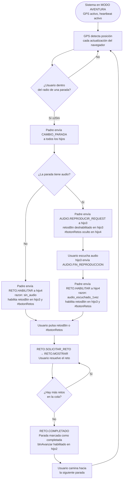

---

### 2.3. Inicialización y arranque

Al arrancar `codigo-padre.html`:

1. El modo inicial es `MODOS.CASA` (hardcoded en estado inicial, línea 3257).
2. Se comprueba si existe `vv_aventura_iniciada` en `localStorage`.
   - Si existe → `ejecutarRestauracionAventura()` (línea 4155) restaura el estado anterior.
   - Si no existe → la app queda en MODO CASA esperando que el usuario complete las demos.
3. Tras completar las demos (P16 envía `SELECCION.AVENTURA_ACTIVADA`), el padre carga iframes, espera handshakes `HIJO_LISTO` y distribuye datos. El sistema queda en **MODO CASA**.

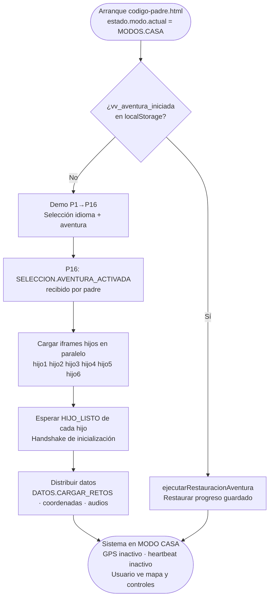

---

### 2.4. Cambio de modo: CASA → AVENTURA

**Disparador**: el usuario pulsa el botón GPS en hijo5. hijo5 envía `SISTEMA.CAMBIO_MODO` con `modo: 'aventura'` al padre.

**Controlador en padre**: `_hdl_SISTEMA_CAMBIO_MODO()` (línea 6201), que delega en `manejarCambioModo(estado, mensaje)` de `js/app.js`.

**Payload de `SISTEMA.CAMBIO_MODO`**:

```javascript
{
    tipo: 'SISTEMA.CAMBIO_MODO',
    origen: CONFIG_PADRE.ID,
    destino: hijoId,   // [hijo2, hijo3, hijo4, hijo5]
    datos: {
        modo: 'aventura',
        timestamp: Date.now(),
        propagadoDesde: 'hijo5',
        razon: 'cambio_modo_global',
        secuenciaCompleta: true
    }
}
```

**Secuencia completa** (`_propagarCambioModoAHijos`, línea 6093; `_activarHeartbeatAventura`, línea 6121):

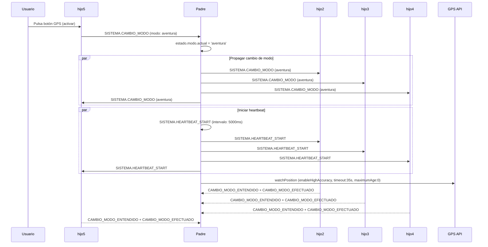

---

### 2.5. Cambio de modo: AVENTURA → CASA

**Disparador**: el usuario pulsa el botón GPS en hijo5 estando en AVENTURA. hijo5 envía `SISTEMA.CAMBIO_MODO` con `modo: 'casa'`.

**Secuencia** (`_pausarHeartbeatCasa()`, línea 6135):

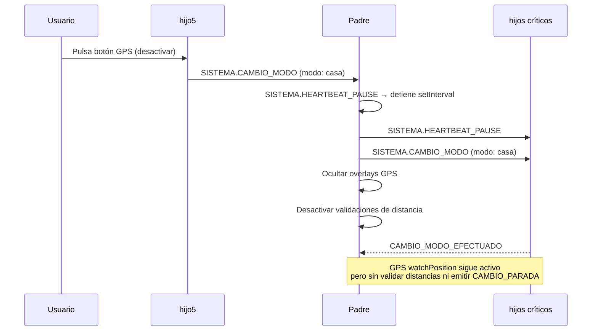

---

### 2.6. GPS: comportamiento según modo

**Parámetros de `watchPosition`** (función `activarGPS()`, línea 5067):

```javascript
navigator.geolocation.watchPosition(onGpsSuccess, onGpsError, {
    enableHighAccuracy: true,   // GPS + A-GPS, máxima precisión
    timeout: 35000,             // 35 s antes de reportar error
    maximumAge: 0               // Sin caché — siempre posición fresca
})
```

| Comportamiento GPS | MODO CASA | MODO AVENTURA |
|--------------------|-----------|---------------|
| `watchPosition` activo | Sí (no se detiene al salir de AVENTURA) | Sí |
| Validación de distancia a paradas | No | Sí (radio ~20m) |
| `CAMBIO_PARADA` automático | No | Sí, al entrar en radio |
| Overlay "fuera de rango" | Oculto | Visible si >50m de la ruta |
| Snap-to-route en tramos | No | Sí (`activarFlechaUsuario()`) |
| Marcador del usuario en mapa | 🛸 | ▲ triángulo azul `#4285F4`, rota con brújula |

**Ciclo de vida del GPS**:

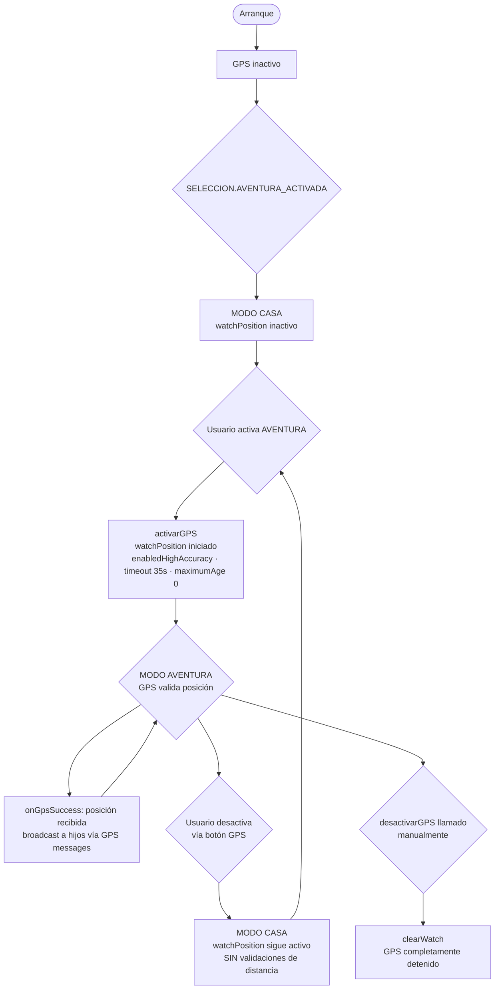

---

### 2.7. Heartbeat: monitorización de hijos

Solo activo en **MODO AVENTURA**. Detecta hijos colgados o desconectados.

**Configuración** (`js/config.js`):

- Intervalo: **5000 ms** (5 segundos)
- Máximo de fallos consecutivos antes de marcar como desconectado: **3**
- `AUTO_RECONECTAR: true` → recarga el iframe automáticamente

**Mensajes del heartbeat** (`js/constants.js`):

| Mensaje | Dirección | Significado |
|---------|-----------|-------------|
| `SISTEMA.HEARTBEAT_START` | padre → hijo | Iniciar ciclo de heartbeat |
| `SISTEMA.HEARTBEAT` | padre → hijo | Latido — "¿sigues vivo?" |
| `SISTEMA.HEARTBEAT_RESPONSE` | hijo → padre | "Sigo vivo" |
| `SISTEMA.HEARTBEAT_PAUSE` | padre → hijo | Detener heartbeat (al pasar a MODO CASA) |

**Flujo del heartbeat**:

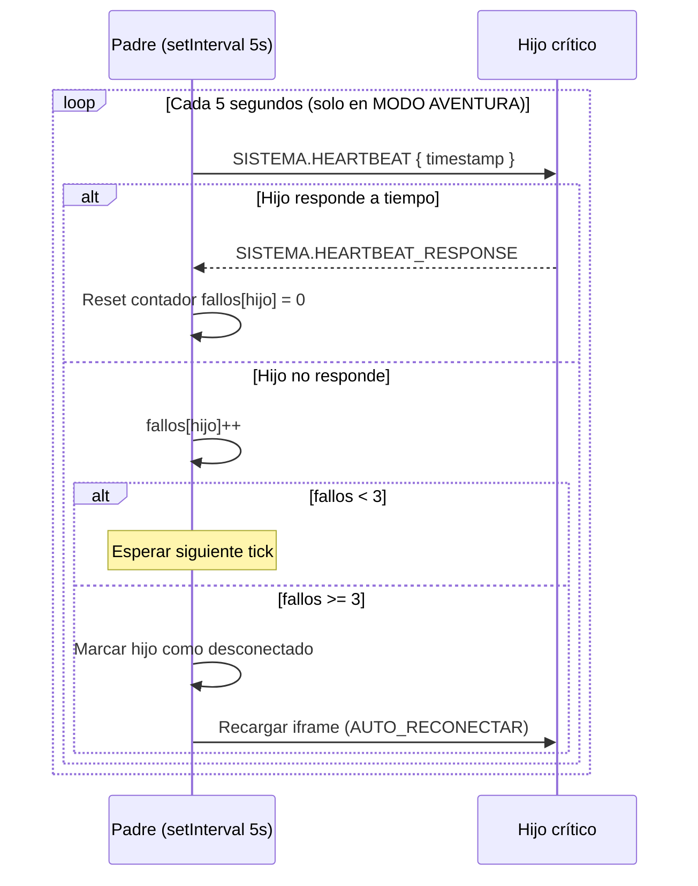

---

### 2.8. Controladores y funciones de cambio de modo

**Controladores registrados en `codigo-padre.html`**:

| Controlador | Línea | Tipo de mensaje | Qué hace |
|-------------|-------|-----------------|----------|
| `_hdl_SISTEMA_CAMBIO_MODO` | 6201 | `SISTEMA.CAMBIO_MODO` | Recibe petición, delega en `manejarCambioModo()` |
| Heartbeat handler | 6232 | `SISTEMA.HEARTBEAT` | Responde con `HEARTBEAT_RESPONSE` |
| `HEARTBEAT_RESPONSE` handler | 6280 | `SISTEMA.HEARTBEAT_RESPONSE` | Resetea contador de fallos del hijo |
| `CAMBIO_MODO_RESPONSE` handler | 6348 | `SISTEMA.CAMBIO_MODO_RESPONSE` | Actualiza estado del hijo en el padre |

**Funciones internas clave**:

| Función | Línea | Qué hace |
|---------|-------|----------|
| `manejarCambioModo(estado, mensaje)` | `js/app.js` | Orquesta la secuencia completa |
| `_propagarCambioModoAHijos()` | 6093 | Envía `CAMBIO_MODO` a cada hijo crítico |
| `_gestionarHeartbeatSegunModo()` | 6161 | Inicia o pausa heartbeat según el modo |
| `_activarHeartbeatAventura()` | 6121 | Envía `HEARTBEAT_START` a padre e hijos |
| `_pausarHeartbeatCasa()` | 6135 | Envía `HEARTBEAT_PAUSE` y limpia |
| `_gestionarGpsSegunModo()` | 6183 | Activa/desactiva overlays GPS |
| `activarGPS()` | 5067 | Inicia `watchPosition` |
| `desactivarGPS()` | 5154 | Llama `clearWatch()` |
| `ejecutarRestauracionAventura()` | 4155 | Restaura sesión desde `localStorage` |

---

### 2.9. Tabla comparativa: comportamiento de cada hijo por modo

| Hijo | MODO CASA | MODO AVENTURA |
|------|-----------|---------------|
| **hijo1** `extrainfo-hijo1.html` | Disponible, sin cambios. | Disponible, sin cambios. No tiene lógica específica de modo. |
| **hijo2** `coordenadas-hijo2.html` | Mapa visible. Posición del usuario como 🛸. Sin snap-to-route. Sin overlays de rango. Sin `CAMBIO_PARADA` automático. | Mapa con posición ▲ en tiempo real, rota con brújula. Snap-to-route activo en tramos. Overlays de "fuera de rango" visibles. `CAMBIO_PARADA` automático al entrar en radio de parada. |
| **hijo3** `audio-hijo3.html` | Reproducción bajo demanda. `retosBtn` **habilitado inmediatamente** si la parada tiene `reto_id`; deshabilitado en tramos o paradas sin reto. | Audio enviado automáticamente al llegar a cada parada (`AUDIO.REPRODUCIR_REQUEST`). `retosBtn` habilitado tras `FIN_REPRODUCCION` (o inmediatamente si sin audio). |
| **hijo4** `retos-hijo4.html` | `#botonRetos-wrapper` visible. Habilitado en paradas, deshabilitado en tramos, controlado por `RETO.ESTADO_CASA`. | `#botonRetos-wrapper` oculto al llegar a una parada. Aparece y se habilita al recibir `RETO.HABILITAR` (tras audio o `razon: sin_audio`). |
| **hijo5** `boton-casa-hijo5.html` *(desarrollo)* | Botón GPS en rojo "OFF". Lista de paradas navegable manualmente. | Botón GPS en verde "ON". Lista de paradas actualizada automáticamente según progresión GPS. |
| **hijo6** `chat-hijo6.html` | Disponible sin cambios. | Disponible sin cambios. |

**Mensajes recibidos por cada hijo al cambiar de modo**:

| Hijo | → AVENTURA | → CASA |
|------|-----------|--------|
| hijo1 | `SISTEMA.CAMBIO_MODO` | `SISTEMA.CAMBIO_MODO` |
| hijo2 | `SISTEMA.CAMBIO_MODO` + `SISTEMA.HEARTBEAT_START` | `SISTEMA.CAMBIO_MODO` + `SISTEMA.HEARTBEAT_PAUSE` |
| hijo3 | `SISTEMA.CAMBIO_MODO` + `SISTEMA.HEARTBEAT_START` | `SISTEMA.CAMBIO_MODO` + `SISTEMA.HEARTBEAT_PAUSE` |
| hijo4 | `SISTEMA.CAMBIO_MODO` + `SISTEMA.HEARTBEAT_START` | `SISTEMA.CAMBIO_MODO` + `SISTEMA.HEARTBEAT_PAUSE` |
| hijo5 | `SISTEMA.CAMBIO_MODO` + `SISTEMA.HEARTBEAT_START` | `SISTEMA.CAMBIO_MODO` + `SISTEMA.HEARTBEAT_PAUSE` |
| hijo6 | `SISTEMA.CAMBIO_MODO` | `SISTEMA.CAMBIO_MODO` |

> hijo1 y hijo6 no están en la lista de hijos críticos (`[hijo2, hijo3, hijo4, hijo5]`) y por tanto no reciben heartbeat.

---

## 3. Cómo funciona a vista de pájaro

Imagina la aplicación como una **pila de transparencias**. La pantalla principal (`codigo-padre.html`, el "padre") es el proyector, y cada transparencia es un iframe que se superpone sobre los demás. Varios pueden estar activos simultáneamente — unos visibles, otros invisibles pero escuchando mensajes.

El padre es el único que tiene visión global del sistema. Conoce el modo actual, el progreso de la aventura, las coordenadas de cada parada y el estado de todos los hijos. Los hijos solo conocen su propio dominio (el mapa, el audio, los retos...) y se comunican hacia arriba, al padre, que decide qué hacer con esa información.

### 3.1. La pila de iframes (orden z-index)

```text
┌────────────────────────────────────────────────────┐
│                codigo-padre.html                    │
│                (orquestador central)                │
│                                                     │
│  ▲ z-index más alto                                 │
│  │                                                  │
│  │  ┌─────────────────────────────────────────┐     │
│  │  │ boton-casa-hijo5.html  [DEV]            │     │
│  │  │ herramienta de desarrollo — no en PWA  │     │ ← simula navegación en modo CASA desde escritorio
│  │  └─────────────────────────────────────────┘     │
│  │  ┌─────────────────────────────────────────┐     │
│  │  │ retos-hijo4.html                        │     │ ← visible SOLO cuando el usuario inicia un reto
│  │  │ extrainfo-hijo1.html                    │     │ ← panel lateral de opciones extra
│  │  │ chat-hijo6.html  (carga lazy, 1er uso)  │     │ ← asistente de soporte FAQ
│  │  └─────────────────────────────────────────┘     │
│  │  ┌─────────────────────────────────────────┐     │
│  │  │ audio-hijo3.html  (invisible, siempre   │     │
│  │  │  activo en segundo plano)               │     │ ← solo reproduce audio, nunca visible
│  │  └─────────────────────────────────────────┘     │
│  │  ┌─────────────────────────────────────────┐     │
│  │  │ coordenadas-hijo2.html  (mapa)          │     │ ← siempre visible durante la aventura
│  │  └─────────────────────────────────────────┘     │
│  ▼ z-index más bajo                                 │
│                                                     │
│  Al inicio, En-busca-del-tesoro.html cubre          │
│  toda la pantalla (z-index máximo). Contiene        │
│  puzzle.html como sub-iframe propio — NO es         │
│  un hijo directo del padre.                         │
└────────────────────────────────────────────────────┘
```

**Notas sobre visibilidad**:

- `hijo3` (audio) nunca es visible — existe solo para reproducir audio en segundo plano.
- `hijo4` (retos) solo se hace visible cuando el padre llama `mostrarHijo4()` al recibir `RETO.SOLICITAR_RETO`. Al cerrarse el reto vuelve a `display:none`.
- `hijo6` (chat) se carga de forma lazy — solo se inicializa la primera vez que el usuario lo abre.
- `hijo5` es una herramienta de desarrollo exclusiva; no forma parte de la PWA real.

### 3.2. Arquitectura de comunicación

Los hijos **nunca se hablan entre sí directamente** — toda comunicación pasa por el padre mediante `postMessage`. El padre actúa como bus de mensajes central: recibe notificaciones de los hijos, toma decisiones y envía órdenes de vuelta.

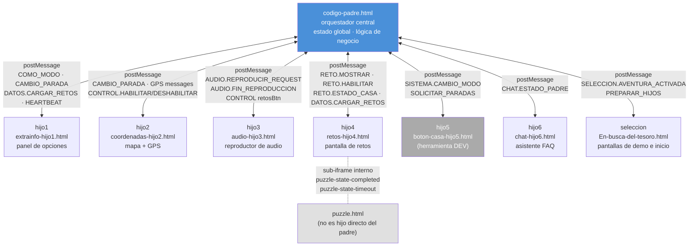

> Para el detalle de cada mensaje, controladores, payloads y comportamiento por modo ver **§2** y **§8**.

### 3.3. Ciclo de vida completo de una sesión

Este es el arco completo desde que el usuario abre la app hasta que completa la aventura:

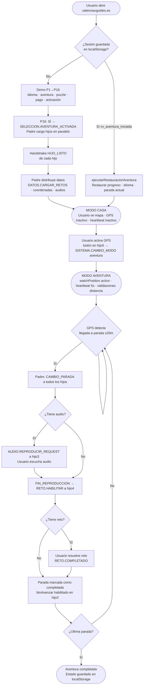

### 3.4. Modo CASA vs modo AVENTURA — qué cambia

La app siempre arranca en **modo CASA** (`estado.modo.actual = 'casa'`). El usuario pasa a **modo AVENTURA** cuando activa el GPS desde hijo5. Desde ese momento, el padre gestiona los dos modos de forma radicalmente diferente. La misma acción — cambiar de parada — produce efectos distintos según el modo activo.

**Resumen ejecutivo:**

| | Modo CASA | Modo AVENTURA |
|--|-----------|---------------|
| **GPS** | Apagado | Encendido (`watchPosition` continuo) |
| **Heartbeat** | Pausado | Activo cada ~5 s |
| **Quién cambia de parada** | El usuario — pulsa una parada en hijo5 | El GPS — el padre detecta llegada (≤ 20 m) |
| **`retosBtn` al llegar a una parada** | Se habilita **inmediatamente** si la parada tiene reto | Arranca **deshabilitado** — se habilita solo cuando termina el audio |
| **Botón vídeo/dron (`#btn-video`)** | Habilitado inmediatamente si el elemento es tramo | Habilitado si elemento es tramo Y reto no activo |
| **Audio** | No se reproduce automáticamente | Se lanza solo al llegar a cada parada |
| **Botón "Avanzar" (hijo2)** | Sin efecto — GPS inactivo | Se bloquea al entrar en cada parada; se desbloquea al completar audio + reto |
| **Polylines y marcadores del mapa** | Visibles **inmediatamente** tras dibujar | Ocultos (opacity 0) — se revelan cuando el usuario pulsa btn-avanzar (`pendingRevealNavegacion`) |

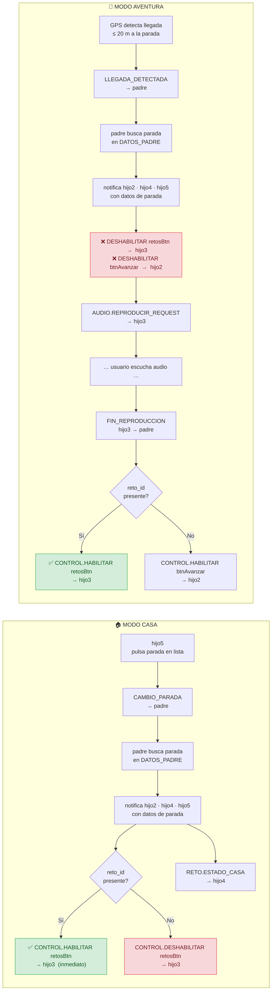

**Flujo CAMBIO_PARADA en modo CASA** — mensajes exactos cuando el usuario pulsa una parada en hijo5:

```text
hijo5  →  CAMBIO_PARADA { paradaId: "padre-P0" }  →  padre
padre  →  busca parada en DATOS_PADRE
padre  →  CAMBIO_PARADA { parada, coordenadas, audio_id, reto_id }  →  hijo2, hijo4, hijo5
padre  →  CONTROL.HABILITAR { control: 'retosBtn' }  →  hijo3   ← inmediato si tiene reto_id
padre  →  RETO.ESTADO_CASA { habilitado: true }  →  hijo4         ← si es parada (no tramo)
```

**Flujo CAMBIO_PARADA en modo AVENTURA** — mensajes exactos cuando el GPS detecta llegada:

```text
hijo2  →  LLEGADA_DETECTADA { paradaId }  →  padre
padre  →  busca parada en DATOS_PADRE
padre  →  CAMBIO_PARADA { parada, coordenadas, audio_id, reto_id }  →  hijo2, hijo4, hijo5
padre  →  CONTROL.DESHABILITAR { control: 'retosBtn' }  →  hijo3  ← bloqueado hasta audio
padre  →  CONTROL.DESHABILITAR { control: 'btnAvanzar' }  →  hijo2
padre  →  AUDIO.REPRODUCIR_REQUEST { audioId }  →  hijo3
     ... [usuario escucha audio] ...
hijo3  →  AUDIO.FIN_REPRODUCCION  →  padre
padre  →  CONTROL.HABILITAR { control: 'retosBtn' }  →  hijo3    ← ahora sí se habilita
```

> Para los detalles técnicos de `_configurarRetoBtn`, la búsqueda de paradas en `DATOS_PADRE` y la precedencia de IDs ver **§5** y **§6**.

---

## 4. Iconografía visual: emojis, marcadores y polylines

> Referencia rápida de todos los elementos visuales que el usuario ve durante la aventura: emojis en la interfaz, marcadores en el mapa y líneas de ruta.

### 4.1. Emojis en las pantallas de selección (En-busca-del-tesoro.html)

Estos emojis aparecen durante las 16 pantallas de demo/selección, antes de que comience la aventura.

| Emoji | Dónde aparece | Para qué sirve |
|-------|---------------|-----------------|
| → | Botones de avanzar/confirmar (P1, P4, P5, P6, P8, P9, P11, P12, P13, P15, P16) | Flecha de navegación "ir a la siguiente pantalla" |
| ➜ | Botón grande del puzzle (P10) | Flecha gruesa para continuar tras completar el puzzle |
| ✓ | Feedback de código correcto (P14) | Indicar código de activación correcto |
| ✗ | Botones rojos de rechazo (P3, P8), feedback de código incorrecto (P14) | Cancelar selección o indicar respuesta incorrecta |
| 🎬 | Pantalla de vídeo (P9) | Placeholder para el vídeo introductorio (aún no implementado) |
| 💳 | Pantalla de pago (P13) | Icono de la pasarela de pago (aún no implementada) |
| 🔑 | Pantalla de activación (P14) | Indica que se necesita un código de acceso |
| ✒️ | Pantalla de activación (P14) | Acompañamiento visual del campo de entrada |
| ❓ | Pantalla de activación (P14) | Indica ayuda o instrucciones |
| 🚀 | Botón de iniciar aventura (P14) | Avanza a P15 (normativa); la aventura se lanza al aceptar en P16 |
| 🔇 | Overlay de aviso (confirmación en P10) | Indica que no hay audio disponible para la combinación idioma+aventura |

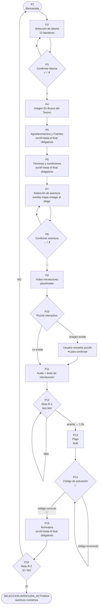

### 4.2. Emojis en los botones de selección de aventura (P7)

Cada aventura muestra una línea de estadísticas con emojis universales (no necesitan traducción):

| Emoji | Significado | Ejemplo |
|-------|-------------|---------|
| 👣 | Vehículo: a pie | Aventuras 1, 2 y Fallas |
| 🚲 | Vehículo: bicicleta | Aventuras 3, 4 y 5 |
| 🛴 | Vehículo: patinete | Aventuras 3, 4 y 5 (combinado con 🚲) |
|🏛️  🚲🛴👣 | Vehículo: mixto | Aventura 34km |
| | Número de monumentos | `🏛️19` = 19 monumentos |
| 📍 | Número de paradas | `📍41` = 41 paradas |
| 🧩 | Número de retos | `🧩30` = 30 retos |
| ⏳ | Tiempo máximo para completar | `⏳max60h` = 60 horas |

### 4.3. Emojis durante la aventura activa

Una vez en modo AVENTURA, estos emojis aparecen en la interfaz:

| Emoji | Componente | Para qué sirve |
|-------|------------|-----------------|
| ✖ | Hijo 2 (overlay fuera de rango) | Botón para cerrar el aviso de "estás fuera de rango" |
| 🔄 | Puzzle (puzzle.html) | Reiniciar el puzzle |
| ⏸️ / ▶️ | Puzzle (puzzle.html) | Pausar / reanudar el puzzle |
| ↑ | Mapa (funciones-mapa.js) | Flecha snap-to-route proyectada sobre la polyline del tramo activo |


### 4.3b. Emojis en hijo5 (herramienta de desarrollo — no visible en la PWA final)

`boton-casa-hijo5.html` es una herramienta exclusiva de desarrollo para simular el modo CASA desde el escritorio. No aparece en la PWA real.

| Emoji | Componente | Para qué sirve |
|-------|------------|-----------------|
| 🛰️ | Hijo 5 (botón casa) | Botón de activación/desactivación del GPS. Muestra "ON" (verde) en aventura, "OFF" (rojo) en casa |
| 🎯 | Hijo 5 (lista de paradas) | Identifica las **paradas** (puntos de interés) en la lista lateral |
| 🛣️ | Hijo 5 (lista de paradas) | Identifica los **tramos** (caminos entre paradas) en la lista lateral |
| 📌 | Hijo 5 (lista de paradas) | Identifica el **punto de inicio** de la ruta |
| ? | Hijo 5 (lista de paradas) | Tipo de punto desconocido (fallback, texto plano, clase `default-btn`) |

### 4.4. Emojis en los retos (hijo 4)

| Emoji / Elemento | Cuándo aparece | Significado |
|-------------------|----------------|-------------|
| Borde **verde** | Al acertar un reto | Respuesta correcta |
| Borde **rojo** | Al fallar un reto | Respuesta incorrecta |
| Animación de **fuegos artificiales** (chispas de colores) | Al acertar | Celebración visual. 15 explosiones con 30 chispas cada una |
| Vibración del móvil (300 ms) | Al fallar | Feedback háptico de error |
| 🆘❓ Botón SOS (`#btnMostrarRespuesta`) | Siempre visible | Muestra/oculta el panel con la respuesta correcta. Segunda pulsación lo esconde |
| 🌍 Botón continuar (`#btnNextAfterReto`) **deshabilitado** | Antes de acertar | `.btn-mundo-verde:disabled` — `opacity: 0.35`, `cursor: not-allowed`, elementos orbita detenidos. No interactivo hasta respuesta correcta |
| 🌍 Botón continuar (`#btnNextAfterReto`) **verde brillante** | Después de acertar | `.btn-mundo-verde` habilitado, con elementos orbitando (➣ 🎯) en animación continua |
| 🌍 Botón puzzle (`#btn-puzzle-continuar`) | Cuando el puzzle se completa | Mismo estilo `.btn-mundo-verde` con orbiting; oculto hasta que `puzzle.html` envía `puzzle-state-completed` |


### 4.5. Marcadores en el mapa

El mapa usa emojis y formas coloreadas como marcadores sobre las paradas:

| Marcador | Forma | Color | Cuándo aparece |
|----------|-------|-------|----------------|
| 📌 | Emoji chincheta | — | **Punto de inicio** de la ruta |
| 🎯 | Emoji diana | — | **Paradas** (puntos de interés) y **punto final** de la ruta |
| ● (círculo CSS) | Círculo sólido con borde blanco y sombra | `#F44336` rojo | Marcador de inicio alternativo |
| ● (círculo CSS) | Círculo sólido con borde blanco y sombra | `#4CAF50` verde | Marcador de parada alternativo |
| ▲ (flecha GPS) | Triángulo CSS con borde blanco y punto central pulsante | `#4285F4` azul Google | **Posición real del usuario** en tiempo real (modo AVENTURA). Rota con la brújula del dispositivo vía `DeviceOrientationEvent` (hasta 30 veces/segundo sin recrear el marcador). En modo CASA aparece como 🛸 |
| ↑ (flecha snap-to-route) | Carácter `↑` rotado según brújula | `#0066cc` azul oscuro | **Posición del usuario proyectada sobre la polyline del tramo activo.** Solo aparece durante un tramo (no en paradas). Usa `L.GeometryUtil.closest()` para buscar el punto de la polyline más cercano al usuario y pone la flecha exactamente ahí — efecto "sigues el camino". Se activa en `completarCambioParada()` al detectar `tipo === 'tramo'` y se desactiva al volver a una parada. Se actualiza en cada posición GPS y en cada cambio de brújula |
| ○ (círculo 21 m) | Círculo `L.circle` radio 21 m | Borde rojo, relleno amarillo semitransparente | Acompaña siempre a la flecha snap-to-route. Indica la zona de tolerancia visual alrededor del punto proyectado |
| 🏛️ (píldora referencia) | Div CSS: píldora blanca con borde naranja | `#ff8c00` naranja | **Referencias visuales** — monumentos mencionados en el texto que el usuario nunca visita físicamente. Muestra el emoji 🏛️ a la izquierda y el número de `mapa_numero` a la derecha. Al pulsar abre un popup con el nombre del monumento. Escala dinámicamente con el zoom. `zIndexOffset: 400` (por debajo de paradas visitadas). Gestionado por `crearIconoReferencia()` y `dibujarReferencias()` en `funciones-mapa.js` |


### 4.6. Polylines (líneas de ruta en el mapa)

Las polylines son las líneas que se dibujan en el mapa para mostrar rutas, tramos y navegación. Sus estilos varían según el tipo:

| Tipo de polyline | Color | Grosor base | Opacidad | Patrón | Cuándo se dibuja |
|-----------------|-------|-------------|----------|--------|------------------|
| **Ruta principal** | `#0077ff` (azul) | 6 px | 0.8 | Sólido | Al activar la aventura. Muestra todo el recorrido completo |
| **Tramo normal** | `#3388ff` (azul claro) | 4 px | 0.7 | Sólido | Al seleccionar un tramo específico entre dos paradas |
| **Tramo destacado** | `#ff4500` (naranja-rojo) | 6 px | 0.9 | Sólido | Cuando un tramo está activo o enfatizado (el actual) |
| **Línea de navegación** | `#3388ff` (azul claro) | 2 px | 0.7 | Discontinuo `10, 10` | Cuando el usuario está a más de 50 m de la ruta. Muestra el camino de vuelta |

**Escalado dinámico:** Todos los grosores se multiplican por un factor de escala que depende del tamaño de la pantalla y el nivel de zoom del mapa. La función `getPolylineEscalado()` calcula los valores finales.

**Comportamiento automático:**

- La **polyline de navegación** aparece automáticamente cuando el usuario se aleja más de 50 metros de la ruta. Incluye los waypoints intermedios del tramo para guiar al usuario por el camino correcto (no en línea recta).
- Se **elimina automáticamente** cuando el usuario vuelve a estar dentro de los 50 metros.
- También se puede activar **manualmente**: el usuario pulsa `btn-ubicacion` en hijo2, que envía `NAVEGACION.MOSTRAR_UBICACION_POLYLINE` `{ ubicacionUsuario, proximoElemento, centrar: true, zoom: 16 }` al padre. El padre dibuja la misma polyline discontinua desde la posición actual hasta la próxima parada.
- Todas las polylines se posicionan con `zIndex 500` para aparecer por encima del mapa base pero por debajo de los marcadores.

**Snap-to-route (flecha sobre la polyline):**

Cuando el padre cambia a un **tramo** (via `CAMBIO_PARADA` con `tipo === 'tramo'`), `completarCambioParada()` en `funciones-mapa.js`:

1. Guarda los puntos del tramo (inicio + waypoints intermedios + fin) en `estadoMapa.tramoWaypoints`.
2. Setea `estadoMapa.tramoActual` con el ID del tramo.
3. Llama a `activarFlechaUsuario()`, que registra un listener `zoomend` y pone `flechaActiva = true` (solo si el modo es `AVENTURA`).

Con `flechaActiva = true`, `actualizarPosicionFlecha()` se ejecuta en cada actualización GPS y en cada cambio de brújula. Calcula con `L.GeometryUtil.closest()` el punto de `estadoMapa.tramoWaypoints` más cercano al usuario y mueve la flecha `↑` y el círculo de 21 m exactamente a ese punto.

Cuando el padre cambia a una **parada**, `completarCambioParada()` llama a `desactivarFlechaUsuario()`: borra la flecha y el círculo del mapa, desregistra el listener `zoomend` y pone `flechaActiva = false`.


### 4.7. Botones del hijo 2 (coordenadas) — iconos por imagen

Los 6 botones del panel de `coordenadas-hijo2.html` no usan emojis sino imágenes PNG. Orden en el HTML (de arriba a abajo):

| ID | Imagen PNG | Mensaje enviado al padre | Acción |
|----|-----------|--------------------------|--------|
| `btn-mapa-completo` | `H2-fotomapa-moderno.png` | `NAVEGACION.MOSTRAR_MAPA_JPG` `{ formato: 'html', url: 'mapa-completo.html?aventura=X' }` | Abre el mapa interactivo completo en overlay |
| `btn-mapa-jpg` | `H2-fotomapa-vintage.png` | `NAVEGACION.MOSTRAR_MAPA_JPG` `{ formato: 'jpg', url: <urlMapaVintage> }` | Abre el JPG del mapa vintage de la aventura actual |
| `btn-video` | `H2-fotodron.png` | `_reproducirVideoParada()` (interno) | Solo disponible en **tramos**. Reproduce el vídeo de dron del tramo. Deshabilitado en paradas |
| `btn-imagen` | `H2-fotoproximo-monumento.png` | `UI.ACCION_USUARIO` `{ accion: 'mostrar-imagen', paradaActual, urlImagen, imagenes[], tipo, mapa_numero }` | Abre imagen o galería del monumento de la parada actual. **Siempre habilitado** en MODO AVENTURA: no se deshabilita con `fueraDeRango5min === true` (el usuario necesita ver qué está buscando), ni cuando el reto o el vídeo están activos (cubren toda la pantalla y el botón queda tapado). Solo se deshabilita cuando el padre envía `CONTROL.DESHABILITAR { control: 'btnImagen' }` |
| `btn-avanzar` | `fotoruta-A-B.png` | `NAVEGACION.GPS.ACTIVAR` `{ activar: bool, idParada, distancia }` | Botón de progresión y revelación de navegación. **En paradas** (completada: audio + reto): habilitado por el padre vía `CONTROL.HABILITAR { control: 'btnAvanzar', razon: 'parada_completada' }`. Al pulsar: establece `estado.pendingRevealNavegacion = true` y llama `progresarSiguienteElemento()` — el siguiente `CAMBIO_PARADA` muestra de inmediato la navegación del nuevo elemento. **En tramos**: habilitado por GPS cuando el usuario está a 5-50 m del inicio del tramo. Al pulsar: llama `revelarNavegacion()` directamente (polyline + 📌 + 🎯 ya estaban cargados pero ocultos). El GPS auto-avanza cuando el usuario llega al final del tramo. El tracking GPS **nunca se detiene** |
| `btn-ubicacion` | `H2-fotodistancia.png` | `NAVEGACION.MOSTRAR_UBICACION_POLYLINE` `{ ubicacionUsuario, proximoElemento, centrar: true, zoom: 16 }` | Muestra polyline de navegación desde posición actual hasta próxima parada. Cierra el overlay fuera de rango si estaba visible |


### 4.7b. Imagen de error GPS — overlay del padre

El archivo `imagenes/imagenes-aplicación/fotogpserror.png` lo usa `codigo-padre.html` (línea 5363) como imagen del overlay de error GPS (`#gps-error-img`). Se muestra cuando la precisión GPS es baja o la geolocalización falla. No es un botón de hijo2 — es un overlay gestionado directamente por el padre.

### 4.7c. Control de audio — overlay del padre (`#audio-control-overlay`)

El control de audio **no está en hijo3** — está en `codigo-padre.html` como un fieldset flotante superpuesto sobre el iframe de hijo3. Lo gestiona enteramente el padre.

**Estructura HTML:**

| ID | Imagen PNG | Función |
|----|-----------|---------|
| `#audio-main-toggle-btn` | `boton-audio-central.png` | Botón principal. Abre/cierra el dropdown de acciones. **Verde** si la parada tiene audio, **rojo** si no |
| `#audio-action-play` (`.audio-action-btn`) | `boton-audio-play.png` | Reproducir audio |
| `#audio-action-pause` (`.audio-action-btn`) | `boton-audio-pausa.png` | Pausar audio |
| `#audio-action-stop` (`.audio-action-btn`) | `boton-audio-stop.png` | Detener audio |
| `#audio-action-replay` (`.audio-action-btn`) | `boton-audio-replay.png` | Volver a escuchar desde el inicio |

Los 4 botones de acción están dentro de `#audio-control-dropdown` y son invisibles hasta que el usuario pulsa `#audio-main-toggle-btn` (el overlay adquiere la clase `.open`).

**Lógica de habilitación** — `actualizarEstadoControlesAudioPadre()` en `codigo-padre.html`:

```javascript
const hayAudio = !!obtenerAudioIdActivoPadre();
mainBtn.disabled = !hayAudio;          // verde si hay audio, rojo si no
actionButtons.forEach(btn => btn.disabled = !hayAudio);
if (!hayAudio) overlay.classList.remove('open'); // cierra dropdown si no hay audio
```

Se llama cada vez que cambia la parada activa. El botón **cambia de estado por parada** — algunas paradas no tienen audio y el botón permanece rojo.

> **Nota sobre el glow:** Los selectores CSS de glow (`#audio-main-toggle-btn:not(:disabled):not(.spinning)` y `.audio-action-btn:not(:disabled)`) no usan prefijo de modo. El `body` de `codigo-padre.html` nunca recibe la clase `modo-aventura` (solo los hijos la reciben vía CAMBIO_MODO), por lo que un prefijo `.modo-aventura` haría que el glow nunca disparara en el padre.


### 4.7d. Revelación de navegación en el mapa (`pendingRevealNavegacion`)

#### Principio de diseño

El comportamiento difiere según el modo:

- **Modo AVENTURA:** Cuando se avanza a un nuevo elemento, el mapa carga los datos de navegación (polyline azul, marcador 📌 inicio, marcador 🎯 fin) pero los mantiene **invisibles**. La navegación solo se muestra cuando el usuario pulsa `btn-avanzar` explícitamente. **Por qué:** El usuario necesita escuchar el audio y completar el reto antes de saber adónde ir.
- **Modo CASA:** La navegación se muestra **inmediatamente** tras dibujar los elementos — no hay audio obligatorio ni reto que completar antes de ver la ruta.

#### Mecanismo técnico: flag `pendingRevealNavegacion` (solo AVENTURA)

El flag `estado.pendingRevealNavegacion` (`boolean`, inicializado a `false` en `codigo-padre.html`) coordina cuándo mostrar la navegación **en modo AVENTURA**:

- **`false` (valor por defecto):** `completarCambioParada()` en `js/funciones-mapa.js` llama `_ocultarNavegacion()` tras dibujar los elementos.
- **`true`:** `completarCambioParada()` mantiene los elementos visibles y resetea el flag a `false`.

```text
CAMBIO_PARADA recibido
        │
        ▼
completarCambioParada():
  1. Limpia capas anteriores (polylines, tramo markers 📌🎯 — siempre, independiente del modo)
  2. Dibuja polyline (si tramo) + marcadores 📌🎯 (o 🎯 si parada)
  3. Hace zoom/flyTo al destino
  4. Decide visibilidad:
        ├─ pendingRevealNavegacion=true  → visible, resetea flag a false   [AVENTURA, btn-avanzar]
        ├─ modo ≠ 'aventura'             → visible inmediatamente          [CASA]
        └─ modo = 'aventura', flag=false → _ocultarNavegacion(): opacity 0 [AVENTURA, recién llegado]
```

**Código de `_ocultarNavegacion()`** (`js/funciones-mapa.js`):
```javascript
// Pone opacity:0 en todos los elementos de navegación activos
rutasActivas.forEach(r => r.setStyle({ opacity: 0 }));
marcadoresParadas.get('tramo-inicio-ruta')?.setOpacity(0);  // 📌
marcadoresParadas.get('tramo-fin-ruta')?.setOpacity(0);     // 🎯
marcadorParadaActual?.setOpacity(0);                         // 🎯 parada
estadoMapa.gpsVisualActivo = false;
```

**Código de `revelarNavegacion()`** (`js/funciones-mapa.js`, función exportada):
```javascript
// Restaura la visibilidad de los elementos ocultos
rutasActivas.forEach(r => r.setStyle({ opacity: 0.7 }));    // opacidad original del tramo
marcadoresParadas.get('tramo-inicio-ruta')?.setOpacity(1);
marcadoresParadas.get('tramo-fin-ruta')?.setOpacity(1);
marcadorParadaActual?.setOpacity(1);
estadoMapa.gpsVisualActivo = true;
```

#### Flujos por combinación de elementos

**Caso A — Parada → Tramo (btn-avanzar en parada completada):**

```text
Usuario escucha audio + completa reto en parada N
        │
        ▼
Padre: paradaListaParaAvanzar = true
       envía CONTROL.HABILITAR { control: 'btnAvanzar', razon: 'parada_completada' } → hijo2
        │
        ▼
Usuario pulsa btn-avanzar
        │
        ▼
_hdl_NAVEGACION_GPS_ACTIVAR():
  estado.paradaListaParaAvanzar = false
  estado.pendingRevealNavegacion = true   ← clave
  await progresarSiguienteElemento()      ← dispara CAMBIO_PARADA para Tramo 1
        │
        ▼
completarCambioParada() para Tramo 1:
  dibuja polyline azul + 📌 inicio + 🎯 fin
  hace flyTo al inicio del tramo
  ve pendingRevealNavegacion === true
  → deja polyline y markers VISIBLES
  → resetea flag a false
```

**Caso B — Parada → Parada (btn-avanzar en parada completada, sin tramo):**

Mismo flujo que caso A. `pendingRevealNavegacion = true` hace que `completarCambioParada()` deje visible el marcador 🎯 de la siguiente parada inmediatamente.

**Caso C — Tramo activo (btn-avanzar revela navegación sin avanzar):**

```text
CAMBIO_PARADA llega para Tramo N
        │
        ▼
completarCambioParada():
  dibuja polyline + 📌🎯
  pendingRevealNavegacion === false → _ocultarNavegacion()
  → poliline y markers OCULTOS
  → el mapa solo muestra la flecha GPS del usuario
        │
        ▼
Usuario pulsa btn-avanzar (habilitado por proximidad al inicio del tramo)
        │
        ▼
_hdl_NAVEGACION_GPS_ACTIVAR():
  paradaListaParaAvanzar === false (es tramo)
  → llama revelarNavegacion() DIRECTAMENTE
  → polyline + 📌🎯 se hacen visibles al instante (datos ya cargados)
  → NO hay progresarSiguienteElemento() — el GPS auto-avanza al llegar
```

**Caso D — GPS auto-avanza tramo (llega al final sin pulsar btn-avanzar):**

```text
Usuario llega al final del Tramo N (GPS detecta proximidad)
        │
        ▼
progresarSiguienteElemento() automático (sin pulsar btn-avanzar)
pendingRevealNavegacion === false (nadie pulsó el botón)
        │
        ▼
completarCambioParada() para la siguiente Parada M:
  dibuja 🎯 de la parada
  pendingRevealNavegacion === false → _ocultarNavegacion()
  → el 🎯 queda OCULTO
  → el usuario escucha el audio, completa el reto
  → btn-avanzar se habilita → usuario pulsa → Caso A o B
```

**Resumen de los 4 casos:**

| Transición | `pendingRevealNavegacion` al llegar | Navegación visible en CAMBIO_PARADA | Revelación |
|---|---|---|---|
| Parada→Tramo / Parada→Parada (btn-avanzar) | `true` | ✅ inmediata | Automática al cargar |
| Tramo activo (btn-avanzar) | n/a | — | `revelarNavegacion()` directo |
| GPS auto-avanza (llegada automática) | `false` | ❌ oculta | Al pulsar btn-avanzar siguiente |

### 4.8. Código de colores de estado en botones

| Color | Hex | Dónde aparece | Cuándo |
|-------|-----|---------------|--------|
| 🟢 Verde | `#1e7e34→#0d3a16` | `.boton` en hijo2, `.boton.habilitado` en hijo3 | Estado por defecto — botón activo y pulsable |
| 🔴 Rojo | `#dc3545→#c82333` (`opacity: 0.6`) | `.boton.disabled` en hijo2, `.boton.deshabilitado` en hijo3 | Botón bloqueado — GPS deshabilitado o precisión insuficiente |
| 🔵 Azul | `#007bff→#0056b3` | `.boton.activo` en hijo2 | Navegación revelada — `btn-avanzar` pulsado, polyline y marcadores visibles en el mapa |
| 🔵 Azul | `#0077cc` (inline) | `btnEnviar`, `btnNext` en hijo4 | Estado inicial/neutro de los botones de respuesta y continuar |
| 🟢 Verde | `#28a745` (inline) | `btnEnviar` en hijo4 | Respuesta correcta introducida |
| 🔴 Rojo | `#dc3545` (inline, 3 s) | `btnEnviar` en hijo4 | Respuesta incorrecta — vuelve a azul `#0077cc` tras 3 s |
| 🟢 Verde | `#28a745` (inline) | `btnNext` en hijo4 | Hay más retos en la cola tras acertar |
| ⬜ Gris | `#999` (inline) | `btnNext` en hijo4 | Último reto completado — ya no hay siguiente |
| 🟠 Naranja | `#ff8c00` | `.modal-close` en hijo2 | Botón de cerrar el modal de imagen/vídeo |

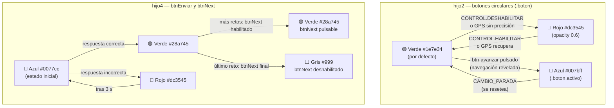

---

### 4.9. Animaciones de botones: glow y spin (ambos modos)

#### Tipos de animación

En ambos modos (CASA y AVENTURA) todos los botones habilitados tienen una animación de brillo interno ("glow") para guiar la atención del usuario. Los botones que requieren acción del usuario también realizan un giro ("spin") periódico para llamar la atención.

| Animación | Clase CSS / selector | Descripción visual | Intensidad |
|---|---|---|---|
| **Glow suave** | `animation: glow-suave 3s ease-in-out infinite` | Brillo interior que pulsa lentamente. Para botones siempre disponibles | `inset 0 0 8px rgba(255,255,255,0.15)` → `18px 0.38` |
| **Glow activo** | `animation: glow-activo 3s ease-in-out infinite` | Brillo interior más intenso y notable. Para botones que requieren acción | `inset 0 0 10px rgba(255,255,255,0.20)` → `26px 0.55` |
| **Spin** | clase `.spinning` añadida por JS | Giro de 4 vueltas (1440°) con rebote elástico al final. Dura 0.9 s | `@keyframes spin-btn/spin-ruleta` |

**Keyframes exactos** (definidos por archivo, mismo timing en todos):

```css
@keyframes glow-suave {
    0%, 100% { box-shadow: inset 0 0 8px rgba(255,255,255,0.15); }
    50%       { box-shadow: inset 0 0 18px rgba(255,255,255,0.38); }
}
@keyframes glow-activo {
    0%, 100% { box-shadow: inset 0 0 10px rgba(255,255,255,0.2); }
    50%       { box-shadow: inset 0 0 26px rgba(255,255,255,0.55); }
}
@keyframes spin-btn {          /* hijo2, hijo3, padre */
    0%   { transform: rotate(0deg); }
    60%  { transform: rotate(1080deg); }
    85%  { transform: rotate(1350deg); }
    100% { transform: rotate(1440deg); }
}
/* timing: 0.9s cubic-bezier(0.2, 0.8, 0.4, 1) forwards */
```

> En `extrainfo-hijo1.html` el keyframe equivalente se llama `spin-ruleta` (existe desde antes) con idéntico timing y ángulos.

#### Qué botón tiene qué animación

| Botón | Archivo | Glow | Spin | Condición CSS |
|---|---|---|---|---|
| `#mas-opciones` | hijo1 | Suave | ❌ (hijo1 excluido del spin) | `:not(.spinning)` |
| `.icono-flotante` ×5 | hijo1 | Suave | ❌ | siempre |
| `#audio-main-toggle-btn` | padre | **Activo** | ✅ | `:not(:disabled):not(.spinning)` |
| `.audio-action-btn` ×4 | padre | Suave | ❌ | `:not(:disabled)` |
| `btn-mapa-completo` | hijo2 | Suave | ❌ | `:not(.activo)` |
| `btn-mapa-jpg` | hijo2 | Suave | ❌ | `:not(.activo)` |
| `btn-imagen` | hijo2 | Suave | ❌ | `:not(.activo)` |
| `btn-video` | hijo2 | **Activo** | ✅ | `:not([disabled]):not(.activo)` |
| `btn-avanzar` | hijo2 | **Activo** | ✅ | `:not([disabled]):not(.activo)` |
| `btn-ubicacion` | hijo2 | **Activo** | ✅ | `:not([disabled]):not(.activo)` |
| `#retosBtn` | hijo3 | **Activo** | ✅ | `:not(:disabled):not(.activo)` |

**Por qué `:not(.activo)` en glow:** Cuando un botón tiene la clase `.activo` (el usuario acaba de pulsarlo y su contenido está abierto), tiene ya su propia indicación visual (fondo azul). No tiene sentido añadir glow encima.

**Por qué `:not([disabled])` en glow-activo:** Los botones glow-activo pueden estar deshabilitados (rojo, opacidad 0.6). Un botón deshabilitado no llama a la acción, así que tampoco debe brillar para llamarla.

**Por qué el `.spinning !important`:** La clase `.spinning` aplica un `animation` que sobrescribe el glow. Sin `!important`, el selector del glow (con ID, mayor especificidad `[1,2,0]`) ganaría al selector de la clase spinning `[0,1,0]`. El `!important` garantiza que el spin siempre anule el glow mientras dura el giro.

#### Lógica del spin (JS)

El spin aplica solo a los botones con **glow activo**. El comportamiento es idéntico en todos los archivos:

1. **Al llegar a cada nuevo elemento** (`CAMBIO_PARADA`): se inicia un `setInterval` de 5 000 ms para cada botón glow-activo del archivo.
2. **Cada 5 segundos**: si el botón NO está deshabilitado Y el usuario NO lo ha pulsado aún desde el último reset, se añade la clase `.spinning` al botón.
3. **Al terminar el giro** (evento `animationend`): se elimina `.spinning` — el glow reanuda automáticamente.
4. **En la primera pulsación** del botón: se llama `clearInterval`, se marca `pressed = true`. El spin se detiene para esa sesión de elemento.
5. **En el siguiente `CAMBIO_PARADA`**: el estado `pressed` se resetea a `false` y el intervalo se reinicia desde cero.

**Patrón de implementación** (idéntico en hijo2, hijo3, padre):

```javascript
// Al llegar a nueva parada/tramo:
function _iniciarSpinBtn(btn) {
    if (!btn) return;
    _detenerSpinBtn(btn);                        // limpia anterior
    const state = { intervalId: null, pressed: false };
    state.intervalId = setInterval(() => {
        if (state.pressed || btn.disabled) return;
        btn.classList.remove('spinning');
        void btn.offsetWidth;                    // fuerza reflow para reiniciar animación
        btn.classList.add('spinning');
        btn.addEventListener('animationend',
            () => btn.classList.remove('spinning'), { once: true });
    }, 5000);
    _spinState.set(btn.id, state);
    btn.addEventListener('click', () => {        // primer click detiene spin
        state.pressed = true;
        clearInterval(state.intervalId);
        _spinState.delete(btn.id);
    }, { once: true });
}
```

**Diferencias por archivo:**

| Archivo | Variable de estado | Reset activado por | Botones gestionados |
|---|---|---|---|
| `coordenadas-hijo2.html` | `_spinState` (Map) | Handler `CAMBIO_PARADA` → `_resetSpinsAventura()` | `btnVideo`, `btnAvanzar`, `btnUbicacion` |
| `audio-hijo3.html` | `_retosBtnSpinInterval` + `_retosBtnSpinPressed` | Handler `CAMBIO_PARADA` → `_resetSpinRetosBtn()` | `retosBtn` |
| `codigo-padre.html` | `_audioMainSpinInterval` + `_audioMainSpinPressed` | `progresarSiguienteElemento()` → `globalThis._resetSpinAudioMainPadre()` | `#audio-main-toggle-btn` |

> **Nota hijo1:** `#mas-opciones` ya tenía su propio spin en hijo1 (clase `.spinning` añadida en el evento `click` del botón). No tiene spin periódico — solo gira al pulsarse. Los cinco `.icono-flotante` tampoco tienen spin, solo glow suave.

---

## 5. La arquitectura padre-hijo (iframes)

### ¿Qué es un iframe?

Un iframe es una "ventana dentro de otra ventana" en una página web. La aplicación tiene una página principal (`codigo-padre.html`) que carga otras páginas dentro de sí misma como iframes.

### ¿Por qué usar iframes?

- **Aislamiento de estado**: cada hijo tiene su propio contexto JS. Un crash en hijo4 (retos) no corrompe el estado de hijo2 (mapa).
- **Recarga independiente**: el heartbeat puede recargar solo el iframe caído sin tocar el resto de la sesión.
- **Organización de responsabilidades**: cada hijo se encarga de un único dominio (mapa, audio, retos…). El padre no mezcla UI con lógica de otros dominios.
- **Comunicación explícita**: toda interacción entre componentes pasa por `postMessage` documentado. No hay acceso directo al DOM ajeno ni variables compartidas entre iframes.

### Espera de HIJO_LISTO: sistema de eventos centralizado

El padre nunca usa polling para esperar que un hijo esté listo. Usa **Promises** resueltas por eventos: `crearPromiseHijoListo(hijoId)` crea la Promise; `marcarHijoListo(hijoId)` la resuelve al recibir `HIJO_LISTO`. Ambas funciones viven en `js/state-manager.js` (timeout de 30 s como límite de seguridad). Si `state-manager` no está disponible, el fallback usa polling con `setTimeout(check, 200)` hasta que `hijosInicializados.has(hijoId)` sea `true`.

> **Invariante crítico — `_normalizarSetHijos` antes de asignar `src`:** en `_hdl_SELECCION_AVENTURA_ACTIVADA`, `_normalizarSetHijos` debe llamarse **antes** de `_cargarSoloIframeActivacion`. Si se llama después, existe una ventana donde un hijo puede enviar `HIJO_LISTO`, ser añadido a `hijosInicializados`, y luego ser borrado por `_normalizarSetHijos` — dejando `_esperarHijosCargados` esperando un segundo `HIJO_LISTO` que nunca llega (timeout a los 30 s, AVENTURA_ACTIVADA queda bloqueada). El orden correcto: eliminar entradas → asignar src → esperar HIJO_LISTO.
>
> Para el detalle técnico completo de la implementación (código de `crearPromiseHijoListo`, `marcarHijoListo`, fallbacks) ver **§25.3**.

### Los hijos principales

| Iframe | ID | Archivo | ¿Crítico? | Cuándo carga | Función |
|--------|----|---------|-----------|--------------|---------|
| Pantalla selección | `seleccion` | `En-busca-del-tesoro.html` | No | Al arrancar `codigo-padre.html` (único iframe con `src` desde el inicio) | Pantalla de incorporación: selección de idioma, aventura, retos previos y código de activación. Se oculta al iniciar la aventura. |
| Hijo 1 | `hijo1-opciones` | `extrainfo-hijo1.html` | No | Arranque: `_cargarIframesHijos()`. Re-activación: `AVENTURA_SELECCIONADA` → `cargarRestoDeiframes()` | Panel lateral izquierdo con botón "Más opciones". Despliega iconos de acceso a contenido complementario (temporizador, vídeos, etc.). |
| Hijo 2 | `hijo2` | `coordenadas-hijo2.html` | **Sí** | Arranque: `_cargarIframesHijos()`. Re-activación: `AVENTURA_SELECCIONADA` → `cargarRestoDeiframes()` | Mapa interactivo con GPS. Muestra las paradas, los tramos, y la posición del usuario. |
| Hijo 3 | `hijo3` | `audio-hijo3.html` | **Sí** | Arranque: `_cargarIframesHijos()`. Re-activación: `AVENTURA_SELECCIONADA` → `cargarRestoDeiframes()` | Reproductor de audio. Recibe del padre qué audio reproducir y lo controla. |
| Hijo 4 | `hijo4` | `retos-hijo4.html` | **Sí** | Arranque: `_cargarIframesHijos()`. Re-activación: `AVENTURA_SELECCIONADA` → `cargarRestoDeiframes()`. **No** forma parte del `Promise.all` de `AVENTURA_ACTIVADA` | Muestra retos (preguntas de opción múltiple, texto libre, puzzles) y valida las respuestas. |
| Hijo 5 | `hijo5` | `boton-casa-hijo5.html` | No | Arranque: `_cargarIframesHijos()`. Re-verificación: `AVENTURA_SELECCIONADA` → `cargarHijoCasa()` (si ya está cargado, solo espera `HIJO_LISTO`) | **Solo desarrollo — no aparece en la PWA final.** Herramienta de prueba para simular el modo CASA desde escritorio. Contiene el botón GPS (🛰️) que envía `SISTEMA.CAMBIO_MODO` al padre. En la PWA real el usuario arranca siempre en modo AVENTURA directamente. |
| Hijo 6 | `hijo6-chat` | `chat-hijo6.html` | No | **Lazy** — `src=""` en HTML; se asigna al primer click en `#btn-chat-soporte` | Asistente de soporte FAQ en acordeón. Accesible desde un botón flotante propio del padre. |

> **Hijos críticos** (`hijo2`, `hijo3`, `hijo4`): reciben `SISTEMA.HEARTBEAT` cada 5 s en MODO AVENTURA. Si un hijo crítico falla 3 heartbeats consecutivos, el padre lo recarga automáticamente (`AUTO_RECONECTAR: true`). Los hijos no críticos (hijo1, hijo5, hijo6) no están en este ciclo de supervisión.

### Otros hijos (pantallas secundarias)

| Archivo | Función |
|---------|---------|
| `agradecimientos.html` | Créditos y agradecimientos. |
| `videos-valencia-historica.html` | Galería de vídeos sobre Valencia. |
| `consejos-valencia.html` | Consejos prácticos para el turista. |
| `gastronomia.html` | Información gastronómica valenciana. |
| `paginas-oficiales-valencia.html` | Enlaces a webs oficiales de Valencia. |
| `mapa-completo.html` | Vista del mapa completo (todas las aventuras). |
| `puzzle.html` | Juego de puzzle interactivo — **componente interno** de `En-busca-del-tesoro.html`. No se carga directamente desde el padre; se embebe como sub-iframe dentro de la pantalla de selección cuando el usuario llega al reto puzzle (P10). |

### El protocolo de arranque (handshake)

Cuando el padre carga un hijo, siguen este protocolo para asegurarse de que están preparados:

```text
Padre                                Hijo
  │                                    │
  │──── asigna src al iframe ─────────>│  navegador carga el HTML
  │                                    │
  │<─── HIJO_PREPARADO ───────────────│  { version, capacidades[] }
  │                                    │  "mi HTML está cargado"
  │                                    │
  │──── ACK (best-effort) ────────────>│  { tipoMensajeOriginal: 'SISTEMA.HIJO_PREPARADO' }
  │──── PADRE_DATOS ──────────────────>│  { modo, timestamp }
  │                                    │  "aquí tienes el modo actual"
  │                                    │
  │<─── HIJO_LISTO ───────────────────│  { version, capacidades[], tiempoInicializacion }
  │                                    │  "procesé los datos, estoy listo"
  │                                    │
  │──── PADRE_CONFIRMA_HIJO_LISTO ────>│  { timestamp }
  │                                    │  "confirmado — puedes hacer tu UI visible"
  │                                    │
  ▼                                    ▼
(comunicación normal)                (funcionando)
```

**Notas de implementación:**

- El ACK es **best-effort**: solo se envía si `enviarMensaje_S1` ya está disponible. No es crítico para la funcionalidad — PADRE_DATOS sigue igualmente.
- `PADRE_DATOS` del handshake lleva únicamente `{ modo, timestamp }`. Los datos completos de la aventura (idioma, coordenadas, retos, audios) **no viajan en este mensaje** — llegan mediante mensajes específicos (`DATOS.CARGAR_RETOS`, `NAVEGACION.RESPUESTA_DATOS_PARADAS`, etc.) después de que el hijo ya está listo.
- El padre registra los handlers `HIJO_PREPARADO` y `HIJO_LISTO` en Script 1 **antes de asignar `src` a ningún iframe** — esto garantiza que los mensajes tempranos nunca se pierdan.
- Diseño intencional: el timeout de 30 s en `state-manager.js` es el último recurso si el hijo se cuelga antes de enviar `HIJO_LISTO` (crash total), no como mecanismo normal de espera. El heartbeat continuo detecta hijos caídos tras arrancar y permite reenviar `CAMBIO_MODO` pendiente si llega un `HIJO_LISTO` tardío.

### Acciones adicionales tras HIJO_LISTO (por hijo)

`_hdl_SISTEMA_HIJO_LISTO` hace acciones extras según qué hijo acaba de completar el handshake. El flujo común (confirmar, actualizar estado) es igual para todos; lo específico por hijo:

| Hijo | Acción adicional tras `PADRE_CONFIRMA_HIJO_LISTO` |
|------|--------------------------------------------------|
| `hijo2` | Padre envía `NAVEGACION.RESPUESTA_DATOS_PARADAS` `{ paradas: [...] }` con la lista normalizada de paradas y tramos. **Condicional**: solo si `aventuraSeleccionada` e `idiomaSeleccionado` ya están establecidos en el momento del handshake; si no, `distribuirDatosAventura()` se encarga más tarde. |
| `hijo3` | Padre llama `_configurarRetoBtn()` para sincronizar el estado del botón de retos con la parada actual. **Condicional**: solo si hay parada activa en `estado.elementoActual`. El resultado depende del modo vigente (ver tabla §6 "Diferencias de comportamiento CASA vs AVENTURA"). |
| `hijo2` + `hijo3` + `hijo4` (los tres) | Al completarse el último de los tres hijos críticos, `_hijoListo_onTodosListos()` → envía `SISTEMA.CAMBIO_MODO { razon: 'sincronizacion_inicial' }` a los tres para alinear el modo actual (CASA o AVENTURA). Tras cargar todos los iframes, `cargarRestoDeiframes()` llama `activarGPS()`. |

> **hijo3 y el modo activo**: cuando `hijo3` envía `HIJO_LISTO` (arranque inicial o recarga por `AVENTURA_ACTIVADA`), el padre ejecuta `_configurarRetoBtn()` con la parada activa y el modo en curso. El modo determina el resultado: en CASA el botón `retosBtn` se habilita de inmediato si `reto_id` está presente; en AVENTURA arranca deshabilitado y solo se habilita cuando llega el evento `AUDIO.FIN_REPRODUCCION`. Este mismo `_configurarRetoBtn()` se llama también desde `_hdl_NAVEGACION_CAMBIO_PARADA` cada vez que el usuario cambia de parada, con la misma lógica dependiente del modo.

### Secuencia de inicialización completa

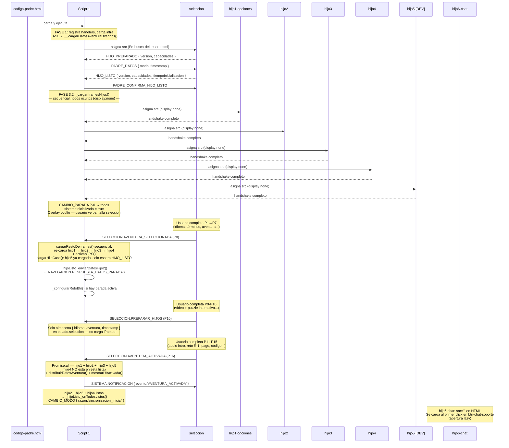

> **Carga secuencial en el arranque:** `_cargarIframesHijos()` usa un `for` loop que `await`ea el handshake de cada hijo antes de cargar el siguiente. Lo mismo en `cargarRestoDeiframes()` (re-activación via `AVENTURA_SELECCIONADA`). En cambio, `_hdl_SELECCION_AVENTURA_ACTIVADA` usa `Promise.all` — carga hijo1/hijo2/hijo3/hijo5 en paralelo porque los iframes ya están precargados y no hay riesgo de saturar la mensajería.

### Diagrama de arquitectura global

```mermaid
graph TD
    PADRE["codigo-padre.html (~12.000 líneas)"]
    SEL["seleccion — En-busca-del-tesoro.html"]
    PZ["puzzle.html\nsub-iframe interno de seleccion"]
    H1["hijo1-opciones — extrainfo-hijo1.html"]
    H2["hijo2 — coordenadas-hijo2.html"]
    H3["hijo3 — audio-hijo3.html"]
    H4["hijo4 — retos-hijo4.html"]
    H5["hijo5 — boton-casa-hijo5.html"]
    H6["hijo6-chat — chat-hijo6.html"]
    MSG["js/mensajeria.js"]
    SM["js/state-manager.js"]
    CONST["js/constants.js"]
    CFG["js/config.js"]
    APP["js/app.js"]
    FMAP["js/funciones-mapa.js (~4.400 líneas)"]
    CP["js/controladores-padre.js"]
    SRV["js/server.js (servidor estático)"]

    PADRE <-->|postMessage| SEL
    PADRE <-->|postMessage| H1
    PADRE <-->|postMessage| H2
    PADRE <-->|postMessage| H3
    PADRE <-->|postMessage| H4
    PADRE <-->|postMessage| H5
    PADRE <-->|postMessage| H6
    SEL -->|sub-iframe P10| PZ
    PADRE -->|dynamic import| MSG
    PADRE -->|dynamic import| SM
    PADRE -->|dynamic import| CONST
    PADRE -->|dynamic import| CFG
    PADRE -->|dynamic import| APP
    PADRE -->|dynamic import| FMAP
    PADRE -->|dynamic import| CP
    SRV -->|sirve estático| PADRE

    style H5 fill:#aaa,color:#fff
    style H6 fill:#e8f4f8,stroke:#0077cc
    style PZ fill:#e0e0e0,color:#555
```

> `hijo5` (gris) — solo desarrollo, no aparece en la PWA final. `hijo6-chat` (azul claro) — carga lazy al primer uso. `puzzle.html` (gris claro) — no es hijo directo del padre; es sub-iframe interno de `seleccion`.

### Diagrama de secuencia — Reanudación de aventura

Cuando el usuario vuelve a abrir la app y existe `vv_aventura_iniciada` en `localStorage`, el padre restaura el progreso y reposiciona cada hijo en la parada guardada.

```mermaid
sequenceDiagram
    participant U as Usuario
    participant P as Padre
    participant H1 as hijo1-opciones
    participant H2 as hijo2 (mapa)
    participant H3 as hijo3 (audio)
    participant H4 as hijo4 (retos)
    participant H5 as hijo5 [DEV]

    Note over P: ejecutarRestauracionAventura()<br/>Lee localStorage → restaura aventura, idioma, parada

    P->>P: distribuirDatosAventura()
    P->>H5: NAVEGACION.RESPUESTA_DATOS_PARADAS
    P->>P: restoreProgressFromStorage()

    par CAMBIO_PARADA a todos los hijos de juego
        P->>H1: NAVEGACION.CAMBIO_PARADA { parada guardada }
        P->>H2: NAVEGACION.CAMBIO_PARADA { parada guardada }
        P->>H3: NAVEGACION.CAMBIO_PARADA { parada guardada }
        P->>H4: NAVEGACION.CAMBIO_PARADA { parada guardada }
        P->>H5: NAVEGACION.CAMBIO_PARADA { parada guardada }
    end

    par CAMBIO_MODO CASA a todos los hijos
        P->>H1: SISTEMA.CAMBIO_MODO { modo: casa }
        P->>H2: SISTEMA.CAMBIO_MODO { modo: casa }
        P->>H3: SISTEMA.CAMBIO_MODO { modo: casa, resetea audio }
        P->>H4: SISTEMA.CAMBIO_MODO { modo: casa }
        P->>H5: SISTEMA.CAMBIO_MODO { modo: casa }
    end

    P->>H2: solicitarCoordenadasAHijo2(elementoActual)
    P->>H3: solicitarAudioAHijo3(audio_id, autoplay=false)

    Note over U,H5: Sistema en MODO CASA con parada restaurada.<br/>Usuario pulsa botón GPS (hijo5 [DEV]) para activar AVENTURA.<br/>En la PWA real el GPS se activa directamente sin paso por hijo5.
```

---

## 6. El código padre: el cerebro de todo

El archivo `codigo-padre.html` (~12.000 líneas) es el **orquestador** de toda la aplicación: coordina la carga de iframes, gestiona el estado global, distribuye mensajes, ejecuta el GPS y toma todas las decisiones de navegación.

### Responsabilidades del padre

1. **Gestión de iframes**: carga, muestra, oculta y reconecta los hijos según el contexto.
2. **Estado centralizado**: guarda aventura seleccionada, idioma, parada actual, modo y estado GPS en `js/state-manager.js`.
3. **Mensajería**: recibe mensajes de todos los hijos y les responde a través de `js/mensajeria.js`.
4. **GPS**: ejecuta el único `navigator.geolocation.watchPosition()` de la app (en `funciones-mapa.js`, cargado dinámicamente). Las posiciones se distribuyen a hijo2 vía `NAVEGACION.ACTUALIZAR_ESTADO`. hijo2 no tiene `watchPosition` propio.
5. **Navegación**: decide cuándo cambiar de parada, cuándo mostrar un reto, cuándo reproducir un audio.
6. **Modos**: gestiona la transición entre `'casa'` y `'aventura'`, propagando `CAMBIO_MODO` a los hijos críticos y coordinando heartbeat y GPS.

### Estructura interna: los cuatro scripts module

`codigo-padre.html` contiene **cuatro** bloques `<script type="module">` con roles distintos. Más varios `<script>` regulares para utilidades síncronas (HTTPS redirect, stub `activarGPS`, image fallback, etc.).

| Script | Líneas | Rol principal |
|--------|--------|--------------|
| **Script 1** | 2419–7261 | Orquestador de arranque: FASE 1 infra → FASE 2 datos → FASE 3 iframes. Registra handlers del ciclo de vida: `SISTEMA.HIJO_PREPARADO`, `SISTEMA.HIJO_LISTO`, `SISTEMA.CAMBIO_MODO`, `SISTEMA.HEARTBEAT`, `SISTEMA.HIJO_FALLIDO`, `UI.ACCION_USUARIO`. Al final carga `js/controladores-padre.js`. |
| **Script 2** | 7286–11677 | Handlers de dominio: todos los `NAVEGACION.*` (GPS, CAMBIO_PARADA, LLEGADA_DETECTADA…), `RETO.*`, `SELECCION.*`, `AUDIO.*`, `UI.NAVEGACION_EXTERNA`, `SISTEMA.ADVERTENCIA`. Contiene `distribuirDatosAventura`. |
| **Script 3** | 11678–11868 | Utilidades de carga de iframes: `cargarIframeConDatos()` y backup de distribución `CARGAR_*`. |
| **Script 4** | 11869–~12055 | "Migración de controladores y diagnóstico GPS": registra los controladores de `js/app.js` (`registrarControladoresApp`), `js/monitoreo.js` y `js/utils.js`; arranca el heartbeat GPS. |

> **Por qué Script 1 registra solo los handlers del ciclo de vida y Script 2 el resto:** Script 1 debe completar el registro de `HIJO_PREPARADO` / `HIJO_LISTO` / `CAMBIO_MODO` **antes** de asignar `src` a cualquier iframe. Los handlers de dominio (`NAVEGACION.*`, `RETO.*`, `SELECCION.*`) solo son necesarios una vez que los iframes están cargados, por lo que pueden vivir en Script 2 sin riesgo de llegar tarde.
>
> **Aislamiento de scope entre scripts:** Cada `<script type="module">` tiene su propio scope léxico. Las variables definidas localmente en Script 1 (p.ej. `sleep`, `enviarMensaje_S1`, `registrarIframe_S1`) **no son accesibles** en Scripts 2, 3 ni 4 a menos que se expongan explícitamente en `globalThis`. Por este motivo cada script define su propio alias de seguridad al inicio: `const sleep = globalThis.sleep || (ms => new Promise(r => setTimeout(r, ms)));`. Del mismo modo, las notificaciones de broadcast `AVENTURA_ACTIVADA` y `AVENTURA_INICIADA` que emite el handler de `SELECCION.AVENTURA_ACTIVADA` (Script 2) usan `enviarMensaje_S2` — intentar usar `enviarMensaje_S1` en Script 2 siempre devolvería `typeof === 'undefined'` y los broadcasts se perderían.

### Fases de inicialización

Script 1 ejecuta tres fases secuenciales antes de que la app sea interactiva:

#### FASE 1 — Infraestructura

Los módulos de infraestructura se cargan en un orden estricto por dependencias:

| Paso | Carga | Motivo del orden |
|------|-------|-----------------|
| 1 | `state-manager.js` (secuencial) | `mensajeria.js` necesita `__vv_stateManager` ya disponible |
| 2 | `mensajeria.js` (secuencial) | Debe existir antes de registrar cualquier handler |
| 3 | `validacion.js` + `funciones-mapa.js` (secuencial) | Otros módulos los importan como dependencia estática |
| 4 | `constants.js`, `utils.js`, `device-detection.js`, `logger.js`, `config.js`, `monitoreo.js`, `app.js` — `Promise.all` | Sin dependencias cruzadas entre ellos |

#### FASE 2 — Datos de aventura

Llamada automáticamente desde `ejecutarInicializacionAutomatica()` vía `__cargarDatosAventuraDiferidos()`. Los 5 módulos de datos no tienen imports cruzados: se cargan en paralelo con `Promise.all` y sus resultados se exponen en variables globales:

```text
coordenadas-aventuras.js  →  globalThis.__vv_DATOS_AVENTURAS
audios-aventuras.js       →  globalThis.__vv_AUDIOS_AVENTURAS
retos-aventuras.js        →  globalThis.__vv_RETOS_AVENTURAS
textos-aventuras.js       →  globalThis.__vv_TEXTOS_AVENTURAS
indice-aventuras.js       →  globalThis.__vv_INDICE_AVENTURAS
```

#### FASE 3 — Iframes

Necesita FASE 2 completa. Todo ocurre en el arranque, dentro de `ejecutarInicializacionAutomatica()`, antes de cualquier interacción del usuario:

1. `cargarIframeSoloSeleccion()` — asigna `src` a `seleccion` y espera su handshake
2. `_cargarIframesHijos()` — carga hijo1→hijo2→hijo3→hijo4→hijo5 **secuencialmente**, todos ocultos (`display:none`). No espera señal alguna de seleccion
3. Se envía `CAMBIO_PARADA { paradaId: 'P-0' }` a todos los hijos como estado inicial del mapa

Las señales `SELECCION.*` llegan **más tarde**, cuando el usuario completa el flujo de onboarding, y disparan re-activaciones sobre los iframes ya cargados:

- `SELECCION.AVENTURA_SELECCIONADA` (P8) → `cargarRestoDeiframes()` re-carga hijo1→2→3→4 secuencial + `activarGPS()`; `cargarHijoCasa()` verifica hijo5
- `SELECCION.PREPARAR_HIJOS` (P10) → solo almacena `{ idioma, aventura, timestamp }` en `estado.seleccion`; **no carga iframes**
- `SELECCION.AVENTURA_ACTIVADA` (P16) → re-carga hijo1/hijo2/hijo3/hijo5 en **paralelo** (`Promise.all` via `_cargarSoloIframeActivacion`); **hijo4 no está en esta lista**; distribuye datos y muestra UI

```mermaid
flowchart TD
    F1["FASE 1 — Infraestructura\nstate-manager → mensajeria → validacion+mapa\n→ 7 módulos en Promise.all"]
    F2["FASE 2 — Datos de aventura\nPromise.all 5 módulos .js\n→ globalThis.__vv_*"]
    F3A["FASE 3.1\ncargarIframeSoloSeleccion()\nseleccion cargado + handshake"]
    F3B["FASE 3.2\n_cargarIframesHijos()\nhijo1→2→3→4→5 secuencial\ntodos ocultos (display:none)"]
    FIN["✅ Sistema listo\nCAMBIO_PARADA P-0 enviado\noverlay oculto — usuario ve seleccion"]
    SEL_A["AVENTURA_SELECCIONADA (P8)\ncargarRestoDeiframes() secuencial\n+ activarGPS()\n+ cargarHijoCasa()"]
    SEL_P["PREPARAR_HIJOS (P10)\nalmacena estado.seleccion\n(sin carga de iframes)"]
    SEL_C["AVENTURA_ACTIVADA (P16)\nhijo1/2/3/5 en paralelo\n+ distribuirDatosAventura()"]

    F1 --> F2 --> F3A --> F3B --> FIN
    FIN -.->|"más tarde:\nusuario completa\nonboarding"| SEL_A
    SEL_A --> SEL_P --> SEL_C

    style F1 fill:#fff3cd
    style F2 fill:#d4edda
    style F3A fill:#cce5ff
    style F3B fill:#cce5ff
    style FIN fill:#d1ecf1
    style SEL_A fill:#e8d5f5
    style SEL_P fill:#e8d5f5
    style SEL_C fill:#e8d5f5
```

> FASE 1 y FASE 2 terminan antes de asignar `src` a ningún iframe. Cuando llega el primer `HIJO_PREPARADO` ya existen todos los handlers y todos los datos de aventura.

### Registro de handlers: `registrarControladorSeguro`

Todos los handlers del padre se registran mediante `globalThis.registrarControladorSeguro(tipo, handler)`, definida en Script 1. Esta función:

1. **Deduplica**: mantiene `globalThis.__CONTROLADOR_REGISTRADOS` (un `Set`) — si el tipo ya está registrado, lo ignora con un `warn`. Cada tipo de mensaje tiene exactamente un handler en el padre.
2. **Encola si mensajería no está lista**: si `registrarControlador_S1` no está disponible aún, guarda el handler en `__CONTROLADORES_PENDIENTES` para procesarlo cuando mensajería esté lista.
3. **Fallback**: si `registrarControlador_S1` no está disponible pero `globalThis.mensajeria` sí, usa `mensajeria.registrarControlador` directamente.

**Reparto de handlers por prefijo (dentro de `codigo-padre.html`):**

| Prefijo | Registrado en | Ejemplos |
|---------|--------------|---------|
| `SISTEMA.*` | Script 1 | `HIJO_PREPARADO`, `HIJO_LISTO`, `CAMBIO_MODO`, `HEARTBEAT`, `HIJO_FALLIDO`, `CAMBIO_MODO_RESPONSE` |
| `NAVEGACION.*` | Script 2 | `CAMBIO_PARADA`, `LLEGADA_DETECTADA`¹, `GPS.ACTIVAR`, `GPS.DESACTIVAR`, `GPS.UBICACION_ACTUALIZADA` |
| `RETO.*` | Script 2 | `SOLICITAR_RETO`, `OCULTAR`, `COMPLETADO` |
| `SELECCION.*` | Script 2 | `PREPARAR_HIJOS`, `AVENTURA_SELECCIONADA`, `AVENTURA_ACTIVADA`, `IDIOMA_SELECCIONADO` |
| `AUDIO.*` | Script 2 | `ESTADO_ACTUALIZADO`, `FIN_REPRODUCCION` |
| `DATOS.*` | `controladores-padre.js` | `SOLICITAR_AUDIOS`, `SOLICITAR_RETOS`, `SOLICITAR_TEXTOS`, `SOLICITAR_DATOS_PARADAS` |

### Modos de la aplicación

La aplicación tiene dos modos, cuyos valores corresponden a las constantes `MODOS.CASA = 'casa'` y `MODOS.AVENTURA = 'aventura'` de `js/constants.js`:

- **`'casa'`**: menú principal — selección de aventura, vídeos, consejos. Heartbeat pausado; localStorage de progreso limpiado (`vv_aventura_iniciada`, `vv_progreso`, `vv_paradas_completadas`).
- **`'aventura'`**: recorrido activo — mapa, GPS, retos. Heartbeat activo cada ~5 s (ajustado por calidad de conexión vía `ajustarTimeoutPorConexion`).

**Quién inicia un cambio de modo:**

| Origen | Cuándo | Razón (`razon`) |
|--------|--------|----------------|
| Padre (`_hijoListo_onTodosListos`) | Al completar la inicialización de todos los hijos críticos | `'sincronizacion_inicial'` |
| hijo5 (botón GPS) | Al pulsar el botón de iniciar aventura | `'cambio_modo_global'`, `origen: 'boton-gps'` |
| Reanudación automática | Al detectar `vv_aventura_iniciada` en `localStorage` | payload incluye `restaurado: true` |

**Payload de `CAMBIO_MODO`:**

```javascript
{
    modo: "aventura" | "casa",
    timestamp: Date.now(),
    razon: "sincronizacion_inicial" | "cambio_modo_global" | ...,
    secuenciaCompleta: true,
    propagadoDesde?: string   // origen del mensaje que disparó el cambio
}
```

**Flujo interno al recibir `CAMBIO_MODO`:**

```mermaid
sequenceDiagram
    participant OR as Origen (padre / hijo5)
    participant P as Padre — _hdl_SISTEMA_CAMBIO_MODO
    participant APP as js/app.js — manejarCambioModo
    participant HC as Hijos críticos (hijo2, hijo3, hijo4, hijo5)

    OR->>P: CAMBIO_MODO { modo, razon }
    P->>APP: manejarCambioModo(estado, mensaje)
    APP-->>P: { exito: true, modoActual }
    loop para cada hijo crítico inicializado
        P->>HC: CAMBIO_MODO { modo, secuenciaCompleta: true }
    end
    HC-->>APP: CAMBIO_MODO_ENTENDIDO
    HC-->>APP: CAMBIO_MODO_EFECTUADO
    alt modo === 'aventura'
        P->>P: HEARTBEAT_START { intervalo: ~5000 ms }
        P->>HC: HEARTBEAT_START
    else modo === 'casa'
        P->>P: HEARTBEAT_PAUSE
        P->>HC: HEARTBEAT_PAUSE
        P->>P: limpiar localStorage de progreso
    end
```

> Los handlers de `CAMBIO_MODO_ENTENDIDO` y `CAMBIO_MODO_EFECTUADO` viven en `js/app.js` (`actualizarInterfazModo`), no directamente en el padre.

### Diferencias de comportamiento CASA vs AVENTURA

Los dos modos no son equivalentes. El padre ejecuta lógica diferente según `estado.modo.actual` en los puntos clave del flujo. La tabla cubre las diferencias que **sí afectan al código del padre** (`codigo-padre.html`):

| Elemento | Modo CASA (`'casa'`) | Modo AVENTURA (`'aventura'`) |
|----------|---------------------|------------------------------|
| **GPS** | Desactivado — sin `watchPosition` activo | Activo — `watchPosition` continuo; posición del usuario se actualiza en mapa |
| **Heartbeat** | Pausado — no se envía `SISTEMA.HEARTBEAT` a los hijos críticos | Activo cada ~5 s (ajustado por calidad de conexión vía `ajustarTimeoutPorConexion`) |
| **`retosBtn` (hijo3)** | Se envía `CONTROL.HABILITAR { control: 'retosBtn' }` **de inmediato** al entrar en parada con `reto_id` (sin condición de audio) | Arranca con `CONTROL.DESHABILITAR { control: 'retosBtn', razon: 'esperar_fin_audio_aventura' }`; se habilita solo cuando llega `AUDIO.FIN_REPRODUCCION` para esa parada |
| **`btnAvanzar` (hijo2)** | No se gestiona — GPS inactivo, el botón no tiene función | Se deshabilita al entrar en parada: `CONTROL.DESHABILITAR { control: 'btnAvanzar', razon: 'parada_pendiente_completar' }`; se habilita cuando la parada está completa (audio + reto) |
| **Audio al cambiar de parada** | `_solicitarAudioCasa()` — consulta info de audio a hijo3 sin lanzar reproducción automática | `_solicitarAudioParaParada()` — envía `AUDIO.REPRODUCIR_REQUEST` con autoplay |
| **`RETO.ESTADO_CASA` (hijo4)** | Enviado en cada `CAMBIO_PARADA`: `{ habilitado: !esTramo }` — habilita el panel de retos en paradas, lo deshabilita en tramos | No se envía |
| **Origen típico de `CAMBIO_PARADA`** | hijo5 (clic en lista de paradas) | hijo2 (llegada GPS detectada) o avance programático desde el padre |
| **Estado del reto (`estado.retoActual`)** | `disponible: true` al entrar en parada con `reto_id` (inmediato) | `disponible: false` al entrar; cambia a `true` solo cuando audio termina |
| **Persistencia de progreso** | `localStorage.removeItem('vv_aventura_iniciada')` al cambiar a CASA | `localStorage.setItem('vv_aventura_iniciada', ...)` al cambiar a AVENTURA |

**Flujo de `CAMBIO_PARADA` según modo** — llamadas ejecutadas en `_hdl_NAVEGACION_CAMBIO_PARADA`:

```text
[Ambos modos]
  1. resolverIdsParada(datos) → buscarParadaEnDatos() → parada object
  2. _actualizarEstadoParada()     → estado.paradaActual = paradaId
  3. _solicitarParadaAHijo2()      → DATOS.COORDENADAS_PARADAS_REQUEST a hijo2
  4. _notificarCambioParadaHijos() → CAMBIO_PARADA a hijo2, hijo4 (si listo), hijo5 (si no es el origen)
  5. _configurarRetoBtn()          → diferente según modo (ver tabla arriba)
  6. dispatchEvent('vv-parada-cambiada') → funciones-mapa.js dibuja marcadores / polylines

[Solo AVENTURA]
  7. Si esTramo: estado.gps.tramoAudioPendiente = true
  8. Si parada: CONTROL.DESHABILITAR { control: 'btnAvanzar' } a hijo2

[Solo CASA]
  7. RETO.ESTADO_CASA { habilitado: !esTramo } a hijo4
```

**Nota de implementación**: `_configurarRetoBtn` usa `estado.hijosInicializados.has('hijo3')` como guard de entrada — si hijo3 aún no ha completado el handshake, la función retorna sin hacer nada. Esto es seguro porque cuando `hijo3` envía `HIJO_LISTO`, el padre vuelve a llamar `_configurarRetoBtn()` con la parada activa en ese momento.

**Identificadores de parada y la búsqueda en DATOS_PADRE**: `_hdl_NAVEGACION_CAMBIO_PARADA` extrae `paradaId` del mensaje en este orden de prioridad: `datos.paradaId → datos.parada_id → resolved.paradaId`. El valor con prefijo `'padre-'` (p.ej. `'padre-P0'`) debe preservarse aquí porque `_buscarParadaEnDatos` lo usa para el match `p.padreid === paradaId`. Usar `resolved.paradaId` (que elimina el prefijo) causaría que la búsqueda fallara silenciosamente y que `_configurarRetoBtn` nunca se llamara.

### Los controladores de datos (js/controladores-padre.js)

Los 4 handlers que responden a peticiones de datos de aventuras están extraídos en el módulo `js/controladores-padre.js` (importado dinámicamente al final de Script 1). La función exportada es `registrarControladoresDatos(deps)`, que recibe todas sus dependencias por inyección:

| Handler | Tipo de mensaje | Responde con |
|---------|----------------|--------------|
| Datos de paradas para hijo5 | `NAVEGACION.SOLICITAR_DATOS_PARADAS` | `NAVEGACION.RESPUESTA_DATOS_PARADAS` |
| Metadatos de audio | `DATOS.SOLICITAR_AUDIOS` | `DATOS.CARGAR_AUDIOS` |
| Textos narrativos | `DATOS.SOLICITAR_TEXTOS` | `DATOS.CARGAR_TEXTOS` |
| Retos y respuestas | `DATOS.SOLICITAR_RETOS` | `DATOS.CARGAR_RETOS` |

Los tres handlers `DATOS.*` leen de `globalThis.__vv_AUDIOS_AVENTURAS` / `__vv_TEXTOS_AVENTURAS` / `__vv_RETOS_AVENTURAS` (cargados en FASE 2). `SOLICITAR_DATOS_PARADAS` lee de `globalThis.aventuraSeleccionada` y `globalThis.__vv_DATOS_AVENTURAS`. Todos responden con `enviarMensaje` al origen de la solicitud.

### Reconexión de hijos fallidos

Cuando un hijo no completa el handshake durante la carga inicial, el padre activa `_reconectarHijoIndividual()`:

1. Oculta el iframe (`display:none; visibility:hidden`)
2. Reasigna el `src` para forzar recarga completa del iframe
3. Espera el handshake completo (`_esperarHijoListo(id)`)
4. **Máximo 3 intentos** con backoff: espera `2 s × intento` antes del siguiente intento — solo si no es el último (intento 1 → espera 2 s, intento 2 → espera 4 s, intento 3 → sin espera)
5. Si los 3 fallan: marca `activo: false, reconexionFallida: true` — la app continúa con funcionalidad reducida

Esta reconexión es **solo para fallos de carga inicial**. Los fallos de heartbeat durante la aventura (3 heartbeats fallidos consecutivos) se gestionan por separado en `js/mensajeria.js`.

### El state-manager (gestor de estado)

El estado de la aplicación se guarda en un único lugar: `js/state-manager.js`. Solo los campos de acceso más concurrente — `aventuraSeleccionada` e `idiomaSeleccionado` — están protegidos por **mutex** (cerrojos) que evitan race conditions al leerlos o modificarlos simultáneamente. El resto del estado se accede directamente.

La estructura tiene dos niveles diferenciados:

```javascript
// Nivel raíz — campos con mutex propio
{
    aventuraSeleccionada: "Aventura1",  // mutex
    idiomaSeleccionado: "es",           // mutex

    // Nivel estadoPadre — acceso directo, sin mutex individual
    estadoPadre: {
        modo: { actual: "aventura", anterior: "casa" },
        paradaActual: 5,
        hijosInicializados: Set(["seleccion", "hijo1-opciones", "hijo2", "hijo3", "hijo4"]),
        gps: {
            activo: true,
            posicionUsuario: { lat: 39.4789, lng: -0.3762 },
            precision: 8   // metros
        }
        // ...monitoreo, sistema, heartbeat, gpsPendientes, etc.
    }
}
```

---

## 7. Las páginas hijo y qué hace cada una

> **Handshake estándar** (igual para todos los hijos): el hijo carga → envía `SISTEMA.HIJO_PREPARADO` → el padre responde con `SISTEMA.PADRE_DATOS` (idioma, aventura, parada actual, modo) → el hijo procesa y envía `SISTEMA.HIJO_LISTO` → el padre confirma con `SISTEMA.PADRE_CONFIRMA_HIJO_LISTO` → el hijo hace visible su UI.

```mermaid
sequenceDiagram
    participant P as Padre
    participant H as Hijo (cualquiera)
    P->>H: asigna src (iframe carga)
    H-->>P: SISTEMA.HIJO_PREPARADO { version, capacidades }
    P->>H: SISTEMA.PADRE_DATOS { modo, idioma, aventura, parada }
    H-->>P: SISTEMA.HIJO_LISTO { version, capacidades, tiempoInicializacion }
    P->>H: SISTEMA.PADRE_CONFIRMA_HIJO_LISTO { timestamp }
    Note over H: UI visible — comunicación normal
```

---

### 7.0 Cómo funcionan todos en conjunto

El padre es el único componente con visión global. Ningún hijo habla con otro directamente — todo pasa por el padre, que actúa como bus de mensajes y árbitro de estado. Esta separación permite recargar un hijo caído sin afectar al resto.

```mermaid
graph TD
    P["🧠 PADRE\ncodigo-padre.html\nestado global · decisiones · GPS · heartbeat"]

    SEL["🎫 seleccion\nEn-busca-del-tesoro.html\nonboarding P1→P16"]
    H1["⚙️ hijo1\nextrainfo-hijo1.html\nopciones extra + temporizador"]
    H2["🗺️ hijo2\ncoordenadas-hijo2.html\nmapa Leaflet + proximidad GPS"]
    H3["🔊 hijo3\naudio-hijo3.html\nreproductor audio + retosBtn"]
    H4["🧩 hijo4\nretos-hijo4.html\npantalla de retos"]
    H5["🛰️ hijo5\nboton-casa-hijo5.html\nnavegador CASA + toggle GPS"]
    H6["💬 hijo6-chat\nchat-hijo6.html\nFAQ soporte (carga lazy)"]
    PZ["🧩 puzzle.html\n(sub-iframe de H4 y seleccion)"]

    P <-->|"handshake · CAMBIO_MODO\nDATOS.CARGAR_* · HEARTBEAT"| SEL
    P <-->|"UI.NAVEGACION_EXTERNA\nTEMPORIZADOR.TOGGLE\nHEARTBEAT"| H1
    P <-->|"CAMBIO_PARADA · GPS.ACTUALIZAR\nCONTROL btnAvanzar\nLLEGADA_DETECTADA"| H2
    P <-->|"AUDIO.REPRODUCIR_REQUEST\nFIN_REPRODUCCION\nCONTROL retosBtn"| H3
    P <-->|"RETO.MOSTRAR · RETO.COMPLETADO\nRETO.ESTADO_CASA\nDATA.CARGAR_RETOS"| H4
    P <-->|"CAMBIO_MODO · CAMBIO_PARADA\nRESPUESTA_DATOS_PARADAS"| H5
    P <-->|"CHAT.ESTADO_PADRE\nhandshake"| H6
    H4 -.-|"puzzle-state-completed\npuzzle-state-timeout"| PZ
    SEL -.-|"puzzle-state-completed\npuzzle-state-timeout"| PZ

    style P fill:#4a90d9,color:#fff,stroke:#2c5f8a
    style H5 fill:#aaa,color:#fff
    style H6 fill:#e8f4f8,stroke:#0077cc
    style PZ fill:#e0e0e0,color:#555
```

**Quién hace qué en la aventura:**

| Hijo | Rol en el sistema | Momento de intervención |
|------|------------------|------------------------|
| `seleccion` | Onboarding: recoge idioma, aventura, código. Dispara el arranque | Solo al inicio (o al reiniciar) |
| `hijo1` | Contenido extra + temporizador. Sin impacto en la lógica de navegación | Cualquier momento que el usuario lo pida |
| `hijo2` | Motor del mapa. Única fuente de verdad sobre la posición del usuario | Continuamente en AVENTURA; visible en CASA |
| `hijo3` | Reproduce los audios. Notifica al padre cuando terminan → desencadena habilitar retos | En cada CAMBIO_PARADA con audio |
| `hijo4` | Muestra y valida el reto de la parada activa. Notifica resultado | Cuando padre envía RETO.MOSTRAR |
| `hijo5` | Permite navegar en CASA sin GPS y togglear el modo | Solo en modo CASA o al activar AVENTURA |
| `hijo6` | FAQ de soporte contextual. Sin efecto en la lógica de juego | Cuando el usuario abre el chat |

---

### 7.1 En-busca-del-tesoro.html — pantalla de selección (iframe `id="seleccion"`)

**Propósito**: primera pantalla que ve el usuario. Gestiona el flujo completo de incorporación: selección de idioma, aventura, términos, retos previos y código de activación. Cuando termina, le dice al padre que cargue el resto de iframes y arranque la aventura.

**Rol en el sistema**: es el **punto de entrada único**. Ningún hijo de juego (hijo2, hijo3, hijo4) es visible hasta que `seleccion` completa su flujo y el padre recibe `SELECCION.AVENTURA_ACTIVADA`. El resto de iframes se pre-cargan en paralelo mientras el usuario está en el onboarding, pero permanecen ocultos.

**Inicialización**: es el primer iframe en cargarse al arrancar la app. El iframe existe en el DOM desde el inicio pero arranca `display:none; visibility:hidden`; el padre lo hace visible inmediatamente. El resto de iframes (hijo1-opciones, hijo2, hijo3, hijo4, hijo5) son pre-cargados por `_cargarIframesHijos()` inmediatamente después, todos ocultos (`display:none`), sin esperar ninguna señal de este iframe. Las señales `SELECCION.*` activan más tarde el flujo de aventura sobre esos iframes ya cargados.

**Después de la aventura**: el padre lo oculta de nuevo (`display:none; visibility:hidden`) cuando procesa `SELECCION.AVENTURA_ACTIVADA`. No se destruye — permanece en el DOM oculto.

#### 16 pantallas secuenciales (se muestran y ocultan; solo una activa a la vez)

| Pant. | ID | Botones principales (IDs / clases) | Condición para avanzar | Mensaje al padre |
|-------|----|------------------------------------|------------------------|-----------------|
| P1 | `#pantalla1` | `.btn-mundo-verde` (Empezar) | Ninguna | — |
| P2 | `#pantalla2` | `.bandera-btn` × 12 (idiomas) | Click en bandera | — |
| P3 | `#pantalla3` | `#btn-mundo-verde` (Sí) / `#btn-mundo-rojo` (No) | Click en Sí/No | `SELECCION.IDIOMA_SELECCIONADO` (al confirmar Sí) |
| P4 | `#pantalla4` | `.btn-mundo-verde` (→) | Ninguna | — |
| P5 | `#pantalla5` | `#btn-siguiente-agradecimientos` | Scroll hasta el final del texto (se habilita con `disabled = false`) | — |
| P6 | `#pantalla6` | `#btn-aceptar-terminos` | Scroll hasta el final (`disabled = false`) | `SELECCION.TERMINOS_ACEPTADOS` |
| P7 | `#pantalla7` | `.btn` aventura (dinámico, 1 por aventura) | Click en aventura → overlay mapa vintage | — |
| P8 | `#pantalla8` | `#btn-mundo-verde` (Confirmar) / `#btn-mundo-rojo` (No) | Click en Confirmar | `SELECCION.AVENTURA_SELECCIONADA` |
| P9 | `#pantalla9` | `.btn-mundo-verde` (→) | Ninguna (vídeo es placeholder) | — |
| P10 | `#pantalla10` | `#btn-continuar-puzzle` (aparece tras completar puzzle) | `puzzle-state-completed` recibido del sub-iframe | `SELECCION.PREPARAR_HIJOS { idioma, aventura, timestamp }` |
| P11 | `#pantalla11` | `.btn-mundo-verde` (→) | Ninguna (audio opcional) | — |
| P12 | `#pantalla12` | Opciones del reto R-1 (radio/checkbox) + botón verificar | Respuesta correcta al reto | — |
| P13 | `#pantalla13` | `.btn-mundo-verde` (stub pago) | Ninguna (pago no implementado) | — |
| P14 | `#pantalla14` | `#btn-iniciar-aventura` (deshabilitado hasta código correcto) | Código = `'0000'` → `disabled = false` | `SELECCION.AVENTURA_ACTIVADA` |
| P15 | `#pantalla15` | `#btn-siguiente-normativa` | Scroll hasta el final (`disabled = false`) | — |
| P16 | `#pantalla16` | Opciones del reto R-2 | SÍ → aventura; NO → vuelve a P1 | `SELECCION.AVENTURA_ACTIVADA` (al SÍ) |

**Botones con scroll-gate**: `#btn-siguiente-agradecimientos` (P5), `#btn-aceptar-terminos` (P6), `#btn-siguiente-normativa` (P15) nacen con `disabled = true`. Se habilitan cuando el evento `scroll` del contenedor detecta `scrollTop + clientHeight ≥ scrollHeight - 5px`. No hay timeout: el usuario debe leer o hacer scroll manual.

#### 3 overlays adicionales

| ID | Cuándo aparece | Elementos clave | Cómo se cierra |
|----|----------------|-----------------|----------------|
| `#mapa-vintage-overlay` | Al seleccionar aventura en P7 | `#mapa-vintage-img` (imagen del recorrido) + botón cerrar (top-right, naranja/rojo) | Click en botón cerrar → `ocultarMapaVintage()` |
| `#audio-warning-overlay` | Si no hay audios para el idioma elegido | `#audio-warning-text` + `#audio-warning-yes` (verde) / `#audio-warning-no` (rojo) | Click yes (continúa sin audio) / no (vuelve a P2) |
| `#overlay-carga-aventura` | Al completar P16 (arranque de aventura) | Logo giratorio (`animation: spin 7s linear infinite`) + `#carga-progreso-barra` + `#carga-progreso-porcentaje` | Se oculta automáticamente cuando el padre confirma carga completa |

#### Sub-iframe puzzle.html en P10

```javascript
// En cargarPuzzle() dentro de En-busca-del-tesoro.html
const iframe = document.getElementById('puzzle-iframe-intro');
iframe.src = `puzzle.html?aventura=INTRO&id=${puzzleConfig.id}&noOverlay=1`;
```

El iframe escucha `window.addEventListener('message', _onPuzzleMessage)`. Cuando `puzzle.html` envía `{ tipo: 'puzzle-state-completed' }`, aparece el botón `#btn-continuar-puzzle`. Si `puzzle-state-timeout` llega antes, el botón también aparece (timeout = completado forzado). Ver detalles completos en §7.9.

#### Secuencia completa P1→P16

```mermaid
flowchart TD
    P1([P1\nEmpezar]) --> P2[P2\nIdioma\n12 banderas]
    P2 --> P3{P3\nConfirmar\nidioma}
    P3 -- Sí\nIDIOMA_SELECCIONADO --> P4[P4\nImagen título]
    P3 -- No --> P2
    P4 --> P5[P5\nAgradecimientos\nscroll hasta final]
    P5 --> P6[P6\nTérminos\nscroll hasta final\nTERMINOS_ACEPTADOS]
    P6 --> P7[P7\nSelección aventura\noverlay mapa vintage]
    P7 --> P8{P8\nConfirmar\naventura}
    P8 -- Sí\nAVENTURA_SELECCIONADA --> P9[P9\nVídeo placeholder]
    P8 -- No --> P7
    P9 --> P10[P10\nPuzzle intro\nPREPARAR_HIJOS]
    P10 -- puzzle completado --> P11[P11\nAudio + texto intro]
    P11 --> P12{P12\nReto R-1}
    P12 -- correcto → 1.5s --> P13[P13\nPago stub]
    P12 -- falla --> P12
    P13 --> P14{P14\nCódigo 0000}
    P14 -- código OK --> P15[P15\nNormativa\nscroll hasta final]
    P14 -- incorrecto --> P14
    P15 --> P16{P16\nReto R-2\nSÍ / NO}
    P16 -- SÍ\nAVENTURA_ACTIVADA --> FIN([Aventura inicia\npadre oculta seleccion])
    P16 -- NO --> P1
```

#### Controladores que registra

| Controlador | Qué hace |
|---|---|
| `SISTEMA.PADRE_DATOS` | Recibe idioma, aventura y modo; actualiza variables internas; envía `HIJO_LISTO` |
| `SISTEMA.PADRE_CONFIRMA_HIJO_LISTO` | Hace visible la UI (aquí visible desde el inicio) |
| `SISTEMA.HEARTBEAT` | Responde con `HEARTBEAT_RESPONSE` |
| `SISTEMA.CAMBIO_MODO` | Responde con `CAMBIO_MODO_ENTENDIDO` + `CAMBIO_MODO_EFECTUADO` |

#### Mensajes que envía al padre

| Tipo | Cuándo | Payload relevante |
|------|--------|-------------------|
| `SISTEMA.HIJO_PREPARADO` | Al cargarse | `{ version, capacidades, timestamp }` |
| `SISTEMA.HIJO_LISTO` | Tras recibir `PADRE_DATOS` | `{ version, capacidades, tiempoInicializacion }` |
| `SISTEMA.HIJO_FALLIDO` | Si la inicialización falla | `{ error, contexto }` |
| `SELECCION.IDIOMA_SELECCIONADO` | Confirma idioma en P3 | `{ idioma }` |
| `SELECCION.TERMINOS_ACEPTADOS` | Acepta términos en P6 | `{ timestamp }` |
| `SELECCION.AVENTURA_SELECCIONADA` | Confirma aventura en P8 | `{ aventura, idioma }` |
| `SELECCION.PREPARAR_HIJOS` | Al entrar en P10 | `{ idioma, aventura, timestamp }` |
| `SELECCION.AVENTURA_ACTIVADA` | Al validar código en P14 / SÍ en P16 | `{ aventura, idioma, terminosAceptados, timestamp }` |
| `SISTEMA.HEARTBEAT_RESPONSE` | Respuesta al heartbeat | `{ timestamp }` |
| `SISTEMA.CAMBIO_MODO_ENTENDIDO` / `CAMBIO_MODO_EFECTUADO` | Al recibir `CAMBIO_MODO` | — |

**Modo CASA vs AVENTURA**: este iframe no participa en el ciclo de modos — es la pantalla de onboarding pre-aventura. Tras `AVENTURA_ACTIVADA` el padre lo oculta y ya no interactúa con él hasta una posible reanudación o reinicio.

---

### 7.2 extrainfo-hijo1.html — panel de opciones extra (iframe `id="hijo1-opciones"`)

**Propósito**: columna lateral izquierda con acceso a contenido complementario (gastronomía, historia, consejos, páginas oficiales) y temporizador de cuenta atrás de la aventura. Su comunicación con el sistema es unidireccional para el contenido: hijo1 pide al padre que abra URLs flotantes, pero no recibe datos de juego ni afecta la lógica de navegación. El temporizador es bidireccional: hijo1 lleva el conteo y notifica al padre cada segundo.

**Inicialización**: pre-cargado en el arranque por `_cargarIframesHijos()`, oculto (`display:none`). Hace su UI visible tras `PADRE_CONFIRMA_HIJO_LISTO`. Calcula la posición de los iconos con JS en cada resize del viewport.

**Posición**: `position:fixed; right:calc(var(--franja-lateral) + 4.5px); bottom:var(--gap-inferior)` — `var(--franja-lateral)` de ancho, `calc(6 × var(--franja-lateral) + 26px)` de alto.

#### Botones y estados

| Elemento | ID | Función | Habilitado | Deshabilitado |
|----------|----|---------|-----------|--------------|
| Botón principal | `#mas-opciones` | Toggle del menú desplegable. Gira con animación `spin-ruleta 0.9s cubic-bezier`. Glow `glow-suave-h1 3s infinite` en reposo | Siempre | — |
| Gastronomía | `#icono-gastronomia` | Pide al padre abrir `gastronomia.html` | Siempre que el menú esté abierto | — |
| Información | `#icono-informacion` | Pide abrir `consejos-valencia.html` | Siempre | — |
| Historia | `#icono-historia` | Pide abrir `videos-valencia-historica.html` | Siempre | — |
| Páginas oficiales | `#icono-paginas-oficiales` | Pide abrir `paginas-oficiales-valencia.html` | Siempre | — |
| Temporizador | `#icono-temporizador` | Activa/desactiva ventana del temporizador | Solo en AVENTURA | Se oculta en CASA |

Los 5 iconos son `display:none` por defecto y se despliegan con JS al pulsar `#mas-opciones`. Se posicionan verticalmente hacia arriba desde el botón principal con la fórmula:
```
posicionTop = (alturaIframe - 3 - D) - (i + 1) × (D + 6)
D = anchoIframe - 2   // = --btn-size = diámetro del botón
i = 0..4 (gastronomia, informacion, historia, páginas, temporizador)
```

Al pulsar cualquier icono con URL, hijo1 envía `UI.NAVEGACION_EXTERNA` al padre. El padre abre la URL en una ventana flotante/modal superpuesta al mapa. Al mismo tiempo cierra el menú enviando `UI.CLOSE_MENUS` a todos los iframes con `datos: { except: 'mas-opciones' }`.

#### Temporizador

El temporizador es una cuenta atrás autónoma dentro de hijo1. El tiempo total se recibe via `AVENTURA.INICIADA`. Actualiza su display cada 1 s con `setInterval`.

| Porcentaje restante | Clase CSS | Color |
|--------------------|-----------|-------|
| ≥ 60% | `.tiempo-verde` | Verde |
| 20%–60% | `.tiempo-amarillo` | Amarillo |
| < 20% | `.tiempo-rojo` | Rojo |

```javascript
// Formato de display: HHH:MM:SS
function formatearTiempo(s) {
  const h = Math.floor(s / 3600), m = Math.floor((s % 3600) / 60), ss = s % 60;
  return `${h}:${String(m).padStart(2,'0')}:${String(ss).padStart(2,'0')}`;
}
```

Mensajes del temporizador:

| Tipo | Dirección | Payload |
|------|-----------|---------|
| `AVENTURA.INICIADA` | padre → hijo1 | `{ tiempoEstimado: <minutos> }` |
| `AVENTURA.TIEMPO_ACTUALIZADO` | hijo1 → padre | `{ tiempoRestante, tiempoTotal, porcentajeRestante, tiempoFormateado, timestamp }` |
| `AVENTURA.TIEMPO_AGOTADO` | hijo1 → padre | `{ mensaje: '¡Se acabó el tiempo!', redirigir: 'En-busca-del-tesoro.html' }` |
| `AVENTURA.FINALIZADA` | padre → hijo1 | — (detiene el temporizador) |

#### Controladores que registra

| Controlador | Qué hace |
|---|---|
| `SISTEMA.PADRE_DATOS` | Recibe datos de aventura/idioma; envía `HIJO_LISTO` |
| `SISTEMA.PADRE_CONFIRMA_HIJO_LISTO` | Hace la UI visible |
| `UI.CLOSE_MENUS` | Cierra iconos desplegados (respeta `datos.except`) |
| `SISTEMA.CAMBIO_MODO` | En CASA: detiene y resetea el temporizador; responde con ACK estándar |
| `SISTEMA.CAMBIO_MODO_APLICADO` | Confirma aplicación del modo |
| `AVENTURA.INICIADA` | Inicia la cuenta atrás con el tiempo recibido |
| `AVENTURA.FINALIZADA` | Detiene el temporizador |
| `SISTEMA.HEARTBEAT` / `HEARTBEAT_START` / `HEARTBEAT_PAUSE` | Gestión del latido |

#### Mensajes que envía al padre

| Tipo | Cuándo | Payload relevante |
|------|--------|-------------------|
| `SISTEMA.HIJO_PREPARADO` / `HIJO_LISTO` | Handshake estándar | — |
| `UI.NAVEGACION_EXTERNA` | Click en cualquier icono con URL | `{ url: 'gastronomia.html' }` |
| `TEMPORIZADOR.TOGGLE` | Click en `#icono-temporizador` | `{ visible: true/false }` |
| `AVENTURA.TIEMPO_ACTUALIZADO` | Cada 1 s mientras corre el temporizador | `{ tiempoRestante, porcentajeRestante, tiempoFormateado }` |
| `AVENTURA.TIEMPO_AGOTADO` | Cuando el contador llega a 0 | `{ mensaje, redirigir }` |
| `MONITOREO.METRICA` | Si hay errores de geolocalización detectados | `{ tipo, mensaje }` |
| `SISTEMA.HEARTBEAT_RESPONSE` / `CAMBIO_MODO_ENTENDIDO` / `CAMBIO_MODO_EFECTUADO` | Estándar | — |

```mermaid
sequenceDiagram
    participant P as Padre
    participant H1 as hijo1
    participant PW as Padre (ventana flotante)

    P->>H1: AVENTURA.INICIADA { tiempoEstimado: 90 }
    loop cada 1 segundo
        H1-->>P: AVENTURA.TIEMPO_ACTUALIZADO { tiempoRestante, porcentaje }
    end
    Note over H1: Usuario abre menú → click gastronomía
    H1-->>P: UI.NAVEGACION_EXTERNA { url: 'gastronomia.html' }
    P->>PW: abre ventana flotante con URL
    P->>H1: UI.CLOSE_MENUS { except: 'mas-opciones' }
    H1-->>H1: cierra iconos desplegados
```

**Modo AVENTURA**: todos los iconos activos, temporizador corre si fue iniciado.  
**Modo CASA**: al recibir `CAMBIO_MODO { modo: 'casa' }` → `clearInterval(timerInterval)` → resetea `tiempoRestante = tiempoTotal`; `#icono-temporizador` se oculta.

---

### 7.3 coordenadas-hijo2.html — mapa interactivo (iframe `id="hijo2"`)

**Propósito**: renderiza el mapa Leaflet con marcadores de paradas/tramos, posición del usuario y ruta. También calcula la proximidad del usuario a la parada/tramo activo y dispara `LLEGADA_DETECTADA` cuando entra en rango. Es la **única fuente de verdad sobre la posición del usuario** en el sistema.

**Importante**: hijo2 **no tiene `watchPosition` propio**. El único `navigator.geolocation.watchPosition()` de la app vive en `funciones-mapa.js` cargado en el padre. El padre envía las posiciones GPS a hijo2 via `NAVEGACION.ACTUALIZAR_ESTADO`; hijo2 las recibe, actualiza el marcador y ejecuta la lógica de proximidad.

**Inicialización**: pre-cargado por `_cargarIframesHijos()`, oculto. Body arranca con clase `modo-casa hijo2-container`.

#### Botones y estados

| Botón | ID | Función | Habilitado | Deshabilitado |
|-------|----|---------|-----------|--------------|
| Mapa completo | `#btn-mapa-completo` | Abre `mapa-completo.html` en modal | Siempre en AVENTURA; siempre en CASA | — |
| Mapa JPG | `#btn-mapa-jpg` | Muestra imagen vintage del recorrido | Siempre | Si `fueraDeRango5min = true` |
| Vídeo | `#btn-video` | Reproduce vídeo del tramo activo | Cuando elemento activo es tramo Y reto no está activo (CASA y AVENTURA) | Si es parada / reto activo / `fueraDeRango5min` |
| Imagen | `#btn-imagen` | Muestra imagen de la parada activa | Siempre que haya imagen disponible | Si reto activo |
| Avanzar / GPS | `#btn-avanzar` | En AVENTURA: detecta llegada. En CASA: sin función GPS | AVENTURA: distancia ≤ umbral. CASA: nunca relevante | AVENTURA: distancia > umbral o parada pendiente de completar |
| Ubicación | `#btn-ubicacion` | Centra el mapa en la posición del usuario | Siempre en CASA. AVENTURA: si el usuario está >50 m durante >5 min | — |

**Reglas de habilitación/deshabilitación** — se aplican en `_actualizarEstadoBotones()`:
- `fueraDeRango5min = true` → deshabilita `#btn-mapa-jpg`, `#btn-video`, `#btn-mapa-completo`. Solo `#btn-ubicacion` permanece activo.
- Reto activo → deshabilita `#btn-video` e `#btn-imagen`.
- No hay tramo activo → deshabilita `#btn-video`.

#### 4 modos de mapa (selector esquina superior derecha, borde naranja)

| Modo | ID capa | Proveedor | URL de tiles |
|------|---------|-----------|--------------|
| OSM (por defecto) | `'osm'` | OpenStreetMap | `https://tile.openstreetmap.org/{z}/{x}/{y}.png` |
| Satélite | `'satellite'` | ESRI World Imagery | `https://server.arcgisonline.com/ArcGIS/rest/services/World_Imagery/MapServer/tile/{z}/{y}/{x}` |
| Claro | `'vintage'` | CartoDB Positron | `https://cartodb-basemaps-{s}.global.ssl.fastly.net/light_all/{z}/{x}/{y}.png` |
| Nocturno | `'dark'` | CartoDB Dark Matter | `https://cartodb-basemaps-{s}.global.ssl.fastly.net/dark_all/{z}/{x}/{y}.png` |

#### Lógica de proximidad y LLEGADA_DETECTADA

Cuando el padre envía `NAVEGACION.ACTUALIZAR_ESTADO { lat, lng, toleranciaGPS }`, hijo2 calcula la distancia Haversine al elemento activo:

```
Si tipo === 'parada':   umbral = 20 m  (fijo)
Si tipo === 'tramo':    umbral = toleranciaGPS  (enviado por el padre, variable)
```

Si `distancia ≤ umbral`:
1. Habilita `#btn-avanzar`
2. Envía `NAVEGACION.LLEGADA_DETECTADA { paradaId, distancia, timestamp }`

Si el usuario había llegado y luego supera 50 m: envía `NAVEGACION.USUARIO_FUERA_RANGO`. Si lleva más de 5 minutos fuera de rango: `fueraDeRango5min = true` → muestra `#fuera-rango-overlay`.

#### Overlay "fuera de rango"

| Elemento | ID | Detalle |
|----------|----|---------|
| Overlay completo | `#fuera-rango-overlay` | Pantalla completa sobre el mapa |
| Imagen | `#fuera-rango-img` | `imagenes/imagenes-aplicación/foto-fuera-rango.png` |
| Botón cerrar | `.btn-cerrar-fuera-rango` | Top-right, fondo naranja `#ff8c00`, borde rojo `#ff0000` |
| Contador | `#fuera-rango-countdown` | Bottom-center, formato MM:SS, cuenta down |

El overlay se cierra al pulsar el botón cerrar (`ocultarOverlayFueraRango()`) o cuando el usuario vuelve a ≤50 m. `fueraDeRango5min` se resetea a `false` al cerrar.

#### Controladores que registra

| Controlador | Qué hace |
|---|---|
| `NAVEGACION.ACTUALIZAR_ESTADO` | Recibe posición GPS + `toleranciaGPS`; actualiza marcador usuario; calcula proximidad; envía `LLEGADA_DETECTADA` si en rango |
| `SISTEMA.PADRE_DATOS` | Recibe datos de aventura/idioma/parada; envía `HIJO_LISTO` |
| `SISTEMA.PADRE_CONFIRMA_HIJO_LISTO` | Hace la UI visible |
| `SISTEMA.CAMBIO_MODO` | Cambia clase CSS del body (`modo-casa`/`modo-aventura`); en CASA desactiva detección de proximidad |
| `DATOS.CARGAR_COORDENADAS` | Carga coordenadas GPS de la aventura desde `coordenadas-aventuras.js` |
| `DATOS.CARGAR_TEXTOS` | Carga descripciones de paradas |
| `DATOS.COORDENADAS_PARADAS_REQUEST` | Responde con datos de coordenadas |
| `NAVEGACION.RESPUESTA_DATOS_PARADAS` | Recibe lista completa de paradas y tramos |
| `NAVEGACION.CAMBIO_PARADA` | Actualiza el marcador activo; re-centra el mapa |
| `CONTROL.HABILITAR` / `CONTROL.DESHABILITAR` | Muestra/oculta el iframe |
| `SISTEMA.HEARTBEAT` / `HEARTBEAT_START` / `HEARTBEAT_PAUSE` | Gestión del latido |

#### Mensajes que envía al padre

| Tipo | Cuándo | Payload relevante |
|------|--------|-------------------|
| `NAVEGACION.LLEGADA_DETECTADA` | Distancia ≤ umbral | `{ paradaId, distancia, timestamp }` |
| `NAVEGACION.GPS.ACTIVAR` | Click en `#btn-ubicacion` (solicita encender GPS) | `{ razon: 'boton_ubicacion' }` |
| `NAVEGACION.USUARIO_FUERA_RANGO` | >50 m tras haber estado en rango | `{ paradaId, distancia }` |
| `NAVEGACION.MOSTRAR_UBICACION_POLYLINE` | Solicita al padre dibujar polyline hasta el usuario | `{ lat, lng }` |
| `NAVEGACION.MOSTRAR_MAPA_JPG` | Click en `#btn-mapa-jpg` | `{ aventura, paradaId }` |
| `UI.ACCION_USUARIO` | Click en `#btn-video` o `#btn-imagen` | `{ accion: 'video'/'imagen', paradaId }` |
| Estándar | Handshake + heartbeat + modo | — |

```mermaid
sequenceDiagram
    participant FM as funciones-mapa.js (padre)
    participant P as Padre
    participant H2 as hijo2

    FM->>P: posicion GPS { lat, lng, precision }
    P->>H2: NAVEGACION.ACTUALIZAR_ESTADO { lat, lng, toleranciaGPS }
    H2->>H2: Haversine(distancia al objetivo)
    alt distancia ≤ umbral
        H2-->>P: NAVEGACION.LLEGADA_DETECTADA { paradaId, distancia }
        P->>P: _hdl_NAVEGACION_LLEGADA_DETECTADA → CAMBIO_PARADA
    else distancia > 50m durante >5min
        H2-->>P: NAVEGACION.USUARIO_FUERA_RANGO
        H2->>H2: muestra #fuera-rango-overlay
    end
```

**Modo AVENTURA**: GPS activo, marcador usuario visible, detección de proximidad en marcha, `#btn-avanzar` activo cuando en rango.  
**Modo CASA**: detección de proximidad desactivada; el mapa muestra marcadores de todas las paradas; `#btn-avanzar` sin función GPS.

---

### 7.4 audio-hijo3.html — reproductor de audio (iframe `id="hijo3"`)

**Propósito**: reproduce los audios narrativos de cada parada/tramo y contiene el botón de retos. El padre le indica qué audio reproducir via `AUDIO.REPRODUCIR_REQUEST`; hijo3 notifica al padre cuando termina. Los controles globales de audio (play/pause/stop/replay/volumen) viven en el padre en un overlay desplegable — hijo3 solo gestiona el elemento `<audio>` interno, la barra de progreso, el título de pista y el botón de retos (`#retosBtn`).

**Inicialización**: pre-cargado por `_cargarIframesHijos()`, oculto. Body arranca con clase `modo-aventura hijo3-container`.

#### Layout interno

```text
┌── hijo3 (width: 100vw - 2×franja-lateral - 5px; height: 2×franja-inferior) ──┐
│  fila superior: .progress-top-row  (height: calc(50vh - 7px))                  │
│    [████████████████████●░░░░░░░░  00:43 / 02:15]  ← barra progreso HTML5    │
├── gap: 6px ─────────────────────────────────────────────────────────────────── │
│  fila inferior: .bottom-row (flex: 1)                                           │
│  ┌── .content-left ─────────────────────────────────────┐  ┌── .buttons-right ┐│
│  │ #track-title-display (píldora gris #f0f0f0, borde    │  │ [▶]  [🎯]       ││
│  │ #ddd, border-radius=(50vh-7px)/2, padding: 0 4px)    │  │ btn-size=50vh-4px││
│  └───────────────────────────────────────────────────────┘  └─────────────────┘│
└───────────────────────────────────────────────────────────────────────────────-┘
```

#### Elementos UI y botones

| Elemento | ID / clase | Estado inicial | Cuándo se habilita / qué cambia |
|----------|-----------|-----------|----|
| Elemento audio | (interno, sin ID público) | `src = ""`, sin reproducir | Al recibir `AUDIO.REPRODUCIR_REQUEST` → se asigna `src` y se llama `.play()` |
| Barra de progreso | `.progress-top-row input[type=range]` | Valor 0 | Se actualiza con evento `timeupdate` del audio cada ~250 ms |
| Título de pista | `#track-title-display` / `.content-left` | Texto vacío | Muestra nombre de la parada/tramo cuando se asigna el audio |
| Botón retos | `#retosBtn` | `disabled = true`, `opacity: 0.5`, `pointer-events: none` | Ver tabla de habilitación ↓ |

#### Habilitación y deshabilitación de `#retosBtn`

Este es el elemento más crítico de hijo3 — su estado depende del **modo activo**:

| Evento / origen | Modo CASA | Modo AVENTURA |
|-----------------|-----------|--------------|
| CAMBIO_PARADA (parada con `reto_id`) | Padre envía `CONTROL.HABILITAR { control: 'retosBtn' }` → **habilitado inmediatamente** | Padre envía `CONTROL.DESHABILITAR { control: 'retosBtn', razon: 'esperar_fin_audio_aventura' }` → **deshabilitado** |
| CAMBIO_PARADA (parada sin `reto_id`) | Padre envía `CONTROL.DESHABILITAR` | Padre envía `CONTROL.DESHABILITAR` |
| `AUDIO.FIN_REPRODUCCION` (audio termina) | No aplica (en CASA el botón ya estaba habilitado) | Padre envía `CONTROL.HABILITAR { control: 'retosBtn' }` → **habilitado ahora** |
| `HIJO_LISTO` (tras recarga de hijo3) | Padre llama `_configurarRetoBtn()` con la parada activa → aplica regla CASA | Padre llama `_configurarRetoBtn()` → aplica regla AVENTURA |

Implementación en hijo3 — handler de `CONTROL.HABILITAR`:
```javascript
if (control === 'retosBtn') {
    retosBtn.disabled = false;
    retosBtn.style.opacity = '1';
    retosBtn.style.pointerEvents = 'auto';
    retosBtn.classList.remove('activo');
}
```

Handler de `CONTROL.DESHABILITAR`:
```javascript
if (control === 'retosBtn') {
    retosBtn.disabled = true;
    retosBtn.style.opacity = '0.5';
    retosBtn.style.pointerEvents = 'none';
}
```

Al pulsar `#retosBtn` (cuando está habilitado), hijo3 envía `RETO.SOLICITAR_RETO` al padre. El padre lo recibe en `_hdl_RETO_SOLICITAR_RETO`, busca el reto de `estado.retoActual.id` y envía `RETO.MOSTRAR` a hijo4.

#### Controles globales de audio (viven en el PADRE, no en hijo3)

El padre tiene un overlay central desplegable con botones que controlan el `<audio>` de hijo3 enviando mensajes:

| Acción del usuario | Mensaje padre → hijo3 | Efecto |
|--------------------|-----------------------|--------|
| Click play/pause | `AUDIO.TOGGLE_PLAY` | `audio.play()` / `audio.pause()` |
| Click stop | `AUDIO.PARAR` | `audio.pause(); audio.currentTime = 0` |
| Click replay | `AUDIO.REPRODUCIR_REQUEST` (misma URL) | Reinicia desde 0 |
| Cambio de volumen | `AUDIO.VOLUMEN` `{ nivel: 0.0–1.0 }` | `audio.volume = nivel` |

#### Controladores que registra

| Controlador | Qué hace |
|---|---|
| `SISTEMA.PADRE_DATOS` | Recibe modo/idioma/parada; actualiza clase CSS del body; envía `HIJO_LISTO` |
| `SISTEMA.PADRE_CONFIRMA_HIJO_LISTO` | Hace la UI visible |
| `DATOS.CARGAR_AUDIOS` | Carga catálogo de audios de la aventura/idioma |
| `AUDIO.REPRODUCIR_REQUEST` | Asigna `src`, llama `.play()`, actualiza título |
| `AUDIO.TOGGLE_PLAY` | `play()` o `pause()` según estado actual |
| `AUDIO.PARAR` | `pause()` + reset a posición 0 |
| `AUDIO.VOLUMEN` | Ajusta `audio.volume` |
| `CONTROL.HABILITAR` | Si `datos.control === 'retosBtn'`: `disabled = false` |
| `CONTROL.DESHABILITAR` | Si `datos.control === 'retosBtn'`: `disabled = true` |
| `NAVEGACION.CAMBIO_PARADA` | Quita clase `.activo` del `#retosBtn` y resetea spin si hay animación activa |
| `SISTEMA.CAMBIO_MODO` | Cambia clase CSS `modo-casa`/`modo-aventura` en body |
| `SISTEMA.HEARTBEAT` / `HEARTBEAT_START` / `HEARTBEAT_PAUSE` | Gestión del latido |

#### Mensajes que envía al padre

| Tipo | Cuándo | Payload relevante |
|------|--------|-------------------|
| `AUDIO.FIN_REPRODUCCION` | Evento `ended` del audio | `{ parada_id, duracion, tiempoReproducido, completado: true, timestamp }` |
| `AUDIO.ESTADO_ACTUALIZADO` | Cualquier cambio (play/pause/stop/error) | `{ estado: 'playing'/'paused'/'stopped', parada_id, timestamp }` |
| `AUDIO.ERROR` | Si el archivo no carga | `{ error, url, parada_id }` |
| `RETO.SOLICITAR_RETO` | Click en `#retosBtn` (habilitado) | `{ parada_id, timestamp }` |
| Estándar | Handshake + heartbeat + modo | — |

```mermaid
sequenceDiagram
    participant P as Padre
    participant H3 as hijo3
    participant H4 as hijo4

    Note over P,H3: Al cambiar de parada (modo AVENTURA)
    P->>H3: CONTROL.DESHABILITAR { control: 'retosBtn' }
    P->>H3: AUDIO.REPRODUCIR_REQUEST { urlAudio, parada_id }
    H3->>H3: audio.src = url; audio.play()
    Note over H3: usuario escucha audio...
    H3-->>P: AUDIO.FIN_REPRODUCCION { parada_id, completado: true }
    P->>H3: CONTROL.HABILITAR { control: 'retosBtn' }
    Note over H3: retosBtn.disabled = false
    Note over H3: Usuario pulsa retosBtn
    H3-->>P: RETO.SOLICITAR_RETO { parada_id }
    P->>H4: RETO.MOSTRAR { reto_id, pregunta, opciones... }

    Note over P,H3: Al cambiar de parada (modo CASA)
    P->>H3: CONTROL.HABILITAR { control: 'retosBtn' }
    Note over H3: retosBtn habilitado inmediatamente (sin esperar audio)
```

**Modo AVENTURA**: `#retosBtn` bloqueado al entrar en parada; audio se reproduce automáticamente; botón se habilita solo tras `FIN_REPRODUCCION`.  
**Modo CASA**: `#retosBtn` habilitado inmediatamente si la parada tiene `reto_id`; audio no se reproduce automáticamente pero puede solicitarse.

---

### 7.5 retos-hijo4.html — pantalla de retos (iframe `id="hijo4"`)

**Propósito**: pantalla de retos superpuesta a pantalla completa. Invisible hasta que el padre envía `RETO.MOSTRAR`. Muestra la pregunta, las opciones de respuesta y, tras la respuesta del usuario, comunica el resultado al padre con `RETO.COMPLETADO`. Es el único hijo que puede cubrir completamente la pantalla ocultando el mapa.

**Inicialización**: pre-cargado por `_cargarIframesHijos()`, oculto. Body arranca con clase `modo-aventura`. El overlay permanece oculto hasta recibir `RETO.MOSTRAR`. **No forma parte del `Promise.all` de `AVENTURA_ACTIVADA`** — se reconecta de forma independiente.

#### Layout interno

```text
┌─ body (100vw × 100vh) ─────────────────────────────────────────────────┐
│  #reto (flex:1; overflow-y:auto)                                         │
│    → pregunta en texto                                                   │
│    → opciones según tipo: radio | checkbox | input texto | iframe puzzle │
│  #btn-puzzle-continuar   (solo visible tras puzzle-state-completed)      │
│  #button-container (flex-shrink:0; altura fija)                          │
│    [🆘 #btnMostrarRespuesta]    [🌍 #btnNextAfterReto]                  │
│  #respuestaCorrectaTexto (flex-shrink:0; oculto por defecto → SOS)       │
└─────────────────────────────────────────────────────────────────────────┘
```

#### Botones y estados

| Botón | ID | Estado inicial | Cuándo se habilita | Cuándo se deshabilita |
|-------|----|----------------|--------------------|-----------------------|
| SOS (mostrar respuesta) | `#btnMostrarRespuesta` | Visible, enabled | Siempre disponible | — |
| Continuar (🌍) | `#btnNextAfterReto` | `disabled = true`, `opacity: 0.35`, órbita detenida | Cuando el usuario responde correctamente (clase `.activo` + `disabled = false`) | Antes de responder |
| Puzzle continuar | `#btn-puzzle-continuar` | `display:none` | Al recibir `puzzle-state-completed` del sub-iframe | Se oculta al salir del reto |

**Comportamiento del SOS (`#btnMostrarRespuesta`)**:
```javascript
// Toggle en cada click
click 1: classList.add('mostrado')   // #respuestaCorrectaTexto visible
click 2: classList.remove('mostrado') // #respuestaCorrectaTexto oculto
// La clase .mostrado en #btnMostrarRespuesta aplica CSS para mostrar #respuestaCorrectaTexto
```

**Habilitación de `#btnNextAfterReto`**: el botón 🌍 tiene una animación CSS de elementos orbitando (`➣ 🎯`) que solo se activa cuando está habilitado (`.btn-mundo-verde:not(:disabled)`). En `disabled` la animación se detiene y la opacidad cae a `0.35`.

#### 4 tipos de reto

| Tipo | HTML generado | Validación | Feedback visual |
|------|--------------|-----------|-----------------|
| `opcion` (radio) | `<input type="radio" name="reto-opts">` × N | Solo 1 seleccionable | Borde verde/rojo en el label seleccionado |
| `opcion-multiple` (checkbox) | `<input type="checkbox">` × N | N seleccionables | Mismo esquema visual |
| `texto` | `<input type="text" id="reto-texto-input">` | Comparación string normalizada | Borde del input |
| `puzzle` | `<iframe id="puzzle-iframe-reto">` (ocupa `100dvh`) | `puzzle-state-completed` recibido | Border verde (via puzzle.html) |

#### Sub-iframe puzzle.html en modo reto

```javascript
// inicializarPuzzleReto()
const iframeReto = document.getElementById('puzzle-iframe-reto');
iframeReto.src = `puzzle.html?aventura=${aventuraActual}&id=${retoConfig.puzzle_id}&tipoReto=true`;

// Escucha:
window.addEventListener('message', (e) => {
  if (e.data?.tipo === 'puzzle-state-completed') {
    document.getElementById('btn-puzzle-continuar').style.display = 'block';
  }
});
```

#### Payload de RETO.MOSTRAR (recibido del padre)

```javascript
{
  tipo: TIPOS_MENSAJE.RETO.MOSTRAR,
  datos: {
    reto_id: 'R3-Av1-es',
    titulo: 'Las Torres de Serranos',
    pregunta: '¿En qué siglo se construyeron las Torres de Serranos?',
    tipo: 'opcion',   // 'opcion' | 'opcion-multiple' | 'texto' | 'puzzle'
    opciones: ['Siglo XII', 'Siglo XIV', 'Siglo XVI', 'Siglo XVIII'],
    respuesta_correcta: ['Siglo XIV'],
    pistas: ['Fueron construidas entre 1392 y 1398'],
    // Si tipo='puzzle':
    puzzle_id: 'PZ-reto-3',
    puzzle_imagen: 'imagenes/puzzle-reto-3.jpg'
  }
}
```

#### Payload de RETO.COMPLETADO (enviado al padre)

```javascript
{
  tipo: TIPOS_MENSAJE.RETO.COMPLETADO,
  datos: {
    reto_id: 'R3-Av1-es',
    tipo_reto: 'opcion',
    respuesta_usuario: ['Siglo XIV'],
    respuesta_correcta: ['Siglo XIV'],
    correcto: true,
    tiempo_resolucion: 12400,   // ms desde que se mostró el reto
    intentos: 1,
    timestamp: Date.now()
  }
}
```

#### Controladores que registra

| Controlador | Qué hace |
|---|---|
| `SISTEMA.PADRE_DATOS` | Recibe datos de aventura/idioma; envía `HIJO_LISTO` |
| `SISTEMA.PADRE_CONFIRMA_HIJO_LISTO` | Hace la UI visible |
| `RETO.MOSTRAR` | Renderiza el reto; muestra el overlay; deshabilita `#btnNextAfterReto` |
| `RETO.OCULTAR` | Oculta el overlay; limpia el contenido |
| `RETO.HABILITAR` | Habilita el botón de enviar respuesta (distinto de `#btnNextAfterReto`) |
| `RETO.ESTADO_CASA` | Modo CASA: gestiona habilitación del panel según tipo de elemento activo |
| `DATOS.CARGAR_RETOS` | Carga catálogo de retos |
| `DATOS.SOLICITAR_RETO` | Responde con datos de un reto específico |
| `SISTEMA.CAMBIO_MODO` | Cambia clase CSS del body |
| `NAVEGACION.CAMBIO_PARADA` | Pre-carga el reto de la nueva parada |
| `CONTROL.HABILITAR` / `CONTROL.DESHABILITAR` | Muestra/oculta el iframe |
| `SISTEMA.HEARTBEAT` / `HEARTBEAT_START` / `HEARTBEAT_PAUSE` | Gestión del latido |

#### Mensajes que envía al padre

| Tipo | Cuándo | Payload relevante |
|------|--------|-------------------|
| `RETO.COMPLETADO` | Usuario envía respuesta | `{ reto_id, tipo_reto, correcto, respuesta_usuario, tiempo_resolucion, intentos }` |
| Estándar | Handshake + heartbeat + modo | — |

```mermaid
sequenceDiagram
    participant P as Padre
    participant H3 as hijo3
    participant H4 as hijo4
    participant PZ as puzzle.html (sub-iframe)

    Note over P,H4: Flujo completo de un reto
    H3-->>P: RETO.SOLICITAR_RETO { parada_id }
    P->>H4: RETO.MOSTRAR { reto_id, pregunta, opciones, tipo }
    H4->>H4: renderiza el reto; deshabilita btnNextAfterReto

    alt tipo = 'puzzle'
        H4->>PZ: asigna src puzzle.html?id=...
        Note over PZ: usuario resuelve puzzle
        PZ-->>H4: puzzle-state-completed
        H4->>H4: muestra #btn-puzzle-continuar
    else tipo = 'opcion' | 'texto' | 'opcion-multiple'
        Note over H4: usuario elige respuesta + click verificar
    end

    H4-->>P: RETO.COMPLETADO { reto_id, correcto, respuesta_usuario }
    alt correcto === true
        P->>H4: RETO.OCULTAR
        P->>P: marcar parada completada → habilitar btnAvanzar en hijo2
    else correcto === false
        Note over H4: borde rojo, vibración, usuario reintenta
    end
```

**Modo AVENTURA**: se muestra el reto de la parada activa. Al completar → padre habilita `btnAvanzar` en hijo2.  
**Modo CASA**: `RETO.ESTADO_CASA` gestiona la visibilidad del panel de retos. El resultado del reto no afecta la progresión GPS (no hay `btnAvanzar`).

---

### 7.6 boton-casa-hijo5.html — navegador CASA + toggle GPS (iframe `id="hijo5"`)

> ⚠️ **Solo para desarrollo. No aparece en la PWA final.** Permite al desarrollador simular el modo CASA desde escritorio y navegar entre paradas sin GPS real.

**Propósito**: interruptor de modo (CASA ↔ AVENTURA) y navegador de paradas en modo CASA. Es el **único componente** que puede disparar el cambio de modo desde la interfaz. En modo CASA muestra la lista completa de paradas/tramos con scroll horizontal para que el desarrollador navegue libremente.

**Inicialización**: pre-cargado por `_cargarIframesHijos()`, oculto. Solicita la lista de paradas al padre via `NAVEGACION.SOLICITAR_DATOS_PARADAS`; genera los botones al recibir `NAVEGACION.RESPUESTA_DATOS_PARADAS`. Envía `PARADAS.READY { count }` al terminar.

**Posición**: `position:fixed; top:3px; left:2px; width:99vw; height:22vh` (style inline, precedencia sobre CSS).

#### Layout interno

```text
┌── #zona-boton-casa (display:flex; flex-direction:row; width:99vw) ──────────────┐
│  ┌── #gps-casa-btn (width:2.65rem) ───┐  ┌── #paradas-window (flex:1) ─────────┐│
│  │  🛰️                               │  │  ← scroll horizontal →              ││
│  │  ON / OFF                         │  │  [🎯 Inicio]  [🎯 P1]  [🛣️ T1]  …  ││
│  └────────────────────────────────────┘  └──────────────────────────────────────┘│
└─────────────────────────────────────────────────────────────────────────────────┘
```

#### Botón GPS (`#gps-casa-btn`)

| Estado | Modo | Clase CSS | Degradado | Etiqueta |
|--------|------|-----------|-----------|----------|
| OFF | CASA | `.off` | `linear-gradient(to right, #e74c3c, #c0392b)` (rojo) | `OFF` |
| ON | AVENTURA | `.on` | `linear-gradient(to right, #27ae60, #2ecc71)` (verde) | `ON` |

El botón **siempre está habilitado**. Un click alterna el modo:
```javascript
// Payload enviado al padre:
{
  tipo: TIPOS_MENSAJE.SISTEMA.CAMBIO_MODO,
  origen: 'hijo5',
  destino: 'padre',
  datos: { modo: nuevoModo, timestamp: Date.now(), origen: 'boton-gps' }
}
```

#### Botones de parada/tramo (`.parada-tramo-btn`)

Generados dinámicamente por `generarBotonesParadas()`. Cada botón tiene dos filas:

```html
<button class="parada-tramo-btn parada-btn activo">  ← clase .activo en el seleccionado actual
  <div class="btn-row">
    <span class="btn-icon">🎯</span>   <!-- 🎯 parada | 🛣️ tramo | 📌 inicio -->
    <span class="btn-title">P1</span>
  </div>
  <div class="btn-nombre-wrap">
    <span class="btn-nombre">Torres de Serranos</span>
  </div>
</button>
```

Distinción de tipos:

| `punto.tipo` | Clase | Ícono |
|-------------|-------|-------|
| `'parada'` | `.parada-btn` | 🎯 |
| `'tramo'` | `.tramo-btn` | 🛣️ |
| `'inicio'` | `.inicio-btn` | 📌 |
| (desconocido) | `.default-btn` | `?` |

**Efecto marquee**: si el nombre del punto no cabe en el ancho disponible (`span.scrollWidth > wrap.clientWidth`), el texto se duplica y se aplica `animation: btn-marquee 8s linear infinite`:
```javascript
span.textContent = nombre + '     ' + nombre;  // duplicado para loop continuo
wrap.classList.add('marquee');
// @keyframes btn-marquee: translateX(0) → translateX(-50%)
```

**Payload de `NAVEGACION.CAMBIO_PARADA`** al pulsar un botón:
```javascript
{
  tipo: TIPOS_MENSAJE.NAVEGACION.CAMBIO_PARADA,
  origen: 'hijo5',
  destino: 'padre',
  datos: {
    paradaId: 'padre-P0',      // punto.padreid  ← con prefijo 'padre-'
    parada_id: 'P0',           // substring después de 'padre-'
    padreId: 'padre-P0',
    padreid: 'padre-P0',
    timestamp: Date.now(),
    origen: 'hijo5'
  }
}
```

> **Importante**: `paradaId` debe preservar el prefijo `'padre-'` para que `_hdl_NAVEGACION_CAMBIO_PARADA` en el padre encuentre la parada via `p.padreid === paradaId` en `DATOS_PADRE`.

#### Controladores que registra

| Controlador | Qué hace |
|---|---|
| `SISTEMA.PADRE_DATOS` | Recibe lista de paradas/tramos; genera botones; sincroniza el modo inicial del botón GPS |
| `SISTEMA.CAMBIO_MODO` | Sincroniza el estado visual del `#gps-casa-btn` (ON/OFF); muestra/oculta `#paradas-window` |
| `NAVEGACION.RESPUESTA_DATOS_PARADAS` | Recibe la lista de paradas del padre → `generarBotonesParadas()` |
| `NAVEGACION.CAMBIO_PARADA` | Marca el botón correspondiente con clase `.activo` |

#### Mensajes que envía al padre

| Tipo | Cuándo | Payload relevante |
|------|--------|-------------------|
| `NAVEGACION.SOLICITAR_DATOS_PARADAS` | Al inicializarse | `{ incluirTramos: true, incluirInicio: true }` |
| `SISTEMA.CAMBIO_MODO` | Click en `#gps-casa-btn` | `{ modo: 'casa'/'aventura', origen: 'boton-gps' }` |
| `NAVEGACION.CAMBIO_PARADA` | Click en botón de parada/tramo | `{ paradaId, parada_id, padreId, padreid, origen: 'hijo5' }` |
| `PARADAS.READY` | Tras generar todos los botones | `{ count: N }` |

```mermaid
sequenceDiagram
    participant P as Padre
    participant H5 as hijo5

    Note over H5: Inicialización
    H5-->>P: NAVEGACION.SOLICITAR_DATOS_PARADAS
    P->>H5: NAVEGACION.RESPUESTA_DATOS_PARADAS { paradas: [...] }
    H5->>H5: generarBotonesParadas() → botones en DOM
    H5-->>P: PARADAS.READY { count: 23 }

    Note over H5: Usuario pulsa botón GPS (CASA→AVENTURA)
    H5-->>P: SISTEMA.CAMBIO_MODO { modo: 'aventura', origen: 'boton-gps' }
    P->>H5: SISTEMA.CAMBIO_MODO { modo: 'aventura' }
    H5->>H5: #gps-casa-btn → clase .on, label ON, #paradas-window hidden

    Note over H5: Usuario pulsa una parada (en CASA)
    H5-->>P: NAVEGACION.CAMBIO_PARADA { paradaId: 'padre-P0', ... }
    P->>P: _hdl_NAVEGACION_CAMBIO_PARADA → busca parada → _configurarRetoBtn
```

**Modo AVENTURA**: `#paradas-window` oculto (`display:none`); solo `#gps-casa-btn` (verde/ON) visible.  
**Modo CASA**: `#paradas-window` visible con lista de paradas y tramos; `#gps-casa-btn` rojo/OFF.

---

### 7.7 chat-hijo6.html — asistente FAQ (iframe `id="hijo6-chat"`)

**Propósito**: FAQ contextual en formato acordeón de dos niveles (tema → pregunta → respuesta). Se abre al pulsar el botón flotante `#btn-chat-soporte` del padre. No afecta la lógica de juego — es puramente informativo y contextual.

**Inicialización**: **lazy** — `src=""` en el HTML; el padre asigna `src = 'chat-hijo6.html'` la primera vez que el usuario pulsa `#btn-chat-soporte`. El iframe tiene `display:none` hasta que se abre. El botón del padre realiza un simple `display` toggle:

```javascript
// En codigo-padre.html:
const iframeChat = document.getElementById('hijo6-chat');
iframeChat.style.display = (iframeChat.style.display === 'none') ? 'block' : 'none';
// Si es la primera apertura: también asigna src y espera HIJO_LISTO
if (!globalThis.estadoPadre.hijosInicializados?.has('hijo6-chat')) {
    iframeChat.src = 'chat-hijo6.html';
}
```

#### Estructura del acordeón FAQ

```text
#faq (flex-column)
├── .tema-btn (nivel 1 — tema)          aria-expanded="false/true"
│    └── .tema-flecha  (▶, rota 90° al expandir)
└── .preguntas-lista (oculto por defecto)
     ├── .pregunta-btn (nivel 2 — pregunta)
     │    └── .pregunta-flecha
     └── .respuesta-panel (oculto por defecto)
          ├── .respuesta-texto  (HTML con tokens sustituidos)
          └── .respuesta-imagen  (opcional, si existe)
```

El FAQ se construye con `construirFAQ()` en base a los datos de `js/chat-asistente.js`:
- `ORDEN_TEMAS[]` — orden de las secciones (p.ej. `['GPS', 'Retos', 'Audio', 'Tecnica']`)
- `TEMAS_ETIQUETAS[tema][idioma]` — etiqueta visible del tema en cada idioma
- `TEMAS_AGRUPADOS[tema]` — array de IDs de intención por tema
- `PREGUNTAS_SOPORTE[intencion][idioma]` — texto de la pregunta
- `obtenerRespuesta(intencion, idioma, estadoPadre)` → `{ texto, imagen }` — genera la respuesta con tokens sustituidos

#### Tokens dinámicos en respuestas

Los textos de respuesta pueden contener placeholders que se sustituyen con el estado actual de la aventura:

| Token | Se sustituye por |
|-------|-----------------|
| `{PARADA_ACTUAL}` | `estadoPadre.paradaActual` (ID de parada activa) |
| `{AVENTURA}` | `estadoPadre.aventuraSeleccionada` |
| `{IDIOMA}` | Código de idioma activo (`'es'`, `'en'`, etc.) |
| `{TIEMPO_RESTANTE}` | `estadoPadre.tiempoRestante` en segundos |

Payload de `CHAT.ESTADO_PADRE` (recibido del padre):
```javascript
{
  tipo: TIPOS_MENSAJE.CHAT.ESTADO_PADRE,
  datos: {
    idioma: 'es',
    paradaActual: 'padre-P5',
    aventuraSeleccionada: 'Aventura1',
    tiempoRestante: 3240,
    modo: 'aventura',
    componentesListos: ['hijo2', 'hijo3', 'hijo4']
  }
}
```

#### Controladores que registra

| Controlador | Qué hace |
|---|---|
| `SISTEMA.PADRE_DATOS` | Recibe idioma inicial; construye FAQ completo; envía `HIJO_LISTO` |
| `SISTEMA.PADRE_CONFIRMA_HIJO_LISTO` | Confirma inicialización |
| `CHAT.ESTADO_PADRE` | Actualiza `estadoPadre` interno; si cambia el idioma → reconstruye FAQ |
| `SISTEMA.CAMBIO_MODO` | Registrado, solo ACK estándar |
| `SISTEMA.HEARTBEAT` / `HEARTBEAT_START` / `HEARTBEAT_PAUSE` | Gestión del latido |

#### Mensajes que envía al padre

| Tipo | Cuándo | Payload |
|------|--------|---------|
| `SISTEMA.HIJO_PREPARADO` | Al cargarse | `{ version, capacidades }` |
| `SISTEMA.HIJO_LISTO` | Tras procesar `PADRE_DATOS` | `{ version, tiempoInicializacion }` |
| `SISTEMA.HEARTBEAT_RESPONSE` | Respuesta al heartbeat | `{ timestamp }` |

```mermaid
sequenceDiagram
    participant U as Usuario
    participant P as Padre
    participant H6 as hijo6-chat

    Note over H6: src="" — aún no cargado
    U->>P: click en #btn-chat-soporte (1ª vez)
    P->>H6: asigna src = 'chat-hijo6.html' + display:block
    H6-->>P: SISTEMA.HIJO_PREPARADO
    P->>H6: SISTEMA.PADRE_DATOS { idioma: 'es', ... }
    H6->>H6: construirFAQ() con idioma 'es'
    H6-->>P: SISTEMA.HIJO_LISTO
    P->>H6: SISTEMA.PADRE_CONFIRMA_HIJO_LISTO
    Note over H6: FAQ visible — usuario navega acordeón

    U->>P: click en #btn-chat-soporte (2ª vez)
    P->>H6: display:none
    Note over H6: oculto pero sigue inicializado

    Note over P: Cambio de parada → actualiza contexto
    P->>H6: CHAT.ESTADO_PADRE { paradaActual: 'padre-P5', idioma: 'es' }
    H6->>H6: reconstruye respuestas con nuevos tokens
```

**Modo AVENTURA / CASA**: el FAQ adapta el contexto de sus respuestas via `CHAT.ESTADO_PADRE`. No hay diferencia visual de layout entre modos. El acordeón mantiene su estado abierto/cerrado incluso al ocultarse y reabrirse.

---

### 7.8 puzzle.html — sub-iframe compartido (cargado por `seleccion` y por `hijo4`)

**Propósito**: puzzle visual interactivo donde el usuario ensambla una imagen partida en piezas. Se usa en dos contextos: como reto introductorio (cargado por `En-busca-del-tesoro.html` en P10) y como tipo de reto dentro del juego (cargado por `retos-hijo4.html`). No forma parte de `_cargarIframesHijos()` — se carga solo cuando se necesita.

**Configuración via URL**: recibe todos sus parámetros por querystring:
```
puzzle.html?aventura=INTRO&id=PZ-intro&noOverlay=1
puzzle.html?aventura=Aventura1&id=PZ-reto-3&tipoReto=true
```

| Parámetro | Valor ejemplo | Descripción |
|-----------|--------------|-------------|
| `aventura` | `'INTRO'` / `'Aventura1'` | Qué entrada de `PUZZLES_AVENTURAS` usar |
| `id` | `'PZ-intro'` / `'PZ-reto-3'` | ID del puzzle dentro de la aventura |
| `noOverlay` | `'1'` | Sin overlays extra (para P10 en seleccion) |
| `tipoReto` | `'true'` | Indica que es reto de juego (para hijo4) |

La config se carga de `PUZZLES_AVENTURAS[aventura]['puzzle.html'].find(p => p.id === id)`.

#### Elementos UI y botones

| Elemento | ID | Función | Estado inicial | Habilitado cuando |
|----------|----|---------|---------------|-------------------|
| Grid piezas | (canvas o divs generados) | Área de juego con piezas arrastrables | Generado en `init()` | Siempre |
| Reiniciar | `#restartBtn` | Llama `init()` → resetea piezas, timer, redibuja | Siempre habilitado | Siempre |
| Pausa/Continuar | `#pauseBtn` | Toggle `paused` flag — para/reanuda el timer y el refresco visual | Habilitado | Siempre |
| Timer | `#timer` (display) | Muestra tiempo restante en `MM:SS` | Valor inicial = `puzzleConfig.tiempo` | Solo visual |

#### Mecánica del puzzle

- **Grid**: filas × columnas configurables por el `puzzleConfig`
- **Drag & drop**: eventos `pointerdown`, `pointermove`, `pointerup`, `pointercancel`
- **Tolerancia de colocación**: pieza se "encaja" si su centro está a ≤ 25% del tamaño de celda de la posición correcta
- **Timer**: `setInterval` cada 1 s decrementa `timeLeft`. Al llegar a 0 → `endPuzzle(false)`
- **Pausa**: `clearInterval(timerInterval)` + flag `paused = true`; al reanudar: `requestAnimationFrame(draw)` + `startTimer()`

```javascript
// Pausa/continuar
pauseBtn.addEventListener('click', () => {
  paused = !paused;
  pauseBtn.textContent = paused ? '▶️ Continuar' : '⏸️ Pausa';
  if (paused) clearInterval(timerInterval);
  else { requestAnimationFrame(draw); startTimer(); }
});
```

#### Mensajes enviados al padre (via `window.parent.postMessage`)

| Tipo | Cuándo | Payload |
|------|--------|---------|
| `puzzle-state-completed` | Todas las piezas colocadas correctamente | `{ tipo: 'puzzle-state-completed', puzzleId, exito: true, tiempoUsado, timestamp }` |
| `puzzle-state-timeout` | Timer llega a 0 | `{ tipo: 'puzzle-state-timeout', puzzleId, exito: false, tiempoUsado, timestamp }` |

> Nota: `puzzle-state-completed` y `puzzle-state-timeout` son el formato legacy que usan tanto `En-busca-del-tesoro.html` como `retos-hijo4.html` para escuchar el resultado.

#### Efectos visuales al finalizar

| Resultado | Borde | Efecto | Sonido |
|-----------|-------|--------|--------|
| ✅ Completado | Verde | `runFireworks()` — 15 explosiones × 30 chispas de colores | Google Sound Library: clang_and_wobble.ogg |
| ❌ Timeout | Rojo | `runConfetti()` — confeti cayendo | Google Sound Library: concussive_hit_guitar_boing.ogg |
| Pieza colocada (durante juego) | — | Scale 1.0 → 1.1 → 1.0 (20 frames @ 60fps) | wood_plank_flicks.ogg |

```mermaid
sequenceDiagram
    participant PADRE as seleccion.html (P10) o hijo4.html
    participant PZ as puzzle.html (sub-iframe)

    PADRE->>PZ: asigna src = puzzle.html?id=PZ-intro&aventura=INTRO
    PZ->>PZ: init() — genera grid, asigna timer, shuffle piezas
    Note over PZ: usuario arrastra piezas...
    alt todas las piezas colocadas
        PZ->>PZ: endPuzzle(true) → runFireworks()
        PZ-->>PADRE: postMessage { tipo: 'puzzle-state-completed', exito: true }
    else timer llega a 0
        PZ->>PZ: endPuzzle(false) → runConfetti()
        PZ-->>PADRE: postMessage { tipo: 'puzzle-state-timeout', exito: false }
    end
    Note over PADRE: muestra botón continuar / avanza flujo
```

---

### 7.9 Subpáginas de contenido (abiertas desde hijo1)

Estas cuatro páginas son **HTML estático** — no tienen `postMessage`, no registran controladores, no participan en el handshake. Son páginas de contenido turístico que el padre abre en una ventana flotante/modal cuando hijo1 envía `UI.NAVEGACION_EXTERNA` con la URL. El padre gestiona toda la lógica del modal; las subpáginas solo muestran contenido HTML.

| Archivo | Contenido | Idiomas |
|---------|-----------|---------|
| `gastronomia.html` | Guía gastronómica de Valencia — platos típicos, restaurantes | Multi-idioma |
| `consejos-valencia.html` | Consejos prácticos e información turística | Multi-idioma |
| `videos-valencia-historica.html` | Vídeos de historia de Valencia (embeds externos) | Multi-idioma |
| `paginas-oficiales-valencia.html` | Páginas oficiales del Ayuntamiento y turismo | Multi-idioma |

---

### 7.10 Sistema de layout y escalado de iframes (hijo1, hijo2, hijo3)

#### Variables CSS raíz (`codigo-padre.html`)

```css
:root {
    --franja-lateral:  clamp(62px, 7.2vh, 80px);  /* ancho de hijo1 y hijo2 */
    --franja-inferior: clamp(62px, 7.2vh, 80px);  /* unidad base de alto de hijo3 */
    --gap-inferior:    env(safe-area-inset-bottom, 0px); /* safe-area en iPhones con notch */
}
```

`clamp(mín, preferido, máx)` — la variable toma el valor `6.5vh` siempre que quede dentro del rango `[59 px, 75 px]`. En móviles típicos (altura ≈ 800–900 px) el valor resulta en ~59–65 px.

#### Posición y dimensiones de cada iframe en el padre

| iframe | Posición | Ancho | Alto | Fondo |
|--------|----------|-------|------|-------|
| **hijo1** (`hijo1-opciones`) | `right: calc(franja-lateral + 4.5px)`, `bottom: gap-inferior` | `--franja-lateral` | `6×F + 26 px` | `transparent` |
| **hijo2** | `right: 1.5px`, `bottom: gap-inferior` | `--franja-lateral` | `6×F + 26 px` | `transparent` |
| **hijo3** | `left: 0`, `bottom: gap-inferior` | `100vw - 2×franja-lateral - 5px` | `2×--franja-inferior` | `transparent` |
| **hijo4** | pantalla completa superpuesta | `100%` | `100%` | — |
| **hijo5** | `top: 3px`, `left: 2px` | `99vw` | `22vh` | `transparent` |

> **F** = valor de `--franja-lateral` en ese dispositivo (entre 59 y 75 px).

La fórmula `6×F + 26 px` garantiza que quepan exactamente 6 botones de diámetro `F - 2 px` con `gap: 6 px` y `padding-bottom: 3 px`.

#### Escalado de botones dentro de los iframes

Dentro de cada iframe, `100vh` equivale a la **altura del propio iframe** (no del viewport del padre). Todos los botones circulares usan `width/height = var(--btn-size)`:

| iframe | `--btn-size` | Resultado |
|--------|-------------|-----------|
| **hijo1 y hijo2** | `calc(var(--iframe-w) - 2px)` | ancho del iframe menos 2 px — mismo valor para ambos |
| **hijo3** (play y retos) | `calc(50vh - 4px)` | mitad del alto del iframe menos 4 px — el iframe mide `2×F`, así que el botón mide `F - 4 px` |

`--iframe-w` se inyecta en el `<head>` de hijo1 y hijo2:

```javascript
document.documentElement.style.setProperty('--iframe-w', window.innerWidth + 'px');
```

#### Alineación vertical entre hijo1 y hijo2

Ambos iframes tienen la misma altura y la misma posición `bottom`. Los botones están todos alineados a `bottom: 3px` del iframe mediante:

- **hijo2**: CSS flex `justify-content: flex-end` + `padding-bottom: 3px` + `gap: 6px`
- **hijo1**: JS calcula `posicionTop = iframeHeight - 3 - D - (i+1)×(D+6)` donde `D = iframeWidth - 2` (igual que `--btn-size` de hijo2)

El botón principal de hijo1 (`#mas-opciones`) usa CSS `bottom: 3px` directamente. Los sub-botones al desplegarse se posicionan con JS usando la misma base `bottom: 3px`.

#### Layout interno de hijo3 (dos filas)

```text
iframeHeight = 2×F  (≈ 118–150 px según pantalla)

┌─ fila superior: .progress-top-row ──────────────────────────────────────┐
│  height: calc(50vh - 7px)  =  F - 7px  [barra de progreso]              │
├─ gap: 6px (gap del flex-column) ────────────────────────────────────────┤
├─ fila inferior: .bottom-row ─────────────────────────────────────────────┤
│  flex: 1  (ocupa el resto)                                               │
│  ┌── .content-left ──────────────────────┐  ┌── .buttons-right ────────┐ │
│  │  height: calc(50vh - 7px)             │  │  gap: 6px                │ │
│  │  border-radius: calc((50vh-7px)/2)    │  │  margin-right: 3px       │ │
│  │  background: #f0f0f0                  │  │  [▶]  [🎯]               │ │
│  │  border: 1px solid #ddd               │  │  btn-size = 50vh - 4px   │ │
│  │  padding: 0 4px                       │  └──────────────────────────┘ │
│  └───────────────────────────────────────┘                               │
└─────────────────────────────────────────────────────────────────────────┘
```

- La píldora del título y la barra de progreso tienen exactamente el mismo alto (`50vh - 7px`) y el mismo estilo visual, formando un par visual coherente.
- El padding horizontal de `4px` en la píldora del título evita que el texto toque los bordes redondeados.
- Los iframes hijo1, hijo2 y hijo3 tienen `background: transparent` en el padre para que el mapa sea visible a través de ellos.

#### Estilo visual de los botones circulares (glossy + efecto pulsar)

Todos los botones circulares de los iframes de acción (hijo1, hijo2, hijo3) y los botones rectangulares de retos (hijo4) usan un acabado **glossy** mediante gradiente lineal y un efecto de hundimiento al pulsar. No tienen `box-shadow` en ningún estado.

**Botones verdes** (hijo1 `.boton-flotante` e `.icono-flotante`, hijo2 `.boton`, hijo3 `#retosBtn` y controles de audio del padre):

```css
background: linear-gradient(180deg, #43c465 0%, #28a745 50%, #1e8035 100%);
/* hijo1 usa 145deg — mismo esquema cromático */
```

- `:active`: `transform: scale(0.93)` — se encoge ligeramente para simular presión física.
- `box-shadow: none` en todos los estados (base, `:hover`, `:active`, `.activo`, `.disabled`).

**Botones azules** (hijo4 `button.btn`):

```css
background: linear-gradient(180deg, #2e9ee8 0%, #0077cc 50%, #005ba3 100%);
```

- `:active`: `transform: translateY(3px)` — se hunde hacia abajo (botones rectangulares).
- `#btnMostrarRespuesta` usa el mismo gradiente verde que los botones de hijo1/2/3.

La decisión de eliminar `box-shadow` fue deliberada: los iframes hijo1 y hijo2 tienen `overflow: hidden` para contener los botones dentro del iframe, lo que recortaría cualquier sombra exterior. El efecto de profundidad se logra exclusivamente con el gradiente y el `transform` en `:active`.

---

## 8. Cómo se comunican padre e hijos (mensajería)

### 8.1 Infraestructura de mensajería

La comunicación entre `codigo-padre.html` y todos sus iframes usa la API nativa `window.postMessage()`. El módulo `js/mensajeria.js` centraliza la lógica de envío y recepción.

**Funciones clave de `js/mensajeria.js`**:

| Función | Descripción |
|---------|-------------|
| `enviarMensaje(tipo, datos, destino)` | Envío estándar. Si `destino` es un ID de iframe, lo busca; si se omite, hace broadcast a todos los registrados |
| `enviarMensajeConConfirmacion(tipo, datos, opciones)` | Envío con espera de `SISTEMA.ACK`; timeout configurable |
| `broadcastToCapability(tipo, datos, capability)` | Envía a todos los iframes que declararon una capacidad concreta en `HIJO_PREPARADO` |
| `registrarControlador(tipo, handler)` | Registra un handler para un tipo de mensaje entrante |
| `registrarIframe(id, elemento)` | Registra un iframe por su ID para que `enviarMensaje` lo resuelva |
| `iniciarHeartbeat(intervalo)` | Inicia el latido periódico (solo en AVENTURA) — ver §2.7 |
| `pausarHeartbeat()` | Pausa el latido y limpia el `setInterval` — ver §2.7 |

**Los hijos** envían siempre con `window.parent.postMessage(mensaje, location.origin)`.
**El padre** envía con `iframe.contentWindow.postMessage(mensaje, location.origin)` para destinos concretos, o con `broadcastToCapability` para difusión.

**Estructura de todo mensaje**:

```javascript
{
    tipo:      'NAVEGACION.CAMBIO_PARADA',   // constante de TIPOS_MENSAJE en js/constants.js
    origen:    'padre',                       // ID del remitente ('padre', 'hijo2', 'seleccion', ...)
    destino:   'hijo2',                       // ID del destinatario (omitido = broadcast)
    timestamp: Date.now(),                    // ms epoch
    datos: {                                  // payload específico del tipo
        paradaId: 'Av1-P-2',
        aventuraId: 'Aventura1'
    }
}
```

---

### 8.2 Protocolo de handshake — inicialización de cada hijo

Todos los hijos (hijo1–hijo6) siguen el mismo ritual de inicialización antes de mostrarse al usuario:

```mermaid
sequenceDiagram
    participant P as Padre
    participant H as Hijo (hijo1..hijo6)

    Note over H: iframe carga, JS inicializa
    H->>P: SISTEMA.HIJO_PREPARADO { version, capacidades:[], timestamp }
    P->>H: SISTEMA.PADRE_DATOS { modo, timestamp }
    Note over H: hijo procesa datos, prepara su UI
    H->>P: SISTEMA.HIJO_LISTO { componenteId, iframeId, timestamp }
    Note over P: marcarHijoListo(hijoId) → resuelve Promise
    P->>H: SISTEMA.PADRE_CONFIRMA_HIJO_LISTO { timestamp, mensaje }
    Note over H: hijo muestra su UI al usuario
```

**Detalles del handshake**:

- `HIJO_PREPARADO` — el hijo lo envía nada más terminar su inicialización JS, antes de recibir datos.
- `PADRE_DATOS` — contiene solo `{ modo, timestamp }`. Los hijos comprueban defensivamente otros campos (`paradas`, `paradaActual`, `idioma`) pero el padre no los envía en esta fase; esos datos llegan por mensajes posteriores (`DATOS.CARGAR_*`, `NAVEGACION.CARGAR_PARADAS`, `CHAT.ESTADO_PADRE`).
- `HIJO_LISTO` — el hijo confirma que ha procesado los datos. En el padre desencadena `marcarHijoListo(hijoId)`, que resuelve la Promise de `crearPromiseHijoListo(hijoId)`.
- `PADRE_CONFIRMA_HIJO_LISTO` — señal para que el hijo muestre su UI. Hasta recibirlo la interfaz permanece oculta.
- **Fallback de 30 s**: si `PADRE_CONFIRMA_HIJO_LISTO` no llega, los hijos críticos muestran su UI igualmente (ver §5 — invariante `_normalizarSetHijos`).

**Capacidades declaradas por cada hijo en `HIJO_PREPARADO`**:

| Hijo | `capacidades[]` |
|------|-----------------|
| hijo1 | `['opciones', 'configuracion']` |
| hijo2 | `['navegacion', 'coordenadas']` |
| hijo3 | `['audio', 'reproduccion', 'controles']` |
| hijo4 | `['retos', 'preguntas', 'validacion']` |
| hijo5 | `['modo-selector', 'gps', 'paradas-list']` |
| hijo6 | `['chat', 'faq']` |

---

### 8.3 Catálogo completo de tipos de mensaje

Todos los tipos están definidos en `js/constants.js` como `TIPOS_MENSAJE.*`:

| Categoría | Tipo | Dirección habitual | Descripción |
|-----------|------|--------------------|-------------|
| **SISTEMA** | `SISTEMA.HIJO_PREPARADO` | Hijo → Padre | "Acabo de inicializar, espero datos" |
| | `SISTEMA.PADRE_DATOS` | Padre → Hijo | Datos de handshake: `{ modo, timestamp }` |
| | `SISTEMA.HIJO_LISTO` | Hijo → Padre | "He procesado los datos, estoy listo" |
| | `SISTEMA.PADRE_CONFIRMA_HIJO_LISTO` | Padre → Hijo | "Confirmado — muestra tu UI" |
| | `SISTEMA.HIJO_FALLIDO` | Padre → Hijo | Notificación de error de carga |
| | `SISTEMA.CAMBIO_MODO` | Bidireccional | Solicitud / ejecución de cambio CASA↔AVENTURA |
| | `SISTEMA.CAMBIO_MODO_ENTENDIDO` | Hijo → Padre | ACK semántico: "entendido el cambio" |
| | `SISTEMA.CAMBIO_MODO_EFECTUADO` | Hijo → Padre | "Cambio aplicado en mi UI" |
| | `SISTEMA.CAMBIO_MODO_APLICADO` | Padre → Hijos | Broadcast de confirmación global del modo |
| | `SISTEMA.CAMBIO_MODO_RESPONSE` | Hijo → Padre | Respuesta consolidada del cambio |
| | `SISTEMA.HEARTBEAT` | Padre → Hijos | Latido "¿sigues vivo?" (solo AVENTURA) |
| | `SISTEMA.HEARTBEAT_START` | Padre → Hijos | Iniciar ciclo de heartbeat |
| | `SISTEMA.HEARTBEAT_PAUSE` | Padre → Hijos | Pausar ciclo de heartbeat |
| | `SISTEMA.HEARTBEAT_RESPONSE` | Hijo → Padre | "Sigo activo" |
| | `SISTEMA.ACK` | Cualquiera | Acuse de recibo genérico |
| | `SISTEMA.NACK` | Cualquiera | Rechazo de mensaje |
| | `SISTEMA.CONFIRMACION` | Cualquiera | Confirmación específica |
| | `SISTEMA.ERROR` | Cualquiera | Notificación de error |
| | `SISTEMA.NOTIFICACION` | Padre → Hijo | Notificación informativa |
| | `SISTEMA.ADVERTENCIA` | Cualquiera | Advertencia no bloqueante |
| | `SISTEMA.APLICACION_INICIALIZADA` | Padre broadcast | App completamente lista |
| **SELECCION** | `SELECCION.IDIOMA_SELECCIONADO` | Tesoro → Padre | Usuario eligió idioma (P2) |
| | `SELECCION.AVENTURA_SELECCIONADA` | Tesoro → Padre | Usuario eligió aventura (P7) |
| | `SELECCION.PREPARAR_HIJOS` | Tesoro → Padre | Prepara iframes durante puzzle (P10) |
| | `SELECCION.AVENTURA_ACTIVADA` | Tesoro → Padre | Confirma inicio de aventura (P16) |
| | `SELECCION.TERMINOS_ACEPTADOS` | Tesoro → Padre | Usuario aceptó términos |
| **NAVEGACION** | `NAVEGACION.CAMBIO_PARADA` | Padre → Hijos / Hijo5 → Padre | Parada activa cambia |
| | `NAVEGACION.CAMBIO_PARADA_CONFIRMADO` | Bidireccional | Hijo3/Hijo4 → Padre: confirmación de haber procesado el cambio · Padre → Hijo5: confirmación con metadatos enriquecidos (audio, reto) |
| | `NAVEGACION.SOLICITAR_DATOS_PARADAS` | Hijo5 → Padre | Solicita lista completa de paradas |
| | `NAVEGACION.RESPUESTA_DATOS_PARADAS` | Padre → Hijo5 | Lista de paradas con metadatos |
| | `NAVEGACION.GPS.ACTIVAR` | Hijo2 → Padre | Solicitud de iniciar GPS |
| | `NAVEGACION.GPS.DESACTIVAR` | Hijo2 → Padre | Solicitar detención de GPS (funciones-mapa delega al padre cuando corre en iframe) |
| | `NAVEGACION.GPS.UBICACION_ACTUALIZADA` | Padre → Hijos | Nueva posición GPS (solo AVENTURA) |
| | `NAVEGACION.GPS.ESTADO_ACTUALIZADO` | Padre → Hijos | Estado del GPS (activo/error/permisos) |
| | `NAVEGACION.GPS.ESTADO_GLOBAL` | Padre → Hijos | Estado global del GPS |
| | `NAVEGACION.GPS.ERROR` | Padre → Hijos | Error de GPS |
| | `NAVEGACION.GPS.RESTRINGIDO` | Hijo2 → Padre | Zona GPS restringida |
| | `NAVEGACION.GPS.VISUAL_ACTIVAR` / `VISUAL_DESACTIVAR` | Hijo → Padre | Activar/desactivar visualización de polylines y emojis GPS *(handlers registrados en padre; actualmente ningún hijo los emite — tipo reservado)* |
| | `NAVEGACION.LLEGADA_DETECTADA` | Hijo2 → Padre | Usuario ha llegado a la parada (solo AVENTURA) |
| | `NAVEGACION.USUARIO_FUERA_RANGO` | Hijo2 → Padre | Usuario fuera del radio de la parada |
| | `NAVEGACION.ACTUALIZAR_ESTADO` | Padre → Hijo2 | Actualización de estado de navegación |
| | `NAVEGACION.ACTUALIZAR_MARCADOR_USUARIO` | Hijo2 → Padre | Nueva posición del marcador del usuario |
| | `NAVEGACION.CENTRAR_EN_UBICACION` | Padre → Hijo2 | Centrar mapa en coordenadas |
| | `NAVEGACION.MOSTRAR_UBICACION_POLYLINE` | Hijo2 → Padre | Dibujar polyline hasta el usuario |
| | `NAVEGACION.MOSTRAR_MAPA_JPG` | Hijo2/Padre → Padre | Mostrar imagen de mapa vintage |
| | `NAVEGACION.SOLICITAR_COORDENADAS` | Padre → Hijo2 | Pedir coordenadas de una parada |
| | `NAVEGACION.RESPUESTA_COORDENADAS` | Hijo2 → Padre | Responde con coordenadas |
| | `NAVEGACION.SUPRIMIR_ROTACION` | Tesoro → Padre | Suprimir/restaurar rotación del mapa |
| **DATOS** | `DATOS.CARGAR_COORDENADAS` | Padre → Hijo2 | Carga coordenadas de paradas |
| | `DATOS.COORDENADAS_CARGADAS` | Hijo2 → Padre | Coordenadas cargadas OK |
| | `DATOS.CARGAR_AUDIOS` | Padre → Hijo3 | Carga lista de audios |
| | `DATOS.AUDIOS_CARGADOS` | Hijo3 → Padre | Audios cargados OK |
| | `DATOS.CARGAR_RETOS` | Padre → Hijo4 | Carga lista de retos |
| | `DATOS.RETOS_CARGADOS` | Hijo4 → Padre | Retos cargados OK |
| | `DATOS.CARGAR_TEXTOS` | Padre → Hijo2 | Carga textos descriptivos de paradas |
| | `DATOS.TEXTOS_CARGADOS` | Hijo2 → Padre | Textos cargados OK |
| | `DATOS.SOLICITAR_AUDIOS` | Hijo3 → Padre | Solicita audios si no los recibió en handshake |
| | `DATOS.SOLICITAR_RETOS` | Hijo4 → Padre | Solicita retos si no los recibió en handshake |
| | `DATOS.SOLICITAR_TEXTOS` | Hijo2 → Padre | Solicita textos si no los recibió en handshake |
| | `DATOS.SOLICITAR_PARADAS` | Hijo → Padre | Solicitar paradas (handler activo; sin callers en prod — ruta activa usa `NAVEGACION.SOLICITAR_DATOS_PARADAS`) |
| | `DATOS.RESPUESTA_PARADAS` | Padre → Hijo | Respuesta a `SOLICITAR_PARADAS` con array de paradas |
| | `DATOS.COORDENADAS_PARADAS_REQUEST` | Padre → Hijo2 | Pide coordenadas de una o todas las paradas (`paradaId` opcional; si se omite devuelve todas) |
| | `DATOS.COORDENADAS_PARADAS_RESPONSE` | Hijo2 → Padre | Devuelve `{ coordenadas[], total, exito, paradaId? }` — padre lo procesa y dibuja en mapa |
| **AUDIO** | `AUDIO.REPRODUCIR_REQUEST` | Padre → Hijo3 | Reproduce este audio (`{ audioId, autoplay }`) |
| | `AUDIO.REPRODUCIR_RESPONSE` | Hijo3 → Padre | Confirmación de carga/inicio de audio |
| | `AUDIO.FIN_REPRODUCCION` | Hijo3 → Padre | Audio terminó de forma natural |
| | `AUDIO.ESTADO_ACTUALIZADO` | Hijo3 → Padre | Cambio de estado (play/pause/stop) |
| | `AUDIO.ERROR` | Hijo3 → Padre | Error durante reproducción |
| | `AUDIO.SOLICITAR_AUDIO` | Padre → Hijo3 | Pedir metadatos del audio de una parada (`paradaId`) sin reproducir — solo CASA; padre coordina la reproducción con la respuesta |
| **CONTROL** | `CONTROL.HABILITAR` | Padre → Hijo2/Hijo3 | Habilitar un control concreto (`btnAvanzar`, `retosBtn`, botones de mapa) |
| | `CONTROL.DESHABILITAR` | Padre → Hijo2/Hijo3 | Deshabilitar un control concreto |
| **RETO** | `RETO.MOSTRAR` | Padre → Hijo4 | Muestra el reto de la parada actual |
| | `RETO.OCULTAR` | Hijo4 → Padre | Usuario cierra el reto |
| | `RETO.COMPLETADO` | Hijo4 → Padre | Usuario respondió (correcto/incorrecto) |
| | `RETO.SOLICITAR_RETO` | Hijo3/Hijo4 → Padre | Usuario pulsó `#retosBtn` (hijo3) o `#botonRetos` (hijo4) — payloads distintos pero padre usa solo `mensaje.origen` y `estado.paradaActual` |
| | `RETO.HABILITAR` | Padre → Hijo4 | Habilitar panel de retos (solo AVENTURA) |
| | `RETO.ESTADO_CASA` | Padre → Hijo4 | Estado del panel según posición (solo CASA) |
| **UI** | `UI.NOTIFICACION` | Padre → Hijos | Notificación visual |
| | `UI.ACCION_USUARIO` | Bidireccional | Hijo2 → Padre: acción en el mapa (`accion:'video'/'imagen'`) · Padre → Hijo3: controles de audio del overlay (`accion:'audio_control'`) y simulación de clicks en botones horizontales (`accion:'simular_click'`) |
| | `UI.CLOSE_MENUS` | Hijo1 ↔ Padre | Colapsar todos los menús |
| | `UI.NAVEGACION_EXTERNA` | Hijo1 → Padre | Apertura de enlace externo |
| **AVENTURA** | `AVENTURA.INICIADA` | Padre → Hijo1 | Iniciar temporizador con `tiempoEstimado` |
| | `AVENTURA.FINALIZADA` | Padre → Hijo1 | Detener temporizador, mostrar estadísticas |
| | `AVENTURA.DETENER` | Padre → Hijo1 | Cancelar temporizador antes de cambiar aventura |
| | `AVENTURA.TIEMPO_ACTUALIZADO` | Hijo1 → Padre | Tick del temporizador (cada segundo) |
| | `AVENTURA.TIEMPO_AGOTADO` | Hijo1 → Padre | Tiempo agotado |
| | `AVENTURA.ESTADISTICAS_TIEMPO` | Hijo1 → Padre | Estadísticas al finalizar |
| **TEMPORIZADOR** | `TEMPORIZADOR.TOGGLE` | Hijo1 → Padre | Usuario activa/pausa el temporizador |
| **CHAT** | `CHAT.CERRAR` | Hijo6 → Padre | Usuario cierra el chat |
| | `CHAT.ESTADO_PADRE` | Padre → Hijo6 | Contexto actual para el FAQ |
| **PARADAS** | `VV:PARADAS:READY` | Hijo5 → Padre | UI de paradas lista (enviado pre-módulos) |
| | `VV:PARADAS:SHOWN` | Hijo5 → Padre | Paradas visibles al usuario |
| **PUZZLE** | `PUZZLE.COMPLETADO` / `puzzle-state-completed` | Iframe puzzle → Hijo4 | Puzzle resuelto (ambos formatos soportados) |
| | `PUZZLE.TIMEOUT` / `puzzle-state-timeout` | Iframe puzzle → Hijo4 | Puzzle sin resolver por tiempo |
| | `PUZZLE.LEGACY_COMPLETADO` | Iframe puzzle → Hijo4 | Variante legacy de PUZZLE.COMPLETADO (compatibilidad puzzles antiguos) |
| | `PUZZLE.LEGACY_TIMEOUT` | Iframe puzzle → Hijo4 | Variante legacy de PUZZLE.TIMEOUT (compatibilidad puzzles antiguos) |
| **MAPA** | `MAPA.INVALIDAR_TAMAÑO` | Padre (interno) | Forzar recálculo del tamaño del mapa Leaflet — handler en `funciones-mapa.js`; sin emisor activo (ver §10.9) |
| | `MAPA.SET_VIEW` | Padre (interno) | Centrar vista del mapa — handler en `funciones-mapa.js`; sin emisor activo |
| | `MAPA.GET_CENTER` | Padre (interno) | Obtener centro actual del mapa — handler en `funciones-mapa.js`; sin emisor activo |
| | `MAPA.ADD_MARKER` / `REMOVE_MARKER` | Padre (interno) | Añadir/quitar marcador — handler en `funciones-mapa.js`; sin emisor activo |
| | `MAPA.CLEAR_LAYERS` | Padre (interno) | Limpiar capas del mapa — handler en `funciones-mapa.js`; sin emisor activo |
| **MONITOREO** | `MONITOREO.METRICA` | Hijo → Padre | Telemetría interna |
| **OTROS** | `NAVEGAR_PANTALLA` | Interno | Navegación a una pantalla por ID |

---

### 8.4 Pantalla de selección — En-busca-del-tesoro.html

La pantalla de selección es el único iframe que el padre carga con `src` desde el HTML inicial. **No** participa en el ciclo de aventura posterior, pero es quien **dispara** toda la inicialización del sistema.

**Flujo de mensajes durante P1–P16**:

```mermaid
sequenceDiagram
    participant T as En-busca-del-tesoro.html
    participant P as Padre

    Note over T,P: P2 — usuario elige idioma
    T->>P: SELECCION.IDIOMA_SELECCIONADO { idioma }
    Note over P: _hdl_SELECCION_IDIOMA_SELECCIONADO — guarda idioma en estado

    Note over T,P: P7 — usuario elige aventura
    T->>P: SELECCION.AVENTURA_SELECCIONADA { aventura, idioma }
    Note over P: _hdl_SELECCION_AVENTURA_SELECCIONADA — cargarRestoDeiframes()

    Note over T,P: P10 — puzzle/términos cargando
    T->>P: SELECCION.PREPARAR_HIJOS { idioma, aventura, timestamp }
    Note over P: warmup de recursos mientras carga el puzzle

    Note over T,P: P16 — usuario confirma inicio
    T->>P: SELECCION.AVENTURA_ACTIVADA { aventura, idioma, terminosAceptados, timestamp }
    Note over P: _hdl_SELECCION_AVENTURA_ACTIVADA — normaliza hijos, carga iframes, espera HIJO_LISTO, distribuye datos
```

**Mensajes enviados por En-busca-del-tesoro.html**:

| Mensaje | Pantalla | Payload | Qué dispara en el padre |
|---------|----------|---------|------------------------|
| `SELECCION.IDIOMA_SELECCIONADO` | P2 | `{ idioma:'es'/'en'/... }` | Guarda idioma en `estado.idioma` |
| `SELECCION.AVENTURA_SELECCIONADA` | P7 | `{ aventura, idioma }` | `cargarRestoDeiframes()`, carga recursos de la aventura |
| `SELECCION.PREPARAR_HIJOS` | P10 | `{ idioma, aventura, timestamp }` | Warmup de iframes durante el puzzle |
| `SELECCION.AVENTURA_ACTIVADA` | P16 | `{ aventura, idioma, terminosAceptados, timestamp }` | Inicialización completa: normaliza hijos, carga iframes, espera HIJO_LISTO, distribuye datos |
| `NAVEGACION.SUPRIMIR_ROTACION` | Mapa vintage | `{ value: true/false }` | Suprime/restaura rotación de hijo2 |
| `SISTEMA.HIJO_PREPARADO` | Arranque | `{ version, capacidades:[] }` | Handshake estándar (la pantalla también hace handshake) |
| `SISTEMA.HIJO_LISTO` | Tras PADRE_DATOS | `{ componenteId, iframeId }` | Handshake estándar |

**Mensajes recibidos por En-busca-del-tesoro.html**:

| Mensaje | Qué hace |
|---------|----------|
| `SISTEMA.PADRE_DATOS` | Recibe `{ modo, timestamp }` — handshake estándar |
| `SISTEMA.PADRE_CONFIRMA_HIJO_LISTO` | Completa el handshake |
| `SISTEMA.HEARTBEAT` | Responde con `HEARTBEAT_RESPONSE` (mismo handler estándar que los otros hijos) |
| `SISTEMA.ACK` | Acuse de recibo de mensajes enviados |
| `SISTEMA.CAMBIO_MODO` | Responde con `CAMBIO_MODO_ENTENDIDO` + `CAMBIO_MODO_EFECTUADO` |
| `SISTEMA.CAMBIO_MODO_APLICADO` | Acuse de recibo de que el modo fue aplicado globalmente |

> La pantalla de selección no recibe `CAMBIO_PARADA` pero sí recibe `SISTEMA.HEARTBEAT` — tiene el mismo handler de heartbeat estándar que los hijos de aventura. En la práctica el padre no le envía heartbeat cuando la pantalla está oculta.

---

### 8.5 hijo1 — extrainfo-hijo1.html (panel de opciones)

Panel lateral derecho con opciones extra (gastronomía, información, historia) y temporizador de aventura.

| Dirección | Mensaje | Payload clave | Cuándo |
|-----------|---------|---------------|--------|
| **→ padre** | `SISTEMA.HIJO_PREPARADO` | `{ version, capacidades:['opciones','configuracion'] }` | Al arrancar |
| **→ padre** | `SISTEMA.HIJO_LISTO` | `{ componenteId, iframeId }` | Tras recibir PADRE_DATOS |
| **→ padre** | `SISTEMA.CAMBIO_MODO_ENTENDIDO` | `{ modo, mensajeId }` | Al recibir SISTEMA.CAMBIO_MODO |
| **→ padre** | `SISTEMA.CAMBIO_MODO_EFECTUADO` | `{ modo, exito, mensajeId }` | Tras aplicar cambio de modo en UI |
| **→ padre** | `SISTEMA.HEARTBEAT_RESPONSE` | `{ timestamp, componente, estado }` | Al recibir HEARTBEAT |
| **→ padre** | `UI.CLOSE_MENUS` | `{ except:'mas-opciones' }` | Usuario pulsa botón "más opciones" |
| **→ padre** | `UI.NAVEGACION_EXTERNA` | `{ url, icono }` | Usuario pulsa enlace externo |
| **→ padre** | `TEMPORIZADOR.TOGGLE` | `{ tiempoRestante, tiempoTotal, estado, modoAventura, tiempoFormateado }` | Usuario activa/pausa el temporizador |
| **→ padre** | `AVENTURA.TIEMPO_ACTUALIZADO` | `{ tiempoRestante, tiempoTotal, porcentajeRestante, estado, tiempoFormateado }` | Cada segundo mientras el temporizador corre |
| **→ padre** | `AVENTURA.TIEMPO_AGOTADO` | `{ mensaje, redirigir:'En-busca-del-tesoro.html' }` | Cuando el contador llega a 0 |
| **→ padre** | `AVENTURA.ESTADISTICAS_TIEMPO` | `{ tiempoTotal, tiempoRestante, tiempoUsado, completado }` | Cuando padre envía `AVENTURA.FINALIZADA` — detiene el temporizador y reporta; `completado:true` si quedaba tiempo |
| **padre →** | `SISTEMA.PADRE_DATOS` | `{ modo, timestamp }` | Handshake init |
| **padre →** | `SISTEMA.PADRE_CONFIRMA_HIJO_LISTO` | `{ timestamp, mensaje }` | Handshake OK — hijo1 muestra su UI |
| **padre →** | `SISTEMA.CAMBIO_MODO` | `{ modo, secuenciaCompleta, mensajeId }` | Cambio CASA↔AVENTURA |
| **padre →** | `SISTEMA.CAMBIO_MODO_APLICADO` | `{ modo }` | Confirmación global del modo |
| **padre →** | `AVENTURA.INICIADA` | `{ aventuraId, tiempoEstimado, idioma }` | Inicia el temporizador con la duración configurada |
| **padre →** | `AVENTURA.FINALIZADA` | `{ }` | Detiene el temporizador, muestra estadísticas |
| **padre →** | `AVENTURA.DETENER` | `{ motivo, aventuraAnterior, aventuraNueva }` | Cancela el temporizador antes de cambiar de aventura |
| **padre →** | `UI.CLOSE_MENUS` | `{ except }` | Colapsa el menú si `except !== 'mas-opciones'` |
| **padre →** | `NAVEGACION.CAMBIO_PARADA` | `{ paradaId, ... }` | Cierra el menú abierto al cambiar de parada |
| **padre →** | `NAVEGACION.GPS.UBICACION_ACTUALIZADA` | `{ ubicacion }` | No-op (handler presente pero sin acción) |
| **padre →** | `NAVEGACION.GPS.ESTADO_ACTUALIZADO` | `{ activo, precision }` | No-op |
| **padre →** | `NAVEGACION.GPS.ERROR` | `{ codigo }` | Registra métrica de error GPS |
| **padre →** | `SISTEMA.ACK` | `{ mensajeOriginalId }` | ACK de mensajes enviados |

> **hijo1 no es hijo crítico**: no recibe `SISTEMA.HEARTBEAT`, `HEARTBEAT_START` ni `HEARTBEAT_PAUSE` — el código excluye explícitamente a `hijo1-opciones` del array `hijosCriticos`. Tampoco recibe `DATOS.CARGAR_*`, ni participa en el flujo de paradas o GPS.
>
> **ID real del iframe**: `hijo1-opciones` (no `hijo1`). Todos los mensajes dirigidos a este hijo usan `destino:'hijo1-opciones'`.

---

### 8.6 hijo2 — coordenadas-hijo2.html (mapa + GPS)

El componente más activo. Gestiona el mapa Leaflet, los marcadores, las polylines, la posición GPS y la detección de llegada a paradas.

#### Mensajes que hijo2 envía al padre

| Mensaje | Payload clave | Cuándo |
|---------|---------------|--------|
| `SISTEMA.HIJO_PREPARADO` | `{ version, capacidades:['navegacion','coordenadas'] }` | Al arrancar |
| `SISTEMA.HIJO_LISTO` | `{ componenteId, iframeId }` | Tras recibir PADRE_DATOS |
| `SISTEMA.CAMBIO_MODO_ENTENDIDO` | `{ modo, mensajeId }` | Al recibir CAMBIO_MODO |
| `SISTEMA.CAMBIO_MODO_EFECTUADO` | `{ modo, exito, mensajeId }` | Tras aplicar modo en UI |
| `SISTEMA.HEARTBEAT_RESPONSE` | `{ timestamp, componente, estado }` | Al recibir HEARTBEAT |
| `NAVEGACION.GPS.ACTIVAR` | `{ }` | Solicitud de iniciar GPS (solo desarrollo) |
| `NAVEGACION.GPS.DESACTIVAR` | `{ razon:'delegacion_desde_iframe' }` | Solicitar detención de GPS (funciones-mapa lo delega al padre) |
| `NAVEGACION.GPS.RESTRINGIDO` | `{ zona }` | Usuario en zona GPS restringida |
| `NAVEGACION.USUARIO_FUERA_RANGO` | `{ distancia, umbral }` | Usuario salió del radio de la parada activa |
| `NAVEGACION.MOSTRAR_UBICACION_POLYLINE` | `{ lat, lng }` | Solicitud de polyline hasta el usuario |
| `NAVEGACION.MOSTRAR_MAPA_JPG` | `{ url }` | Usuario pulsa `#btn-mapa-jpg` |
| `NAVEGACION.LLEGADA_DETECTADA` | `{ paradaId }` | **Solo AVENTURA** — GPS detecta entrada en radio ≤ 20 m |
| `NAVEGACION.RESPUESTA_COORDENADAS` | `{ coordenadas, paradaId }` | Respuesta a `SOLICITAR_COORDENADAS` |
| `NAVEGACION.ACTUALIZAR_MARCADOR_USUARIO` | `{ ubicacion:{lat,lng} }` | Cada actualización GPS |
| `DATOS.COORDENADAS_PARADAS_RESPONSE` | `{ coordenadas[], total, exito, paradaId? }` | Respuesta a `COORDENADAS_PARADAS_REQUEST` del padre |
| `DATOS.SOLICITAR_TEXTOS` | `{ motivo:'datos_no_recibidos', timestamp }` | Si no recibió `DATOS.CARGAR_TEXTOS` en 3 s — solicita fallback al padre |
| `UI.ACCION_USUARIO` | `{ accion:'video'/'imagen', paradaId }` | Usuario pulsa `#btn-video` o `#btn-imagen` |
| `SISTEMA.CONFIRMACION` | `{ tipo }` | ACK de datos recibidos |

#### Mensajes que hijo2 recibe del padre

| Mensaje | Payload clave | Qué hace hijo2 | CASA | AVENTURA |
|---------|---------------|----------------|------|----------|
| `SISTEMA.PADRE_DATOS` | `{ modo, timestamp }` | Init estado y UI | ✓ | ✓ |
| `SISTEMA.PADRE_CONFIRMA_HIJO_LISTO` | `{ timestamp, mensaje }` | Muestra UI | ✓ | ✓ |
| `SISTEMA.CAMBIO_MODO` | `{ modo, mensajeId }` | Cambia comportamiento mapa (GPS, snap-to-route, overlays) | ✓ | ✓ |
| `SISTEMA.HEARTBEAT` | `{ timestamp }` | Responde `HEARTBEAT_RESPONSE` | — | ✓ |
| `SISTEMA.HEARTBEAT_START` / `HEARTBEAT_PAUSE` | — | Activa / pausa ciclo | — / ✓ | ✓ / — |
| `DATOS.CARGAR_COORDENADAS` | `{ aventura, idioma, coordenadas[], total }` | Almacena coords, dibuja paradas en mapa | ✓ | ✓ |
| `DATOS.CARGAR_TEXTOS` | `{ aventura, idioma, textos[], total }` | Almacena descripciones de paradas | ✓ | ✓ |
| `DATOS.COORDENADAS_PARADAS_REQUEST` | `{ paradaId?, incluirRutas?, actualizarMapa?, contexto?, pedidoId }` | Devuelve coordenadas filtradas (o todas si no hay `paradaId`) vía `COORDENADAS_PARADAS_RESPONSE` | ✓ | ✓ |
| `NAVEGACION.CAMBIO_PARADA` | `{ paradaId, audio_id, reto_id, coordenadas }` | Actualiza parada activa, zoom, marcadores, polylines | ✓ | ✓ |
| `NAVEGACION.RESPUESTA_DATOS_PARADAS` | `{ paradas[], estadisticas }` | Actualiza lista interna de paradas | ✓ | ✓ |
| `NAVEGACION.SOLICITAR_COORDENADAS` | `{ paradaId }` | Devuelve coordenadas de esa parada | ✓ | ✓ |
| `NAVEGACION.GPS.UBICACION_ACTUALIZADA` | `{ ubicacion:{lat,lng,accuracy} }` | Actualiza marcador usuario, calcula proximidad a parada | — | ✓ |
| `NAVEGACION.GPS.ESTADO_ACTUALIZADO` | `{ activo, permisos, precision }` | Actualiza overlay GPS | ✓ | ✓ |
| `NAVEGACION.GPS.ERROR` | `{ codigo, mensaje }` | Muestra error GPS en overlay | ✓ | ✓ |
| `CONTROL.HABILITAR` | `{ control:'btnAvanzar', razon:'parada_completada' }` | Activa botón "avanzar" | — | ✓ |
| `CONTROL.DESHABILITAR` | `{ control:'btnAvanzar', razon:'parada_pendiente_completar' }` | Bloquea botón "avanzar" | — | ✓ |
| `CONTROL.HABILITAR` | `{ motivo:'reto_cerrado'/'vista_cerrada' }` | Rehabilita todos los botones de mapa (sin `control` explícito — hijo2 decide qué re-habilitar según `motivo`) | ✓ | ✓ |
| `NAVEGACION.ACTUALIZAR_ESTADO` | `{ distanciaAlDestino, idParada, tipoParada, toleranciaGPS }` | Aplica datos GPS de posición; detecta llegada a tramos con tolerancia dinámica | — | ✓ |
| `SISTEMA.CAMBIO_MODO_APLICADO` | `{ modo }` | Acuse de recibo del cambio de modo global (no-op informativo) | ✓ | ✓ |
| `SISTEMA.NOTIFICACION` | `{ evento }` | Notificaciones informativas del sistema | ✓ | ✓ |
| `SISTEMA.ACK` | `{ mensajeOriginalId }` | ACK de mensajes enviados | ✓ | ✓ |

> **Nota**: `NAVEGACION.GPS.UBICACION_ACTUALIZADA` solo llega en AVENTURA. En CASA, el GPS puede estar técnicamente activo pero las validaciones de distancia están desactivadas y no se emite este mensaje a los hijos.

---

### 8.7 hijo3 — audio-hijo3.html (reproductor de audio)

Gestiona la reproducción de audio narrativo por parada y el botón de retos `#retosBtn`.

#### Mensajes que hijo3 envía al padre

| Mensaje | Payload clave | Cuándo |
|---------|---------------|--------|
| `SISTEMA.HIJO_PREPARADO` | `{ version, capacidades:['audio','reproduccion','controles'] }` | Al arrancar |
| `SISTEMA.HIJO_LISTO` | `{ componenteId, iframeId }` | Tras recibir PADRE_DATOS |
| `SISTEMA.CAMBIO_MODO_ENTENDIDO` | `{ modo, mensajeId }` | Al recibir CAMBIO_MODO |
| `SISTEMA.CAMBIO_MODO_EFECTUADO` | `{ modo, exito, mensajeId }` | Tras aplicar modo |
| `SISTEMA.HEARTBEAT_RESPONSE` | `{ timestamp, componente, estado }` | Al recibir HEARTBEAT |
| `AUDIO.REPRODUCIR_RESPONSE` | `{ audioId, exito, reproducido, autoplayBlocked, mensajeOriginal }` | Confirmación de carga/inicio de audio |
| `AUDIO.ESTADO_ACTUALIZADO` | `{ audioId, estado:'reproduciendo'/'pausado' }` | Al hacer play/pause |
| `AUDIO.FIN_REPRODUCCION` | `{ audioId, estado:'finalizado' }` | Audio termina de forma natural |
| `AUDIO.ERROR` | `{ audioId, error }` | Error durante reproducción |
| `RETO.SOLICITAR_RETO` | `{ contexto:'manual', audioId }` | Usuario pulsa `#retosBtn` (cuando está habilitado) |
| `NAVEGACION.CAMBIO_PARADA_CONFIRMADO` | `{ paradaId, parada_id, padreId, timestamp }` | Confirmación de haber procesado el cambio de parada |
| `DATOS.SOLICITAR_AUDIOS` | `{ motivo:'datos_no_recibidos', timestamp }` | Si no recibió `DATOS.CARGAR_AUDIOS` en el handshake |
| `SISTEMA.CONFIRMACION` | `{ tipo:'inicializacion'/'UI_VISIBLE' }` | Confirmaciones de estado |

#### Mensajes que hijo3 recibe del padre

| Mensaje | Payload clave | Qué hace hijo3 | CASA | AVENTURA |
|---------|---------------|----------------|------|----------|
| `SISTEMA.PADRE_DATOS` | `{ modo, timestamp }` | Init | ✓ | ✓ |
| `SISTEMA.PADRE_CONFIRMA_HIJO_LISTO` | `{ timestamp, mensaje }` | Muestra UI | ✓ | ✓ |
| `SISTEMA.CAMBIO_MODO` | `{ modo, mensajeId }` | Actualiza clase CSS `modo-casa`/`modo-aventura` en body | ✓ | ✓ |
| `SISTEMA.HEARTBEAT` | `{ timestamp }` | Responde `HEARTBEAT_RESPONSE` | — | ✓ |
| `SISTEMA.HEARTBEAT_START` / `HEARTBEAT_PAUSE` | — | Activa / pausa ciclo | — / ✓ | ✓ / — |
| `DATOS.CARGAR_AUDIOS` | `{ aventura, idioma, audios[], total }` | Almacena mapa audioId → URL | ✓ | ✓ |
| `AUDIO.REPRODUCIR_REQUEST` | `{ audioId, autoplay:bool }` | Asigna `audio.src`; llama `play()` si `autoplay:true` | (manual) | ✓ autoplay |
| `CONTROL.HABILITAR` | `{ control:'retosBtn' }` | `retosBtn.disabled=false`, opacity 1 | ✓ inmediato si reto_id | ✓ tras FIN_REPRODUCCION |
| `CONTROL.DESHABILITAR` | `{ control:'retosBtn', razon }` | `retosBtn.disabled=true`, opacity 0.5 | ✓ tramos/sin reto | ✓ al entrar en parada |
| `NAVEGACION.CAMBIO_PARADA` | `{ paradaId }` | Reset spin + quita clase `.activo` del `#retosBtn` | ✓ | ✓ |
| `AUDIO.SOLICITAR_AUDIO` | `{ paradaId, audioIdEsperado, padreId, tipoConsulta:'AUDIO' }` | Devuelve metadatos del audio de esa parada (audioId, url, title) sin reproducir — padre lo usa para coordinar la reproducción | ✓ | — |
| `UI.ACCION_USUARIO` | `{ accion:'audio_control', comando, audioId }` ó `{ accion:'simular_click', elemento, contexto:'boton_horizontal' }` | Controles de audio del overlay del padre (play/pause/stop/replay) y simulación de clicks en botones horizontales | ✓ | ✓ |
| `SISTEMA.CAMBIO_MODO_APLICADO` | `{ modo }` | Acuse de recibo del cambio de modo global | ✓ | ✓ |
| `SISTEMA.ACK` | `{ mensajeOriginalId }` | ACK de mensajes enviados | ✓ | ✓ |
| `NAVEGACION.GPS.UBICACION_ACTUALIZADA` | `{ ubicacion }` | No-op (handler registrado para evitar advertencias de mensajería) | — | ✓ |
| `NAVEGACION.GPS.ESTADO_ACTUALIZADO` | `{ activo, precision }` | No-op | ✓ | ✓ |
| `NAVEGACION.GPS.ERROR` | `{ codigo }` | Registra métrica de error GPS | ✓ | ✓ |

> **Diferencia clave CASA/AVENTURA**: En AVENTURA, `AUDIO.REPRODUCIR_REQUEST` llega con `autoplay:true` al entrar en cada parada. En CASA, el usuario debe pulsar play en los controles del padre. Los controles globales (play/pause/stop/replay/volumen) viven en el padre; hijo3 solo mueve el `<audio>` interno.

---

### 8.8 hijo4 — retos-hijo4.html (pantalla de retos)

Renderiza y evalúa los retos (opción múltiple, texto libre, puzzles). Se muestra en overlay sobre el padre.

#### Mensajes que hijo4 envía al padre

| Mensaje | Payload clave | Cuándo |
|---------|---------------|--------|
| `SISTEMA.HIJO_PREPARADO` | `{ version, capacidades:['retos','preguntas','validacion'] }` | Al arrancar |
| `SISTEMA.HIJO_LISTO` | `{ componenteId, iframeId }` | Tras recibir PADRE_DATOS |
| `SISTEMA.CAMBIO_MODO_ENTENDIDO/EFECTUADO` | `{ modo, mensajeId }` | Gestión de cambio de modo |
| `SISTEMA.HEARTBEAT_RESPONSE` | `{ timestamp, componente, estado }` | Al recibir HEARTBEAT |
| `RETO.SOLICITAR_RETO` | `{ contexto:'hijo4-botonRetos' }` | Usuario pulsa `#botonRetos` en hijo4 (igual que `#retosBtn` en hijo3 pero sin `audioId`) |
| `RETO.COMPLETADO` | `{ retoId, correcto:bool, progreso }` | Usuario responde el reto |
| `RETO.OCULTAR` | `{ retoId }` | Usuario pulsa "siguiente" / cierra el reto |
| `NAVEGACION.CAMBIO_PARADA_CONFIRMADO` | `{ paradaId, parada_id, padreId, timestamp }` | Confirmación de haber procesado el cambio de parada |
| `DATOS.SOLICITAR_RETOS` | `{ motivo:'datos_no_recibidos', timestamp }` | Si no recibió `DATOS.CARGAR_RETOS` |
| `SISTEMA.CONFIRMACION` | `{ tipo }` | ACK de init |

#### Mensajes que hijo4 recibe del padre

| Mensaje | Payload clave | Qué hace hijo4 | CASA | AVENTURA |
|---------|---------------|----------------|------|----------|
| `SISTEMA.PADRE_DATOS` | `{ modo, timestamp }` | Init | ✓ | ✓ |
| `SISTEMA.PADRE_CONFIRMA_HIJO_LISTO` | `{ timestamp, mensaje }` | Muestra UI | ✓ | ✓ |
| `SISTEMA.CAMBIO_MODO` | `{ modo, mensajeId }` | Actualiza modo interno | ✓ | ✓ |
| `SISTEMA.HEARTBEAT` | `{ timestamp }` | Responde `HEARTBEAT_RESPONSE` | — | ✓ |
| `SISTEMA.HEARTBEAT_START` / `HEARTBEAT_PAUSE` | — | Activa / pausa ciclo | — / ✓ | ✓ / — |
| `DATOS.CARGAR_RETOS` | `{ aventura, idioma, retos[], total }` | Almacena retos por ID para acceso rápido | ✓ | ✓ |
| `NAVEGACION.CAMBIO_PARADA` | `{ paradaId, parada_id, padreId, retoId }` | Actualiza estado interno de parada activa; responde con `CAMBIO_PARADA_CONFIRMADO` | ✓ | ✓ |
| `RETO.MOSTRAR` | `{ retoId, retosArray[] }` | Renderiza el reto, muestra overlay | ✓ | ✓ |
| `RETO.HABILITAR` | `{ paradaId, razon:'audio_escuchado_1vez'/'sin_audio' }` | Muestra y habilita `#botonRetos-wrapper` | — | ✓ |
| `RETO.ESTADO_CASA` | `{ tipo:'parada'/'tramo', habilitado:bool }` | Muestra/oculta `#botonRetos-wrapper` según posición | ✓ | — |
| `CONTROL.HABILITAR` | — | Handler registrado pero stub vacío — padre no envía CONTROL a hijo4 actualmente | — | — |
| `CONTROL.DESHABILITAR` | — | Handler registrado pero stub vacío — padre no envía CONTROL a hijo4 actualmente | — | — |
| `RETO.OCULTAR` | `{ retoId }` | Limpia estado interno del reto, restaura `#botonRetos-wrapper` en modo CASA (padre envía este mensaje justo después de ocultar el iframe) | ✓ | ✓ |
| `SISTEMA.CAMBIO_MODO_APLICADO` | `{ modo }` | Acuse de recibo del cambio de modo global | ✓ | ✓ |
| `SISTEMA.ACK` | `{ mensajeOriginalId }` | ACK de mensajes enviados | ✓ | ✓ |
| `SISTEMA.NOTIFICACION` | `{ evento }` | Detecta `AVENTURA_ACTIVADA` para limpiar estado de reto anterior | ✓ | ✓ |
| `NAVEGACION.GPS.UBICACION_ACTUALIZADA` | — | No-op | — | ✓ |
| `NAVEGACION.GPS.ESTADO_ACTUALIZADO` | — | No-op | ✓ | ✓ |
| `NAVEGACION.GPS.ERROR` | `{ codigo }` | Registra métrica de error GPS | ✓ | ✓ |

**Mensajes internos del iframe de puzzle** (hijo4 escucha mensajes del iframe de puzzle embebido en él):

| Origen | Tipo | Payload | Qué hace hijo4 |
|--------|------|---------|----------------|
| Iframe puzzle | `PUZZLE.COMPLETADO` / `puzzle-state-completed` | `{ retoId }` | Envía `RETO.COMPLETADO { correcto:true }` al padre |
| Iframe puzzle | `PUZZLE.TIMEOUT` / `puzzle-state-timeout` | `{ retoId }` | Envía `RETO.COMPLETADO { correcto:false }` al padre |
| Iframe puzzle | `PUZZLE.LEGACY_COMPLETADO` | — | Variante legacy de mensaje de puzzle completado (compatibilidad con puzzles antiguos) |
| Iframe puzzle | `PUZZLE.LEGACY_TIMEOUT` | — | Variante legacy de mensaje de timeout (compatibilidad con puzzles antiguos) |

> `RETO.HABILITAR` y `RETO.ESTADO_CASA` son mutuamente excluyentes por modo: en AVENTURA el panel se activa por fin de audio; en CASA se activa por posición en ruta.

---

### 8.9 hijo5 — boton-casa-hijo5.html (navegador CASA + toggle GPS)

**Nota**: hijo5 es una herramienta de **solo desarrollo** — no aparece en la PWA final (ver §5 Los hijos principales). En desarrollo permite navegar manualmente por las paradas y activar/desactivar el GPS.

#### Mensajes que hijo5 envía al padre

| Mensaje | Payload clave | Cuándo |
|---------|---------------|--------|
| `SISTEMA.HIJO_PREPARADO` | `{ version, capacidades:['modo-selector','gps','paradas-list'] }` | Al arrancar |
| `SISTEMA.HIJO_LISTO` | `{ componenteId, iframeId }` | Tras recibir PADRE_DATOS |
| `SISTEMA.CAMBIO_MODO_ENTENDIDO/EFECTUADO` | `{ modo, mensajeId }` | Gestión de cambio de modo |
| `SISTEMA.HEARTBEAT_RESPONSE` | `{ timestamp, componente, estado }` | Al recibir HEARTBEAT |
| `SISTEMA.CAMBIO_MODO` | `{ modo, timestamp, origen:'boton-gps' }` | Usuario pulsa botón GPS 🛰️ |
| `NAVEGACION.CAMBIO_PARADA` | `{ paradaId, parada_id, padreId, padreid, origen:'hijo5' }` | Usuario pulsa un botón de parada |
| `NAVEGACION.SOLICITAR_DATOS_PARADAS` | `{ incluirTramos, incluirInicio, incluirMetadatos, ubicacionUsuario }` | Al arrancar o al necesitar actualizar la lista |
| `SISTEMA.ERROR` | `{ error, contexto, timestamp }` | Notificación de error interno |
| `VV:PARADAS:READY` | `{ count:botonesGenerados }` | UI de paradas lista (enviado pre-módulos) |
| `VV:PARADAS:SHOWN` | `{ }` | Paradas visibles al usuario |
| `SISTEMA.CONFIRMACION` | `{ tipo:'UI_VISIBLE'/'DATOS_RECIBIDOS' }` | ACK de handshake y datos |

#### Mensajes que hijo5 recibe del padre

| Mensaje | Payload clave | Qué hace hijo5 | CASA | AVENTURA |
|---------|---------------|----------------|------|----------|
| `SISTEMA.PADRE_DATOS` | `{ modo, timestamp }` | Init estado, genera botones de paradas | ✓ | ✓ |
| `SISTEMA.PADRE_CONFIRMA_HIJO_LISTO` | `{ timestamp, mensaje }` | Muestra UI | ✓ | ✓ |
| `SISTEMA.CAMBIO_MODO` | `{ modo, mensajeId }` | Actualiza botón GPS (rojo OFF / verde ON), modo UI | ✓ | ✓ |
| `SISTEMA.HEARTBEAT` | `{ timestamp }` | Responde `HEARTBEAT_RESPONSE` | — | ✓ |
| `SISTEMA.HEARTBEAT_START` / `HEARTBEAT_PAUSE` | — | Activa / pausa ciclo | — / ✓ | ✓ / — |
| `NAVEGACION.RESPUESTA_DATOS_PARADAS` | `{ paradas[], estadisticas }` | Actualiza/regenera botones de paradas | ✓ | ✓ |
| `NAVEGACION.CAMBIO_PARADA` | `{ paradaId, exito }` | Marca la parada activa visualmente | ✓ | ✓ |
| `NAVEGACION.CAMBIO_PARADA_CONFIRMADO` | `{ paradaId, audio, reto }` | Confirmación final con metadatos | ✓ | ✓ |
| `SISTEMA.ERROR` | `{ error, contexto, mensajeOriginal }` | Reintenta `SOLICITAR_DATOS_PARADAS` si es ese error | ✓ | ✓ |
| `SISTEMA.CAMBIO_MODO_APLICADO` | `{ modo }` | Acuse de recibo del cambio de modo global | ✓ | ✓ |
| `SISTEMA.CONFIRMACION` | `{ tipo }` | ACK de datos recibidos y handshake | ✓ | ✓ |
| `SISTEMA.ACK` | `{ mensajeOriginalId }` | ACK de mensajes enviados | ✓ | ✓ |

---

### 8.10 hijo6 — chat-hijo6.html (asistente de soporte FAQ)

Panel FAQ de solo lectura. Se carga de forma **lazy** — su `src` es vacío hasta el primer clic en `#btn-chat-soporte`.

| Dirección | Mensaje | Payload clave | Cuándo |
|-----------|---------|---------------|--------|
| **→ padre** | `SISTEMA.HIJO_PREPARADO` | `{ version, capacidades:['chat','faq'] }` | Al arrancar |
| **→ padre** | `SISTEMA.HIJO_LISTO` | `{ componenteId, iframeId }` | Tras recibir PADRE_DATOS |
| **→ padre** | `SISTEMA.HEARTBEAT_RESPONSE` | `{ timestamp, estado:'activo'/'inicializando' }` | Al recibir HEARTBEAT |
| **→ padre** | `CHAT.CERRAR` | `{ }` | Usuario pulsa el botón de cerrar |
| **padre →** | `SISTEMA.PADRE_DATOS` | `{ modo, timestamp }` | Handshake init — idioma llega vía `CHAT.ESTADO_PADRE` |
| **padre →** | `SISTEMA.PADRE_CONFIRMA_HIJO_LISTO` | `{ timestamp, mensaje }` | Handshake OK |
| **padre →** | `SISTEMA.HEARTBEAT` / `HEARTBEAT_START` / `HEARTBEAT_PAUSE` | — | hijo6 no es hijo crítico — solo si está cargado |
| **padre →** | `SISTEMA.CAMBIO_MODO` | `{ modo }` | Handler presente pero sin acción (no-op) |
| **padre →** | `CHAT.ESTADO_PADRE` | `{ idioma, ...estadoPadre }` | Actualiza el FAQ con el contexto actual de la aventura |

> hijo6 se carga lazy: no recibe `PADRE_DATOS` ni hace handshake hasta que el usuario abre el chat por primera vez. Tampoco recibe `DATOS.CARGAR_*` ni participa en el flujo de paradas.

---

### 8.11 Grafo de comunicación completo

```mermaid
flowchart LR
    T["tesoro\nEn-busca-del-tesoro"]
    P["padre\ncodigo-padre.html"]
    H1["hijo1\nextrainfo"]
    H2["hijo2\nmapa y GPS"]
    H3["hijo3\naudio"]
    H4["hijo4\nretos"]
    H5["hijo5\nparadas"]
    H6["hijo6\nchat"]

    T -->|"IDIOMA_SELECCIONADO\nAVENTURA_SELECCIONADA\nPREPARAR_HIJOS\nAVENTURA_ACTIVADA"| P
    P -->|"PADRE_DATOS\nCONFIRMA_HIJO_LISTO"| T

    H1 -->|"HIJO_PREPARADO/LISTO\nTEMPORIZADOR.TOGGLE\nAVENTURA.TIEMPO_*\nUI.CLOSE_MENUS"| P
    P -->|"PADRE_DATOS/CONFIRMA/CAMBIO_MODO\nHEARTBEAT\nAVENTURA.INICIADA/FINALIZADA/DETENER\nUI.CLOSE_MENUS\nCAMBIO_PARADA"| H1

    H2 -->|"HIJO_PREPARADO/LISTO\nLLEGADA_DETECTADA\nUSUARIO_FUERA_RANGO\nUI.ACCION_USUARIO\nCOORDS_PARADAS_RESPONSE\nGPS.DESACTIVAR"| P
    P -->|"PADRE_DATOS/CONFIRMA/CAMBIO_MODO\nHEARTBEAT\nDATA.CARGAR_COORDS/TEXTOS\nNAVEG.CAMBIO_PARADA\nCONTROL.HAB/DESHAB\nGPS.UBICACION_ACTUALIZADA"| H2

    H3 -->|"HIJO_PREPARADO/LISTO\nAUDIO.FIN_REPRODUCCION\nAUDIO.ESTADO_ACTUALIZADO\nAUDIO.ERROR\nRETO.SOLICITAR_RETO"| P
    P -->|"PADRE_DATOS/CONFIRMA/CAMBIO_MODO\nHEARTBEAT\nDATA.CARGAR_AUDIOS\nAUDIO.REPRODUCIR_REQUEST\nCONTROL.HAB/DESHAB retosBtn\nCAMBIO_PARADA"| H3

    H4 -->|"HIJO_PREPARADO/LISTO\nRETO.COMPLETADO/OCULTAR\nRETO.SOLICITAR_RETO"| P
    P -->|"PADRE_DATOS/CONFIRMA/CAMBIO_MODO\nHEARTBEAT\nDATA.CARGAR_RETOS\nRETO.MOSTRAR/OCULTAR\nRETO.HABILITAR\nRETO.ESTADO_CASA"| H4

    H5 -->|"HIJO_PREPARADO/LISTO\nSISTEMA.CAMBIO_MODO\nNAVEG.CAMBIO_PARADA\nSOLICITAR_DATOS_PARADAS\nVV:PARADAS:READY"| P
    P -->|"PADRE_DATOS/CONFIRMA/CAMBIO_MODO\nHEARTBEAT\nRESPUESTA_DATOS_PARADAS\nCAMBIO_PARADA_CONFIRMADO\nCAMBIO_PARADA"| H5

    H6 -->|"HIJO_PREPARADO/LISTO\nCHAT.CERRAR"| P
    P -->|"PADRE_DATOS/CONFIRMA\nHEARTBEAT\nCHAT.ESTADO_PADRE"| H6
```

---

### 8.12 CASA vs AVENTURA — diferencias en la mensajería

Los mensajes que se comportan distinto según el modo activo:

| Mensaje | MODO CASA | MODO AVENTURA |
|---------|-----------|---------------|
| Origen de `NAVEGACION.CAMBIO_PARADA` | hijo5 — clic manual del usuario en lista de paradas | hijo2 (`LLEGADA_DETECTADA`) o programático desde padre |
| `NAVEGACION.GPS.UBICACION_ACTUALIZADA` | **No se envía** a hijos (GPS puede estar activo pero sin emitir) | Enviado a hijo2 en cada actualización de `watchPosition` |
| `NAVEGACION.LLEGADA_DETECTADA` | **No ocurre** — hijo2 no valida distancias | Hijo2 → Padre cuando usuario entra en radio ≤ 20 m |
| `AUDIO.REPRODUCIR_REQUEST` | Disparado por acción manual del usuario; `autoplay:false` | Enviado automáticamente al entrar en cada parada; `autoplay:true` |
| `CONTROL.HABILITAR { control:'retosBtn' }` | Enviado **inmediatamente** si la parada tiene `reto_id` | Enviado solo tras `AUDIO.FIN_REPRODUCCION` para esa parada |
| `CONTROL.DESHABILITAR { control:'retosBtn' }` | Enviado si tramo o parada sin `reto_id` | Enviado siempre al entrar en nueva parada (bloqueado hasta audio) |
| `RETO.ESTADO_CASA` → hijo4 | Enviado en cada `CAMBIO_PARADA`: `{ habilitado: !esTramo }` | **No se envía** |
| `RETO.HABILITAR` → hijo4 | **No se envía** | Enviado tras audio (`razon:'audio_escuchado_1vez'`) o sin audio (`razon:'sin_audio'`) |
| `CONTROL.HABILITAR { control:'btnAvanzar' }` | **No se gestiona** (botón sin función en CASA) | Enviado cuando parada está completa (audio + reto) |
| `CONTROL.DESHABILITAR { control:'btnAvanzar' }` | **No se gestiona** | Enviado al entrar en cada nueva parada |
| `SISTEMA.HEARTBEAT` | **No se envía** (heartbeat pausado) | Enviado a hijos críticos cada ~5 s |
| `SISTEMA.HEARTBEAT_START` | **No se envía** | Enviado al cambiar a AVENTURA |
| `SISTEMA.HEARTBEAT_PAUSE` | Enviado al cambiar a CASA | **No se envía** |
| `SISTEMA.CAMBIO_MODO` — origen externo | hijo5 (usuario pulsa GPS OFF) | hijo5 (usuario pulsa GPS ON) |

---

## 9. Las aventuras: estructura y flujo completo

Esta sección es la referencia técnica completa del ciclo de vida de una aventura. Cubre las tres fases (SELECCIÓN, CASA, AVENTURA), todas las estructuras de datos, la comunicación bidireccional, los controladores involucrados, el timing y las inicializaciones.

---

### 9.1 Los tres modos y su relación

La aplicación opera siempre en uno de tres estados:

```mermaid
flowchart LR
    A([App abierta]) --> S[Modo SELECCIÓN\nseleccion iframe visible]
    S -- AVENTURA_ACTIVADA --> C[Modo CASA\nGPS activo sin validación]
    C -- CAMBIO_MODO aventura\nvía hijo5 botón GPS --> AV[Modo AVENTURA\nGPS + validaciones + heartbeat]
    AV -- CAMBIO_MODO casa\nvía hijo5 --> C
    C -- Recarga app con progreso guardado --> R[Restauración]
    R --> C
```

| Modo | GPS | Heartbeat | Validación distancias | Overlays |
|------|-----|-----------|-----------------------|----------|
| SELECCIÓN | ✗ | ✗ | ✗ | iframe seleccion |
| CASA | ✅ activo | ✗ | ✗ (emoji 🛸) | hideNextEntityOverlay, hideGpsOutOfRangeOverlay |
| AVENTURA | ✅ activo | ✅ ~5 s | ✅ 20 m llegada, 53 m out-of-range | nextEntity + outOfRange visibles |

La transición SELECCIÓN→CASA ocurre cuando el padre procesa `SELECCION.AVENTURA_ACTIVADA` (al finalizar la pantalla P16). El modo **no cambia a AVENTURA** en ese momento — permanece CASA. El modo AVENTURA solo se activa cuando el usuario pulsa el botón GPS de hijo5.

---

### 9.2 Estructuras de datos principales

#### 9.2.1 DATOS_PADRE — el array maestro de elementos

Definido en `js/aventuras-ID-padre.js`. Es el mapa central que el padre usa para conocer qué texto, audio y reto corresponde a cada parada/tramo, indexado por `padreid`.

```javascript
DATOS_PADRE[aventura][idioma].elementosIDpadre = [
  { padreid, tipo, nombre, parada_id, tramo_id,
    numero_mapa, texto_id, audio_id, reto_id }
]
```

| Campo | Tipo | Descripción | Ejemplo |
|-------|------|-------------|---------|
| `padreid` | string | ID canónico del padre | `"padre-P0"`, `"padre-TR1"` |
| `tipo` | string | Tipo de elemento | `"pre-intro1"`, `"intro"`, `"inicio"`, `"parada"`, `"tramo"`, `"fin"` |
| `nombre` | string | Nombre descriptivo | `"Torres de Serranos (start)"` |
| `parada_id` | string | ID de parada (null para tramos) | `"Av1-P-0"` |
| `tramo_id` | string | ID de tramo (solo en tramos) | `"Av1-TR-1"` |
| `numero_mapa` | number\|null\|string | Número en el mapa turístico | `1`, `"1→1"`, `null` |
| `texto_id` | string | Clave de texto narrativo | `"txt-Av1-P0-es"` |
| `audio_id` | string | Clave de audio | `"audio-Av1-P-0-es"` |
| `reto_id` | string\|null | ID de reto (null si no hay) | `"R3-Av1-es"` |

**Invariante crítica:** el `parada_id` / `tramo_id` del array DATOS_PADRE debe coincidir exactamente con el `id` en el array de coordenadas (`coordenadas-aventuras.js`). Si difieren, el mapa no puede situar el elemento.

#### 9.2.2 INDICE_AVENTURAS — metadatos de aventura

Definido en `js/indice-aventuras.js`. Incluye: `id`, `nombre`, `disponible`, `tiempoEstimado` (seg), `distanciaKm`, `vehiculo` (emoji), `idiomas` (mapa de disponibilidad por código).

El objeto `MAPEO_IDIOMAS` del mismo archivo mapea los 12 códigos de idioma (`es`, `en`, `fr`, `it`, `nl`, `ja`, `de`, `zh`, `pl`, `pt`, `ru`, `uk`) a nombre y ruta de bandera.

#### 9.2.3 pendingCompleciones — estado de completado por elemento

El padre mantiene `estado.pendingCompleciones` (objeto simple, clave = `padreid`). Cada entrada es creada por `ensurePending(padreId, tipo)` al activar un elemento:

```javascript
estado.pendingCompleciones[padreid] = {
  tipo,                    // 'parada' | 'tramo' | 'intro' | ...
  llegada: false,          // true cuando NAVEGACION.LLEGADA_DETECTADA recibido
  audio: false,            // true cuando AUDIO.FIN_REPRODUCCION recibido
  reto: false,             // true cuando RETO.COMPLETADO (correcto) recibido
  retosTotal: N,           // número de reto_ids del elemento
  retosCompletadosCount: 0,// retos respondidos correctamente
  timestamp: Date.now(),
  _lastDistance: null,     // última distancia GPS recibida (metros)
  _outOfRangeAt: null,     // timestamp cuando el usuario salió del radio
  destinoCoords: null,     // coordenadas del destino (rellenadas por populatePendingCoords)
  ttlMs: 600000,           // timeout = 10 minutos
  outOfRangeM: 53,         // radio de "fuera de rango"
  outOfRangeGrace: 300000, // gracia fuera de rango = 5 minutos
  arrivalRequired: bool    // true si el GPS debe detectar llegada
}
```

`arrivalRequired` se calcula en `_buildPendingConfig`: es `true` para tramos y `false` para paradas (por defecto, a menos que el elemento tenga el campo `arrivalRequired: true` explícitamente). Sin embargo, la lógica de completado en `intentarCompletarElemento` exige `pending.llegada = true` para **todos** los tipos (paradas, inicio y tramos): la llegada GPS siempre es necesaria. `arrivalRequired` se usa principalmente para informar a hijo2 de si debe mostrar el overlay de proximidad.

Al crear cada `pendingCompleciones`, el padre envía `SISTEMA.NOTIFICACION { evento: 'PENDING_INICIADO' }` a hijo2, hijo3 e hijo4.

#### 9.2.4 estado.paradasCompletadas

`Map<string, timestamp>` donde la clave es el `parada_id` o `tramo_id` limpio (sin el prefijo `"padre-"`). Se persiste en `localStorage['vv_paradas_completadas']` como un objeto JSON.

---

### 9.3 Fase SELECCIÓN — El iframe `seleccion` (P1–P16)

El iframe `seleccion` carga `En-busca-del-tesoro.html`. La navegación interna usa la función `mostrar(id)`, que oculta todas las pantallas y muestra la indicada, ejecutando la acción de `_ACCION_PANTALLA[id]` si existe.

| Pantalla | Contenido | Acción principal | Mensaje enviado al padre |
|----------|-----------|-----------------|--------------------------|
| P1 | Bienvenida / logo | `mostrar(2)` | — |
| P2 | Selección de idioma (12 banderas) | `seleccionarIdioma(codigo)` | `SELECCION.IDIOMA_SELECCIONADO { idioma }` |
| P3 | Confirmación de idioma | `confirmarIdioma()` → `mostrar(4)` | — |
| P4 | Splash "En Busca del Tesoro" | → `mostrar(5)` | — |
| P5 | Agradecimientos y fuentes | `aceptarAgradecimientos()` → `mostrar(6)` | — |
| P6 | Términos y condiciones | `aceptarTerminos()` → `mostrar(7)` | — |
| P7 | Lista de aventuras (carga dinámica) | `confirmarAventura()` → `mostrar(8)` | `SELECCION.AVENTURA_SELECCIONADA { aventura, idioma }` |
| P8 | Confirmación de aventura | → `mostrar(9)` | — |
| P9 | Vídeo introductorio | → `mostrar(10)` | — |
| P10 | Puzzle (si ya resuelto → salta a P11) | `completarPuzzle()` → `mostrar(12)` | — |
| P11 | Audio intro + texto narrativo | carga audio y texto | — |
| P12 | Reto R-1 | `verificarRetoR1()` → `mostrar(13)` | — |
| P13 | Pantalla de pago (stub) | → `mostrar(14)` | — |
| P14 | Código de activación (actualmente "0000") | → `mostrar(15)` | — |
| P15 | Normativa (botón bloqueado hasta final del texto) | `aceptarNormativa()` → `mostrar(16)` | — |
| P16 | Reto R-2 | `verificarRetoR2()` → respuesta correcta activa | `SELECCION.AVENTURA_ACTIVADA { aventura, idioma, terminosAceptados }` |

Los totales de cada aventura (paradas, tramos, retos, monumentos, audios) se calculan **dinámicamente** en P7 mediante `cargarAventurasDinamicamente()`, que importa los módulos fuente en tiempo de ejecución.

```mermaid
sequenceDiagram
    participant U as Usuario
    participant S as seleccion iframe
    participant P as padre

    U->>S: Toca bandera de idioma (P2)
    S->>P: SELECCION.IDIOMA_SELECCIONADO { idioma }
    P-->>P: estado.seleccion.idioma = idioma

    U->>S: Confirma aventura (P7)
    S->>P: SELECCION.AVENTURA_SELECCIONADA { aventura, idioma }
    P-->>P: cargarRestoDeiframes()
    Note over P: Carga hijo1-opciones, hijo2, hijo3, hijo4\n+ activar GPS\n+ cargarHijoCasa() → hijo5

    U->>S: Reto R-2 correcto (P16)
    S->>P: SELECCION.AVENTURA_ACTIVADA { aventura, idioma, terminosAceptados }
    P-->>P: _hdl_SELECCION_AVENTURA_ACTIVADA()
    Note over P: Modo CASA — GPS activo sin validación
```

---

### 9.4 AVENTURA_SELECCIONADA — precarga diferida (P7)

Cuando el padre recibe `SELECCION.AVENTURA_SELECCIONADA`, el handler `_hdl_SELECCION_AVENTURA_SELECCIONADA` ejecuta:

1. Almacena `aventura` e `idioma` en `estado.seleccion` y `globalThis`
2. Persiste en `localStorage` (`vv_aventura`, `vv_idioma`)
3. Llama `_fase2CargarDatos()` — carga los módulos de datos de la aventura
4. **`cargarRestoDeiframes()`** — carga secuencialmente:
   - `hijo1-opciones` ← `extrainfo-hijo1.html`
   - `hijo2` ← `coordenadas-hijo2.html`
   - `hijo3` ← `audio-hijo3.html`
   - `hijo4` ← `retos-hijo4.html`
   - Luego: activa GPS (`activarGPS()`)
5. `cargarHijoCasa()` — verifica/carga `hijo5` (`boton-casa-hijo5.html`)
6. `_distribuirConEspera(aventura, idioma)` — llama `distribuirDatosAventura` en cuanto `enviarMensaje` esté disponible

> **Nota:** `hijo4` (retos) se carga aquí, durante la selección. El handler de `AVENTURA_ACTIVADA` (P16) **no vuelve a cargar hijo4** — solo recarga hijo1-opciones, hijo2, hijo3 e hijo5.

---

### 9.5 AVENTURA_ACTIVADA — activación completa (modo CASA)

Al recibir `SELECCION.AVENTURA_ACTIVADA` (fin de P16), el padre ejecuta `_hdl_SELECCION_AVENTURA_ACTIVADA`:

```mermaid
sequenceDiagram
    participant S as seleccion iframe
    participant P as padre
    participant H as hijos 1-5

    S->>P: SELECCION.AVENTURA_ACTIVADA { aventura, idioma, terminosAceptados }
    P-->>P: Guard _aventuraEnProceso = true
    P-->>P: Almacena estado.seleccion + globalThis
    P-->>P: showParentLoadingOverlay("Preparando aventura...")

    P->>H: _normalizarSetHijos() — limpia hijosInicializados para 4 iframes
    P->>H: Promise.all([_cargarSoloIframeActivacion × 4])
    Note over H: hijo1-opciones, hijo2, hijo3, hijo5 (no hijo4)

    H->>P: SISTEMA.HIJO_LISTO (×4, vía handshake)
    P-->>P: _esperarHijosCargados() resuelve

    P-->>P: localStorage.setItem('vv_aventura_iniciada', { modo: 'casa' })
    P->>H: distribuirDatosAventura(aventura, idioma)

    P->>P: _mostrarUIActivada() — oculta iframe seleccion, muestra hijo2/3/1-opciones/5
    P->>H: SISTEMA.NOTIFICACION { evento: 'AVENTURA_ACTIVADA' } → broadcast
    P-->>P: hideParentLoadingOverlay()
    P-->>P: _aventuraEnProceso = false
    Note over P: MODO CASA — GPS activo, sin validaciones de distancia
```

**`_normalizarSetHijos`** elimina de `estado.hijosInicializados` los IDs de los iframes que se van a recargar, para que `_esperarHijosCargados` no resuelva prematuramente con el estado anterior.

**`_esperarHijosCargados`** usa `globalThis.__stateManager.crearPromiseHijoListo(id)` (event-driven) con fallback a polling de 200 ms. No tiene timeout explícito.

**Guard `_aventuraEnProceso`**: variable de módulo booleana. Si llega un segundo `AVENTURA_ACTIVADA` concurrente, el handler aborta inmediatamente sin lanzar error. Se resetea en el bloque `finally`.

**Helpers extraídos** (refactor S3776 — complejidad cognitiva): `_hdl_SELECCION_AVENTURA_ACTIVADA` delegó dos bloques internos a funciones específicas para reducir su complejidad cognitiva de ~19 a ~10 (umbral SonarQube: 15). Ambos helpers están definidos inmediatamente antes del handler, sin registro en el bus — son llamadas directas internas, no controladores de mensajes:

| Helper | Línea | Responsabilidad |
|--------|-------|-----------------|
| `_distribuirDatosActivacion(aventura, idioma, logPrefix)` | ~L10621 | Llama `distribuirDatosAventura` y gestiona su resultado (`pospuesto` vs completado) con try/catch propio |
| `_broadcastActivacion(aventura, idioma, logPrefix)` | ~L10634 | Emite `SISTEMA.NOTIFICACION { evento:'AVENTURA_ACTIVADA' }` vía `enviarMensaje_S2` con su try/catch |

El comportamiento externo es idéntico al anterior — la extracción es puramente estructural.

---

### 9.6 distribuirDatosAventura — distribución secuencial de datos

`distribuirDatosAventura(aventura, idioma)` distribuye los datos de la aventura a los hijos que los necesitan. La distribución es **secuencial** (no paralela): espera confirmación HIJO_LISTO de cada hijo antes de enviar al siguiente. Timeout por hijo: 5 s, polling cada 200 ms.

| Paso | Destino | Mensaje | Datos enviados |
|------|---------|---------|----------------|
| 1 | hijo2 | `DATOS.CARGAR_COORDENADAS` | `{ coordenadas }` — array de paradas/tramos con coords GPS |
| 2 | hijo3 | `DATOS.CARGAR_AUDIOS` | `{ audios }` — mapa audio_id → URL |
| 3 | hijo4 | `DATOS.CARGAR_RETOS` | `{ retos }` — array de retos con respuestas |
| 4 | hijo1-opciones | `DATOS.CARGAR_TEXTOS` | `{ textos }` — mapa texto_id → HTML/string |

Además, el padre asigna `globalThis.AVENTURA_PARADAS` con el array de paradas para uso de `js/funciones-mapa.js`.

---

### 9.7 Transición CASA → AVENTURA (botón GPS en hijo5)

Cuando el usuario pulsa el botón GPS en `boton-casa-hijo5.html`, hijo5 envía:

```javascript
SISTEMA.CAMBIO_MODO { modo: 'aventura', origen: 'boton-gps' }
```

El padre recibe esto en `_hdl_SISTEMA_CAMBIO_MODO` y ejecuta en secuencia:

```mermaid
sequenceDiagram
    participant H5 as hijo5
    participant P as padre
    participant H as hijos 2/3/4/5

    H5->>P: SISTEMA.CAMBIO_MODO { modo: 'aventura', origen: 'boton-gps' }
    P-->>P: manejarCambioModo(estado, mensaje) → estado.modo.actual = 'aventura'

    P->>H: _propagarCambioModoAHijos()
    Note over P,H: SISTEMA.CAMBIO_MODO { modo, propagadoDesde, secuenciaCompleta:true }\na hijo2, hijo3, hijo4, hijo5

    P-->>P: _gestionarHeartbeatSegunModo('aventura')
    P->>P: SISTEMA.HEARTBEAT_START { intervalo: ~5000ms } → self
    P->>H: SISTEMA.HEARTBEAT_START → cada hijo crítico inicializado
    P-->>P: ensureDefaultParada() → activa primera parada

    P->>H: _gestionarGpsSegunModo('aventura', 'boton-gps')
    P->>H: NAVEGACION.GPS.ACTIVAR → hijo2
```

#### Protocolo bidireccional de cambio de modo (actualizarInterfazModo)

Para cambios de modo iniciados desde el padre (no desde hijo5), `js/app.js` implementa un protocolo de 4 pasos:

| Paso | Mensaje | Timeout | Descripción |
|------|---------|---------|-------------|
| 1 | `SISTEMA.CAMBIO_MODO` → todos los hijos | — | Anuncia el nuevo modo |
| 2 | ← `SISTEMA.CAMBIO_MODO_ENTENDIDO` de cada hijo | 5 s | Confirmación de recepción |
| 3 | ← `SISTEMA.CAMBIO_MODO_EFECTUADO` de cada hijo | 10 s | Confirmación de aplicación |
| 4 | `SISTEMA.CAMBIO_MODO_APLICADO` → todos | — | Acuse final del padre |

Los handlers de ENTENDIDO/EFECTUADO se registran una sola vez y escriben en `_respuestasEntendidoActual` / `_respuestasEfectuadoActual` (Maps compartidos, limpiados al inicio de cada llamada).

En el flujo de hijo5 (botón GPS), **no se usa `actualizarInterfazModo`** — se usa `_propagarCambioModoAHijos` directamente (sin esperar ENTENDIDO/EFECTUADO).

---

### 9.8 Modo AVENTURA — el ciclo de progresión por parada

Una vez activo el modo AVENTURA, el ciclo se repite por cada elemento del array `elementosIDpadre`:

```mermaid
sequenceDiagram
    participant P as padre
    participant H2 as hijo2 (mapa)
    participant H3 as hijo3 (audio)
    participant H4 as hijo4 (retos)
    participant H5 as hijo5 (GPS btn)

    P-->>P: progresarSiguienteElemento()
    P->>P: enviarMensaje(NAVEGACION.CAMBIO_PARADA → self)
    Note over P: el padre se auto-envía el mensaje\npara activar el controlador normalmente

    P->>H5: NAVEGACION.CAMBIO_PARADA { paradaId, parada_id, padreId, padreid }
    P->>H2: NAVEGACION.CAMBIO_PARADA { paradaId, parada_id, padreId, nombre, tipo,\nimagen, video, coordenadas, timestamp, origenCambio }
    P->>H4: NAVEGACION.CAMBIO_PARADA { paradaId, parada_id, padreId, tipo,\nretoId, retoIds, timestamp, origenCambio }
    Note over H4: solo si hijo4 está en hijosInicializados

    P-->>P: ensurePending(padreId, tipo) → crea entrada en pendingCompleciones
    P->>H2: SISTEMA.NOTIFICACION { evento: 'PENDING_INICIADO', ttlMs, outOfRangeM, arrivalRequired }
    P->>H3: SISTEMA.NOTIFICACION { evento: 'PENDING_INICIADO', ... }
    P->>H4: SISTEMA.NOTIFICACION { evento: 'PENDING_INICIADO', ... }

    H2->>P: NAVEGACION.LLEGADA_DETECTADA { padreId, distancia }
    P-->>P: pending.llegada = true
    Note over P: si es tramo: envía audio a hijo3

    H3->>P: AUDIO.FIN_REPRODUCCION { padreId }
    P-->>P: pending.audio = true
    P->>H4: RETO.HABILITAR { retoId }

    H4->>P: RETO.COMPLETADO { correcto: true, padreId, retoId }
    P-->>P: pending.reto = true / retosCompletadosCount++
    P->>H3: SISTEMA.NOTIFICACION { evento: 'RETO_COMPLETADO' }
    P->>H2: SISTEMA.NOTIFICACION { evento: 'RETO_COMPLETADO' }
    Note over P: En modo AVENTURA: habilita GPS para avanzar

    P-->>P: intentarCompletarElemento(padreId)
    P-->>P: marcarParadaCompletada()
    P-->>P: progresarSiguienteElemento() → repite ciclo
```

#### Condiciones de completado por tipo de elemento

`intentarCompletarElemento(padreId)` evalúa las condiciones según el tipo:

**Tipo `parada` / `inicio`** — función `_paradaConditionsMet(pending, elemento)`:
```
pending.llegada  AND  pending.audio  AND  retosOk
```
Donde `retosOk = retosIds.length === 0 OR pending.reto === true OR retosCompletadosCount >= retosTotal`

**Tipo `tramo`**:
```
pending.audio  AND  pending.llegada
```

Si el elemento no tiene `reto_id`, `retosOk` es automáticamente `true` (no hay reto que resolver). Si una condición no es necesaria para un elemento concreto (ej: sin `audio_id`), esa condición se considera `true` desde el principio.

#### Flujo visual de completado

```mermaid
flowchart TD
    A([CAMBIO_PARADA activa elemento]) --> B[ensurePending → estado inicial:\nllegada=false, audio=false, reto=false]
    B --> C{¿tipo tramo?}
    C -- No parada/inicio --> D[GPS detecta llegada\n→ pending.llegada=true]
    C -- Sí tramo --> D
    D --> E[Audio reproducido\n→ pending.audio=true]
    E --> F{¿tiene reto_id?}
    F -- No --> G[retosOk=true automático]
    F -- Sí --> H[Audio termina → RETO.HABILITAR\nUsuario responde → RETO.COMPLETADO\n→ pending.reto=true]
    G --> I{intentarCompletarElemento}
    H --> I
    I -- Condiciones OK --> J[marcarParadaCompletada\n→ persiste en paradasCompletadas + localStorage]
    J --> K[progresarSiguienteElemento\n→ indiceProgreso++\n→ auto-envía CAMBIO_PARADA]
    I -- Condiciones pendientes --> L([Espera más eventos])
    K --> M{¿último elemento?}
    M -- No --> A
    M -- Sí --> N[_handleFinDeAventura\n→ AVENTURA.FINALIZADA → hijo1-opciones]
```

#### Detalles de progresarSiguienteElemento

`progresarSiguienteElemento()` ejecuta:

1. Resetea el spin del botón de audio (`_resetSpinAudioMainPadre`)
2. Elimina el `pendingCompleciones` del elemento anterior
3. Incrementa `estado.indiceProgreso`
4. Inicializa `estado.retoActual` con la cola de retos del siguiente elemento
5. Se auto-envía `NAVEGACION.CAMBIO_PARADA` al padre para activar todo el fan-out

> **Diseño intencional — fan-out asíncrono:** el padre envía `CAMBIO_PARADA` a hijo5, hijo2 e hijo4 con `Promise.all`. No espera confirmación. `CAMBIO_PARADA_CONFIRMADO` existe solo para logging/diagnóstico, nunca como condición de bloqueo.

#### Payloads de CAMBIO_PARADA por destinatario

| Destinatario | Campos enviados |
|-------------|-----------------|
| hijo5 | `{ paradaId, parada_id, padreId, padreid }` |
| hijo2 | `{ paradaId, parada_id, padreId, padreid, parada, nombre, tipo, imagen, video, coordenadas, timestamp, origenCambio }` |
| hijo4 | `{ paradaId, parada_id, padreId, padreid, tipo, retoId, retoIds, timestamp, origenCambio }` (solo si en hijosInicializados) |

**hijo1-opciones** y **hijo3** no reciben CAMBIO_PARADA directamente.

---

### 9.9 Gestión del heartbeat

El heartbeat solo está activo en modo AVENTURA. Se gestiona en `_gestionarHeartbeatSegunModo`:

| Evento | Acción |
|--------|--------|
| Modo → AVENTURA | `_activarHeartbeatAventura`: envía `HEARTBEAT_START { intervalo }` al padre (self) y a cada hijo crítico. Después llama `ensureDefaultParada()` |
| Modo → CASA | `_pausarHeartbeatCasa`: envía `HEARTBEAT_PAUSE` al padre (self) y a los hijos. Limpia el progreso de localStorage |

El intervalo se calcula con `ajustarTimeoutPorConexion_S1(5000)` — base de 5 s, ajustado por calidad de conexión. Los hijos críticos son `['hijo2', 'hijo3', 'hijo4', 'hijo5']` filtrados por `hijosInicializados`.

Cuando el modo vuelve a CASA, `_pausarHeartbeatCasa` también elimina `localStorage['vv_aventura_iniciada']`, `['vv_progreso']` y `['vv_paradas_completadas']`.

---

### 9.10 Reanudación de sesión (ejecutarRestauracionAventura)

Al cargar la app, si `localStorage['vv_aventura_iniciada']` existe, el padre muestra un overlay "Continuar / Nueva aventura". Si el usuario elige **continuar**, se ejecuta `ejecutarRestauracionAventura(datosGuardados)`:

1. Restaura `globalThis.aventuraSeleccionada`, `idiomaSeleccionado`, `estado.seleccion`
2. Restaura `estado.paradasCompletadas` desde `localStorage['vv_paradas_completadas']`
3. Llama `globalThis.__cargarDatosAventuraDiferidos()`
4. `_esperarHijosCriticosRest` — espera que hijo2, hijo3 y hijo4 estén en `estado.hijosInicializados` (polling cada 200 ms sin timeout)
5. `_distribuirDatosRest` — redistribuye coordenadas/audios/retos/textos vía `distribuirDatosAventura()`
6. `_enviarRespuestaParadasHijosRest` — envía `DATOS.RESPUESTA_PARADAS` a hijo5 con la lista de paradas completadas
7. `_restaurarProgresoRest` — lee `indiceProgreso` y `paradaActual` directamente de `localStorage['vv_progreso']` (no recalcula desde `paradasCompletadas`). Llama internamente a `restoreProgressFromStorage()` → `_restoreBroadcast()`.
8. `_activarModoRest` — fija `estado.modo.actual = MODOS.CASA` y emite `SISTEMA.CAMBIO_MODO` a todos los hijos
9. `_solicitarRecursosRest` — solicita coordenadas a hijo2 vía S2 para el elemento actual. El audio ya llegó en el paso 7 vía `_restoreBroadcast` → pipeline CAMBIO_PARADA.

**`_restoreBroadcast` y el pipeline CAMBIO_PARADA en restauración**

`_restoreBroadcast` no puede usar `postMessage` auto-dirigido: `mensajeria.js` descarta mensajes cuyo `origen === componenteId`. En su lugar llama a `globalThis.__triggerCambioParadaInterno(datos)`, un wrapper expuesto por el bloque de script 7159 (donde vive `_hdl_NAVEGACION_CAMBIO_PARADA`). Ese wrapper invoca el handler directamente con `origen: 'restauracion-interna'`, activando el pipeline completo: `_actualizarEstadoParada`, audio (`_solicitarAudioParaParada`), notificación a hijos, evento `vv-parada-cambiada` para funciones-mapa, y `_configurarRetoBtn`. Si `__triggerCambioParadaInterno` no estuviera disponible en ese momento (timing muy temprano), `_solicitarRecursosRest` cae al fallback y solicita el audio directamente.

Si el usuario elige **nueva aventura**, se limpia todo el localStorage, se resetean los globals, y se muestra el iframe de selección en P2.

---

### 9.11 Por qué AVENTURA_ACTIVADA espera el handshake HIJO_LISTO

Cuando el handler de `AVENTURA_ACTIVADA` recarga los iframes hijo1-hijo5, esperar el evento nativo `load` no es suficiente. El navegador emite `load` al terminar de parsear el HTML, pero los módulos ES se evalúan de forma asíncrona en microtasks posteriores. En conexiones lentas, los mensajes `CARGAR_COORDENADAS`, `CARGAR_AUDIOS`, etc. pueden llegar antes de que los receptores existan y se descartan silenciosamente.

Por eso, tras el `await Promise.all` de carga de iframes, el código:

1. Elimina las entradas antiguas de `estado.hijosInicializados` (vía `_normalizarSetHijos`) antes de asignar `src`.
2. Espera (event-driven, sin timeout explícito) a que cada iframe complete el handshake `HIJO_LISTO`.
3. Solo entonces llama a `distribuirDatosAventura()`.

Esto garantiza que los handlers están registrados antes de recibir los datos, independientemente de la velocidad de la red.

---

### 9.12 Aventuras disponibles

| Aventura | Nombre | km | Vehículo | 12 idiomas | Estado |
|----------|--------|----|----------|------------|--------|
| Aventura1 | València centro histórico 1 | ~4 | 👣 | ✅ | Disponible |
| Aventura2 | València centro histórico 2 | ~4 | 👣 | ✅ | Disponible |
| Aventura3 | Ciudad de las Artes y las Ciencias | ~10 | 🚲🛴 | ✅ | Disponible |
| Aventura4 | Parque de Cabecera y Viveros | ~10 | 🚲🛴 | ✅ | Disponible |
| Aventura5 | València murallas | ~6 | 🚲🛴 | ✅ | Disponible |
| AventuraFallas | València en Fallas | ~4 | 👣 | ✅ | Desbloqueada 2026-05-21 |
| Aventura34km | València 34 kilómetros | ~34 | 🚲🛴👣 | — | En desarrollo |

Los stats (paradas, tramos, retos, monumentos, audios) en los botones de P7 se calculan dinámicamente importando los módulos fuente, sin valores hardcoded en el índice.

---


## 10. Los datos y la comunicación de la aplicación

Toda la información de las aventuras (coordenadas GPS, textos, audios, retos, puzzles) se almacena en ficheros JavaScript en la carpeta `js/` y en ficheros JSON en `backend/data/`.

### Datos en el frontend (`js/`)

Estos ficheros se cargan directamente en el navegador:

| Fichero | Qué contiene | Estructura |
|---------|-------------|------------|
| `coordenadas-aventuras.js` | Latitud/longitud de cada parada y tramo, tipo (`parada`/`tramo`/`referencia`), nombre, número en mapa | `DATOS_AVENTURAS.Aventura1["coordenadas-hijo2.html"].coordenadas[]` |
| `textos-aventuras.js` | Índice language-agnostic: 66 entradas por aventura que mapean IDs de texto a IDs de párrafos numéricos | `TEXTOS_AVENTURAS.Aventura1[index]` = `{ id, parrafos: { position: párrafoId } }` |
| `retos-aventuras.js` | Preguntas, opciones y respuestas correctas | `RETOS_AVENTURAS.Aventura1.es[]` |
| `audios-aventuras.js` | Metadatos de audios (título, fichero MP3) | `AUDIOS_AVENTURAS.Aventura1.es[]` |
| `puzzles-aventuras.js` | Definición de puzzles (imágenes) | `PUZZLES_AVENTURAS.INTRO["puzzle.html"].puzzle_id[]` |
| `indice-aventuras.js` | Índice de aventuras, disponibilidad y metadatos | `INDICE_AVENTURAS.Aventura1` |
| `aventuras-ID-padre.js` | Secuencia ordenada de elementos (intro → parada → tramo → parada → …) que el padre recorre | `DATOS_PADRE.Aventura1.es.elementosIDpadre[]` |
| `mapa-vintage-aventuras.js` | Imágenes JPG de mapas artísticos por aventura | `MAPAS_VINTAGE.Aventura1` (string con la ruta de imagen) |
| `terminos-aventuras.js` | Texto legal de términos y condiciones en 12 idiomas | `TERMINOS_AVENTURAS.terminos_idiomas.es`, `.en`, … |
| `agradecimientos-aventuras.js` | Texto de créditos/agradecimientos en 12 idiomas | `AGRADECIMIENTOS_AVENTURAS.agradecimientos_idiomas.es`, … |
| `normativa-cumplimiento.js` | Aviso legal de seguridad vial (requerido antes de iniciar aventura) en 12 idiomas | `NORMATIVA_CUMPLIMIENTO.normativa_idiomas.es`, … |

### Datos en el backend (`backend/data/`) — pendiente de crear

El directorio `backend/` existe pero está vacío. Los ficheros JSON equivalentes a los JS del frontend **no se han creado todavía**. Están planificados para cuando se implemente la API autenticada de producción:

| Fichero planificado | Equivalente en frontend |
|---------------------|------------------------|
| `backend/data/audios-aventuras.json` | `js/audios-aventuras.js` |
| `backend/data/coordenadas-aventuras.json` | `js/coordenadas-aventuras.js` |
| `backend/data/indice-aventuras.json` | `js/indice-aventuras.js` |
| `backend/data/puzzles-aventuras.json` | `js/puzzles-aventuras.js` |
| `backend/data/retos-aventuras.json` | `js/retos-aventuras.js` |

### ¿Por qué existen los datos en dos sitios?

Por una razón de diseño pensando en la seguridad futura:

- **Ahora (desarrollo)**: los datos se cargan directamente desde los ficheros JS en el navegador. Es más rápido y no necesita backend.
- **En producción (objetivo)**: los ficheros JS sensibles se bloquearán con 403. El frontend pedirá los datos al backend, que solo los entregará si el usuario tiene un **token de sesión válido**. Así nadie puede ver las coordenadas ni las respuestas de los retos sin haber pagado.

> ⚠️ **CRÍTICO — No activar `PROTECT_DATA=true` todavía**: el servidor estático ya bloquea los JS sensibles con 403 cuando esta flag está activa, pero `codigo-padre.html` y `En-busca-del-tesoro.html` siguen importándolos directamente (sin pasar por el backend). Activarla en producción rompería la carga de aventuras. Pendiente de migrar esos imports a `data-loader.js` en modo `'api'`.

El módulo `js/data-loader.js` gestiona esta transición. Tiene una variable `DATA_MODE`:

- `'local'`: carga desde ficheros JS (desarrollo).
- `'api'`: carga desde el backend con token (producción).

---

### 10.4 Sistema de comunicación — arquitectura general

Toda la comunicación entre componentes se canaliza a través de `js/mensajeria.js`, que actúa como bus centralizado con dos niveles de almacenamiento:

- **Nivel local**: `globalThis.__vv_manejadoresLocales` (Map tipo → handler, primer-registro-gana via `registrarControladorSeguro`)
- **Nivel state-manager**: `globalThis.__vv_stateManager` (delega si disponible, fallback a nivel local)

**Nodos participantes y sus roles:**

| Nodo | Archivo | Tipo | Rol |
|------|---------|------|-----|
| `padre` | `codigo-padre.html` | Orquestador | Coordina todo el ciclo de aventura |
| `hijo1` | `extrainfo-hijo1.html` | Iframe | Temporizador, créditos, textos extra |
| `hijo2` | `coordenadas-hijo2.html` | Iframe | Mapa Leaflet, GPS, distancias, botón Avanzar |
| `hijo3` | `audio-hijo3.html` | Iframe | Reproductor de audio y botón de retos |
| `hijo4` | `retos-hijo4.html` | Iframe | Retos interactivos |
| `hijo6` | `chat-hijo6.html` | Iframe | Chat IA asistente |
| `seleccion` | `En-busca-del-tesoro.html` | Iframe | Selector de aventura/idioma |
| `funciones-mapa` | `js/funciones-mapa.js` | Módulo en padre | Dibujo de ruta, marcadores (escucha CustomEvent) |

**Reglas fundamentales del bus:**

- Padre → hijos: `_enviarDesdePadre` usa `iframesRegistrados.get(destino).contentWindow.postMessage`
- Hijos → padre: `ventanaPadre.postMessage` (sube al window padre)
- Auto-envío (padre → padre): **NO funciona** via postMessage — `manejarMensajeEntrante` descarta `origen === componenteId`. Se usa `globalThis.__triggerCambioParadaInterno` como puente directo cross-scope.
- `registrarControladorSeguro`: primer-registro-gana. Registros duplicados son silenciados.

---

### 10.5 Fases de inicialización y mensajes asociados

#### FASE 0 — Service Worker (sw.js)

El SW no interviene en la comunicación postMessage. Gestiona:

- Caché Network-First del App Shell (HTML/JS/CSS/manifest)
- Media (audios, vídeos, imágenes de aventuras) **nunca cacheado** — siempre desde red
- `CACHE_VERSION` auto-generada por SHA-256 en cada commit

No emite ni recibe mensajes postMessage. No tiene handlers de mensajería.

---

#### FASE 1 — Carga de `codigo-padre.html`

Al cargar el padre, por orden de ejecución:

1. Módulos `<script type="module">` se evalúan asíncronamente
2. `js/mensajeria.js` se inicializa → expone `globalThis.mensajeria` → dispara CustomEvent **`mensajeriaReady`**
3. `js/app.js` escucha `mensajeriaReady` → llama `_registrarHandlersModo()` (registra CAMBIO_MODO_ENTENDIDO/EFECTUADO)
4. Script block 2419 llama `globalThis.mensajeria.inicializarMensajeria({ tipo:'padre', id:'padre', stateManager })` → dispara CustomEvent **`mensajeriaReady`** (ya emitido por mensajeria.js)
5. Scripts llaman `registrarControladoresDatos()` desde `controladores-padre.js`
6. Los iframes hijo se cargan (vía `ejecutarInicializacionAutomatica` o restauración)

**CustomEvents DOM:**

| Evento | Quién lo dispara | Quién lo escucha | Payload |
|--------|-----------------|-----------------|---------|
| `mensajeriaReady` | `mensajeria.js` (tras `inicializarMensajeria`) | `js/app.js` (`addEventListener once`) | — |
| `vv:paradas-disponibles` | padre (en distribuirDatosAventura) | — | `{ paradas[], aventura }` |
| `vv-parada-cambiada` | padre (`_hdl_NAVEGACION_CAMBIO_PARADA`) | `js/funciones-mapa.js` | mensaje CAMBIO_PARADA enriquecido con `coordenadasYaResueltas` |

---

#### FASE 2 — Handshake de inicialización de hijos

Cuando un iframe hijo carga, ejecuta este protocolo:

```
hijo → padre   SISTEMA.HIJO_PREPARADO
padre → hijo   SISTEMA.PADRE_DATOS        (ACK + datos iniciales)
hijo → padre   SISTEMA.HIJO_LISTO         (confirma recepción)
padre → hijo   SISTEMA.PADRE_CONFIRMA_HIJO_LISTO
```

##### SISTEMA.HIJO_PREPARADO

| Campo | Valor |
|-------|-------|
| Emitido por | Todos los hijos (hijo1, hijo2, hijo3, hijo4, hijo6) |
| Destino | `padre` |
| Payload | `{ hijoId, capabilities[], version, timestamp }` |
| Handler en padre | `_hdl_SISTEMA_HIJO_PREPARADO` (L5790 codigo-padre.html) |
| Acción | Registra al hijo en `estado.hijosInicializados` (provisoriamente), envía ACK, prepara PADRE_DATOS |
| Responde con | `SISTEMA.ACK` + `SISTEMA.PADRE_DATOS` |

##### SISTEMA.PADRE_DATOS

| Campo | Valor |
|-------|-------|
| Emitido por | Padre (en respuesta a HIJO_PREPARADO) |
| Destino | El hijo que envió HIJO_PREPARADO |
| Payload | `{ modo, aventura, idioma, paradaActual, timestamp }` |
| Handler en hijos | L1859 hijo2, L1199 hijo3, L1325 hijo4, L385 hijo1, L370 hijo6 |
| Acción | Hijo almacena datos iniciales, activa UI, envía HIJO_LISTO |

##### SISTEMA.HIJO_LISTO

| Campo | Valor |
|-------|-------|
| Emitido por | Todos los hijos (tras recibir PADRE_DATOS) |
| Destino | `padre` |
| Payload | `{ hijoId, capabilities[], timestamp }` |
| Handler en padre | `_hdl_SISTEMA_HIJO_LISTO` (L5975 codigo-padre.html) |
| Acción | Añade hijo a `estado.hijosInicializados`, desbloquea flujos pendientes, reenvía CAMBIO_MODO si ya activo, envía PADRE_CONFIRMA_HIJO_LISTO |

##### SISTEMA.PADRE_CONFIRMA_HIJO_LISTO

| Campo | Valor |
|-------|-------|
| Emitido por | Padre (tras HIJO_LISTO) |
| Destino | El hijo confirmado |
| Payload | `{ hijoId, timestamp }` |
| Handler en hijos | L1884 hijo2, L1275 hijo3, L1382 hijo4, L433 hijo1, L392 hijo6 |
| Acción | Hijo cancela reintentos, muestra UI definitiva |

##### SISTEMA.HIJO_FALLIDO

| Campo | Valor |
|-------|-------|
| Emitido por | hijo1 (si falla su inicialización) |
| Destino | `padre` |
| Payload | `{ hijoId, error, timestamp }` |
| Handler en padre | Inline L6259 — log del fallo, marca `hijoEstado.activo = false` y `hijoEstado.fallido = true` en `estado.estadoHijos` |
| Impacto | Cubierto: padre registra el fallo. Sin reintento automático ni alerta al usuario. |

---

#### FASE 3 — Heartbeat

El padre inicia un ciclo de heartbeat para monitorizar que los hijos siguen activos.

**SISTEMA.HEARTBEAT** (bidireccional)

| Campo | Valor |
|-------|-------|
| Emitido por (normal) | Padre (intervalo periódico) → todos (broadcast) |
| Payload | `{ timestamp, secuencia }` |
| Handler en hijos | hijo1 L569, hijo2 L2358, hijo3 L1658, hijo4 L1779, hijo6 L396 |
| Acción hijo | Actualiza `_ultimoHeartbeat`, responde HEARTBEAT_RESPONSE |
| Handler en padre | Inline L6165 — también maneja HEARTBEAT entrante de hijos: responde con `HEARTBEAT_RESPONSE { estado:'activo', modo, hijosActivos }`, actualiza `ultimoPing` y resetea `fallosConsecutivos` en `estadoHijos` |
| Emitido raw en visibilitychange | L11410 — al restaurar visibilidad de la pestaña, padre envía `{ tipo:'SISTEMA.HEARTBEAT', razon:'visibilitychange' }` raw a todos los iframes con atributo `name`, fuera del bus |

**SISTEMA.HEARTBEAT_START / HEARTBEAT_PAUSE** (padre → hijo)

| Campo | Valor |
|-------|-------|
| Emitido por | Padre (al activar/pausar aventura) |
| Destino | `todos` |
| Handler en hijos | hijo2 L2383/L2396, hijo3 L1669/L1682, hijo4 L1790/L1828, hijo6 L406/L410 |
| Nota | hijo1 **no tiene handlers** para START/PAUSE — solo HEARTBEAT base |

**SISTEMA.HEARTBEAT_RESPONSE** (hijo → padre)

| Campo | Valor |
|-------|-------|
| Emitido por | Todos los hijos |
| Destino | `padre` |
| Handler en padre | `_hdl_SISTEMA_HEARTBEAT_RESPONSE` en codigo-padre.html |
| Acción | Actualiza timestamp último heartbeat del hijo en `estado.hijosVivos` |

---

#### FASE 4 — Selección de aventura (iframe seleccion)

El iframe `En-busca-del-tesoro.html` es el punto de entrada del usuario.

**SELECCION.IDIOMA_SELECCIONADO** (seleccion → padre)

| Campo | Valor |
|-------|-------|
| Emitido por | `En-busca-del-tesoro.html` (usuario elige idioma) |
| Destino | `padre` |
| Payload | `{ idioma }` |
| Handler en padre | `_hdl_SELECCION_IDIOMA_SELECCIONADO` |
| Acción | Actualiza `globalThis.idiomaSeleccionado`, propaga a hijos vía CAMBIO_MODO |

**SELECCION.TERMINOS_ACEPTADOS** (seleccion → padre)

| Campo | Valor |
|-------|-------|
| Payload | `{ idioma, timestamp }` |
| Handler en padre | `_hdl_SELECCION_TERMINOS_ACEPTADOS` |
| Acción | Desbloquea el botón de inicio en el selector |

**SELECCION.AVENTURA_SELECCIONADA** (seleccion → padre)

| Campo | Valor |
|-------|-------|
| Payload | `{ aventura, idioma }` |
| Handler en padre | `_hdl_SELECCION_AVENTURA_SELECCIONADA` |
| Acción | Guarda `globalThis.aventuraSeleccionada`, inicia precarga diferida de datos |

**SELECCION.PREPARAR_HIJOS** (seleccion → padre)

| Campo | Valor |
|-------|-------|
| Payload | `{ aventura, idioma }` |
| Handler en padre | `_hdl_SELECCION_PREPARAR_HIJOS` |
| Acción | Recarga iframes hijo1-hijo5, espera HIJO_LISTO de cada uno |

**SELECCION.AVENTURA_ACTIVADA** (seleccion → padre)

| Campo | Valor |
|-------|-------|
| Payload | `{ aventura, idioma, modo:'casa' }` |
| Handler en padre | `_hdl_SELECCION_AVENTURA_ACTIVADA` |
| Acción | Llama `distribuirDatosAventura`, activa modo CASA, envía CAMBIO_PARADA inicial vía `ensureDefaultParada` |

---

#### FASE 5 — Distribución de datos de aventura

Cuando el padre tiene aventura e idioma, distribuye los datos a cada hijo.

**DATOS.CARGAR_COORDENADAS** (padre → hijo2)

| Campo | Valor |
|-------|-------|
| Payload | `{ aventura, coordenadas[], timestamp }` |
| Handler en hijo2 | L2124 |
| Acción | Almacena coordenadas, responde DATOS.COORDENADAS_CARGADAS |
| Respuesta | `DATOS.COORDENADAS_CARGADAS` → padre `_hdl_DATOS_COORDENADAS_CARGADAS` L10112 |

**DATOS.CARGAR_AUDIOS** (padre → hijo3)

| Campo | Valor |
|-------|-------|
| Payload | `{ aventura, idioma, audios[], total, timestamp }` |
| Handler en hijo3 | L1364 |
| Acción | Almacena metadatos de audio, responde DATOS.AUDIOS_CARGADOS |
| Respuesta | `DATOS.AUDIOS_CARGADOS` → padre `_hdl_DATOS_AUDIOS_CARGADOS` L10142 |

**DATOS.CARGAR_RETOS** (padre → hijo4)

| Campo | Valor |
|-------|-------|
| Payload | `{ aventura, idioma, retos[], timestamp }` |
| Handler en hijo4 | L1624 |
| Acción | Almacena retos, responde DATOS.RETOS_CARGADOS |
| Respuesta | `DATOS.RETOS_CARGADOS` → padre `_hdl_DATOS_RETOS_CARGADOS` L10162 |

**DATOS.CARGAR_TEXTOS** (padre → hijo2)

| Campo | Valor |
|-------|-------|
| Nota | hijo2 recibe textos para mostrar en el mapa (tooltips/popups) |
| Handler en hijo2 | L2183 |
| Respuesta | `DATOS.TEXTOS_CARGADOS` → padre `_hdl_DATOS_TEXTOS_CARGADOS` L10182 |

**Mecanismo de reintento (hijo → padre):**

Si un hijo no recibe sus datos en ~3 segundos, solicita activamente al padre:

| Mensaje | Emitido por | Handler en padre |
|---------|------------|-----------------|
| `DATOS.SOLICITAR_AUDIOS` | hijo3 | `controladores-padre.js` L129 → reenvía CARGAR_AUDIOS |
| `DATOS.SOLICITAR_RETOS` | hijo4 L1427 | `controladores-padre.js` L183 → reenvía CARGAR_RETOS |
| `DATOS.SOLICITAR_COORDENADAS` | hijo2 | `codigo-padre.html` L10365 |
| `DATOS.SOLICITAR_TEXTOS` | hijo2 | `controladores-padre.js` L156 → reenvía CARGAR_TEXTOS |

**NAVEGACION.SOLICITAR_DATOS_PARADAS** (hijo2/hijo5 → padre)

| Campo | Valor |
|-------|-------|
| Handler en padre | `controladores-padre.js` L52 |
| Acción | Lee `globalThis.__vv_DATOS_AVENTURAS`, transforma al formato `{ id:'padre-P-X', parada_id, tipo, nombre, coordenadas }`, responde con RESPUESTA_DATOS_PARADAS |
| Respuesta | `NAVEGACION.RESPUESTA_DATOS_PARADAS` → al solicitante |
| Handler en hijo2 | L2409 — recibe la lista de paradas para mostrar en mapa |

---

#### FASE 6 — Cambio de modo (CASA ↔ AVENTURA)

**SISTEMA.CAMBIO_MODO** (padre → todos)

| Campo | Valor |
|-------|-------|
| Emitido por | Padre (al activar GPS, restaurar sesión, seleccionar aventura) |
| Destino | `todos` (broadcast) |
| Payload | `{ modo: 'casa'\|'aventura', aventura, idioma, restaurado?, timestamp }` |
| Handler en hijos | hijo1 L719, hijo2 L1996, hijo3 L1468, hijo4 L1473, hijo6 L414 — **todos los hijos** ✅ |
| Acción hijo | Actualiza UI para el modo, envía CAMBIO_MODO_ENTENDIDO, luego CAMBIO_MODO_EFECTUADO |

**SISTEMA.CAMBIO_MODO_ENTENDIDO** (hijo → padre)

| Campo | Valor |
|-------|-------|
| Handler en padre | `js/app.js` `_registrarHandlersModo()` L98 |
| Acción | Registra en `_respuestasEntendidoActual`, envía ACK cosmético |

**SISTEMA.CAMBIO_MODO_EFECTUADO** (hijo → padre)

| Campo | Valor |
|-------|-------|
| Emitido por | hijo1 (L en cambio de modo), hijo2, hijo3, hijo4 |
| Handler en padre | `js/app.js` L111 |
| Acción | Registra en `_respuestasEfectuadoActual`, envía ACK cosmético |
| Nota | hijo6 NO envía CAMBIO_MODO_EFECTUADO — no tiene flujo de efectuado |

**SISTEMA.CAMBIO_MODO_APLICADO** (padre → todos)

| Campo | Valor |
|-------|-------|
| Emitido por | Padre (tras recoger todos los EFECTUADO) |
| Handler en hijos | hijo2 L2103, hijo3 L1599, hijo4 L1603, hijo1 L802 |
| Acción | Confirmación final — hijos completan transición de modo |

**SISTEMA.ACK** (padre → hijo)

| Campo | Valor |
|-------|-------|
| Emitido por | Padre (respuesta cosmética a ENTENDIDO/EFECTUADO) |
| Payload | `{ mensajeRecibido, modo, timestamp }` |
| Handler en hijos | hijo1 L617, hijo2 L2554, hijo3 L1885, hijo4 L1840 |
| Acción | Solo logging — el ACK no desbloquea ningún flujo |

---

#### FASE 7 — Pipeline CAMBIO_PARADA (núcleo de la aventura)

El mensaje más importante de la app. Se emite al iniciar una aventura, al avanzar a la siguiente parada, al restaurar sesión y al entrar en modo CASA.

**NAVEGACION.CAMBIO_PARADA** (padre → todos)

```
padre emite → _hdl_NAVEGACION_CAMBIO_PARADA (padre) → enriquece datos
  ├── _actualizarEstadoParada → actualiza estado.paradaActual, indiceProgreso, elementoActual
  ├── _solicitarParadaAHijo2 → NAVEGACION.SOLICITAR_COORDENADAS → hijo2 responde vía RESPUESTA_COORDENADAS
  ├── _solicitarAudioParaParada
  │     ├── (modo CASA) → AUDIO.SOLICITAR_AUDIO → hijo3 → AUDIO.REPRODUCIR_REQUEST (autoplay:false)
  │     └── (modo AVENTURA) → AUDIO.REPRODUCIR_REQUEST (autoplay:false) → hijo3
  ├── _notificarCambioParadaHijos → NAVEGACION.CAMBIO_PARADA a hijo2, hijo4, hijo5
  ├── _configurarRetoBtn → CONTROL.DESHABILITAR/HABILITAR retosBtn → hijo3
  │                     → RETO.HABILITAR → hijo4 (si sin audio)
  ├── vv-parada-cambiada (CustomEvent) → funciones-mapa.js dibuja marcadores/polylines/zoom
  └── RETO.ESTADO_CASA → hijo4 (solo modo CASA: habilita retos en paradas, deshabilita en tramos)
```

| Campo | Valor |
|-------|-------|
| Payload emitido | `{ paradaId, parada_id, padreId, padreid, indiceProgreso, contexto, timestamp, restaurado? }` |
| Handler en hijo1 | L667 — actualiza texto visible de parada |
| Handler en hijo2 | L2704 — actualiza mapa, marcador activo, distancia objetivo |
| Handler en hijo3 | L1695 — actualiza UI del reproductor |
| Handler en hijo4 | L1802 — prepara estado del reto para la parada |
| Handler en hijo5 | recibe vía `_notificarCambioParadaHijos` |

**NAVEGACION.CAMBIO_PARADA_CONFIRMADO** (hijo → padre)

| Campo | Valor |
|-------|-------|
| Emitido por | hijo2 (tras actualizar mapa), hijo3 (tras actualizar reproductor) |
| Handler en padre | `_hdl_NAVEGACION_CAMBIO_PARADA_CONFIRMADO` L9610 |
| Acción | Solo logging/diagnóstico — no bloquea ningún flujo |

**NAVEGACION.SOLICITAR_COORDENADAS** (padre → hijo2) / **RESPUESTA_COORDENADAS** (hijo2 → padre)

| Campo | Valor |
|-------|-------|
| Solicitud | Padre solicita coords actualizadas de la parada activa |
| Handler en hijo2 | L2480 — responde con `{ coordenadas, paradaId, exito }` |
| Respuesta | `NAVEGACION.RESPUESTA_COORDENADAS` → padre |
| Handler en padre | **NO EXISTE** ⚠️ — ver issues detectados |

**DATOS.COORDENADAS_PARADAS_REQUEST / RESPONSE** (padre ↔ hijo2)

| Campo | Valor |
|-------|-------|
| Dirección | Padre solicita coordenadas de lista de paradas (para dibujar ruta completa) |
| Payload REQUEST | `{ paradaId, padreId, tipo, contexto, pedidoId? }` |
| Handler en hijo2 | L2249 |
| Respuesta | `DATOS.COORDENADAS_PARADAS_RESPONSE` → padre |
| Handler en padre | `_handleCoordenadasParadasResponse` L5200 — correlaciona por `pedidoId`, o delega a `funciones-mapa.dibujarRutaConMarcadores` |

---

#### FASE 8 — GPS y posición del usuario

**NAVEGACION.GPS.UBICACION_ACTUALIZADA** (padre → hijos)

| Campo | Valor |
|-------|-------|
| Emitido por | Padre L4846, L8794/L8808 (al recibir posición del navegador) |
| Destino | Broadcast a todos |
| Payload | `{ lat, lng, accuracy, timestamp }` |
| Handler en hijos | hijo1 L681, hijo2 L2610, hijo3 L1913, hijo4 L1889 |
| Acción hijo2 | Actualiza marcador usuario en mapa, calcula distancia a parada objetivo |

**NAVEGACION.GPS.ESTADO_ACTUALIZADO** (padre → hijos)

| Campo | Valor |
|-------|-------|
| Emitido por | Padre L4589/L4601, L8686/L8698 (al activar/desactivar GPS) |
| Payload | `{ activo: bool, modo, timestamp }` |
| Handler en hijos | hijo1 L692, hijo2 L2643, hijo3 L1923, hijo4 L1899 |

**NAVEGACION.GPS.ERROR** (padre → hijos)

| Campo | Valor |
|-------|-------|
| Emitido por | Padre L4975 |
| Payload | `{ codigo, mensaje, timestamp }` |
| Handler en hijos | hijo1 L703, hijo2 L2679, hijo3 L1933, hijo4 L1909 |
| Nota | hijo6 no tiene handler para GPS.ERROR |

**NAVEGACION.GPS.ACTIVAR** (hijo2/hijo5 → padre)

| Campo | Valor |
|-------|-------|
| Emitido por | hijo2 (usuario pulsa botón GPS), hijo5 (en CASA) |
| Destino | `padre` |
| Handler en padre | `_hdl_NAVEGACION_GPS_ACTIVAR` L8602 |
| Acción | Llama `activarGPS()`, inicia geolocalización del navegador |

##### NAVEGACION.GPS.DESACTIVAR / VISUAL_ACTIVAR / VISUAL_DESACTIVAR / RESTRINGIDO

| Tipo | Handler en padre | Línea función | Registrado en |
|------|-----------------|---------------|---------------|
| `GPS.DESACTIVAR` | `_hdl_NAVEGACION_GPS_DESACTIVAR` | L8671 | L8867 |
| `GPS.VISUAL_ACTIVAR` | `_hdl_NAVEGACION_GPS_VISUAL_ACTIVAR` | L8718 | L8869 |
| `GPS.VISUAL_DESACTIVAR` | `_hdl_NAVEGACION_GPS_VISUAL_DESACTIVAR` | L8751 | L8871 |
| `GPS.RESTRINGIDO` | `_hdl_NAVEGACION_GPS_RESTRINGIDO` | L8846 | L8875 |

Dirección: hijo → padre. Ver §10.15 para el conflicto de registro con `funciones-mapa.js`.

**NAVEGACION.LLEGADA_DETECTADA** (hijo2 → padre)

| Campo | Valor |
|-------|-------|
| Emitido por | hijo2 (cuando usuario está a < umbral metros del objetivo) |
| Payload | `{ paradaId: 'padre-P-X', coordenadas, distancia }` |
| Handler en padre | `_hdl_NAVEGACION_LLEGADA_DETECTADA` L9659 |
| Acción | Normaliza ID (quita prefijo `padre-`), llama `_marcarPendingPorLlegada` → `pending.llegada = true` → `intentarCompletarElemento` |
| Nota | Audio NO se envía aquí — ya fue enviado en CAMBIO_PARADA |

**NAVEGACION.ACTUALIZAR_MARCADOR_USUARIO** (hijo2 → padre)

| Campo | Valor |
|-------|-------|
| Handler en padre | `_hdl_NAVEGACION_ACTUALIZAR_MARCADOR_USUARIO` |
| Acción | Propaga la posición al mapa padre (redundancia con GPS.UBICACION_ACTUALIZADA) |

**NAVEGACION.ACTUALIZAR_ESTADO** (funciones-mapa → hijo2)

| Campo | Valor |
|-------|-------|
| Emisor real | `js/funciones-mapa.js` L3748/L3769 (`procesarPosicionGPSParaAventura`) — no padre directamente |
| Payload | `{ distanciaAlDestino, toleranciaGPS, idParada, tipoParada, ubicacionActiva }` |
| Handler en hijo2 | L1709 — actualiza distancia, modo, flags de proximidad |
| Handler en funciones-mapa | `manejarActualizarEstadoNavegacion` L2378 — handler muerto: espera payload diferente (`{ estado, paradaActual, tramoActual, posicionActual }`), nunca recibe mensajes; esqueleto de turn-by-turn nav (ver §10.15) |

**NAVEGACION.USUARIO_FUERA_RANGO** (hijo2 → padre)

| Campo | Valor |
|-------|-------|
| Handler en padre | `_hdl_NAVEGACION_USUARIO_FUERA_RANGO` L9718 |
| Acción | Log de advertencia, potencialmente limpia pending vía `_procesarDistanciaPending` |

**NAVEGACION.MOSTRAR_UBICACION_POLYLINE** (hijo2 → padre)

| Campo | Valor |
|-------|-------|
| Handler en padre | `_hdl_NAVEGACION_MOSTRAR_UBICACION_POLYLINE` L9108 |
| Acción | Obtiene coordenadas del usuario (`_obtenerUbicacionUsuario`), traza polyline discontinua hasta la próxima parada, centra el mapa si `centrar:true` |

**NAVEGACION.MOSTRAR_MAPA_JPG** (hijo2 → padre)

| Campo | Valor |
|-------|-------|
| Handler en padre | `_hdl_NAVEGACION_MOSTRAR_MAPA_JPG` L9155 |
| Acción | Muestra el mapa vintage de la aventura |

**NAVEGACION.CENTRAR_EN_UBICACION** (hijos → padre)

| Campo | Valor |
|-------|-------|
| Emitido por | hijo2 (botón centrar GPS), hijo5 |
| Payload | `{ posicion: {lat,lng}?, paradaActual?, zoom?, suavizado? }` |
| Handler en padre | `_hdl_NAVEGACION_CENTRAR_EN_UBICACION` L8986 |
| Acción | Usa `posicion` directa o resuelve coords de `paradaActual`; llama `funcionesMapa.setMapView` — sin reenviar a hijo2 |
| Nota | El §8.3 lo describe erróneamente como "padre → hijo2"; padre tiene el handler y lo resuelve internamente |

---

#### FASE 9 — Audio

**AUDIO.REPRODUCIR_REQUEST** (padre → hijo3)

| Campo | Valor |
|-------|-------|
| Emitido por | Padre vía `_solicitarAudioParaParada` (CAMBIO_PARADA pipeline) |
| Payload | `{ audioId, autoplay: false, contexto: { parada, tipo } }` |
| Handler en hijo3 | L1426 |
| Acción | Carga el audio, NO lo reproduce automáticamente. Muestra controles. |

**AUDIO.SOLICITAR_AUDIO** (padre → hijo3) — solo modo CASA

| Campo | Valor |
|-------|-------|
| Emitido por | Padre vía `_solicitarAudioCasa` |
| Payload | `{ paradaId, audioIdEsperado, padreId, tipoConsulta:'AUDIO' }` |
| Handler en hijo3 | L1723 |
| Acción | Hijo3 consulta si tiene el audio, responde con `{ audioId, url }` |
| Seguimiento | Padre envía REPRODUCIR_REQUEST con el audioId confirmado |

**AUDIO.ESTADO_ACTUALIZADO** (hijo3 → padre)

| Campo | Valor |
|-------|-------|
| Emitido por | hijo3 (al cambiar estado: cargando/listo/reproduciendo/pausado/finalizado) |
| Payload | `{ audioId, estado, duracion?, timestamp }` |
| Handler en padre | `_hdl_AUDIO_ESTADO_ACTUALIZADO` |
| Acción | Actualiza `estado.audioActual`, refresca controles de audio del padre |

**AUDIO.FIN_REPRODUCCION** (hijo3 → padre)

| Campo | Valor |
|-------|-------|
| Emitido por | hijo3 (al completar reproducción) |
| Payload | `{ audioId, duracion, timestamp }` |
| Handler en padre | `_hdl_AUDIO_FIN_REPRODUCCION` L9884 |
| Acción | Actualiza estado, llama `_procesarFinAudioElemento` → habilita botón retos (si hay reto), o avanza automáticamente en tramos, o habilita btnAvanzar en paradas sin reto |

**AUDIO.REPRODUCIR_RESPONSE** (hijo3 → padre)

| Campo | Valor |
|-------|-------|
| Emitido por | hijo3 (ACK inmediato al recibir REPRODUCIR_REQUEST) |
| Handler en padre | `_hdl_AUDIO_REPRODUCIR_RESPONSE` L10026 |
| Acción | Logging |

**AUDIO.ERROR** (hijo3 → padre)

| Campo | Valor |
|-------|-------|
| Handler en padre | `_hdl_AUDIO_ERROR` |
| Acción | Log de error, no desbloquea flujo |

---

#### FASE 10 — Retos

**RETO.HABILITAR** (padre → hijo4)

| Campo | Valor |
|-------|-------|
| Emitido por | Padre vía `_configurarRetoBtn` (tras CAMBIO_PARADA sin audio) |
| Payload | `{ paradaId, razon }` |
| Handler en hijo4 | L1715 |
| Acción | Activa el reto de la parada |

**RETO.MOSTRAR** (padre → hijo4)

| Campo | Valor |
|-------|-------|
| Handler en hijo4 | L1438 |
| Acción | Muestra el panel de reto al usuario |

**RETO.OCULTAR** (hijo4 → padre)

| Campo | Valor |
|-------|-------|
| Emitido por | hijo4 (usuario pulsa #btnNextAfterReto para cerrar el reto) |
| Payload | `{ retoId }` |
| Handler en padre | `_hdl_RETO_OCULTAR` L8343 |
| Acción | Oculta iframe hijo4 + backdrop; envía `CONTROL.HABILITAR` a hijo2 (`motivo:'reto_cerrado'`) y a hijo3 (`control:'retosBtn'`); re-envía `RETO.OCULTAR` a hijo4 para limpiar estado interno |

**RETO.OCULTAR** (padre → hijo4)

| Campo | Valor |
|-------|-------|
| Handler en hijo4 | L1685 |
| Acción | Limpia estado interno del reto, restaura `#botonRetos-wrapper` en modo CASA |
| Nota | Padre lo envía siempre tras recibir el RETO.OCULTAR de hijo4 — es el segundo paso del mismo flujo |

**RETO.ESTADO_CASA** (padre → hijo4)

| Campo | Valor |
|-------|-------|
| Payload | `{ tipo:'parada'\|'tramo', habilitado: bool }` |
| Handler en hijo4 | L1739 |
| Acción | En CASA: habilita retos en paradas, deshabilita en tramos |

**RETO.COMPLETADO** (hijo4 → padre)

| Campo | Valor |
|-------|-------|
| Emitido por | hijo4 (usuario responde correctamente) |
| Payload | `{ retoId, correcta, paradaId, timestamp }` |
| Handler en padre | `_hdl_RETO_COMPLETADO` L8465 |
| Acción | Marca `pending.reto = true`, incrementa `retosCompletadosCount`, llama `intentarCompletarElemento` |

**RETO.SOLICITAR_RETO** (hijo3/hijo4 → padre)

| Campo | Valor |
|-------|-------|
| Emitido por | hijo3 L837 (botón reto en reproductor), hijo4 L853 (botón reto en retos) |
| Destino | `padre` |
| Payload | `{ contexto }` |
| Handler en padre | `_hdl_RETO_SOLICITAR` — registrado en L8268 vía `registrarControladorScript2Seguro` |
| Acción | Busca `estado.retoActual`, envía `RETO.MOSTRAR` a hijo4 si el reto está disponible |

**DATOS.RESPUESTA_RETO** (tipo fantasma)

| Campo | Valor |
|-------|-------|
| Handler en padre | `_hdl_DATOS_RESPUESTA_RETO` L10077 (registrado L10201) |
| Nota | **Flujo no implementado.** Padre tiene handler para recibirlo, pero nadie lo envía. Pareja de `DATOS.SOLICITAR_RETO` (L133 constants.js, también fantasma — sin handler en padre). Ver §10.15. |

---

#### FASE 11 — Control de UI

**CONTROL.HABILITAR / DESHABILITAR** (padre → hijo)

| Campo | Valor |
|-------|-------|
| Emitido por | Padre (para habilitar/deshabilitar retosBtn, btnAvanzar, etc.) |
| Payload | `{ control: 'retosBtn'\|'btnAvanzar', razon }` |
| Handler en hijo2 | L1735/L1769 — gestiona btnAvanzar |
| Handler en hijo3 | L1613/L1638 — gestiona retosBtn |
| Handler en hijo4 | L1767/L1773 |

**UI.ACCION_USUARIO** (hijo2 → padre / hijo3 → padre)

| Campo | Valor |
|-------|-------|
| Emitido por | hijo2, hijo3 (al pulsar botones de avance, GPS, etc.) |
| Handler en padre | `_hdl_UI_ACCION_USUARIO` |
| Acción | Según `accion`: progresa aventura, activa GPS, avanza parada |

**UI.CLOSE_MENUS** (padre → hijo1) y (hijo1 → padre)

| Campo | Valor |
|-------|-------|
| padre → hijo1 | Padre pide a hijo1 que cierre sus menús |
| Handler en hijo1 | L501 — cierra panel de opciones |
| hijo1 → padre | hijo1 notifica al padre que cerró sus menús (L989) |
| Handler en padre | **NO EXISTE** — notificación informativa, padre no necesita actuar |

**UI.NAVEGACION_EXTERNA** (hijo1 → padre)

| Campo | Valor |
|-------|-------|
| Emitido por | hijo1 (usuario pulsa enlace externo) |
| Handler en padre | `_hdl_UI_NAVEGACION_EXTERNA` L9752 |
| Acción | Log de URL visitada |

---

#### FASE 12 — Aventura y temporizador

**AVENTURA.INICIADA** (padre → hijo1)

| Campo | Valor |
|-------|-------|
| Handler en hijo1 | L1451 |
| Acción | hijo1 inicia temporizador |

**AVENTURA.FINALIZADA** (padre → hijo1)

| Campo | Valor |
|-------|-------|
| Emitido por | `_handleFinDeAventura` L7665 vía raw postMessage (L7671) — se activa cuando `progresarSiguienteElemento` no encuentra siguiente elemento |
| Handler en hijo1 | L1474 — detiene temporizador, responde con `AVENTURA.ESTADISTICAS_TIEMPO` |
| Acción completa | Padre para timer → hijo1 envía estadísticas → padre llama `mostrarModalFinalizacion()` (**⚠️ función no implementada** — ver §10.15) → modal mostraría celebración con ID `modal-finalizacion-exitosa` → botón OK activaría `_hdl_AVENTURA_FINALIZADA` en padre para cleanup |

**AVENTURA.DETENER** (padre → hijo1)

| Campo | Valor |
|-------|-------|
| Handler en hijo1 | L1498 |

**AVENTURA.TIEMPO_ACTUALIZADO** (hijo1 → padre)

| Campo | Valor |
|-------|-------|
| Emitido en hijo1 | `enviarMensaje` L1325, tipo L1327 — dentro del `setInterval` de 1s de `iniciarCuentaAtras` |
| Handler en padre | `_hdl_AVENTURA_TIEMPO_ACTUALIZADO` L11033 |
| Acción | Actualiza display de tiempo en la UI del padre |

**AVENTURA.TIEMPO_AGOTADO** (hijo1 → padre)

| Campo | Valor |
|-------|-------|
| Emitido en hijo1 | `tiempoAgotado()` L1413 → `enviarMensaje` L1430, tipo L1432 — cuando `tiempoRestante <= 0` |
| Handler en padre | `_hdl_AVENTURA_TIEMPO_AGOTADO` L10911 |
| Acción | Termina la aventura por tiempo |

**AVENTURA.ESTADISTICAS_TIEMPO** (hijo1 → padre)

| Campo | Valor |
|-------|-------|
| Emitido en hijo1 | `enviarMensaje` L1483, tipo L1485 — dentro del handler `AVENTURA.FINALIZADA` L1474 |
| Disparador | hijo1 lo envía tras recibir `AVENTURA.FINALIZADA` y detener el temporizador |
| Payload | `{ tiempoTotal, tiempoRestante, tiempoUsado, completado }` |
| Handler en padre | `_hdl_AVENTURA_ESTADISTICAS_TIEMPO` L10897 |
| Acción | Registra estadísticas de tiempo de la aventura completada |

**TEMPORIZADOR.TOGGLE** (hijo1 → padre)

| Campo | Valor |
|-------|-------|
| Handler en padre | `_hdl_TEMPORIZADOR_TOGGLE` L11092 |
| Acción | Pausa/reanuda el temporizador |

---

#### FASE 13 — Chat (hijo6)

**CHAT.ESTADO_PADRE** (padre → hijo6)

| Campo | Valor |
|-------|-------|
| Handler en hijo6 | L418 |
| Acción | Hijo6 recibe contexto de aventura actual para contextualizar respuestas de la IA |
| Nota | hijo6 no tiene handlers de CAMBIO_PARADA — recibe contexto solo vía ESTADO_PADRE |

hijo6 envía: `SISTEMA.HIJO_LISTO`, `SISTEMA.HEARTBEAT_RESPONSE`, `SISTEMA.HIJO_PREPARADO`, y `CHAT.CERRAR` (raw postMessage a padre L221 cuando el usuario cierra el panel desde dentro de hijo6). No inicia flujos de aventura.

---

#### FASE 14 — Monitoreo

**MONITOREO.METRICA** (cualquier hijo → padre)

| Campo | Valor |
|-------|-------|
| Emitido por | hijo1, hijo2, hijo3, hijo4 (eventos de rendimiento) |
| Handler en padre | `_hdl_MONITOREO_METRICA` L10339 |
| Acción | Agrega métrica a `estado.monitoreo.historial.metricas` |

**SISTEMA.ADVERTENCIA** (cualquier hijo → padre)

| Campo | Valor |
|-------|-------|
| Handler en padre | `_hdl_SISTEMA_ADVERTENCIA` L9757 |
| Acción | Log de advertencia de seguridad/sistema |

---

### 10.6 Issues detectados en la auditoría

#### ℹ️ INFO — `RETO.SOLICITAR_RETO` — handler confirmado (falsa alarma)

- **Dónde**: hijo3 L837 y hijo4 L853 envían `RETO.SOLICITAR_RETO` → `padre`
- **Estado**: Handler `_hdl_RETO_SOLICITAR` existe en padre L8150 y está registrado en L8268 vía `registrarControladorScript2Seguro(TIPOS_MENSAJE_S2.RETO.SOLICITAR_RETO, _hdl_RETO_SOLICITAR)`. **No es un bug.** La búsqueda inicial no lo encontró porque está en Script 2, separado del resto de handlers.

#### ✅ CORREGIDO — `DATOS.SOLICITAR_COORDENADAS` no existía en `constants.js`

- **Dónde**: `constants.js` sección DATOS — la clave `SOLICITAR_COORDENADAS` no estaba definida.
- **Problema**: Hijo2 reintentaba CARGAR_COORDENADAS con `tipo: undefined` → mensajería lo descartaba. El handler en padre también registrado bajo `undefined` → nunca activado.
- **Fix aplicado**: Añadida `SOLICITAR_COORDENADAS: 'DATOS.SOLICITAR_COORDENADAS'` en `constants.js` L146.
- **Nota**: `NAVEGACION.SOLICITAR_COORDENADAS` (L123) es un flujo diferente — padre pide coords de una parada concreta a hijo2.

#### ℹ️ INFO — `SISTEMA.HIJO_FALLIDO` — handler confirmado (corrección)

- **Dónde**: hijo1 envía `SISTEMA.HIJO_FALLIDO` si su inicialización falla
- **Estado**: Padre SÍ tiene handler — inline L6259 registrado con `registrarControladorSeguro`. Marca `hijoEstado.activo = false` + `hijoEstado.fallido = true` en `estado.estadoHijos`. Log del error. No hay reintento automático ni alerta al usuario, pero el fallo queda registrado.

#### ✅ CORREGIDO — `ensureDefaultParada` broken self-send

- **Dónde**: `codigo-padre.html` función `ensureDefaultParada` (~L3585)
- **Problema**: `enviarMensajePadre({destino: getPadreId()})` fallaba silenciosamente — padre no está en `iframesRegistrados`. El pipeline de CAMBIO_PARADA no arrancaba y la app arrancaba en blanco (sin audio, coords ni reto en P-0).
- **Fix aplicado**: Reemplazado por `await globalThis.__triggerCambioParadaInterno(datosDefault)` con guard `typeof ... === 'function'`, igual que `_restoreBroadcast`.

#### ✅ CORREGIDO — `progresarSiguienteElemento` broken self-send (progresión de aventura)

- **Dónde**: `codigo-padre.html` función `progresarSiguienteElemento` (~L7731)
- **Problema**: Mismo patrón roto: `enviarMensajePadre({destino: getPadreId()})` descartado silenciosamente. El estado interno avanzaba (`indiceProgreso++`) pero ningún hijo recibía los datos de la nueva parada — aventura bloqueada desde el primer avance.
- **Fix aplicado**: Reemplazado por `await globalThis.__triggerCambioParadaInterno(datosCambio)` con guard `typeof ... === 'function'`.

#### ✅ CORREGIDO — GPS overlay "show on map" (patrón self-send roto)

- **Dónde**: `codigo-padre.html` función `_onNextEntityShowMapClick` (~L5527)
- **Problema**: Los 3 self-sends (`MAPA.ADD_MARKER`, `CENTRAR_EN_UBICACION` ×2) eran descartados silenciosamente. El botón "mostrar en mapa" del overlay GPS nunca centraba el mapa ni añadía marcador.
- **Fix aplicado**: Reemplazados por `await globalThis.funcionesMapa?.setMapView([lat, lng], 16, { animate: true })`. Las coordenadas se resuelven directamente desde `el._entityData` o desde `DATOS_PADRE` si solo hay `datos.id`.

#### ℹ️ PATRÓN — `enviarMensajePadre({destino: padreId})` siempre falla

Regla general: `_enviarDesdePadre(padreId)` busca `padreId` en `iframesRegistrados` — padre no es un iframe, no está ahí — el mensaje se descarta sin error. Todas las instancias conocidas han sido corregidas:

| Línea orig. | Función | Fix |
|------------|---------|-----|
| ~L3590 | `ensureDefaultParada` | `__triggerCambioParadaInterno` ✅ |
| ~L7741 | `progresarSiguienteElemento` | `__triggerCambioParadaInterno` ✅ |
| ~L5533/5537/5539 | GPS overlay "show on map" | `funcionesMapa.setMapView` ✅ |

#### ⚠️ DEFERRED — `broadcastToCapability` y conflicto de registro GPS

Dos patrones arquitectónicamente incorrectos pero funcionalmente neutros hoy. Documentados en §10.15 "Patrones diferidos".

#### ℹ️ INFO — `NAVEGACION.RESPUESTA_COORDENADAS` — sí tiene handler (corrección)

- `funciones-mapa.js` L3481 registra handler para `RESPUESTA_COORDENADAS` mediante `procesarRespuestaConsulta`. Resuelve la promesa pendiente de `enviarMensajeConConfirmacion`. **No es un bug.** El handler está en funciones-mapa.js, no en un bloque `<script>` de codigo-padre.html, lo que puede confundir una búsqueda superficial.

#### ℹ️ INFO — `UI.CLOSE_MENUS` hijo1→padre sin handler

- Hijo1 notifica al padre tras cerrar sus menús (L989). Es informativo — padre no necesita actuar. No es un bug.

---

### 10.7 Tabla resumen de cobertura por hijo

| Mensaje | hijo1 | hijo2 | hijo3 | hijo4 | hijo6 |
|---------|-------|-------|-------|-------|-------|
| PADRE_DATOS | ✅ | ✅ | ✅ | ✅ | ✅ |
| PADRE_CONFIRMA_HIJO_LISTO | ✅ | ✅ | ✅ | ✅ | ✅ |
| CAMBIO_MODO | ✅ | ✅ | ✅ | ✅ | ✅ |
| CAMBIO_MODO_APLICADO | ✅ | ✅ | ✅ | ✅ | ❌ |
| CAMBIO_PARADA | ✅ | ✅ | ✅ | ✅ | ❌ |
| HEARTBEAT | ✅ | ✅ | ✅ | ✅ | ✅ |
| HEARTBEAT_START | ❌ | ✅ | ✅ | ✅ | ✅ |
| HEARTBEAT_PAUSE | ❌ | ✅ | ✅ | ✅ | ✅ |
| GPS.UBICACION_ACTUALIZADA | ✅ | ✅ | ✅ | ✅ | ❌ |
| GPS.ESTADO_ACTUALIZADO | ✅ | ✅ | ✅ | ✅ | ❌ |
| GPS.ERROR | ✅ | ✅ | ✅ | ✅ | ❌ |
| CARGAR_COORDENADAS | — | ✅ | — | — | — |
| CARGAR_AUDIOS | — | — | ✅ | — | — |
| CARGAR_RETOS | — | — | — | ✅ | — |
| CARGAR_TEXTOS | — | — | — | ✅ | — |
| AUDIO.REPRODUCIR_REQUEST | — | — | ✅ | — | — |
| RETO.MOSTRAR/OCULTAR | — | — | — | ✅ | — |
| RETO.HABILITAR | — | — | — | ✅ | — |
| RETO.ESTADO_CASA | — | — | — | ✅ | — |
| CONTROL.HABILITAR/DESHABILITAR | — | ✅ | ✅ | ✅ | — |
| AVENTURA.INICIADA/FINALIZADA | ✅ | — | — | — | — |
| CHAT.ESTADO_PADRE | — | — | — | — | ✅ |

**Leyenda**: ✅ handler presente · ❌ ausente (potencial gap) · — no aplica al rol de ese hijo

> ℹ️ **GPS.ERROR**: hijo1 L703, hijo2 L2679, hijo3 L1933, hijo4 L1909 tienen handlers registrados. hijo6 no tiene handler para GPS.ERROR.

---

### 10.8 Listeners pre-módulo (fuera del bus de mensajería)

Algunos mensajes son procesados por listeners raw `window.addEventListener('message')` que se registran **antes** de que los módulos JS carguen. Estos mensajes NO pasan por `mensajeria.js` ni `registrarControladorSeguro`. No tienen garantías de dedup, logging ni routing estándar.

#### PARADAS.READY / PARADAS.SHOWN (hijo5 → padre)

| Campo | Valor |
|-------|-------|
| Emitido por | `boton-casa-hijo5.html` L807 — `TIPOS_MENSAJE.PARADAS.READY` = `'VV:PARADAS:READY'` |
| Tipo | `'VV:PARADAS:READY'` / `'VV:PARADAS:SHOWN'` — hijo5 usa la constante; padre compara string literal en el raw listener pre-módulo |
| Listener en padre | `_handlePreModuleMessage` L124 (función) / L140 (registrado); el check de PARADAS está en L130 |
| Acción | Padre llama `_injectParadasStyle(iframe)` — inyecta CSS de fondo transparente en hijo5 |
| Canal | Raw `window.postMessage` a `parent`, no pasa por `mensajeria.js` |
| Nota | `SISTEMA.HIJO_MANEJADORES` fue eliminado de este listener (L135 comentario en padre) — gestionado ahora solo via `registrarControladorSeguro` |

#### NAVEGACION.SUPRIMIR_ROTACION (seleccion → padre)

| Campo | Valor |
|-------|-------|
| Emitido por | `En-busca-del-tesoro.html` L1750 (al entrar pantalla fullscreen) y L1757 (al salir) |
| Tipo | `'NAVEGACION.SUPRIMIR_ROTACION'` o `'SUPPRESS_ROTATION'` (string literal) |
| Listener en padre | L3262 — listener independiente en el módulo de rotación |
| Acción | Activa/desactiva la supresión de rotación del mapa en la UI padre |
| Canal | Raw `parent.postMessage` — aunque usa el mismo string que `TIPOS_MENSAJE.NAVEGACION.SUPRIMIR_ROTACION`, el listener no pasa por el bus |

#### CHAT.CERRAR (unidireccional — hijo6 → padre, raw)

> ⚠️ **Corrección**: este mensaje es unidireccional hijo6 → padre. Padre **nunca** envía `CHAT.CERRAR` a hijo6. Padre L1498 envía `CHAT.ESTADO_PADRE`, no `CHAT.CERRAR`. `cerrarChat()` (L1517) solo oculta el iframe — no envía ningún mensaje.

| Campo | Valor |
|-------|-------|
| Emitido por | `cerrarChatVentana()` hijo6 L197: primero intenta `globalThis.parent.cerrarChatSoporte()` (L200, función expuesta por padre en L1526); si falla, cae a `parent.postMessage` en L221 con `tipo:'CHAT.CERRAR'` |
| Tipo | `TIPOS_MENSAJE.CHAT.CERRAR` = `'CHAT.CERRAR'` (con fallback string literal) |
| Listener en padre | L1530 — raw `globalThis.addEventListener('message')` → llama `cerrarChat()` (L1517, que solo oculta el iframe) |
| Acción | Padre oculta el iframe hijo6 |
| Canal | Raw `parent.postMessage` desde hijo6; padre escucha con raw `addEventListener` |

#### NAVEGACION_PANTALLA (padre → seleccion)

| Campo | Valor |
|-------|-------|
| Emitido por | Padre `codigo-padre.html` L3965 |
| Tipo | `TIPOS_MENSAJE.NAVEGACION_PANTALLA` = `'NAVEGAR_PANTALLA'` (string bare, no categoría) |
| Listener en seleccion | `En-busca-del-tesoro.html` L2680 |
| Payload | `{ datos: { pantalla: 'nombre-pantalla' } }` |
| Acción | seleccion navega a la pantalla indicada (e.g. mostrar términos, pantalla de inicio) |

#### CONTROL.HABILITAR en cierre de overlays (padre → hijo2, raw)

| Campo | Valor |
|-------|-------|
| Emitido por | Padre L1645 (cierre overlay imagen) y L1921 (cierre overlay vídeo) |
| Tipo | `TIPOS_MENSAJE.CONTROL.HABILITAR` |
| Canal | Raw `hijo2.contentWindow.postMessage(...)` — bypassa el bus |
| Payload | `{ motivo: 'vista_cerrada' }` |
| Acción | Notifica a hijo2 que el overlay se cerró para que rehabilite sus botones de mapa |
| Nota | Usa raw postMessage porque el bus puede no estar disponible en la clausura del overlay |

#### `mapa-visible` al iframe de overlay (padre → iframe dinámico, raw)

| Campo | Valor |
|-------|-------|
| Emitido por | Padre L2040 — 800 ms después de abrir el overlay de `MOSTRAR_MAPA_JPG` con `formato:'html'` |
| Tipo | `'mapa-visible'` (string literal, fuera de `TIPOS_MENSAJE`) |
| Canal | Raw `iframeEl.contentWindow.postMessage(...)` |
| Destino | El iframe dinámico que carga `mapa-completo.html` |
| Acción | Informa al iframe del mapa completo que ya es visible y puede inicializar Leaflet |
| Nota | El delay de 800 ms da tiempo al módulo del iframe a cargar antes de escuchar el mensaje |

---

### 10.9 Categoría MAPA — control interno del mapa padre

Los mensajes `MAPA.*` son del contexto interno del padre. Los handlers están en `js/funciones-mapa.js` (L3469-3474), que corre en el mismo contexto de ventana que padre. Todos responden con `SISTEMA.CONFIRMACION` (éxito) o `SISTEMA.ERROR` (fallo).

**Estado actual**: ningún componente emite actualmente ningún tipo `MAPA.*`. Tras el refactor de sesión 2026-06-10, padre llama `globalThis.funcionesMapa.*` directamente en lugar de enviar mensajes por el bus. Los tipos y handlers se conservan como API preparada para uso futuro.

| Mensaje | Handler | Acción |
|---------|---------|--------|
| `MAPA.INVALIDAR_TAMAÑO` | `manejarInvalidarTamanio` L2804 | Llama `invalidarTamañoMapa()` — recalcula dimensiones Leaflet al cambiar contenedor |
| `MAPA.SET_VIEW` | `manejarSetView` L2863 | Centra y hace zoom a coordenadas dadas |
| `MAPA.GET_CENTER` | `manejarGetCenter` L2929 | Devuelve centro actual del mapa en la respuesta |
| `MAPA.ADD_MARKER` | `manejarAddMarker` L2998 | Añade marcador con popup al mapa |
| `MAPA.REMOVE_MARKER` | `manejarRemoveMarker` L3099 | Elimina marcador por ID |
| `MAPA.CLEAR_LAYERS` | `manejarClearLayers` L3171 | Limpia capas del mapa (polylines, marcadores) |

**Refactor 2026-06-10**: el único call site existente (`_onNextEntityShowMapClick` ~L5527, overlay GPS "mostrar en mapa") enviaba `MAPA.ADD_MARKER` + `MAPA.SET_VIEW` via self-send — descartados silenciosamente. Reemplazado por `await globalThis.funcionesMapa?.setMapView([lat, lng], 16, { animate: true })` directo. Todos los tipos `MAPA.*` quedan sin emisores — API preparada para uso externo futuro.

---

### 10.10 Flujo de puzzles

Los puzzles son un subtipo de reto con mecánica especial. Usan `puzzle.html` embebido como iframe dentro de hijo4.

```text
puzzle.html finaliza
  → parent.postMessage({ tipo:'PUZZLE.COMPLETADO', ... })  (raw, fuera del bus)
hijo4 L1188 lo escucha via globalThis.addEventListener('message')
  → verifica event.source === globalThis.frames[0]
  → si COMPLETADO: añade clase 'correct', llama fuegosArtificiales()
  → envía RETO.COMPLETADO al padre via bus
padre _hdl_RETO_COMPLETADO L8465
  → pending.reto = true → intentarCompletarElemento → progresa aventura

Si puzzle.html se agota (PUZZLE.TIMEOUT):
hijo4 → soporta lógica de timeout (mostrar solución, etc.) sin enviar COMPLETADO al padre
```

**Soporte legacy**: `PUZZLE.LEGACY_COMPLETADO = 'puzzle-state-completed'` y `LEGACY_TIMEOUT = 'puzzle-state-timeout'` son strings usados por versiones anteriores de puzzle.html que enviaban el estado como string en lugar de objeto. hijo4 y `En-busca-del-tesoro.html` comprueban ambos formatos.

**En `En-busca-del-tesoro.html`** (selector): puzzles de intro en la pantalla de selección también usan el mismo mecanismo (L1256). Se usa para desbloquear aventuras mediante puzzle.

---

### 10.11 SISTEMA.NACK — protocolo de reintento de CAMBIO_MODO

`SISTEMA.NACK` es la respuesta de un hijo cuando recibe `CAMBIO_MODO` pero no puede completarlo todavía (por ejemplo, está esperando permiso de geolocalización, o en estado transitorio).

```text
padre emite SISTEMA.CAMBIO_MODO (broadcast)
  ↓
hijo recibe CAMBIO_MODO, no puede procesarlo aún
hijo → padre   SISTEMA.NACK { esperarPermiso: true, modoSolicitado, tipoOriginal }
  ↓
app.js L1605 maneja NACK
  → si datos.esperarPermiso === true: guarda en pendingModeChanges.Map(hijoId, { modo, intentos, nextAttemptAt })
  → calcula backoff exponencial: base * 2^(intentos-1) + jitter ±20%
  → max reintentos: MODE_RETRY_MAX_INTENTOS
  ↓
setInterval app.js L1633 (background retry loop)
  → periódicamente revisa pendingModeChanges
  → si nextAttemptAt <= Date.now(): reenvía CAMBIO_MODO al hijo específico
  → elimina entrada si éxito o max reintentos alcanzado
```

**Quién envía NACK**: hijo1 L726/743, hijo2 L2005/2023, hijo3 L1490/1508, hijo4 L1495/1513/1594, `En-busca-del-tesoro.html` (seleccion) L2414/2420, `boton-casa-hijo5.html` (dev-only) L696/714, padre L8153/8188 (a otros componentes).

**SISTEMA.CAMBIO_MODO_RESPONSE** (hijo → padre): algunos hijos envían este mensaje como confirmación alternativa. Padre L6281 lo maneja (registrarControladorSeguro inline): actualiza `estado.estadoHijos.get(origen).modo.actual`. Es informativo — no bloquea ningún flujo crítico.

---

### 10.12 Flujos de solicitud de paradas — dos mecanismos paralelos

Existen **dos flujos distintos** para obtener datos de paradas, con propósitos y payloads diferentes. Son complementarios, no alternativos.

#### Flujo A — NAVEGACION.SOLICITAR_DATOS_PARADAS (coordenadas, ligero)

Solicita la lista de paradas transformada a partir de `coordenadas-aventuras.js`. Usada para dibujar el mapa y generar botones de navegación.

```text
hijo5 L866 → padre   NAVEGACION.SOLICITAR_DATOS_PARADAS
  { incluirTramos, incluirInicio, incluirMetadatos, ubicacionUsuario }
  ↓
controladores-padre.js L52
  → lee globalThis.__vv_DATOS_AVENTURAS[aventura]['coordenadas-hijo2.html'].coordenadas
  → transforma a { id:'padre-P-X', parada_id, tipo, nombre, padreid, coordenadas }
padre → hijo5   NAVEGACION.RESPUESTA_DATOS_PARADAS
  ↓
hijo5 L1237 genera botones de parada en panel CASA
hijo5 → padre   PARADAS.READY (pre-module listener)

También lo envían: funciones-mapa.js L672 (para dibujar ruta), hijo2 (para panel lateral)
También lo reciben: hijo2 L2409 (panel lateral del mapa), funciones-mapa.js L3466 `manejarRespuestaDatosParadas` — normaliza y almacena en `arrayParadasLocal`; en modo AVENTURA llama `mostrarTodasLasParadas()` para dibujar marcadores en el mapa
```

#### Flujo B — DATOS.SOLICITAR_PARADAS (datos enriquecidos con retos)

Solicita datos combinados de `elementosIDpadre` + `cargarRetos`. Proporciona datos completos incluyendo coordenadas, audio, imagen, vídeo y datos del reto para cada parada.

```text
? → padre   DATOS.SOLICITAR_PARADAS
  ↓
codigo-padre.html _hdl_DATOS_SOLICITAR_PARADAS L10270
  → importa utils.js:normalizarParadas + data-loader.js:cargarRetos
  → lee DATOS_PADRE[aventura][idioma].elementosIDpadre
  → combina con reto: { id, ubicacion, tipo, nombre, waypoints, imagen, video, audio, reto }
padre → solicitante   DATOS.RESPUESTA_PARADAS
  { paradas[], total, estadisticas: { paradas, tramos }, metadatos: { fuente:'combinada_v1' } }
```

| Campo | Flujo A | Flujo B |
|-------|---------|---------|
| Tipo solicitud | `NAVEGACION.SOLICITAR_DATOS_PARADAS` | `DATOS.SOLICITAR_PARADAS` |
| Tipo respuesta | `NAVEGACION.RESPUESTA_DATOS_PARADAS` | `DATOS.RESPUESTA_PARADAS` |
| Handler padre | `controladores-padre.js` L52 | `codigo-padre.html` L10270 |
| Fuente datos | `coordenadas-aventuras.js` | `elementosIDpadre` + `cargarRetos` |
| Incluye reto | ❌ | ✅ |
| Emisor conocido | hijo5, hijo2, funciones-mapa | No identificado activamente en código actual |
| Nota | El comentario en hijo5 L878 dice "DATOS.RESPUESTA_PARADAS" pero el handler real es para `NAVEGACION.RESPUESTA_DATOS_PARADAS` — comentario erróneo en código | Puede ser flujo legacy o de uso futuro |

---

### 10.13 NAVEGACION.GPS.ESTADO_GLOBAL (cualquier componente → funciones-mapa.js)

Este mensaje permite preguntar el estado real del GPS del navegador (permisos + posición actual). El handler está en `funciones-mapa.js` L4278.

```text
solicitante → funciones-mapa   NAVEGACION.GPS.ESTADO_GLOBAL { origen: solicitante }
  ↓
funciones-mapa L4278:
  → navigator.permissions.query({ name: 'geolocation' })
  Si permisos 'granted':
    → navigator.geolocation.getCurrentPosition(...)
    → responde con { estado:'activo', precision, permisos:'granted' }
  Si permisos 'denied':
    → responde con { estado:'denegado', permisos:'denied' }
  Si permisos 'prompt':
    → responde con { estado:'solicitar', permisos:'prompt' }
  Si error:
    → responde con { estado:'error', error: message }
  ↓
funciones-mapa → solicitante   NAVEGACION.GPS.ESTADO_GLOBAL (respuesta al mismo tipo)
```

La respuesta es del **mismo tipo** que la solicitud (`GPS.ESTADO_GLOBAL`). El solicitante debe distinguir solicitud de respuesta por el campo `origen` (`funciones-mapa` vs el propio ID).

---

### 10.14 Mensajes activos adicionales

#### SISTEMA.APLICACION_INICIALIZADA ⚠️ handler sin emisor

| Campo | Valor |
|-------|-------|
| Emitido por | **No encontrado en ningún archivo del proyecto** — ni mensajeria.js ni state-manager.js ni ningún script lo emite |
| Payload esperado | `{ totalComponentes, tiempoInicializacion, version }` |
| Handler en padre | `_hdl_APLICACION_INICIALIZADA` L6423 |
| Acción del handler | Activaría `estado.mensajeriaInicializada = true`, dispararía `_inicializarAventuraAlIniciar` |
| Estado | **Ghost type con handler huérfano** — el handler nunca se ejecuta porque nadie envía el mensaje. La aventura se inicializa por otra vía (SELECCION.AVENTURA_ACTIVADA → `_hdl_SELECCION_AVENTURA_ACTIVADA`). |

#### SISTEMA.ESTADO (padre → hijos) — ⚠️ mensaje ignorado por todos los hijos

| Campo | Valor |
|-------|-------|
| Emitido por | `js/app.js` L1239 `enviarEstadoGlobal()` |
| Destino | Todos los hijos inicializados |
| Payload | `{ modo, paradaActual, timestamp }` |
| Acción | **Ninguna** — ningún hijo tiene handler registrado para `SISTEMA.ESTADO` (verificado en coordenadas-hijo2, audio-hijo3, retos-hijo4, extrainfo-hijo1, chat-hijo6). El mensaje llega y se descarta silenciosamente en cada destino. Deuda técnica o API preparada sin implementar. |

#### DATOS.SOLICITAR_RETO / DATOS.RESPUESTA_RETO (par fantasma)

- `DATOS.SOLICITAR_RETOS` (plural, L183 controladores-padre.js) — hijo4 pide recargar todos los retos (retry de CARGAR_RETOS). Padre responde con CARGAR_RETOS completo. **Flujo activo.**
- `DATOS.SOLICITAR_RETO` (singular, constants.js L133) — nunca emitido (ghost).
- `DATOS.RESPUESTA_RETO` (constants.js L134) — padre tiene handler `_hdl_DATOS_RESPUESTA_RETO` L10077 registrado en L10201, pero nadie envía este mensaje. Flujo SOLICITAR/RESPUESTA diseñado pero nunca implementado.

#### SISTEMA.HEARTBEAT_ESTADO (padre → hijos)

| Campo | Valor |
|-------|-------|
| Emitido por | Padre script 4 L11583 (tipo en `enviarMensaje`) |
| Destino | Todos |
| Acción | Broadcast periódico del estado global del sistema (versión, modos activos, errores). Complementa HEARTBEAT que solo verifica vida. |

---

### 10.15 Tipos fantasma — definidos en constants.js pero nunca emitidos

Estos tipos existen en `constants.js` como constantes pero no hay ninguna llamada `enviarMensaje({ tipo: TIPOS_MENSAJE.X.Y, ... })` que los use en el código actual. Son deuda técnica o API preparada para implementación futura.

#### Patrones diferidos — arquitectura incorrecta pero funcionalmente neutra hoy

**`broadcastToCapability` con 2 argumentos en lugar de 3**

- **Dónde**: `codigo-padre.html` 6 call sites (L4588, L4823, L4986, L5098, L8693, L8801)
- **Firma real** (`js/mensajeria.js` L733): `broadcastToCapability(capacidad, tipo, datos)` — 3 params.
- **Cómo se llama**: `broadcastToCapability('gps', { tipo: ..., origen: ..., datos: ... })` — solo 2 args, el objeto completo como segundo param.
- **Efecto**: `enviarMensaje` recibe el objeto y lo trata como mensaje completo, ignorando `hijoId`. El mensaje va a **todos** los iframes, no solo a los con capacidad `gps`. Hoy solo hijo2 tiene esa capacidad, así que el efecto práctico es correcto pero ineficiente.
- **Fix pendiente**: Cambiar a 3 args: `broadcastToCapability('gps', TIPOS_MENSAJE.NAVEGACION.GPS.X, { activo: true, ... })`.

**Conflicto de registro GPS.ACTIVAR / GPS.DESACTIVAR entre `funciones-mapa.js` y padre**

- **Fondo**: `registrarControlador` (sin Seguro) siempre sobreescribe el Map. `registrarControladorSeguro` usa un Set de dedup — primero que registra gana.
- **El conflicto (solo GPS.ACTIVAR y GPS.DESACTIVAR)**: `funciones-mapa.js` L3461-3462 registra `GPS.ACTIVAR` (`manejarGPSActivar`) y `GPS.DESACTIVAR` (`manejarGPSDesactivar`) con `registrarControlador`. Padre Script 2 (L8865-L8867) registra los mismos tipos con `registrarControladorSeguro`.
- **Startup normal**: funciones-mapa corre primero (módulo load), pone handlers en Map pero no en Set. Script 2 corre después, Seguro los añade al Set y sobreescribe el Map con los handlers del padre. **Padre gana en startup normal.**
- **Riesgo en reinit**: Si `funciones-mapa.js` vuelve a correr `registrarManejadoresMensajes()`, su `registrarControlador` sobreescribe el Map. El Set ya tiene GPS.ACTIVAR → `registrarControladorSeguro` no puede recuperarlo. El handler de funciones-mapa (`manejarGPSActivar`) gana y omite lógica de modo/paradaListaParaAvanzar/revelarNavegacion.
- **Fix pendiente**: Cambiar `funciones-mapa.js` L3461-3462 para usar el helper local `registrarSiNoExiste` (ya definido en L3427) en lugar de `registrarControlador` directo.

**`GPS.ESTADO_ACTUALIZADO` en funciones-mapa — handler registrado pero efectivamente muerto**

- `funciones-mapa.js` L3463 registra `manejarEstadoGPSActualizado` para `GPS.ESTADO_ACTUALIZADO`.
- Padre **no** registra ningún handler competidor para `GPS.ESTADO_ACTUALIZADO` — funciones-mapa siempre ganaría.
- **Sin embargo, el handler nunca se activa**: padre emite `GPS.ESTADO_ACTUALIZADO` exclusivamente vía `broadcastToCapability('gps', ...)`, que rutea solo a iframes hijos con esa capacidad. funciones-mapa.js corre en el contexto del padre (no es un iframe), y no recibe mensajes del bus enviados via `broadcastToCapability`. Ver también §10.15 tabla — tipo fantasma con handler registrado.

| Tipo | Categoría | Estado |
|------|-----------|--------|
| `RETO.MOSTRADO` | Confirmación de hijo4 tras mostrar reto | Preparado, no implementado |
| `SELECCION.INICIAR_AVENTURA` | Acción de inicio desde selector | Preparado, comentario CSS en padre L717 |
| `NAVEGACION.PARADA_COMPLETADA` | Notificación de parada completada | Preparado, usar vs `ENVIAR_PARADA_COMPLETADA` unclear |
| `NAVEGACION.ENVIAR_PARADA_COMPLETADA` | Ídem | Preparado |
| `NAVEGACION.DIBUJAR_POLYLINE` | Dibujo de polyline via mensajería | Preparado, funciones-mapa lo hace via CustomEvent |
| `NAVEGACION.VALIDAR_RANGO_PARADA` | Validar si usuario está en rango | Preparado |
| `DATOS.SOLICITAR_RETO` (singular) | Pedir datos de un reto concreto | Preparado, nunca emitido |
| `SISTEMA.HIJO_MANEJADORES` | Lista de handlers de un hijo | **Eliminado** (comentario padre L135: "se gestiona via registrarControladorSeguro") |
| `SISTEMA.NACK` — casos sin `esperarPermiso` | NACK genérico (no solo modo) | app.js L1607 filtra: solo procesa si `esperarPermiso === true` |
| `SISTEMA.APLICACION_INICIALIZADA` | Disparo inicial de aventura | **Handler huérfano** — handler registrado en padre L6481 pero ningún archivo emite este mensaje |
| `NAVEGACION.GPS.ESTADO_ACTUALIZADO` (en funciones-mapa) | Actualizar `estadoMapa.gpsActivo/gpsPermisos` + eliminar marcador usuario si GPS off | **Handler muerto en funciones-mapa** — registrado en `manejarEstadoGPSActualizado` L2471, pero padre emite este tipo solo via `broadcastToCapability` (rutea a iframes, no al bus interno). Nunca se activa. |
| `NAVEGACION.ACTUALIZAR_ESTADO` (en funciones-mapa) | Actualizar `estadoMapa` + mover/crear marcador de posición (`user-position.png`) | **Handler muerto en funciones-mapa** — `manejarActualizarEstadoNavegacion` L2378, esqueleto de turn-by-turn nav (M1). Nadie envía `ACTUALIZAR_ESTADO` a funciones-mapa; los únicos emisores son funciones-mapa mismo (hacia hijo2, con payload incompatible). |
| `AVENTURA.FINALIZADA` (en padre) | Limpieza completa: `limpiarDatosAventura(motivo)` | **Handler sin activador — flujo incompleto.** `_hdl_AVENTURA_FINALIZADA` L11009, registrado en L11136. El activador previsto es `globalThis.mostrarModalFinalizacion()` llamada en `_handleFinDeAventura` L7674: debería mostrar modal de celebración con ID `modal-finalizacion-exitosa` (el SW ya tiene guard para ese ID en L11663); el botón OK del modal enviaría `AVENTURA.FINALIZADA` al padre por bus → handler dispara cleanup. **La función `mostrarModalFinalizacion` nunca se implementó** → el handler nunca se activa. El path de timeout (`_hdl_AVENTURA_TIEMPO_AGOTADO` L10911) sí tiene su modal inline completo. |

---

### 10.16 SISTEMA.NOTIFICACION — sistema de pending state

`SISTEMA.NOTIFICACION` es el canal de notificaciones internas del padre hacia hijos cuando cambia el estado de las condiciones de completado de una parada. Es parte del motor de pending (tracking: llegada GPS + fin audio + reto completado).

**Eventos que transporta** (campo `datos.evento`):

| Evento | Dirección | Descripción |
|--------|-----------|-------------|
| `PENDING_INICIADO` | padre → hijo2/3/4 | Se ha iniciado seguimiento de completado para una parada |
| `PENDING_CANCELADO` | padre → hijo2/3/4 | El seguimiento fue cancelado (timeout, navegación a otra parada, error) |
| `AVENTURA_ACTIVADA` | padre → broadcast | La aventura quedó activada con éxito (idioma, aventura, modo CASA listo) |

**PENDING_INICIADO** (padre → hijo2, hijo3, hijo4)

```text
padre ensurePending(key) L7521
  → estado.pendingCompleciones[key] = { llegada:false, audio:false, reto:false, ttlMs, outOfRangeM, arrivalRequired }
  → populatePendingCoords(key) — obtiene coords del destino async (via solicitarCoordenadasHijo)
padre → hijo2/3/4   SISTEMA.NOTIFICACION { evento:'PENDING_INICIADO', padreId, ttlMs, outOfRangeM, arrivalRequired }
```

**PENDING_CANCELADO** (padre → hijo2, hijo3, hijo4)

```text
padre cancelarPending(clave, motivo) L7586
  → delete estado.pendingCompleciones[clave]
padre → hijo2/3/4   SISTEMA.NOTIFICACION { evento:'PENDING_CANCELADO', padreId:clave, motivo }
↓
hijo2 L2790 maneja PENDING_CANCELADO
  → limpia estado visual del mapa para esa parada
```

**AVENTURA_ACTIVADA** (padre → broadcast)

```text
_hdl_SELECCION_AVENTURA_ACTIVADA L10642 → _broadcastActivacion() L10695 (tras distribuir datos con éxito)
padre → todos   SISTEMA.NOTIFICACION { evento:'AVENTURA_ACTIVADA', aventura, idioma, timestamp }
```

**Nota de diseño**: todos los envíos tienen `.catch(_e => {})` — son fire-and-forget. Los hijos no responden a NOTIFICACION.

---

### 10.17 SISTEMA.CONFIRMACION y SISTEMA.ERROR — patrón ACK distribuido

`SISTEMA.CONFIRMACION` es el ACK universal del sistema. `SISTEMA.ERROR` propaga errores definitivos.

**SISTEMA.CONFIRMACION** — usos principales:

| Contexto | Emisor | Campo crítico |
|----------|--------|---------------|
| Respuesta a `MAPA.*` | funciones-mapa.js | `{ estado:'procesado', accion }` |
| ACK de `enviarMensajeConConfirmacion` | hijo2 L608, hijo3 L500 | **`idOriginal: mensajeId`** — resuelve la promesa pendiente |
| UI_VISIBLE (handshake visual) | hijo1 L459, hijo2 L1952, hijo3 L1316, hijo5 L1069 | `{ tipo:'UI_VISIBLE', timestamp }` |
| Respuesta a acciones de audio | hijo3 L1842/1863 | `{ accion:'click_ejecutado', exito:true }` |

El campo `idOriginal` es **crítico para `enviarMensajeConConfirmacion`**: mensajeria.js lo usa para correlacionar con la promesa pendiente. Si falta `idOriginal`, la promesa no se resuelve y se cumple el timeout.

**SISTEMA.ERROR** — emisores y contextos:

| Emisor | Contexto | Receptor |
|--------|----------|----------|
| hijo5 L568/708/839/891 | Error GPS, cambio modo, datos | padre |
| hijo2 L2088 | Error en operaciones del mapa | padre |
| hijo3 L1587 | Error en playback/operaciones audio | padre |
| hijo1 L474/789/1092/1153 | Error en temporizador/opciones/init | padre |
| funciones-mapa.js | Error en `MAPA.*` | emisor original |
| padre L8587/8621/8664/10323 | Error interno (datos, GPS, selección) | destino específico |

**Diferencias entre los tres tipos de respuesta negativa**:

| Tipo | Uso | Campo clave | Handler activo |
|------|-----|-------------|----------------|
| `SISTEMA.NACK` | Rechazo temporal con reintento (CAMBIO_MODO) | `esperarPermiso: true` | `js/app.js` L1605 → retry loop exponencial |
| `SISTEMA.ERROR` | Error definitivo en operación | `error.message`, `codigo` | Logging + registro en estado |
| `SISTEMA.CONFIRMACION` negativa | No existe — se usa NACK o ERROR | — | — |

### 10.18 `broadcastToCapability` — difusión selectiva por capacidad declarada

`broadcastToCapability(capacidad, tipo, datos)` es una función de `js/mensajeria.js` (L733) que envía un mensaje solo a los hijos que han declarado una capacidad específica al registrarse. Es el mecanismo preferente para GPS (evita enviar a hijos sin GPS). Los hijos declaran capacidades durante la llamada a `registrarIframe`.

#### Firma y uso correcto

```text
broadcastToCapability(capacidad: string, tipo: string, datos: object) → number
```

Devuelve el número de mensajes enviados. Internamente itera `hijosConCapability(capacidad)` y llama `enviarMensaje(tipo, datos, hijoId)` para cada hijo.

#### Capacidades declaradas en la aplicación

| Capacidad | Hijos que la declaran | Uso |
|-----------|----------------------|-----|
| `'gps'` | hijo2 | Recibir actualizaciones de posición y estado GPS |

#### Call sites activos en `codigo-padre.html`

| Línea | Contexto | Tipo enviado |
|-------|----------|--------------|
| L4588 | GPS activado — broadcast estado inicial (activo:true) | `GPS.ESTADO_ACTUALIZADO` |
| L4823 | Helper `_gpsBroadcastPayload` — usado exclusivamente por `_gpsBroadcastUbicacion` para updates de posición | `GPS.UBICACION_ACTUALIZADA` |
| L4985 | Error de geolocalización en watchPosition | `GPS.ERROR` |
| L5098 | Función centralizada `desactivarGPS()` — activo:false, permisos:false | `GPS.ESTADO_ACTUALIZADO` |
| L8685 | `_hdl_NAVEGACION_GPS_DESACTIVAR` — re-broadcast tras llamar a `desactivarGPS()` ⚠️ doble-envío | `GPS.ESTADO_ACTUALIZADO` |
| L8793 | `_hdl_NAVEGACION_GPS_UBICACION_ACTUALIZADA` — relay de actualización recibida desde funciones-mapa hacia hijos con capability gps | `GPS.UBICACION_ACTUALIZADA` |

> ⚠️ **Bug — doble-broadcast al desactivar GPS**: cuando llega `GPS.DESACTIVAR` al bus, el handler `_hdl_NAVEGACION_GPS_DESACTIVAR` (L8671) llama a `desactivarGPS()` (que broadcast en L5098 con `permisos:false`) y después vuelve a broadcast en L8685 con `permisos: state.gps.permisos || null`. Hijo2 recibe **dos** `GPS.ESTADO_ACTUALIZADO` con payloads ligeramente distintos. GPS.RESTRINGIDO **no** es un broadcast del padre — es un handler que padre recibe desde hijo2 (`_hdl_NAVEGACION_GPS_RESTRINGIDO` L8846).

#### Patrón diferido: argumentos incorrectos (ver §10.15)

Todos los call sites pasan 2 argumentos en lugar de 3 — el objeto completo como segundo argumento. `enviarMensaje` detecta el objeto y lo procesa en forma-objeto, ignorando el `hijoId` del tercer argumento. Efecto: el mensaje se envía a todos los iframes, no solo a los con capacidad `gps`. Solución: separar en 3 argumentos.

---

| Código | Idioma | Bandera | Estado de audios |
|--------|--------|---------|-----------------|
| `es` | Español | 🇪🇸 | ✅ Grabados |
| `en` | Inglés | 🇬🇧 | ❌ Pendiente |
| `fr` | Francés | 🇫🇷 | ❌ Pendiente |
| `it` | Italiano | 🇮🇹 | ❌ Pendiente |
| `nl` | Neerlandés | 🇳🇱 | ❌ Pendiente |
| `ja` | Japonés | 🇯🇵 | ❌ Pendiente |
| `de` | Alemán | 🇩🇪 | ❌ Pendiente |
| `zh` | Chino simplificado | 🇨🇳 | ❌ Pendiente |
| `pl` | Polaco | 🇵🇱 | ❌ Pendiente |
| `pt` | Portugués | 🇵🇹 | ❌ Pendiente |
| `ru` | Ruso | 🇷🇺 | ❌ Pendiente |
| `uk` | Ucraniano | 🇺🇦 | ❌ Pendiente |

### ¿Qué está traducido?

- **Textos narrativos**: estructura en `textos-aventuras.js` — 66 entradas por aventura, language-agnostic (solo referencias a párrafos; no contiene texto). El HTML real de cada párrafo está en `js/parrafos-textos/parrafos-texto-[idioma].json`: **870 párrafos por idioma, 12 ficheros** (uno por idioma, incluyendo es/en/fr/it/nl/ja/de/zh/pl/pt/ru/uk).
- **Títulos de textos** (`title` en textos-aventuras.js): ✅ los 12 idiomas — "Parada" → Stop / Arrêt / Fermata / Halte / 停留所 / Haltestelle / 停靠站 / Przystanek / Parada / Остановка / Зупинка, "Tramo" → Section / Tronçon / Tratto / Traject / 区間 / Abschnitt / 路段 / Odcinek / Trecho / Участок / Ділянка.
- **Retos** (`retos-aventuras.js`): ✅ los 12 idiomas (preguntas, opciones y respuestas traducidas).
- **Audios** (`audios-aventuras.js`): solo español tiene archivos MP3 reales. Los demás 11 idiomas tienen la estructura preparada pero sin fichero.
- **Interfaz (botones, avisos)**: traducida en `En-busca-del-tesoro.html` con objetos como `AUDIO_WARNING_TEXTS`, `TEXTOS_CONFIRMACION`, etc.
- **Logo inline**: todas las menciones a "València be Guides" en los textos narrativos se han sustituido por una imagen del logo (`imagenes/imagenes-aplicación/logo_alargado_3.png`) renderizada con `height:1.4em` para escalar con el texto. Esto elimina la necesidad de traducir el nombre de la marca.

### El mapeo de idiomas

```javascript
// js/indice-aventuras.js
export const MAPEO_IDIOMAS = {
    es: { nombre: 'Español',            bandera: 'bandera_españa.png' },
    en: { nombre: 'English',            bandera: 'bandera_inglesa.png' },
    fr: { nombre: 'Français',           bandera: 'bandera_francia.png' },
    it: { nombre: 'Italiano',           bandera: 'bandera_italia.png' },
    nl: { nombre: 'Nederlands',         bandera: 'bandera_paises_bajos.png' },
    ja: { nombre: '日本語',              bandera: 'bandera_japon.png' },
    de: { nombre: 'Deutsch',            bandera: 'bandera_alemania.png' },
    zh: { nombre: '中文',               bandera: 'bandera_china.png' },
    pl: { nombre: 'Polski',             bandera: 'bandera_polonia.png' },
    pt: { nombre: 'Português',          bandera: 'bandera_portugal.png' },
    ru: { nombre: 'Русский',            bandera: 'bandera_rusia.png' },
    uk: { nombre: 'Українська',         bandera: 'bandera_ucrania.png' }
}
```

---

## 12. El mapa y el GPS

### Tecnología usada

- **Leaflet 1.9.4**: biblioteca JavaScript de mapas interactivos de código abierto.
- **leaflet-rotate 0.2.8**: permite rotar el mapa (para brújula).
- **leaflet-geometryutil 0.10.1**: cálculos geométricos (distancias, puntos cercanos).

> **Servicio local (sin CDN):** los tres archivos anteriores se sirven desde `js/vendor/` (leaflet.css, leaflet.js, leaflet-rotate-src.js, leaflet.geometryutil.js). No hay dependencia de red en tiempo de carga — funciona sin conexión desde el primer render. Versiones fijadas y descargadas el 2026-05-26.

### Cómo funciona el mapa

1. El padre activa el GPS del dispositivo usando `navigator.geolocation.watchPosition()` en `activarGPS()` de `codigo-padre.html`.
2. Cada nueva posición GPS llega al handler `procesarPosicionGPSParaAventura()` en `funciones-mapa.js` (cargado en padre). El mapa Leaflet (`<div id="mapa">`) está en el propio DOM de padre; `funciones-mapa.js` actualiza el marcador del usuario **directamente** con `actualizarMarcadorUsuario()`, sin pasar por postMessage.
3. `funciones-mapa.js` calcula la **distancia** al siguiente elemento y envía `NAVEGACION.ACTUALIZAR_ESTADO` a hijo2 con `{ distanciaAlDestino, toleranciaGPS, idParada, tipoParada }`.
4. hijo2 actualiza sus **controles de navegación** (botones GPS, vídeo, reto) según la distancia recibida y ejecuta `_detectarLlegadaParada()` o `_detectarLlegadaTramo()`.
5. Cuando el usuario entra en el radio del elemento, hijo2 envía `NAVEGACION.LLEGADA_DETECTADA` al padre — tanto para tramos (radio dinámico) como para paradas (radio fijo de 20 m hardcodeado en hijo2).

### Fuente única de verdad del estado GPS

El estado GPS tiene una **única fuente de verdad**: el objeto `estadoMapa` dentro de `js/funciones-mapa.js`. Este objeto contiene `gpsActivo`, `posicionUsuario`, `precision`, etc.

Cada vez que el estado GPS cambia, la función `sincronizarEstadoGPSConPadre()` copia los valores relevantes a `window.estadoPadre.gps`. Esto permite que el resto del código del padre acceda al estado GPS mediante `window.estadoPadre.gps` sin acceder directamente a las variables internas de `funciones-mapa.js`.

No existe una tercera copia en `state-manager.js` — la única sincronización es `funciones-mapa.js → window.estadoPadre.gps`.

> **Nota de diseño — hub + adaptador, no duplicación.**
> `activarGPS()` / `desactivarGPS()` en `codigo-padre.html` son el **hub**: la única implementación real que llama a `navigator.geolocation.watchPosition`. `manejarGPSActivar()` / `manejarGPSDesactivar()` en `funciones-mapa.js` son el **adaptador**: detectan si están en el padre (`window.parent === window`) y delegan al hub, o si están en un iframe, envían postMessage al padre para que el hub actúe. No hay lógica duplicada — hay un único punto de ejecución real con una capa de enrutamiento.

### Reenvío GPS con confirmación y cola de pendientes

El reenvío de actualizaciones GPS a hijo2 usa un sistema robusto para asegurar que las actualizaciones no se pierdan, incluso si hijo2 está temporalmente desconectado.

**Implementación:**

- **Estado centralizado** en `js/state-manager.js`:
  - `gpsPendientes`: Array de mensajes GPS pendientes de envío
  - `getGpsPendientes()`, `setGpsPendientes()`, `agregarMensajeGPSAPendientes()`, `limpiarGpsPendientes()`

- **Reenvío con confirmación** en `codigo-padre.html` (líneas 8829-8861):
  - Usa `enviarMensajeConConfirmacion()` con timeout de 3 segundos
  - Si falla la confirmación, agrega el mensaje a `gpsPendientes`
  - Muestra indicador visual `imagen-no-gps.png` si hay mensajes pendientes

- **Funciones en `js/mensajeria.js`**:
  - `reenviarMensajesGPSAPendientes(hijoId)`: Reenvía mensajes pendientes cuando hijo se reconecta
  - Integrado con `procesarHeartbeatResponse()` para reenviar automáticamente cuando hijo2 se reconecta

- **Indicador visual** en `codigo-padre.html`:
  - Elemento `` con `imagen-no-gps.png`
  - Funciones `_mostrarIndicadorErrorGPS()` y `_ocultarIndicadorErrorGPS()`
  - Se muestra cuando hay mensajes GPS pendientes
  - Se oculta cuando el reenvío tiene éxito

**Flujo completo:**

1. GPS actualiza → Intenta enviar a hijo2 con `enviarMensajeConConfirmacion()`
2. Si falla la confirmación → Agrega a `gpsPendientes` + Muestra `imagen-no-gps.png`
3. Cuando hijo2 se reconecta → `procesarHeartbeatResponse()` detecta reconexión
4. `reenviarMensajesGPSAPendientes()` reenvía todos los mensajes pendientes
5. Limpia `gpsPendientes` + Oculta `imagen-no-gps.png`

**Ventajas:**

- No se pierden actualizaciones GPS si hijo2 está temporalmente desconectado
- El usuario ve indicador visual (`imagen-no-gps.png`) cuando hay problemas
- Reenvío automático cuando hijo2 se reconecta (no requiere intervención del usuario)
- Usa el sistema de heartbeat que ya implementamos para detectar reconexiones
- Indicador visual es multiidioma (imagen, no texto)

### Las coordenadas

Cada parada tiene esta estructura:

```javascript
{
    id: "P-5",                              // Identificador único
    tipo: "parada",                         // "inicio", "parada", o "tramo"
    parada: 5,                              // Número de parada
    nombre: "Plaza de la Virgen",           // Nombre del lugar
    coordenadas: { lat: 39.47546, lng: -0.37524 },
    imagen: "imagenes/imagenes-aventuras/plaza_de_la_virgen.jpg",
    video: "videos-aventuras/av1/parada_5.mp4"
}
```

Los tramos (caminos entre paradas) tienen **waypoints** (puntos intermedios) para dibujar la ruta con precisión:

```javascript
{
    id: "TR-5",
    tipo: "tramo",
    nombre: "Plaza de la Virgen → Catedral",
    inicio: { lat: 39.47546, lng: -0.37524 },
    waypoints: [
        { lat: 39.47540, lng: -0.37510 },
        { lat: 39.47535, lng: -0.37498 },
        // ... más puntos intermedios
    ],
    fin: { lat: 39.47530, lng: -0.37480 }
}
```

### Tolerancia GPS por tipo de elemento

La función `calcularToleranciaGPS()` en `js/funciones-mapa.js` determina cuántos metros de margen tiene el usuario para activar la "llegada". El cálculo es diferente según el tipo de elemento:

| Tipo | Radio / Tolerancia | Cómo se calcula | ¿Genera `LLEGADA_DETECTADA`? |
| --- | --- | --- | --- |
| **Parada / inicio** (zona activa) | **50 m** (`RADIO_EXTENDIDO`) | Valor constante — mantiene controles habilitados mientras el usuario esté dentro | ❌ |
| **Parada / inicio** (llegada) | **20 m** (`RADIO_PARADA`) | Valor constante — radio estricto de presencia física | ✅ Emitido por `_detectarLlegadaParada()` en hijo2 |
| **Tramo** | **dinámica** | Distancia máxima entre waypoints consecutivos + 20 m de buffer | ✅ Emitido por `_detectarLlegadaTramo()` en hijo2 |

> **Distinción para paradas**: `calcularToleranciaGPS()` devuelve 50 m — este radio solo activa la zona de rango (controles del mapa habilitados). La detección de llegada física usa un radio separado de **20 m** (`RADIO_PARADA`) en `_detectarLlegadaParada()`. Ambos radios son independientes y sirven propósitos distintos.

Para los tramos, la tolerancia dinámica se calcula a partir de la distancia entre waypoints: si el tramo tiene waypoints muy separados (calles largas), la tolerancia es mayor; si están muy juntos (callejones), más ajustada. El destino de un tramo es siempre su **último waypoint**.

> **Los waypoints intermedios no son checkpoints obligatorios.** La app no comprueba si el usuario pasó por cada punto intermedio. Solo verifica si llegó al radio del último waypoint. Los waypoints intermedios sirven para dibujar la polyline en el mapa y para calcular la tolerancia dinámica.

### Capas de mapa y selector de estilo

#### Dónde está implementado

El sistema de capas y el selector de mapa están implementados **directamente en el HTML**, no en módulos JS externos:

- **Mapa de aventura**: bloque `<script>` inline de `codigo-padre.html`, dentro de la función `inicializarMapa()` (buscar el comentario `// ── Capas de mapa + selector desplegable ──`). Las variables llevan prefijo `_` para evitar colisiones con el resto del código del padre (`_capaSatelite`, `_capaVoyager`, `_MODOS_MAPA`, etc.).
- **Mapa completo**: bloque `<script type="module">` de `mapa-completo.html`, justo después de crear la instancia `L.map('map', ...)`.

`funciones-mapa.js` **no gestiona las capas de tiles**. Recibe la instancia Leaflet ya configurada y se limita a registrarla. Tampoco `mapa-vintage-aventuras.js` tiene relación con estas capas (ese fichero configura los mapas artísticos JPG que se muestran en overlays).

#### Los 4 modos: origen de los tiles y URLs

Cada modo combina una **capa base** (imagen satelital o callejera) con una **capa de etiquetas** (nombres de calles y lugares) superpuesta. Ambas capas son gratuitas y no requieren clave de API.

##### Modo Satélite

Capa base: ESRI World Imagery — imágenes de satélite de alta resolución (Maxar/Earthstar Geographics).

```text
https://server.arcgisonline.com/ArcGIS/rest/services/World_Imagery/MapServer/tile/{z}/{y}/{x}
maxNativeZoom: 19  →  a partir de zoom 20-21 Leaflet amplía los tiles del nivel 19
```

##### Modo Mapa (Voyager)

Capa base: Carto Voyager sin etiquetas — estilo cartográfico limpio y moderno basado en OpenStreetMap.

```text
https://{s}.basemaps.cartocdn.com/rastertiles/voyager_nolabels/{z}/{x}/{y}{r}.png
```

##### Modo Callejero (Positron)

Capa base: Carto Light sin etiquetas — estilo blanco/gris minimalista. Se aplica `filter: saturate(1.6) contrast(1.05)` en el pane `callejeroPane` para compensar la palidez del estilo original. El pane propio evita que el filtro afecte a las capas base de los otros modos.

```text
https://{s}.basemaps.cartocdn.com/light_nolabels/{z}/{x}/{y}{r}.png
pane: 'callejeroPane'  →  z-index 200, filter saturate(1.6) contrast(1.05)
```

##### Modo Nocturno (Dark Matter)

Capa base: Carto Dark Matter sin etiquetas — fondo oscuro para uso nocturno.

```text
https://{s}.basemaps.cartocdn.com/dark_nolabels/{z}/{x}/{y}{r}.png
```

##### Capa de etiquetas — modos claro (satélite, mapa, callejero)

```text
https://{s}.basemaps.cartocdn.com/rastertiles/voyager_only_labels/{z}/{x}/{y}{r}.png
pane: 'labelsPane'      →  z-index 400, siempre por encima de la capa base
tileSize: 512           →  tiles del nivel anterior, 2× más grandes → texto más legible
zoomOffset: -1          →  compensa el nivel de zoom del truco anterior
filter: drop-shadow(0 0 1.5px #FFD700)  →  borde amarillo alrededor de letras negras
```

##### Capa de etiquetas — modo nocturno

```text
https://{s}.basemaps.cartocdn.com/dark_only_labels/{z}/{x}/{y}{r}.png
pane: 'labelsPane'      →  mismo pane, z-index 400
tileSize: 512, zoomOffset: -1  →  mismo truco de tamaño
filter: none            →  el texto ya es blanco de serie; no necesita filtro
```

El `{r}` al final de las URLs de Carto añade `@2x` en pantallas Retina cuando `detectRetina: true`.

#### Arquitectura de panes Leaflet

Leaflet gestiona el orden de renderizado mediante **panes** (divs con `z-index` controlados). El sistema usa tres panes:

| Pane | z-index | Qué contiene | CSS filter |
|------|---------|--------------|------------|
| `tilePane` (defecto) | 200 | Capas base de satélite, voyager y dark_nolabels | ninguno |
| `callejeroPane` (custom) | 200 | Capa base light_nolabels (callejero) | `saturate(1.6) contrast(1.05)` |
| `labelsPane` (custom) | 400 | Capa de etiquetas (siempre encima) | varía según modo (ver arriba) |

El filtro de `labelsPane` se actualiza dinámicamente al cambiar de modo:

```javascript
map.getPane('labelsPane').style.filter = nuevo.filtroCss;
// 'drop-shadow(0 0 1.5px #FFD700)'  para modos claro
// 'none'                             para nocturno
```

#### El botón selector desplegable

El selector se construye **íntegramente en JavaScript** (sin HTML adicional en la página) y se añade al DOM con `document.body.appendChild(selectorDiv)`. Esto garantiza que esté en el contexto de apilamiento raíz, no dentro del pane de Leaflet.

Estructura del selector:

```text
[Botón principal]   ← miniatura del modo activo, borde naranja
      │
[Botón Satélite ]   ┐
[Botón Mapa     ]   │ desplegable (max-height: 0 → 500px, transition 0.35s)
[Botón Callejero]   │
[Botón Nocturno ]   ┘
```

La miniatura de cada botón es un **tile real** de Valencia descargado directamente del proveedor al nivel de zoom 13 (coordenadas de tile x=4088, y=3115):

| Modo | URL del thumbnail |
|------|------------------|
| Satélite | `https://server.arcgisonline.com/.../tile/13/3115/4088` |
| Mapa | `https://a.basemaps.cartocdn.com/rastertiles/voyager/13/4088/3115.png` |
| Callejero | `https://a.basemaps.cartocdn.com/light_all/13/4088/3115.png` |
| Nocturno | `https://a.basemaps.cartocdn.com/dark_all/13/4088/3115.png` |

Propiedades del botón según contexto:

| Propiedad | Mapa de aventura | Mapa completo |
|-----------|-----------------|---------------|
| Posición | `position: fixed; top: calc(1vmin + 8px); right: calc(1vmin + 8px)` | `position: fixed; top: 2.5vmin; left: 2.5vmin` |
| Tamaño botón principal | `clamp(30px, 8.2vmin, 44px)` | `clamp(36px, 11vmin, 60px)` |
| Tamaño botones desplegables | `clamp(24px, 7vmin, 36px)` | `clamp(36px, 11vmin, 60px)` |
| Borde | `clamp(3.5px, 0.75vmin, 5px) solid #FF8C00` | `clamp(1.5px, 0.4vmin, 3px) solid #FF8C00` |
| `z-index` | `1000080` — supera hijo5 (z-index 1000000) | `1000` |
| Añadido a | `document.body` | `document.body` |

El botón se añade a `document.body` (no al contenedor de Leaflet) porque el `<div id="mapa">` tiene z-index 500, lo que haría que cualquier `position: absolute` dentro de él quedara por debajo de hijo5 (z-index 1000000). Al usar `position: fixed` sobre `body`, el z-index se resuelve en el contexto raíz del documento.

Además, en el mapa de aventura el selector no permanece siempre visible: una función centralizada (`actualizarVisibilidadSelectorMapa()`) lo oculta temporalmente cuando se abre el chat, un reto (`hijo4`) o cualquiera de los overlays de imagen, vídeo, error o iframe, y lo vuelve a mostrar al cerrarlos.

**Lógica de cambio de modo:**

```javascript
function cambiarModo(nuevoId) {
    if (nuevoId === modoActivo) return;
    const actual = MODOS_MAPA.find(m => m.id === modoActivo);
    const nuevo  = MODOS_MAPA.find(m => m.id === nuevoId);
    map.removeLayer(actual.capa);                          // quita base actual
    if (actual.etiqCapa !== nuevo.etiqCapa) {             // cambia etiquetas si difieren
        map.removeLayer(actual.etiqCapa);
        nuevo.etiqCapa.addTo(map);
    }
    map.getPane('labelsPane').style.filter = nuevo.filtroCss; // actualiza filtro
    nuevo.capa.addTo(map);                                 // añade nueva base
    modoActivo = nuevoId;
    actualizarBtnPrincipal();
}
```

Solo hay una capa base activa en cada momento. La capa de etiquetas solo se reemplaza al cambiar entre modos claro ↔ nocturno (las tres variantes claras comparten `capaEtiquetas`). En `codigo-padre.html` las variables llevan prefijo `_` (`_cambiarModo`, `_MODOS_MAPA`, etc.) para no contaminar el ámbito global.

---

### El mapa completo (`mapa-completo.html`)

Página independiente que muestra todas las paradas y la polyline de la aventura en un mapa con el mismo sistema de 4 modos descrito arriba. Se abre desde el botón `#btn-mapa-completo` de hijo2. Recibe la aventura activa por parámetro URL (`?aventura=Aventura1`).

**Tipos de elemento que dibuja:**

| `tipo` en coordenadas | Qué dibuja |
| --- | --- |
| `"parada"` / `"inicio"` | Puntos de la polyline (ruta a pie) |
| `"tramo"` | Waypoints de la polyline |
| `"referencia"` | Marcador interactivo con número y nombre del monumento |

**Marcadores de referencia:**  
Se crean con `L.divIcon` usando `iconSize: null` para que Leaflet no restrinja el tamaño a los 12×12 px por defecto (sin ese ajuste el número queda recortado). El marcador muestra `🏛️ N` donde N es `mapa_numero` del objeto.

**Popup al pulsar un marcador:**  
Muestra la imagen del monumento (`ref.imagen`) y en una sola línea el número y el nombre: `Nº N · Nombre del monumento`. El div secundario del nombre se oculta (`display: none`) para no consumir espacio y permitir que la imagen ocupe toda la altura disponible.

### Configuración del GPS (`js/config.js` → `CONFIG.GPS`)

| Parámetro | Valor | Descripción |
| --- | --- | --- |
| `ALTA_PRECISION` | `true` | Usa GPS real en vez de triangulación WiFi |
| `TIMEOUT` | 30.000 ms | Tiempo máximo de espera para obtener posición |
| `MAX_EDAD_CACHE` | 5.000 ms | Edad máxima de posición en caché para aceptarla como válida |
| `INTERVALO_ACTUALIZACION` | 7.000 ms | Frecuencia de actualización de posición |
| `DISTANCIA_MINIMA` | 5 m | Movimiento mínimo para considerar que el usuario se ha movido |
| `RADIO_PROXIMIDAD` | 20 m | Radio de llegada para paradas. `_detectarLlegadaParada()` en hijo2 usa `const RADIO_PARADA = 20` — valor idéntico al de config. |
| `RADIO_EXTENDIDO` | 50 m | Zona activa; fuera de estos 50 m aparece el overlay con cuenta atrás de 5 min |
| `PRECISION_MINIMA` | 50 m | Si la precisión GPS es peor que 50 m, la posición se ignora. Leído por `funciones-mapa.js` vía `CONFIG.GPS.PRECISION_MINIMA`. |
| `MUESTRAS_PROMEDIO` | 3 | Número de muestras para promediar la posición GPS |

### Rendimiento del zoom (`js/funciones-mapa.js`)

La animación de zoom al cambiar de parada usa Leaflet `flyTo` con la constante `durFase`:

| Fase | Duración | Descripción |
|---|---|---|
| Zoom out (alejar) | `durFase` = **0.35 s** | Solo si hay parada anterior — aleja para mostrar contexto |
| Zoom in (acercar) | `durFase × 1.5` = **0.525 s** | Acerca al destino al máximo de zoom |
| Timeout fallback | `durFase × 1000 + 600 ms` = **950 ms** | Si `moveend` no dispara, continúa tras este tiempo |

El valor anterior era `durFase = 0.7 s` (tiempo total ~2.9 s). Con `0.35 s` el tiempo total es ~1.45 s.

### Optimización CAMBIO_PARADA (`codigo-padre.html`)

> **Nota de diseño — patrón broadcast, no duplicación.**
> `CAMBIO_PARADA` se envía a todos los hijos (hijo1–hijo5 + funciones-mapa) y cada uno lo procesa de forma independiente. Que 6 ficheros tengan un listener para el mismo mensaje es correcto: es el fan-out intencional de esta arquitectura. `CAMBIO_PARADA_CONFIRMADO` existe como mecanismo opcional de diagnóstico — el padre nunca bloquea esperándolo.

El controlador `CAMBIO_PARADA` solicita datos a los hijos en paralelo. El audio (hijo3) se gestiona con **fire-and-forget** para no bloquear el cambio de parada:

```javascript
// Solo se awaita hijo2 (coordenadas/zoom) — el audio no bloquea
const paradaData = await (solicitudes.paradaData || Promise.resolve(null));
if (solicitudes.audio) {
    solicitudes.audio.catch(e => logger.warn('Audio fire-and-forget error:', e));
}
```

Antes se usaba `Promise.all([paradaData, audio])`, que podía bloquear hasta 10 s si hijo3 tardaba en responder (especialmente en modo CASA con doble `enviarMensajeConConfirmacion`).

---

## 13. Los audios

### Ubicación de los ficheros

Los archivos de audio van en `audios-aventuras/` organizados por idioma, con una carpeta por idioma:

```text
audios-aventuras/
└── español/
    ├── 01-Intro-ESPAÑOL-1.mp3
    └── 02-Intro ESPAÑOL-2.mp3
```

Actualmente solo existe la carpeta `español/` con 2 archivos de intro. Cuando se graben los audios de un idioma, se crea la carpeta correspondiente (`english/`, `deutsch/`, `français/`…) y se añaden los MP3 allí. No se crean carpetas vacías — la carpeta se crea al añadir el primer fichero real.

### El fichero de metadatos

`js/audios-aventuras.js` exporta `AUDIOS_AVENTURAS`, que tiene una entrada por cada parada y tramo de cada aventura, para los 12 idiomas. Cada entrada:

```javascript
// js/audios-aventuras.js
export const AUDIOS_AVENTURAS = {
    Aventura1: {
        es: [
            {
                id: "audio-intro-es",
                title: "Intro",
                file: "audios-aventuras/español/01-Intro-ESPAÑOL-1.mp3"
            },
            {
                id: "audio-Av1-P-0-es",
                title: "Parada 0: Torres de Serranos",
                file: ""   // vacío = audio pendiente de grabación
            },
            // ... una entrada por parada y tramo
        ],
        en: [ /* mismas entradas con file: "" hasta que se graben */ ],
        // fr, it, nl, ja, de, zh, pl, pt, ru, uk ...
    }
}
```

**`file: ""`** significa que ese audio aún no está grabado. El sistema lo gestiona sin romper el flujo.

### Cómo funciona el flujo completo

**Inicialización** — al cargar la aventura:

1. Padre carga `AUDIOS_AVENTURAS[aventura][idioma]` y empuja el array completo a hijo3 vía `DATOS.CARGAR_AUDIOS` con `{ aventura, idioma, audios[] }`.
2. hijo3 almacena el array en `globalThis.__vv_audioFiles` y confirma con `DATOS.AUDIOS_CARGADOS`.
3. Si hijo3 no recibe los datos en 3 s, los solicita él mismo vía `DATOS.SOLICITAR_AUDIOS`.

**Reproducción** — al llegar a cada parada o tramo:

1. Padre envía `AUDIO.SOLICITAR_AUDIO` a hijo3 con `{ paradaId }`. hijo3 responde con los metadatos del audio (`audioId`, `url`, `title`) — **aún no reproduce nada**.
2. Padre recibe los metadatos y envía `AUDIO.REPRODUCIR_REQUEST` a hijo3 con `{ audioId, autoplay: true }`.
3. hijo3 carga `audioPlayer.src = entry.file`, actualiza el título visible en la interfaz y **trata de reproducir automáticamente**.
4. **El usuario pulsa play**: los navegadores móviles bloquean el autoplay en iframes que reciben postMessage asíncrono — no hay cadena de gesto de usuario activa. El `play()` lanza excepción, hijo3 responde con `autoplayBlocked: true`. El audio queda pre-cargado y el título visible; **el usuario pulsa el botón de play para iniciar la reproducción**.
5. hijo3 envía `AUDIO.REPRODUCIR_RESPONSE` al padre confirmando si la reproducción arrancó o quedó pendiente.
6. Al terminar la reproducción: hijo3 envía `AUDIO.FIN_REPRODUCCION` al padre, que lo usa para desbloquear el reto de la parada.

> **Cómo añadir un audio:** crear la carpeta `audios-aventuras/[idioma]/`, añadir el MP3 y actualizar el campo `file` en `audios-aventuras.js`. Todo lo demás funciona automáticamente.

### Aviso de audio no disponible

Antes de confirmar la aventura (P8 de `En-busca-del-tesoro.html`, función `confirmarAventura()`), el sistema comprueba si el idioma elegido tiene algún audio grabado. Si no tiene ninguno, aparece un **modal overlay**:

> "Los audios para este idioma aún no están disponibles. Puedes continuar la aventura sin audio. ¿Deseas continuar?"
>
> [SÍ, continuar sin audio] → avanza a P9 (vídeo intro)  
> [NO, elegir otro idioma] → vuelve a P2 (selección de idioma)

El modal se muestra en el idioma que el usuario ha seleccionado.

---

## 14. Los retos y puzzles

### Tipos de reto

| Tipo | Cómo funciona | Ejemplo |
|------|--------------|---------|
| `opcion` | El usuario elige UNA respuesta de varias opciones | "¿Cómo se llaman estas Torres?" → Torres de Serranos |
| `opcion-multiple` | El usuario elige VARIAS respuestas correctas | "Selecciona los monumentos góticos:" → [Lonja, Catedral] |
| `texto` | El usuario escribe libremente — la respuesta siempre se acepta como correcta (pregunta de reflexión libre, sin validación) | "¿Sabría decirme el nombre de la calle?" |
| `puzzle` | Se carga un puzzle visual que hay que resolver | Recomponer una imagen del monumento |

### Estructura de un reto

```javascript
{
    reto: 3,                                    // Número de reto
    id: "R3-Av1-es",                           // ID único
    tipo: "opcion",                            // Tipo de reto
    pregunta: "¿Cómo se llaman estas Torres?", // La pregunta
    opciones: [                                 // Las opciones (solo para tipo opcion)
        "Torres de Quart",
        "Torres de Serranos",
        "Torre del Miguelete",
        "Torre de Santa Catalina"
    ],
    correctas: ["Torres de Serranos"],          // Respuesta(s) correcta(s)
    multiple: false                             // ¿Permite selección múltiple?
}
```

### Seguridad de las respuestas

- **En desarrollo**: las respuestas correctas (`correctas`) están en el fichero JS del frontend. El usuario técnicamente podría verlas inspeccionando el código.
- **En producción**: el backend sirve los retos **sin incluir las respuestas correctas**. La validación se hace en el servidor: el frontend envía la respuesta al endpoint `POST /api/retos/:aventura/:idioma/:retoId/validar` y el servidor responde si es correcta o no.

### Idiomas

Los retos están en `js/retos-aventuras.js` con los 12 idiomas soportados: `es, en, fr, it, nl, ja, de, zh, pl, pt, ru, uk`. Cada aventura tiene su propio array de retos por idioma:

```javascript
RETOS_AVENTURAS.Aventura1.es[...]   // Retos de Aventura1 en español
RETOS_AVENTURAS.Aventura1.en[...]   // Retos de Aventura1 en inglés
// … 12 idiomas × aventuras activas
```

### Flujo de comunicación de retos

#### Inicialización

Al activar una aventura, padre envía `DATOS.CARGAR_RETOS` a hijo4 con `{ aventura, idioma, retos[], total }`. hijo4 almacena los retos en `globalThis.__vv_retosAventura` y confirma con `DATOS.RETOS_CARGADOS`. Si tras 3 segundos hijo4 no ha recibido los retos, los solicita con `DATOS.SOLICITAR_RETOS`.

#### MODO AVENTURA

El audio es el requisito de entrada, cuando existe audio en esa parada:

1. GPS detecta llegada a una parada → hijo2 notifica a padre → padre cambia al elemento correspondiente.
2. Padre envía el audio a hijo3 (`AUDIO.REPRODUCIR_REQUEST`). El usuario pulsa play.
3. El audio termina → hijo3 envía `AUDIO.FIN_REPRODUCCION` a padre.
4. Padre habilita `retosBtn` en hijo3 (`CONTROL.HABILITAR`) y envía `RETO.HABILITAR` a hijo4 con `{ razon: 'audio_escuchado_1vez' }` → hijo4 muestra y habilita `#botonRetos`.
5. Usuario pulsa `retosBtn` (hijo3) o `#botonRetos` (hijo4) → se envía `RETO.SOLICITAR_RETO` a padre.
6. Padre localiza el `retoId` para esa parada, llama `mostrarHijo4()`, envía `RETO.MOSTRAR` con `{ retoId, retosArray }`.
7. hijo4 renderiza el reto, oculta `#botonRetos`.
8. Usuario responde → si correcto: `RETO.COMPLETADO` a padre → si hay cola, padre envía el siguiente `RETO.MOSTRAR`; si la cola se agota, padre avanza el flujo.
9. Usuario pulsa `#btnNextAfterReto` → hijo4 envía `RETO.OCULTAR` a padre → padre oculta hijo4.

**Si la parada no tiene audio**: padre habilita directamente `retosBtn` en hijo3 y envía `RETO.HABILITAR` a hijo4 con `{ razon: 'sin_audio' }`. El flujo continúa desde el paso 5.

#### MODO CASA

No hay requisito de audio. El reto se habilita por posición en la ruta (parada sí, tramo no).

1. El usuario selecciona una parada desde hijo5 → padre actualiza la parada actual.
2. Padre envía `RETO.ESTADO_CASA` a hijo4 con `{ tipo: 'parada', habilitado: true }` → hijo4 muestra `#botonRetos` habilitado.
3. Si el usuario está en un tramo (entre paradas): padre envía `{ tipo: 'tramo', habilitado: false }` → `#botonRetos` visible pero deshabilitado.
4. Usuario pulsa `#botonRetos` → hijo4 envía `RETO.SOLICITAR_RETO` a padre.
5. Padre responde con `RETO.MOSTRAR` → hijo4 renderiza el reto, oculta `#botonRetos`.
6. Usuario responde → `RETO.COMPLETADO` → mismo comportamiento de cola que en AVENTURA.
7. Usuario pulsa `#btnNextAfterReto` → `RETO.OCULTAR` a padre. hijo4 vuelve a mostrar `#botonRetos`.

**Diferencia clave**: en AVENTURA el gatillo es el fin del audio (hijo3 → `retosBtn`); en CASA el gatillo es la posición en ruta (padre → `RETO.ESTADO_CASA`). A partir del paso 5/4 respectivamente, el flujo es idéntico en ambos modos.

### Los puzzles

Los puzzles son retos visuales donde el usuario debe recomponer una imagen. Cada puzzle tiene:

```javascript
{
    reto: 0,
    id: "PZ-intro",
    tipo: "puzzle",
    src: "puzzle.html?id=PZ-intro"
}
```

La lógica del puzzle (cortar la imagen, detectar posición correcta) está en `puzzle.html`.

#### Layout del puzzle: pantalla completa

El puzzle ocupa el 100 % de la pantalla en dos puntos:

**P10 de `En-busca-del-tesoro.html`** (puzzle introductorio): la pantalla tiene `padding: 0` y `#puzzle-container` tiene `width: 100%; height: 100%`. El botón "Continuar" es un **overlay circular verde** (`position: absolute; bottom: calc(var(--gap-inferior) + 1rem); right: 1rem`) que **empieza oculto** (`display: none`) y **solo aparece** (`display: flex`) cuando el puzzle envía el mensaje `puzzle-state-completed` o `puzzle-state-timeout`. Esto evita que el usuario avance antes de intentar el puzzle. Si hay error cargando el puzzle, el botón también aparece para no bloquear el flujo.

**`retos-hijo4.html`** (puzzles de aventura): el `body` usa `display: flex; flex-direction: column; min-height: 100vh`. El `#reto` tiene `flex: 1; min-height: 0` y el `#puzzleIframe` dentro también `flex: 1; min-height: 0`. Esta cadena flex hace que el iframe del puzzle ocupe todo el espacio disponible sin alturas fijas. Cuando el puzzle está activo, `body.puzzle-mode` elimina el padding, el borde y el título del cuadro de reto para una experiencia visual completamente limpia.

### El botón `.btn-mundo-verde` (continuar y puzzle)

Todos los botones de avance en `retos-hijo4.html` usan la clase `.btn-mundo-verde`: un botón circular verde con un sistema de elementos orbitando a su alrededor.

**Estructura HTML:**

```html
<button id="btnNextAfterReto" class="btn-mundo-verde">
  <div class="elemento-orbita retraso-1"><span class="flecha-v">➣</span></div>
  <div class="elemento-orbita retraso-2"><span class="diana">🎯</span></div>
  <div class="elemento-orbita retraso-3"><span class="flecha-v">➣</span></div>
  <div class="elemento-orbita retraso-4"><span class="diana">🎯</span></div>
</button>
```

**Claves CSS:**

- `.btn-mundo-verde`: `position: relative; border-radius: 50%; width/height: clamp(60px,15vmin,80px)`. Fondo verde glossy con gradiente. Cuando está deshabilitado (`[disabled]`): `opacity: 0.45; pointer-events: none`.
- `.elemento-orbita`: `position: absolute; top: 0; left: 0; width: 100%; height: 100%`. Cada uno tiene la animación `orbitaContinua` con `animation-delay` escalonado (`retraso-1` = 0s, `-2` = 0.75s, `-3` = 1.5s, `-4` = 2.25s). La animación los hace recorrer los bordes del botón en sentido antihorario.
- `.flecha-v` y `.diana`: `display: inline-block; font-size: clamp(22px,6vmin,30px)`.

**Botones en hijo4:**

| ID | Cuándo es visible | Estado inicial |
| -- | ----------------- | -------------- |
| `#botonRetos` | Antes de mostrar el reto — MODO AVENTURA: tras `RETO.HABILITAR`; MODO CASA: siempre visible en paradas/tramos | Deshabilitado — oculto hasta recibir el mensaje correspondiente |
| `#btnNextAfterReto` | Mientras hay reto activo (deshabilitado hasta responder correctamente) | Deshabilitado |
| `#btn-puzzle-continuar` | Solo cuando `puzzle-state-completed` llega de `puzzle.html` | Oculto |

**Botón SOS (`#btnMostrarRespuesta`):** botón rectangular verde pequeño con texto `🆘❓`. Al pulsarlo muestra `#respuestaCorrectaTexto` (panel de respuesta correcta). Al pulsarlo de nuevo lo oculta. El panel tiene `flex-shrink: 0; overflow-y: auto; max-height: 4.5em` para no desbordar la ventana flotante.

---

## 14. Los textos narrativos

### Estructura

En `js/textos-aventuras.js`, cada texto se almacena como HTML:

```javascript
{
    id: "txt-Av1-P5-es",
    title: "Parada 5: Plaza de la Virgen",
    content: "<h1>Plaza de la Virgen</h1>\n<p>Esta plaza es el corazón de Valencia..."
}
```

### Contenido rico

Los textos incluyen HTML formateado: títulos, párrafos, negritas, saltos de línea. Esto permite que la presentación sea visualmente atractiva sin necesitar un editor de texto complejo.

### Logo inline en textos

Todas las ocurrencias de "València be Guides" en los campos `content` se han sustituido por una imagen inline del logo:

```html

```

Esto garantiza que el logo escala con el tamaño del texto y se ve correctamente en todos los idiomas sin necesidad de traducción.

### Estilo visual del cuadro de texto

- **En `codigo-padre.html`** (`.texto-parada-overlay`): fondo naranja (`#f5a623`), texto negro (`#111`).
- **En `En-busca-del-tesoro.html`** (P12 `.audio-overlay`): fondo naranja (`#f5a623`), texto negro (`#111`).

#### Sistema de diseño unificado para ventanas flotantes y overlays

Todas las ventanas flotantes con texto (`.reto-box`, cuadro P7, P13, P14, mapa vintage, aviso audio, modal de `coordenadas-hijo2.html`, cuadro de retos de `retos-hijo4.html`) usan:

- **Fondo:** `#fff8e7` (crema cálido, contraste legible sin el blanco puro).
- **Texto general (`html`, `body`):** `font-size: clamp(16px, 5vmin, 18px)` — escala entre 16 px (móvil pequeño) y 18 px (PC). El tope se redujo de 24 px a 18 px para evitar texto desproporcionado en pantallas grandes. **Excepción en `retos-hijo4.html`:** los títulos (`h3`) usan `clamp(20px, 6vmin, 26px)` y las opciones de respuesta (`.respuesta`) usan `clamp(18px, 5.5vmin, 22px)`, ya que necesitan ser algo más grandes para que los controles táctiles (radio/checkbox) sean cómodamente pulsables.
- **Texto del reto (`.reto-box`):** el cuadro de reto ocupa `flex: 1; min-height: 0; overflow-y: auto` para llenar toda la pantalla disponible (excepto el logo y el safe-area inferior). Al tener más espacio, el texto usa tamaños más legibles: título `clamp(16px, 4.5vmin, 20px)` y cuerpo `clamp(14px, 4vmin, 17px)`. La pantalla P8 usa `justify-content: flex-start` explícitamente (`#pantalla8 { justify-content: flex-start }`). P12 y P16 (las pantallas de reto) logran el mismo efecto visual mediante `.reto-box { flex: 1 }`, que hace que el cuadro de reto crezca para llenar todo el espacio disponible bajo el logo — sin necesitar `flex-start` en el padre.
- **Safe area inferior — cobertura completa:** la variable `--gap-inferior` (definida como `calc(1.5rem + env(safe-area-inset-bottom, 0px))` en `En-busca-del-tesoro.html` y en `codigo-padre.html`) está aplicada en **todos** los elementos que llegan al borde inferior: `.pantalla` base (cubre las 16 pantallas de una vez), `#pantalla12 .audio-overlay`, `#mapa-vintage-overlay`, `#audio-warning-overlay`, `#gps-restricted-overlay` (`codigo-padre.html`), `#monumento-overlay` (`mapa-completo.html`) y el botón de continuar del puzzle P10.
- **Ancho de botones/pestañas de selección de aventura:** `width: 95vw; max-width: 95vw` para aprovechar toda la pantalla del móvil.

#### Viewport dinámico — `100dvh` en pantallas de entrada y puzzle

iOS Safari calcula `100vh` incluyendo la barra del navegador (dirección + controles), lo que provoca que el contenido quede cortado o desborde en pantalla completa. La solución es declarar `height: 100dvh` inmediatamente después de `height: 100vh` — los navegadores modernos usan el segundo valor (viewport dinámico que excluye la UI del navegador); los antiguos ignoran `dvh` y usan `100vh`.

Este patrón está aplicado en:

- **`En-busca-del-tesoro.html`**: `.pantalla` (cubre las 16 pantallas de entrada), `#pantalla12 .audio-overlay`, `#mapa-vintage-overlay` y `#audio-warning-overlay`.
- **`puzzle.html`** (`body`): además de la doble declaración de altura, añade `padding-bottom: env(safe-area-inset-bottom, 0px)` y `box-sizing: border-box` para que el puzzle no quede bajo el indicador de inicio de iOS cuando se carga como iframe a pantalla completa desde `retos-hijo4.html`.

```css
/* Patrón correcto — no simplificar a solo uno de los dos valores */
height: 100vh;
height: 100dvh;
```

#### Temporizador de aventura (`.ventana-temporizador-padre`)

El temporizador que cuenta el tiempo de la aventura se muestra en `codigo-padre.html` como un elemento `position: fixed` con:

- **Posición**: borde **superior** de la pantalla (`top: env(safe-area-inset-top, 0px); bottom: auto`), `z-index: 2000000` (por encima de todo, incluido hijo5).
- **Forma**: `border-radius: 0 0 1rem 1rem` — redondeado solo en la parte inferior, como una pestaña que cuelga del borde superior.
- **Icono**: `imagenes/imagenes-aplicación/foto-temporizador.png` — imagen actualizada.

Se eligió la posición superior para evitar solapamiento con la barra de audio (hijo3) que ocupa el borde inferior.

#### Galería de imágenes (`.galeria-imagen-wrapper`)

La galería que muestra imágenes de cada parada en el overlay de `codigo-padre.html` usa un layout de columna flexible:

- **Contenedor overlay (`.media-contenedor`):** `width: min(95vw, 95vmin)` — en portrait mobile da el 95 % del ancho; en PC `vmin = vh` evita tamaños desproporcionados. Altura `calc(95vh - safe-area-top - safe-area-bottom)`.
- **Área de imagen:** `flex: 0 0 65%; height: 65%` — ocupa exactamente el 65 % de la ventana flotante.
- **Imagen dentro:** `width: 100%; height: 100%; object-fit: fill` — la imagen **se estira para llenar el wrapper exacto** sin recorte ni desbordamiento (acepta distorsión). Este es el valor por defecto para todas las imágenes de parada.
- **Texto de parada (`.texto-parada-overlay`):** `flex: 1; min-height: 0; overflow-y: auto` — ocupa **todo el espacio restante** después de la imagen. Si el contenido es corto no hay hueco en blanco debajo; si es largo aparece scroll.
- **Mapa vintage (botón H2 y En-busca-del-tesoro):** `mostrarImagenOverlay` acepta `opciones.objectFit`. El controlador `MOSTRAR_MAPA_JPG` pasa `{ objectFit: 'fill' }` y fuerza el wrapper a `100%` de altura (sin texto debajo), de modo que el mapa cubre toda la ventana flotante.

#### Imágenes de mapas vintage (`imagenes/imagenes-mapas-vintage/`)

| Archivo | Dimensiones | Orientación |
|---|---|---|
| `Av1_mapa.jpg` | 1241×1755 | Vertical ✓ |
| `Av2_Mapa.jpg` | — | Vertical ✓ |
| `Av3_Mapa.jpg` | 1755×1241 → rotada 90° | Vertical ✓ |
| `Av4_Mapa.jpg` | 2481×1755 → rotada 90° | Vertical ✓ |
| `Av5_Mapa.jpg` | 2481×1755 → rotada 90° | Vertical ✓ |

Todas las imágenes están en orientación vertical para coincidir con la ventana flotante en portrait. En `En-busca-del-tesoro.html` el overlay usa igualmente `object-fit: fill`.

### Traducciones

Cada parada tiene un texto en cada uno de los 12 idiomas. La estructura es:

```text
TEXTOS_AVENTURAS.Aventura1.es[0]  → Intro en español
TEXTOS_AVENTURAS.Aventura1.es[1]  → Parada 0 en español
TEXTOS_AVENTURAS.Aventura1.en[0]  → Intro en inglés
TEXTOS_AVENTURAS.Aventura1.en[1]  → Parada 0 en inglés
... etc.
```

Los `title` de cada entrada están traducidos al idioma correspondiente (ej: "Parada 5" en español → "Stop 5" en inglés → "Arrêt 5" en francés). Los nombres de monumentos se mantienen en su nombre original.

#### Scroll horizontal en hijo5 — `min-width: 0`

`#paradas-window` (la lista horizontal de paradas en `boton-casa-hijo5.html`) es un flex item con `flex: 1`. Sin `min-width: 0`, el valor por defecto `min-width: auto` impide que el item se encoja por debajo del tamaño total de su contenido, anulando el `overflow-x: auto` de `#lista-paradas`. Con `min-width: 0` el item acepta el ancho asignado por flex y el scroll horizontal funciona correctamente.

---

## 15. Los vídeos

### Ubicación

Los vídeos están en `videos-aventuras/` organizados por aventura:

```text
videos-aventuras/
├── av1/           (Aventura 1)
│   ├── parada_0.mp4
│   ├── parada_1.mp4
│   └── ...
├── av2/           (Aventura 2)
├── av3/           (Aventura 3)
├── Av34km/        (Aventura 34km)
└── avfallas/      (Aventura Fallas)
```

### Cómo se usan

**Vídeo introductorio (P9 de `En-busca-del-tesoro.html`):**  
Vídeo de apertura que se muestra antes de empezar la aventura. Actualmente es un placeholder ("Próximamente"). Se carga desde la función `cargarVideoIntro()`.

**Vídeos de paradas/tramos (overlay del padre):**  
Cada parada o tramo puede tener un vídeo asociado mediante el campo `video` en `coordenadas-aventuras.js`. Estos vídeos se reproducen en el **overlay de vídeo de `codigo-padre.html`** (elemento `<video controls autoplay>` dentro de un overlay flotante), no en `En-busca-del-tesoro.html`.

**Galería general:**  
También hay una galería de vídeos independiente en `videos-valencia-historica.html`.

---

## 16. El backend (servidor)

### El servidor actual: `js/server.js`

El único servidor implementado es `js/server.js` — un servidor HTTP estático minimalista escrito en Node.js puro (sin Express ni dependencias externas). Sirve todos los ficheros del proyecto en el puerto 8080. Ver la sección **"Pendiente antes del despliegue → §3"** para la documentación completa con variables de entorno, PROTECT_DATA, comandos de arranque y características técnicas.

### Servidor de producción: pendiente de implementar

El directorio `backend/` existe pero está vacío. El backend con API REST autenticada **no está implementado todavía**. Cuando se implemente, incluirá:

- Express (framework web)
- JWT para proteger acceso a datos de aventuras
- Endpoints para coordenadas, retos (sin respuestas), textos, audios
- Validación de código de activación

El módulo `js/data-loader.js` ya gestiona la transición entre modo local (`DATA_MODE='local'`) y modo API (`DATA_MODE='api'`), y está listo para conectarse al backend cuando exista.

---

## 17. Seguridad y protección
El módulo `js/data-loader.js` gestiona esta transición. Tiene una variable `DATA_MODE`:
esto es mió, de David porque tengo una pregunta clave que no quiero que se me olvide ¿qué pasa si alguien accede a este .js y cambia el prámetro? tendrá acceso a toda la información? eso no es muy seguro verdad?
- `'local'`: carga desde ficheros JS (desarrollo).
- `'api'`: carga desde el backend con token (producción).
### Seguridad actualmente implementada

| Capa | Qué hace | Dónde |
|------|---------|--------|
| **PostMessage con origen específico** | Todos los `postMessage` usan `window.location.origin` en vez de `'*'`; los receptores verifican `event.origin` antes de procesar | `js/mensajeria.js` |
| **confirmListener por ID único** | Cada mensaje con confirmación genera un `idMensaje` único; el listener filtra por `event.data.idOriginal === idMensaje` para evitar resoluciones cruzadas | `js/mensajeria.js` |
| **Protección de ficheros** | Bloquea acceso directo GET a JS sensibles con 403 cuando `PROTECT_DATA=true` | `js/server.js` |
| **Path traversal** | Rechaza cualquier URL que intente salir del directorio raíz (p.ej. `../../etc/passwd`) | `js/server.js` |
| **CORS** | Cabeceras `Access-Control-Allow-Origin: *` en el servidor estático. Deberá restringirse al dominio en producción. | `js/server.js` |
| **`.gitignore`** | Impide que `.env`, certificados SSL y logs lleguen al repositorio | `.gitignore` |
| **Código de activación local** | Validación local temporal con código `"0000"` en pantalla P14 | `En-busca-del-tesoro.html` |

### Seguridad pendiente de implementar (para producción)

| Capa | Estado |
|------|--------|
| **Autenticación JWT** | Pendiente — requiere backend Express |
| **Rate limiting** | Pendiente — requiere backend |
| **Helmet (headers HTTP de seguridad)** | Pendiente — requiere backend Express |
| **Log de seguridad** | Pendiente — requiere backend |
| **Validación de código de activación real** | Pendiente — actualmente acepta cualquier código local |
| **CORS restringido al dominio** | Pendiente para producción |

### Cómo activar la protección de ficheros (disponible ahora)

```bash
PROTECT_DATA=true node js/server.js
```

Ver §3 de "Pendiente antes del despliegue" para la lista completa de ficheros protegidos y detalles de implementación.

---

## 18. El sistema de tests

### Dos tipos de tests

La aplicación tiene dos sistemas de tests complementarios:

#### Tests unitarios Jest (tests/*.test.js) — actualmente no ejecutables

Los ficheros `.test.js` en `tests/` están escritos en estilo Jest pero **no hay Jest instalado** en el proyecto (el `package.json` raíz solo tiene Playwright y ESLint; el directorio `backend/` está vacío). Estas pruebas se ejecutarán cuando se implemente el backend Express y se añada Jest como dependencia.

| Test | Qué verificará |
|------|----------------|
| `aventuras.test.js` | API de aventuras |
| `coordenadas.test.js` | Servicio de coordenadas |
| `audios.test.js` | Servicio de audios |
| `retos.test.js` | Retos sin respuestas + validación |
| `puzzles.test.js` | Servicio de puzzles |
| `middleware.test.js` | Validación de parámetros |
| `errors.test.js` | Formato de errores |
| `health.test.js` | Endpoint de salud |
| `dataService.test.js` | Carga y búsqueda de datos |

#### Tests HTML del frontend (navegador)

Ficheros `test_*.html` en `tests/` que se abren directamente en el navegador.

Estos tests son necesarios porque la comunicación padre-hijo mediante iframes **no se puede simular en Jest**. Solo funciona en un navegador real.

| Test | Qué verifica |
|------|-------------|
| `test_hijo_handshake.html` | El protocolo de arranque padre↔hijo |
| `test-iframe-basico.html` | Comunicación básica entre iframes |
| `test_audio_distribution.html` | Que los datos de audio se cargan correctamente |
| `test_cambio_modo.html` | La transición CASA ↔ AVENTURA |
| `test_cambio_parada.html` | El cambio entre paradas |
| `master-test.html` | Panel de orquestación: ejecuta múltiples tests |

Para ejecutarlos: abrir el fichero HTML en el navegador (o desde `http://localhost:8080/tests/master-test.html`).

#### Tests E2E con Playwright (tests/e2e/)

Suite de tests end-to-end que verifican el comportamiento real del padre en el navegador. Requieren `node js/server.js` activo en el puerto 8080.

```bash
# Desde la raíz del proyecto (con js/server.js activo en 8080):
npm run test:e2e:chromium
```

| Spec | Tests | Qué verifica |
|------|-------|-------------|
| `01-fase1-boot.spec.js` | 9 | Orden de carga de módulos FASE 1 |
| `02-global-variables.spec.js` | 13 | Variables globales expuestas post-boot |
| `03-handler-registration.spec.js` | 7 | Handlers en state-manager (no en fallback local) |
| `04-iframe-dom.spec.js` | 4 | FASE 2: datos nulos antes de seleccionar aventura |
| `05-queues-draining.spec.js` | 7 | Colas drenadas; heartbeat no arranca en modo CASA |
| `06-race-conditions.spec.js` | 10 | 5 condiciones de carrera conocidas |
| `07-performance-baseline.spec.js` | 4 | Baseline de tiempo de arranque y conteo de handlers |
| `08-children-handshake.spec.js` | 14 | Infraestructura del handshake padre↔hijo |
| `09-mode-change.spec.js` | 17 | Protocolo cambio de modo CASA↔AVENTURA |
| `10-controladores-padre.spec.js` | 8 | Handlers extraídos a `js/controladores-padre.js` |

---

## 19. PWA y Service Worker

### ¿Qué es una PWA?

Una Progressive Web App (PWA) es una aplicación web que se comporta como una app nativa: se puede "instalar" en el móvil, funciona sin conexión (parcialmente), y tiene su propio icono.

### El manifest.json

Define cómo se ve la app cuando se instala en el móvil:

```json
{
    "name": "Valencia VGuides",
    "short_name": "VGuides",
    "description": "Audioguía interactiva con GPS de la Valencia histórica",
    "start_url": "/codigo-padre.html",
    "display": "standalone",
    "orientation": "portrait",
    "background_color": "#1a1a2e",
    "theme_color": "#ff8c00"
}
```

- Se abre en **modo standalone** (sin barra de direcciones del navegador).
- Solo en **vertical** (portrait).
- Colores: fondo oscuro (`#1a1a2e`), tema naranja (`#ff8c00`).

### El Service Worker (sw.js)

Gestiona el caché de la aplicación para que funcione sin conexión:

**Actualización del Service Worker:**

- **Polling periódico eliminado**: Se eliminó el polling periódico cada 5 minutos (innecesario)
- **Actualización en visibilitychange**: El Service Worker se actualiza cuando la app pasa a segundo plano
- **Manejo de errores**: Los errores de actualización se loguean como warnings en lugar de silenciarse

**Implementación en codigo-padre.html:**

```javascript
// Polling periódico eliminado (innecesario, ya se actualiza en visibilitychange)

// Intentar actualización cuando la app pasa a segundo plano
document.addEventListener('visibilitychange', () => {
    if (document.visibilityState === 'hidden') {
        try {
            registration.update();
        } catch (e) {
            logger.warn('Error actualizando Service Worker (background):', e);
        }
        intentarAplicarUpdatePendiente('background');
    } else {
        intentarAplicarUpdatePendiente('foreground');
    }
});
```

Gestiona el caché de la aplicación para que funcione sin conexión:

- **Se cachean** (preload al instalar): todos los HTML, todos los JS, los iconos.
- **NO se cachean** (siempre requieren red): audios MP3, vídeos MP4, imágenes de aventuras, llamadas a la API.
- **Estrategia**: Network First (intenta la red primero; si falla, usa caché).
- **Actualización**: `CACHE_VERSION` en `sw.js` **debe actualizarse manualmente** al hacer deploy (línea `const CACHE_VERSION = '...'`). El script `npm run build:sw` está planificado para automatizar esto pero aún no está implementado (el directorio `tools/` no existe).

---

## 20. Estructura de carpetas

```text
proyecto/
│
├── index.html                 ← Página de redirección → codigo-padre.html
├── codigo-padre.html          ← APLICACIÓN PRINCIPAL (padre)
├── En-busca-del-tesoro.html   ← Hijo 1: flujo de aventura
├── coordenadas-hijo2.html     ← Hijo 2: mapa GPS
├── audio-hijo3.html           ← Hijo 3: reproductor de audio
├── retos-hijo4.html           ← Hijo 4: retos y preguntas
├── boton-casa-hijo5.html      ← Hijo 5: botón volver a casa
├── puzzle.html                ← Juego de puzzle
├── mapa-completo.html         ← Mapa de todas las aventuras
├── agradecimientos.html       ← Créditos
├── videos-valencia-historica.html
├── consejos-valencia.html
├── gastronomia.html
├── paginas-oficiales-valencia.html
│
├── manifest.json              ← Configuración PWA
├── sw.js                      ← Service Worker (caché offline)
├── CNAME                      ← Dominio para GitHub Pages
│
├── js/                        ← Código JavaScript del frontend
│   ├── app.js                 ← Orquestación principal
│   ├── state-manager.js       ← Estado centralizado con mutex
│   ├── mensajeria.js          ← Comunicación padre↔hijos
│   ├── config.js              ← Configuración global
│   ├── constants.js           ← Constantes (tipos de mensaje, modos, etc.)
│   ├── logger.js              ← Sistema de logging
│   ├── utils.js               ← Utilidades generales
│   ├── api-client.js          ← Cliente HTTP para el backend
│   ├── data-loader.js         ← Cargador de datos (local/API)
│   ├── device-detection.js    ← Detección móvil/desktop
│   ├── error-handler-ui.js    ← Manejo visual de errores
│   ├── monitoreo.js           ← Métricas y monitorización
│   ├── validacion.js          ← Validación de datos
│   ├── suppress-warnings.js   ← Supresión de avisos de consola
│   ├── server.js              ← Servidor estático (puerto 8080)
│   ├── funciones-mapa.js      ← Funciones del mapa Leaflet
│   ├── mapa-vintage-aventuras.js
│   ├── coordenadas-aventuras.js   ← DATOS: coordenadas GPS
│   ├── textos-aventuras.js        ← DATOS: textos narrativos
│   ├── retos-aventuras.js         ← DATOS: retos y respuestas
│   ├── audios-aventuras.js        ← DATOS: metadatos de audio
│   ├── puzzles-aventuras.js       ← DATOS: puzzles
│   ├── indice-aventuras.js        ← DATOS: índice de aventuras
│   ├── aventuras-ID-padre.js
│   ├── terminos-aventuras.js
│   ├── agradecimientos-aventuras.js
│   ├── normativa-cumplimiento.js      ← DATOS: aviso legal de seguridad vial (12 idiomas)
│   └── controladores-padre.js        ← Handlers de datos extraídos (importado por codigo-padre.html)
│
├── backend/                   ← DIRECTORIO VACÍO — reservado para futura API Express
│
├── audios-aventuras/          ← Ficheros MP3 organizados por idioma
│   ├── español/
│   ├── english/
│   ├── frances/
│   ├── italiano/
│   ├── holandes/
│   └── japones/
│
├── videos-aventuras/          ← Vídeos MP4 organizados por aventura
│   ├── av1/
│   ├── av2/
│   └── ...
│
├── imagenes/                  ← Imágenes
│   ├── imagenes-aplicación/   ← Iconos, logos, UI
│   ├── imagenes-aventuras/    ← Fotos de monumentos
│   └── imagenes-mapas-vintage/ ← Tiles del mapa vintage
│
├── tests/                     ← Tests frontend (HTML) + E2E (Playwright) + Jest preparado (sin ejecutar)
│
└── docs/                      ← Esta documentación
```

---

## 21. Cómo arrancar la aplicación en local

### Requisitos previos

- **Node.js** versión 18 o superior (`node --version` para comprobar).
- Un navegador moderno (Chrome, Firefox, Edge, Safari).

### Arrancar el servidor

Desde la raíz del proyecto:

```bash
node js/server.js
```

Esto arranca un servidor estático en `http://localhost:8080`. No hay backend separado — todo se sirve desde este único servidor.

### Abrir la aplicación

Abre `http://localhost:8080/codigo-padre.html` en el navegador (o simplemente `http://localhost:8080`, que redirige automáticamente).

---

## 22. Preparación para producción

### Checklist para el despliegue

1. **HTTPS obligatorio**: la app usa GPS y Service Worker, que requieren HTTPS. Cloudflare lo ofrece gratis como proxy.

2. **Activar protección de datos**:

   ```bash
   PROTECT_DATA=true node js/server.js
   ```

   Esto bloquea el acceso directo GET a los ficheros JS sensibles (coordenadas, retos, textos, audios). Ver §3 de "Pendiente antes del despliegue".

3. **Actualizar CORS** en `js/server.js`: cambiar `Access-Control-Allow-Origin: *` al dominio `https://valenciavguides.es`.

4. **Actualizar `CACHE_VERSION`** en `sw.js` para que el Service Worker fuerce la recarga de todos los recursos cacheados.

5. **Configurar DNS**: apuntar `valenciavguides.es` al servidor. El fichero `CNAME` está preparado para GitHub Pages.

6. **SSL**: gestionado mediante proxy inverso (Nginx, Caddy, Cloudflare) delante del servidor Node.

### Pendiente para producción real

Ver §3 de "Pendiente antes del despliegue" para la lista completa de tareas que aún no están implementadas (backend autenticado, JWT, CORS restringido, console.log → logger, CSP sin unsafe-inline).

---

## 23. Glosario de términos

| Término | Significado |
|---------|-------------|
| **Padre** | La página principal (`codigo-padre.html`) que contiene los iframes |
| **Hijo** | Una página cargada dentro de un iframe del padre |
| **Iframe** | Ventana incrustada dentro de otra página web |
| **PostMessage** | API del navegador para enviar mensajes entre ventanas |
| **Handshake** | Protocolo de saludo entre padre e hijo al arrancar |
| **Heartbeat** | Mensajes periódicos ("latidos") para verificar que un hijo sigue activo |
| **ACK** | Confirmación de que un mensaje fue recibido |
| **Parada** | Punto de interés en una aventura (un monumento, una plaza...) |
| **Tramo** | Camino entre dos paradas |
| **Reto** | Pregunta o desafío que el usuario debe resolver en cada parada |
| **Modo CASA** | Estado de la app cuando el usuario está en el menú principal |
| **Modo AVENTURA** | Estado de la app cuando el usuario está haciendo un recorrido |
| **PWA** | Progressive Web App — aplicación web instalable como app nativa |
| **Service Worker** | Script que gestiona el caché para funcionamiento offline |
| **JWT** | JSON Web Token — sistema de autenticación basado en tokens firmados |
| **Rate Limit** | Límite de peticiones por IP en un periodo de tiempo |
| **Sanitización** | Limpieza de datos de entrada para evitar ataques (XSS, SQL injection) |
| **Leaflet** | Biblioteca JavaScript para mapas interactivos |
| **Waypoints** | Puntos intermedios de una ruta en el mapa |
| **DataService** | Módulo del backend que carga y sirve los datos JSON |
| **Pass-through** | Modo en que el middleware de seguridad deja pasar todo (desarrollo) |
| **Polyline** | Línea dibujada en el mapa que conecta puntos (la ruta a pie) |
| **Mutex** | Cerrojo que impide que dos operaciones modifiquen el mismo dato simultáneamente |
| **Trunk** | Herramienta de análisis de código (linter) |

---

## 24. La experiencia del usuario: narrativa completa del modo AVENTURA


acordarse de implementar quepasacuando se acaba a VENTURA EN MODO  AVENTURA mirar seccion 10.15 de la guia
preguntar qué pasa cuando gps error (sale la imagen) pero y luego' cómo se llama el gps de vuelta? quizá un botón de retry encima de la imagen?
> Esta sección describe paso a paso qué vive el usuario desde que abre la aplicación hasta que completa una aventura, explicado de forma narrativa para que sea fácil de entender.

---

### 24.1. Abriendo la aplicación por primera vez

El turista abre el navegador de su móvil y entra en **valenciavguides.es**. La aplicación carga `codigo-padre.html`, que es el cerebro de todo. Lo primero que ve es una **animación de carga** (logo redondo animado) mientras se inicializan los sistemas internos.

En segundo plano, el padre:

- Registra el Service Worker para que la app funcione como PWA.
- Carga el sistema de mensajería entre iframes.
- Prepara el mapa base (Leaflet).
- Carga el iframe de selección (`En-busca-del-tesoro.html`).

La aplicación arranca en **modo CASA** — el estado "neutro" donde aún no hay aventura activa.

---

### 24.2. Las pantallas de demo (gratuitas)

Una vez cargado todo, el usuario ve la primera pantalla con el logo de Valencia VGuides. A partir de aquí recorre **16 pantallas** más **2 overlays** (mapa vintage y aviso de audio) dentro del iframe de selección. Todo es gratuito y forma la experiencia de demo:

**Pantalla 1 — Bienvenida.** El logo de la marca sobre fondo naranja. Un botón con una flecha invita a empezar.

**Pantalla 2 — Selección de idioma.** Aparecen **12 banderas**: España, inglés, Francia, Italia, Países Bajos, Japón, Alemania, China, Polonia, Portugal, Rusia y Ucrania. El usuario toca la bandera de su idioma. Ese idioma se guarda en `localStorage` como `vv_idioma` y se envía al padre mediante un mensaje `IDIOMA_SELECCIONADO`.

**Pantalla 3 — Confirmación de idioma.** Se muestra la bandera elegida. Dos botones: ✓ (verde) para confirmar o ✗ (rojo) para volver a elegir.

**Pantalla 4 — Imagen "En Busca del Tesoro".** Se muestra la imagen del título en el idioma seleccionado. Al pulsar `→` avanza a P5.

**Pantalla 5 — Agradecimientos y Fuentes.** Pantalla con fondo naranja `#ff8c00`. El texto de créditos y fuentes (cargado desde `js/agradecimientos-aventuras.js` en el idioma seleccionado) aparece en una caja `.texto-box.borde-azul` con scroll. El botón `→` está **deshabilitado** hasta que el usuario haga scroll hasta el final.

**Pantalla 6 — Términos y condiciones.** El cuadro de texto con scroll ocupa toda la pantalla disponible (`flex: 1`, `width: min(95vw, 92vmin)`) sin altura máxima fija. El botón `→` está **deshabilitado** hasta que el usuario haga scroll hasta el final del texto. Usa `padding-bottom: var(--gap-inferior)` para respetar la safe area.

**Pantalla 7 — Selección de aventura.** Se listan las aventuras disponibles. Cada botón tiene `width: 95vw` para aprovechar toda la pantalla del móvil, y muestra una línea con estadísticas visuales universales (no necesitan traducción):

```text
València centro histórico 1    👣±4km 🏛️19 📍41 🧩30 ⏳max60h
```

Actualmente las Aventuras 1, 2, 3, 4, 5 y Fallas están disponibles; solo 34km aparece bloqueada. Al tocar una aventura, se muestra un **overlay con el mapa vintage** del recorrido. La aventura se guarda en `localStorage` como `vv_aventura`.

**Pantalla 8 — Confirmación de aventura.** Similar a P3: se muestra el nombre de la aventura elegida con dos botones (→/✗). Si confirma, continúa.

**Pantalla 9 — Vídeo introductorio.** Actualmente es un placeholder ("Próximamente"). Un botón avanza a P10.

**Pantalla 10 — Puzzle interactivo.** Un puzzle visual cargado en un iframe interno (`puzzle.html`). El botón de continuar es un círculo verde (`position: absolute; bottom: calc(var(--gap-inferior) + 1rem)`) que empieza **oculto** (`display: none`) y solo aparece al completar el puzzle. Si la imagen del puzzle no existe, se salta automáticamente a P11. Durante esta pantalla, seleccion envía `SELECCION.PREPARAR_HIJOS` — el padre almacena los datos de pre-selección; los iframes hijos ya estaban pre-cargados desde el arranque.

**Pantalla 11 — Audio y texto de introducción.** El usuario escucha un audio narrativo de bienvenida mientras lee un texto descriptivo con fondo naranja. Ambos se cargan desde `js/audios-aventuras.js` y `js/textos-aventuras.js` respectivamente, en el idioma seleccionado.

**Pantalla 12 — Reto R-1 (prueba de conocimiento).** Una pregunta con opciones tipo test. El botón de avanzar está deshabilitado hasta elegir respuesta. Si acierta, el borde se pone verde, aparece un ✓ y avanza automáticamente a P13 a los 1,5 segundos. Si falla, el borde se pone rojo, vibra el móvil (300 ms) y puede reintentar.

**Pantalla 13 — Pantalla de pago.** Actualmente es un stub con texto "Próximamente". En el futuro integrará una pasarela de pago real. Por ahora avanza directamente a P14.

**Pantalla 14 — Código de activación.** El usuario introduce su email (campo cosmético, de momento deshabilitado) y un **código de activación** recibido tras la compra. El código se valida en tiempo real: si coincide, el borde se pone verde y se habilita el botón 🚀. El código de prueba actual es `0000`. Al pulsar el cohete avanza a P15.

**Pantalla 15 — Normativa y Cumplimiento.** Pantalla con fondo naranja más **imagen de fondo sutil** (`imagen-normativa.png` con capa naranja al 82% de opacidad). El aviso legal de seguridad vial (cargado desde `js/normativa-cumplimiento.js` en el idioma seleccionado) aparece en una caja `.texto-box.borde-azul` con scroll. El botón `→` está **deshabilitado** hasta llegar al final. Al aceptar → avanza a P16.

**Pantalla 16 — Reto R-2 (pregunta de confirmación).** Una pregunta SÍ/NO traducida al idioma del usuario. Es la **puerta final**: si elige la respuesta afirmativa, se envía `SELECCION.AVENTURA_ACTIVADA` al padre. Si elige la negativa, **todo se reinicia** desde P1.

Cuando el padre recibe `SELECCION.AVENTURA_ACTIVADA`:

1. Re-activa hijo1/hijo2/hijo3/hijo5 en **paralelo** (`Promise.all` via `_cargarSoloIframeActivacion`). **Hijo4 no está en esta lista** — ya está precargado y no necesita re-activación en este punto.
2. Espera a que cada hijo confirmado complete el handshake `HIJO_LISTO`.
3. Guarda en `localStorage` la clave `vv_aventura_iniciada`.
4. Distribuye los datos de la aventura a todos los hijos (`distribuirDatosAventura()`).
5. Muestra la UI de aventura (`_mostrarUIActivada()`).
6. Envía `SISTEMA.NOTIFICACION { evento:'AVENTURA_ACTIVADA' }` a broadcast.
7. **El sistema queda en modo CASA** — el usuario activa el modo AVENTURA pulsando el botón GPS en hijo5.

---

### 24.3. El modo AVENTURA comienza

Tras la activación (P16), el sistema está en **modo CASA** con todos los iframes de juego visibles. El usuario ve el mapa y los controles, pero el GPS y el heartbeat aún no están activos. Para arrancar la aventura, pulsa el botón GPS en hijo5, lo que cambia el modo a AVENTURA.

En el instante en que el padre cambia a modo AVENTURA, ocurren varias cosas simultáneamente:

- **Se activa el GPS.** El navegador pide permiso de geolocalización (si no lo tenía ya). Se usa `watchPosition` con alta precisión (`enableHighAccuracy: true`), sin caché (`maximumAge: 0`) y un timeout de 35 segundos. Las posiciones se actualizan cada **7 segundos**.

- **Se inicia el heartbeat.** Cada **5 segundos** el padre envía un "latido" a todos los hijos para verificar que siguen vivos. Si un hijo falla **3 latidos consecutivos**, se marca como desconectado y se intenta reconectar.

- **Se establece la parada por defecto.** Si hay progreso guardado de una sesión anterior, se restaura. Si no, se posiciona en la primera parada (P-0, que suele ser Torres de Serranos en la Aventura 1).

- **Se muestran los controles de juego.** El usuario ve:
  - Un **mapa interactivo** con su posición GPS en tiempo real (icono azul pulsante). El modo por defecto es satélite; el usuario puede cambiarlo con el botón selector naranja de la esquina superior izquierda.
  - Las **paradas** como marcadores en el mapa.
  - La **polyline** (línea de ruta) conectando las paradas.
  - Los **iframes hijos** posicionados en los bordes de la pantalla.

---

### 24.4. ¿Qué ve el usuario en la pantalla de aventura?

La pantalla de aventura se compone de varios elementos superpuestos:

**El mapa** (fondo completo): Ocupa toda la pantalla. Muestra la posición del usuario, las paradas y la ruta. Por defecto en modo satélite (ESRI); el botón selector naranja en la esquina superior derecha permite cambiar a Mapa Voyager, Callejero claro o Nocturno.

**Hijo 2 — Coordenadas** (esquina inferior-izquierda): Contiene **6 botones** organizados en 1 fila de 6:

| Botón | Icono | Función |
|-------|-------|---------|
| avanzar | Ruta A→B | Abre la navegación GPS nativa (Google Maps / Apple Maps) hasta la parada actual |
| Imagen | Foto monumento | Muestra una foto de la parada actual en un overlay y el texto relacionado con ella |
| Vídeo | Fotograma dron | Reproduce un vídeo aéreo del tramo de A a B |
| Ubicación | Foto distancia | cuando el usuario sale fuera del radio de la aventura |
| Mapa completo | Mapa moderno | Abre un mapa moderno a pantalla completa con las paradas y la polyline en coordenadas-aventuras son las referencias |
| Mapa vintage | Mapa antiguo | Abre el mapa artístico a pantalla completa |

**Hijo 3 — Audio** (borde inferior): Muestra un reproductor de audio con:

- Barra de progreso del audio con tiempo transcurrido.
- Título de pista.
- Botón **Retos** (abre el reto de la parada actual si existe reto).
- El control de reproducción play/pause/stop/replay está en el padre, en un botón central desplegable que envía comandos al hijo3.

**Hijo 5 — Botón Casa** (franja superior, `top: 3px`): El iframe más estrecho, fijo en la parte superior de la pantalla: este hijo es temporal, cuando se lance la aplicación en pwa real este hijo no estará en pantalla, sirve solamente para trabajar en local desde casa

- En modo AVENTURA muestra solo el botón GPS 🛰️ con texto **"ON"** y fondo verde. La lista de paradas (`#paradas-window`) está **oculta** en modo AVENTURA.
- Al pulsarlo envía `SISTEMA.CAMBIO_MODO{modo:'casa'}` al padre, volviendo a la pantalla de selección.
- La lista de paradas (botones verdes/amarillos) solo es visible en **modo CASA**, donde permite consultar el recorrido.

**Hijo 1 — Opciones** (columna izquierda, borde inferior): Temporizador e información extra de valencia.

---

### 24.5. El usuario camina: dentro del radio de acción

Cuando el usuario está **dentro del radio de acción** (`RADIO_EXTENDIDO`, 50 m) de la parada o tramo actual, la experiencia está completa. Los dos radios tienen propósitos distintos:

| Constante | Valor | Propósito |
|-----------|-------|-----------|
| `RADIO_PARADA` (hardcoded en hijo2) | **20 m** | Radio de llegada para paradas: hijo2 envía `LLEGADA_DETECTADA` cuando el usuario entra en este radio. Condición necesaria para completar una parada. |
| `RADIO_EXTENDIDO` | **50 m** | Zona activa: dentro de ella todos los controles permanecen habilitados; al salir aparece el overlay de advertencia |
| Precisión mínima GPS | **25 m** | Si el GPS tiene peor precisión, se ignora la posición |
| Movimiento mínimo | **5 m** | Actualización de interfaz solo si se ha movido al menos 5 metros |

Mientras el usuario está **dentro de los 50 metros**:

- ✅ **Botón avanzar**: deshabilitado (rojo) — no necesita navegación, ya está en el sitio.
- ✅ **Botón Imagen**: habilitado — puede ver la foto del monumento.
- ✅ **Botón Vídeo**: habilitado — puede ver el vídeo aéreo.
- ✅ **Botón Ubicación**: deshabilitado (rojo) — no necesita ver dónde ir.
- ✅ **Botones Mapas**: habilitados — puede ver el mapa completo o vintage.
- ✅ **Audio**: habilitado — puede escuchar la narración.
- ✅ **Retos**: habilitado — puede resolver el reto de la parada.

En esta situación ideal, el usuario escucha la historia, lee el texto, mira las fotos, ve el vídeo y resuelve el reto. Cuando lo resuelve correctamente, aparecen fuegos artificiales 🎆.

---

### 24.6. Caminando entre paradas: los tramos

Un **tramo** es el camino entre dos paradas. Cuando el usuario deja una parada y camina hacia la siguiente, el padre detecta que ha entrado en un tramo y ajusta el comportamiento:

- La **tolerancia de llegada** en tramo es **dinámica**: se calcula como la distancia máxima entre waypoints consecutivos + 20 metros de buffer. Para paradas, la llegada física se detecta con un radio fijo de **20 m** (`RADIO_PARADA` hardcodeado en `_detectarLlegadaParada()` de hijo2).
- El audio del tramo (si existe) se carga automáticamente.
- El mapa muestra la polyline del tramo resaltada.
- El usuario puede ver los botones de imagen y vídeo del tramo (si existen).

La detección de **llegada** a la siguiente parada ocurre cuando el GPS indica que el usuario está a **20 metros o menos** de ella. En ese momento:

1. El padre actualiza `estado.paradaActual` e `indiceProgreso`.
2. Se envía un mensaje `CAMBIO_PARADA` a todos los hijos.
3. Cada hijo carga los datos de la nueva parada (audio, coordenadas, retos).
4. Se persiste el progreso en `localStorage` → `vv_progreso`.
5. La parada se marca como completada en `vv_paradas_completadas`.

---

### 24.7. Cuando el usuario se aleja demasiado: fuera del radio

Si el usuario se aleja más de **50 metros** de la ruta, el sistema lo detecta y **reacciona inmediatamente**:

**Fase 1 — Advertencia inmediata (0 a 5 minutos):**

- Un **overlay de advertencia** aparece al instante en la parte superior de la pantalla con la imagen `imagenes/imagenes-aplicación/foto-fuera-rango.png`. Tiene un botón ✖ naranja para cerrarlo.
- En el **borde inferior de la pantalla**, centrado horizontalmente, aparece un **temporizador de cuenta atrás de 5 minutos** con números rojos grandes (`05:00`) sobre fondo negro con borde rojo. Es muy visible y avisa al usuario del tiempo que le queda.
- Los botones **siguen funcionando con normalidad** durante la cuenta atrás.
- El usuario puede volver al radio sin consecuencias: si lo hace, el overlay y el countdown desaparecen inmediatamente y todo se reinicia.

**Fase 2 — Bloqueo total (después de 5 minutos fuera):**

Cuando el countdown llega a `00:00`:

**Lo que se deshabilita (rojo):**

- ❌ Botón GPS → rojo, deshabilitado.
- ❌ Botón Imagen → rojo, deshabilitado.
- ❌ Botón Vídeo → rojo, deshabilitado.
- ❌ Botones Mapas → deshabilitados.
- ❌ Audio → deshabilitado (rojo).
- ❌ Retos → deshabilitados (rojo).

**Lo único que se habilita (verde):**

- ✅ Botón Ubicación → **verde, habilitado**. Es la única forma de volver: muestra una polyline en el mapa desde la posición actual hasta la parada, indicando cómo regresar a la ruta.
- Se envía un mensaje `USUARIO_FUERA_RANGO` al padre.

**El razonamiento es:** si el usuario se ha perdido, no tiene sentido que escuche audios o vea fotos de un monumento que no está viendo. Lo único útil es ayudarle a volver. El botón de ubicación le muestra exactamente cómo regresar.

**¿Cómo se recupera?** Cuando el usuario vuelve a estar dentro de los 50 metros (en cualquier fase):

1. El overlay y el countdown se ocultan automáticamente.
2. Todos los botones se restauran a su estado normal.
3. El temporizador de "fuera de rango" se reinicia.
4. La experiencia continúa donde la dejó.

---

### 24.8. Los retos en cada parada

Cuando el usuario pulsa el botón **Retos** del hijo 3 (audio), se abre el **hijo 4** (retos) como un modal a pantalla completa. Los retos pueden ser de 4 tipos:

1. **Opción única** — Una pregunta con varias respuestas tipo radio button.
2. **Opción múltiple** — Pregunta con checkboxes (varias respuestas correctas).
3. **Texto libre** — El usuario escribe una respuesta.
4. **Puzzle** — Un puzzle interactivo en un iframe.

El botón de "Siguiente" empieza **rojo (deshabilitado)**. Solo se pone **verde (habilitado)** cuando el usuario acierta. Si falla:

- El borde se pone rojo.
- El móvil vibra como feedback háptico.
- Puede reintentar sin límite.

Si acierta:

- El borde se pone verde.
- Aparecen fuegos artificiales 🎆.
- El botón "Siguiente" se habilita (verde).
- Se envía `RETO.COMPLETADO` al padre.

---

### 24.9. Volver a modo CASA

En cualquier momento, el usuario puede pulsar el botón 🛰 **ON** del hijo 5 para cambiar a modo CASA. Cuando lo hace:

1. Se envía `SISTEMA.CAMBIO_MODO` con modo `casa` al padre.
2. El padre **limpia todo el estado persistido**: elimina `vv_aventura_iniciada`, `vv_progreso` y `vv_paradas_completadas` del `localStorage`.
3. Se detiene el GPS (`watchPosition` se cancela).
4. Se pausa el heartbeat para ahorrar batería.
5. Se ocultan los iframes de juego.
6. Se muestra el iframe de selección.
7. El botón cambia a "OFF" con fondo rojo.

**Nota importante:** Volver a CASA **borra el progreso**. El usuario no podrá retomar la aventura donde la dejó si pulsa este botón.

---

### 24.10. Cerrar o recargar la página: persistencia y reanudación

Si el usuario **cierra el navegador** o **recarga la página** (por accidente, por batería baja, o porque recibió una llamada), la aplicación no pierde el progreso. El sistema de persistencia guarda en `localStorage`:

| Clave | Contenido | Cuándo se guarda |
|-------|-----------|------------------|
| `vv_idioma` | Idioma seleccionado (ej: `es`) | Al seleccionar idioma en P2 |
| `vv_aventura` | Aventura seleccionada (ej: `1`) | Al seleccionar aventura en P7 |
| `vv_aventura_iniciada` | JSON con aventura, idioma y timestamp | Al completar Reto R-2 (P16) — padre lo guarda al recibir `SELECCION.AVENTURA_ACTIVADA` |
| `vv_progreso` | JSON con índice, parada actual, total de paradas | En cada cambio de parada |
| `vv_paradas_completadas` | Mapa serializado de paradas completadas | Al completar cada parada |

Cuando el usuario vuelve a abrir la aplicación y el sistema detecta que hay una aventura activa (`vv_aventura_iniciada` existe), en lugar de empezar desde cero, aparece un **diálogo de reanudación** en el idioma guardado:

**Paso 1 — ¿Continuar o elegir otra?**

Se muestra un diálogo con fondo oscuro que dice:

> *"¡Aventura en curso!"*
>
> Tienes una aventura activa: **València centro histórico 1**
> Idioma: Español
> Progreso: parada 12 de 41
>
> **[ Continuar mi aventura ]** ← botón grande verde
>
> *Continuando automáticamente en 30s*
>
> [ Elegir otra aventura ] ← botón pequeño naranja

Si el usuario no toca nada, a los **30 segundos** se reanuda automáticamente (por si el turista tiene las manos ocupadas con el mapa o la cámara).

**Si elige "Continuar"** (o pasan 30 segundos):

1. Se restauran todas las variables globales (aventura, idioma).
2. Se oculta el iframe de selección.
3. Se muestran los iframes de juego.
4. Se restauran las paradas completadas.
5. Se cargan los datos de la aventura.
6. Se restaura el progreso (parada actual).
7. Se activa el modo AVENTURA y el GPS.
8. El usuario continúa exactamente donde lo dejó.

> **Pantalla de espera durante la restauración:** en cuanto el usuario pulsa "Continuar" (o se agota el contador de 30 s), el diálogo desaparece y se muestra inmediatamente la misma pantalla de carga con el comecocos (gradiente morado, pac-man animado, texto *"Preparando tu aventura… / Cargando datos, un momento…"*). Esto cubre el tiempo que tarda `distribuirDatosAventura` en enviar los datos a todos los iframes. La pantalla hace fade-out (0.5 s) en cuanto la distribución termina, incluso si ocurre algún error.

**Si elige "Elegir otra aventura"**, aparece un segundo diálogo de advertencia:

#### Paso 2 — Advertencia de pérdida de progreso

> *"⚠️ Atención"*
>
> Perderás todo el progreso de tu aventura actual:
> **València centro histórico 1 (Español)**
>
> **Además, necesitarás adquirir una nueva aventura.**
>
> **[ Volver a mi aventura ]** ← botón grande verde
>
> [ Sí, elegir otra aventura ] ← botón pequeño rojo

Si confirma que quiere otra aventura:

1. Se borran todas las claves `vv_*` del `localStorage`.
2. Se reinician las variables globales.
3. Se muestra el iframe de selección.
4. Se navega directamente a **P2 (selección de idioma)**, sin pasar por P1.
5. El usuario comienza el flujo de selección desde cero.

Ambos diálogos están **traducidos a los 12 idiomas** (español, inglés, francés, italiano, neerlandés, japonés, alemán, chino simplificado, polaco, portugués, ruso y ucraniano) y se muestran siempre en el idioma que el usuario tenía guardado.

---

### 24.11. Resumen visual del flujo completo

```text
┌─────────────────────────────────────────────────────────────┐
│                    USUARIO ABRE LA APP                      │
│                           │                                 │
│                    ¿Aventura activa?                        │
│                    /              \                          │
│                  SÍ                NO                        │
│                  │                  │                        │
│          Diálogo reanudación    Pantallas demo              │
│          /              \       P1→P2→P3→P4→P5→             │
│     Continuar      Elegir otra  P6→P7→P8→P9→P10→            │
│         │               │       P11→P12→P13                 │
│         │          Advertencia       │                      │
│         │          /        \        │                      │
│         │     Volver    Confirmar    │                      │
│         │       │           │        │                      │
│         │       │     Limpia todo    │                      │
│         │       │      → P2          │                      │
│         ▼       ▼                    ▼                      │
│    ┌──────────────────────────────────────┐                 │
│    │         MODO AVENTURA ACTIVO         │                 │
│    │                                      │                 │
│    │  GPS activo (cada 7s, alta precisión)│                 │
│    │  Heartbeat (cada 5s)                 │                 │
│    │  Mapa vintage con posición en vivo   │                 │
│    │                                      │                 │
│    │  ┌──── DENTRO 50m ────┐              │                 │
│    │  │ Imagen ✅ Vídeo ✅  │              │                 │
│    │  │ Audio  ✅ Retos ✅  │              │                 │
│    │  │ Mapas  ✅           │              │                 │
│    │  │ GPS    ❌ Ubic. ❌  │              │                 │
│    │  └────────────────────┘              │                 │
│    │                                      │                 │
│    │  ┌──── FUERA 50m >5min ──┐           │                 │
│    │  │ Imagen ❌ Vídeo ❌     │           │                 │
│    │  │ Audio  ❌ Retos ❌     │           │                 │
│    │  │ Mapas  ❌              │           │                 │
│    │  │ GPS    ❌ Ubic. ✅     │           │                 │
│    │  │ + OVERLAY ADVERTENCIA │           │                 │
│    │  └───────────────────────┘           │                 │
│    │                                      │                 │
│    │  Llegada a tramo: toleranciaGPS dinámica (≥50m)     │  │
│    │  Progreso guardado automáticamente   │                 │
│    │                                      │                 │
│    │  Botón 🛰 OFF → Volver a CASA       │                 │
│    │     (⚠️ borra progreso)              │                 │
│    └──────────────────────────────────────┘                 │
└─────────────────────────────────────────────────────────────┘
```

---

### 24.12. Valores técnicos de referencia

| Parámetro | Valor | Variable en código |
|-----------|-------|--------------------|
| `RADIO_PARADA` — llegada física a parada | 20 m | Hardcodeado en `_detectarLlegadaParada()` en hijo2 — dispara `LLEGADA_DETECTADA`; condición necesaria para completar la parada |
| `RADIO_EXTENDIDO` — zona de rango activo | 50 m | `config.js` — dentro: todos los controles habilitados; fuera: overlay de advertencia + cuenta atrás |
| Tolerancia de llegada a tramo | dinámica (distancia máx. entre waypoints + 20 m buffer) | `calcularToleranciaGPS()` en `funciones-mapa.js` — dispara `LLEGADA_DETECTADA` al final del tramo |
| Precisión mínima GPS aceptada | 25 m | `PRECISION_MINIMA` en `config.js` |
| Movimiento mínimo para actualizar | 5 m | `DISTANCIA_MINIMA` en `config.js` |
| Frecuencia actualización GPS | 7 s | `INTERVALO_ACTUALIZACION` en `config.js` |
| Frecuencia heartbeat | 5 s | `INTERVALO_HEARTBEAT` en `config.js` |
| Timeout GPS | 30 s | `TIMEOUT` en `config.js` |
| Timeout watchPosition | 35 s | `watchPosition` en `codigo-padre.html` |
| Tiempo fuera de rango antes de bloquear botones | 5 min | `tiempoFueraRequerido` en `coordenadas-hijo2.html` |
| Overlay + countdown fuera de rango | Inmediato al salir >50m | `verificarDistanciaYActualizarBotones` en `coordenadas-hijo2.html` |
| Heartbeats fallidos antes de reconexión | 3 | `MAX_HEARTBEATS_FALLIDOS` en `config.js` |
| Auto-continuación diálogo reanudación | 30 s | `mostrarDialogoReanudacion` en `codigo-padre.html` |

---

---

## 27. Cleanup de listeners en cambio de aventura/modo

Esta sección documenta el sistema de limpieza de listeners implementado para evitar la acumulación de event listeners cuando se cambia de aventura o modo.

### 27.1 Problema original

Los listeners registrados con `addEventListener` y los controladores registrados en `messagingAdapter._listenerRegistry` no se limpiaban automáticamente al cambiar de aventura o modo, lo que podía causar:
- Acumulación de listeners en memoria
- Ejecución múltiple de handlers
- Comportamiento impredecible
- Fugas de memoria

### 27.2 Solución implementada

**En el padre (codigo-padre.html):**
1. Se agregó la importación de `limpiarControladoresAntiguos` desde `js/state-manager.js`
2. Se llama a `limpiarControladoresAntiguos(0)` en `_hdl_SELECCION_AVENTURA_SELECCIONADA` (línea 10513)
3. Se llama a `limpiarControladoresAntiguos(0)` en `_hdl_SISTEMA_CAMBIO_MODO` (línea 6197)

**En los hijos (hijo2, hijo3, hijo4, hijo5):**
1. Se agregó cleanup de `messagingAdapter._listenerRegistry` en sus controladores `CAMBIO_MODO`
2. El cleanup se ejecuta al inicio del handler, antes de procesar el cambio de modo
3. Se limpian todos los listeners del registry y se vacía el Map

### 27.3 Archivos modificados

- `codigo-padre.html`: Líneas 2759-2764, 6189-6213, 10511-10519
- `coordenadas-hijo2.html`: Líneas 1916-1931
- `audio-hijo3.html`: Líneas 1428-1443
- `retos-hijo4.html`: Líneas 1441-1456
- `boton-casa-hijo5.html`: Líneas 1083-1094
- `js/state-manager.js`: Función `limpiarControladoresAntiguos`

### 27.4 Beneficios

- **Prevención de fugas de memoria:** Los listeners antiguos se eliminan sistemáticamente
- **Comportamiento predecible:** No hay acumulación de handlers que puedan causar efectos secundarios
- **Mejor rendimiento:** Menos listeners activos en cada cambio de aventura/modo
- **Logging de diagnóstico:** Se registra cuántos listeners fueron limpiados en cada operación

### 27.5 Notas importantes

- El cleanup en el padre usa `limpiarControladoresAntiguos(0)` para limpiar todos los controladores sin edad mínima
- El cleanup en los hijos es específico de `messagingAdapter._listenerRegistry`
- El cleanup en los hijos se ejecuta incluso si el cambio de modo falla posteriormente
- Se mantiene el listener de `pagehide` existente como fallback adicional

---

## 28. Implementación de restricciones GPS y comportamiento visual

Esta sección documenta los cambios implementados para las restricciones GPS y el comportamiento visual de polylines y emojis según los requisitos actualizados.

### 28.1 Parámetros GPS (valores actuales)

| Parámetro | Valor | Archivo | Línea |
|-----------|-------|---------|-------|
| `PRECISION_MINIMA` | 25 m | `js/config.js` | 110 |
| `INTERVALO_ACTUALIZACION` | 7.000 ms | `js/config.js` | 98 |
| `TIMEOUT` | 30.000 ms | `js/config.js` | 92 |
| `watchPosition timeout` | 35.000 ms | `codigo-padre.html` | 5122 |

### 28.2 Nuevos tipos de mensaje

**Archivo: `js/constants.js`**
- `GPS.VISUAL_ACTIVAR`: Activa visualización de polylines y emojis
- `GPS.VISUAL_DESACTIVAR`: Desactiva visualización de polylines y emojis
- `RETO.HABILITAR`: Habilita botón de retos después de audio 1 vez
- `RETO.ESTADO_CASA`: Controla estado de retos en modo CASA

### 28.3 Estado GPS visual

**Archivo: `codigo-padre.html`**
- Agregado campo `gps.visualActivo` al estado GPS (línea 3277)
- Agregado campo `gps.tramoAudioPendiente` para controlar audio de tramos (línea 3278)
- Agregado `audioEscuchadoPorParada` Map para rastrear audio por parada (línea 3280)

**Archivo: `js/funciones-mapa.js`**
- Agregado campo `gpsVisualActivo` a `estadoMapa` (línea 219)
- Sincronización de `gpsVisualActivo` en `sincronizarEstadoGPSConPadre` (línea 646)

### 28.4 Handlers GPS visual

**Archivo: `codigo-padre.html`**
- Handler `_hdl_NAVEGACION_GPS_VISUAL_ACTIVAR` (líneas 8739-8770)
  - Solo funciona en modo AVENTURA
  - Rechaza activación visual si el modo no es AVENTURA
- Handler `_hdl_NAVEGACION_GPS_VISUAL_DESACTIVAR` (líneas 8772-8803)
  - Solo funciona en modo AVENTURA
  - Rechaza desactivación visual si el modo no es AVENTURA
- Registro de handlers en `_regCtrl_GPS` (líneas 8948-8950)

**Archivo: `coordenadas-hijo2.html`**
- Envío de mensajes `GPS.VISUAL_ACTIVAR`/`DESACTIVAR` en click del botón GPS (líneas 1341-1354)

**Nota importante**: En modo CASA, el hijo5 controla la visualización de polylines y emojis, no estos handlers.

### 28.5 Lógica de botón GPS en tramos

**Archivo: `codigo-padre.html`**
- En `_hdl_NAVEGACION_CAMBIO_PARADA` (líneas 9577-9598):
  - Al entrar en tramo en modo AVENTURA: deshabilitar GPS, marcar audio pendiente
  - Al entrar en parada en modo AVENTURA: habilitar GPS

### 28.6 Lógica de botón GPS en paradas

**Archivo: `codigo-padre.html`**
- En `_hdl_RETO_COMPLETADO` (líneas 8552-8569):
  - Cuando se resuelve reto correctamente en parada: habilitar GPS

### 28.7 Lógica de retos en modo AVENTURA

**Archivo: `codigo-padre.html`**
- En `_hdl_AUDIO_FIN_REPRODUCCION` (líneas 10012-10030):
  - Registrar que audio fue escuchado para la parada actual
  - Enviar mensaje `RETO.HABILITAR` al hijo4

**Archivo: `retos-hijo4.html`**
- Handler `RETO.HABILITAR` (líneas 1753-1773):
  - Habilita botón de retos cuando audio se escucha 1 vez

### 28.8 Lógica de retos en modo CASA

**Archivo: `codigo-padre.html`**
- En `_hdl_NAVEGACION_CAMBIO_PARADA` (líneas 9620-9636):
  - En modo CASA: enviar `RETO.ESTADO_CASA` al hijo4
  - Habilitado en paradas, deshabilitado en tramos

**Archivo: `retos-hijo4.html`**
- Handler `RETO.ESTADO_CASA` (líneas 1775-1799):
  - Habilita/deshabilita botón de retos según tipo (parada/tramo)

### 28.9 Comportamiento de botones en modo CASA

**Verificación realizada:**
- **Hijo 2 (coordenadas-hijo2.html):**
  - Botones habilitados: imagen, mapa completo, mapa jpg
  - Botones deshabilitados: GPS, ubicación
- **Hijo 3 (audio-hijo3.html):**
  - Botón audio: habilitado (sin restricción específica en modo CASA)
- **Hijo 4 (retos-hijo4.html):**
  - Botón retos: controlado por `RETO.ESTADO_CASA` (habilitado en paradas, deshabilitado en tramos)

### 28.10 Resumen de archivos modificados

1. **js/config.js**: Parámetros GPS actualizados
2. **codigo-padre.html**: Estado GPS, handlers GPS visual, lógica de botones GPS y retos
3. **js/constants.js**: Nuevos tipos de mensaje
4. **js/funciones-mapa.js**: Estado GPS visual y sincronización
5. **coordenadas-hijo2.html**: Envío de mensajes GPS visual
6. **retos-hijo4.html**: Handlers RETO.HABILITAR y RETO.ESTADO_CASA

---

## 25. Los controladores JS: roles, comunicación e inicialización

Esta sección documenta el estado actual del código: qué módulo hace qué, en qué orden arranca todo, cómo viaja cada mensaje entre padre e hijos, quién lo recibe, por quién pasa, qué responde el receptor y cómo se gestiona esa comunicación.

---

### 25.1 Visión de conjunto

La aplicación tiene dos planos de código: el **padre** (`codigo-padre.html`, el documento raíz) y los **hijos** (iframes). Toda la comunicación entre ellos usa `postMessage`. La infraestructura de mensajería está en `js/mensajeria.js`, el estado global en `js/state-manager.js` y el director de orquesta es `js/app.js` — aunque buena parte de la lógica de inicialización real vive directamente en los Scripts inline de `codigo-padre.html`.

Nota de arquitectura: el audio quedó centralizado en el padre; `audio-hijo3.html` sigue reproduciendo y emitiendo estado, pero los comandos de play/pause/stop/replay salen del desplegable del padre, no de un botón local del iframe.

---

### 25.2 Orden de inicialización real

```text
~0 ms    proteccion.js          ← IIFE síncrono (se parsea antes que todo)
         → Bloquea F12, clic derecho, arrastre de media
         → Instala detector de DevTools por timing y resize

~30 ms   suppress-warnings.js  ← defer

~100 ms  js/vendor/: leaflet.js + leaflet-rotate-src.js + leaflet.geometryutil.js  (local, sin CDN)

~200 ms  state-manager.js      ← primer módulo ES6 en ejecutarse
         → Crea el objeto state con todos sus campos
         → Crea un SimpleMutex por campo (acceso serializado)
         → Expone window.__vv_stateManager

~300 ms  Cadena de imports ES6 (en paralelo):
         funciones-mapa.js
           └─ mensajeria.js
                └─ constants.js       (TIPOS_MENSAJE, TTL_LIMPIEZA, MODOS)
                └─ logger.js          (buffer 500 líneas, niveles DEBUG..NONE)
                └─ utils.js           (generarIdUnico, getPadreId, canonicalizarModo)
                └─ device-detection.js

> **`getEstadoSafe()` — red de seguridad para acceso a `estadoPadre`**
>
> `globalThis.estadoPadre` se inicializa en Script 1 (línea ~3277). `getEstadoSafe()` se llama desde handlers que solo pueden ejecutarse después de que Script 1 haya terminado, así que en la práctica nunca devuelve un objeto vacío. Sin embargo, para evitar bugs silenciosos en el futuro, `getEstadoSafe()` devuelve un **Proxy** en lugar de `{}` cuando `estadoPadre` no existe: las lecturas loguean un error crítico y las escrituras lanzan una excepción inmediata con el nombre del campo afectado.
>
> **Deuda técnica (Opción C):** la solución permanente sería mover la inicialización de `estadoPadre` al principio de Script 1 (antes de los primeros `addEventListener`), eliminando el problema de raíz. Requiere trazar las dependencias del bloque de inicialización (`MODOS`, `esMovil`, etc.) y subirlas junto con él.

~400 ms  Script 1 de codigo-padre.html ejecuta:
         await window.mensajeria.inicializarMensajeria({
             tipo: 'padre', id: 'padre',
             stateManager: window.__vv_stateManager
         })
         → Registra window.addEventListener('message', manejarMensajeEntrante)
         → Expone window.mensajeria y window.__vv_mensajeria
         → dispatchEvent('mensajeriaReady')   ← desbloquea app.js

~420 ms  app.js recibe el evento 'mensajeriaReady':
         → _registrarHandlersModo()
           Registra handlers CAMBIO_MODO_ENTENDIDO / CAMBIO_MODO_EFECTUADO
           (una sola vez, en Maps de módulo compartidos)
         → registrarControladoresApp()
           Migra handlers tempranos si los hay

~450 ms  Script 1 registra todos los controladores del padre:
         HIJO_PREPARADO, HIJO_LISTO, CAMBIO_MODO, GPS.*,
         NAVEGACION.*, DATOS.*, AUDIO.*, RETO.*, COORDINACION.*

~500 ms  Los iframes reciben sus src y cargan en paralelo:
         seleccion → En-busca-del-tesoro.html
         hijo2     → coordenadas-hijo2.html
         hijo3     → audio-hijo3.html
         hijo4     → retos-hijo4.html
         hijo5     → boton-casa-hijo5.html

~550 ms  Cada hijo:
         1. Ejecuta proteccion.js + suppress-warnings.js
         2. Ejecuta su cadena de imports propia
         3. Registra sus controladores (PADRE_DATOS, CAMBIO_MODO, HEARTBEAT…)
         4. Envía SISTEMA.HIJO_PREPARADO al padre

~600 ms  Padre recibe HIJO_PREPARADO de cada hijo:
         → Añade hijoId a state.estadoPadre.hijosInicializados (Set)
         → Responde con SISTEMA.ACK
         → Cuando todos los hijos esperados están en el Set:
              Envía SISTEMA.PADRE_DATOS a cada hijo con su paquete de datos

         ──── La aplicación está lista ────
```

**Por qué este orden importa:**

- `proteccion.js` debe ser el primero: si el usuario abre las DevTools durante la carga, la protección ya debe estar activa.
- `state-manager.js` debe preceder a `mensajeria.js`: la mensajería intenta conectarse al state-manager en su inicialización. Si no lo encuentra espera 10 ms y vuelve a intentarlo; si sigue sin estar disponible continúa con un mapa local de emergencia.
- Los handlers de ENTENDIDO/EFECTUADO se registran **antes** del primer cambio de modo gracias a `mensajeriaReadyPromise`, evitando la race condition de un cambio de modo que llega antes de que sus handlers estén listos.

---

### 25.3 Los módulos JS y su rol

#### Módulos de infraestructura

| Módulo | Rol | Expone |
|--------|-----|--------|
| `constants.js` | Fuente de verdad de todas las constantes. Define `TIPOS_MENSAJE` (árbol jerárquico con ~60 tipos), `MODOS`, `TTL_LIMPIEZA`, `ERRORES`, `ESTADOS`. Al final aplana el árbol en `TIPOS_MENSAJE_VALIDOS` para validación O(1). | `window.TIPOS_MENSAJE` (copia global para scripts no-módulo) |
| `state-manager.js` | Gestor de estado global con acceso serializado. Un `SimpleMutex` (Promise chain nativa, sin dependencias externas) por campo. Almacena `estadoPadre` (modo, parada, hijos, GPS, monitoreo), `aventuraSeleccionada`, `idiomaSeleccionado`, `controladores` (el Map de handlers), y flags booleanos de carga. | `window.__vv_stateManager` |
| `logger.js` | Logging centralizado con niveles DEBUG/INFO/WARN/ERROR/NONE. Buffer en memoria de 500 entradas. Limpieza por TTL variable según dispositivo (1 min móvil, 5 min desktop). Colorea la consola por nivel. | `default export logger` |
| `utils.js` | Funciones sin efectos secundarios: `generarIdUnico(prefijo)` → `prefijo-timestamp-base36`, `canonicalizarModo()` → `'casa'`\|`'aventura'`\|`null`, `getPadreId()`, `normalizarParadas()`. | Named exports |
| `device-detection.js` | Detecta tipo de dispositivo analizando `userAgent`. Resultados cacheados en el primer acceso. Usado en `constants.js` (TTLs) y en `mensajeria.js` (intervalo heartbeat). | `esMovil()`, `esIOS()`, `esAndroid()`, etc. |
| `validacion.js` | Registro de validadores por tipo con soporte de opciones (`requerido`, `defecto`, `min`, `max`, `transformar`). Tipos incluidos: string, number, boolean, array, object, coordenadas (lat/lng en rango), tipoMensaje, idUnico. | `validarDato()` |
| `error-handler-ui.js` | Muestra errores al usuario como toasts (máximo 3 simultáneos, duración 5 s) o modales. No interfiere con la lógica de negocio. Todos los valores dinámicos inyectados en `innerHTML` (título, código de error) pasan por `_escapeHtml()` para prevenir XSS. | `mostrarError()` |
| `suppress-warnings.js` | Silencia advertencias de consola de librerías de terceros (Leaflet). Se carga con `defer` justo tras `proteccion.js`. | — |

#### Módulos de comunicación y datos

| Módulo | Rol | Expone |
|--------|-----|--------|
| `mensajeria.js` | Bus central de comunicación padre↔hijos. Registro de handlers, envío dirigido o broadcast, cola de mensajes pendientes, sistema ACK/timeout, limpieza periódica por TTL. Delega al `state-manager` para almacenar handlers; fallback a mapa local si no está disponible. | `window.mensajeria` / `window.__vv_mensajeria` |
| `api-client.js` | Cliente HTTP para el backend. Detecta entorno automáticamente (localhost:3001 en dev, dominio real en prod). Implementa `TokenManager` (JWT en memoria + `sessionStorage`). | `window.TokenManager` |
| `data-loader.js` | Carga datos con doble modo: `'local'` (import JS directo) en localhost, `'api'` (backend + token) en producción. Cache interna (`Map`) para evitar peticiones repetidas. | `cargarCoordenadas()`, `cargarTextos()`, `cargarAudios()`, `cargarRetos()` |
| `monitoreo.js` | Métricas de rendimiento (tiempos de carga, latencias). `promesasPendientes` compartido con `app.js`. Historial en `state-manager.estadoPadre.monitoreo`. | `registrarMetrica()`, `promesasPendientes` |

#### Módulos de aplicación

| Módulo | Rol | Expone |
|--------|-----|--------|
| `app.js` | Exporta funciones que `codigo-padre.html` importa. Gestiona el protocolo bidireccional de cambio de modo, notificación de errores, coordinación entre hijos, métricas. La lógica de inicialización principal vive en los Scripts inline del HTML, no aquí. El intervalo de monitoreo de memoria se guarda en `globalThis.__vv_intervaloMemoria` con guard contra doble inicialización. | `actualizarInterfazModo()`, `manejarCambioModo()`, `solicitarDatosAHijo()`, `coordinarAccion()`, etc. |
| `funciones-mapa.js` | El módulo más grande. Recibe la instancia Leaflet ya creada en `codigo-padre.html` (con las capas de satélite/Carto ya cargadas) y la registra mediante `inicializarServicioMapa(mapInstance)`. Gestiona: (1) **marcador GPS del usuario** (`actualizarMarcadorUsuario()`): triángulo azul `#4285F4` estilo Google Maps que rota con la brújula en tiempo real vía `DeviceOrientationEvent`; en modo CASA aparece como 🛸. (2) **Snap-to-route**: cuando el padre cambia a un tramo, `completarCambioParada()` guarda los waypoints en `estadoMapa.tramoWaypoints` y activa `flechaActiva`; en cada GPS o cambio de brújula, `actualizarPosicionFlecha()` usa `L.GeometryUtil.closest()` para proyectar la posición del usuario sobre la polyline y mueve la flecha `↑` y un círculo de 21 m a ese punto. Se desactiva automáticamente al volver a una parada. (3) Brújula en tiempo real (`activarBrujula()`/`desactivarBrujula()`). (4) Polylines de ruta. (5) Marcadores de referencia. Calcula `calcularToleranciaGPS()`: 50 m fijo para paradas, dinámica para tramos. El popup de referencias visuales escapa `nombre` y `mapa_numero` antes de inyectarlos en `innerHTML`. El efecto de pulso de llegada usa `_pulseTimeout` (módulo) con `clearTimeout` para evitar acumulación si llegan confirmaciones consecutivas. | `invalidarTamañoMapa()`, `diagnosticarMapa()`, `isMapInitialized()` |
| `proteccion.js` | IIFE de protección anti-inspección. Se ejecuta antes que cualquier módulo. Cuatro capas: teclas DevTools, clic derecho, arrastre de media, detector por timing/resize. Borra `window.RETOS_AVENTURAS` y coordenadas si detecta ≥2 intentos de debugger o ≥3 de resize. | — |

#### Ficheros de datos (sin lógica)

| Fichero | Qué contiene |
|---------|-------------|
| `coordenadas-aventuras.js` | Coordenadas GPS de paradas, tramos y referencias, por aventura. |
| `textos-aventuras.js` | Textos narrativos de cada parada en los 12 idiomas. |
| `audios-aventuras.js` | Rutas a los MP3 por parada e idioma. |
| `retos-aventuras.js` | Preguntas, opciones y respuestas correctas por aventura e idioma. |
| `puzzles-aventuras.js` | Definición de cada puzzle (tipo, piezas, solución). |
| `aventuras-ID-padre.js` | Arrays `elementosIDpadre`: la secuencia ordenada de elementos que el padre usa para saber en qué punto del recorrido está. |
| `mapa-vintage-aventuras.js` | Configuración de los mapas artísticos en formato JPG que se muestran en los overlays de `En-busca-del-tesoro.html` y `coordenadas-hijo2.html`. No gestiona tiles Leaflet — esos los configura directamente `codigo-padre.html`. |
| `indice-aventuras.js` | Metadatos de cada aventura: nombre, distancia, vehículo, disponibilidad. |

---

### 25.4 El sistema de monitoreo (`monitoreo.js`)

`monitoreo.js` se inicializa en Script 1 de `codigo-padre.html` y recoge métricas cada **30 segundos**. Cuando una métrica supera su umbral registra una alerta en la consola con el prefijo `[monitoreo]`.

#### Alertas y umbrales

| Alerta | Qué mide | Umbral | Fuente |
|--------|----------|--------|--------|
| `MEMORIA_ALTA` | `performance.memory.usedJSHeapSize` (heap JS del proceso) | **150 MB** | Chrome-only; no disponible en Safari/Firefox |
| `TIEMPO_RESPUESTA_ALTO` | Tiempo de respuesta promedio de mensajes entre padre e hijos | **1 000 ms** | Calculado sobre el historial de ACKs en `mensajeria.js` |
| `ERRORES_FRECUENTES` | Número de errores registrados en el último minuto | **10 errores/min** | Historial interno de `monitoreo.js` |

#### Sobre `MEMORIA_ALTA`

La API `performance.memory` solo existe en Chrome/Chromium. En Safari y Firefox la métrica no se recoge y la alerta nunca se dispara.

El heap JS de esta app en uso normal se sitúa entre **60–120 MB** (Leaflet + tiles en caché + módulos de las 6 aventuras + 5 iframes activos). El umbral está fijado en 150 MB para que la alerta solo aparezca ante un leak real: acumulación de listeners no eliminados, módulos cargados múltiples veces, o crecimiento progresivo del historial interno.

Si aparece `MEMORIA_ALTA` de forma sostenida (varias mediciones consecutivas, no solo una), los focos habituales son:

- Listeners de `message` registrados sin eliminarlos al recargar iframes.
- Arrays de historial (errores, métricas) que crecen sin límite de tamaño.
- Referencias a iframes ya descargados que impiden que el GC libere su memoria.

#### Historial y acceso en runtime

El historial de métricas se almacena en `state-manager.estadoPadre.monitoreo` y es accesible desde la consola con:

```javascript
globalThis.estadoPadre.monitoreo
```

---

### 25.5 La mensajería en profundidad

Todo el tráfico entre padre e hijos pasa por `js/mensajeria.js` usando `window.postMessage()`. Nunca hay llamadas directas a funciones de otro iframe.

#### Formato completo de un mensaje

```javascript
{
    tipo:                 'NAVEGACION.CAMBIO_PARADA',   // del árbol TIPOS_MENSAJE
    datos:                { paradaId: 'P-5' },
    id:                   'msg-1712456789-ab3f',         // generarIdUnico('msg')
    timestamp:            1712456789123,
    origen:               'hijo5',
    tipoOrigen:           'hijo',
    destino:              'padre',                        // opcional
    requiereConfirmacion: true                            // opcional
}
```

#### El árbol de tipos de mensaje (TIPOS_MENSAJE)

| Categoría | Mensajes principales |
|-----------|---------------------|
| `SISTEMA` | `HIJO_PREPARADO`, `HIJO_LISTO`, `PADRE_DATOS`, `PADRE_CONFIRMA_HIJO_LISTO`, `CAMBIO_MODO`, `CAMBIO_MODO_ENTENDIDO`, `CAMBIO_MODO_EFECTUADO`, `CAMBIO_MODO_APLICADO`, `HEARTBEAT`, `ACK`, `NACK`, `ERROR`, `CONFIRMACION` |
| `NAVEGACION` | `CAMBIO_PARADA`, `GPS.ACTIVAR`, `GPS.DESACTIVAR`, `GPS.UBICACION_ACTUALIZADA`, `GPS.ESTADO_GLOBAL`, `SOLICITAR_DATOS_PARADAS`, `RESPUESTA_DATOS_PARADAS`, `PARADA_COMPLETADA` |
| `DATOS` | Solicitudes y respuestas de coordenadas, audios, textos, retos |
| `AUDIO` | `REPRODUCIR_REQUEST`, `REPRODUCIR_RESPONSE`, `FIN_REPRODUCCION`, `ESTADO_ACTUALIZADO` |
| `RETO` | `MOSTRAR`, `RESULTADO`, `COMPLETADO`, `SOLICITAR_RETO`, `RESPUESTA_RETO` |
| `UI` | Notificaciones visuales, navegación externa |
| `MONITOREO` | Métricas y eventos internos |
| `COORDINACION` | Solicitudes de datos entre hijos coordinadas por el padre |
| `MAPA` | Operaciones sobre el mapa Leaflet |
| `SELECCION` | Cambios de idioma y aventura en la pantalla de selección |
| `AVENTURA` | Inicio, finalización y eventos de la aventura activa |

#### Cómo envía el padre a un hijo concreto

```javascript
// El padre llama a:
enviarMensaje('NAVEGACION.CAMBIO_PARADA', { paradaId: 'P-5' }, 'hijo2');

// Internamente en mensajeria.js — enviarMensajeInterno():
const iframeInfo = iframesRegistrados.get('hijo2');
const targetWindow = iframeInfo.elemento.contentWindow;
targetWindow.postMessage(mensajeCompleto, window.location.origin);
```

#### Cómo responde un hijo

```javascript
// En cualquier hijo (ej. hijo2):
window.parent.postMessage({
    tipo:      'SISTEMA.CONFIRMACION',
    idOriginal: mensaje.id,          // correlaciona con el mensaje original
    datos:     { exito: true },
    origen:    'hijo2',
    timestamp: Date.now()
}, window.location.origin);
```

#### La cola de mensajes

Si un mensaje llega antes de que el destino esté registrado, va a `colaMensajes`. Cuando `marcarScript2Listo()` se llama, la cola se vacía enviando los mensajes en orden.

#### Las confirmaciones (ACK / timeout)

```javascript
enviarMensajeConConfirmacion('DATOS.SOLICITAR_PARADAS', {}, { timeout: 5000 })
    .then(respuesta => { /* procesar */ })
    .catch(err => { /* timeout o error */ });
```

La promesa queda en `confirmacionesPendientes`. El receptor detecta `requiereConfirmacion: true` y envía `SISTEMA.CONFIRMACION` con `idOriginal`. Si el timeout (5 s por defecto, 10 s para operaciones lentas) expira sin confirmación, la promesa rechaza.

#### Filtrado por ID en confirmListener de hijos

Cada llamada a `enviarMensajeConConfirmacion` en los hijos genera un `idMensaje` único **antes** del timeout y filtra la confirmación con:

```javascript
&& event.data.idOriginal === idMensaje
```

Esto evita que dos mensajes concurrentes del mismo tipo resuelvan el listener del otro.

#### ACK garantizado aunque no haya handler

Los hijos 2, 3 y 4 usan `enviarMensajeConConfirmacion` para notificar al padre cuando terminan de cargar sus datos:

| Hijo | Mensaje enviado | Espera confirmación de |
|------|----------------|----------------------|
| hijo2 (`coordenadas-hijo2.html`) | `DATOS.COORDENADAS_CARGADAS` | padre |
| hijo3 (`audio-hijo3.html`) | `DATOS.AUDIOS_CARGADOS` | padre |
| hijo4 (`retos-hijo4.html`) | `DATOS.RETOS_CARGADOS` | padre |

**Regla importante:** `mensajeria.js` envía `SISTEMA.CONFIRMACION` para **cualquier** mensaje con `requiereConfirmacion: true`, aunque no haya un handler registrado en el mapa de controladores. Esto evita que los hijos sufran timeout (5 s) por un fallo de registro del handler en el padre. La confirmación significa "mensaje recibido", no "mensaje procesado".

```javascript
// mensajeria.js — siempre ACK si se requiere, con o sin handler
if (handler) {
    // ... ejecutar handler y confirmar
} else if (mensaje.requiereConfirmacion) {
    enviarConfirmacion(mensaje, null, event.source);  // ACK sin handler
}
```

> **Nota de depuración:** si un hijo muestra `Error: Timeout esperando confirmación` en el handler de carga de datos, la causa no es que los ficheros no existan — los datos ya se cargaron de los JSON centrales. El timeout ocurre en el paso de notificación al padre, no en la carga en sí.

#### El heartbeat

Cada 5 segundos el padre envía `SISTEMA.HEARTBEAT` a todos los hijos. Cada hijo responde con `ACK`. Si un hijo no responde en 3 heartbeats consecutivos (`MAX_HEARTBEATS_FALLIDOS` en `config.js`), el padre registra el fallo e intenta reconectar recargando el iframe.

---

### 25.6 El protocolo bidireccional de cambio de modo

`actualizarInterfazModo(estado, modo)` en `app.js` es la función más crítica de la aplicación. Orquesta un protocolo de 4 fases para garantizar que todos los hijos transicionan de modo de forma coordinada:

```text
1. CAMBIO_MODO enviado en paralelo a todos los hijos   (sin espera)
                │
2. Esperar CAMBIO_MODO_ENTENDIDO de cada hijo           (timeout 5 s)
   Cada hijo confirma que recibió la orden.
   El padre responde con ACK a cada ENTENDIDO.
                │
3. Esperar CAMBIO_MODO_EFECTUADO de cada hijo           (timeout 10 s)
   Cada hijo confirma que ya aplicó el cambio visualmente.
                │
4. CAMBIO_MODO_APLICADO enviado en paralelo a todos    (sin espera)
   Señal final: todos pueden proceder.
```

**Detalle de implementación**: los handlers de ENTENDIDO y EFECTUADO se registran **una sola vez** al inicio (en `_registrarHandlersModo()`, disparado por `mensajeriaReadyPromise`). Escriben en dos Maps de módulo (`_respuestasEntendidoActual`, `_respuestasEfectuadoActual`) que se limpian al inicio de cada llamada a `actualizarInterfazModo()`. Esto evita la race condition clásica de registrar y desregistrar handlers dentro del mismo ciclo de vida del modo.

---

### 25.7 El flujo completo de un cambio de parada

```text
USUARIO pulsa "Parada 5" en hijo5
│
▼ hijo5 → padre:
  window.parent.postMessage({
      tipo: 'NAVEGACION.CAMBIO_PARADA',
      datos: { paradaId: 'P-5' },
      origen: 'hijo5',
      id: 'msg-17...-abc'
  }, window.location.origin)
│
▼ mensajeria.js padre — manejarMensajeEntrante():
  1. Valida event.origin === window.location.origin  ✓
  2. mensaje.origen ('hijo5') ≠ componenteId ('padre')  ✓
  3. Busca handler en manejadores.get('NAVEGACION.CAMBIO_PARADA')
  4. Encuentra handler registrado en Script 1 de codigo-padre.html
  5. Lo ejecuta async
│
▼ Handler en codigo-padre.html:
  - Actualiza state-manager: paradaActual = 'P-5'
  - Obtiene datos de P-5 desde DATOS_PADRE[aventura][idioma]
  - Envía en paralelo a los hijos afectados:
      padre → hijo2: NAVEGACION.CAMBIO_PARADA  { coordenadas, imagen }
      padre → hijo3: AUDIO.REPRODUCIR_REQUEST  { url: 'audios/P5-es.mp3' }
      padre → hijo4: RETO.MOSTRAR              { reto: { pregunta, opciones } }
│
▼ mensajeria.js padre — enviarMensajeInterno() para cada hijo:
  iframesRegistrados.get('hijo2').elemento.contentWindow
      .postMessage(msg, window.location.origin)
│
▼ mensajeria.js hijo2 — manejarMensajeEntrante():
  1. Valida origen  ✓
  2. Handler 'NAVEGACION.CAMBIO_PARADA': mueve mapa, actualiza marcadores
  3. Si requiereConfirmacion:
       window.parent.postMessage({
           tipo: 'SISTEMA.CONFIRMACION',
           idOriginal: mensaje.id,
           datos: { exito: true }
       }, window.location.origin)
│
USUARIO responde al reto correctamente (en hijo4)
│
▼ hijo4 → padre:  RETO.COMPLETADO  { paradaId: 'P-5', correcto: true }
│
▼ Padre:
  - Desbloquea el avance a la siguiente parada
  - Determina el siguiente elemento: P-5 → TR-5 → P-6
  - Repite el flujo completo para el siguiente elemento
```

---

### 25.8 La seguridad desde el cliente

La sección 17 cubre la seguridad del backend. Esta sección cubre las capas en el navegador.

#### Primera capa: proteccion.js

IIFE que se ejecuta antes que cualquier módulo.

| Protección | Mecanismo | Efecto |
|-----------|-----------|--------|
| Teclas DevTools | `keydown` con `preventDefault()` | F12, Ctrl+Shift+I/J/C, Ctrl+U no abren nada |
| Clic derecho | `contextmenu` con `preventDefault()` | Menú contextual deshabilitado |
| Arrastre de media | `dragstart` en img, audio, video, a | Contenido no arrastrable |
| Detector por timing | `setInterval` + `debugger` + `performance.now()` | Si hay debugger adjunto, el tiempo entre instrucciones se dispara; se detecta y cuenta |
| Detector por resize | Compara `outerWidth/Height` vs `innerWidth/Height` | Las DevTools acopladas reducen la ventana interior |
| Borrado de datos | Tras ≥2 detecciones de debugger o ≥3 de resize | `delete window.RETOS_AVENTURAS`, borra coordenadas |
| Sin selección de texto | CSS `user-select: none` en `.protegido` y `.reto-contenido` | El usuario no puede copiar el texto de los retos |

#### Segunda capa: validación de origen en mensajería

```javascript
const origenPermitido =
    event.origin === window.location.origin  // mismo protocolo+dominio+puerto
    || event.origin === 'null'               // file:// en desarrollo
    || event.source === window;              // mensajes propios

if (!origenPermitido) return;               // descarte silencioso
if (!mensaje.tipo) return;
if (mensaje.origen === componenteId) return; // ignora mensajes propios
```

Un mensaje de una página externa maliciosa es descartado sin dejar rastro.

> **Restricción arquitectónica conocida — todos los iframes deben estar en el mismo origen.**
> El sistema usa `window.location.origin` como target en todos los `postMessage` y valida `event.origin` en todos los receptores. Si en el futuro algún iframe se sirve desde un CDN o subdominio diferente, la comunicación fallará silenciosamente (los mensajes se descartarán en la validación). Esto es una decisión de arquitectura consciente, no un olvido. Cambiar a orígenes múltiples requeriría un inventario completo de todos los puntos de envío y recepción.

#### Tercera capa: CSP en el padre

`codigo-padre.html` incluye una cabecera Content-Security-Policy que:

- Solo permite scripts de `'self'` (`script-src 'self' 'unsafe-inline'`) — sin orígenes externos
- Solo permite estilos de `'self'` y Google Fonts (`fonts.googleapis.com`)
- Solo permite conexiones a `'self'` (`connect-src 'self'`) — sin CDNs externos
- Convierte HTTP → HTTPS (`upgrade-insecure-requests`)

> **Nota:** La CSP fue endurecida el 2026-05-26 al migrar Leaflet y plugins a `js/vendor/`. Antes incluía `https://unpkg.com` y `https://cdnjs.cloudflare.com` en `script-src`, `style-src` y `connect-src`. Al eliminar esas dependencias externas, se eliminaron también esas concesiones del CSP, reduciendo la superficie de ataque de supply-chain.

#### Cuarta capa: token JWT en API (cliente implementado; backend pendiente)

El módulo `js/api-client.js` implementa `TokenManager`: guarda el JWT en memoria y `sessionStorage`, añade `Authorization: Bearer <token>` a cada petición y limpia el token si el servidor responde 401. El cliente existe y funciona, pero el backend que lo valida **no está implementado todavía** — `backend/` es un directorio vacío (ver §17). Esta capa es operativa cuando el backend exista; hasta entonces no tiene efecto en producción.

---

### 25.9 El rol de cada hijo en la comunicación

#### Hijo 1 — En-busca-del-tesoro.html (la experiencia de selección)

El hijo más complejo. Gestiona las pantallas del flujo de incorporación (selección de idioma, aventura, retos previos, pago, código de activación). Contiene internamente un iframe propio para `puzzle.html`.

| Dirección | Tipo de mensaje | Cuándo |
|-----------|----------------|--------|
| Hijo → Padre | `SISTEMA.HIJO_PREPARADO` | Al cargarse |
| Padre → Hijo | `SISTEMA.PADRE_DATOS` | Con aventura e idioma disponibles |
| Hijo → Padre | `SELECCION.IDIOMA_SELECCIONADO` | Al confirmar idioma |
| Hijo → Padre | `SELECCION.AVENTURA_SELECCIONADA` | Al confirmar aventura |
| Hijo → Padre | `RETO.COMPLETADO` | Al resolver R1 y R2 |
| Hijo → Padre | `SELECCION.AVENTURA_ACTIVADA` | Al aceptar la normativa en P16 (lanza la aventura) |
| Padre → Hijo | `SISTEMA.CAMBIO_MODO` | Para ocultar la pantalla al comenzar la aventura |

#### Hijo 2 — coordenadas-hijo2.html (el mapa)

El mapa Leaflet vive aquí. Mantiene la posición del usuario y controla la proximidad a las paradas. Tiene atributo `allow="geolocation"` para pedir GPS desde el iframe.

| Dirección | Tipo de mensaje | Cuándo |
|-----------|----------------|--------|
| Hijo → Padre | `SISTEMA.HIJO_PREPARADO` | Al cargarse |
| Padre → Hijo | `SISTEMA.PADRE_DATOS` | Con coordenadas de toda la aventura |
| Hijo → Padre | `NAVEGACION.GPS.ACTIVAR` | Al pulsar el botón GPS |
| Padre → Hijo | `NAVEGACION.GPS.ESTADO_GLOBAL` | Confirmando estado del GPS |
| Hijo → Padre | `NAVEGACION.GPS.UBICACION_ACTUALIZADA` | Cada 7 s con la posición actual |
| Padre → Hijo | `NAVEGACION.CAMBIO_PARADA` | Al cambiar de parada activa |
| Hijo → Padre | `NAVEGACION.PARADA_COMPLETADA` | Cuando el GPS detecta llegada |
| Padre → Hijo | `DATOS.RESPUESTA_COORDENADAS` | Datos detallados de una parada concreta |

#### Hijo 3 — audio-hijo3.html (el reproductor)

Reproductor HTML5 con barra de progreso personalizada. No sabe en qué parada está: solo recibe una URL y la reproduce. Ya no muestra botón local de play/pausa; esa función está centralizada en el padre con el desplegable de audio.

| Dirección | Tipo de mensaje | Cuándo |
|-----------|----------------|--------|
| Hijo → Padre | `SISTEMA.HIJO_PREPARADO` | Al cargarse |
| Padre → Hijo | `SISTEMA.PADRE_DATOS` | Con la lista de URLs de audio de la aventura |
| Padre → Hijo | `AUDIO.REPRODUCIR_REQUEST` | Con la URL del MP3 de la parada actual |
| Padre → Hijo | `UI.ACCION_USUARIO` | Comandos `audio_control` para `play`, `pause`, `stop` y `replay` |
| Hijo → Padre | `AUDIO.REPRODUCIR_RESPONSE` | Confirmando que el audio ha empezado |
| Hijo → Padre | `AUDIO.FIN_REPRODUCCION` | Cuando el audio termina |
| Hijo → Padre | `AUDIO.ESTADO_ACTUALIZADO` | Periódicamente con el tiempo de reproducción |
| Padre → Hijo | `SISTEMA.CAMBIO_MODO` | Para detener el audio al volver al modo CASA |

#### Hijo 4 — retos-hijo4.html (los retos)

Muestra el reto de cada parada y valida la respuesta del usuario. El padre decide cuándo mostrar el reto; el hijo ejecuta la interacción.

| Dirección | Tipo de mensaje | Cuándo |
|-----------|----------------|--------|
| Hijo → Padre | `SISTEMA.HIJO_PREPARADO` | Al cargarse |
| Padre → Hijo | `SISTEMA.PADRE_DATOS` | Con todos los retos de la aventura en el idioma activo |
| Padre → Hijo | `RETO.MOSTRAR` | Con el objeto reto de la parada actual |
| Hijo → Padre | `RETO.COMPLETADO` | Cuando el usuario responde correctamente |
| Padre → Hijo | `DATOS.RESPUESTA_RETO` | Confirmación del padre (desbloquea el avance) |
| Padre → Hijo | `SISTEMA.CAMBIO_MODO` | Para ocultar el reto al volver al modo CASA |

La validación ocurre en dos pasos: el hijo llama a `window.ejecutarValidacion(reto, respuesta)` (función registrada por el padre mediante stub), que devuelve un booleano. Si es `true`, el hijo envía `RETO.COMPLETADO`.

#### Hijo 5 — boton-casa-hijo5.html (navegación y botón de casa)

Iframe transparente de pantalla completa. Muestra la lista scrollable de paradas y el botón GPS. El fondo es transparente para que el mapa se vea a través.

| Dirección | Tipo de mensaje | Cuándo |
|-----------|----------------|--------|
| Hijo → Padre | `SISTEMA.HIJO_PREPARADO` | Al cargarse |
| Padre → Hijo | `SISTEMA.PADRE_DATOS` | Con la lista de paradas y sus nombres |
| Padre → Hijo | `NAVEGACION.RESPUESTA_DATOS_PARADAS` | Datos detallados de todas las paradas |
| Hijo → Padre | `NAVEGACION.CAMBIO_PARADA` | Al pulsar una parada en la lista |
| Hijo → Padre | `SISTEMA.CAMBIO_MODO` | Al pulsar el botón 🏠 OFF (volver a CASA) |
| Hijo → Padre | `VV:PARADAS:READY` | Cuando el contenedor de paradas está en el DOM |
| Padre → Hijo | (inyección CSS/JS) | El padre inyecta estilos directamente tras `PARADAS:READY` para mantener la transparencia del iframe |

---

### 25.10 Referencias visuales en el mapa (tipo "referencia")

Una referencia visual es un monumento que **se menciona en el texto o audio de una parada** pero que el usuario **nunca visita físicamente**.

| Tipo | GPS | Audio | Reto | Marcador en mapa | En `elementosIDpadre` |
|------|-----|-------|------|------------------|-----------------------|
| `parada` / `inicio` | ✓ | ✓ | ✓ | 📌 / 🗺 | ✓ |
| `tramo` | ✓ (ruta) | ✓ | — | línea azul | ✓ |
| **`referencia`** | — | — | — | 🏛 pill naranja | **—** |

> **Regla crítica**: las referencias **nunca entran en `aventuras-ID-padre.js`**. Incluirla en `elementosIDpadre` rompe la secuencia del recorrido.

```javascript
// Ejemplo en coordenadas-aventuras.js:
{ tipo: "parada",     id: "P-6", coordenadas: { lat: 39.4785, lng: -0.3762 }, ... },
{ tipo: "referencia", id: "REF-7", mapa_numero: 7,
  coordenadas: { lat: 39.4790, lng: -0.3758 },
  nombre: "Iglesia de los Menas" },
{ tipo: "tramo",      id: "TR-6", ... }
```

El marcador es una píldora blanca con borde naranja (`#ff8c00`), emoji 🏛 a la izquierda y número de `mapa_numero` a la derecha. `zIndexOffset: 400`, por debajo de paradas visitadas (600).

---

### 25.11 Valoración: ¿es efectiva la comunicación?

**Lo que funciona bien:**

- **Origen estricto**: todos los `postMessage` usan `window.location.origin`; todos los receptores validan `event.origin`. Sin wildcards.
- **IDs únicos por mensaje**: `generarIdUnico('msg')` → timestamp + random. Las confirmaciones usan `idOriginal` para correlacionar. Los `confirmListener` en hijos filtran por `event.data.idOriginal === idMensaje`, evitando resoluciones cruzadas.
- **Protocolo bidireccional de modo**: 4 fases (CAMBIO_MODO → ENTENDIDO → EFECTUADO → APLICADO) con timeouts independientes y Maps de módulo compartidos. Evita duplicación de handlers.
- **State-manager con mutex**: serializa escrituras concurrentes en estado compartido.
- **Cola de mensajes**: mensajes que llegan antes de que el destino esté registrado esperan y se procesan en orden.
- **Heartbeat**: el padre detecta hijos sin respuesta y puede recargar el iframe.
- **puzzleListener lifecycle**: `window._puzzleListener` almacena el listener activo; se elimina y sustituye en cada re-inicialización para evitar acumulación de listeners.

**Deuda técnica activa (ver `docs/DEUDA-TECNICA-PRODUCCION.md` para detalle completo):**

- **B3 — Arquitectura relay `correlacionesMensajes`** ✅ eliminada (Junio 2026): véase §25.14 para el análisis completo. Código muerto: el Map nunca tuvo `.set()`, los handlers siempre salían en el primer guard. Eliminados: 3 handlers, el Map de estado, el interval de limpieza y la función `_limpiarCorrelacionesPendientes`. Padre ahora maneja `DATOS.SOLICITAR_PARADAS` directamente desde `DATOS_PADRE` en memoria.
- **DT-2 — Sistema de registro de handlers con fallbacks** ✅ investigado, cerrado: la apariencia de "triple sistema paralelo" (`registrarControlador_S1` → `sm.registrarManejador`, fallback `__vv_manejadoresLocales`, cola `__CONTROLADORES_PENDIENTES`) es una cadena de fallbacks defensiva e intencional. Las Vías 1 y 2 apuntan al mismo export; el Set `__CONTROLADOR_REGISTRADOS` evita dobles registros; la cola se drena con garantía tras `mensajeriaReady`. No requiere cambios de código.
- **DT-1 — Lógica dividida entre `app.js` y Scripts inline** ✅ Opción A y Opción B completadas: comentarios de referencia cruzada añadidos; 4 handlers de datos extraídos a `js/controladores-padre.js` (importación dinámica al final de Script 1). Suite Playwright E2E montada con 10 specs (105 tests en chromium). 105/105 tests pasan.

---

### 25.12 Catálogo completo de controladores

Referencia exhaustiva de cada handler registrado en el sistema. Para cada controlador se indica: qué mensaje escucha, quién lo envía, qué ejecuta, si genera respuesta y con qué propósito. Los mensajes usan siempre el bus centralizado (`js/mensajeria.js`). Los tipos de mensaje son constantes importadas desde `js/constants.js`.

---

#### 25.12.1 Handlers del PADRE (codigo-padre.html)

El padre es el único que conoce el estado global. Todos los mensajes de los hijos llegan aquí y el padre decide qué reenviar, a quién y cuándo.

| Handler (`TIPOS_MENSAJE.*`) | Enviado por | Qué ejecuta el padre | Responde con | Va a | Propósito |
|---|---|---|---|---|---|
| `SISTEMA.HIJO_PREPARADO` | Cualquier hijo al cargarse | Registra al hijo como preparado; prepara los datos de aventura+idioma del `DATOS_PADRE` en memoria | `SISTEMA.PADRE_DATOS` (paquete completo: aventura, idioma, modo, textos, lista de paradas, configuración) | El hijo que envió la señal | Arrancar el handshake de inicialización; el hijo no puede funcionar sin estos datos |
| `SISTEMA.HIJO_LISTO` | Cualquier hijo tras procesar `PADRE_DATOS` | Marca ese hijo como `listo=true` en el mapa interno; cuando todos los hijos esperados están listos, llama `_hijoListo_onTodosListos()` | `SISTEMA.PADRE_CONFIRMA_HIJO_LISTO` | El hijo que envió la señal | Completar la fase de handshake; saber cuándo la app está 100% operativa |
| `SISTEMA.CAMBIO_MODO_ENTENDIDO` | Cualquier hijo tras recibir `SISTEMA.CAMBIO_MODO` | Registra en un `Map` interno que ese hijo recibió y entendió el cambio de modo | (ninguna respuesta directa; el padre espera a `EFECTUADO`) | — | 2.ª fase del protocolo de cambio de modo; confirmar que el mensaje llegó |
| `SISTEMA.CAMBIO_MODO_EFECTUADO` | Cualquier hijo tras aplicar el modo visualmente | Registra que el hijo aplicó el modo; cuando todos los hijos confirman, cierra la transición | `SISTEMA.CAMBIO_MODO_APLICADO` | El hijo que envió `EFECTUADO` | 4.ª y última fase del protocolo; el padre acusa recibo para que el hijo libere recursos |
| `SISTEMA.HEARTBEAT_RESPONSE` | Cualquier hijo en respuesta al heartbeat | Resetea el contador de `heartbeatsFallidos` para ese hijo | (ninguna) | — | Confirmar que el hijo está vivo; si el contador supera `MAX_HEARTBEATS_FALLIDOS=3`, el padre recarga el iframe |
| `NAVEGACION.CAMBIO_PARADA` | Hijo 1 (lista) o Hijo 2 (mapa — clic en marcador) | Actualiza `estadoActual.paradaActual` en state-manager; calcula el índice; recupera coordenadas y datos de la parada | `NAVEGACION.CAMBIO_PARADA` (con coords) → Hijo 2; `AUDIO.REPRODUCIR_REQUEST` → Hijo 3; `RETO.MOSTRAR` → Hijo 4 | Hijo 2, Hijo 3, Hijo 4 (mensajes independientes) | Orquestar la transición completa a una nueva parada: mapa, audio y reto se actualizan simultáneamente |
| `AUDIO.FIN_REPRODUCCION` | Hijo 3 al terminar el audio | Registra que el audio completó; desbloquea el reto | `RETO.HABILITAR` | Hijo 4 | El reto solo se puede intentar después de escuchar el audio de la parada |
| `RETO.COMPLETADO` | Hijo 4 cuando el usuario resuelve el reto | Actualiza el progreso en state-manager; marca la parada como completada; habilita el GPS para avanzar; si es la última parada, dispara el flujo de fin de aventura | (múltiples acciones internas; no hay un único mensaje de respuesta) | — | Avanzar el estado del recorrido tras superar el reto |
| `NAVEGACION.LLEGADA_DETECTADA` | Hijo 2 al entrar en radio de parada o tramo | Se dispara para **ambos tipos**: paradas (`RADIO_PARADA=20 m` hardcodeado en `_detectarLlegadaParada()`) y tramos (`toleranciaGPS` dinámica ≥ 50 m desde `calcularToleranciaGPS()`). El mensaje incluye `tipoParada` ('parada'/'tramo'). El padre distingue por `estado.elementoActual.tipo`: para tramos → solicita audio (`AUDIO.REPRODUCIR_REQUEST`) + llama `_marcarPendingPorLlegada()`; para paradas → solo llama `_marcarPendingPorLlegada()` (audio ya cargado en `CAMBIO_PARADA`). Ambos caminos marcan `pending.llegada=true`, condición necesaria junto con `pending.audio` y `retosOk` para completar la parada/tramo. | — | — | Condición GPS de llegada — aplica a paradas Y tramos; sin ella la parada nunca se completa aunque el usuario escuche el audio y resuelva el reto |
| `NAVEGACION.GPS_ACTIVADO` | Hijo 2 | Registra GPS activo en estado global | (ninguna) | — | Mantener el estado GPS sincronizado entre todos los módulos |
| `NAVEGACION.GPS_DESACTIVADO` | Hijo 2 | Registra GPS desactivado en estado global | (ninguna) | — | Ídem |
| `NAVEGACION.GPS_POSICION` | Hijo 2 (cada `INTERVALO_ACTUALIZACION=7s`) | Actualiza `estadoActual.posicionActual`; puede calcular distancias y disparar lógica de proximidad | (ninguna respuesta directa) | — | Mantener el estado de posición actualizado en el padre |
| `DATOS.SOLICITAR_COORDENADAS` | Hijo 2 durante su inicialización | Lee `DATOS_PADRE[aventura][idioma].coordenadas` | `DATOS.CARGAR_COORDENADAS` (array de elementos: paradas, tramos, referencias) | Hijo 2 | Hijo 2 no tiene datos propios; los pide al padre que los tiene en memoria |
| `DATOS.SOLICITAR_AUDIO` | Hijo 3 durante su inicialización | Lee `DATOS_PADRE[aventura][idioma].audios` | `DATOS.CARGAR_AUDIO` (mapa id→ruta de archivo) | Hijo 3 | Ídem para audio |
| `DATOS.SOLICITAR_RETO` | Hijo 4 durante su inicialización | Lee `DATOS_PADRE[aventura][idioma].retos` | `DATOS.CARGAR_RETO` (array de objetos reto) | Hijo 4 | Ídem para retos |
| `DATOS.SOLICITAR_CASA` | Hijo 5 durante su inicialización | Lee `DATOS_PADRE[aventura][idioma].casa` | `DATOS.CARGAR_CASA` (datos de pantalla de inicio) | Hijo 5 | Ídem para la pantalla de casa/inicio |
| `NAVEGACION.SOLICITAR_DATOS_PARADAS` | Hijo 5 | Lee la lista completa de paradas con sus nombres localizados | `NAVEGACION.RESPUESTA_DATOS_PARADAS` (array de paradas con nombre, número y estado) | Hijo 5 | Hijo 5 necesita los nombres de las paradas para renderizar los botones de la barra de navegación |
| `CHAT.CERRAR` | Hijo 6 (asistente) | Oculta el panel del asistente en el padre; libera el iframe | (ninguna) | — | El usuario pulsó el botón de cerrar dentro del iframe de soporte |
| `UI.NAVEGACION_EXTERNA` | Cualquier hijo | Registra en log la URL que el hijo abrió en una pestaña externa; no bloquea ni modifica nada | (ninguna) | — | Trazabilidad de navegación externa; el hijo avisa al padre antes de hacer `window.open()` |
| `SISTEMA.ADVERTENCIA` | Cualquier hijo | Registra en log la advertencia con código y texto; no interrumpe el flujo | (ninguna) | — | Canal de advertencias no fatales; evita que los hijos usen `console.warn` directamente para asuntos relevantes |

---

#### 25.12.2 Mensajes salientes del PADRE (inicia el padre, no en respuesta a nadie)

| Mensaje (`TIPOS_MENSAJE.*`) | Va a | Cuándo se envía | Propósito |
|---|---|---|---|
| `SISTEMA.PADRE_DATOS` | Hijo específico | En respuesta a `HIJO_PREPARADO` (handshake) | Entregar el paquete de datos inicial a cada hijo |
| `SISTEMA.PADRE_CONFIRMA_HIJO_LISTO` | Hijo específico | En respuesta a `HIJO_LISTO` | Confirmar que el padre tomó nota de que el hijo está listo |
| `SISTEMA.CAMBIO_MODO` | Todos los hijos | Cuando el usuario cambia de modo (AVENTURA/MAPA/MANUAL) | Iniciar el protocolo de cambio de modo; los hijos deben adaptar su interfaz |
| `SISTEMA.CAMBIO_MODO_APLICADO` | Hijo específico | En respuesta a `CAMBIO_MODO_EFECTUADO` | Cerrar la 4.ª fase del protocolo de modo; el hijo puede liberar recursos |
| `SISTEMA.HEARTBEAT` | Todos los hijos | Cada `INTERVALO_HEARTBEAT=5000ms` en modo AVENTURA | Verificar que todos los hijos siguen vivos y respondiendo |
| `SISTEMA.HEARTBEAT_PAUSE` | Todos los hijos | Al cambiar a modo CASA | Pausar el heartbeat en los hijos; en CASA el heartbeat no debe correr |
| `SISTEMA.HEARTBEAT_START` | Todos los hijos | Al cambiar a modo AVENTURA | Reanudar el heartbeat tras una pausa; el hijo reactiva sus comprobaciones |
| `NAVEGACION.CAMBIO_PARADA` (broadcast) | Hijo 2 (con coords) | Al cambiar de parada (manual o GPS) | Actualizar el mapa con la nueva parada activa |
| `AUDIO.REPRODUCIR_REQUEST` | Hijo 3 | Al cambiar de parada | Ordenar a hijo 3 que cargue y reproduzca el audio de la nueva parada |
| `RETO.MOSTRAR` | Hijo 4 | Al cambiar de parada | Mostrar el reto asociado a la nueva parada (bloqueado hasta que termine el audio) |
| `RETO.HABILITAR` | Hijo 4 | Cuando hijo 3 notifica `FIN_REPRODUCCION` | Desbloquear el botón del reto para que el usuario pueda intentarlo |
| `NAVEGACION.RESPUESTA_DATOS_PARADAS` | Hijo 5 | En respuesta a `SOLICITAR_DATOS_PARADAS` | Entregar la lista de paradas para que hijo 5 la renderice en la barra de navegación |
| `DATOS.CARGAR_COORDENADAS` | Hijo 2 | En respuesta a `SOLICITAR_COORDENADAS` | Entregar el array de elementos del recorrido al mapa |
| `DATOS.CARGAR_AUDIO` | Hijo 3 | En respuesta a `SOLICITAR_AUDIO` | Entregar el mapa de rutas de audio |
| `DATOS.CARGAR_RETO` | Hijo 4 | En respuesta a `SOLICITAR_RETO` | Entregar el array de retos |
| `DATOS.CARGAR_CASA` | Hijo 5 | En respuesta a `SOLICITAR_CASA` | Entregar los datos de la pantalla de inicio |
| `CONTROL.HABILITAR` | Hijo específico | Al mostrar una pantalla | Activar el iframe (visible, interactivo) |
| `CONTROL.DESHABILITAR` | Hijo específico | Al ocultar una pantalla | Desactivar el iframe (oculto, sin eventos) |

---

#### 25.12.3 Handlers de la PANTALLA DE SELECCIÓN — En-busca-del-tesoro.html (iframe `id="seleccion"`)

Primera pantalla visible para el usuario. Cubre toda la ventana (`z-index:2000`). Gestiona el flujo completo de incorporación antes de que empiece la aventura. Participa en el handshake estándar igual que los hijos numerados, pero es el único iframe que el padre carga en el arranque inicial; el resto se carga cuando esta pantalla notifica que la selección está completa.

| Handler (`TIPOS_MENSAJE.*`) | Enviado por | Qué ejecuta | Responde con | Va a | Propósito |
|---|---|---|---|---|---|
| `SISTEMA.PADRE_DATOS` | Padre (handshake) | Recibe configuración inicial; prepara las 16 pantallas con el idioma por defecto | `SISTEMA.HIJO_LISTO` | Padre | Sin este paquete no puede cargar textos ni aventuras correctamente |
| `SISTEMA.PADRE_CONFIRMA_HIJO_LISTO` | Padre | Finaliza handshake; la pantalla queda lista para interacción del usuario | (ninguna) | — | Handshake |
| `SISTEMA.CAMBIO_MODO` | Padre | Cumple el protocolo (sin efecto visual — esta pantalla gestiona su visibilidad propia) | `SISTEMA.CAMBIO_MODO_ENTENDIDO`; `SISTEMA.CAMBIO_MODO_EFECTUADO` | Padre | Participar en el ciclo de vida del modo aunque no cambie de pantalla internamente |
| `SISTEMA.HEARTBEAT` | Padre | Responde inmediatamente | `SISTEMA.HEARTBEAT_RESPONSE` | Padre | Confirmar vida |

**Mensajes salientes de la pantalla de selección:**

| Mensaje | Va a | Cuándo | Propósito |
|---|---|---|---|
| `SISTEMA.HIJO_PREPARADO` | Padre | Al cargarse | Arrancar el handshake |
| `SISTEMA.HIJO_LISTO` | Padre | Tras procesar `PADRE_DATOS` | Completar el handshake |
| `SISTEMA.CAMBIO_MODO_ENTENDIDO` | Padre | Fase 2 protocolo modo | Sincronización |
| `SISTEMA.CAMBIO_MODO_EFECTUADO` | Padre | Fase 3 protocolo modo | Sincronización |
| `SISTEMA.HEARTBEAT_RESPONSE` | Padre | Confirmación vida | Heartbeat |
| `SELECCION.IDIOMA_SELECCIONADO` | Padre | Al confirmar idioma en P3 | Comunicar el idioma elegido para que el padre lo propague |
| `SELECCION.AVENTURA_SELECCIONADA` | Padre | Al confirmar aventura en P8 | Comunicar la aventura elegida |
| `SELECCION.AVENTURA_ACTIVADA` | Padre | Al validar código en P15 | Confirmar que la aventura está desbloqueada |
| `SELECCION.TERMINOS_ACEPTADOS` | Padre | Al aceptar términos en P6 | Registrar aceptación legal |
| `SELECCION.PREPARAR_HIJOS` | Padre | P10 (durante el puzzle) | Comunicar los datos de pre-selección `{ idioma, aventura, timestamp }` al padre; los iframes ya están pre-cargados desde el arranque |

---

#### 25.12.4 Handlers del HIJO 1 — extrainfo-hijo1.html (iframe `id="hijo1-opciones"`)

Panel lateral izquierdo con un botón "Más opciones" que despliega iconos flotantes de acceso a contenido complementario. Solo activo durante la aventura. Posición: `position:fixed; left:1.5px; bottom:var(--gap-inferior); width:var(--franja-lateral); height:calc(6 × var(--franja-lateral) + 26px)`.

| Handler (`TIPOS_MENSAJE.*`) | Enviado por | Qué ejecuta | Responde con | Va a | Propósito |
|---|---|---|---|---|---|
| `SISTEMA.PADRE_DATOS` | Padre (handshake) | Guarda el idioma y la aventura activa; inicializa el botón y los iconos | `SISTEMA.HIJO_LISTO` | Padre | Recibir el contexto para mostrar los iconos correctos |
| `SISTEMA.PADRE_CONFIRMA_HIJO_LISTO` | Padre | Finaliza handshake; el botón queda interactivo | (ninguna) | — | Handshake |
| `SISTEMA.CAMBIO_MODO` | Padre | En modo `AVENTURA`/`MAPA` se muestra; en `CASA` se oculta | `SISTEMA.CAMBIO_MODO_ENTENDIDO`; `SISTEMA.CAMBIO_MODO_EFECTUADO` | Padre | El panel solo tiene sentido durante la aventura |
| `SISTEMA.HEARTBEAT` | Padre | Responde inmediatamente | `SISTEMA.HEARTBEAT_RESPONSE` | Padre | Confirmar vida |
| `CONTROL.HABILITAR` / `CONTROL.DESHABILITAR` | Padre | Activa/desactiva el iframe | (ninguna) | — | Ciclo de vida |

**Mensajes salientes de Hijo 1:**

| Mensaje | Va a | Cuándo | Propósito |
|---|---|---|---|
| `SISTEMA.HIJO_PREPARADO` | Padre | Al cargarse | Handshake |
| `SISTEMA.HIJO_LISTO` | Padre | Tras inicializarse | Handshake |
| `SISTEMA.CAMBIO_MODO_ENTENDIDO` | Padre | Fase 2 protocolo modo | Sincronización |
| `SISTEMA.CAMBIO_MODO_EFECTUADO` | Padre | Fase 3 protocolo modo | Sincronización |
| `SISTEMA.HEARTBEAT_RESPONSE` | Padre | Confirmación vida | Heartbeat |
| Mensaje toggle temporizador | Padre | Al pulsar `#icono-temporizador` | El padre muestra/oculta la ventana del temporizador |
| `MONITOREO.METRICA` (GPS error) | Padre | Al detectar error de geolocalización | Enviar métrica de error GPS para monitoreo |

---

#### 25.12.5 Handlers del HIJO 2 — coordenadas-hijo2.html (mapa Leaflet)

Motor de mapa y GPS. Renderiza el mapa Leaflet, los marcadores de paradas/tramos/referencias, la ruta del usuario y gestiona el `watchPosition` GPS.

| Handler (`TIPOS_MENSAJE.*`) | Enviado por | Qué ejecuta | Responde con | Va a | Propósito |
|---|---|---|---|---|---|
| `SISTEMA.PADRE_DATOS` | Padre | Guarda configuración; solicita `DATOS.SOLICITAR_COORDENADAS`; inicializa el mapa Leaflet | `SISTEMA.HIJO_LISTO` | Padre | Sin datos de coordenadas no hay mapa |
| `SISTEMA.PADRE_CONFIRMA_HIJO_LISTO` | Padre | Libera el confirmListener; el mapa queda en espera de interacción | (ninguna) | — | Finalizar handshake |
| `SISTEMA.CAMBIO_MODO` | Padre | Adapta el mapa al modo (ej.: en `MANUAL` muestra todos los marcadores; en `AVENTURA` solo los ya visitados o el activo) | `SISTEMA.CAMBIO_MODO_ENTENDIDO`; `SISTEMA.CAMBIO_MODO_EFECTUADO` | Padre | Cambiar el comportamiento visual del mapa según el modo |
| `SISTEMA.HEARTBEAT` | Padre | Responde inmediatamente | `SISTEMA.HEARTBEAT_RESPONSE` | Padre | Confirmar vida |
| `NAVEGACION.CAMBIO_PARADA` | Padre | Centra el mapa con `flyTo` en las coordenadas de la nueva parada; actualiza el marcador activo | (ninguna directa) | — | Sincronizar el mapa con la parada seleccionada |
| `DATOS.CARGAR_COORDENADAS` | Padre | Parsea el array de elementos (paradas, tramos, referencias); renderiza todos los marcadores y polilíneas | (ninguna) | — | Poblar el mapa con el recorrido completo de la aventura |
| `CONTROL.HABILITAR` | Padre | Muestra el iframe; reactiva el mapa (`invalidateSize()`) | (ninguna) | — | El mapa necesita `invalidateSize` tras hacerse visible para renderizar correctamente |
| `CONTROL.DESHABILITAR` | Padre | Oculta el iframe; pausa `watchPosition` si estaba activo | (ninguna) | — | Liberar recursos GPS al ocultar |

**Mensajes salientes de Hijo 2:**

| Mensaje | Va a | Cuándo | Propósito |
|---|---|---|---|
| `SISTEMA.HIJO_PREPARADO` | Padre | Al cargarse | Handshake |
| `SISTEMA.HIJO_LISTO` | Padre | Tras procesar datos y renderizar el mapa | Handshake |
| `SISTEMA.CAMBIO_MODO_ENTENDIDO` | Padre | Fase 2 protocolo modo | Sincronización |
| `SISTEMA.CAMBIO_MODO_EFECTUADO` | Padre | Fase 3 protocolo modo | Sincronización |
| `SISTEMA.HEARTBEAT_RESPONSE` | Padre | Confirmación vida | Heartbeat |
| `DATOS.SOLICITAR_COORDENADAS` | Padre | Tras recibir `PADRE_DATOS` | Pedir datos del recorrido |
| `NAVEGACION.GPS_ACTIVADO` | Padre | Al activar `watchPosition` | Estado GPS |
| `NAVEGACION.GPS_DESACTIVADO` | Padre | Al detener `watchPosition` | Estado GPS |
| `NAVEGACION.GPS_ERROR` | Padre | Cuando la API de geolocalización falla | Notificar error |
| `NAVEGACION.GPS_POSICION` | Padre | Cada `INTERVALO_ACTUALIZACION=7s` | Actualizar posición global |
| `NAVEGACION.LLEGADA_DETECTADA` | Padre | Para **paradas**: distancia ≤ `RADIO_PARADA=20 m` (hardcodeado en `_detectarLlegadaParada()`). Para **tramos**: distancia ≤ `toleranciaGPS` dinámica (≥ 50 m). El mensaje incluye `tipoParada: 'parada'/'tramo'`. | Marcar `pending.llegada=true` en el padre para habilitar la condición de completado de la parada/tramo (requiere llegada + audio + reto) |
| `NAVEGACION.CAMBIO_PARADA` | Padre | Al hacer clic en un marcador del mapa | El usuario seleccionó una parada tocando el mapa |

---

#### 25.12.6 Handlers del HIJO 3 — audio-hijo3.html (reproductor de audio)

Gestiona la reproducción del audio de guía de cada parada. Invisible para el usuario (iframe sin UI visible); toda su comunicación es por postMessage.

| Handler (`TIPOS_MENSAJE.*`) | Enviado por | Qué ejecuta | Responde con | Va a | Propósito |
|---|---|---|---|---|---|
| `SISTEMA.PADRE_DATOS` | Padre | Guarda datos de aventura; solicita `DATOS.SOLICITAR_AUDIO`; prepara el elemento `<audio>` | `SISTEMA.HIJO_LISTO` | Padre | Sin el mapa de rutas de audio no puede reproducir nada |
| `SISTEMA.PADRE_CONFIRMA_HIJO_LISTO` | Padre | Finaliza handshake | (ninguna) | — | Handshake |
| `SISTEMA.CAMBIO_MODO` | Padre | En `CASA` pausa o para el audio en curso | `SISTEMA.CAMBIO_MODO_ENTENDIDO`; `SISTEMA.CAMBIO_MODO_EFECTUADO` | Padre | No tiene sentido que el audio continúe si el usuario volvió al menú principal |
| `SISTEMA.HEARTBEAT` | Padre | Responde | `SISTEMA.HEARTBEAT_RESPONSE` | Padre | Confirmación vida |
| `AUDIO.REPRODUCIR_REQUEST` | Padre (al cambiar parada) | Carga la ruta del audio para esa parada (`DATOS.cargar_audio[idParada]`); inicia reproducción con `play()` | (el evento `ended` del `<audio>` dispara `FIN_REPRODUCCION` | — | Reproducir la audioguía de la parada activa |
| `AUDIO.PAUSAR` | Padre | Pausa la reproducción | (ninguna) | — | Permitir al usuario pausar manualmente |
| `AUDIO.REANUDAR` | Padre | Reanuda desde el punto de pausa | (ninguna) | — | Ídem |
| `AUDIO.PARAR` | Padre | Para y resetea el audio (`currentTime=0`) | (ninguna) | — | Parar completamente (ej.: al cambiar de parada antes de que termine) |
| `DATOS.CARGAR_AUDIO` | Padre | Guarda el mapa `{idParada → rutaArchivo}` en memoria | (ninguna) | — | Recibir el índice completo de archivos de audio |
| `CONTROL.HABILITAR` / `CONTROL.DESHABILITAR` | Padre | Activa/desactiva el iframe | (ninguna) | — | Ciclo de vida del iframe |

**Mensajes salientes de Hijo 3:**

| Mensaje | Va a | Cuándo | Propósito |
|---|---|---|---|
| `SISTEMA.HIJO_PREPARADO` | Padre | Al cargarse | Handshake |
| `SISTEMA.HIJO_LISTO` | Padre | Tras recibir mapa de audios | Handshake |
| `SISTEMA.CAMBIO_MODO_ENTENDIDO` | Padre | Fase 2 protocolo modo | Sincronización |
| `SISTEMA.CAMBIO_MODO_EFECTUADO` | Padre | Fase 3 protocolo modo | Sincronización |
| `SISTEMA.HEARTBEAT_RESPONSE` | Padre | Confirmación vida | Heartbeat |
| `DATOS.SOLICITAR_AUDIO` | Padre | Tras `PADRE_DATOS` | Pedir el mapa de rutas de audio |
| `AUDIO.FIN_REPRODUCCION` | Padre | Al finalizar el audio (`ended` event) | Notificar al padre; el padre enviará `RETO.HABILITAR` a hijo 4 |

---

#### 25.12.7 Handlers del HIJO 4 — retos-hijo4.html (retos y desafíos)

Muestra el reto interactivo de cada parada. Permanece bloqueado (no interactuable) hasta que hijo 3 notifica que el audio terminó.

| Handler (`TIPOS_MENSAJE.*`) | Enviado por | Qué ejecuta | Responde con | Va a | Propósito |
|---|---|---|---|---|---|
| `SISTEMA.PADRE_DATOS` | Padre | Guarda datos; solicita `DATOS.SOLICITAR_RETO`; prepara la UI | `SISTEMA.HIJO_LISTO` | Padre | Sin los datos de retos no puede mostrar nada |
| `SISTEMA.PADRE_CONFIRMA_HIJO_LISTO` | Padre | Finaliza handshake | (ninguna) | — | Handshake |
| `SISTEMA.CAMBIO_MODO` | Padre | Oculta/muestra el reto según el modo | `SISTEMA.CAMBIO_MODO_ENTENDIDO`; `SISTEMA.CAMBIO_MODO_EFECTUADO` | Padre | Adaptar la visibilidad del reto al modo activo |
| `SISTEMA.HEARTBEAT` | Padre | Responde | `SISTEMA.HEARTBEAT_RESPONSE` | Padre | Confirmación vida |
| `RETO.MOSTRAR` | Padre (al cambiar parada) | Renderiza el reto de la parada: pregunta, opciones (si las hay), estado bloqueado | (ninguna directa) | — | Presentar el reto visual al usuario; bloqueado hasta `RETO.HABILITAR` |
| `RETO.HABILITAR` | Padre (tras `FIN_REPRODUCCION`) | Desbloquea el botón del reto; activa la interacción del usuario | (ninguna) | — | El reto solo se puede intentar después de escuchar el audio |
| `DATOS.CARGAR_RETO` | Padre | Guarda el array de retos `[{idParada, tipo, pregunta, opciones, respuestaCorrecta}]` | (ninguna) | — | Recibir todos los retos de la aventura |
| `CONTROL.HABILITAR` / `CONTROL.DESHABILITAR` | Padre | Activa/desactiva el iframe | (ninguna) | — | Ciclo de vida |

**Mensajes salientes de Hijo 4:**

| Mensaje | Va a | Cuándo | Propósito |
|---|---|---|---|
| `SISTEMA.HIJO_PREPARADO` | Padre | Al cargarse | Handshake |
| `SISTEMA.HIJO_LISTO` | Padre | Tras recibir datos de retos | Handshake |
| `SISTEMA.CAMBIO_MODO_ENTENDIDO` | Padre | Fase 2 protocolo modo | Sincronización |
| `SISTEMA.CAMBIO_MODO_EFECTUADO` | Padre | Fase 3 protocolo modo | Sincronización |
| `SISTEMA.HEARTBEAT_RESPONSE` | Padre | Confirmación vida | Heartbeat |
| `DATOS.SOLICITAR_RETO` | Padre | Tras `PADRE_DATOS` | Pedir el array de retos |
| `RETO.COMPLETADO` | Padre | Cuando el usuario responde correctamente | Notificar al padre para avanzar el recorrido |

---

#### 25.12.8 Handlers del HIJO 5 — boton-casa-hijo5.html (barra de navegación superior)

Barra de control siempre visible durante la aventura. Contiene el botón GPS on/off (🛰️) y una lista horizontal scrollable de botones de parada y tramo para navegar el recorrido. Posición: `position:fixed; top:3px; height:22vh; width:99vw; z-index:1000000`. Es un iframe transparente — el mapa se ve a través.

| Handler (`TIPOS_MENSAJE.*`) | Enviado por | Qué ejecuta | Responde con | Va a | Propósito |
|---|---|---|---|---|---|
| `SISTEMA.PADRE_DATOS` | Padre | Guarda configuración; solicita `DATOS.SOLICITAR_CASA` (datos base) y `NAVEGACION.SOLICITAR_DATOS_PARADAS` (lista de paradas); inicializa la barra | `SISTEMA.HIJO_LISTO` | Padre | Sin los datos de paradas no puede renderizar los botones de navegación |
| `SISTEMA.PADRE_CONFIRMA_HIJO_LISTO` | Padre | Finaliza handshake; la barra queda interactiva | (ninguna) | — | Handshake |
| `SISTEMA.CAMBIO_MODO` | Padre | En `AVENTURA`/`MAPA` muestra la barra; en `CASA` la oculta | `SISTEMA.CAMBIO_MODO_ENTENDIDO`; `SISTEMA.CAMBIO_MODO_EFECTUADO` | Padre | La barra solo es visible durante la aventura |
| `SISTEMA.HEARTBEAT` | Padre | Responde | `SISTEMA.HEARTBEAT_RESPONSE` | Padre | Confirmación vida |
| `DATOS.CARGAR_CASA` | Padre | Recibe datos de configuración base | (ninguna) | — | Datos iniciales del componente |
| `NAVEGACION.RESPUESTA_DATOS_PARADAS` | Padre | Renderiza los botones de parada/tramo con emoji, código corto y nombre completo; activa el efecto marquee si el nombre no cabe | (ninguna) | — | Poblar la barra con los botones navegables de la aventura |
| `CONTROL.HABILITAR` / `CONTROL.DESHABILITAR` | Padre | Activa/desactiva el iframe | (ninguna) | — | Ciclo de vida |

**Mensajes salientes de Hijo 5:**

| Mensaje | Va a | Cuándo | Propósito |
|---|---|---|---|
| `SISTEMA.HIJO_PREPARADO` | Padre | Al cargarse | Handshake |
| `SISTEMA.HIJO_LISTO` | Padre | Tras recibir datos y renderizar los botones | Handshake |
| `SISTEMA.CAMBIO_MODO_ENTENDIDO` | Padre | Fase 2 protocolo modo | Sincronización |
| `SISTEMA.CAMBIO_MODO_EFECTUADO` | Padre | Fase 3 protocolo modo | Sincronización |
| `SISTEMA.HEARTBEAT_RESPONSE` | Padre | Confirmación vida | Heartbeat |
| `DATOS.SOLICITAR_CASA` | Padre | Tras `PADRE_DATOS` | Pedir datos de configuración base |
| `NAVEGACION.SOLICITAR_DATOS_PARADAS` | Padre | Tras `PADRE_DATOS` | Pedir la lista completa de paradas para renderizar botones |
| `NAVEGACION.CAMBIO_PARADA` | Padre | Al pulsar un botón de parada o tramo | Ordenar al padre que cambie la parada activa |
| `SISTEMA.CAMBIO_MODO` | Padre | Al pulsar el botón 🏠 GPS-OFF | Solicitar vuelta al modo `CASA` |
| `VV:PARADAS:READY` | Padre | Cuando el contenedor de paradas está en el DOM | El padre inyecta estilos directamente para mantener la transparencia del iframe |

---

#### 25.12.9 Handlers del HIJO 6 — chat-hijo6.html (asistente de soporte)

Panel FAQ de acordeón de dos niveles. No tiene lógica de aventura: su única comunicación con el padre es al cargarse y al cerrarse.

| Handler (`TIPOS_MENSAJE.*`) | Enviado por | Qué ejecuta | Responde con | Va a | Propósito |
|---|---|---|---|---|---|
| `SISTEMA.PADRE_DATOS` | Padre | Recibe el idioma activo; carga los textos del acordeón en ese idioma desde `js/chat-asistente.js` | `SISTEMA.HIJO_LISTO` | Padre | Renderizar el FAQ en el idioma correcto |
| `SISTEMA.PADRE_CONFIRMA_HIJO_LISTO` | Padre | Finaliza handshake | (ninguna) | — | Handshake |
| `SISTEMA.CAMBIO_MODO` | Padre | (sin efecto visible — el panel se gestiona por visibilidad en el padre) | `SISTEMA.CAMBIO_MODO_ENTENDIDO`; `SISTEMA.CAMBIO_MODO_EFECTUADO` | Padre | Cumplir el protocolo aunque este hijo no cambie de modo |
| `SISTEMA.HEARTBEAT` | Padre | Responde | `SISTEMA.HEARTBEAT_RESPONSE` | Padre | Confirmación vida |
| `CONTROL.HABILITAR` / `CONTROL.DESHABILITAR` | Padre | Activa/desactiva el iframe | (ninguna) | — | Ciclo de vida |

**Mensajes salientes de Hijo 6:**

| Mensaje | Va a | Cuándo | Propósito |
|---|---|---|---|
| `SISTEMA.HIJO_PREPARADO` | Padre | Al cargarse | Handshake |
| `SISTEMA.HIJO_LISTO` | Padre | Tras cargar los textos del FAQ | Handshake |
| `SISTEMA.CAMBIO_MODO_ENTENDIDO` | Padre | Fase 2 protocolo modo | Sincronización (protocolo obligatorio) |
| `SISTEMA.CAMBIO_MODO_EFECTUADO` | Padre | Fase 3 protocolo modo | Sincronización (protocolo obligatorio) |
| `SISTEMA.HEARTBEAT_RESPONSE` | Padre | Confirmación vida | Heartbeat |
| `CHAT.CERRAR` | Padre | Al pulsar el botón ✕ del panel | Ordenar al padre que oculte el panel de soporte |

---

#### 25.12.10 Flujo completo de una parada (resumen integrado)

```text
Usuario pulsa parada Nº3 en hijo 5 (barra de navegación)
  │
  └─▶ HIJO 5 envía NAVEGACION.CAMBIO_PARADA → PADRE
        │
        ├─▶ PADRE envía NAVEGACION.CAMBIO_PARADA (coords P3) → HIJO 2
        │     └─ Mapa centra en P3, actualiza marcador activo
        │
        ├─▶ PADRE envía AUDIO.REPRODUCIR_REQUEST (idParada=P3) → HIJO 3
        │     └─ Audio carga y reproduce; al terminar:
        │           └─ HIJO 3 envía AUDIO.FIN_REPRODUCCION → PADRE
        │                 └─▶ PADRE envía RETO.HABILITAR → HIJO 4
        │                       └─ Reto se desbloquea para el usuario
        │
        └─▶ PADRE envía RETO.MOSTRAR (idParada=P3) → HIJO 4
              └─ Reto se renderiza (bloqueado) mientras el audio suena

Usuario responde el reto correctamente
  └─▶ HIJO 4 envía RETO.COMPLETADO → PADRE
        └─ Padre avanza secuencia, habilita GPS para la siguiente parada

GPS detecta que el usuario llegó a una PARADA (distancia ≤ 20 m, RADIO_PARADA hardcodeado)
  └─▶ HIJO 2 envía NAVEGACION.LLEGADA_DETECTADA (tipoParada:'parada') → PADRE
        └─ Padre marca pending.llegada = true
           (La parada completa cuando también pending.audio=true y retosOk=true)

GPS detecta que el usuario llegó al final de un TRAMO (distancia ≤ toleranciaGPS dinámica ≥ 50 m)
  └─▶ HIJO 2 envía NAVEGACION.LLEGADA_DETECTADA (tipoParada:'tramo') → PADRE
        └─ Padre solicita audio del tramo + marca pending.llegada = true
           (El tramo completa cuando también pending.audio=true y retosOk=true)
```

---

### 25.13 Upgrade: Sistema de reintentos activos para HIJO_LISTO (Junio 2026)

#### Problema resuelto

**Problema crítico:** Los hijos (hijo2, hijo3, hijo4, hijo5) ocultaban su UI con `display: none` hasta recibir `PADRE_CONFIRMA_HIJO_LISTO`. Si ese mensaje se perdía (postMessage no garantiza entrega), la UI quedaba invisible para siempre.

**Por qué un timeout simple no era suficiente:**

- Un timeout fijo no es solución permanente en dispositivos lentos
- Si el dispositivo tarda más que el timeout, la UI sigue invisible
- No hay garantía de que el mensaje llegue dentro del tiempo especificado

#### Solución implementada: reintentos activos

Los hijos reenvían `HIJO_LISTO` periódicamente hasta recibir `PADRE_CONFIRMA_HIJO_LISTO`:

- **Reintentos activos:** el hijo solicita confirmación de forma activa, no espera pasivamente
- **El hijo ya tiene datos:** cuando envía `HIJO_LISTO` ya recibió `PADRE_DATOS` con aventura e idioma
- **Funciona en dispositivos lentos:** reintenta hasta recibir respuesta, sin límite de tiempo arbitrario
- **Fallback de seguridad:** después de 30 reintentos (30 segundos) muestra la UI como último recurso

#### Implementación técnica

**Variables añadidas en cada hijo (hijo2, hijo3, hijo4, hijo5):**

```javascript
let _reintentosHijoListo = 0;
const MAX_REINTENTOS_HIJO_LISTO = 30; // 30 segundos máximo
const INTERVALO_REINTENTO = 1000;     // 1 segundo
let _intervaloReintento = null;
```

**Función de reenvío:**

```javascript
async function enviarHijoListoConReintento() {
    try {
        await enviarMensaje({
            destino: getPadreId(),
            tipo: TIPOS_MENSAJE.SISTEMA.HIJO_LISTO,
            origen: CONFIG_HIJO.IFRAME_ID,
            datos: { componenteId: CONFIG_HIJO.COMPONENTE_ID, iframeId: CONFIG_HIJO.IFRAME_ID, timestamp: Date.now() }
        });
        _reintentosHijoListo++;
        if (_reintentosHijoListo < MAX_REINTENTOS_HIJO_LISTO) {
            _intervaloReintento = setTimeout(enviarHijoListoConReintento, INTERVALO_REINTENTO);
        } else {
            _uiConfirmado = true;
            mostrarUI(); // fallback tras 30s sin respuesta
        }
    } catch (error) { /* log */ }
}
```

**Limpieza del intervalo al recibir la confirmación:**

```javascript
registrarControladorSeguro(TIPOS_MENSAJE.SISTEMA.PADRE_CONFIRMA_HIJO_LISTO, async (mensaje) => {
    if (_intervaloReintento) {
        clearTimeout(_intervaloReintento);
        _intervaloReintento = null;
    }
    // ... resto del handler
});
```

#### Archivos modificados

- `retos-hijo4.html` — Líneas 1279-1283 (variables), 1315-1346 (reenvío), 1354-1359 (limpieza)
- `coordenadas-hijo2.html` — Líneas 1710-1714 (variables), 1728-1756 (reenvío), 1809-1814 (limpieza)
- `audio-hijo3.html` — Líneas 1144-1148 (variables), 1195-1226 (reenvío), 1247-1252 (limpieza)
- `boton-casa-hijo5.html` — Líneas 933-937 (variables), 989-1020 (reenvío), 1035-1040 (limpieza)

#### Flujo del handshake con reintentos

```text
1. HIJO_PREPARADO → padre
2. PADRE_DATOS → hijo  (con aventura e idioma)
3. Hijo procesa datos
4. HIJO_LISTO → padre  (intento 1)
   Si no llega PADRE_CONFIRMA_HIJO_LISTO en 1s → reintento 2, 3… hasta 30
   Si después de 30s sin respuesta → fallback: mostrar UI directamente
   Si llega PADRE_CONFIRMA_HIJO_LISTO en cualquier momento →
      limpiar intervalo → mostrar UI normalmente
```

---

### 25.14 Eliminación de la arquitectura relay `correlacionesMensajes` (B3, Junio 2026)

#### Diagnóstico

El código contenía un **segundo sistema de correlación** paralelo a `mensajeria.js`, basado en `estadoPadre.correlacionesMensajes` (un `Map`). Su propósito era permitir que padre actuara como proxy entre hijos: un hijo enviaba `SOLICITAR_PARADAS`, padre lo reenviaba a hijo2, hijo2 respondía con `RESPUESTA_PARADAS`, y padre debía relayar la respuesta al solicitante original con un tipo dinámico ad-hoc:

```javascript
tipo: `${TIPOS_MENSAJE.DATOS.SOLICITAR_PARADAS}_RESPONSE_${mensajeOriginal.id}`
```

El diseño nunca llegó a completarse. **El Map se inicializaba en la línea ~4215 pero jamás se llamaba `.set()` en ningún punto del código.** En consecuencia, los tres handlers que dependían de él salían siempre en el primer guard:

| Handler | Mensaje esperado | Comportamiento real |
|---|---|---|
| `_hdl_NAVEGACION_GPS_ESTADO_ACTUALIZADO` | `NAVEGACION.GPS.ESTADO_ACTUALIZADO` desde hijos | Siempre salía: `"CorrelationId GPS no encontrado"` |
| `_hdl_NAVEGACION_GPS_ERROR` | `NAVEGACION.GPS.ERROR` desde hijos | Ídem |
| `_hdl_DATOS_RESPUESTA_PARADAS` | `DATOS.RESPUESTA_PARADAS` desde hijo2 | Ídem |

Además, el flujo ya había cambiado: `_hdl_DATOS_SOLICITAR_PARADAS` maneja `SOLICITAR_PARADAS` directamente desde los datos en memoria (`DATOS_PADRE`), sin reenviar a hijo2. Nadie envía ya `RESPUESTA_PARADAS` a padre.

Para el GPS: padre emite `GPS.ESTADO_ACTUALIZADO` y `GPS.ERROR` **hacia** los hijos (broadcast por capability `'gps'`); hijo2 los recibe. La dirección inversa (hijo2 → padre) no existe.

#### Impacto en producción antes del fix

Impacto cero visible. Los handlers se registraban, pero al nunca superar el primer `if`, eran ruido. Sin embargo, generaban logs de error `[CRÍTICO] CorrelationId GPS no encontrado` en cada GPS update que llegara con un `correlationId` en los datos, contaminando la consola.

#### Lo que se eliminó

- `estadoPadre.correlacionesMensajes` — Map nunca poblado
- Interval de limpieza TTL `__vv_correlacion_cleanup` (cada 30s, iteraba un Map siempre vacío)
- `_limpiarCorrelacionesPendientes()` y su llamada en `_limpiarPagehide`
- `_hdl_NAVEGACION_GPS_ESTADO_ACTUALIZADO` + su `registrarControladorSeguro`
- `_hdl_NAVEGACION_GPS_ERROR` + su `registrarControladorSeguro`
- `_hdl_DATOS_RESPUESTA_PARADAS` + su `registrarControladorSeguro`

#### Lo que se conserva

- `enviarMensajeConConfirmacion` (líneas ~9394–9518) — usa `confirmacionesPendientes` de `mensajeria.js`, resuelve por `idOriginal`, tiene timeout de 5 s con `Promise.reject()` explícito. Sistema completamente distinto al relay, activo y correcto.
- `GPS.ESTADO_ACTUALIZADO` y `GPS.ERROR` en `constants.js` — los usa padre para emitir hacia hijos. No afectados.
- `_hdl_DATOS_SOLICITAR_PARADAS` — maneja directamente `SOLICITAR_PARADAS` y responde desde memoria. Es el diseño actual y funciona.

#### Lección sobre riesgos de correlación dinámica

El tipo ad-hoc `SOLICITAR_PARADAS_RESPONSE_<uuid>` era frágil por diseño: si el emisor y el receptor construían el string de forma diferente (distintas versiones del código, refactors parciales), la respuesta desaparecería sin error. La forma robusta de request-response es la de `mensajeria.js`: el receptor resuelve la Promise por `idOriginal`, sin depender de que ambas partes generen el mismo string.

---

## 26. El asistente de soporte (hijo 6)

### Descripción general

El asistente de soporte es una pantalla FAQ en formato acordeón de dos niveles. Se presenta como una ventana flotante que el usuario puede abrir desde el botón de soporte del padre mientras hace la aventura. Su función es resolver las dudas más frecuentes sin necesidad de salir de la app ni de chatear con nadie: el usuario despliega una categoría, pulsa la pregunta que le describe su problema y lee la respuesta.

**Archivos:**

- `chat-hijo6.html` — interfaz del acordeón (HTML/CSS/JS inline)
- `js/chat-asistente.js` — datos: preguntas, respuestas, temas e idiomas

### Estructura del acordeón

El acordeón tiene dos niveles de profundidad:

```text
[🎯 GPS y Ubicación]          ← botón de tema (nivel 1, naranja)
  [¿El GPS no me detecta?]    ← botón de pregunta (nivel 2, azul)
    El GPS necesita...        ← panel de respuesta (fondo blanco)
  [¿Estoy fuera de rango?]
    Si te alejas más...
[🔊 Audio]
  ...
```

- Al pulsar un tema, se despliega su lista de preguntas. Al pulsarlo de nuevo, se cierra.
- Al pulsar una pregunta, aparece la respuesta debajo. Al pulsarla de nuevo, se oculta.
- Varios temas o preguntas pueden estar abiertos a la vez.

### Los 7 temas y sus intenciones

La constante `ORDEN_TEMAS` define el orden de aparición. Cada tema agrupa entre 3 y 5 **intenciones** (preguntas predefinidas):

| Tema | Clave | Intenciones |
| ---- | ----- | ----------- |
| 📍 GPS y Ubicación | `GPS` | `GPS_NO_DETECTA`, `GPS_FUERA_RANGO`, `GPS_PERMISO_DENEGADO` |
| 🔊 Audio | `AUDIO` | `AUDIO_NO_SUENA`, `AUDIO_DETENIDO`, `AUDIO_IDIOMA_NO_DISPONIBLE`, `AUDIO_AUTOMATICO`, `AUDIO_VOLUMEN` |
| 🗺️ Navegación y Ruta | `NAVEGACION` | `PROXIMA_PARADA`, `PARADA_ACTUAL`, `PARADAS_RESTANTES`, `DESVIO_RUTA` |
| 💾 Progreso y Guardado | `PROGRESO` | `PROGRESO_GUARDAR`, `PROGRESO_RETOMAR`, `AVENTURA_COMPLETADA` |
| 🧩 Retos y Puzzles | `RETOS` | `RETO_NO_ENTIENDO`, `RETO_RESPUESTA_MAL`, `PUZZLE_AYUDA` |
| 📱 La Aplicación | `APP` | `APP_GENERAL`, `APP_SEGUNDO_PLANO`, `SIN_CONEXION`, `BOTONES_ESTADO` |
| ⏱️ Tiempo y Recorrido | `TIEMPO` | `TIEMPO_AGOTADO`, `TIEMPO_AVENTURA`, `PAUSAS_RUTA`, `ACCESO_MONUMENTOS` |

En total hay **26 intenciones**. Cada una tiene un texto de pregunta (botón nivel 2) y un texto de respuesta, ambos en los 12 idiomas soportados.

### Los datos: js/chat-asistente.js

Este módulo exporta todo lo que necesita la interfaz:

```javascript
export const IDIOMAS_SOPORTADOS  // ['es', 'en', 'fr', 'it', 'nl', 'ja', 'de', 'zh', 'pl', 'pt', 'ru', 'uk']
export const TEMAS_ETIQUETAS     // { GPS: { es: '📍 GPS y Ubicación', en: '...', ... }, ... }
export const ORDEN_TEMAS         // ['GPS', 'AUDIO', 'NAVEGACION', 'PROGRESO', 'RETOS', 'APP', 'TIEMPO']
export const TEMAS_AGRUPADOS     // { GPS: ['GPS_NO_DETECTA', ...], ... }
export const PREGUNTAS_SOPORTE   // { GPS_NO_DETECTA: { es: '...', en: '...', ... }, ... }
export function obtenerRespuesta(intencion, idioma, estadoPadre)
// RESPUESTAS_SOPORTE es interno — no exportado; se accede solo a través de obtenerRespuesta()
```

La estructura de `RESPUESTAS_SOPORTE` para cada intención e idioma:

```javascript
{
    texto:  'Texto de la respuesta. Puede incluir marcadores {{...}}.',
    imagen: 'ruta/imagen.png'  // o null si no hay imagen aclaratoria
}
```

### Marcadores dinámicos en las respuestas

El texto de cualquier respuesta puede incluir marcadores que se sustituyen en tiempo de ejecución con datos del estado actual de la aventura. La función `obtenerRespuesta()` realiza la sustitución:

| Marcador | Valor sustituido |
| -------- | --------------- |
| `{{PARADA_ACTUAL}}` | Nombre de la parada en la que el usuario se encuentra ahora |
| `{{PARADA_SIGUIENTE}}` | Nombre de la siguiente parada del recorrido |
| `{{PARADAS_RESTANTES}}` | Número de paradas que quedan hasta el final |
| `{{IDIOMA_ACTIVO}}` | Código del idioma seleccionado (`es`, `en`, etc.) |
| `{{AVENTURA}}` | Nombre de la aventura activa |

Ejemplo de respuesta con marcador:

```text
"Estás en {{PARADA_ACTUAL}}. La siguiente parada es {{PARADA_SIGUIENTE}}.
Te quedan {{PARADAS_RESTANTES}} paradas para completar la aventura."
```

Si el padre no ha enviado el valor correspondiente, el marcador se sustituye por cadena vacía.

### Comunicación con el padre (postMessage)

El hijo 6 sigue el mismo protocolo de arranque que los demás hijos:

| Dirección | Tipo de mensaje | Cuándo |
| --------- | --------------- | ------ |
| Hijo → Padre | `SISTEMA.HIJO_PREPARADO` | Al terminar de cargar, con `origen: 'hijo6-chat'` |
| Padre → Hijo | `CHAT.ESTADO_PADRE` o `SISTEMA.PADRE_DATOS` | El padre envía el estado actual (idioma, parada, aventura...) |
| Hijo → Padre | `CHAT.CERRAR` | Cuando el usuario pulsa el botón ✕ del header |

Al recibir `CHAT.ESTADO_PADRE` o `SISTEMA.PADRE_DATOS`, el hijo actualiza `estadoPadre` y reconstruye el acordeón completo con el nuevo idioma si ha cambiado.

### Soporte de idiomas

Al construir el acordeón, se filtra cada intención: si el texto de pregunta está vacío en el idioma actual **y** en el español de fallback, la pregunta no aparece. Esto permite publicar el chat con contenido parcial (algunas preguntas solo disponibles en ciertos idiomas) sin que aparezcan botones vacíos.

La lógica de fallback sigue el mismo patrón que en toda la app: si no hay texto para el idioma activo, se usa el español.

### Imágenes aclaratorias

Algunas respuestas pueden incluir una imagen aclaratoria (campo `imagen` en `RESPUESTAS_SOPORTE`). Si el campo no es `null`, se muestra debajo del texto con `width: 100%` y borde redondeado. Las imágenes viven en la carpeta `imagenes/` del proyecto y su ruta se especifica relativa a la raíz del servidor.

### Estado del contenido

Los textos de preguntas (`PREGUNTAS_SOPORTE`) y respuestas (`RESPUESTAS_SOPORTE`) están estructurados en los 12 idiomas pero **pendientes de redacción**. Casi todas las cadenas son actualmente `''` o `{ texto: '', imagen: null }`. La única intención con contenido completo en los 12 idiomas es `DESVIO_RUTA`. El acordeón filtra automáticamente las preguntas sin texto, así que el chat puede desplegarse vacío mientras se rellena el contenido de forma incremental.

El flujo de trabajo para añadir contenido es: redactar los textos en español en `PREGUNTAS_SOPORTE` y `RESPUESTAS_SOPORTE`, y luego traducirlos a los 11 idiomas restantes.

---

### Las etiquetas de tema en los 12 idiomas (`TEMAS_ETIQUETAS`)

La constante `TEMAS_ETIQUETAS` en `js/chat-asistente.js` define el texto del botón de nivel 1 para cada tema en cada idioma:

```javascript
export const TEMAS_ETIQUETAS = {
    GPS:        { es: '📍 GPS y Ubicación',      en: '📍 GPS & Location',        fr: '📍 GPS et Position',           it: '📍 GPS e Posizione',          nl: '📍 GPS en Locatie',         ja: '📍 GPS・位置情報',    de: '📍 GPS & Standort',          zh: '📍 GPS与位置',         pl: '📍 GPS i Lokalizacja',       pt: '📍 GPS e Localização',       ru: '📍 GPS и Местоположение',   uk: '📍 GPS та Місцезнаходження' },
    AUDIO:      { es: '🔊 Audio',                en: '🔊 Audio',                 fr: '🔊 Audio',                     it: '🔊 Audio',                    nl: '🔊 Audio',                  ja: '🔊 音声',             de: '🔊 Audio',                    zh: '🔊 音频',              pl: '🔊 Audio',                   pt: '🔊 Áudio',                   ru: '🔊 Аудио',                  uk: '🔊 Аудіо'                   },
    NAVEGACION: { es: '🗺️ Navegación y Ruta',   en: '🗺️ Navigation & Route',    fr: '🗺️ Navigation et Itinéraire', it: '🗺️ Navigazione e Percorso',  nl: '🗺️ Navigatie en Route',    ja: '🗺️ ナビゲーション',   de: '🗺️ Navigation & Route',      zh: '🗺️ 导航与路线',        pl: '🗺️ Nawigacja i Trasa',       pt: '🗺️ Navegação e Rota',        ru: '🗺️ Навигация и Маршрут',    uk: '🗺️ Навігація та Маршрут'    },
    PROGRESO:   { es: '💾 Progreso y Guardado',  en: '💾 Progress & Saving',     fr: '💾 Progression et Sauvegarde', it: '💾 Progresso e Salvataggio', nl: '💾 Voortgang en Opslaan',   ja: '💾 進行状況',          de: '💾 Fortschritt & Speichern',  zh: '💾 进度与保存',         pl: '💾 Postęp i Zapisywanie',    pt: '💾 Progresso e Guardar',     ru: '💾 Прогресс и Сохранение',  uk: '💾 Прогрес і Збереження'    },
    RETOS:      { es: '🧩 Retos y Puzzles',      en: '🧩 Challenges & Puzzles',  fr: '🧩 Défis et Puzzles',          it: '🧩 Sfide e Puzzle',           nl: '🧩 Uitdagingen en Puzzels', ja: '🧩 チャレンジ',        de: '🧩 Aufgaben & Rätsel',        zh: '🧩 挑战与拼图',         pl: '🧩 Wyzwania i Puzzle',       pt: '🧩 Desafios e Puzzles',      ru: '🧩 Задания и Головоломки',  uk: '🧩 Завдання та Пазли'       },
    APP:        { es: '📱 La Aplicación',        en: '📱 The App',               fr: "📱 L'Application",             it: "📱 L'Applicazione",           nl: '📱 De App',                 ja: '📱 アプリ',            de: '📱 Die App',                  zh: '📱 应用程序',           pl: '📱 Aplikacja',               pt: '📱 A Aplicação',             ru: '📱 Приложение',             uk: '📱 Додаток'                  },
    TIEMPO:     { es: '⏱️ Tiempo y Recorrido',   en: '⏱️ Time & Tour',           fr: '⏱️ Temps et Parcours',         it: '⏱️ Tempo e Percorso',         nl: '⏱️ Tijd en Rondleiding',   ja: '⏱️ 時間・ツアー',     de: '⏱️ Zeit & Tour',             zh: '⏱️ 时间与游览',         pl: '⏱️ Czas i Trasa',            pt: '⏱️ Tempo e Percurso',        ru: '⏱️ Время и Маршрут',        uk: '⏱️ Час та Маршрут'          },
};
```

---

### Catálogo completo de las 26 intenciones

Cada intención tiene: un clave (`GPS_NO_DETECTA`), su texto de pregunta en 12 idiomas (`PREGUNTAS_SOPORTE`), y su respuesta en 12 idiomas (`RESPUESTAS_SOPORTE`). Los textos marcados con ⚠️ están pendientes de redacción.

| Tema | Clave de intención | Estado |
| --- | --- | --- |
| GPS | `GPS_NO_DETECTA` | ⚠️ pendiente |
| GPS | `GPS_FUERA_RANGO` | ⚠️ pendiente |
| GPS | `GPS_PERMISO_DENEGADO` | ⚠️ pendiente |
| AUDIO | `AUDIO_NO_SUENA` | ⚠️ pendiente |
| AUDIO | `AUDIO_DETENIDO` | ⚠️ pendiente |
| AUDIO | `AUDIO_IDIOMA_NO_DISPONIBLE` | ⚠️ pendiente |
| AUDIO | `AUDIO_AUTOMATICO` | ⚠️ pendiente |
| AUDIO | `AUDIO_VOLUMEN` | ⚠️ pendiente |
| NAVEGACION | `PROXIMA_PARADA` | ⚠️ pendiente |
| NAVEGACION | `PARADA_ACTUAL` | ⚠️ pendiente |
| NAVEGACION | `PARADAS_RESTANTES` | ⚠️ pendiente |
| NAVEGACION | `DESVIO_RUTA` | ✅ completo (12 idiomas) |
| PROGRESO | `PROGRESO_GUARDAR` | ⚠️ pendiente |
| PROGRESO | `PROGRESO_RETOMAR` | ⚠️ pendiente |
| PROGRESO | `AVENTURA_COMPLETADA` | ⚠️ pendiente |
| RETOS | `RETO_NO_ENTIENDO` | ⚠️ pendiente |
| RETOS | `RETO_RESPUESTA_MAL` | ⚠️ pendiente |
| RETOS | `PUZZLE_AYUDA` | ⚠️ pendiente |
| APP | `APP_GENERAL` | ⚠️ pendiente |
| APP | `APP_SEGUNDO_PLANO` | ⚠️ pendiente |
| APP | `SIN_CONEXION` | ⚠️ pendiente |
| APP | `BOTONES_ESTADO` | ⚠️ pendiente |
| TIEMPO | `TIEMPO_AGOTADO` | ⚠️ pendiente |
| TIEMPO | `TIEMPO_AVENTURA` | ⚠️ pendiente |
| TIEMPO | `PAUSAS_RUTA` | ⚠️ pendiente |
| TIEMPO | `ACCESO_MONUMENTOS` | ⚠️ pendiente |

**Única respuesta redactada — `DESVIO_RUTA`** (ejemplo completo):

```javascript
DESVIO_RUTA: {
    es: { texto: 'Sí, puedes ir por donde quieras. La app solo comprueba que llegues al punto final del tramo, no que sigas exactamente el camino marcado.\n\nLa línea azul del mapa es una sugerencia de ruta, no un camino obligatorio. Si te desvías más de 50 metros, aparecerá una línea discontinua que te indica cómo volver a la ruta, pero no te bloquea ni te penaliza.', imagen: null },
    en: { texto: 'Yes, you can go any way you like. The app only checks that you reach the end point of the segment, not that you follow the exact path shown.\n\n...', imagen: null },
    // ... fr, it, nl, ja
}
```

---

### La función `obtenerRespuesta()`

Esta es la única función de negocio en `js/chat-asistente.js`. Recibe una clave de intención, el código de idioma y el estado del padre, y devuelve el objeto `{ texto, imagen }` con los marcadores dinámicos sustituidos:

```javascript
export function obtenerRespuesta(intencion, idioma, estadoPadre = {}) {
    const lang    = IDIOMAS_SOPORTADOS.includes(idioma) ? idioma : 'es';
    const mapa    = RESPUESTAS_SOPORTE[intencion];
    const entrada = mapa?.[lang] || mapa?.es || { texto: '', imagen: null };

    const texto = (entrada.texto || '')
        .replace(/\{\{PARADA_ACTUAL\}\}/g,     estadoPadre.paradaActualNombre    ?? '')
        .replace(/\{\{PARADA_SIGUIENTE\}\}/g,  estadoPadre.siguienteParadaNombre ?? '')
        .replace(/\{\{PARADAS_RESTANTES\}\}/g, estadoPadre.paradasRestantes      ?? '')
        .replace(/\{\{IDIOMA_ACTIVO\}\}/g,     estadoPadre.idioma                ?? lang)
        .replace(/\{\{AVENTURA\}\}/g,          estadoPadre.aventura              ?? '');

    return { texto, imagen: entrada.imagen || null };
}
```

El fallback de idioma (`mapa?.[lang] || mapa?.es`) garantiza que si el idioma activo no tiene texto, se usa el español.

El estado del padre que `obtenerRespuesta()` espera proviene de `construirEstadoChat()` en el padre:

```javascript
function construirEstadoChat() {
    var ep      = globalThis.estadoPadre || {};
    var paradas = globalThis.AVENTURA_PARADAS || [];
    var idx     = (typeof ep.indiceProgreso === 'number') ? ep.indiceProgreso : 0;
    return {
        idioma:               globalThis.idiomaSeleccionado || ep.idioma || 'es',
        aventura:             globalThis.aventuraSeleccionada || '',
        paradaActualNombre:   paradas[idx]?.nombre  || '',
        siguienteParadaNombre: paradas[idx + 1]?.nombre || '',
        paradasRestantes:     Math.max(0, paradas.length - 1 - idx)
    };
}
```

---

### Carga del iframe y apertura/cierre

El iframe `#hijo6-chat` existe en el DOM del padre con `src=""` y `display:none` desde el inicio. Se carga en diferido (lazy): la primera vez que el usuario pulsa el botón de soporte.

**Elemento iframe en `codigo-padre.html`:**

```html
<iframe id="hijo6-chat" src=""
    title="Asistente de soporte"
    aria-label="Chat de soporte operativo"
    style="position:fixed; top:0; left:0; width:100%; height:100%;
           z-index:1000020; border:none; display:none; visibility:hidden;
           background:rgba(0,0,0,0.45);"
    onload="handleIframeLoad('hijo6-chat')"
    onerror="handleIframeError('hijo6-chat', event)">
</iframe>
```

**Funciones de apertura y cierre en `codigo-padre.html`:**

```javascript
function abrirChat() {
    if (!chatCargado) {
        chatCargado = true;
        iframeChat.src = 'chat-hijo6.html'; // primera apertura: carga el iframe
        // Estado inicial se transmite vía handshake HIJO_PREPARADO → PADRE_DATOS
    } else {
        // Ya cargado: refrescar estado antes de mostrar
        iframeChat.contentWindow.postMessage(
            { tipo: 'CHAT.ESTADO_PADRE', datos: construirEstadoChat() },
            globalThis.location.origin
        );
    }
    iframeChat.style.display    = 'block';
    iframeChat.style.visibility = 'visible';
}

function cerrarChat() {
    iframeChat.style.display    = 'none';
    iframeChat.style.visibility = 'hidden';
}

// Expuesto globalmente para que hijo6 pueda llamarlo directamente si el postMessage falla
globalThis.cerrarChatSoporte = cerrarChat;
```

El padre también escucha `CHAT.CERRAR` vía `addEventListener('message')` como mecanismo de cierre por mensajería.

---

### Flujo de comunicación completo

```text
Usuario pulsa el botón de soporte (btn-chat-soporte)
  └─ abrirChat():
       - Si primera vez: carga chat-hijo6.html y espera handshake
       - Si ya cargado: envía CHAT.ESTADO_PADRE con estado actual

chat-hijo6.html carga y ejecuta el handshake normal:
  └─ SISTEMA.HIJO_PREPARADO → padre
  └─ padre responde SISTEMA.PADRE_DATOS (con idioma, parada, aventura, etc.)
  └─ chat-hijo6.html recibe PADRE_DATOS → construye acordeón en el idioma recibido
  └─ SISTEMA.HIJO_LISTO → padre (confirma inicialización)

Usuario pulsa una categoría (nivel 1) → se despliega la lista de preguntas
Usuario pulsa una pregunta (nivel 2) → se muestra la respuesta
  └─ obtenerRespuesta(intencion, idioma, estadoPadre) sustituye marcadores dinámicos

Usuario pulsa el botón ✕ de cerrar:
  1. Intenta llamar a globalThis.parent.cerrarChatSoporte() (acceso directo mismo origen)
  2. Intenta ocultar iframe por DOM directo
  3. postMessage { tipo: 'CHAT.CERRAR' } al padre

Padre recibe CHAT.CERRAR:
  └─ cerrarChat() → display:none, visibility:hidden
```

---

### Namespace CHAT.* (strings raw, no en constants.js)

Los tipos de mensaje específicos del asistente se usan como strings literales (no como constantes de `TIPOS_MENSAJE`) porque el módulo `constants.js` no incluye el namespace `CHAT` todavía. Los tipos en uso son:

| Tipo | Dirección | Cuándo |
| --- | --- | --- |
| `CHAT.ESTADO_PADRE` | Padre → Hijo | Al reabrir el chat ya cargado: refresca idioma y estado |
| `CHAT.CERRAR` | Hijo → Padre | El usuario pulsa ✕ |

El handshake principal sigue usando los tipos estándar `SISTEMA.*` (como todos los demás hijos). La `CHAT.ESTADO_PADRE` solo se usa en el path de reapertura; la primera carga usa el handshake `SISTEMA.HIJO_PREPARADO → SISTEMA.PADRE_DATOS`.

---

### Funcionamiento offline

El asistente es 100% offline:

- `js/chat-asistente.js` se incluye en el precache del Service Worker
- No hace ninguna petición de red durante el uso
- `estadoPadre` es estado en memoria del cliente
- Si la aventura no está inicializada, los marcadores `{{...}}` se sustituyen por `''` (cadena vacía)

---

### Spec de tipos de mensaje CHAT.* futuros (pendiente de implementar)

Este namespace fue diseñado para una versión futura del asistente con texto libre y procesamiento de intenciones. No está en `constants.js` ni implementado aún. Se documenta como referencia para la implementación futura:

```javascript
SOPORTE: {
    ABRIR:                'SOPORTE.ABRIR',                // padre muestra hijo6
    CERRAR:               'SOPORTE.CERRAR',               // hijo6 solicita cerrarse
    CONSULTA:             'SOPORTE.CONSULTA',             // hijo6 → padre: pregunta de texto libre
    RESPUESTA:            'SOPORTE.RESPUESTA',            // padre → hijo6: respuesta procesada
    CONTEXTO_ACTUALIZADO: 'SOPORTE.CONTEXTO_ACTUALIZADO', // padre → hijo6: parada cambió
    LIMPIAR_HISTORIAL:    'SOPORTE.LIMPIAR_HISTORIAL'     // padre → hijo6: resetear
}
```

---

## 29. Corrección de errores de inicialización (logger y sleep)

Esta sección documenta las correcciones realizadas para resolver los errores de ReferenceError que impedían el correcto funcionamiento de la aplicación.

### 29.1 Problema: "Uncaught ReferenceError: logger is not defined"

**Causa:**
El código usaba `logger.` directamente en múltiples lugares sin verificar si el objeto logger estaba disponible. Esto causaba errores cuando el módulo logger no se había cargado completamente o cuando se ejecutaba código antes de la inicialización.

**Solución implementada:**
Se reemplazaron todos los usos de `logger.` con `(globalThis.logger || console).` para proporcionar un fallback robusto a console cuando logger no está disponible.

**Cambios en codigo-padre.html:**
- Líneas 83, 86: `handleIframeError` - fallback para logger.error
- Líneas 201, 203: `handleIframeLoad` - fallback para logger.debug
- Líneas 2839, 7300, 11684: Corrección de imports de logger.js que fueron incorrectamente modificados
- Líneas 11782, 11821: Corrección de duplicaciones en globalThis.logger
- Todos los demás usos de logger. reemplazados con (globalThis.logger || console).

**Archivos afectados:**
- `codigo-padre.html` - ~100+ reemplazos de logger. por (globalThis.logger || console).

### 29.2 Problema: "Uncaught ReferenceError: Cannot access 'sleep' before initialization"

**Causa:**
La función `sleep(ms)` se definía demasiado tarde en el código (línea 6581), pero se usaba en múltiples lugares antes de esa definición (líneas 3036, 4021, 4028, 4055, etc.). Esto causaba ReferenceError cuando el código intentaba usar sleep antes de que estuviera definido.

**Solución implementada:**
Se movió la definición de `sleep(ms)` al principio de Script 1 y se hizo disponible globalmente en `globalThis.sleep` para que todos los scripts puedan usarla. Se eliminaron las definiciones duplicadas en Script 2 (líneas 7286 y 8373) y Script 4 (línea 11922).

**Cambios en codigo-padre.html:**
- Línea 2427: Definición de sleep al inicio de Script 1
- Línea 2429: `globalThis.sleep = sleep` para hacerla disponible globalmente
- Línea 7286: Eliminada definición duplicada de sleep en Script 2
- Línea 8373: Eliminada definición duplicada de sleep en Script 2
- Línea 11922: Eliminada definición duplicada de sleep en Script 4

**Definición de sleep:**
```javascript
function sleep(ms) {
    return new Promise(resolve => setTimeout(resolve, ms));
}
globalThis.sleep = sleep;
```

### 29.3 Problema: Timeout esperando HIJO_LISTO

**Causa:**
El timeout de 15 segundos en `state-manager.js` para esperar HIJO_LISTO era demasiado corto, causando falsos timeouts aunque el mensaje HIJO_LISTO se recibía correctamente.

**Solución implementada:**
Aumentado el timeout de 15 a 30 segundos en `state-manager.js` línea 255.

**Cambios en state-manager.js:**
- Línea 255: Timeout cambiado de 15000ms a 30000ms

**Cambios en sw.js:**
- Línea 83: CACHE_VERSION actualizado a 'v-c3d4e5f6g7h8'

### 29.4 Actualización del Service Worker

**Causa:**
El Service Worker cacheaba la versión anterior de codigo-padre.html, por lo que los cambios no se reflejaban al recargar la página.

**Solución implementada:**
Se actualizó el CACHE_VERSION en `sw.js` para forzar la invalidación del caché.

**Estado actual:**

- Línea 84: `const CACHE_VERSION = 'v-suprimir-rotacion'` — valor actual en el código
- El CACHE_VERSION debe actualizarse **manualmente** cada vez que se necesite invalidar la caché
- El directorio `tools/` y el script `tools/build-sw.js` (auto-generación por SHA-256) **no existen** — la nota del comentario en `sw.js` es aspiracional, no describe el estado actual

### 29.5 Verificación del sistema HIJO_LISTO

Se verificó que el sistema de reconocimiento de hijos funciona correctamente después de las correcciones:

**Handler _hdl_SISTEMA_HIJO_LISTO (línea 6042):**
```javascript
estado.hijosInicializados.add(hijoId);
// Marcar hijo como listo en sistema de eventos
if (globalThis.__stateManager && typeof globalThis.__stateManager.marcarHijoListo === 'function') {
    await globalThis.__stateManager.marcarHijoListo(hijoId);
}
```

**Función _esperarHijoListo (línea 6576):**
```javascript
function _esperarHijoListo(iframeId) {
    if (globalThis.__stateManager && typeof globalThis.__stateManager.crearPromiseHijoListo === 'function') {
        return globalThis.__stateManager.crearPromiseHijoListo(iframeId);
    }
    // Fallback simple sin sleep (solo verificar estado actual)
    return new Promise((resolve, reject) => {
        const timeout = setTimeout(() => {
            if (globalThis.estadoPadre.hijosInicializados.has(iframeId)) {
                resolve();
            } else {
                reject(new Error(`Timeout esperando HIJO_LISTO de ${iframeId}`));
            }
        }, ajustarTimeoutPorConexion_S1(CONFIG.MENSAJERIA.TIMEOUTS.CONFIRMACION));
    });
}
```

**Estado del sistema:**
- ✅ Handler HIJO_LISTO llama correctamente a marcarHijoListo
- ✅ _esperarHijoListo usa el sistema de eventos con fallback
- ✅ Sistema de eventos en state-manager.js funciona correctamente
- ✅ No hay race conditions en el reconocimiento de hijos

### 29.6 Resumen de correcciones

| Error | Causa | Solución | Archivos modificados |
|-------|-------|----------|---------------------|
| logger is not defined | logger. usado sin verificar disponibilidad | Reemplazar con (globalThis.logger \|\| console). | codigo-padre.html |
| sleep before initialization | sleep definido después de su uso | Mover definición al inicio de Script 1 y 2 | codigo-padre.html |
| Caché antiguo | Service Worker cacheaba versión anterior | Actualizar CACHE_VERSION | sw.js |

**Resultado:**
Los errores de ReferenceError han sido resueltos. La aplicación ahora carga correctamente sin errores de inicialización de logger o sleep. El sistema de reconocimiento de hijos funciona correctamente con el sistema de eventos implementado en state-manager.js.

> `TIPOS_MENSAJE_VALIDOS` se actualiza automáticamente en `constants.js`: la función `_flattenTipos()` recorre el árbol de forma recursiva, así que no hay ningún paso adicional al añadir el nuevo namespace.

---
