# Valencia VGuides — Guía Completa de la Aplicación

> **Versión**: 1.0.0  
> **Dominio**: valenciavguides.es

---

## ⚠️ Pendiente antes del despliegue en producción

Lo que de verdad queda por resolver antes de publicar en `valenciavguides.es` es infraestructura, no lógica de arranque — ver **§22 — Preparación para producción** (HTTPS/DNS, CSP sin `unsafe-inline`, `PROTECT_DATA` + backend autenticado, sandboxing de iframes, etc.).

---

## Índice

1. [¿Qué es Valencia VGuides?](#1-qué-es-valencia-vguides)
2. [Los modos de la aplicación (CASA y AVENTURA)](#2-los-modos-de-la-aplicación-casa-y-aventura)
3. [Cómo funciona a vista de pájaro](#3-cómo-funciona-a-vista-de-pájaro)
4. [Iconografía visual: emojis, marcadores y polylines](#4-iconografía-visual-emojis-marcadores-y-polylines)
5. [La arquitectura padre-hijo (iframes)](#5-la-arquitectura-padre-hijo-iframes)
6. [El código padre: el cerebro de todo](#6-el-código-padre-el-cerebro-de-todo)
7. [Las páginas hijo y qué hace cada una](#7-las-páginas-hijo-y-qué-hace-cada-una)
8. [Cómo se comunican padre e hijos (mensajería)](#8-cómo-se-comunican-padre-e-hijos-mensajería)
9. [Las aventuras: estructura y flujo completo](#9-las-aventuras-estructura-y-flujo-completo)
10. [Los datos y la comunicación de la aplicación](#10-los-datos-y-la-comunicación-de-la-aplicación)
11. [El mapa y el GPS](#11-el-mapa-y-el-gps)
12. [Los audios](#12-los-audios)
13. [Los retos y puzzles](#13-los-retos-y-puzzles)
14. [Los textos narrativos](#14-los-textos-narrativos)
15. [Los vídeos](#15-los-vídeos)
16. [El backend (servidor)](#16-el-backend-servidor)
17. [Seguridad y protección](#17-seguridad-y-protección)
18. [El sistema de tests](#18-el-sistema-de-tests)
19. [PWA y Service Worker](#19-pwa-y-service-worker)
20. [Estructura de carpetas](#20-estructura-de-carpetas)
21. [Cómo arrancar la aplicación en local](#21-cómo-arrancar-la-aplicación-en-local)
22. [Preparación para producción](#22-preparación-para-producción)
23. [Glosario de términos](#23-glosario-de-términos)
24. [SOLO PARA EL DESARROLLADOR — Modo DEV](#24-solo-para-el-desarrollador--modo-dev)
25. [La experiencia del usuario: narrativa completa del modo AVENTURA](#25-la-experiencia-del-usuario-narrativa-completa-del-modo-aventura)
26. [Los controladores JS: roles, comunicación e inicialización](#26-los-controladores-js-roles-comunicación-e-inicialización)
27. [El asistente de soporte (hijo 6)](#27-el-asistente-de-soporte-hijo-6)
28. [Cleanup de listeners en cambio de aventura o modo](#28-cleanup-de-listeners-en-cambio-de-aventura-o-modo)
29. [Implementación de restricciones GPS y comportamiento visual](#29-implementación-de-restricciones-gps-y-comportamiento-visual)
30. [Inicialización robusta: logger, sleep e HIJO_LISTO](#30-inicialización-robusta-logger-sleep-e-hijo_listo)
31. [Posibles problemas en modo aventura](#31-posibles-problemas-en-modo-aventura)
32. [Invariantes críticos del sistema de mensajería](#32-invariantes-críticos-del-sistema-de-mensajería)
33. [Robustez del sistema de handlers y mensajería](#33-robustez-del-sistema-de-handlers-y-mensajería)
34. [Gestión de UI distribuida: menús, audio y navegación](#34-gestión-de-ui-distribuida-menús-audio-y-navegación)
35. [Video-intro — pantalla inicial de la PWA](#35-video-intro--pantalla-inicial-de-la-pwa)
36. [Metodología de auditoría completa](#36-metodología-de-auditoría-completa)
37. [Mapa de conexiones compartidas](#37-mapa-de-conexiones-compartidas)

---

## 1. ¿Qué es Valencia VGuides?

Valencia VGuides es una audioguía interactiva con GPS de la Valencia histórica. Es una aplicación web (funciona en el navegador del móvil) que guía a los turistas por las calles de Valencia a través de aventuras.

Cada aventura es un recorrido por distintos puntos de interés (llamados **paradas**). En cada parada, el turista:

**Siempre presentes:**

- Ve su posición en un **mapa interactivo** con 3 modos de visualización: satélite, callejero y nocturno.
- Lee un **texto narrativo** con información detallada.

**Presentes cuando la parada los tiene:**

- Escucha un **audio** explicando la historia del lugar (no todas las paradas tienen audio en todos los idiomas).
- Resuelve un **reto** (pregunta de opción múltiple, puzzle visual, o pregunta de reflexión libre) — obligatorio para marcar la parada como completada y poder avanzar a la siguiente.
- Ve un **vídeo** relacionado con el monumento (no todas las paradas tienen vídeo).

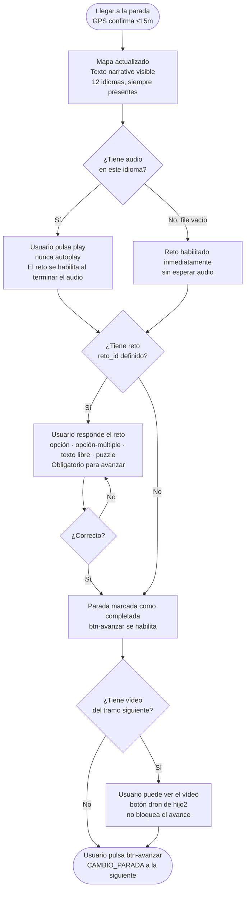

> Este diagrama es el resumen narrativo de alto nivel — el mecanismo real de cuándo se habilita `btn-avanzar` (llegada GPS + audio + reto, en cualquier orden) y por qué el GPS nunca avanza por sí solo está en §2.2.

La aplicación soporta **12 idiomas**: español, inglés, francés, italiano, neerlandés, japonés, alemán, chino simplificado, polaco, portugués, ruso y ucraniano.

Actualmente hay **7 aventuras** definidas en `js/indice-aventuras.js`, todas con `disponible: true` (aparecen en la pantalla de selección): **Aventuras 1, 2, 3, 4, 5, Fallas y 34km**. `disponible: true` solo controla si la aventura es seleccionable — no garantiza que el contenido esté completo, y el nivel de completitud varía mucho según el tipo de contenido:

- **Rutas GPS** (`coordenadas-aventuras.js`): completas en las 7 aventuras, incluidas las referencias visuales (una entrada `tipo:"referencia"` por cada pin numerado del mapa de cada aventura — ver §26.10).
- **Audios narrados** (`audios-aventuras.js`, campo `file`): la estructura de metadatos (título, id) existe con el mismo número de entradas en cada idioma en las 7 aventuras. **11 de los 12 idiomas** (todos salvo español) tienen `file:""` en el 100% de sus entradas (verificado por conteo exhaustivo: 0 excepciones en 6.578 entradas no-español repartidas en las 7 aventuras — 598 entradas × 11 idiomas) — sin audio real, el sistema lo gestiona sin romper el flujo (`file:""` → sin reproducción, ver §7.4). **El español es distinto y no está simplemente "más avanzado":** sus `file` nunca están vacíos (598 entradas en total, entre 47 en Aventura Fallas y 237 en Av34km según la aventura — verificado), pero todas apuntan solo a 2 ficheros compartidos (`01-Intro-ESPAÑOL-1.mp3`/`02-Intro-ESPAÑOL-2.mp3`, en `audios-aventuras/español/`) — no hay ninguna narración distinta por parada todavía, y los subdirectorios por aventura donde debería vivir esa narración real (`audios-aventuras/español/Av1/`, etc.) existen pero están vacíos. `_resolverAudioData()` (`codigo-padre.html`) no distingue placeholder de contenido real — simplemente reenvía el `file` que encuentre, así que **hoy un usuario en español oye ese mismo clip de introducción repetido en cada parada de cada aventura**, no silencio. Ver §12 para el detalle completo por aventura.
- **Textos narrativos** (párrafos): completos en las 7 aventuras y los 12 idiomas — ver §14.
- **Retos**: completos en las 7 aventuras y los 12 idiomas.

La grabación de audio narrado es el único hueco real de contenido en las 7 aventuras; el resto de estructura de datos (rutas, referencias, textos, retos) está completo.

---

## 2. Los modos de la aplicación (CASA y AVENTURA)

La aplicación opera en dos modos fundamentales que determinan el comportamiento de cada componente, cada botón y cada mensaje. El modo activo se almacena en `estado.modo.actual` y se propaga a todos los hijos críticos cada vez que cambia.

**`estado.modo.actual` tiene tres valores posibles, no dos:** `null` (todavía sin decidir, valor de arranque), `'casa'` y `'aventura'`. `null` no es un modo — es la ausencia de decisión, y dura desde el arranque hasta la primera transición real (la activación de una aventura o la reanudación de una sesión guardada).

**Fuente de verdad del modo** (`globalThis.estadoPadre.modo`, `codigo-padre.html`; misma inicialización en `js/state-manager.js`):

```javascript
// Estado inicial al arrancar — sin modo decidido
modo: { actual: null, anterior: null }

// Tras el primer cambio de modo (app.js lo amplía dinámicamente):
modo: {
    actual: 'casa' | 'aventura',
    anterior: 'casa' | 'aventura' | null,
    ultimoCambio: {
        timestamp: Number,
        origen: String,   // hijoId que originó el cambio
        motivo: String,
        opciones: Object
    }
}
```

**Por qué se arranca en `null` y no en CASA:** `manejarCambioModo()` (`js/app.js`) trata "el modo solicitado ya es el actual" como un caso sin transición. Arrancando en CASA, la primerísima transición de la sesión podía coincidir con ese valor ya puesto y caer en esa rama. El camino de producción (→AVENTURA) no lo notaba nunca, porque AVENTURA jamás coincide con el CASA de arranque; el camino de desarrollo (→CASA) sí coincidía. Con `null`, la primera transición es siempre real, sea cual sea su destino.

**Cómo leer el modo con tres estados.** Un binario del tipo `if (modo !== MODOS.CASA)` o un `else` sin condición mete `null` en la rama de AVENTURA. La forma correcta en cualquier punto que vaya a ejecutar lógica de aventura es exigir el modo confirmado (`=== MODOS.AVENTURA`); para lógica de CASA, `=== MODOS.CASA`. Un `|| MODOS.CASA` al leer es válido solo donde "sin decidir" y "en casa" deban tratarse igual a propósito — es el caso del pre-warm (`iniciarPrewarmEnCasa()`) y del `modoInicial` que viaja en `PADRE_CONFIRMA_HIJO_LISTO`.

**Los hijos nunca ven `null`.** `actualizarInterfazModo()` propaga siempre un modo ya canonicalizado, y la sincronización inicial de `_hijoListo_sincronizarModoCriticos()` usa `|| MODOS.CASA`. El tercer estado es interno del padre.

**`estadoMapa.modo` (`js/funciones-mapa.js`) sí arranca en `'casa'`, y es correcto que difiera** del padre durante esa ventana: `actualizarMarcadorUsuario()` elige el icono con `estadoMapa.modo === MODOS.CASA ? 'casa' : 'aventura'`, así que un `null` ahí pintaría la flecha ▲ de AVENTURA en lugar del 🛸 antes de que haya modo. Sus dos únicos escritores (`manejarCambioModoMapa()` y `sincronizarModoMapa()`) rechazan cualquier valor que no sea `'casa'`/`'aventura'`, de modo que `null` es inalcanzable en esa variable.

**Persistencia**: el modo se guarda en `localStorage` como parte del objeto `vv_aventura_iniciada`, junto al flag `dev` (ver §10.19 y §24). Al restaurar una sesión previa, `ejecutarRestauracionAventura()` lee ambos y reposiciona el sistema.

---

### 2.1. MODO CASA

**Definición**: estado neutro y punto de partida de la aplicación. El usuario puede navegar por el contenido sin restricciones de posición GPS. No hay validación de distancia ni tracking activo de movimiento.

**Cuándo está activo**:

- Tras la activación de una aventura con el modo DEV activo (ver §24). **No al arrancar**: el arranque deja el modo sin decidir (`null`), no en CASA — ver "Fuente de verdad del modo" al principio de §2.
- Inmediatamente tras completar las pantallas de demo y recibir `SELECCION.AVENTURA_ACTIVADA`.
- Cuando el usuario desactiva el GPS desde hijo5 estando en AVENTURA.

**Condiciones de estado en MODO CASA**:

- **GPS**: `watchPosition` puede estar activo pero las validaciones de distancia están desactivadas. Los overlays de "fuera de rango" y "siguiente parada" están ocultos.
- **Heartbeat**: detenido. El padre ha enviado `SISTEMA.HEARTBEAT_PAUSE` a sí mismo y a los hijos críticos.
- **Retos**: habilitados o deshabilitados por posición. Padre envía `RETO.ESTADO_CASA` a hijo4 con `{ tipo: 'parada', habilitado: true }` (parada → habilitado) o `{ tipo: 'tramo', habilitado: false }` (tramo → deshabilitado).
- **Navegación**: manual. El usuario selecciona paradas desde hijo5.
- **Audio**: reproducción bajo demanda, no automática.

**Flujo de interacción en MODO CASA**:

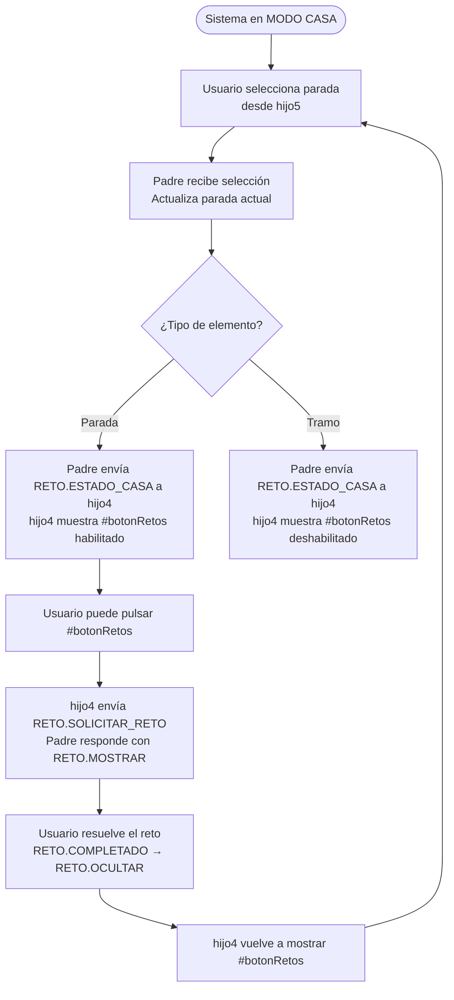

---

### 2.2. MODO AVENTURA

**Definición**: modo activo de juego. El GPS rastrea la posición del usuario en tiempo real, el heartbeat monitoriza que todos los hijos estén vivos, y el contenido se habilita automáticamente según la posición detectada.

**Cuándo está activo**:

- Cuando el usuario pulsa el botón GPS en hijo5 estando en MODO CASA.

**Condiciones de estado en MODO AVENTURA**:

- **GPS**: `watchPosition` activo con `enableHighAccuracy: true`, `timeout: 35000ms`, `maximumAge: 0`. Validaciones de distancia activas: radio de 15m por defecto para detectar llegada a una parada.
- **Heartbeat**: activo. Intervalo de 5000ms. Si un hijo falla 3 heartbeats consecutivos, se marca como desconectado y se intenta reconectar automáticamente.
- **Retos**: habilitados tras escuchar el audio de la parada (o inmediatamente si la parada no tiene audio). Padre envía `RETO.HABILITAR` a hijo4 con `{ razon: 'audio_escuchado_1vez' }` o `{ razon: 'sin_audio' }`.
- **Navegación**: `CAMBIO_PARADA` para el SIGUIENTE elemento nunca lo dispara el GPS por sí solo — solo se envía cuando el usuario pulsa `btn-avanzar` (`progresarSiguienteElemento()`, ver §25.7/§26.7). El GPS solo confirma que el usuario ha llegado al elemento **ya activo** (`NAVEGACION.LLEGADA_DETECTADA`, marca `pending.llegada=true`) — llegada, audio y reto (si lo hay) son tres condiciones independientes que, una vez completas TODAS, habilitan `btn-avanzar` y muestran el cartel de transición; nunca avanzan la aventura sin esa pulsación explícita. Parada y tramo se comportan exactamente igual en esto — antes de la unificación de 2026-08 solo la parada esperaba la pulsación y el tramo avanzaba solo; hoy ambos esperan.
- **Audio**: la petición se envía automáticamente al activarse un elemento (`AUDIO.REPRODUCIR_REQUEST` a hijo3, con `autoplay:false` siempre — el usuario debe pulsar play, ver §7.4). "Automático" aquí es solo la solicitud, nunca la reproducción.

**Flujo de interacción en MODO AVENTURA**:

```mermaid
flowchart TD
    A([Elemento activo tras btn-avanzar\nGPS activo, heartbeat activo]) --> B[GPS detecta posición\ncada actualización del navegador]
    B --> C{¿Usuario dentro del radio\ndel elemento YA activo?}
    C -- No --> B
    C -- Sí ≤15m parada /\ntoleranciaGPS tramo --> D[LLEGADA_DETECTADA → padre\npending.llegada = true]
    D --> E{¿La parada tiene audio?}
    E -- Sí --> F[Padre envía AUDIO.REPRODUCIR_REQUEST a hijo3\nretosBtn deshabilitado en hijo3\n#botonRetos oculto en hijo4]
    E -- No --> G[Padre envía RETO.HABILITAR a hijo4\nrazon: sin_audio\nhabilita retosBtn en hijo3 y #botonRetos]
    F --> H[Usuario pulsa play\nhijo3 envía AUDIO.FIN_REPRODUCCION\npending.audio = true]
    H --> I[Padre envía RETO.HABILITAR a hijo4\nrazon: audio_escuchado_1vez\nhabilita retosBtn en hijo3 y #botonRetos]
    G --> J
    I --> J[Usuario pulsa retosBtn o #botonRetos\nsi la parada tiene reto]
    J --> K[RETO.SOLICITAR_RETO → RETO.MOSTRAR\nUsuario resuelve el reto]
    K --> L{¿Hay más retos\nen la cola?}
    L -- Sí --> K
    L -- No --> M{¿llegada + audio\n+ reto(si hay) completos?}
    D -.->|si ya estaban\naudio/reto completos| M
    M -- No, faltan condiciones --> B
    M -- Sí --> N[marcarParadaCompletada:\nbtnAvanzar habilitado en hijo2\ncartel de transición mostrado\nLA APP ESPERA]
    N --> O([Usuario pulsa btn-avanzar])
    O --> P[progresarSiguienteElemento:\nAHORA sí, CAMBIO_PARADA\na hijo2/hijo3/hijo4/hijo5]
    P --> A
```

---

### 2.3. Inicialización y arranque

Al arrancar `codigo-padre.html`:

1. El modo arranca **sin decidir** (`estado.modo.actual === null`) — ver "Fuente de verdad del modo" en §2. La primera transición real lo fija: `AVENTURA_ACTIVADA` (§9.5) o la reanudación de una sesión guardada (§9.10).
2. Se comprueba si existe `vv_aventura_iniciada` en `localStorage`.
   - Si existe → `ejecutarRestauracionAventura()` (línea 4152) restaura el estado anterior.
   - Si no existe → la app queda en MODO CASA esperando que el usuario complete el flujo de incorporación.
3. En el flujo de incorporación, el padre no carga iframes ni activa GPS hasta P14 (`SELECCION.P14_MOSTRADA`). Los HTML de los iframes hijo contienen lógica de pago y no se sirven antes de que el usuario valide su código en P13. Antes de P14, el padre solo anota idioma y aventura en el estado interno. **Excepción modo DEV (Factor 1, ver §24):** si `_devModeActivo` es `true`, `mostrar()` intercepta P12 y P13 y redirige directamente a P14 sin validar código. El GPS **sí** se activa en P14 en modo DEV, igual que en producción — `_hdl_SELECCION_P14_MOSTRADA` llama a `activarGPS()` incondicionalmente. Encenderlo ya en P14 evita el coste de reingresar GPS más tarde (`watchPosition` nunca se detiene al cambiar de modo — ver §2.6); el filtro CASA/AVENTURA no está en si el GPS está encendido, sino en si sus posiciones fuerzan avance automático (`estadoMapa.modo !== MODOS.AVENTURA` en `funciones-mapa.js:procesarPosicionGPSParaAventura`).
4. Cuando `SELECCION.CODIGO_VALIDADO` llega (P13, solo prod): el handler está vacío — solo registra que el código fue validado con un log. GPS, iframes y datos de aventura se activan en P14.
5. Cuando `SELECCION.P14_MOSTRADA` llega: carga hijo1-5 (`cargarRestoDeiframes` + `cargarHijoCasa`) y datos (`_fase2CargarDatos`) en paralelo, marca `_iframesPreCargadosP14 = true` en cuanto eso termina, y **después** activa GPS, en prod y en dev por igual. En prod, el orden garantiza que hijo2 ya está en modo CASA cuando llegan las primeras posiciones GPS — la proximidad no avanza la aventura hasta que el modo cambia a AVENTURA. Cuando `SELECCION.AVENTURA_ACTIVADA` llega (P16): fast-path si `_iframesPreCargadosP14 === true` (salta recarga); si no, carga iframes como fallback.

```mermaid
flowchart TD
    A([Arranque codigo-padre.html\nestado.modo.actual = null — sin modo decidido]) --> B{¿vv_aventura_iniciada\nen localStorage?}
    B -- No --> C[Demo P1→P11\nIdioma · aventura · puzzle · pago]
    B -- Sí --> D[ejecutarRestauracionAventura\nRestaurar progreso guardado]
    C --> DEV{¿_devModeActivo?\nFactor 1 activado antes de P12}
    DEV -- Sí\nmodo DEV --> BYPASS["mostrar() intercepta P12 y P13\nredirige id=14 directamente\nsin CODIGO_VALIDADO — GPS sí se activa en P14"]
    DEV -- No --> P13[P13: usuario introduce código de compra\nseleccion envía CODIGO_VALIDADO · padre solo registra]
    P13 --> P14[P14: normativa mostrada\n_accionPantalla15() → P14_MOSTRADA\ncarga hijo1-5 + datos en paralelo → activa GPS siempre]
    BYPASS --> P14
    P14 --> P15[P15: Reto R-2\nSÍ → AVENTURA_ACTIVADA]
    P15 --> J([Sistema en MODO CASA\nhijo5 visible si modo DEV · heartbeat inactivo\nUsuario ve mapa y controles])
    D --> J
```

> El camino `DEV`/`BYPASS` de este diagrama es el Factor 1 del modo DEV — detalle completo en §24.

---

### 2.4. Cambio de modo: CASA → AVENTURA

**Disparador**: el usuario pulsa el botón GPS en hijo5. hijo5 envía `SISTEMA.CAMBIO_MODO` con `modo: 'aventura'` al padre.

**Controlador en padre**: `_hdl_SISTEMA_CAMBIO_MODO()` (compartido por ambas direcciones — esta es la rama `modo === 'aventura'`), que:

1. Inmediatamente (antes de cualquier await): oculta el iframe hijo5 (`display: none`). No toca `globalThis._devModeActivo` — ese flag (ver §24) solo se reinicia al recargar la página, nunca por un cambio de modo; `_transicionarAModoCasa()` (rama CASA de esta misma función) usa ese mismo flag para distinguir una vuelta a CASA real del propio botón de un simple bootstrap de dev, así que debe sobrevivir intacto a cualquier número de cambios de modo dentro de la misma sesión — ver §7.6 para el mecanismo completo.
2. Llama directamente a `globalThis.funcionesMapa.manejarCambioModoMapa(mensaje)` (no como handler registrado — competiría con este mismo handler por el orden de inserción en `getMapaControladoresSync`) para actualizar `estadoMapa.modo`, ejecutar `limpiarPorEstado` y resetear la vista.
3. Llama `manejarCambioModo(estado, mensaje)` de `js/app.js`, que actualiza `estado.modo.actual = 'aventura'` (optimistic update) y llama `actualizarInterfazModo()` — envía `SISTEMA.CAMBIO_MODO` a todos los hijos con `secuenciaCompleta: !!estado.todosHijosListos` y espera ENTENDIDO+EFECTUADO de cada uno (timeout 5s+10s).
4. Si el cambio tuvo éxito y existe `estado.paradaRealCongelada` (progreso real guardado al entrar en CASA, ver §2.5): restaura ese progreso llamando `globalThis.__triggerCambioParadaInterno({ paradaId: estado.paradaRealCongelada })`, y limpia el flag. Esto deshace cualquier navegación "de solo mirar" que el usuario haya hecho en CASA vía hijo5 — sin esta restauración, mapa/hijo2 se quedarían apuntando a lo último que se miró en CASA en vez del progreso real de la aventura.
5. Inicia heartbeat (`_gestionarHeartbeatSegunModo`) y `_gestionarGpsSegunModo` comprueba el GPS — normalmente ya está activo desde P14 (no hace nada); si por algún motivo se hubiera desactivado, llama a `activarGPS()` como red de seguridad.

**Payload original de hijo5** (enviado al padre al pulsar el botón):

```javascript
{
    tipo: 'SISTEMA.CAMBIO_MODO',
    origen: 'hijo5',
    destino: resolverIdPadre(),   // 'padre'
    datos: {
        modo: 'aventura',
        timestamp: Date.now(),
        origen: 'boton-gps'
    }
}
```

> **Nota GPS**: `_hdl_SISTEMA_CAMBIO_MODO` llama `_gestionarGpsSegunModo(modo, ...)` al final. Si el modo es AVENTURA y `!estado.gps.activo`, llama `activarGPS()`. Ruta independiente: `btn-avanzar` en hijo2 envía `NAVEGACION.GPS.ACTIVAR` → `_hdl_NAVEGACION_GPS_ACTIVAR` → progresar elemento o revelar navegación, luego `activarGPS()`. El mutex en `activarGPS()` evita doble `watchPosition`.

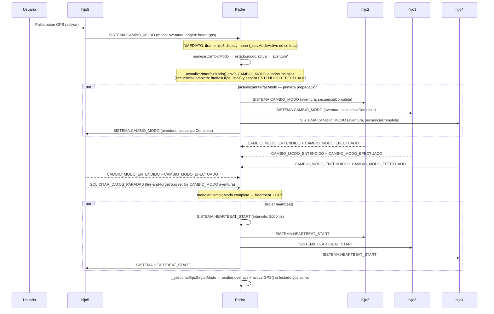

---

### 2.5. Cambio de modo: AVENTURA → CASA

**Disparador**: el usuario pulsa el botón GPS en hijo5 estando en AVENTURA. hijo5 envía `SISTEMA.CAMBIO_MODO` con `modo: 'casa'`.

**Secuencia real** (`_hdl_SISTEMA_CAMBIO_MODO()`, rama `modo === 'casa'` — el orden real difiere del que
parecería intuitivo: el mapa y la congelación de progreso se resuelven **antes** de propagar `CAMBIO_MODO`
a los hijos; localStorage/heartbeat/overlays se resuelven **después**, solo si la propagación tuvo éxito):

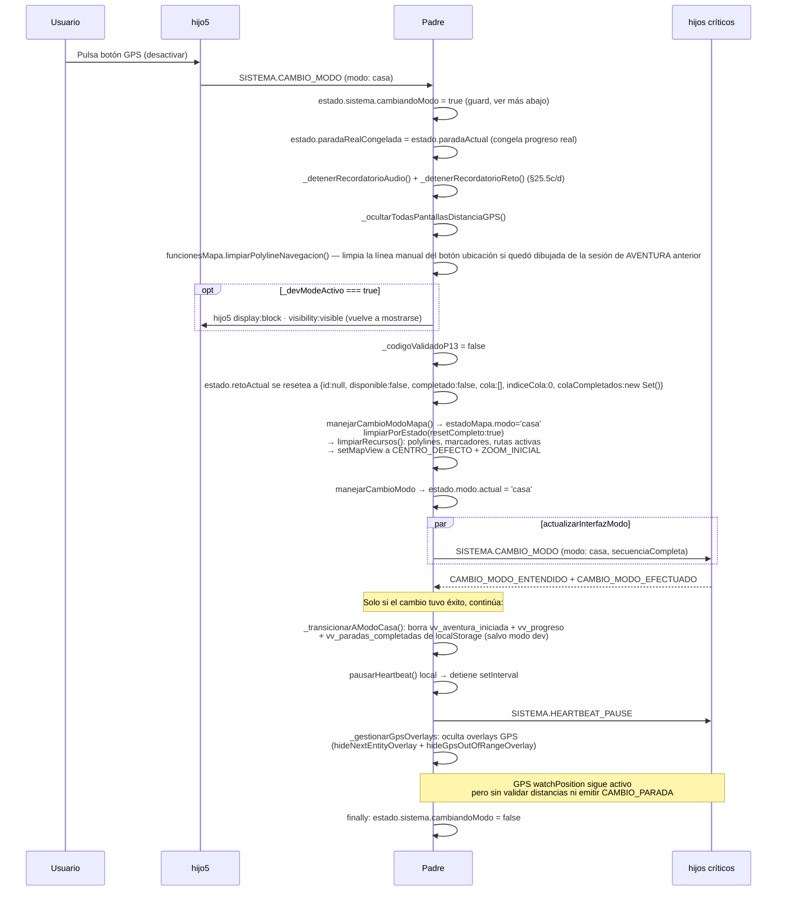

`estado.paradaRealCongelada` es lo que permite al usuario navegar libremente por hijo5 en CASA (que reutiliza
el mismo `NAVEGACION.CAMBIO_PARADA` que un avance real) sin que eso mueva de verdad el progreso de la
aventura — se restaura al volver a AVENTURA (§2.4, paso 4).

**hijo5 vuelve a mostrarse en este mismo cambio de modo:** si `_devModeActivo` sigue en `true`, el `opt` del diagrama de arriba (`display:block; visibility:visible`) usa el mismo patrón que el arranque vía Factor 2 y la reanudación de sesión guardada en CASA (§24) — las tres rutas dejan hijo5 en el mismo estado visible, sin depender de por cuál se llegó a CASA. Cubierto por `tests/e2e/36-hijo5-visible-al-volver-casa.spec.js`.

**Guard de concurrencia (`estado.sistema.cambiandoModo`):** cubre el handler `_hdl_SISTEMA_CAMBIO_MODO` completo, desde la comprobación de rechazo inicial (primera línea de la secuencia) hasta un `finally` que envuelve el handler entero (última línea) — incluye tanto el freeze de `paradaRealCongelada` como la restauración de progreso al volver a AVENTURA vía `__triggerCambioParadaInterno` (§2.4), no solo el tramo intermedio de `manejarCambioModo()` (`js/app.js`). Cualquier `SISTEMA.CAMBIO_MODO` que llegue mientras uno anterior sigue resolviendo se rechaza limpio durante toda la secuencia freeze→switch→restore, evitando que un solape corrompa el progreso congelado. Cubierto por `tests/e2e/37-guard-concurrencia-cambio-modo.spec.js`.

> La excepción "salvo modo dev" del paso de borrado de `localStorage` es el flag `_devModeActivo` — detalle completo del modo DEV en §24.

**Implementación de `limpiarPorEstado`**: `cambiarModo()` en `funciones-mapa.js`
asigna `estadoMapa.modo = modo` **antes** de llamar a `limpiarPorEstado`. Sin el
parámetro explícito `resetCompleto: true`, la comprobación interna
`modo !== estadoMapa.modo` siempre sería falsa (ya son iguales) y la rama de
limpieza de capas nunca se ejecutaría. La corrección captura el modo anterior en
`modoAnterior` antes de actualizar el estado:
`limpiarPorEstado({ modo, resetCompleto: modoAnterior !== modo })`.

**Estado en memoria durante CASA**: el borrado de localStorage afecta solo a la
persistencia. El estado en memoria de `codigo-padre.html` (`estadoPadre.paradaActual`,
`paradasCompletadas`, `elementoActual`) **no se limpia** al pasar a CASA. Mientras
el usuario no recargue la página, ese estado sigue presente.

**Retorno a AVENTURA (misma sesión)**: dos mecanismos independientes actúan en
secuencia, y el segundo pisa al primero cuando aplica:

1. Dentro de `manejarCambioModo()` (`js/app.js`), `_flujoPrewarmModo()` →
   `_prewarmAventura()` → `_reanudarSubsistemasTrasPrewarm()` llama a
   `_activarParadaDefectoAventura()` **salvo que** `estado.sistema.prewarmIniciado &&
   estado.sistema.prewarmPausado` sean ambos `true` — condición que solo se cumple en la
   primerísima activación de AVENTURA de la sesión (si el pre-warm de arranque en CASA,
   `iniciarPrewarmEnCasa()`, ya completó antes de que el usuario pulsara el botón GPS).
   En cualquier retorno posterior a CASA, `prewarmPausado` ya quedó en `false` desde la
   activación anterior, así que la condición no se cumple y `_activarParadaDefectoAventura()`
   **sí se ejecuta**: busca en `elementosIDpadre` la entrada con `padreid === 'padre-P0'`
   (idéntico en las 7 aventuras, a diferencia de `parada_id`, que sí lleva el prefijo de
   cada una: `"Av1-P-0"`, `"Av34km-P-0"`...) y envía `CAMBIO_PARADA` para ella — es decir,
   por sí solo este paso resetearía visualmente el progreso al inicio.
2. De vuelta en `_hdl_SISTEMA_CAMBIO_MODO()` (`codigo-padre.html`, §2.4 paso 4), tras
   confirmar el éxito de `manejarCambioModo()`: si existe `estado.paradaRealCongelada`
   (el progreso real, congelado al entrar en CASA — §2.5), se envía un segundo
   `CAMBIO_PARADA` hacia esa parada real vía `__triggerCambioParadaInterno()`, que
   **sobrescribe** el reset a `padre-P0` del paso 1. El resultado neto para el usuario es
   que el progreso real se conserva — el reset del paso 1 es transitorio e invisible en
   el flujo normal.

A partir de ahí, el GPS solo confirma llegada al elemento activo (`pending.llegada`) — el
`CAMBIO_PARADA` del siguiente elemento sigue requiriendo que el usuario pulse `btn-avanzar`
una vez llegada+audio(+reto) estén completos, igual que en cualquier otro momento de la
aventura (ver §2.2). El progreso visual (`paradasCompletadas`) se mantiene desde memoria.

**Un tercer mecanismo, `ensureDefaultParada()` (`codigo-padre.html`, no `_activarParadaDefectoAventura()`
de `js/app.js` — nombres parecidos, funciones distintas), se llama también en cada entrada a AVENTURA
desde `_activarHeartbeatAventura()`** (después de los dos pasos de arriba). A diferencia de los otros
dos, tiene su propio guard: `if (estado.paradaActual) return` — es un no-op en cualquier retorno
posterior a la primera activación, porque `estado.paradaActual` ya tiene un valor real. Solo hace
algo cuando no existe progreso previo en memoria (primera activación de la sesión, sin que el
pre-warm de `iniciarPrewarmEnCasa()` haya llegado a completar antes).

**Retorno a AVENTURA (sesión reanudada tras cerrar en CASA)**: el modo CASA solo es alcanzable en dev mode (Factor 2 o `DEV_MODE_TOGGLE`), y en dev mode `_transicionarAModoCasa` **no borra** `localStorage` de forma intencional (ver `_transicionarAModoCasa`, excepción `_devModeActivo`). Por eso, al reabrir la app tras cerrarla en CASA, `_comprobarReanudacionAventura` encuentra `vv_aventura_iniciada.modo='casa'` y muestra el diálogo “Continuar / Elegir otra”. Si el usuario elige continuar, `ejecutarRestauracionAventura` restaura la sesión en modo CASA: `#hijo5` visible, datos y progreso restaurados. El primer cambio CASA→AVENTURA de esa sesión pasa por `_hdl_SISTEMA_CAMBIO_MODO` como siempre, pero como la restauración nunca entró a CASA por ese handler, `estado.paradaRealCongelada` no estaba fijado. Para que la resincronización `→AVENTURA` (paso 4 del diagrama de arriba) funcione, `ejecutarRestauracionAventura` fija explícitamente `estado.paradaRealCongelada = estado.paradaActual` justo después de `_restaurarProgresoRest` cuando el modo restaurado es CASA — ver paso 9b en §9.10.

---

### 2.6. GPS: comportamiento según modo

**Parámetros de `watchPosition`** (función `activarGPS()`, línea 4895):

```javascript
navigator.geolocation.watchPosition(onGpsSuccess, onGpsError, {
    enableHighAccuracy: true,   // GPS + A-GPS, máxima precisión
    timeout: 35000,             // 35 s antes de reportar error
    maximumAge: 0               // Sin caché — siempre posición fresca
})
```

| Comportamiento GPS | MODO CASA | MODO AVENTURA |
|--------------------|-----------|---------------|
| `watchPosition` activo | Sí (no se detiene al salir de AVENTURA) | Sí |
| Validación de distancia a paradas | No | Sí (radio ~15m) |
| `CAMBIO_PARADA` automático | No | No — GPS solo marca `pending.llegada`; `CAMBIO_PARADA` del siguiente elemento requiere pulsar `btn-avanzar` (§2.2) |
| Overlay "fuera de rango" | Oculto | Visible si >50m de la ruta |
| Marcador del usuario en mapa | 🛸 | ▲ triángulo azul `#4285F4`, rota con brújula |
| Cámara sigue al usuario | Sí | Sí — en los dos modos, pausable arrastrando el mapa a mano (§4.6c) |

**Ciclo de vida del GPS**:

El permiso GPS se comprueba en P13 (cuando el usuario introduce el código de activación), pero `activarGPS()` **no se llama ahí** — `_hdl_SELECCION_CODIGO_VALIDADO` delega explícitamente a P14. `watchPosition` se inicia en **P14**, después de que todos los iframes hayan enviado `HIJO_LISTO` — en producción y en modo DEV (ver §24) por igual, sin excepción. Encenderlo ya en P14 en dev evita el coste de reingresar GPS más tarde: una vez arrancado, `watchPosition` nunca se detiene al cambiar entre CASA y AVENTURA (ver «Fuente única de verdad del estado GPS», más abajo) — lo único que cambia con el modo es si sus posiciones pueden marcar `pending.llegada` para el elemento activo (§2.2); nunca fuerzan por sí solas un `CAMBIO_PARADA`, que sigue requiriendo la pulsación explícita de `btn-avanzar`.

Si el permiso ya está denegado en **prod**, `_irANormativa()` muestra un aviso local en P13 y el usuario no avanza. **En dev** (`_devCasaMode = true`, ver §24), el check de GPS denegado se salta — el usuario avanza a P14 igualmente; si el GPS termina denegado ahí, el overlay de señal perdida se muestra igual que en prod, pero no impide seguir explorando en modo CASA. Si el permiso es `'prompt'` o `'granted'`, el padre avanza a P14, carga iframes y activa GPS. Si GPS lanza PERMISSION_DENIED en `_watchPositionError`, el padre limpia `watchId`, muestra `imagen-no-gps.png` sobre toda la pantalla con el botón 🛰️→🌐→⚙️, y el usuario no puede continuar hasta ir a los ajustes del sistema y pulsar de nuevo el botón (que llama `activarGPS()` desde el overlay).

```mermaid
flowchart TD
    A([Arranque]) --> B[GPS inactivo]
    B --> C{CODIGO_VALIDADO\nrecibido en P13}
    C --> C2[_hdl_SELECCION_CODIGO_VALIDADO\nno-op — delega a P14_MOSTRADA]
    C2 --> P14{P14 — Normativa\nusuario acepta}
    P14 --> IFRAMES[Promise.all iframes + datos\nespera HIJO_LISTO de todos]
    IFRAMES --> D{¿Permiso GPS\nen navigator.permissions?}
    D -- denied --> E[Aviso en P13\nUsuario va a ajustes del navegador]
    E --> C
    D -- prompt o granted --> F[activarGPS\nwatchPosition iniciado\nenabledHighAccuracy · timeout 35s · maximumAge 0]
    F --> G{¿Callback?}
    G -- onGpsSuccess --> H[MODO CASA\nwatchPosition activo\nsin overlay "fuera de rango" ni bloqueo de trazado\nver nota bajo el diagrama sobre ACTUALIZAR_ESTADO/LLEGADA_DETECTADA]
    G -- PERMISSION_DENIED --> I[clearWatch · watchId null\nimagen-no-gps.png fullscreen\nbotón 🛰️→🌐→⚙️]
    I --> J{Usuario ajusta permisos\ny pulsa botón overlay}
    J --> F
    H --> K{Usuario inicia AVENTURA\nvía botón 🛰️ hijo5 o Factor 2}
    K --> L[MODO AVENTURA\nwatchPosition activo + validaciones distancia]
    L --> M1[funciones-mapa envía ACTUALIZAR_ESTADO a hijo2\ndistancia + toleranciaGPS, cada lectura]
    L --> M2[funciones-mapa detecta llegada por sí mismo\n2 de las últimas 4 lecturas dentro de radio\n→ LLEGADA_DETECTADA directo al padre]
    M1 --> M3[hijo2 hace su propia detección con esos datos\n→ LLEGADA_DETECTADA directo al padre]
    M2 --> L
    M3 --> L
    L --> N{Usuario vuelve a CASA\nvía hijo5 button o Factor 2}
    N --> H
```

Los dos caminos de `LLEGADA_DETECTADA` (funciones-mapa y hijo2) son sensores redundantes del mismo hecho — ninguno de los dos envía `CAMBIO_PARADA`; ambos solo marcan `pending.llegada` en el padre (§2.2). `desactivarGPS()` existe y `clearWatch()` funcionaría si se llamara, pero nada en la app lo dispara vía postMessage — `NAVEGACION.GPS.DESACTIVAR` no tiene handler (la constante existe, sin uso, por si algún día un hijo necesita pedirlo de verdad). En la práctica, el GPS no se detiene nunca tras arrancar en P14.

**Matiz verificado sobre "sin validaciones" en CASA:** `procesarPosicionGPSParaAventura()` se ejecuta en cada lectura GPS sea cual sea el modo (no hay guard de modo a la entrada de la función). Dentro de ella, solo dos cosas están explícitamente condicionadas a `estadoMapa.modo === MODOS.AVENTURA`: la visibilidad del trazado y el propio sensor de llegada de funciones-mapa (`if (estadoMapa.modo !== MODOS.AVENTURA)` corta ahí sin notificar). El envío de `ACTUALIZAR_ESTADO` a hijo2 **no** está condicionado por modo — se envía igual en CASA. El sensor de llegada de hijo2 (`_detectarLlegadaTramo`/`_detectarLlegadaParada`, disparado por ese mismo `ACTUALIZAR_ESTADO`) tampoco comprueba el modo, y el handler del padre para `LLEGADA_DETECTADA` (`_hdl_NAVEGACION_LLEGADA_DETECTADA`) solo comprueba que el `paradaId` coincida con `estado.elementoActual` — que `_transicionarAModoCasa()` no vacía al volver a CASA. En la práctica esto es invisible para el usuario (CASA no muestra botón de avanzar de estilo AVENTURA ni depende de `pending.llegada`), pero la afirmación de la tabla de arriba ("Validación de distancia a paradas: No" en CASA) describe el efecto visible, no una ausencia real de guard en ese tramo del código — solo el overlay "fuera de rango" y el trazado están realmente bloqueados por modo.

---

### 2.7. Heartbeat: monitorización de hijos

Solo activo en **MODO AVENTURA**. Detecta hijos colgados o desconectados.

**Configuración** (`js/config.js`):

- Intervalo: **5000 ms** (5 segundos) — `HEARTBEAT.INTERVALO_HEARTBEAT`
- Máximo de fallos consecutivos antes de marcar como desconectado: **3** — `HEARTBEAT.MAX_HEARTBEATS_FALLIDOS`
- `AUTO_RECONECTAR: true` → recarga el iframe automáticamente

**Algoritmo real del contador de fallos** (`enviarHeartbeatAHijos()`/`procesarHeartbeatResponse()`, `js/mensajeria.js`) — no es "esperar el timeout y entonces contar un fallo", es incrementar de forma optimista en el envío y resetear por completo en cualquier respuesta:

1. En cada tick del `setInterval` de 5s, por cada hijo crítico: se envía `SISTEMA.HEARTBEAT` y, en la misma operación atómica (`sm.atomicUpdateHeartbeat`, evita condición de carrera con la respuesta llegando en paralelo), se incrementa `heartbeatsFallidos[hijoId]` en 1 — el envío en sí ya cuenta como "posible fallo" antes de saber si habrá respuesta.
2. Si el contador alcanza `MAX_HEARTBEATS_FALLIDOS` (3) tras el incremento, se llama `marcarHijoDesconectado(hijoId, autoReconectar)` inmediatamente, en ese mismo tick.
3. Si llega `SISTEMA.HEARTBEAT_RESPONSE` del hijo (`procesarHeartbeatResponse()`) — para cualquier heartbeat previo, no solo el último — el contador de ese hijo se pone a **0** de golpe (no se decrementa) y `ultimoHeartbeat[hijoId]` se actualiza. Si el hijo estaba en `hijosDesconectados`, se quita del set; si era `hijo2`, además se reenvían los mensajes GPS pendientes (`reenviarMensajesGPSAPendientes`).

Efecto neto: 3 ticks seguidos (15s) sin ninguna respuesta marcan al hijo como desconectado — una sola respuesta en cualquier punto de esa ventana reinicia la cuenta desde cero.

**Mensajes del heartbeat** (`js/constants.js`):

| Mensaje | Dirección | Significado |
|---------|-----------|-------------|
| `SISTEMA.HEARTBEAT_START` | padre → hijo | Iniciar ciclo de heartbeat |
| `SISTEMA.HEARTBEAT` | padre → hijo | Latido — "¿sigues vivo?" |
| `SISTEMA.HEARTBEAT_RESPONSE` | hijo → padre | "Sigo vivo" |
| `SISTEMA.HEARTBEAT_PAUSE` | padre → hijo | Detener heartbeat (al pasar a MODO CASA) |

**Flujo del heartbeat**:

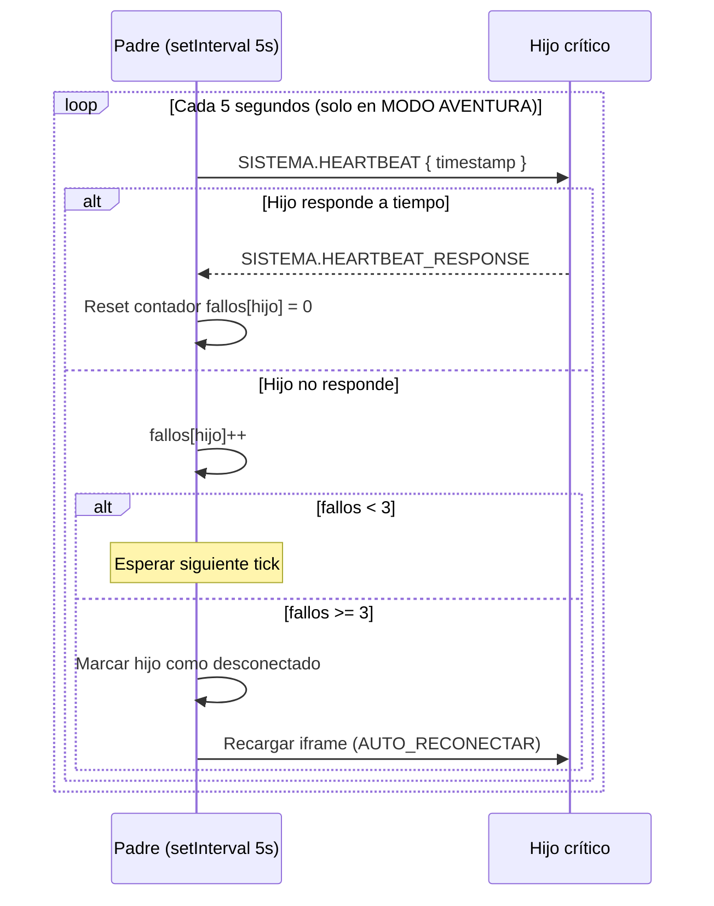

---

### 2.8. Controladores y funciones de cambio de modo

**Controladores registrados en `codigo-padre.html`**:

| Controlador | Línea | Tipo de mensaje | Qué hace |
|-------------|-------|-----------------|----------|
| `_hdl_SISTEMA_CAMBIO_MODO` | 6019 | `SISTEMA.CAMBIO_MODO` | Congela/restaura `paradaRealCongelada`, actualiza el mapa directamente y delega en `manejarCambioModo()` — detalle completo en §2.4/§2.5, no es un simple delegador |
| Heartbeat handler | 6050 | `SISTEMA.HEARTBEAT` | Responde con `HEARTBEAT_RESPONSE` |
| `HEARTBEAT_RESPONSE` handler | 6098 | `SISTEMA.HEARTBEAT_RESPONSE` | Resetea contador de fallos del hijo |
| `_hdl_NAVEGACION_GPS_ACTIVAR` | 8495 | `NAVEGACION.GPS.ACTIVAR` | Activa watchPosition en modo AVENTURA |

**Funciones internas clave**:

| Función | Línea | Qué hace |
|---------|-------|----------|
| `manejarCambioModo(estado, mensaje)` | `js/app.js` | Orquesta la secuencia completa |
| `_gestionarHeartbeatSegunModo()` | 5993 | Inicia o pausa heartbeat según el modo |
| `_activarHeartbeatAventura()` | 5953 | Envía `HEARTBEAT_START` a padre e hijos; (re)inicia el temporizador de hijo1 |
| `_transicionarAModoCasa()` | — | Limpia localStorage de progreso (salvo en modo dev, ver §24), pausa heartbeat y notifica a los hijos |
| `_gestionarGpsSegunModo()` | 6433 | Gestiona overlays GPS según modo; si modo=AVENTURA y `!estado.gps.activo` llama `activarGPS()` |
| `activarGPS()` | 4895 | Inicia `watchPosition` (con mutex anti-duplicado) |
| `desactivarGPS()` | 4982 | Llama `clearWatch()` |
| `ejecutarRestauracionAventura()` | 4152 | Restaura sesión desde `localStorage` |
| `_activarParadaDefectoAventura()` | `js/app.js` | Envía `CAMBIO_PARADA` para `padre-P0`. Se llama desde `_reanudarSubsistemasTrasPrewarm()` salvo que el pre-warm de arranque ya esté "iniciado y pausado"; en la práctica corre en casi todas las activaciones de AVENTURA salvo la primera de la sesión (detalle en §2.5) |
| `cambiarModo(modo)` | `js/funciones-mapa.js` | Captura `modoAnterior`, actualiza `estadoMapa.modo` y llama `limpiarPorEstado`. El orden de operaciones es crítico: `modoAnterior` debe capturarse **antes** de mutar `estadoMapa.modo`. |
| `limpiarPorEstado({ modo, resetCompleto })` | `js/funciones-mapa.js` | Elimina capas activas del mapa (polylines, marcadores, rutas). **No toca la cámara**: el `setMapView()` a `CENTRO_DEFECTO`/`ZOOM_INICIAL` lo hace `manejarCambioModoMapa()` después de llamarla, no esta función — de ahí que la reanudación de sesión pueda saltarse el reset de vista sin renunciar a la limpieza de capas (§9.10). `resetCompleto:true` es obligatorio cuando se llama tras un cambio de modo, porque en ese punto `estadoMapa.modo` ya fue actualizado y la comprobación interna fallaría sin el flag explícito. |

---

### 2.9. Tabla comparativa: comportamiento de cada hijo por modo

| Hijo | MODO CASA | MODO AVENTURA |
|------|-----------|---------------|
| **hijo1** `extrainfo-hijo1.html` | Disponible, sin cambios. | Disponible, sin cambios. No tiene lógica específica de modo. |
| **hijo2** `coordenadas-hijo2.html` | Sin mapa propio — lo gestiona el padre. 6 botones de navegación activos. Sin pantallas de aviso por distancia (`verificarDistanciaYActualizarBotones()` solo actúa si `modo==='aventura'`). Sin `CAMBIO_PARADA` automático — nunca lo envía en ningún modo (matiz sobre "sin validaciones de distancia" en §2.6). | Sin mapa propio — lo gestiona el padre. Detecta proximidad GPS a paradas/tramos y envía `LLEGADA_DETECTADA` al padre (solo marca `pending.llegada`, nunca `CAMBIO_PARADA`). Notifica al padre la distancia real si el usuario se aleja, y el padre muestra la pantalla de aviso que corresponda (§31.4). |
| **hijo3** `audio-hijo3.html` | Reproducción bajo demanda. `retosBtn` **habilitado inmediatamente** si la parada tiene `reto_id`; deshabilitado en tramos o paradas sin reto. | Audio enviado automáticamente al llegar a cada parada (`AUDIO.REPRODUCIR_REQUEST`). `retosBtn` habilitado tras `FIN_REPRODUCCION` (o inmediatamente si sin audio). |
| **hijo4** `retos-hijo4.html` | `#botonRetos-wrapper` visible. Habilitado en paradas, deshabilitado en tramos, controlado por `RETO.ESTADO_CASA`. | `#botonRetos-wrapper` oculto al llegar a una parada. Aparece y se habilita al recibir `RETO.HABILITAR` (tras audio o `razon: sin_audio`). |
| **hijo5** `boton-casa-hijo5.html` *(desarrollo)* | Botón GPS en rojo "OFF". Lista de paradas navegable manualmente. | Botón GPS en verde "ON". Lista de paradas actualizada automáticamente según progresión GPS. |
| **hijo6** `chat-hijo6.html` | Disponible sin cambios. | Disponible sin cambios. |

**Mensajes recibidos por cada hijo al cambiar de modo**:

| Hijo | → AVENTURA | → CASA |
|------|-----------|--------|
| hijo1 | `SISTEMA.CAMBIO_MODO` | `SISTEMA.CAMBIO_MODO` |
| hijo2 | `SISTEMA.CAMBIO_MODO` + `SISTEMA.HEARTBEAT_START` | `SISTEMA.CAMBIO_MODO` + `SISTEMA.HEARTBEAT_PAUSE` |
| hijo3 | `SISTEMA.CAMBIO_MODO` + `SISTEMA.HEARTBEAT_START` | `SISTEMA.CAMBIO_MODO` + `SISTEMA.HEARTBEAT_PAUSE` |
| hijo4 | `SISTEMA.CAMBIO_MODO` + `SISTEMA.HEARTBEAT_START` | `SISTEMA.CAMBIO_MODO` + `SISTEMA.HEARTBEAT_PAUSE` |
| hijo5 | `SISTEMA.CAMBIO_MODO` + `SISTEMA.HEARTBEAT_START` | `SISTEMA.CAMBIO_MODO` + `SISTEMA.HEARTBEAT_PAUSE` |
| hijo6 | `SISTEMA.CAMBIO_MODO` | `SISTEMA.CAMBIO_MODO` |

> El heartbeat es dinámico: `enviarHeartbeatAHijos()` en `mensajeria.js` usa `_hijosRegistrados` (Map poblado por cada `HIJO_PREPARADO`). Todos los hijos — incluidos hijo1, hijo6 y la pantalla de selección — reciben el pulso una vez registrados. `HEARTBEAT_START`/`PAUSE` se envían desde `codigo-padre.html` a hijo2/3/4/5 explícitamente (estos son los hijos con estado heartbeat en modo aventura).

---

## 3. Cómo funciona a vista de pájaro

Imagina la aplicación como una **pila de transparencias**. La pantalla principal (`codigo-padre.html`, el "padre") es el proyector, y cada transparencia es un iframe que se superpone sobre los demás. Varios pueden estar activos simultáneamente — unos visibles, otros invisibles pero escuchando mensajes.

El padre es el único que tiene visión global del sistema. Conoce el modo actual, el progreso de la aventura, las coordenadas de cada parada y el estado de todos los hijos. Los hijos solo conocen su propio dominio (el mapa, el audio, los retos...) y se comunican hacia arriba, al padre, que decide qué hacer con esa información.

### 3.1. La pila de iframes (orden z-index)

```text
┌────────────────────────────────────────────────────┐
│                codigo-padre.html                    │
│                (orquestador central)                │
│                                                     │
│  ▲ z-index más alto                                 │
│  │                                                  │
│  │  ┌─────────────────────────────────────────┐     │
│  │  │ boton-casa-hijo5.html  [DEV]            │     │
│  │  │ herramienta de desarrollo — no en PWA  │     │ ← simula navegación en modo CASA desde escritorio
│  │  └─────────────────────────────────────────┘     │
│  │  ┌─────────────────────────────────────────┐     │
│  │  │ retos-hijo4.html                        │     │ ← visible SOLO cuando el usuario inicia un reto
│  │  │ extrainfo-hijo1.html                    │     │ ← panel lateral de opciones extra
│  │  │ chat-hijo6.html  (carga lazy, 1er uso)  │     │ ← asistente de soporte FAQ
│  │  └─────────────────────────────────────────┘     │
│  │  ┌─────────────────────────────────────────┐     │
│  │  │ audio-hijo3.html  (invisible, siempre   │     │
│  │  │  activo en segundo plano)               │     │ ← solo reproduce audio, nunca visible
│  │  └─────────────────────────────────────────┘     │
│  │  ┌─────────────────────────────────────────┐     │
│  │  │ coordenadas-hijo2.html  (GPS + botones) │     │ ← siempre visible durante la aventura
│  │  └─────────────────────────────────────────┘     │
│  ▼ z-index más bajo                                 │
│                                                     │
│  Al inicio, En-busca-del-tesoro.html cubre          │
│  toda la pantalla (z-index máximo). Contiene        │
│  puzzle.html como sub-iframe propio — NO es         │
│  un hijo directo del padre.                         │
└────────────────────────────────────────────────────┘
```

**Notas sobre visibilidad**:

- `hijo3` (audio) nunca es visible — existe solo para reproducir audio en segundo plano.
- `hijo4` (retos) solo se hace visible cuando el padre llama `mostrarHijo4()` al recibir `RETO.SOLICITAR_RETO`. Al cerrarse el reto vuelve a `display:none`.
- `hijo6` (chat) se carga de forma lazy — solo se inicializa la primera vez que el usuario lo abre.
- `hijo5` es una herramienta de desarrollo exclusiva; no forma parte de la PWA real.

### 3.2. Arquitectura de comunicación

Los hijos **nunca se hablan entre sí directamente** — toda comunicación pasa por el padre mediante `postMessage`. El padre actúa como bus de mensajes central: recibe notificaciones de los hijos, toma decisiones y envía órdenes de vuelta.

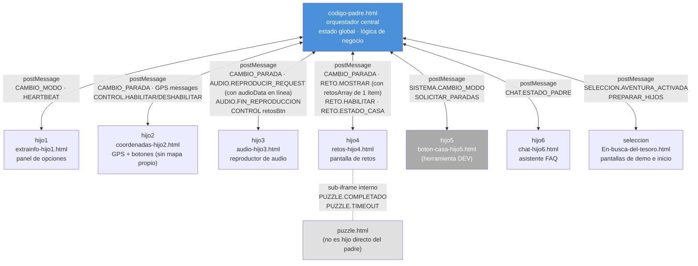

> Para el detalle de cada mensaje, controladores, payloads y comportamiento por modo ver **§2** y **§8**.

### 3.3. Ciclo de vida completo de una sesión

Este es el arco completo desde que el usuario abre la app hasta que completa la aventura:

```mermaid
flowchart TD
    A([Usuario abre valenciavguides.es]) --> B{¿Sesión guardada\nen localStorage?}
    B -- Sí vv_aventura_iniciada --> C[ejecutarRestauracionAventura\nRestaurar progreso · idioma · parada actual]
    B -- No --> D[Demo P1→P17 · selección idioma · aventura · puzzle · pago · activación]
    D --> P13V[P13: usuario introduce código\nPadre recibe CODIGO_VALIDADO]
    P13V --> E[P14_MOSTRADA -> padre carga iframes + datos en paralelo\nluego activa GPS (solo prod) mientras usuario lee normativa]
    E --> F[Handshake HIJO_LISTO\nde cada hijo]
    F --> G[Padre distribuye coordenadas y textos\naudios/retos se resuelven por parada, no en bloque]
    G --> H([MODO CASA\nUsuario ve mapa · GPS activo sin validaciones · heartbeat inactivo])
    C --> H

    H --> I[Usuario inicia aventura\n→ SISTEMA.CAMBIO_MODO aventura]
    I --> J([MODO AVENTURA\nwatchPosition activo · heartbeat 5s · validaciones distancia])

    J --> ACT[Elemento activo: padre ya envió CAMBIO_PARADA a hijo2/3/4/5\nP0 al entrar en AVENTURA, o el siguiente tras btn-avanzar del anterior\nAudio se resuelve y envía automáticamente — autoplay:false, usuario pulsa play]
    ACT --> COND{3 condiciones independientes\nver §2.2}
    COND --> GPSC[GPS ≤15m confirmado 2 lecturas\n→ LLEGADA_DETECTADA → pending.llegada=true]
    COND --> AUDC[Usuario reproduce y termina el audio\n→ pending.audio=true]
    COND --> RETC[Si hay reto: usuario lo completa\n→ pending.reto=true]
    GPSC --> CHECK{¿Todas las condiciones\nrequeridas cumplidas?}
    AUDC --> CHECK
    RETC --> CHECK
    CHECK -- No --> COND
    CHECK -- Sí --> DONE[marcarParadaCompletada:\nCONTROL.HABILITAR btnAvanzar + cartel de transición\nNO envía CAMBIO_PARADA todavía]
    DONE --> ADV{Usuario pulsa btn-avanzar}
    ADV --> NEXT[progresarSiguienteElemento:\nAQUÍ se envía CAMBIO_PARADA del siguiente elemento]
    NEXT --> S2{¿Última parada?}
    S2 -- No --> ACT
    S2 -- Sí --> T([Aventura completada\nEstado guardado en localStorage])
```

### 3.4. Modo CASA vs modo AVENTURA — qué cambia

La app arranca **sin modo decidido** (`estado.modo.actual === null`, ver §2), antes de que el usuario haya elegido ninguna aventura: hasta la primera transición real no hay ni CASA ni AVENTURA. Al completar el onboarding y confirmar el inicio (`AVENTURA_ACTIVADA`), el padre pasa directo a **modo AVENTURA** en producción — no hace falta ningún botón; hijo5 y su botón GPS son exclusivos del modo DEV (ver §9.5/§24). Desde que el modo cambia, el padre gestiona los dos modos de forma radicalmente diferente. La misma acción — cambiar de parada — produce efectos distintos según el modo activo.

**Resumen ejecutivo:**

| | Modo CASA | Modo AVENTURA |
|--|-----------|---------------|
| **GPS** | Activo (`watchPosition` continuo), sin validaciones de distancia | Activo (`watchPosition` continuo) + validaciones de distancia activas |
| **Heartbeat** | Pausado | Activo cada ~5 s |
| **Quién cambia de parada** | El usuario — pulsa una parada en hijo5 | El usuario — pulsa `btn-avanzar` una vez llegada GPS + audio (+ reto) están completos. El GPS nunca envía `CAMBIO_PARADA` por sí solo (§2.2) |
| **`retosBtn` al llegar a una parada** | Se habilita **inmediatamente** si la parada tiene reto | Arranca **deshabilitado** — se habilita solo cuando termina el audio |
| **Botón vídeo/dron (`#btn-video`)** | Habilitado inmediatamente si el elemento es tramo | Habilitado si elemento es tramo Y reto no activo |
| **Audio** | No se reproduce automáticamente | Se carga y queda listo al activarse cada parada/tramo, pero tampoco se reproduce solo — el usuario pulsa play. `_solicitarAudioParaParada()` manda siempre `AUDIO.REPRODUCIR_REQUEST` con `autoplay: false` (verificado: cero apariciones de `autoplay: true` en `codigo-padre.html`); `cargarYReproducirAudio()` en hijo3 solo llama a `audioPlayer.play()` si `autoplay` es `true` |
| **Botón "Avanzar" (hijo2)** | Sin efecto — no hay progresión automática por GPS | Se bloquea al entrar en cada parada; se desbloquea al completar audio + reto |
| **Polylines y marcadores del mapa** | Visibles **inmediatamente** tras dibujar, sin condición | Visibles **inmediatamente** tras dibujar, sin condición — se ocultan únicamente al pulsar `btn-ubicacion` (§4.7d) |

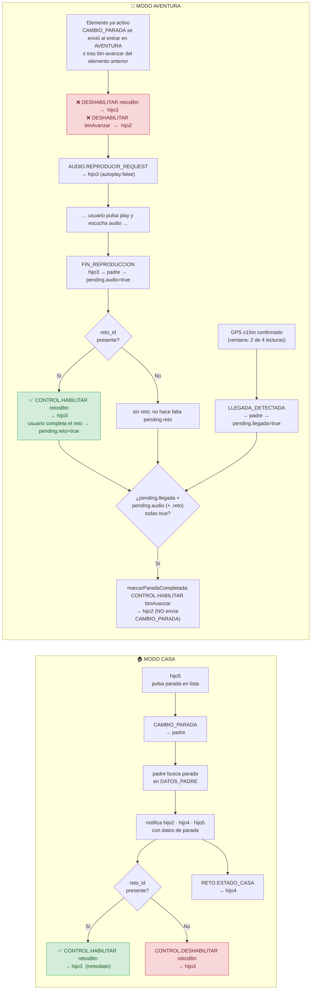

**Flujo CAMBIO_PARADA en modo CASA** — mensajes exactos cuando el usuario pulsa una parada en hijo5:

```text
hijo5  →  CAMBIO_PARADA { paradaId: "padre-P0" }  →  padre
padre  →  busca parada en DATOS_PADRE
padre  →  CAMBIO_PARADA { parada, coordenadas, audio_id, reto_id }  →  hijo2, hijo3, hijo4, hijo5
padre  →  CONTROL.HABILITAR { control: 'retosBtn' }  →  hijo3   ← inmediato si tiene reto_id
padre  →  RETO.ESTADO_CASA { habilitado: true }  →  hijo4         ← si es parada (no tramo)
```

**Flujo al activarse un elemento en modo AVENTURA** — mensajes exactos, disparados al enviar `CAMBIO_PARADA`
(al entrar en AVENTURA, o tras `progresarSiguienteElemento()` cuando el usuario pulsa `btn-avanzar` en el
elemento anterior — nunca por el GPS directamente, ver §2.2):

```text
padre  →  CAMBIO_PARADA { parada, coordenadas, audio_id, reto_id }  →  hijo2, hijo3, hijo4, hijo5
padre  →  CONTROL.DESHABILITAR { control: 'retosBtn' }  →  hijo3  ← bloqueado hasta audio
padre  →  CONTROL.DESHABILITAR { control: 'btnAvanzar' }  →  hijo2
padre  →  AUDIO.REPRODUCIR_REQUEST { audioId, audioData, autoplay:false }  →  hijo3   ← audioData resuelto vía cargarAudios()
     ... [usuario pulsa play y escucha audio] ...
hijo3  →  AUDIO.FIN_REPRODUCCION  →  padre                      ← pending.audio = true
padre  →  CONTROL.HABILITAR { control: 'retosBtn' }  →  hijo3    ← ahora sí se habilita (si hay reto)
     ... en paralelo, en cualquier momento ...
hijo2  →  LLEGADA_DETECTADA { paradaId }  →  padre               ← pending.llegada = true
     ... cuando llegada + audio (+ reto si presente) están todas a true ...
padre  →  marcarParadaCompletada() → CONTROL.HABILITAR { control: 'btnAvanzar' }  →  hijo2   ← NO envía CAMBIO_PARADA aquí
     ... [usuario pulsa btn-avanzar] ...
hijo2  →  NAVEGACION.GPS.ACTIVAR  →  padre
padre  →  progresarSiguienteElemento() → CAMBIO_PARADA del siguiente elemento  ← aquí se repite este mismo flujo
```

> Para los detalles técnicos de `_configurarRetoBtn`, la búsqueda de paradas en `DATOS_PADRE` y la precedencia de IDs ver **§5** y **§6**.

---

## 4. Iconografía visual: emojis, marcadores y polylines

> Referencia rápida de todos los elementos visuales que el usuario ve durante la aventura: emojis en la interfaz, marcadores en el mapa y líneas de ruta.

### 4.1. Emojis en las pantallas de selección (En-busca-del-tesoro.html)

Estos emojis aparecen durante las 17 pantallas de demo/selección, antes de que comience la aventura.

| Emoji | Dónde aparece | Para qué sirve |
|-------|---------------|-----------------|
| → | Botones de avanzar/confirmar (P1, P4, P5, P9, P11, P12, P16) | Flecha de navegación "ir a la siguiente pantalla" |
| ➜ | Botón grande del puzzle (P6) | Flecha gruesa para continuar tras completar el puzzle |
| ✗ | Botones rojos de rechazo (P3, P9), feedback de formato de código insuficiente (P13, <4 caracteres) | Cancelar selección o indicar formato inválido — P13 no muestra ✓ de "código correcto" porque no hay nada que validar localmente (ver §16.2) |
| 💳 | Pantalla de pago (P12) | Icono de la pasarela de pago (aún no implementada) |
| 🔑 | Pantalla de activación (P13) | Indica que se necesita un código de acceso |
| ✒️ | Pantalla de activación (P13) | Acompañamiento visual del campo de entrada |
| ❓ | Pantalla de activación (P13) | Indica ayuda o instrucciones |
| 🚀 | Botón de iniciar aventura (P13) | Avanza a P14 (normativa); la aventura se lanza al aceptar en P15 |
| 🔇 | Overlay de aviso (confirmación en P9) | Indica que no hay audio disponible para la combinación idioma+aventura |

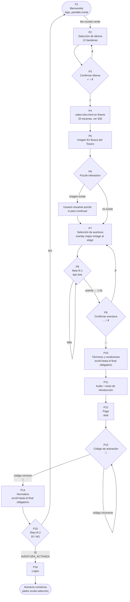

### 4.2. Emojis en los botones de selección de aventura (P7)

Cada aventura muestra una línea de estadísticas con emojis universales (no necesitan traducción):

| Emoji | Significado | Ejemplo |
|-------|-------------|---------|
| 👣 | Vehículo: a pie | Aventuras 1, 2 y Fallas |
| 🚲 | Vehículo: bicicleta | Aventuras 3, 4 y 5 |
| 🛴 | Vehículo: patinete | Aventuras 3, 4 y 5 (combinado con 🚲) |
|🏛️  🚲🛴👣 | Vehículo: mixto | Aventura 34km |
| | Número de monumentos | `🏛️19` = 19 monumentos |
| 📍 | Número de paradas | `📍41` = 41 paradas |
| 🧩 | Número de retos | `🧩30` = 30 retos |
| ⏳ | Tiempo máximo para completar | `⏳max60h` = 60 horas |

### 4.3. Emojis durante la aventura activa

Una vez en modo AVENTURA, estos emojis aparecen en la interfaz:

| Emoji | Componente | Para qué sirve |
|-------|------------|-----------------|
| ✖ | Padre (pantallas de fuera de rango, §31.4) | Botón para cerrar el aviso de distancia al objetivo |
| 🔄 | Puzzle (puzzle.html) | Reiniciar el puzzle |
| ⏸️ / ▶️ | Puzzle (puzzle.html) | Pausar / reanudar el puzzle |
| ⏩ | Puzzle (puzzle.html) y Retos (retos-hijo4.html) | Saltar el reto/puzzle sin resolverlo — se da por aprobado igualmente (§13, "Saltar un reto o puzzle roto") |

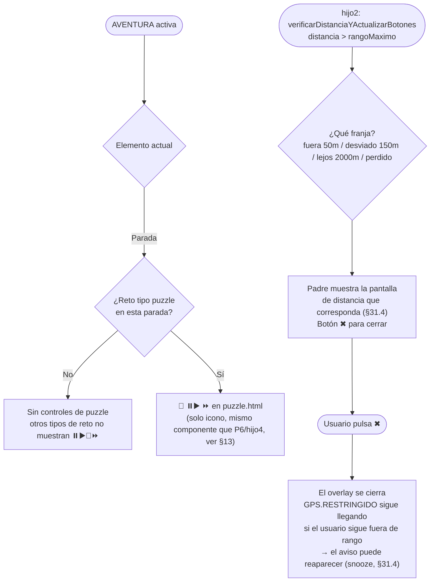

### 4.3b. Emojis en hijo5 (herramienta de desarrollo — no visible en la PWA final)

`boton-casa-hijo5.html` es una herramienta exclusiva de desarrollo para simular el modo CASA desde el escritorio. No aparece en la PWA real.

| Emoji | Componente | Para qué sirve |
|-------|------------|-----------------|
| 🛰️ | Hijo 5 (botón casa) | Botón de activación/desactivación del GPS. Muestra "ON" (verde) en aventura, "OFF" (rojo) en casa |
| 🎯 | Hijo 5 (lista de paradas) | Identifica las **paradas** (puntos de interés) en la lista lateral |
| 🛣️ | Hijo 5 (lista de paradas) | Identifica los **tramos** (caminos entre paradas) en la lista lateral |
| 📌 | Hijo 5 (lista de paradas) | Identifica el **punto de inicio** de la ruta |
| ? | Hijo 5 (lista de paradas) | Tipo de punto desconocido (fallback, texto plano, clase `default-btn`) |

### 4.4. Emojis en los retos (hijo 4)

| Emoji / Elemento | Cuándo aparece | Significado |
|-------------------|----------------|-------------|
| Borde **verde** | Al acertar un reto | Respuesta correcta |
| Borde **rojo** | Al fallar un reto | Respuesta incorrecta |
| Animación de **fuegos artificiales** (chispas de colores) | Al acertar | Celebración visual. 15 explosiones con 30 chispas cada una |
| Vibración del móvil (300 ms) | Al fallar | Feedback háptico de error |
| 🆘❓ Botón SOS (`#btnMostrarRespuesta`) | Siempre visible | Muestra/oculta el panel con la respuesta correcta. Segunda pulsación lo esconde |
| 🌍 Botón continuar (`#btnNextAfterReto`) **deshabilitado** | Antes de acertar | `.btn-mundo-verde:disabled` — `opacity: 0.35`, `cursor: not-allowed`, elementos orbita detenidos. No interactivo hasta respuesta correcta |
| 🌍 Botón continuar (`#btnNextAfterReto`) **verde brillante** | Después de acertar | `.btn-mundo-verde` habilitado, con elementos orbitando (➣ 🎯) en animación continua |
| 🌍 Botón puzzle (`#btn-puzzle-continuar`) | Cuando el puzzle se completa | Mismo estilo `.btn-mundo-verde` con orbiting; oculto hasta que `puzzle.html` envía `PUZZLE.COMPLETADO` |

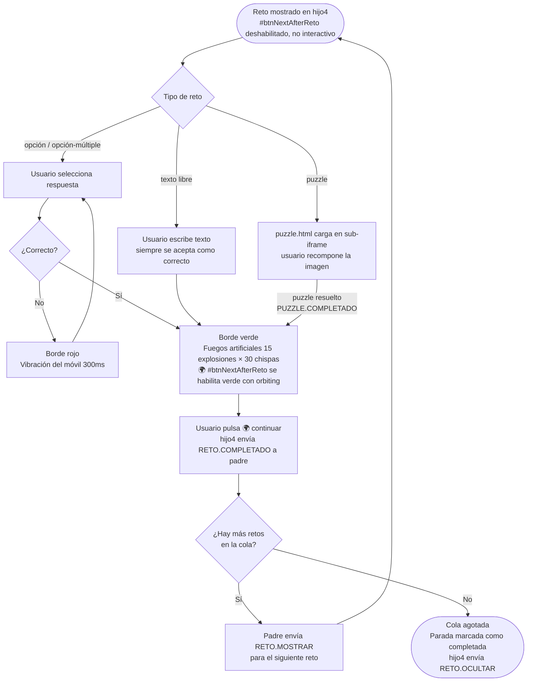

### 4.5. Marcadores en el mapa

El mapa usa emojis y formas coloreadas como marcadores sobre las paradas:

| Marcador | Forma | Color | Cuándo aparece |
|----------|-------|-------|----------------|
| 📌 | Emoji chincheta | — | **Punto de inicio** de la ruta |
| 🎯 | Emoji diana | — | **Paradas** (puntos de interés) y **punto final** de la ruta |
| ▲ (flecha GPS) | Triángulo CSS con borde blanco, sin punto central (el triángulo solo ya representa posición y rumbo) | `#4285F4` azul Google | **Posición real del usuario** en tiempo real (modo AVENTURA). Rota con la brújula del dispositivo vía `DeviceOrientationEvent` (hasta 30 veces/segundo, pero `actualizarRotacionFlechaGPS()` limita la escritura al DOM a ~10Hz). El sensor de rumbo es ruidoso — se aplica suavizado exponencial (solo una fracción del salto detectado en cada lectura) sobre un ángulo acumulado sin acotar a 0-360°, para que la rotación CSS siempre gire por el camino corto y no dé una vuelta larga visible al cruzar 359°→0°; ese ángulo acumulado también sobrevive a que el marcador se destruya y recree en cada posición GPS (ver detalle en la tabla de módulos, `funciones-mapa.js`). En modo CASA aparece como 🛸. Es el **único** marcador de posición/rumbo del usuario — no hay ningún segundo marcador proyectado sobre la ruta (ver nota más abajo). Se recalcula en cada posición GPS, además de en vivo durante cualquier gesto de zoom (igual que 📌/🎯 desde que se añadió el listener de `zoom` — ver "Escalado dinámico: dos curvas, no una" en §4.6), con su propia curva de escala, más suave que la de 📌/🎯 |
| ○ (círculo 15 m) | Polígono geográfico (radio constante en metros, no en píxeles) — `_crearCirculoGeografico()` | Borde naranja `#ff8c00`, relleno naranja muy tenue (`fillOpacity: 0.12`) | **Zona de activación de parada**, centrada siempre en la posición real del usuario: se mueve con la propia flecha ▲/🛸. Visible siempre que el modo es AVENTURA (independientemente de si el elemento activo es parada o tramo); desaparece al volver a CASA. Da una referencia visual constante de "este es tu margen para que la app detecte que has llegado". Creado/actualizado dentro de `actualizarMarcadorUsuario()`, en el mismo bloque que activa la brújula por primera vez. MapLibre no tiene una capa `circle` con radio en metros (su `circle-radius` es en píxeles de pantalla, cambiaría de tamaño real al hacer zoom), así que el círculo se genera como un polígono real (32 puntos a distancia/rumbo fijo del centro) que se recalcula cada vez que el centro se mueve. Es el **único** círculo del mapa de aventura |

**Las referencias visuales (🏛️, monumentos mencionados en el texto que el usuario nunca visita físicamente) no se dibujan en el mapa de aventura, por decisión de diseño** — solo aparecen en `mapa-completo.html` (§11, "El mapa completo"), la página aparte a la que lleva `#btn-mapa-completo`. El mapa de aventura solo dibuja los 5 tipos de marcador de la tabla de arriba.

**No existe ningún marcador proyectado sobre la ruta, más allá del triángulo ▲ y el círculo naranja de arriba.** Un segundo marcador de posición (flecha + halo, proyectado sobre el punto de la polyline más cercano en vez de la posición GPS real) duplicaría esa misma información sin aportar guía turn-by-turn real (ver §4.6b, esa decisión de diseño sigue vigente) y arriesgaría una paleta de color inconsistente con el resto de la app (naranja = zona de activación, azul = tú) — se descarta por diseño.

**Tamaño de los emoji 📌/🎯 y reescalado con el zoom.** Tamaño base (antes de escalar): 📌 inicio de tramo y 🎯 parada/fin de tramo **20px los dos** — son dos señales del mismo rango y su símbolo ya dice cuál es cuál sin necesidad de una diferencia de tamaño —, y 🎯 destino de la línea de navegación manual 26px (el más grande, para destacarlo sobre el resto). `reescalarMarcadoresEmoji()` (`js/funciones-mapa.js`) recorre el `Map` `marcadoresParadas` en cada evento `zoom` del mapa (no solo `zoomend`: el listener de `zoom` dispara en cada frame del gesto de pinch/scroll/botones, acotado a una llamada por frame vía `requestAnimationFrame` para no re-renderizar cada marcador más veces de las que la pantalla puede pintar — así el tamaño sigue el gesto en vivo en vez de saltar solo al soltar) y reescribe el `font-size` de cada marcador según la clase CSS que tenga: `custom-marker-emoji` o `tramo-fin-icon` → 🎯 parada, `tramo-inicio-icon` → 📌 inicio. **Esa comprobación se hace con `classList.contains()`, nunca comparando `className` con `===`**, y es una restricción de la librería, no una preferencia de estilo: MapLibre añade sus propias clases (`maplibregl-marker` y la de anclaje) en el constructor de **todo** `Marker`, también cuando se le pasa un elemento propio, así que el `className` completo nunca puede ser igual a la clase que puso la app. Una comparación estricta ahí no falla ni avisa: simplemente no se cumple jamás, la función entera queda inerte y los emoji se congelan al tamaño con el que nacieron — solo los marcadores registrados en ese `Map` reciben este reescalado; el marcador de destino de navegación (`marcadorDestinoNavegacion`) se reescala aparte, en la misma función. El marcador 🎯 de una parada normal (no de tramo) se registra en `marcadoresParadas` bajo la clave `'parada-actual'` al crearse y se retira de ahí al limpiarse — mismo patrón que ya usaban los marcadores de tramo (`'tramo-inicio-ruta'`/`'tramo-fin-ruta'`) desde siempre. El factor de escala que multiplica estos tres tamaños base es el mismo que usan las polylines — ver "Escalado dinámico: dos curvas, no una" en §4.6.

**Una única función construye el HTML de estos tres emoji, tanto al crearlos como al reescalarlos.** `_htmlEmojiRuta(emoji, size, centrado)` (`js/funciones-mapa.js`) es el único punto del código que arma la plantilla `<div style="font-size:...">` de 📌/🎯 — la usan `completarCambioParada()` (marcadores de tramo e inicio) y `dibujarPolylineNavegacion()` (marcador de destino) al crear el elemento, y `reescalarMarcadoresEmoji()` al reescribirlo en cada evento de zoom. Antes de existir este helper, la misma plantilla estaba copiada por separado en cada uno de esos cuatro sitios — funcionalmente idéntica hoy, pero con cuatro copias que un cambio futuro en una de ellas podía dejar desincronizadas con las otras tres sin que ningún test lo detectara. El marcador de posición propia (▲/🛸) no usa esta función: es otra familia, con su propia plantilla y su propia curva de escala (ver tabla de abajo). Sigue exactamente el mismo principio de fuente única, con su propio helper — `_htmlMarcadorUsuario(modo, heading)` (`js/funciones-mapa.js`) es el único punto que arma el HTML de la flecha y del 🛸, y lo usan tanto `actualizarMarcadorUsuario()` al recrear el marcador en cada posición GPS como `reescalarMarcadorUsuario()` al reescribirlo en cada evento de zoom.

**`completarCambioParada()` es la única cadena que dibuja marcadores/polyline en el mapa por cambio de parada/tramo, en los dos modos.** Los tests de auto-reparación de polyline (`23-polyline-autoreparacion.spec.js`) verifican el mecanismo de creación diferida de capas llamando directamente a `dibujarPolylineNavegacion()` (la función real del botón de ubicación, §4.6a). Ningún emisor real de `DATOS.COORDENADAS_PARADAS_REQUEST` necesita que su respuesta dibuje nada en el mapa — ver la tabla de `DATOS.COORDENADAS_PARADAS_REQUEST/RESPONSE` más abajo para el detalle de los tres emisores reales y por qué ninguno depende de ningún dibujado.

**El vértice (ápice) del triángulo de la flecha GPS, no su base ni su centro geométrico, es el punto que queda anclado sobre la posición GPS real al rotar.** Cada uno de los 3 triángulos que forman la flecha (sombra, borde blanco, relleno azul — construidos con la técnica CSS `width:0;height:0;border-left/right:transparent;border-bottom:solid`) lleva `transform:translate(-50%,0%)`, no `translate(-50%,-50%)`: con la técnica de bordes, el vértice de un triángulo así se renderiza en el borde superior de su caja, no en el centro, así que centrar solo el eje horizontal (`-50%,0%`) deja el vértice exactamente en el origen local — el mismo punto sobre el que gira `.gps-arrow-heading`, su contenedor. Centrar también el eje vertical (`-50%,-50%`) desplazaría el vértice por encima de ese punto, a medio alto del triángulo. La diferencia importa porque `.gps-arrow-heading` es lo que rota (vía `rotate(Xdeg)`, con la brújula del dispositivo): si el vértice no coincide exactamente con el pivote de esa rotación, la punta de la flecha describe un pequeño círculo alrededor de la posición real en vez de quedarse clavada ahí señalando solo la dirección — medido empíricamente (icono de 40px): con `-50%,-50%` la punta oscilaría en un radio de ~16px alrededor del punto real según el ángulo; con `-50%,0%` no se mueve ni un píxel al rotar, y es la base la que barre el arco por detrás, como una aguja de brújula. Cubierto por el test `GA-1` (`tests/e2e/17-flecha-brujula-continuidad.spec.js`), que mide con `getBoundingClientRect()` en vez de asumir la geometría.

**El ángulo que rota la flecha (el rumbo, no su geometría) se calcula distinto según la plataforma**, en `actualizarOrientacionFlecha()` (`js/funciones-mapa.js`): iOS entrega `event.webkitCompassHeading`, ya referenciado al norte real, en sentido horario y ya compensado por el propio sistema operativo respecto a la inclinación del móvil — se usa tal cual, sin ningún cálculo adicional.

El resto de navegadores (Android incluido) solo entregan `event.alpha/beta/gamma` en crudo, sin compensar. Estos tres ángulos son la rotación intrínseca Z-X'-Y'' (por especificación W3C) del dispositivo respecto al mundo: `alpha` (0-360°, eje Z, crece en sentido **antihorario** — justo al revés que un rumbo de brújula), `beta` (-180 a 180°, inclinación adelante-atrás) y `gamma` (-90 a 90°, inclinación izquierda-derecha). Con el móvil plano y pantalla hacia arriba (`beta≈0`), `rumbo = 360 - alpha` basta — pero esa es exactamente la postura que nadie usa para caminar mirando un mapa; sujeto en vertical (`beta≈90°`, el uso real de esta app), `alpha` solo ya no representa hacia dónde mira el usuario, y la fórmula plana daba un rumbo esencialmente arbitrario según el ángulo exacto con el que cada uno sostiene el móvil (reporte de campo: con el móvil quieto apuntando al norte, la flecha indicaba este u oeste según el momento, sin corregirse al dejar el móvil inmóvil).

La fórmula general aplica la matriz de rotación completa (Z(alpha)·X(beta)·Y(gamma), verificada término a término contra la librería Full-Tilt de referencia del propio coautor de la especificación W3C DeviceOrientation) para calcular hacia dónde apunta, en el plano horizontal del mundo, el vector "parte trasera" del dispositivo (eje -Z local: la dirección en la que el usuario efectivamente mira al sostener el móvil frente a sí). Con `beta=90°` y `gamma=0` esta fórmula general se reduce exactamente a `360 - alpha` — no contradice la fórmula plana, la generaliza a cualquier inclinación real. El vector "parte trasera" se degenera (pierde toda componente horizontal) precisamente cuando el móvil vuelve a estar plano — el caso donde el vector "borde superior" (eje +Y local, la fórmula plana generalizada) sí es fiable; los dos vectores son complementarios por construcción, así que en cada lectura se usa el que tenga mayor componente horizontal, sin un umbral arbitrario que pudiera dar un salto brusco al cruzarlo. Si el navegador no informa `beta`/`gamma`, se cae de vuelta a la fórmula plana original.

`activarBrujula()` además prefiere escuchar `deviceorientationabsolute` en vez de `deviceorientation` cuando el navegador la soporta (Chrome/Android la exponen; WebKit no): por definición solo entrega valores de `alpha` ya referenciados al norte real, evitando el caso — frecuente en la implementación estándar de `deviceorientation` — de que `alpha` sea relativo a la orientación que tuviera el móvil al cargar la página, sin relación alguna con el norte. Cubierto por el test `HD-1` (mismo fichero de test que `GA-1`), que verifica tanto el caso vertical realista (`beta=90°`) como el caso plano, confirmando que ambas ramas de cálculo coinciden cuando `gamma=0` (sin discontinuidad entre ellas).

**El rumbo calculado arriba (0=norte geográfico) no es directamente el ángulo CSS que hay que pintar en pantalla — `_rumboEnPantalla(heading)` resta el `bearing` actual del mapa antes de escribir el `rotate()`.** `rotate()` en CSS es siempre relativo a la pantalla, nunca al norte. Mientras el mapa está en su orientación por defecto (`bearing:0`, norte arriba — la única que usa la app hoy de forma automática) da igual, porque "arriba en pantalla" y "norte" coinciden. Pero el gesto de girar el mapa con dos dedos nunca ha estado bloqueado (`pitchWithRotate:false`/`maxPitch:0` solo impiden la inclinación 3D, no el giro plano) — en cuanto el usuario gira el mapa a mano, "arriba en pantalla" deja de ser "norte", y sin esta resta la flecha queda desfasada exactamente el ángulo que se haya girado el mapa. Reportado en campo (usuario gira el mapa ~180° para poner un monumento que tiene detrás "de frente" en pantalla — el bearing del mapa queda en ~180°, coincidiendo con el propio rumbo real del usuario en ese momento; el resultado correcto sería el triángulo apuntando hacia arriba, pero al pintarse con el rumbo crudo sin compensar, apunta literalmente hacia abajo, "al revés" de hacia donde mira el usuario). `_rumboEnPantalla()` se aplica en los dos sitios donde se escribe `rotate()`: la actualización en vivo (`actualizarRotacionFlechaGPS()`) y la rotación inicial al recrear el marcador en cada posición GPS. El propio `_flechaGpsAnguloAcumulado` (el ángulo suavizado, reusado entre recreaciones) sigue representando el rumbo real sin tocar — la resta del bearing ocurre solo en el último paso, al pintar, nunca se guarda un ángulo ya compensado.

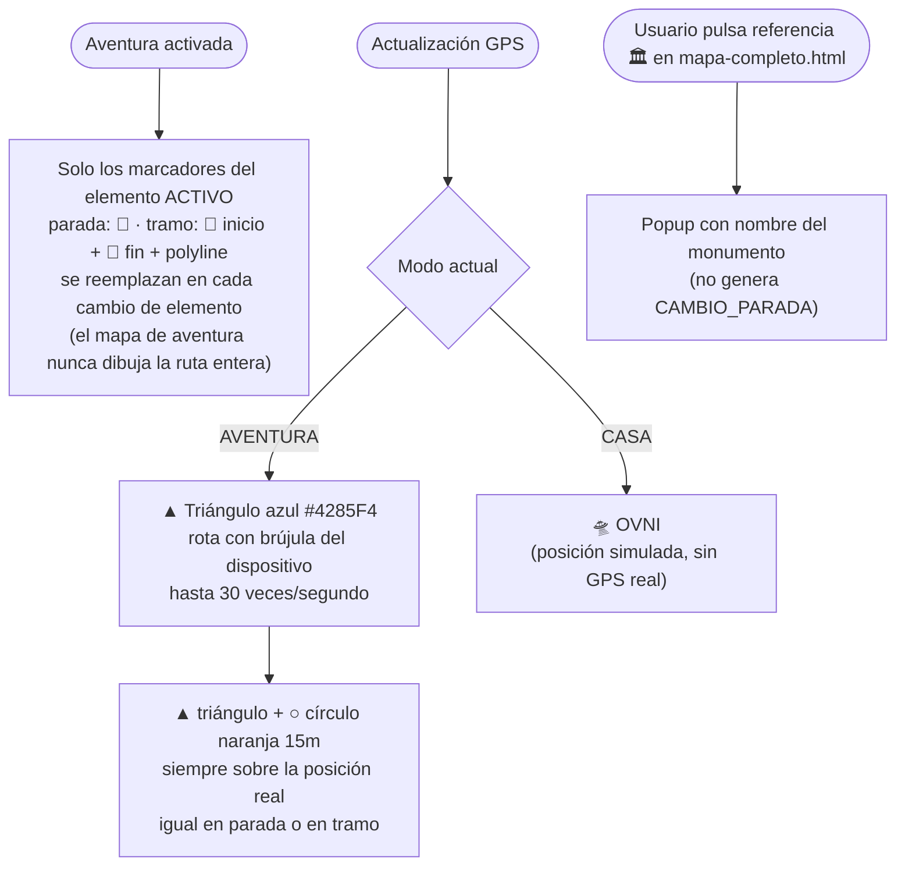

> **El mapa de aventura no dibuja nunca la ruta completa.** Solo muestra los marcadores del elemento activo, y los reemplaza en cada `NAVEGACION.CAMBIO_PARADA` — `completarCambioParada()` es la única función que dibuja por ese evento (§4.5). La vista de "toda la ruta de un vistazo" —todas las paradas numeradas más los marcadores 🏛️ `tipo:"referencia"`— vive en **`mapa-completo.html`**, una página Leaflet independiente que se abre con el botón de mapa moderno de hijo2 y tiene su propia implementación, sin relación con `js/funciones-mapa.js` (§25.10). Son dos mapas distintos con dos propósitos distintos: el de aventura te dice a dónde vas ahora, el completo te enseña el recorrido entero.

**Herramienta de diagnóstico del sensor de brújula en dispositivo real: `debug-brujula.html`** (raíz del proyecto). Página standalone — no forma parte de la app, no se referencia desde ningún fichero de producción, nunca se carga en el SW. Sirve para comprobar en un móvil real: qué evento de orientación está activo (`deviceorientationabsolute` vs `deviceorientation`), si el permiso iOS se concede, y los valores crudos de alpha/beta/gamma + `webkitCompassHeading`, junto con el rumbo calculado por `actualizarOrientacionFlecha()` y un triángulo que lo visualiza. Muestra el heading crudo (sin `_rumboEnPantalla()`) — lo correcto para diagnosticar el sensor independientemente del bearing del mapa. Se sirve con el servidor local existente (`node js/server.js`, puerto 8080).

### 4.6. Polylines (líneas de ruta en el mapa)

La app dibuja exactamente **dos** polylines, y comparten grosor a propósito: lo que las distingue es el color y el patrón, no el grosor — azul continua para el tramo, verde discontinua para la ayuda del botón de ubicación. Un grosor distinto sería una tercera señal redundante:

| Tipo de polyline | Color | Grosor base | Opacidad | Patrón | Cuándo se dibuja |
|-----------------|-------|-------------|----------|--------|------------------|
| **Tramo normal** | `#3388ff` (azul claro) | 5 px | 0.7 | Sólido | Al seleccionar un tramo específico entre dos paradas |
| **Línea de navegación manual** | `#3eff3f` (verde) | 5 px | 0.8 | Discontinuo (segmento 0, hueco 2 — el `0, 2` del patrón `dashArray` es el propio dibujo del trazo punteado, no el grosor de la línea) | Solo al pulsar `btn-ubicacion`. Nunca se dibuja sola |

**Escalado dinámico: dos familias con curvas de sentido OPUESTO.** Todo lo que se dibuja sobre el mapa se multiplica por un factor que combina tamaño de pantalla (`vmin` del dispositivo entre 400, la pantalla de referencia) × nivel de zoom del mapa. La división no es estética: responde a qué **es** cada cosa, y de ahí sale si debe crecer o encoger al acercar el zoom.

| | **TERRENO** — las polylines | **PANTALLA** — los 5 iconos |
|---|---|---|
| Qué cubre | Línea azul del tramo, línea verde del botón de ubicación | 🎯 parada, 📌 inicio de tramo, 🎯 destino de navegación, ▲ flecha, 🛸 ovni |
| Qué es | **Una calle pintada.** Su trabajo es tumbarse encima del camino real | **Un cartel indicador.** Su trabajo es que lo encuentres |
| Al ACERCAR | **Engorda** — la calle bajo ella también se ensancha; si adelgazara dejaría de encajar | **Encoge** — a esa distancia hace falta ver el detalle de calle y el portal exacto, no un icono tapándolo |
| Al ALEJAR | **Adelgaza** — si engordara, la ruta sería un gusano tapando media ciudad | **Crece** — hay mucho mapa que barrer y hay que localizarlo de un vistazo |
| Constante | `ZOOM_FACTOR_TERRENO = 1.35` (>1) | `ZOOM_FACTOR_ICONO = 0.9` (<1) |
| Función | `getEscalaTerreno()` → `getPolylineEscalado()` | `getEscalaIcono()` → `getIconoEscalado()` |
| Red de seguridad | El **techo** (`ZOOM_TOPE_TERRENO = 3.5`): limita cuánto engorda al acercar | El **techo** (`ZOOM_TOPE_ICONO = 2.2`): limita cuánto crece al ALEJAR, que es donde dos iconos del mismo elemento pueden taparse entre sí — a zoom 14, 50 m reales son unos 7 px en pantalla, así que la 📌 y la 🎯 de un tramo corto se solaparían sin este límite |
| Suelo | `ZOOM_SUELO_TERRENO = 0.5` | `ZOOM_SUELO_ICONO = 0.45` |

**Los cinco iconos comparten una única curva**, de modo que la proporción entre ellos es la misma a cualquier zoom (la flecha mide siempre ~2,2× la diana) en vez de deslizarse según cuánto zoom tenga puesto el usuario.

**El círculo naranja de 15 m no pertenece a ninguna de las dos familias** y no pasa por ninguna de estas escalas: es geografía pura, un polígono de radio constante en **metros** (`_crearCirculoGeografico()`, §4.5) que crece ×2 por nivel igual que el propio mapa. Es correcto que sea así — con una curva de icono dejaría de marcar 15 metros reales y pasaría a ser un adorno. El texto de nombres de calle (`_calcularTextSizeCalles()`, `codigo-padre.html`) sigue el criterio de TERRENO por el mismo motivo: es mobiliario del mapa, no un indicador.

Las dos curvas usan la misma fórmula — `factor_pantalla × factor_zoom^(zoom_actual − 15)`, acotada entre su propio suelo y su propio techo — implementada una sola vez en `_calcularEscala()`, con cada familia leyendo de su propio objeto de caché (`_escalaCacheTerreno` / `_escalaCacheIcono`): ambas se calculan en el mismo instante y compartir caché haría que la segunda leyera el valor de la primera.

**Los cinco iconos se reescalan en los mismos dos momentos.** `registrarListenerZoom()` engancha los recálculos a los dos eventos del mapa: `zoom` (dispara en cada frame del gesto de pinch/scroll/botones, acotado a una llamada por frame vía `requestAnimationFrame`) y `zoomend` (pasada final con el zoom ya asentado). En los dos se llama a `reescalarMarcadoresEmoji()` **y** a `reescalarMarcadorUsuario()`, en ese orden y dentro del mismo frame: comparten curva y deben moverse a la vez, o la proporción entre la flecha y las dianas daría saltos a mitad del gesto. Las polylines se reescalan en `zoomend` (`setStyle({weight})` sobre `polylineNavegacion` y `rutasActivas`). El invariante de que las dos familias van en sentidos opuestos está fijado en `tests/e2e/47-reescalado-marcador-usuario-y-chat.spec.js` (MU-3).

El marcador ▲/🛸 recalcula además su tamaño en cada posición GPS, porque `actualizarMarcadorUsuario()` lo destruye y lo recrea entero para reposicionarlo. Ese camino por sí solo no basta: entre dos lecturas de GPS (~7 s) el usuario puede hacer zoom varias veces, y sin `reescalarMarcadorUsuario()` el marcador se quedaría con el tamaño de la lectura anterior mientras el círculo naranja de 15 m — geográfico, atado al terreno (§4.5) — sí crece con el mapa; la flecha aparentaría encoger dentro de su propio círculo. `reescalarMarcadorUsuario()` solo reescribe el HTML interior del marcador existente (no lo recrea: para eso hace falta una posición nueva) y no pierde la rotación de la brújula, porque `_htmlMarcadorUsuario()` la reconstruye a partir del mismo ángulo suavizado acumulado (`_flechaGpsAnguloAcumulado`) que usa la recreación normal. Cubierto por `tests/e2e/47-reescalado-marcador-usuario-y-chat.spec.js` (grupo MU).

**El reescalado en `zoomend` cubre las dos polylines.** El listener registrado por `registrarListenerZoom()` recorre dos colecciones: la `polylineNavegacion` suelta (grosor `peso.navegacion`) y el array `rutasActivas`, que solo llega a contener la línea azul del tramo activo creada por `dibujarTramo()` (grosor `peso.tramo`). Las dos comparten el mismo grosor base, así que ambas ramas del reescalado aplican el mismo valor — se mantienen separadas porque son colecciones distintas (una referencia suelta y un array), no porque el grosor difiera.

**Comportamiento — solo manual, nunca automático:**

- La **polyline de navegación** (`polylineNavegacion`) NO se dibuja nunca sola. La única forma de que aparezca es que el usuario pulse `btn-ubicacion` en hijo2, que envía `NAVEGACION.MOSTRAR_UBICACION_POLYLINE` `{ ubicacionUsuario, proximoElemento, centrar: true, zoom: 16 }` al padre; el padre la dibuja (`dibujarPolylineNavegacion()`, siempre verde) desde la posición actual hasta la próxima parada, vía `.inicio→waypoints→.fin` en tramos (nunca en línea recta a `.fin`, para seguir forzando la ruta exacta).
- Existió una variante automática (azul discontinua, se redibujaba sola en cada lectura GPS con `distancia >50m`) — se retiró a propósito: competía por el mismo aviso con el propio `btn-ubicacion` habilitándose solo al detectar "fuera de rango" (§31.4), y el criterio de umbral entre ambas señales no coincidía. Ahora "fuera de rango" es la única señal automática, y pulsar el botón es la única forma de pedir la guía visual.
- Se **elimina** en dos casos independientes: por lectura GPS, dentro de `procesarPosicionGPSParaAventura()` (`js/funciones-mapa.js`) — al volver a estar a `≤50m` del destino real de la línea (`.inicio` del tramo mientras no esté completo, o el punto único en una parada — nunca `.fin`, ver §4.7d) —, y de forma incondicional en `completarCambioParada()`, al cambiar de parada/tramo activo: si el usuario pidió la guía manual hacia un elemento y avanza al siguiente sin llegar nunca a estar cerca de aquel, esta segunda vía evita que la línea y el 🎯 se queden dibujados de forma permanente. `limpiarPolylineNavegacion()` borra la polyline y su marcador 🎯 (`marcadorDestinoNavegacion`) juntos en los dos casos; el primero además revela el trazado persistente de inmediato (§4.7d).
- Todas las polylines se dibujan como capas `line` dentro del array `layers` del estilo de MapLibre — el orden de aparición en ese array decide qué polyline o capa de calle queda por encima de cuál (MapLibre no tiene una propiedad `zIndex` numérica independiente). Los marcadores (paradas, referencias, flecha del usuario) son elementos DOM aparte, superpuestos sobre el lienzo del mapa — quedan por encima de cualquier polyline sin necesidad de ordenarlos en ese array.

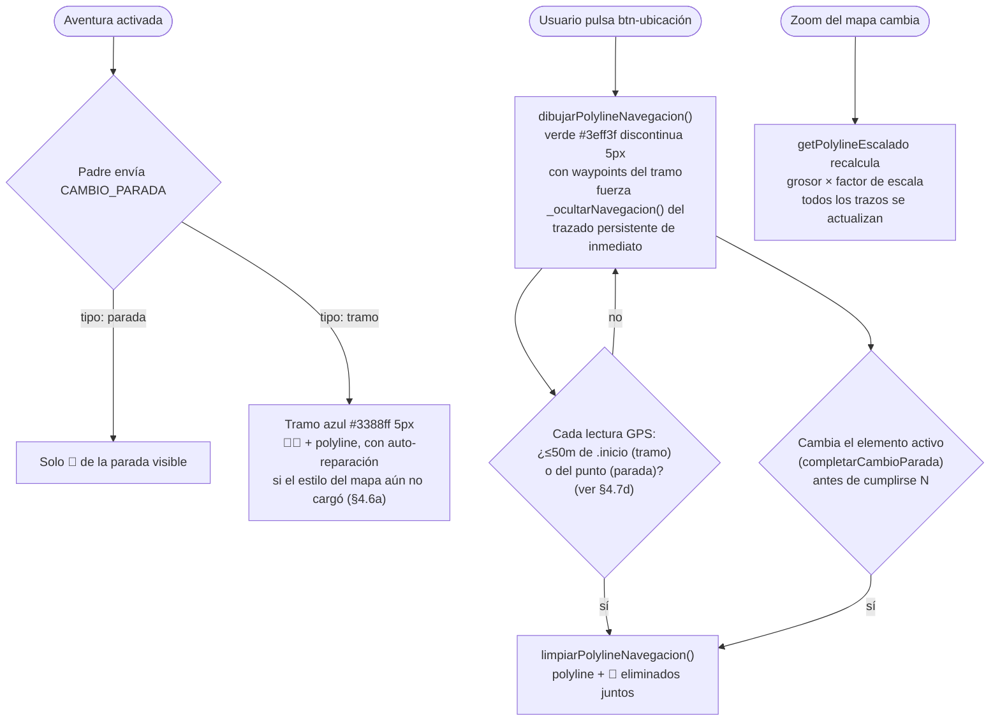

**`polylineNavegacion` es estática una vez dibujada** — a diferencia de la ruta principal o del tramo activo (que no cambian de posición), sus dos extremos quedan fijados en el instante del `btn-ubicacion` (posición del usuario en ese momento → destino) y no se redibuja en lecturas GPS posteriores mientras el usuario camina. No existe ningún bucle que la mantenga "siguiendo" al usuario — solo dos comprobaciones en cada lectura GPS que deciden si toca eliminarla (rama N del diagrama, ver el detalle de las dos condiciones en §4.6 arriba). Si el usuario quiere una guía actualizada a su nueva posición, tiene que volver a pulsar `btn-ubicacion`.

**Esta misma variable (`polylineNavegacion`) es la única guía de "vuelta" que existe** — no compite con ninguna otra capa automática (§4.6). Al dibujarse fuerza `_ocultarNavegacion()` sobre el trazado persistente de inmediato (§4.7d) — no espera a que la vigilancia por distancia lo oculte por su cuenta, porque pulsar el botón es la señal más directa de que el usuario está perdido/lejos.

### 4.6a. Auto-reparación de polyline/círculo si el estilo del mapa aún no cargó

`_crearPolyline()`/`_crearCirculoGeografico()` (`js/funciones-mapa.js`) exigen que el estilo de MapLibre esté cargado (`_estiloListo()`, ver §11 "Arranque del mapa") antes de llamar a `addSource`/`addLayer` — MapLibre lanza excepción si se llama antes de tiempo. Si el estilo no está listo en el instante exacto de la llamada, ambas funciones devuelven `_crearCapaDiferida(tipo, factory)`: un proxy con la misma forma (`setLatLngs`/`setLatLng`/`setStyle`/`remove`) que engancha el evento nativo `'load'` del mapa (el mismo que usa `initializeMap()` para saber que el estilo terminó de cargar, ver §11) y ejecuta `factory()` — la creación real de la capa — en cuanto dispara. Devolver un stub inerte en vez de este proxy dejaría 📌/🎯 (marcadores DOM, no dependen del estilo) apareciendo con normalidad mientras la polyline del tramo queda invisible para siempre y sin aviso, porque el código que la recibe (p. ej. `if (polyline) { rutasActivas.push(polyline); }` en `completarCambioParada()`) trataría cualquier objeto no-`null` como un éxito — de ahí que el objeto sea un proxy que se autorrepara, no un stub muerto.

Cualquier `setLatLngs`/`setLatLng`/`setStyle` invocado sobre el proxy mientras tanto se recuerda (`puntosPendientes`/`estiloPendiente`) y se aplica sobre la capa real en cuanto existe, para no perder una actualización que llegó durante la espera (p. ej. `revelarNavegacion()` subiendo la opacidad a 0.7 antes de que la capa real se haya creado). Si `remove()` se llama antes de que el estilo cargue, se marca como retirada y `factory()` nunca llega a ejecutarse — no tiene sentido crear una capa que ya se pidió eliminar. Si el estilo ya está listo en el momento de la llamada (el caso normal, en cualquier tramo que no sea el primerísimo instante de la app), la capa real se crea al instante, sin pasar por la espera del proxy.

Cubierto por `tests/e2e/23-polyline-autoreparacion.spec.js` (PR-1/2/3): con un mapa simulado cuyo `isStyleLoaded()` empieza en `false`, confirma que no se llama a `addLayer`/`addSource` hasta que el mapa dispara `'load'`, que un `setStyle()` pedido antes de ese momento (sobre el objeto que devuelve `dibujarPolylineNavegacion()`) se aplica sobre la capa real en cuanto existe, y que con el estilo ya cargado el comportamiento no cambia.

### 4.6b. Cámara siguiendo al usuario

Antes, la cámara del mapa de aventura solo se movía con los `flyTo` puntuales de cambio de parada/tramo (§4.7d) — nunca seguía al usuario mientras caminaba entre esos puntos, así que podía quedar descentrado durante todo un tramo largo. `actualizarMarcadorUsuario()` ahora centra la cámara (`_mapaInstance.easeTo({center, duration:800})`) en cada posición GPS real, en los dos modos (CASA y AVENTURA), salvo dos excepciones:

- **`estadoMapa.zoomEnCurso`** — mientras un `flyTo` de cambio de parada/tramo está en curso (`completarCambioParada()`), el seguimiento se salta para no competir con esa animación ya en marcha.
- **Arrastre manual del usuario** — `_registrarSeguimientoCamara()` (llamada una vez desde `inicializarServicioMapa()`) escucha el evento nativo `'dragstart'` del mapa; si `event.originalEvent` está presente (el gesto viene de verdad de un ratón/dedo, no de un `easeTo()`/`flyTo()` programático — el propio seguimiento incluido), pone `_camaraSiguiendoUsuario = false` y dejan de aplicarse los `easeTo()` de seguimiento. Así el usuario conserva la libertad de arrastrar el mapa para mirar algo (p. ej. una referencia 🏛️ más adelante) sin que la siguiente lectura GPS deshaga el gesto de golpe.

Retomar el seguimiento de posición es una de las tres opciones del **menú de modo de cámara** (`#brujula-modo`, `codigo-padre.html`): un desplegable de 3 modos, construido en JS puro dentro del cierre de `initializeMap()`, que mirror-ea al detalle el patrón ya usado por `#selector-tipo-mapa` (botón principal circular + contenedor `flex-direction:column-reverse` con `max-height` animado que crece hacia arriba, cerrado por defecto y al pulsar fuera). No existe HTML/CSS estático para él — todo el árbol (`_brujulaModoDiv`, `_brujulaModoBtnPrincipal`, `_brujulaModoDropdownDiv` y sus 3 hijos) se crea con `document.createElement`. El botón principal muestra siempre `imagenes/imagenes-aplicación/boton-brujula.png` (icono de brújula fijo, con su propio anillo dorado ya integrado en la imagen) — no refleja qué modo está activo; el estado real (`_brujulaModoActivo`) es interno, solo observable por sus efectos (qué función invoca, qué revierte solo con el tiempo), igual que el botón principal de `#selector-tipo-mapa` (§11) tampoco refleja el modo de mapa activo.

Las 3 opciones, definidas en `_MODOS_BRUJULA` (array de `{id, nombre, imagen}`, ids `brujula-modo-norte`/`brujula-modo-seguimiento`/`brujula-modo-centrado`) y mostradas en este orden en el desplegable — los iconos solo se ven en estas 3 opciones, nunca en el botón principal:

| Opción | Icono (`imagenes/imagenes-aplicación/`) | Llama a | Efecto |
|---|---|---|---|
| Norte fijo | `brujula-norte.png` | `funcionesMapa.desactivarSeguimientoRumbo()` | Bearing del mapa a 0 de inmediato (`easeTo`); modo persistente |
| Seguir mi rumbo | `brujula-seguimiento.png` | `funcionesMapa.activarSeguimientoRumbo()` | El mapa rota para mantener el rumbo del usuario "hacia arriba" en pantalla, como la navegación de coche (ver §4.6b); modo persistente |
| Centrar mapa en mi ubicación | `brujula-centrar.png` | `funcionesMapa.reactivarSeguimientoCamara()` | Recentra la cámara sobre la posición GPS actual; acción puntual (no es un modo, es un "vuelve a mirarme ahora") |

Las 3 imágenes tienen fondo transparente — el blanco del botón se ve alrededor del icono. Aplicadas con `background-size:contain` (nunca `cover`, a diferencia de los dos botones principales): cada icono trae su propio margen transparente ya incorporado, y `contain` lo respeta sin recortar ninguna punta de la forma. A diferencia de las miniaturas del selector de mapa, estas 3 opciones no llevan el verde `#00BB77` estándar (§4.9 "Colores de estado") — fondo `#fff` liso en su lugar, con el mismo borde `clamp(3.5px,0.75vmin,5px) solid #FF8C00` que el selector, para que el icono transparente destaque sin competir con un fondo de color. Elegir cualquier opción cierra el desplegable (`_cerrarBrujulaModoDropdown()`) y, en las dos primeras, reactiva también el seguimiento de posición (`_camaraSiguiendoUsuario = true` dentro de `activarSeguimientoRumbo()`/`desactivarSeguimientoRumbo()`) — elegir un modo del menú es, en sí mismo, un "vuelve a seguirme" explícito, igual que la propia opción de centrar.

Posicionado en espejo respecto a `#selector-tipo-mapa`: misma altura (`bottom` idéntico, no solo la misma fórmula — literalmente el mismo valor) y el mismo margen desde el borde **izquierdo** que el selector tiene desde el **derecho** (`left:calc(4px + (var(--franja-lateral)/2) - (clamp(47.39px,12.981vmin,69.02px)/2))`, misma fórmula que el `right:` del selector, solo cambia el lado). **El botón principal de la brújula no comparte tamaño con el selector:** es un 1% más grande — `clamp(47.39px,12.981vmin,69.02px)` frente a `clamp(46.92px,12.852vmin,68.34px)` del selector — mientras que las opciones del desplegable siguen a `clamp(37px,10.6vmin,54px)` en los dos, sin cambios. `border-radius:50%` en los cuatro botones (circular, mismo patrón que el resto de botones flotantes de la app). El botón **principal** de los dos (brújula y selector) va **sin** borde naranja CSS — su imagen fija ya trae un anillo propio integrado (dorado en brújula, azul en el selector), y un borde encima duplicaría el efecto. Las opciones del desplegable, en los dos casos, sí llevan el borde `clamp(3.5px,0.75vmin,5px) solid #FF8C00` estándar — su contenido (icono en brújula, thumbnail en el selector) lo necesita para distinguirse del fondo. Donde difieren es el propio fondo: verde `#00BB77` (§4.9 "Colores de estado") en las del **selector de mapa** — su thumbnail (foto real, sin anillo propio) queda casi tapado del todo (`cover`, sin margen) — y blanco `#fff` en las de la **brújula** (ver arriba), elegido específicamente para que el icono transparente con margen (`contain`) destaque sobre un fondo liso en vez de verde. Los dos contenedores quedan a la misma altura, uno a cada extremo de la pantalla. `z-index:1000025`, sin relación jerárquica real con el `1000030` de `#selector-tipo-mapa` — se conserva el mismo valor por continuidad, no porque haga falta que uno tape al otro: están en columnas separadas y no se superponen. La altura disponible para el propio desplegable de `#brujula-modo` se recalcula igual que la del selector (`_alturaDisponibleParaBrujulaModoDropdown()`, contra el borde inferior real de `#fondo-blanco` vía `getBoundingClientRect()`, nunca un `calc()` fijo) para no solaparse con el logo en ningún viewport/notch — esto no cambia con el lado del botón, la lógica es agnóstica a si crece desde la izquierda o la derecha. Empieza oculto (`display:none` en su CSS inline) y se muestra/oculta junto con el resto de la UI de aventura a través de tres sitios distintos — no un mecanismo propio: `_mostrarUIActivada()`/`_ocultarUIActivada()` (flujo normal) y, un tercero menos evidente, `_mostrarInterfazReanudacion()` (flujo de reanudación de sesión) — los tres puestos a `display:flex`/`none` explícitamente porque el contenedor necesita `flex`, no el `block`/`none` genérico que usan el resto de elementos de esas listas. Aparte de esos tres sitios (que gobiernan si el menú puede aparecer en absoluto durante el ciclo de vida de la aventura), `actualizarVisibilidadSelectorMapa()` (§11) lo oculta/muestra igual que al selector cuando hay un overlay encima (chat, reto, imagen, vídeo, error, iframe) — sin esto se quedaría visible por delante del chat pese a que, en apariencia, su z-index (1000025) también está por encima del de `#hijo6-chat` (1000020); el `display:none` explícito de esa función es lo que realmente lo tapa, no el z-index por sí solo.

Retomar el seguimiento de posición manualmente centra sobre `estadoMapa.posicionUsuario` sin esperar a la siguiente lectura GPS — esa acción se invoca desde una de las opciones del menú de modo de cámara (ver más abajo).

**Dos salvaguardas contra estado inconsistente, añadidas tras revisión posterior a la primera implementación:**

- **Brújula caída (permiso denegado en iOS, o `DeviceOrientationEvent` no soportado).** `activarSeguimientoRumbo()` enciende `_camaraSiguiendoRumbo` sin comprobar si la brújula responde de verdad — si nunca responde, `actualizarRotacionFlechaGPS()` nunca vuelve a llamar a `setBearing()` y el modo se queda "encendido" sin hacer nada, indistinguible de un cuelgue. `_elegirBrujulaModo('brujula-modo-seguimiento')`, tras activar el modo, arma un `setTimeout` de 1.5s que comprueba `funcionesMapa.brujulaEstaActiva()` (getter nuevo de solo lectura sobre la variable interna `compassActiva`, `js/funciones-mapa.js`); si sigue sin responder y el usuario no ha cambiado de modo mientras tanto (guard `_brujulaModoActivo === 'brujula-modo-seguimiento'`), revierte sola a "Norte fijo" — `desactivarSeguimientoRumbo()`. Cubierto por BR-7.
- **"Elegir otra aventura" sin recargar la página.** Terminar una aventura normalmente y pulsar "otra aventura" en el modal de fin SÍ recarga (`location.reload()`, §25.11) y resetea todo el estado del módulo solo. Pero el diálogo de **reanudación de sesión** (`mostrarDialogoVueltaRapida`, al reabrir la app con una aventura ya activa) tiene su propio "elegir otra" (`ejecutarElegirOtra()`) que limpia `localStorage`/globals y navega el iframe de selección **sin recargar** — reutiliza el mismo module scope de `funciones-mapa.js`, así que sin nada más el modo de cámara de la aventura abandonada (p. ej. "Seguir mi rumbo") seguiría activo en la siguiente. `initializeMap()` expone `globalThis._resetBrujulaModo()` (pone `_brujulaModoActivo = 'brujula-modo-norte'` y llama a `desactivarSeguimientoRumbo()`) y `ejecutarElegirOtra()` lo llama junto al resto de globals que ya resetea (`estado.tiempoRestante`, etc.). Cubierto por BR-8.
- **Visible por encima de una pantalla de carga.** `#brujula-modo` se crea (con `display:none` inline) dentro de `initializeMap()`, que corre en el arranque en frío, mucho antes de que el usuario llegue a activar una aventura — igual que `#selector-tipo-mapa`. Al no ser un `<iframe>`, la regla `body.loading iframe` no lo cubre; sin una entrada propia en la hoja de estilos, cualquier `display:flex` disparado mientras `body` sigue en `loading` (una reanudación de sesión, sobre todo) lo dejaba visible por encima del overlay de carga, ya que su z-index (1000025) es mayor que el suyo (999999) — mismo síntoma, mismo origen y misma solución que ya tenía `#selector-tipo-mapa`: `body.loading #brujula-modo { visibility:hidden !important; opacity:0 !important; }` (ver "Por qué nada puede verse nunca por encima de `#loading-overlay`" más arriba). Cubierto por `tests/e2e/16-loading-overlay-oculta-ui.spec.js` (LO-1/LO-2).

**El menú de cámara no compite con el `flyTo` de cambio de parada/tramo.** Las tres funciones (`reactivarSeguimientoCamara()`, `activarSeguimientoRumbo()`, `desactivarSeguimientoRumbo()`) comprueban `!estadoMapa.zoomEnCurso` antes de incluir `center` en su `easeTo()` — mismo guard que ya usa el seguimiento por-tick. `bearing` (en las dos últimas) se aplica siempre, incluso con `zoomEnCurso` activo: ningún `flyTo()` de la app lo toca nunca (solo `center`/`zoom`), así que no hay nada con lo que competir, y omitirlo en `desactivarSeguimientoRumbo()` sería especialmente grave — como esa función ya deja `_camaraSiguiendoRumbo=false`, ningún otro sitio volvería a corregir el bearing después. Si `center` se omite por haber un `flyTo` en curso, se autocorrige solo: `_camaraSiguiendoUsuario` queda en `true`, así que el seguimiento por-tick lo recentra en la siguiente lectura GPS real.

**La reversión automática por brújula caída usa un identificador de activación, no solo el modo activo.** `_elegirBrujulaModo('brujula-modo-seguimiento')` incrementa `_brujulaModoSeguimientoActivacionId` y captura su valor local (`idActivacion`) antes de armar el `setTimeout` de 1.5s; el timeout compara `idActivacion === _brujulaModoSeguimientoActivacionId` además de `_brujulaModoActivo === 'brujula-modo-seguimiento'`. Sin el identificador, alternar rumbo→norte→rumbo dos veces en menos de 1.5s dejaba un timeout de la PRIMERA elección vivo, que revertía la SEGUNDA antes de que esta cumpliera su propio plazo de gracia.

Cubierto por `tests/e2e/24-camara-sigue-usuario.spec.js` (CAM-1/2/3/4): confirma que la primera posición centra la cámara, que un `dragstart` sin `originalEvent` (programático) no pausa nada, que uno con `originalEvent` sí lo hace, y que `reactivarSeguimientoCamara()` retoma el seguimiento y centra de inmediato. El guard de `zoomEnCurso` (en el seguimiento por-tick y en las tres funciones del menú) no tiene test aislado — forzarlo exigiría reproducir el flujo completo de `CAMBIO_PARADA` solo para una comprobación de una línea; queda verificado por revisión directa del código. El menú en sí está cubierto por `tests/e2e/25-brujula-modo.spec.js` (BR-1 a BR-9): existe y empieza oculto, alineación/tamaño respecto a `#selector-tipo-mapa`, el botón principal despliega/pliega las 3 opciones, cada una de las 3 invoca la función correcta, la reversión automática por brújula caída (BR-7), el reset bajo demanda (BR-8), y que un timeout de auto-reversión viejo no revierte una elección de "rumbo" más reciente (BR-9) — verificado en los tres últimos casos contando invocaciones a `funcionesMapa.*`, no por ningún icono (el botón principal ya no refleja el modo activo, ver arriba). El seguimiento de rumbo en sí (activar/desactivar, y que `actualizarRotacionFlechaGPS()` mueva el `bearing` del mapa solo mientras el modo está activo) está cubierto por `tests/e2e/27-seguimiento-rumbo.spec.js` (SR-1/2/3).

### 4.6c. Navegación guiada paso a paso (turn-by-turn) — decisión de diseño

**Estado: parcialmente implementado. Detenido intencionalmente.**

La app dispone de todos los datos necesarios para implementar instrucciones paso a paso tipo "gira a la derecha en 50 metros": los tramos tienen `waypoints` con coordenadas exactas de cada giro, y el GPS actualiza posición en tiempo real.

**Razón por la que no se ha terminado**: El modelo de experiencia elegido prioriza la exploración libre. El usuario ve la polyline completa del tramo activo (📌/🎯 + línea azul, §4.6) y puede pedir la polyline de navegación de vuelta cuando quiera (`btn-ubicacion`). Eso es suficiente orientación sin imponer un camino rígido. Las instrucciones tipo GPS ("gira aquí") harían la aventura mecánica y reduciría el placer de descubrir el camino. (Un sistema de flecha "snap-to-route" que proyectara una posición sobre la ruta tampoco encajaría con este modelo, por la misma razón — ver la nota en §4.5).

**Lo que está implementado hoy:**

| Elemento | Implementado | Descripción |
|---|---|---|
| Polyline del tramo activo | ✅ | 📌/🎯 + línea azul, revelados de inmediato al activarse el tramo (§4.7d) |
| Polyline de navegación (vuelta) | ✅ | Solo manual, al pulsar `btn-ubicacion` (§4.6) |
| Detección de proximidad a parada | ✅ | Radio configurable por aventura |
| Distancia al destino (en hijo2) | ✅ | Se actualiza con cada GPS |

**Lo que faltaría para turn-by-turn completo:**

1. Función que calcule la instrucción de giro: leer ángulo entre waypoints consecutivos del tramo activo y determinar "recto / izquierda / derecha" según la posición del usuario.
2. Umbral de activación: disparar la instrucción cuando el usuario esté a X metros del waypoint de giro.
3. Tipo de mensaje nuevo (`NAVEGACION.INSTRUCCION_TURNO`) para enviar la instrucción a hijo2 o al padre.
4. UI en hijo2 (o banner en el padre) que muestre la instrucción.
5. Opcional: síntesis de voz con `speechSynthesis` en hijo3 o en padre.

Si se decide implementar en el futuro, el punto de entrada natural es `procesarPosicionGPSParaAventura()` en `funciones-mapa.js`, que ya se ejecuta en cada actualización GPS y tiene acceso a los waypoints del tramo activo (`siguienteParada.waypoints`) y a `estadoMapa.posicionUsuario`.

### 4.7. Botones del hijo 2 (coordenadas) — iconos por imagen

Los 6 botones del panel de `coordenadas-hijo2.html` no usan emojis sino imágenes PNG. Orden en el HTML (de arriba a abajo):

| ID | Imagen PNG | Mensaje enviado al padre | Acción |
|----|-----------|--------------------------|--------|
| `btn-mapa-completo` | `H2-fotomapa-moderno.png` | `NAVEGACION.MOSTRAR_MAPA_COMPLETO` `{ formato: 'html', url: 'mapa-completo.html?aventura=X' }` | Abre el mapa interactivo completo en overlay |
| `btn-mapa-jpg` | `H2-fotomapa-vintage.png` | `NAVEGACION.MOSTRAR_MAPA_VINTAGE` `{ formato: 'jpg', url: <urlMapaVintage> }` | Abre el JPG del mapa vintage de la aventura actual |
| `btn-video` | `H2-fotodron.png` | `_reproducirVideoParada()` (interno) | Solo disponible en **tramos**. Reproduce el vídeo de dron del tramo. Deshabilitado en paradas |
| `btn-imagen` | `H2-fotoproximo-monumento.png` | `UI.ACCION_USUARIO` `{ accion: 'mostrar-imagen', paradaActual, urlImagen, imagenes[], tipo, mapa_numero }` | Abre imagen o galería del monumento de la parada actual. **Siempre habilitado** en MODO AVENTURA: no se deshabilita al estar fuera de rango real (§31.4 — el usuario necesita ver qué está buscando), ni cuando el reto o el vídeo están activos (cubren toda la pantalla y el botón queda tapado). Solo se deshabilita cuando el padre envía `CONTROL.DESHABILITAR { control: 'btnImagen' }` |
| `btn-avanzar` | `fotoruta-A-B.png` | `NAVEGACION.GPS.ACTIVAR` `{ activar: bool, idParada, distancia }` | Botón de progresión — **única puerta de confirmación explícita para pasar al siguiente elemento, en paradas y en tramos por igual**. El padre lo habilita vía `CONTROL.HABILITAR { control: 'btnAvanzar', razon: 'parada_completada' \| 'tramo_completado' }` en cuanto `marcarParadaCompletada()` confirma las condiciones del elemento activo (parada: audio + llegada + reto; tramo: audio + llegada — ver §4.7d). Al pulsar: si `estado.paradaListaParaAvanzar` es `true` (elemento completado y esperando confirmación), llama `progresarSiguienteElemento()` — el siguiente `CAMBIO_PARADA` revela de inmediato la navegación del nuevo elemento (§4.7d, no depende de ningún flag). Si es `false` (tramo activo pero aún no completado, botón habilitado por proximidad vía hijo2), no hace nada más — el trazado del elemento activo ya está visible desde que se activó (§4.7d). El GPS **nunca avanza la aventura por sí solo**: en ningún caso, ni parada ni tramo — llegar al destino solo habilita el botón, nunca sustituye la pulsación. El tracking GPS en sí **nunca se detiene** |
| `btn-ubicacion` | `H2-fotodistancia.png` | `NAVEGACION.MOSTRAR_UBICACION_POLYLINE` `{ ubicacionUsuario, proximoElemento, centrar: true, zoom: 16 }` | Muestra polyline de navegación desde posición actual hasta próxima parada. El padre oculta la pantalla de distancia (§31.4) que estuviera visible al recibir esta solicitud |

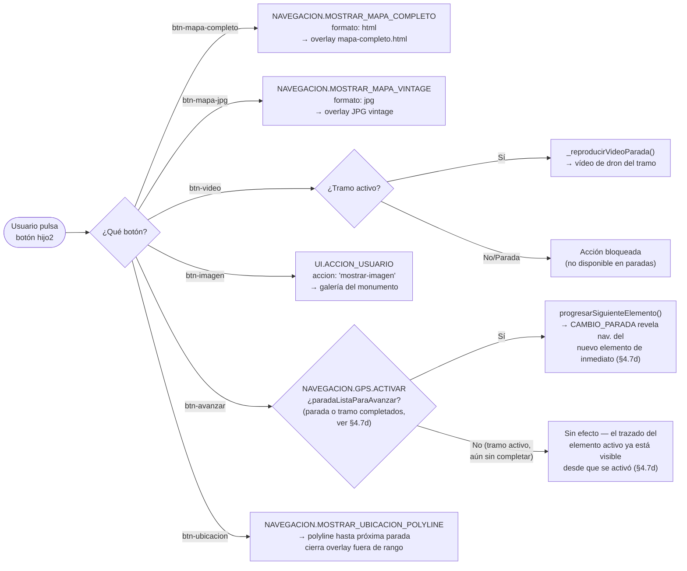

### 4.7b. Imagen de error GPS — overlay del padre

El archivo `imagenes/imagenes-aplicación/fotogpserror.png` lo usa `codigo-padre.html` como imagen del overlay `#gps-out-of-range-overlay` (`#gps-error-img`) — exclusivo del bloqueo anti-piratería (§31.5, usuario a más de 5km de toda la ruta). No es un botón de hijo2 — es un overlay gestionado directamente por el padre. La franja "perdido" (>2000m del elemento actual, §31.4) y el aviso de precisión insuficiente tienen sus propias imágenes/overlays por separado (`foto-rango-perdido.png`, `imagen-no-gps.png`).

### 4.7c. Control de audio — overlay del padre (`#audio-control-overlay`)

El control de audio **no está en hijo3** — está en `codigo-padre.html` como un fieldset flotante superpuesto sobre el iframe de hijo3. Lo gestiona enteramente el padre.

**Estructura HTML:**

| ID | Imagen PNG | Función |
|----|-----------|---------|
| `#audio-main-toggle-btn` | `boton-audio-central.png` | Botón principal. Abre/cierra el dropdown de acciones. **Verde** si hay un fichero de audio real reproducible, **rojo** si no |
| `#audio-action-play` (`.audio-action-btn`) | `boton-audio-play.png` | Reproducir audio |
| `#audio-action-pause` (`.audio-action-btn`) | `boton-audio-pausa.png` | Pausar audio |
| `#audio-action-stop` (`.audio-action-btn`) | `boton-audio-stop.png` | Detener audio |
| `#audio-action-replay` (`.audio-action-btn`) | `boton-audio-replay.png` | Volver a escuchar desde el inicio |
| `#audio-action-skip` (`.audio-action-btn`) | `boton-audio-avanzar.png` | Saltar audio no disponible — ver §25.5f |

Los 4 botones de acción están dentro de `#audio-control-dropdown` y son invisibles hasta que el usuario pulsa `#audio-main-toggle-btn` (el overlay adquiere la clase `.open`). `#audio-action-skip` es distinto: vive fuera de `#audio-control-dropdown`, en el mismo hueco visual (justo encima del botón central), y su visibilidad no depende de `.open` — la controla `actualizarEstadoControlesAudioPadre()` con la clase `.mostrar-saltar-audio` en el overlay, nunca a la vez que el botón central está habilitado (ver más abajo y §25.5f).

**Lógica de habilitación** — `actualizarEstadoControlesAudioPadre()` en `codigo-padre.html`:

```javascript
const fueraDeRango = estado.modo?.actual === MODOS.AVENTURA && estado.usuarioFueraRango?.activo === true;
const audioId = obtenerAudioIdActivoPadre();
const hayAudio = !fueraDeRango && !!audioId;
// hayFicheroAudioReal() comprueba el campo .file, no solo si existe la referencia —
// ver §25.5f para los dos motivos por los que puede fallar (estático y runtime).
const ficheroFalla = hayAudio && (!hayFicheroAudioReal(audioId) || estado._audioFalloId === audioId);
const hayAudioUtilizable = hayAudio && !ficheroFalla;
mainBtn.disabled = !hayAudioUtilizable;              // verde si hay fichero real, rojo si no
if (!hayAudioUtilizable) overlay.classList.remove('open'); // cierra dropdown si no es utilizable
// _actualizarBotonSaltarAudio(overlay, ficheroFalla, ...) muestra/oculta #audio-action-skip
```

Solo `#audio-main-toggle-btn` recibe `disabled` — los 4 botones de acción del desplegable **no se deshabilitan uno a uno**. Cerrar el overlay ya los deja `pointer-events:none`/`visibility:hidden` (`#audio-control-overlay.open #audio-control-dropdown`, ver CSS) al instante, no al terminar la transición de 0.3s, porque esas propiedades no se animan. Con el botón central ya deshabilitado (bloquea nativamente el click que reabriría el desplegable), un único estado `disabled` basta para impedir toda interacción — deshabilitar también los 4 botones de acción sería trabajo redundante, ya cubierto por el cierre del desplegable. `#audio-action-skip` nunca recibe `disabled` — cuando se muestra, ES la acción disponible; su visibilidad (no su estado) es lo que la habilita u oculta.

`hayAudioUtilizable` es `false` en tres casos independientes: la parada activa no tiene ninguna referencia de audio (`obtenerAudioIdActivoPadre()` devuelve `null`), el usuario está confirmado fuera de rango en modo AVENTURA (`estado.usuarioFueraRango.activo`) — no tiene sentido escuchar el audio de un monumento al que no se ha llegado —, o el fichero real detrás de la referencia falla (`ficheroFalla`, §25.5f). Solo el tercer caso muestra `#audio-action-skip`: los otros dos no son "audio roto", son "aquí no toca ofrecer nada todavía". La función se llama tanto en cada cambio de parada como en las transiciones de `NAVEGACION.GPS.RESTRINGIDO`/`GPS.DENTRO_DE_RANGO` (ver "Sistema fuera de rango real" más abajo) y en la confirmación de un fallo de audio (`_hdl_AUDIO_ERROR`). **Importante**: esto solo bloquea *empezar* o *reanudar* audio — si ya estaba sonando cuando se confirma fuera de rango, sigue sonando hasta el final; nada llama a `pause()`/`stop()` sobre el `<audio>` de hijo3 desde aquí. Es una decisión deliberada, no un descuido: interrumpir un audio a mitad de frase por alejarse unos metros sería peor experiencia que dejarlo terminar.

> **Nota sobre el glow:** Los selectores CSS de glow (`#audio-main-toggle-btn:not(:disabled):not(.spinning)` y `.audio-action-btn:not(:disabled)`) no usan prefijo de modo. El `body` de `codigo-padre.html` nunca recibe la clase `modo-aventura` (solo los hijos la reciben vía CAMBIO_MODO), por lo que un prefijo `.modo-aventura` haría que el glow nunca disparara en el padre. Los 5 `.audio-action-btn` (los 4 del desplegable más `#audio-action-skip`) ya no reciben `disabled` desde JS, así que ese selector para ellos coincide siempre — el glow depende en la práctica de que estén visibles (`.open` para los 4 del desplegable, `.mostrar-saltar-audio` para el de saltar), no de su propio atributo `disabled`.

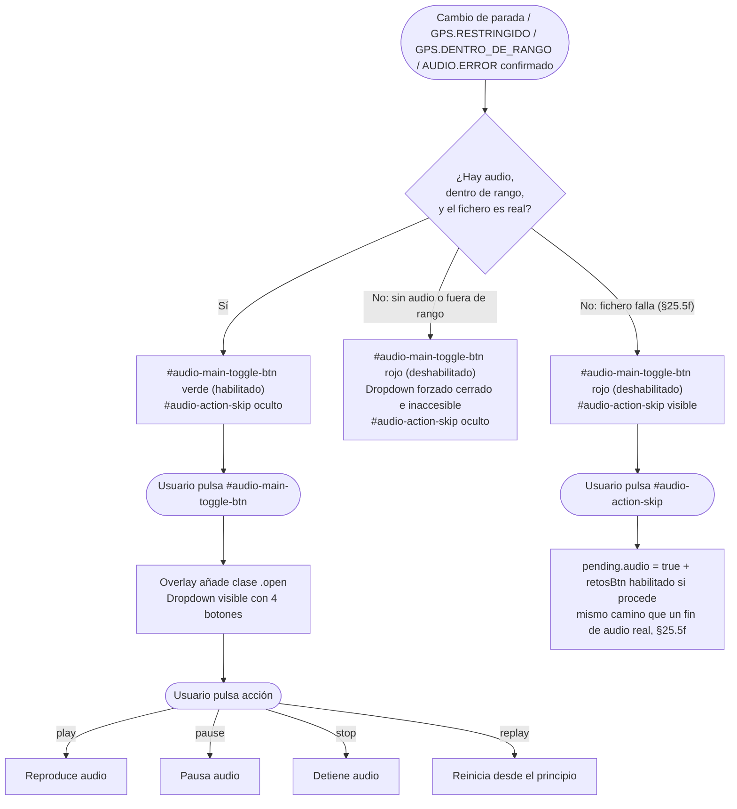

`#audio-control-overlay` es un `<fieldset>` estático, visible por CSS desde el primer pintado — no se crea ni se oculta por fase. Se apoya en la regla `body.loading` para no verse encima de los diálogos de reanudación de sesión (`mostrarDialogoReanudacion`/`mostrarDialogoVueltaRapida`, §34.3) ni de `#loading-overlay` — ver "Por qué nada puede verse nunca por encima de `#loading-overlay`" en §9.10.

### 4.7d. Visibilidad del trazado en el mapa: revelado inmediato, oculto solo por el botón de ubicación

#### Principio de diseño

El trazado (🎯 de parada; polyline azul + 📌 inicio + 🎯 fin de tramo) se revela **siempre de inmediato** al activarse el elemento — en los dos modos, sea parada o tramo, esté el usuario cerca o lejos de verdad. `completarCambioParada()` llama a `revelarNavegacion()` sin ninguna condición, la última línea de su bloque de zoom/marcadores. No existe ningún ocultado automático por distancia ni fases — la única forma de que el trazado deje de verse es que el usuario pulse `btn-ubicacion` (§4.6): eso dibuja la línea manual verde hacia `.inicio` (mientras el tramo no esté completo) u hacia el punto (parada), y oculta el trazado persistente mientras esa línea está en pantalla. Volver a estar cerca de ese mismo destino (`.inicio` en tramos, el punto en paradas) limpia la línea manual y revela el trazado persistente de nuevo, en el mismo tick GPS.

**Por qué:** que el trazado se mantenga visible aunque el usuario esté lejos le permite recordar hacia dónde iba sin tener que reconstruirlo de memoria — el botón de ubicación sigue ahí, habilitado por la misma distancia real de siempre, para cuando de verdad necesite una guía activa de vuelta. El diseño anterior ocultaba el trazado automáticamente al alejarse (con una ventana deslizante de confirmación, fases distintas para tramos según se hubiera alcanzado `.inicio` alguna vez, etc.) — se retiró por completo: el usuario decide cuándo necesita ayuda pulsando el botón, no un umbral de distancia calculado por la app.

#### Revelado y ocultado — código

**`completarCambioParada()`** (`js/funciones-mapa.js`), tras crear los marcadores y hacer zoom:

```javascript
revelarNavegacion();
// Punto de inicio de la aventura: única excepción sin un elemento anterior cuya
// compleción dispare el cartel de llegada — se dispara aquí, reusando el mismo cartel.
if (coordenadas?.tipo === 'inicio' && coordenadas?.nombre) {
    globalThis.mostrarCartelLlegadaParada(coordenadas.nombre);
}
```

**`_ocultarNavegacion()`** — llamada únicamente desde `dibujarPolylineNavegacion()` (botón de ubicación):

```javascript
rutasActivas.forEach(r => r.setStyle({ opacity: 0 }));
_ocultarMarcador(marcadoresParadas.get('tramo-inicio-ruta'));  // 📌 — marker.remove()
_ocultarMarcador(marcadoresParadas.get('tramo-fin-ruta'));     // 🎯 — marker.remove()
_ocultarMarcador(marcadorParadaActual);                        // 🎯 parada — marker.remove()
estadoMapa.gpsVisualActivo = false;
sincronizarEstadoGPSConPadre();  // refleja gpsVisualActivo en estadoPadre.gps.visualActivo
```

**`revelarNavegacion()`** (función exportada) — llamada desde `completarCambioParada()` y desde la limpieza automática de la línea manual al volver a `.inicio` (ver más abajo):

```javascript
rutasActivas.forEach(r => r.setStyle({ opacity: 0.7 }));       // opacidad original del tramo
_revelarMarcador(marcadoresParadas.get('tramo-inicio-ruta'));  // marker.addTo(_mapaInstance)
_revelarMarcador(marcadoresParadas.get('tramo-fin-ruta'));
_revelarMarcador(marcadorParadaActual);
estadoMapa.gpsVisualActivo = true;
sincronizarEstadoGPSConPadre();
```

**`_ocultarMarcador`/`_revelarMarcador` quitan y vuelven a añadir el marcador al mapa (`marker.remove()`/`marker.addTo(_mapaInstance)`), no tocan opacidad** — los `Marker` de MapLibre GL JS no tienen `.setOpacity()` nativo, y un ajuste directo de `style.opacity` no es fiable en dispositivo (el marcador puede seguir visible pese a que el propio valor de opacidad leído de vuelta confirme `0`). Un marcador fuera del mapa no puede renderizarse por ningún camino, así que `remove()`/`addTo()` elimina la clase entera de fallo en vez de solo el síntoma observado.

#### La línea manual del botón de ubicación — único mecanismo de ocultado

`dibujarPolylineNavegacion()` (disparada por `NAVEGACION.MOSTRAR_UBICACION_POLYLINE`, botón de ubicación en hijo2) fuerza `_ocultarNavegacion()` al dibujarse, en AVENTURA — el trazado persistente desaparece en la misma llamada, sin depender de ningún tick GPS posterior. Dibuja la línea punteada verde `#3eff3f` usuario→destino, vía `.inicio→waypoints→.fin` en tramos (nunca directa a `.fin` — sigue forzando la ruta exacta), con su propio marcador 🎯 (`marcadorDestinoNavegacion`).

**El destino de esa línea, mientras el tramo no esté completo, es siempre `.inicio`** (`_resolverCoordenadasElemento()` en `codigo-padre.html`, cubierto por el test PC-1) — nunca `.fin`. En una parada, el destino es directamente su punto único.

**Limpieza automática** (`procesarPosicionGPSParaAventura()`, en cada lectura GPS mientras `polylineNavegacion` existe): mide la distancia contra el destino real de la línea — `.inicio` en tramos, el punto único en paradas — y si es `≤50m`, llama a `limpiarPolylineNavegacion()` (borra la línea y su 🎯 juntos) y a `revelarNavegacion()` inmediatamente después, revelando el trazado persistente en el mismo tick. Si el elemento es un tramo, también dispara el cartel de bienvenida de vuelta (§4.7k); si es una parada, el de bienvenida de parada (§4.7l).

**Por qué mide contra `.inicio` y no contra `.fin`:** llegar de verdad a `.fin` completa el tramo (audio + llegada, vía `pendingCompleciones` en el padre) y eso avanza al **siguiente** elemento — `completarCambioParada()` ya limpia la polyline manual sin condición en cada cambio de elemento (ver más abajo), así que esa vía queda cubierta aparte. El caso que exige medir contra `.inicio` y no contra la variable `distancia` genérica (que apunta a `.fin`) es el intermedio: el usuario pulsa ubicación, camina de vuelta hasta `.inicio` pero **sin** completar el tramo todavía — medir contra `.fin` ahí dejaría la línea huérfana (ni se limpia ni se revela nada) hasta que el usuario pulsara el botón otra vez o llegara literalmente a `.fin`.

Estar cerca de cualquier **otro** punto del camino (un waypoint intermedio, o el propio `.fin` sin haber completado el tramo por las otras dos condiciones) no limpia la línea ni revela el trazado — solo `.inicio` cuenta mientras el tramo siga incompleto. Cubierto por `tests/e2e/20-tramo-inicio-y-revelado.spec.js`: PL-1 (ocultación inmediata al pulsar el botón), PL-2 (proximidad a un punto que no es `.inicio` no limpia nada), PL-3 (volver a `.inicio` limpia la línea y revela el trazado).

#### Limpieza de la línea manual al cambiar de elemento

`completarCambioParada()` llama a `limpiarPolylineNavegacion()` de forma incondicional en cada cambio de parada/tramo, antes de crear los marcadores del elemento nuevo — así, si el usuario pidió la línea manual para un elemento y avanza al siguiente sin haber llegado nunca a `.inicio`, la línea y su 🎯 no se quedan huérfanos en el mapa.

#### En CASA

El trazado se comporta exactamente igual que en AVENTURA en cuanto a **cuándo** se revela (siempre, de inmediato, al activarse el elemento) — la diferencia es que en CASA no hay lecturas GPS reales que puedan disparar la limpieza automática de una línea manual (esa función no se usa en CASA), así que la única forma de ocultar el trazado en CASA sería, en teoría, la misma llamada a `_ocultarNavegacion()` — en la práctica no hay ningún flujo real que la dispare desde CASA.

**Tanto una parada como un tramo siguen el mismo mecanismo de completado** — la única diferencia entre los dos tipos de elemento es qué condiciones cuentan como "completado" (parada: audio + llegada + reto; tramo: audio + llegada) y qué cartel corresponde según el tipo del elemento **siguiente** (tramo o parada), no el del que se acaba de dejar atrás. El GPS nunca avanza de elemento por su cuenta en ninguno de los dos casos — solo confirma condiciones y habilita `btn-avanzar`; es el usuario quien decide cuándo progresar.

### 4.7e. Overlay de error de contenido (`#error-overlay`)

`globalThis.mostrarErrorOverlay(mensajeError, tipo)` en `codigo-padre.html` (línea ~2080) muestra un overlay genérico para fallos de carga de **imagen, video o iframe** — p. ej. una URL de video mal formada (`new URL()` lanza excepción) o una URL de iframe vacía/inválida. No es una pantalla de "sin contenido asignado" (esas paradas/tramos siempre tienen imagen — ver §7.1) sino un fallo técnico real: dato corrupto o archivo movido/ausente en el servidor.

**Contenido del overlay:**

- ⚠️ (icono de aviso)
- **"404"** — código universal de error, sin traducción necesaria (sustituye al antiguo título "Error de contenido")
- `#error-message` — el mensaje de error técnico recibido como parámetro (no traducido; es información de diagnóstico, no prosa de usuario)
- Un único botón de cierre `×` (`.btn-cerrar-overlay`, esquina superior derecha) — universal, sin texto

**Garantía de salida:** `cerrarErrorOverlay()` está enlazado al botón `×` desde la creación del overlay (`overlay.querySelector('.btn-cerrar-overlay')?.addEventListener('click', cerrarErrorOverlay)`). Quita la clase `.visible` y elimina el nodo del DOM tras 400ms. No hay ningún estado en el que el overlay quede sin botón de cierre — siempre se crea junto con su listener antes de mostrarse (`overlay.classList.add('visible')` ocurre después).

**Disparadores confirmados:**

| Caso | Línea (`codigo-padre.html`) | Mensaje |
|---|---|---|
| Imagen con error personalizado | ~1749 | `mensajeError` recibido al renderizar imagen de parada/tramo |
| URL de video mal formada | ~1989/1998 | `No se pudo cargar el video: ${urlVideo}` |
| URL de iframe inválida o vacía | ~2135 | `No se pudo cargar el contenido HTML: URL inválida` |

### 4.7f. Galería de imágenes con navegación (`#imagen-overlay`)

Vive en un `<script>` clásico propio de `codigo-padre.html` (no un `type="module"`, así que sus funciones son globales de verdad — no necesitan `globalThis.x = x` para que otro bloque las llame) junto con los sistemas de vídeo, error e iframe (§4.7e). `globalThis.mostrarImagenOverlay(urlImagen, titulo, mensajeError, textoParada, opciones)` es el punto de entrada — `opciones.imagenes` puede traer un array de varias imágenes (galería con navegación) en vez de una sola URL.

**Sin imágenes:** si `opciones.imagenes` está vacío y `urlImagen` tampoco es una URL usable, `_mostrarOverlaySinImagenes(mensajeError)` muestra un icono 🖼️ atenuado con el texto de aviso — nunca `mostrarErrorOverlay` (ese es para fallos técnicos reales, no para "esta parada no tiene foto").

**Con imágenes — `_mostrarOverlayGaleria()` + `_galeriaEstado`** (`{ imagenes, indice, tipo, mapa_numero, objectFit, fullHeight }`, módulo-scoped, se resetea en cada apertura y al cerrar):

- **Flechas** (`_galeriaRenderizarFlechas`) — solo aparecen si `imagenes.length > 1`. `◀`/`▶` con opacidad reducida (`.inactiva`) y sin listener en el extremo correspondiente cuando `indice` ya está en el primer/último elemento — no hacen wrap-around.
- **Badges de posición** (`_galeriaRenderizarBadges`) — su lógica depende de `tipo`: para una **parada** (o una galería de una sola imagen) solo muestra el número de mapa (`mapa_numero`) si existe, sin emoji. Para un **tramo** con varias imágenes, la primera lleva 📌 (inicio) y la última 🎯 (fin), cada una con su propio número de mapa — `mapa_numero` de un tramo viene como cadena `"1→2"`, y el badge parte esa cadena por `→` para mostrar solo el número que corresponde a esa imagen concreta (inicio: `partes[0]`; fin: `partes[1]`).
- **Texto de parada** (`textoParada = {title, content}`, opcional) — se muestra en un panel bajo la imagen. El título pasa por `_galeriaEscaparHTML()` (equivalente a `textContent`, sin HTML). El contenido pasa por `_galeriaSanitizarHTML()` — permite un conjunto reducido de etiquetas (`p, br, strong, b, em, i, u, h1-h4, span, ul, ol, li, img, mark`) y solo el atributo `style` en general más `src`/`alt` en `img`; cualquier otra etiqueta se desenvuelve conservando su contenido (no se borra el texto de dentro). Las imágenes inline solo se permiten si `src` empieza por `imagenes/` — cualquier otra ruta se elimina y se sustituye por `alt="[imagen no permitida]"`.
- **Si `textoParada` sigue sin contenido tras el reintento de `_handleMostrarImagen()`** (§10.21, "HTTP / fetch — capa de datos"): en vez de dejar el panel vacío y sin explicación, `_handleMostrarImagen()` construye un `textoParada` sintético — `{title:'', content:'<p style="...">📖 [mensaje traducido]</p>'}` — con `MSG_TEXTO_PARADA_NO_DISPONIBLE` (`js/traducciones-ui.js`, 12 idiomas, `globalThis.idiomaSeleccionado`). Sobrevive `_galeriaSanitizarHTML()` sin problema (`p`/`style` están permitidos) y se renderiza exactamente igual que un texto real, solo que con el aviso en vez del contenido de la parada — mismo patrón visual (icono + texto atenuado) que `_mostrarOverlaySinImagenes()`/`_mostrarVideoSinUrl()` para imagen/vídeo.
- **`objectFit`/`fullHeight`** (`opciones`, ambos opcionales) — el mapa vintage (§6487) es el único caso que pasa `objectFit:'fill'`, para que la imagen cubra el 100% sin recortar ni dejar barras.

**Botón de cierre protegido contra doble disparo táctil:** `_galeriaProtegerBoton(overlay)` añade `stopPropagation()` en `touchstart`/`pointerdown` del botón `×` — sin esto, en pantallas táctiles el mismo toque puede disparar tanto el evento táctil como el de puntero synthetic y ejecutar el cierre dos veces.

**Cierre:** `globalThis.cerrarImagenOverlay()` (también con tecla Escape, ver más abajo) quita `.visible`, elimina el nodo tras 400ms, resetea `_galeriaEstado`, y notifica a hijo2 (`CONTROL.HABILITAR { motivo: 'vista_cerrada' }`) para que reactive los botones que había desactivado al abrir la imagen.

**Tecla Escape:** un único listener global (`document.addEventListener('keydown', ...)`, definido junto a los 4 sistemas de overlay) cierra el que esté `.visible` en ese momento — imagen, video, error o iframe — comprobando cada uno por turno.

### 4.7g. Los cinco carteles: cuál dispara para cada transición

Antes existían tres carteles, cada uno con su propio disparador independiente (uno al completarse cualquier elemento, uno al confirmarse por GPS el inicio de un tramo, uno al confirmarse por GPS la llegada a una parada). Ahora son **cinco**, con una única regla de selección que vive en `marcarParadaCompletada()` (`codigo-padre.html`) y en el punto de revelación por GPS de `procesarPosicionGPSParaAventura()` (`js/funciones-mapa.js`):

| # | Cartel | Cuándo | `esTramo` (lo que acaba) | `elementoSiguiente?.tipo` |
|---|--------|--------|---|---|
| 1 | Transición (§4.7h) | Se completa el elemento actual, estando quieto | parada (o última parada de la aventura) | parada, o sin siguiente |
| 2 | Inicio de tramo (§4.7i) | Se completa el elemento actual, estando quieto | parada **o** tramo — el texto siempre nombra ambos | tramo |
| 3 | Llegada (§4.7j) | Se confirma por GPS que un tramo llegó a `.fin` | tramo | parada |
| 4 | Bienvenida de vuelta — tramo (§4.7k) | Se confirma por GPS que volvió a un tramo ya iniciado, tras alejarse | (n/a — no hay transición de elemento) | — |
| 5 | Bienvenida de vuelta — parada (§4.7l) | Se confirma por GPS que volvió a una parada activa, tras alejarse | (n/a — no hay transición de elemento) | — |

**Por qué la clave es "qué sigue", no "qué acaba":** la única razón para mostrar el cartel de Inicio de tramo en vez del de Transición o el de Llegada es que haya una polyline nueva que seguir — eso depende exclusivamente del tipo del elemento **siguiente**, nunca del que se acaba de completar. Por eso el cartel de Inicio de tramo (#2) dispara igual tanto si lo anterior era una parada como si era otro tramo (`tramo→tramo` existe de verdad en los datos de varias aventuras — confirmado, no es un caso teórico). El **texto**, en cambio, siempre nombra los dos elementos igual que el cartel de Transición (§4.7h) — la única diferencia real entre ambos carteles es el aviso añadido de "siga la línea azul", no si se nombra o no. Y por eso tramo→parada (#3) tiene su propio cartel distinto del genérico de transición (#1): un tramo nunca se completa "estando quieto" — se completa por **audio + llegada GPS**, y la llegada es, por construcción, un evento de posición, no de estar parado esperando. En el código, la selección exacta es:

```javascript
if (elementoSiguiente?.tipo === 'tramo') {
    globalThis.mostrarCartelInicioTramo(
        esTramo ? 'tramo' : 'parada',
        elementoCompletado?.nombre || null,
        elementoSiguiente.nombre || null
    );
} else if (esTramo && elementoSiguiente?.nombre) {
    globalThis.mostrarCartelLlegadaParada(elementoSiguiente.nombre);
} else if (elementoCompletado?.nombre) {
    globalThis.mostrarCartelTransicion(esTramo ? 'tramo' : 'parada', elementoCompletado.nombre, elementoSiguiente ? 'parada' : null, elementoSiguiente?.nombre || null);
}
```

Cubierto por `tests/e2e/22-carteles-informativos.spec.js`, prueba CI-6: dispara `marcarParadaCompletada()` con datos reales de Aventura1 para una pareja parada→tramo y confirma que aparece el cartel de Inicio de tramo, nunca el de Transición genérico — el caso con más riesgo real de confundirse, porque son dos carteles visualmente parecidos y nada en el nombre de la función deja claro cuál corresponde a cada transición. Las dos variantes de texto del cartel de Inicio de tramo (parada→tramo y tramo→tramo, ambas nombrando los dos elementos) se cubren aparte con CI-2/CI-2b, por llamada directa a `mostrarCartelInicioTramo(tipoAnterior, nombreAnterior, nombreTramoNuevo)` — no hay en `marcarParadaCompletada()` ninguna lógica adicional que probar ahí más allá de qué tipo y nombre pasa según `esTramo`, ya cubierta por trazado manual del código. La combinación parada→parada tampoco tiene test end-to-end dedicado sobre `marcarParadaCompletada()` en sí — la bifurcación de arriba es una cadena `if/else if` de tres ramas, ya verificada una vez arriba; se confirmó por trazado manual del código, no por asunción.

### 4.7h. Cartel de transición (`#cartel-transicion`)

**Por qué existe:** un elemento que se completa **estando quieto** (una parada, o el caso donde el último requisito de un tramo en completarse es el audio, no la llegada — ver más abajo) no tiene ningún otro aviso de que acaba de terminar, ni de qué va a empezar. El cartel resuelve ese hueco: un aviso breve, no bloqueante, que anuncia explícitamente qué acaba de terminar y qué va a empezar.

**Disparo:** `globalThis.mostrarCartelTransicion(tipo1, nombre1, tipo2, nombre2)`, definida en `codigo-padre.html` justo después de `mostrarModalFinalizacion` (import dinámico de las traducciones, expuesta en `globalThis` porque la llama `marcarParadaCompletada()`, que puede vivir en un script distinto). Se invoca desde dentro de `marcarParadaCompletada()`, en la misma rama que fija `paradaListaParaAvanzar = true` y envía `CONTROL.HABILITAR { control: 'btnAvanzar' }` — en el mismo instante en que el botón se habilita, no al pulsarlo — y solo cuando la bifurcación de §4.7g resuelve a este cartel (siguiente = parada, o sin siguiente). `tipo1`/`nombre1` son el tipo y nombre del elemento que se acaba de completar (`findElementoPorPadreId(idLimpio)`) — puede ser `'parada'` o `'tramo'` (un tramo llega aquí cuando el audio, no la llegada GPS, fue la última condición en cumplirse); `tipo2`/`nombre2` son el tipo y nombre del **siguiente** elemento en la secuencia (`elementosIDpadre[estado.indiceProgreso + 1]`, resuelto directamente sobre el array — `estado.indiceProgreso` todavía no se ha incrementado en este punto, `progresarSiguienteElemento()` no lo hace hasta que el usuario pulse). Si no hay elemento siguiente (se acaba de completar el último elemento de la aventura), `tipo2`/`nombre2` llegan como `null` y el cartel muestra solo la mitad de "completado" — el modal de fin de aventura (`mostrarModalFinalizacion`, §8.x) es quien se encarga del resto, y se dispara aparte cuando el usuario pulsa `btn-avanzar` y `progresarSiguienteElemento()` no encuentra elemento siguiente.

**Por qué el cartel depende de que `enviarMensajeInterno()` devuelva una Promise real:** la línea anterior a la que dispara el cartel (`enviarMensajePadre({...CONTROL.HABILITAR...}).catch(e => ...)`, patrón fire-and-forget) vive en el mismo bloque `try` de `marcarParadaCompletada()` que la llamada a `mostrarCartelTransicion`. `.catch()` solo existe en el prototipo de `Promise` — si `enviarMensajeInterno()` (la función que hace el envío real dentro de `mensajeria.js`) devolviera alguna vez un booleano desnudo en vez de envolverlo en `Promise.resolve(...)`, `.catch` sería `undefined` y llamarlo lanzaría un `TypeError` **síncrono**, en el momento mismo de evaluar esa línea — no una promesa rechazada más tarde, sino una excepción que corta ahí mismo el resto de la función que la contiene. Eso incluye todo lo que viene después en el mismo bloque `try`: el cartel de transición nunca llegaría a dispararse, con el mensaje ya enviado pero cualquier código posterior abortado en silencio (el `catch` externo de `marcarParadaCompletada()` solo registra el error, no reintenta ni avisa al usuario). Por eso `enviarMensajeInterno()` envuelve sus tres ramas (hijo→padre, padre→hijo, y el `catch` de error) en `Promise.resolve(...)` de forma explícita.

**La garantía se extiende a toda la familia de funciones relacionadas:** el mismo principio — nunca devolver un booleano o `undefined` desnudo desde una función que sus callers tratan como Promise — se aplica por construcción a otros tres puntos de la misma clase, sin depender de que el contexto que hoy los protege (guards existentes, hoisting) se mantenga igual en el futuro:

- `enviarMensaje()` (`js/mensajeria.js`) solo acepta `enviarMensaje({ tipo, datos, destino, origen })` — no existe ningún formato posicional (`enviarMensaje(tipo, datos, destino)`); su único camino de fallo (`tipo` ausente) devuelve `Promise.resolve(false)`.
- `enviarMensajePadre()` (`codigo-padre.html`) devuelve `Promise.resolve(undefined)` en su `catch` más interior (el que se alcanza si tanto el envío enriquecido como el reintento fallan), nunca sale sin `return`. Solo acepta llamarse con el objeto `{tipo, datos, destino, origen}`, nunca con argumentos sueltos.
- `globalThis._vv_triggerCambioModo` (`codigo-padre.html`) tiene un `else` explícito que devuelve `Promise.resolve(undefined)` si `_hdl_SISTEMA_CAMBIO_MODO` no está disponible, nunca `undefined` implícito.

Ver detalle completo en la memoria `project_audit_promise_boolean_pendiente`.

**Contenido:** dos líneas de texto sobre fondo `#fff8e7` (mismo celeste-crema que el panel de texto en `btn-imagen` de hijo2), borde `clamp(2.5px,0.6vmin,4px)` sólido `#FF8C00` (el naranja estándar de toda la app — badges, selector de mapa, círculo de activación de 15m), esquinas redondeadas `0.75rem`:

- Línea 1 (eyebrow, mayúsculas, `#8b5e1a`): el nombre de la aventura (`INDICE_AVENTURAS[aventuraSeleccionada].nombre`).
- Línea 2 (`#333`): el mensaje combinado, construido a partir de `TRADUCCIONES_CARTEL_TRANSICION` (`js/traducciones-ui.js`, 12 idiomas) — plantilla `terminaParada`/`terminaTramo` según `tipo1`, con `{nombre}` sustituido por `nombre1` (escapado con `_escapar()`, previene inyección HTML si un nombre de parada llegara a contener caracteres especiales); si hay elemento siguiente, se concatena ` — ` + plantilla `empiezaParada`/`empiezaTramo` según `tipo2` con `nombre2`. En español: *"Ha terminado la parada Torres de Serranos — va a empezar la parada Portal de la Mar"*. Todas las plantillas usan registro formal ("usted"/equivalente por idioma — mismo criterio que `TRADUCCIONES_FINALIZACION`, ver más abajo) y frases naturales por idioma, no traducciones literales palabra por palabra (p. ej. polaco usa una construcción impersonal — "następny przystanek: {nombre}" — en vez de un pronombre de género que no se puede inferir).

**Cierre:** botón `.btn-cerrar-overlay` estándar (mismo componente circular naranja/verde/negro que el resto de la app — ✗, esquina superior derecha) y cierre automático a los 10 segundos (`setTimeout`) si el usuario no interactúa. Un flag `cerrado` local evita que ambos disparadores intenten eliminar el nodo dos veces. `document.getElementById('cartel-transicion')?.remove()` al principio de la función asegura que un segundo cartel (dos completados seguidos muy rápido) reemplaza al anterior en vez de apilarse.

**Posición y capa:** `position:fixed`, centrado horizontalmente, `top: calc(10.7vh + 10px + 0.5rem)` — justo por debajo del borde inferior de `#fondo-blanco` (`top:0`, `height:calc(10.7vh + 10px)`, el cuadro blanco tras el logo), más un margen de 0.5rem. `z-index:1000060` — por encima de la UI normal de la app pero sin bloquear ninguna interacción (no tiene backdrop ni captura clics fuera de sí mismo; el mapa y los botones de hijo2 siguen operativos mientras el cartel está en pantalla). Los cinco carteles comparten exactamente esta misma tarjeta, posición y capa — solo cambia el contenido de cada uno.

**Aviso de "pulse avanzar y play":** bajo la línea 2, una fila con `display:flex` combina **dos** iconos — el de `#btn-avanzar` (`imagenes/imagenes-aplicación/fotoruta-A-B.png`) y el de audio (`imagenes/imagenes-aplicación/boton-audio-central.png`) — con la plantilla `instrucciones` de `TRADUCCIONES_CARTEL_TRANSICION` (12 idiomas, registro formal — español: *"Por favor, pulse el botón avanzar y pulse play para escuchar el audio relacionado con su aventura."*). Antes este campo se llamaba `pulseAvanzar` y solo mencionaba avanzar — se renombró y amplió para incluir también el aviso de audio: como lo que sigue aquí es siempre una parada (o el fin de la aventura), pulsar play tiene sentido inmediato, a diferencia del cartel de Inicio de tramo (§4.7i), donde el audio es una guía para caminar, no una narración en el sitio.

### 4.7i. Cartel de inicio de tramo (`#cartel-inicio-tramo`)

**Por qué existe:** cuando lo que sigue es un tramo, hace falta decirle al usuario, además de "pulse avanzar y play", que va a aparecer una línea azul nueva que seguir — la polyline persistente del tramo (§4.6). Sin este aviso específico, el mismo texto genérico de §4.7h no explicaría qué hacer con esa línea.

**Disparo:** `globalThis.mostrarCartelInicioTramo(tipoAnterior, nombreAnterior, nombreTramoNuevo)`, definida en `codigo-padre.html` justo después de `mostrarCartelTransicion`, con la misma estructura visual. Se invoca desde `marcarParadaCompletada()`, exactamente en el mismo instante que §4.7h (`CONTROL.HABILITAR{control:'btnAvanzar'}`) — no al confirmarse por GPS que el usuario llegó a `.inicio`: esperar esa confirmación retrasaría el aviso de "sigue la línea azul" incluso cuando el usuario ya está físicamente ahí, el caso del 95% de los tramos (ver la nota de coincidencia de coordenadas en §4.7j). Así, el cartel llega en el mismo instante que el resto de la familia de carteles, junto con "pulse avanzar", y es el revelado real de 📌/🎯/línea azul (gobernado por `procesarPosicionGPSParaAventura()`, §4.7d) el que sigue esperando esa confirmación GPS por separado — el cartel no depende de ella para aparecer. `tipoAnterior` es `'tramo'` o `'parada'` según `esTramo`; `nombreAnterior` es el nombre del elemento que se acaba de completar; `nombreTramoNuevo` es siempre el nombre del tramo que empieza (lo siguiente, aquí, es por definición un tramo — ver la bifurcación de §4.7g).

**Contenido — mismo mecanismo que el cartel de Transición (§4.7h), con un aviso añadido:** se antepone "Ha terminado [la parada/el tramo] X — va a empezar el tramo Y." (plantilla `terminaParada`/`terminaTramo` según `tipoAnterior`, seguida de `empiezaTramo` — ambas de `TRADUCCIONES_CARTEL_TRANSICION`, reutilizadas en vez de duplicar esas cadenas en un bloque de traducción nuevo, mismas 12 traducciones, un solo sitio que mantener) al mensaje fijo de `TRADUCCIONES_INICIO_TRAMO` (`js/traducciones-ui.js`, 12 idiomas, clave `mensaje`) — el único que sí menciona la línea azul. Dos variantes de ejemplo en español:

- **parada→tramo**: *"Ha terminado la parada Torres de Serranos — va a empezar el tramo Jardín del Turia. Por favor, pulse el botón avanzar, pulse play para escuchar el audio relacionado y siga la línea azul hasta el siguiente punto de interés en su aventura."*
- **tramo→tramo**: *"Ha terminado el tramo Jardín del Turia — va a empezar el tramo Paseo de la Alameda. Por favor, pulse el botón avanzar, pulse play..."*

Dos iconos en ambas variantes, igual que §4.7h: avanzar (`fotoruta-A-B.png`) y audio (`boton-audio-central.png`). Cubierto por `tests/e2e/22-carteles-informativos.spec.js`: CI-2 (parada→tramo) y CI-2b (tramo→tramo), ambas verifican que aparecen los dos nombres además del aviso de línea azul.

**Por qué el audio se ofrece aquí y no al llegar al final del tramo:** el audio de un tramo está pensado para escucharse **durante** el camino, no al llegar al final — de ahí que el aviso viva en este cartel (inicio) y no en el de Llegada (§4.7j), a diferencia de una parada, donde el audio describe el monumento al que se acaba de llegar.

### 4.7j. Cartel de llegada (`#cartel-llegada-parada`)

**Por qué existe:** un tramo no se completa "estando quieto" — se completa por **audio + llegada GPS a `.fin`**, las dos condiciones a la vez (`intentarCompletarElemento()`, `codigo-padre.html`), sin importar en qué orden se cumplieron. No hay ningún momento de "el usuario está parado y el elemento se completa" al que enganchar el cartel de §4.7h — el momento real es siempre una confirmación GPS. Este cartel es ese momento, y es el único que dispara para tramo→parada.

**Disparo:** `globalThis.mostrarCartelLlegadaParada(nombreParada)`, en dos sitios distintos:

1. **Tramo → parada** (el caso normal): desde `marcarParadaCompletada()`, cuando la bifurcación de §4.7g resuelve a este cartel (`esTramo && elementoSiguiente?.tipo !== 'tramo'`) — usa `elementoSiguiente.nombre`, **no** el nombre del tramo que acaba de terminar: el usuario está físicamente en las coordenadas de la parada siguiente (el `.fin` del tramo coincide con ellas en la inmensa mayoría de los casos, ver nota más abajo), así que lo relevante para él es dónde está ahora, no de dónde viene.
2. **El punto de inicio de la aventura** (caso especial, sin elemento anterior): llamado desde `procesarPosicionGPSParaAventura()` (`js/funciones-mapa.js`) cuando `siguienteParada.tipo === 'inicio'` y el GPS confirma llegada real (`llegadaDetectada`), con guard de una sola vez (`estadoMapa._cartelLlegadaInicioMostrado`, reseteado en `completarCambioParada()`). No hay ningún elemento previo cuya compleción dispare nada, así que este es el único cartel que anuncia la llegada al primer punto de la aventura (p. ej. Torres de Serranos) — y lo hace solo tras la misma confirmación GPS real que exige el resto de la familia, nunca en el instante de revelar el trazado. Solo aplica en modo AVENTURA — en CASA, `procesarPosicionGPSParaAventura()` nunca llega a esta rama. Llamada directa vía `globalThis`, no `postMessage` — mismo motivo que el sensor redundante de llegada (§25.5, §32.3): un `enviarMensaje({destino: resolverIdPadre()})` desde aquí se descartaría en silencio. Cubierto por `tests/e2e/32-llegada-inicio-gps-confirmada.spec.js` (LI-1..LI-4: lejos no dispara, cerca sí, no se re-dispara con el guard, nunca en CASA).

**Contenido:** mismo estilo visual que el resto de la familia. Cuerpo de `TRADUCCIONES_LLEGADA_PARADA` (12 idiomas, clave `mensaje` con `{nombre}`) — en español: *"Ha llegado a la parada Plaza de la Crida (Puente de Serranos). Por favor, pulse el botón avanzar y pulse play para escuchar el audio relacionado con su aventura."* Dos iconos: avanzar y audio.

**Sobre la coincidencia de coordenadas:** de los 239 tramos de las 7 aventuras (verificado con `calcularDistancia` sobre `js/coordenadas-aventuras.js`, comparando el `.fin` de cada tramo contra la parada que le sigue en la secuencia real, no contra la parada más cercana cualquiera), **218** coinciden exactamente (≤5m) con las coordenadas de la parada siguiente — geográficamente son el mismo sitio, así que la confirmación GPS de llegada llega casi de inmediato tras empezar a caminar el tramo. **11 excepciones reales** tienen una distancia genuina, hasta 122m — recurrente en el primer tramo de varias aventuras: `Av3-TR-1→Av3-P-1`, `Av5-TR-1→Av5-P-1`, `AvFallas-TR-1→AvFallas-P-1`, `Av34km-TR-1→Av34km-P-1`, los cuatro a 122m casi exactos (121.7m) — ahí el cartel no aparece hasta que el usuario camina esa distancia real y el GPS lo confirma, que es exactamente cuando hace falta. Los **10 tramos restantes** son tramo→tramo directo (sin parada intermedia en la secuencia) o el último tramo de la aventura — no aplica la comparación en absoluto (218+11+10=239).

### 4.7k. Cartel de bienvenida de vuelta — tramo (`#cartel-bienvenida-tramo`)

**Por qué existe:** si el usuario pulsa `btn-ubicacion` estando lejos de un tramo ya iniciado, el trazado persistente se oculta y aparece la línea manual verde (§4.7d) — pero al volver a `.inicio` y limpiarse esa línea, nada le recordaba qué tenía que hacer. Este cartel llena ese hueco, sin repetir "ha terminado la parada X", porque esa información ya se dio hace rato y en este punto no es relevante.

**Disparo:** `globalThis.mostrarCartelBienvenidaTramo()` (sin parámetros — el texto no menciona ningún nombre), llamada desde `procesarPosicionGPSParaAventura()` (`js/funciones-mapa.js`), en el mismo punto donde se limpia la línea manual y se revela el trazado de nuevo, al volver a estar cerca de `.inicio` con la línea manual activa (§4.7d) — nunca al revelarse por primera vez, que solo puede ocurrir al activarse el elemento (§4.7d), cubierto por §4.7i. La llamada (y la equivalente de §4.7l) vive dentro de `if (estadoMapa.modo === MODOS.AVENTURA)`, así que en CASA ninguna de las dos dispara nunca; cubierto por `tests/e2e/33-bienvenida-carteles-solo-aventura.spec.js` (BV-2: mismo escenario en CASA no dispara ningún cartel de bienvenida).

**Contenido:** mismo estilo visual que el resto de la familia. Cuerpo de `TRADUCCIONES_BIENVENIDA_TRAMO` (12 idiomas, clave `mensaje`, sin `{nombre}`) — en español: *"Ha vuelto al camino. Por favor, pulse el botón avanzar, pulse play para escuchar el audio relacionado y siga la línea azul hasta el siguiente punto de interés en su aventura."* Dos iconos: avanzar y audio.

**Qué hace pulsar avanzar aquí, si no hay ningún elemento nuevo esperando:** nada a nivel de estado — el elemento activo sigue siendo el mismo tramo de antes, con los mismos requisitos de audio/llegada pendientes de siempre. El significado de `btn-avanzar` es siempre el mismo en los cinco carteles — "confirmo que sigo aquí, continúo" —, y aquí simplemente no hay ninguna transición nueva que disparar; es el mismo gesto universal, aplicado de forma consistente aunque su efecto de fondo varíe según el momento.

### 4.7l. Cartel de bienvenida de vuelta — parada (`#cartel-bienvenida-parada`)

**Por qué existe:** mismo caso que §4.7k, pero para una parada de la que el usuario se alejó antes de completarla. Sin línea azul que mencionar — una parada no tiene una polyline propia que seguir.

**Disparo:** `globalThis.mostrarCartelBienvenidaParada(nombreParada)`, mismo punto que §4.7k (al limpiarse la línea manual y revelarse el trazado de nuevo, volviendo a estar cerca del punto), pero para el caso de una parada en vez de un tramo.

**Contenido:** mismo estilo visual que el resto de la familia. Cuerpo de `TRADUCCIONES_BIENVENIDA_PARADA` (12 idiomas, clave `mensaje`, sin `{nombre}`) — en español: *"Ha vuelto a su aventura. Por favor, pulse el botón avanzar y pulse play para escuchar el audio relacionado y continuar su caza del tesoro."* Dos iconos: avanzar y audio.

### 4.7m. Vibración al mostrar cualquiera de los 9 carteles

**Por qué existe:** glow, spin y los propios carteles (§4.7h-l, §25.5c-d) son señales visuales — todas exigen que el usuario esté mirando la pantalla en el instante exacto en que aparecen. Un usuario mirando el monumento, no el móvil, puede no darse cuenta de ninguna de ellas. La vibración es la única señal de las cuatro que llega igual sin mirar.

**Implementación:** `_vibrarCartel()` (`codigo-padre.html`, función de módulo justo antes de `mostrarCartelTransicion`) — `if (typeof navigator.vibrate === 'function') navigator.vibrate(200);` envuelto en `try/catch`. Se llama una vez, al final de cada una de las 9 funciones de cartel (los 5 de uso único — `mostrarCartelTransicion`, `mostrarCartelInicioTramo`, `mostrarCartelLlegadaParada`, `mostrarCartelBienvenidaTramo`, `mostrarCartelBienvenidaParada` —, los 3 recordatorios periódicos — `_mostrarCartelRecordatorioAudio`, `_mostrarCartelRecordatorioReto`, `_mostrarCartelRecordatorioSaltarAudio`, §25.5c/d/g — y el aviso acotado de progreso no guardado — `_mostrarCartelAvisoProgreso`, §25.5h), justo después de `document.body.appendChild(cartel)`.

**Por qué comprueba soporte antes de llamar:** `navigator.vibrate` no existe en navegadores de escritorio ni en Safari/iOS (nunca lo ha implementado) — llamarlo sin comprobar lanzaría `TypeError: navigator.vibrate is not a function` en esos casos. La comprobación hace que el cartel se muestre exactamente igual, solo sin el vibrado, en cualquier entorno sin soporte — nunca bloquea ni degrada el resto de la función.

**Por qué un único pulso de 200ms, no repetido:** a diferencia del spin (§4.7 más abajo, reintentado cada 3s hasta que el usuario pulsa), la vibración solo tiene sentido como aviso puntual de "algo nuevo acaba de pasar" — vibrar en bucle cada pocos segundos mientras el cartel sigue en pantalla (hasta 10s, su autocierre) sería molesto, no útil. 200ms es perceptible sin ser una vibración larga tipo notificación de llamada.

### 4.8. Código de colores de estado en botones

Dos verdes, no uno — la distinción es cuánto cambia el estado habilitado/deshabilitado de cada botón durante una aventura real:

| Color | Hex | Dónde aparece | Cuándo |
|-------|-----|---------------|--------|
| 🟢 Verde vivo | `#00FF00` | `#btn-video` (dron), `#btn-imagen`, `#btn-avanzar`, `#btn-ubicacion` en hijo2; `#retosBtn` y el thumb de la barra de progreso (`.progress-container::after`) en hijo3; `#audio-main-toggle-btn`/`.audio-action-btn` en el padre | Estado por defecto de los botones cuyo habilitado/deshabilitado cambia con más frecuencia según el progreso real (imagen, vídeo, avanzar, ubicación, retos, audio, seek) — el verde más saturado, para que ese cambio de estado destaque |
| 🟢 Verde medio | `#00BB77` | `.boton-flotante`/`.icono-flotante` en hijo1; `#btn-mapa-completo`/`#btn-mapa-jpg` en hijo2; `#btn-chat-soporte`, `#selector-tipo-mapa` y `#brujula-modo` (§4.6b, §11) en el padre | Estado por defecto de los botones de orientación/ayuda — prácticamente siempre habilitados, casi nunca cambian de estado en una sesión real |
| 🔴 Rojo | `#ED2100` (`opacity: 0.6`) | `.boton.disabled` en hijo2 y en video-intro.html, `#hijo3 .boton.deshabilitado`, `#retosBtn:disabled` y `.progress-container.deshabilitado::after` (thumb de la barra de progreso) en hijo3, `#audio-main-toggle-btn:disabled`/`.audio-action-btn:disabled` en codigo-padre.html | Botón bloqueado — GPS deshabilitado o precisión insuficiente. Rojo único y estandarizado en toda la app: cualquier botón que se deshabilite, sea del verde que sea en su estado habilitado, usa este mismo tono — nunca un rojo distinto |
| 🔵 Azul | `#007bff→#0056b3` | `.boton.activo` en hijo2 | Navegación revelada — `btn-avanzar` pulsado, polyline y marcadores visibles en el mapa |
| 🔵 Azul | `#0077cc` (inline) | `btnEnviar` en hijo4 (estado inicial/neutro) | Botón de respuesta listo para pulsar |
| 🔴 Rojo | `#ED2100` (inline) | `btnNext` en hijo4 | Deshabilitado desde que empieza el reto hasta que la respuesta es correcta — mismo rojo estándar que el resto de la app, aplicado a mano (inline) porque este botón no usa la clase `.disabled` compartida |
| 🟢 Verde vivo | `#00FF00` (inline) | `btnEnviar` en hijo4 | Respuesta correcta introducida — mismo verde vivo que `btnNext`, por ser en la práctica el mismo tipo de confirmación puntual que "avanzar" |
| 🔴 Rojo | `#ED2100` (inline, 3 s) | `btnEnviar` en hijo4 | Respuesta incorrecta — vuelve a azul `#0077cc` tras 3 s |
| 🟢 Verde vivo | `#00FF00` (inline) | `btnNext` en hijo4 | Se habilita sin condición en cuanto la respuesta es correcta — es el único botón que cierra la ventana flotante, así que nunca depende de si quedan más retos en la parada (ver §31 y la nota junto a `#btnNextAfterReto` más abajo) |

El rojo de "deshabilitado" (`#ED2100`) y el rojo de "respuesta incorrecta" en hijo4 son el mismo valor a propósito — un único rojo reconocible en toda la app para "esto no se puede pulsar ahora mismo", sin variantes, independientemente de qué verde lleve el botón cuando SÍ se puede pulsar.

**Cada regla se pinta como `background: linear-gradient(<color>, <color>)` — dos veces el mismo color, no `background-color`.** Visualmente da un relleno perfectamente plano (ambas paradas del degradado son idénticas), pero conserva una propiedad defensiva real: `background-image` siempre se pinta por encima de `background-color` en las mismas capas del elemento, así que un bypass antiguo tipo `btn.style.backgroundColor = '...'` (inline, la causa real del bug de campo "botón verde pero deshabilitado" que documenta el test BU-1 de `18-boton-deshabilitado-color.spec.js`) nunca puede tapar el color real de la clase `.disabled`/`:disabled`. Usar `background-color` liso habría reabierto ese mismo bug.

**`#selector-tipo-mapa` y `#brujula-modo` no tienen estado deshabilitado real** (§4.6b, §11) — su fondo `#00BB77` está definido por consistencia con el resto de la app, pero en la práctica queda casi siempre tapado por la imagen/thumbnail que muestran, ya que ninguno de los dos tiene una condición real que los bloquee.

**Pendiente:** las recreaciones de botones en `video-intro.html` (`.boton`, `.btn-main-ico`, `.btn-sub-ico`, `.x-btn`) usan el verde unificado (`#43c465→#28a745→#1e8035`, sin distinguir vivo/medio); su rojo (`.boton.disabled`) sí es `#ED2100`, consistente con el resto de la app. Repartir sus botones entre los dos verdes exige revisar qué representa cada uno escena por escena.

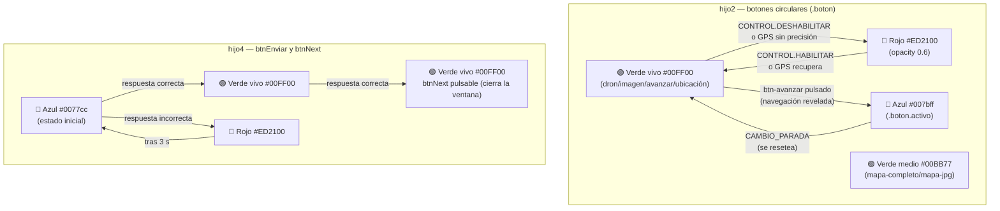

---

### 4.9. Animaciones de botones: glow y spin (ambos modos)

#### Tipos de animación

En ambos modos (CASA y AVENTURA) todos los botones habilitados tienen una animación de brillo interno ("glow") para guiar la atención del usuario. Los botones que requieren acción del usuario también realizan un giro ("spin") periódico para llamar la atención.

**Color del glow — cian `#00F0FF`, no blanco.** Sobre el verde vivo `#00FF00` (§4.8) de un botón recién habilitado, un brillo blanco de baja opacidad apenas cambiaría la luminosidad — no hay contraste de color real. El cian sí contrasta con el verde (canal azul que el verde puro no tiene) y con el resto de la paleta naranja/verde de la app.

**El glow es hacia fuera (`box-shadow` normal), nunca `inset`.** Cada uno de estos botones es un `<button class="boton">` con un `` interior a `width:103%; height:103%` (ver `.boton img`/`#retosBtn img`/`#audio-main-toggle-btn img`) — la propia foto del botón, opaca, que cubre el círculo entero y sobresale ligeramente por fuera de su borde. Un `box-shadow: inset` se pintaría **por debajo** de ese `` (los hijos del elemento se pintan encima de su propio fondo/sombra), así que quedaría completamente tapado — el brillo se ejecutaría de verdad en cada tick, pero nunca sería visible, para ningún color, en ningún botón de los seis. El glow hacia fuera evita el problema por construcción: se pinta alrededor del borde exterior del círculo, donde el `` no llega.

**El giro (`.spinning`) también lleva color.** El `!important` de `.spinning` sustituye la animación de glow por completo mientras dura el giro (0.9s) — sin esto, `spin-btn` solo declararía `transform`, y el botón giraría sin brillo alguno durante esos 0.9s. `spin-btn`/`spin-btn-retos`/`spin-audio-main` declaran también `box-shadow` en el mismo cian que el glow ambiental, así que el giro conserva el brillo mientras rota.

**El propio fondo del botón también pulsa, no solo el halo.** Cada keyframe declara además `background: linear-gradient(#00FF00, #00FF00)` en el valle y `linear-gradient(#00F0FF, #00F0FF)` en el pico — visible a través de las zonas semitransparentes de la foto del botón (el `` no es opaco al 100%; por eso el verde/rojo de habilitado/deshabilitado ya se distingue solo con `.boton`, sin depender de este pulso). `linear-gradient` de un único color, nunca `background-color`, por el mismo motivo que el resto de la app: un `style.backgroundColor` puesto por bypass nunca puede tapar un `background-image`, que siempre pinta por encima.

| Animación | Clase CSS / selector | Descripción visual | Intensidad del halo |
|---|---|---|---|
| **Glow suave** | `animation: glow-suave 3s ease-in-out infinite` | Halo exterior que pulsa lentamente alrededor del círculo, fondo verde→cian→verde | `0 0 8px 2px rgba(0,240,255,0.25)` → `18px 4px 0.65` |
| **Glow activo** | `animation: glow-activo 3s ease-in-out infinite` | Halo exterior más intenso y notable, mismo pulso de fondo | `0 0 10px 2px rgba(0,240,255,0.35)` → `26px 5px 0.85` |
| **Spin** | clase `.spinning` añadida por JS | Giro de 4 vueltas (1440°) con rebote elástico al final, con el mismo halo cian y fondo cian del glow-activo en su punto máximo. Dura 0.9 s | `@keyframes spin-btn/spin-ruleta` |

**Keyframes exactos** (definidos por archivo, mismo timing en todos):

```css
@keyframes glow-suave {
    0%, 100% { box-shadow: 0 0 8px 2px rgba(0,240,255,0.25); background: linear-gradient(#00FF00, #00FF00); }
    50%       { box-shadow: 0 0 18px 4px rgba(0,240,255,0.65); background: linear-gradient(#00F0FF, #00F0FF); }
}
@keyframes glow-activo {
    0%, 100% { box-shadow: 0 0 10px 2px rgba(0,240,255,0.35); background: linear-gradient(#00FF00, #00FF00); }
    50%       { box-shadow: 0 0 26px 5px rgba(0,240,255,0.85); background: linear-gradient(#00F0FF, #00F0FF); }
}
@keyframes spin-btn {          /* hijo2, hijo3, padre */
    0%   { transform: rotate(0deg);    box-shadow: 0 0 10px 2px rgba(0,240,255,0.35); background: linear-gradient(#00FF00, #00FF00); }
    50%  { box-shadow: 0 0 30px 6px rgba(0,240,255,0.9); background: linear-gradient(#00F0FF, #00F0FF); }
    60%  { transform: rotate(1080deg); }
    85%  { transform: rotate(1350deg); }
    100% { transform: rotate(1440deg); box-shadow: 0 0 10px 2px rgba(0,240,255,0.35); background: linear-gradient(#00FF00, #00FF00); }
}
/* timing: 0.9s cubic-bezier(0.2, 0.8, 0.4, 1) forwards */
```

> En `extrainfo-hijo1.html` el keyframe equivalente se llama `spin-ruleta` (existe desde antes) con idéntico timing y ángulos — sin color propio, ver "Pendiente" más abajo.

**Pendiente:** `spin-ruleta` (`extrainfo-hijo1.html`, `#mas-opciones`) y el propio glow de hijo1 (`glow-suave-h1`) mantienen su color original — el verde unificado de los 6 botones de "acción" (retos, audio, avanzar, ubicación, imagen, dron) no incluye el menú de hijo1.

**`btn-mapa-completo`/`btn-mapa-jpg` no llevan ninguna animación** — quedan con el fondo/borde estático de `.boton`, fuera de la regla `glow-suave` que sí usa `btn-imagen`.

#### Qué botón tiene qué animación

| Botón | Archivo | Glow | Spin | Condición CSS |
|---|---|---|---|---|
| `#mas-opciones` | hijo1 | Suave | ❌ (hijo1 excluido del spin) | `:not(.spinning)` |
| `.icono-flotante` ×5 | hijo1 | Suave | ❌ | siempre |
| `#audio-main-toggle-btn` | padre | **Activo** | ✅ | `:not(:disabled):not(.spinning)` |
| `.audio-action-btn` ×4 | padre | Suave | ❌ | `:not(:disabled)` |
| `btn-mapa-completo` | hijo2 | ❌ ninguna | ❌ | — |
| `btn-mapa-jpg` | hijo2 | ❌ ninguna | ❌ | — |
| `btn-imagen` | hijo2 | Suave | ❌ | `:not(.activo)` |
| `btn-video` | hijo2 | **Activo** | ✅ | `:not(.disabled):not(.activo)` |
| `btn-avanzar` | hijo2 | **Activo** | ✅ | `:not(.disabled):not(.activo)` |
| `btn-ubicacion` | hijo2 | **Activo** | ✅ | `:not(.disabled):not(.activo)` |
| `#retosBtn` | hijo3 | **Activo** | ✅ | `:not(:disabled):not(.activo)` |

**Por qué `:not(.activo)` en glow:** Cuando un botón tiene la clase `.activo` (el usuario acaba de pulsarlo y su contenido está abierto), tiene ya su propia indicación visual (fondo azul). No tiene sentido añadir glow encima.

**Por qué `:not(.disabled)` en glow-activo:** Los botones glow-activo pueden estar deshabilitados (rojo, opacidad 0.6). Un botón deshabilitado no debe brillar para llamar a la acción, así que el selector comprueba la clase `.disabled` — la misma señal real que usa `.boton.disabled` (§4.8) para pintar el rojo, no el atributo/propiedad `disabled`. `desactivarBoton()` (`coordenadas-hijo2.html`) siempre pone ambos a la vez (`boton.disabled = true` Y `boton.classList.add('disabled')`), pero cualquier código que reutilizara `.disabled` sin la propiedad dependería de que el selector mire la clase, no el atributo — comprobado por `18-boton-deshabilitado-color.spec.js` (BU-3b), que simula solo la clase: si el selector mirara `[disabled]`, el glow seguiría activo y su `background` animado (que pasa por un cian `#00F0FF` a mitad de ciclo, ver keyframes arriba) ganaría al rojo estático de `.boton.disabled`. Usar `:not(.disabled)` es la misma señal que ya usa `.boton.disabled` y `#btn-video:not(.disabled)` (verde vivo, §4.8) — una sola fuente de verdad para "deshabilitado" en todo el archivo.

**Por qué el `.spinning !important`:** La clase `.spinning` aplica un `animation` que sobrescribe el glow. Sin `!important`, el selector del glow (con ID, mayor especificidad `[1,2,0]`) ganaría al selector de la clase spinning `[0,1,0]`. El `!important` garantiza que el spin siempre sustituya al glow mientras dura el giro — sustituye, no anula del todo: `spin-btn` lleva su propio `box-shadow` cian (ver arriba), así que el brillo sigue presente durante el giro, solo que gobernado por el keyframe del spin en vez del de glow.

#### Lógica del spin (JS)

El spin aplica solo a los botones con **glow activo**. El comportamiento base y el intervalo (3000ms) son idénticos en los tres archivos que lo implementan:

1. **Al llegar a cada nuevo elemento** (`CAMBIO_PARADA`): se inicia un `setInterval` de 3000ms para cada botón glow-activo del archivo.
2. **En cada tick**: si el botón NO está deshabilitado Y el usuario NO lo ha pulsado aún desde el último reset, se añade la clase `.spinning` al botón.
3. **Al terminar el giro** (evento `animationend`): se elimina `.spinning` — el glow reanuda automáticamente.
4. **En la primera pulsación** del botón: se llama `clearInterval`, se marca `pressed = true`. El spin se detiene para esa sesión de elemento.
5. **En el siguiente `CAMBIO_PARADA`**: el estado `pressed` se resetea a `false` y el intervalo se reinicia desde cero.

**Patrón de implementación** (idéntico en hijo2, hijo3 y padre, mismos 3000ms):

```javascript
// Al llegar a nueva parada/tramo:
function _iniciarSpinBtn(btn) {
    if (!btn) return;
    _detenerSpinBtn(btn);                        // limpia anterior
    const state = { intervalId: null, pressed: false };
    state.intervalId = setInterval(() => {
        if (state.pressed || btn.disabled) return;
        btn.classList.remove('spinning');
        void btn.offsetWidth;                    // fuerza reflow para reiniciar animación
        btn.classList.add('spinning');
        btn.addEventListener('animationend',
            () => btn.classList.remove('spinning'), { once: true });
    }, 3000);
    _spinState.set(btn.id, state);
    btn.addEventListener('click', () => {        // primer click detiene spin
        state.pressed = true;
        clearInterval(state.intervalId);
        _spinState.delete(btn.id);
    }, { once: true });
}
```

**Diferencias por archivo:**

| Archivo | Intervalo real | Variable de estado | Reset activado por | Botones gestionados |
|---|---|---|---|---|
| `coordenadas-hijo2.html` | **3000ms** | `_spinState` (Map) | Handler `CAMBIO_PARADA` → `_resetSpinsAventura()` | `btnVideo`, `btnAvanzar`, `btnUbicacion`, `btnImagen` |
| `audio-hijo3.html` | **3000ms** | `_retosBtnSpinInterval` + `_retosBtnSpinPressed` | Handler `CAMBIO_PARADA` → `_resetSpinRetosBtn()` | `retosBtn` |
| `codigo-padre.html` | **3000ms** | `_audioMainSpinInterval` + `_audioMainSpinPressed` | `progresarSiguienteElemento()` → `globalThis._resetSpinAudioMainPadre()` | `#audio-main-toggle-btn` |

**Variante sin nag periódico — gira solo al pulsar:** `btnMapaCompleto`/`btnMapaJpg` (`coordenadas-hijo2.html`) y `#btn-chat-soporte` (`codigo-padre.html`) están habilitados de forma permanente y no necesitan reclamar atención — el spin periódico resultaba molesto en un botón que el usuario puede pulsar en cualquier momento sin urgencia. Usan un patrón más simple, `_spinAlPulsar(btn)` en hijo2 (equivalente inline en `#btn-chat-soporte`), calcado del botón `#mas-opciones` de `extrainfo-hijo1.html`: cada click (no solo el primero) quita `.spinning`, fuerza reflow y la vuelve a añadir. **No basta con depender de `animationend`** para quitar la clase: en estos 3 botones el mismo click también dispara `setBotonActivo()`/lógica equivalente, que añade/quita `.activo` en el mismo elemento — como el glow-suave depende de `:not(.activo)` (línea ~222), ese cambio de clase hace que Chromium cancele la animación en curso sin disparar `animationend` nunca, dejando `.spinning` pegado para siempre. La red de seguridad real es un `setTimeout` de 950ms (duración de la animación + margen) que quita `.spinning` igualmente; `animationend` solo adelanta la limpieza si llega a dispararse.

> **Nota hijo1:** `#mas-opciones` ya tenía su propio spin en hijo1 (clase `.spinning` añadida en el evento `click` del botón). No tiene spin periódico — solo gira al pulsarse. Los cinco `.icono-flotante` tampoco tienen spin, solo glow suave.

---

## 5. La arquitectura padre-hijo (iframes)

### ¿Qué es un iframe?

Un iframe es una "ventana dentro de otra ventana" en una página web. La aplicación tiene una página principal (`codigo-padre.html`) que carga otras páginas dentro de sí misma como iframes.

### ¿Por qué usar iframes?

- **Aislamiento de estado**: cada hijo tiene su propio contexto JS. Un crash en hijo4 (retos) no corrompe el estado de hijo2 (mapa).
- **Recarga independiente**: el heartbeat puede recargar solo el iframe caído sin tocar el resto de la sesión.
- **Organización de responsabilidades**: cada hijo se encarga de un único dominio (mapa, audio, retos…). El padre no mezcla UI con lógica de otros dominios.
- **Comunicación explícita**: toda interacción entre componentes pasa por `postMessage` documentado. No hay acceso directo al DOM ajeno ni variables compartidas entre iframes.

### Espera de HIJO_LISTO: sistema de eventos centralizado

El padre nunca usa polling para esperar que un hijo esté listo. Usa **Promises** resueltas por eventos: `crearPromiseHijoListo(hijoId)` crea la Promise; `marcarHijoListo(hijoId)` la resuelve al recibir `HIJO_LISTO`. Ambas funciones viven en `js/state-manager.js` (timeout de 30 s como límite de seguridad). Si `state-manager` no está disponible, el fallback usa polling con `setTimeout(check, 200)` hasta que `hijosInicializados.has(hijoId)` sea `true`.

> **Invariante crítico — `_normalizarSetHijos` antes de asignar `src`:** en `_hdl_SELECCION_AVENTURA_ACTIVADA`, `_normalizarSetHijos` debe llamarse **antes** de `_cargarSoloIframeActivacion`. Si se llama después, existe una ventana donde un hijo puede enviar `HIJO_LISTO`, ser añadido a `hijosInicializados`, y luego ser borrado por `_normalizarSetHijos` — dejando `_esperarHijosCargados` esperando un segundo `HIJO_LISTO` que nunca llega (timeout a los 30 s, AVENTURA_ACTIVADA queda bloqueada). El orden correcto: eliminar entradas → asignar src → esperar HIJO_LISTO.
>
> Para el detalle técnico completo de la implementación (código de `crearPromiseHijoListo`, `marcarHijoListo`, fallbacks) ver **§30.3**.

### Los hijos principales

| Iframe | ID | Archivo | ¿Crítico? | Cuándo carga | Función |
|--------|----|---------|-----------|--------------|---------|
| Pantalla selección | `seleccion` | `En-busca-del-tesoro.html` | No | Al arrancar `codigo-padre.html` (único iframe con `src` desde el inicio) | Pantalla de incorporación: selección de idioma, aventura, retos previos y código de activación. Se oculta al iniciar la aventura. |
| Hijo 1 | `hijo1-opciones` | `extrainfo-hijo1.html` | No | `SELECCION.P14_MOSTRADA` → `cargarRestoDeiframes()` | Panel lateral izquierdo con botón "Más opciones". Despliega iconos de acceso a contenido complementario (temporizador, vídeos, etc.). |
| Hijo 2 | `hijo2` | `coordenadas-hijo2.html` | **Sí** | `SELECCION.P14_MOSTRADA` → `cargarRestoDeiframes()` | Gestiona 6 botones de navegación. Recibe `distanciaAlDestino` de `funciones-mapa.js` (el Haversine lo hace el padre), compara contra umbral, envía `LLEGADA_DETECTADA` y gestiona overlay "fuera de rango". Sin mapa propio — lo renderiza `codigo-padre.html` vía `funciones-mapa.js`. |
| Hijo 3 | `hijo3` | `audio-hijo3.html` | **Sí** | `SELECCION.P14_MOSTRADA` → `cargarRestoDeiframes()` | Reproductor de audio. Recibe del padre qué audio reproducir y lo controla. |
| Hijo 4 | `hijo4` | `retos-hijo4.html` | **Sí** | `SELECCION.P14_MOSTRADA` → `cargarRestoDeiframes()`. En la ruta fallback de `AVENTURA_ACTIVADA` (sin pre-carga en P14) sí forma parte del `Promise.all` de recarga y del posterior `_esperarHijosCargados` (hijo1-hijo5, ver §9.11) | Muestra retos (preguntas de opción múltiple, texto libre, puzzles) y valida las respuestas. |
| Hijo 5 | `hijo5` | `boton-casa-hijo5.html` | No | `SELECCION.P14_MOSTRADA` → `cargarHijoCasa()`, que **lo registra en la mensajería antes de las dos ramas** y luego espera `HIJO_LISTO` (si ya está cargado, solo espera) | **Solo desarrollo — no aparece en la PWA final.** Herramienta de prueba para simular el modo CASA desde escritorio. Contiene el botón GPS (🛰️) que envía `SISTEMA.CAMBIO_MODO` al padre para alternar entre modos CASA y AVENTURA. Visible solo cuando el modo DEV está activo (`globalThis._devModeActivo = true`, ver §24); permanece oculto (`display:none`) en todo momento normal. |
| Hijo 6 | `hijo6-chat` | `chat-hijo6.html` | No | **Lazy** — `src=""` en HTML; se asigna al primer click en `#btn-chat-soporte` | Asistente de soporte FAQ en acordeón. Accesible desde un botón flotante propio del padre. |

> **Hijos críticos para heartbeat** (`hijo2`, `hijo3`, `hijo4`, `hijo5`): reciben `SISTEMA.HEARTBEAT` cada 5 s en MODO AVENTURA (array `hijosCriticos` en `mensajeria.js`). Si cualquiera no responde 3 heartbeats consecutivos, el padre lo recarga automáticamente (`AUTO_RECONECTAR: true`). Los hijos sin supervisión de heartbeat son hijo1 e hijo6. Nota: `hijo5` está en el ciclo de heartbeat aunque no sea "crítico" en el sentido de que no bloquea `_esperarHijosCargados` — su función en aventura es secundaria (tool de desarrollo).

### Otros hijos (pantallas secundarias)

| Archivo | Función |
|---------|---------|
| `videos-valencia-historica.html` | Galería de vídeos sobre Valencia. |
| `consejos-valencia.html` | Consejos prácticos para el turista. |
| `gastronomia.html` | Información gastronómica valenciana. |
| `paginas-oficiales-valencia.html` | Enlaces a webs oficiales de Valencia. |
| `mapa-completo.html` | Vista del mapa completo (todas las aventuras). |
| `puzzle.html` | Juego de puzzle interactivo — **componente interno** de `En-busca-del-tesoro.html`. No se carga directamente desde el padre; se embebe como sub-iframe dentro de la pantalla de selección cuando el usuario llega al reto puzzle (P6). |

### El protocolo de arranque (handshake)

Cuando el padre carga un hijo, siguen este protocolo para asegurarse de que están preparados:

```text
Padre                                Hijo
  │                                    │
  │──── asigna src al iframe ─────────>│  navegador carga el HTML
  │                                    │
  │<─── HIJO_PREPARADO ───────────────│  { componenteId, version, capacidades[], timestamp }
  │                                    │  "mi HTML está cargado"
  │                                    │
  │──── ACK (best-effort) ────────────>│  { tipoMensajeOriginal: 'SISTEMA.HIJO_PREPARADO' }
  │──── PADRE_DATOS ──────────────────>│  { modo, timestamp }
  │                                    │  "aquí tienes el modo actual"
  │                                    │
  │<─── HIJO_LISTO ───────────────────│  { componenteId, iframeId, timestamp }
  │                                    │  "procesé los datos, estoy listo"
  │                                    │
  │──── PADRE_CONFIRMA_HIJO_LISTO ────>│  { timestamp, mensaje, modoInicial }
  │                                    │  "confirmado — puedes hacer tu UI visible"
  │                                    │
  ▼                                    ▼
(comunicación normal)                (funcionando)
```

**Notas de implementación:**

- El ACK es **best-effort**: solo se envía si `enviarMensaje_S1` ya está disponible. No es crítico para la funcionalidad — PADRE_DATOS sigue igualmente.
- `PADRE_DATOS` del handshake lleva `{ modo, timestamp }` para todos los hijos. Los datos completos de la aventura (idioma, coordenadas) **no viajan en este mensaje** — llegan mediante mensajes específicos (`DATOS.CARGAR_COORDENADAS`, `NAVEGACION.RESPUESTA_DATOS_PARADAS`, etc.) después de que el hijo ya está listo. Audio y retos no se distribuyen en el handshake en absoluto — se resuelven parada a parada (ver §16). **Única excepción: `hijo6-chat`** — su `PADRE_DATOS` añade además `idioma`, `aventura`, `paradaActualNombre`, `siguienteParadaNombre` y `paradasRestantes` (`globalThis.construirEstadoChat()`, expuesto por el IIFE de apertura del chat para que `_hdl_SISTEMA_HIJO_PREPARADO` — otro scope — pueda leerlo). Es la vía por la que el chat conoce el idioma en su primera apertura: sin ese añadido construiría su FAQ con el `'es'` por defecto en vez del idioma real seleccionado. Que el payload sea correcto no basta — este mensaje solo llega si `hijo6-chat` está registrado en `iframesRegistrados`, cosa que `abrirChat()` hace antes de asignarle `src`; ver §7.7 para el detalle de por qué el registro condiciona la entrega.
- El padre registra los handlers `HIJO_PREPARADO` y `HIJO_LISTO` en Script 1 **antes de asignar `src` a ningún iframe** — esto garantiza que los mensajes tempranos nunca se pierdan.
- Diseño intencional: el timeout de 30 s en `state-manager.js` es el último recurso si el hijo se cuelga antes de enviar `HIJO_LISTO` (crash total), no como mecanismo normal de espera. El heartbeat continuo detecta hijos caídos tras arrancar y permite reenviar `CAMBIO_MODO` pendiente si llega un `HIJO_LISTO` tardío.

### Acciones adicionales tras HIJO_LISTO (por hijo)

`_hdl_SISTEMA_HIJO_LISTO` hace acciones extras según qué hijo acaba de completar el handshake. El flujo común (confirmar, actualizar estado) es igual para todos; lo específico por hijo:

| Hijo | Acción adicional tras `PADRE_CONFIRMA_HIJO_LISTO` |
|------|--------------------------------------------------|
| `hijo2` | Padre envía `NAVEGACION.RESPUESTA_DATOS_PARADAS` `{ paradas: [...] }` con la lista normalizada de paradas y tramos. **Condicional**: solo si `aventuraSeleccionada` e `idiomaSeleccionado` ya están establecidos en el momento del handshake; si no, `distribuirDatosAventura()` se encarga más tarde. |
| `hijo3` | Padre llama `_configurarRetoBtn()` para sincronizar el estado del botón de retos con la parada actual. **Condicional**: solo si hay parada activa en `estado.elementoActual`. El resultado depende del modo vigente (ver tabla §6 "Diferencias de comportamiento CASA vs AVENTURA"). |
| `hijo2` + `hijo3` + `hijo4` (los tres) | Al completarse el último de los tres hijos críticos, `_hijoListo_onTodosListos()` → envía `SISTEMA.CAMBIO_MODO { razon: 'sincronizacion_inicial' }` a los tres para alinear el modo actual (CASA o AVENTURA). |

> **hijo3 y el modo activo**: cuando `hijo3` envía `HIJO_LISTO` (arranque inicial o recarga por `AVENTURA_ACTIVADA`), el padre ejecuta `_configurarRetoBtn()` con la parada activa y el modo en curso. El modo determina el resultado: en CASA el botón `retosBtn` se habilita de inmediato si `reto_id` está presente; en AVENTURA arranca deshabilitado y solo se habilita cuando llega el evento `AUDIO.FIN_REPRODUCCION`. Este mismo `_configurarRetoBtn()` se llama también desde `_hdl_NAVEGACION_CAMBIO_PARADA` cada vez que el usuario cambia de parada, con la misma lógica dependiente del modo.

### Secuencia de inicialización completa

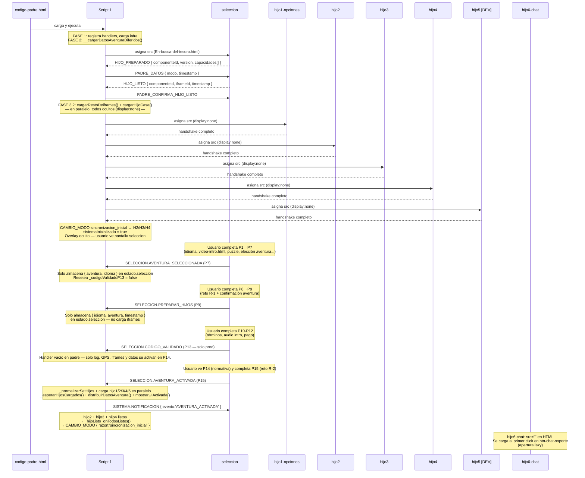

> **Carga en paralelo:** `cargarRestoDeiframes()` usa `Promise.all` sobre hijo1-opciones/hijo2/hijo3/hijo4 (cada uno v�a `_cargarUnIframeHijo`, que espera su `HIJO_LISTO`), tolerando fallos individuales: los que fallan se acumulan en `hijosFallidos` sin abortar el resto. hijo5 va aparte en `cargarHijoCasa()`, y ambas se lanzan juntas con `await Promise.all([cargarRestoDeiframes(), cargarHijoCasa()])`. La pantalla de selecci�n se carga antes y por separado en `cargarIframeSoloSeleccion()`  `cargarIframeSecuencial` es solo un alias suyo por compatibilidad. `_hdl_SELECCION_AVENTURA_ACTIVADA` carga los 5 hijos (hijo1-5 incluyendo hijo4) vía `_cargarSoloIframeActivacion`. `_fase2CargarDatos()` precarga módulos JS cuando P14 se muestra (`SELECCION.P14_MOSTRADA`), de modo que AVENTURA_ACTIVADA puede distribuir datos sin esperar imports adicionales.

### Diagrama de arquitectura global

```mermaid
graph TD
    PADRE["codigo-padre.html (~13.700 líneas)"]
    SEL["seleccion — En-busca-del-tesoro.html"]
    PZ["puzzle.html\nsub-iframe interno de seleccion"]
    H1["hijo1-opciones — extrainfo-hijo1.html"]
    H2["hijo2 — coordenadas-hijo2.html"]
    H3["hijo3 — audio-hijo3.html"]
    H4["hijo4 — retos-hijo4.html"]
    H5["hijo5 — boton-casa-hijo5.html"]
    H6["hijo6-chat — chat-hijo6.html"]
    MSG["js/mensajeria.js"]
    SM["js/state-manager.js"]
    CONST["js/constants.js"]
    CFG["js/config.js"]
    APP["js/app.js"]
    FMAP["js/funciones-mapa.js (~3.200 líneas)"]
    CP["js/controladores-padre.js"]
    SRV["js/server.js (servidor estático)"]

    PADRE <-->|"postMessage\nHIJO_PREPARADO/LISTO · CAMBIO_MODO"| SEL
    PADRE <-->|"postMessage\nUI.CLOSE_MENUS · TEMPORIZADOR.TOGGLE\nPARADAS.LISTADO_TOGGLE"| H1
    PADRE <-->|"postMessage\nCAMBIO_PARADA · GPS · LLEGADA_DETECTADA"| H2
    PADRE <-->|"postMessage\nAUDIO.REPRODUCIR_REQUEST · FIN_REPRODUCCION"| H3
    PADRE <-->|"postMessage\nRETO.MOSTRAR · RETO.COMPLETADO"| H4
    PADRE <-->|"postMessage\nSISTEMA.CAMBIO_MODO (solo dev)"| H5
    PADRE <-->|"postMessage\nCHAT.ESTADO_PADRE"| H6
    SEL -->|sub-iframe P6/P9| PZ
    PADRE -->|"dynamic import\nFASE 1 — bus de mensajes"| MSG
    PADRE -->|"dynamic import\nFASE 1 — estado global"| SM
    PADRE -->|"dynamic import\nFASE 1 — TIPOS_MENSAJE/MODOS"| CONST
    PADRE -->|"dynamic import\nFASE 1 — umbrales/parámetros"| CFG
    PADRE -->|"dynamic import\nprotocolo bidireccional de modo"| APP
    PADRE -->|"dynamic import\nGPS + mapa MapLibre"| FMAP
    PADRE -->|"dynamic import\ndatos por parada bajo demanda"| CP
    SRV -->|"sirve estático\nGET, PROTECT_DATA opcional"| PADRE

    style H5 fill:#aaa,color:#fff
    style H6 fill:#e8f4f8,stroke:#0077cc
    style PZ fill:#e0e0e0,color:#555
```

> `hijo5` (gris) — solo desarrollo, no aparece en la PWA final. `hijo6-chat` (azul claro) — carga lazy al primer uso. `puzzle.html` (gris claro) — no es hijo directo del padre; es sub-iframe interno de `seleccion`.

### Diagrama de secuencia — Reanudación de aventura

Cuando el usuario vuelve a abrir la app y existe `vv_aventura_iniciada` en `localStorage`, el padre restaura el progreso y reposiciona cada hijo en la parada guardada. **El modo restaurado no es siempre CASA** — `_activarModoRest()` usa `datosGuardados.modo` (el campo persistido junto con `aventura`/`idioma`, ver §9.10) como fuente de verdad: en una sesión guardada en producción ese campo es siempre `'aventura'` (§9.5), así que el caso real y común es reanudar directo en modo AVENTURA, sin pasar por CASA ni por hijo5 en ningún momento. El diagrama de abajo muestra el caso CASA (exclusivo del modo DEV, ver §24) porque es el que tiene más pasos que mostrar (hijo5 entra en juego); para AVENTURA, el mismo `CAMBIO_MODO` se envía con `modo: aventura` a los mismos hijos, hijo5 permanece oculto, y no hay ningún botón que pulsar — la reanudación termina ahí.

```mermaid
sequenceDiagram
    participant U as Usuario
    participant P as Padre
    participant H1 as hijo1-opciones
    participant H2 as hijo2 (GPS)
    participant H3 as hijo3 (audio)
    participant H4 as hijo4 (retos)
    participant H5 as hijo5 [DEV]

    Note over P: ejecutarRestauracionAventura()<br/>Lee localStorage → restaura aventura, idioma, parada

    P->>P: distribuirDatosAventura()
    P->>H5: NAVEGACION.RESPUESTA_DATOS_PARADAS
    P->>P: restoreProgressFromStorage()

    par CAMBIO_PARADA a hijos críticos
        P->>H2: NAVEGACION.CAMBIO_PARADA { parada guardada }
        P->>H3: NAVEGACION.CAMBIO_PARADA { parada guardada }
        P->>H4: NAVEGACION.CAMBIO_PARADA { parada guardada }
        P->>H5: NAVEGACION.CAMBIO_PARADA { parada guardada }
    end

    par CAMBIO_MODO (datosGuardados.modo) a todos los hijos — caso CASA (solo dev) ilustrado aquí
        P->>H1: SISTEMA.CAMBIO_MODO { modo: casa }
        P->>H2: SISTEMA.CAMBIO_MODO { modo: casa }
        P->>H3: SISTEMA.CAMBIO_MODO { modo: casa, resetea audio }
        P->>H4: SISTEMA.CAMBIO_MODO { modo: casa }
        P->>H5: SISTEMA.CAMBIO_MODO { modo: casa }
    end

    P->>H2: solicitarCoordenadasAHijo2(elementoActual)
    P->>H3: solicitarAudioAHijo3(audio_id, autoplay=false)

    Note over U,H5: Caso CASA (dev, minoritario): hijo5 visible, usuario pulsa botón GPS para pasar a AVENTURA.<br/>Caso AVENTURA (producción, el real y común): hijo5 permanece oculto, GPS ya activo con validaciones — la reanudación termina aquí, sin ninguna pulsación.
```

> Cuándo y cómo se activa el modo DEV que hace visible a hijo5: ver §24.

---

## 6. El código padre: el cerebro de todo

El archivo `codigo-padre.html` (~13.700 líneas) es el **orquestador** de toda la aplicación: coordina la carga de iframes, gestiona el estado global, distribuye mensajes, ejecuta el GPS y toma todas las decisiones de navegación.

### Responsabilidades del padre

1. **Gestión de iframes**: carga, muestra, oculta y reconecta los hijos según el contexto.
2. **Estado centralizado**: guarda aventura seleccionada, idioma, parada actual, modo y estado GPS en `js/state-manager.js`.
3. **Mensajería**: recibe mensajes de todos los hijos y les responde a través de `js/mensajeria.js`.
4. **GPS**: ejecuta el único `navigator.geolocation.watchPosition()` de la app, directamente en `activarGPS()` (línea 4895 de `codigo-padre.html`). `funciones-mapa.js` solo actúa como adaptador — delega a `globalThis.activarGPS()` del padre. Las posiciones se distribuyen a hijo2 vía `NAVEGACION.ACTUALIZAR_ESTADO`. hijo2 no tiene `watchPosition` propio.
5. **Navegación**: decide cuándo cambiar de parada, cuándo mostrar un reto, cuándo reproducir un audio.
6. **Modos**: gestiona la transición entre `'casa'` y `'aventura'`, propagando `CAMBIO_MODO` a los hijos críticos y coordinando heartbeat y GPS.

### Estructura interna: los cinco scripts module

`codigo-padre.html` contiene **cinco** bloques `<script type="module">` con roles distintos. Más varios `<script>` regulares para utilidades síncronas (HTTPS redirect, stub `activarGPS`, image fallback, overlays de imagen/vídeo/error…) — los clásicos tampoco son un compartimento aislado, comparten identificadores con los módulos vía `globalThis` (§37.2).

| Script | Empieza en (aprox., se desplaza con cada edición — `grep -n '<script type="module">' codigo-padre.html` da el número exacto) | Rol principal |
|--------|--------|--------------|
| **Script 1** | ~2716 | Orquestador de arranque: FASE 1 infra → FASE 2 datos → FASE 3 iframes. Registra handlers del ciclo de vida: `SISTEMA.HIJO_PREPARADO`, `SISTEMA.HIJO_LISTO`, `SISTEMA.CAMBIO_MODO`, `SISTEMA.HEARTBEAT`, `SISTEMA.HIJO_FALLIDO`, `UI.ACCION_USUARIO`. Contiene también la reanudación de sesión (`ejecutarRestauracionAventura`) y los carteles. Al final carga `js/controladores-padre.js`. |
| **Script 2** | ~9727 | Handlers de dominio: todos los `NAVEGACION.*` (GPS, CAMBIO_PARADA, LLEGADA_DETECTADA…), `RETO.*`, `SELECCION.*`, `AUDIO.*`, `UI.NAVEGACION_EXTERNA`, `SISTEMA.ADVERTENCIA`. Contiene `distribuirDatosAventura`, `marcarParadaCompletada` y `_iniciarTemporizadorAventura`. |
| **Script 3** | ~14216 | Gestión de visibilidad de iframes (`mostrarHijo4`) y reconexión en `visibilitychange`. |
| **Script 4** | ~14381 | "Migración de controladores y diagnóstico GPS": registra los controladores de `js/app.js` (`registrarControladoresApp`), `js/monitoreo.js` y `js/utils.js`; arranca el heartbeat. **No llega hasta el final del archivo.** |
| **Script 5** | ~14896 | Panel de logs en pantalla (gesto de 7 toques, ver §24). Último bloque del documento, autocontenido. |

> **Por qué Script 1 registra solo los handlers del ciclo de vida y Script 2 el resto:** Script 1 debe completar el registro de `HIJO_PREPARADO` / `HIJO_LISTO` / `CAMBIO_MODO` **antes** de asignar `src` a cualquier iframe. Los handlers de dominio (`NAVEGACION.*`, `RETO.*`, `SELECCION.*`) solo son necesarios una vez que los iframes están cargados, por lo que pueden vivir en Script 2 sin riesgo de llegar tarde.
>
> **Aislamiento de scope entre scripts:** Cada `<script type="module">` tiene su propio scope léxico. Las variables definidas localmente en Script 1 (p.ej. `sleep`, `enviarMensaje_S1`, `registrarIframe_S1`) **no son accesibles** en los otros cuatro módulos a menos que se expongan explícitamente en `globalThis`. Por este motivo cada script define su propio alias de seguridad al inicio: `const sleep = globalThis.sleep || (ms => new Promise(r => setTimeout(r, ms)));`. Del mismo modo, las notificaciones de broadcast `AVENTURA_ACTIVADA` y `AVENTURA_INICIADA` que emite el handler de `SELECCION.AVENTURA_ACTIVADA` (Script 2) usan `enviarMensaje_S2` — intentar usar `enviarMensaje_S1` en Script 2 siempre devolvería `typeof === 'undefined'` y los broadcasts se perderían.
>
> **Ejemplo real — `ajustarTimeoutPorConexionSafe(ms)`:** wrapper que llama a `ajustarTimeoutPorConexion` (el ajuste real de timeouts según calidad de conexión, `js/device-detection.js`) protegido con try/catch, devolviendo `ms` sin modificar si algo falla. Se llama desde sitios de Script 1 y Script 2 (intervalo del heartbeat, timeouts de `solicitarCoordenadasHijo`...). Una única definición, cerca del principio de Script 1 (`globalThis.ajustarTimeoutPorConexionSafe = function ajustarTimeoutPorConexionSafe(ms) {...}`), basta para cubrir ambos scripts — al ser una asignación a `globalThis` en vez de una declaración `function` normal, el identificador queda disponible como global real desde el instante en que se ejecuta esa línea, sin necesidad de una función local por script ni de un "early fallback" aparte con su propia lógica duplicada (llegó a haber tres definiciones distintas del mismo wrapper repartidas por el fichero antes de consolidarlo en esta única).

### Fases de inicialización

Script 1 ejecuta tres fases secuenciales antes de que la app sea interactiva:

#### FASE 1 — Infraestructura

Los módulos de infraestructura se cargan en un orden estricto por dependencias:

| Paso | Carga | Motivo del orden |
|------|-------|-----------------|
| 1 | `state-manager.js` (secuencial) | `mensajeria.js` necesita `__vv_stateManager` ya disponible |
| 2 | `mensajeria.js` (secuencial) | Debe existir antes de registrar cualquier handler |
| 3 | `validacion.js` + `funciones-mapa.js` (secuencial) | Otros módulos los importan como dependencia estática |
| 4 | `constants.js`, `utils.js`, `device-detection.js`, `logger.js`, `config.js`, `monitoreo.js`, `app.js` — `Promise.all` | Sin dependencias cruzadas entre ellos |

#### FASE 2 — Datos de aventura

Llamada automáticamente desde `ejecutarInicializacionAutomatica()` vía `__cargarDatosAventuraDiferidos()`. Los 5 módulos de datos no tienen imports cruzados: se cargan en paralelo con `Promise.all` y sus resultados se exponen en variables globales:

```text
coordenadas-aventuras.js  →  globalThis.__vv_DATOS_AVENTURAS
audios-aventuras.js       →  globalThis.__vv_AUDIOS_AVENTURAS
retos-aventuras.js        →  globalThis.__vv_RETOS_AVENTURAS
textos-aventuras.js       →  globalThis.__vv_TEXTOS_AVENTURAS
indice-aventuras.js       →  globalThis.__vv_INDICE_AVENTURAS
```

#### FASE 3 — Iframes

Necesita FASE 2 completa. Todo ocurre en el arranque, dentro de `ejecutarInicializacionAutomatica()`, antes de cualquier interacción del usuario:

1. `cargarIframeSoloSeleccion()` — asigna `src` a `seleccion` y espera su handshake
2. `cargarRestoDeiframes()` — carga hijo1-opciones/hijo2/hijo3/hijo4 en **paralelo** (`Promise.all`, tolerando fallos individuales) mientras `cargarHijoCasa()` carga hijo5, todos ocultos (`display:none`). No espera señal alguna de seleccion. El listener `load` de cada iframe incluye una guardia `about:blank`: si `contentWindow.location.href === 'about:blank'` retorna sin llamar a `handleIframeLoad`, evitando un falso "loaded successfully" antes de que se asigne el `src` real.
3. Cuando hijo2+hijo3+hijo4 completan el handshake, `_hijoListo_onTodosListos` envía `CAMBIO_MODO { razon:'sincronizacion_inicial' }` a hijo2/hijo3/hijo4 y dispara `SISTEMA.APLICACION_INICIALIZADA` vía `window.postMessage` (origen `'handshake-interno'`), que llega al handler `_hdl_APLICACION_INICIALIZADA` registrado en el bus. Este handler es puramente informativo (registra el evento y notifica `aplicacion_lista` a los hijos ya inicializados) — no inicializa ninguna aventura por su cuenta. La activación de una aventura ocurre siempre por una vía explícita: el flujo normal `SELECCION.AVENTURA_ACTIVADA`, o la reanudación vía el modal "continuar aventura" (`ejecutarRestauracionAventura()`, ver §10.14). Ningún CAMBIO_PARADA se envía hasta que una de esas dos vías se complete.

Las señales `SELECCION.*` llegan **más tarde**, cuando el usuario completa el flujo de onboarding:

- `SELECCION.AVENTURA_SELECCIONADA` (P7) → solo almacena `{ aventura, idioma }` en `estado.seleccion`; resetea flags `_codigoValidadoP13` y `_iframesPreCargadosP14`; **no carga iframes ni activa GPS**
- `SELECCION.PREPARAR_HIJOS` (P9) → solo almacena `{ idioma, aventura, timestamp }` en `estado.seleccion`; **no carga iframes**
- `SELECCION.CODIGO_VALIDADO` (P13, solo prod) → handler vacío — registra con un log que el código fue validado; nada más
- `SELECCION.P14_MOSTRADA` (P14) → en paralelo: `_fase2CargarDatos()` + `cargarRestoDeiframes()` + `cargarHijoCasa()`; en cuanto eso termina marca `_iframesPreCargadosP14 = true`; **después**: `activarGPS()` siempre, en prod y en dev; si GPS deniega → overlay + abort, pero el flag ya está puesto y el abort no lo deshace
- `SELECCION.AVENTURA_ACTIVADA` (P15/P16) → fast-path si `_iframesPreCargadosP14` (salta recarga); si no, carga hijo1-5 como fallback; siempre distribuye datos; el modo final depende de `_devModeActivo` — CASA solo en modo DEV, AVENTURA directo en cualquier otro caso (el real en producción, ver §9.5)

```mermaid
flowchart TD
    F1["FASE 1 — Infraestructura\nstate-manager → mensajeria → validacion+mapa\n→ 7 módulos en Promise.all"]
    F2["FASE 2 — Datos de aventura\nPromise.all 5 módulos .js\n→ globalThis.__vv_*"]
    F3A["FASE 3.1\ncargarIframeSoloSeleccion()\nseleccion cargado + handshake"]
    FIN["✅ Sistema listo\nCAMBIO_MODO sincronizacion_inicial → H2/H3/H4\noverlay oculto — usuario ve seleccion"]
    SEL_A["AVENTURA_SELECCIONADA (P7)\nsolo almacena estado.seleccion\nreset _codigoValidadoP13 y _iframesPreCargadosP14"]
    SEL_P["PREPARAR_HIJOS (P9)\nsolo almacena { idioma, aventura, timestamp }\nno carga iframes"]
    SEL_CV["CODIGO_VALIDADO (P13 — solo prod)\nhandler vacío — registra con log"]
    SEL_P14["P14_MOSTRADA (P14)\ncargarRestoDeiframes + cargarHijoCasa + _fase2CargarDatos en paralelo\n→ activarGPS siempre (prod y dev)"]
    SEL_C["AVENTURA_ACTIVADA (P15→P16)\nfast-path si _iframesPreCargadosP14\nsi no: carga hijo1-5 + distribuirDatosAventura()"]
    F1 --> F2 --> F3A --> FIN
    FIN -.->|"más tarde:\nusuario completa\nonboarding"| SEL_A
    SEL_A --> SEL_P --> SEL_CV --> SEL_P14 --> SEL_C

    style F1 fill:#fff3cd
    style F2 fill:#d4edda
    style F3A fill:#cce5ff
    style FIN fill:#d1ecf1
    style SEL_A fill:#e8d5f5
    style SEL_P fill:#e8d5f5
    style SEL_C fill:#e8d5f5
```

> FASE 1 y FASE 2 terminan antes de asignar `src` a ningún iframe. Cuando llega el primer `HIJO_PREPARADO` ya existen todos los handlers y todos los datos de aventura.

### Registro de handlers: `registrarControladorSeguro`

Todos los handlers del padre se registran mediante `globalThis.registrarControladorSeguro(tipo, handler)`, definida en Script 1. Esta función:

1. **Deduplica**: mantiene `globalThis.__CONTROLADOR_REGISTRADOS` (un `Set`) — si el tipo ya está registrado, lo ignora con un `warn`. Cada tipo de mensaje tiene exactamente un handler en el padre.
2. **Encola si mensajería no está lista**: si `registrarControlador_S1` no está disponible aún, guarda el handler en `__CONTROLADORES_PENDIENTES` para procesarlo cuando mensajería esté lista.
3. **Fallback**: si `registrarControlador_S1` no está disponible pero `globalThis.mensajeria` sí, usa `mensajeria.registrarControlador` directamente.

**Reparto de handlers por prefijo (dentro de `codigo-padre.html`):**

| Prefijo | Registrado en | Ejemplos |
|---------|--------------|---------|
| `SISTEMA.*` | Script 1 | `HIJO_PREPARADO`, `HIJO_LISTO`, `CAMBIO_MODO`, `HEARTBEAT`, `HIJO_FALLIDO` |
| `NAVEGACION.*` | Script 2 | `CAMBIO_PARADA`, `LLEGADA_DETECTADA`¹, `GPS.ACTIVAR` |
| `RETO.*` | Script 2 | `SOLICITAR_RETO`, `OCULTAR`, `COMPLETADO`, `MOSTRADO` |
| `SELECCION.*` | Script 2 | `PREPARAR_HIJOS`, `CODIGO_VALIDADO`, `AVENTURA_SELECCIONADA`, `AVENTURA_ACTIVADA`, `IDIOMA_SELECCIONADO` |
| `SELECCION.DEV_MODE_TOGGLE` | Script 1 (IIFE independiente) | No pasa por `registrarControladorSeguro` — IIFE propio que escucha `message` directamente y pone `globalThis._devModeActivo = true`. Recibido desde la pantalla de selección al activar el modo DEV (ver §24) |
| `CONTROL.DEV_CINCO_TOQUES` | Script 2 | `_hdl_CONTROL_DEV_CINCO_TOQUES` — muestra modal de código del modo DEV (ver §24); con código correcto: `_devModeActivo = true`, hijo5 `display:block`, `_vv_triggerCambioModo(MODOS.CASA)` |
| `AUDIO.*` | Script 2 | `ESTADO_ACTUALIZADO`, `FIN_REPRODUCCION` |
| `DATOS.*` | `codigo-padre.html` (`_regCtrl_DatosRespuestas`) + `js/controladores-padre.js` | `COORDENADAS_CARGADAS`, `TEXTOS_CARGADOS`; recuperación puntual por cache-miss: `SOLICITAR_AUDIOS`, `SOLICITAR_RETOS` (resuelven un solo id, no reenvían la aventura — ver §16); fallbacks de bloque: `SOLICITAR_TEXTOS`, `SOLICITAR_DATOS_PARADAS` |

### Modos de la aplicación

La aplicación tiene dos modos, cuyos valores corresponden a las constantes `MODOS.CASA = 'casa'` y `MODOS.AVENTURA = 'aventura'` de `js/constants.js`:

- **`'casa'`**: menú principal — selección de aventura, vídeos, consejos. Heartbeat pausado; localStorage de progreso limpiado (`vv_aventura_iniciada`, `vv_progreso`, `vv_paradas_completadas`) — **excepto en modo dev** (`globalThis._devModeActivo === true`, ver §24), donde no se borra nada, porque la propia activación entra en CASA como paso de bootstrap, no como abandono real. Ver §9.9.
- **`'aventura'`**: recorrido activo — mapa, GPS, retos. Heartbeat activo cada ~5 s (ajustado por calidad de conexión vía `ajustarTimeoutPorConexion`).

**Quién inicia un cambio de modo:**

| Origen | Cuándo | Razón (`razon`) |
|--------|--------|----------------|
| Padre (`_hijoListo_onTodosListos`) | Al completar la inicialización de todos los hijos críticos | `'sincronizacion_inicial'` |
| **Padre (producción — el caso real y común)** | `_hdl_SELECCION_AVENTURA_ACTIVADA` cuando `_devModeActivo` es falso (cualquier usuario que no haya activado el modo DEV) — aventura arranca directamente en AVENTURA, GPS con validaciones, hijo5 nunca se hace visible (ver §9.5) | llamada interna fire-and-forget vía `globalThis._vv_triggerCambioModo(MODOS.AVENTURA)` |
| hijo5 (botón GPS 🛰️) | Al pulsar el botón para iniciar AVENTURA o desactivar modo DEV (ver §24) — únicamente alcanzable en modo DEV, porque hijo5 permanece oculto en producción | `'cambio_modo_global'`, `origen: 'boton-gps'` |
| Reanudación automática | Al detectar `vv_aventura_iniciada` en `localStorage` | payload incluye `restaurado: true` |
| Padre (modo DEV, ver §24) | `_hdl_SELECCION_AVENTURA_ACTIVADA` cuando `_devModeActivo === true` — aventura arranca directamente en CASA sin GPS | llamada interna via `globalThis._vv_triggerCambioModo(MODOS.CASA)` |
| Padre (modo DEV, ver §24) | `_hdl_CONTROL_DEV_CINCO_TOQUES` con código correcto — vuelve a CASA desde cualquier modo activo | llamada interna via `globalThis._vv_triggerCambioModo(MODOS.CASA)` |

**Payload de `CAMBIO_MODO`:**

```javascript
{
    modo: "aventura" | "casa",
    timestamp: Date.now(),
    razon: "sincronizacion_inicial" | "cambio_modo_global" | ...,
    secuenciaCompleta: true,
    propagadoDesde?: string   // origen del mensaje que disparó el cambio
}
```

**Flujo interno al recibir `CAMBIO_MODO`:**

```mermaid
sequenceDiagram
    participant OR as Origen (padre / hijo5)
    participant P as Padre — _hdl_SISTEMA_CAMBIO_MODO
    participant APP as js/app.js — manejarCambioModo
    participant HC as Hijos críticos (hijo2, hijo3, hijo4, hijo5)

    OR->>P: CAMBIO_MODO { modo, razon }
    P->>APP: manejarCambioModo(estado, mensaje)
    APP-->>P: { exito: true, modoActual }
    loop para cada hijo crítico inicializado
        P->>HC: CAMBIO_MODO { modo, secuenciaCompleta: true }
    end
    HC-->>APP: CAMBIO_MODO_ENTENDIDO
    HC-->>APP: CAMBIO_MODO_EFECTUADO
    alt modo === 'aventura'
        P->>P: HEARTBEAT_START { intervalo: ~5000 ms }
        P->>HC: HEARTBEAT_START
    else modo === 'casa'
        P->>P: HEARTBEAT_PAUSE
        P->>HC: HEARTBEAT_PAUSE
        P->>P: limpiar localStorage de progreso
    end
```

> Los handlers de `CAMBIO_MODO_ENTENDIDO` y `CAMBIO_MODO_EFECTUADO` viven en `js/app.js` (`actualizarInterfazModo`), no directamente en el padre.

### Diferencias de comportamiento CASA vs AVENTURA

Los dos modos no son equivalentes. El padre ejecuta lógica diferente según `estado.modo.actual` en los puntos clave del flujo. La tabla cubre las diferencias que **sí afectan al código del padre** (`codigo-padre.html`):

| Elemento | Modo CASA (`'casa'`) | Modo AVENTURA (`'aventura'`) |
|----------|---------------------|------------------------------|
| **GPS** | Activo — `watchPosition` continuo; modo CASA se superpone al GPS: no se detectan llegadas automáticas porque el usuario elige libremente cada parada o tramo | Activo — `watchPosition` continuo; posición del usuario se actualiza en mapa; llegadas detectadas automáticamente por proximidad |
| **Heartbeat** | Pausado — no se envía `SISTEMA.HEARTBEAT` a los hijos críticos | Activo cada ~5 s (ajustado por calidad de conexión vía `ajustarTimeoutPorConexion`) |
| **`retosBtn` (hijo3)** | Se envía `CONTROL.HABILITAR { control: 'retosBtn' }` **de inmediato** al entrar en parada con `reto_id` (sin condición de audio) | Arranca con `CONTROL.DESHABILITAR { control: 'retosBtn', razon: 'esperar_fin_audio_aventura' }`; se habilita solo cuando llega `AUDIO.FIN_REPRODUCCION` para esa parada |
| **`btnAvanzar` (hijo2)** | No se gestiona — en CASA el usuario elige libremente cada parada o tramo (sin avance automático por GPS) | Se deshabilita al entrar en el elemento: `CONTROL.DESHABILITAR { control: 'btnAvanzar', razon: 'parada_pendiente_completar' }`; se habilita cuando `marcarParadaCompletada()` confirma llegada GPS + audio (+ reto si es parada) — nunca solo audio+reto |
| **Audio al cambiar de parada** | `_solicitarAudioParaParada()` — mismo camino unificado que en AVENTURA; resuelve y envía `AUDIO.REPRODUCIR_REQUEST` con `autoplay:false` (el usuario arranca el audio manualmente en ambos modos) | `_solicitarAudioParaParada()` — resuelve y envía `AUDIO.REPRODUCIR_REQUEST` con `autoplay:false` |
| **`RETO.ESTADO_CASA` (hijo4)** | Enviado en cada `CAMBIO_PARADA`: `{ habilitado: !esTramo }` — habilita el panel de retos en paradas, lo deshabilita en tramos | No se envía |
| **Origen típico de `CAMBIO_PARADA`** | hijo5 (clic en lista de paradas) | El padre mismo, tras `progresarSiguienteElemento()` (usuario pulsa `btn-avanzar` en hijo2 una vez llegada+audio+reto están completos) — nunca hijo2 directamente; la llegada GPS solo marca `pending.llegada`, ver §2.2 |
| **Estado del reto (`estado.retoActual`)** | `disponible: true` al entrar en parada con `reto_id` (inmediato) | `disponible: false` al entrar; cambia a `true` solo cuando audio termina |
| **Persistencia de progreso** | `localStorage.removeItem('vv_aventura_iniciada')` al cambiar a CASA | `localStorage.setItem('vv_aventura_iniciada', ...)` al cambiar a AVENTURA |
| **Carteles de distancia GPS** (`gps-out-of-range-overlay`, `foto-fuera-rango-overlay`, `foto-lejos-overlay`) | Al entrar en CASA, `_hdl_SISTEMA_CAMBIO_MODO` los cierra explícitamente (`_ocultarTodasPantallasDistanciaGPS()`) y resetea `estado.usuarioFueraRango` — ninguno puede quedar visible desde una AVENTURA anterior | Gestionados por `_hdl_NAVEGACION_USUARIO_FUERA_RANGO`/`_hdl_NAVEGACION_LLEGADA_DETECTADA`, cada uno con su propio guard de modo (defensa en profundidad, redundante con el guard de hijo2 que ya evita que se envíen desde CASA) |
| **Recordatorio "pulse play"** (§25.5c) | `_hdl_SISTEMA_CAMBIO_MODO` llama a `globalThis._detenerRecordatorioAudio()` explícitamente — el elemento activo no cambia solo por cambiar de modo, así que sin este apagado el recordatorio seguiría corriendo fuera de AVENTURA | Arranca en `_hdl_NAVEGACION_CAMBIO_PARADA` si el elemento tiene audio; exige tiempo Y proximidad GPS a la vez (ver §25.5c) |

**Flujo de `CAMBIO_PARADA` según modo** — llamadas ejecutadas en `_hdl_NAVEGACION_CAMBIO_PARADA`:

```text
[Ambos modos]
  1. resolverIdsParada(datos) → buscarParadaEnDatos() → parada object
  2. _actualizarEstadoParada()     → estado.paradaActual = paradaId
  3. _solicitarParadaAHijo2()      → DATOS.COORDENADAS_PARADAS_REQUEST a hijo2
  4. _notificarCambioParadaHijos() → CAMBIO_PARADA a hijo2, hijo3, hijo4 (si listo), hijo5 (si no es el origen)
  5. _configurarRetoBtn()          → diferente según modo (ver tabla arriba)
  6. dispatchEvent('vv-parada-cambiada') → funciones-mapa.js dibuja marcadores / polylines

[Solo AVENTURA]
  7. Si esTramo: estado.gps.tramoAudioPendiente = true
  8. Si parada: CONTROL.DESHABILITAR { control: 'btnAvanzar' } a hijo2

[Solo CASA]
  7. RETO.ESTADO_CASA { habilitado: !esTramo } a hijo4
```

**Nota de implementación**: `_configurarRetoBtn` usa `estado.hijosInicializados.has('hijo3')` como guard de entrada — si hijo3 aún no ha completado el handshake, la función retorna sin hacer nada. Esto es seguro porque cuando `hijo3` envía `HIJO_LISTO`, el padre vuelve a llamar `_configurarRetoBtn()` con la parada activa en ese momento.

**Identificadores de parada y la búsqueda en DATOS_PADRE**: `_hdl_NAVEGACION_CAMBIO_PARADA` extrae `paradaId` del mensaje en este orden de prioridad: `datos.paradaId → datos.parada_id → resolved.paradaId`. El valor con prefijo `'padre-'` (p.ej. `'padre-P0'`) debe preservarse aquí porque `_buscarParadaEnDatos` lo usa para el match `p.padreid === paradaId`. Usar `resolved.paradaId` (que elimina el prefijo) causaría que la búsqueda fallara silenciosamente y que `_configurarRetoBtn` nunca se llamara.

### Los controladores de datos (js/controladores-padre.js)

Los handlers de datos de aventuras están extraídos en el módulo `js/controladores-padre.js` (importado dinámicamente al final de Script 1). La función exportada es `registrarControladoresDatos(deps)`, que recibe todas sus dependencias por inyección:

| Handler | Tipo de mensaje | Responde con |
|---------|----------------|--------------|
| Un audio concreto (cache-miss en hijo3) | `DATOS.SOLICITAR_AUDIOS { audioId }` | `AUDIO.REPRODUCIR_REQUEST { audioId, audioData }` — resuelve solo ese id vía `cargarAudios()`, no reenvía la aventura |
| Textos narrativos | `DATOS.SOLICITAR_TEXTOS` | `DATOS.CARGAR_TEXTOS` |
| Un reto concreto (cache-miss en hijo4) | `DATOS.SOLICITAR_RETOS { retoId }` | `RETO.MOSTRAR { retoId, retosArray: [reto] }` — resuelve solo ese id vía `cargarRetos()`, no reenvía la aventura |

El handler de textos lee de `globalThis.__vv_TEXTOS_AVENTURAS` (cargado en FASE 2, vía `cargarTextos()`). Los handlers de audio y retos resuelven el id solicitado bajo demanda vía `cargarAudios()`/`cargarRetos()` de `js/data-loader.js`, sin precargar ningún array bulk del hijo (protección pasiva por parada, ver §16). `controladores-padre.js` también contiene una entrada para `SOLICITAR_DATOS_PARADAS`, pero es **dead code**: Script 1 la registra primero (ver §6 handshake) y `registrarControladorSeguro` deduplicates — la de controladores-padre.js se ignora. El handler activo de `SOLICITAR_DATOS_PARADAS` está en Script 1: lee de `DATOS_PADRE[av][id].elementosIDpadre` con `normalizarParadas_S1`, usando `globalThis.aventuraSeleccionada` e `idiomaSeleccionado || 'es'`. Responde solo a `hijo5`.

### Reconexión de hijos fallidos

Cuando un hijo no completa el handshake durante la carga inicial, el padre activa `_reconectarHijoIndividual()`:

1. Oculta el iframe (`display:none; visibility:hidden`)
2. Reasigna el `src` para forzar recarga completa del iframe
3. Espera el handshake completo (`_esperarHijoListo(id)`)
4. **Máximo 3 intentos** con backoff: espera `2 s × intento` antes del siguiente intento — solo si no es el último (intento 1 → espera 2 s, intento 2 → espera 4 s, intento 3 → sin espera)
5. Si los 3 fallan: marca `activo: false, reconexionFallida: true` — la app continúa con funcionalidad reducida

Esta reconexión es **solo para fallos de carga inicial**. Los fallos de heartbeat durante la aventura (3 heartbeats fallidos consecutivos) se gestionan por separado en `js/mensajeria.js`.

### El state-manager (gestor de estado)

El estado de la aplicación se guarda en un único lugar: `js/state-manager.js`. **Todos** los campos de estado tienen su propio `SimpleMutex` que serializa lecturas y escrituras concurrentes. `SimpleMutex` es una implementación nativa de Promise-chain (sin dependencias externas) definida al principio del archivo.

**13 mutexes definidos** (verificado por conteo exhaustivo de `new SimpleMutex()` — antes eran 18, cinco campos 100% huérfanos —`aventuraSeleccionada`, `idiomaSeleccionado`, `uiConfirmado`, `estadoComponenteInicializado`, `estadoMenuAbierto`— se eliminaron por completo, mutex+campo+getter+setter, en una auditoría anterior; ninguno de los cinco tiene ya ninguna referencia en `state-manager.js`):

| Campo | Tipo | Propósito |
| --- | --- | --- |
| `heartbeatPrewarmed` | `boolean` | Flag: heartbeat pre-calentado antes de activar GPS |
| `procesandoCola` | `boolean` | Evita procesamiento concurrente de la cola de controladores |
| `script2Listo` | `boolean` | Flag de sincronización entre Script 1 y Script 2 del padre |
| `listenerRegistrado` | `boolean` | Flag: listener de mensajes ya registrado |
| `mensajeriaReady` | `boolean` | Flag: `globalThis.mensajeria` disponible |
| `coordenadasCargadas` | `boolean` | Confirmación de carga del módulo de coordenadas |
| `audiosCargados` | `boolean` | Confirmación de carga del módulo de audios |
| `retosCargados` | `boolean` | Confirmación de carga del módulo de retos |
| `estadoPadre` | `object` | Estado completo del padre (modo, GPS, paradas, hijos, monitoreo…) |
| `controladores` | `Map` | Map de handlers de mensajes registrados |
| `mensajesEnviados` | `Set` | Set de IDs de mensajes ya enviados (deduplicación) |
| `heartbeat` | `object` | Estado completo del heartbeat (activo, fallos, timers, `gpsPendientes`) |
| `hijosListosPromises` | `Map` | Promesas de carga de cada hijo (resueltas por `marcarHijoListo`) |

`aventuraSeleccionada`/`idiomaSeleccionado` (la aventura e idioma activos) siguen existiendo como datos reales de la app, pero fuera de `state-manager.js` — viven como variables `globalThis.aventuraSeleccionada`/`globalThis.idiomaSeleccionado` en `codigo-padre.html`, sin mutex propio.

> **Nota:** `gpsPendientes` (mensajes GPS encolados mientras hijo2 está desconectado) se almacena **dentro** del objeto `heartbeat` y comparte su mutex — no tiene mutex propio.
>
> **Nota:** `controladores` y `mensajesEnviados` tienen mutex definido pero el comentario en el código (línea 250) aclara: *"Sin mutex: el browser es single-threaded; Map/Set ops son atómicas en este contexto"* — se usan solo para consistencia de la API.

**Convención de nombres de los accesores:** cada campo booleano de la tabla que tiene consumidores fuera de `state-manager.js` expone su propio par `getX()`/`setX()` (p.ej. `getScript2Listo()`/`setScript2Listo()`, usadas por `js/mensajeria.js`), con la misma forma mecánica: `mutexes.campo.runExclusive(() => state.campo)` para leer, `mutexes.campo.runExclusive(() => { state.campo = value; })` para escribir. No es universal: `heartbeatPrewarmed` no tiene accesor público (`getHeartbeatPrewarmed()`/`setHeartbeatPrewarmed()` no existen, al no tener ningún caller fuera de este módulo) — el campo en sí sigue existiendo (se lee/escribe solo internamente dentro de `state-manager.js` y aparece en el snapshot de diagnóstico).

`js/mensajeria.js` sincroniza su propio flag `script2Listo` con el de `state-manager.js` para que quede visible en el snapshot de diagnóstico (`stateManagerAPI.getEstado().flags`) — llama a `sm.setScript2Listo(true)`, expuesta explícitamente en `stateManagerAPI` (junto a `getScript2Listo`) para este único uso externo.

`mensajesEnviados` sí necesita limpieza periódica real (a diferencia del antiguo registro de controladores, ver §28.4): `limpiarMensajesAntiguos(500)` se ejecuta cada 60 segundos desde un `setInterval` que arranca dentro de `inicializarStateManager()`, purgando las entradas más antiguas cuando el Set supera 1000 IDs. Este Set sí crece de forma continua durante una sesión (cada `enviarMensajeCentral()` añade un ID), a diferencia de `controladores`, que se puebla una vez al arrancar y no vuelve a crecer.

La estructura del estado (`state`) tiene dos niveles diferenciados:

```javascript
// Campos raíz — cada uno con su propio SimpleMutex
{
    // Flags de inicialización (boolean)
    heartbeatPrewarmed, procesandoCola, script2Listo,
    listenerRegistrado, mensajeriaReady,
    coordenadasCargadas, audiosCargados, retosCargados,

    // Estado completo del padre (mutex estadoPadre)
    estadoPadre: {
        modo: { actual: "aventura", anterior: "casa" },
        paradaActual: 5,
        hijosInicializados: Set([...]),
        gps: { activo, watchId, posicionUsuario, precision, error, ultimaUbicacion },
        monitoreo: { metricas, config, historial },
        sistema: { prewarmIniciado, prewarmPausado, cambiandoModo },
        retoActivo, audioActivo, ubicacionActiva,
        tramoActual, elementoActual, siguiendoRuta,
        hijosQueRecibieronPadreListo: Set([...])
    },

    // Colecciones (mutex propio pero atómicas en la práctica)
    controladores: Map,      // handlers de mensajes
    mensajesEnviados: Set,   // deduplicación de envíos

    // Heartbeat + GPS pendientes (mutex compartido 'heartbeat')
    heartbeat: {
        activo, intervalo,
        heartbeatsFallidos: Map,  // hijo → nº de fallos
        ultimoHeartbeat: Map,     // hijo → timestamp
        hijosDesconectados: []
    },
    gpsPendientes: [],            // dentro del mutex 'heartbeat'

    // Promesas de carga de hijos
    hijosListosPromises: Map      // id → { promise, resolve, reject, timeout }
}
```

---

## 7. Las páginas hijo y qué hace cada una

> **Handshake estándar** (igual para todos los hijos): el hijo carga → envía `SISTEMA.HIJO_PREPARADO` → el padre responde con `SISTEMA.PADRE_DATOS { modo, timestamp }` → el hijo procesa y envía `SISTEMA.HIJO_LISTO` → el padre confirma con `SISTEMA.PADRE_CONFIRMA_HIJO_LISTO` → el hijo hace visible su UI.

```mermaid
sequenceDiagram
    participant P as Padre
    participant H as Hijo (cualquiera)
    P->>H: asigna src (iframe carga)
    H-->>P: SISTEMA.HIJO_PREPARADO { componenteId, version, capacidades[] }
    P->>H: SISTEMA.PADRE_DATOS { modo, timestamp }
    H-->>P: SISTEMA.HIJO_LISTO { componenteId, iframeId, timestamp }
    P->>H: SISTEMA.PADRE_CONFIRMA_HIJO_LISTO { timestamp, mensaje, modoInicial }
    Note over H: UI visible — comunicación normal
```

---

### 7.0 Cómo funcionan todos en conjunto

El padre es el único componente con visión global. Ningún hijo habla con otro directamente — todo pasa por el padre, que actúa como bus de mensajes y árbitro de estado. Esta separación permite recargar un hijo caído sin afectar al resto.

```mermaid
graph TD
    P["🧠 PADRE\ncodigo-padre.html\nestado global · decisiones · GPS · heartbeat"]

    SEL["🎫 seleccion\nEn-busca-del-tesoro.html\nonboarding P1→P17"]
    H1["⚙️ hijo1\nextrainfo-hijo1.html\nopciones extra + temporizador"]
    H2["📍 hijo2\ncoordenadas-hijo2.html\nproximidad GPS + 6 botones navegación"]
    H3["🔊 hijo3\naudio-hijo3.html\nreproductor audio + retosBtn"]
    H4["🧩 hijo4\nretos-hijo4.html\npantalla de retos"]
    H5["🛰️ hijo5\nboton-casa-hijo5.html\nnavegador CASA + toggle GPS"]
    H6["💬 hijo6-chat\nchat-hijo6.html\nFAQ soporte (carga lazy)"]
    PZ["🧩 puzzle.html\n(sub-iframe de H4 y seleccion)"]

    P <-->|"handshake · CAMBIO_MODO\nDATOS.CARGAR_*"| SEL
    P <-->|"UI.NAVEGACION_EXTERNA\nTEMPORIZADOR.TOGGLE · PARADAS.LISTADO_TOGGLE\nAVENTURA.INICIADA/FINALIZADA"| H1
    P <-->|"CAMBIO_PARADA · GPS.ACTUALIZAR\nCONTROL btnAvanzar\nLLEGADA_DETECTADA"| H2
    P <-->|"CAMBIO_PARADA\nAUDIO.REPRODUCIR_REQUEST\nFIN_REPRODUCCION\nCONTROL retosBtn"| H3
    P <-->|"CAMBIO_PARADA\nRETO.MOSTRAR (con retosArray de 1 ítem) · RETO.COMPLETADO\nRETO.ESTADO_CASA"| H4
    P <-->|"CAMBIO_MODO · CAMBIO_PARADA\nRESPUESTA_DATOS_PARADAS"| H5
    P <-->|"CHAT.ESTADO_PADRE\nhandshake"| H6
    H4 -.-|"PUZZLE.COMPLETADO\nPUZZLE.TIMEOUT"| PZ
    SEL -.-|"PUZZLE.COMPLETADO\nPUZZLE.TIMEOUT"| PZ

    style P fill:#4a90d9,color:#fff,stroke:#2c5f8a
    style H5 fill:#aaa,color:#fff
    style H6 fill:#e8f4f8,stroke:#0077cc
    style PZ fill:#e0e0e0,color:#555
```

**Quién hace qué en la aventura:**

| Hijo | Rol en el sistema | Momento de intervención |
|------|------------------|------------------------|
| `seleccion` | Onboarding: recoge idioma, aventura, código. Dispara el arranque | Solo al inicio (o al reiniciar) |
| `hijo1` | Contenido extra + temporizador. Sin impacto en la lógica de navegación | Cualquier momento que el usuario lo pida |
| `hijo2` | Recibe `distanciaAlDestino` de `funciones-mapa.js` y compara contra umbral (el Haversine lo hace el padre). Gestiona 6 botones de navegación, envía `LLEGADA_DETECTADA`. Sin mapa propio — lo renderiza padre vía `funciones-mapa.js` | Continuamente en AVENTURA; visible en CASA |
| `hijo3` | Reproduce los audios. Notifica al padre cuando terminan → desencadena habilitar retos | En cada CAMBIO_PARADA con audio |
| `hijo4` | Muestra y valida el reto de la parada activa. Notifica resultado | Cuando padre envía RETO.MOSTRAR |
| `hijo5` | Permite navegar en CASA sin GPS y togglear el modo | Solo en modo CASA o al activar AVENTURA |
| `hijo6` | FAQ de soporte estático (9 temas, 46 preguntas). Sin efecto en la lógica de juego | Cuando el usuario abre el chat |

---

### 7.1 En-busca-del-tesoro.html — pantalla de selección (iframe `id="seleccion"`)

**Propósito**: primera pantalla que ve el usuario. Gestiona el flujo completo de incorporación: selección de idioma, aventura, términos, retos previos y código de activación. Cuando el código es válido, avisa al padre para que active el GPS y cargue los iframes. Cuando el Reto R-2 se supera, confirma el inicio de la aventura.

**Rol en el sistema**: es el **punto de entrada único**. Ningún hijo de juego (hijo2, hijo3, hijo4) es visible hasta que `seleccion` completa su flujo y el padre recibe `SELECCION.AVENTURA_ACTIVADA`.

**Inicialización**: es el **único** iframe que se carga al arrancar la app (FASE 3.1). Existe en el DOM desde el inicio con `display:none; visibility:hidden`, y el padre lo hace visible en cuanto confirma su handshake. **hijo1-hijo5 no se cargan aquí**: sus HTML contienen la lógica de pago, así que el modelo de seguridad de P14 (§5) los deja sin `src` hasta que llega `SELECCION.P14_MOSTRADA` — ni en el arranque ni en P13 (`SELECCION.CODIGO_VALIDADO`, que solo valida el código). En P14 se cargan hijo1-hijo4 con `cargarRestoDeiframes()` y hijo5 con `cargarHijoCasa()`, en paralelo con los datos de la aventura, mientras el usuario lee la normativa.

**Después de la aventura**: el padre lo oculta de nuevo (`display:none; visibility:hidden`) cuando procesa `SELECCION.AVENTURA_ACTIVADA`. No se destruye — permanece en el DOM oculto.

#### 17 pantallas secuenciales (se muestran y ocultan; solo una activa a la vez)

| Pant. | ID | Botones principales (IDs / clases) | Condición para avanzar | Mensaje al padre |
|-------|----|------------------------------------|------------------------|-----------------|
| **P1** | `#pantalla1` | `.btn-mundo-verde` (→) | **Pantalla inicial** (tiene clase `visible`). Botón → P2 | — |
| P2 | `#pantalla2` | `.bandera-btn` × 12 (idiomas) | Click en bandera → `seleccionarIdioma(codigo)` → avanza a P3 | `SELECCION.IDIOMA_SELECCIONADO { idioma }` |
| P3 | `#pantalla3` | `#btn-mundo-verde` (Sí) / `#btn-mundo-rojo` (No) | Click Sí → `confirmarIdioma()` → P4; No → P2 | — |
| P4 | `#pantalla4` | Ninguno propio — `video-intro.html` en iframe con sus propios botones internos (`#btn-skip`, `#end-btns`, ver §35) | `cargarVideoIntroIframe()` crea el iframe la primera vez; la animación de 20 escenas corre sola y avanza a P5 al terminar o al saltarla | `SELECCION.VIDEO_INTRO_TERMINADO` (de video-intro.html a la pantalla, no al padre) → `mostrar(5)` |
| P5 | `#pantalla5` | `.btn-mundo-verde` (→) | Imagen localizada según idioma (ver mapa de imágenes abajo) | — |
| P6 | `#pantalla6` | `#btn-continuar-puzzle` (aparece tras completar puzzle) | Mensaje `PUZZLE.COMPLETADO` del sub-iframe; si imagen no disponible → salta a P7 | — |
| P7 | `#pantalla7` | `.btn` aventura (dinámico, 1 por aventura) | Click en tarjeta → `seleccionarAventura(id)` → overlay mapa vintage → cierre → P8 | `SELECCION.AVENTURA_SELECCIONADA { aventura, idioma }` |
| P8 | `#pantalla8` | `#btn-verificar-reto-r1` | Respuesta correcta al Reto R-1 → `mostrar(9)` | — |
| P9 | `#pantalla9` | `#btn-mundo-verde` (Confirmar) / `#btn-mundo-rojo` (No) | Click Confirmar → `confirmarAventura()` → P10; No → P7 | `SELECCION.PREPARAR_HIJOS { idioma, aventura, timestamp }` (al confirmar) |
| P10 | `#pantalla10` | `#btn-aceptar-terminos` | Scroll hasta el final (`disabled = false`) → `aceptarTerminos()` → P11 | `SELECCION.TERMINOS_ACEPTADOS { aceptados: true }` |
| P11 | `#pantalla11` | `#btn-siguiente-audio-intro` (deshabilitado hasta pulsar play) | Evento `play` del `<audio id="audio-intro-player">` → habilita el botón (`_iniciarGuantePlayHint()`). Mientras no se ha pulsado play, el guante `guantelete_mira_arriba.png` (`width: clamp(5rem,16vw,7.5rem)`) entra desde la derecha apuntando al botón play nativo cada 5s, con una transición de 1.2s para la posición (`right`) y 0.6s para la opacidad; una vez llega, se queda quieto 2s exactos sobre el botón (`DURACION_ENTRADA_MS + PAUSA_SOBRE_PLAY_MS` antes de quitar la clase `.show`, que dispara la retirada con la misma transición) — tiempo pensado para que a un humano le dé tiempo a relacionar el gesto con el botón. Deja de aparecer en cuanto se dispara `play`, de forma permanente para esa visita. Al avanzar a cualquier pantalla, `mostrar()` pausa y resetea todos los `<audio>`/`<video>` de la página (línea ~1127) — el audio de intro no sigue sonando en P12 | — |
| P12 | `#pantalla12` | `.btn-mundo-verde` (stub pago) | Ninguna (pago no implementado) | — |
| P13 | `#pantalla13` | `#btn-iniciar-aventura` (deshabilitado hasta código+email con formato válido) | Botón habilitado = solo formato válido, no "correcto" (ver §16.2). Al pulsar, `_irANormativa()` comprueba contra el backend (`getDataMode()`): en modo `'local'` (hoy, siempre) rechaza y muestra la pantalla flotante de error (`_mostrarErrorAccesoP13()`, 12 idiomas); en modo `'api'` llama a `ApiClient.activar()`. Si GPS ya está denegado en el navegador, muestra `#gps-denegado-p13` (icono, sin texto) y no avanza. Si la activación es válida y el permiso es `prompt` o `granted`, envía `SELECCION.CODIGO_VALIDADO` al padre y avanza a P14. **En modo DEV (ver §24)** esta pantalla se salta automáticamente — `mostrar()` intercepta P12/P13 y redirige directamente a P14 sin código de compra; `SELECCION.CODIGO_VALIDADO` **nunca se envía** en este camino. | `SELECCION.CODIGO_VALIDADO { aventura, idioma, email, timestamp }` (solo prod) |
| P14 | `#pantalla14` | `#btn-siguiente-normativa` | Scroll hasta el final → `aceptarNormativa()` → `mostrar(15)` | — |
| P15 | `#pantalla15` | Opciones del reto R-2 | SÍ (`verificarRetoR2()`) → activa aventura; NO → envía `SELECCION.REINICIAR` al padre → `reiniciarSeleccion()` → P1 | SÍ: `SELECCION.AVENTURA_ACTIVADA { aventura, idioma, terminosAceptados }` · NO: `SELECCION.REINICIAR {}` |
| P16 | `#pantalla16` | `.btn-mundo-verde` (→) | Logos (logo redondo + logo alargado) → `mostrar(17)` | — |
| P17 *(solo `?despedida=1`)* | `#pantalla17` | `#btn-siguiente-agradecimientos` | Scroll hasta el final del texto → `_ejecutarDespedida()` | — |

**Texto introductorio en P11** (`cargarTextoIntro()`, `#texto-intro-contenido`): carga el texto real de bienvenida vía `cargarTextos(aventura, idioma)` (`js/data-loader.js`, mismo ensamblado desde párrafos que usan hijo1/hijo2) y busca la entrada `txt-intro-{idioma}`. Tres caminos de fallback si la carga falla o esa entrada llega vacía/ausente (fallo real de red/servidor del JSON de párrafos de ese idioma, el caso más probable): entrada sin `content`, resultado que no es un array real, o excepción durante la carga. Los 3 caminos muestran `MSG_TEXTO_INTRO_NO_DISPONIBLE` (`js/traducciones-ui.js`, 12 idiomas, mismo patrón que `MSG_TEXTO_PARADA_NO_DISPONIBLE`, ver §4.7f) traducido al idioma elegido — igual que el resto de fallbacks de contenido de la app, ninguno cae a español fijo. Import dinámico porque este script es clásico, no módulo (no puede usar `import` estático). Cubierto por `tests/e2e/45-texto-intro-fallback-idioma.spec.js` (TI-1: un fallo de red real en el JSON de párrafos japoneses muestra el fallback en japonés, nunca español fijo; TI-2: sin fallo, sigue mostrando el texto real de la aventura). Arnés de test: al no poder navegarse directamente (guardia de redirección a `codigo-padre.html` salvo `?despedida=1`), el archivo se inserta como `<iframe>` real y se localiza el frame resultante por URL.

**Audio introductorio en P11** (`cargarAudioIntro()`, `#audio-intro-player`): busca `audio-intro-{idioma}` en `js/audios-aventuras.js` y asigna `audioIntro.file` como fuente. Solo español tiene fichero grabado — los otros 11 idiomas tienen la entrada `file:""` (mismo hueco que el audio de las paradas, §25.5f). Si `audioIntro.file` está vacío o no existe, `#audio-player-container` se oculta entero (`display:none` — nada que reproducir) y `#btn-siguiente-audio-intro` se habilita directamente, sin esperar ningún evento de reproducción — coherente con el aviso de P9 (`tieneAudiosDisponibles()`/`mostrarAvisoSinAudio()`, más abajo en esta sección), donde el usuario ya aceptó continuar sin audio.

**Reproductor propio, no `<audio controls>` nativo:** el control nativo del navegador se dibuja de forma distinta en cada navegador/SO, así que nada de esta página puede señalar de forma fiable un punto fijo dentro de él (ver el guante-hint más abajo). `#audio-intro-player` existe (necesario para la reproducción real) pero oculto (`display:none`, sin atributo `controls`); la interfaz visible es propia:

- `#audio-intro-toggle-btn` — botón circular (`clamp(2.75rem,9vw,3.75rem)`), icono `boton-audio-play.png`/`boton-audio-pausa.png` (mismos ficheros que usa el control de audio del padre) que se intercambia según los eventos reales `play`/`pause`/`ended` del `<audio>` subyacente. El `onclick` solo llama a `audioPlayer.play()`/`.pause()` — el propio elemento sigue siendo la única fuente de verdad del estado de reproducción.
- `#audio-intro-progreso-barra`/`#audio-intro-progreso-relleno` — barra de progreso que se actualiza en cada `timeupdate` (`currentTime/duration`); `#audio-intro-tiempo` — etiqueta `m:ss / m:ss` (`_formatearTiempoAudioIntro()`), actualizada en `timeupdate` y `loadedmetadata` (para el total, no disponible hasta que el navegador conoce la duración real).
- `.audio-player-container` (el marco con fondo crema/borde azul) es 100% CSS responsivo (`clamp()`/`vw`, nunca un píxel fijo) — define la posición y el tamaño visibles; el contenido de dentro es lo único que cambia según haya audio real o no.

**El guante apunta al botón real, calculado, no a una coordenada adivinada:** `_posicionarGuanteSobreBoton(guante, boton)` calcula `left`/`top` con `getBoundingClientRect()` del botón propio y de `#pantalla11` (su contenedor `position:relative`) — centrado horizontal sobre el botón, apoyado justo encima. Se recalcula en cada ciclo del guante (cada 5s mientras siga sin pulsarse), así que también se adapta si el layout cambia entre medias (rotación de pantalla, etc.). `.guante-play-hint` anima `left` (no `right`) con el valor que calcula esta función. Cuando no hay audio real, `_audioIntroYaReproducido` se marca `true` directamente en `cargarAudioIntro()` — el guante nunca llega a animarse hacia un botón oculto. El dispatcher de P11 (`_ACCION_PANTALLA[11]`) es `async` y espera (`await`) a `cargarAudioIntro()` antes de arrancar el guante, para que la decisión de si hay botón real que señalar esté resuelta antes de animar nada.

Cubierto por `tests/e2e/45-texto-intro-fallback-idioma.spec.js` (grupo AI: sin fichero real, el botón se habilita directamente y el reproductor se oculta entero — AI-1; con fichero real (español), el botón sigue exigiendo el evento `play` real y el reproductor se muestra — AI-2; pulsar el botón propio reproduce el `<audio>` real, cambia el icono a pausa, y habilita "siguiente" — AI-3; `_posicionarGuanteSobreBoton()` calcula `left`/`top` correctamente a partir de rects sintéticos conocidos — AI-4, con `getBoundingClientRect()` sustituido en el test porque `#pantalla11` usa `height:100dvh`, que en el arnés de iframe anidado de este archivo resuelve a 0, sin layout real que medir).

**Mapa de imágenes P5** (`imagenes/imagenes-aplicación/`):

| Código idioma | Archivo |
| -------------- | ------- |
| `es` | `en-busca-español.png` |
| `en` | `en-busca-ingles.png` |
| `fr` | `en-busca-frances.png` |
| `it` | `en-busca-italiano.png` |
| `nl` | `en-busca-neerlandes.png` |
| `ja` | `en-busca-japones.png` |
| `de` | `en-busca-aleman.png` |
| `zh` | `en-busca-chino-simplificado.png` |
| `pl` | `en-busca-polaco.png` |
| `pt` | `en-busca-portugues.png` |
| `ru` | `en-busca-ruso.png` |
| `uk` | `en-busca-ucraniano.png` |

Fallback si el código no existe: `en-busca-español.png`. La imagen se precarga en `confirmarIdioma()` (antes de mostrar P4) vía `document.getElementById('en-busca-imagen').src`.

**Botones con scroll-gate**: `#btn-siguiente-agradecimientos` (P17), `#btn-aceptar-terminos` (P5), `#btn-siguiente-normativa` (P14) nacen con `disabled = true`. Se habilitan cuando el evento `scroll` del contenedor detecta `scrollTop + clientHeight ≥ scrollHeight - 5px`. No hay timeout: el usuario debe leer o hacer scroll manual.

**Spinner inline durante carga de contenido dinámico**: las 5 cajas que cargan contenido por `import()` (términos P10, normativa P14, agradecimientos P17, reto R-1 P8, reto R-2 P15) muestran un spinner — el mismo logo giratorio naranja de `#overlay-carga-aventura` pero en tamaño reducido (`3.2rem`) — en vez de un texto "Cargando...". Reutiliza la animación `@keyframes logo-carga-spin` ya definida para el overlay grande; no se duplica.

| Elemento que carga | Contenedor | Función que reemplaza el spinner |
|---|---|---|
| Términos y condiciones | `#terminos-contenido` | `cargarTerminos()` → `contenedor.innerHTML = terminos` |
| Normativa vial | `#normativa-contenido` | `cargarNormativaOverlay()` → `contenedor.innerHTML = contenido` |
| Agradecimientos (P17) | `#agradecimientos-contenido` | `cargarAgradecimientosOverlay()` → `contenedor.innerHTML = contenido` |
| Reto R-1 | `#reto-r1-pregunta` | `cargarRetoR1()` → `_procesarRetoR1Cargado()` → `pregunta.textContent = retoR1.pregunta` |
| Reto R-2 | `#reto-r2-pregunta` | `cargarRetoR2()` → `_procesarRetoR2Cargado()` → `pregunta.textContent = retoR2.pregunta` |

Marcado HTML reutilizable (las clases `.spinner-inline-circular-bg` / `.spinner-inline-spin` viven en el `<style>` de `En-busca-del-tesoro.html`, junto a `.logo-carga-spin`):

```html
<!-- Dentro de un contenedor <div> (términos / normativa / agradecimientos) -->
<div class="spinner-inline-wrap">
  <div class="spinner-inline-circular-bg">
    
  </div>
</div>

<!-- Dentro de un <p> (reto-r1-pregunta / reto-r2-pregunta, debe ser contenido de frase) -->
<span class="spinner-inline-circular-bg">
  
</span>
```

El spinner es el contenido inicial del elemento; cuando la función de carga asigna `.innerHTML` o `.textContent`, lo sustituye por completo — no requiere lógica de ocultar/mostrar ni limpieza manual. Los mensajes de error de fallback de cada función (p. ej. "Error cargando reto", "Error cargando términos. Por favor, continúa.") siguen siendo texto plano — no llevan spinner porque ya no hay nada cargando.

**`#gps-denegado-p13` (icono, sin texto)**: oculto por defecto (`display:none`). `_irANormativa()` consulta `navigator.permissions.query({name:'geolocation'})`; si `state === 'denied'`, muestra este bloque y no avanza. Contenido: imagen `imagenes/imagenes-aplicación/imagen-no-gps.png` + emoji `🛰️→🌐→⚙️` (satélite → navegador → ajustes, mismo lenguaje visual que `#gps-signal-overlay` del padre — ver tabla de overlays GPS en §[overlay del padre, sistema GPS]). Sin texto traducible: el significado se entiende por la secuencia de iconos: el usuario corrige el permiso en los ajustes del navegador y vuelve a pulsar la flecha de `#btn-iniciar-aventura`.

#### 3 overlays adicionales

| ID | Cuándo aparece | Elementos clave | Cómo se cierra |
|----|----------------|-----------------|----------------|
| `#mapa-vintage-overlay` | Al seleccionar aventura en P7 | `#mapa-vintage-img` (imagen del recorrido) + botón cerrar (top-right, naranja/rojo) | Click en botón cerrar → `ocultarMapaVintage()` |
| `#audio-warning-overlay` | Si no hay audios para el idioma elegido | `#audio-warning-text` + `#audio-warning-yes` (verde) / `#audio-warning-no` (rojo) | Click yes (continúa sin audio) / no (vuelve a P2) |
| `#overlay-carga-aventura` | Al completar P15 (arranque de aventura) | Logo giratorio (`animation: spin 7s linear infinite`) + `#carga-progreso-barra` + `#carga-progreso-porcentaje` + `#carga-progreso-frase` (frase rotativa, mismo banco que `#loading-overlay` del padre, ver "Frases aleatorias durante la espera") | Se oculta automáticamente cuando el padre confirma carga completa |

#### Sub-iframe puzzle.html en P6

```javascript
// En cargarPuzzle() dentro de En-busca-del-tesoro.html
const iframe = document.getElementById('puzzle-iframe-intro');
iframe.src = `puzzle.html?aventura=INTRO&id=${puzzleConfig.id}&noOverlay=1`;
```

El iframe escucha `window.addEventListener('message', _onPuzzleMessage)`. Cuando `puzzle.html` envía `{ tipo: 'puzzle-state-completed' }`, aparece el botón `#btn-continuar-puzzle`. Si `puzzle-state-timeout` llega antes, el botón también aparece (timeout = completado forzado). Ver detalles completos en §7.9.

#### Secuencia completa P1→P17

```mermaid
flowchart TD
    P1([P1\nBienvenida\npantalla inicial]) -- btn-mundo-verde --> P2
    P2[P2\nIdioma\n12 banderas]
    P2 --> P3{P3\nConfirmar\nidioma}
    P3 -- Sí\nIDIOMA_SELECCIONADO --> P4[P4\nvideo-intro.html\n20 escenas]
    P3 -- No --> P2
    P4 --> P5[P5\nImagen título]
    P5 --> P6{P6\nPuzzle intro}
    P6 -- puzzle completado --> P7[P7\nSelección aventura\noverlay mapa vintage]
    P6 -- sin imagen --> P7
    P7 -- AVENTURA_SELECCIONADA\npadre anota idioma y aventura --> P8{P8\nReto R-1}
    P8 -- correcto → 1.5s --> P9{P9\nConfirmar\naventura}
    P8 -- falla --> P8
    P9 -- Sí\nPREPARAR_HIJOS --> P10[P10\nTérminos\nscroll hasta final\nTERMINOS_ACEPTADOS]
    P9 -- No --> P7
    P10 --> P11[P11\nAudio + texto intro\ncargado en seleccion de forma independiente]
    P11 --> P12[P12\nPago stub]
    P12 --> DEV_CHECK{¿modo DEV\nFactor 1 activo?}
    DEV_CHECK -- Sí --> P14
    DEV_CHECK -- No --> P13{P13\nCódigo de compra}
    P13 -- GPS denegado --> P13GPS[Aviso local\nusuario ajusta permisos]
    P13GPS --> P13
    P13 -- código OK y GPS ok\nCODIGO_VALIDADO → padre\n(padre solo registra) --> P14[P14\nNormativa\nscroll hasta final]
    P14 --> P15{P15\nReto R-2\nSÍ / NO}
    P15 -- SÍ\nAVENTURA_ACTIVADA\npadre fast-path si iframes ya cargados --> P16[P16\nLogos · segundo spin]
    P15 -- NO\nreiniciarSeleccion --> P1([P1\nBienvenida logo])
    P16 --> FIN([Aventura iniciada\nMODO AVENTURA en producción · MODO CASA solo en dev, ver §9.5])
```

> El nodo `DEV_CHECK` es el modo DEV Factor 1 — detalle completo en §24.

#### Controladores que registra

| Controlador | Qué hace |
|---|---|
| `SISTEMA.PADRE_DATOS` | Recibe modo inicial (`{ modo, timestamp }`); actualiza variables internas; envía `HIJO_LISTO` |
| `SISTEMA.PADRE_CONFIRMA_HIJO_LISTO` | Hace visible la UI (aquí visible desde el inicio) |
| `SISTEMA.HEARTBEAT` | Responde con `HEARTBEAT_RESPONSE` |
| `SISTEMA.CAMBIO_MODO` | Responde con `CAMBIO_MODO_ENTENDIDO` + `CAMBIO_MODO_EFECTUADO` |
| `SISTEMA.CAMBIO_MODO_APLICADO` | Confirma que el modo ha sido completamente aplicado |
| `SISTEMA.ACK` | Acuse de recibo de mensajes del sistema |

#### Mensajes que envía al padre

| Tipo | Cuándo | Payload relevante |
|------|--------|-------------------|
| `SISTEMA.HIJO_PREPARADO` | Al cargarse | `{ componenteId, version, capacidades[], timestamp }` |
| `SISTEMA.HIJO_LISTO` | Tras recibir `PADRE_DATOS` | `{ componenteId, iframeId, timestamp }` |
| `SISTEMA.HIJO_FALLIDO` | Si la inicialización falla | `{ error, stack, timestamp }` |
| `SELECCION.IDIOMA_SELECCIONADO` | Confirma idioma en P3 | `{ idioma }` |
| `SELECCION.TERMINOS_ACEPTADOS` | Acepta términos en P10 | `{ timestamp }` |
| `SELECCION.AVENTURA_SELECCIONADA` | Click en tarjeta de aventura en P7 (via `seleccionarAventura()`) | `{ aventura, idioma }` — el padre solo anota estado; no carga nada |
| `SELECCION.PREPARAR_HIJOS` | Al confirmar aventura en P9 | `{ idioma, aventura, timestamp }` |
| `SELECCION.DEV_MODE_TOGGLE` | Al activar el modo DEV con su código en el modal de P1 (ver §24) | `{}` — el padre (IIFE Script 1) pone `_devModeActivo = true` |
| `SELECCION.CODIGO_VALIDADO` | Al pulsar "Iniciar" en P13 con activación aceptada por el backend (modo `'api'`) o, hoy sin backend (modo `'local'`), nunca — ver §16.2 — y GPS no denegado (via `_irANormativa()`). **En modo DEV (ver §24) P13 se salta** — nunca se envía `CODIGO_VALIDADO`; `mostrar()` redirige directamente a P14 sin pasar por `_irANormativa()`. | `{ aventura, idioma, email, timestamp }` — el handler padre (`_hdl_SELECCION_CODIGO_VALIDADO`) es no-op; la carga real la hace `P14_MOSTRADA` |
| `SELECCION.AVENTURA_ACTIVADA` | Al confirmar respuesta afirmativa en P15 (Reto R-2) | `{ aventura, idioma, terminosAceptados, timestamp }` — el padre usa fast-path si iframes ya cargados desde P14 (`_iframesPreCargadosP14`) |
| `SISTEMA.HEARTBEAT_RESPONSE` | Respuesta al heartbeat | `{ timestamp }` |
| `SISTEMA.CAMBIO_MODO_ENTENDIDO` / `CAMBIO_MODO_EFECTUADO` | Al recibir `CAMBIO_MODO` | — |

**Modo CASA vs AVENTURA**: este iframe no participa en el ciclo de modos — es la pantalla de onboarding pre-aventura. Tras `AVENTURA_ACTIVADA` el padre lo oculta y ya no interactúa con él hasta una posible reanudación o reinicio.

---

### 7.2 extrainfo-hijo1.html — panel de opciones extra (iframe `id="hijo1-opciones"`)

**Propósito**: columna lateral izquierda con acceso a contenido complementario (gastronomía, historia, consejos, páginas oficiales), temporizador de cuenta atrás de la aventura y listado de progreso de paradas. Su comunicación con el sistema es unidireccional para el contenido: hijo1 pide al padre que abra URLs flotantes, pero no recibe datos de juego ni afecta la lógica de navegación. El temporizador y el listado de paradas son toggles bidireccionales: hijo1 dispara el mensaje, el padre lleva el estado real y construye la ventana.

**Inicialización**: pre-cargado en el arranque por `cargarRestoDeiframes()`, oculto (`display:none`). Hace su UI visible tras `PADRE_CONFIRMA_HIJO_LISTO`. Calcula la posición de los iconos con JS en cada resize del viewport.

**Posición**: `position:fixed; left:1.5px; bottom:var(--gap-inferior)` — `var(--franja-lateral)` de ancho, `calc(7 × var(--franja-lateral) + 26px)` de alto. Está anclado a la **izquierda** de la pantalla.

#### Botones y estados

| Elemento | ID | Función | Habilitado | Deshabilitado |
|----------|----|---------|-----------|--------------|
| Botón principal | `#mas-opciones` | Toggle del menú desplegable. Gira con animación `spin-ruleta 0.9s cubic-bezier`. Glow `glow-suave-h1 3s infinite` en reposo | Siempre | — |
| Listado de paradas | `#icono-listado-paradas` | Abre/cierra la ventana flotante con el progreso de la aventura (ver "Listado de paradas" más abajo) | Siempre, en CASA y en AVENTURA | — |
| Gastronomía | `#icono-gastronomia` | Pide al padre abrir `gastronomia.html` | Siempre que el menú esté abierto | — |
| Información | `#icono-informacion` | Pide abrir `consejos-valencia.html` | Siempre | — |
| Historia | `#icono-historia` | Pide abrir `videos-valencia-historica.html` | Siempre | — |
| Páginas oficiales | `#icono-paginas-oficiales` | Pide abrir `paginas-oficiales-valencia.html` | Siempre | — |
| Temporizador | `#icono-temporizador` | Activa/desactiva ventana del temporizador | Solo en AVENTURA | Se oculta en CASA |

Los 6 iconos son `display:none` por defecto y se despliegan con JS al pulsar `#mas-opciones`. Se posicionan verticalmente hacia arriba desde el botón principal con la fórmula:

```text
posicionTop = (alturaIframe - 3 - D) - (i + 1) × (D + 6)
D = anchoIframe - 2   // = --btn-size = diámetro del botón
i = 0..5 (listado, gastronomia, informacion, historia, páginas, temporizador)
```

`listado` es el primero del array `iconosArriba` (índice `i=0`) — por eso queda pegado al botón principal, el más fácil de alcanzar con el pulgar; el resto conserva el orden anterior.

Al pulsar cualquier icono con URL, hijo1 envía `UI.NAVEGACION_EXTERNA` al padre. El padre abre la URL en una ventana flotante/modal superpuesta al mapa. Al mismo tiempo cierra el menú enviando `UI.CLOSE_MENUS` a todos los iframes con `datos: { except: 'mas-opciones' }`.

#### Temporizador

El temporizador es una cuenta atrás autónoma dentro de hijo1. El tiempo total se recibe via `AVENTURA.INICIADA` como `tiempoEstimado` **en segundos** (definido en `js/indice-aventuras.js`): 216 000 s (60 h) para Aventuras 1–5 y Fallas, 540 000 s (150 h) para Aventura34km. Actualiza su display cada 1 s con `setInterval` en formato `HH:MM:SS`.

**Quién envía `AVENTURA.INICIADA` y cuándo:** `_iniciarTemporizadorAventura()` (`codigo-padre.html`, Script 2, expuesta a `globalThis` para que Script 1 pueda llamarla) tiene **un único llamador**: `_activarHeartbeatAventura()`, dentro de `_hdl_SISTEMA_CAMBIO_MODO`. Ese único punto cubre los tres casos en que el reloj debe arrancar — activación inicial de la aventura, retorno a AVENTURA tras haber estado en CASA (ambos en la misma sesión) y reanudación tras cerrar y reabrir la PWA —, porque la reanudación pasa por ese mismo handler marcada con `restaurado:true` (§9.10). Antes de nada, la función comprueba `globalThis._devModeActivo`: si está activo, no envía nada y termina — el temporizador cuenta tiempo de compra real, y en modo dev no hay compra que cronometrar (ver §24). Solo si no es dev mode comprueba el modo (`estado.modo?.actual !== MODOS.AVENTURA` → tampoco hace nada), así que es seguro llamarla siempre en esa transición sin comprobar nada antes.

**Por qué hijo1 necesita que le recuerden el tiempo restante en cada entrada a AVENTURA:** `resetearTemporizador()` (`extrainfo-hijo1.html`) pone `tiempoRestante` a 0 cada vez que el modo pasa a CASA — hijo1 no recuerda nada por su cuenta entre visitas a CASA. `_iniciarTemporizadorAventura(aventura, idioma, estado, logPrefix, tiempoRestanteOverride, timestampInicioRest)` cubre esto con dos parámetros opcionales, uno por escenario:

- **Retorno a AVENTURA en la misma sesión** (`_activarHeartbeatAventura`, 5º parámetro `tiempoRestanteOverride`): envía `estado.tiempoRestante` tal cual — el último tick real recibido de hijo1, correcto porque la app nunca se cerró entre medias.
- **Reanudación tras cerrar/reabrir la PWA** (`_activarModoRest`, 6º parámetro `timestampInicioRest` = `datosGuardados.timestamp` de `vv_aventura_iniciada`): el tiempo comprado corre en tiempo real desde la compra, esté la app abierta o cerrada — igual que `verificarTimeoutAventura()` (`js/reciclaje-digital.js`), que ya corta el acceso con esta misma cuenta. Por eso este caso **no** reenvía `estado.tiempoRestante` (el último tick conocido antes de cerrar, que pausaría el reloj visible durante todo el tiempo que la PWA estuvo cerrada) — recalcula `tiempoEstimado - (Date.now() - timestampInicioRest)` y envía ese resultado.

Si ninguno de los dos parámetros aplica (arranque nuevo de una aventura), se envía el `tiempoEstimado` completo.

`estado.tiempoRestante` se mantiene actualizado por `_hdl_AVENTURA_TIEMPO_ACTUALIZADO()`, que lo escribe en cada tick que llega de hijo1 (independientemente de si la ventana visual del temporizador está abierta) — y se persiste dentro de `vv_progreso` vía `persistProgressState()` (en cada `CAMBIO_PARADA`), restaurándose de vuelta a `estado.tiempoRestante` en `_restoreApplyState()` al reanudar una sesión tras cerrar la pestaña. Ese valor restaurado no se usa para reiniciar el temporizador de hijo1 (que ya recalcula desde `timestampInicioRest`, más preciso) — sirve como último-valor-conocido para el resto del padre hasta que llega el primer tick fresco de hijo1, un segundo después de la reanudación.

Verificado en `tests/e2e/41-temporizador-compra-real-y-devmode.spec.js`: TW-1 comprueba que con 1h real transcurrida desde `timestampInicioRest`, el `tiempoEstimado` enviado desciende esa hora exacta (no los 216000s completos de Aventura1); TW-2 comprueba que en modo dev no se envía `AVENTURA.INICIADA` en absoluto, aunque el modo sea AVENTURA y haya reanudación; TW-3 comprueba que sin reanudación ni tiempo restante previo se envía el máximo completo.

| Porcentaje restante | Clase CSS | Color |
|--------------------|-----------|-------|
| ≥ 60% | `.tiempo-verde` | Verde |
| 20%–60% | `.tiempo-amarillo` | Amarillo |
| < 20% | `.tiempo-rojo` | Rojo |

```javascript
// Formato de display: HHH:MM:SS
// Nota: se llama formatearReloj (no formatearTiempo) para distinguirla de
// utils.js/formatearTiempo, que formatea milisegundos para logs de depuración.
function formatearReloj(s) {
  const h = Math.floor(s / 3600), m = Math.floor((s % 3600) / 60), ss = s % 60;
  return `${h}:${String(m).padStart(2,'0')}:${String(ss).padStart(2,'0')}`;
}
```

Mensajes del temporizador:

| Tipo | Dirección | Payload |
|------|-----------|---------|
| `AVENTURA.INICIADA` | padre → hijo1 | `{ aventuraId, tiempoEstimado, idioma, timestamp }` |
| `AVENTURA.TIEMPO_ACTUALIZADO` | hijo1 → padre | `{ tiempoRestante, tiempoTotal, porcentajeRestante, tiempoFormateado, timestamp }` |
| `AVENTURA.TIEMPO_AGOTADO` | hijo1 → padre | `{ mensaje: '¡Se acabó el tiempo!', redirigir: 'En-busca-del-tesoro.html' }` |
| `AVENTURA.FINALIZADA` | padre → hijo1 | — (detiene el temporizador) |

#### Controladores que registra

| Controlador | Qué hace |
|---|---|
| `SISTEMA.PADRE_DATOS` | Recibe modo inicial (`{ modo, timestamp }`); envía `HIJO_LISTO` |
| `SISTEMA.PADRE_CONFIRMA_HIJO_LISTO` | Hace la UI visible |
| `UI.CLOSE_MENUS` | Cierra iconos desplegados (respeta `datos.except`) |
| `SISTEMA.CAMBIO_MODO` | En CASA: detiene y resetea el temporizador; responde con ACK estándar |
| `SISTEMA.CAMBIO_MODO_APLICADO` | Confirma aplicación del modo |
| `AVENTURA.INICIADA` | Inicia la cuenta atrás con el tiempo recibido |
| `AVENTURA.FINALIZADA` | Detiene el temporizador |
| `SISTEMA.HEARTBEAT` / `HEARTBEAT_START` / `HEARTBEAT_PAUSE` | Gestión del latido |

#### Mensajes que envía al padre

| Tipo | Cuándo | Payload relevante |
|------|--------|-------------------|
| `SISTEMA.HIJO_PREPARADO` / `HIJO_LISTO` | Handshake estándar | — |
| `UI.NAVEGACION_EXTERNA` | Click en cualquier icono con URL | `{ url: 'gastronomia.html' }` |
| `TEMPORIZADOR.TOGGLE` | Click en `#icono-temporizador` (sin gesto multi-tap) | `{ visible: true/false }` |
| `PARADAS.LISTADO_TOGGLE` | Click en `#icono-listado-paradas` | `{ timestamp }` |
| `CONTROL.DEV_CINCO_TOQUES` | Gesto oculto de activación del modo DEV (Factor 2 — detalle en §24) | `{ timestamp }` — el padre abre modal de código DEV |
| `AVENTURA.TIEMPO_ACTUALIZADO` | Cada 1 s mientras corre el temporizador | `{ tiempoRestante, porcentajeRestante, tiempoFormateado }` |
| `AVENTURA.TIEMPO_AGOTADO` | Cuando el contador llega a 0 | `{ mensaje, redirigir }` |
| `MONITOREO.METRICA` | Si hay errores de geolocalización detectados | `{ tipo, mensaje }` |
| `SISTEMA.HEARTBEAT_RESPONSE` / `CAMBIO_MODO_ENTENDIDO` / `CAMBIO_MODO_EFECTUADO` | Estándar | — |

```mermaid
sequenceDiagram
    participant P as Padre
    participant H1 as hijo1
    participant PW as Padre (ventana flotante)

    P->>H1: AVENTURA.INICIADA { aventuraId, tiempoEstimado: 90, idioma, timestamp }
    loop cada 1 segundo
        H1-->>P: AVENTURA.TIEMPO_ACTUALIZADO { tiempoRestante, porcentaje }
    end
    Note over H1: Usuario abre menú → click gastronomía
    H1-->>P: UI.NAVEGACION_EXTERNA { url: 'gastronomia.html' }
    P->>PW: abre ventana flotante con URL
    P->>H1: UI.CLOSE_MENUS { except: 'mas-opciones' }
    H1-->>H1: cierra iconos desplegados
```

**Modo AVENTURA**: todos los iconos activos, temporizador corre si fue iniciado.  
**Modo CASA**: al recibir `CAMBIO_MODO { modo: 'casa' }` → `clearInterval(timerInterval)` → resetea `tiempoRestante = tiempoTotal`; `#icono-temporizador` se oculta. `#icono-listado-paradas` **no** se oculta en CASA — a diferencia del temporizador, el progreso de la aventura (`estado.paradasCompletadas`) no depende del modo activo.

#### Listado de paradas

Ventana flotante gestionada íntegramente por el padre (mismo patrón que la ventana del temporizador: hijo1 solo dispara el toggle, el padre construye y muestra el contenido) que resume, parada a parada, cuáles ha completado ya el usuario. Pensada para responder "¿cuántas paradas me quedan?" sin necesidad de abrir el mapa completo.

**Disparo**: click en `#icono-listado-paradas` → hijo1 envía `PARADAS.LISTADO_TOGGLE { timestamp }` al padre → `_hdl_PARADAS_LISTADO_TOGGLE` (`codigo-padre.html`, mismo bloque que `_hdl_TEMPORIZADOR_TOGGLE`) crea (la primera vez) o alterna la visibilidad de `#ventana-listado-paradas-padre`.

**Ventana** (`.ventana-listado-paradas-padre`): `position:fixed`, centrada (`top:50%;left:50%;transform:translate(-50%,-50%)`), `width:85vw;height:85vh`, fondo `#fff8e7` (el mismo crema que usa `.texto-parada-overlay` — overlay de imagen de hijo2, ver §31), borde `0.3rem solid #F28500` (el mismo naranja de `.btn-cerrar-overlay`), botón de cierre reutilizando literalmente la clase `.btn-cerrar-overlay` ya existente en el padre. Contenido, de arriba a abajo, dentro de un único contenedor con scroll vertical (`overflow-y:auto; overflow-x:hidden` — nunca scroll horizontal): `logo-alargado.png` centrado, la imagen `en-busca-<idioma>.png` correspondiente al idioma activo (misma tabla de 12 archivos que P5 de `En-busca-del-tesoro.html`, mismo fallback a español), y la lista de filas.

**Cada fila** (`.listado-parada-fila`): un círculo (`clamp(20px,4.5vmin,26px)` — deliberadamente más grande que el texto de la fila, `clamp(14px,3.2vmin,18px)`) que se rellena de verde (`#1e7e34`) cuando la parada está completada y queda hueco en caso contrario; el número de orden + nombre de la parada (una sola línea, `white-space:nowrap` + `text-overflow:ellipsis` — nunca fuerza scroll horizontal); y, a la derecha, `📍` + el/los número(s) de mapa asociados.

**Construcción de la lista — `_construirFilasListadoParadas(aventura, idioma)`** (`codigo-padre.html`, junto a `marcarParadaCompletada`): recorre `globalThis.__vv_DATOS_AVENTURAS[aventura]['coordenadas-hijo2.html'].coordenadas` en orden de fichero (que es orden real de recorrido) y genera dos tipos de fila:

1. **Fila `parada`** — una por cada entrada `tipo:'inicio'|'parada'`. El nombre mostrado es el título localizado (resuelto igual que hace `coordenadas-hijo2.html` para el overlay de imagen: `cargarTextos(aventura, idioma)` + `textos.find(t => t.id.replaceAll('-','').includes(paradaId.replaceAll('-','')))`), con fallback al `nombre` interno en español si no hay texto. Completada si `estado.paradasCompletadas.has(el.id)` — mismo Map, misma clave (`parada_id` sin prefijo `padre-`), que usa `marcarParadaCompletada()`.
2. **Fila `puente`** — un número de mapa que la ruta pasa pero donde **nunca hay parada propia** (p. ej. Aventura1 pasa por el punto 4 sin detenerse — ver el resumen por aventura más abajo). Se detecta parseando el campo `mapa_numero` de cada `tipo:'tramo'`: los tramos usan notación de flechas (`"7→4→8"`, `"-→2"`, `"21→22"`) con hops que a veces son compuestos (`"5,9"` o `"22/23"` — coma o barra — y ocasionalmente guión, `"v7-v8"`, distinguible del sentinela de "sin número" `"-"` porque ese es un hop *completo* de un solo carácter, nunca parte de un token más largo). Cualquier número mencionado en un hop que **no** tenga ya una parada real en toda la aventura se acumula como candidato puente; al llegar a la siguiente parada real se vuelcan los candidatos pendientes (deduplicados **dentro del mismo hueco entre dos paradas reales** — dos tramos consecutivos que comparten límite, p. ej. `"3→4"` seguido de `"4→5"`, mencionan el mismo punto físico dos veces y cuentan como un solo paso, no como dos visitas). El nombre de una fila puente sale de la `referencia` (`tipo:'referencia'`) que comparte ese mismo `mapa_numero`.

**Regla de relleno de los puentes**: una fila puente se marca completada cuando se completa la **siguiente parada real de la secuencia** (`completaConId`, calculado recorriendo las filas de atrás hacia adelante) — si el usuario ha llegado a esa parada, necesariamente ya pasó por el punto intermedio. No tiene marcador de finalización propio.

**Verificado, las 7 aventuras** (análisis exhaustivo aventura por aventura, no una muestra): ninguna referencia queda sin resolver. Puentes encontrados: Aventura1 → 2, 4, 22; Aventura2 → 4 (visitado dos veces, en dos huecos distintos de la ruta); Aventura3 → 27 (dos veces); Aventura4 → 2 (dos veces), `v1`, `v5`; Aventura34km → 45 (dos veces), `v1`, `v5`. Aventura5 y AventuraFallas no tienen ningún puente. Los prefijos `v1..v13` son la numeración propia del tramo "Viveros" (compartida entre Aventura4 y Aventura34km, que reutiliza literalmente esos mismos tramos) — independiente de la numeración principal 1-N de cada aventura.

**Actualización en vivo**: si la ventana está abierta cuando `marcarParadaCompletada()` registra una parada nueva, se vuelve a llamar a `_renderizarListadoParadas()` para refrescar el contenido sin que el usuario tenga que cerrar y reabrir la ventana.

```mermaid
sequenceDiagram
    participant U as Usuario
    participant H1 as hijo1
    participant P as Padre
    participant DL as data-loader.js

    U->>H1: click #icono-listado-paradas
    H1-->>P: PARADAS.LISTADO_TOGGLE { timestamp }
    P->>P: _hdl_PARADAS_LISTADO_TOGGLE
    alt ventana no existe o está oculta
        P->>P: crea/muestra #ventana-listado-paradas-padre
        P->>P: _construirFilasListadoParadas(aventura, idioma)
        P->>DL: cargarTextos(aventura, idioma)
        DL-->>P: [{ id, title, content }]
        P->>P: cruza coordenadas-aventuras.js (paradas + puentes)<br/>contra estado.paradasCompletadas
        P->>P: _renderizarListadoParadas() → innerHTML con filas
    else ventana visible
        P->>P: oculta la ventana (toggle)
    end

    Note over P: Más tarde, si el usuario completa una parada con la ventana abierta
    P->>P: marcarParadaCompletada() → estado.paradasCompletadas.set(...)
    P->>P: ventana visible → _renderizarListadoParadas() de nuevo (refresco en vivo)
```

---

### 7.3 coordenadas-hijo2.html — mapa interactivo (iframe `id="hijo2"`)

**Propósito**: gestiona los 6 botones de navegación, decide cuándo el usuario está fuera de su rango real y envía `LLEGADA_DETECTADA` cuando recibe confirmación de proximidad. Las pantallas de aviso por distancia (§31.4) viven en el padre, no aquí. **No contiene código de mapa propio** — el mapa con tiles y marcadores vive exclusivamente en `codigo-padre.html` (gestionado por `funciones-mapa.js`).

**Importante**: hijo2 **no tiene `watchPosition` propio**. El único `navigator.geolocation.watchPosition()` está en `activarGPS()` del padre. Las posiciones GPS van: padre → `funciones-mapa.js` → calcula Haversine → envía `NAVEGACION.ACTUALIZAR_ESTADO { distanciaAlDestino, idParada, tipoParada, toleranciaGPS, lat, lng }` a hijo2. `_aplicarDatosEstado()` almacena `{ lat, lng }` en `estadoComponente.posicionActualUsuario`, lo que activa `verificarDistanciaYActualizarBotones()` para decidir el botón ubicación y notificar al padre qué pantalla de distancia mostrar (§31.4).

**Inicialización**: pre-cargado por `cargarRestoDeiframes()`, oculto. Body arranca con clase `modo-casa hijo2-container`.

#### Botones y estados

| Botón | ID | Función | Habilitado | Deshabilitado |
|-------|----|---------|-----------|--------------|
| Mapa completo | `#btn-mapa-completo` | Abre `mapa-completo.html` en modal | Siempre en AVENTURA; siempre en CASA | — |
| Mapa JPG | `#btn-mapa-jpg` | Muestra imagen vintage del recorrido | Siempre | Si `fueraDeRangoActivo = true` |
| Vídeo | `#btn-video` | Reproduce vídeo del tramo activo | Cuando elemento activo es tramo Y reto no está activo (CASA y AVENTURA) | Si es parada / reto activo / `fueraDeRangoActivo` |
| Imagen | `#btn-imagen` | Muestra imagen de la parada activa | Siempre (incluso con reto activo o `fueraDeRangoActivo` — el usuario necesita ver qué busca) | Solo si el padre envía `CONTROL.DESHABILITAR { control: 'btnImagen' }` |
| Avanzar / GPS | `#btn-avanzar` | Toggle GPS: envía `NAVEGACION.GPS.ACTIVAR { activar, idParada, distancia }` al padre | Siempre | — |
| Ubicación | `#btn-ubicacion` | Solicita al padre polyline de retorno al destino (`MOSTRAR_UBICACION_POLYLINE`) | Siempre en CASA. AVENTURA: fuera del rango real, al instante en las 4 franjas, sin esperar la gracia (§31.4) | — |

**Reglas de habilitación/deshabilitación** — se aplican en `actualizarEstadoBotones()`:

- `fueraDeRangoActivo = true` → deshabilita `#btn-mapa-jpg`, `#btn-video`, `#btn-mapa-completo`. Solo `#btn-ubicacion` permanece activo.
- Reto activo → deshabilita `#btn-video` e `#btn-imagen`.
- No hay tramo activo → deshabilita `#btn-video`.

#### Animación de giro (spin) de botones

Los 4 botones "que requieren atención del usuario" (`btn-video`, `btn-avanzar`, `btn-ubicacion`, `btn-imagen` — los mismos que llevan el glow prominente `glow-activo`, no el glow suave de `btn-mapa-completo`/`btn-mapa-jpg`) muestran una animación de giro cada 3 segundos (`@keyframes spin-btn`, clase `.spinning`) hasta que el usuario los pulsa por primera vez. Al cambiar de parada, el ciclo se reinicia en todos los botones. `#audio-main-toggle-btn`, en `codigo-padre.html`, tiene una implementación gemela independiente (`_iniciarSpinAudioMain()`) con el mismo intervalo e idéntico keyframe (`spin-audio-main`) — no comparte código con hijo2 porque vive en otro documento, pero el comportamiento es idéntico.

**Implementación**: tres funciones a nivel de módulo (fuera de `DOMContentLoaded`):

| Función | Rol |
|---------|-----|
| `_spinState` (Map) | Mapa `btn.id → { intervalId, pressed }` que rastrea qué botones están girando |
| `_iniciarSpinBtn(btn)` | Arranca el `setInterval` de 3 s para un botón; lo para cuando el usuario hace clic |
| `_detenerSpinBtn(btn)` | Para el intervalo y elimina la clase `.spinning` |
| `_resetSpinsAventura()` | Llama a `_iniciarSpinBtn` para los 4 botones — usada en la inicialización (dentro de `DOMContentLoaded`) y en el handler `NAVEGACION.CAMBIO_PARADA` (fuera de `DOMContentLoaded`) |

**Invariante de scope**: estas funciones están declaradas a nivel de módulo (antes del bloque `DOMContentLoaded`) porque el controlador de mensajes `NAVEGACION.CAMBIO_PARADA` se registra fuera de `DOMContentLoaded` y necesita llamar a `_resetSpinsAventura()`. Si se mueven dentro de `DOMContentLoaded`, el handler no puede acceder a ellas y lanza `ReferenceError` silencioso.

#### 3 modos de mapa — selector en el PADRE (`#selector-tipo-mapa`)

> El selector de capa de mapa **no pertenece a hijo2** — está creado dinámicamente en `codigo-padre.html` (dentro de `initializeMap()`, buscar el comentario `// ── Capas de mapa + selector desplegable ──`) y posicionado encima del mapa del padre (`position:fixed; bottom; right`, justo encima de `#btn-chat-soporte`, ver más abajo). hijo2 no lo controla.

| Modo | ID | Capas (`capaIds`) | Base |
|------|----|-------------------|------|
| Satélite (por defecto) | `'satelite'` | `['satelite-layer']` | Raster: ArcGIS World Imagery. Los nombres de calle los pone la app con capas de texto vectoriales (ver abajo), no el proveedor |
| Callejero | `'osm'` | `['callejero-layer']` | Raster: OpenStreetMap estándar (`tile.openstreetmap.org`) — el mismo tile que usa `mapa-completo.html` (botón "mapa moderno" de hijo2). Trae los nombres integrados en la propia imagen, así que la app oculta sus capas de texto en este modo |
| Nocturno | `'nocturno'` | `_CAPAS_BASE_NOCTURNO` (5 capas) | **Vectorial**, dibujado por la app sobre las mismas teselas de OpenFreeMap que ya alimentan calles y nombres. No hay basemap raster oscuro detrás |

**Por qué el Nocturno es el único vectorial:** no queda ningún proveedor de teselas raster oscuras gratuito y sin clave. CARTO Dark Matter, que era el que se usaba, dejó de servir tiles anónimos: ahora devuelve un PNG de 2,3 KB con el texto "API KEY REQUIRED" y ningún dato de mapa. Como el aspecto oscuro hay que construirlo de todas formas, se construye con la fuente vectorial que la app ya carga — sin añadir ninguna dependencia de red nueva y sin tope de nitidez al acercar.

El campo se llama `capaIds` **en plural para los tres**, aunque Satélite y Callejero solo tengan un elemento: así `_cambiarModo()` trata a los tres igual y no necesita saber cuál es de qué tipo.

Solo hay un modo claro ("Callejero"): un segundo estilo claro resultaría visualmente casi indistinguible como botón separado, así que el selector ofrece uno solo.

#### Lógica de proximidad y LLEGADA_DETECTADA

El Haversine **no lo calcula hijo2** — lo calcula `funciones-mapa.js` en el padre. Cada posición GPS válida en modo AVENTURA, sea cual sea su precisión, hace que `procesarPosicionGPSParaAventura()` envíe a hijo2 `NAVEGACION.ACTUALIZAR_ESTADO { distanciaAlDestino, idParada, tipoParada, toleranciaGPS }` con la distancia ya calculada — la precisión no filtra esta llamada (ver «Precisión GPS: se procesa siempre, la llegada se confirma por repetición» más abajo). Hijo2 solo compara contra el umbral:

**Cómo decide "cuál es el elemento a buscar" antes de calcular la distancia:** dos preguntas distintas, dos fuentes distintas — nunca la misma. "¿Cuál es el elemento GPS actual?" lo responde `_siguienteIdElementoNavegable(aventura, idioma, paradaActualId)`, caminando `DATOS_PADRE[aventura][idioma].elementosIDpadre` (`js/aventuras-ID-padre.js`) **desde la posición de `estadoMapa.paradaActual` incluyéndola** hasta el primer elemento con `tipo` en `['inicio','parada','tramo']` — esta lista está ya en secuencia real y nunca mezcla las entradas `tipo:"referencia"`. El nombre de la función sugiere "el siguiente", pero busca desde `paradaActual` mismo: ese valor representa el elemento ACTIVO ahora (su audio ya se solicitó a hijo3 en el mismo `CAMBIO_PARADA` que lo fijó, antes de que el usuario llegue físicamente), así que es ese elemento — no el que viene después — el destino GPS correcto mientras esté activo. Buscar desde el índice siguiente saltaría el elemento activo entero y apuntaría siempre uno por delante — nunca se detectaría la llegada real, incluida la parada 0 al empezar la aventura. Con el id resuelto, "¿dónde está en el mapa?" se responde buscando ese mismo id en `AVENTURA_PARADAS` (el array `coordenadas` de `js/coordenadas-aventuras.js`, cacheado en `globalThis.AVENTURA_PARADAS`) por `.id`, que sí tiene `lat`/`lng` reales. Buscar la coordenada directamente en `AVENTURA_PARADAS` por posición de array, en vez de por `.id`, apuntaría a la entrada equivocada del array — una referencia visual (`REF-1`), no la parada o tramo real — por eso la secuencia se resuelve primero en `elementosIDpadre` y las coordenadas se buscan después, por id, en dos pasos separados.

```text
Si tipoParada === 'parada':   umbral = 15 m  (fijo en hijo2)
Si tipoParada === 'tramo':    umbral = toleranciaGPS  (calculado y enviado por funciones-mapa.js)
```

Si `distanciaAlDestino ≤ umbral`:

1. Habilita `#btn-avanzar`
2. Envía `NAVEGACION.LLEGADA_DETECTADA { paradaId, distancia, timestamp }`

Si el usuario supera ese mismo umbral (`rangoMaximo`: 15m parada / `toleranciaGPS` tramo) respecto a la **parada que toca**, `verificarDistanciaYActualizarBotones()` registra `timestampSalioDeRango` y envía `NAVEGACION.GPS.RESTRINGIDO { idParada, distancia, rangoMaximo, timestampSalioDeRango }` al padre en cada posición — el padre decide con esa distancia qué pantalla de aviso mostrar, en tres franjas (§31.4). El botón `#btn-ubicacion` se habilita al instante en las 3 franjas. Cuando el usuario vuelve a estar dentro del umbral real, hijo2 envía `NAVEGACION.GPS.DENTRO_DE_RANGO`, que oculta cualquier pantalla de aviso en el padre.

Las pantallas de aviso (imágenes, cuenta atrás, botón de reintento) viven en el padre — ver §31.4 para su detalle completo.

#### Controladores que registra

| Controlador | Qué hace |
|---|---|
| `NAVEGACION.ACTUALIZAR_ESTADO` | Recibe `distanciaAlDestino` (ya calculada por `funciones-mapa.js`), `idParada`, `toleranciaGPS`, `lat`, `lng`; actualiza `estadoComponente.posicionActualUsuario`; **solo si `estadoComponente.modo === 'aventura'`**, habilita `#btn-avanzar` y envía `LLEGADA_DETECTADA` si en rango, y llama `verificarDistanciaYActualizarBotones()` para decidir el botón ubicación y notificar al padre la distancia real respecto a la parada que toca (§31.4) — en CASA, `idParada` puede ser un elemento que el usuario solo está "viendo" con hijo5, no uno visitado de verdad, así que ninguna de estas dos acciones se ejecuta |
| `SISTEMA.PADRE_DATOS` | Recibe modo inicial (`{ modo, timestamp }`); actualiza clase CSS del body; envía `HIJO_LISTO` |
| `SISTEMA.PADRE_CONFIRMA_HIJO_LISTO` | Hace la UI visible |
| `SISTEMA.CAMBIO_MODO` | Cambia clase CSS del body (`modo-casa`/`modo-aventura`); en CASA desactiva detección de proximidad |
| `DATOS.CARGAR_COORDENADAS` | Carga coordenadas GPS de la aventura desde `coordenadas-aventuras.js` |
| `DATOS.CARGAR_TEXTOS` | Carga descripciones de paradas |
| `DATOS.COORDENADAS_PARADAS_REQUEST` | Responde con datos de coordenadas |
| `NAVEGACION.RESPUESTA_DATOS_PARADAS` | Recibe lista completa de paradas y tramos |
| `NAVEGACION.CAMBIO_PARADA` | Actualiza `estadoComponente.idParadaActual` y `tipoParadaActual`; resetea `distanciaAlDestino` y `_llegadaNotificada`; llama `actualizarEstadoBotones()` y `_resetSpinsAventura()` |
| `CONTROL.HABILITAR` / `CONTROL.DESHABILITAR` | Muestra/oculta el iframe |
| `SISTEMA.HEARTBEAT` / `HEARTBEAT_START` / `HEARTBEAT_PAUSE` | Gestión del latido |
| `SISTEMA.CAMBIO_MODO_APLICADO` | Confirma que el modo ha sido completamente aplicado |
| `SISTEMA.ACK` | Acuse de recibo de mensajes del sistema |
| `NAVEGACION.GPS.ESTADO_ACTUALIZADO` | Recibe actualizaciones de estado del GPS desde el padre (activo/inactivo/error) |
| `NAVEGACION.SOLICITAR_COORDENADAS` | Responde con coordenadas de la parada solicitada; recibe `{ paradaId, tipoConsulta:'COORDENADAS' }` |
| `DATOS.CARGADOS_RECIBIDO` | Confirmación del padre (fase 3) de que procesó los datos cargados; `subtipo` indica cuáles |

#### Mensajes que envía al padre

| Tipo | Cuándo | Payload relevante |
|------|--------|-------------------|
| `NAVEGACION.LLEGADA_DETECTADA` | Distancia ≤ umbral | `{ paradaId, parada_id, distancia, tipoParada: 'parada'\|'tramo', timestamp }` |
| `NAVEGACION.GPS.ACTIVAR` | Click en `#btn-avanzar` (toggle GPS on/off) | `{ activar: bool, idParada, distancia }` |
| `NAVEGACION.USUARIO_FUERA_RANGO` | Tras la gracia de la franja (0-15 min según franja, ver §31.4/§25.7) en cualquiera de las 4 franjas (>15m parada / `toleranciaGPS` tramo — mismo umbral que `GPS.RESTRINGIDO`) | `{ distancia, franja, elementoMasCercano, timestamp }` |
| `NAVEGACION.MOSTRAR_UBICACION_POLYLINE` | Click en `#btn-ubicacion`; solicita al padre (funciones-mapa.js) dibujar polyline desde posición actual hasta el destino activo | `{ ubicacionUsuario, proximoElemento, elementoId, centrar:true, zoom:16 }` |
| `NAVEGACION.MOSTRAR_MAPA_COMPLETO` | Click en `#btn-mapa-completo` | `{ formato: 'html', url: 'mapa-completo.html?aventura=X', aventura }` |
| `NAVEGACION.MOSTRAR_MAPA_VINTAGE` | Click en `#btn-mapa-jpg` | `{ formato: 'jpg', url, aventura, paradaActual }` |
| `UI.ACCION_USUARIO` | Click en `#btn-video` o `#btn-imagen` | `{ accion: 'video'/'imagen', paradaId }` |
| `DATOS.COORDENADAS_CARGADAS` | Tras cargar coordenadas de `DATOS.CARGAR_COORDENADAS` (éxito o error) | `{ exito, aventura, idioma, totalCargadas, timestamp }` |
| `DATOS.TEXTOS_CARGADOS` | Tras cargar textos de `DATOS.CARGAR_TEXTOS` (éxito o error) | `{ exito, aventura, idioma, totalCargados, timestamp }` |
| Estándar | Handshake + heartbeat + modo | — |

```mermaid
sequenceDiagram
    participant FM as funciones-mapa.js (padre)
    participant P as Padre
    participant H2 as hijo2

    FM->>P: posicion GPS { lat, lng, precision }
    P->>H2: NAVEGACION.ACTUALIZAR_ESTADO { lat, lng, toleranciaGPS }
    H2->>H2: compara distanciaAlDestino contra umbral (Haversine la calcula funciones-mapa)
    alt distanciaAlDestino ≤ umbral
        H2-->>P: NAVEGACION.LLEGADA_DETECTADA { paradaId, distancia }
        P->>P: _hdl_NAVEGACION_LLEGADA_DETECTADA → pending.llegada=true (NUNCA CAMBIO_PARADA, ver §2.2)
    else distanciaAlDestino > rangoMaximo (15m parada / toleranciaGPS tramo)
        H2-->>P: NAVEGACION.GPS.RESTRINGIDO { distancia, rangoMaximo, timestampSalioDeRango }
        P->>P: muestra la pantalla de aviso que corresponda (§31.4)
    end
```

**Modo AVENTURA**: GPS activo (toggle via `#btn-avanzar`), detección de proximidad en marcha, `#btn-avanzar` resaltado cuando GPS está activado.  
**Modo CASA**: detección de proximidad desactivada (clase CSS `modo-casa`); botones siguen visibles pero GPS no está activo; `#btn-avanzar` no lanza watchPosition.

---

### 7.4 audio-hijo3.html — reproductor de audio (iframe `id="hijo3"`)

**Propósito**: reproduce los audios narrativos de cada parada/tramo y contiene el botón de retos. El padre le indica qué audio reproducir via `AUDIO.REPRODUCIR_REQUEST`; hijo3 notifica al padre cuando termina. Los controles globales de audio (play/pause/stop/replay/volumen) viven en el padre en un overlay desplegable — hijo3 solo gestiona el elemento `<audio>` interno, la barra de progreso, el título de pista y el botón de retos (`#retosBtn`).

**Inicialización**: pre-cargado por `cargarRestoDeiframes()`, oculto. Body arranca con clase `modo-aventura hijo3-container`.

#### Layout interno

```text
┌── hijo3 (width: 100vw - 2×franja-lateral - 5px; height: 2×franja-inferior) ──┐
│  fila superior: .progress-top-row  (height: calc(50vh - 7px))                  │
│    [████████████████████●░░░░░░░░  00:43 / 02:15]  ← barra progreso HTML5    │
├── gap: 6px ─────────────────────────────────────────────────────────────────── │
│  fila inferior: .bottom-row (flex: 1)                                           │
│  ┌── .content-left ─────────────────────────────────────┐  ┌── .buttons-right ┐│
│  │ #track-title-display (píldora gris #f0f0f0, borde    │  │ [▶]  [🎯]       ││
│  │ #ddd, border-radius=(50vh-7px)/2, padding: 0 4px)    │  │ btn-size=50vh-4px││
│  └───────────────────────────────────────────────────────┘  └─────────────────┘│
└───────────────────────────────────────────────────────────────────────────────-┘
```

#### Elementos UI y botones

| Elemento | ID / clase | Estado inicial | Cuándo se habilita / qué cambia |
|----------|-----------|-----------|----|
| Elemento audio | (interno, sin ID público) | `src = ""`, sin reproducir | Al recibir `AUDIO.REPRODUCIR_REQUEST` → se asigna `src`, se actualiza el título, la barra de progreso se resetea a 0 (`_resetearProgresoVisual()`); `.play()` solo si `autoplay===true` (el padre siempre envía `autoplay:false`) |
| Barra de progreso | `#progressContainer` (contenedor, no un `<input>`) / `#progressBar` (relleno `#0BDA51`) | Valor 0, clase `deshabilitado` (thumb rojo `#ED2100`, sin interacción) | El relleno se actualiza con evento `timeupdate` del audio cada ~250 ms. Vuelve a 0 en tres momentos: al cargar un audio nuevo (arriba), al terminar de reproducirse (evento `ended`, antes de notificar `AUDIO.FIN_REPRODUCCION`), y al recibir el comando `stop` del overlay de audio del padre (`_manejarAudioControl('stop', ...)`) — nunca se queda con el progreso del audio anterior mientras el padre resuelve cuál toca a continuación, ni con el de un audio que el usuario detuvo a mano. El thumb (barra vertical, `.progress-container::after`) solo se puede arrastrar (clic/touch/teclado) cuando el padre confirma `#audio-main-toggle-btn` habilitado (`CONTROL.HABILITAR/DESHABILITAR {control:'progressBar'}`) o en modo CASA — clase `deshabilitado` quitada/puesta por `_actualizarSeekHabilitado()` |
| Título de pista | `#track-title-display` / `.content-left` | Texto vacío | Muestra nombre de la parada/tramo cuando se asigna el audio |
| Botón retos | `#retosBtn` | `disabled = true`, `opacity: 0.5`, `pointer-events: none` | Ver tabla de habilitación ↓ |

#### Habilitación y deshabilitación de `#retosBtn`

Este es el elemento más crítico de hijo3 — su estado depende del **modo activo**:

| Evento / origen | Modo CASA | Modo AVENTURA |
|-----------------|-----------|--------------|
| CAMBIO_PARADA (parada con `reto_id`) | Padre envía `CONTROL.HABILITAR { control: 'retosBtn' }` → **habilitado inmediatamente** | Padre envía `CONTROL.DESHABILITAR { control: 'retosBtn', razon: 'esperar_fin_audio_aventura' }` → **deshabilitado** |
| CAMBIO_PARADA (parada sin `reto_id`) | Padre envía `CONTROL.DESHABILITAR` | Padre envía `CONTROL.DESHABILITAR` |
| `AUDIO.FIN_REPRODUCCION` (audio termina) | No aplica (en CASA el botón ya estaba habilitado) | Padre envía `CONTROL.HABILITAR { control: 'retosBtn' }` → **habilitado ahora** |
| `HIJO_LISTO` (tras recarga de hijo3) | Padre llama `_configurarRetoBtn()` con la parada activa → aplica regla CASA | Padre llama `_configurarRetoBtn()` → aplica regla AVENTURA |

Implementación en hijo3 — handler de `CONTROL.HABILITAR`:

```javascript
if (control === 'retosBtn') {
    retosBtn.disabled = false;
    retosBtn.style.opacity = '1';
    retosBtn.style.pointerEvents = 'auto';
    retosBtn.classList.remove('activo');
}
```

Handler de `CONTROL.DESHABILITAR`:

```javascript
if (control === 'retosBtn') {
    retosBtn.disabled = true;
    retosBtn.style.opacity = '0.5';
    retosBtn.style.pointerEvents = 'none';
}
```

Al pulsar `#retosBtn` (cuando está habilitado), hijo3 envía `RETO.SOLICITAR_RETO` al padre. El padre lo recibe en `_hdl_RETO_SOLICITAR`, busca el reto de `estado.retoActual.id` y envía `RETO.MOSTRAR` a hijo4.

#### Controles globales de audio (viven en el PADRE, no en hijo3)

El padre tiene un overlay central desplegable con botones que controlan el `<audio>` de hijo3. Todos los controles usan un único tipo de mensaje `UI.ACCION_USUARIO` con `accion:'audio_control'`:

| Acción del usuario | Payload padre → hijo3 | Efecto en hijo3 |
|--------------------|-----------------------|-----------------|
| Click play | `{ accion:'audio_control', comando:'play', audioId? }` | `audio.play()` (carga y reproduce si no tiene `src`) |
| Click pause | `{ accion:'audio_control', comando:'pause' }` | `audio.pause()` |
| Click stop | `{ accion:'audio_control', comando:'stop' }` | `audio.pause(); audio.currentTime = 0;` resetea progreso visual |
| Click replay | `{ accion:'audio_control', comando:'replay', audioId? }` | Reinicia desde 0; recarga si el `audioId` cambió |

hijo3 responde con `SISTEMA.CONFIRMACION { accion:'audio_control', comando, exito:true }` tras ejecutar el comando con éxito. Ver §8.7 para el handler completo (`UI.ACCION_USUARIO` a `_manejarAudioControl`).

**Si el comando falla, responde `SISTEMA.ERROR` en vez de quedarse callado o confirmar un éxito falso.** `_manejarAudioControl()` envuelve la ejecución del comando en su propio `try/catch`: si `audioPlayer.play()` rechaza (autoplay bloqueado por el navegador — posible en `play`/`replay`) o `cargarYReproducirAudio()` devuelve `{exito:false, error}` (audio no encontrado en caché ni recibido a tiempo del padre, o sin archivo configurado — sin lanzar excepción, solo devuelve el objeto), el catch lo detecta y envía `SISTEMA.ERROR { codigo:'AUDIO_CONTROL_FALLIDO', mensaje, comando }` — la línea de `SISTEMA.CONFIRMACION{exito:true}` nunca se alcanza en ese caso. Antes de esto, ambos fallos desaparecían: la excepción de `.play()` subía sin capturar hasta el `catch` genérico de `registrarControladorSeguro` (solo hacía `logger.error`, sin avisar a quien pidió el comando, que se quedaba esperando una confirmación que nunca llegaba), y el `exito:false` de `cargarYReproducirAudio()` se ignoraba del todo — el código seguía de largo y confirmaba éxito de todos modos. Cubierto por `tests/e2e/28-audio-control-error.spec.js` (AC-1).

**El padre escucha ese `SISTEMA.ERROR` y ofrece una salida real, no solo un aviso.** `_hdl_SISTEMA_ERROR` (`codigo-padre.html`, registrado junto al resto de handlers de audio) es genérico — `SISTEMA.ERROR` también lo usan otros fallos sin relación con audio (p. ej. `'ELEMENTO_NO_ENCONTRADO'` desde `_manejarSimularClick` en hijo3) — pero cuando `datos.codigo === 'AUDIO_CONTROL_FALLIDO'`, llama a `_marcarAudioNoDisponible()` (la misma función que usan los otros dos caminos de fallo de audio — `AUDIO.ERROR` de hijo3 tras agotar sus reintentos, y el TTL de tramos — ver §25.5f), que activa el botón de saltar audio (`#audio-action-skip`). Sin esto, un fallo persistente al pulsar play/pausa (no solo el intento puntual) dejaba al usuario reintentando indefinidamente sin ninguna vía de rescate real. También llama a `globalThis.errorUI?.showToast(...)` con un aviso breve tipo `warning` mencionando el botón de saltar — `errorUI` en sí es un componente pendiente de implementar (ver nota en §25.5f), así que este aviso concreto no se ve todavía en pantalla, pero el rescate real (el botón de saltar) sí es efectivo independientemente de eso. Sin este handler, el fix de arriba corrige la respuesta pero nadie la recibía: el padre nunca tenía handler registrado para `SISTEMA.ERROR`. Cubierto por `tests/e2e/28-audio-control-error.spec.js` (SE-1: código `AUDIO_CONTROL_FALLIDO` sí muestra el toast; SE-2: cualquier otro código no lo muestra).

#### Controladores que registra

| Controlador | Qué hace |
|---|---|
| `SISTEMA.PADRE_DATOS` | Recibe modo inicial (`{ modo, timestamp }`); actualiza clase CSS del body; envía `HIJO_LISTO` |
| `SISTEMA.PADRE_CONFIRMA_HIJO_LISTO` | Hace la UI visible |
| `AUDIO.REPRODUCIR_REQUEST` | Si trae `audioData` en línea, lo añade a la caché acotada (máx. 2 ids); asigna `src`, actualiza título; `.play()` solo si `autoplay===true` (padre siempre envía `autoplay:false`). Si el id no está en caché, pide `DATOS.SOLICITAR_AUDIOS { audioId }` al padre |
| `CONTROL.HABILITAR` | Si `datos.control === 'retosBtn'`: `disabled = false` |
| `CONTROL.DESHABILITAR` | Si `datos.control === 'retosBtn'`: `disabled = true` |
| `NAVEGACION.CAMBIO_PARADA` | Quita clase `.activo` del `#retosBtn` y resetea spin si hay animación activa |
| `SISTEMA.CAMBIO_MODO` | Cambia clase CSS `modo-casa`/`modo-aventura` en body |
| `UI.ACCION_USUARIO` | `accion:'audio_control'` → controla `<audio>` via comandos (`play/pause/stop/replay`); `accion:'simular_click'` → simula click en botón horizontal |
| `DATOS.CARGADOS_RECIBIDO` | Padre confirma recepción de audios — fase 3 del protocolo 3 fases |
| `SISTEMA.HEARTBEAT` / `HEARTBEAT_START` / `HEARTBEAT_PAUSE` | Gestión del latido |

#### Mensajes que envía al padre

| Tipo | Cuándo | Payload relevante |
|------|--------|-------------------|
| `AUDIO.FIN_REPRODUCCION` | Evento `ended` del audio | `{ parada_id, duracion, tiempoReproducido, completado: true, timestamp }` |
| `AUDIO.ESTADO_ACTUALIZADO` | Cualquier cambio (play/pause/stop/error) | `{ estado: 'playing'/'paused'/'stopped', parada_id, timestamp }` |
| `AUDIO.ERROR` | Si el archivo no carga | `{ error, url, parada_id }` |
| `RETO.SOLICITAR_RETO` | Click en `#retosBtn` (habilitado) | `{ parada_id, timestamp }` |
| Estándar | Handshake + heartbeat + modo | — |

```mermaid
sequenceDiagram
    participant P as Padre
    participant H3 as hijo3
    participant H4 as hijo4

    Note over P,H3: Al cambiar de parada (modo AVENTURA)
    P->>H3: CONTROL.DESHABILITAR { control: 'retosBtn' }
    P->>H3: AUDIO.REPRODUCIR_REQUEST { audioId, audioData, autoplay:false }
    H3->>H3: audio.src = audioData.file (no auto-play — padre envía autoplay:false)
    Note over H3: usuario pulsa play en overlay del padre para reproducir...
    H3-->>P: AUDIO.FIN_REPRODUCCION { parada_id, completado: true }
    P->>H3: CONTROL.HABILITAR { control: 'retosBtn' }
    Note over H3: retosBtn.disabled = false
    Note over H3: Usuario pulsa retosBtn
    H3-->>P: RETO.SOLICITAR_RETO { parada_id }
    P->>H4: RETO.MOSTRAR { retoId, retosArray: [reto] }

    Note over P,H3: Al cambiar de parada (modo CASA)
    P->>H3: CONTROL.HABILITAR { control: 'retosBtn' }
    Note over H3: retosBtn habilitado inmediatamente (sin esperar audio)
```

**Modo AVENTURA**: `#retosBtn` bloqueado al entrar en parada; se asigna `audio.src` pero el audio **no se reproduce automáticamente** — el usuario pulsa play en el overlay del padre; botón se habilita solo tras `FIN_REPRODUCCION`.  
**Modo CASA**: `#retosBtn` habilitado inmediatamente si la parada tiene `reto_id`; audio no se reproduce automáticamente pero puede solicitarse.

---

### 7.5 retos-hijo4.html — pantalla de retos (iframe `id="hijo4"`)

**Propósito**: pantalla de retos superpuesta a pantalla completa. Invisible hasta que el padre envía `RETO.MOSTRAR`. Muestra la pregunta, las opciones de respuesta y, tras la respuesta del usuario, comunica el resultado al padre con `RETO.COMPLETADO`. Es el único hijo que puede cubrir completamente la pantalla ocultando el mapa.

**Inicialización**: pre-cargado por `cargarRestoDeiframes()`, oculto. Body arranca con clase `modo-aventura`. El overlay permanece oculto hasta recibir `RETO.MOSTRAR`. En la ruta fallback de `AVENTURA_ACTIVADA` (sin pre-carga en P14) sí forma parte del `Promise.all` de recarga, igual que hijo1/2/3/5 (ver §5/§9.11).

#### Layout interno

```text
┌─ body (100vw × 100vh) ─────────────────────────────────────────────────┐
│  #reto (flex:1; overflow-y:auto)                                         │
│    → pregunta en texto                                                   │
│    → opciones según tipo: radio | checkbox | input texto | iframe puzzle │
│  #btn-puzzle-continuar   (solo visible tras puzzle-state-completed)      │
│  #button-container (flex-shrink:0; altura fija)                          │
│    [🫵 dinámico] [🆘 #btnMostrarRespuesta] [⏩ #btnSaltarReto] [🌍 #btnNextAfterReto] │
│  #respuestaCorrectaTexto (flex-shrink:0; oculto por defecto → SOS)       │
└─────────────────────────────────────────────────────────────────────────┘
```

#### Botones y estados

| Botón | ID | Estado inicial | Cuándo se habilita | Cuándo se deshabilita |
|-------|----|----------------|--------------------|-----------------------|
| SOS (mostrar respuesta) | `#btnMostrarRespuesta` | Visible, enabled | Siempre disponible | — |
| Saltar (⏩) | `#btnSaltarReto` | Habilitado | Mientras hay `estado.retoActualId` activo (incluido un reto roto/no encontrado) | Al completarse el reto (real o saltado) — ver §13 |
| Continuar (🌍) | `#btnNextAfterReto` | `disabled = true`, `opacity: 0.35`, órbita detenida | Cuando el usuario responde correctamente **o pulsa ⏩** (clase `.activo` + `disabled = false`) | Antes de responder/saltar |
| Puzzle continuar | `#btn-puzzle-continuar` | `display:none` | Al recibir `puzzle-state-completed` del sub-iframe | Se oculta al salir del reto |

**Comportamiento del SOS (`#btnMostrarRespuesta`)**:

```javascript
// Toggle en cada click
click 1: classList.add('mostrado')   // #respuestaCorrectaTexto visible
click 2: classList.remove('mostrado') // #respuestaCorrectaTexto oculto
// La clase .mostrado en #btnMostrarRespuesta aplica CSS para mostrar #respuestaCorrectaTexto
```

**Habilitación de `#btnNextAfterReto`**: el botón 🌍 tiene una animación CSS de elementos orbitando (`➣ 🎯`) que solo se activa cuando está habilitado (`.btn-mundo-verde:not(:disabled)`). En `disabled` la animación se detiene y la opacidad cae a `0.35`. Se habilita **sin condición** en cuanto la respuesta es correcta — nunca depende de si quedan más retos en la parada. Es la única forma de cerrar la ventana flotante (su click envía `RETO.OCULTAR` siempre, sea o no el último reto); quién decide si hay más retos es el padre (`estado.retoActual.cola`), que empuja el siguiente automáticamente vía un nuevo `RETO.MOSTRAR` sin esperar a que el usuario pulse nada — hijo4 nunca puede calcular "quedan más retos" por su cuenta, porque cada `RETO.MOSTRAR` que recibe trae siempre un único reto en `retosArray` (ver §31 y la nota en el diagrama de mensajería), nunca la cola completa.

#### 4 tipos de reto

| Tipo | HTML generado | Validación | Feedback visual |
|------|--------------|-----------|-----------------|
| `opcion` (radio) | `<input type="radio" name="reto-opts">` × N | Solo 1 seleccionable | Borde verde/rojo en el label seleccionado |
| `opcion-multiple` (checkbox) | `<input type="checkbox">` × N | N seleccionables | Mismo esquema visual |
| `texto` | `<input type="text" id="reto-texto-input">` | Comparación string normalizada | Borde del input |
| `puzzle` | `<iframe id="puzzle-iframe-reto">` (ocupa `100dvh`) | `puzzle-state-completed` recibido | Border verde (via puzzle.html) |

#### Sub-iframe puzzle.html en modo reto

```javascript
// Crea el iframe del puzzle en el reto activo
const puzzleIframe = document.createElement('iframe');
puzzleIframe.id = 'puzzleIframe';
puzzleIframe.src = reto.src;  // 'puzzle.html?id=PZ-reto-3&aventura=...'
retoDiv.appendChild(puzzleIframe);

// Escucha mensajes del iframe del puzzle (comprueba source para evitar cross-origin)
globalThis.addEventListener('message', async (event) => {
    if (event.origin !== globalThis.location.origin) return;
    const puzzleEl = document.getElementById('puzzleIframe');
    if (!puzzleEl || event.source !== puzzleEl.contentWindow) return;

    // Soporte doble formato: 'PUZZLE.COMPLETADO' (actual) y 'puzzle-state-completed' (legacy)
    const tipoPuzzle = event.data?.tipo;
    const esCompletado = tipoPuzzle === TIPOS_MENSAJE.PUZZLE.COMPLETADO
                      || event.data === TIPOS_MENSAJE.PUZZLE.LEGACY_COMPLETADO;

    if (esCompletado) {
        retoDiv.classList.add('correct');
        fuegosArtificiales();
        // RETO.COMPLETADO NO se envía aquí — se guarda como pendiente y solo se
        // confirma al padre cuando el usuario pulsa el botón verde (más abajo):
        // la ventana del puzzle sigue en pantalla en este instante, sin confirmar nada.
        _pendienteCompletado = { retoId: retoActual.id, completado: true };
        const btnContinuar = document.getElementById('btn-puzzle-continuar');
        if (btnContinuar) btnContinuar.style.display = 'flex';  // 'flex', no 'block'
    }
});

// Click en el botón verde — AQUÍ se envía RETO.COMPLETADO de verdad, con el dato guardado arriba
btnPuzzleContinuar.addEventListener('click', async () => {
    if (_pendienteCompletado) {
        const datosCompletado = _pendienteCompletado;
        _pendienteCompletado = null;
        await enviarMensaje({ tipo: TIPOS_MENSAJE.RETO.COMPLETADO, datos: datosCompletado });
    }
    enviarMensaje({ tipo: TIPOS_MENSAJE.RETO.OCULTAR, datos: { retoId: retoActual?.id || null } });
});
```

#### Payload de RETO.MOSTRAR (recibido del padre)

```javascript
{
  tipo: TIPOS_MENSAJE.RETO.MOSTRAR,
  datos: {
    reto_id: 'R3-Av1-es',
    titulo: 'Las Torres de Serranos',
    pregunta: '¿En qué siglo se construyeron las Torres de Serranos?',
    tipo: 'opcion',   // 'opcion' | 'opcion-multiple' | 'texto' | 'puzzle'
    opciones: ['Siglo XII', 'Siglo XIV', 'Siglo XVI', 'Siglo XVIII'],
    respuesta_correcta: ['Siglo XIV'],
    pistas: ['Fueron construidas entre 1392 y 1398'],
    // Si tipo='puzzle':
    puzzle_id: 'PZ-reto-3',
    puzzle_imagen: 'imagenes/puzzle-reto-3.jpg'
  }
}
```

#### Payload de RETO.COMPLETADO (enviado al padre)

```javascript
// Retos estándar (opcion, opcion-multiple, texto):
{
  tipo: TIPOS_MENSAJE.RETO.COMPLETADO,
  datos: {
    retoId: 'R3-Av1-es',   // 'retoId', no 'reto_id'
    correcto: true,
    progreso: estadoRetos.progreso   // índice de progreso interno
  }
}

// Retos tipo puzzle — payload más simple:
{
  tipo: TIPOS_MENSAJE.RETO.COMPLETADO,
  datos: {
    retoId: 'PZ-reto-3',
    completado: true
  }
}
```

> **Nota**: el payload real es más simple que versiones anteriores de la documentación. No incluye `tipo_reto`, `respuesta_usuario`, `respuesta_correcta`, `tiempo_resolucion` ni `intentos` — solo los campos mínimos que el padre necesita para avanzar.

#### Controladores que registra

| Controlador | Qué hace |
|---|---|
| `SISTEMA.PADRE_DATOS` | Recibe modo inicial (`{ modo, timestamp }`); actualiza interfaz según modo; envía `HIJO_LISTO` |
| `SISTEMA.PADRE_CONFIRMA_HIJO_LISTO` | Hace la UI visible |
| `RETO.MOSTRAR` | Si trae `retosArray` en línea, añade su(s) reto(s) a la caché acotada (máx. 2 ids); renderiza el reto; muestra el overlay; deshabilita `#btnNextAfterReto`. Si el id no está en caché, pide `DATOS.SOLICITAR_RETOS { retoId }` al padre |
| `RETO.LIMPIAR_ESTADO` | El padre lo envía justo después de recibir `RETO.OCULTAR` de este mismo hijo4 (direcciones opuestas, tipos distintos a propósito). Oculta el overlay y limpia el contenido; restaura `#botonRetos-wrapper` en CASA solo si `retoSigueActivo !== false` |
| `RETO.HABILITAR` | Muestra `#botonRetos-wrapper` y habilita `#botonRetos` (`disabled=false`, quita clase `deshabilitado`) |
| `RETO.ESTADO_CASA` | Modo CASA: gestiona habilitación del panel según tipo de elemento activo |
| `RETO.CONFIRMADO` | Padre confirma recepción de `RETO.MOSTRADO` — fase 3 del protocolo RETO |
| `SISTEMA.CAMBIO_MODO` | Cambia clase CSS del body |
| `NAVEGACION.CAMBIO_PARADA` | No precarga el reto (comentario propio en el código: "placeholder") — solo actualiza `estado.retoActualId`/`paradaIdActual`. El reto real llega después vía `RETO.MOSTRAR`, disparado por `RETO.SOLICITAR_RETO` |
| `CONTROL.HABILITAR` / `CONTROL.DESHABILITAR` | Muestra/oculta el iframe |
| `SISTEMA.HEARTBEAT` / `HEARTBEAT_START` / `HEARTBEAT_PAUSE` | Gestión del latido |

#### Mensajes que envía al padre

| Tipo | Cuándo | Payload relevante |
|------|--------|-------------------|
| `RETO.MOSTRADO` | Tras renderizar correctamente el reto | `{ retoId }` |
| `RETO.OCULTAR` | Click en `#btnNext`/`#btnNextAfterReto` o en `#btn-puzzle-continuar` — usuario cierra la ventana del reto | `{ retoId }` |
| `RETO.COMPLETADO` | Usuario envía respuesta | `{ retoId, correcto, progreso }` (puzzle: `{ retoId, completado: true }`) — ver payload completo arriba |
| `NAVEGACION.CAMBIO_PARADA_CONFIRMADO` | Tras procesar `CAMBIO_PARADA` (no precarga el reto, ver fila `NAVEGACION.CAMBIO_PARADA` arriba) | `{ paradaId }` |
| `DATOS.SOLICITAR_RETOS { retoId }` | Cache-miss: `mostrarReto()` no encuentra ese `retoId` en la caché local acotada (máx. 2 entradas) | `{ retoId, motivo:'cache_miss', timestamp }` |
| `RETO.SOLICITAR_RETO` | Click en `#botonRetos` (botón secundario "Iniciar reto") | `{ contexto: 'hijo4-botonRetos' }` |
| Estándar | Handshake + heartbeat + modo | — |

```mermaid
sequenceDiagram
    participant P as Padre
    participant H3 as hijo3
    participant H4 as hijo4
    participant PZ as puzzle.html (sub-iframe)

    Note over P,H4: Flujo completo de un reto
    H3-->>P: RETO.SOLICITAR_RETO { parada_id }
    P->>H4: RETO.MOSTRAR { retoId, retosArray: [reto] }
    H4->>H4: guarda el reto en caché local acotada; renderiza; deshabilita btnNextAfterReto

    alt tipo = 'puzzle'
        H4->>PZ: asigna src puzzle.html?id=...
        Note over PZ: usuario resuelve puzzle
        PZ-->>H4: PUZZLE.COMPLETADO (o legacy puzzle-state-completed)
        H4->>H4: guarda _pendienteCompletado; muestra #btn-puzzle-continuar<br/>(RETO.COMPLETADO todavía NO se envía)
        Note over H4: usuario pulsa el botón verde #btn-puzzle-continuar
        H4-->>P: RETO.COMPLETADO { retoId, completado:true } (ahora sí, con el dato guardado)
    else tipo = 'opcion' | 'texto' | 'opcion-multiple'
        Note over H4: usuario elige respuesta + click verificar
    end

    H4-->>P: RETO.COMPLETADO { retoId, correcto, progreso }
    alt correcto === true
        P->>P: marca pending.reto=true; si la cola de retos está completa,\nintentarCompletarElemento() → marcarParadaCompletada()\n→ habilita btnAvanzar en hijo2 (parada y tramo por igual)
        Note over H4: botón "siguiente" se habilita — el padre NO cierra\nla ventana del reto por su cuenta, espera al usuario
        H4-->>P: RETO.OCULTAR (usuario pulsa "siguiente"/cierra)
        P->>H4: RETO.LIMPIAR_ESTADO
    else correcto === false
        Note over H4: borde rojo, vibración, usuario reintenta
    end
```

**Modo AVENTURA**: se muestra el reto de la parada activa. Al completar → padre habilita `btnAvanzar` en hijo2.  
**Modo CASA**: `RETO.ESTADO_CASA` gestiona la visibilidad del panel de retos. El resultado del reto no afecta la progresión GPS (no hay `btnAvanzar`).

---

### 7.6 boton-casa-hijo5.html — navegador CASA + toggle GPS (iframe `id="hijo5"`)

> ⚠️ **Solo para desarrollo. No aparece en la PWA final.** Permite al desarrollador simular el modo CASA desde escritorio y navegar entre paradas sin GPS real.

**Propósito**: interruptor de modo (CASA ↔ AVENTURA) y navegador de paradas en modo CASA. Es el **único componente** que puede disparar el cambio de modo desde la interfaz. En modo CASA muestra la lista completa de paradas/tramos con scroll horizontal para que el desarrollador navegue libremente.

**Inicialización**: pre-cargado por `cargarRestoDeiframes()`, oculto. Solicita la lista de paradas al padre via `NAVEGACION.SOLICITAR_DATOS_PARADAS`; genera los botones al recibir `NAVEGACION.RESPUESTA_DATOS_PARADAS`. Envía `PARADAS.READY { count }` al terminar.

**Posición**: `position:fixed; top:3px; left:50%; transform:translateX(-50%); width:99vw; height:22vh` (style inline, precedencia sobre CSS).

#### Layout interno

```text
┌── #zona-boton-casa (display:flex; flex-direction:row; width:99vw) ──────────────┐
│  ┌── #gps-casa-btn (width:2.65rem) ───┐  ┌── #paradas-window (flex:1) ─────────┐│
│  │  🛰️                               │  │  ← scroll horizontal →              ││
│  │  ON / OFF                         │  │  [🎯 Inicio]  [🎯 P1]  [🛣️ T1]  …  ││
│  └────────────────────────────────────┘  └──────────────────────────────────────┘│
└─────────────────────────────────────────────────────────────────────────────────┘
```

#### Botón GPS (`#gps-casa-btn`)

| Estado | Modo | Clase CSS | Degradado | Etiqueta |
|--------|------|-----------|-----------|----------|
| OFF | CASA | `.off` | `linear-gradient(to right, #e74c3c, #c0392b)` (rojo) | `OFF` |
| ON | AVENTURA | `.on` | `linear-gradient(to right, #27ae60, #2ecc71)` (verde) | `ON` |

El botón **siempre está habilitado**. Un click solicita el cambio de modo al padre:

```javascript
// Payload enviado al padre:
{
  tipo: TIPOS_MENSAJE.SISTEMA.CAMBIO_MODO,
  origen: 'hijo5',
  destino: 'padre',
  datos: { modo: nuevoModo, timestamp: Date.now(), origen: 'boton-gps' }
}
```

**El botón nunca cambia de aspecto en el momento del click — solo cuando el padre confirma el cambio de verdad.** `manejarClickGPS()` calcula `modoNuevo` y envía la solicitud, pero no toca `estado.modo` ni `_actualizarUIParaModo()` en ese punto. El envío usa el `enviarMensaje` local de este archivo (un `postMessage` directo al padre, sin confirmación de entrega ni de éxito — resuelve en cuanto se despacha la llamada, sin relación con si el padre realmente aplicó el cambio, p. ej. si su guard interno "ya hay un cambio de modo en curso" lo rechaza). El único sitio que actualiza `estado.modo`/el aspecto del botón es el controlador `SISTEMA.CAMBIO_MODO` (ver diagrama de secuencia más abajo, línea `H5->>H5: #gps-casa-btn → clase .on...`), que solo se dispara cuando el padre reenvía el `CAMBIO_MODO` ya confirmado a todos los hijos — la misma vía por la que se sincroniza al cargar (`_sincronizarBotonConModo`). Antes de esto, el botón sí se actualizaba de forma optimista en el propio click, antes de tener ninguna confirmación del padre — si el cambio fallaba en el padre (p. ej. por ese mismo guard de concurrencia), el botón se quedaba mostrando un modo que nunca llegó a aplicarse de verdad, sin ninguna forma de corregirse sola.

**`_hdl_SISTEMA_CAMBIO_MODO` (`codigo-padre.html`) no toca `globalThis._devModeActivo` en su rama AVENTURA** — solo oculta hijo5. Esto importa porque `_transicionarAModoCasa()` (misma función, rama CASA) decide si borrar `vv_aventura_iniciada`/`vv_progreso`/`vv_paradas_completadas` mirando ese mismo flag (`if (!globalThis._devModeActivo) { borrar todo }`), pensado para distinguir un abandono real de un simple bootstrap de dev: si la rama AVENTURA pusiera el flag a `false`, cada vuelta a CASA por este mismo botón (no solo por Factor 2) se trataría como un abandono real y borraría toda la sesión guardada en localStorage en mitad de una sesión de desarrollo normal. `_devModeActivo` sigue en `true` durante toda la sesión de desarrollo, exactamente como documenta la tabla de "Seguridad del sistema" en §24.0 (persistencia: ninguna, se reinicia solo al recargar la página), y solo se pierde con una recarga real de página. Comportamiento verificable: AVENTURA con progreso real en `padre-P1` → CASA (vía este botón) → `vv_aventura_iniciada`/`vv_progreso` siguen en localStorage → explorar `padre-P5` → volver a AVENTURA → el progreso real (`padre-P1`) se mantiene intacto.

#### Botones de parada/tramo (`.parada-tramo-btn`)

Generados dinámicamente por `generarBotonesParadas()`. Cada botón tiene dos filas:

```html
<button class="parada-tramo-btn parada-btn activo">  ← clase .activo en el seleccionado actual
  <div class="btn-row">
    <span class="btn-icon">🎯</span>   <!-- 🎯 parada | 🛣️ tramo | 📌 inicio -->
    <span class="btn-title">P1</span>
  </div>
  <div class="btn-nombre-wrap">
    <span class="btn-nombre">Torres de Serranos</span>
  </div>
</button>
```

`_crearBotonParada()` construye este HTML con un template literal; el atributo `data-nombre` del `.btn-nombre-wrap` guarda el nombre sin escapar para otros usos (marquee, comparaciones), separado del `<span class="btn-nombre">` visible.

Distinción de tipos:

| `punto.tipo` | Clase | Ícono |
|-------------|-------|-------|
| `'parada'` | `.parada-btn` | 🎯 |
| `'tramo'` | `.tramo-btn` | 🛣️ |
| `'inicio'` | `.inicio-btn` | 📌 |
| (desconocido) | `.default-btn` | `?` |

**Efecto marquee**: si el nombre del punto no cabe en el ancho disponible (`span.scrollWidth > wrap.clientWidth`), el texto se duplica y se aplica `animation: btn-marquee 8s linear infinite`:

```javascript
span.textContent = nombre + '     ' + nombre;  // duplicado para loop continuo
wrap.classList.add('marquee');
// @keyframes btn-marquee: translateX(0) → translateX(-50%)
```

**Payload de `NAVEGACION.CAMBIO_PARADA`** al pulsar un botón:

```javascript
{
  tipo: TIPOS_MENSAJE.NAVEGACION.CAMBIO_PARADA,
  origen: 'hijo5',
  destino: 'padre',
  datos: {
    paradaId: 'padre-P0',      // punto.padreid  ← con prefijo 'padre-'
    parada_id: 'P0',           // substring después de 'padre-'
    padreId: 'padre-P0',
    padreid: 'padre-P0',
    timestamp: Date.now(),
    origen: 'hijo5'
  }
}
```

> **Importante**: `paradaId` debe preservar el prefijo `'padre-'` para que `_hdl_NAVEGACION_CAMBIO_PARADA` en el padre encuentre la parada via `p.padreid === paradaId` en `DATOS_PADRE`.

#### Controladores que registra

| Controlador | Qué hace |
|---|---|
| `SISTEMA.PADRE_DATOS` | Recibe modo inicial (`{ modo, timestamp }`); confirma recepción enviando `HIJO_LISTO`; **no** sincroniza el botón GPS |
| `SISTEMA.PADRE_CONFIRMA_HIJO_LISTO` | Sincroniza el estado visual del `#gps-casa-btn` vía campo `modoInicial` → `_sincronizarBotonConModo()`; hace la UI visible; desencadena `SOLICITAR_DATOS_PARADAS` |
| `SISTEMA.CAMBIO_MODO` | Sincroniza el estado visual del `#gps-casa-btn` (ON/OFF); muestra/oculta `#paradas-window` |
| `SISTEMA.CAMBIO_MODO_APLICADO` | Confirmación de modo completamente aplicado |
| `NAVEGACION.RESPUESTA_DATOS_PARADAS` | Recibe la lista de paradas del padre → `generarBotonesParadas()` |
| `NAVEGACION.CAMBIO_PARADA` | Marca el botón correspondiente con clase `.activo` |
| `SISTEMA.HEARTBEAT` / `HEARTBEAT_START` / `HEARTBEAT_PAUSE` | Gestión del latido |
| `SISTEMA.ERROR` | Recibe errores del sistema del padre |

#### Mensajes que envía al padre

| Tipo | Cuándo | Payload relevante |
|------|--------|-------------------|
| `NAVEGACION.SOLICITAR_DATOS_PARADAS` | Al inicializarse | `{ incluirTramos: true, incluirInicio: true }` |
| `SISTEMA.CAMBIO_MODO` | Click en `#gps-casa-btn` | `{ modo: 'casa'/'aventura', origen: 'boton-gps' }` |
| `NAVEGACION.CAMBIO_PARADA` | Click en botón de parada/tramo | `{ paradaId, parada_id, padreId, padreid, origen: 'hijo5' }` |
| `PARADAS.READY` | Tras generar todos los botones | `{ count: N }` |

```mermaid
sequenceDiagram
    participant P as Padre
    participant H5 as hijo5

    Note over H5: Handshake inicial (estándar, ver §7)
    H5-->>P: SISTEMA.HIJO_PREPARADO { componenteId, version }
    P->>H5: SISTEMA.PADRE_DATOS { modo, timestamp }
    H5-->>P: SISTEMA.HIJO_LISTO { componenteId, iframeId }
    P->>H5: SISTEMA.PADRE_CONFIRMA_HIJO_LISTO { modoInicial }
    H5->>H5: _sincronizarBotonConModo(modoInicial) → #gps-casa-btn visible

    Note over H5: Solicitud de paradas (tras PADRE_CONFIRMA_HIJO_LISTO)
    H5-->>P: NAVEGACION.SOLICITAR_DATOS_PARADAS
    P->>H5: NAVEGACION.RESPUESTA_DATOS_PARADAS { paradas: [...] }
    H5->>H5: generarBotonesParadas() → botones en DOM
    H5-->>P: PARADAS.READY { count: 23 }

    Note over H5: Usuario pulsa botón GPS (CASA→AVENTURA)
    H5-->>P: SISTEMA.CAMBIO_MODO { modo: 'aventura', origen: 'boton-gps' }
    P->>H5: SISTEMA.CAMBIO_MODO { modo: 'aventura' }
    H5->>H5: #gps-casa-btn → clase .on, label ON, #paradas-window hidden

    Note over H5: Usuario pulsa una parada (en CASA)
    H5-->>P: NAVEGACION.CAMBIO_PARADA { paradaId: 'padre-P0', ... }
    P->>P: _hdl_NAVEGACION_CAMBIO_PARADA → busca parada → _configurarRetoBtn
```

**Modo AVENTURA**: `#paradas-window` oculto (`display:none`); solo `#gps-casa-btn` (verde/ON) visible.  
**Modo CASA**: `#paradas-window` visible con lista de paradas y tramos; `#gps-casa-btn` rojo/OFF.

---

### 7.7 chat-hijo6.html — asistente FAQ (iframe `id="hijo6-chat"`)

**Propósito**: FAQ contextual en formato acordeón de dos niveles (tema → pregunta → respuesta). Se abre al pulsar el botón flotante `#btn-chat-soporte` del padre. No afecta la lógica de juego — es puramente informativo y contextual.

**Inicialización**: **lazy** — `src=""` en el HTML; el padre asigna `src = 'chat-hijo6.html'` la primera vez que el usuario pulsa `#btn-chat-soporte`. El iframe tiene `display:none` hasta que se abre. El botón del padre realiza un simple `display` toggle:

```javascript
// En codigo-padre.html, abrirChat():
const iframeChat = document.getElementById('hijo6-chat');
iframeChat.style.display = (iframeChat.style.display === 'none') ? 'block' : 'none';
// Si es la primera apertura: registrar en la mensajería, asignar src y esperar HIJO_LISTO
if (!chatCargado) {
    globalThis.mensajeria?.registrarIframe?.('hijo6-chat', iframeChat);
    iframeChat.src = 'chat-hijo6.html';
}
```

> **Los cuatro cargadores de iframes registran su iframe, sin excepción.** `_cargarSingleIframe()`, `_cargarUnIframeHijo()`, `_cargarSoloIframeActivacion()` y `cargarHijoCasa()` llaman a `registrarIframe_S1(id, elemento)` **antes** de asignar el `src`. Cualquier cargador nuevo debe hacer lo mismo: es el requisito, no un detalle.

> **El registro en la mensajería es obligatorio, no decorativo.** `_enviarDesdePadre()` (`js/mensajeria.js`) resuelve todo destino padre→hijo buscándolo en el Map `iframesRegistrados`; un iframe que no esté ahí **no es alcanzable desde el padre** y cualquier mensaje dirigido a él se descarta devolviendo `false`, con un único `logger.warn("Iframe no encontrado o sin contentWindow: …")` como rastro. El sentido contrario (hijo→padre) nunca depende de este Map: es un `postMessage` directo a `window.parent`, así que un hijo sin registrar sí consigue entregar su `HIJO_PREPARADO` — y ese es justo el modo de fallo confuso, porque el handshake parece arrancar bien y solo la respuesta se pierde.
>
> El mismo fallo apareció dos veces en cargadores distintos. En `hijo6-chat` se manifestaba como un chat siempre en español. En **hijo5** la cadena era: `PADRE_DATOS` descartado → hijo5 nunca envía su `HIJO_LISTO` (lo emite desde dentro de ese handler) → `_esperarHijoListo()` agota su timeout y el `catch` de `cargarHijoCasa()` se lo traga → hijo5 no entra en `hijosInicializados`, así que el cambio de modo llegaba a 5 hijos en vez de 6 → sin `PADRE_CONFIRMA_HIJO_LISTO`, su `mostrarUI()` hace `return` y su propio `document.body` se queda en `display:none`. **El iframe estaba visible y vacío.** Estuvo tapado mucho tiempo porque la rama fallback de `AVENTURA_ACTIVADA` usa `_cargarSoloIframeActivacion()`, que sí registra, y esa rama se disparaba prácticamente siempre mientras `_iframesPreCargadosP14` dependía del GPS. Al corregir aquello desapareció el parche accidental y el fallo real quedó a la vista. Para `hijo6-chat` la consecuencia concreta es doble: no le llega el `SISTEMA.PADRE_DATOS` que transporta el idioma (§6, "única excepción"), con lo que el FAQ se construye con el `'es'` por defecto sea cual sea `idiomaSeleccionado`; y al no completar `HIJO_LISTO` nunca entra en `hijosInicializados`, lo que deja también sin efecto la vía de refresco `CHAT.ESTADO_PADRE` de las aperturas siguientes (que se condiciona precisamente a esa comprobación). Por eso el registro se hace **antes** de asignar `src`, en el mismo punto y con el mismo criterio que los tres cargadores de iframes del padre (`_cargarSingleIframe()`, `_cargarUnIframeHijo()`, `_cargarSoloIframeActivacion()`). Cubierto por `tests/e2e/47-reescalado-marcador-usuario-y-chat.spec.js` (grupo CH).

#### Estructura del acordeón FAQ

```text
#faq (flex-column)
├── .tema-btn (nivel 1 — tema)          aria-expanded="false/true"
│    └── .tema-flecha  (▶, rota 90° al expandir)
└── .preguntas-lista (oculto por defecto)
     ├── .pregunta-btn (nivel 2 — pregunta)
     │    └── .pregunta-flecha
     └── .respuesta-panel (oculto por defecto)
          └── .respuesta-texto  (texto con marcadores {{IMG:fichero}} sustituidos
               por  en el punto exacto donde
               aparecen; termina en .respuesta-enlace-flecha (➤) si la respuesta
               tiene enlace interno)

#chat-modal-overlay (fuera de #faq, oculto por defecto)
└── .chat-modal-contenedor
     ├── .chat-modal-cerrar (✗, mismo estilo que .btn-cerrar-overlay del padre)
     └── #chat-modal-contenido  (HTML de términos/agradecimientos, o <iframe> de video-intro.html)
```

El FAQ se construye con `construirFAQ()` en base a los datos de `js/traducciones-ui.js`:

- `ORDEN_TEMAS_CHAT[]` — orden de las 9 secciones
- `TEMAS_CHAT[tema][idioma]` — etiqueta visible del tema en cada idioma
- `TEMAS_AGRUPADOS_CHAT[tema]` — array de claves de pregunta por tema
- `PREGUNTAS_CHAT[clave][idioma]` — texto de la pregunta
- `RESPUESTAS_CHAT[clave][idioma]` → `{ texto, enlace }` — `texto` es texto plano (con `\n` para listas y marcadores `{{IMG:fichero}}` en línea); `enlace` es `'terminos' | 'agradecimientos' | 'video-intro' | null`
- `IDIOMAS_CHAT` — sustituye a `chat-asistente.js:IDIOMAS_SOPORTADOS`
- `CHAT_ABRIR_ENLACE[idioma]` — etiqueta accesible (`aria-label`) del botón-flecha

El título de la cabecera del panel (`TITULOS`) se importa como `TITULOS_CHAT` desde el mismo fichero (12 idiomas).

#### Marcadores `{{IMG:fichero}}` e imágenes en línea

`renderTextoConImagenes(contenedor, texto)` sustituye cada `{{IMG:fichero}}` por un `` en el punto exacto del texto donde aparece — no todas las imágenes van al final. La ruta se resuelve como `imagenes/imagenes-aplicación/fichero.png`; `fichero` no incluye extensión, se añade `.png` siempre. El resto del texto (incluidos emoji literales como 🔁 o 🎯, que no llevan marcador) se inserta como nodos de texto normales; el contenedor tiene `white-space: pre-line` para respetar los `\n` usados como saltos de línea o viñetas (`•` seguido de espacio).

La imagen se muestra con `.respuesta-imagen-inline`: `height: 1.7em` (ligeramente mayor que el texto circundante, nunca a ancho completo), `vertical-align: middle`.

#### Enlaces internos y el modal de `chat-hijo6.html`

Cuando `RESPUESTAS_CHAT[clave][idioma].enlace` no es `null`, `construirFAQ()` añade un botón `.respuesta-enlace-flecha` (➤) al final del texto de esa respuesta. Al pulsarlo, `abrirModalEnlace(enlace)` decide qué mostrar en el modal `#chat-modal-overlay` — un overlay a pantalla completa dentro del propio iframe de hijo6, con el mismo lenguaje visual que `.media-overlay`/`.btn-cerrar-overlay` de `codigo-padre.html` (fondo oscuro, caja crema con borde verde, X naranja/verde arriba a la derecha) pero implementado de forma autocontenida, sin depender del padre:

| `enlace` | Qué hace `abrirModalEnlace()` | Origen del contenido |
|---|---|---|
| `'terminos'` | `import('./js/terminos-aventuras.js')` (lazy, cacheado en `_cacheModuloEnlace` tras la primera vez) → pinta `TERMINOS_AVENTURAS.terminos_idiomas[idioma]` como HTML dentro de `#chat-modal-contenido` | Mismo módulo que usa `En-busca-del-tesoro.html` P5 |
| `'agradecimientos'` | Igual, con `import('./js/agradecimientos-aventuras.js')` → `AGRADECIMIENTOS_AVENTURAS.agradecimientos_idiomas[idioma]` | Mismo módulo que usa `En-busca-del-tesoro.html` P17 |
| `'video-intro'` | Crea un `<iframe src="video-intro.html?lang=IDIOMA&replay=1">` dentro de `#chat-modal-contenido` (sin cachear — se recrea cada vez) | `video-intro.html`, el mismo fichero que reproduce la introducción en `En-busca-del-tesoro.html` P4; escucha `postMessage` en `globalThis.parent`, que aquí resuelve al propio hijo6. El `&replay=1` sí lo condiciona a este contexto: habilita `#btn-skip` desde el arranque en vez de esperar a la escena 4 (§35.5b) — el usuario ya ha visto la intro antes, así que puede salir en cualquier momento |

`cerrarModal()` vacía `#chat-modal-contenido.innerHTML` al cerrar — esto detiene el `<iframe>` del vídeo si estaba reproduciéndose (destruye su documento) en vez de solo ocultarlo. hijo6 también escucha `message` en `globalThis` (con el mismo check de origen que el resto de la app) para `SELECCION.VIDEO_INTRO_TERMINADO` — el mismo evento que `video-intro.html` emite siempre al terminar — y cierra el modal automáticamente cuando el vídeo llega a su fin.

Hoy solo `RESPUESTAS_CHAT.CONFIG_DATOS_TERCEROS` usa `'terminos'`, solo `AGRADECIMIENTOS_VER` usa `'agradecimientos'`, y solo `INTRO_VOLVER_A_VER` usa `'video-intro'` — un enlace por clave, nunca más de uno.

El estado que `CHAT.ESTADO_PADRE` entrega (`paradaActualNombre`, `siguienteParadaNombre`, `paradasRestantes`, `aventura`, `idioma`) ya **no** se usa para sustituir nada dentro de las respuestas del FAQ — estas son estáticas, iguales en cualquier parada. Ese mismo `estadoPadre` se sigue usando exclusivamente como contexto adjunto al buzón de sugerencias (ver más abajo).

#### Controladores que registra

| Controlador | Qué hace |
|---|---|
| `SISTEMA.PADRE_DATOS` | Recibe `{ modo, timestamp, idioma, aventura, paradaActualNombre, siguienteParadaNombre, paradasRestantes }` — única excepción entre los hijos: el padre añade aquí el resultado de `construirEstadoChat()` (ver nota debajo de la tabla del handshake general, §6). Actualiza `estadoPadre`; si `idioma` está presente, llama `actualizarIdioma()`, que reconstruye el título y el FAQ con el idioma real; envía `HIJO_LISTO` (con reintentos cada 1s, máx 30s) |
| `SISTEMA.PADRE_CONFIRMA_HIJO_LISTO` | Cancela el timer de reintentos de `HIJO_LISTO` |
| `CHAT.ESTADO_PADRE` | Actualiza `estadoPadre` interno; si cambia el idioma → `actualizarIdioma()` → reconstruye FAQ |
| `SISTEMA.CAMBIO_MODO` | Envía `CAMBIO_MODO_ENTENDIDO` + `CAMBIO_MODO_EFECTUADO { exito: true }` al padre |
| `SISTEMA.HEARTBEAT` / `HEARTBEAT_START` / `HEARTBEAT_PAUSE` | Gestión del latido |

#### Mensajes que envía al padre

| Tipo | Cuándo | Payload |
|------|--------|---------|
| `SISTEMA.HIJO_PREPARADO` | Tras registrar todos los controladores (antes incluso de recibir `PADRE_DATOS`) | `{ componenteId, version: '1.0.0', tipo: 'CHAT', capacidades: ['chat','faq'], timestamp }` |
| `SISTEMA.HIJO_LISTO` | Tras procesar `PADRE_DATOS` (con reintentos cada 1s, máx 30) | `{ componenteId, iframeId, timestamp }` |
| `SISTEMA.CAMBIO_MODO_ENTENDIDO` | Al recibir `CAMBIO_MODO` | `{ modo, timestamp, mensajeId }` |
| `SISTEMA.CAMBIO_MODO_EFECTUADO` | Al recibir `CAMBIO_MODO` | `{ modo, exito: true, timestamp, mensajeId }` |
| `SISTEMA.HEARTBEAT_RESPONSE` | Respuesta al heartbeat | `{ timestamp, estado: 'activo'/'inicializando' }` |

```mermaid
sequenceDiagram
    participant U as Usuario
    participant P as Padre
    participant H6 as hijo6-chat

    Note over H6: src="" — aún no cargado
    U->>P: click en #btn-chat-soporte (1ª vez)
    P->>H6: asigna src = 'chat-hijo6.html' + display:block
    H6->>H6: registra controladores → construirFAQ() inicial (idioma 'es', se sustituye abajo)
    H6-->>P: SISTEMA.HIJO_PREPARADO
    P->>H6: SISTEMA.PADRE_DATOS { modo, timestamp, idioma, aventura, paradaActualNombre, ... }
    H6->>H6: actualizarIdioma() con el idioma real recibido — reconstruye título y FAQ
    H6-->>P: SISTEMA.HIJO_LISTO (con reintentos cada 1s)
    P->>H6: SISTEMA.PADRE_CONFIRMA_HIJO_LISTO
    H6->>H6: cancela timer de reintentos
    Note over H6: FAQ visible — usuario navega acordeón

    U->>P: click en #btn-chat-soporte (2ª vez)
    P->>H6: display:none
    Note over H6: oculto pero sigue inicializado

    U->>P: click en #btn-chat-soporte (3ª vez)
    P->>H6: CHAT.ESTADO_PADRE { paradaActualNombre, idioma, ... }
    P->>H6: display:block
    H6->>H6: actualiza estadoPadre; si cambió el idioma, reconstruye el acordeón

    Note over P: Cambio de parada (en cualquier momento)
    P->>H6: CHAT.ESTADO_PADRE { paradaActualNombre: 'Mercado Central', ... }
    H6->>H6: estadoPadre actualizado — solo relevante para el contexto que viaja con el buzón de sugerencias
```

**Modo AVENTURA / CASA**: las respuestas del FAQ son idénticas en ambos modos y en cualquier parada — no hay contexto que adaptar. `CHAT.ESTADO_PADRE` solo importa para el idioma (reconstruye el acordeón si cambia) y para el contexto adjunto al buzón de sugerencias. No hay diferencia visual de layout entre modos. El acordeón mantiene su estado abierto/cerrado incluso al ocultarse y reabrirse.

> Para el catálogo completo de los 9 temas y las 46 preguntas, el sistema de marcadores `{{IMG:...}}` y enlaces internos, el código de `construirEstadoChat()`, y el namespace `CHAT.*`, ver **§27 — El asistente de soporte (hijo 6)**.

#### Buzón de sugerencias

Debajo del acordeón `#faq`, fuera de sus temas/preguntas, hay una caja fija (`#buzon-sugerencias`) con un `<textarea>` libre y un botón de envío — el canal para que el usuario reporte una pregunta mal formulada, un error, o cualquier propuesta que no encaje en el FAQ. No depende del acordeón ni de ninguna intención concreta: siempre visible, en cualquier idioma, en cualquier modo.

Al pulsar enviar, el texto (más el contexto — idioma activo, aventura y parada actual, tomados del mismo `estadoPadre` que alimenta los tokens del FAQ) se envía mediante `enviarSugerencia()` de `js/feedback-forms.js`. No hay backend propio ni tipo de mensaje nuevo en el bus padre-hijo: es una llamada de red directa, fuera del protocolo `mensajeria`, igual en naturaleza a los `fetch()` de la capa de datos (ver §10.21). El botón se deshabilita brevemente tras el envío y muestra un mensaje de agradecimiento (`TEXTOS_BUZON_SUGERENCIAS`, 12 idiomas, en `js/traducciones-ui.js`).

El destino real (URL de envío, campo de destino) vive únicamente en las constantes internas de `js/feedback-forms.js` — deliberadamente no se documentan aquí porque este fichero es público (ver §22.15); quien necesite gestionar las sugerencias recibidas debe consultar ese módulo directamente, no esta guía.

---

### 7.8 puzzle.html — sub-iframe compartido (cargado por `seleccion` y por `hijo4`)

**Propósito**: puzzle visual interactivo donde el usuario ensambla una imagen partida en piezas. Se usa en dos contextos: como reto introductorio (cargado por `En-busca-del-tesoro.html` en P6) y como tipo de reto dentro del juego (cargado por `retos-hijo4.html`). No forma parte de `cargarRestoDeiframes()` — se carga solo cuando se necesita.

**Configuración via URL**: recibe todos sus parámetros por querystring:

```text
puzzle.html?aventura=INTRO&id=PZ-intro&noOverlay=1
puzzle.html?aventura=Aventura1&id=PZ-reto-3&tipoReto=true
```

| Parámetro | Valor ejemplo | Descripción |
|-----------|--------------|-------------|
| `aventura` | `'INTRO'` / `'Aventura1'` | Qué entrada de `PUZZLES_AVENTURAS` usar |
| `id` | `'PZ-intro'` / `'PZ-reto-3'` | ID del puzzle dentro de la aventura |
| `noOverlay` | `'1'` | Sin overlays extra (para P9 en seleccion) |
| `tipoReto` | `'true'` | Indica que es reto de juego (para hijo4) |

La config se carga de `PUZZLES_AVENTURAS[aventura]['puzzle.html'].puzzle_id.find(p => p.id === id)`.  
Si el puzzle no se encuentra en `aventura`, puzzle.html hace búsqueda global en todas las entradas de `PUZZLES_AVENTURAS`.

**Si tampoco se encuentra así** (`puzzleConfigValido = false`): se muestra `#errorMsg` con el texto del error. La lógica específica del puzzle (imagen, canvas, piezas, temporizador, listeners de `#restartBtn`/`#pauseBtn`) queda encapsulada en `if (puzzleConfigValido) {...}`, así que el resto del script sigue ejecutándose con normalidad y los botones quedan con su listener registrado — ver más abajo, §13 "Saltar un reto o puzzle roto".

#### Elementos UI y botones

Los tres botones de la barra superior (`#leftControls`) son **solo icono, sin texto** — el mismo icono se entiende en cualquier idioma.

| Elemento | ID | Función | Estado inicial | Habilitado cuando |
|----------|----|---------|---------------|-------------------|
| Grid piezas | (canvas o divs generados) | Área de juego con piezas arrastrables | Generado en `init()` | Siempre |
| Reiniciar (🔄) | `#restartBtn` | Llama `init()` → resetea piezas, timer, redibuja | Siempre habilitado | Solo si `puzzleConfigValido` |
| Pausa/Continuar (⏸️/▶️) | `#pauseBtn` | Toggle `paused` flag — para/reanuda el timer y el refresco visual | Habilitado | Solo si `puzzleConfigValido` |
| Saltar (⏩) | `#skipBtn` | Da el puzzle por resuelto sin jugarlo — ver sección de saltar más abajo | Siempre habilitado | Siempre, cargue o no el puzzle |
| Timer | `#timer` (display) | Muestra tiempo restante en `MM:SS` | Valor inicial = `puzzleConfig.tiempo` | Solo visual |

#### Mecánica del puzzle

- **Grid**: filas × columnas configurables por el `puzzleConfig`
- **Drag & drop**: eventos `pointerdown`, `pointermove`, `pointerup`, `pointercancel`
- **Tolerancia de colocación**: pieza se "encaja" si su centro está a ≤ 25% del tamaño de celda de la posición correcta
- **Timer**: `setInterval` cada 1 s decrementa `timeLeft`. Al llegar a 0 → `endPuzzle(false)`
- **Pausa**: `clearInterval(timerInterval)` + flag `paused = true`; al reanudar: `requestAnimationFrame(draw)` + `startTimer()`

```javascript
// Pausa/continuar
pauseBtn.addEventListener('click', () => {
  paused = !paused;
  pauseBtn.textContent = paused ? '▶️' : '⏸️'; // solo icono, sin texto (ver arriba)
  if (paused) clearInterval(timerInterval);
  else { requestAnimationFrame(draw); startTimer(); }
});
```

#### Mensajes enviados al padre (via `window.parent.postMessage`)

| Tipo | Cuándo | Payload |
|------|--------|---------|
| `PUZZLE.COMPLETADO` | Todas las piezas colocadas correctamente | `{ tipo: 'PUZZLE.COMPLETADO', origen: 'puzzle', datos: { puzzleId, exito: true, timestamp } }` |
| `PUZZLE.TIMEOUT` | Timer llega a 0 | `{ tipo: 'PUZZLE.TIMEOUT', origen: 'puzzle', datos: { puzzleId, exito: false, timestamp } }` |

> Nota: los receptores (`En-busca-del-tesoro.html` y `retos-hijo4.html`) también aceptan el formato legacy (`'puzzle-state-completed'`/`'puzzle-state-timeout'`) por compatibilidad con versiones antiguas, pero `puzzle.html` ya solo envía el formato actual.
>
> Nota: `PUZZLE.COMPLETADO` con `exito: true` también puede originarse al pulsar `#skipBtn` (ver §13, "Saltar un reto o puzzle roto") — el receptor no distingue el origen, es el mismo mensaje que envía una resolución real. `notificarPuzzleAlPadre(success)` centraliza el envío para ambos casos.

#### Efectos visuales al finalizar

| Resultado | Borde | Efecto | Sonido |
|-----------|-------|--------|--------|
| ✅ Completado | Verde | `runFireworks()` — 15 explosiones × 30 chispas de colores | Google Sound Library: clang_and_wobble.ogg |
| ❌ Timeout | Rojo | `runConfetti()` — confeti cayendo | Google Sound Library: concussive_hit_guitar_boing.ogg |
| Pieza colocada (durante juego) | — | Scale 1.0 → 1.1 → 1.0 (20 frames @ 60fps) | wood_plank_flicks.ogg |

```mermaid
sequenceDiagram
    participant PADRE as seleccion.html (P9) o hijo4.html
    participant PZ as puzzle.html (sub-iframe)

    PADRE->>PZ: asigna src = puzzle.html?id=PZ-intro&aventura=INTRO
    PZ->>PZ: init() — genera grid, asigna timer, shuffle piezas
    Note over PZ: usuario arrastra piezas...
    alt todas las piezas colocadas
        PZ->>PZ: endPuzzle(true) → runFireworks()
        PZ-->>PADRE: postMessage { tipo:'PUZZLE.COMPLETADO', origen:'puzzle', datos:{ puzzleId, exito:true } }
    else timer llega a 0
        PZ->>PZ: endPuzzle(false) → runConfetti()
        PZ-->>PADRE: postMessage { tipo:'PUZZLE.TIMEOUT', origen:'puzzle', datos:{ puzzleId, exito:false } }
    end
    Note over PADRE: acepta también el formato legacy\n('puzzle-state-completed'/'puzzle-state-timeout')\npor compatibilidad — puzzle.html ya no lo envía
    Note over PADRE: muestra botón continuar / avanza flujo
```

---

### 7.9 Subpáginas de contenido (abiertas desde hijo1)

Estas cuatro páginas son **HTML estático** — no tienen `postMessage`, no registran controladores, no participan en el handshake. Son páginas de contenido turístico que el padre abre en una ventana flotante/modal cuando hijo1 envía `UI.NAVEGACION_EXTERNA` con la URL. El padre gestiona toda la lógica del modal; las subpáginas solo muestran contenido HTML.

| Archivo | Contenido | Idiomas |
|---------|-----------|---------|
| `gastronomia.html` | Guía gastronómica de Valencia — platos típicos, restaurantes | Multi-idioma |
| `consejos-valencia.html` | Consejos prácticos e información turística | Multi-idioma |
| `videos-valencia-historica.html` | Vídeos de historia de Valencia (embeds externos) | Multi-idioma |
| `paginas-oficiales-valencia.html` | Páginas oficiales del Ayuntamiento y turismo | Multi-idioma |

---

### 7.10 Sistema de layout y escalado de iframes (hijo1, hijo2, hijo3)

#### Variables CSS raíz (`codigo-padre.html`)

```css
:root {
    --franja-lateral:         clamp(62px, 7.2vh, 80px);  /* ancho de hijo1 y hijo2 */
    --franja-inferior:        clamp(62px, 7.2vh, 80px);  /* unidad base de alto de hijo3 */
    --audio-btn-central-size: calc((var(--franja-inferior) - 4px) * 1.03); /* botón central audio overlay */
    --gap-inferior:           calc(1.5rem + env(safe-area-inset-bottom, 0px)); /* margen base + safe-area notch */
}
```

`clamp(mín, preferido, máx)` — la variable toma el valor `7.2vh` siempre que quede dentro del rango `[62 px, 80 px]`. En móviles típicos (altura ≈ 800–900 px) el valor resulta en ~62–72 px.

#### Posición y dimensiones de cada iframe en el padre

| iframe | Posición | Ancho | Alto | Fondo |
|--------|----------|-------|------|-------|
| **hijo1** (`hijo1-opciones`) | `left: 1.5px`, `bottom: var(--gap-inferior)` | `--franja-lateral` | `7×F + 26 px` | `transparent` |
| **hijo2** | `right: 1.5px`, `bottom: var(--gap-inferior)` | `--franja-lateral` | `6×F + 26 px` | `transparent` |
| **hijo3** | `left: calc(var(--franja-lateral) + 3.5px)`, `bottom: var(--gap-inferior)` | `100vw - 2×franja-lateral - 5px - var(--audio-btn-central-size)` | `2×--franja-inferior` | `transparent` |
| **hijo4** | modal centrado `position:fixed; top:50%; left:50%; transform:translate(-50%,-50%)` | `min(90vw, 85vmin)` | `90dvh` | blanco, borde azul |
| **hijo5** | `top: 3px; left: 50%; transform: translateX(-50%)` | `99vw` | `22vh` | `transparent` |

> **F** = valor de `--franja-lateral` en ese dispositivo (entre 59 y 75 px).

La fórmula `N×F + 26 px` garantiza que quepan exactamente `N` botones de diámetro `F - 2 px` con `gap: 6 px` y `padding-bottom: 3 px` — `N=7` en hijo1 (botón principal + 6 iconos desplegables) y `N=6` en hijo2 (6 botones de navegación).

#### Escalado de botones dentro de los iframes

Dentro de cada iframe, `100vh` equivale a la **altura del propio iframe** (no del viewport del padre). Todos los botones circulares usan `width/height = var(--btn-size)`:

| iframe | `--btn-size` | Resultado |
|--------|-------------|-----------|
| **hijo1 y hijo2** | `calc(var(--iframe-w) - 2px)` | ancho del iframe menos 2 px — mismo valor para ambos |
| **hijo3** (play y retos) | `calc(50vh - 4px)` | mitad del alto del iframe menos 4 px — el iframe mide `2×F`, así que el botón mide `F - 4 px` |

`--iframe-w` se inyecta en el `<head>` de hijo1 y hijo2:

```javascript
document.documentElement.style.setProperty('--iframe-w', window.innerWidth + 'px');
```

#### Alineación vertical entre hijo1 y hijo2

Ambos iframes tienen la misma altura y la misma posición `bottom`. Los botones están todos alineados a `bottom: 3px` del iframe mediante:

- **hijo2**: CSS flex `justify-content: flex-end` + `padding-bottom: 3px` + `gap: 6px`
- **hijo1**: JS calcula `posicionTop = iframeHeight - 3 - D - (i+1)×(D+6)` donde `D = iframeWidth - 2` (igual que `--btn-size` de hijo2)

El botón principal de hijo1 (`#mas-opciones`) usa CSS `bottom: 3px` directamente. Los sub-botones al desplegarse se posicionan con JS usando la misma base `bottom: 3px`.

#### Layout interno de hijo3 (dos filas)

```text
iframeHeight = 2×F  (≈ 118–150 px según pantalla)

┌─ fila superior: .progress-top-row ──────────────────────────────────────┐
│  height: calc(50vh - 7px)  =  F - 7px  [barra de progreso]              │
├─ gap: 6px (gap del flex-column) ────────────────────────────────────────┤
├─ fila inferior: .bottom-row ─────────────────────────────────────────────┤
│  flex: 1  (ocupa el resto)                                               │
│  ┌── .content-left ──────────────────────┐  ┌── .buttons-right ────────┐ │
│  │  height: calc(50vh - 7px)             │  │  gap: 6px                │ │
│  │  border-radius: calc((50vh-7px)/2)    │  │  margin-right: 3px       │ │
│  │  background: #f0f0f0                  │  │  [▶]  [🎯]               │ │
│  │  border: 1px solid #ddd               │  │  btn-size = 50vh - 4px   │ │
│  │  padding: 0 4px                       │  └──────────────────────────┘ │
│  └───────────────────────────────────────┘                               │
└─────────────────────────────────────────────────────────────────────────┘
```

- La píldora del título y la barra de progreso tienen exactamente el mismo alto (`50vh - 7px`) y el mismo estilo visual, formando un par visual coherente.
- El padding horizontal de `4px` en la píldora del título evita que el texto toque los bordes redondeados.
- Los iframes hijo1, hijo2 y hijo3 tienen `background: transparent` en el padre para que el mapa sea visible a través de ellos.

#### Estilo visual de los botones circulares (glossy + efecto pulsar)

Todos los botones circulares de los iframes de acción (hijo1, hijo2, hijo3) y los botones rectangulares de retos (hijo4) usan un acabado **glossy** mediante gradiente lineal y un efecto de hundimiento al pulsar. No tienen `box-shadow` en ningún estado.

**Botones verdes** (hijo1 `.boton-flotante` e `.icono-flotante`, hijo2 `.boton`, hijo3 `#retosBtn` y controles de audio del padre) — dos tonos según §4.8, ambos pintados como `linear-gradient` de un único color repetido (relleno visualmente plano, pero conserva la propiedad defensiva frente a un bypass inline — ver §4.8):

```css
/* Verde vivo — dron/imagen/avanzar/ubicación en hijo2, retosBtn, audio del padre */
background: linear-gradient(#00FF00, #00FF00);
/* Verde medio — mapa-completo/mapa-jpg en hijo2, hijo1 (flat, sin gradiente por no tener
   riesgo de bypass inline), selector-tipo-mapa y brujula-modo */
background: #00BB77;
```

- `:active`: `transform: scale(0.93)` — se encoge ligeramente para simular presión física.
- `box-shadow: none` en todos los estados (base, `:hover`, `:active`, `.activo`, `.disabled`).

**Botones azules** (hijo4 `button.btn`):

```css
background: linear-gradient(180deg, #2e9ee8 0%, #0077cc 50%, #005ba3 100%);
```

- `:active`: `transform: translateY(3px)` — se hunde hacia abajo (botones rectangulares).
- `#btnMostrarRespuesta` usa el mismo gradiente verde que los botones de hijo1/2/3.

La decisión de eliminar `box-shadow` fue deliberada: los iframes hijo1 y hijo2 tienen `overflow: hidden` para contener los botones dentro del iframe, lo que recortaría cualquier sombra exterior. El efecto de profundidad se logra exclusivamente con el gradiente y el `transform` en `:active`.

---

## 8. Cómo se comunican padre e hijos (mensajería)

### 8.1 Infraestructura de mensajería

La comunicación entre `codigo-padre.html` y todos sus iframes usa la API nativa `window.postMessage()`. El módulo `js/mensajeria.js` centraliza la lógica de envío y recepción.

**Funciones clave de `js/mensajeria.js`**:

| Función | Descripción |
|---------|-------------|
| `enviarMensaje({ tipo, datos?, destino?, origen? })` | Envío estándar — solo acepta formato objeto, sin formato posicional (ver nota más abajo). Si `destino` es un ID de iframe, lo busca; si se omite, hace broadcast a todos los registrados. Devuelve `Promise<boolean>` — `false` si `tipo` falta, nunca lanza de forma síncrona |
| `enviarMensajeConConfirmacion(tipoOrMensaje, datos?, opciones?)` | Envío con espera de `SISTEMA.ACK`; a diferencia de `enviarMensaje`, sigue aceptando formato dual — objeto `({tipo, datos, destino, ...})` o posicional `(tipo, datos, opciones)` — implementación independiente, no delega en `enviarMensaje`; timeout configurable; añade campo `id` al mensaje para rastrear la confirmación |
| `registrarControlador(tipo, handler, opciones={})` | Registra un handler para un tipo de mensaje entrante; delega al state-manager si está disponible, o cae en `__vv_manejadoresLocales` |
| `registrarIframe(id, elemento)` | Registra un iframe por su ID para que `enviarMensaje` lo resuelva |
| `iniciarHeartbeat(intervalo=5000)` | Inicia el latido: envía `SISTEMA.HEARTBEAT` a todos los hijos en `_hijosRegistrados` cada `intervalo` ms (fallback a `['hijo2','hijo3','hijo4','hijo5']` si el registro está vacío). El estado (intervalId, `heartbeatsFallidos`, `ultimoHeartbeat`, `hijosDesconectados`) vive en el state-manager. Tras `CONFIG.HEARTBEAT.MAX_HEARTBEATS_FALLIDOS` (3) fallos consecutivos sin `HEARTBEAT_RESPONSE`, recarga el iframe del hijo via self-assign (`iframe.src = iframe.src`) |
| `pausarHeartbeat()` | Pausa el latido via state-manager (`sm.updateHeartbeat({ activo:false, intervalo:null })`); libera el `setInterval` |
| `procesarHeartbeatResponse(mensaje)` | Resetea `heartbeatsFallidos` a 0 para el hijo que responde; si estaba marcado como desconectado, lo elimina de `hijosDesconectados` y reenvía mensajes GPS pendientes (`sm.getGpsPendientes()` → `NAVEGACION.ACTUALIZAR_ESTADO`) |
| `registrarHijo(id, tipo, capacidades)` | Añade el hijo al Map `_hijosRegistrados`. Llamado desde `_hdl_SISTEMA_HIJO_PREPARADO` al recibir el handshake de cada iframe. A partir de ese punto el hijo queda incluido en el ciclo de heartbeat |
| `getHijoTipo(id)` | Devuelve el `tipo` declarado por el hijo en `HIJO_PREPARADO`, o `null` si no está registrado |

**Los hijos** envían siempre con `window.parent.postMessage(mensaje, location.origin)`.
**El padre** envía con `iframe.contentWindow.postMessage(mensaje, location.origin)` para destinos concretos — siempre con `destino: 'hijoX'` explícito (ver §10.18).

> **Auto-exposición global**: `mensajeria.js` llama a `exponerAPIGlobal()` y dispara el evento `mensajeriaReady` inmediatamente al cargarse el módulo (antes de que nadie llame a `inicializarMensajeria()`). Esto garantiza que `globalThis.mensajeria` exista desde el primer frame. La validación de origen acepta tres condiciones: `event.origin === location.origin`, `event.origin === 'null'` (protocolo `file://`) y `event.source === globalThis.window` (auto-mensajes del propio padre).

**Estructura de todo mensaje**:

```javascript
{
    tipo:      'NAVEGACION.CAMBIO_PARADA',   // constante de TIPOS_MENSAJE en js/constants.js
    origen:    'padre',                       // ID del remitente ('padre', 'hijo2', 'seleccion', ...)
    destino:   'hijo2',                       // ID del destinatario (omitido = broadcast)
    timestamp: Date.now(),                    // ms epoch
    datos: {                                  // payload específico del tipo
        paradaId: 'Av1-P-2',
        aventuraId: 'Aventura1'
    }
    // id: 'msg_xxx'  — campo adicional solo en enviarMensajeConConfirmacion, para rastrear la confirmación
}
```

**Ciclo de heartbeat y reconexión automática**:

```mermaid
sequenceDiagram
    participant P as Padre (mensajeria.js)
    participant SM as StateManager
    participant H as Hijo crítico (hijo2/3/4/5)

    Note over P: setInterval cada 5 s (AVENTURA)

    P->>H: SISTEMA.HEARTBEAT { timestamp }
    P->>SM: heartbeatsFallidos[hijoId]++

    alt Hijo responde (camino feliz)
        H->>P: SISTEMA.HEARTBEAT_RESPONSE { timestamp, componente, estado }
        P->>SM: heartbeatsFallidos[hijoId] = 0
        P->>SM: ultimoHeartbeat[hijoId] = Date.now()
    else Hijo no responde (fallo × MAX_HEARTBEATS_FALLIDOS = 3)
        Note over P: heartbeatsFallidos[hijoId] >= 3
        P->>SM: hijosDesconectados.add(hijoId)
        Note over P: intentarReconectarHijo(hijoId)
        P->>H: iframe.src = iframe.src  (self-assign → reload)
        Note over H: iframe recarga desde cero
        H->>P: SISTEMA.HIJO_PREPARADO { componenteId, version, capacidades }
        H->>P: SISTEMA.HIJO_LISTO { componenteId, iframeId }
        Note over P: handshake completo; hijo reconectado
        H->>P: SISTEMA.HEARTBEAT_RESPONSE (siguiente tick)
        P->>SM: hijosDesconectados.delete(hijoId)
        alt Hay mensajes GPS pendientes (solo hijo2)
            P->>SM: getGpsPendientes()
            SM-->>P: [ { tipo, datos }... ]
            P->>H: NAVEGACION.ACTUALIZAR_ESTADO (× N)
            P->>SM: limpiarGpsPendientes()
        end
    end
```

---

### 8.2 Protocolo de handshake — inicialización de cada hijo

Todos los hijos (hijo1–hijo6) siguen el mismo ritual de inicialización antes de mostrarse al usuario:

```mermaid
sequenceDiagram
    participant P as Padre
    participant H as Hijo (hijo1..hijo6)

    Note over H: iframe carga, JS inicializa
    H->>P: SISTEMA.HIJO_PREPARADO { componenteId, version, capacidades:[], timestamp }
    P->>H: SISTEMA.PADRE_DATOS { modo, timestamp }
    Note over H: hijo procesa datos, prepara su UI
    H->>P: SISTEMA.HIJO_LISTO { componenteId, iframeId, timestamp }
    Note over P: marcarHijoListo(hijoId) → resuelve Promise
    P->>H: SISTEMA.PADRE_CONFIRMA_HIJO_LISTO { timestamp, mensaje, modoInicial }
    Note over H: hijo muestra su UI al usuario
```

**Detalles del handshake**:

- `HIJO_PREPARADO` — el hijo lo envía nada más terminar su inicialización JS, antes de recibir datos.
- `PADRE_DATOS` — contiene `{ modo, timestamp }` para todos los hijos. Los hijos comprueban defensivamente otros campos (`paradas`, `paradaActual`, `idioma`) pero el padre no los envía en esta fase; esos datos llegan por mensajes posteriores (`DATOS.CARGAR_*`, `NAVEGACION.CARGAR_PARADAS`, `CHAT.ESTADO_PADRE`). **Excepción: `hijo6-chat`** recibe además `idioma`/`aventura`/`paradaActualNombre`/`siguienteParadaNombre`/`paradasRestantes` en este mismo mensaje — ver la nota de `hijo6-chat` en §6 y el detalle completo en §7.7.
- `HIJO_LISTO` — el hijo confirma que ha procesado los datos. En el padre desencadena `marcarHijoListo(hijoId)`, que resuelve la Promise de `crearPromiseHijoListo(hijoId)`.
- `PADRE_CONFIRMA_HIJO_LISTO` — señal para que el hijo muestre su UI. Hasta recibirlo la interfaz permanece oculta.
- **Fallback de 30 s**: si `PADRE_CONFIRMA_HIJO_LISTO` no llega, los hijos críticos muestran su UI igualmente (ver §5 — invariante `_normalizarSetHijos`).

**Campos declarados por cada hijo en `HIJO_PREPARADO`** (`datos.tipo` + `datos.capacidades[]`):

El campo `tipo` es la clave del **registro dinámico de hijos** (`_hijosRegistrados` en `mensajeria.js`). El padre lo extrae en `_hdl_SISTEMA_HIJO_PREPARADO` y llama `globalThis.mensajeria.registrarHijo(id, tipo, capacidades)`. A partir de ese momento, `enviarHeartbeatAHijos()` incluye ese hijo en el ciclo de heartbeat automáticamente — no requiere cambios en `mensajeria.js` para añadir nuevos hijos.

| Hijo | `tipo` | `capacidades[]` |
|------|--------|-----------------|
| hijo1 | `'EXTRAINFO'` | `['opciones', 'configuracion']` |
| hijo2 | `'COORDENADAS'` | `['navegacion', 'coordenadas']` |
| hijo3 | `'AUDIO'` | `['audio', 'reproduccion', 'controles']` |
| hijo4 | `'RETO'` | `['retos', 'preguntas', 'validacion']` |
| hijo5 | `'CASA'` | `['modo-selector', 'paradas-list']` |
| hijo6 | `'CHAT'` | `['chat', 'faq']` |
| seleccion (tesoro) | `'SELECCION'` | `['seleccion', 'idioma', 'aventura']` |

---

### 8.3 Catálogo completo de tipos de mensaje

Todos los tipos están definidos en `js/constants.js` como `TIPOS_MENSAJE.*`:

| Categoría | Tipo | Dirección habitual | Descripción |
|-----------|------|--------------------|-------------|
| **SISTEMA** | `SISTEMA.HIJO_PREPARADO` | Hijo → Padre | "Acabo de inicializar, espero datos" |
| | `SISTEMA.PADRE_DATOS` | Padre → Hijo | Datos de handshake: `{ modo, timestamp }` |
| | `SISTEMA.HIJO_LISTO` | Hijo → Padre | "He procesado los datos, estoy listo" |
| | `SISTEMA.PADRE_CONFIRMA_HIJO_LISTO` | Padre → Hijo | "Confirmado — muestra tu UI" |
| | `SISTEMA.HIJO_FALLIDO` | Padre → Hijo | Notificación de error de carga |
| | `SISTEMA.CAMBIO_MODO` | Bidireccional | Solicitud / ejecución de cambio CASA↔AVENTURA |
| | `SISTEMA.CAMBIO_MODO_ENTENDIDO` | Hijo → Padre | ACK semántico: "entendido el cambio" |
| | `SISTEMA.CAMBIO_MODO_EFECTUADO` | Hijo → Padre | "Cambio aplicado en mi UI" |
| | `SISTEMA.CAMBIO_MODO_APLICADO` | Padre → Hijos | Broadcast de confirmación global del modo |
| | `SISTEMA.HEARTBEAT` | Padre → Hijos | Latido "¿sigues vivo?" (solo AVENTURA) |
| | `SISTEMA.HEARTBEAT_START` | Padre → Hijos | Iniciar ciclo de heartbeat |
| | `SISTEMA.HEARTBEAT_PAUSE` | Padre → Hijos | Pausar ciclo de heartbeat |
| | `SISTEMA.HEARTBEAT_ESTADO` | Padre (auto-mensaje) | Consulta interna del estado del heartbeat via `globalThis.consultarHeartbeat()` |
| | `SISTEMA.HEARTBEAT_RESPONSE` | Hijo → Padre | "Sigo activo" |
| | `SISTEMA.ACK` | Cualquiera | Acuse de recibo genérico |
| | `SISTEMA.NACK` | Cualquiera | Rechazo de mensaje |
| | `SISTEMA.CONFIRMACION` | Cualquiera | Confirmación específica |
| | `SISTEMA.ERROR` | Cualquiera | Notificación de error |
| | `SISTEMA.NOTIFICACION` | Padre → Hijo | Notificación informativa |
| | `SISTEMA.ADVERTENCIA` | Cualquiera | Advertencia no bloqueante |
| | `SISTEMA.APLICACION_INICIALIZADA` | Padre broadcast | App completamente lista |
| **SELECCION** | `SELECCION.IDIOMA_SELECCIONADO` | Tesoro → Padre | Usuario eligió idioma (P2) |
| | `SELECCION.AVENTURA_SELECCIONADA` | Tesoro → Padre | Usuario eligió aventura (P7) |
| | `SELECCION.PREPARAR_HIJOS` | Tesoro → Padre | Prepara iframes al confirmar aventura (P9) |
| | `SELECCION.AVENTURA_ACTIVADA` | Tesoro → Padre | Confirma inicio de aventura (P15) |
| | `SELECCION.TERMINOS_ACEPTADOS` | Tesoro → Padre | Usuario aceptó términos (P10) |
| | `SELECCION.VIDEO_INTRO_TERMINADO` | video-intro → Tesoro | video-intro.html (sub-iframe activo de P4, ver §35) completó todas las escenas — manejado internamente en la pantalla de selección; no llega al padre |
| | `SELECCION.CODIGO_VALIDADO` | Tesoro → Padre | Código de compra aceptado en P13 (solo prod — en modo DEV, ver §24, P13 se salta y este mensaje nunca se envía); el handler padre es no-op — la carga de iframes y GPS la gestiona `P14_MOSTRADA` |
| | `SELECCION.DEV_MODE_TOGGLE` | Tesoro → Padre (IIFE Script 1) | Modo DEV activado con su código en el modal de P1 (ver §24); el IIFE pone `globalThis._devModeActivo = true` sin pasar por el bus de mensajería |
| | `SELECCION.REINICIAR` | Tesoro → Padre | Usuario responde NO en el Reto R-2 (P15); `_hdl_SELECCION_REINICIAR` resetea `_codigoValidadoP13`/`_iframesPreCargadosP14` — ver §24.1 caso adicional A |
| **NAVEGACION** | `NAVEGACION.CAMBIO_PARADA` | Padre → Hijos / Hijo5 → Padre | Parada activa cambia |
| | `NAVEGACION.CAMBIO_PARADA_CONFIRMADO` | Bidireccional | Hijo3/Hijo4 → Padre: confirmación de haber procesado el cambio · Padre → Hijo5: confirmación con metadatos enriquecidos (audio, reto) |
| | `NAVEGACION.SOLICITAR_DATOS_PARADAS` | Hijo5 → Padre | Solicita lista completa de paradas |
| | `NAVEGACION.RESPUESTA_DATOS_PARADAS` | Padre → Hijo5 | Lista de paradas con metadatos |
| | `NAVEGACION.GPS.ACTIVAR` | Hijo2 → Padre | `#btnAvanzar` en hijo2 — solicita progresión al siguiente elemento + asegura GPS activo. hijo5 **no** envía este mensaje |
| | `NAVEGACION.GPS.ESTADO_ACTUALIZADO` | Padre → hijo2 (directo vía `enviarMensaje_S1`) | Estado del GPS (activo/error/permisos); hijo1/hijo3/hijo4 no tienen handler |
| | `NAVEGACION.GPS.ERROR` | Padre → hijo2 (directo vía `enviarMensaje_S1`) | Error de GPS; hijo1/hijo3/hijo4 no tienen handler |
| | `NAVEGACION.GPS.RESTRINGIDO` | Hijo2 → Padre | Zona GPS restringida |
| | `NAVEGACION.LLEGADA_DETECTADA` | Hijo2 → Padre | Usuario ha llegado a la parada (solo AVENTURA) |
| | `NAVEGACION.USUARIO_FUERA_RANGO` | Hijo2 → Padre | Usuario fuera del radio de la parada |
| | `NAVEGACION.ACTUALIZAR_ESTADO` | Padre → Hijo2 | Actualización de estado de navegación |
| | `NAVEGACION.ACTUALIZAR_MARCADOR_USUARIO` | Sin emisor activo | Handler en padre; ningún hijo lo envía actualmente — handler de `funciones-mapa.js` "MOVIDO A PADRE" pero sin callers en prod |
| | `NAVEGACION.CENTRAR_EN_UBICACION` | Sin emisor activo → Padre | Handler en padre (`_hdl_NAVEGACION_CENTRAR_EN_UBICACION`); nadie lo envía actualmente — sin callers activos |
| | `NAVEGACION.MOSTRAR_UBICACION_POLYLINE` | Hijo2 → Padre | Dibujar polyline hasta el usuario |
| | `NAVEGACION.MOSTRAR_MAPA_COMPLETO` | Hijo2 → Padre | Abrir mapa interactivo Leaflet (mapa-completo.html) en overlay |
| | `NAVEGACION.MOSTRAR_MAPA_VINTAGE` | Hijo2 → Padre | Mostrar imagen JPG del mapa vintage en overlay |
| | `NAVEGACION.SOLICITAR_COORDENADAS` | Padre → Hijo2 | Pedir coordenadas de una parada |
| | `NAVEGACION.RESPUESTA_COORDENADAS` | Hijo2 → Padre | Responde con coordenadas |
| | `NAVEGACION.SUPRIMIR_ROTACION` | Tesoro → Padre | Suprimir/restaurar el aviso `#rotation-message` del padre para que no bloquee el mapa vintage cuando el usuario gira el dispositivo |
| **DATOS** | `DATOS.CARGAR_COORDENADAS` | Padre → Hijo2 | Carga coordenadas de paradas |
| | `DATOS.COORDENADAS_CARGADAS` | Hijo2 → Padre | Coordenadas cargadas OK |
| | `DATOS.CARGAR_TEXTOS` | Padre → Hijo2 | Carga textos descriptivos de paradas |
| | `DATOS.TEXTOS_CARGADOS` | Hijo2 → Padre | Textos cargados OK |
| | `DATOS.SOLICITAR_AUDIOS` | Hijo3 → Padre | Cache-miss: pide un `audioId` concreto (no la aventura completa); el padre responde con `AUDIO.REPRODUCIR_REQUEST` |
| | `DATOS.SOLICITAR_RETOS` | Hijo4 → Padre | Cache-miss: pide un `retoId` concreto; el padre responde con `RETO.MOSTRAR` |
| | `DATOS.SOLICITAR_TEXTOS` | Hijo2 → Padre | Solicita textos si no los recibió en handshake |
| | ~~`DATOS.SOLICITAR_PARADAS`~~ | ❌ Eliminado | Constante muerta — cero referencias en el código, sin handler. La ruta real es `NAVEGACION.SOLICITAR_DATOS_PARADAS` |
| | ~~`DATOS.RESPUESTA_PARADAS`~~ | ❌ Eliminado | Constante muerta — nunca hubo handler activo. El mecanismo real es `NAVEGACION.RESPUESTA_DATOS_PARADAS` |
| | `DATOS.COORDENADAS_PARADAS_REQUEST` | Padre → Hijo2 | Pide coordenadas de una o todas las paradas (`paradaId` opcional; si se omite devuelve todas) |
| | `DATOS.COORDENADAS_PARADAS_RESPONSE` | Hijo2 → Padre | Devuelve `{ coordenadas[], total, exito, paradaId? }` — padre lo procesa y dibuja en mapa |
| | `DATOS.SOLICITAR_COORDENADAS` | Hijo2 → Padre | Fallback: hijo2 solicita sus coordenadas si no las recibió en handshake; padre responde con `DATOS.CARGAR_COORDENADAS` |
| **AUDIO** | `AUDIO.REPRODUCIR_REQUEST` | Padre → Hijo3 | Reproduce este audio (`{ audioId, audioData, autoplay }`) — `audioData` resuelto en línea vía `cargarAudios()`, protección pasiva por parada (ver §16) |
| | `AUDIO.REPRODUCIR_RESPONSE` | Hijo3 → Padre | Confirmación de carga/inicio de audio |
| | `AUDIO.FIN_REPRODUCCION` | Hijo3 → Padre | Audio terminó de forma natural |
| | `AUDIO.ESTADO_ACTUALIZADO` | Hijo3 → Padre | Cambio de estado (play/pause/stop) |
| | `AUDIO.ERROR` | Hijo3 → Padre | Error durante reproducción |
| **CONTROL** | `CONTROL.HABILITAR` | Padre → Hijo2/Hijo3 | Habilitar un control concreto (`btnAvanzar`, `retosBtn`, botones de mapa) |
| | `CONTROL.DESHABILITAR` | Padre → Hijo2/Hijo3 | Deshabilitar un control concreto |
| | `CONTROL.DEV_CINCO_TOQUES` | Hijo1 → Padre | Gesto oculto de activación del modo DEV Factor 2 (detalle en §24); el padre abre modal de código y con código correcto pone `_devModeActivo = true` y cambia a modo CASA |
| **RETO** | `RETO.MOSTRAR` | Padre → Hijo4 | Muestra el reto de la parada actual |
| | `RETO.OCULTAR` | Hijo4 → Padre | Usuario cierra la ventana del reto |
| | `RETO.LIMPIAR_ESTADO` | Padre → Hijo4 | El padre lo envía justo después de recibir `RETO.OCULTAR` — señal de limpieza de estado interno tras ocultar el iframe (dirección opuesta a `RETO.OCULTAR`, tipo distinto a propósito — antes ambas direcciones reusaban el mismo tipo) |
| | `RETO.COMPLETADO` | Hijo4 → Padre | Usuario respondió (correcto/incorrecto) |
| | `RETO.SOLICITAR_RETO` | Hijo3/Hijo4 → Padre | Usuario pulsó `#retosBtn` (hijo3) o `#botonRetos` (hijo4) — payloads distintos pero padre usa solo `mensaje.origen` y `estado.paradaActual` |
| | `RETO.HABILITAR` | Padre → Hijo4 | Habilitar panel de retos (solo AVENTURA) |
| | `RETO.ESTADO_CASA` | Padre → Hijo4 | Estado del panel según posición (solo CASA) |
| **UI** | `UI.ACCION_USUARIO` | Bidireccional | Hijo2 → Padre: acción en el mapa (`accion:'video'/'imagen'`) · Padre → Hijo3: controles de audio del overlay (`accion:'audio_control'`) y simulación de clicks en botones horizontales (`accion:'simular_click'`) |
| | `UI.CLOSE_MENUS` | Hijo1 ↔ Padre | Colapsar todos los menús |
| | `UI.NAVEGACION_EXTERNA` | Hijo1 → Padre | Apertura de enlace externo |
| **AVENTURA** | `AVENTURA.INICIADA` | Padre → Hijo1 | Iniciar temporizador con `tiempoEstimado` |
| | `AVENTURA.FINALIZADA` | Padre → Hijo1 | Detener temporizador, mostrar estadísticas |
| | `AVENTURA.DETENER` | Padre → Hijo1 | Cancelar temporizador antes de cambiar aventura |
| | `AVENTURA.TIEMPO_ACTUALIZADO` | Hijo1 → Padre | Tick del temporizador (cada segundo) |
| | `AVENTURA.TIEMPO_AGOTADO` | Hijo1 → Padre | Tiempo agotado |
| | `AVENTURA.ESTADISTICAS_TIEMPO` | Hijo1 → Padre | Estadísticas al finalizar |
| **TEMPORIZADOR** | `TEMPORIZADOR.TOGGLE` | Hijo1 → Padre | Usuario activa/pausa el temporizador |
| **CHAT** | `CHAT.CERRAR` | Hijo6 → Padre | Usuario cierra el chat |
| | `CHAT.ESTADO_PADRE` | Padre → Hijo6 | Idioma (reconstruye el acordeón si cambió) y contexto para el buzón de sugerencias |
| **PARADAS** | `VV:PARADAS:READY` | Hijo5 → Padre | UI de paradas lista (enviado pre-módulos) |
| | `PARADAS.LISTADO_TOGGLE` | Hijo1 → Padre | Usuario abre/cierra la ventana de listado de paradas |
| **PUZZLE** | `PUZZLE.COMPLETADO` / `puzzle-state-completed` | Iframe puzzle → Hijo4 | Puzzle resuelto (ambos formatos soportados) |
| | `PUZZLE.TIMEOUT` / `puzzle-state-timeout` | Iframe puzzle → Hijo4 | Puzzle sin resolver por tiempo |
| | `PUZZLE.LEGACY_COMPLETADO` | Iframe puzzle → Hijo4 | Variante legacy de PUZZLE.COMPLETADO (compatibilidad puzzles antiguos) |
| | `PUZZLE.LEGACY_TIMEOUT` | Iframe puzzle → Hijo4 | Variante legacy de PUZZLE.TIMEOUT (compatibilidad puzzles antiguos) |
| **MAPA** | `MAPA.INVALIDAR_TAMAÑO` | Padre (interno) | Forzar recálculo del tamaño del mapa — handler en `funciones-mapa.js`; sin emisor activo (ver §10.9) |
| | `MAPA.SET_VIEW` | Padre (interno) | Centrar vista del mapa — handler en `funciones-mapa.js`; sin emisor activo |
| | `MAPA.GET_CENTER` | Padre (interno) | Obtener centro actual del mapa — handler en `funciones-mapa.js`; sin emisor activo |
| | `MAPA.ADD_MARKER` / `REMOVE_MARKER` | Padre (interno) | Añadir/quitar marcador — handler en `funciones-mapa.js`; sin emisor activo |
| | `MAPA.CLEAR_LAYERS` | Padre (interno) | Limpiar capas del mapa — handler en `funciones-mapa.js`; sin emisor activo |
| **MONITOREO** | `MONITOREO.METRICA` | Hijo → Padre | Telemetría interna |
| **OTROS** | `NAVEGAR_PANTALLA` | Interno | Navegación a una pantalla por ID |

---

### 8.4 Pantalla de selección — En-busca-del-tesoro.html

La pantalla de selección es el único iframe que el padre carga con `src` desde el HTML inicial. **No** participa en el ciclo de aventura posterior, pero es quien **dispara** toda la inicialización del sistema.

**Flujo de mensajes durante P1–P17** (el flujo con el padre arranca en P2):

```mermaid
sequenceDiagram
    participant T as En-busca-del-tesoro.html
    participant P as Padre

    Note over T,P: P2 — usuario elige idioma
    T->>P: SELECCION.IDIOMA_SELECCIONADO { idioma }
    Note over P: _hdl_SELECCION_IDIOMA_SELECCIONADO — guarda idioma en estado

    Note over T,P: P7 — usuario elige aventura
    T->>P: SELECCION.AVENTURA_SELECCIONADA { aventura, idioma }
    Note over P: _hdl_SELECCION_AVENTURA_SELECCIONADA — almacena estado solo<br/>reset _codigoValidadoP13 = false

    Note over T,P: P9 — confirmación de aventura
    T->>P: SELECCION.PREPARAR_HIJOS { idioma, aventura, timestamp }
    Note over P: almacena estado.seleccion — no carga iframes

    Note over T,P: P13 — usuario introduce código válido
    T->>P: SELECCION.CODIGO_VALIDADO { aventura, idioma, email, timestamp }
    Note over P: _hdl_SELECCION_CODIGO_VALIDADO — handler vacío (solo log en prod)

    Note over T,P: P14 — normativa mostrada
    T->>P: SELECCION.P14_MOSTRADA { timestamp }
    Note over P: _hdl_SELECCION_P14_MOSTRADA — cargarRestoDeiframes + cargarHijoCasa + _fase2CargarDatos → activarGPS siempre (prod y dev)

    Note over T,P: P15/P16 — usuario confirma inicio (tras reto R-2)
    T->>P: SELECCION.AVENTURA_ACTIVADA { aventura, idioma, terminosAceptados, timestamp }
    Note over P: _hdl_SELECCION_AVENTURA_ACTIVADA — fast-path si _iframesPreCargadosP14;<br/>si no: carga hijo1/2/3/4/5, espera HIJO_LISTO; distribuye datos y muestra UI
```

**Mensajes enviados por En-busca-del-tesoro.html**:

| Mensaje | Pantalla | Payload | Qué dispara en el padre |
|---------|----------|---------|------------------------|
| `SELECCION.IDIOMA_SELECCIONADO` | P2 | `{ idioma:'es'/'en'/... }` | Guarda idioma en `estado.idioma` |
| `SELECCION.AVENTURA_SELECCIONADA` | P7 | `{ aventura, idioma }` | Almacena estado; resetea `_codigoValidadoP13`; no carga iframes |
| `SELECCION.PREPARAR_HIJOS` | P9 | `{ idioma, aventura, timestamp }` | Almacena `estado.seleccion`; no carga iframes |
| `SELECCION.CODIGO_VALIDADO` | P13 (prod) | `{ aventura, idioma, email, timestamp }` | Handler vacío — registra con log que el código fue validado; GPS, iframes y datos se activan en P14. Dev mode: no se envía. |
| `SELECCION.P14_MOSTRADA` | P14 | `{ timestamp }` | `cargarRestoDeiframes()` + `cargarHijoCasa()` + `_fase2CargarDatos()` en paralelo → `_iframesPreCargadosP14 = true` → `activarGPS()` siempre, en prod y en dev |
| `SELECCION.AVENTURA_ACTIVADA` | P15 | `{ aventura, idioma, terminosAceptados, timestamp }` | Fast-path si `_iframesPreCargadosP14` (salta recarga); si no: normaliza hijos, carga hijo1/hijo2/hijo3/hijo4/hijo5 en paralelo, espera `HIJO_LISTO`; distribuye datos y muestra UI |
| `SISTEMA.HIJO_PREPARADO` | Arranque | `{ componenteId, version, capacidades:[], timestamp }` | Handshake estándar (la pantalla también hace handshake) |
| `SISTEMA.HIJO_LISTO` | Tras PADRE_DATOS | `{ componenteId, iframeId }` | Handshake estándar |

**Mensajes recibidos por En-busca-del-tesoro.html**:

| Mensaje | Origen | Qué hace |
|---------|--------|----------|
| `SISTEMA.PADRE_DATOS` | Padre | Recibe `{ modo, timestamp }` — handshake estándar |
| `SISTEMA.PADRE_CONFIRMA_HIJO_LISTO` | Padre | Completa el handshake |
| `SISTEMA.ACK` | Padre | Acuse de recibo de mensajes enviados |
| `SISTEMA.CAMBIO_MODO` | Padre | Responde con `CAMBIO_MODO_ENTENDIDO` + `CAMBIO_MODO_EFECTUADO` |
| `SISTEMA.CAMBIO_MODO_APLICADO` | Padre | Acuse de recibo de que el modo fue aplicado globalmente |
| `SELECCION.VIDEO_INTRO_TERMINADO` | video-intro.html (sub-iframe activo de P4, ver §35) | Recibido por un listener genérico de `message` en `En-busca-del-Tesoro.html`, que llama `mostrar(5)` directamente. No reenvía al padre. |

> La pantalla de selección no recibe `CAMBIO_PARADA`. Sí recibe `SISTEMA.HEARTBEAT` desde el momento en que su `HIJO_PREPARADO` la añade al registro dinámico `_hijosRegistrados` de `mensajeria.js` — el handler de heartbeat de la pantalla responde correctamente.

---

### 8.5 hijo1 — extrainfo-hijo1.html (panel de opciones)

Panel lateral izquierdo con opciones extra (gastronomía, información, historia) y temporizador de aventura.

| Dirección | Mensaje | Payload clave | Cuándo |
|-----------|---------|---------------|--------|
| **→ padre** | `SISTEMA.HIJO_PREPARADO` | `{ componenteId, version, capacidades:['opciones','configuracion'], timestamp }` | Al arrancar |
| **→ padre** | `SISTEMA.HIJO_LISTO` | `{ componenteId, iframeId }` | Tras recibir PADRE_DATOS |
| **→ padre** | `SISTEMA.CAMBIO_MODO_ENTENDIDO` | `{ modo, mensajeId }` | Al recibir SISTEMA.CAMBIO_MODO |
| **→ padre** | `SISTEMA.CAMBIO_MODO_EFECTUADO` | `{ modo, exito, mensajeId }` | Tras aplicar cambio de modo en UI |
| **→ padre** | `SISTEMA.HEARTBEAT_RESPONSE` | `{ timestamp, componente, estado }` | Al recibir HEARTBEAT |
| **→ padre** | `UI.CLOSE_MENUS` | `{ except:'mas-opciones' }` | Usuario pulsa botón "más opciones" |
| **→ padre** | `UI.NAVEGACION_EXTERNA` | `{ url, icono }` | Usuario pulsa enlace externo |
| **→ padre** | `TEMPORIZADOR.TOGGLE` | `{ tiempoRestante, tiempoTotal, estado, modoAventura, tiempoFormateado }` | Usuario activa/pausa el temporizador |
| **→ padre** | `PARADAS.LISTADO_TOGGLE` | `{ timestamp }` | Usuario abre/cierra la ventana de listado de paradas (ver §7.2) |
| **→ padre** | `AVENTURA.TIEMPO_ACTUALIZADO` | `{ tiempoRestante, tiempoTotal, porcentajeRestante, estado, tiempoFormateado }` | Cada segundo mientras el temporizador corre |
| **→ padre** | `AVENTURA.TIEMPO_AGOTADO` | `{ mensaje, redirigir:'En-busca-del-tesoro.html' }` | Cuando el contador llega a 0 |
| **→ padre** | `AVENTURA.ESTADISTICAS_TIEMPO` | `{ tiempoTotal, tiempoRestante, tiempoUsado, completado }` | Cuando padre envía `AVENTURA.FINALIZADA` — detiene el temporizador y reporta; `completado:true` si quedaba tiempo |
| **padre →** | `SISTEMA.PADRE_DATOS` | `{ modo, timestamp }` | Handshake init |
| **padre →** | `SISTEMA.PADRE_CONFIRMA_HIJO_LISTO` | `{ timestamp, mensaje }` | Handshake OK — hijo1 muestra su UI |
| **padre →** | `SISTEMA.CAMBIO_MODO` | `{ modo, secuenciaCompleta, mensajeId }` | Cambio CASA↔AVENTURA |
| **padre →** | `SISTEMA.CAMBIO_MODO_APLICADO` | `{ modo }` | Confirmación global del modo |
| **padre →** | `AVENTURA.INICIADA` | `{ aventuraId, tiempoEstimado, idioma, timestamp }` | Inicia el temporizador con la duración configurada |
| **padre →** | `AVENTURA.FINALIZADA` | `{ }` | Detiene el temporizador, muestra estadísticas |
| **padre →** | `AVENTURA.DETENER` | `{ motivo, aventuraAnterior, aventuraNueva }` | Cancela el temporizador antes de cambiar de aventura |
| **padre →** | `UI.CLOSE_MENUS` | `{ except }` | Colapsa el menú si `except !== 'mas-opciones'` |
| **padre →** | `SISTEMA.ACK` | `{ mensajeOriginalId }` | ACK de mensajes enviados |

> hijo1 recibe `SISTEMA.HEARTBEAT` desde el momento en que su `HIJO_PREPARADO` lo registra en `_hijosRegistrados` de `mensajeria.js` (tiene el handler y responde). No recibe `HEARTBEAT_START`/`HEARTBEAT_PAUSE` (esos se envían explícitamente a hijo2/3/4/5 desde `codigo-padre.html`), ni `DATOS.CARGAR_*`, ni participa en el flujo de paradas.
>
> **ID real del iframe**: `hijo1-opciones` (no `hijo1`). Todos los mensajes dirigidos a este hijo usan `destino:'hijo1-opciones'`.

---

### 8.6 hijo2 — coordenadas-hijo2.html (GPS + botones)

Gestiona los 6 botones de navegación y el overlay "fuera de rango". Recibe `distanciaAlDestino` (calculada por `funciones-mapa.js`) y la compara contra el umbral para detectar llegada (`LLEGADA_DETECTADA`) o activar la lógica de fuera de rango, en 4 franjas con gracia por franja (§31.4/§25.7). **No calcula Haversine** y **no tiene código de mapa propio** — el mapa vive en `codigo-padre.html` (gestionado por `funciones-mapa.js`).

#### Mensajes que hijo2 envía al padre

| Mensaje | Payload clave | Cuándo |
|---------|---------------|--------|
| `SISTEMA.HIJO_PREPARADO` | `{ componenteId, version, capacidades:['navegacion','coordenadas'], timestamp }` | Al arrancar |
| `SISTEMA.HIJO_LISTO` | `{ componenteId, iframeId }` | Tras recibir PADRE_DATOS |
| `SISTEMA.CAMBIO_MODO_ENTENDIDO` | `{ modo, mensajeId }` | Al recibir CAMBIO_MODO |
| `SISTEMA.CAMBIO_MODO_EFECTUADO` | `{ modo, exito, mensajeId }` | Tras aplicar modo en UI |
| `SISTEMA.HEARTBEAT_RESPONSE` | `{ timestamp, componente, estado }` | Al recibir HEARTBEAT |
| `NAVEGACION.GPS.ACTIVAR` | `{ activar:bool, idParada, distancia }` | Toggle GPS — click en `#btn-avanzar` |
| `NAVEGACION.GPS.RESTRINGIDO` | `{ idParada, distancia, rangoMaximo, timestampSalioDeRango }` | GPS fuera de rango — solo se envía si `idParadaActual !== null` (guard: evitar envío con ID nulo antes del primer `ACTUALIZAR_ESTADO`) |
| `NAVEGACION.USUARIO_FUERA_RANGO` | `{ distancia, franja, elementoMasCercano, timestamp }` | Usuario salió del radio de la parada activa, gracia de su franja ya expirada (§31.4/§25.7) |
| `NAVEGACION.MOSTRAR_UBICACION_POLYLINE` | `{ ubicacionUsuario, proximoElemento, elementoId, centrar:true, zoom:16 }` | Click en `#btn-ubicacion` — solicita polyline de retorno al destino |
| `NAVEGACION.MOSTRAR_MAPA_COMPLETO` | `{ formato: 'html', url: 'mapa-completo.html?aventura=X', aventura }` | Usuario pulsa `#btn-mapa-completo` |
| `NAVEGACION.MOSTRAR_MAPA_VINTAGE` | `{ formato: 'jpg', url, aventura, paradaActual }` | Usuario pulsa `#btn-mapa-jpg` |
| `NAVEGACION.LLEGADA_DETECTADA` | `{ paradaId, parada_id, distancia, tipoParada: 'parada'\|'tramo', timestamp }` | **Solo AVENTURA** — GPS detecta entrada en radio ≤15 m (parada) / `toleranciaGPS` (tramo) |
| `NAVEGACION.RESPUESTA_COORDENADAS` | `{ coordenadas, paradaId }` | Respuesta a `SOLICITAR_COORDENADAS` |
| `DATOS.COORDENADAS_PARADAS_RESPONSE` | `{ coordenadas[], total, exito, paradaId? }` | Respuesta a `COORDENADAS_PARADAS_REQUEST` del padre |
| `DATOS.SOLICITAR_TEXTOS` | `{ motivo:'datos_no_recibidos', timestamp }` | Si no recibió `DATOS.CARGAR_TEXTOS` en 3 s — solicita fallback al padre |
| `DATOS.SOLICITAR_COORDENADAS` | `{ aventura }` | Si no recibió `DATOS.CARGAR_COORDENADAS` — padre responde reenviando `DATOS.CARGAR_COORDENADAS` |
| `DATOS.COORDENADAS_CARGADAS` | `{ exito, aventura, idioma, totalCargadas }` | Tras procesar `DATOS.CARGAR_COORDENADAS` — fase 2 del protocolo 3 fases |
| `DATOS.TEXTOS_CARGADOS` | `{ exito, aventura, idioma, totalCargados }` | Tras procesar `DATOS.CARGAR_TEXTOS` — fase 2 del protocolo 3 fases |
| `UI.ACCION_USUARIO` | `{ accion:'video'/'imagen', paradaId }` | Usuario pulsa `#btn-video` o `#btn-imagen` |
| `SISTEMA.CONFIRMACION` | `{ tipo }` | ACK de datos recibidos |

#### Mensajes que hijo2 recibe del padre

| Mensaje | Payload clave | Qué hace hijo2 | CASA | AVENTURA |
|---------|---------------|----------------|------|----------|
| `SISTEMA.PADRE_DATOS` | `{ modo, timestamp }` | Init estado y UI | ✓ | ✓ |
| `SISTEMA.PADRE_CONFIRMA_HIJO_LISTO` | `{ timestamp, mensaje }` | Muestra UI | ✓ | ✓ |
| `SISTEMA.CAMBIO_MODO` | `{ modo, mensajeId }` | Cambia clase CSS body (`modo-casa`/`modo-aventura`); en CASA desactiva detección de proximidad | ✓ | ✓ |
| `SISTEMA.HEARTBEAT` | `{ timestamp }` | Responde `HEARTBEAT_RESPONSE` | — | ✓ |
| `SISTEMA.HEARTBEAT_START` / `HEARTBEAT_PAUSE` | — | Activa / pausa ciclo | — / ✓ | ✓ / — |
| `DATOS.CARGAR_COORDENADAS` | `{ aventura, idioma, coordenadas[], total, timestamp }` | Almacena en `globalThis.__vv_coordenadasAventura`; envía `COORDENADAS_CARGADAS` | ✓ | ✓ |
| `DATOS.CARGAR_TEXTOS` | `{ aventura, idioma, textos[], total, timestamp }` | Almacena descripciones de paradas | ✓ | ✓ |
| `DATOS.COORDENADAS_PARADAS_REQUEST` | `{ paradaId?, incluirRutas?, actualizarMapa?, contexto?, pedidoId }` | Devuelve coordenadas filtradas (o todas si no hay `paradaId`) vía `COORDENADAS_PARADAS_RESPONSE` | ✓ | ✓ |
| `NAVEGACION.CAMBIO_PARADA` | `{ paradaId, parada_id, padreId, nombre, tipo, imagen, video, coordenadas, timestamp }` | Actualiza `estadoComponente.idParadaActual` y `tipoParadaActual`; resetea estado GPS/llegada; llama `actualizarEstadoBotones()` | ✓ | ✓ |
| `NAVEGACION.RESPUESTA_DATOS_PARADAS` | `{ paradas[], estadisticas }` | Actualiza lista interna de paradas | ✓ | ✓ |
| `NAVEGACION.SOLICITAR_COORDENADAS` | `{ paradaId }` | Devuelve coordenadas de esa parada | ✓ | ✓ |
| `NAVEGACION.GPS.ESTADO_ACTUALIZADO` | `{ activo, permisos, precision }` | Actualiza overlay GPS | ✓ | ✓ |
| `NAVEGACION.GPS.ERROR` | `{ codigo, mensaje }` | Muestra error GPS en overlay | ✓ | ✓ |
| `CONTROL.HABILITAR` | `{ control:'btnAvanzar', razon:'parada_completada' }` | Activa botón "avanzar" | — | ✓ |
| `CONTROL.DESHABILITAR` | `{ control:'btnAvanzar', razon:'parada_pendiente_completar' }` | Bloquea botón "avanzar" | — | ✓ |
| `CONTROL.HABILITAR` | `{ motivo:'reto_cerrado'/'vista_cerrada' }` | Rehabilita todos los botones de mapa (sin `control` explícito — hijo2 decide qué re-habilitar según `motivo`) | ✓ | ✓ |
| `NAVEGACION.ACTUALIZAR_ESTADO` | `{ distanciaAlDestino, idParada, tipoParada, toleranciaGPS, lat, lng }` | Almacena posición en `posicionActualUsuario`; detecta llegada; activa lógica fuera-de-rango (instantánea) | — | ✓ |
| `SISTEMA.CAMBIO_MODO_APLICADO` | `{ modo }` | Acuse de recibo del cambio de modo global (no-op informativo) | ✓ | ✓ |
| `SISTEMA.NOTIFICACION` | `{ evento }` | Notificaciones informativas del sistema | ✓ | ✓ |
| `DATOS.CARGADOS_RECIBIDO` | `{ subtipo:'COORDENADAS'/'TEXTOS', exito }` | Padre confirma recepción de datos — fase 3 del protocolo 3 fases | ✓ | ✓ |
| `SISTEMA.ACK` | `{ mensajeOriginalId }` | ACK de mensajes enviados | ✓ | ✓ |

---

### 8.7 hijo3 — audio-hijo3.html (reproductor de audio)

Gestiona la reproducción de audio narrativo por parada y el botón de retos `#retosBtn`.

#### Mensajes que hijo3 envía al padre

| Mensaje | Payload clave | Cuándo |
|---------|---------------|--------|
| `SISTEMA.HIJO_PREPARADO` | `{ componenteId, version, capacidades:['audio','reproduccion','controles'], timestamp }` | Al arrancar |
| `SISTEMA.HIJO_LISTO` | `{ componenteId, iframeId }` | Tras recibir PADRE_DATOS |
| `SISTEMA.CAMBIO_MODO_ENTENDIDO` | `{ modo, mensajeId }` | Al recibir CAMBIO_MODO |
| `SISTEMA.CAMBIO_MODO_EFECTUADO` | `{ modo, exito, mensajeId }` | Tras aplicar modo |
| `SISTEMA.HEARTBEAT_RESPONSE` | `{ timestamp, componente, estado }` | Al recibir HEARTBEAT |
| `AUDIO.REPRODUCIR_RESPONSE` | `{ audioId, exito, reproducido, autoplayBlocked, mensajeOriginal }` | Confirmación de carga/inicio de audio |
| `AUDIO.ESTADO_ACTUALIZADO` | `{ audioId, estado:'reproduciendo'/'pausado' }` | Al hacer play/pause |
| `AUDIO.FIN_REPRODUCCION` | `{ audioId, estado:'finalizado' }` | Audio termina de forma natural |
| `AUDIO.ERROR` | `{ audioId, error }` | Error durante reproducción |
| `RETO.SOLICITAR_RETO` | `{ contexto:'manual', audioId }` | Usuario pulsa `#retosBtn` (cuando está habilitado) |
| `NAVEGACION.CAMBIO_PARADA_CONFIRMADO` | `{ paradaId, parada_id, padreId, timestamp }` | Confirmación de haber procesado el cambio de parada |
| `DATOS.SOLICITAR_AUDIOS` | `{ audioId, motivo:'cache_miss', timestamp }` | Cuando `cargarYReproducirAudio()` no encuentra ese `audioId` en la caché local acotada (máx. 2 entradas) |
| `SISTEMA.CONFIRMACION` | `{ tipo:'inicializacion'/'UI_VISIBLE' }` | Confirmaciones de estado |

#### Mensajes que hijo3 recibe del padre

| Mensaje | Payload clave | Qué hace hijo3 | CASA | AVENTURA |
|---------|---------------|----------------|------|----------|
| `SISTEMA.PADRE_DATOS` | `{ modo, timestamp }` | Init | ✓ | ✓ |
| `SISTEMA.PADRE_CONFIRMA_HIJO_LISTO` | `{ timestamp, mensaje }` | Muestra UI | ✓ | ✓ |
| `SISTEMA.CAMBIO_MODO` | `{ modo, mensajeId }` | Actualiza clase CSS `modo-casa`/`modo-aventura` en body | ✓ | ✓ |
| `SISTEMA.HEARTBEAT` | `{ timestamp }` | Responde `HEARTBEAT_RESPONSE` | — | ✓ |
| `SISTEMA.HEARTBEAT_START` / `HEARTBEAT_PAUSE` | — | Activa / pausa ciclo | — / ✓ | ✓ / — |
| `AUDIO.REPRODUCIR_REQUEST` | `{ audioId, audioData:{id,title,file}, autoplay:false }` | Guarda `audioData` en la caché local acotada (máx. 2 ids: parada actual + 1 anterior); asigna `audio.src`; resetea la barra de progreso a 0 (`_resetearProgresoVisual()`, también se llama al terminar el audio anterior — ver §7.4); el padre siempre envía `autoplay:false` — el usuario reproduce desde los controles del padre. Si `audioData` viene ausente (p. ej. respuesta a `SOLICITAR_AUDIOS` desde `js/controladores-padre.js`, que sí lo incluye) o el id no está en caché, pide `DATOS.SOLICITAR_AUDIOS` | ✓ (manual) | ✓ (automático al entrar en parada) |
| `CONTROL.HABILITAR` | `{ control:'retosBtn' }` | `retosBtn.disabled=false`, opacity 1 | ✓ inmediato si reto_id | ✓ tras FIN_REPRODUCCION |
| `CONTROL.DESHABILITAR` | `{ control:'retosBtn', razon }` | `retosBtn.disabled=true`, opacity 0.5 | ✓ tramos/sin reto | ✓ al entrar en parada |
| `CONTROL.HABILITAR` | `{ control:'progressBar' }` | `_seekHabilitadoPorPadre=true` → `_actualizarSeekHabilitado()` quita la clase `deshabilitado` del thumb (arrastrable, verde) | ✓ (aunque en CASA ya estaba arrastrable localmente, ver abajo) | ✓ cuando `#audio-main-toggle-btn` está habilitado |
| `CONTROL.DESHABILITAR` | `{ control:'progressBar', razon }` | `_seekHabilitadoPorPadre=false` → si además no está en modo CASA, añade `deshabilitado` (no arrastrable, rojo) | Sin efecto visible — CASA fuerza habilitado igualmente | ✓ cuando no hay audio activo o está fuera de rango |
| `NAVEGACION.CAMBIO_PARADA` | `{ paradaId }` | Reset spin + quita clase `.activo` del `#retosBtn` | ✓ | ✓ |
| `UI.ACCION_USUARIO` | `{ accion:'audio_control', comando, audioId }` ó `{ accion:'simular_click', elemento, contexto:'boton_horizontal' }` | Controles de audio del overlay del padre (play/pause/stop/replay) y simulación de clicks en botones horizontales | ✓ | ✓ |
| `SISTEMA.CAMBIO_MODO_APLICADO` | `{ modo }` | Acuse de recibo del cambio de modo global | ✓ | ✓ |
| `SISTEMA.ACK` | `{ mensajeOriginalId }` | ACK de mensajes enviados | ✓ | ✓ |

> **Protección pasiva por parada** (ver §16): hijo3 nunca recibe la aventura completa. `AUDIO.REPRODUCIR_REQUEST` trae el audio de una sola parada en cada mensaje, y la caché local descarta el id más antiguo en cuanto llega un tercero.
>
> **Diferencia clave CASA/AVENTURA**: `AUDIO.REPRODUCIR_REQUEST` llega siempre con `autoplay:false` — tanto en CASA como en AVENTURA. El audio se carga en el `<audio>` interno pero no se inicia automáticamente; el usuario usa los controles del padre para reproducir. La diferencia es el *disparador*: en AVENTURA el REQUEST se envía automáticamente al entrar en cada parada; en CASA lo dispara una acción del usuario — ambos modos comparten el mismo mensaje y el mismo handler, sin ruta separada. Los controles globales (play/pause/stop/replay/volumen) viven en el padre; hijo3 solo mueve el `<audio>` interno.

---

### 8.8 hijo4 — retos-hijo4.html (pantalla de retos)

Renderiza y evalúa los retos (opción múltiple, texto libre, puzzles). Se muestra en overlay sobre el padre.

#### Mensajes que hijo4 envía al padre

| Mensaje | Payload clave | Cuándo |
|---------|---------------|--------|
| `SISTEMA.HIJO_PREPARADO` | `{ componenteId, version, capacidades:['retos','preguntas','validacion'], timestamp }` | Al arrancar |
| `SISTEMA.HIJO_LISTO` | `{ componenteId, iframeId }` | Tras recibir PADRE_DATOS |
| `SISTEMA.CAMBIO_MODO_ENTENDIDO/EFECTUADO` | `{ modo, mensajeId }` | Gestión de cambio de modo |
| `SISTEMA.HEARTBEAT_RESPONSE` | `{ timestamp, componente, estado }` | Al recibir HEARTBEAT |
| `RETO.SOLICITAR_RETO` | `{ contexto:'hijo4-botonRetos' }` | Usuario pulsa `#botonRetos` en hijo4 (igual que `#retosBtn` en hijo3 pero sin `audioId`) |
| `RETO.COMPLETADO` | `{ retoId, correcto:bool, progreso }` | Usuario responde el reto |
| `RETO.OCULTAR` | `{ retoId }` | Usuario pulsa "siguiente" / cierra el reto |
| `NAVEGACION.CAMBIO_PARADA_CONFIRMADO` | `{ paradaId, parada_id, padreId, timestamp }` | Confirmación de haber procesado el cambio de parada |
| `DATOS.SOLICITAR_RETOS` | `{ retoId, motivo:'cache_miss', timestamp }` | Cuando `mostrarReto()` no encuentra ese `retoId` en la caché local acotada (máx. 2 entradas) |
| `RETO.MOSTRADO` | `{ retoId }` | Tras renderizar correctamente el reto — fase 2 del protocolo RETO |
| `SISTEMA.CONFIRMACION` | `{ tipo }` | ACK de init |

#### Mensajes que hijo4 recibe del padre

| Mensaje | Payload clave | Qué hace hijo4 | CASA | AVENTURA |
|---------|---------------|----------------|------|----------|
| `SISTEMA.PADRE_DATOS` | `{ modo, timestamp }` | Init | ✓ | ✓ |
| `SISTEMA.PADRE_CONFIRMA_HIJO_LISTO` | `{ timestamp, mensaje }` | Muestra UI | ✓ | ✓ |
| `SISTEMA.CAMBIO_MODO` | `{ modo, mensajeId }` | Actualiza modo interno | ✓ | ✓ |
| `SISTEMA.HEARTBEAT` | `{ timestamp }` | Responde `HEARTBEAT_RESPONSE` | — | ✓ |
| `SISTEMA.HEARTBEAT_START` / `HEARTBEAT_PAUSE` | — | Activa / pausa ciclo | — / ✓ | ✓ / — |
| `NAVEGACION.CAMBIO_PARADA` | `{ paradaId, parada_id, padreId, retoId }` | Actualiza estado interno de parada activa (no precarga el reto — ver nota abajo); responde con `CAMBIO_PARADA_CONFIRMADO` | ✓ | ✓ |
| `RETO.MOSTRAR` | `{ retoId, retosArray:[reto] }` | Guarda el reto en la caché local acotada (máx. 2 ids); renderiza el reto, muestra overlay; responde con `RETO.MOSTRADO`. Si `retosArray` viene vacío y el id no está en caché, pide `DATOS.SOLICITAR_RETOS` | ✓ | ✓ |
| `RETO.CONFIRMADO` | `{ retoId }` | Padre confirma recepción de `RETO.MOSTRADO` — fase 3 del protocolo RETO | ✓ | ✓ |
| `RETO.HABILITAR` | `{ paradaId, razon:'audio_escuchado_1vez'/'sin_audio' }` | Muestra y habilita `#botonRetos-wrapper` | — | ✓ |
| `RETO.ESTADO_CASA` | `{ tipo:'parada'/'tramo', habilitado:bool }` | Muestra/oculta `#botonRetos-wrapper` según posición | ✓ | — |
| `CONTROL.HABILITAR` | — | Handler registrado pero stub vacío — padre no envía CONTROL a hijo4 actualmente | — | — |
| `CONTROL.DESHABILITAR` | — | Handler registrado pero stub vacío — padre no envía CONTROL a hijo4 actualmente | — | — |
| `RETO.LIMPIAR_ESTADO` | `{ retoId, retoSigueActivo }` | Limpia siempre el estado interno del reto; restaura `#botonRetos-wrapper` en modo CASA solo si `retoSigueActivo !== false` (padre envía este mensaje justo después de recibir `RETO.OCULTAR` de este mismo hijo4 — direcciones opuestas, tipos distintos a propósito) | ✓ | ✓ |
| `SISTEMA.CAMBIO_MODO_APLICADO` | `{ modo }` | Acuse de recibo del cambio de modo global | ✓ | ✓ |
| `SISTEMA.ACK` | `{ mensajeOriginalId }` | ACK de mensajes enviados | ✓ | ✓ |
| `SISTEMA.NOTIFICACION` | `{ evento }` | Detecta `AVENTURA_ACTIVADA` para limpiar estado de reto anterior | ✓ | ✓ |

> **Protección pasiva por parada** (ver §16): hijo4 nunca recibe la aventura completa. `RETO.MOSTRAR` trae el reto de una sola parada en cada mensaje, y la caché local descarta el id más antiguo en cuanto llega un tercero.

**Mensajes internos del iframe de puzzle** (hijo4 escucha mensajes del iframe de puzzle embebido en él):

| Origen | Tipo | Payload | Qué hace hijo4 |
|--------|------|---------|----------------|
| Iframe puzzle | `PUZZLE.COMPLETADO` / `puzzle-state-completed` | `{ retoId }` | Envía `RETO.COMPLETADO { correcto:true }` al padre |
| Iframe puzzle | `PUZZLE.TIMEOUT` / `puzzle-state-timeout` | `{ retoId }` | Envía `RETO.COMPLETADO { correcto:false }` al padre |
| Iframe puzzle | `PUZZLE.LEGACY_COMPLETADO` | — | Variante legacy de mensaje de puzzle completado (compatibilidad con puzzles antiguos) |
| Iframe puzzle | `PUZZLE.LEGACY_TIMEOUT` | — | Variante legacy de mensaje de timeout (compatibilidad con puzzles antiguos) |

> `RETO.HABILITAR` y `RETO.ESTADO_CASA` son mutuamente excluyentes por modo: en AVENTURA el panel se activa por fin de audio; en CASA se activa por posición en ruta.

---

### 8.9 hijo5 — boton-casa-hijo5.html (navegador CASA + toggle GPS)

**Nota**: hijo5 es una herramienta de **solo desarrollo** — no aparece en la PWA final (ver §5 Los hijos principales). En desarrollo permite navegar manualmente por las paradas y activar/desactivar el GPS.

#### Mensajes que hijo5 envía al padre

| Mensaje | Payload clave | Cuándo |
|---------|---------------|--------|
| `SISTEMA.HIJO_PREPARADO` | `{ componenteId, version, capacidades:['modo-selector','paradas-list'], timestamp }` | Al arrancar |
| `SISTEMA.HIJO_LISTO` | `{ componenteId, iframeId }` | Tras recibir PADRE_DATOS |
| `SISTEMA.CAMBIO_MODO_ENTENDIDO/EFECTUADO` | `{ modo, mensajeId }` | Gestión de cambio de modo |
| `SISTEMA.HEARTBEAT_RESPONSE` | `{ timestamp, componente, estado }` | Al recibir HEARTBEAT |
| `SISTEMA.CAMBIO_MODO` | `{ modo, timestamp, origen:'boton-gps' }` | Usuario pulsa botón GPS 🛰️ |
| `NAVEGACION.CAMBIO_PARADA` | `{ paradaId, parada_id, padreId, padreid, origen:'hijo5' }` | Usuario pulsa un botón de parada |
| `NAVEGACION.SOLICITAR_DATOS_PARADAS` | `{ incluirTramos, incluirInicio, incluirMetadatos, ubicacionUsuario }` | Al arrancar o al necesitar actualizar la lista |
| `SISTEMA.ERROR` | `{ error, contexto, timestamp }` | Notificación de error interno |
| `PARADAS.READY` | `{ count:botonesGenerados }` | UI de paradas lista (enviado pre-módulos) |
| `SISTEMA.CONFIRMACION` | `{ tipo:'UI_VISIBLE'/'DATOS_RECIBIDOS' }` | ACK de handshake y datos |

#### Mensajes que hijo5 recibe del padre

| Mensaje | Payload clave | Qué hace hijo5 | CASA | AVENTURA |
|---------|---------------|----------------|------|----------|
| `SISTEMA.PADRE_DATOS` | `{ modo, timestamp }` | Registra modo inicial; confirma con `HIJO_LISTO`; **no** sincroniza botón GPS | ✓ | ✓ |
| `SISTEMA.PADRE_CONFIRMA_HIJO_LISTO` | `{ timestamp, mensaje, modoInicial }` | Sincroniza `#gps-casa-btn` vía `modoInicial`; muestra UI; desencadena `SOLICITAR_DATOS_PARADAS` | ✓ | ✓ |
| `SISTEMA.CAMBIO_MODO` | `{ modo, mensajeId }` | Actualiza botón GPS (rojo OFF / verde ON), modo UI | ✓ | ✓ |
| `SISTEMA.HEARTBEAT` | `{ timestamp }` | Responde `HEARTBEAT_RESPONSE` | — | ✓ |
| `SISTEMA.HEARTBEAT_START` / `HEARTBEAT_PAUSE` | — | Activa / pausa ciclo | — / ✓ | ✓ / — |
| `NAVEGACION.RESPUESTA_DATOS_PARADAS` | `{ paradas[], estadisticas }` | Actualiza/regenera botones de paradas | ✓ | ✓ |
| `NAVEGACION.CAMBIO_PARADA` | `{ paradaId, exito }` | Marca la parada activa visualmente | ✓ | ✓ |
| `NAVEGACION.CAMBIO_PARADA_CONFIRMADO` | `{ paradaId, audio, reto }` | Confirmación final con metadatos | ✓ | ✓ |
| `SISTEMA.ERROR` | `{ error, contexto, mensajeOriginal }` | Reintenta `SOLICITAR_DATOS_PARADAS` si es ese error | ✓ | ✓ |
| `SISTEMA.CAMBIO_MODO_APLICADO` | `{ modo }` | Acuse de recibo del cambio de modo global | ✓ | ✓ |
| `SISTEMA.CONFIRMACION` | `{ tipo }` | ACK de datos recibidos y handshake | ✓ | ✓ |
| `SISTEMA.ACK` | `{ mensajeOriginalId }` | ACK de mensajes enviados | ✓ | ✓ |

---

### 8.10 hijo6 — chat-hijo6.html (asistente de soporte FAQ)

Panel FAQ de solo lectura. Se carga de forma **lazy** — su `src` es vacío hasta el primer clic en `#btn-chat-soporte`.

| Dirección | Mensaje | Payload clave | Cuándo |
|-----------|---------|---------------|--------|
| **→ padre** | `SISTEMA.HIJO_PREPARADO` | `{ componenteId, version, capacidades:['chat','faq'], timestamp }` | Al arrancar |
| **→ padre** | `SISTEMA.HIJO_LISTO` | `{ componenteId, iframeId }` | Tras recibir PADRE_DATOS |
| **→ padre** | `SISTEMA.HEARTBEAT_RESPONSE` | `{ timestamp, estado:'activo'/'inicializando' }` | Al recibir HEARTBEAT |
| **→ padre** | `CHAT.CERRAR` | `{ }` | Usuario pulsa el botón de cerrar |
| **padre →** | `SISTEMA.PADRE_DATOS` | `{ modo, timestamp }` | Handshake init — idioma llega vía `CHAT.ESTADO_PADRE` |
| **padre →** | `SISTEMA.PADRE_CONFIRMA_HIJO_LISTO` | `{ timestamp, mensaje }` | Handshake OK |
| **padre →** | `HEARTBEAT_START` / `HEARTBEAT_PAUSE` | — | hijo6 recibe el pulso `SISTEMA.HEARTBEAT` cuando está cargado (queda registrado en `_hijosRegistrados` via su `HIJO_PREPARADO`). `HEARTBEAT_START`/`PAUSE` se envían explícitamente desde `codigo-padre.html` a hijo2/3/4/5; hijo6 puede recibirlos si está cargado al cambiar de modo |
| **padre →** | `SISTEMA.CAMBIO_MODO` | `{ modo }` | Handler presente pero sin acción (no-op) |
| **padre →** | `CHAT.ESTADO_PADRE` | `{ idioma, ...estadoPadre }` | Si cambió el idioma, reconstruye el acordeón; el resto de campos (parada, aventura) solo queda disponible como contexto del buzón de sugerencias |

> hijo6 se carga lazy: no recibe `PADRE_DATOS` ni hace handshake hasta que el usuario abre el chat por primera vez. Tampoco recibe `DATOS.CARGAR_*` ni participa en el flujo de paradas.

---

### 8.11 Grafo de comunicación completo

```mermaid
flowchart LR
    T["tesoro\nEn-busca-del-tesoro"]
    P["padre\ncodigo-padre.html"]
    H1["hijo1\nextrainfo"]
    H2["hijo2\nGPS + botones"]
    H3["hijo3\naudio"]
    H4["hijo4\nretos"]
    H5["hijo5\nparadas"]
    H6["hijo6\nchat"]

    T -->|"IDIOMA_SELECCIONADO\nAVENTURA_SELECCIONADA\nPREPARAR_HIJOS\nAVENTURA_ACTIVADA"| P
    P -->|"PADRE_DATOS\nCONFIRMA_HIJO_LISTO"| T

    H1 -->|"HIJO_PREPARADO/LISTO\nTEMPORIZADOR.TOGGLE · PARADAS.LISTADO_TOGGLE\nAVENTURA.TIEMPO_*\nUI.CLOSE_MENUS"| P
    P -->|"PADRE_DATOS/CONFIRMA/CAMBIO_MODO\nAVENTURA.INICIADA/FINALIZADA/DETENER\nUI.CLOSE_MENUS"| H1

    H2 -->|"HIJO_PREPARADO/LISTO\nLLEGADA_DETECTADA\nUSUARIO_FUERA_RANGO\nUI.ACCION_USUARIO\nCOORDS_PARADAS_RESPONSE\nDAT.COORDENADAS/TEXTOS_CARGADOS"| P
    P -->|"PADRE_DATOS/CONFIRMA/CAMBIO_MODO\nHEARTBEAT\nDATA.CARGAR_COORDS/TEXTOS\nNAVEG.CAMBIO_PARADA\nCONTROL.HAB/DESHAB\nGPS.ESTADO_ACTUALIZADO/ERROR\nDAT.CARGADOS_RECIBIDO"| H2

    H3 -->|"HIJO_PREPARADO/LISTO\nAUDIO.FIN_REPRODUCCION\nAUDIO.ESTADO_ACTUALIZADO\nAUDIO.ERROR\nRETO.SOLICITAR_RETO\nDAT.SOLICITAR_AUDIOS (cache-miss)"| P
    P -->|"PADRE_DATOS/CONFIRMA/CAMBIO_MODO\nHEARTBEAT\nAUDIO.REPRODUCIR_REQUEST (con audioData)\nCONTROL.HAB/DESHAB retosBtn\nCAMBIO_PARADA"| H3

    H4 -->|"HIJO_PREPARADO/LISTO\nRETO.COMPLETADO/OCULTAR\nRETO.SOLICITAR_RETO\nRETO.MOSTRADO\nDAT.SOLICITAR_RETOS (cache-miss)"| P
    P -->|"PADRE_DATOS/CONFIRMA/CAMBIO_MODO\nHEARTBEAT\nNAVEG.CAMBIO_PARADA\nRETO.MOSTRAR (con retosArray de 1 ítem)/OCULTAR/CONFIRMADO\nRETO.HABILITAR\nRETO.ESTADO_CASA"| H4

    H5 -->|"HIJO_PREPARADO/LISTO\nSISTEMA.CAMBIO_MODO\nNAVEG.CAMBIO_PARADA\nSOLICITAR_DATOS_PARADAS\nPARADAS.READY"| P
    P -->|"PADRE_DATOS/CONFIRMA/CAMBIO_MODO\nHEARTBEAT\nRESPUESTA_DATOS_PARADAS\nCAMBIO_PARADA_CONFIRMADO\nCAMBIO_PARADA"| H5

    H6 -->|"HIJO_PREPARADO/LISTO\nCHAT.CERRAR"| P
    P -->|"PADRE_DATOS/CONFIRMA\nCHAT.ESTADO_PADRE"| H6
```

---

### 8.12 CASA vs AVENTURA — diferencias en la mensajería

Los mensajes que se comportan distinto según el modo activo:

| Mensaje | MODO CASA | MODO AVENTURA |
|---------|-----------|---------------|
| Origen de `NAVEGACION.CAMBIO_PARADA` | hijo5 — clic manual del usuario en lista de paradas | Siempre programático desde el padre — `progresarSiguienteElemento()`, disparado únicamente por la pulsación explícita de `btn-avanzar` (`_hdl_NAVEGACION_GPS_ACTIVAR`) una vez `intentarCompletarElemento()` confirma que `pending.llegada` + `pending.audio` (+ retos si los hay) se cumplen y `marcarParadaCompletada()` habilita el botón (§9.8) |
| `NAVEGACION.LLEGADA_DETECTADA` | **No ocurre** — hijo2 no valida distancias | Hijo2 → Padre (≤15 m parada / `toleranciaGPS` tramo) **y** funciones-mapa → Padre (≤50 m / tolerancia dinámica) — dos sensores independientes, ninguno avanza por sí mismo, solo marcan `pending.llegada` (ver §"Tolerancia GPS por tipo de elemento") |
| `AUDIO.REPRODUCIR_REQUEST` | Disparado por acción manual del usuario; `autoplay:false` | Enviado automáticamente al entrar en cada parada; `autoplay:false` (el usuario reproduce desde los controles del padre) |
| `CONTROL.HABILITAR { control:'retosBtn' }` | Enviado **inmediatamente** si la parada tiene `reto_id` | Enviado solo tras `AUDIO.FIN_REPRODUCCION` para esa parada |
| `CONTROL.DESHABILITAR { control:'retosBtn' }` | Enviado si tramo o parada sin `reto_id` | Enviado siempre al entrar en nueva parada (bloqueado hasta audio) |
| `RETO.ESTADO_CASA` → hijo4 | Enviado en cada `CAMBIO_PARADA`: `{ habilitado: !esTramo }` | **No se envía** |
| `RETO.HABILITAR` → hijo4 | **No se envía** | Enviado tras audio (`razon:'audio_escuchado_1vez'`) o sin audio (`razon:'sin_audio'`) |
| `CONTROL.HABILITAR { control:'btnAvanzar' }` | **No se gestiona** (botón sin función en CASA) | Enviado cuando parada está completa (audio + reto) |
| `CONTROL.DESHABILITAR { control:'btnAvanzar' }` | **No se gestiona** | Enviado al entrar en cada nueva parada |
| `SISTEMA.HEARTBEAT` | **No se envía** (heartbeat pausado) | Enviado a hijos críticos cada ~5 s |
| `SISTEMA.HEARTBEAT_START` | **No se envía** | Enviado al cambiar a AVENTURA |
| `SISTEMA.HEARTBEAT_PAUSE` | Enviado al cambiar a CASA | **No se envía** |
| `SISTEMA.CAMBIO_MODO` — origen externo | hijo5 (usuario pulsa GPS OFF) | hijo5 (usuario pulsa GPS ON) |

---

## 9. Las aventuras: estructura y flujo completo

Esta sección es la referencia técnica completa del ciclo de vida de una aventura. Cubre las tres fases (SELECCIÓN, CASA, AVENTURA), todas las estructuras de datos, la comunicación bidireccional, los controladores involucrados, el timing y las inicializaciones.

---

### 9.1 Los tres modos y su relación

La aplicación opera siempre en uno de tres estados:

```mermaid
flowchart LR
    A([App abierta]) --> S[Modo SELECCIÓN\nseleccion iframe visible]
    S -- "AVENTURA_ACTIVADA\n(producción: _devModeActivo falso)" --> AV[Modo AVENTURA\nGPS + validaciones + heartbeat]
    S -- "AVENTURA_ACTIVADA\n(solo modo DEV)" --> C[Modo CASA\nGPS activo sin validación]
    C -- CAMBIO_MODO aventura\nvía hijo5 botón GPS (solo DEV) --> AV
    AV -- CAMBIO_MODO casa\nvía hijo5 (solo DEV) --> C
    C -- Recarga app con progreso guardado --> R[Restauración]
    AV -- Recarga app con progreso guardado --> R
    R --> C
    R --> AV
```

| Modo | GPS | Heartbeat | Validación distancias | Overlays |
|------|-----|-----------|-----------------------|----------|
| SELECCIÓN | ✗ | ✗ | ✗ | iframe seleccion |
| CASA | ✅ activo | ✗ | ✗ (emoji 🛸) | hideNextEntityOverlay, hideGpsOutOfRangeOverlay |
| AVENTURA | ✅ activo | ✅ ~5 s | ✅ 15 m llegada, 53 m out-of-range | nextEntity + outOfRange visibles |

**La transición SELECCIÓN→CASA no es universal — depende de `_devModeActivo`, ver §9.5.** En producción (`_devModeActivo` falso, el caso de cualquier usuario real) el padre procesa `SELECCION.AVENTURA_ACTIVADA` (al finalizar P15) y entra **directo en modo AVENTURA**, sin pasar por CASA ni por hijo5 en ningún momento — `_modoInicio = MODOS.AVENTURA`. Solo en modo DEV (ver §24) el modo permanece en CASA tras `AVENTURA_ACTIVADA`, y el modo AVENTURA se activa manualmente cuando el desarrollador pulsa el botón GPS de hijo5. La restauración de sesión (R) sigue la misma regla: reanuda en el modo que quedó persistido (`datosGuardados.modo`), casi siempre AVENTURA en producción.

---

### 9.2 Estructuras de datos principales

#### 9.2.1 DATOS_PADRE — el array maestro de elementos

Definido en `js/aventuras-ID-padre.js`. Es el mapa central que el padre usa para conocer qué texto, audio y reto corresponde a cada parada/tramo, indexado por `padreid`.

```javascript
DATOS_PADRE[aventura][idioma].elementosIDpadre = [
  { padreid, tipo, nombre, parada_id, tramo_id,
    numero_mapa, texto_id, audio_id, reto_id }
]
```

| Campo | Tipo | Descripción | Ejemplo |
|-------|------|-------------|---------|
| `padreid` | string | ID canónico del padre | `"padre-P0"`, `"padre-TR1"` |
| `tipo` | string | Tipo de elemento | `"pre-intro1"`, `"intro"`, `"inicio"`, `"parada"`, `"tramo"`, `"fin"` |
| `nombre` | string | Nombre descriptivo | `"Torres de Serranos (start)"` |
| `parada_id` | string | ID de parada (null para tramos) | `"Av1-P-0"` |
| `tramo_id` | string | ID de tramo (solo en tramos) | `"Av1-TR-1"` |
| `numero_mapa` | number\|null\|string | Número en el mapa turístico | `1`, `"1→1"`, `null` |
| `texto_id` | string | Clave de texto narrativo | `"txt-Av1-P0-es"` |
| `audio_id` | string | Clave de audio | `"audio-Av1-P-0-es"` |
| `reto_id` | string\|null | ID de reto (null si no hay) | `"R3-Av1-es"` |

**Invariante crítica:** el `parada_id` / `tramo_id` del array DATOS_PADRE debe coincidir exactamente con el `id` en el array de coordenadas (`coordenadas-aventuras.js`). Si difieren, el mapa no puede situar el elemento.

#### 9.2.2 INDICE_AVENTURAS — metadatos de aventura

Definido en `js/indice-aventuras.js`. Incluye: `id`, `nombre`, `disponible`, `tiempoEstimado` (seg), `distanciaKm`, `vehiculo` (emoji), `idiomas` (mapa de disponibilidad por código).

El objeto `MAPEO_IDIOMAS` del mismo archivo mapea los 12 códigos de idioma (`es`, `en`, `fr`, `it`, `nl`, `ja`, `de`, `zh`, `pl`, `pt`, `ru`, `uk`) a nombre y ruta de bandera.

#### 9.2.3 pendingCompleciones — estado de completado por elemento

El padre mantiene `estado.pendingCompleciones` (objeto simple, clave = `padreid`). Cada entrada es creada de forma **lazy** por `ensurePending(padreId, tipo)`: la función se invoca cuando llega el primer evento relevante para esa parada (LLEGADA_DETECTADA, FIN_REPRODUCCION o RETO_COMPLETADO), no durante CAMBIO_PARADA. En la primera llamada para una clave nueva crea la entrada y envía PENDING_INICIADO a hijo2/3/4; en llamadas posteriores solo actualiza el campo correspondiente:

```javascript
estado.pendingCompleciones[padreid] = {
  tipo,                    // 'parada' | 'tramo' | 'intro' | ...
  llegada: false,          // true cuando NAVEGACION.LLEGADA_DETECTADA recibido
  audio: false,            // true cuando AUDIO.FIN_REPRODUCCION recibido
  reto: false,             // true cuando RETO.COMPLETADO (correcto) recibido
  retosTotal: N,           // número de reto_ids del elemento
  retosCompletadosCount: 0,// retos respondidos correctamente
  timestamp: Date.now(),
  destinoCoords: null,     // coordenadas del destino (rellenadas por populatePendingCoords)
  ttlMs: 600000,           // timeout = 10 minutos
}
```

La lógica de completado en `intentarCompletarElemento` exige `pending.llegada = true` para **todos** los tipos (paradas, inicio y tramos): la llegada GPS siempre es necesaria, sin excepciones por tipo de elemento.

> **Eliminado (ronda 2026-08-16): `outOfRangeM`/`outOfRangeGrace`/`_lastDistance`/`_outOfRangeAt`.** Existía un segundo mecanismo de "fuera de rango" a este nivel — `_procesarDistanciaPending()`, llamada desde `updatePendingDistances()`, cancelaba el pending entero (`cancelarPending()`, perdiendo el progreso de llegada/audio/reto) si la distancia al `destinoCoords` superaba 53m durante más de 5 min. Se encontró que `updatePendingDistances()` solo se llamaba una vez en todo el proyecto (desde `_hijoListo_onTodosListos()`, al arrancar, cuando `pendingCompleciones` está siempre vacío todavía) — nunca en cada posición GPS como `_check5kmFromRoute()` — así que en la práctica nunca cancelaba nada. Confirmado con el usuario que el sistema de franjas de hijo2 (§31.4/§25.7) ya cubre la necesidad real sin el efecto destructivo de borrar progreso, y que competiría de forma confusa con la gracia por franja (7-15 min) si se hubiera activado tal cual. Se eliminó por completo: los 4 campos de arriba, `_procesarDistanciaPending()`, `updatePendingDistances()` (+ su única llamada), `cancelarPending()` (quedaba sin más callers tras quitar el anterior), el evento `PENDING_CANCELADO` (`SISTEMA.NOTIFICACION`) y sus 3 handlers receptores (`_manejarPendingCancelado` en hijo2, el bloque equivalente en hijo4 — hijo3 nunca lo manejaba, era ya un hueco preexistente). `PENDING_INICIADO` no se ha tocado, sigue real y activo.

Al crear cada `pendingCompleciones`, el padre envía `SISTEMA.NOTIFICACION { evento: 'PENDING_INICIADO' }` a hijo2, hijo3 e hijo4.

**Por qué la clave siempre es el `padreid` real, nunca el `tramo_id`/`parada_id` con el que llega el evento:** `_marcarPendingPorLlegada` (llamada por `LLEGADA_DETECTADA`) recibe el id tal como lo manda el sensor GPS — para un tramo, eso es su `tramo_id` (p.ej. `"Av1-TR-1"`), no su `padreid` (`"padre-TR1"`). Antes de construir la clave, resuelve el elemento real con `findElementoPorPadreId(paradaId)`, que busca en `elementosIDpadre` comparando contra `padreid`, `parada_id` **y `tramo_id`** — las tres columnas de id que puede traer la entrada. Sin la comparación por `tramo_id`, la búsqueda fallaba para todos los tramos y la clave caía al fallback `` `padre-${paradaId}` `` (`"padre-Av1-TR-1"`, una clave inventada que no coincide con ningún `padreid` real): el `LLEGADA_DETECTADA` de un tramo y su `AUDIO.FIN_REPRODUCCION` (que sí resuelve correctamente vía `findElementoPorAudio`, y sí obtiene `"padre-TR1"`) creaban dos entradas `pendingCompleciones` distintas para el mismo tramo, y `pending.llegada`/`pending.audio` nunca coincidían en la misma — el tramo no se completaba nunca por esta vía, sin importar cuánto GPS o audio llegara. Con `findElementoPorPadreId` resolviendo también por `tramo_id`, ambos caminos convergen en la misma clave real.

#### 9.2.4 estado.paradasCompletadas

`Map<string, Object>` donde la clave es el `parada_id` o `tramo_id` limpio
(sin el prefijo `"padre-"`). El valor es un registro
`{ paradaId, padreId, origen, coordenadas, distancia, causa, timestamp }`.

**Serialización en localStorage**: se guarda como `[...Map.entries()]` — un
array de pares `[clave, valor]`, no un objeto plano. El formato en disco es:

```json
[["parada-1", {"paradaId":"parada-1","timestamp":...}], ["parada-2", {...}]]
```

**Restauración**: el JSON parseado ya es un array de `[clave, valor]`, que el
constructor `new Map(array)` acepta directamente. No usar `Object.entries()`
sobre el array — produciría claves numéricas `'0'`, `'1'`... en lugar de los
IDs de parada, rompiendo el dedup de `marcarParadaCompletada`.
La restauración en `ejecutarRestauracionAventura` usa la forma defensiva:

```js
Array.isArray(paradasObj)
  ? new Map(paradasObj)
  : new Map(Object.entries(paradasObj))
```

---

### 9.3 Fase SELECCIÓN — El iframe `seleccion` (P1–P17)

El iframe `seleccion` carga `En-busca-del-tesoro.html`. La navegación interna usa la función `mostrar(id)`, que oculta todas las pantallas y muestra la indicada, ejecutando la acción de `_ACCION_PANTALLA[id]` si existe. **P1 es la pantalla inicial** (tiene la clase `visible` en el HTML). Los divs están ordenados en el HTML en el mismo orden que el flujo (P1–P17).

| Pantalla | Contenido | Acción principal | Mensaje enviado al padre |
|----------|-----------|-----------------|--------------------------|
| **P1** *(inicial)* | Bienvenida / logo | Botón → `mostrar(2)` | — |
| P2 | Selección de idioma (12 banderas) | `seleccionarIdioma(codigo)` | `SELECCION.IDIOMA_SELECCIONADO { idioma }` |
| P3 | Confirmación de idioma | `confirmarIdioma()` → precarga imagen P5 + `mostrar(4)` | — |
| P4 | `video-intro.html` en iframe — 20 escenas animadas (ver §35) | Corre sola; `#btn-skip` la salta; al terminar dispara `SELECCION.VIDEO_INTRO_TERMINADO` → `mostrar(5)` | — (mensaje interno de la pantalla, no llega al padre) |
| P5 | Splash "En Busca del Tesoro" — imagen localizada según idioma (ver **Mapa de imágenes P5** en §9) | → `mostrar(6)` | — |
| P6 | Puzzle (si imagen INTRO no disponible → salta a P7) | `completarPuzzle()` → `mostrar(7)` | — |
| P7 | Lista de aventuras (carga dinámica) | clic en tarjeta → `seleccionarAventura(id)` → `mostrarMapaVintage()` → cierre → P8 | `SELECCION.AVENTURA_SELECCIONADA { aventura, idioma }` |
| P8 | Reto R-1 | `verificarRetoR1()` → respuesta correcta → `mostrar(9)` | — |
| P9 | Confirmación de aventura | `confirmarAventura()` → `notificarPadrePreparacion()` → `mostrar(10)` | `SELECCION.PREPARAR_HIJOS { idioma, aventura, timestamp }` |
| P10 | Términos y condiciones | `aceptarTerminos()` → `mostrar(11)` | `SELECCION.TERMINOS_ACEPTADOS { aceptados: true, timestamp }` |
| P11 | Audio intro + texto narrativo | carga audio y texto → `mostrar(12)` | — |
| P12 | Pantalla de pago (stub) — al mostrarse dispara el primer pulso ligero de valoración (ver §25.5b) | → `mostrar(13)` | — |
| P13 | Código de activación + email (código de compra) | → `_irANormativa()`: comprueba contra el backend (`getDataMode()`) — rechaza siempre en modo `'local'` (hoy), llama a `ApiClient.activar()` en modo `'api'`; si falla, pantalla flotante de error (12 idiomas). Si válido, verifica permiso GPS con `navigator.permissions.query`; si 'denied' muestra `#gps-denegado-p13`; si ok envía `CODIGO_VALIDADO` y avanza a P14. **En modo DEV (ver §24)** `mostrar()` intercepta P12 y P13 y redirige a P14 directamente — no se llega aquí | `SELECCION.CODIGO_VALIDADO { aventura, idioma, email, timestamp }` (solo prod) |
| P14 | Normativa (botón bloqueado hasta final del texto) | `aceptarNormativa()` → `mostrar(15)` | — |
| P15 | Reto R-2 | `verificarRetoR2()` → SÍ: activa aventura; NO: `reiniciarSeleccion()` → `mostrar(1)` | `SELECCION.AVENTURA_ACTIVADA { aventura, idioma, terminosAceptados }` |
| P16 | Logos (logo redondo + logo alargado) — da paso oficial a la aventura | → `mostrar(17)` | — |
| P17 | Agradecimientos y fuentes *(solo vía `?despedida=1`, no en flujo normal de onboarding)* | `_ejecutarDespedida()` → `limpiarDatosAventura('completada')` → pausa 2 s → `location.reload()` → P1 | — |

Los totales de cada aventura (paradas, tramos, retos, monumentos, audios) se calculan **dinámicamente** en P7 mediante `cargarAventurasDinamicamente()`, que importa los módulos fuente en tiempo de ejecución.

```mermaid
sequenceDiagram
    participant U as Usuario
    participant VI as video-intro.html (sub-iframe activo de P4)
    participant S as seleccion iframe
    participant P as padre

    U->>S: Toca bandera de idioma (P2) → confirmar (P3)
    S->>P: SELECCION.IDIOMA_SELECCIONADO { idioma }
    P-->>P: estado.seleccion.idioma = idioma

    Note over S,VI: P4 — cargarVideoIntroIframe() crea el iframe
    VI->>VI: run() — 20 escenas automáticas (usuario puede saltar con #btn-skip)
    VI->>S: SELECCION.VIDEO_INTRO_TERMINADO (postMessage directo)
    Note over S: listener genérico de 'message' → mostrar(5)

    U->>S: Elige aventura (P7)
    S->>P: SELECCION.AVENTURA_SELECCIONADA { aventura, idioma }
    P-->>P: almacena estado — no carga iframes

    U->>S: Introduce código + email aceptados por el backend (P13 — solo prod)
    S->>P: SELECCION.CODIGO_VALIDADO { aventura, idioma, email, timestamp }
    Note over P: prod: activarGPS(). Dev: no se envía este mensaje.

    U->>S: P14 mostrada (prod y dev)
    S->>P: SELECCION.P14_MOSTRADA { timestamp }
    Note over P: _fase2CargarDatos() — precarga módulos JS

    U->>S: Reto R-2 correcto (P15)
    S->>P: SELECCION.AVENTURA_ACTIVADA { aventura, idioma, terminosAceptados }
    P-->>P: _hdl_SELECCION_AVENTURA_ACTIVADA() — carga hijo1/2/3/4/5; distribuye datos; muestra UI
    Note over P: Modo AVENTURA en producción (GPS con validaciones) · Modo CASA solo en dev — ver §9.5

```

---

### 9.4 AVENTURA_SELECCIONADA — registro de estado (P7)

Cuando el padre recibe `SELECCION.AVENTURA_SELECCIONADA`, el handler `_hdl_SELECCION_AVENTURA_SELECCIONADA` ejecuta:

1. Almacena `aventura` e `idioma` en `estado.seleccion` y `globalThis`
2. Persiste en `localStorage` (`vv_aventura`, `vv_idioma`)
3. Resetea `globalThis._codigoValidadoP13 = false`

**No** carga iframes, no activa GPS, no carga datos de aventura. Esas operaciones se gestionan en P14 (`SELECCION.P14_MOSTRADA`): GPS en P14, iframes en P14, datos en P14.

### 9.4b CODIGO_VALIDADO — registro de validación (P13, solo prod)

El handler `_hdl_SELECCION_CODIGO_VALIDADO` está vacío — solo escribe un log de info. GPS, iframes y datos se activan en P14. El payload incluye `email` (ver §16.2); el handler no lo lee — queda disponible para cuando se necesite (auditoría, soporte).

En prod: valida que P13 completó correctamente y delega todo el trabajo a `_hdl_SELECCION_P14_MOSTRADA`.

En dev mode, `mostrar(12)` y `mostrar(13)` redirigen directamente a `id = 14` sin enviar este mensaje.

---

### 9.5 AVENTURA_ACTIVADA — activación completa

Al recibir `SELECCION.AVENTURA_ACTIVADA` (fin de P15), el padre ejecuta `_hdl_SELECCION_AVENTURA_ACTIVADA`.

```mermaid
sequenceDiagram
    participant S as seleccion iframe
    participant P as padre
    participant H as hijos 1-5

    S->>P: SELECCION.AVENTURA_ACTIVADA { aventura, idioma, terminosAceptados }
    P-->>P: Guard _aventuraEnProceso = true
    P-->>P: Almacena estado.seleccion + globalThis
    P-->>P: showParentLoadingOverlay("Preparando aventura...")

    P->>H: _normalizarSetHijos() — limpia hijosInicializados para 5 iframes
    P->>H: Promise.all([_cargarSoloIframeActivacion x5])
    Note over H: hijo1-opciones, hijo2, hijo3, hijo4, hijo5
    H->>P: SISTEMA.HIJO_LISTO (x5, via handshake)
    P-->>P: _esperarHijosCargados() resuelve
    P-->>P: localStorage.setItem('vv_aventura_iniciada', { modo: _modoInicio })
    P->>H: distribuirDatosAventura(aventura, idioma)
    P->>P: _mostrarUIActivada() — oculta iframe seleccion, muestra hijo2/3/1-opciones/5
    P->>H: SISTEMA.NOTIFICACION { evento: 'AVENTURA_ACTIVADA' } → broadcast
    P-->>P: hideParentLoadingOverlay()
    P-->>P: _aventuraEnProceso = false
    Note over P: _vv_triggerCambioModo(_modoInicio) — ver nota debajo
```

**`_modoInicio` decide directamente el modo final, sin pasar por hijo5:** `const _modoInicio = globalThis._devModeActivo ? MODOS.CASA : MODOS.AVENTURA`. En producción (`_devModeActivo` falso, el caso normal para cualquier usuario real) `_modoInicio` es `AVENTURA` — el padre llama `_vv_triggerCambioModo(MODOS.AVENTURA)` de forma fire-and-forget inmediatamente después de `_broadcastActivacion`, sin esperar ninguna pulsación de botón: el usuario entra directo en modo AVENTURA (GPS con validaciones, hijo5 oculto). El botón GPS de hijo5 (§9.7) nunca interviene en este camino — es exclusivamente la vía manual del modo DEV (ver §24), donde `_modoInicio` es `CASA` y el padre sí espera (`await`) a que `_vv_triggerCambioModo(MODOS.CASA)` complete antes de ocultar el overlay de carga.

**`_normalizarSetHijos`** elimina de `estado.hijosInicializados` los IDs de los iframes que se van a recargar, para que `_esperarHijosCargados` no resuelva prematuramente con el estado anterior. Solo se llama en la ruta normal.

**`_esperarHijosCargados`** usa `globalThis.__stateManager.crearPromiseHijoListo(id)` (event-driven) con fallback a polling de 200 ms vía `retryUntilAvailable()` (`js/utils.js`, ver §11 "Patrón `retryUntilAvailable()`") — acotado a 150 intentos (30 s); si se agota, la promesa correspondiente rechaza y queda registrada como error en el `Promise.all`, en vez de colgarse para siempre. Solo se llama en la ruta normal.

**Guard `_aventuraEnProceso`**: variable de módulo booleana compartida entre `_hdl_SELECCION_AVENTURA_SELECCIONADA` y `_hdl_SELECCION_AVENTURA_ACTIVADA`. Si llega cualquiera de los dos mientras el otro está en curso, el segundo handler aborta inmediatamente. Se resetea en el bloque `finally` de cada uno.

**Helpers extraídos** (refactor S3776 — complejidad cognitiva): `_hdl_SELECCION_AVENTURA_ACTIVADA` delegó dos bloques internos a funciones específicas para reducir su complejidad cognitiva de ~19 a ~10 (umbral SonarQube: 15). Ambos helpers están definidos inmediatamente antes del handler, sin registro en el bus — son llamadas directas internas, no controladores de mensajes:

| Helper | Línea | Responsabilidad |
|--------|-------|-----------------|
| `_distribuirDatosActivacion(aventura, idioma, logPrefix)` | ~L10621 | Llama `distribuirDatosAventura` y gestiona su resultado (`pospuesto` vs completado) con try/catch propio |
| `_broadcastActivacion(aventura, idioma, logPrefix)` | ~L10634 | Emite `SISTEMA.NOTIFICACION { evento:'AVENTURA_ACTIVADA' }` vía `enviarMensaje_S2` con su try/catch |

El comportamiento externo es idéntico al anterior — la extracción es puramente estructural.

---

### 9.6 distribuirDatosAventura — distribución fire-and-forget de datos

`distribuirDatosAventura(aventura, idioma)` distribuye coordenadas y textos a los hijos que los necesitan. La distribución es **fire-and-forget**: envía a cada hijo solo si ya está en `hijosInicializados`; si no lo está, omite ese hijo sin esperar — el hijo activará su fallback `SOLICITAR_*` a los 3 s de su propia inicialización.

Audios y retos **no se distribuyen aquí** — protección pasiva por parada (ver §16): se resuelven y envían uno a uno, en el momento en que cada parada se activa, vía `_hdl_NAVEGACION_CAMBIO_PARADA` (`AUDIO.REPRODUCIR_REQUEST` / `RETO.MOSTRAR`, cada uno con el contenido de esa única parada en línea).

| Paso | Destino | Mensaje | Datos enviados |
|------|---------|---------|----------------|
| 1 | hijo2 | `DATOS.CARGAR_COORDENADAS` | `{ aventura, idioma, coordenadas[], total, timestamp }` — array de paradas/tramos con coords GPS (bulk: hijo2 necesita la ruta completa para el mapa y el cálculo de proximidad GPS) |
| 2 | hijo2 | `DATOS.CARGAR_TEXTOS` | `{ aventura, idioma, textos[], total, timestamp }` — array `[{id, title, content}]` ensamblado por `cargarTextos(aventura, idioma)` desde `data-loader.js` (combina `TEXTOS_AVENTURAS[aventura]` + parrafos JSON del idioma + títulos de `AUDIOS_AVENTURAS[aventura][idioma]`) |
| 3 | hijo5 | `NAVEGACION.RESPUESTA_DATOS_PARADAS` | `{ paradas[], aventura, timestamp }` — paradas normalizadas con campos `id`, `parada_id`, `tipo`, `nombre`, `coordenadas` |

Además, el padre asigna `globalThis.AVENTURA_PARADAS` con el array de paradas para uso de `js/funciones-mapa.js` y emite el evento `vv:paradas-disponibles`.

**Fallback por hijo** (patrón request-response automático):

- hijo2: tras 3 s sin `CARGAR_COORDENADAS` → envía `DATOS.SOLICITAR_COORDENADAS` → padre responde (`_hdl_DATOS_SOLICITAR_COORDENADAS`, Script 2 de `codigo-padre.html`)
- hijo2: tras 3 s sin `CARGAR_TEXTOS` → envía `DATOS.SOLICITAR_TEXTOS` → padre responde (`js/controladores-padre.js`)
- hijo3: si `cargarYReproducirAudio()` no encuentra un `audioId` en su caché local acotada → envía `DATOS.SOLICITAR_AUDIOS { audioId }` → padre resuelve solo ese audio y responde `AUDIO.REPRODUCIR_REQUEST` (`js/controladores-padre.js`)
- hijo4: si `mostrarReto()` no encuentra un `retoId` en su caché local acotada → envía `DATOS.SOLICITAR_RETOS { retoId }` → padre resuelve solo ese reto y responde `RETO.MOSTRAR` (`js/controladores-padre.js`)
- hijo5: solicita paradas vía `NAVEGACION.SOLICITAR_DATOS_PARADAS` → padre responde desde Script 1 de `codigo-padre.html`

---

### 9.7 Transición CASA → AVENTURA (botón GPS en hijo5)

Cuando el usuario pulsa el botón GPS en `boton-casa-hijo5.html`, hijo5 envía:

```javascript
SISTEMA.CAMBIO_MODO { modo: 'aventura', origen: 'boton-gps' }
```

El padre recibe esto en `_hdl_SISTEMA_CAMBIO_MODO` y ejecuta en secuencia:

```mermaid
sequenceDiagram
    participant H5 as hijo5
    participant P as padre
    participant H as hijos 2/3/4/5

    H5->>P: SISTEMA.CAMBIO_MODO { modo: 'aventura', origen: 'boton-gps' }
    P-->>P: manejarCambioModo → actualizarInterfazModo() → CAMBIO_MODO a todos los hijos (ENTENDIDO+EFECTUADO+APLICADO)

    P-->>P: _gestionarHeartbeatSegunModo('aventura')
    P->>P: SISTEMA.HEARTBEAT_START { intervalo: ~5000ms } → self
    P->>H: SISTEMA.HEARTBEAT_START → cada hijo crítico inicializado
    P-->>P: ensureDefaultParada() → activa primera parada

    P-->>P: _gestionarGpsSegunModo() — gestiona overlays GPS según modo
```

#### Protocolo bidireccional de cambio de modo (actualizarInterfazModo)

Para cambios de modo iniciados desde el padre (no desde hijo5), `js/app.js` implementa un protocolo de 4 pasos:

| Paso | Mensaje | Timeout | Descripción |
|------|---------|---------|-------------|
| 1 | `SISTEMA.CAMBIO_MODO` → todos los hijos | — | Anuncia el nuevo modo |
| 2 | ← `SISTEMA.CAMBIO_MODO_ENTENDIDO` de cada hijo | 5 s | Confirmación de recepción |
| 3 | ← `SISTEMA.CAMBIO_MODO_EFECTUADO` de cada hijo | 10 s | Confirmación de aplicación |
| 4 | `SISTEMA.CAMBIO_MODO_APLICADO` → todos | — | Acuse final del padre |

Los handlers de ENTENDIDO/EFECTUADO se registran una sola vez y escriben en `_respuestasEntendidoActual` / `_respuestasEfectuadoActual` (Maps compartidos, limpiados al inicio de cada llamada).

En el flujo de hijo5 (botón GPS), `manejarCambioModo` usa `actualizarInterfazModo` con el protocolo bidireccional completo (ENTENDIDO+EFECTUADO+APLICADO), igual que cualquier otro cambio de modo.

---

### 9.8 Modo AVENTURA — el ciclo de progresión por parada

Una vez activo el modo AVENTURA, el ciclo se repite por cada elemento del array `elementosIDpadre`:

```mermaid
sequenceDiagram
    participant P as padre
    participant H2 as hijo2 (GPS/botones)
    participant H3 as hijo3 (audio)
    participant H4 as hijo4 (retos)
    participant H5 as hijo5 (GPS btn)

    P-->>P: progresarSiguienteElemento()
    Note over P: Llama __triggerCambioParadaInterno(datos) directamente\n(el bus descarta postMessage con origen===componenteId)

    P->>H2: DATOS.COORDENADAS_PARADAS_REQUEST { paradaId, padreId, incluirRutas }
    H2-->>P: DATOS.COORDENADAS_PARADAS_RESPONSE { coordenadas }
    P->>H3: AUDIO.REPRODUCIR_REQUEST { audioId, audioData, autoplay:false }
    Note over H3: Mismo camino en CASA y AVENTURA — audioData resuelto vía cargarAudios()

    P->>H5: NAVEGACION.CAMBIO_PARADA { paradaId, parada_id, padreId, padreid }
    Note over H5: Solo si mensaje.origen ≠ 'hijo5'
    P->>H2: NAVEGACION.CAMBIO_PARADA { paradaId, parada_id, padreId, nombre, tipo,\nimagen, video, coordenadas, timestamp, origenCambio }
    P->>H3: NAVEGACION.CAMBIO_PARADA { paradaId, parada_id, padreId, padreid,\ntimestamp, origenCambio }
    P->>H4: NAVEGACION.CAMBIO_PARADA { paradaId, parada_id, padreId, tipo,\nretoId, retoIds, timestamp, origenCambio }
    Note over H4: Solo si hijo4 está en hijosInicializados

    H2->>P: NAVEGACION.LLEGADA_DETECTADA { padreId, distancia }
    P-->>P: ensurePending(padreId, tipo) — lazy-init: crea entrada si no existe\n→ PENDING_INICIADO a hijo2/hijo3/hijo4 (solo en primera llamada por parada)
    P-->>P: pending.llegada = true → intentarCompletarElemento()

    H3->>P: AUDIO.FIN_REPRODUCCION { padreId }
    P-->>P: ensurePending — actualiza entrada existente (no reenvía PENDING_INICIADO)
    P-->>P: pending.audio = true → intentarCompletarElemento()
    P->>H3: CONTROL.HABILITAR { control: 'retosBtn', razon: 'audio_finalizado', retoId }
    P->>H4: RETO.HABILITAR { paradaId, razon: 'audio_escuchado_1vez' }

    Note over H3,H4: Usuario pulsa #retosBtn (hijo3) o #botonRetos (hijo4)
    H3->>P: RETO.SOLICITAR_RETO { parada_id }
    P->>H4: RETO.MOSTRAR { retoId, retosArray }
    H4-->>P: RETO.MOSTRADO { retoId }
    P->>H4: RETO.CONFIRMADO { retoId }

    H4->>P: RETO.COMPLETADO { correcto: true, padreId, retoId }
    P-->>P: pending.reto = true / retosCompletadosCount++
    P->>H3: SISTEMA.NOTIFICACION { evento: 'RETO_COMPLETADO' }
    P->>H2: SISTEMA.NOTIFICACION { evento: 'RETO_COMPLETADO' }
    Note over P: En modo AVENTURA: habilita GPS para avanzar

    P-->>P: intentarCompletarElemento(padreId)
    P-->>P: marcarParadaCompletada()
    Note over P,H2: marcarParadaCompletada() NO llama progresarSiguienteElemento()\naquí directamente — habilita btn-avanzar y espera\nla pulsación explícita del usuario
    P-->>P: progresarSiguienteElemento() ← disparado por btn-avanzar\n→ repite ciclo
```

#### Condiciones de completado por tipo de elemento

`intentarCompletarElemento(padreId)` evalúa las condiciones según el tipo:

**Tipo `parada` / `inicio`** — función `_paradaConditionsMet(pending, elemento)`:

```text
pending.llegada  AND  pending.audio  AND  retosOk
```

Donde `retosOk = retosIds.length === 0 OR pending.reto === true OR retosCompletadosCount >= retosTotal`

**Tipo `tramo`**:

```text
pending.audio  AND  pending.llegada
```

Si el elemento no tiene `reto_id`, `retosOk` es automáticamente `true` (no hay reto que resolver). Si una condición no es necesaria para un elemento concreto (ej: sin `audio_id`), esa condición se considera `true` desde el principio.

#### Flujo visual de completado

```mermaid
flowchart TD
    A([CAMBIO_PARADA activa elemento\nvía __triggerCambioParadaInterno]) --> B[ensurePending lazy-init:\ncrea entrada cuando llega primer evento\nllegada=false, audio=false, reto=false]
    B --> C{¿tipo tramo?}
    C -- No parada/inicio --> D[GPS detecta llegada\n→ pending.llegada=true]
    C -- Sí tramo --> D
    D --> E[Audio reproducido\n→ pending.audio=true]
    E --> F{¿tiene reto_id?}
    F -- No --> G[retosOk=true automático]
    F -- Sí --> H[Audio termina → RETO.HABILITAR\nUsuario responde → RETO.COMPLETADO\n→ pending.reto=true]
    G --> I{intentarCompletarElemento}
    H --> I
    I -- Condiciones OK --> J[marcarParadaCompletada\n→ persiste en paradasCompletadas + localStorage\n→ habilita btn-avanzar + cartel de transición]
    J --> J2([Usuario pulsa btn-avanzar\nsiempre, parada y tramo por igual])
    J2 --> K[progresarSiguienteElemento\n→ indiceProgreso++\n→ __triggerCambioParadaInterno]
    I -- Condiciones pendientes --> L([Espera más eventos])
    K --> M{¿último elemento?}
    M -- No --> A
    M -- Sí --> N[_handleFinDeAventura\n→ AVENTURA.FINALIZADA → hijo1-opciones]
    N --> O[hijo1: detiene timer\n→ ESTADISTICAS_TIEMPO → padre]
    O --> P[_hdl_AVENTURA_ESTADISTICAS_TIEMPO\n→ mostrarModalFinalizacion\nsolo en modo AVENTURA]
    P --> Q{Modal fin de aventura}
    Q -- Otra aventura --> R[_finalizarYLimpiar('otra_aventura')\nlimpiarDatosAventura completo\nlocation.reload → P1]
    Q -- Terminar --> S[En-busca-del-tesoro.html?despedida=1\nP17 → botón verde → _ejecutarDespedida\n→ limpiarDatosAventura → pausa 2s\n→ location.reload → P1]
```

#### Detalles de progresarSiguienteElemento

`progresarSiguienteElemento()` ejecuta:

1. Resetea el spin del botón de audio (`_resetSpinAudioMainPadre`)
2. Elimina el `pendingCompleciones` del elemento anterior
3. Incrementa `estado.indiceProgreso`
4. Inicializa `estado.retoActual` con la cola de retos del siguiente elemento
5. Llama `globalThis.__triggerCambioParadaInterno(datosCambio)` directamente — invoca el handler `_hdl_NAVEGACION_CAMBIO_PARADA` sin pasar por el bus (el bus descarta mensajes con `origen===componenteId`)

> **Diseño intencional — fan-out asíncrono:** el padre envía `CAMBIO_PARADA` a hijo5, hijo2, hijo3 e hijo4 con `Promise.all`. No espera confirmación. `CAMBIO_PARADA_CONFIRMADO` existe solo para logging/diagnóstico, nunca como condición de bloqueo.

#### Payloads de CAMBIO_PARADA por destinatario

| Destinatario | Campos enviados |
|-------------|-----------------|
| hijo5 | `{ paradaId, parada_id, padreId, padreid }` |
| hijo2 | `{ paradaId, parada_id, padreId, padreid, parada, nombre, tipo, imagen, video, coordenadas, timestamp, origenCambio }` |
| hijo3 | `{ paradaId, parada_id, padreId, padreid, timestamp, origenCambio }` |
| hijo4 | `{ paradaId, parada_id, padreId, padreid, tipo, retoId, retoIds, timestamp, origenCambio }` (solo si en hijosInicializados) |

**hijo1-opciones** no recibe CAMBIO_PARADA (no es hijo crítico).

---

### 9.9 Gestión del heartbeat

El heartbeat solo está activo en modo AVENTURA. Se gestiona en `_gestionarHeartbeatSegunModo` (`codigo-padre.html` ~línea 6403):

| Evento | Acción |
|--------|--------|
| Modo → AVENTURA | `_activarHeartbeatAventura`: llama `globalThis.mensajeria.iniciarHeartbeat(intervalo)` directamente; envía `HEARTBEAT_START` a cada hijo crítico; llama `ensureDefaultParada()`; y llama `globalThis._iniciarTemporizadorAventura()` (expuesta por Script 2) para (re)iniciar el temporizador de hijo1 — ver §7.2 |
| Modo → CASA | `_transicionarAModoCasa`: si `globalThis._devModeActivo` es `false` (modo DEV, ver §24), limpia `localStorage` de progreso (`vv_aventura_iniciada`, `vv_progreso`, `vv_paradas_completadas`); llama `globalThis.mensajeria.pausarHeartbeat()` directamente; luego envía `HEARTBEAT_PAUSE` a los hijos |

El intervalo se calcula con `ajustarTimeoutPorConexion_S1(5000)` — base de 5 s, ajustado por calidad de conexión. El pulso se envía a todos los hijos en `_hijosRegistrados` (Map dinámico de `mensajeria.js`, poblado conforme cada hijo envía `HIJO_PREPARADO`). Fallback: si el Map está vacío todavía, se usa `['hijo2', 'hijo3', 'hijo4', 'hijo5']`. `HEARTBEAT_START`/`PAUSE` se envían explícitamente a hijo2/3/4/5 desde `codigo-padre.html`.

**Por qué la llamada directa (no self-message):** `enviarMensaje` con `destino: CONFIG_PADRE.ID` falla silenciosamente porque padre no está en `iframesRegistrados` — `_enviarDesdePadre` busca el ID en el Map de iframes registrados, no lo encuentra y retorna `false` con un warning. El `else` fallback nunca se ejecuta porque `enviarMensaje_S1` siempre está disponible. La solución correcta es llamar `globalThis.mensajeria.iniciarHeartbeat()` / `globalThis.mensajeria.pausarHeartbeat()` directamente. Ver §32.3.

Los hijos (hijo3, hijo4, hijo5) sí tienen handlers para `HEARTBEAT_START` y `HEARTBEAT_PAUSE` que actualizan su flag `globalThis.__HEARTBEAT_ACTIVO`. Esos mensajes se envían correctamente desde padre a los iframes hijos vía `_enviarHeartbeatStartAHijo`.

Cuando el modo vuelve a CASA, `_transicionarAModoCasa` elimina `localStorage['vv_aventura_iniciada']`, `['vv_progreso']` y `['vv_paradas_completadas']` antes de pausar el heartbeat — con **dos excepciones**, y basta con que se dé una para que no borre nada: en modo dev (`globalThis._devModeActivo === true`, ver §24) y cuando el cambio de modo viene marcado como reanudación de sesión (`mensaje.datos.restaurado === true`, §9.10) — reanudar no es abandonar, y sin ese segundo guard una sesión guardada en CASA sin dev se borraría a sí misma en el instante de restaurarse. Razón: la propia activación en dev entra en CASA como paso de bootstrap (atajo para saltar pago/código), no como abandono real — sin esta excepción, el progreso recién guardado se autoborraba en el instante de activar, y una recarga posterior nunca ofrecía el modal de reanudación. El flujo real de abandono/fin (`limpiarDatosAventura()`, `js/reciclaje-digital.js`) es independiente de esto y sigue limpiando todo por completo, en dev o no.

---

### 9.10 Reanudación de sesión (ejecutarRestauracionAventura)

Al cargar la app, si `localStorage['vv_aventura_iniciada']` existe, el padre comprueba **antes de ofrecer nada** si esa sesión sigue viva. `_comprobarReanudacionAventura()` aplica dos criterios, y basta con que se cumpla uno para no ofrecer la reanudación:

| Criterio | Cómo se calcula | Para qué está |
|---|---|---|
| **Ventana real de compra** | `verificarTimeoutAventura()` (`js/reciclaje-digital.js`): `Date.now() - timestamp > INDICE_AVENTURAS[aventura].tiempoEstimado × 1000` — 60 h en Av1-5/Fallas, 150 h en Av34km | Es el criterio que de verdad decide: la ventana comprada es **siempre** más corta que los 7 días de abajo |
| **TTL de 7 días** (`_TTL_AVENTURA`) | `Date.now() - datosGuardados.timestamp > 7 × 24 h` | Red de seguridad para un payload sin metadatos de aventura utilizables, donde `verificarTimeoutAventura()` no puede concluir nada y devuelve `{excedido:false}` |

Si alguno se cumple, en lugar del diálogo de reanudación se muestra el modal de tiempo agotado (§25.12, disparador 2) — el usuario ve por qué perdió la sesión en vez de que desaparezca en silencio. La comprobación va **antes** de ofrecer continuar, no después: `_restoreCheckTimeout()` (paso 9) vuelve a consultar `verificarTimeoutAventura()` como defensa en profundidad, para el caso de una sesión que caduque entre que se muestra el diálogo y el usuario responde.

Si la sesión sigue viva y el usuario elige **continuar**, se ejecuta `ejecutarRestauracionAventura(datosGuardados)`:

1. Restaura `globalThis.aventuraSeleccionada`, `idiomaSeleccionado`, `estado.seleccion`
2. Restaura `estado.paradasCompletadas` desde `localStorage['vv_paradas_completadas']`
3. Llama `globalThis.__cargarDatosAventuraDiferidos()`
4. `await Promise.all([cargarRestoDeiframes(), cargarHijoCasa()])` — carga hijo1-5 de verdad (asigna `src`, espera `HIJO_LISTO` de cada uno). **Imprescindible**: la reanudación de sesión nunca pasa por P14 (`_hdl_SELECCION_P14_MOSTRADA` es el único otro sitio que carga estos iframes — contienen lógica de pago y no se sirven antes), así que sin este paso ningún iframe tendría `src` asignado al llegar al paso siguiente. Ambas funciones son idempotentes (comprueban el `src` actual antes de reasignarlo), así que no duplican trabajo si algún iframe ya estuviera cargado por otra vía.
5. `_esperarHijosCriticosRest` — espera que hijo2, hijo3 y hijo4 estén en `estado.hijosInicializados` (polling cada 200 ms vía `retryUntilAvailable()`, acotado a 150 intentos/30 s, ver §11 "Patrón `retryUntilAvailable()`"). Con el paso 4 ya hecho, esto resuelve en cuanto los `HIJO_LISTO` reales llegan — antes de tener el paso 4, esta espera no tenía nada real que esperar y, antes de acotarla, se quedaba colgada para siempre.
6. `_distribuirDatosRest` — redistribuye coordenadas/audios/retos/textos vía `distribuirDatosAventura()`
7. `_enviarRespuestaParadasHijosRest` — envía `NAVEGACION.RESPUESTA_DATOS_PARADAS` a hijo2 (array normalizado de `elementosIDpadre`) y a hijo5 (array mapeado desde coordenadas)
8. `_activarModoRest` — resuelve **qué modo y qué modo dev** restaurar, y delega el resto en el handler único de cambio de modo. Tres pasos, en este orden:

   1. **Modo**: sale de `datosGuardados.modo` (campo persistido en `vv_aventura_iniciada`, §10.19), no de `globalThis._devModeActivo` — ese flag vive solo en memoria y no sobrevive a ninguna recarga, así que al reanudar ya está siempre perdido. Con el campo ausente o con un valor que no sea `MODOS.CASA`/`MODOS.AVENTURA` (payload de una versión anterior), cae a `globalThis._devModeActivo ? MODOS.CASA : MODOS.AVENTURA`.
   2. **Modo dev**: sale de `datosGuardados.dev`, un campo propio e independiente del modo. Se restaura **antes** de disparar el cambio de modo, porque de él dependen la visibilidad de `#hijo5`, que `_transicionarAModoCasa()` no confunda una vuelta a CASA con un abandono real, y que el reloj de compra no corra en desarrollo (§24). Si el payload no trae `dev` (guardado antes de que el campo existiera), se deduce `dev = true` solo cuando el modo restaurado es CASA. `#hijo5` se resuelve aquí y no en el handler: su visibilidad depende del modo DEV, no del modo de la app.
   3. **Delegación**: llama a `_hdl_SISTEMA_CAMBIO_MODO` con `datos: { modo, origen: 'restauracion', restaurado: true, timestampCompra }` — solo los campos que algún receptor lee de verdad; `actualizarInterfazModo()` construye aparte el payload que llega a los hijos. Es **el mismo handler** que usa cualquier otro cambio de modo, así que la reanudación hereda el guard de concurrencia (`estado.sistema.cambiandoModo`), la propagación real a los hijos esperando `ENTENDIDO`+`EFECTUADO`, `limpiarRecursosPorModo()`, el heartbeat, el GPS (`_gestionarGpsSegunModo`, que llama a `activarGPS()` solo si `!estado.gps.activo`) y la persistencia de `vv_aventura_iniciada`. Si el handler devuelve `exito:false`, se registra como error en vez de continuar en silencio.

   **Las 3 diferencias de una reanudación viajan en `restaurado:true`** y están marcadas una a una dentro del handler:

   | # | Qué cambia | Por qué |
   |---|---|---|
   | 1 | `sincronizarModoMapa(modo)` en lugar de `manejarCambioModoMapa(mensaje)` | Evita el `setMapView()` a la vista por defecto: el elemento restaurado se dibuja en el paso 9 con su propio `flyTo`, y resetear la cámara aquí solo mete un salto visible entre medias. Las capas se limpian igualmente vía `limpiarRecursosPorModo()` (§11) |
   | 2 | No se llama a `ensureDefaultParada()` dentro de `_activarHeartbeatAventura()` | En una reanudación este punto se alcanza con `estado.paradaActual` todavía a `null` (el paso 9 aún no ha corrido), así que su guard `if (estado.paradaActual) return` no lo frenaría: activaría el elemento `'inicio'` y enviaría un `CAMBIO_PARADA` completo, audio incluido, para la parada equivocada |
   | 3 | `_transicionarAModoCasa()` no borra `vv_aventura_iniciada`/`vv_progreso`/`vv_paradas_completadas` | Reanudar no es abandonar. Sin este guard, restaurar en CASA con el modo dev desactivado borraría en el acto los datos que la propia restauración acaba de leer |

   El reloj de compra de hijo1 lo arranca `_activarHeartbeatAventura()` con el 6º parámetro `timestampCompra` (la fecha real de compra), de modo que el tiempo enviado es `tiempoEstimado − tiempo real transcurrido`, no el máximo de la aventura ni el último tick conocido antes de cerrar — ver "Temporizador" en §7.2 y `tests/e2e/41-temporizador-compra-real-y-devmode.spec.js`. Contrato completo del paso 8 en `tests/e2e/46-reanudacion-un-solo-camino.spec.js`.
9. `_restaurarProgresoRest` — lee `indiceProgreso` y `paradaActual` directamente de `localStorage['vv_progreso']` (no recalcula desde `paradasCompletadas`). Llama internamente a `restoreProgressFromStorage()`, que antes de aplicar nada pasa por sus propios guards: `_restoreCheckTimeout()` (si `verificarTimeoutAventura()` indica que la aventura ya excedió su duración estimada, ejecuta `limpiarDatosAventura('timeout')` y aborta la restauración — el timeout de la aventura tiene prioridad sobre reanudarla), `_restoreLoadFromStorage()` (lee y parsea `vv_progreso`), `_restoreCheckStale()` (mismo TTL de 7 días que `vv_aventura_iniciada`, pero aplicado al propio payload de progreso — puede haber sobrevivido uno y caducado el otro si se editan por separado) y `_restoreCheckMismatch()` (descarta `vv_progreso` si su `aventura` o `idioma` no coincide con los ya seleccionados — progreso de una sesión distinta no debe aplicarse a la actual). Si los cuatro pasan, `_restoreApplyState()` aplica el estado (también restaura `estado.tiempoRestante` si el payload lo trae, ver §7.2) → `_restoreBroadcast()`, que dispara el `NAVEGACION.CAMBIO_PARADA` real del elemento restaurado. Este paso va **después** del 8, no antes: la lógica de `_hdl_NAVEGACION_CAMBIO_PARADA` que depende de `estado.modo?.actual === MODOS.AVENTURA` (recordatorio de audio, botón GPS en tramos, deshabilitar `btnAvanzar` hasta completar) necesita el modo ya fijado para activarse correctamente — con el orden invertido, se procesaba con el modo todavía en su valor de arranque (CASA). Verificado en `tests/e2e/40-orden-restauracion-modo-antes-parada.spec.js`.
9b. **Inicialización de `estado.paradaRealCongelada` para restauraciones en CASA** — solo si `estado.modo.actual === MODOS.CASA` (y `estado.paradaActual` existe tras el paso 9): se asigna `estado.paradaRealCongelada = estado.paradaActual`. Hace falta aunque el paso 8 ya pase por `_hdl_SISTEMA_CAMBIO_MODO` (que es el otro sitio que lo asigna, al entrar en CASA, §2.5): en el paso 8 `estado.paradaActual` todavía es `null` — el progreso no se restaura hasta el paso 9 —, así que allí se congela `null`. Este paso lo rellena con el valor real ya restaurado. Sin él, el primer cambio CASA→AVENTURA de la sesión restaurada ejecutaría `limpiarRecursosPorModo()` (que borra `estado.paradaActual = null`) pero la condición `if (modo===AVENTURA && paradaRealCongelada)` sería falsa → `__triggerCambioParadaInterno` no se llamaría → mapa vacío y `paradaActual` null para el resto de la sesión. CASA solo es alcanzable en dev mode, así que en una PWA real este escenario no puede ocurrirle a un usuario final.
10. `_solicitarRecursosRest` — solicita coordenadas a hijo2 vía S2 para el elemento actual. El audio ya llegó en el paso 9 vía `_restoreBroadcast` → pipeline CAMBIO_PARADA.

Verificado end-to-end con Playwright (GPS simulado, `vv_aventura_iniciada`/`vv_progreso` en `localStorage` antes de cargar la página): tras pulsar "continuar", el modo, `indiceProgreso` y el GPS (`watchId` real) quedan exactamente como estaban antes de cerrar la app. Esto incluye una sesión guardada en modo CASA: `#hijo5` vuelve a hacerse visible (`display:block`/`visibility:visible`) tras la reanudación, porque `datosGuardados.modo` (no `globalThis._devModeActivo`, perdido en la recarga) es la fuente de verdad para `_activarModoRest` — ver el punto 8 más arriba. Para una sesión guardada en modo AVENTURA, hijo5 permanece oculto durante todo el proceso, verificado con vigilancia continua por `requestAnimationFrame` (2779 muestras).

#### Frases aleatorias durante la espera — todas las pantallas de carga (logo redondo + barra fake)

El padre solo tiene un diseño de "pantalla de carga": círculo naranja con el logo girando, barra de progreso que nunca es un porcentaje real, y una frase ambientada rotando debajo. Dentro de `codigo-padre.html` es un único elemento del DOM, `#loading-overlay`, reutilizado en los tres momentos en los que hace falta — no tres implementaciones paralelas, así que un cambio de tamaño/posición/tipografía en el CSS de `#loading-overlay` se aplica automáticamente a los tres, incluidas sus media queries de aspect-ratio:

1. **Arranque en frío** — `#loading-overlay` es visible desde el primer pintado del HTML, antes de que exista ningún idioma elegido en la sesión. Sus frases arrancan con `_iniciarFrasesLoadingOverlay()` invocado directamente en el cuerpo del módulo (Script 1), justo después de definir el mecanismo.
2. **Preparación de aventura tras P15** — `showParentLoadingOverlay('Preparando aventura...', ..., idioma)` (ver diagrama §9.5). Aquí el idioma ya se conoce (viene en `mensaje.datos.idioma` de `SELECCION.AVENTURA_ACTIVADA`) y se pasa explícitamente.
3. **Reanudación de sesión** — `ejecutarReanudacion()` llama a `globalThis.showParentLoadingOverlay('', '', 10, idioma)` (mismo `idioma` ya resuelto en `mostrarDialogoReanudacion`) y, en su `finally`, a `globalThis.hideParentLoadingOverlay()`. Antes tenía su propia copia del círculo/logo/frase con IDs `restore-*` en un `<div>` separado (`cargandoEl`), construida a mano dentro de la función — visualmente calcada de `#loading-overlay` pero sin sus media queries (los `<style>` inline no soportan `@media`), así que en viewports estrechos/bajos el círculo de la reanudación no se encogía como el del arranque en frío, quedando notablemente más grande en el mismo dispositivo. Unificado en un único elemento reutilizado: ya no puede desincronizarse.

El texto sale siempre de `TRADUCCIONES_REANUDACION[idioma].frasesCarga` (13 frases × 12 idiomas, `js/traducciones-ui.js`). Cuando no hay idioma explícito (caso 1), `_resolverIdiomaLoadingOverlay()` cae a `globalThis.idiomaSeleccionado`, luego a `localStorage['vv_idioma']` (el último idioma que el usuario eligió en una sesión anterior), y por último a español. La selección de frase es aleatoria pero nunca repite la misma dos veces seguidas, y cambia cada 5 segundos. `font-size` usa `clamp(0.95rem,3.7vmin,1.2rem)` con `white-space:nowrap` + `text-overflow:ellipsis` — nunca un tamaño fijo, se adapta a la pantalla, y está pensado para que quepa en una sola línea incluso la frase más larga de las 12 traducciones (neerlandés, 46 caracteres); el `ellipsis` es solo una red de seguridad para un viewport más estrecho del que se ha probado, no el comportamiento esperado en un dispositivo real.

El círculo (`#loading-spinner-shell`) usa `min(85vmin,85vw,70vh)` con `margin-top:-3.6vh` para dejar hueco de sobra respecto a la barra de progreso, encogido en dos `@media (max-aspect-ratio: ...)`: `64vmin/56vh` (≤3/4) y `58vmin/50vh` (≤9/16). El hueco entre el círculo y `#loading-progress-wrap` se mantiene positivo (6–13.5px, comprobado con `getBoundingClientRect()`, no a ojo) en cualquier relación de aspecto probada, incluida 1080×2400 (ratio ≈0.45) — nada queda cortado por los bordes de la pantalla. `showParentLoadingOverlay()` arranca la rotación de frases (reiniciándola si ya había una corriendo) y `hideParentLoadingOverlay()` la detiene junto con el resto del estado visual del overlay.

**Cuarto disparador, en un documento distinto — `En-busca-del-tesoro.html` → `#overlay-carga-aventura`:** al pulsar "iniciar aventura" en esa pantalla, `iniciarAventura()` llama primero a `mostrarOverlayCargaAventura()` (local, sincrónico) y milisegundos después, en cuanto `SELECCION.AVENTURA_ACTIVADA` llega al padre, `_hdl_SELECCION_AVENTURA_ACTIVADA` dispara el disparador #2 de la lista de arriba (`showParentLoadingOverlay('Preparando aventura...', ...)`), cuyo `z-index:999999` en `position:fixed` cubre el iframe entero, incluido su propio overlay. El usuario ve primero, muy brevemente, el de `En-busca-del-tesoro.html`, y el del padre toma el relevo — dos elementos de DOM distintos, en dos documentos distintos, no el mismo nodo reutilizado (a diferencia de los 3 casos de arriba, que sí son un único elemento). Como los dos comparten diseño (mismo círculo `85vmin`, mismo porcentaje blanco, mismo banco de frases rotativas), el relevo es visualmente continuo — el usuario lo percibe como una sola pantalla, no como dos.

`#overlay-carga-aventura` comparte círculo/logo, tamaño y color de porcentaje con `#loading-overlay` (`85vmin`/`64vmin`/`58vmin`, `clamp(1.1rem,3.4vmin,1.32rem)`, `#ffffff`). Bajo la barra, `#carga-progreso-frase` usa el mismo mecanismo que `_iniciarFrasesLoadingOverlay()` (función gemela `_iniciarFraseCargaAventura()`/`_detenerFraseCargaAventura()`, definida en el mismo `<script>` clásico que `mostrarOverlayCargaAventura()`), leyendo el mismo banco de frases `TRADUCCIONES_REANUDACION[idioma].frasesCarga` — expuesto a esta página vía `globalThis.TRADUCCIONES_REANUDACION` desde el bloque `<script type="module">` que ya importaba `TRADUCCIONES_DESPEDIDA`/`TRADUCCIONES_ACCESO_ERRONEO`/`TEXTOS_VALORACION` de `js/traducciones-ui.js` (necesario porque `import` de ES módulos no funciona en el `<script>` clásico donde vive `mostrarOverlayCargaAventura()` — mismo patrón de `globalThis.X = X` que usa `codigo-padre.html` entre sus 5 scripts, ver nota de scope de CLAUDE.md). El orden del bloque es barra → porcentaje → frase, igual que en el padre. `actualizarProgresoCargaAventura(porcentaje)` solo recibe el porcentaje — la secuencia real de `iniciarAventura()` lo llama con 12→28→55→100 en sus 4 pasos.

**Quinto sitio, puramente decorativo — `index.html`:** la pantalla de redirect (`<script>globalThis.location.replace('codigo-padre.html')` en `<head>`, además de un `setTimeout` de 100ms como fallback en el body) prácticamente nunca llega a pintarse — la navegación empieza casi antes de que el body se parsee. Aun así, comparte el mismo círculo/logo (`85vmin`) y la misma barra/porcentaje blanco que las otras dos pantallas, animados por un `setInterval` local de 60ms que sube el valor +18 hasta 100 — puramente decorativo, ya que un redirect no tiene ningún progreso real que medir; existe solo para que el lenguaje visual coincida en el rarísimo caso de que esta pantalla llegue a verse (conexión muy lenta retrasando la navegación).

#### Por qué nada puede verse nunca por encima de `#loading-overlay`, sea cual sea el orden de arranque

`#loading-overlay` tiene `z-index:999999` — deliberadamente por debajo de toda la interfaz de la aventura (`#hijo5`, overlays de media, el selector de mapa, el botón de chat, el menú de modo de cámara... todos entre 1000000 y 1100000). Ocultar lo que hay debajo NO se consigue con ese margen de z-index — se consigue con la regla CSS `body.loading #mapa, body.loading #map-debug, body.loading #info-parada, body.loading #logo-aventura, body.loading #selector-tipo-mapa, body.loading #brujula-modo, body.loading #btn-chat-soporte, body.loading #audio-control-overlay, body.loading iframe:not(#hijo5) { visibility:hidden !important; opacity:0 !important; }`, activada por la clase `loading` en `<body>`. La excepción `:not(#hijo5)` es intencionada: hijo5 es el panel de desarrollo (visible solo cuando `_devModeActivo` es `true`), y su visibilidad la gestiona únicamente JavaScript — si el overlay de carga lo forzara a `visibility:hidden`, cualquier `display:block` que JS pusiera durante la restauración quedaría tapado hasta que el overlay terminara su fundido; como `hideParentLoadingOverlay()` está en un `finally` que solo corre después de que `_activarModoRest()` ha fijado ya el estado final correcto de hijo5, esto no causa un bug observable hoy — pero en una PWA real el timing de fundido varía con la conexión y el dispositivo, y la excepción elimina el riesgo de raíz.

`#selector-tipo-mapa` y `#brujula-modo` (`<div>` creados por JS) y `#btn-chat-soporte` (un `<button>` del HTML estático) están en esta lista aparte de `iframe` a propósito: ninguno de los tres es un `<iframe>`, así que `body.loading iframe` nunca los cubría. Cualquier código que les pusiera `style.display = 'flex'/'block'` durante la carga los dejaba visibles por encima del overlay, ya que su z-index (1000000+) es mayor que el suyo (999999) — el problema nunca fue el ORDEN de las llamadas JS, sino que ningún mecanismo los frenaba mientras el overlay seguía activo. `#brujula-modo` (§4.6b) se sumó a esta regla después de que se reportara el mismo síntoma para el menú de modo de cámara — mismo patrón de creación que `#selector-tipo-mapa` (JS, mismo bloque de `initializeMap()`, mismo z-index 1000025), mismo hueco de protección, mismo fix.

`#audio-control-overlay` (§4.7c, un `<fieldset>` del HTML estático, visible por CSS desde la carga) está en la lista por un motivo distinto a los tres anteriores: su z-index (1505) es bajo, nunca gana a `#loading-overlay` (999999) ni a los diálogos de reanudación (99999) por simple orden de capas. El síntoma no es esa carrera de z-index, sino que `mostrarDialogoReanudacion()`/`mostrarDialogoVueltaRapida()` (§34.3) usan un fondo semitransparente (`rgba(0,0,0,0.85)`, no opaco) en vez de sólido — un botón con z-index inferior colocado debajo se sigue viendo "sangrando" a través de la transparencia, oscurecido pero visible, salvo que algo lo oculte de raíz con `visibility`/`opacity`. Sin esta entrada, el botón verde/rojo de audio se ve en la esquina inferior derecha, atenuado, mientras cualquiera de esos dos diálogos está abierto.

#### `_restoreBroadcast` y el pipeline CAMBIO_PARADA en restauración

`_restoreBroadcast` no puede usar `postMessage` auto-dirigido: `mensajeria.js` descarta mensajes cuyo `origen === componenteId`. En su lugar llama a `globalThis.__triggerCambioParadaInterno(datos)`, un wrapper expuesto por el bloque de script 7159 (donde vive `_hdl_NAVEGACION_CAMBIO_PARADA`). Ese wrapper invoca el handler directamente con `origen: 'restauracion-interna'`, activando el pipeline completo: `_actualizarEstadoParada`, audio (`_solicitarAudioParaParada`), notificación a hijos, evento `vv-parada-cambiada` para funciones-mapa, y `_configurarRetoBtn`. Si `__triggerCambioParadaInterno` no estuviera disponible en ese momento (timing muy temprano), `_solicitarRecursosRest` cae al fallback y solicita el audio directamente.

Si el usuario elige **nueva aventura**, se limpia todo el localStorage, se resetean los globals, y se muestra el iframe de selección en P2.

---

### 9.11 Por qué AVENTURA_ACTIVADA espera el handshake HIJO_LISTO

Cuando el handler de `AVENTURA_ACTIVADA` recarga los iframes hijo1-hijo5, esperar el evento nativo `load` no es suficiente. El navegador emite `load` al terminar de parsear el HTML, pero los módulos ES se evalúan de forma asíncrona en microtasks posteriores. En conexiones lentas, mensajes como `CARGAR_COORDENADAS` o `AUDIO.REPRODUCIR_REQUEST` pueden llegar antes de que los receptores existan y se descartan silenciosamente.

Por eso, tras el `await Promise.all` de carga de iframes, el código:

1. Elimina las entradas antiguas de `estado.hijosInicializados` (vía `_normalizarSetHijos`) antes de asignar `src`.
2. Espera (event-driven, sin timeout explícito) a que cada iframe complete el handshake `HIJO_LISTO`.
3. Solo entonces llama a `distribuirDatosAventura()`.

Esto garantiza que los handlers están registrados antes de recibir los datos, independientemente de la velocidad de la red.

---

### 9.12 Aventuras disponibles

| Aventura | Nombre | km | Vehículo | 12 idiomas | Estado |
|----------|--------|----|----------|------------|--------|
| Aventura1 | València centro histórico 1 | ~4 | 👣 | ✅ | Disponible |
| Aventura2 | València centro histórico 2 | ~4 | 👣 | ✅ | Disponible |
| Aventura3 | Ciudad de las Artes y las Ciencias | ~10 | 🚲🛴 | ✅ | Disponible |
| Aventura4 | Parque de Cabecera y Viveros | ~10 | 🚲🛴 | ✅ | Disponible |
| Aventura5 | Murallas de València | ~6 | 🚲🛴 | ✅ | Disponible |
| AventuraFallas | València en Fallas | ~4 | 👣 | ✅ | Disponible |
| Aventura34km | Aventura 34 kilómetros | ~34 | 🚲🛴👣 | ✅ | Disponible |

Los stats (paradas, tramos, retos, monumentos, audios) en los botones de P6 se calculan dinámicamente importando los módulos fuente, sin valores hardcoded en el índice.

> **Aventura34km**: `disponible: true` en el índice y ruta real. Textos narrativos (237 entradas) y retos están completos en los 12 idiomas — el hueco real es solo el audio narrado: español tiene sus 237 entradas apuntando a los 2 clips de introducción compartidos (sin narración propia por parada todavía) y los 11 idiomas restantes tienen `file:""` en el 100% de sus entradas — ver detalle completo en §1.

---

## 10. Los datos y la comunicación de la aplicación

> **⚠️ Nota sobre números de línea:** los números de línea indicados en §10 son aproximados y pueden estar desfasados 100–300 líneas respecto al código actual (el documento se escribió antes de varias refactorizaciones). Para localizar un handler o función, usa `grep` o la búsqueda del editor con el nombre exacto de la función/tipo de mensaje en lugar de ir directamente al número de línea.

<!-- -->

> **Para qué sirve §10.4 en adelante**: registrar absolutamente toda la comunicación de la aplicación — cualquier mecanismo por el que un archivo interactúa con otro componente: bus de mensajería, postMessage, HTTP/fetch al backend, localStorage/sessionStorage compartido, Service Worker lifecycle, CustomEvent. Si habla con algo, va aquí.
>
> **Qué se busca**: cualquier interacción entre componentes que exista en el código pero no esté documentada en §10. No importa el canal — si un archivo se comunica con otro, con el servidor, con el SW, o comparte estado persistente, y §10 no lo menciona, eso es un gap.
>
> **Cómo se busca**: revisar todos los archivos con comunicación listados abajo, cruzar cada canal contra §10. Si no está → se documenta.
>
> **Archivos con comunicación (verificados):**
>
> - *Bus / postMessage entre componentes*: `codigo-padre.html`, `extrainfo-hijo1.html`, `coordenadas-hijo2.html`, `audio-hijo3.html`, `retos-hijo4.html`, `boton-casa-hijo5.html`, `chat-hijo6.html`, `En-busca-del-tesoro.html`, `mapa-completo.html`, `puzzle.html`, `js/app.js`, `js/mensajeria.js`, `js/funciones-mapa.js`, `js/controladores-padre.js`, `js/state-manager.js`, `js/monitoreo.js`, `js/utils.js`
> - *SW lifecycle*: `sw.js`, `index.html`
> - *HTTP fetch / API backend*: `js/api-client.js`, `js/data-loader.js`
> - *localStorage / sessionStorage*: `js/api-client.js` (token sesión), `En-busca-del-tesoro.html` (lee `vv_idioma` en modo despedida), `js/suppress-warnings.js` (flag debug), `js/reciclaje-digital.js` (clear total + caché SW)
>
> **Sin comunicación entre componentes** (solo eventos DOM internos propios): `js/device-detection.js`, `js/proteccion.js`, `js/config.js`, `consejos-valencia.html`, `gastronomia.html`, `paginas-oficiales-valencia.html`, `videos-valencia-historica.html`, `verify-all.js`.

---

Toda la información de las aventuras (coordenadas GPS, textos, audios, retos, puzzles) se almacena en ficheros JavaScript en la carpeta `js/` y en ficheros JSON en `backend/data/`.

### Datos en el frontend (`js/`)

Estos ficheros se cargan directamente en el navegador:

| Fichero | Qué contiene | Estructura |
|---------|-------------|------------|
| `coordenadas-aventuras.js` | Latitud/longitud de cada parada y tramo, tipo (`parada`/`tramo`/`referencia`), nombre, número en mapa | `DATOS_AVENTURAS.Aventura1["coordenadas-hijo2.html"].coordenadas[]` |
| `textos-aventuras.js` | Índice language-agnostic: mapea IDs de texto a IDs de párrafos numéricos — entre 47 (Aventura Fallas) y 237 (Av34km) entradas por aventura, no un número fijo (66 es el total real solo de Aventura1) | `TEXTOS_AVENTURAS.Aventura1[index]` = `{ id, parrafos: { position: párrafoId } }` |
| `retos-aventuras.js` | Preguntas, opciones y respuestas correctas | `RETOS_AVENTURAS.Aventura1.es[]` |
| `audios-aventuras.js` | Metadatos de audios (título, fichero MP3) | `AUDIOS_AVENTURAS.Aventura1.es[]` |
| `puzzles-aventuras.js` | Definición de puzzles (imágenes) | `PUZZLES_AVENTURAS.INTRO["puzzle.html"].puzzle_id[]` |
| `indice-aventuras.js` | Índice de aventuras, disponibilidad y metadatos | `INDICE_AVENTURAS.Aventura1` |
| `aventuras-ID-padre.js` | Secuencia ordenada de elementos (intro → parada → tramo → parada → …) que el padre recorre | `DATOS_PADRE.Aventura1.es.elementosIDpadre[]` |
| `mapa-vintage-aventuras.js` | Imágenes JPG de mapas artísticos por aventura | `MAPAS_VINTAGE.Aventura1` (string con la ruta de imagen) |
| `terminos-aventuras.js` | Texto legal de términos y condiciones en 12 idiomas | `TERMINOS_AVENTURAS.terminos_idiomas.es`, `.en`, … |
| `agradecimientos-aventuras.js` | Texto de créditos/agradecimientos en 12 idiomas | `AGRADECIMIENTOS_AVENTURAS.agradecimientos_idiomas.es`, … |
| `normativa-cumplimiento.js` | Aviso legal de seguridad vial (requerido antes de iniciar aventura) en 12 idiomas | `NORMATIVA_CUMPLIMIENTO.normativa_idiomas.es`, … |
| `traducciones-ui.js` | Textos cortos de interfaz en 12 idiomas, centralizados desde 7 archivos consumidores: modal de reanudación, fin de aventura, tiempo agotado, despedida (P5), retos, chat, video-intro, banner SW de actualización | `TRADUCCIONES_REANUDACION`, `TRADUCCIONES_FINALIZACION`, `TRADUCCIONES_TIEMPO_AGOTADO`, `TRADUCCIONES_DESPEDIDA`, `MSG_RETOS_COMPLETOS`, `PLACEHOLDER_RESPUESTA_TEXTO`, `TITULOS_CHAT`, `JAIME_SCENES` (array 21 entradas × 12 idiomas, índice 15 = `null`), `TRADUCCIONES_SW_UPDATE` (label + boton del banner de actualización) |

### Datos en el backend (`backend/data/`) — pendiente de crear

El directorio `backend/` existe pero está vacío. Los ficheros JSON equivalentes a los JS del frontend **no se han creado todavía**. Están planificados para cuando se implemente la API autenticada de producción:

| Fichero planificado | Equivalente en frontend |
|---------------------|------------------------|
| `backend/data/audios-aventuras.json` | `js/audios-aventuras.js` |
| `backend/data/coordenadas-aventuras.json` | `js/coordenadas-aventuras.js` |
| `backend/data/indice-aventuras.json` | `js/indice-aventuras.js` |
| `backend/data/puzzles-aventuras.json` | `js/puzzles-aventuras.js` |
| `backend/data/retos-aventuras.json` | `js/retos-aventuras.js` |

### ¿Por qué existen los datos en dos sitios?

Por una razón de diseño pensando en la seguridad futura:

- **Ahora (desarrollo)**: los datos se cargan directamente desde los ficheros JS en el navegador. Es más rápido y no necesita backend.
- **En producción (objetivo)**: los ficheros JS sensibles se bloquearán con 403. El frontend pedirá los datos al backend, que solo los entregará si el usuario tiene un **token de sesión válido**. Así nadie puede ver las coordenadas ni las respuestas de los retos sin haber pagado.

> ⚠️ **CRÍTICO — No activar `PROTECT_DATA=true` todavía**: el servidor estático ya bloquea los JS sensibles con 403 cuando esta flag está activa, pero `codigo-padre.html` y `En-busca-del-tesoro.html` siguen importándolos directamente (sin pasar por el backend). Activarla en producción rompería la carga de aventuras. Ver §22.12 para la lista exacta de imports a migrar. Ver **§17** para el modelo de seguridad completo.

El módulo `js/data-loader.js` gestiona esta transición. Tiene una variable `DATA_MODE`, calculada automáticamente y gateada por el interruptor manual `BACKEND_READY` (`false` por defecto — ver detalle completo en **§17**):

- `'local'`: carga desde ficheros JS (desarrollo). Activo siempre mientras `BACKEND_READY=false`, sin importar el dominio.
- `'api'`: carga desde el backend con token (producción). Solo posible con `BACKEND_READY=true` en un dominio no local.

---

### 10.4 Sistema de comunicación — arquitectura general

Toda la comunicación entre componentes se canaliza a través de `js/mensajeria.js`, que actúa como bus centralizado con dos niveles de almacenamiento:

- **Nivel local**: `globalThis.__vv_manejadoresLocales` (Map tipo → handler, primer-registro-gana via `registrarControladorSeguro`)
- **Nivel state-manager**: `globalThis.__vv_stateManager` (delega si disponible, fallback a nivel local)

**Nodos participantes y sus roles:**

| Nodo | Archivo | Tipo | Rol |
|------|---------|------|-----|
| `padre` | `codigo-padre.html` | Orquestador | Coordina todo el ciclo de aventura |
| `hijo1` | `extrainfo-hijo1.html` | Iframe | Temporizador, créditos, textos extra |
| `hijo2` | `coordenadas-hijo2.html` | Iframe | Recibe `distanciaAlDestino` del padre (Haversine en `funciones-mapa.js`), 6 botones navegación, overlay fuera de rango. Sin mapa propio — mapa en padre |
| `hijo3` | `audio-hijo3.html` | Iframe | Reproductor de audio y botón de retos |
| `hijo4` | `retos-hijo4.html` | Iframe | Retos interactivos |
| `hijo5` | `boton-casa-hijo5.html` | Iframe | Botón GPS (CASA/AVENTURA) + lista de paradas (scroll horizontal) |
| `hijo6` | `chat-hijo6.html` | Iframe | Asistente FAQ estático (acordeón 2 niveles) |
| `seleccion` | `En-busca-del-tesoro.html` | Iframe | Selector de aventura/idioma |
| `funciones-mapa` | `js/funciones-mapa.js` | Módulo en padre | Dibujo de ruta, marcadores (escucha CustomEvent) |

**Reglas fundamentales del bus:**

- Padre → hijos: `_enviarDesdePadre` usa `iframesRegistrados.get(destino).contentWindow.postMessage`
- Hijos → padre: `ventanaPadre.postMessage` (sube al window padre)
- Auto-envío (padre → padre): **NO funciona** via postMessage — `manejarMensajeEntrante` descarta `origen === componenteId`. Se usa `globalThis.__triggerCambioParadaInterno` como puente directo cross-scope.
- `registrarControladorSeguro`: primer-registro-gana. Registros duplicados son silenciados.

---

### 10.5 Fases de inicialización y mensajes asociados

#### FASE 0 — Service Worker (sw.js)

El SW no interviene en la comunicación postMessage entre componentes. Gestiona:

- Caché Network-First del App Shell (HTML/JS/CSS/manifest)
- Media: imágenes de aventuras y mapas vintage (Cache First + LRU-100); audios y vídeos **nunca cacheados** — siempre desde red
- `CACHE_VERSION` se actualiza automáticamente en cada commit que toca algún fichero del shell (valor actual: `'v-a6aa8e963fb3'`), vía el hook de pre-commit que instala `tools/install-hooks.js` y calcula `tools/build-sw.js` — ver §21.

No emite ni recibe mensajes postMessage. No tiene handlers de mensajería del bus.

**Canal SW → página (fuera del bus):** `sw.js` llama `skipWaiting()` en `install` para activarse sin esperar cierre de pestañas. Al activar, llama `clients.claim()` y envía `{ tipo: 'SW_ACTIVADO', version: CACHE_VERSION }` a todos los clientes. Dos comportamientos en la app:

| Archivo | Comportamiento |
|---------|----------------|
| `index.html` | Solo registra el SW. Sin listener de actualización. La página redirige inmediatamente a `codigo-padre.html`. |
| `codigo-padre.html` | Muestra banner no bloqueante `#sw-update-banner` (`z-index:1100000`) con texto y botón en el idioma del usuario (`TRADUCCIONES_SW_UPDATE`, 12 idiomas, expuesta en `globalThis` desde Script 1). Idioma detectado vía `globalThis.idiomaSeleccionado` o `localStorage('vv_idioma')`, fallback `'es'`. El usuario decide cuándo recargar; el botón navega con `?_v=<timestamp>` para que la caché HTTP del navegador no resuelva esa navegación. Guard `previousController` evita el banner en primera instalación. Guard `_swBannerMostrado` evita duplicar si `controllerchange` y `SW_ACTIVADO` llegan simultáneamente. **Persistente entre sesiones.** La decisión de mostrarlo o retirarlo vive en una única función (`_evaluarVersiones`) que compara qué versión corre —se la pregunta al SW con `SW_VERSION_REQUEST`— contra la desplegada en `version.json`; ninguna otra rama muestra ni retira el banner por su cuenta. Ver detalle más abajo. |

En ambos listeners (`controllerchange` y mensaje `SW_ACTIVADO`) se ignora la primera instalación (`!previousController → return`).

---

#### FASE 1 — Carga de `codigo-padre.html`

Al cargar el padre, por orden de ejecución:

1. Módulos `<script type="module">` se evalúan asíncronamente
2. `js/mensajeria.js` se inicializa → expone `globalThis.mensajeria` → dispara CustomEvent **`mensajeriaReady`**
3. `js/app.js` escucha `mensajeriaReady` → llama `_registrarHandlersModo()` (registra CAMBIO_MODO_ENTENDIDO/EFECTUADO)
4. Script block 2419 llama `globalThis.mensajeria.inicializarMensajeria({ tipo:'padre', id:'padre', stateManager })` → dispara CustomEvent **`mensajeriaReady`** (ya emitido por mensajeria.js)
5. Scripts llaman `registrarControladoresDatos()` desde `controladores-padre.js`
6. Los iframes hijo se cargan (vía `ejecutarInicializacionAutomatica` o restauración)

**CustomEvents DOM:**

| Evento | Quién lo dispara | Quién lo escucha | Payload |
|--------|-----------------|-----------------|---------|
| `mensajeriaReady` | `mensajeria.js` (tras `inicializarMensajeria`) | `js/app.js` (`addEventListener once`) | — |
| `vv:paradas-disponibles` | padre (en distribuirDatosAventura, L7162) | `js/funciones-mapa.js:2853` (`addEventListener passive`) — solo actualiza el caché local `arrayParadasLocal`, sin dibujar nada en el mapa | `coords[]` (array directo — `event.detail` es el array de coordenadas, no un objeto `{ paradas, aventura }`) |
| `vv-parada-cambiada` | padre (`_hdl_NAVEGACION_CAMBIO_PARADA`) | `js/funciones-mapa.js` | mensaje CAMBIO_PARADA enriquecido con `coordenadasYaResueltas` |

---

#### FASE 2 — Handshake de inicialización de hijos

Cuando un iframe hijo carga, ejecuta este protocolo:

```text
hijo → padre   SISTEMA.HIJO_PREPARADO
padre → hijo   SISTEMA.PADRE_DATOS        (ACK + datos iniciales)
hijo → padre   SISTEMA.HIJO_LISTO         (confirma recepción)
padre → hijo   SISTEMA.PADRE_CONFIRMA_HIJO_LISTO
```

##### SISTEMA.HIJO_PREPARADO

| Campo | Valor |
|-------|-------|
| Emitido por | Todos los hijos (hijo1, hijo2, hijo3, hijo4, hijo5, hijo6) |
| Destino | `padre` |
| Payload | `{ componenteId, version, capacidades[], timestamp }` |
| Handler en padre | `_hdl_SISTEMA_HIJO_PREPARADO` (L5790 codigo-padre.html) |
| Acción | Registra al hijo en `estado.hijosPreparados` (Set), envía ACK, y envía `PADRE_DATOS` inmediatamente (no espera a los demás hijos) |
| Responde con | `SISTEMA.ACK` + `SISTEMA.PADRE_DATOS` |

##### SISTEMA.PADRE_DATOS

| Campo | Valor |
|-------|-------|
| Emitido por | Padre (en respuesta a HIJO_PREPARADO) |
| Destino | El hijo que envió HIJO_PREPARADO |
| Payload | `{ modo, timestamp }` |
| Handler en hijos | L1859 hijo2, L1199 hijo3, L1325 hijo4, L385 hijo1, L370 hijo6 |
| Acción | Hijo almacena datos iniciales, activa UI, envía HIJO_LISTO |

##### SISTEMA.HIJO_LISTO

| Campo | Valor |
|-------|-------|
| Emitido por | Todos los hijos (tras recibir PADRE_DATOS) |
| Destino | `padre` |
| Payload | `{ componenteId, iframeId, timestamp }` |
| Handler en padre | `_hdl_SISTEMA_HIJO_LISTO` (L5975 codigo-padre.html) |
| Acción | Añade hijo a `estado.hijosInicializados`, desbloquea flujos pendientes, reenvía CAMBIO_MODO si ya activo, envía PADRE_CONFIRMA_HIJO_LISTO |

##### SISTEMA.PADRE_CONFIRMA_HIJO_LISTO

| Campo | Valor |
|-------|-------|
| Emitido por | Padre (tras HIJO_LISTO) |
| Destino | El hijo confirmado |
| Payload | `{ timestamp, mensaje: 'Hijo confirmado como listo', modoInicial: 'casa'/'aventura' }` — `modoInicial` va a TODOS los hijos; hijo5 lo usa para sincronizar `#gps-casa-btn` |
| Handler en hijos | hijo1, hijo2, hijo3, hijo4, hijo5, hijo6 |
| Acción | Hijo cancela reintentos, muestra UI definitiva. Hijo5 además llama `_sincronizarBotonConModo(modoInicial)` |

##### SISTEMA.HIJO_FALLIDO

| Campo | Valor |
|-------|-------|
| Emitido por | hijo1 (`extrainfo-hijo1.html` L354) y seleccion (`En-busca-del-tesoro.html` L2252) si falla su inicialización |
| Destino | `padre` |
| Payload | `{ error, stack, timestamp }` (el padre complementa con `mensaje.origen` para identificar al hijo; el campo `componenteId` que el handler intenta leer de `datos` no lo envían los hijos actuales) |
| Handler en padre | Inline L6144 — log del fallo, marca `hijoEstado.activo = false` y `hijoEstado.fallido = true` en `estado.estadoHijos` |
| Impacto | Cubierto: padre registra el fallo. Sin reintento automático ni alerta al usuario. |

---

#### FASE 3 — Heartbeat

El padre inicia un ciclo de heartbeat para monitorizar que los hijos siguen activos.

**SISTEMA.HEARTBEAT** (bidireccional)

| Campo | Valor |
|-------|-------|
| Emitido por (normal) | Padre (intervalo periódico) → todos (broadcast) |
| Payload | `{ timestamp, secuencia }` |
| Handler en hijos | hijo1 L569, hijo2 L2358, hijo3 L1658, hijo4 L1779, **hijo5 L1153**, hijo6 L396 |
| Acción hijo | Actualiza `_ultimoHeartbeat`, responde HEARTBEAT_RESPONSE |
| Handler en padre | Inline L6165 — también maneja HEARTBEAT entrante de hijos: responde con `HEARTBEAT_RESPONSE { estado:'activo', modo, hijosActivos }`, actualiza `ultimoPing` y resetea `heartbeatsFallidos` en `estadoHijos` |
| Emitido raw en visibilitychange | Script 3 de `codigo-padre.html` (bloque `<script type="module">` de reconexión de iframes) — al restaurar visibilidad de la peña, padre recorre todos los iframes con atributo `name` y les envía `{ tipo: TIPOS_MENSAJE_IFRAME.SISTEMA.HEARTBEAT, razon:'visibilitychange' }` vía `contentWindow.postMessage` directo (fuera del bus, por diseño, ver §10.18). Antes usaba el literal `'SISTEMA.HEARTBEAT'` directamente; ahora usa la constante `TIPOS_MENSAJE_IFRAME.SISTEMA.HEARTBEAT` (importada en ese mismo bloque como alias de `TIPOS_MENSAJE`). |
| hijo5 en visibilitychange | `boton-casa-hijo5.html:1527` — además del handler normal, hijo5 envía proactivamente `SISTEMA.HEARTBEAT_RESPONSE` al padre cuando la pestaña vuelve a ser visible (`razon:'visibilitychange'`), sin esperar un HEARTBEAT entrante |
| Emitido por monitoreo.js | `js/monitoreo.js` L82-84 — tercer emisor: `setInterval(() => enviarHeartbeat(), intervaloHeartbeat)` (default 5000 ms) envía `{ tipo: SISTEMA.HEARTBEAT, origen:'monitoreo', destino:'broadcast', datos:{ timestamp, fuente:'monitoreo' } }` vía bus. Completamente independiente del ciclo del padre. |

**SISTEMA.HEARTBEAT_START / HEARTBEAT_PAUSE** (padre → hijo)

| Campo | Valor |
|-------|-------|
| Emitido por | Padre (al activar/pausar aventura) |
| Destino | `todos` |
| Handler en hijos | hijo2 L2383/L2396, hijo3 L1669/L1682, hijo4 L1790/L1828, **hijo5 L1205/L1218**, hijo6 L406/L410 |
| Nota | hijo1 **no tiene handlers** para START/PAUSE — solo HEARTBEAT base |

**SISTEMA.HEARTBEAT_RESPONSE** (hijo → padre)

| Campo | Valor |
|-------|-------|
| Emitido por | Todos los hijos |
| Destino | `padre` |
| Handler en padre | `_hdl_SISTEMA_HEARTBEAT_RESPONSE` en codigo-padre.html |
| Acción | Actualiza timestamp último heartbeat del hijo en `estado.hijosVivos` |

---

#### FASE 4 — Selección de aventura (iframe seleccion)

El iframe `En-busca-del-tesoro.html` es el punto de entrada del usuario.

**SELECCION.IDIOMA_SELECCIONADO** (seleccion → padre)

| Campo | Valor |
|-------|-------|
| Emitido por | `En-busca-del-tesoro.html` (usuario elige idioma) |
| Destino | `padre` |
| Payload | `{ idioma }` |
| Handler en padre | `_hdl_SELECCION_IDIOMA_SELECCIONADO` |
| Acción | Actualiza `globalThis.idiomaSeleccionado`, propaga a hijos vía CAMBIO_MODO |

**SELECCION.TERMINOS_ACEPTADOS** (seleccion → padre)

| Campo | Valor |
|-------|-------|
| Payload | `{ aceptados: true, timestamp }` |
| Handler en padre | `_hdl_SELECCION_TERMINOS_ACEPTADOS` |
| Acción | Desbloquea el botón de inicio en el selector |

**SELECCION.AVENTURA_SELECCIONADA** (seleccion → padre)

| Campo | Valor |
|-------|-------|
| Payload | `{ aventura, idioma }` |
| Handler en padre | `_hdl_SELECCION_AVENTURA_SELECCIONADA` |
| Acción | Guarda `globalThis.aventuraSeleccionada`; resetea `_codigoValidadoP13`; no carga iframes ni activa GPS |

**SELECCION.PREPARAR_HIJOS** (seleccion → padre)

| Campo | Valor |
|-------|-------|
| Payload | `{ aventura, idioma, timestamp }` |
| Handler en padre | `_hdl_SELECCION_PREPARAR_HIJOS` |
| Acción | Almacena `{ idioma, aventura, timestamp }` en `estado.seleccion`; no carga iframes |

**SELECCION.CODIGO_VALIDADO** (seleccion → padre)

| Campo | Valor |
|-------|-------|
| Payload | `{ aventura, idioma, email, timestamp }` |
| Handler en padre | `_hdl_SELECCION_CODIGO_VALIDADO` |
| Acción | Handler vacío — solo escribe un log de info (`✅ Código validado — carga delegada a P14_MOSTRADA`). GPS, iframes y datos se activan en P14. |

**SELECCION.P14_MOSTRADA** (seleccion → padre)

| Campo | Valor |
|-------|-------|
| Payload | `{ timestamp }` |
| Handler en padre | `_hdl_SELECCION_P14_MOSTRADA` |
| Acción | En paralelo: `_fase2CargarDatos()` (precarga módulos JS) + `cargarRestoDeiframes()` (hijo1-4) + `cargarHijoCasa()` (hijo5). En cuanto ese `Promise.all` termina se marca `_iframesPreCargadosP14 = true`. Después: `activarGPS()` siempre, en prod y en dev por igual; si GPS deniega, `showGpsSignalOverlay(1)` y aborta — **el flag ya está puesto y así se queda**. Guard `_iframesPreCargadosP14` evita doble carga. |

> **El flag se marca con los iframes, no con el GPS.** `_iframesPreCargadosP14` afirma exactamente lo que dice su nombre, y sus dos únicos lectores (el `return` temprano de `_hdl_SELECCION_P14_MOSTRADA` y el `if` de `_hdl_SELECCION_AVENTURA_ACTIVADA`) solo preguntan por los iframes. Marcarlo después del bloque del GPS lo convertía en una afirmación falsa por dos vías, ambas con los iframes ya cargados: si el GPS tardaba —su bucle de reintentos alcanza 48 s con el backoff exponencial— y el usuario aceptaba la normativa antes, o si el GPS se denegaba, en cuyo caso el `return` salía sin marcarlo **nunca**. Esto último no era una carrera sino un determinismo: cualquier usuario que deniegue la ubicación entraba siempre por la rama fallback de `AVENTURA_ACTIVADA`, que reasigna el `src` de los cinco iframes ya cargados.

**SELECCION.AVENTURA_ACTIVADA** (seleccion → padre)

| Campo | Valor |
|-------|-------|
| Payload | `{ aventura, idioma, terminosAceptados, timestamp }` |
| Handler en padre | `_hdl_SELECCION_AVENTURA_ACTIVADA` |
| Acción | Fast-path si `_iframesPreCargadosP14 === true` (iframes ya cargados desde P14): salta recarga, distribuye datos y activa el modo final (`_modoInicio` — AVENTURA en producción, CASA solo en dev, ver §9.5). Fallback si no: normaliza `hijosInicializados`, carga hijo1/hijo2/hijo3/hijo4/hijo5 en paralelo (`Promise.all`), espera `HIJO_LISTO`, luego distribuye datos y activa ese mismo modo final. |

---

#### FASE 5 — Distribución de datos de aventura

Cuando el padre tiene aventura e idioma, distribuye los datos a cada hijo.

**DATOS.CARGAR_COORDENADAS** (padre → hijo2)

| Campo | Valor |
|-------|-------|
| Payload | `{ aventura, idioma, coordenadas[], total, timestamp }` |
| Handler en hijo2 | L2124 |
| Acción | Almacena coordenadas, responde DATOS.COORDENADAS_CARGADAS |
| Respuesta | `DATOS.COORDENADAS_CARGADAS` → padre `_hdl_DATOS_COORDENADAS_CARGADAS` L10112 |

**AUDIO.REPRODUCIR_REQUEST** (padre → hijo3) — protección pasiva por parada, ver §16

| Campo | Valor |
|-------|-------|
| Payload | `{ audioId, audioData:{id,title,file}, autoplay:false, contexto }` |
| Handler en hijo3 | `registrarControladorSeguro(TIPOS_MENSAJE.AUDIO.REPRODUCIR_REQUEST, ...)` |
| Acción | Guarda `audioData` en la caché local acotada (máx. 2 ids); reproduce el audio de esa única parada |
| Cuándo se envía | Por cada parada activada, dentro de `_hdl_NAVEGACION_CAMBIO_PARADA` → `_solicitarAudioParaParada()` → `_resolverAudioData()` (resuelve vía `cargarAudios()`) — no hay un mensaje "cargar toda la aventura" |

**RETO.MOSTRAR** (padre → hijo4) — protección pasiva por parada, ver §16

| Campo | Valor |
|-------|-------|
| Payload | `{ retoId, retosArray:[reto], contexto }` |
| Handler en hijo4 | `registrarControladorSeguro(TIPOS_MENSAJE.RETO.MOSTRAR, ...)` |
| Acción | Añade el reto a la caché local acotada (máx. 2 ids); renderiza el reto |
| Cuándo se envía | Cuando hijo4 pide el reto activo (`RETO.SOLICITAR_RETO`) o al completar un reto con más en cola — siempre resuelto vía `cargarRetos()`, nunca con la aventura completa |

**DATOS.CARGAR_TEXTOS** (padre → hijo2)

| Campo | Valor |
|-------|-------|
| Payload | `{ aventura, idioma, textos[], total, timestamp }` |
| Handler en hijo2 | L2183 |
| Acción | hijo2 almacena los textos en `globalThis.__vv_textosAventura` para acceso durante la navegación GPS |
| Respuesta | `DATOS.TEXTOS_CARGADOS` → padre `_hdl_DATOS_TEXTOS_CARGADOS` L10182 |

**DATOS.CARGADOS_RECIBIDO** (padre → hijo2) — fase 3 del protocolo de datos

| Campo | Valor |
|-------|-------|
| Emitido por | Padre en `_hdl_DATOS_COORDENADAS_CARGADAS`, `_hdl_DATOS_TEXTOS_CARGADOS` (codigo-padre.html) |
| Destino | El hijo que envió el `*_CARGADOS` correspondiente |
| Payload | `{ subtipo: 'COORDENADAS'\|'TEXTOS', exito: bool }` |
| Handler en hijos | hijo2 L1908 (`COORDENADAS`, `TEXTOS`) |
| Acción | Hijo registra la confirmación — logging; no desbloquea ningún flujo adicional |
| Nota | Fase 3 del protocolo 3-fases: `CARGAR_*` (padre→hijo) → `*_CARGADOS` (hijo→padre) → `CARGADOS_RECIBIDO` (padre→hijo). Audio y retos no participan de este protocolo — se resuelven por parada, no en bloque (ver §16) |

**Mecanismo de reintento (hijo → padre):**

Si hijo2 no recibe sus datos en ~3 segundos, solicita activamente al padre. Hijo3/hijo4 usan el mismo patrón de mensaje, pero con semántica distinta: piden un `audioId`/`retoId` concreto cuando su caché local no lo tiene, no "todo lo que falte".

| Mensaje | Emitido por | Handler en padre |
|---------|------------|-----------------|
| `DATOS.SOLICITAR_AUDIOS { audioId }` | hijo3, en cache-miss dentro de `cargarYReproducirAudio()` | `controladores-padre.js` → resuelve ese audio vía `cargarAudios()`, responde `AUDIO.REPRODUCIR_REQUEST` |
| `DATOS.SOLICITAR_RETOS { retoId }` | hijo4, en cache-miss dentro de `mostrarReto()` | `controladores-padre.js` → resuelve ese reto vía `cargarRetos()`, responde `RETO.MOSTRAR` |
| `DATOS.SOLICITAR_COORDENADAS` | hijo2 | `codigo-padre.html` L10365 |
| `DATOS.SOLICITAR_TEXTOS` | hijo2 | `controladores-padre.js` → reenvía CARGAR_TEXTOS |

**NAVEGACION.SOLICITAR_DATOS_PARADAS** (hijo5 → padre)

| Campo | Valor |
|-------|-------|
| Handler en padre | `controladores-padre.js` L52 |
| Acción | Lee `globalThis.__vv_DATOS_AVENTURAS`, transforma al formato `{ id:'padre-P-X', parada_id, tipo, nombre, coordenadas }`, responde con RESPUESTA_DATOS_PARADAS |
| Respuesta | `NAVEGACION.RESPUESTA_DATOS_PARADAS` → al solicitante (hijo5). hijo2 también recibe RESPUESTA_DATOS_PARADAS pero de forma proactiva (sin solicitarla), vía `_hijoListo_enviarDatosHijo2` tras su handshake |
| Handler en hijo2 | L2409 — almacena paradas normalizadas en `estadoComponente.arrayParadasLocal` para cálculos de proximidad GPS |

---

#### FASE 6 — Cambio de modo (CASA ↔ AVENTURA)

**SISTEMA.CAMBIO_MODO** (padre → todos)

| Campo | Valor |
|-------|-------|
| Emitido por | Padre (al activar GPS, restaurar sesión, seleccionar aventura) |
| Destino | `todos` (broadcast) |
| Payload | `{ modo: 'casa'\|'aventura', aventura, idioma, restaurado?, timestamp }` |
| Handler en hijos | hijo1 L719, hijo2 L1996, hijo3 L1468, hijo4 L1473, hijo6 L414 — **todos los hijos** ✅ |
| Acción hijo | Actualiza UI para el modo, envía CAMBIO_MODO_ENTENDIDO, luego CAMBIO_MODO_EFECTUADO |

**SISTEMA.CAMBIO_MODO_ENTENDIDO** (hijo → padre)

| Campo | Valor |
|-------|-------|
| Handler en padre | `js/app.js` `_registrarHandlersModo()` L98 |
| Acción | Registra en `_respuestasEntendidoActual`, envía ACK cosmético |

**SISTEMA.CAMBIO_MODO_EFECTUADO** (hijo → padre)

| Campo | Valor |
|-------|-------|
| Emitido por | hijo1 (L en cambio de modo), hijo2, hijo3, hijo4 |
| Handler en padre | `js/app.js` L111 |
| Acción | Registra en `_respuestasEfectuadoActual`, envía ACK cosmético |
| Nota | hijo6 NO envía CAMBIO_MODO_EFECTUADO — no tiene flujo de efectuado |

**SISTEMA.CAMBIO_MODO_APLICADO** (padre → todos)

| Campo | Valor |
|-------|-------|
| Emitido por | Padre (tras recoger todos los EFECTUADO) |
| Handler en hijos | hijo2 L2103, hijo3 L1599, hijo4 L1603, hijo1 L802 |
| Acción | Confirmación final — hijos completan transición de modo |

**SISTEMA.ACK** (padre → hijo)

| Campo | Valor |
|-------|-------|
| Emitido por | Padre (respuesta cosmética a ENTENDIDO/EFECTUADO) |
| Payload | `{ mensajeRecibido, modo, timestamp }` |
| Handler en hijos | hijo1 L617, hijo2 L2554, hijo3 L1885, hijo4 L1840 |
| Acción | Solo logging — el ACK no desbloquea ningún flujo |

---

#### FASE 7 — Pipeline CAMBIO_PARADA (núcleo de la aventura)

El mensaje más importante de la app. Se emite al iniciar una aventura, al avanzar a la siguiente parada, al restaurar sesión y al entrar en modo CASA.

**NAVEGACION.CAMBIO_PARADA** (padre → todos)

```text
padre emite → _hdl_NAVEGACION_CAMBIO_PARADA (padre) → enriquece datos
  ├── _actualizarEstadoParada → actualiza estado.paradaActual, indiceProgreso, elementoActual
  ├── _solicitarParadaAHijo2 → DATOS.COORDENADAS_PARADAS_REQUEST → hijo2 responde vía DATOS.COORDENADAS_PARADAS_RESPONSE
  ├── _solicitarAudioParaParada → resuelve el audio de la parada vía cargarAudios() (mismo camino CASA/AVENTURA)
  │     └── AUDIO.REPRODUCIR_REQUEST { audioId, audioData, autoplay:false } → hijo3
  ├── _notificarCambioParadaHijos → NAVEGACION.CAMBIO_PARADA a hijo2, hijo3, hijo4, hijo5 (hijo5 excluido si origen==='hijo5')
  ├── _configurarRetoBtn → CONTROL.DESHABILITAR/HABILITAR retosBtn → hijo3
  │                     → RETO.HABILITAR → hijo4 (si sin audio)
  ├── vv-parada-cambiada (CustomEvent) → funciones-mapa.js dibuja marcadores/polylines/zoom
  └── RETO.ESTADO_CASA → hijo4 (solo modo CASA: habilita retos en paradas, deshabilita en tramos)
```

| Campo | Valor |
|-------|-------|
| Payload emitido | `{ paradaId, parada_id, padreId, padreid, indiceProgreso, contexto, timestamp, restaurado? }` |
| Handler en hijo1 | **Ninguno** — hijo1 no tiene handler de CAMBIO_PARADA (L667 es el handler de CAMBIO_MODO) |
| Handler en hijo2 | L2671 — actualiza `idParadaActual`, `tipoParadaActual`; resetea `distanciaAlDestino` y `_llegadaNotificada`; reinicia spin de botones |
| Handler en hijo3 | L1695 — actualiza UI del reproductor |
| Handler en hijo4 | L1802 — prepara estado del reto para la parada |
| Handler en hijo5 | recibe vía `_notificarCambioParadaHijos` |

**NAVEGACION.CAMBIO_PARADA_CONFIRMADO** (hijo → padre)

| Campo | Valor |
|-------|-------|
| Emitido por | hijo3 (tras actualizar reproductor), hijo4 (L1826, tras actualizar estado del reto). hijo2 **no** envía este mensaje. |
| Handler en padre | `_hdl_NAVEGACION_CAMBIO_PARADA_CONFIRMADO` L9610 |
| Acción | Solo logging/diagnóstico — no bloquea ningún flujo |

**NAVEGACION.SOLICITAR_COORDENADAS** (padre → hijo2) / **RESPUESTA_COORDENADAS** (hijo2 → padre)

| Campo | Valor |
|-------|-------|
| Solicitud | Padre solicita coords actualizadas de la parada activa |
| Handler en hijo2 | L2480 — responde con `{ coordenadas, paradaId, exito }` |
| Respuesta | `NAVEGACION.RESPUESTA_COORDENADAS` → padre |
| Handler en padre | **NO EXISTE** ⚠️ — ver issues detectados |

**DATOS.COORDENADAS_PARADAS_REQUEST / RESPONSE** (padre ↔ hijo2)

| Campo | Valor |
|-------|-------|
| Dirección | Padre solicita coordenadas de una parada/tramo (nunca la lista completa en el uso real) |
| Payload REQUEST | `{ paradaId, padreId, tipo, contexto, incluirRutas?, pedidoId? }` |
| Emisores reales (3) | `_solicitarParadaAHijo2(parada)` — sin `pedidoId`; en cada `NAVEGACION.CAMBIO_PARADA` normal, para obtener imagen/vídeo/coordenadas y pasárselos a los demás hijos, nada que ver con dibujar en el mapa. `solicitarCoordenadasAHijo2(elemento)` — sin `pedidoId`; solo desde `_solicitarRecursosRest()` al reanudar una aventura guardada, para que hijo2 resincronice `idParadaActual`/`tipoParadaActual` de sus propios botones. `solicitarCoordenadasHijo(destino, payload)` — genera `pedidoId`; fallback de `_resolverCoordenadasElemento()` cuando `btn-ubicacion` pide coordenadas que no están ya cacheadas en `DATOS_PADRE`. |
| Handler en hijo2 | L2064 — no distingue entre emisores: responde con el valor de retorno (confirmación automática, `SISTEMA.CONFIRMACION` con `idOriginal`, mecanismo genérico de `js/mensajeria.js` — es lo único que usan `_solicitarParadaAHijo2`/`solicitarCoordenadasAHijo2`) **y además** envía explícitamente `DATOS.COORDENADAS_PARADAS_RESPONSE` con el mismo `pedidoId` que recibió (o `undefined` si no venía ninguno) — comentado en el propio código como "también enviar respuesta por mensaje normal para compatibilidad" |
| Respuesta | `DATOS.COORDENADAS_PARADAS_RESPONSE` → padre (solo la usa `solicitarCoordenadasHijo`; para los otros dos emisores es puro ruido de mensajería, sin consumidor) |
| Handler en padre | `_handleCoordenadasParadasResponse` — si `mensaje.datos.pedidoId` coincide con un waiter pendiente (`globalThis.__coordResponseWaiters`), resuelve esa promesa vía `_resolveCoordWaiter()`; si no hay `pedidoId` (los otros dos emisores), no hace nada — cada uno ya tiene lo que necesita por su propio canal. No existe ningún camino, real ni de test, en que esta respuesta dibuje nada en el mapa. |

---

#### FASE 8 — GPS y posición del usuario

**NAVEGACION.GPS.ESTADO_ACTUALIZADO** (padre → hijo2)

| Campo | Valor |
|-------|-------|
| Emitido por | Padre (al activar/desactivar GPS) vía `enviarMensaje_S1({destino:'hijo2',...})` |
| Payload | `{ activo: bool, permisos: bool, precision: null, error: null }` |
| Handler | Solo hijo2 L2610 — hijo1/hijo3/hijo4 no tienen handler |

**NAVEGACION.GPS.ERROR** (padre → hijo2)

| Campo | Valor |
|-------|-------|
| Emitido por | Padre vía `enviarMensaje_S1({destino:'hijo2',...})` |
| Payload | `{ codigo, mensaje, timestamp }` |
| Handler | Solo hijo2 L2646 — hijo1/hijo3/hijo4 no tienen handler |

**NAVEGACION.GPS.ACTIVAR** (hijo2 → padre)

| Campo | Valor |
|-------|-------|
| Emitido por | hijo2 (`#btnAvanzar` click) — hijo5 **no** envía este mensaje |
| Destino | `padre` |
| Handler en padre | `_hdl_NAVEGACION_GPS_ACTIVAR` |
| Acción | Llama `progresarSiguienteElemento()` o `revelarNavegacion()`, luego `activarGPS()` |

##### NAVEGACION.GPS.RESTRINGIDO

| Tipo | Handler en padre | Nota |
|------|-----------------|------|
| `GPS.RESTRINGIDO` | `_hdl_NAVEGACION_GPS_RESTRINGIDO` | Hijo2 → padre cuando usuario está fuera de rango |

Dirección: hijo → padre. `NAVEGACION.GPS.DESACTIVAR` no aparece aquí — no tiene handler (ver la nota junto a `desactivarGPS()` más arriba en este documento). Ver §10.15 para el conflicto de registro con `funciones-mapa.js`.

**NAVEGACION.LLEGADA_DETECTADA** (hijo2 → padre, y funciones-mapa → padre)

| Campo | Valor |
|-------|-------|
| Emitido por | hijo2 (`_detectarLlegadaParada`/`_detectarLlegadaTramo`, ≤15 m parada / `toleranciaGPS` tramo) **y** `js/funciones-mapa.js` (`procesarPosicionGPSParaAventura`, ≤50 m / tolerancia dinámica, con dedup propio vía `estadoMapa._llegadaNotificada` para no reenviar en cada lectura GPS mientras el usuario permanece en el sitio) — dos sensores independientes para el mismo hecho, ninguno avanza la aventura por sí solo |
| Payload | `{ paradaId, parada_id, distancia, ... }` (funciones-mapa añade `tipoParada`, `coordenadas`) |
| Handler en padre | `_hdl_NAVEGACION_LLEGADA_DETECTADA` |
| Acción | Normaliza ID, llama `_marcarPendingPorLlegada` → `pending.llegada = true` → `intentarCompletarElemento` (que solo avanza si además `pending.audio` y, si hay retos, `pending.reto` ya están a `true`) |
| Nota | Audio NO se envía aquí — ya fue enviado en CAMBIO_PARADA |

**NAVEGACION.ACTUALIZAR_MARCADOR_USUARIO** ⚠️ sin emisor activo

| Campo | Valor |
|-------|-------|
| Handler en padre | `_hdl_NAVEGACION_ACTUALIZAR_MARCADOR_USUARIO` (registrado pero sin emisor real) |
| Acción | Actualizaría el marcador de posición del usuario en el mapa, pero ningún hijo envía este mensaje actualmente (ver §8.3) |

**NAVEGACION.ACTUALIZAR_ESTADO** (funciones-mapa → hijo2)

| Campo | Valor |
|-------|-------|
| Emisor real | `js/funciones-mapa.js` L3543/L3564 (`procesarPosicionGPSParaAventura`) — no padre directamente |
| Payload | `{ distanciaAlDestino, distanciaAlCamino, toleranciaGPS, idParada, tipoParada, lat, lng, accuracy, ubicacionActiva }` — `accuracy` añadido en la ronda 2026-08-16 (§31.4/§25.7) |
| Handler en hijo2 | L1709 — actualiza distancia, modo, flags de proximidad |
| Handler en funciones-mapa | ninguno — el único receptor es hijo2 directamente vía `enviarMensaje_S1` |

**NAVEGACION.USUARIO_FUERA_RANGO** (hijo2 → padre)

| Campo | Valor |
|-------|-------|
| Handler en padre | `_hdl_NAVEGACION_USUARIO_FUERA_RANGO` L9718 |
| Acción | Marca `estado.usuarioFueraRango`, deshabilita audio del padre y `retosBtn` de hijo3 (§31.4/§25.7). No toca `pendingCompleciones` — el mecanismo que lo hacía (`_procesarDistanciaPending`) se eliminó en la ronda 2026-08-16, ver §9.2.3 |

**NAVEGACION.MOSTRAR_UBICACION_POLYLINE** (hijo2 → padre)

| Campo | Valor |
|-------|-------|
| Handler en padre | `_hdl_NAVEGACION_MOSTRAR_UBICACION_POLYLINE` L9108 |
| Acción | Obtiene coordenadas del usuario (`_obtenerUbicacionUsuario`), traza polyline discontinua hasta la próxima parada, centra el mapa si `centrar:true` |

**`_obtenerUbicacionUsuario()` (Script 2) — fallback a GPS fresco:** cuando el mensaje llega sin `ubicacionUsuario` utilizable (p. ej. `estadoComponente.posicionActualUsuario` de hijo2 aún vacía), la función intenta un `getCurrentPosition()` fresco, construyendo sus opciones con `globalThis.__vv_config` (expuesto por `js/config.js` para cualquier script, ver §10.21) y `ajustarTimeoutPorConexion_S2` (el alias propio de Script 2, ya usado en el resto de funciones de este mismo script) — nunca `CONFIG`/`ajustarTimeoutPorConexion_S1` sueltos, que son alias LOCALES de **Script 1** (`const CONFIG = CONFIG_S1`, `import ... as ajustarTimeoutPorConexion_S1`) e inaccesibles como identificadores sueltos desde Script 2 (lanzarían `ReferenceError` dentro del executor de la `Promise`, rechazándola en silencio — capturado por el `catch` de la propia función, que cae al último valor conocido en `estado.gps.posicionUsuario` o devuelve `null`, sin que el `getCurrentPosition()` real llegue nunca a ejecutarse). Test dedicado: `tests/e2e/20-tramo-inicio-y-revelado.spec.js`, grupo `UB`, caso `UB-1` — el registro del handler no depende de P14 (ocurre automáticamente en el IIFE de arranque de Script 2), pero sí es asíncrono, así que el test espera explícitamente a que `globalThis.__stateManager.getMapaControladoresSync().has('NAVEGACION.MOSTRAR_UBICACION_POLYLINE')` antes de disparar el mensaje (sin esa espera el test es intermitente: el `postMessage` puede llegar antes del registro y perderse, sin buffering/replay). Verifica que `getCurrentPosition()` se llama de verdad y con `timeout: 5000` numérico real.

**NAVEGACION.MOSTRAR_MAPA_COMPLETO** (hijo2 → padre)

| Campo | Valor |
|-------|-------|
| Emitido por | `btn-mapa-completo` en `coordenadas-hijo2.html` |
| Handler en padre | `_hdl_NAVEGACION_MOSTRAR_MAPA_COMPLETO` |
| Acción | Abre `mapa-completo.html` en overlay iframe (mapa interactivo Leaflet) via `mostrarIframeOverlay`. |

**NAVEGACION.MOSTRAR_MAPA_VINTAGE** (hijo2 → padre)

| Campo | Valor |
|-------|-------|
| Emitido por | `btn-mapa-jpg` en `coordenadas-hijo2.html` |
| Handler en padre | `_hdl_NAVEGACION_MOSTRAR_MAPA_VINTAGE` |
| Payload | `{ formato: 'jpg', url: <urlMapaVintage>, aventura, paradaActual }` |
| Acción | Llama directamente `mostrarImagenOverlay` con la URL del JPG vintage de la aventura. Sin detección de tipo — este canal es exclusivamente para imágenes. |

**NAVEGACION.CENTRAR_EN_UBICACION** ⚠️ sin emisor activo

| Campo | Valor |
|-------|-------|
| Emitido por | Ninguno actualmente — handler en padre registrado pero nadie lo envía |
| Payload | `{ posicion: {lat,lng}?, paradaActual?, zoom?, suavizado? }` |
| Handler en padre | `_hdl_NAVEGACION_CENTRAR_EN_UBICACION` L8715 |
| Acción | Resuelve `posicion` directa o coords de `paradaActual`; llama `funcionesMapa.setMapView` |
| Nota | Handler en padre (`_hdl_NAVEGACION_CENTRAR_EN_UBICACION`); sin callers activos. `funciones-mapa.js` L3820 tiene comentario "MOVIDO A PADRE" como referencia |

---

#### FASE 9 — Audio

**AUDIO.REPRODUCIR_REQUEST** (padre → hijo3)

| Campo | Valor |
|-------|-------|
| Emitido por | Padre vía `_solicitarAudioParaParada` (CAMBIO_PARADA pipeline, mismo camino en CASA y AVENTURA); también `js/controladores-padre.js` como respuesta a un cache-miss (`DATOS.SOLICITAR_AUDIOS`) |
| Payload | `{ audioId, audioData:{id,title,file}, autoplay: false, contexto: { parada, tipo } }` — `audioData` resuelto vía `cargarAudios()`, protección pasiva por parada (ver §16) |
| Handler en hijo3 | L1426 |
| Acción | Guarda `audioData` en su caché local acotada (máx. 2 ids); carga el audio, NO lo reproduce automáticamente. Muestra controles. |

**AUDIO.ESTADO_ACTUALIZADO** (hijo3 → padre)

| Campo | Valor |
|-------|-------|
| Emitido por | hijo3 (al cambiar estado: cargando/listo/reproduciendo/pausado/finalizado) |
| Payload | `{ audioId, estado, duracion?, timestamp }` |
| Handler en padre | `_hdl_AUDIO_ESTADO_ACTUALIZADO` |
| Acción | Actualiza `estado.audioActual`, refresca controles de audio del padre |

**AUDIO.FIN_REPRODUCCION** (hijo3 → padre)

| Campo | Valor |
|-------|-------|
| Emitido por | hijo3 (al completar reproducción) |
| Payload | `{ audioId, duracion, timestamp }` |
| Handler en padre | `_hdl_AUDIO_FIN_REPRODUCCION` L9884 |
| Acción | Actualiza estado, llama `_procesarFinAudioElemento` → habilita botón retos (si hay reto), o marca `pending.audio=true` y, si ya se cumplen las demás condiciones, habilita btnAvanzar vía `marcarParadaCompletada()` (parada y tramo por igual — el GPS nunca avanza por sí solo, ver §4.7d) |

**AUDIO.REPRODUCIR_RESPONSE** (hijo3 → padre)

| Campo | Valor |
|-------|-------|
| Emitido por | hijo3 (ACK inmediato al recibir REPRODUCIR_REQUEST) |
| Handler en padre | `_hdl_AUDIO_REPRODUCIR_RESPONSE` L10026 |
| Acción | Logging |

**AUDIO.ERROR** (hijo3 → padre)

| Campo | Valor |
|-------|-------|
| Handler en padre | `_hdl_AUDIO_ERROR` |
| Acción | Log de error, no desbloquea flujo |

---

#### FASE 10 — Retos

**RETO.HABILITAR** (padre → hijo4)

| Campo | Valor |
|-------|-------|
| Emitido por | (1) `_configurarRetoBtn`: cuando la parada tiene reto pero **sin audio** (`razon:'sin_audio'`) — durante CAMBIO_PARADA pipeline. (2) `_procesarFinAudioElemento`: cuando el audio finaliza y había reto pendiente (`razon:'audio_escuchado_1vez'`). En ambos casos también envía `CONTROL.HABILITAR { control:'retosBtn' }` a hijo3 |
| Payload | `{ paradaId, razon }` |
| Handler en hijo4 | L1715 |
| Acción | Activa el reto de la parada |

**RETO.MOSTRAR** (padre → hijo4)

| Campo | Valor |
|-------|-------|
| Emitido por | Padre en `_hdl_RETO_SOLICITAR`, al avanzar al siguiente reto de una cola, y en `js/controladores-padre.js` como respuesta a un cache-miss (`DATOS.SOLICITAR_RETOS`) |
| Payload | `{ retoId, retosArray:[retoData] }` — `retoData` resuelto vía `cargarRetos()`, protección pasiva por parada (ver §16) |
| Handler en hijo4 | L1438 |
| Acción | Guarda el reto en su caché local acotada (máx. 2 ids); muestra el panel de reto al usuario |

**RETO.MOSTRADO** (hijo4 → padre)

| Campo | Valor |
|-------|-------|
| Emitido por | hijo4 L1469 — tras `mostrarReto()` completar sin error |
| Payload | `{ retoId }` |
| Handler en padre | `_hdl_RETO_MOSTRADO` L8490 (registrado en `_regCtrl_Reto`) |
| Acción | Actualiza `estado.retoActual.disponible = true`; responde con `RETO.CONFIRMADO` |

**RETO.CONFIRMADO** (padre → hijo4)

| Campo | Valor |
|-------|-------|
| Emitido por | Padre en `_hdl_RETO_MOSTRADO` como fase 3 del protocolo RETO |
| Payload | `{ retoId }` |
| Handler en hijo4 | L1893 |
| Acción | Hijo4 registra la confirmación — logging |

**RETO.OCULTAR** (hijo4 → padre)

| Campo | Valor |
|-------|-------|
| Emitido por | hijo4 (usuario pulsa #btnNextAfterReto para cerrar el reto) |
| Payload | `{ retoId }` |
| Handler en padre | `_hdl_RETO_OCULTAR` L10192 |
| Acción | Oculta iframe hijo4 + backdrop; envía `CONTROL.HABILITAR` a hijo2 (`motivo:'reto_cerrado'`); calcula `retoSigueActivo` (`!retoId \|\| retoId === estado.retoActual?.id \|\| estado.retoActual?.cola?.includes(retoId)`) y, si es cierto, envía `CONTROL.HABILITAR` a hijo3 (`control:'retosBtn'`); envía `RETO.LIMPIAR_ESTADO` a hijo4 con `{ retoId, retoSigueActivo }` — siempre, independientemente del valor de `retoSigueActivo` |

**RETO.LIMPIAR_ESTADO** (padre → hijo4)

| Campo | Valor |
|-------|-------|
| Payload | `{ retoId, retoSigueActivo }` |
| Handler en hijo4 | L1647 (lee `estado.modo.actual`, escrito por `sincronizarEstadoModo()`, L1325, para decidir la reaparición) |
| Acción | Limpia siempre el estado interno del reto (DOM, fuegos artificiales, `estado.retoActualId`). Restaura `#botonRetos-wrapper` en modo CASA **solo si** `retoSigueActivo !== false` — evita que un mensaje que llega tarde (el usuario ya cambió a otra parada sin reto antes de que este `RETO.LIMPIAR_ESTADO` aterrizara) vuelva a mostrar el wrapper como si la parada actual tuviera reto. Por defecto `true` si el campo faltara, para no romper el caso normal. |
| Nota | Padre lo envía siempre tras recibir `RETO.OCULTAR` de hijo4 — es el segundo paso del mismo flujo, con un tipo de mensaje distinto a propósito: `RETO.OCULTAR` viaja de hijo4 al padre, `RETO.LIMPIAR_ESTADO` del padre a hijo4, dos direcciones y dos efectos distintos que un tipo compartido no distinguiría al leer el código. `retoSigueActivo` reutiliza el mismo cálculo que ya protege a `retosBtn` en hijo3 — es lo que le permite a hijo4 distinguir un `RETO.LIMPIAR_ESTADO` vigente de uno desfasado. |

**RETO.ESTADO_CASA** (padre → hijo4)

| Campo | Valor |
|-------|-------|
| Payload | `{ tipo:'parada'\|'tramo', habilitado: bool }` |
| Handler en hijo4 | L1739 |
| Acción | En CASA: habilita retos en paradas, deshabilita en tramos |

**RETO.COMPLETADO** (hijo4 → padre)

| Campo | Valor |
|-------|-------|
| Emitido por | hijo4 (usuario responde correctamente) |
| Payload | `{ retoId, correcto: bool, progreso }` |
| Handler en padre | `_hdl_RETO_COMPLETADO` L8465 |
| Acción | Marca `pending.reto = true`, incrementa `retosCompletadosCount`, llama `intentarCompletarElemento` |

**RETO.SOLICITAR_RETO** (hijo3/hijo4 → padre)

| Campo | Valor |
|-------|-------|
| Emitido por | hijo3 L837 (botón reto en reproductor), hijo4 L853 (botón reto en retos) |
| Destino | `padre` |
| Payload | `{ contexto }` |
| Handler en padre | `_hdl_RETO_SOLICITAR` L8142 — registrado en L8260 vía `registrarControladorScript2Seguro` |
| Acción | Busca `estado.retoActual`, envía `RETO.MOSTRAR` a hijo4 si el reto está disponible |

---

#### FASE 11 — Control de UI

**CONTROL.HABILITAR / DESHABILITAR** (padre → hijo)

| Campo | Valor |
|-------|-------|
| Emitido por | Padre (para habilitar/deshabilitar retosBtn, btnAvanzar, progressBar, etc.) |
| Payload | `{ control: 'retosBtn'\|'btnAvanzar'\|'progressBar', razon }` |
| Handler en hijo2 | L1735/L1769 — gestiona btnAvanzar |
| Handler en hijo3 | L1613/L1638 — gestiona retosBtn y progressBar (thumb de la barra de progreso, §7.4) |
| Handler en hijo4 | L1767/L1773 |

**UI.ACCION_USUARIO** (hijo2 → padre / hijo3 → padre)

| Campo | Valor |
|-------|-------|
| Emitido por | hijo2, hijo3 (al pulsar botones de avance, GPS, etc.) |
| Handler en padre | `_hdl_UI_ACCION_USUARIO` |
| Acción | Según `accion`: progresa aventura, activa GPS, avanza parada |

**UI.CLOSE_MENUS** (padre → hijo1) y (hijo1 → padre)

| Campo | Valor |
|-------|-------|
| padre → hijo1 | Padre pide a hijo1 que cierre sus menús |
| Handler en hijo1 | L501 — cierra panel de opciones |
| hijo1 → padre | hijo1 notifica al padre que cerró sus menús (L989) |
| Handler en padre | **NO EXISTE** — notificación informativa, padre no necesita actuar |

**UI.NAVEGACION_EXTERNA** (hijo1 → padre)

| Campo | Valor |
|-------|-------|
| Emitido por | hijo1 (usuario pulsa enlace externo) |
| Handler en padre | `_hdl_UI_NAVEGACION_EXTERNA` L9752 |
| Acción | Log de URL visitada |

---

#### FASE 12 — Aventura y temporizador

**AVENTURA.INICIADA** (padre → hijo1)

| Campo | Valor |
|-------|-------|
| Payload | `{ aventuraId, tiempoEstimado, idioma, timestamp }` |
| Handler en hijo1 | L1451 |
| Acción | hijo1 inicia temporizador con `tiempoEstimado` (los demás campos son informativos) |

**AVENTURA.FINALIZADA** (padre → hijo1)

| Campo | Valor |
|-------|-------|
| Emitido por | `_handleFinDeAventura` L7665 vía raw postMessage (L7671) — se activa cuando `progresarSiguienteElemento` no encuentra siguiente elemento |
| Handler en hijo1 | L1474 — detiene temporizador, responde con `AVENTURA.ESTADISTICAS_TIEMPO` |
| Acción completa | Padre para timer → hijo1 detiene temporizador y envía `AVENTURA.ESTADISTICAS_TIEMPO` → padre lo recibe en `_hdl_AVENTURA_ESTADISTICAS_TIEMPO()` → llama `mostrarModalFinalizacion()` (solo en modo AVENTURA) → modal `#modal-finalizacion-aventura` con 2 botones: "Hacer otra aventura" (`_finalizarYLimpiar('otra_aventura')` → reload a P1) / "Terminar esta experiencia" (→ `En-busca-del-tesoro.html?despedida=1` → P17 → cleanup → P1) |

**AVENTURA.DETENER** (padre → hijo1)

| Campo | Valor |
|-------|-------|
| Handler en hijo1 | L1498 |

**AVENTURA.TIEMPO_ACTUALIZADO** (hijo1 → padre)

| Campo | Valor |
|-------|-------|
| Emitido en hijo1 | `enviarMensaje` L1325, tipo L1327 — dentro del `setInterval` de 1s de `iniciarCuentaAtras` |
| Handler en padre | `_hdl_AVENTURA_TIEMPO_ACTUALIZADO` L11264 |
| Acción | Actualiza display de tiempo en la UI del padre |

**AVENTURA.TIEMPO_AGOTADO** (hijo1 → padre)

| Campo | Valor |
|-------|-------|
| Emitido en hijo1 | `tiempoAgotado()` L1413 → `enviarMensaje` L1430, tipo L1432 — cuando `tiempoRestante <= 0` |
| Handler en padre | `_hdl_AVENTURA_TIEMPO_AGOTADO` L11807 — también expuesta como `globalThis.mostrarModalTiempoAgotado` para dos disparadores más que no pasan por este mensaje (ver §25.12) |
| Acción | Termina la aventura por tiempo. Muestra `#modal-tiempo-agotado` — modal adaptado del de fin de aventura (imagen `caballero_llorando.png` + título/cuerpo de `TRADUCCIONES_TIEMPO_AGOTADO` + botones `btn_otra`/`btn_terminar` de `TRADUCCIONES_FINALIZACION`, ambos en `js/traducciones-ui.js`, 12 idiomas). Arma además la red de seguridad por abandono (ver §25.12 y §25.13). Ver detalle en §25.12 |

**AVENTURA.ESTADISTICAS_TIEMPO** (hijo1 → padre)

| Campo | Valor |
|-------|-------|
| Emitido en hijo1 | `enviarMensaje` L1483, tipo L1485 — dentro del handler `AVENTURA.FINALIZADA` L1474 |
| Disparador | hijo1 lo envía tras recibir `AVENTURA.FINALIZADA` y detener el temporizador |
| Payload | `{ tiempoTotal, tiempoRestante, tiempoUsado, completado }` |
| Handler en padre | `_hdl_AVENTURA_ESTADISTICAS_TIEMPO` L11122 |
| Acción | Guarda stats en `estado.seleccion.estadisticasTiempo` y, si el modo es AVENTURA, llama `mostrarModalFinalizacion()` — dispara el modal de fin de aventura (ver §25.11), que arma además la red de seguridad por abandono (§25.13) |

**TEMPORIZADOR.TOGGLE** (hijo1 → padre)

| Campo | Valor |
|-------|-------|
| Handler en padre | `_hdl_TEMPORIZADOR_TOGGLE` L11092 |
| Acción | Pausa/reanuda el temporizador |

**PARADAS.LISTADO_TOGGLE** (hijo1 → padre)

| Campo | Valor |
|-------|-------|
| Emitido en hijo1 | `toggleListadoParadas()` L1268, tipo L1273 — click en `#icono-listado-paradas` |
| Payload | `{ timestamp }` |
| Handler en padre | `_hdl_PARADAS_LISTADO_TOGGLE` L11961 |
| Acción | Crea (la primera vez) o alterna la visibilidad de `#ventana-listado-paradas-padre`; al mostrarla, llama `_construirFilasListadoParadas()` + `_renderizarListadoParadas()` (ver §7.2) |

---

#### FASE 13 — Chat (hijo6)

**CHAT.ESTADO_PADRE** (padre → hijo6)

| Campo | Valor |
|-------|-------|
| Handler en hijo6 | L704 |
| Acción | Hijo6 actualiza `estadoPadre` (usado solo como contexto del buzón de sugerencias — idioma, aventura, parada actual) y, si cambió el idioma, reconstruye el acordeón completo en el nuevo idioma. Las respuestas del FAQ ya no contienen marcadores dinámicos — es un acordeón de preguntas y respuestas estático, sin IA/LLM implicado (ver §7.7 y §27) |
| Nota | hijo6 no tiene handlers de CAMBIO_PARADA — recibe contexto solo vía ESTADO_PADRE |

hijo6 envía: `SISTEMA.HIJO_LISTO`, `SISTEMA.HEARTBEAT_RESPONSE`, `SISTEMA.HIJO_PREPARADO`, y `CHAT.CERRAR` (raw postMessage a padre L375 cuando el usuario cierra el panel desde dentro de hijo6). No inicia flujos de aventura.

---

#### FASE 14 — Monitoreo

**MONITOREO.METRICA** (cualquier hijo → padre)

| Campo | Valor |
|-------|-------|
| Emitido por | hijo1, hijo2, hijo3, hijo4 (eventos de rendimiento) |
| Handler en padre | `_hdl_MONITOREO_METRICA` L10339 |
| Acción | Agrega métrica a `estado.monitoreo.historial.metricas` |

**SISTEMA.ADVERTENCIA** (cualquier hijo → padre)

| Campo | Valor |
|-------|-------|
| Handler en padre | `_hdl_SISTEMA_ADVERTENCIA` L9757 |
| Acción | Log de advertencia de seguridad/sistema |

---

### 10.6 Comportamientos notables del sistema de mensajería

#### El despachador serializa por tipo de mensaje

- **Dónde**: `js/mensajeria.js`, función `manejarMensajeEntrante` → `_encolarEjecucionHandler` (usa el `Map` module-scope `_colaPorTipo`).
- Cada `message` event del navegador es una tarea independiente del event loop. Sin esto, dos mensajes del **mismo tipo** que llegan con pocos milisegundos de diferencia (típico con `NAVEGACION.CAMBIO_PARADA` durante lecturas GPS seguidas) se procesaban en paralelo, sin garantía de terminar en el orden en que llegaron — la causa real de que actualizaciones de mapa se perdieran en carreras silenciosas.
- Cada tipo de mensaje se encadena detrás de la ejecución anterior del **mismo tipo**; tipos distintos siguen siendo completamente concurrentes entre sí (un `CAMBIO_PARADA` lento no bloquea un `HEARTBEAT`). Un handler que falla no rompe la cola — el error se loguea y confirma, y el siguiente mensaje del mismo tipo se procesa igual.

#### `manejarCambiarParada` (funciones-mapa.js) encola, no descarta

- **Dónde**: `js/funciones-mapa.js`, función `manejarCambiarParada` — guard de `estadoMapa.consultaParadaPendiente`, y `_procesarSiguienteEnCola()`.
- Mientras la animación de zoom de `completarCambioParada()` está en curso (puede tardar 1-2,5 s reales: zoom-out + espera `moveend` + zoom-in), `estadoMapa.consultaParadaPendiente` permanece ocupado. Si llega otro `CAMBIO_PARADA` en esa ventana, se guarda en el slot único `estadoMapa._cambioParadaEncolado` (solo importa el más reciente) en vez de descartarse — así el marcador/polyline del mapa siempre terminan reflejando la última llegada real, aunque coincida con la animación de la anterior.
- Se drena desde los tres sitios donde `consultaParadaPendiente` se libera: el timeout de seguridad de 8 s, el `catch` de error, y el `finally` de `completarCambioParada()`.

#### `manejarCambiarParada` busca en AVENTURA_PARADAS por `paradaId`, nunca por `padreId`

- **Dónde**: `js/funciones-mapa.js`, función `manejarCambiarParada` — `const idToMatch = paradaId || padreId;`.
- `AVENTURA_PARADAS` (`js/coordenadas-aventuras.js`, cacheado en `globalThis.AVENTURA_PARADAS`) solo tiene campo `.id`, con el mismo formato que `paradaId`/`parada_id`/`tramo_id` (`"Av1-TR-1"`, `"Av1-P-1"`...) — nunca tiene `padreid`. Cualquier búsqueda que priorice `padreId` (`"padre-TR1"`) falla siempre que el mensaje de `CAMBIO_PARADA` trae ambos campos a la vez, que es el caso normal: `progresarSiguienteElemento()` (la función que fija el nuevo `estado.elementoActual` tras completar audio+llegada) construye el mensaje con `paradaId` **y** `padreId` juntos.
- Consecuencia de priorizar `padreId`: la búsqueda no encontraba el elemento, `manejarCambiarParada` lanzaba `Parada X no encontrada en datos base` y terminaba en su propio `catch` — el resto del pipeline de `CAMBIO_PARADA` (audio, notificación a hijos) seguía funcionando con normalidad porque corre en un handler distinto, pero el marcador/polyline del elemento activo nunca se actualizaba en el mapa. El marcador del elemento anterior se quedaba en pantalla sin limpiar, dando la sensación de dos destinos activos a la vez.

#### `procesarPosicionGPSParaAventura` — guard de modo AVENTURA

- **Dónde**: `js/funciones-mapa.js` función `procesarPosicionGPSParaAventura` — bloque `if (llegadaDetectada)`
- El guard `if (estadoMapa.modo !== MODOS.AVENTURA)` impide que se envíe `NAVEGACION.LLEGADA_DETECTADA` en modo CASA. El marcador de usuario sigue funcionando en ambos modos (con el icono que corresponde a cada uno, ▲/🛸 — ver §4.5); el envío de `ACTUALIZAR_ESTADO` a hijo2 y la visibilidad del trazado por proximidad están, ambos, envueltos en su propio guard `estadoMapa.modo === MODOS.AVENTURA` y no ocurren en CASA (ver "Cómo funciona el mapa", más arriba).
- `LLEGADA_DETECTADA` no avanza la parada por sí sola — solo marca `pending.llegada = true` en el padre (`_marcarPendingPorLlegada`). El avance real lo decide `intentarCompletarElemento()` cuando también se cumplen audio (y retos, si los hay). `estadoMapa._llegadaNotificada` deduplica el envío mientras la distancia se mantenga ≤ tolerancia; se resetea con histéresis (`distancia > toleranciaGPS * 1.5`) para permitir renotificar si el usuario se aleja y vuelve.

#### `RETO.SOLICITAR_RETO` — handler en Script 2

- hijo3 L837 y hijo4 L853 envían `RETO.SOLICITAR_RETO` → padre.
- Handler `_hdl_RETO_SOLICITAR` en padre L8142, registrado en L8260 vía `registrarControladorScript2Seguro(TIPOS_MENSAJE_S2.RETO.SOLICITAR_RETO, _hdl_RETO_SOLICITAR)`. El handler está en Script 2, separado del resto; una búsqueda limitada a Script 1 no lo encontrará.

#### `DATOS.SOLICITAR_COORDENADAS` en `constants.js`

- Clave `SOLICITAR_COORDENADAS: 'DATOS.SOLICITAR_COORDENADAS'` en `constants.js` L146.
- Nota: `NAVEGACION.SOLICITAR_COORDENADAS` (L123) es un flujo distinto — padre pide coords de una parada concreta a hijo2. No confundir.

#### `SISTEMA.HIJO_FALLIDO` — handler en padre

- hijo1 (`extrainfo-hijo1.html` L354) y seleccion (`En-busca-del-tesoro.html` L2252) envían `SISTEMA.HIJO_FALLIDO` si su inicialización falla.
- Padre tiene handler inline L6144 registrado con `registrarControladorSeguro`. Marca `hijoEstado.activo = false` + `hijoEstado.fallido = true` en `estado.estadoHijos`. No hay reintento automático ni alerta al usuario; el fallo queda registrado en el log.

#### Patrón: `enviarMensajePadre({destino: padreId})` no funciona

`_enviarDesdePadre(padreId)` busca `padreId` en `iframesRegistrados` — padre no es un iframe, no está en ese mapa — el mensaje se descarta sin error. Las tres funciones afectadas usan en cambio `__triggerCambioParadaInterno` o `funcionesMapa.setMapView`:

| Función | Ubicación | Implementación actual |
| ------- | --------- | --------------------- |
| `ensureDefaultParada` | `codigo-padre.html` ~L3585 | `__triggerCambioParadaInterno(datosDefault)` |
| `progresarSiguienteElemento` | `codigo-padre.html` ~L7731 | `__triggerCambioParadaInterno(datosCambio)` |
| `_onNextEntityShowMapClick` (GPS overlay) | `codigo-padre.html` ~L5527 | `funcionesMapa.setMapView([lat, lng], 16, { animate: true })` |

#### `GPS.ACTIVAR` — handler en Script 2

`NAVEGACION.GPS.ACTIVAR` está gestionado por Script 2 de `codigo-padre.html` (`_hdl_NAVEGACION_GPS_ACTIVAR`). `NAVEGACION.GPS.DESACTIVAR` no tiene handler. Ver §10.15 para el detalle completo del flujo.

#### `NAVEGACION.RESPUESTA_COORDENADAS` — handler en `funciones-mapa.js`

`funciones-mapa.js` L3481 registra handler para `RESPUESTA_COORDENADAS` mediante `procesarRespuestaConsulta`. Resuelve la promesa pendiente de `enviarMensajeConConfirmacion`. El handler está en `funciones-mapa.js`, no en un bloque `<script>` de `codigo-padre.html`; una búsqueda superficial del archivo padre no lo encontrará.

#### `UI.CLOSE_MENUS` hijo1 → padre

hijo1 envía `UI.CLOSE_MENUS` (con `except: 'mas-opciones'`) al abrir su panel de opciones. El padre tiene `_hdl_UI_CLOSE_MENUS_PADRE` en Script 2 que cierra el overlay `#audio-control-overlay` (ver §34.1).

---

### 10.7 Tabla resumen de cobertura por hijo

| Mensaje | hijo1 | hijo2 | hijo3 | hijo4 | hijo5 | hijo6 |
|---------|-------|-------|-------|-------|-------|-------|
| PADRE_DATOS | ✅ | ✅ | ✅ | ✅ | ✅ | ✅ |
| PADRE_CONFIRMA_HIJO_LISTO | ✅ | ✅ | ✅ | ✅ | ✅ (+ sync GPS btn) | ✅ |
| CAMBIO_MODO | ✅ | ✅ | ✅ | ✅ | ✅ (muestra/oculta #paradas-window) | ✅ |
| CAMBIO_MODO_APLICADO | ✅ | ✅ | ✅ | ✅ | ❌ | ❌ |
| CAMBIO_PARADA | ❌ | ✅ | ✅ | ✅ | ✅ (marca botón .activo) | ❌ |
| HEARTBEAT | ✅ | ✅ | ✅ | ✅ | ✅ | ✅ |
| HEARTBEAT_START | ❌ | ✅ | ✅ | ✅ | ✅ | ✅ |
| HEARTBEAT_PAUSE | ❌ | ✅ | ✅ | ✅ | ✅ | ✅ |
| GPS.ESTADO_ACTUALIZADO | ❌ | ✅ | ❌ | ❌ | ❌ | ❌ |
| GPS.ERROR | ❌ | ✅ | ❌ | ❌ | ❌ | ❌ |
| CARGAR_COORDENADAS | — | ✅ | — | — | — | — |
| CARGAR_TEXTOS | — | ✅ | — | — | — | — |
| AUDIO.REPRODUCIR_REQUEST | — | — | ✅ | — | — | — |
| RETO.MOSTRAR/OCULTAR | — | — | — | ✅ | — | — |
| RETO.HABILITAR | — | — | — | ✅ | — | — |
| RETO.ESTADO_CASA | — | — | — | ✅ | — | — |
| CONTROL.HABILITAR/DESHABILITAR | — | ✅ | ✅ | ✅ | — | — |
| AVENTURA.INICIADA/FINALIZADA | ✅ | — | — | — | — | — |
| RESPUESTA_DATOS_PARADAS | — | — | — | — | ✅ (genera botones) | — |
| CHAT.ESTADO_PADRE | — | — | — | — | — | ✅ |

**Leyenda**: ✅ handler presente · ❌ ausente (potencial gap) · — no aplica al rol de ese hijo

> ℹ️ **GPS (ESTADO_ACTUALIZADO / ERROR)**: solo **hijo2** tiene handlers para estos tipos. El GPS real llega directamente a hijo2 vía `enviarMensaje_S1` — los demás hijos no procesan eventos GPS.

---

### 10.8 Listeners pre-módulo (fuera del bus de mensajería)

Algunos mensajes son procesados por listeners raw `window.addEventListener('message')` que se registran **antes** de que los módulos JS carguen. Estos mensajes NO pasan por `mensajeria.js` ni `registrarControladorSeguro`. No tienen garantías de dedup, logging ni routing estándar.

#### PARADAS.READY (hijo5 → padre)

| Campo | Valor |
|-------|-------|
| Emitido por | `boton-casa-hijo5.html` — `TIPOS_MENSAJE.PARADAS.READY` = `'VV:PARADAS:READY'`, tras generar todos los botones |
| Tipo | `'VV:PARADAS:READY'` — hijo5 usa la constante; padre compara string literal en el raw listener pre-módulo |
| Listener en padre | `_handlePreModuleMessage` (función pre-módulo) |
| Acción | Padre llama `_injectParadasStyle(iframe)` — inyecta CSS de fondo transparente en hijo5 |
| Canal | Raw `window.postMessage` a `parent`, no pasa por `mensajeria.js` |

#### NAVEGACION.SUPRIMIR_ROTACION (seleccion → padre)

| Campo | Valor |
|-------|-------|
| Emitido por | `En-busca-del-tesoro.html` L1750 (al entrar pantalla fullscreen) y L1757 (al salir) |
| Tipo | `'NAVEGACION.SUPRIMIR_ROTACION'` o `'SUPPRESS_ROTATION'` (string literal) |
| Listener en padre | L3262 — listener independiente en el módulo de rotación |
| Acción | Suprime (`value: true`) o restaura (`value: false`) el aviso `#rotation-message` del padre — el overlay que pide al usuario girar el dispositivo. Se suprime mientras el mapa vintage está visible para no bloquear la imagen |
| Canal | Raw `parent.postMessage` — aunque usa el mismo string que `TIPOS_MENSAJE.NAVEGACION.SUPRIMIR_ROTACION`, el listener no pasa por el bus |

#### CHAT.CERRAR (unidireccional — hijo6 → padre, raw)

> ⚠️ **Corrección**: este mensaje es unidireccional hijo6 → padre. Padre **nunca** envía `CHAT.CERRAR` a hijo6. Padre L1498 envía `CHAT.ESTADO_PADRE`, no `CHAT.CERRAR`. `cerrarChat()` (L1517) solo oculta el iframe — no envía ningún mensaje.

| Campo | Valor |
|-------|-------|
| Emitido por | `cerrarChatVentana()` hijo6 L197: primero intenta `globalThis.parent.cerrarChatSoporte()` (L200, función expuesta por padre en L1526); si falla, cae a `parent.postMessage` en L221 con `tipo:'CHAT.CERRAR'` |
| Tipo | `TIPOS_MENSAJE.CHAT.CERRAR` = `'CHAT.CERRAR'` (con fallback string literal) |
| Listener en padre | L1530 — raw `globalThis.addEventListener('message')` → llama `cerrarChat()` (L1517, que solo oculta el iframe) |
| Acción | Padre oculta el iframe hijo6 |
| Canal | Raw `parent.postMessage` desde hijo6; padre escucha con raw `addEventListener` |

#### NAVEGACION_PANTALLA (padre → seleccion)

| Campo | Valor |
|-------|-------|
| Emitido por | Padre `codigo-padre.html` L3965 |
| Tipo | `TIPOS_MENSAJE.NAVEGACION_PANTALLA` = `'NAVEGAR_PANTALLA'` (string bare, no categoría) |
| Listener en seleccion | `En-busca-del-tesoro.html` L2680 |
| Payload | `{ datos: { pantalla: 'nombre-pantalla' } }` |
| Acción | seleccion navega a la pantalla indicada (e.g. mostrar términos, pantalla de inicio) |

#### CONTROL.HABILITAR en cierre de overlays (padre → hijo2, raw)

| Campo | Valor |
|-------|-------|
| Emitido por | Padre L1645 (cierre overlay imagen) y L1921 (cierre overlay vídeo) |
| Tipo | `TIPOS_MENSAJE.CONTROL.HABILITAR` |
| Canal | Raw `hijo2.contentWindow.postMessage(...)` — bypassa el bus |
| Payload | `{ motivo: 'vista_cerrada' }` |
| Acción | Notifica a hijo2 que el overlay se cerró para que rehabilite sus botones de navegación GPS |
| Nota | Usa raw postMessage porque el bus puede no estar disponible en la clausura del overlay |

#### `mapa-visible` al iframe de overlay (padre → iframe dinámico, raw)

| Campo | Valor |
|-------|-------|
| Emitido por | `mostrarIframeOverlay` en padre |
| Tipo | `'mapa-visible'` (string literal, fuera de `TIPOS_MENSAJE`) |
| Canal | Raw `iframeEl.contentWindow.postMessage(...)`, una sola vez por apertura del overlay |
| Destino | El iframe dinámico que carga `mapa-completo.html` |
| Acción | Al recibir `mapa-visible`, `mapa-completo.html` llama `_reajustarVista()` — que hace `map.invalidateSize()` + `map.fitBounds(_bounds, {padding:[24,24]})` si `_bounds` está definido — y `setTimeout(_reajustarVista, 300)` como reintento de seguridad. |
| Secuencia de init | Polyline + marcadores de referencia añadidos → `_reajustarVista()` (invalidateSize + fitBounds) → `L.tileLayer().addTo(map)`. Las tiles se piden solo para la vista correcta porque se añaden después de `fitBounds`. |
| Por qué overlay visible en init | `mostrarIframeOverlay` es síncrona: añade `.visible` al overlay (display:flex) antes de terminar su tarea actual. El módulo de `mapa-completo.html` solo puede ejecutar después de que esa tarea termine — el overlay ya es visible cuando el script corre y `_reajustarVista()` obtiene dimensiones reales. |
| Timing de envío | `mapa-visible` se envía **una sola vez** por apertura del overlay, siempre vía `load` listener + `requestAnimationFrame`. Fallback cancelable a 1500 ms por si `load` no dispara. El reintento a 300 ms es interno a `mapa-completo.html` (en el handler de `mapa-visible`). |
| Anti-patrón eliminado | Enviar `mapa-visible` múltiples veces (50ms + 300ms + 700ms + fallback no cancelado) causaba que `fitBounds()` se llamara repetidamente con tiles ya en vuelo → múltiples rondas de peticiones en paralelo → "piezas de mapa". Ahora se envía una sola vez; el único reintento (300ms) es interno a `mapa-completo.html`. |

#### `solicitar-ruta` / `ruta-completa` (padre → mapa-completo.html, raw — sin emisor activo)

| Campo | Valor |
|-------|-------|
| Tipo solicitud | `'solicitar-ruta'` (string literal, fuera de `TIPOS_MENSAJE`) |
| Tipo respuesta | `'ruta-completa'` (string literal) |
| Canal | Raw `addEventListener('message')` en `mapa-completo.html` L325; responde con `globalThis.parent.postMessage` L328 |
| Listener | `mapa-completo.html` L325 — escucha `tipo: 'solicitar-ruta'`, responde con `{ tipo:'ruta-completa', paradas:[], waypoints:[], ruta:[] }` |
| Emisor activo | **Ninguno** — no existe ningún archivo en el proyecto que envíe `tipo:'solicitar-ruta'`. Handler preparado, sin implementar. |
| Nota | Protocolo separado de `mapa-visible`. La ruta completa (`rutaCompleta`) se construye en el init de `mapa-completo.html` a partir de `DATOS_AVENTURAS`; queda en memoria y está disponible para quien envíe `solicitar-ruta`. |

#### `ERROR_HIJO` (cualquier hijo → padre, raw — sin handler activo)

| Campo | Valor |
|-------|-------|
| Tipo | `'ERROR_HIJO'` (string literal, fuera de `TIPOS_MENSAJE`) |
| Canal | Raw `globalThis.parent.postMessage` en `js/utils.js:679` |
| Emisor | `js/utils.js` — función de error global; se dispara cuando un hijo captura un error no manejado y `globalThis.parent !== globalThis.window` |
| Payload | `{ tipo:'ERROR_HIJO', datos:errorInfo, origen:globalThis.name\|'hijo-desconocido', timestamp }` |
| Receptor activo | **Ninguno** — no existe ningún handler en padre ni en ningún archivo que procese `tipo:'ERROR_HIJO'`. El mensaje llega al bus del padre y se descarta silenciosamente. |
| Nota | Mecanismo de reporte de errores preparado pero sin receptor. Podría implementarse un handler en padre para logging centralizado de errores de hijos. |

#### `globalThis.postMessage` self-send (js/app.js → mismo ventana, fallback bootstrap)

| Campo | Valor |
|-------|-------|
| Tipo | `TIPOS_MENSAJE.NAVEGACION.CAMBIO_PARADA` |
| Canal | `globalThis.postMessage(payload, targetOrigin)` — envío a la propia ventana; recibido por el bus del padre (`manejarMensajeEntrante`) |
| Emisor | `js/app.js:470` — fallback cuando `globalThis.__vv_stateManager` no está disponible durante el arranque del modo AVENTURA |
| Payload | CAMBIO_PARADA estándar con `origen:'app-bootstrap'`, `destino: getPadreId()`, `contexto:'arranque_aventura'` |
| Receptor | El propio bus del padre — procesa el CAMBIO_PARADA como si viniera de cualquier otro emisor |
| Nota | Path de emergencia. El path normal es `globalThis.__vv_stateManager.enviarMensajeCentral(payload)`. Solo ocurre si el state manager no estaba listo en el momento del bootstrap de modo. |

---

### 10.9 Categoría MAPA — control interno del mapa padre

Los mensajes `MAPA.*` son del contexto interno del padre. Los handlers están en `js/funciones-mapa.js` (L3469-3474), que corre en el mismo contexto de ventana que padre. Todos responden con `SISTEMA.CONFIRMACION` (éxito) o `SISTEMA.ERROR` (fallo).

**Estado actual**: ningún componente emite actualmente ningún tipo `MAPA.*`. El padre llama `globalThis.funcionesMapa.*` directamente en lugar de enviar mensajes por el bus. Los tipos y handlers se conservan como API preparada para uso futuro.

| Mensaje | Handler | Acción |
|---------|---------|--------|
| `MAPA.INVALIDAR_TAMAÑO` | `manejarInvalidarTamanio` L2804 | Llama `invalidarTamañoMapa()` — recalcula el tamaño del lienzo del mapa al cambiar el contenedor (`map.resize()` de MapLibre) |
| `MAPA.SET_VIEW` | `manejarSetView` L2863 | Centra y hace zoom a coordenadas dadas |
| `MAPA.GET_CENTER` | `manejarGetCenter` L2929 | Devuelve centro actual del mapa en la respuesta |
| `MAPA.ADD_MARKER` | `manejarAddMarker` L2998 | Añade marcador con popup al mapa |
| `MAPA.REMOVE_MARKER` | `manejarRemoveMarker` L3099 | Elimina marcador por ID |
| `MAPA.CLEAR_LAYERS` | `manejarClearLayers` L3171 | Limpia capas del mapa (polylines, marcadores) |

`_onNextEntityShowMapClick` (~L5527, botón "mostrar en mapa" del overlay GPS) llama `await globalThis.funcionesMapa?.setMapView([lat, lng], 16, { animate: true })` directamente, sin pasar por el bus. Todos los tipos `MAPA.*` quedan sin emisores activos.

---

### 10.10 Flujo de puzzles

Los puzzles son un subtipo de reto con mecánica especial. Usan `puzzle.html` embebido como iframe dentro de hijo4.

```text
puzzle.html finaliza
  → parent.postMessage({ tipo:'PUZZLE.COMPLETADO', ... })  (raw, fuera del bus)
hijo4 L1188 lo escucha via globalThis.addEventListener('message')
  → verifica event.source === document.getElementById('puzzleIframe')?.contentWindow
  → si COMPLETADO: añade clase 'correct', llama fuegosArtificiales()
  → envía RETO.COMPLETADO al padre via bus
padre _hdl_RETO_COMPLETADO L8465
  → pending.reto = true → intentarCompletarElemento → progresa aventura

Si puzzle.html se agota (PUZZLE.TIMEOUT):
hijo4 → guarda _pendienteCompletado {retoId, completado:true}, muestra #btn-puzzle-continuar
  → al pulsar el botón, SÍ envía RETO.COMPLETADO al padre (mismo camino diferido que el éxito, ver §7.5)
```

**Soporte legacy**: `PUZZLE.LEGACY_COMPLETADO = 'puzzle-state-completed'` y `LEGACY_TIMEOUT = 'puzzle-state-timeout'` son strings usados por versiones anteriores de puzzle.html que enviaban el estado como string en lugar de objeto. hijo4 y `En-busca-del-tesoro.html` comprueban ambos formatos.

**En `En-busca-del-tesoro.html`** (selector): puzzles de intro en la pantalla de selección también usan el mismo mecanismo (L1256). Se usa para desbloquear aventuras mediante puzzle.

---

### 10.11 SISTEMA.NACK — protocolo de reintento de CAMBIO_MODO

`SISTEMA.NACK` es la respuesta de un hijo cuando recibe `CAMBIO_MODO` pero no puede completarlo todavía (por ejemplo, está esperando permiso de geolocalización, o en estado transitorio).

```text
padre emite SISTEMA.CAMBIO_MODO (broadcast)
  ↓
hijo recibe CAMBIO_MODO, no puede procesarlo aún
hijo → padre   SISTEMA.NACK { esperarPermiso: true, modoSolicitado, tipoOriginal }
  ↓
app.js L1605 maneja NACK
  → si datos.esperarPermiso === true: guarda en pendingModeChanges.Map(hijoId, { modo, intentos, nextAttemptAt })
  → calcula backoff exponencial: base * 2^(intentos-1) + jitter ±20%
  → max reintentos: MODE_RETRY_MAX_INTENTOS
  ↓
setInterval app.js L1633 (background retry loop)
  → periódicamente revisa pendingModeChanges
  → si nextAttemptAt <= Date.now(): reenvía CAMBIO_MODO al hijo específico
  → elimina entrada si éxito o max reintentos alcanzado
```

**Quién envía NACK**: hijo1 L726/743, hijo2 L2005/2023, hijo3 L1490/1508, hijo4 L1495/1513/1594, `En-busca-del-tesoro.html` (seleccion) L2414/2420, `boton-casa-hijo5.html` (dev-only) L696/714, padre L8153/8188 (a otros componentes).

---

### 10.12 Flujo de solicitud de paradas — NAVEGACION.SOLICITAR_DATOS_PARADAS

Solicita la lista de paradas transformada a partir de `coordenadas-aventuras.js`. Usada para dibujar el mapa y generar botones de navegación.

```text
hijo5 L866 → padre   NAVEGACION.SOLICITAR_DATOS_PARADAS
  { incluirTramos, incluirInicio, incluirMetadatos, ubicacionUsuario }
  ↓
codigo-padre.html Script 1 (handler SOLICITAR_DATOS_PARADAS)
  → Fuente primaria: DATOS_PADRE[av][idioma].elementosIDpadre + normalizarParadas_S1
  → Fallback: globalThis.__vv_DATOS_AVENTURAS[av]['coordenadas-hijo2.html'].coordenadas
  → Destino dinámico: mensaje.origen (no hardcodeado a 'hijo5')
  → Siempre responde (array vacío si sin aventura, no silencio)
padre → mensaje.origen   NAVEGACION.RESPUESTA_DATOS_PARADAS
  ↓
hijo5 L1237 genera botones de parada en panel CASA
hijo5 → padre   PARADAS.READY (pre-module listener)

También lo envía: funciones-mapa.js L662 (para dibujar ruta). hijo2 **no** envía este mensaje.
También lo reciben: hijo2 L2409 (almacena en `arrayParadasLocal` para cálculos de proximidad GPS).

> El handler activo para `SOLICITAR_DATOS_PARADAS` es el de Script 1 de `codigo-padre.html`; `controladores-padre.js` no tiene handler competidor para este tipo — `registrarControladorSeguro` garantiza exactamente un handler por tipo.
```

| Campo | Flujo activo |
|-------|-------------|
| Tipo solicitud | `NAVEGACION.SOLICITAR_DATOS_PARADAS` |
| Tipo respuesta | `NAVEGACION.RESPUESTA_DATOS_PARADAS` |
| Handler padre | Script 1 de `codigo-padre.html` |
| Fuente datos | `DATOS_PADRE[av][idioma].elementosIDpadre` (primaria) + `__vv_DATOS_AVENTURAS` (fallback) |
| Incluye reto | ❌ |
| Emisor conocido | hijo5, funciones-mapa (hijo2 **no** lo emite) |

> `DATOS.SOLICITAR_PARADAS`/`DATOS.RESPUESTA_PARADAS` (un supuesto "segundo flujo" con datos de reto incluidos) no existe en el código — cero referencias en `codigo-padre.html`, `controladores-padre.js` ni `constants.js`. Es una constante muerta, nunca tuvo handler activo (ver §8.3). El único mecanismo real para obtener paradas es el descrito arriba.

---

### 10.14 Mensajes activos adicionales

#### SISTEMA.APLICACION_INICIALIZADA ✅ implementado

Emitido por `_hijoListo_onTodosListos` en padre cuando hijo2 + hijo3 + hijo4 completan el handshake. El emisor usa `window.postMessage` con `origen: 'handshake-interno'` para que fluya por la mensajería centralizada (un origen distinto al propio padre evita el filtro anti-bucle). El handler `_hdl_APLICACION_INICIALIZADA` es informativo: registra el evento y notifica `aplicacion_lista` a los hijos ya inicializados. No activa ninguna aventura — eso lo hacen exclusivamente `_hdl_SELECCION_AVENTURA_ACTIVADA` (flujo normal P1→P16) o `ejecutarRestauracionAventura()` (modal "continuar aventura", ver `_comprobarReanudacionAventura()`), ambos completamente independientes de este handler.

#### DATOS.SOLICITAR_RETOS

`DATOS.SOLICITAR_RETOS { retoId }` — hijo4 pide un reto concreto que no encontró en su caché local acotada. El padre resuelve solo ese id vía `cargarRetos()` y responde `RETO.MOSTRAR { retoId, retosArray:[reto] }` — nunca reenvía la aventura completa (protección pasiva por parada, ver §16). **Flujo activo.**

#### SISTEMA.HEARTBEAT_ESTADO / HEARTBEAT_START / HEARTBEAT_PAUSE (auto-mensajes del padre)

Los tres son auto-mensajes que el padre se envía a sí mismo (`origen === destino === CONFIG_PADRE.ID`), no broadcasts a los hijos (los hijos tienen sus propios handlers de `HEARTBEAT_START`/`HEARTBEAT_PAUSE`, que solo registran en su log local que el padre cambió de fase — no arrancan ni paran nada por su cuenta).

Los 3 handlers reales viven en Script 4, registrados justo antes del bloque de arranque que envía el HEARTBEAT_START/PAUSE inicial (para garantizar que el handler ya existe cuando ese primer auto-mensaje se envía):

- `SISTEMA.HEARTBEAT_START` → llama a `globalThis.mensajeria.iniciarHeartbeat(intervalo)`.
- `SISTEMA.HEARTBEAT_PAUSE` → llama a `globalThis.mensajeria.pausarHeartbeat()`.
- `SISTEMA.HEARTBEAT_ESTADO` → lee `state-manager.getHeartbeat()` y devuelve `{ estado: { activo, userPaused, intervaloActivo } }`.

`globalThis.consultarHeartbeat()` (definido dentro de `globalThis.diagnosticarGPS()`, disponible solo tras invocar esa función una vez desde la consola) envía `HEARTBEAT_ESTADO` y devuelve la respuesta — es una herramienta de diagnóstico para desarrolladores, no algo que el usuario final vea. `globalThis._testHeartbeatPauseResume()` (misma ubicación) ejercita el ciclo pausa/reanudación completo con `console.assert`.

**`userPaused`** — campo de `state.heartbeat` en `state-manager.js`. Se pone a `true` en `pausarHeartbeat()` (llamado desde `_pausarHeartbeatCasa` en `app.js` al entrar en modo CASA) y bloquea `iniciarHeartbeat()`: si `userPaused` es `true`, un intento de arrancar el heartbeat se ignora (log + `return false`) en vez de reiniciarlo. Solo `preiniciarHeartbeat()` y `reanudarHeartbeat()` (las vías legítimas de reanudación, llamadas desde `app.js` al entrar en modo AVENTURA) limpian `userPaused` antes de arrancar. Esto evita que un `HEARTBEAT_START` fuera de secuencia reactive el heartbeat mientras la app sigue en modo CASA.

---

### 10.15 Tipos y comportamientos pendientes

#### `GPS.ACTIVAR` — registro exclusivo en Script 2

`NAVEGACION.GPS.ACTIVAR` lo registra Script 2 de `codigo-padre.html` mediante `registrarControladorSeguro`. El handler (`_hdl_NAVEGACION_GPS_ACTIVAR`) verifica que el modo activo sea AVENTURA, evalúa `paradaListaParaAvanzar` para decidir si progresar al siguiente elemento o revelar la navegación (vía `revelarNavegacion()`), y en cualquier caso llama a `activarGPS()`. `NAVEGACION.GPS.DESACTIVAR` no tiene handler simétrico — nada en la app lo emite (ver la nota junto a `desactivarGPS()` en §2.2).

`funciones-mapa.js` contiene `manejarGPSActivar` (el adaptador — ver «Fuente única de verdad del estado GPS», §11) para llamadas internas directas dentro del módulo — la usa `manejarCambioModoMapa()` al entrar en AVENTURA — pero no se registra en el bus de mensajes. `state-manager.js` garantiza exactamente un handler por tipo de mensaje; cualquier segundo intento de registro para el mismo tipo retorna `false` silenciosamente.

| Tipo | Estado |
|------|--------|
| `RETO.MOSTRADO` + `RETO.CONFIRMADO` | **✅ Implementado** — hijo4 emite `MOSTRADO` tras `mostrarReto()`; padre actualiza `estado.retoActual.disponible=true` y responde con `CONFIRMADO` |
| `SISTEMA.APLICACION_INICIALIZADA` | **✅ Implementado** — `_hijoListo_onTodosListos` lo dispara cuando hijo2+hijo3+hijo4 completan el handshake; ver §10.14 para detalle |
| `SISTEMA.NACK` | **Activo con filtro** — `app.js` L1607 solo lo procesa si `esperarPermiso === true`; los NACK de cambio de modo sin espera se descartan silenciosamente |
| `AVENTURA.FINALIZADA` | **✅ Implementado.** Flujo: `_handleFinDeAventura()` → envía `AVENTURA.FINALIZADA` a hijo1 → hijo1 detiene timer y responde con `AVENTURA.ESTADISTICAS_TIEMPO` → `_hdl_AVENTURA_ESTADISTICAS_TIEMPO()` llama `mostrarModalFinalizacion()`. `_hdl_AVENTURA_FINALIZADA()` registra el mensaje pero no realiza ninguna acción — toda la gestión de fin de aventura ocurre en `_hdl_AVENTURA_ESTADISTICAS_TIEMPO`. Ver §25.11. |

---

### 10.16 SISTEMA.NOTIFICACION — sistema de pending state

`SISTEMA.NOTIFICACION` es el canal de notificaciones internas del padre hacia hijos cuando cambia el estado de las condiciones de completado de una parada. Es parte del motor de pending (tracking: llegada GPS + fin audio + reto completado).

**Eventos que transporta** (campo `datos.evento`):

| Evento | Dirección | Descripción |
|--------|-----------|-------------|
| `PENDING_INICIADO` | padre → hijo2/3/4 | Se ha iniciado seguimiento de completado para una parada |
| `AVENTURA_ACTIVADA` | padre → broadcast | La aventura quedó activada con éxito (idioma, aventura, modo final ya aplicado — AVENTURA en producción, CASA solo en dev, ver §9.5) |

**PENDING_INICIADO** (padre → hijo2, hijo3, hijo4)

```text
padre ensurePending(key) L9300
  → estado.pendingCompleciones[key] = { llegada:false, audio:false, reto:false, ttlMs }
  → populatePendingCoords(key) — obtiene coords del destino async (via solicitarCoordenadasHijo)
padre → hijo2/3/4   SISTEMA.NOTIFICACION { evento:'PENDING_INICIADO', padreId, ttlMs }
```

**`PENDING_CANCELADO` eliminado (ronda 2026-08-16)** — su único emisor real era `cancelarPending()`, que a su vez solo la llamaba el mecanismo de fuera-de-rango de `pendingCompleciones` eliminado en §9.2.3 (nunca se activaba en la práctica). Se quitaron `cancelarPending()`, el evento, y sus 2 handlers receptores reales (`_manejarPendingCancelado` en hijo2 L2762; el bloque equivalente en hijo4 — hijo3 nunca lo manejó, era ya un hueco preexistente sin relación con este cambio).

**AVENTURA_ACTIVADA** (padre → broadcast)

```text
_hdl_SELECCION_AVENTURA_ACTIVADA L10642 → _broadcastActivacion() L10695 (tras distribuir datos con éxito)
padre → todos   SISTEMA.NOTIFICACION { evento:'AVENTURA_ACTIVADA', aventura, idioma, timestamp }
```

**Eventos del ciclo de cambio de modo** (app.js → broadcast, fire-and-forget)

Tres eventos adicionales enviados por `js/app.js` durante el pipeline de `SISTEMA.CAMBIO_MODO`. Ningún hijo actual tiene handler para ellos — son informativos.

| Evento (`datos.tipo`) | Función emisora | Cuándo |
|----------------------|----------------|--------|
| `cambio_modo_iniciado` | `notificarCambioModoInminente()` | Antes de enviar CAMBIO_MODO; incluye `modoAnterior`, `modoNuevo`, `motivo` |
| `cambio_modo_completado` | `notificarCambioModoCompletado()` | Tras completar el ciclo EFECTUADO; incluye `modoAnterior`, `modoActual`, `motivo` |
| `restauracion_modo` | `restaurarEstadoModoAnterior()` | Si el cambio de modo falla y se hace rollback; incluye `modoRestaurado`, `modoFallido`, `motivo` |

**Nota de diseño**: todos los envíos tienen `.catch(_e => {})` — son fire-and-forget. Los hijos no responden a NOTIFICACION.

---

### 10.17 SISTEMA.CONFIRMACION y SISTEMA.ERROR — patrón ACK distribuido

`SISTEMA.CONFIRMACION` es el ACK universal del sistema. `SISTEMA.ERROR` propaga errores definitivos.

**SISTEMA.CONFIRMACION** — usos principales:

| Contexto | Emisor | Campo crítico |
|----------|--------|---------------|
| Respuesta a `MAPA.*` | funciones-mapa.js | `{ estado:'procesado', accion }` |
| ACK de `enviarMensajeConConfirmacion` | hijo2 L608, hijo3 L500 | **`idOriginal: mensajeId`** — resuelve la promesa pendiente |
| UI_VISIBLE (handshake visual) | hijo1 L459, hijo2 L1952, hijo3 L1316, hijo5 L1069 | `{ tipo:'UI_VISIBLE', timestamp }` |
| Respuesta a acciones de audio | hijo3 L1842/1863 | `{ accion:'click_ejecutado', exito:true }` |

El campo `idOriginal` es **crítico para `enviarMensajeConConfirmacion`**: mensajeria.js lo usa para correlacionar con la promesa pendiente. Si falta `idOriginal`, la promesa no se resuelve y se cumple el timeout.

**SISTEMA.ERROR** — emisores y contextos:

| Emisor | Contexto | Receptor |
|--------|----------|----------|
| hijo5 L568/708/839/891 | Error GPS, cambio modo, datos | padre |
| hijo2 L2088 | Error en operaciones de navegación/datos | padre |
| hijo3 L1587 | Error en playback/operaciones audio | padre |
| hijo1 L474/789/1092/1153 | Error en temporizador/opciones/init | padre |
| funciones-mapa.js | Error en `MAPA.*` | emisor original |
| padre L8579/8613/8656/10315 | Error interno (datos, GPS, selección) | destino específico |

**Diferencias entre los tres tipos de respuesta negativa**:

| Tipo | Uso | Campo clave | Handler activo |
|------|-----|-------------|----------------|
| `SISTEMA.NACK` | Rechazo temporal con reintento (CAMBIO_MODO) | `esperarPermiso: true` | `js/app.js` L1605 → retry loop exponencial |
| `SISTEMA.ERROR` | Error definitivo en operación | `error.message`, `codigo` | Logging + registro en estado |
| `SISTEMA.CONFIRMACION` negativa | No existe — se usa NACK o ERROR | — | — |

### 10.18 Direccionamiento de mensajes: destino fijo, sin capa de capacidades

El padre dirige cada mensaje directamente al hijo que le corresponde con `destino: 'hijoX'` explícito — no existe (ni se consulta) ninguna capa intermedia de "capacidad declarada" para decidir a quién llega un mensaje. Cada responsabilidad tiene un único hijo dueño y fijo, conocido de antemano: GPS/coordenadas → hijo2, audio → hijo3, retos → hijo4, extrainfo → hijo1, chat → hijo6. Esto hace innecesario cualquier mecanismo de búsqueda-por-capacidad: el padre nunca necesita preguntar "¿quién puede hacer X?", porque siempre lo sabe.

#### Envíos GPS a hijo2 en `codigo-padre.html`

| Contexto | Tipo enviado |
|----------|--------------|
| GPS activado (`activarGPS`) | `GPS.ESTADO_ACTUALIZADO` → destino: 'hijo2' |
| Error de geolocalización en watchPosition | `GPS.ERROR` → destino: 'hijo2' |
| `desactivarGPS()` | `GPS.ESTADO_ACTUALIZADO` → destino: 'hijo2' |

`desactivarGPS()` notifica a hijo2 directamente mediante `GPS.ESTADO_ACTUALIZADO`, sea cual sea el código que la llame (siempre por llamada directa — no hay handler de mensaje que la dispare, ver §2.2). GPS.RESTRINGIDO **no** es un broadcast del padre — es un handler que padre recibe desde hijo2.

---

### 10.19 localStorage — estado persistido entre sesiones

`codigo-padre.html` usa `localStorage` como canal de persistencia para restaurar el estado completo de la aventura entre recargas o reinicios de la app. Todas las escrituras ocurren en `codigo-padre.html`; las lecturas en el propio padre al arrancar y en otros archivos indicados.

| Clave | Escritor | Lector adicional | Contenido | Cuándo se borra |
|-------|---------|-----------------|-----------|-----------------|
| `vv_aventura_iniciada` | padre L12263 (activación inicial) + padre L7304 (`_hdl_SISTEMA_CAMBIO_MODO`, en cada cambio de modo real de la sesión — incluida la activación de dev mode) | `reciclaje-digital.js` (lee para log antes de borrar; `verificarTimeoutAventura()` lee `aventura`+`timestamp` para la ventana de compra) | `{ aventura, idioma, modo, dev, timestamp }` — punto de entrada de `ejecutarRestauracionAventura()`. `modo` (`'casa'`\|`'aventura'`) y `dev` (booleano) son **dimensiones independientes**, no derivables una de otra: existen dev/CASA, dev/AVENTURA y prod/AVENTURA. Ambos reflejan el estado real de la sesión en cada momento — se escriben en la activación y se resincronizan en cada cambio de modo. Un payload sin `dev` (guardado antes de que el campo existiera) se sigue restaurando: se deduce `dev = true` solo si `modo === 'casa'` | `limpiarDatosAventura()` (fin/reset) |
| `vv_progreso` | padre (`persistProgressState()`, en cada `CAMBIO_PARADA` y sincronización de modo — nombre de función corregido en la tabla, `_persistirProgreso` no existe en el código) | padre al restaurar | `{ indiceProgreso, paradaActual, elementoActualId, audioActual, totalParadas, tiempoRestante, tramoSkipsUsados, progresoEnUltimoSkip, aventura, idioma, timestamp }` | `limpiarDatosAventura()` |
| `vv_idioma` | padre L10384/L10460 | `En-busca-del-tesoro.html` `_ejecutarDespedida()` (lee idioma antes de limpiar) | Código de idioma: `'es'`, `'en'`, etc. | `limpiarDatosAventura()` |
| `idioma_seleccionado` | — (legado, no se escribe) | — | Clave legada de versiones anteriores; sin lector activo | — |
| `idioma` | — (legado, no se escribe) | — | Clave legada de versiones anteriores; sin lector activo | — |
| `vv_aventura` | padre | — | ID de aventura: `'Aventura1'`, etc. | `limpiarDatosAventura()` |
| `vv_paradas_completadas` | padre | padre al restaurar | Array de pares `[[id, registro], ...]` — formato nativo de `Map.entries()`. Se restaura con `new Map(paradasObj)`, **no** con `Object.entries()` (este último produce claves numéricas y rompe el dedup). | `limpiarDatosAventura()` |
| `vv_debug` | Manual (DevTools) | `js/proteccion.js` | `'1'` = modo debug activo (desactiva algunas protecciones) | Manual |
| `vv_hard_protect` | Manual (DevTools) | `js/proteccion.js` | `'1'` = protección fuerte de contenido activa | Manual |
| `vv_debug_verbose` | `js/suppress-warnings.js` | `js/suppress-warnings.js` | `'1'` o `'true'` = conservar trazas completas de `console.debug` | — |

**Flujo de restauración de sesión:**

```text
codigo-padre.html arranca
  → lee localStorage('vv_aventura_iniciada')
  → si existe: ejecutarRestauracionAventura()
      → lee vv_progreso, vv_idioma, vv_paradas_completadas
      → restaura estado, envía CAMBIO_PARADA con restaurado:true
  → si no existe: modo CASA normal
```

**Flujo de limpieza:** `limpiarDatosAventura(motivo)` borra las 5 claves de sesión (`vv_aventura_iniciada`, `vv_progreso`, `vv_idioma`, `vv_aventura`, `vv_paradas_completadas`). También lo hace `js/reciclaje-digital.js` con `localStorage.clear()` total.

**Si `localStorage.setItem('vv_progreso', ...)` falla:** `persistProgressState()` tiene su propio try/catch interno — el fallo no se propaga, se registra con `logger.warn`, y la primera vez que falla en la sesión (`estado._avisoPersistenciaMostrado`, para no repetir el aviso en cada parada si el problema persiste toda la sesión — lo habitual, dado que suele ser una restricción del navegador/dispositivo, no un fallo puntual) muestra el cartel `_mostrarCartelAvisoProgresoConReintento()` con `MSG_PROGRESO_NO_GUARDADO` (`js/traducciones-ui.js`, 12 idiomas) — ver §25.5h para el detalle del cartel en sí, incluida su razón para no depender de `errorUI` (componente sin implementar, `globalThis.errorUI` no se asigna en ningún fichero de producción — mismo problema de fondo que el resto de llamadas a `errorUI` en la app, p. ej. §7.4/§25.5f caso `AUDIO_CONTROL_FALLIDO` y §10.21 párrafos). La función en sí no es `async` (se llama sin `await` en varios sitios) — la resolución de la traducción y el aviso ocurren dentro del propio cartel, sin bloquear ni cambiar la firma de `persistProgressState()`. Causas reales más probables: modo privado de Safari/iOS, almacenamiento del dispositivo lleno, o política de navegador/empresa que bloquea `localStorage` — nunca un problema del propio tamaño de los datos (el payload son unos pocos KB).

---

### 10.20 sessionStorage — estado de pestaña

| Clave | Escritor | Lector | Contenido |
|-------|---------|--------|-----------|
| `vvguides_padreId` | `js/utils.js` `getPadreId()` L52 | `js/utils.js` `getPadreId()` L45 | ID único del padre generado una vez por sesión de pestaña (`padre-XXXXXXXX`). Persiste mientras la pestaña esté abierta. |
| `vbg_session_token` | `js/api-client.js` `TokenManager.setToken()` | `js/api-client.js`, `js/data-loader.js` (en modo API) | JWT de autenticación con el backend. Se incluye como `Authorization: Bearer` en cada petición. Se borra al cerrar sesión o al recibir 401. |

**Limpieza total:** `js/reciclaje-digital.js:54` llama `sessionStorage.clear()` — borra todas las claves de sessionStorage de golpe (no selectivamente). Se invoca desde la pantalla de "reciclaje digital" / reset total de la app.

---

### 10.21 HTTP / fetch — capa de datos

Dos módulos gestionan la comunicación con servidores externos. **Actualmente `DATA_MODE = 'local'` siempre**, porque `BACKEND_READY = false` en `js/data-loader.js` — todas las peticiones al backend están desactivadas hasta que ese interruptor pase a `true`. Para los detalles de seguridad de `PROTECT_DATA`, protección de rutas y el modelo de origen verificado en `postMessage`, ver **§17 (Seguridad y protección)**.

#### js/data-loader.js — cargador de datos (activo ahora)

En modo `'local'`, `data-loader.js` hace dos tipos de fetch:

| Recurso | Mecanismo | Destino |
|---------|-----------|---------|
| Módulos JS de datos (`coordenadas-aventuras.js`, `textos-aventuras.js`, etc.) | `import()` dinámico | Mismo origen |
| Archivos JSON de párrafos (`parrafos-texto-{idioma}.json`) | `fetch(url)` | Mismo origen (`/js/parrafos-textos/`) |

Los archivos JSON de párrafos **no están en el APP_SHELL del SW** — se sirven con Network First en producción. Si el fetch falla (sin red, SW desactualizado), `cargarMapaParrafos` devuelve `{}` y `cargarTextos` **no cachea** el resultado, permitiendo reintento en la próxima llamada. `_handleMostrarImagen` también reintenta la carga si `textoParada.content` llega vacío desde hijo2 — y si tras ese reintento sigue sin contenido, muestra un aviso traducido en el propio panel de texto en vez de dejarlo en blanco (§4.7f).

> **Invariante crítico del logger en `data-loader.js`:** El logger público solo expone `.info()`, `.warn()`, `.error()`, `.debug()` — **no expone `.log()`**. El try-catch de `cargarMapaParrafos` engloba también la línea de confirmación de éxito; si esa línea lanza (p.ej. llamando a un método inexistente del logger), el catch convierte el fetch exitoso en `{}` silenciosamente y `parrafosCache` nunca se popula. Cualquier log de confirmación en el success-path debe usar exclusivamente métodos del API pública del logger.

En modo `'api'` (pendiente de activar), usaría `fetchFromAPI()` hacia el backend Express.

#### js/api-client.js — cliente REST (preparado, no activo)

`ApiClient` expone todos los endpoints del backend futuro. El backend (`backend/`) **no está implementado**. `ApiClient` no se llama actualmente desde ningún componente activo — es la API preparada para cuando exista el backend.

| Grupo | Endpoints | Descripción |
|-------|-----------|-------------|
| Auth | `POST /api/auth/activar`, `GET /api/auth/verificar` | Activar con código → JWT; verificar sesión |
| Aventuras | `GET /api/aventuras`, `GET /api/aventuras/:id/completa` | Índice y datos completos |
| Coordenadas | `GET /api/coordenadas/:id`, `/parada/:pid`, `/tramo/:tid`, `/ruta/:a/:b` | Coordenadas de paradas y tramos |
| Audios | `GET /api/audios/:id/:idioma`, `/parada/:pid` | Metadatos de audio |
| Retos | `GET /api/retos/:id/:idioma`, `POST .../validar` | Retos sin respuestas; validación server-side |
| Puzzles | `GET /api/puzzles/:id`, `/puzzles/:id/:pid` | Definición de puzzles |

**Token flow:** `TokenManager` (en `api-client.js`) guarda el JWT en memoria + `sessionStorage('vbg_session_token')`. `fetchWithRetry` lo añade como `Authorization: Bearer` en cada petición. Reintentos con backoff exponencial: 1s → 2s → 4s → 8s (4 intentos).

#### js/feedback-forms.js — sugerencias y valoraciones (activo, sin backend)

Tercer módulo de red, independiente de los dos anteriores: envía el buzón de sugerencias (§7.7) y las valoraciones (§9.3, §25.5b, §25.11) a un formulario ya creado fuera de la aplicación, sin pasar por `data-loader.js`/`api-client.js` ni por el backend (que sigue sin implementar — ver §16). Expone dos funciones, `enviarSugerencia()` y `enviarValoracion()`, ambas construidas sobre un mismo envío interno de bajo nivel.

El envío usa `navigator.sendBeacon()` como mecanismo principal, con `fetch(..., {mode:'no-cors', keepalive:true})` como reserva si `sendBeacon` no está disponible o rechaza la cola. La elección no es arbitraria: varios de estos envíos ocurren justo antes de un `location.reload()`/`location.href=` (fin de aventura — ver §25.11), y un `fetch()` normal —incluso `await`eado— puede quedar cortado a medias (`ERR_ABORTED`) cuando la navegación ocurre inmediatamente después, porque la promesa de un `fetch` en modo `no-cors` puede resolverse antes de que la petición termine realmente de viajar por la red. `sendBeacon()` está diseñado por el navegador exactamente para sobrevivir a la descarga del documento: una vez que devuelve `true`, la entrega queda comprometida independientemente de lo que le pase a la página que la originó.

Como en el resto de la capa `fetch`, el navegador bloquea la lectura de la respuesta (`mode:'no-cors'` la vuelve opaca) — no hay confirmación de éxito en el cliente; la única forma de comprobar que un envío llegó es revisando el destino donde se recogen las respuestas. Este módulo no añade ningún tipo de mensaje nuevo al bus padre-hijo (§8.3): es una llamada de red directa desde donde se dispara cada touchpoint, exactamente igual en naturaleza a los otros dos módulos de esta sección.

El destino real de cada envío (URL, identificadores de campo) vive únicamente en las constantes internas del propio fichero — no se reproduce en esta guía por ser un documento público (§22.15); cualquier cambio de destino se hace editando ese módulo directamente.

---

### 10.22 Parámetros URL como canal de configuración

Los parámetros URL son un canal de comunicación de un solo sentido: el componente que abre/embebe un `iframe` (o navega a una URL) pasa configuración inicial que el destinatario lee al arrancar. No hay respuesta directa por este canal — la respuesta usa el bus postMessage.

| Parámetro | Archivo que lo lee | Línea | Cadena de prioridad / default |
|-----------|-------------------|-------|-------------------------------|
| `?id=` | `puzzle.html` | 135 | Obligatorio — sin él no hay puzzle |
| `?aventura=` | `puzzle.html` | 139 | URL → `parent.__vv_aventuraActual` → `parent.aventuraSeleccionada` → `'Aventura1'` |
| `?aventura=` | `mapa-completo.html` | 92 | URL → `'Aventura1'` (default) |
| `?padreId=` | `js/utils.js` `getPadreId()` | 38 | URL → `sessionStorage('vvguides_padreId')` → UUID nuevo |
| `?despedida=1` | `En-busca-del-tesoro.html` | — | Activa `modoDespedida`, salta a P17 (agradecimientos), ejecuta `limpiarDatosAventura` + pausa 2 s + `location.reload()` al pulsar botón verde |
| `?vv_debug=1` | `js/proteccion.js` | 25 | Flag booleano — desactiva bloqueos de seguridad |
| `?vv_hard_protect=1` | `js/proteccion.js` | 29 | Flag booleano — fuerza protección estricta en local |
| `?debug=1` | `js/suppress-warnings.js` | 88 | Flag booleano — activa logging verboso en consola |

**Emisores internos** (quién construye estas URLs):

- `coordenadas-hijo2.html:1587` construye `mapa-completo.html?aventura=…` al abrir el mapa completo.
- `En-busca-del-tesoro.html:1276` construye `puzzle.html?aventura=INTRO&id=…` al lanzar el puzzle de introducción.
- El padre construye las URLs de los iframes hijos al cargarlos (sin parámetros — los hijos leen `padreId` de `sessionStorage`).

---

### 10.23 Acceso directo a propiedades del padre (fuera del bus)

Hay cinco puntos donde un hijo accede directamente a propiedades o métodos del objeto `globalThis.parent` **sin pasar por el bus de mensajería**. Todos están protegidos con `try/catch` o guard `if (globalThis.parent && ...)` para tolerar contextos cross-origin, pero representan acoplamiento directo padre↔hijo.

| Archivo | Línea(s) | Propiedad / método accedido | Propósito y contexto |
|---------|----------|----------------------------|----------------------|
| `puzzle.html` | 142 | `parent.__vv_aventuraActual` | Fallback 1: aventura activa si no hay `?aventura=` en URL |
| `puzzle.html` | 153 | `parent.aventuraSeleccionada` | Fallback 2: si fallback 1 falla → último recurso antes de usar `'Aventura1'` |
| `coordenadas-hijo2.html` | 1585, 1615 | `parent.aventuraSeleccionada` | Fallback de aventura al abrir mapa completo o mapa vintage (si `globalThis.__vv_aventuraActual` no está en hijo2) |
| `chat-hijo6.html` | 200 | `parent.cerrarChatSoporte()` | Llamada directa a función expuesta por padre (documentado en §10.8) |

**Por qué existen estos accesos directos**: los datos `__vv_aventuraActual`
y `aventuraSeleccionada` se publican en `window` del padre como propiedades
globales. Los iframes los leen directamente como optimización de arranque
(disponibles síncronamente sin esperar un mensaje). El bus es el canal
principal; estos accesos directos son fallbacks de último recurso cuando el
bus aún no ha transmitido el dato.

**Propiedad expuesta explícitamente por el padre**: `cerrarChatSoporte()` se asigna en `codigo-padre.html:1526` como `globalThis.cerrarChatSoporte = function() {...}` para que hijo6 la pueda llamar directamente. El resto de accesos leen estado pasivo, no llaman funciones del padre.

**Acceso inverso (padre → hijo, contentDocument):** `_injectParadasStyle` inyecta CSS directamente en el documento de hijo5 (`iframe.contentDocument` → inserción de `<style id='vv-hijo5-paradas-fix-style'>`). Es el único caso de manipulación DOM directa entre ventanas en la app.

---

### 10.24 Traducciones e idiomas — cobertura por idioma

| Código | Idioma | Bandera | Estado de audios |
|--------|--------|---------|-----------------|
| `es` | Español | 🇪🇸 | ⚠️ `file` siempre relleno, pero solo con 2 clips de introducción compartidos — sin narración propia por parada (ver §1/§12) |
| `en` | Inglés | 🇬🇧 | ❌ Pendiente (`file` vacío en el 100% de las entradas) |
| `fr` | Francés | 🇫🇷 | ❌ Pendiente (`file` vacío en el 100% de las entradas) |
| `it` | Italiano | 🇮🇹 | ❌ Pendiente (`file` vacío en el 100% de las entradas) |
| `nl` | Neerlandés | 🇳🇱 | ❌ Pendiente (`file` vacío en el 100% de las entradas) |
| `ja` | Japonés | 🇯🇵 | ❌ Pendiente (`file` vacío en el 100% de las entradas) |
| `de` | Alemán | 🇩🇪 | ❌ Pendiente (`file` vacío en el 100% de las entradas) |
| `zh` | Chino simplificado | 🇨🇳 | ❌ Pendiente (`file` vacío en el 100% de las entradas) |
| `pl` | Polaco | 🇵🇱 | ❌ Pendiente (`file` vacío en el 100% de las entradas) |
| `pt` | Portugués | 🇵🇹 | ❌ Pendiente (`file` vacío en el 100% de las entradas) |
| `ru` | Ruso | 🇷🇺 | ❌ Pendiente (`file` vacío en el 100% de las entradas) |
| `uk` | Ucraniano | 🇺🇦 | ❌ Pendiente (`file` vacío en el 100% de las entradas) |

### ¿Qué está traducido?

- **Textos narrativos**: estructura en `textos-aventuras.js` — entre 47 y 237 entradas según la aventura, language-agnostic (solo referencias a párrafos; no contiene texto). El HTML real de cada párrafo está en `js/parrafos-textos/parrafos-texto-[idioma].json`: **876 párrafos por idioma, 12 ficheros** (uno por idioma, incluyendo es/en/fr/it/nl/ja/de/zh/pl/pt/ru/uk).
- **Títulos de textos** (`title` en textos-aventuras.js): ✅ los 12 idiomas — "Parada" → Stop / Arrêt / Fermata / Halte / 停留所 / Haltestelle / 停靠站 / Przystanek / Parada / Остановка / Зупинка, "Tramo" → Section / Tronçon / Tratto / Traject / 区間 / Abschnitt / 路段 / Odcinek / Trecho / Участок / Ділянка.
- **Retos** (`retos-aventuras.js`): ✅ los 12 idiomas (preguntas, opciones y respuestas traducidas).
- **Audios** (`audios-aventuras.js`): la estructura de metadatos existe en los 12 idiomas con el mismo número de entradas, pero el campo `file` (ruta al MP3) está prácticamente vacío en **todos** los idiomas, incluido el español — no es que español esté grabado y el resto pendiente; ningún idioma tiene el grueso de sus audios grabados todavía. Ver detalle por aventura en §1 y §12.
- **Interfaz (botones, avisos)**: traducida en `En-busca-del-tesoro.html` con objetos como `AUDIO_WARNING_TEXTS`, `TEXTOS_CONFIRMACION`, etc.
- **Logo inline**: todas las menciones a "València be Guides" en los textos narrativos se han sustituido por una imagen del logo (`imagenes/imagenes-aplicación/logo_alargado_3.png`) renderizada con `height:1.4em` para escalar con el texto. Esto elimina la necesidad de traducir el nombre de la marca.

### El mapeo de idiomas

```javascript
// js/indice-aventuras.js
export const MAPEO_IDIOMAS = {
    es: { nombre: 'Español',            bandera: 'bandera_españa.png' },
    en: { nombre: 'English',            bandera: 'bandera_inglesa.png' },
    fr: { nombre: 'Français',           bandera: 'bandera_francia.png' },
    it: { nombre: 'Italiano',           bandera: 'bandera_italia.png' },
    nl: { nombre: 'Nederlands',         bandera: 'bandera_paises_bajos.png' },
    ja: { nombre: '日本語',              bandera: 'bandera_japon.png' },
    de: { nombre: 'Deutsch',            bandera: 'bandera_alemania.png' },
    zh: { nombre: '中文',               bandera: 'bandera_china.png' },
    pl: { nombre: 'Polski',             bandera: 'bandera_polonia.png' },
    pt: { nombre: 'Português',          bandera: 'bandera_portugal.png' },
    ru: { nombre: 'Русский',            bandera: 'bandera_rusia.png' },
    uk: { nombre: 'Українська',         bandera: 'bandera_ucrania.png' }
}
```

---

## 11. El mapa y el GPS

### Tecnología usada

El proyecto tiene dos motores de mapa independientes, cada uno resuelto con la herramienta que encaja con lo que necesita:

- **Mapa de aventura** (`codigo-padre.html` + `js/funciones-mapa.js`): **MapLibre GL JS**, motor de mapas vectoriales por WebGL. Rota nativamente (brújula del dispositivo) y dibuja texto/líneas de calle como geometría vectorial real que escala con el zoom — justo lo que este mapa necesita, porque rota de forma continua mientras el usuario camina.
- **Mapa completo** (`mapa-completo.html`) y el mapa decorativo de **`video-intro.html`**: **Leaflet 1.9.4**, biblioteca de mapas basada en tiles raster. Ninguno de los dos rota ni tiene snap-to-route — para un mapa estático con tiles fijos, Leaflet es más simple que levantar un motor WebGL.

> **MapLibre, servido en local (sin CDN):** `codigo-padre.html` carga MapLibre desde `js/vendor/` (`maplibre-gl-csp.js` — build sin `blob:` workers, compatible con la CSP estricta del proyecto — + `maplibre-gl-csp-worker.js` + `maplibre-gl.css`). No hay dependencia de red en tiempo de carga para el mapa de aventura — funciona sin conexión desde el primer render.
>
> **Leaflet, servido por CDN:** `mapa-completo.html` y `video-intro.html` cargan Leaflet desde CDNs externos — `cdnjs.cloudflare.com` (con `integrity`/`crossorigin`) el primero, `unpkg.com` el segundo — no desde `js/vendor/`. Ambos ficheros carecen de cabecera CSP propia (a diferencia de `codigo-padre.html`), así que no hay restricción que lo impida. `js/vendor/` solo contiene los ficheros que sí se usan: MapLibre (mapa de aventura) y StPageFlip (`video-intro.html`, ver §35.6b).

`js/utils.js` incluye `puntoMasCercanoEnLinea()`, una función propia sin dependencias que proyecta un punto sobre una polilínea (proyección plana local) — usada para `distanciaAlCamino` en la detección de fuera-de-rango (§4.7 tabla de botones, `verificarDistanciaYActualizarBotones()` en hijo2). El mapa de aventura no necesita ningún plugin de rotación de terceros: al usar MapLibre, la rotación es una capacidad nativa del motor.

### Arranque del mapa: no hay "listo" hasta que el estilo terminó de cargar

`initializeMap()` (`codigo-padre.html`) crea la instancia (`new maplibregl.Map(...)`) y la guarda en `_mapInstance` de inmediato, pero **no resuelve su promesa hasta que el estilo del mapa (tiles/sprite/glyphs, todo vía red) está realmente listo** — comprobado con `map.isStyleLoaded()`, o esperando el evento nativo `map.once('load', ...)` si aún no lo está. Antes de esa confirmación, cualquier llamada a `addSource`/`addLayer` (lo que hacen internamente `_crearPolyline()`/`_crearCirculoGeografico()` en `js/funciones-mapa.js`) fallaría — con las guardas actuales de esas dos funciones (`_estiloListo()`), en su lugar devuelven un proxy auto-reparable (`_crearCapaDiferida()`, §4.6a) que crea la capa real en cuanto el mapa dispara `'load'`, en vez del stub inerte y sin reintento (`_capaVacia()`) que había hasta esa corrección — con el stub viejo, el círculo naranja de 15m o una polyline simplemente no aparecían nunca, sin aviso; con el proxy actual, aparecen en cuanto el estilo carga, aunque hayan tenido que esperar.

`waitForMapLibreAndInitialize()` (llamada desde `ejecutarInicializacionAutomatica()`) espera primero a que la propia librería MapLibre esté cargada (`globalThis.maplibregl !== undefined`) y después a `initializeMap()` — así que, con el gate anterior, tampoco continúa hasta que el estilo esté listo. Como esta espera es la que determina cuándo `ejecutarInicializacionAutomatica()` puede seguir con el resto del arranque (mensajería, datos, iframes) y, más tarde, ocultar `#loading-overlay`, la garantía de "el mapa está listo" se hereda automáticamente en cualquier punto que dependa de esa cadena — no hace falta ninguna comprobación adicional en la pantalla de carga.

No hay ninguna pausa fija (`sleep`) en este punto de la cadena: la única espera es la condición real (`isStyleLoaded()`/`'load'`), consistente con el resto del arranque, que ya usa temporizadores solo como polling sobre una condición comprobada — nunca como sustituto de ella (`checkMapLibre` cada 100ms sobre `maplibregl`, `tryInit` cada 200ms sobre `inicializarServicioMapa()`, ver el propio `initializeMapService()` dentro de `initializeMap()`).

#### Patrón `retryUntilAvailable()` — polling acotado, no `setTimeout` recursivo a mano

`js/utils.js` (`retryUntilAvailable(checkFn, {maxIntentos, intervalo, mensaje})`, línea 340) es el helper único para "reintentar hasta que una condición sea verdadera": resuelve `true` en cuanto `checkFn()` devuelve verdadero, o `false` tras agotar `maxIntentos` (con un `logger.warn` automático usando `mensaje`). Los 5 sitios de `codigo-padre.html` que necesitan este patrón lo usan en vez de un `check()`/`setTimeout(check, ms)` autoreprogramado a mano: sin el límite acotado que da este helper, si la condición esperada nunca se cumple (módulo que falla al cargar, hijo que nunca confirma `HIJO_LISTO`), el bucle quedaría corriendo para siempre, sin log de error ni feedback al usuario.

| Función | Condición esperada | Límite | Efecto si se agota |
|---|---|---|---|
| `initializeMapService()` / `tryInit` (dentro de `initializeMap()`) | `funcionesMapa.inicializarServicioMapa(map)` devuelve `true` | 150×200ms = 30s | `initializeMap()` rechaza con error explícito |
| `waitForMapLibreAndInitialize()` / `checkMapLibre` | `globalThis.maplibregl` cargado (CDN local, `js/vendor/`) | 150×100ms = 15s | `logger.error`, `_avisarFalloCargaAppUnaVez()` (ver nota debajo de la tabla) y continúa sin mapa (mismo comportamiento de "resolver igual para no bloquear el arranque" que ya tenía) |
| `_esperarHijosCriticosRest` (fallback sin `__stateManager`) | hijo en `estado.hijosInicializados` | 150×200ms = 30s por hijo | la promesa de ese hijo rechaza; ya capturado por el `try/catch` que envuelve el `Promise.all` (§9.10) |
| `_esperarHijosCargados` (fallback sin `__stateManager`) | ídem | ídem | ídem (§9.5) |
| `esperarMapaListo()` (post-arranque, antes de `invalidarTamañoMapa()`/`diagnosticarMapa()`) | `funcionesMapa.isMapInitialized()` | 100×100ms = 10s | se omiten `invalidarTamañoMapa()`/`diagnosticarMapa()` para esa carga, con warning en consola |

`_gpsEsperarHijosListos()` (§11, activación de GPS) sigue un patrón acotado equivalente por su cuenta, envolviendo su propio polling en `Promise.race([...,timeout 5000ms])` en vez de pasar por el helper común — los 6 casos comparten el mismo concepto de polling con límite explícito.

**`_avisarFalloCargaAppUnaVez()` (`codigo-padre.html`, Script 1) — aviso de último recurso compartido por tres fallos de infraestructura reales, no solo `waitForMapLibreAndInitialize()`:**

| Origen | Qué falla | Efecto sin este aviso |
|---|---|---|
| `waitForMapLibreAndInitialize()` (esta tabla) | MapLibre no carga en 15s | El mapa nunca aparece, sin ninguna explicación |
| `_distribuirDatosRest()` / bloque `__pendingDistribucion` (ambos, mismo motivo) | `distribuirDatosAventura` no está disponible tras 10-30s de espera (fallo de módulos de Script 2) | Los datos de la aventura nunca llegan a los iframes hijo, app en estado roto |
| `intentarReconectarHijosFallidos()` | Un iframe (típicamente `seleccion`, `En-busca-del-tesoro.html`) falla al cargar y agota sus reintentos de reconexión | El usuario se queda con una pantalla en blanco donde debería estar el flujo de selección/aventura |

Los tres son fallos genuinamente raros (requieren un fallo real de carga de módulos o red, no una condición que ocurra en uso normal). `_avisarFalloCargaAppUnaVez()` usa `alert()` nativo del navegador (no `errorUI`, componente sin implementar — ver §4.7f/§10.19/§10.21) con el mensaje ya traducido de `MSG_ERROR_CARGA_APP` (`js/traducciones-ui.js`, 12 idiomas), pidiendo recargar la página. Un `alert()` bloquea toda la interacción hasta que el usuario lo cierra — deliberado aquí: los tres casos son fallos de arranque/fondo, no reacciones a una acción directa del usuario, así que no hay nada que interrumpir, y conviene garantizar que el aviso se vea de verdad en vez de un toast sutil que podría pasar desapercibido. Guarda de una sola vez por sesión (`_avisoFalloCargaAppMostrado`) — si el origen es compartido (un despliegue roto podría disparar más de uno de los tres a la vez), no tiene sentido apilar varios `alert()` seguidos por el mismo motivo de fondo. Expuesta en `globalThis` para pruebas.

**Riesgo real en tests con reloj simulado (`page.clock.install()`) que no estabilizan MapLibre:** `waitForMapLibreAndInitialize()` espera MapLibre real con `retryUntilAvailable()` (150 intentos × 100ms = 15s). Un test que instala `page.clock.install()` sin `page.addInitScript({path: MAPLIBRE_STUB})` hace que esa espera corra sobre el MISMO reloj simulado que el test avanza a mano — si el test acumula más de 15s de `page.clock.runFor(...)`, cruza el umbral y `_avisarFalloCargaAppUnaVez()` dispara un `alert()` real a mitad de test, que puede desincronizar cualquier temporizador que el test esté verificando en ese momento (`34-recordatorio-reto.spec.js` RR-3 acumula 32s de reloj simulado — 10s + 22s — y cruza el umbral; `29-recordatorio-audio.spec.js` tiene el mismo hueco, con un test que acumula 60s, aunque ahí no rompe ninguna aserción). Los tres archivos que arrancan `codigo-padre.html` con reloj simulado (`29-recordatorio-audio.spec.js`, `34-recordatorio-reto.spec.js`, `35-guardian-anti-solape-carteles.spec.js`) tienen el stub añadido. Otros cuatro archivos sin el stub (`18-boton-deshabilitado-color.spec.js`, `26-reto-completado-boton-verde.spec.js`, `31-sincronizar-modo-ambas-direcciones.spec.js`, `43-saltar-reto-puzzle-roto.spec.js`) no lo necesitan — cargan una página hijo suelta con `page.goto()` directo (`coordenadas-hijo2.html`/`retos-hijo4.html`/`puzzle.html`), nunca `codigo-padre.html`, así que nunca llaman a `waitForMapLibreAndInitialize()`. Cualquier test nuevo que combine `page.clock.install()` con `gotoAndWaitForFase1()` debe incluir `MAPLIBRE_STUB` (patrón ya usado en la mayoría de la suite, ver `tests/e2e/helpers/maplibre-stub.js`) para no heredar este riesgo.

### Cuándo se activa el GPS por primera vez

`activarGPS()` se llama por primera vez desde **`_hdl_SELECCION_P14_MOSTRADA`** — cuando el usuario acepta la normativa en **P14**, tanto en producción como en modo DEV (ver §24). `_hdl_SELECCION_CODIGO_VALIDADO` (P13) no llama a `activarGPS()`; su cuerpo completo es un log con el comentario literal `// GPS, iframes y datos se activan en P14_MOSTRADA`. El orden dentro de P14_MOSTRADA es: primero `Promise.all([iframes + datos])` (espera hasta `HIJO_LISTO` de todos los hijos) y solo después `await activarGPS()`. Esto garantiza que cuando llegan las primeras posiciones GPS todos los hijos ya tienen sus handlers registrados.

Antes de mostrar P14, `En-busca-del-tesoro.html` comprueba el permiso GPS con `navigator.permissions.query` en P13 — si ya está `'denied'`, muestra un aviso local y el usuario no avanza. Si el permiso es `'prompt'` o `'granted'`, el padre recibe `CODIGO_VALIDADO`, avanza a P14 y activa GPS ahí. Durante la aventura, el botón `#btn-avanzar` en hijo2 puede volver a llamar a `activarGPS()` si el usuario lo desactivó (`NAVEGACION.GPS.ACTIVAR`).

#### Si la posición inicial no llega a tiempo: fallback al punto de inicio

`activarGPS()` intenta obtener una posición inicial de alta precisión con `_obtenerPosicionInicialGPS()`: hasta `CONFIG.GPS.HIGH_ACC_INIT_ATTEMPTS` intentos (por defecto 3) de `getCurrentPosition()`, cada uno con timeout creciente (`INIT_ATTEMPT_TIMEOUT_MS × 1.8^intento`, por defecto 8000ms base — ≈8s/14s/26s, ≈48s en el peor caso: presupuesto pensado para un GPS en frío al aire libre en el centro histórico de Valencia, donde calles estrechas y edificios altos retrasan la primera adquisición de posición). `CONFIG.GPS.REJECT_ACCURACY_M` no está definido, así que el umbral de precisión equivale a `Infinity` en la práctica — este fallback solo se activa cuando `getCurrentPosition()` **falla** en todos los intentos (permiso denegado, sin señal, timeout), no por baja precisión.

**`globalThis.Config` no se asigna en ningún archivo del proyecto**, ni tampoco existen `HIGH_ACC_INIT_ATTEMPTS`/`INIT_ATTEMPT_TIMEOUT_MS`/`REJECT_ACCURACY_M` en `js/config.js`. Los valores de arriba son, en la práctica, los únicos que se usan — no hay ningún sitio real donde configurarlos salvo editando directamente los `||` por defecto en `_obtenerPosicionInicialGPS()`.

Cuando el fallback se activa, pasan dos cosas:

1. **`showGpsSignalOverlay()` se dispara con el error real** (código + `GeolocationPositionError.message` del último intento fallido, o un mensaje genérico si todos los intentos fallaron por precisión insuficiente sin error de navegador) — así el usuario tiene una pista de por qué su posición real no se pudo determinar, en vez de solo ver que el mapa lo centra en un sitio que puede no ser el suyo. El mensaje del navegador es temporal (ver §22.14) — quitar antes de clientes reales.
2. `_aplicarFallbackCoordenadasGPS()` centra al usuario en el **punto de inicio real** de la aventura activa (Torres de Serranos u homólogo), nunca en un identificador fijo:
   1. Pide a hijo2 las coordenadas del id de inicio real, resuelto dinámicamente con `_idParadaInicioAventura()` (busca `tipo === 'inicio'` en los datos de la aventura activa).
   2. Si hijo2 no responde a tiempo o falla, cae a `_obtenerCoordenadasP0Fallback()` — versión local sin round-trip: busca el mismo `tipo === 'inicio'` en `globalThis.__vv_coordenadasAventura || globalThis.AVENTURA_PARADAS`. En la práctica solo `AVENTURA_PARADAS` puede dar datos aquí: `__vv_coordenadasAventura` es el nombre que usa **coordenadas-hijo2.html para su propia variable local** (`globalThis` de su iframe, poblada al recibir `DATOS.CARGAR_COORDENADAS`) — el padre tiene su propio `globalThis`, distinto del de cada iframe hijo, y nada dentro de `codigo-padre.html` asigna nunca esa clave ahí; el nombre coincide pero no es la misma variable. `AVENTURA_PARADAS` se asigna en el padre solo cuando los 4 datasets centralizados (`__vv_DATOS_AVENTURAS`, `__vv_AUDIOS_AVENTURAS`, `__vv_RETOS_AVENTURAS`, `__vv_TEXTOS_AVENTURAS`) ya están disponibles — si el fallback se dispara antes de ese punto del arranque, tampoco encuentra nada ahí y cae directamente al paso 3. Expuesta en `globalThis` para ser accesible desde cualquiera de los 4 scripts de `codigo-padre.html`, no solo desde el script donde se declara.
   3. Si ni siquiera eso encuentra datos (aventura aún sin cargar), usa una coordenada fija de Valencia como último recurso.

Los nombres de ambas funciones conservan el sufijo histórico "P0"/"P-0", pero ninguna compara ya contra ese literal — buscan `tipo === 'inicio'` en los datos reales de la aventura. Comparar contra el string `'P-0'` nunca puede funcionar: el id real de la parada de inicio siempre lleva el prefijo de la aventura (`Av1-P-0`, `Av34km-P-0`...); `padreid` usa `'padre-P0'` sin guion, y tampoco coincide con `'P-0'` a secas.

### Cómo funciona el mapa

Los pasos 1-2 ocurren en **ambos modos** (CASA y AVENTURA). Los pasos 3-5 solo ocurren en **modo AVENTURA** — en CASA el GPS no fuerza ningún avance automático ni notifica nada a hijo2.

1. El padre activa el GPS del dispositivo usando `navigator.geolocation.watchPosition()` en `activarGPS()` de `codigo-padre.html`. `watchPosition` puede detenerse: `desactivarGPS()` llama a `clearWatch()` para cancelarlo.
2. Toda posición válida, sea cual sea su precisión, pasa de `_watchPositionSuccess()` a `_gpsProcesarPosicion(position, logPrefix)` — un puente delgado que comprueba que `funcionesMapa.procesarPosicionGPSParaAventura` existe (si no, solo avisa por log y no lanza), llama a esa función dentro de un try/catch propio, y si tiene éxito llama también a `hideGpsOutOfRangeOverlay()`. Esto es independiente del `hideGpsSignalOverlay()` que `_watchPositionSuccess()` ya llamó antes: cada overlay de error GPS (sin señal vs. fuera de rango real) se oculta por su cuenta en cuanto llega una posición que lo desmiente. El handler real, `procesarPosicionGPSParaAventura()`, vive en `funciones-mapa.js` (cargado en padre). El mapa (`<div id="mapa">`, instancia MapLibre GL) está en el propio DOM de padre; `funciones-mapa.js` actualiza el marcador del usuario **directamente** con `actualizarMarcadorUsuario()`, sin pasar por postMessage — con el icono que corresponde al modo real (`estadoMapa.modo`): ▲ triángulo en AVENTURA, 🛸 en CASA (ver tabla de marcadores, §4.5).
3. *(solo AVENTURA)* `funciones-mapa.js` calcula la **distancia** al siguiente elemento y envía `NAVEGACION.ACTUALIZAR_ESTADO` a hijo2 con `{ distanciaAlDestino, toleranciaGPS, idParada, tipoParada }`. En CASA, `siguienteParada` puede ser cualquier elemento que el usuario esté simplemente mirando con hijo5 (reutiliza el mismo `CAMBIO_PARADA`), no uno que esté visitando de verdad — enviar este mensaje igualmente en CASA no aporta nada (hijo2 lo ignora, ver paso 4) y solo añadía tráfico de mensajería sin propósito.
4. *(solo AVENTURA)* hijo2 actualiza sus **controles de navegación** (botones GPS, vídeo, reto) según la distancia recibida y ejecuta `_detectarLlegadaParada()` o `_detectarLlegadaTramo()`. El propio handler de `NAVEGACION.ACTUALIZAR_ESTADO` en hijo2 exige `estadoComponente.modo === 'aventura'` antes de llamar a cualquiera de las dos — sin este guard, una posición GPS real que cayera dentro del radio de una parada que el usuario solo está "viendo" en CASA disparaba una llegada real para un elemento nunca visitado.
5. *(solo AVENTURA)* Cuando el usuario entra en el radio del elemento, hijo2 envía `NAVEGACION.LLEGADA_DETECTADA` al padre — tanto para tramos (radio dinámico) como para paradas (radio fijo de 15 m hardcodeado en hijo2, `RADIO_PARADA`). El padre, en `_hdl_NAVEGACION_LLEGADA_DETECTADA` y `_hdl_NAVEGACION_USUARIO_FUERA_RANGO`, vuelve a comprobar `estado.modo?.actual === MODOS.AVENTURA` antes de actuar — defensa en profundidad: el emisor (hijo2) ya filtra por modo, pero el padre conoce su propio modo con certeza absoluta y no depende de que ningún remitente se porte bien siempre.

> **CASA — sin avance automático por GPS:** el modo lo decide hijo5 con el botón 🛰️. En modo CASA las pestañas de tramos y paradas están desplegadas y el usuario elige libremente. `procesarPosicionGPSParaAventura` sigue ejecutándose (actualiza el marcador y calcula distancias), pero el guard `estadoMapa.modo !== MODOS.AVENTURA` impide que se envíe tanto el `CAMBIO_PARADA` automático como el propio `ACTUALIZAR_ESTADO` a hijo2 (paso 3). Al volver a CASA desde una AVENTURA en curso, `_hdl_SISTEMA_CAMBIO_MODO` también cierra explícitamente cualquier cartel de distancia que hubiera quedado en pantalla (`gps-out-of-range-overlay`, `foto-fuera-rango-overlay`, `foto-lejos-overlay`, vía `_ocultarTodasPantallasDistanciaGPS()`) y resetea `estado.usuarioFueraRango` — nada los cierra solos al cambiar de modo, así que sin esto podían quedarse pegados en pantalla en CASA indefinidamente.

### Fuente única de verdad del estado GPS

El estado GPS está repartido entre dos propietarios con responsabilidades distintas:

**`estadoMapa` (`js/funciones-mapa.js`)** — propietario de los campos de comportamiento GPS:
`gpsActivo`, `gpsPermisos`, `gpsPrecision`, `gpsError`, `posicionUsuario`, `ultimaUbicacion`, `gpsVisualActivo`.
Cada vez que alguno de estos campos cambia, `sincronizarEstadoGPSConPadre()` los copia a `window.estadoPadre.gps`, permitiendo que el resto del padre los lea sin acceder directamente a las variables internas de `funciones-mapa.js`.

**`estadoPadre.gps.watchId` (`codigo-padre.html`)** — propiedad exclusiva del padre.
Solo `activarGPS()` lo asigna (al llamar a `navigator.geolocation.watchPosition`) y solo `desactivarGPS()` lo limpia (al llamar a `clearWatch`). `funciones-mapa.js` no tiene campo `watchId` en `estadoMapa` ni escribe en `estadoPadre.gps.watchId`. `sincronizarEstadoGPSConPadre()` deliberadamente no sincroniza este campo. **`limpiarRecursosPorModo()` (`js/app.js`), que corre en cada `SISTEMA.CAMBIO_MODO`, NO toca `watchId` ni `activo`** — antes sí lo hacía (los ponía a `null`/`false` en cada cambio de modo), lo que mentía sobre el estado real: el watch nativo seguía vivo (nunca se apaga al cambiar de modo, ver más arriba), y `activarGPS()` usa exactamente `activo && watchId !== null` para reconocer un watch ya en marcha — con `watchId` a `null`, la siguiente activación no lo reconocía y arrancaba un segundo `watchPosition` en paralelo, sin poder cancelar nunca el primero (su id ya se había perdido). Cada vuelta CASA↔AVENTURA sumaba un watch huérfano más.

No existe una tercera copia en `state-manager.js` — la única sincronización de campos de comportamiento es `funciones-mapa.js → window.estadoPadre.gps`.

**`estadoPadre.gps.activo` se marca `true` de forma síncrona, en el mismo tick que `navigator.geolocation.watchPosition()` devuelve el `watchId`** — no se espera a que llegue la primera posición real (evento asíncrono, puede tardar o fallar puntualmente). El watch ya está registrado de verdad en ese instante, así que no hace falta ningún dato de posición para saber que el GPS está activo.

**`activarGPS()` puede llamarse desde varios sitios que no se coordinan entre sí en tiempo real** — P14, el botón de hijo2, y `_gestionarGpsSegunModo` como red de seguridad tras `CAMBIO_MODO` (ver §2.4). Para que una llamada redundante nunca cueste nada, la comprobación "¿ya está activo?" (`est.gps.activo && est.gps.watchId !== null`) está **al principio de la función, antes de esperar a hijo2 o comprobar permisos** — no al final, después de ese trabajo. Así, si dos disparadores coinciden, la segunda llamada resuelve en el acto (verificado: <1ms) en vez de repetir 5s de espera de hijo2 para nada. Esto no depende de que ninguna orquestación externa (como el handshake `ENTENDIDO`/`EFECTUADO` de `CAMBIO_MODO`) termine en un orden concreto — funciona igual sea cual sea el orden real de ejecución. Para el caso de dos llamadas genuinamente concurrentes (la segunda llega mientras la primera todavía está en curso, no completada), el mutex `est.gps.activando` ya existente (más arriba en la función) las deduplica sin crear un segundo `watchPosition` — verificado con dos llamadas disparadas con 50ms de diferencia: un único `watchPosition` real resultante.

**Caso borde que el mutex no cubre: un watch de reintento por `TIMEOUT` ya corriendo pero aún no exitoso.** `_watchPositionError` pone `est.gps.activo = false` ante cualquier error, incluido `TIMEOUT`, y `_gpsDoRetrySetup`/`_gpsDoRetryWatch` crean un watch de reintento con precisión degradada — pero ese watch nuevo no marca `activo = true` hasta que tiene éxito. Si algo llama a `activarGPS()` en ese hueco (`est.gps.watchId` ya no es `null`, pero `activo` sigue `false`), ni la comprobación del principio ni el mutex `activando` lo detectan — ambos ya han terminado su trabajo para el reintento en curso. Por eso, justo antes de llamar a `navigator.geolocation.watchPosition()`, `activarGPS()` limpia primero cualquier `est.gps.watchId` previo con `clearWatch()`, sea cual sea su estado — nunca puede quedar un watch huérfano corriendo en paralelo, independientemente de en qué momento exacto coincidan las llamadas.

### Sincronización de `estadoMapa.modo` al reanudar sesión

`estadoMapa.modo` (`js/funciones-mapa.js`) y `estadoPadre.modo.actual` (`codigo-padre.html`) son dos variables independientes que cambian juntas, porque el único punto de entrada a un cambio de modo — `_hdl_SISTEMA_CAMBIO_MODO` — actualiza las dos. Eso vale también para la reanudación de sesión: `_activarModoRest()` **pasa por ese mismo handler** (§9.10, paso 8), no por una ruta propia.

Lo único que la reanudación cambia respecto a cualquier otro cambio de modo es **cómo** se actualiza `estadoMapa.modo`, y es la excepción 1 de las 3 que marca `restaurado:true`:

| | Cambio de modo normal | Reanudación (`restaurado:true`) |
|---|---|---|
| Función usada | `manejarCambioModoMapa(mensaje)` | `sincronizarModoMapa(modo)` |
| Fija `estadoMapa.modo`/`timestamp` | ✅ | ✅ |
| `manejarGPSActivar()` al entrar en AVENTURA | ✅ | ❌ — ya lo cubre `_gestionarGpsSegunModo` al final del handler |
| `limpiarPorEstado()` de capas | ✅ | ❌ aquí, pero **sí** vía `limpiarRecursosPorModo()` dentro de `manejarCambioModo()` |
| `setMapView()` a `CENTRO_DEFECTO`/`ZOOM_INICIAL` | ✅ | ❌ |

El motivo de la excepción es el `setMapView()`: en una reanudación, el elemento restaurado se dibuja inmediatamente después (paso 9, `_restaurarProgresoRest()` → `completarCambioParada()`, con su propio `flyTo`), así que resetear la cámara aquí solo mete un salto visible a la vista por defecto entre medias. Las capas sí se limpian igualmente, por la otra vía — no se pierde limpieza, solo el movimiento de cámara redundante.

`sincronizarModoMapa(modo)` (`js/funciones-mapa.js`, expuesta en `globalThis.funcionesMapa`) fija únicamente `estadoMapa.modo` y `estadoMapa.timestamp`, sin ningún otro efecto secundario, y rechaza cualquier valor que no sea `'casa'`/`'aventura'`.

**Qué depende de `estadoMapa.modo` y por qué necesitaba esta sincronización:**

- El aviso de distancia a hijo2 y el reset de `ubicacionActiva`, al final de `procesarPosicionGPSParaAventura()` — exigen `estadoMapa.modo === MODOS.AVENTURA` en cada lectura GPS (ver "Cómo funciona el mapa" más arriba). Sin sincronizar, una sesión reanudada directamente en AVENTURA se quedaba muda ahí toda la sesión, no solo un instante.
- El sensor de llegada redundante de `funciones-mapa.js` (`verificarLlegadaADestino()`, dentro de `procesarPosicionGPSParaAventura()`) — su envío de `NAVEGACION.LLEGADA_DETECTADA` está condicionado al mismo guard; sin sincronizar, quedaba mudo toda la sesión reanudada. La detección de llegada real de hijo2 (`_detectarLlegadaParada()`/`_detectarLlegadaTramo()`) no depende de `estadoMapa.modo` — es independiente y sigue funcionando incluso sin esta sincronización, así que la progresión de la aventura en sí no llegaba a bloquearse por este motivo concreto.

### Limpieza del mapa en cambio de modo (AVENTURA → CASA)

Al pasar a CASA, `limpiarPorEstado({ modo, resetCompleto: true })` en
`funciones-mapa.js` elimina todas las capas activas (polylines de ruta,
marcadores de parada, referencias visuales). La vista se restablece al centro y
zoom por defecto (`CONFIG.MAPA.CENTRO_DEFECTO`, `CONFIG.MAPA.ZOOM_INICIAL`) en
un paso aparte: el `setMapView()` que `manejarCambioModoMapa()` ejecuta justo
después de esa limpieza — no dentro de `limpiarPorEstado()`, que no toca la
cámara. Los dos efectos son separables, y la reanudación de sesión se aprovecha
de ello (§9.10).

El parámetro `resetCompleto` debe pasarse explícitamente porque `estadoMapa.modo`
ya ha sido actualizado al momento de la llamada — la comprobación interna
`modo !== estadoMapa.modo` devolvería `false` sin él y las capas no se limpiarían.
`cambiarModo()` captura `const modoAnterior = estadoMapa.modo` antes de
actualizar el estado para calcular el flag correctamente.

> **Nota de diseño — hub + adaptador, no duplicación.**
> `activarGPS()` / `desactivarGPS()` en `codigo-padre.html` son el **hub**: la única implementación real que llama a `navigator.geolocation.watchPosition`. `manejarGPSActivar()` en `funciones-mapa.js` es el **adaptador**: detecta si está en el padre (`window.parent === window`) y delega al hub, o si está en un iframe, envía postMessage al padre para que el hub actúe. `manejarCambioModoMapa()` lo llama al entrar en AVENTURA — como red de seguridad, ya que el GPS normalmente ya está activo desde P14 (ver «Cuándo se activa el GPS por primera vez», arriba). No hay lógica duplicada — hay un único punto de ejecución real con una capa de enrutamiento. No existe un adaptador simétrico para desactivar: `desactivarGPS()` solo se llama directamente dentro del propio padre (nunca vía mensaje — no hay handler para `NAVEGACION.GPS.DESACTIVAR`) — no hay ningún caso de uso hoy en que un iframe necesite pedir la desactivación, y el GPS está diseñado para no apagarse nunca al cambiar de modo (ver tabla de comportamiento por modo, §2.6).

### Infraestructura GPS pendiente — preparada, sin feeder activo

Existe infraestructura para reintentar envíos GPS fallidos, pero **el alimentador nunca se llama** desde el código activo:

| Componente | Archivo | Estado |
|-----------|---------|--------|
| `gpsPendientes` array + `agregarMensajeGPSAPendientes()` | `js/state-manager.js` | ✅ existe — nunca llamada |
| `reenviarMensajesGPSAPendientes(hijoId)` | `js/mensajeria.js` L1035 | ✅ existe — se llama en `procesarHeartbeatResponse` cuando hijo2 se reconecta, pero la cola siempre está vacía |
| `_mostrarIndicadorErrorGPS()` / `_ocultarIndicadorErrorGPS()` | `codigo-padre.html` | ✅ eliminadas |
| `<div id="gps-error-indicator">` | `codigo-padre.html` | ✅ eliminado del DOM |

**Flujo GPS real:** `funciones-mapa.js:procesarPosicionGPSParaAventura()` → `enviarMensaje({destino:'hijo2', tipo: ACTUALIZAR_ESTADO})` — envío directo sin confirmación ni cola. Si hijo2 no responde, el mensaje se pierde silenciosamente.

La infraestructura de cola fue preparada pero nunca conectada al emisor real.

> **Hijo2 no tiene `watchPosition` propio.** `funciones-mapa.js` incluye `lat` y `lng` en cada `ACTUALIZAR_ESTADO`; `_aplicarDatosEstado()` los almacena en `estadoComponente.posicionActualUsuario`. En **modo CASA** los botones se deshabilitan directamente y no se llama a `verificarDistanciaYActualizarBotones()`. En **modo AVENTURA** sí se llama, y con `posicionActualUsuario` ya poblado, decide el botón ubicación y notifica al padre la distancia real (§31.4).

### Sistema "fuera de rango real" — flujo completo y estados de botones

Se activa cuando la distancia relevante (ver "Dos métricas de distancia" más abajo) supera `rangoMaximo` respecto a **la parada que le toca al usuario** (la siguiente según `estado.indiceProgreso`) — el mismo umbral real que exige `btn-avanzar`: 15m fijo en paradas, `toleranciaGPS` dinámico en tramos. A partir de ahí, la distancia real se reparte en 4 franjas que deciden qué pantalla de aviso muestra el padre (§31.4).

**Dos métricas de distancia, dos propósitos distintos.** `procesarPosicionGPSParaAventura()` calcula y envía ambas en cada posición GPS:

- **`distanciaAlDestino`** — línea recta hasta el punto de llegada real (`.coordenadas` en paradas, `.fin` en tramos). Es la que decide **llegada**: la usan `verificarLlegadaADestino()`, `_detectarLlegadaTramo()`/`_detectarLlegadaParada()` de hijo2, y el override manual de `btnAvanzar`. Nunca cambia de criterio — llegar significa estar cerca del punto final de verdad, no de cualquier punto del camino.
- **`distanciaAlCamino`** — distancia al punto más cercano sobre el camino real del tramo (`inicio` → `waypoints` → `fin`, proyectada con `puntoMasCercanoEnLinea()` de `js/utils.js`). Solo existe para tramos (en paradas coincide siempre con `distanciaAlDestino`, no hay "camino" que proyectar) y es la que decide el aviso de **fuera de rango** en `verificarDistanciaYActualizarBotones()` (hijo2).

Separar ambas métricas evita un falso positivo real: en un tramo largo, el propio punto de `.inicio` puede estar a decenas de metros en línea recta de `.fin` — muy por encima de la tolerancia calculada para ese tramo (`calcularToleranciaGPS()`, basada en el hueco entre waypoints consecutivos, no en la longitud total del tramo). Si el aviso de fuera de rango se midiera contra `distanciaAlDestino`, saltaría "estás lejos" nada más empezar a caminar un tramo largo, aunque el usuario estuviera exactamente sobre la ruta. Proyectando sobre el camino real con `distanciaAlCamino`, la distancia en el punto de partida (y en cualquier punto intermedio sobre la ruta) es ~0m — el aviso solo salta cuando el usuario se desvía de verdad del trazado, no por estar lejos del final. La detección de llegada sigue midiéndose siempre contra `distanciaAlDestino`, sin excepción: seguir el camino no cuenta como "haber llegado" al final.

**Pipeline completo en cada posición GPS:**

```text
watchPosition (padre)
  → procesarPosicionGPSParaAventura() [funciones-mapa.js]
      calcula distanciaAlDestino (Haversine a siguienteParada.coordenadas/.fin)
      calcula distanciaAlCamino (proyección sobre inicio→waypoints→fin; = distanciaAlDestino si no es tramo)
  → NAVEGACION.ACTUALIZAR_ESTADO { distanciaAlDestino, distanciaAlCamino, idParada, toleranciaGPS, lat, lng } → hijo2
      _aplicarDatosEstado() — guarda posicionActualUsuario + ambas distancias
      actualizarEstadoBotones()
      verificarDistanciaYActualizarBotones()  ← solo en modo AVENTURA
          distanciaParaRango = distanciaAlCamino si es tramo, distanciaAlDestino si es parada
          si distanciaParaRango ≤ rangoMaximo → _procesarDentroDeRango() → envía GPS.DENTRO_DE_RANGO
          si distanciaParaRango > rangoMaximo → envía GPS.RESTRINGIDO { distancia: distanciaParaRango, rangoMaximo, timestampSalioDeRango } al padre
              cualquier franja → _procesarFueraDeRangoConfirmado() al instante
```

**Estados de los 6 botones de hijo2 según fase:**

| Botón | En rango real | Fuera de rango confirmado (cualquier franja) |
|-------|-----------------|-------------|
| `#btn-avanzar` | verde si parada completa, rojo si no | ❌ rojo |
| `#btn-imagen` | verde (rojo si reto activo) | sin cambio |
| `#btn-video` | verde | ❌ rojo |
| `#btn-ubicacion` | ❌ rojo (no necesario) | ✅ **verde** |
| `#btn-mapa-completo` | verde | ✅ **verde** |
| `#btn-mapa-jpg` | verde | ✅ **verde** |

`_desactivarBotonesRangoExcedido()` (`coordenadas-hijo2.html`) habilita los mapas junto con el botón de ubicación, con el mismo motivo declarado en su propio comentario: *"los mapas ayudan a un usuario perdido a orientarse"* — mismo grupo funcional que ubicación, no el de vídeo/avanzar (que si se deshabilitan, porque no tiene sentido seguir viendo el vídeo de la parada o poder avanzar mientras el sistema no confía en la posición real).

**Respuesta del padre a `NAVEGACION.USUARIO_FUERA_RANGO`** (se envía una sola vez, al confirmarse fuera de rango en cualquier franja):

- Registra `estado.usuarioFueraRango = { activo: true, distancia, franja, elementoMasCercano }`
- Deshabilita audio (propio padre) vía `actualizarEstadoControlesAudioPadre()` y envía `CONTROL.DESHABILITAR { control:'retosBtn', razon:'fuera_de_rango' }` a hijo3 — detalle completo en §25.7
- No toca la polyline manual de navegación (`polylineNavegacion`, dibujada solo si el usuario pulsó `btn-ubicacion`, ver §4.6): su limpieza corre por su propio criterio (≤50m de `.inicio` en tramos, del punto en paradas) en cada lectura GPS, independiente del ~15m/`toleranciaGPS` de este mensaje — no hay ninguna otra capa automática con la que competir

**Hijo4 no se ve afectado** por el mecanismo de fuera de rango — el reto sigue accesible si ya estaba abierto.

**Recuperación:** cuando `distanciaAlDestino` vuelve a ≤ `rangoMaximo`, `_procesarDentroDeRango()` resetea `timestampSalioDeRango = null`, `fueraDeRangoActivo = false`, envía `GPS.DENTRO_DE_RANGO` (que oculta las pantallas de aviso en el padre) y restaura los botones.

**Comportamiento en ciclos AVENTURA→CASA→AVENTURA (modo DEV, ver §24):**

| Evento | `timestampSalioDeRango` | `fueraDeRangoActivo` | `distanciaAlDestino` | `paradasCompletadas` |
|--------|-------------------------|--------------------|----------------------|----------------------|
| Ir a CASA (Factor 2) | → `null` (reset) | no cambia | no cambia | Map en memoria intacto |
| Volver a AVENTURA (🛰️) | `null` (ya reseteado) | no cambia | valor del último ACTUALIZAR_ESTADO | Map en memoria intacto |
| Primer GPS en AVENTURA | según distancia real | corregido | fresco | Map en memoria intacto |
| Recarga de página en CASA | — | — | — | perdido (localStorage borrado al ir a CASA) |

`timestampSalioDeRango` **siempre arranca desde cero** al volver a AVENTURA — el tiempo pasado en CASA no cuenta para el dato informativo de cuándo empezó la salida de rango actual.

### Navegar libremente en CASA no mueve el progreso real de la aventura

En CASA, seleccionar cualquier parada/tramo para verlo en pantalla (hijo5) envía un `NAVEGACION.CAMBIO_PARADA` real — el mismo tipo de mensaje que un avance genuino, con la misma `_hdl_NAVEGACION_CAMBIO_PARADA` procesándolo. Sin protección, "ver" un tramo distinto en CASA movería de verdad `estado.indiceProgreso`/`estado.paradaActual` (y los persistiría en `localStorage`), dejando al GPS apuntando al objetivo equivocado al volver a AVENTURA.

`_hdl_SISTEMA_CAMBIO_MODO` congela y restaura el progreso real alrededor de esa navegación libre, sin tocar el mecanismo de "ver" en sí (que sigue funcionando exactamente igual — el mapa, hijo2 y el audio muestran de verdad lo seleccionado):

1. **Al entrar en CASA**: `estado.paradaRealCongelada = estado.paradaActual` — una foto del punto real antes de que empiece cualquier navegación libre.
2. **Mientras se está en CASA**: cada selección en hijo5 mueve `estado.paradaActual`/`indiceProgreso` con total normalidad — es lo que hace posible "verlo" de verdad.
3. **Al volver a AVENTURA**: si `estado.paradaRealCongelada` difiere de `estado.paradaActual` actual (es decir, se navegó a algo distinto en CASA), se llama a `globalThis.__triggerCambioParadaInterno({ paradaId: estado.paradaRealCongelada })` — el mismo helper interno que usa la restauración de sesión — para resincronizar todo (padre y `estadoMapa.paradaActual` en `funciones-mapa.js`) de vuelta al punto real, antes de que el GPS vuelva a actuar sobre las posiciones. Si no se navegó a nada distinto en CASA, no hace nada (evita un `CAMBIO_PARADA` interno redundante).

Verificado end-to-end: AVENTURA en `Av1-P-2` (índice 7) → CASA → ver `Av1-TR-5` (el puntero se mueve, la navegación libre funciona) → volver a AVENTURA → el progreso real vuelve solo a `Av1-P-2`, índice 7.

**Comportamiento esperado sin progreso real previo: se cae al inicio de la aventura, no a lo último explorado.** El paso 1 congela `estado.paradaActual || null` — si el desarrollador entra en CASA por primera vez en la sesión (bootstrap de Factor 1, antes de haber pisado nunca AVENTURA), `paradaActual` todavía es `null`, así que se congela `null`. El paso 3 solo resincroniza si `estado.paradaRealCongelada` es verdadero — con `null` no hace nada, así que lo que decide dónde aterriza la sesión al entrar en AVENTURA es `ensureDefaultParada()` (`codigo-padre.html:4250-4290`): si `paradaActual` sigue vacío en ese punto, fija siempre el elemento `tipo:'inicio'` de la aventura — nunca la última parada explorada en CASA. Verificado en vivo: CASA fresca → tocar `padre-P1` → tocar `padre-P5` → pasar a AVENTURA → `estado.paradaActual` termina en `Av1-P-0` (el inicio), no en `padre-P5`. Es la dinámica esperada, no un bug: sin progreso real que proteger, la aventura simplemente arranca desde el principio.

**`persistProgressState()` no escribe nada en localStorage mientras se está en CASA**, precisamente para que una recarga de página en mitad de una exploración libre no pueda confundir lo explorado con el progreso real. Sin esta guarda, cada clic en hijo5 sobrescribiría `vv_progreso` con la parada tocada, vía `_actualizarEstadoParada`, igual que en AVENTURA. Ver el detalle completo en §7.6 (botón GPS de hijo5) más abajo.

### Las coordenadas

Cada parada tiene esta estructura:

```javascript
{
    id: "P-5",                              // Identificador único (0-indexado dentro del array de este archivo)
    tipo: "parada",                         // "inicio", "parada", o "tramo"
    parada: 8,                              // Posición global en la aventura completa (= número del id + 3)
    nombre: "Plaza de la Virgen",           // Nombre del lugar
    coordenadas: { lat: 39.47546, lng: -0.37524 },
    imagen: "imagenes/imagenes-aventuras/plaza_de_la_virgen.jpg",
    video: "videos-aventuras/av1/parada_5.mp4"
}
```

Los tramos (caminos entre paradas) tienen **waypoints** (puntos intermedios) para dibujar la ruta con precisión:

```javascript
{
    id: "TR-5",
    tipo: "tramo",
    nombre: "Plaza de la Virgen → Catedral",
    inicio: { lat: 39.47546, lng: -0.37524 },
    waypoints: [
        { lat: 39.47540, lng: -0.37510 },
        { lat: 39.47535, lng: -0.37498 },
        // ... más puntos intermedios
    ],
    fin: { lat: 39.47530, lng: -0.37480 }
}
```

**Numeración correlativa.** Dentro de cada aventura, las paradas (incluyendo la entrada `tipo: "inicio"`, que cuenta como parada 0) se numeran 0, 1, 2... en el mismo orden en que aparecen en el array; los tramos se numeran 1, 2, 3... también por orden de aparición, en una serie independiente de la de paradas. El comentario que precede a cada entrada y el campo `id` deben coincidir con ese número — ambos son 0-indexados dentro de este archivo: `id: "AvN-P-X"` / `id: "AvN-TR-X"` (la Aventura 34km usa el prefijo `Av34km-` en vez de un número: `Av34km-P-X` / `Av34km-TR-X`). El campo `tramo:` coincide siempre con el número del `id` del tramo — sin excepciones en ninguna aventura.

**El campo `parada:` no coincide con el `id` — lleva +3.** Antes de la parada 0 de cada aventura existen 3 elementos que el usuario recorre igualmente pero que no tienen coordenadas y por eso no viven en `coordenadas-aventuras.js`: `pre-intro1`, `pre-intro2` e `intro` (definidos en `aventuras-ID-padre.js`, con `reto_id` "PZ-intro", "R1-AvX" y "R2-AvX" respectivamente). El primer reto real de la parada 0 es, en consecuencia, el reto 3 (ver `retos-aventuras.js`) — ese mismo +3 se traslada al campo `parada:`, que numera la posición global de la parada dentro de la aventura completa (intro incluida): `parada: = número del id + 3`. El comentario `// Parada N:` que precede a cada bloque no lleva este ajuste — numera solo la posición dentro del archivo, igual que el `id`, por eso comentario e `id` coinciden entre sí pero no con `parada:`.

Todas las aventuras (Av1-5, AventuraFallas, Av34km) siguen esta convención de forma completa y verificada: `parada: = id + 3` en las 352 paradas del archivo, sin excepciones. Av34km tiene 139 paradas (id 0-138) y 97 tramos (id 1-97).

### Tolerancia GPS por tipo de elemento

La función `calcularToleranciaGPS()` en `js/funciones-mapa.js` determina cuántos metros de margen tiene el usuario para activar la "llegada". El cálculo es diferente según el tipo de elemento:

| Quién | Radio | Cómo se calcula | Efecto |
| --- | --- | --- | --- |
| **funciones-mapa.js** `calcularToleranciaGPS()` — parada | **50 m** | Valor constante — enviado a hijo2 como `toleranciaGPS` en `ACTUALIZAR_ESTADO` | Umbral de la detección propia de funciones-mapa (`verificarLlegadaADestino`), que notifica `LLEGADA_DETECTADA` — nunca avanza por sí sola. Hijo2 lo ignora para paradas. |
| **funciones-mapa.js** `calcularToleranciaGPS()` — tramo | **dinámica, con suelo de 35 m** | `max(35, distancia máxima entre waypoints + 20 m buffer)` | Enviado a hijo2 como `toleranciaGPS`; hijo2 lo usa para activar botón GPS en tramos |
| **hijo2** `rangoMaximo` — parada | **15 m** (hardcoded) | Fijo — hijo2 ignora el `toleranciaGPS` recibido para paradas | Activa botón GPS cuando usuario está a ≤15 m de la parada |
| **hijo2** `rangoMaximo` — tramo | **= toleranciaGPS** | Recibido de funciones-mapa | Activa botón GPS cuando usuario está a ≤toleranciaGPS m del waypoint final |
| **hijo2** `rangoMinimo` — parada | **0 m** | `const rangoMinimo = esTramo ? 5 : 0` | Botón GPS se activa incluso si el usuario está encima de la parada |
| **hijo2** `rangoMinimo` — tramo | **5 m** | Idem | Botón GPS solo se activa si el usuario está a ≥5 m (evita activación prematura al pasar el waypoint) |
| **hijo2** `_detectarLlegadaParada()` | **15 m** (`RADIO_PARADA` local) | Fijo | ✅ Genera `LLEGADA_DETECTADA` → padre |
| **hijo2** `_detectarLlegadaTramo()` | **= toleranciaGPS** | Recibido de funciones-mapa | ✅ Genera `LLEGADA_DETECTADA` → padre |

> **Dos sensores independientes, un único camino de avance (solo en modo AVENTURA)**: funciones-mapa usa 50 m (parada)/tolerancia dinámica (tramo) para su propia detección (`verificarLlegadaADestino`) y hijo2 usa 15 m/`toleranciaGPS` para la suya (`_detectarLlegadaParada`/`_detectarLlegadaTramo`). Los dos son solo sensores — **ninguno de los dos avanza la aventura por sí solo**: ambos notifican `LLEGADA_DETECTADA` al padre, que marca `pending.llegada = true` para el elemento actual (`_marcarPendingPorLlegada`) y llama a `intentarCompletarElemento()`. El avance real solo ocurre cuando `intentarCompletarElemento()` ve que también se cumplieron las demás condiciones (audio terminado, y retos si los hay) y llama a `marcarParadaCompletada()` — que habilita `btn-avanzar` y espera la confirmación explícita del usuario (parada y tramo por igual, ver §9.8) antes de que `progresarSiguienteElemento()` llegue a ejecutarse. Que funciones-mapa notifique por su cuenta es redundante con hijo2 (dos sensores para el mismo hecho, con radios distintos) pero nunca salta el gate: ningún camino de detección de llegada envía `CAMBIO_PARADA` directamente, ambos pasan siempre por el sistema pending. En modo CASA ninguno de los dos sensores notifica nada — el guard `estadoMapa.modo !== MODOS.AVENTURA` en `procesarPosicionGPSParaAventura` lo bloquea, y `_detectarLlegadaParada`/`_detectarLlegadaTramo` de hijo2 solo corren cuando `ACTUALIZAR_ESTADO` trae `tipoParada`, que solo llega en AVENTURA.

Para los tramos, la tolerancia dinámica se calcula a partir de la distancia entre waypoints: si el tramo tiene waypoints muy separados (calles largas), la tolerancia es mayor; si están muy juntos (callejones), más ajustada — pero nunca por debajo de **35 m** (antes 50 m — bajado tras comprobar los 239 tramos reales de las 7 aventuras: ninguno cae en la franja de 25-30 m que en su día se demostró insuficiente frente al ruido normal de GPS en calles estrechas, y la confirmación por ventana deslizante de 2-de-4 lecturas — añadida después de fijar el suelo original de 50 m — ya absorbe ese mismo ruido por otra vía, haciendo el suelo original una sobrecorrección). El destino de un tramo es siempre su **punto `.fin`** — no el último waypoint del array, que puede quedar corto o largo del punto de llegada real definido en los datos.

**Los waypoints intermedios no son checkpoints obligatorios — pero desde la distancia recorrida (más abajo) sí importa haber cubierto terreno real, no solo estar cerca de `.fin`.** La app no comprueba si el usuario pasó por cada punto intermedio en concreto, ni exige seguir el trazado exacto de la polyline. Los waypoints sirven para dibujar la polyline en el mapa, calcular la tolerancia dinámica, y — desde la introducción del requisito de distancia recorrida — para calcular la longitud real del camino contra la que se mide ese requisito.

**La llegada a un tramo exige dos condiciones a la vez, no solo la proximidad al destino.** `distanciaAlDestino ≤ tolerancia` sigue siendo necesaria, pero ya no es suficiente por sí sola — hace falta además `recorridoSuficiente` (distancia real recorrida ≥ 40% de la longitud real del camino, `inicio→waypoints→fin`, no la línea recta). Motivo: un tramo puede rodear un obstáculo (un edificio, por ejemplo) cuyas dos caras queden dentro de la tolerancia GPS en línea recta la una de la otra sin que el usuario haya caminado el tramo en absoluto — solo cortando a través del obstáculo. `distanciaAlCamino` (la métrica de "fuera de rango" de arriba) no sirve para detectar esto: matemáticamente nunca puede ser mayor que `distanciaAlDestino`, porque el propio `.fin` es uno de los puntos que se comprueban dentro del camino — estar cerca del destino implica automáticamente estar "cerca del camino" según esa métrica, así que no distingue un atajo real de un rodeo genuino. Ver "Distancia recorrida — segundo requisito para la llegada a un tramo" más abajo para el mecanismo completo, incluido por qué un rodeo real (obras, calle cortada) que no sigue los waypoints oficiales también satisface el requisito.

El aviso de **fuera de rango** (usuario desviado del camino, no simplemente lejos del final) sigue usando su propia métrica de distancia, `distanciaAlCamino`, sin cambios; ver "Dos métricas de distancia" en la sección anterior.

### Distancia recorrida — segundo requisito para la llegada a un tramo

**Qué mide.** `js/funciones-mapa.js` acumula, en `estadoMapa._distanciaRecorridaTramo`, la distancia real recorrida desde que el tramo activo se activó — la suma de la distancia entre cada lectura GPS consecutiva, filtrada de ruido (`_acumularDistanciaRecorrida()`). No mide si el usuario siguió los waypoints oficiales, solo cuánto terreno real ha cubierto. Se compara contra el 40% de la longitud real del camino (`_calcularLongitudRealTramo()`: suma de `inicio→wp1→...→fin`, no la línea recta) — si `estadoMapa._distanciaRecorridaTramo ≥ longitudRealTramo × 0.4`, `recorridoSuficiente` es `true`.

**Filtro de ruido en la acumulación.** No cuenta un salto entre dos lecturas si es menor que el mayor de estos dos valores: 10 m, o 1.5× el círculo de precisión (`accuracy`) de esa lectura — evita que el jitter normal del GPS estando parado acumule distancia falsa. Tampoco cuenta un salto mayor de 150 m de una sola vez — evita que un único glitch de GPS (habitual en el "cañón urbano" del centro histórico, ver más arriba) complete el requisito de un tirón; ese techo es generoso a propósito para no penalizar tramos en bici/patinete, donde huecos de lectura más largos entre ticks de GPS pueden producir saltos legítimos de varias decenas de metros.

**Reinicio del contador.** Se reinicia solo cuando el tramo activo cambia de verdad — comparando contra `estadoMapa._tramoDeRecorrido` (id propio del contador), nunca contra `estadoMapa.tramoActual`. Esa distinción importa: `limpiarRecursosInactivos()` pone `tramoActual` a `null` tras un rato de inactividad (pantalla apagada, app en segundo plano) sin que eso signifique que el usuario abandonó el tramo — resetear ahí borraría progreso de caminata real. Como `procesarPosicionGPSParaAventura()` resuelve el elemento activo fresco en cada lectura GPS (vía `_siguienteIdElementoNavegable()`, basado en `estadoMapa.paradaActual`), el reinicio ocurre solo, sin necesitar enganches explícitos en `completarCambioParada()` ni en `limpiarPorEstado()` — la siguiente lectura GPS tras cualquier cambio real de elemento ya lo detecta.

**No persiste al cerrar y reabrir la PWA** — a diferencia de los saltos de seguridad (más abajo), es contabilidad de progreso, no un límite antiabuso: reiniciarlo con cada apertura es intencional y no compromete nada, el usuario simplemente necesita volver a acumular distancia desde donde esté físicamente en ese momento.

**Un rodeo real (obras, calle cortada, un evento) satisface el requisito igual que seguir los waypoints oficiales.** La comprobación es "¿cuánto terreno ha cubierto el usuario?", no "¿siguió el trazado exacto?" — un desvío completo desde el principio del tramo, sin pasar cerca de ningún waypoint, sigue acumulando distancia real y confirma la llegada en cuanto se cubre el 40% exigido y el usuario llega físicamente cerca de `.fin` (verificado en `tests/e2e/13-gps-tramo-fix.spec.js`, TR-3).

**Dónde se aplica.** El padre (`funciones-mapa.js`) calcula `recorridoSuficiente` y lo añade al payload de `NAVEGACION.ACTUALIZAR_ESTADO` que ya se manda a hijo2 (campo nuevo, sin tipo de mensaje nuevo ni controlador nuevo que registrar). Los dos sensores redundantes lo exigen: `verificarLlegadaADestino(...) && recorridoSuficiente` en el propio `procesarPosicionGPSParaAventura()`, y `distanciaAlDestino <= toleranciaGPS && recorridoSuficiente !== false` en `_detectarLlegadaTramo()` de hijo2 (`coordenadas-hijo2.html`). `_detectarLlegadaParada()` no cambia — las paradas no tienen "camino" del que exigir cobertura.

Cubierto por `tests/e2e/13-gps-tramo-fix.spec.js` (TR-1: sin recorrido no confirma aunque la posición esté en `.fin`; TR-2: camino oficial completo sí confirma; TR-3: rodeo sin waypoints oficiales, con distancia equivalente, también confirma) y por las actualizaciones a GT-3/GT-4/PD-2/PD-3/PD-4, que ahora acumulan distancia con `simularRodeoPorObras()` antes de su propia comprobación — no con el camino oficial (`simularCaminataOficial()`, reservado a TR-2), porque los últimos waypoints de Av1-TR-1 caen dentro de su propia tolerancia de llegada y contaminarían la ventana deslizante de confirmación que esos tests comprueban con precisión.

### Capas de mapa y selector de estilo

#### Dónde está implementado

El sistema de capas y el selector de mapa están implementados **directamente en el HTML**, no en módulos JS externos:

- **Mapa de aventura**: bloque `<script>` inline de `codigo-padre.html`, dentro de la función `initializeMap()` (buscar el comentario `// ── Capas de mapa + selector desplegable ──`). Las variables llevan prefijo `_` para evitar colisiones con el resto del código del padre (`_ESTILO_MAPA`, `_MODOS_MAPA`, `_CAPAS_TEXTO_CALLES`, `_CAPAS_LINEA_CALLES`, etc.).
- **Mapa completo**: bloque `<script type="module">` de `mapa-completo.html`, justo después de crear la instancia `L.map('map', ...)`. Usa directamente el tile OSM estándar, sin selector de modos.

`funciones-mapa.js` **no gestiona las capas de tiles**. Recibe la instancia MapLibre ya configurada y se limita a registrarla. Tampoco `mapa-vintage-aventuras.js` tiene relación con estas capas (ese fichero configura los mapas artísticos JPG que se muestran en overlays).

#### Un único estilo MapLibre, tres capas base alternadas por visibilidad

El mapa de aventura no cambia de estilo al cambiar de modo — construye **un único objeto `style` de MapLibre** con las tres capas base ya definidas desde el arranque, y alterna cuál está `visible` mediante `map.setLayoutProperty(id, 'visibility', ...)`. Cambiar de estilo completo (`map.setStyle()`) recargaría todas las fuentes y produciría un parpadeo visible; alternar visibilidad dentro del mismo estilo es instantáneo. Todas las fuentes son gratuitas y no requieren clave de API.

##### Modo Satélite

```text
source 'satelite-src': ESRI World Imagery (Maxar/Earthstar Geographics)
https://server.arcgisonline.com/ArcGIS/rest/services/World_Imagery/MapServer/tile/{z}/{y}/{x}
maxzoom: 19
```

##### Modo Callejero

```text
source 'callejero-src': OpenStreetMap estándar — el mismo que usa mapa-completo.html
https://a.tile.openstreetmap.org/{z}/{x}/{y}.png  (+ b. y c. — MapLibre reparte la carga entre las 3 URLs)
maxzoom: 19
```

El mapa entero tiene `maxZoom: 19` (`_MAPA_MAX_ZOOM`, pasado al constructor `new maplibregl.Map(...)`, no solo a esta fuente) — lo marca el modo Callejero, el único de los tres sin margen de estiramiento por encima de su `maxzoom` nativo. Sin este tope, subir de zoom en Callejero dejaba el mapa en blanco al no existir tiles OSM más allá de ese nivel.

##### Modo Nocturno

No tiene fuente propia: usa la misma `'openmaptiles'` vectorial que las calles y los nombres. Cinco capas, listadas en `_CAPAS_BASE_NOCTURNO`, que se dibujan en este orden (el array `layers` decide qué tapa a qué):

| Capa | Tipo | `source-layer` | Pintura |
|------|------|----------------|---------|
| `nocturno-fondo` | `background` | — | `#242424` |
| `nocturno-verde` | `fill` | `landcover` | `#26301f`, opacidad 0.7 |
| `nocturno-agua` | `fill` | `water` | `#22303d` |
| `nocturno-edificios` | `fill` | `building` (desde z14) | relleno `#2d2d2d`, borde `#6d6134` |
| `nocturno-monumentos` | `symbol` | `poi` (desde z15) | texto `#e8d7a0`, halo negro |

El **borde amarillo apagado de los edificios** (`fill-outline-color`) es lo que hace legible el casco antiguo: con relleno solo, las manzanas se funden con el fondo y el centro de Valencia queda como una mancha uniforme.

`nocturno-monumentos` va **la última de todo el array**, después incluso de los nombres de calle, para que el nombre de un monumento nunca quede tapado por una etiqueta de vía.

**Qué monumentos se muestran (`_FILTRO_MONUMENTOS`):** lista blanca por `subclass`, no por `class`. La clase es demasiado gruesa — `art_gallery` mete en el mismo saco las galerías comerciales y `artwork`, que son las estatuas y monumentos de la calle. Pasan: `attraction`, `monument`, `castle`, `ruins`, `museum`, `christian`, `theatre`, `artwork`, `garden`, `park`, `marketplace`. Queda fuera todo lo comercial y de servicio (bares, tiendas, restaurantes, cajeros, hoteles, paneles informativos), que no pinta nada en una audioguía. Las fallas se excluyen con una condición aparte sobre el nombre: van etiquetadas como monumento en OSM pero son el casal de una asociación cultural, no un punto de visita.

> Los datos son de OpenStreetMap y su etiquetado no siempre es correcto: algún local comercial aparece marcado como `museum` y por tanto pasa el filtro. No es un fallo de la lista blanca — corregirlo caso por caso exigiría una excepción por nombre.

El tamaño del texto de monumento lo calcula `_calcularTextSizeMonumentos()`, con el mismo patrón responsivo que `_calcularTextSizeCalles()` pero más pequeño (10→13 px × escala, frente a 11→18): el nombre de un monumento compite con el de la calle que lo rodea y no debe ganarle. Se recalcula en `resize` junto con el de las calles.

##### Nombres de calle — solo Satélite y Nocturno

Callejero ya trae los nombres de calle integrados en su propio tile OSM; Satélite y Nocturno no tienen ningún texto de serie, así que el mapa añade una fuente vectorial propia:

```text
source 'openmaptiles' (vector): https://tiles.openfreemap.org/planet  (OpenFreeMap — gratis, sin clave de API, datos OSM actualizados semanalmente)
glyphs: https://tiles.openfreemap.org/fonts/{fontstack}/{range}.pbf
```

Tres capas `symbol` sobre `source-layer: 'transportation_name'` (`calles-texto-mayor`/`-menor`/`-sendero`), con `symbol-placement:'line'` y `text-rotation-alignment:'map'` — el texto sigue el ángulo real de la calle y rota junto con el mapa, sin el desajuste que tendría una etiqueta de tile PNG fijo. Los filtros de clase de vía (qué cuenta como "mayor", "menor" o "sendero") y los umbrales de zoom a los que aparece cada nivel están calcados del estilo Liberty oficial de OpenFreeMap, que ya resuelve correctamente esa jerarquía; el color (`#ffffff` con halo negro, legible tanto sobre foto de satélite como sobre el fondo oscuro) y el tamaño son propios de esta app.

**Idioma de los nombres (`_TEXT_FIELD_CALLE`):** se usa el nombre **local** (`name`, con `name:latin` de reserva para los POI que no traen `name`), no la traducción inglesa. Es lo que el usuario va a leer en la placa de la esquina del edificio, que en Valencia está en valenciano: si el mapa dijera "Valencia Cathedral" y la placa "Carrer del Micalet", el mapa dejaría de servir para orientarse. Aplica igual a los tres modos — el Callejero ya lo cumple de serie porque sus nombres vienen en el propio tile de OSM.

El tamaño del texto se calcula en JavaScript (`_calcularTextSizeCalles()`) con el mismo espíritu que el resto de la app (`clamp()` + vmin de pantalla), como una expresión `interpolate` por zoom que va de 13→16→19 (el tope de zoom del propio mapa, que actúa como techo de crecimiento del texto — más allá de 18px el texto con `symbol-placement:'line'` deja de encajar bien siguiendo la curva de la calle). Se recalcula en cada evento `resize` de la ventana.

##### Líneas de calle — solo Nocturno

Satélite ya muestra las calles en la propia fotografía (dibujar líneas encima sería ruido y podría desalinearse); Callejero las trae en su tile. Solo Nocturno se beneficia de verdad, así que estas capas se mantienen ocultas (`visibility:'none'`) en los otros dos modos:

```text
misma fuente 'openmaptiles', source-layer: 'transportation'
3 niveles: mayor (motorway/trunk/primary/secondary/tertiary), menor (minor/service/track), peatonal (path/pedestrian)
los 3 con el mismo tratamiento: casing (más ancho, debajo) + fill (más estrecho, encima)
= 6 capas, listadas en _CAPAS_LINEA_CALLES
```

| Nivel | Casing | Fill | Desde zoom |
|-------|--------|------|-----------|
| mayor | `#585858` | `#474747` | 12 |
| menor | `#585858` | `#3b3b3b` | 14 |
| peatonal | `#585858` | `#343434` | 14 |

**El casing es más claro que el relleno, no más oscuro.** Sobre fondo oscuro lo que dibuja la calle es su contorno; un borde negro sobre un mapa casi negro no separa nada.

**La peatonal se dibuja como una calle más, no como línea de puntos.** El casco antiguo de Valencia es casi todo peatonal, y en una audioguía a pie son exactamente las calles por las que va el usuario: dibujadas como raya fina discontinua, el centro se quedaba sin callejero legible.

No distinguen puentes ni túneles (se dibujan igual que una vía a nivel de calle) ni ferrocarril — simplificación deliberada frente a las ~20 capas de línea que usa el estilo oficial de OpenFreeMap para esa jerarquía completa, innecesaria para un mapa de paseo a pie.

#### Rotación: solo plana, sin inclinación 3D

MapLibre activa por defecto un gesto combinado de rotación+inclinación (arrastrar con el botón derecho, o Ctrl+arrastrar, tanto rota el mapa como lo inclina en perspectiva 3D — igual que Google Maps en modo edificios). Esta app solo quiere la rotación plana (seguir la brújula del dispositivo), nunca la inclinación, así que el mapa se crea con:

```javascript
pitchWithRotate: false,  // el gesto de rotación no debe intentar inclinar
maxPitch: 0,             // cinturón de seguridad: el pitch no puede moverse de 0 venga de donde venga
```

#### Arquitectura de capas MapLibre

MapLibre no tiene panes ni una propiedad `zIndex` numérica — el orden de renderizado lo decide la posición de cada capa dentro del array `layers` del `style` (las últimas se dibujan encima de las primeras). El estilo del mapa de aventura ordena sus capas así: fondo del Nocturno → 2 capas raster base (Satélite y Callejero) → 3 capas de relleno del Nocturno (verde, agua, edificios) → 6 capas de línea de calle (solo visibles en Nocturno) → 3 capas de texto de calle (visibles en Satélite/Nocturno) → 1 capa de monumentos (solo Nocturno). Cambiar de modo nunca reordena el array — solo alterna qué capas están `visible` vía `layout.visibility`.

> **Cuidado si algún día se añade un cuarto modo.** `nocturno-fondo` es de tipo `background`, y una capa `background` pinta sobre **todo** lo que tenga por debajo en el array. Está colocada después de `satelite-layer` y `callejero-layer`, así que taparía a las dos si llegaran a estar visibles a la vez que ella. Hoy no puede ocurrir: `_cambiarModo()` apaga el grupo saliente **antes** de encender el entrante, y los tres grupos son mutuamente excluyentes. Pero cualquier modo nuevo que comparta capas con otro, o cualquier cambio que encienda dos grupos a la vez (una transición con fundido, por ejemplo), tiene que colocar `nocturno-fondo` en la posición 0 o dejar de usar `background` para el fondo del Nocturno.

#### El botón selector desplegable

> Este selector **solo existe en el mapa de aventura** (`codigo-padre.html`). `mapa-completo.html` no tiene selector de estilo — usa un único tile OSM estándar fijo, sin alternativas ni miniaturas.

El selector se construye **íntegramente en JavaScript** (sin HTML adicional en la página) y se añade al DOM con `document.body.appendChild(_selectorDiv)`. Esto garantiza que esté en el contexto de apilamiento raíz, no dentro del lienzo WebGL del mapa.

Estructura del selector — el desplegable se abre **hacia arriba** (`flex-direction: column-reverse` en el contenedor: el botón principal, añadido primero al DOM, queda visualmente abajo; el desplegable, añadido después, queda arriba y crece hacia arriba al expandirse):

```text
[Botón Satélite ]   ┐ desplegable (max-height: 0 → calculado en JS, transition 0.35s)
[Botón Callejero]   │ cada uno con su propia miniatura + borde naranja
[Botón Nocturno ]   ┘
[Botón principal]   ← imagen fija (mapa-cambio-modo.png), sin borde propio — punto de anclaje fijo
```

La miniatura de cada botón muestra una porción real de Valencia:

| Modo | Miniatura |
|------|-----------|
| Satélite | `https://server.arcgisonline.com/.../tile/13/3115/4088` — tile del proveedor, zoom 13 (x=4088, y=3115) |
| Callejero | `https://a.tile.openstreetmap.org/13/4088/3115.png` — ídem |
| Nocturno | `imagenes/imagenes-aplicación/mapa-thumb-nocturno.png` — **fichero local** |

El Nocturno no puede usar un tile de proveedor porque su base no es raster: la miniatura es un render del propio modo nocturno de la app (centro de Valencia a zoom 16, sin capas de texto — a tamaño de botón las letras serían ilegibles). Ventaja lateral: no depende de la red ni de terceros para pintarse.

Propiedades del botón:

| Propiedad | Valor |
|-----------|-------|
| Posición | `position: fixed; bottom: …; right: …` — ver cálculo de alineación más abajo |
| Forma | `border-radius: 50%` — circular, mismo patrón que el resto de botones flotantes de la app (chat, badges del mapa) |
| Tamaño botón principal | `clamp(46.92px, 12.852vmin, 68.34px)`, `box-sizing: border-box` |
| Tamaño botones desplegables | `clamp(37px, 10.6vmin, 54px)`, `box-sizing: border-box` |
| Borde | `clamp(3.5px, 0.75vmin, 5px) solid #FF8C00` en las 3 opciones del desplegable; el botón **principal** va sin borde CSS — su imagen fija ya trae un anillo azul integrado, uno encima duplicaría el efecto |
| Fondo | `#00BB77` (§4.9 "Colores de estado") en los 4 — en el principal queda cubierto casi por completo por la imagen fija |
| `z-index` | `1000030` — por encima de hijo5 (1000000) y de los overlays de imagen/vídeo/chat (1000010-1000020), pero por debajo de las tarjetas de distancia/precisión (`gps-precision-overlay` 1000035, `foto-fuera-rango-overlay` 1000036, `foto-desviado-overlay` 1000037, `foto-lejos-overlay` 1000038, `foto-perdido-overlay` 1000039, `gps-out-of-range-overlay` 1000040) y del aviso de señal GPS (`gps-signal-overlay` 1000041) — así nunca las tapa mientras están activas |
| Añadido a | `document.body` |

El botón se añade a `document.body` (no al contenedor del mapa) porque el `<div id="mapa">` tiene z-index 500, lo que haría que cualquier `position: absolute` dentro de él quedara por debajo de hijo5 (z-index 1000000). Al usar `position: fixed` sobre `body`, el z-index se resuelve en el contexto raíz del documento.

**El botón principal muestra siempre la misma imagen fija** (`imagenes/imagenes-aplicación/mapa-cambio-modo.png`), no la miniatura del modo activo: el botón dice lo que *hace* (cambiar de mapa), no en qué estado está. Qué modo hay puesto se ve en el propio mapa, que ocupa la pantalla entera. Mismo criterio que el botón principal de `#brujula-modo` (§4.6b), que tampoco refleja su modo activo.

**Alineación con `#btn-chat-soporte`:** el botón principal queda centrado horizontalmente sobre el botón de chat, justo encima de él. El cálculo de `right` replica el centro horizontal del chat (`right: 4px; width: var(--franja-lateral)`, sin borde) y le resta la mitad del propio ancho del selector:

```css
right: calc(4px + (var(--franja-lateral) / 2) - (clamp(46.92px,12.852vmin,68.34px) / 2));
```

`box-sizing: border-box` en los botones del selector es imprescindible aquí — sin él, el `clamp(...)` declarado en `width` no incluiría el borde naranja de las opciones del desplegable (`clamp(3.5px,0.75vmin,5px)` por lado) dentro de su propio ancho renderizado; para el botón principal (sin borde propio) no cambia nada, pero mantener `box-sizing: border-box` en los dos por igual evita que el ancho total dependa de si ese botón concreto lleva borde o no.

`bottom` se calcula sumando al `bottom` del propio botón de chat su altura (`var(--franja-lateral)`) más un hueco de 8px, para quedar apilado justo encima.

**Límite del desplegable — nunca puede tapar el fondo blanco del logo (`#fondo-blanco`):** al abrir el desplegable (que crece hacia arriba desde el botón principal), `_alturaDisponibleParaDropdown()` mide con `getBoundingClientRect()` — no con `calc()` en cascada, para que el límite sea exacto pase lo que pase con el alto real de la ventana (orientación, notch, etc.) — la distancia real entre la posición del botón principal (antes de expandirse) y el borde inferior de `#fondo-blanco`, resta un margen de seguridad de 8px, y usa ese valor como `max-height` del desplegable. Se recalcula también en `resize` si el desplegable está abierto en ese momento.

Además, el selector no permanece siempre visible: una función centralizada (`actualizarVisibilidadSelectorMapa()`) lo oculta temporalmente cuando se abre el chat, un reto (`hijo4`) o cualquiera de los overlays de imagen, vídeo, error o iframe, y lo vuelve a mostrar al cerrarlos. Esa misma función oculta y muestra `#brujula-modo` (§4.6b) bajo el mismo criterio, con una sola llamada — es lo que impide que se vea por delante del chat/overlays pese a tener, igual que el selector, un z-index mayor que el de `#hijo6-chat` (1000020): el `display:none` explícito de esta función es el mecanismo real, no el z-index por sí solo.

**Lógica de cambio de modo:**

```javascript
function _cambiarModo(nuevoId) {
    if (nuevoId === _modoActivo) return;
    const actual = _MODOS_MAPA.find(m => m.id === _modoActivo);
    const nuevo  = _MODOS_MAPA.find(m => m.id === nuevoId);

    const _verCapas = (ids, visible) => ids.forEach(id => {
        if (map.getLayer(id)) map.setLayoutProperty(id, 'visibility', visible ? 'visible' : 'none');
    });
    _verCapas(actual.capaIds, false);
    _verCapas(nuevo.capaIds, true);

    // Nombres de calle vectoriales: solo donde la base no trae texto propio
    // (Callejero ya lo tiene integrado en su tile OSM estándar).
    const mostrarTextoCalles = nuevoId !== 'osm';
    _CAPAS_TEXTO_CALLES.forEach(id => {
        if (map.getLayer(id)) map.setLayoutProperty(id, 'visibility', mostrarTextoCalles ? 'visible' : 'none');
    });

    // Líneas de calle vectoriales: solo en Nocturno.
    const mostrarLineaCalles = nuevoId === 'nocturno';
    _CAPAS_LINEA_CALLES.forEach(id => {
        if (map.getLayer(id)) map.setLayoutProperty(id, 'visibility', mostrarLineaCalles ? 'visible' : 'none');
    });

    _modoActivo = nuevoId;
}
```

Solo hay un grupo de capas base activo en cada momento; las capas de texto y de línea de calle se activan o desactivan como grupo según el modo destino. El botón principal no se toca aquí: su imagen es fija (ver arriba), así que cambiar de modo no tiene que actualizar nada de la interfaz. En `codigo-padre.html` las variables llevan prefijo `_` (`_cambiarModo`, `_MODOS_MAPA`, etc.) para no contaminar el ámbito global.

---

### El mapa completo (`mapa-completo.html`)

Página independiente que muestra todas las paradas y la polyline de la aventura sobre un único tile OSM estándar fijo — sin selector de modos ni miniaturas, a diferencia del mapa de aventura descrito arriba. Se abre desde el botón `#btn-mapa-completo` de hijo2. Recibe la aventura activa por parámetro URL (`?aventura=Aventura1`).

**Tipos de elemento que dibuja:**

| `tipo` en coordenadas | Qué dibuja |
| --- | --- |
| `"parada"` / `"inicio"` | Puntos de la polyline (ruta a pie) |
| `"tramo"` | Waypoints de la polyline |
| `"referencia"` | Marcador interactivo con número y nombre del monumento |

**Marcadores de referencia:**  
Se crean con `L.divIcon` usando `iconSize: null` para que Leaflet no restrinja el tamaño a los 12×12 px por defecto (sin ese ajuste el número queda recortado). El marcador muestra `🏛️ N` donde N es `mapa_numero` del objeto.

**Popup al pulsar un marcador:**  
`mostrarMonumento(ref)` muestra un overlay con el número (`Nº {mapa_numero} ·`), el nombre, y la imagen del monumento si `ref.imagen` está definida (si no, un emoji 🏛️ de relleno). Se cierra con el botón de cerrar o pulsando fuera del overlay.

**Popup en mapa completo (`mapa-completo.html`):**  
Distinto — muestra la imagen (`ref.imagen`) y compone el número+nombre en `#monumento-numero` (el elemento `#monumento-nombre` se mantiene oculto con `display:none`).

### Configuración del GPS (`js/config.js` → `CONFIG.GPS`)

| Parámetro | Valor | Descripción |
| --- | --- | --- |
| `ALTA_PRECISION` | `true` | Usa GPS real en vez de triangulación WiFi |
| `TIMEOUT` | 30.000 ms | Tiempo máximo de espera para obtener posición |
| `MAX_EDAD_CACHE` | 5.000 ms | Edad máxima de posición en caché para aceptarla como válida |
| `INTERVALO_ACTUALIZACION` | 7.000 ms | Frecuencia de actualización de posición |
| `DISTANCIA_MINIMA` | 5 m | Movimiento mínimo para considerar que el usuario se ha movido |
| `RADIO_PROXIMIDAD` | 20 m | **No leído por el runtime.** `_detectarLlegadaParada()` en hijo2 usa su propia constante local, `const RADIO_PARADA = 15` — un valor distinto de este de `config.js` (20 m); esta entrada es una constante muerta, sin ningún efecto en el comportamiento real. |
| `RADIO_EXTENDIDO` | 50 m | **No leído por el runtime.** `calcularToleranciaGPS()` en funciones-mapa.js usa `return 50` hardcoded (mismo valor). El overlay GPS (`#gps-out-of-range-overlay`) se activa por distancia real (>2.000m del objetivo o >5km de la ruta), no por precisión. |
| `PRECISION_MINIMA` | 50 m | **Leída por el runtime.** `coordenadas-hijo2.html` la compara contra `accuracy` de cada lectura, ANTES de calcular franja o confirmar llegada (§31.4/§25.7) — no descarta la posición, pero sí evita sacar ninguna conclusión de distancia mientras la precisión sea peor que este valor. Ninguna posición se descarta por su precisión al procesar distancia/llegada — ver §25.5, «Precisión GPS: se procesa siempre, la llegada se confirma por repetición» (eso sigue igual, es un mecanismo aparte). |
| `MUESTRAS_PROMEDIO` | 3 | Número de muestras para promediar la posición GPS |

### Rendimiento del zoom (`js/funciones-mapa.js`)

La animación de zoom al cambiar de parada usa `flyTo` de MapLibre con la constante `durFase`:

| Fase | Duración | Descripción |
|---|---|---|
| Zoom out (alejar) | `durFase` = **0.35 s** | Solo si hay parada anterior — aleja para mostrar contexto |
| Zoom in (acercar) | `durFase × 1.5` = **0.525 s** | Acerca al destino al máximo de zoom |
| Timeout fallback | `durFase × 1000 + 600 ms` = **950 ms** | Si `moveend` no dispara, continúa tras este tiempo |

Con `durFase = 0.35 s`, el tiempo total de la animación de zoom (out + in) es ~1.45 s. MapLibre expresa `duration` en milisegundos — `durFase` sigue escrita en segundos en el código y se multiplica por 1000 en cada llamada a `flyTo`. La curva de aceleración usa el easing por defecto de MapLibre, sin parámetro propio para afinarla — solo la duración es configurable.

### Optimización CAMBIO_PARADA (`codigo-padre.html`)

> **Nota de diseño — patrón fan-out a hijos críticos.**
> `CAMBIO_PARADA` se envía a los hijos críticos (hijo2, hijo3, hijo4, hijo5) y cada uno lo procesa de forma independiente. Que 4 ficheros tengan un listener para el mismo mensaje es correcto: es el fan-out intencional de esta arquitectura. `CAMBIO_PARADA_CONFIRMADO` existe como mecanismo opcional de diagnóstico — el padre nunca bloquea esperándolo.

El controlador `CAMBIO_PARADA` solicita datos a los hijos en paralelo. El audio (hijo3) se gestiona con **fire-and-forget** para no bloquear el cambio de parada:

```javascript
// Solo se awaita hijo2 (coordenadas/zoom) — el audio no bloquea
const paradaData = await (solicitudes.paradaData || Promise.resolve(null));
if (solicitudes.audio) {
    solicitudes.audio.catch(e => logger.warn('Audio fire-and-forget error:', e));
}
```

El `.catch` es solo para logging — nunca bloquea. `audio` se excluye deliberadamente del `await` porque hijo3 puede tardar hasta 10 s en responder (especialmente en modo CASA, donde `enviarMensajeConConfirmacion` se invoca dos veces); esperarlo con `Promise.all([paradaData, audio])` haría perceptible ese retraso en cada cambio de parada.

---

## 12. Los audios

### Ubicación de los ficheros

Los archivos de audio van en `audios-aventuras/` organizados por idioma, con una carpeta por idioma:

```text
audios-aventuras/
└── español/
    ├── 01-Intro-ESPAÑOL-1.mp3
    └── 02-Intro ESPAÑOL-2.mp3
```

Existe una carpeta para cada uno de los 12 idiomas soportados (`español/`, `english/`, `frances/`, `holandes/`, `italiano/`, `japones/`, `aleman/`, `chino/`, `polaco/`, `portugues/`, `ruso/`, `ucraniano/`), cada una con subcarpetas `Av1/`, `Av2/`, `Av3/`, `Av34km/`, `Av4/`, `Av5/`, `AvFallas/` para sus audios por aventura. Solo `español/` contiene audios reales (los dos MP3 de intro, en la raíz de la carpeta); el resto de carpetas existen como esqueleto vacío a la espera de grabación. Cuando se graben los audios de un idioma, se añaden los MP3 a la subcarpeta de la aventura correspondiente.

### ✅ Estándar de codificación de audio: 128 kbps CBR

Todo audio narrado del proyecto se codifica a **128 kbps CBR** (bitrate constante, no variable) — calidad suficiente para voz con o sin música de fondo, muy por debajo de los 320 kbps estéreo de calidad de masterización musical que no aporta nada perceptible en narración con auriculares.

```bash
ffmpeg -i entrada.mp3 -c:a libmp3lame -b:a 128k salida.mp3
```

Se usa CBR en vez de VBR porque el tamaño resultante es predecible de antemano, útil para estimar el volumen total con docenas de paradas × 7 aventuras × 12 idiomas por grabar.

**No hay compresión automática:** subir un audio nuevo al proyecto no lo recodifica — hay que aplicar este comando (o pedírselo a Claude) sobre cada archivo antes de darlo por bueno en producción. `npm run verificar-media` (ver más abajo) detecta los que no cumplen el estándar, pero no los corrige.

Con docenas de paradas × 7 aventuras × 12 idiomas por grabar, este era el mayor riesgo de peso total de todo el proyecto si se replicaba el error de 320kbps a escala — mayor que el de las imágenes. Ver checklist completa (aplica a imagen/audio/vídeo) y `npm run verificar-media` en §15.

### El fichero de metadatos

`js/audios-aventuras.js` exporta `AUDIOS_AVENTURAS`, que tiene una entrada por cada parada y tramo de cada aventura, para los 12 idiomas. Cada entrada:

```javascript
// js/audios-aventuras.js
export const AUDIOS_AVENTURAS = {
    Aventura1: {
        es: [
            {
                id: "audio-intro-es",
                title: "Intro",
                file: "audios-aventuras/español/01-Intro-ESPAÑOL-1.mp3"
            },
            {
                id: "audio-Av1-P-0-es",
                title: "Parada 0: Torres de Serranos (start)",
                file: "audios-aventuras/español/02-Intro ESPAÑOL-2.mp3"   // placeholder — mismo fichero genérico reutilizado en toda la aventura, no una grabación propia de esta parada
            },
            // ... una entrada por parada y tramo — TODAS en español apuntan a uno de estos 2 MP3 de intro
        ],
        en: [ /* mismas entradas con file: "" — los otros 11 idiomas sí están vacíos de verdad */ ],
        // fr, it, nl, ja, de, zh, pl, pt, ru, uk ...
    }
}
```

**En español, `file` nunca está vacío pero tampoco es una grabación real por parada:** cada entrada apunta a uno de los 2 MP3 de intro compartidos (ver §1) — un placeholder, no contenido narrado de esa parada. **En los otros 11 idiomas, `file: ""` sí significa que ese audio aún no está grabado.** El sistema gestiona ambos casos sin romper el flujo.

### Cómo funciona el flujo completo

**Protección pasiva por parada** (ver §16): no hay una fase de "inicialización" que precargue todos los audios de la aventura en hijo3. Cada audio se resuelve y se envía individualmente cuando su parada se activa.

**Reproducción** — al activar cada parada o tramo, un único camino sirve tanto CASA como AVENTURA: no existe una consulta previa de metadatos separada para CASA — `_solicitarAudioParaParada()` resuelve y envía el audio directamente en ambos modos:

1. `_hdl_NAVEGACION_CAMBIO_PARADA` (padre) resuelve `parada.audio_id` en `DATOS_PADRE` y llama a `_solicitarAudioParaParada()`, que resuelve el contenido real (`{id, title, file}`) vía `_resolverAudioData()` → `cargarAudios(aventura, idioma)`.
2. Padre envía `AUDIO.REPRODUCIR_REQUEST` a hijo3 con `{ audioId, audioData, autoplay: false }`. hijo3 guarda `audioData` en su caché local acotada (máx. 2 ids) y carga `audioPlayer.src = audioData.file`, actualiza el título visible — **no intenta reproducir nada todavía**.
3. hijo3 envía `AUDIO.REPRODUCIR_RESPONSE` al padre confirmando que el audio está pre-cargado.
4. El usuario pulsa `#audio-main-toggle-btn` (botón overlay en el padre) → padre envía `UI.ACCION_USUARIO { accion: 'audio_control', comando: 'play' }` a hijo3 → hijo3 llama `audioPlayer.play()`.
5. Al terminar la reproducción: hijo3 envía `AUDIO.FIN_REPRODUCCION` al padre → padre habilita `retosBtn` en hijo3 (`CONTROL.HABILITAR`) y `#botonRetos` en hijo4 (`RETO.HABILITAR { razon: 'audio_escuchado_1vez' }`).

Si `cargarYReproducirAudio()` recibe un `audioId` que no está en la caché local (p. ej. el usuario retrocede a una parada visitada hace más de un salto), hijo3 pide `DATOS.SOLICITAR_AUDIOS { audioId }` al padre, que resuelve solo ese audio y responde con el mismo `AUDIO.REPRODUCIR_REQUEST`.

> **Cómo añadir un audio:** crear la carpeta `audios-aventuras/[idioma]/`, añadir el MP3 y actualizar el campo `file` en `audios-aventuras.js`. Todo lo demás funciona automáticamente.

### Aviso de audio no disponible

Antes de confirmar la aventura (P9 de `En-busca-del-tesoro.html`, función `confirmarAventura()`), el sistema comprueba si el idioma elegido tiene algún audio grabado. Si no tiene ninguno, aparece un **modal overlay**:

> "Los audios para este idioma aún no están disponibles. Puedes continuar la aventura sin audio. ¿Deseas continuar?"
>
> [SÍ, continuar sin audio] → avanza a P8 (vídeo intro)  
> [NO, elegir otro idioma] → vuelve a P2 (selección de idioma)

El modal se muestra en el idioma que el usuario ha seleccionado.

---

## 13. Los retos y puzzles

### Tipos de reto

| Tipo | Cómo funciona | Ejemplo |
|------|--------------|---------|
| `opcion` | El usuario elige UNA respuesta de varias opciones | "¿Cómo se llaman estas Torres?" → Torres de Serranos |
| `opcion-multiple` | El usuario elige VARIAS respuestas correctas | "Selecciona los monumentos góticos:" → [Lonja, Catedral] |
| `texto` | El usuario escribe libremente — la respuesta siempre se acepta como correcta (pregunta de reflexión libre, sin validación) | "¿Sabría decirme el nombre de la calle?" |
| `puzzle` | Se carga un puzzle visual que hay que resolver | Recomponer una imagen del monumento |

### Estructura de un reto

```javascript
{
    reto: 3,                                    // Número de reto
    id: "R3-Av1-es",                           // ID único
    tipo: "opcion",                            // Tipo de reto
    pregunta: "¿Cómo se llaman estas Torres?", // La pregunta
    opciones: [                                 // Las opciones (solo para tipo opcion)
        "Torres de Quart",
        "Torres de Serranos",
        "Torre del Miguelete",
        "Torre de Santa Catalina"
    ],
    correctas: ["Torres de Serranos"],          // Respuesta(s) correcta(s)
    multiple: false                             // ¿Permite selección múltiple?
}
```

### Seguridad de las respuestas

- **En desarrollo**: las respuestas correctas (`correctas`) están en el fichero JS del frontend. El usuario técnicamente podría verlas inspeccionando el código.
- **En producción**: el backend sirve los retos **sin incluir las respuestas correctas**. La validación se hace en el servidor: el frontend envía la respuesta al endpoint `POST /api/retos/:aventura/:idioma/:retoId/validar` y el servidor responde si es correcta o no.

### Idiomas

Los retos están en `js/retos-aventuras.js` con los 12 idiomas soportados: `es, en, fr, it, nl, ja, de, zh, pl, pt, ru, uk`. Cada aventura tiene su propio array de retos por idioma:

```javascript
RETOS_AVENTURAS.Aventura1.es[...]   // Retos de Aventura1 en español
RETOS_AVENTURAS.Aventura1.en[...]   // Retos de Aventura1 en inglés
// … 12 idiomas × aventuras activas
```

### Flujo de comunicación de retos

#### Inicialización

Protección pasiva por parada (ver §16): no hay una carga masiva de retos al activar la aventura. Cada vez que hijo4 necesita mostrar un reto (`RETO.SOLICITAR_RETO` o al completar uno con más en cola), el padre resuelve ese `retoId` concreto vía `cargarRetos()` y envía `RETO.MOSTRAR { retoId, retosArray:[reto] }`. hijo4 añade el reto a su caché local acotada (máx. 2 ids). Si un `retoId` no está en esa caché, hijo4 lo solicita con `DATOS.SOLICITAR_RETOS { retoId }`.

#### MODO AVENTURA

El audio es el requisito de entrada, cuando existe audio en esa parada:

1. El elemento ya está activo (`CAMBIO_PARADA` se envió al entrar en AVENTURA o tras el `btn-avanzar` del elemento anterior, ver §2.2/§3.4) — la llegada GPS es una condición independiente (`pending.llegada`) que no dispara este flujo de audio/reto.
2. Padre envía el audio a hijo3 (`AUDIO.REPRODUCIR_REQUEST`). El usuario pulsa play.
3. El audio termina → hijo3 envía `AUDIO.FIN_REPRODUCCION` a padre.
4. Padre habilita `retosBtn` en hijo3 (`CONTROL.HABILITAR`) y envía `RETO.HABILITAR` a hijo4 con `{ razon: 'audio_escuchado_1vez' }` → hijo4 muestra y habilita `#botonRetos`.
5. Usuario pulsa `retosBtn` (hijo3) o `#botonRetos` (hijo4) → se envía `RETO.SOLICITAR_RETO` a padre.
6. Padre localiza el `retoId` para esa parada, llama `mostrarHijo4()`, envía `RETO.MOSTRAR` con `{ retoId, retosArray }`.
7. hijo4 renderiza el reto, oculta `#botonRetos`.
8. Usuario responde → si correcto: `RETO.COMPLETADO` a padre → si hay cola, padre envía el siguiente `RETO.MOSTRAR`; si la cola se agota, padre avanza el flujo.
9. Usuario pulsa `#btnNextAfterReto` → hijo4 envía `RETO.OCULTAR` a padre → padre oculta hijo4.

**Si la parada no tiene audio**: padre habilita directamente `retosBtn` en hijo3 y envía `RETO.HABILITAR` a hijo4 con `{ razon: 'sin_audio' }`. El flujo continúa desde el paso 5.

#### MODO CASA

No hay requisito de audio. El reto se habilita por posición en la ruta (parada sí, tramo no).

1. El usuario selecciona una parada desde hijo5 → padre actualiza la parada actual.
2. Padre envía `RETO.ESTADO_CASA` a hijo4 con `{ tipo: 'parada', habilitado: true }` → hijo4 muestra `#botonRetos` habilitado.
3. Si el usuario está en un tramo (entre paradas): padre envía `{ tipo: 'tramo', habilitado: false }` → `#botonRetos` visible pero deshabilitado.
4. Usuario pulsa `#botonRetos` → hijo4 envía `RETO.SOLICITAR_RETO` a padre.
5. Padre responde con `RETO.MOSTRAR` → hijo4 renderiza el reto, oculta `#botonRetos`.
6. Usuario responde → `RETO.COMPLETADO` → mismo comportamiento de cola que en AVENTURA.
7. Usuario pulsa `#btnNextAfterReto` → `RETO.OCULTAR` a padre. hijo4 vuelve a mostrar `#botonRetos`.

**Diferencia clave**: en AVENTURA el gatillo es el fin del audio (hijo3 →
`retosBtn`); en CASA el gatillo es la posición en ruta (padre →
`RETO.ESTADO_CASA`). A partir del paso 5/4 respectivamente, el flujo es
idéntico en ambos modos.

**Decisión de diseño — sin retroceso**: hijo4 no permite volver a un reto ya
completado. La navegación de retos es estrictamente secuencial hacia adelante.
No existe botón "volver" ni historial de retos en la sesión.

**Mensaje de fin de retos (multilidioma)**: cuando se agotan todos los retos del array (`indiceReto >= retosArray.length`), hijo4 muestra una alerta nativa del navegador con el mensaje traducido al idioma activo (`globalThis.__vv_idiomaActual`). La traducción (`MSG_RETOS_COMPLETOS`) se importa desde `js/traducciones-ui.js` (12 idiomas). Fallback: español si el idioma no está en el mapa.

### Los puzzles

Los puzzles son retos visuales donde el usuario debe recomponer una imagen. Cada puzzle tiene:

```javascript
{
    reto: 0,
    id: "PZ-intro",
    tipo: "puzzle",
    src: "puzzle.html?id=PZ-intro"
}
```

La lógica del puzzle (cortar la imagen, detectar posición correcta) está en `puzzle.html`.

#### Layout del puzzle: pantalla completa

El puzzle ocupa el 100 % de la pantalla en dos puntos:

**P9 de `En-busca-del-tesoro.html`** (puzzle introductorio): la pantalla tiene `padding: 0` y `#puzzle-container` tiene `width: 100%; height: 100%`. El botón "Continuar" es un **overlay circular verde** (`position: absolute; bottom: calc(var(--gap-inferior) + 1rem); right: 1rem`) que **empieza oculto** (`display: none`) y **solo aparece** (`display: flex`) cuando el puzzle envía `{ tipo: 'PUZZLE.COMPLETADO' }` o `{ tipo: 'PUZZLE.TIMEOUT' }` — formato tipado (`TIPOS_MENSAJE.PUZZLE.*`). Los receptores también aceptan los strings legacy `puzzle-state-completed` / `puzzle-state-timeout` por compatibilidad retroactiva. Esto evita que el usuario avance antes de intentar el puzzle. Si hay error cargando el puzzle, el botón también aparece para no bloquear el flujo.

**`retos-hijo4.html`** (puzzles de aventura): el `body` usa `display: flex; flex-direction: column; min-height: 100vh`. El `#reto` tiene `flex: 1; min-height: 0` y el `#puzzleIframe` dentro también `flex: 1; min-height: 0`. Esta cadena flex hace que el iframe del puzzle ocupe todo el espacio disponible sin alturas fijas. Cuando el puzzle está activo, `body.puzzle-mode` elimina el padding, el borde y el título del cuadro de reto para una experiencia visual completamente limpia.

### El botón `.btn-mundo-verde` (continuar y puzzle)

Todos los botones de avance en `retos-hijo4.html` usan la clase `.btn-mundo-verde`: un botón circular verde con un sistema de elementos orbitando a su alrededor.

**Estructura HTML:**

```html
<button id="btnNextAfterReto" class="btn-mundo-verde">
  <div class="elemento-orbita retraso-1"><span class="flecha-v">➣</span></div>
  <div class="elemento-orbita retraso-2"><span class="diana">🎯</span></div>
  <div class="elemento-orbita retraso-3"><span class="flecha-v">➣</span></div>
  <div class="elemento-orbita retraso-4"><span class="diana">🎯</span></div>
</button>
```

**Claves CSS:**

- `.btn-mundo-verde`: `position: relative; border-radius: 50%; width/height: clamp(60px,15vmin,80px)`. Fondo verde glossy con gradiente. Cuando está deshabilitado (`:disabled`): `opacity: 0.35; cursor: not-allowed` — los elementos órbita se detienen con `animation-play-state: paused; opacity: 0`.
- `.elemento-orbita`: `position: absolute; top: 0; left: 0; width: 100%; height: 100%`. Cada uno tiene la animación `orbitaContinua` con `animation-delay` escalonado (`retraso-1` = 0s, `-2` = 0.75s, `-3` = 1.5s, `-4` = 2.25s). La animación los hace recorrer los bordes del botón en sentido antihorario.
- `.flecha-v`: `font-size: clamp(24px, 6.5vmin, 34px)`. `.diana`: `font-size: clamp(22px, 6vmin, 30px)`.

**Botones en hijo4:**

| ID | Cuándo es visible | Estado inicial |
| -- | ----------------- | -------------- |
| `#botonRetos` | Antes de mostrar el reto — MODO AVENTURA: tras `RETO.HABILITAR`; MODO CASA: siempre visible en paradas/tramos | Deshabilitado — oculto hasta recibir el mensaje correspondiente |
| `#btnSaltarReto` | En `#button-container`, entre `#btnMostrarRespuesta` y `#btnNextAfterReto` (orden visual: 🫵, 🆘, ⏩, mundo verde) | Habilitado mientras hay un `estado.retoActualId` activo — ver "Saltar un reto o puzzle roto" más abajo |
| `#btnNextAfterReto` | Mientras hay reto activo (deshabilitado hasta responder correctamente) | Deshabilitado |
| `#btn-puzzle-continuar` | Solo cuando `puzzle-state-completed` llega de `puzzle.html` | Oculto |

**Botón SOS (`#btnMostrarRespuesta`):** botón rectangular verde pequeño con texto `🆘❓`. Al pulsarlo muestra `#respuestaCorrectaTexto` (panel de respuesta correcta). Al pulsarlo de nuevo lo oculta. El panel tiene `flex-shrink: 0; overflow-y: auto; max-height: 4.5em` para no desbordar la ventana flotante.

### Saltar un reto o puzzle roto (o que el usuario no quiere hacer)

Junto a los controles normales de cada reto hay un botón ⏩: da el reto/puzzle por aprobado sin responderlo, dejando el mismo estado que acertar de verdad — a efectos de la regla coordenadas+audio+reto, cuenta igual. Es un rescate **visible y decidido por el usuario**, no un temporizador ciego, y cubre dos casos: que el usuario no vea o no quiera hacer el reto, y que el reto o puzzle no llegue a cargar por un dato roto o mal referenciado.

**Robustez de fondo — ambos archivos siguen funcionando aunque el reto/puzzle no cargue:**

- `puzzle.html`: si el puzzle no se encuentra (`puzzleConfigValido = false`), se muestra `#errorMsg` con el error dentro del recuadro, y el resto del script — incluidos los listeners de `#restartBtn`/`#pauseBtn`/`#skipBtn` — se registra con normalidad. La lógica específica del puzzle (imagen, canvas, piezas, temporizador) queda encapsulada en `if (puzzleConfigValido) {...}`, así que nunca se ejecuta con datos indefinidos.
- `retos-hijo4.html`: si `mostrarReto()` no encuentra el reto, limpia `#reto`, resetea `#btnNextAfterReto`/`_pendienteCompletado`, y muestra el aviso `MSG_RETO_NO_DISPONIBLE` (`js/traducciones-ui.js`, 12 idiomas) mientras reintenta en segundo plano vía `DATOS.SOLICITAR_RETOS`. Si ese reintento del padre (`js/controladores-padre.js`) tampoco encuentra el dato, no responde nada — hueco pendiente, no bloquea el rescate visible del botón ⏩, que sigue disponible en ese estado.
- `estado.retoActualId` se fija antes de llamar a `mostrarReto()`, no después: `mostrarReto()` puede tardar esperando la respuesta del padre a `DATOS.SOLICITAR_RETOS` antes de devolver el control, así que fijarlo antes es lo que garantiza que el botón de saltar siempre sepa qué reto saltar, incluso mientras esa espera está en curso.

**Los botones:**

- **`puzzle.html` (`#skipBtn`, ⏩, junto a 🔄/⏸️):** llama a `notificarPuzzleAlPadre(true)` — la misma función que usa `endPuzzle()` al resolver de verdad, así que el padre recibe idéntico `PUZZLE.COMPLETADO`. Si el puzzle cargó con éxito (`puzzleConfigValido`), antes de avisar coloca todas las piezas en su posición correcta (`p.placed = true; p.x = p.correctX; p.y = p.correctY;`) y llama a `draw()` una vez — el usuario ve el puzzle **montado de verdad**, no solo un aviso de "completado". Si el puzzle está roto, se salta directo a `notificarPuzzleAlPadre(true)` sin tocar canvas ni piezas.
- **`retos-hijo4.html` (`#btnSaltarReto`, ⏩ icono redondo, mismo tamaño que `.btn-mundo-verde` pero color naranja y sin decoraciones en órbita — para no confundirse visualmente con el botón de confirmar):** llama a `_marcarRetoComoCompletado(estado.retoActualId)` — la misma función que usa `verificar()` ante una respuesta correcta real, sin lógica duplicada. Si el reto sigue cargado (`retoActual` no es `null`), antes de marcar la compleción pinta la respuesta correcta en el propio selector: marca el/los radio/checkbox de `reto.correctas` para tipo `opcion`/`opcion-multiple`, o rellena `#respuestaTexto` con `reto.correctas[0]` para tipo `texto`. Si el reto está roto (`retoActual === null`), no hay nada que pintar y se usa directamente `estado.retoActualId`. En ambos casos, el resultado es el mismo que una respuesta correcta real: fuegos artificiales, `#btnNextAfterReto` se habilita en verde y retoma su animación de órbita, y el envío real de `RETO.COMPLETADO` sigue ocurriendo solo al pulsar ese botón verde — el salto no se confirma al padre por sí solo.

**Alcance deliberado — qué NO hace:** el botón no tiene límite de usos ni exige ningún tiempo de espera previo (a diferencia del TTL de tramos, §31.7b, que sí exige 10 minutos y limita a 5 saltos por aventura). La diferencia de fondo: aquí no hay ninguna garantía de presencia física en juego (el usuario ya completó esa parte vía GPS/`recorridoSuficiente` antes de llegar al reto), así que no hace falta ningún límite antiabuso — es puramente "¿quiere ver/hacer este contenido concreto, o prefiere seguir?".

**Cobertura de tests:** `tests/e2e/43-saltar-reto-puzzle-roto.spec.js` — PZ-1/PZ-2 (puzzle válido y roto, ambos avisan al padre; el válido monta las piezas de verdad) y RT-1/RT-2 (reto de opción válido pinta la respuesta correcta y habilita el mundo verde; reto roto también lo habilita, sin excepciones). WebKit (proyecto `iphone12`) omitido para `puzzle.html` standalone por el mismo límite de arnés ya documentado en `26-reto-completado-boton-verde.spec.js` (SSL connect error al cargar como página de nivel superior, no reproducible cargando como iframe real).

El usuario final ve este mecanismo explicado en lenguaje llano en la FAQ del asistente de soporte (§27), pregunta `RETOS_NO_CARGA` (grupo `RETOS`): si un reto o puzzle no carga o parece bloqueado, la recomendación es actualizar la página o reabrir la aventura y, si el problema persiste, usar el botón ⏩ para darlo por completado y continuar.

---

## 14. Los textos narrativos

### Estructura — dos ficheros, ensamblados en tiempo de ejecución

`js/textos-aventuras.js` **no contiene HTML ni está organizado por idioma** — es un índice plano, language-agnostic, que mapea cada parada/tramo a la lista de párrafos que la componen (por número):

```javascript
// js/textos-aventuras.js
export const TEXTOS_AVENTURAS = {
  Aventura1: [
    { id: "txt-intro", parrafos: [200, 201, 202, 203, /* ... */] },
    { id: "txt-Av1-P0", parrafos: [223, 226, 228] },
    // ... una entrada por parada y tramo, sin distinción de idioma
  ]
}
```

El contenido HTML real vive por separado, en `js/parrafos-textos/parrafos-texto-{idioma}.json` — un mapa plano número de párrafo → HTML (876 párrafos por idioma, uno de estos ficheros por cada uno de los 12 idiomas):

```json
{
  "200": "<p>Las Fallas fueron declaradas Patrimonio Inmaterial...</p>",
  "223": "<p>Diríjase, siguiendo el mapa...</p>"
}
```

`cargarTextos(aventura, idioma)` (`js/data-loader.js`) ensambla ambos en tiempo de ejecución: por cada entrada de `TEXTOS_AVENTURAS[aventura]`, concatena el HTML de los párrafos listados y añade el `title` desde `AUDIOS_AVENTURAS[aventura][idioma]` (mismo `id`), produciendo el array final `[{id, title, content}]` que se distribuye a hijo2 (ver §9.6 y §10.5).

### Contenido rico

Los textos incluyen HTML formateado: títulos, párrafos, negritas, saltos de línea. Esto permite que la presentación sea visualmente atractiva sin necesitar un editor de texto complejo.

### Logo inline en textos

Todas las ocurrencias de "València be Guides" en los campos `content` se han sustituido por una imagen inline del logo:

```html

```

Esto garantiza que el logo escala con el tamaño del texto y se ve correctamente en todos los idiomas sin necesidad de traducción.

### Estilo visual del cuadro de texto

- **En `codigo-padre.html`** (`.texto-parada-overlay`): fondo crema (`#fff8e7`), texto negro (`#111`).
- **En `En-busca-del-tesoro.html`** (P11 `.audio-overlay`): fondo crema (`#fff8e7`), texto negro (`#111`).

#### Sistema de diseño unificado para ventanas flotantes y overlays

Todas las ventanas flotantes con texto (`.reto-box`, cuadro P6, P12, P13, mapa vintage, aviso audio, modal de `coordenadas-hijo2.html`, cuadro de retos de `retos-hijo4.html`) usan:

- **Fondo:** `#fff8e7` (crema cálido, contraste legible sin el blanco puro).
- **Texto general (`html`, `body`):** `font-size: clamp(16px, 5vmin, 18px)` — escala entre 16 px (móvil pequeño) y 18 px (PC). El tope se redujo de 24 px a 18 px para evitar texto desproporcionado en pantallas grandes. **Excepción en `retos-hijo4.html`:** los títulos (`h3`) usan `clamp(20px, 6vmin, 26px)` y las opciones de respuesta (`.respuesta`) usan `clamp(18px, 5.5vmin, 22px)`, ya que necesitan ser algo más grandes para que los controles táctiles (radio/checkbox) sean cómodamente pulsables.
- **Texto del reto (`.reto-box`):** el cuadro de reto ocupa `flex: 1; min-height: 0; overflow-y: auto` para llenar toda la pantalla disponible (excepto el logo y el safe-area inferior). Al tener más espacio, el texto usa tamaños más legibles: título `clamp(16px, 4.5vmin, 20px)` y cuerpo `clamp(14px, 4vmin, 17px)`. La pantalla P7 usa `justify-content: flex-start` explícitamente (`#pantalla7 { justify-content: flex-start }`). P8 y P15 (las pantallas de reto R-1 y R-2) logran el mismo efecto visual mediante `.reto-box { flex: 1 }`, que hace que el cuadro de reto crezca para llenar todo el espacio disponible bajo el logo — sin necesitar `flex-start` en el padre.
- **Safe area inferior — cobertura completa:** la variable `--gap-inferior` (definida como `calc(1.5rem + env(safe-area-inset-bottom, 0px))` en `En-busca-del-tesoro.html` y en `codigo-padre.html`) está aplicada en **todos** los elementos que llegan al borde inferior: `.pantalla` base (cubre las 17 pantallas de una vez), `#pantalla11 .audio-overlay`, `#mapa-vintage-overlay`, `#audio-warning-overlay`, `.gps-overlay-distancia` (`codigo-padre.html` — clase compartida por `#gps-out-of-range-overlay`, `#foto-lejos-overlay` y `#foto-fuera-rango-overlay`, §31.4), `#monumento-overlay` (`mapa-completo.html`) y el botón de continuar del puzzle P6.
- **Ancho de botones/pestañas de selección de aventura:** `width: 95vw; max-width: 95vw` para aprovechar toda la pantalla del móvil.

#### Viewport dinámico — `100dvh`/`100dvw` en pantallas de entrada, puzzle y overlays de pantalla completa

iOS Safari calcula `100vh` incluyendo la barra del navegador (dirección + controles), lo que provoca que el contenido quede cortado o desborde en pantalla completa. La solución es declarar `height: 100dvh` inmediatamente después de `height: 100vh` — los navegadores modernos usan el segundo valor (viewport dinámico que excluye la UI del navegador); los antiguos ignoran `dvh` y usan `100vh`.

**El mismo problema existe en el eje horizontal, y no es solo cosa de iOS.** En Chrome Android, cuando la barra de direcciones cambia de tamaño al hacer scroll, `width: 100vw` puede calcularse más ancho que el área realmente visible — el centrado flexbox de un overlay a pantalla completa queda entonces empujado fuera de lo visible (solo se ve una tira estrecha de uno de los bordes, con cualquier botón que viva ahí dentro — fácil de confundir con "el botón está mal colocado" cuando en realidad todo el overlay está desplazado). La solución es la misma que para la altura: declarar `width: 100dvw` inmediatamente después de `width: 100vw`.

Este patrón (`100vh`+`100dvh`, y donde aplica también `100vw`+`100dvw`) está aplicado en:

- **`En-busca-del-tesoro.html`**: `.pantalla` (cubre las 17 pantallas de entrada), `#pantalla11 .audio-overlay`, `#mapa-vintage-overlay` y `#audio-warning-overlay`.
- **`puzzle.html`** (`body`): además de la doble declaración de altura, añade `padding-bottom: env(safe-area-inset-bottom, 0px)` y `box-sizing: border-box` para que el puzzle no quede bajo el indicador de inicio de iOS cuando se carga como iframe a pantalla completa desde `retos-hijo4.html`.
- **`codigo-padre.html`** (ambos ejes, `100dvw` y `100dvh`): `#mapa`, `.gps-overlay-distancia` (`#gps-out-of-range-overlay`, `#foto-lejos-overlay`, `#foto-fuera-rango-overlay`), `#gps-signal-overlay`, `#internet-overlay`, `.backdrop`, `.media-overlay`, `#modal-tiempo-agotado`.

```css
/* Patrón correcto — no simplificar a solo uno de los dos valores por eje */
width: 100vw;
width: 100dvw;
height: 100vh;
height: 100dvh;
```

#### Temporizador de aventura (`.ventana-temporizador-padre`)

El temporizador que cuenta el tiempo de la aventura se muestra en `codigo-padre.html` como un elemento `position: fixed` con:

- **Posición**: borde **superior** de la pantalla (`top: env(safe-area-inset-top, 0px); bottom: auto`), `z-index: 2000000` (por encima de todo, incluido hijo5).
- **Forma**: `border-radius: 0 0 1rem 1rem` — redondeado solo en la parte inferior, como una pestaña que cuelga del borde superior.
- **Icono**: `imagenes/imagenes-aplicación/foto-temporizador.png` — imagen actualizada.

Se eligió la posición superior para evitar solapamiento con la barra de audio (hijo3) que ocupa el borde inferior.

#### Galería de imágenes (`.galeria-imagen-wrapper`)

La galería que muestra imágenes de cada parada en el overlay de `codigo-padre.html` usa un layout de columna flexible:

- **Contenedor overlay (`.media-contenedor`):** `width: min(95vw, 95vmin)` — en portrait mobile da el 95 % del ancho; en PC `vmin = vh` evita tamaños desproporcionados. Altura `calc(95vh - safe-area-top - safe-area-bottom)`.
- **Área de imagen:** `flex: 0 0 65%; height: 65%` — ocupa exactamente el 65 % de la ventana flotante.
- **Imagen dentro:** `width: 100%; height: 100%; object-fit: fill` — la imagen **se estira para llenar el wrapper exacto** sin recorte ni desbordamiento (acepta distorsión). Este es el valor por defecto para todas las imágenes de parada.
- **Texto de parada (`.texto-parada-overlay`):** `flex: 1; min-height: 0; overflow-y: auto` — ocupa **todo el espacio restante** después de la imagen. Si el contenido es corto no hay hueco en blanco debajo; si es largo aparece scroll.
- **Mapa vintage (botón H2 y En-busca-del-tesoro):** `mostrarImagenOverlay` acepta `opciones.objectFit`. El controlador `MOSTRAR_MAPA_VINTAGE` pasa `{ objectFit: 'fill' }` y fuerza el wrapper a `100%` de altura (sin texto debajo), de modo que el mapa cubre toda la ventana flotante.

#### Imágenes de mapas vintage (`imagenes/imagenes-mapas-vintage/`)

| Archivo | Dimensiones | Orientación |
|---|---|---|
| `Av1_mapa.jpg` | 1241×1755 | Vertical ✓ |
| `Av2_Mapa.jpg` | — | Vertical ✓ |
| `Av3_Mapa.jpg` | 1755×1241 → rotada 90° | Vertical ✓ |
| `Av4_Mapa.jpg` | 2481×1755 → rotada 90° | Vertical ✓ |
| `Av5_Mapa.jpg` | 2481×1755 → rotada 90° | Vertical ✓ |

Todas las imágenes están en orientación vertical para coincidir con la ventana flotante en portrait. En `En-busca-del-tesoro.html` el overlay usa igualmente `object-fit: fill`.

### Traducciones

Cada parada tiene un texto en cada uno de los 12 idiomas, pero el idioma no vive en `textos-aventuras.js` (que es el mismo índice de números de párrafo para los 12 idiomas — ver "Estructura" arriba) sino en qué fichero de párrafos se usa para resolverlos:

```text
TEXTOS_AVENTURAS.Aventura1[0].parrafos → [200, 201, ...]  (mismos números para todos los idiomas)
parrafos-texto-espanol.json["200"]     → HTML en español
parrafos-texto-ingles.json["200"]      → HTML en inglés
... 12 ficheros, un HTML distinto por número de párrafo y por idioma
```

Los `title` de cada entrada están traducidos al idioma correspondiente (ej: "Parada 5" en español → "Stop 5" en inglés → "Arrêt 5" en francés). Los nombres de monumentos se mantienen en su nombre original.

#### Scroll horizontal en hijo5 — `min-width: 0`

`#paradas-window` (la lista horizontal de paradas en `boton-casa-hijo5.html`) es un flex item con `flex: 1`. Sin `min-width: 0`, el valor por defecto `min-width: auto` impide que el item se encoja por debajo del tamaño total de su contenido, anulando el `overflow-x: auto` de `#lista-paradas`. Con `min-width: 0` el item acepta el ancho asignado por flex y el scroll horizontal funciona correctamente.

---

## 15. Los vídeos

### ⚠️ Antes de subir CUALQUIER archivo de media (imagen, audio o vídeo): `npm run verificar-media`

La checklist de codificación detallada de más abajo (perfil H.264, bitrate, resolución) nació de un problema real de vídeo, pero se aplica igual a imágenes y audio — los tres tipos han tenido el mismo error exacto (archivo sin comprimir ni pensar en el tamaño de renderizado real, ver [[project-video-faststart-fix]] y el hallazgo de audio a 320kbps en §12). En vez de fiarse de recordar la checklist cada vez, `tools/verificar-media.js` la comprueba automáticamente:

```bash
npm run verificar-media          # informe completo
npm run verificar-media -- --quiet   # solo lo que excede el límite (para CI)
```

Recorre **todas** las subcarpetas de `imagenes/` más `audios-aventuras/` y `videos-aventuras/`, comparando cada archivo contra un límite de tamaño de referencia (imagen: 1,5 MB; audio: 8 MB; vídeo: 12 MB — deliberadamente generosos, para señalar solo el caso claro de "esto no pasó por la checklist"). Si `ffmpeg` está en el `PATH` (no es una dependencia permanente del proyecto — instalar puntualmente si hace falta), añade una comprobación más precisa: bitrate real de audio y perfil H.264/fotogramas de referencia de vídeo, detectando también archivos que están *por debajo* del límite de tamaño pero mal codificados igualmente (p. ej. un MP3 pequeño codificado a 320kbps en vez de los 128kbps del estándar). No bloquea nada automáticamente — es un informe para revisar antes de dar un archivo por bueno, no un hook de commit. Las carpetas de imágenes **se descubren solas** (`readdirSync` sobre `imagenes/`), no hay lista fija: una carpeta nueva de contenido queda cubierta sin tocar el script. Es deliberado — una lista escrita a mano deja de cubrir lo que se añade después **en silencio**, y un informe que sale sin haber mirado la mitad de los ficheros es peor que no tener herramienta, porque aparenta una revisión que no ha ocurrido.

### Ubicación

Los vídeos están en `videos-aventuras/` organizados por aventura:

```text
videos-aventuras/
├── av1/           (Aventura 1)
│   ├── parada_0.mp4
│   ├── parada_1.mp4
│   └── ...
├── av2/           (Aventura 2)
├── av3/           (Aventura 3)
├── Av34km/        (Aventura 34km)
└── avfallas/      (Aventura Fallas)
```

### Cómo se usan

**Vídeo introductorio (P8 de `En-busca-del-tesoro.html`):**  
Vídeo de apertura que se muestra antes de empezar la aventura. Actualmente es un placeholder ("Próximamente"). Se carga desde la función `cargarVideoIntro()`.

**Vídeos de paradas/tramos (overlay del padre, botón dron de hijo2):**  
Cada tramo puede tener un vídeo asociado mediante el campo `video` en `coordenadas-aventuras.js` — es una vista previa del camino (inicio→waypoints→fin) que el usuario recorrerá a continuación, pensada para verse antes de empezar a andar el tramo, no a mitad. El botón `#btn-video` de `coordenadas-hijo2.html` (icono dron) se activa cuando el tramo está activo y, al pulsarlo, lee ese campo y pide al padre `UI.ACCION_USUARIO { accion: 'reproducir-video', urlVideo }`; el padre lo reproduce en su **overlay de vídeo** (`globalThis.mostrarVideoOverlay()`, elemento `<video controls preload="auto">` dentro de un overlay flotante, sin `autoplay`), no en `En-busca-del-tesoro.html`. Actualmente el campo `video` está vacío (`""`) en todas las paradas de todas las aventuras — el botón muestra el mensaje de "sin contenido" (`_mostrarVideoSinUrl`) porque todavía no hay ningún vídeo de dron cargado en producción, pero toda la tubería (botón, mensaje, overlay, precarga — ver más abajo) ya está construida y funcionando en espera de que el campo deje de estar vacío.

**Galería general:**  
También hay una galería de vídeos independiente en `videos-valencia-historica.html`.

### Requisito de codificación: `faststart` obligatorio en todo MP4 servido progresivamente

Todo archivo `.mp4` servido en producción por HTTP (los de `videos-aventuras/`, y en el futuro los de los campos `video` de paradas/tramos) debe exportarse con el átomo `moov` (índice/metadatos: duración, tabla de muestras, códecs) **al principio del archivo**, inmediatamente después de `ftyp` — lo que se conoce como "faststart" o "vídeo optimizado para streaming web". Sin esto, el `moov` queda al final del archivo (después de todo el `mdat`, es decir, después de los megabytes de vídeo/audio real).

**Por qué importa:** en local, con latencia ~0 y disco/red prácticamente instantáneos, un navegador puede llegar al `moov` del final sin que se note. En un hosting real (latencia y ancho de banda finitos), el reproductor puede quedarse esperando los metadatos o el resto de datos sin que haya ningún error visible — el vídeo se queda "pensando" (estado `waiting` del elemento `<video>`) de forma indefinida. Es una causa extremadamente común y bien documentada de "el vídeo funciona en local pero se cuelga en producción a los pocos segundos". Safari/iOS es particularmente estricto con esto: puede llegar a no arrancar la reproducción en absoluto sin `moov` al principio.

**Cómo verificar un archivo ya existente:** los primeros átomos top-level del archivo deben empezar por `ftyp` y `moov` (en cualquier orden entre ellos, pero ambos antes que `mdat`). Si `mdat` aparece antes que `moov`, el archivo NO está optimizado para streaming.

**Cómo arreglarlo (remux sin pérdida, no hace falta recodificar):**

```bash
ffmpeg -i entrada.mp4 -c copy -movflags +faststart salida.mp4
```

Es una operación de copia de streams (`-c copy`): reordena el índice del contenedor, no toca ni un fotograma del vídeo ni del audio — mismo tamaño (± unos cientos de bytes), misma duración, mismos fotogramas, sin recodificación.

**Estado actual:** `videos-aventuras/video_intro_ejemplo.mp4` (usado en la escena `sceneVid` de `video-intro.html`, §35.6) tiene el `moov` al principio — confirmado por inspección directa de la estructura de átomos del archivo. Cuando se incorporen los primeros vídeos reales de dron para las paradas (campo `video` en `coordenadas-aventuras.js`, hoy vacío), deben exportarse ya con `faststart` antes de commitearse — o pasarse por el comando de arriba antes de subirlos.

### `faststart` es necesario pero NO suficiente — el bitrate importa igual o más

Un vídeo con `faststart` correcto puede seguir colgándose en producción si el bitrate es demasiado alto para una conexión típica: un archivo a ~9,5 Mbps (1080×1920, sin necesidad de pista de audio si el `<video>` lleva `muted`) requiere una conexión sostenida de >1 MB/s — el navegador consume el buffer inicial (que gracias al faststart carga rápido) y se queda esperando el resto de los datos, que no llegan a tiempo. Los listeners `stalled`/`waiting` que reintentan `.play()` (ver `sceneVid` y `mostrarVideoOverlay`, abajo) no resuelven esto: el navegador ya está haciendo todo lo posible por reproducir, el problema es la falta de ancho de banda, no que haya dejado de intentarlo. Por eso todo vídeo debe recodificarse a una resolución acorde a su tamaño real de renderizado en pantalla (para un modal pequeño, 480-720px de ancho es suficiente) y sin pista de audio si va `muted` — reduce el bitrate a un rango que carga con margen incluso en conexiones modestas.

### El bitrate no es la única variable: complejidad de decodificación en móvil

Un bitrate bajo no basta si el perfil de codificación es costoso de decodificar. El perfil H.264 **High** (transformada 8×8) con varios fotogramas de referencia decodifica sin problema en desktop, donde el hardware tiene margen de sobra, pero en móviles de gama media/baja puede forzar decodificación por software o ir a tirones aunque el archivo entero ya esté descargado — el cuello de botella no es la red, es la CPU/GPU del dispositivo reproduciendo. Por eso la recodificación usa parámetros explícitos orientados a compatibilidad de hardware, no solo a tamaño de archivo:

```bash
ffmpeg -i entrada.mp4 -vf "scale=ANCHOxALTO" \
  -c:v libx264 -profile:v main -level 3.1 -refs 1 -bf 0 \
  -preset medium -crf 27 -an -movflags +faststart salida.mp4
```

Verificado con `ffmpeg -bsf:v trace_headers`: `profile_idc=77` (Main, no High), `max_num_ref_frames=1`.

**El CRF solo no basta para acotar el bitrate real.** Con este perfil pero solo `-crf 27` (sin límite explícito de bitrate), un vídeo con mucho movimiento de cámara como `video_intro_ejemplo.mp4` sube de bitrate en los tramos complejos sin techo — CRF apunta a calidad constante, no a un bitrate máximo — y puede terminar en varios Mbps de media pese al perfil de decodificación ligera. Bajo throttle de red sostenido (Chrome DevTools Protocol, 700 kbps, latencia 200ms), un archivo así se atasca en los primeros segundos de reproducción y no se recupera dentro de la ventana de espera del helper: un bitrate medio ya alto empeora más en los picos. La solución es acotar el bitrate explícitamente además del CRF, con `-maxrate`/`-bufsize` (encoding con techo, no solo con calidad objetivo):

```bash
ffmpeg -i entrada.mp4 -vf "scale=ANCHOxALTO" \
  -c:v libx264 -profile:v main -level 3.1 -refs 1 -bf 0 \
  -preset medium -crf 30 -maxrate 1100k -bufsize 2200k \
  -an -movflags +faststart salida.mp4
```

Con este comando, `video_intro_ejemplo.mp4` pesa ~2,4 MB / ~1,1 Mbps (17,57s de duración) manteniendo `profile_idc=77`/`max_num_ref_frames=1`. Bajo el mismo throttle de 700 kbps, el vídeo no se atasca sin recuperación — sufre pausas breves de buffer (`waiting`→`playing` en bien menos de 1s cada vez, vía los listeners de `js/video-playback-utils.js`) pero termina de reproducirse hasta el final (`ended`). `-bufsize` en torno al doble de `-maxrate` es el valor de partida recomendado (controla cuánto puede ráfaga el encoder por encima de la media antes de que el limitador actúe).

**Checklist obligatoria antes de subir CUALQUIER vídeo nuevo** (el de `sceneVid`, los futuros de dron por parada en `coordenadas-aventuras.js`, o cualquier vídeo que se aloje en el futuro backend/CDN — la checklist no depende de dónde se sirva el archivo):

1. Resolución acorde al tamaño real de renderizado en pantalla — **no** la resolución nativa de la cámara/dron. Para el modal de vídeo del padre (`.video-contenedor`, ancho típico de unos cientos de px) o el de `sceneVid` (`max-height:60vh`), 480-720px de ancho es más que suficiente.
2. **Perfil `main`, no `high`** (`-profile:v main`), **`-refs 1` o `2`, `-bf 0` o `2`** — prioriza compatibilidad de decodificación en hardware móvil sobre el mínimo tamaño de archivo. Un archivo algo más grande que se reproduce fluido es mejor que uno más pequeño que va a tirones.
3. `-crf 27` a `-crf 30` con `-preset medium` (o `slow` si se controlan explícitamente `-refs`/`-bf`, para no perder el control de la complejidad de decodificación que el preset añade por su cuenta) **junto con** `-maxrate`/`-bufsize` — el CRF solo no acota el bitrate en tramos de mucho movimiento; sin techo explícito, un clip con cámara en mano puede superar los 2,5 Mbps de media aunque el CRF sea moderado. Punto de partida: `-maxrate 1000k` a `1200k` para clips decorativos cortos en un modal pequeño; ajustar al alza solo si la calidad resultante no es aceptable.
4. Sin pista de audio (`-an`) si el `<video>` de destino va a llevar `muted` (es el caso de `sceneVid`; verificar caso a caso para el overlay de vídeo de paradas).
5. `-movflags +faststart` siempre.
6. Verificar el resultado: `ffmpeg -bsf:v trace_headers -f null -` sobre el archivo final para confirmar `profile_idc=77` (Main) y `max_num_ref_frames` bajo (1-2) — no basta con mirar el tamaño o el bitrate declarado. Revisar también 1-2 fotogramas extraídos para confirmar que la calidad visual sigue siendo aceptable al tamaño real de pantalla, y probar la reproducción bajo throttle de red (DevTools → Network → Slow 3G/velocidad personalizada baja) antes de dar el archivo por bueno — el bitrate medio que reporta `ffprobe` no revela por sí solo si el archivo se comporta bien en una conexión lenta real.

### Arquitectura de reproducción: una sola solución para cualquier duración de vídeo

**Por qué no se descarga el archivo entero antes de reproducir:** un enfoque de `fetch()` + `blob()` + `URL.createObjectURL()` del vídeo completo garantizaría reproducción 100% desde memoria, pero no escala a los vídeos de 1-5 minutos previstos para el futuro (a varios Mbps, eso son decenas o cientos de MB) — forzar la descarga completa antes de reproducir introduciría una espera larga y mala experiencia, y necesitaría una solución distinta para cada duración de vídeo. El `<video>` mantiene su `src` apuntando directamente a la URL de red por eso: escala igual de bien a un clip de unos segundos que a uno de varios minutos, sin distinción de caso.

**Solución global adoptada — `js/video-playback-utils.js`, función `reproducirVideoConBuffer(videoEl, { timeoutMs, maxReintentos })`:** un único helper compartido, usado tanto por `sceneVid` (`video-intro.html`) como por `mostrarVideoOverlay()`/`_crearVideoOverlayEl()` (`codigo-padre.html`, botón dron de hijo2). El `<video>` mantiene su `src` apuntando directamente a la URL de red (nunca un blob) y `preload="auto"`, sin `autoplay`:

```javascript
export function reproducirVideoConBuffer(videoEl, { timeoutMs = 15000, maxReintentos = 2 } = {}) {
  return new Promise((resolve) => {
    // arranca en el primer evento que llegue: 'canplaythrough' (buffer suficiente
    // para reproducir sin cortes, según el propio navegador) o el timeout de
    // seguridad (15s, se reinicia en cada reintento) si no llega.
    // 'error' (corte de red real, no un simple parón): en vez de rendirse,
    // recarga el mismo src con video.load() hasta maxReintentos veces (backoff
    // simple 600ms×intento) — solo se rinde y arranca con lo que haya tras
    // agotar los reintentos.
    // Tras arrancar: listeners 'stalled'/'waiting' reintentan play() para
    // recuperar de micro-cortes de red puntuales durante la reproducción, y
    // cualquier rechazo de .play() se registra vía logger — sin este log
    // sería imposible diagnosticar el fallo sin depuración remota.
  });
}
```

Este mecanismo **no depende del tamaño total del archivo** — solo espera a que el navegador confirme que tiene buffer suficiente para arrancar, igual para un clip de 17s que para uno de 5 minutos. Es host-agnóstico: funciona igual sirviendo desde GitHub Pages hoy que desde un backend/CDN futuro, siempre que el servidor soporte Range requests (estándar en prácticamente cualquier hosting HTTP).

**Por qué reintenta en vez de solo informar del fallo:** un corte momentáneo de cobertura móvil (caminando por la calle, que es el uso real de esta app) es habitual y transitorio — verificado con una prueba real (dos fallos de red simulados seguidos de un tercer intento exitoso): el vídeo termina reproduciéndose con normalidad tras los reintentos, en vez de quedarse roto para siempre a la primera desconexión.

**Dos casos borde que el diseño cubre explícitamente:**

- **Acumulación de listeners `stalled`/`waiting` en `<video>` reutilizados:** `mostrarVideoOverlay()` reutiliza el mismo elemento `<video>` entre paradas distintas dentro de una misma aventura (no lo recrea cada vez). Los handlers `stalled`/`waiting` están definidos como funciones **con nombre a nivel de módulo** (no closures anónimas creadas en cada llamada) precisamente por esto: `addEventListener` con la misma referencia de función es un no-op la segunda vez (deduplica según especificación DOM), así que `reproducirVideoConBuffer()` puede llamarse muchas veces sobre el mismo elemento sin acumular listeners duplicados. El listener de `error`, en cambio, se registra sin `{once:true}` a propósito: cada `video.load()` de reintento puede volver a disparar `error`, y hace falta seguir escuchándolo para reintentar de nuevo.
- **`canplaythrough`/`error` llegando después de cerrar el overlay:** si el usuario cierra el vídeo (`cerrarVideoOverlay()` en el padre, o `clearOv()` tras pulsar "saltar intro" en `sceneVid`) mientras `reproducirVideoConBuffer()` todavía está esperando el buffer, el elemento se pausa y se elimina del DOM ~400ms después, pero la promesa pendiente sigue viva — un evento que llegue tarde podría hacer que `arrancar()` llame `.play()` sobre un `<video>` ya desconectado, reanudando la reproducción en memoria de forma invisible. `arrancar()` comprueba `videoEl.isConnected` antes de llamar `.play()` para evitarlo — si el elemento ya no está en el DOM, no hace nada.

### Precarga en segundo plano — el vídeo ya debe estar listo cuando el usuario lo pide

Esperar a `canplaythrough` resuelve la reproducción, pero no el tiempo de espera si la descarga solo empieza en el momento en que el usuario pulsa el botón. Los dos usos de `reproducirVideoConBuffer()` precargan el vídeo de fondo, en segundo plano, **antes** de que el usuario tenga forma de pedirlo — así el buffer ya existe (parcial o completo) cuando de verdad hace falta, y `reproducirVideoConBuffer()` en ese momento reutiliza ese buffer en vez de partir de cero.

**En `codigo-padre.html` — `_precargarVideoParada(elementosIDpadre, parada, logPrefix)`:** llamada dentro de `_hdl_NAVEGACION_CAMBIO_PARADA`, junto a `_solicitarAudioParaParada` (mismo patrón, ya existente, que precarga el audio de cada elemento activado). El vídeo de un tramo es una vista previa del camino que hay que ver *antes* de empezar a andarlo, así que se precarga cuando se activa la **parada anterior** (no el tramo mismo — para entonces ya sería tarde): busca en `elementosIDpadre` el elemento siguiente al que se acaba de activar, y si es un tramo con `.video`, pone ese `src` en el `<video>` persistente de `#video-overlay` (creándolo si no existe, vía `_crearVideoOverlayEl()`) y llama a `video.load()` — sin mostrar el overlay, sin `.play()`. Preload nunca implica reproducción: nada en este camino llama a `.play()` hasta que el usuario pulsa el botón de verdad. El `<video>` lleva `fetchpriority="low"` durante la precarga, para no competir por ancho de banda con el audio de la parada actual (que el usuario está escuchando en ese momento, y sí es urgente); `mostrarVideoOverlay()` lo devuelve a `"auto"` en cuanto el usuario lo pide de verdad.

`mostrarVideoOverlay()` comprueba si el `src` que se le pide ya coincide con lo que `_precargarVideoParada` dejó cargándose — si coincide, **no** vuelve a llamar `video.load()` (eso reiniciaría la descarga y tiraría el buffer ya conseguido), solo continúa directo a `reproducirVideoConBuffer()`. Si no coincide (el usuario pidió un vídeo que no se había precargado, o no había `.video` en el tramo siguiente), se comporta como antes: `source.src` nuevo + `video.load()`.

**Por qué `#video-overlay` no puede ser `display:none` mientras precarga:** la clase compartida `.media-overlay` (la usan también el overlay de imagen y el de error) es `display:none` hasta que se le añade `.visible`. Varios navegadores móviles pausan o ralentizan mucho la precarga de un `<video>` cuyo antepasado es `display:none` (lo tratan como "no es real todavía", ahorro de datos) — el mismo problema que tiene el vídeo de precarga de `video-intro.html` (ver más abajo). `#video-overlay` sobrescribe el estado no-`.visible` a "presente pero imperceptible" en vez de `display:none`: `width`/`height:1px`, `padding:0`, `opacity:0`, `pointer-events:none`, `overflow:hidden` — sigue en el árbol de render (el navegador lo trata como contenido real y continúa precargando el `<video>` de dentro) pero no se ve ni se puede tocar. `padding:0` es necesario aparte de `height:1px` porque `.media-overlay` es `box-sizing:border-box` con `padding: var(--gap-superior) 0 var(--gap-inferior) 0` — sin anularlo, el navegador no puede bajar de esa suma de padding aunque se pida `height:1px`. `#video-overlay.visible` restaura el tamaño completo y el padding real.

**En `video-intro.html` — `_vidPreload`:** `sceneVid` es la escena 10 de 20, precedida por 9 escenas con varios segundos de animación deliberada cada una (zoom de botones, el guante recorriendo la pantalla). `run()` crea un `<video muted playsinline preload="auto">` oculto (`opacity:0`, `1×1px` — no `0×0`, ver la nota sobre `#video-overlay` más arriba: varios navegadores móviles ralentizan la precarga de un `<video>` de tamaño realmente cero) con el mismo `src` nada más arrancar, dándole toda la duración de esas 9 escenas para descargarse en segundo plano — en la práctica, para cuando el usuario llega a `sceneVid` suele estar ya bufferizado del todo. `sceneVid` deja un `<div id="vid-slot">` como marcador en su plantilla de overlay en vez de crear un `<video src=...>` nuevo, y tras `setOv(...)` mueve el elemento precargado a ese hueco con `slot.replaceWith(globalThis._vidPreload)` — `replaceWith` mueve el nodo real (no lo clona), así que conserva el buffer y el estado ya conseguidos. Si la precarga no llegó a crearse por algún motivo, cae al comportamiento anterior (crear el `<video>` ahí mismo).

Verificado end-to-end con Playwright, no solo por lectura de código: el `<video>` de precarga alcanza `readyState 4` (buffer completo) en ~3s sobre una conexión local normal sin haberse mostrado ni reproducido nunca (`paused:true` durante toda la precarga); mover el elemento con `replaceWith` conserva `readyState`/buffer intactos; y pedir el mismo `src` que ya se estaba precargando no vuelve a disparar el evento `loadstart` (confirmando que no se reinicia la descarga).

`js/video-playback-utils.js` está en `APP_SHELL` (`sw.js`) — se importa como módulo ES tanto en Script 1 de `codigo-padre.html` como en el `<script type="module">` de `video-intro.html` (que expone la función en `globalThis` para que el resto del archivo, que es un `<script>` clásico, pueda usarla).

---

## 16. El backend (servidor)

### El servidor actual: `js/server.js`

El único servidor implementado es `js/server.js` — un servidor HTTP estático minimalista escrito en Node.js puro (sin Express ni dependencias externas). Sirve todos los ficheros del proyecto en el puerto 8080. Ver la sección **"Pendiente antes del despliegue → §3"** para la documentación completa con variables de entorno, PROTECT_DATA, comandos de arranque y características técnicas.

### Servidor de producción: pendiente de implementar

El directorio `backend/` existe pero está vacío. El backend con API REST autenticada **no está implementado todavía**. Cuando se implemente, incluirá:

- Express (framework web)
- JWT para proteger acceso a datos de aventuras
- Endpoints para coordenadas, retos (sin respuestas), textos, audios
- Validación de código de activación

El módulo `js/data-loader.js` implementa las dos ramas (`DATA_MODE='local'` / `DATA_MODE='api'`) para `cargarTextos`, `cargarCoordenadas`, `cargarAudios`, `cargarRetos` e `cargarIndice`, pero el arranque real del padre no las usa todas por igual: `globalThis.__cargarDatosAventuraDiferidos` (Fase 2, `codigo-padre.html`) sigue importando `coordenadas-aventuras.js`, `audios-aventuras.js`, `retos-aventuras.js` y `textos-aventuras.js` de forma incondicional para el índice bulk de coordenadas y textos — cambiar a `DATA_MODE='api'` hoy no tiene ningún efecto sobre esa carga inicial de coordenadas. `cargarTextos()` está conectada al flujo real (usada para ensamblar `{id,title,content}` a partir de los párrafos, ver `distribuirDatosAventura()`). **`cargarAudios()` y `cargarRetos()` sí están conectadas**, como parte de la protección pasiva por parada (ver arriba): `_solicitarAudioParaParada()` (`codigo-padre.html`) y los handlers `SOLICITAR_AUDIOS`/`SOLICITAR_RETOS` (`js/controladores-padre.js`) las llaman para resolver el contenido de cada parada individualmente en el momento en que se activa — el mismo código ya funciona en ambos `DATA_MODE`, sin cambios pendientes cuando exista backend. `cargarCoordenadas()` sigue sin ningún call site (la carga de coordenadas sigue siendo bulk por import directo, no forma parte de esta protección).

**Puzzles — mecanismo aparte, sin pasar por `data-loader.js`:** los retos de `tipo:'puzzle'` (`retos-aventuras.js`) llevan un campo `src` hardcodeado (p.ej. `"puzzle.html?id=PZ-01"`). hijo4 crea un `<iframe src="puzzle.html?id=PZ-01">`; `puzzle.html` importa `js/puzzles-aventuras.js` **directamente** (bypass total de `data-loader.js`/`DATA_MODE`) y busca el id primero en `PUZZLES_AVENTURAS[aventuraActual]` (siempre vacío — los puzzles no están organizados por aventura) y si no lo encuentra escanea todas las entradas de `PUZZLES_AVENTURAS` (hoy solo existe la clave compartida `INTRO`), que es la búsqueda que realmente tiene éxito. `data-loader.js` no tiene ninguna función para puzzles: la forma real de los datos (pool compartido bajo `INTRO`, no organizado por aventura) no encaja con el patrón `cargarX(aventuraId)` que usan `cargarAudios`/`cargarRetos`/`cargarCoordenadas`/`cargarTextos`. El mecanismo real sigue siendo el import directo de `puzzle.html`, que queda **fuera de la protección pasiva por parada**: siempre carga el pool completo de puzzles, y no se adaptará solo cuando `BACKEND_READY=true`. Si se quiere proteger, hace falta una función que resuelva un único puzzle por id (ver §22.12).

### 16.1b Prevenir cuellos de botella del backend antes de que exista

Ni local ni GitHub Pages pueden revelar problemas de rendimiento específicos de un backend real (latencia de base de datos, coste de autenticación, límites de peticiones) porque ese backend todavía no existe — solo sirven ficheros estáticos. Cuando se implemente, hay que medir con datos reales en vez de asumir, pero hay decisiones de diseño que conviene fijar desde ahora para no heredar problemas:

- **CORS con wildcard (`Access-Control-Allow-Origin: '*'`, `js/server.js`):** inofensivo mientras frontend y backend comparten origen. En cuanto vivan en dominios distintos, restringir al dominio real de producción (ya estaba en el checklist de §22.4 como tarea de seguridad; con arquitectura distribuida deja de ser opcional).
- **La protección pasiva por parada (`_solicitarAudioParaParada()`, ver §16) ya hace una petición por parada, no una petición bulk por aventura — a propósito, para no exponer todo el contenido de golpe (ver §17).** Esto significa que cuando exista backend real, cada cambio de parada disparará una petición HTTP nueva. Es el diseño correcto para el objetivo de protección, pero implica que la latencia *por petición* del backend (no el volumen total de datos) será lo que el usuario note al caminar de parada en parada — merece medirse específicamente, no asumir que "poco tráfico total" equivale a "rápido".
- **`js/api-client.js` ya tiene un timeout de 15s** (`API_CONFIG.timeout`) — generoso para latencia de red + procesamiento real de backend, no hace falta tocarlo preventivamente.
- **Cabeceras de caché en las respuestas del backend:** hoy los ficheros estáticos de media no pasan por caché del Service Worker para vídeo ni audio (ver §19) y sí para imágenes (Cache First + LRU-100). Cuando el backend sirva estos mismos recursos vía API autenticada, hay que decidir explícitamente si esa respuesta es cacheable (`Cache-Control`) o si la autenticación por petición lo impide — no dar por hecho que el comportamiento actual se mantiene solo porque la URL cambió de estática a `/api/...`.
- **Cuando el backend exista, repetir la verificación de red real** (igual que se hizo con `curl` contra GitHub Pages para el vídeo, ver [[project-video-faststart-fix]]) contra el backend real, no solo contra un entorno de desarrollo local del backend — la latencia real entre frontend y backend en producción es la única forma fiable de saber si hace falta CDN delante del backend para media, o si las peticiones por parada son lo bastante rápidas.

### 16.2 Flujo completo de compra y activación (diseño para producción)

El acceso de pago tiene tres fases secuenciales. La plataforma de pago concreta (Stripe, Paddle, Lemon Squeezy u otra) está pendiente de decidir; el flujo es el mismo independientemente de cuál se elija.

#### Fase 1 — Pago (P12, frontend)

1. El usuario llega a P12 (pantalla de pago, actualmente placeholder).
2. P12 integra el widget o redirect de la plataforma de pago elegida.
3. Al completarse el pago, la plataforma redirige al usuario a una URL de éxito configurada al crear el pago, por ejemplo:
   `https://tudominio.com/codigo-padre.html?payment=ok&session_id=cs_xxx`
4. P12 detecta el parámetro `?payment=ok` en la URL y avanza automáticamente a P13.

#### Fase 2 — Generación del código (backend)

5. La plataforma de pago llama al webhook del backend (`POST /api/webhooks/pago`) de forma asíncrona, independiente del redirect del usuario.
6. El backend ejecuta en orden:
   - Verifica la firma del webhook (cada plataforma tiene su mecanismo; p.ej. `Stripe-Signature`).
   - Extrae el email del comprador del payload del webhook.
   - Genera un código único de activación (alfanumérico corto, p.ej. `A3X7-K2P9`).
   - Guarda en base de datos: `{ codigo, email, aventuraId, usado: false, expira: Date.now() + 31536000000 }` (365 días / 1 año).
   - Envía al email del comprador un correo con el código.

#### Fase 3 — Activación (P13, frontend + backend)

7. El usuario introduce en P13 su email y el código recibido por correo.
8. La app llama a `POST /api/auth/activar` con `{ email, codigo, aventuraId }`.
9. El backend valida las cuatro condiciones: ¿existe ese código? ¿coincide con ese email? ¿no está marcado como `usado`? ¿no ha expirado?
10. Si todo es válido: el backend devuelve un JWT → `TokenManager.setToken(jwt)` → la app envía `SELECCION.CODIGO_VALIDADO` al padre → la aventura se desbloquea.
11. El backend marca el código como `usado: true`. Un código solo puede activarse una vez.

**Duración del JWT:** el backend debe emitir el JWT con una validez igual al `tiempoEstimado` de la aventura activada (definido en `js/indice-aventuras.js`): **60 horas** para Aventuras 1–5 y Fallas, **150 horas** para Aventura34km. Así el token nunca expira mientras el usuario esté dentro del tiempo asignado a la aventura. El token termina (o se invalida) cuando:

- El usuario completa la aventura y pulsa "Otra aventura" o "Terminar" en el modal de finalización.
- Transcurre el tiempo máximo sin que el usuario haya completado la aventura.

En ambos casos, `limpiarDatosAventura()` (ver §10 / `js/reciclaje-digital.js`) borra sessionStorage (que contiene el token) junto con localStorage, cachés y el Service Worker.

```text
Plataforma de pago ──► POST /api/webhooks/pago
                            │
                            ├─ verificar firma
                            ├─ generar código único
                            ├─ guardar { codigo, email, aventura, expira }
                            └─ enviar email con código
                                         │
                            Usuario recibe email con código
                                         │
                        P13: usuario introduce email + código
                                         │
                        POST /api/auth/activar { email, codigo, aventuraId }
                                         │
                            ┌────────────┴────────────┐
                          válido                   inválido
                            │                          │
                    JWT devuelto              error mostrado en P13
                            │
                    TokenManager.setToken(jwt)
                            │
                    SELECCION.CODIGO_VALIDADO → aventura
```

> **Estado actual:** `validarCodigo()` (`En-busca-del-tesoro.html`) solo valida FORMATO en vivo (código ≥4 caracteres + email con forma de email) para habilitar el botón "Iniciar aventura" — no compara contra ningún código de referencia local. La comprobación real ocurre al pulsar el botón, en `_irANormativa()`, según `getDataMode()` (`js/data-loader.js`):
>
> - **Modo `'local'`** (activo siempre hoy, `BACKEND_READY=false`): rechaza *cualquier* código/email, siempre — aún no se ha pagado nada ni se ha emitido ningún código real, así que no hay nada válido contra lo que comparar. Muestra la pantalla flotante de error (ver abajo) y no avanza a P14.
> - **Modo `'api'`** (cuando `BACKEND_READY=true`): llama a `ApiClient.activar(codigo, email, aventuraId)` (`js/api-client.js`); si la respuesta trae `token`, envía `SELECCION.CODIGO_VALIDADO { aventura, idioma, email, timestamp }` al padre y avanza a P14; si no, muestra la misma pantalla de error.
>
> El código distingue mayúsculas/minúsculas (nunca se transforma con `toUpperCase()`/`toLowerCase()` en ningún punto del flujo).
>
> **Pantalla flotante de error** (`_mostrarErrorAccesoP13()`, `En-busca-del-tesoro.html`): overlay con título + cuerpo traducidos a los 12 idiomas (`TRADUCCIONES_ACCESO_ERRONEO`, `js/traducciones-ui.js`), según el idioma elegido por el usuario en P1 (`idiomaSeleccionado`, con fallback a `localStorage['vv_idioma']` y luego a `'es'`). Es un overlay superpuesto a P13, no una navegación: el botón OK solo elimina el overlay del DOM (`removeChild`) — la pantalla `#pantalla13` de debajo no se toca, y los valores ya escritos en `#input-codigo`/`#input-email` **no se borran**. El usuario puede corregir y pulsar "Iniciar aventura" de nuevo tantas veces como quiera, sin límite de intentos ni bloqueo temporal.
>
> **Por qué P13 no acepta ningún hash hardcodeado propio:** el modo DEV (ver §24) ya cubre la necesidad de probar la app sin pagar. Si `validarCodigo()` comparara además el código de P13 contra un hash propio, ese secreto compartido equivaldría a una contraseña de desarrollador universal — cualquiera que la conociera podría "comprar" sin pagar. Por eso P13 no valida el código contra ningún hash local; toda validación real ocurre contra el backend en modo `'api'` (comportamiento descrito arriba). El modo DEV usa su propio mecanismo de código, independiente y sin relación con P13.

### 16.3 Cambios en el frontend para producción — estado

Todos los cambios son en `En-busca-del-tesoro.html`, `js/api-client.js` y `js/traducciones-ui.js`.

**1. `validarCodigo()` — doble modo** ✅ hecho

Valida solo formato (código ≥4 caracteres + email con forma de email) para habilitar el botón. La bifurcación real por `DATA_MODE` ocurre en `_irANormativa()`, no en `validarCodigo()` — ver el recuadro "Estado actual" más arriba.

**2. `ApiClient.activar()` — añadir email** ✅ hecho

`ApiClient.activar(codigo, email, aventuraId)` (`js/api-client.js`) envía `POST /api/auth/activar { codigo, email, aventuraId }`.

**3. Campo `#input-email` — habilitar** ✅ hecho

`disabled` eliminado; conectado a `validarCodigo()` con validación de formato (`/^[^\s@]+@[^\s@]+\.[^\s@]+$/`).

**4. P12 — detectar redirect de la plataforma de pago** — pendiente

Estado actual: P12 es un placeholder con botón que salta a P13 manualmente.

En producción: al cargar P12, comprobar `new URLSearchParams(location.search).get('payment')`. Si es `'ok'`, avanzar automáticamente a P13 con el email prellenado desde el parámetro de la URL o del payload del redirect.

**5. `SELECCION.CODIGO_VALIDADO` — añadir email** ✅ hecho; token — pendiente

`datos: { aventura, idioma, email, timestamp }` — el email viaja ya en el mensaje. El JWT no se añade al payload: `ApiClient.activar()` ya lo guarda en `sessionStorage` (`TokenManager`, `js/api-client.js`) al recibirlo, y padre e iframe de selección comparten `sessionStorage` por ser mismo origen — el padre puede leerlo ahí directamente cuando lo necesite, sin duplicarlo en el mensaje.

**6. Pantalla flotante "código o email erróneos"** ✅ hecho

`_mostrarErrorAccesoP13()` (`En-busca-del-tesoro.html`) + `TRADUCCIONES_ACCESO_ERRONEO` (`js/traducciones-ui.js`, 12 idiomas). Se muestra en cualquier rechazo, tanto en modo `'local'` (siempre) como en modo `'api'` con credenciales inválidas.

---

## 17. Seguridad y protección

El módulo `js/data-loader.js` gestiona la transición local/producción mediante la variable `DATA_MODE`, calculada así:

```js
const BACKEND_READY = false; // ← único interruptor manual
const DATA_MODE = (BACKEND_READY && !_esLocal) ? 'api' : 'local';
```

- `'local'`: carga desde ficheros JS directamente. **Activo ahora**, siempre, porque `BACKEND_READY = false`. La detección automática por hostname (`localhost`/`127.0.0.1` → `'local'`, cualquier otro dominio → `'api'`) ya está implementada y activa, pero queda anulada mientras `BACKEND_READY` sea `false` — es la salvaguarda: desplegar a un dominio real sin backend probado no activa `'api'` por accidente.
- `'api'`: carga desde el backend con token. Se activa cambiando `BACKEND_READY` a `true` una vez el backend esté implementado y probado — no hace falta tocar la lógica de detección, ya está lista.

> **¿Puede alguien acceder a `data-loader.js` y cambiar `DATA_MODE`?** No. `js/server.js` sirve ficheros solo en lectura (GET); no existe ningún endpoint de escritura. Un atacante puede leer el fichero pero no modificarlo en el servidor. En producción, los datos sensibles están protegidos por `PROTECT_DATA=true` independientemente del valor de `DATA_MODE`. Si el atacante tuviera acceso de escritura al servidor, el problema sería de otra magnitud.

Para la arquitectura completa de `data-loader.js` y su modo dual, ver **§10.21 (HTTP / fetch — capa de datos)**.

### La protección pasiva por parada (client-side) no sustituye la protección de ficheros (server-side)

**Por qué `PROTECTED_FILES` (`js/server.js`) cubre también imágenes y vídeos, no solo audio/texto/retos/coordenadas:** un fichero estático fuera de esa lista es descargable directamente por su URL (deducible por patrón de nombre, o vista en el tráfico de red durante un uso normal) sin pasar por ninguna autenticación, aunque `PROTECT_DATA=true` esté activo — la lista es la única barrera real, no hay protección implícita por tipo de archivo. La protección pasiva por parada (`_solicitarAudioParaParada()`, resolver solo el contenido de la parada activa, ver §16) es una medida del lado **cliente** — evita que la propia interfaz de la app revele todo el contenido de golpe en la memoria/estado de JavaScript. Eso **nunca sustituyó** la protección real, que ocurre en el servidor (`PROTECT_DATA`/`PROTECTED_FILES`): un fichero estático sin proteger es descargable directamente por su URL sin importar cuán granular sea la lógica de la interfaz que lo referencia. Cualquier tipo de contenido de pago nuevo (imágenes, vídeos, y lo que se añada en el futuro) necesita añadirse explícitamente a `PROTECTED_FILES` — no basta con que la app lo cargue "uno a uno".

**¿El modo CASA expone más contenido que AVENTURA?** No. `coordenadas-aventuras.js` (que contiene las URLs de imagen/vídeo de *toda* la aventura, no solo la parada activa) se carga en Fase 2 del arranque del padre, **antes** de que se decida el modo CASA o AVENTURA — ocurre igual en ambos casos. El resto del contenido (audio, retos, imágenes mostradas) se resuelve por el mismo camino único (`_hdl_NAVEGACION_CAMBIO_PARADA`) tanto en CASA como en AVENTURA (ver §16, "mismo camino para CASA y AVENTURA"). CASA solo cambia cómo se dispara el cambio de parada (navegación manual vía hijo5 en vez de detección GPS) — no qué datos hay disponibles en cada momento. Además, hijo5 (la barra de navegación de CASA) es una herramienta de desarrollo que no aparece en la PWA real (ver §7.6).

### Seguridad actualmente implementada

| Capa | Qué hace | Dónde |
|------|---------|--------|
| **PostMessage con origen específico** | Todos los `postMessage` usan `globalThis.location.origin` en vez de `'*'`. Todos los receptores verifican `event.origin` antes de procesar. El bus central (`js/mensajeria.js`) acepta también `event.origin === 'null'` (file:// en local) y `event.source === window` (auto-mensajes). Los listeners raw fuera del bus que validan origin son: `_handlePreModuleMessage` (padre, origin+source hijo5), CHAT.CERRAR (padre:1660), SUPRIMIR_ROTACION (padre:3394), NAVEGACION_PANTALLA (En-busca-del-tesoro.html:2749), `_onPuzzleMessage` (En-busca-del-tesoro.html:1271), listener puzzle (retos-hijo4.html:1188). Los messagingAdapters de todos los hijos validan `event.source === globalThis.parent`. | `js/mensajeria.js`, `codigo-padre.html`, `En-busca-del-tesoro.html`, `retos-hijo4.html` |
| **confirmListener por ID único** | Cada mensaje con confirmación genera un `idMensaje` único; el listener filtra por `event.data.idOriginal === idMensaje` para evitar resoluciones cruzadas | `js/mensajeria.js` |
| **Protección de ficheros** | Bloquea acceso directo GET con 403 cuando `PROTECT_DATA=true`. Ficheros protegidos: `coordenadas-aventuras.js`, `textos-aventuras.js`, `retos-aventuras.js`, `puzzles-aventuras.js`, `audios-aventuras.js`, `parrafos-textos/` (JSONs), `audios-aventuras/` (MP3), `imagenes/imagenes-aventuras/` (fotos), `videos-aventuras/` (vídeos), `backend/` — todos son contenido de pago. | `js/server.js` |
| **Path traversal** | Rechaza cualquier URL que intente salir del directorio raíz (p.ej. `../../etc/passwd`) | `js/server.js` |
| **CORS** | Cabeceras `Access-Control-Allow-Origin: *` en el servidor estático. Deberá restringirse al dominio en producción. | `js/server.js` |
| **Permissions Policy** | Permite solo geolocalización (`self`); bloquea explícitamente cámara, micrófono, pagos, USB y bluetooth. También se envía la cabecera `Feature-Policy` (alias legacy). | `js/server.js` |
| **`.gitignore`** | Impide que `.env`, certificados SSL y logs lleguen al repositorio | `.gitignore` |
| **Código de activación (P13)** | No hay ningún código de referencia hardcodeado (ni compartido con el modo DEV, ver §24). En modo `'local'` (sin backend) toda activación se rechaza siempre; en modo `'api'` se valida contra el backend vía `ApiClient.activar()`. Solo tras validación exitosa se envía `SELECCION.CODIGO_VALIDADO` al padre. El mensaje de error (`_mostrarErrorAccesoP13()`, 12 idiomas) es genérico ("código o email incorrectos") — no distingue cuál de los dos campos falló, evitando que se pueda usar el formulario para averiguar si un email concreto tiene una compra asociada. Ver el recuadro "Estado actual" en §16.2. | `En-busca-del-tesoro.html`, `js/api-client.js` |
| **Pre-comprobación de permiso GPS + activación en P14** | `_irANormativa()` llama a `navigator.permissions.query({name:'geolocation'})` antes de enviar `CODIGO_VALIDADO`. Si el estado es `'denied'`, muestra `#gps-denegado-p13` y bloquea en P13. Si se permite, el padre activa GPS en `_hdl_SELECCION_P14_MOSTRADA` (no en `CODIGO_VALIDADO`). | `En-busca-del-tesoro.html`, `codigo-padre.html` |

### Seguridad pendiente de implementar (para producción)

| Capa | Estado |
|------|--------|
| **Autenticación JWT** | Pendiente — requiere backend Express |
| **Rate limiting** | Pendiente — requiere backend |
| **Helmet (headers HTTP de seguridad)** | Pendiente — requiere backend Express |
| **Log de seguridad** | Pendiente — requiere backend |
| **Validación de código de activación real (email + código)** | Frontend preparado: `#input-email` habilitado, `ApiClient.activar()` envía email, `_irANormativa()` llama al backend en modo `'api'` (ver §16.2/§16.3). Lo único pendiente es que exista un backend real que responda a `POST /api/auth/activar`; hasta entonces (`BACKEND_READY=false`), toda activación se rechaza siempre en modo `'local'`. |
| **CORS restringido al dominio** | Pendiente para producción |
| **Sandboxing de iframes** | Pendiente — añadir `sandbox="allow-scripts allow-same-origin allow-forms"` a los 7 iframes hijo; ver "Pendiente antes del despliegue §4" |
| **HSTS** | Pendiente — solo activo en producción HTTPS; ver "Pendiente antes del despliegue §5" |
| **Protección de MP3** | Pendiente — los ficheros de audio son IP de pago; necesitan endpoint autenticado en producción |

### Cómo activar la protección de ficheros (disponible ahora)

```bash
PROTECT_DATA=true node js/server.js
```

Ver §3 de "Pendiente antes del despliegue" para la lista completa de ficheros protegidos y detalles de implementación.

---

## 18. El sistema de tests

La aplicación tiene tres sistemas de tests complementarios:

### 18.1 Tests unitarios Jest (tests/*.test.js) — pendientes de backend

Los ficheros `.test.js` en `tests/` prueban el **backend Express** (API, servicios, middleware). No hay Jest instalado — el `package.json` solo incluye Playwright y ESLint. Se activarán cuando se implemente el backend de producción.

| Fichero | Qué verificará |
|---------|----------------|
| `aventuras.test.js` | Endpoint GET /api/aventuras |
| `coordenadas.test.js` | Servicio de coordenadas con PROTECT_DATA activo |
| `audios.test.js` | Servicio de audios y rutas protegidas |
| `retos.test.js` | Retos sin respuestas expuestas + validación |
| `puzzles.test.js` | Servicio de puzzles |
| `middleware.test.js` | Validación de parámetros de entrada |
| `errors.test.js` | Formato consistente de errores de API |
| `health.test.js` | Endpoint GET /api/health |
| `dataService.test.js` | Carga y búsqueda de datos JSON |

### 18.2 Tests HTML manuales (navegador)

Ficheros `test_*.html` en `tests/` que se abren directamente en el navegador. Son necesarios porque la comunicación padre-hijo mediante iframes **no se puede simular en Jest** — requieren un entorno de navegador real.

Para ejecutarlos: `http://localhost:8080/tests/master-test.html` (panel de orquestación) o abrir el HTML directamente.

| Fichero | Qué verifica |
|---------|-------------|
| `master-test.html` | Panel de orquestación: lanza y agrega resultados de múltiples tests |
| `test_hijo_handshake.html` | Protocolo de arranque padre↔hijo (HIJO_PREPARADO / HIJO_LISTO) |
| `test-iframe-basico.html` | Comunicación postMessage básica entre iframes |
| `test_cambio_modo.html` | Transición CASA ↔ AVENTURA y limpieza de handlers |
| `test_cambio_parada.html` | Cambio entre paradas y envío de CAMBIO_PARADA |
| `test_auditoria_completa.html` | Auditoría global de handlers, race conditions y estado |
| `test_heartbeat.html` | Mecanismo de ping/pong heartbeat con hijos |
| `test_carga_secuencial_iframes.html` | Orden de carga FASE 1 → FASE 2 → iframes |
| `test_sw_update_notification.html` | Banner SW no bloqueante: z-index, guards `previousController`/`_swBannerMostrado`, el botón navega sin limpiar el aviso pendiente antes (T4), traducciones (T11–T13: en→"Update", desconocido→fallback español, de→"Aktualisieren") y la secuencia real de actualización página a página (T14–T19): `controllerchange`→`SW_ACTIVADO` deja aviso pendiente, el arranque siguiente ya en la versión desplegada lo limpia y retira el banner (**T15 es la regresión del banner que se quedaba pegado para siempre** — falla con el criterio anterior), una recarga que no aplicó la versión lo mantiene y re-anuncia, una página obsoleta sigue avisando aunque las versiones coincidan, sin respuesta del SW el aviso no se limpia por suposición, y durante el reciclaje digital (T20) no hay ni banner ni escritura en `localStorage` |
| `test_cargar_textos.html` | `cargarTextos` retorna entradas con content no vacío; mock de logger sin `.log()` detecta errores silenciosos en el success-path de `cargarMapaParrafos` |

### 18.3 Tests E2E con Playwright (tests/e2e/)

Suite de tests end-to-end que verifican el comportamiento real de `codigo-padre.html` en el navegador. Son la fuente principal de detección de regresiones.

**Requisito:** `node js/server.js` activo en el puerto 8080.

```bash
npm run test:e2e:chromium    # Solo Chromium (más rápido — recomendado en desarrollo)
npm run test:e2e             # Todos los navegadores configurados en playwright.config.js
npm run test:e2e:headed      # Con ventana visible (útil para depurar)
npm run test:e2e:debug       # Modo paso a paso con inspector
npm run test:e2e:report      # Abre el informe HTML del último test
```

| Spec | Tests | Qué verifica |
|------|------:|-------------|
| `01-fase1-boot.spec.js` | 9 | Orden de carga de módulos en FASE 1: mensajería, state-manager, logger, config, constants |
| `02-global-variables.spec.js` | 13 | Variables globales expuestas tras FASE 1: TIPOS_MENSAJE, MODOS, enviarMensaje, CONFIG_PADRE… |
| `03-handler-registration.spec.js` | 7 | Handlers registrados en state-manager (no en el fallback local) |
| `04-iframe-dom.spec.js` | 4 | Datos diferidos nulos antes de selección (`__vv_DATOS/AUDIOS/RETOS_AVENTURAS`); `__cargarDatosAventuraDiferidos` expuesta |
| `05-queues-draining.spec.js` | 7 | Colas drenadas tras boot; heartbeat inactivo en modo CASA inicial |
| `06-race-conditions.spec.js` | 10 | 5 condiciones de carrera: doble registro, inicialización concurrente, stub de mapa, estado idempotente |
| `07-performance-baseline.spec.js` | 4 | Baseline de tiempo de arranque (< umbrales definidos) y conteo de handlers |
| `08-children-handshake.spec.js` | 14 | Infraestructura del handshake: HIJO_PREPARADO/HIJO_LISTO en registro, estadoPadre, mensajes sintéticos |
| `09-mode-change.spec.js` | 17 | Protocolo CAMBIO_MODO↔ENTENDIDO↔EFECTUADO; unicidad de handlers; heartbeat solo en AVENTURA |
| `10-controladores-padre.spec.js` | 8 | Handlers extraídos a `js/controladores-padre.js`; smoke tests de SOLICITAR_AUDIOS/TEXTOS/RETOS/COORDENADAS |
| `11-constants-integrity.spec.js` | 8 | Integridad de TIPOS_MENSAJE: constantes GPS funcionales, eliminación de handlers huérfanos GPS.VISUAL_*, presencia de CHAT.ESTADO_PADRE, exposición de reciclaje-digital |
| `12-carga-por-parada.spec.js` | 3 | Protección pasiva por parada: audio/reto se resuelven en línea por elemento activado, sin broadcast masivo |
| `13-gps-tramo-fix.spec.js` | 17 | Distancia y llegada a tramos por GPS: `verificarLlegadaADestino` usa `.fin` (no `.inicio` ni el último waypoint) y reconoce `tipo:"inicio"`; `procesarPosicionGPSParaAventura` notifica `LLEGADA_DETECTADA` (nunca `CAMBIO_PARADA` directo) tras confirmar por ventana deslizante (2 de las últimas 4 lecturas dentro de radio — este test usa 2 consecutivas como estímulo, que sigue confirmando; ver `21-llegada-ruido-gps.spec.js` para el caso con ruido real), con dedup; `_siguienteIdElementoNavegable` apunta al elemento activo, no al siguiente en el array (GT-6); precisión mala ya no descarta la lectura y el contador de candidata se reinicia al salir de radio (PD-1..4); la polyline manual (única guía de vuelta que existe, §4.6) se limpia al volver de verdad a `.inicio` (destino real de la línea mientras el tramo no esté completo), y permanece si el usuario está en `.fin` en vez de `.inicio` (PM-1/2); `distanciaAlCamino` da ~0m en el inicio del tramo y sobre un waypoint intermedio mientras `distanciaAlDestino` se mantiene grande, y coincide siempre con `distanciaAlDestino` en una parada (DC-1..3); sin distancia recorrida, estar en `.fin` no basta para confirmar llegada (TR-1); tras el camino oficial sí confirma (TR-2); tras un rodeo sin waypoints oficiales pero con distancia real equivalente, también confirma (TR-3) — GT-3/GT-4/PD-2/PD-3/PD-4 acumulan distancia con el rodeo, no el camino oficial, para no contaminar su propia ventana deslizante (ver §"Distancia recorrida") |
| `15-arribo-y-progresion.spec.js` | 3 | Pipeline llegada→pending→progresión con mensajes reales: `LLEGADA_DETECTADA` marca `pending.llegada`; `AUDIO.FIN_REPRODUCCION` marca `pending.audio` y completa el tramo — habilita btn-avanzar y espera confirmación explícita, sin avanzar `indiceProgreso` por sí solo (AP-2, parada y tramo por igual, §4.7d); solo al recibir `NAVEGACION.GPS.ACTIVAR` (btn-avanzar pulsado) `progresarSiguienteElemento()` avanza y limpia el pending anterior antes de fijar el nuevo `elementoActual` (AP-3); `manejarCambiarParada()` encuentra el nuevo elemento en `AVENTURA_PARADAS` sin error (fix de `idToMatch`) |
| `16-loading-overlay-oculta-ui.spec.js` | 2 | Con `body.loading` activo, `#selector-tipo-mapa`, `#btn-chat-soporte`, `#brujula-modo` y `#audio-control-overlay` permanecen invisibles (opacity/visibility computados) aunque su `style.display` se fuerce a visible; al quitar la clase, los cuatro vuelven a mostrarse |
| `17-flecha-brujula-continuidad.spec.js` | 4 | La recreación del marcador GPS (una posición nueva) reutiliza el ángulo acumulado de la brújula como rotación inicial de `.gps-arrow-heading`, no el `heading` GPS (poco fiable si el usuario no camina a velocidad suficiente); el ápice del triángulo de la flecha, medido con `getBoundingClientRect()` en 0° y 180°, coincide exactamente con el punto GPS real en ambos ángulos — no orbita (GA-1); `alpha=90` (Android) se convierte al rumbo `270` (`360-alpha`), nunca se usa crudo (HD-1); con el mapa girado 180° a mano (bearing≠0), el mismo rumbo real se pinta restando el bearing (`_rumboEnPantalla()`) — 180 en pantalla con bearing 0, 0deg con bearing 180 (RB-1) |
| `18-boton-deshabilitado-color.spec.js` | 8 | Un `background-color` inline residual (bypass antiguo) no puede tapar el degradado de la clase `.disabled` (BU-1); los 5 sitios CSS estandarizados (`.boton.disabled` en hijo2 y video-intro.html, `#retosBtn:disabled` y `.boton.deshabilitado` en hijo3, `#audio-main-toggle-btn:disabled`/`.audio-action-btn:disabled` en el padre) resuelven al mismo rojo `#ED2100` (BU-2a..e); en hijo2, `#btn-video`/`#btn-imagen`/`#btn-avanzar`/`#btn-ubicacion` resuelven al verde vivo `#00FF00` y `#btn-mapa-completo`/`#btn-mapa-jpg` al verde medio `#00BB77` (BU-3a), y un botón de verde vivo con la clase `.disabled` puesta sigue resolviendo a rojo, no a verde (BU-3b) |
| `19-tiempo-restante-reset.spec.js` | 1 | Pulsar "Elegir otra aventura" en `mostrarDialogoVueltaRapida` resetea `estado.tiempoRestante` a `null` — si no, la siguiente aventura seleccionada heredaría el tiempo restante de la abandonada como override de su propio temporizador |
| `20-tramo-inicio-y-revelado.spec.js` | 5 | `NAVEGACION.MOSTRAR_UBICACION_POLYLINE` con un tramo activo dibuja la polyline verde hasta `.inicio` del tramo, no hasta P-0/Torres de Serranos (PC-1); `revelarNavegacion()` deja el trazado visible sin depender de ninguna lectura GPS (RV-1) y, una vez revelado, permanece visible aunque el usuario esté lejos de `.inicio` y de todo el camino — ya no hay ningún ocultado automático por distancia (RV-2); pulsar el botón de ubicación oculta el trazado persistente de inmediato (PL-1); con la línea manual activa, estar cerca de un punto del camino que no es `.inicio` (un waypoint, o el propio `.fin`) no la limpia ni revela el trazado (PL-2); volver al radio de `.inicio` sí la limpia y revela el trazado de nuevo, en el mismo tick (PL-3) |
| `21-llegada-ruido-gps.spec.js` | 4 | Con datos reales de Av1-P-1 y un hijo2 real cargado como iframe (registrado en `iframesRegistrados`, solo para que RG-4 pueda comprobar el enrutamiento — `enviarLectura()` llama siempre a `funcionesMapa.procesarPosicionGPSParaAventura()` directamente, nunca a un mensaje sintético ni al detector propio de hijo2): 2 lecturas exactas en la diana confirman llegada (RG-1); una única lectura dentro de radio rodeada de lecturas lejanas (1 de 4) NO confirma (RG-2); 12 lecturas alternando 45m/55m alrededor del radio real de 50m de `calcularToleranciaGPS()` para paradas (el mismo que usa este sensor, no el `RADIO_PARADA` de 15m de hijo2) — nunca 2 SEGUIDAS dentro — SÍ confirman llegada con la ventana deslizante de 2-de-4 (RG-3, reproduce el patrón de campo real); el sensor redundante de `funciones-mapa.js` ya no genera el warning "Iframe no encontrado" al notificar su propia llegada al padre (RG-4) |
| `22-carteles-informativos.spec.js` | 9 | Los cinco carteles (§4.7g-l), cada uno invocado directamente: Transición con dos iconos y texto tras "Por favor," (CI-1); Inicio de tramo variante parada→tramo, nombra la parada y el tramo ("Ha terminado la parada X — va a empezar el tramo Y") además de "línea azul" (CI-2, §4.7i); Inicio de tramo variante tramo→tramo, mismo mecanismo con los dos tramos (CI-2b); Llegada, con el nombre de la parada y "avanzar"+"play" (CI-3); Bienvenida de vuelta tramo, con "línea azul" (CI-4); Bienvenida de vuelta parada, sin "línea azul" (CI-5); la bifurcación real de `marcarParadaCompletada()` (§4.7g) para una pareja parada→tramo dispara el cartel de Inicio de tramo, nunca el de Transición genérico — con datos reales de Aventura1 (CI-6); `navigator.vibrate(200)` se llama exactamente una vez al mostrar un cartel (CI-7, §4.7m); sin soporte de `navigator.vibrate` (escritorio/Safari) el cartel se muestra igual sin lanzar error (CI-8) |
| `23-polyline-autoreparacion.spec.js` | 3 | Con un mapa simulado cuyo `isStyleLoaded()` empieza en `false` (§4.6a): `dibujarPolylineNavegacion({origen,destino})` (la función real del botón de ubicación) no llama a `addLayer`/`addSource` hasta que el mapa dispara `'load'`, momento en el que la capa real se crea sola (PR-1); un `.setStyle()` pedido sobre el objeto que devuelve, antes de que exista la capa real, se aplica sobre ella en cuanto se crea, no se pierde (PR-2); con el estilo ya cargado, la capa se crea al instante, sin esperar a `'load'` (PR-3) |
| `24-camara-sigue-usuario.spec.js` | 1 | Ciclo completo del seguimiento de cámara (§4.6b): la primera posición GPS centra la cámara (`easeTo`); un `dragstart` sin `originalEvent` (programático) no pausa el seguimiento; uno con `originalEvent` (gesto real del usuario) sí lo pausa; `reactivarSeguimientoCamara()` retoma el seguimiento y centra de inmediato |
| `25-brujula-modo.spec.js` | 9 | Menú de modo de cámara `#brujula-modo` (§4.6b): existe y empieza oculto sin estilo inline forzándolo a visible (BR-1); mismo `bottom` que `#selector-tipo-mapa` y mismo margen izquierdo que el selector tiene a la derecha (espejado), ancho del botón principal en rango (BR-2); pulsar el botón principal despliega/pliega las 3 opciones (BR-3); elegir "Norte fijo" llama a `desactivarSeguimientoRumbo()` y cierra el desplegable (BR-4); elegir "Seguir mi rumbo" llama a `activarSeguimientoRumbo()` y cambia el icono del botón principal (BR-5); elegir "Centrar mapa en mi ubicación" llama a `reactivarSeguimientoCamara()` sin cambiar el icono — acción puntual, no modo persistente (BR-6); con `brujulaEstaActiva()` simulada en `false`, "Seguir mi rumbo" revierte sola a "Norte fijo" ~1.5s después, invocando `desactivarSeguimientoRumbo()` (BR-7); `globalThis._resetBrujulaModo()` fuerza el reset a "Norte fijo" bajo demanda (BR-8); alternar rumbo→norte→rumbo dos veces en menos de 1.5s no deja que el timeout de la primera elección revierta la segunda antes de su propio plazo (BR-9) |
| `26-reto-completado-boton-verde.spec.js` | 2 | Cargando `retos-hijo4.html` como página de nivel superior: tras responder correcto un reto de tipo texto, ningún log de envío de `RETO.COMPLETADO` aparece todavía — solo el de "pendiente de confirmación con el botón verde"; al pulsar `#btnNextAfterReto`, sí aparece (confirmado o sin confirmación) (RC-1); si el botón verde nunca se pulsa, ese envío nunca se intenta (RC-2). Verifica por log de consola, no por el mensaje `postMessage` en sí — sin un padre real que responda, el delivery real pasa por un bucle interno de auto-confirmación de `mensajeria.js` no observable de forma fiable en este arnés de test, pero cada rama del código bajo prueba emite su propio log de forma síncrona en el punto exacto que importa |
| `27-seguimiento-rumbo.spec.js` | 1 | Modo "Seguir mi rumbo" (§4.6b): con el modo desactivado (estado por defecto), una lectura de brújula no mueve el `bearing` del mapa (SR-1); `activarSeguimientoRumbo()` gira el mapa de inmediato (`easeTo`) al último rumbo conocido y, a partir de ahí, cada lectura de brújula sí mueve el `bearing` (`setBearing()`, dentro de `actualizarRotacionFlechaGPS()`) (SR-2); `desactivarSeguimientoRumbo()` fija el mapa a norte (`bearing:0`) de inmediato y las lecturas de brújula dejan de mover el `bearing` otra vez (SR-3) |
| `28-audio-control-error.spec.js` | 3 | `_manejarAudioControl()` (§7.4 "Controles globales de audio", audio-hijo3.html): pedir `play` de un `audioId` que no está en caché local (`cargarYReproducirAudio()` devuelve `exito:false` de forma determinista en este contexto standalone) hace que el catch propio de la función registre el fallo explícitamente, en vez de perderse en el catch genérico externo o confirmar éxito de todos modos ignorando el `exito:false` (AC-1); en `codigo-padre.html`, `_hdl_SISTEMA_ERROR` muestra `errorUI.showToast()` cuando el código es `AUDIO_CONTROL_FALLIDO` (SE-1) y no muestra nada para cualquier otro código de error (SE-2) |
| `29-recordatorio-audio.spec.js` | 6 | Cartel recordatorio "pulse play" (§25.5c, `codigo-padre.html`), con `page.clock` simulado: no aparece solo por tiempo (10s) sin proximidad GPS real (`estado.gps.proximidadReal`), aparece en cuanto se cumplen ambas condiciones, se autocierra a los 7s, reaparece cada 20s, y pulsar play/replay en `#audio-control-dropdown` solo cierra el cartel visible sin apagarlo para siempre (RA-1); reiniciar el recordatorio al activarse un nuevo elemento cancela el timer del anterior en vez de acumularlo (RA-2); la proximidad real sola tampoco basta antes de los 10s, caso simétrico de RA-1 (RA-3); el fin de audio genuino (`_detenerRecordatorioAudio`, disparado desde `AUDIO.FIN_REPRODUCCION`) sí apaga el recordatorio para siempre, a diferencia de pulsar play (RA-4); el id de audio de OTRO elemento colgado en `audioActual` no bloquea el recordatorio del elemento activo real (RA-5); el id de audio del MISMO elemento activo, reproduciendo de verdad, sí lo bloquea (RA-6) |
| `30-casa-no-fuga-aventura.spec.js` | 6 | El GPS nunca se detiene entre modos, así que en CASA hace falta comprobar explícitamente que ninguna pieza de la lógica de AVENTURA se cuela: el marcador de usuario usa 🛸 en CASA, no la flecha (CM-1); en CASA, `procesarPosicionGPSParaAventura()` no envía `NAVEGACION.ACTUALIZAR_ESTADO` a hijo2 (CM-2); con `estadoComponente.modo='casa'`, un `ACTUALIZAR_ESTADO` dentro de radio no dispara detección de llegada — cero `LLEGADA_DETECTADA` (CM-3, la comprobación más importante: sin ella, "ver" una parada en CASA con hijo5 podría marcarla como visitada de verdad); defensa en profundidad si `LLEGADA_DETECTADA` llegara igualmente en CASA, `_hdl_NAVEGACION_LLEGADA_DETECTADA` lo ignora (CM-4) y `_hdl_NAVEGACION_USUARIO_FUERA_RANGO` no activa `estado.usuarioFueraRango` (CM-5); `_hdl_SISTEMA_CAMBIO_MODO(CASA)` cierra los overlays de distancia GPS que hubieran quedado visibles desde una AVENTURA anterior (CM-6) |
| `31-sincronizar-modo-ambas-direcciones.spec.js` | 7 | hijo3/hijo4 cargados como página de nivel superior con postMessage sintético (mismo patrón que `26-reto-completado-boton-verde.spec.js`): tras el renombrado local `actualizarInterfazModo` → `sincronizarEstadoModo`(hijo4)/`sincronizarSeekPorModo`(hijo3), ambas direcciones del cambio de modo funcionan, no solo la probada a mano durante el desarrollo — hijo4 aplica `modo-casa`/`modo-aventura` al body en cada sentido (MD-1/MD-2); `RETO.LIMPIAR_ESTADO` con `retoSigueActivo:false` no reaparece `botonRetos-wrapper` en CASA (MD-3), con `true` sí reaparece (MD-4), y sin el campo (compatibilidad hacia atrás) también reaparece (MD-5); hijo3 aplica `modo-casa`/`modo-aventura` al body y la barra de progreso queda arrastrable en CASA (forzado) (MD-6) y no arrastrable en AVENTURA si el padre no la ha habilitado (MD-7) |
| `32-llegada-inicio-gps-confirmada.spec.js` | 4 | Cartel de llegada al inicio de la aventura (tipo `'inicio'`, Av1-P-0), confirmado por GPS real vía el mismo sensor de ventana deslizante que el resto de paradas (`funcionesMapa.procesarPosicionGPSParaAventura`), nunca de forma instantánea al activar la parada: lejos del inicio en AVENTURA no sale (LI-1); cerca (2 lecturas) sí sale, con el nombre correcto (LI-2); repetir lecturas cerca no lo re-dispara — guard de una sola vez (LI-3); cerca en modo CASA nunca sale (LI-4) |
| `33-bienvenida-carteles-solo-aventura.spec.js` | 3 | Carteles de "bienvenida de vuelta" (tramo/parada) en `js/funciones-mapa.js`, mostrados cuando el usuario pidió ayuda (polyline manual del botón ubicación) y vuelve a acercarse, protegidos por el modo actual: TRAMO en AVENTURA con polyline manual, vuelve a <=50m de `.inicio` → sale bienvenida-tramo (BV-1); mismo escenario en CASA → no sale ningún cartel de bienvenida (BV-2); PARADA en AVENTURA con polyline manual, vuelve cerca → sale bienvenida-parada (BV-3) |
| `34-recordatorio-reto.spec.js` | 4 | Cartel recordatorio "pulse retos" (§25.5c), espejo exacto del recordatorio de audio: mismos umbrales (10s + proximidad real, autocierre a los 7s, reaparición cada 20s), icono `H4-fotoretos.png` (RR-1/RR-2); abrir el reto (`_marcarRetoPulsadoRecordatorio`) cierra el cartel pero solo retrasa el próximo aviso, no lo apaga para siempre (RR-3); resolver el reto de verdad (`_detenerRecordatorioReto`, disparado desde `_retoColaCompletada()`) sí lo apaga para siempre (RR-4) |
| `35-guardian-anti-solape-carteles.spec.js` | 5 | Guardián anti-solape entre los 9 carteles de `codigo-padre.html`: con un cartel de "algo acaba de pasar" (uso único) en pantalla, el recordatorio espera y no aparece a la vez (GS-1); en cuanto ese cartel se cierra, el recordatorio aparece en el siguiente chequeo (≤2s) (GS-2); si el recordatorio ya está en pantalla, un cartel de "algo acaba de pasar" lo cierra y se muestra él — los de uso único ganan siempre (GS-3); `localStorage.setItem` fallando en AVENTURA muestra el cartel de aviso de progreso con el texto correcto, una sola vez por sesión (AP-1); con otro cartel ya en pantalla, el aviso espera y aparece en su primer reintento (3s) en cuanto queda libre (AP-2) |
| `36-hijo5-visible-al-volver-casa.spec.js` | 1 | hijo5 (herramienta de solo-desarrollo, §24) vuelve a mostrarse al pasar de AVENTURA a CASA en caliente, igual que al reanudar sesión guardada en modo CASA o al arrancar con Factor-2 dev-code-entry — las tres rutas dejan hijo5 en el mismo estado |
| `37-guard-concurrencia-cambio-modo.spec.js` | 2 | Guard de secuencia completa en `_hdl_SISTEMA_CAMBIO_MODO` (`estado.sistema.cambiandoModo`), cubriendo el handler entero — incluido el freeze de `paradaRealCongelada` y la restauración posterior, no solo el interior de `manejarCambioModo()`: dos cambios de modo solapados — exactamente uno tiene éxito, el guard nunca queda atascado en `true` (GC-1); tras el rechazo, un tercer cambio sin solape funciona con normalidad (GC-2) |
| `38-polyline-y-reset-botones-cambio-modo.spec.js` | 2 | Dos limpiezas de `_resetarEstadoParaModo()`/`_hdl_SISTEMA_CAMBIO_MODO`: la polyline manual del botón ubicación se limpia al entrar en CASA (PB-1); en coordenadas-hijo2.html, `idParadaActual`/`btnAvanzarCompletadoPorPadre` resetean al volver a CASA aunque avanzar hubiera quedado genuinamente habilitado en AVENTURA (PB-2) |
| `39-flujo-completo-parada-reto-tramo.spec.js` | 2 | Flujo completo real con datos de Aventura1 (Av1-P-0 → Av1-TR-1 → Av1-P-1): llegada GPS real + fin de audio real (habilita el reto) + `RETO.COMPLETADO` real completan la parada entera y muestran el cartel correcto según qué sigue — `cartel-inicio-tramo`, nunca `cartel-transicion` genérico, cuando el siguiente elemento es un tramo (FC-1); tras avanzar al tramo y caminarlo con lecturas GPS reales hasta la parada siguiente, la llegada se registra bajo el padreid del propio tramo (FC-2) |
| `40-orden-restauracion-modo-antes-parada.spec.js` | 2 | Mecanismo aislado que gobierna `ejecutarRestauracionAventura()` (§25.10): con `estado.modo.actual` en `casa` en el instante del `CAMBIO_PARADA` restaurado, el recordatorio de audio no arranca solo (OR-1); con el modo ya en `aventura` en ese mismo instante — el orden real que aplica `_activarModoRest()` antes que `_restaurarProgresoRest()` — sí arranca solo (OR-2) |
| `41-temporizador-compra-real-y-devmode.spec.js` | 3 | `_iniciarTemporizadorAventura()` (§7.2, §9.10 paso 8): al reanudar sesión, el tiempo enviado a hijo1 descuenta el tiempo real transcurrido desde `datosGuardados.timestamp` (la compra), no el que quedaba al cerrar la app — con 1h real transcurrida, Aventura1 (216000s/60h) envía ~212400s, nunca los 216000s completos (TW-1); en modo dev no se envía `AVENTURA.INICIADA` en absoluto, aunque el modo sea AVENTURA y haya reanudación — no hay compra real que cronometrar mientras se prueba la app (TW-2); sin reanudación ni tiempo restante previo (arranque nuevo), se envía el máximo completo sin descontar nada (TW-3) |
| `42-ttl-tramo-saltos-seguridad.spec.js` | 5 | `_ejecutarBarridoTTLPending()` (§31.7, exclusivo de la llegada de tramos — el audio ya no se toca en ningún escenario de este barrido): sin saltos disponibles (0% de progreso desde el último), la llegada no se fuerza (TTL-1); con ≥20% de progreso real desde el último salto, la llegada sí se rescata y se consume un salto (TTL-2); con los 5 saltos ya gastados, la llegada no se fuerza aunque sobre progreso (TTL-3); un pending de parada no recibe ningún rescate (TTL-4); fuera de modo AVENTURA el barrido no toca nada (TTL-5) |
| `43-saltar-reto-puzzle-roto.spec.js` | 4 (WebKit omite 2 de puzzle) | Botón ⏩ (§13, "Saltar un reto o puzzle roto"): en `puzzle.html`, un puzzle válido se salta montando las piezas de verdad y avisando `PUZZLE.COMPLETADO` (PZ-1); uno roto/no encontrado hace lo mismo sin excepciones (PZ-2); en `retos-hijo4.html`, un reto de opción válido se salta marcando la respuesta correcta en el selector y habilita el mundo verde, que sí intenta el envío de `RETO.COMPLETADO` al pulsarlo (RT-1); un reto roto/no encontrado deja el botón de saltar habilitado (a diferencia del resto de controles) y también habilita el mundo verde (RT-2) |
| `45-texto-intro-fallback-idioma.spec.js` | 4 | P11 (`En-busca-del-tesoro.html`, §7.1) — grupo TI, `cargarTextoIntro()`: un fallo real de red cargando los párrafos del idioma elegido muestra el fallback traducido en ESE idioma, nunca español fijo (TI-1); sin fallo, sigue mostrando el texto real de la aventura (TI-2). Grupo AI, `cargarAudioIntro()`: sin fichero real de audio (inglés), `#btn-siguiente-audio-intro` se habilita directamente en vez de quedar bloqueado esperando un evento `play` que nunca llega (AI-1); con fichero real (español), el botón sigue exigiendo el `play` real como siempre (AI-2). `En-busca-del-tesoro.html` se inserta como `<iframe>` real en el arnés — navegarlo directamente dispara su guardia de redirección a `codigo-padre.html` |
| `46-reanudacion-un-solo-camino.spec.js` | 9 | La reanudación de sesión usa el mismo camino que cualquier cambio de modo (§9.10 paso 8). Grupo RU: el modo arranca sin decidir (`null`), no en CASA (RU-0); reanudar aplica el modo persistido pasando por `_hdl_SISTEMA_CAMBIO_MODO` — verificado por un efecto que solo produce el handler, el arranque del heartbeat, no por el mero valor del modo (RU-1); el flag `dev` se restaura del campo persistido, de modo que dev+AVENTURA es representable (RU-2) y dev+CASA deja `#hijo5` visible (RU-2b); **reanudar en CASA sin dev no borra la sesión que está restaurando** (RU-3, el caso que `_transicionarAModoCasa()` destruiría sin su guard); un cambio a CASA que no es reanudación sí limpia el progreso, o sea que el guard no desactiva el abandono real (RU-4); y "ya estoy en ese modo" reenvía la propagación a los hijos en vez de devolver `exito:true` sin que nadie se entere (RU-5). Grupo RC, por arranque real con `localStorage` sembrado: una sesión de Aventura1 con 61 h (ventana de compra 60 h) no se ofrece para reanudar (RC-1) y una de 2 h sí (RC-2) |
| `47-reescalado-marcador-usuario-y-chat.spec.js` | 6 | Dos contratos que comparten arranque. Grupo MU (§4.6, escalado dinámico): con una única lectura de GPS y el zoom cambiado después, el marcador de posición propia se reescala, y encoge al acercar como corresponde a su familia — se ejercita disparando el evento de zoom del mapa, no llamando a `reescalarMarcadorUsuario()` a mano, porque el fallo que cubre no es que esa función no funcione sino que nadie la invoque (MU-1); y ese reescalado conserva `.gps-arrow-heading`, el div que `actualizarRotacionFlechaGPS()` busca en cada lectura de brújula — sin él la flecha dejaría de girar en silencio (MU-2); y el invariante de fondo de todo el sistema de escalado — al acercar el zoom, la polyline ENGORDA y el icono ENCOGE, cada familia en su sentido — medido sobre los valores reales con los que nacen (MU-3, el que cae si alguien intenta "unificar" las dos curvas). Y los 📌/🎯 de ruta reaccionan al zoom, disparando el pipeline real de cambio de parada (`__triggerCambioParadaInterno`, el mismo que usa el botón avanzar) en vez de fabricar el marcador a mano (MU-4). **MU-4 solo puede fallar porque `tests/e2e/helpers/maplibre-stub.js` reproduce las clases que el MapLibre real añade a cada `Marker`**: mientras el stub no las añadía, una comparación estricta de `className` funcionaba en el arnés y fallaba en producción, así que ninguna prueba podía detectar ese fallo por mucho que lo intentara. Grupo CH (§7.7): al pulsar `#btn-chat-soporte` (camino real del usuario, no una llamada a `abrirChat()`), `hijo6-chat` queda en `iframesRegistrados` (CH-1) y un envío del padre a ese destino ya no resuelve `false` por destino desconocido (CH-2). El arnés envuelve `maplibregl.Map`/`Marker` del stub para poder cambiar el zoom y leer el elemento real del marcador — el `addTo()` del stub es un no-op y el elemento nunca llega al documento |

**Configuración: 4 perfiles de browser** (chromium, firefox, pixel5, iphone12). El recuento de tests aumenta con cada spec añadido — ejecutar `npm run test:e2e:chromium` para el número actual en Chromium.

#### Patrones de los tests E2E

Todos los specs comparten la misma infraestructura (`tests/e2e/helpers/`):

- **`boot.js`** — `gotoAndWaitForFase1()`: navega a `codigo-padre.html` e inyecta un spy que espera a que `globalThis.__MENSAJERIA_INICIADA === true` antes de continuar. `stubCDNResources()` intercepta los CDN externos (histórico) y también `js/vendor/maplibre-gl-csp.js` — vendorizado localmente, no CDN — para que el motor de mapas real nunca se ejecute ni los tests dependan de red o de un contexto WebGL real.
- **`maplibre-stub.js`** — stub de MapLibre GL JS que expone la API mínima necesaria (`Map`, `Marker`, `.on/.flyTo/.addSource/.addLayer/...`) sin renderizar nada real. Permite que `funciones-mapa.js` e `initializeMap()` se ejecuten sin un mapa real.

#### ¿Qué detectan los E2E que Jest no puede?

Los tests Playwright son indispensables porque verifican:

- Que los módulos ES se cargan en el orden correcto vía `import()`
- Que los handlers `postMessage` reales responden a mensajes sintéticos
- Que no hay doble registro de controladores (race condition real en el navegador)
- Que las variables globales se exponen correctamente tras el boot asíncrono
- Que los iframes existen en el DOM con los IDs correctos antes de cargar

### 18.4 Ejecutar todos los tests

```bash
# Con el servidor activo (en otra terminal):
node js/server.js

# En la terminal de tests:
npm run test:e2e:chromium
```

El informe de fallos se guarda en `tests/e2e/report/`. Los artefactos de fallos individuales (screenshots, error-context) se generan en `test-results/` pero están en `.gitignore` — no se commitean.

---

## 19. PWA y Service Worker

### ¿Qué es una PWA?

Una Progressive Web App (PWA) es una aplicación web que se comporta como una app nativa: se puede "instalar" en el móvil, funciona sin conexión (parcialmente), y tiene su propio icono.

### El manifest.json

Define cómo se ve la app cuando se instala en el móvil (`manifest.json` en la raíz del proyecto):

```json
{
  "name": "Valencia VGuides",
  "short_name": "VGuides",
  "description": "Audioguía interactiva con GPS de la Valencia histórica",
  "start_url": "/codigo-padre.html",
  "scope": "/",
  "display": "standalone",
  "orientation": "portrait",
  "background_color": "#ff8c00",
  "theme_color": "#ff8c00",
  "lang": "es",
  "categories": ["travel", "navigation", "entertainment"],
  "prefer_related_applications": false,
  "icons": [
    { "src": "imagenes/imagenes-aplicación/logo-splash-192.png", "sizes": "192x192", "type": "image/png", "purpose": "any maskable" },
    { "src": "imagenes/imagenes-aplicación/logo-splash-512.png", "sizes": "512x512", "type": "image/png", "purpose": "any maskable" }
  ],
  "screenshots": [],
  "shortcuts": [
    { "name": "Iniciar Aventura", "url": "/codigo-padre.html", "icons": [{ "src": "imagenes/imagenes-aplicación/logo-redondo.png", "sizes": "192x192" }] }
  ]
}
```

- Se abre en **modo standalone** (sin barra de direcciones del navegador).
- Solo en **vertical** (portrait).
- Colores: fondo naranja (`#ff8c00`, el mismo tono naranja usado en toda la aplicación — `#loading-overlay`, el body de `En-busca-del-tesoro.html`, etc.), tema naranja (`#ff8c00`).
- **Un único par de iconos, con doble propósito (`purpose: "any maskable"`)** (`logo-splash-192.png`/`logo-splash-512.png` — círculo blanco con el logo VG, sobre un cuadrado ya pintado del mismo naranja que `background_color`, completamente opaco de borde a borde, sin ningún píxel transparente):
  - **`any`** — Android los usa para la **pantalla de splash nativa** que se ve al abrir la PWA instalada, antes de que `codigo-padre.html` termine de cargar. Al coincidir el naranja del icono exactamente con `background_color`, no se ve ninguna costura entre el icono y el fondo de pantalla completa — el efecto visual es un círculo blanco flotando directamente sobre una pantalla naranja lisa.
  - **`maskable`** — gobierna el **icono del launcher/pantalla de inicio** del móvil, donde Android recorta el icono con la forma que use ese dispositivo (círculo, squircle...). Un icono maskable **tiene que** rellenar el cuadrado entero sin transparencia — si no, Android no tiene ningún color de fondo que mostrar tras el recorte y usa negro por defecto.
- **Por qué `maskable` no usa `logo-redondo.png`:** esa imagen tiene fondo **transparente de verdad** (alpha=0 en las 4 esquinas y el centro) — necesario porque se reutiliza tal cual en 7 sitios más de la app (`codigo-padre.html`, `En-busca-del-tesoro.html`, `video-intro.html`...) como logo suelto sobre fondos de color. Un icono `maskable` con transparencia hace que Android rellene de negro las zonas transparentes al no tener otro color que mostrar tras el recorte — un círculo negro en vez del blanco pretendido, tanto en el icono del launcher como en la pantalla de splash nativa. `logo-redondo.png` no se toca (sigue transparente para sus otros usos); `maskable` reutiliza los propios `logo-splash-192/512.png` — ya completamente opacos, ya con el círculo blanco, dentro de la "safe zone" (el blanco arranca al 7% del borde, dentro del margen que tolera el recorte de cualquier forma) — el mismo par de ficheros sirve para los dos propósitos, sin necesitar 4 entradas de icono distintas.
- `shortcuts` añade un acceso directo al menú largo-press del icono en Android — sigue usando `logo-redondo.png` (sin `purpose`, no sujeto a la regla de opacidad de maskable); no se ha comprobado si ese acceso directo concreto tiene el mismo problema, queda fuera del alcance de este arreglo.

### El Service Worker (sw.js)

Gestiona el caché de la aplicación para funcionamiento offline. Usa **dos cachés separadas** y **cuatro estrategias** según el tipo de recurso:

| Caché | Nombre | Estrategia | Contenido |
|-------|--------|-----------|-----------|
| Shell | `vvguides-shell-{CACHE_VERSION}` | **Network First** | HTML, JS, manifest, iconos — contenido versionado |
| Media | `vvguides-media-v1` | **Cache First + LRU (100 entradas)** | Imágenes de aventuras y mapas vintage — **NI vídeos ni audios** |
| Vídeos (`/videos-aventuras/`) | — | **Network Only (sin interceptar)** | El `fetch` handler devuelve sin gestionar la petición (`return` en el listener, antes de llegar a `esMedia()`) para que las peticiones `Range` del `<video>` vayan directas a red — cachear respuestas `206 Partial Content` es una fuente conocida de bugs |
| API | — | **Network Only** | Peticiones a `/api/*` — sin caché, 503 si sin conexión |

#### Estrategia detallada

**Network First (shell):** intenta la red; si falla, sirve desde caché. El shell (HTML/JS) siempre recibe la versión más reciente cuando hay conexión.

**Cache First con LRU (media, sin vídeos ni audios):** busca primero en caché local (rápido, sin consumir datos). Si no está, lo descarga y lo guarda. Si hay más de 100 entradas, elimina las más antiguas. Esto permite uso offline de las imágenes ya vistas. **Vídeos y audios quedan fuera de esta estrategia a propósito**: `esMedia()` (`sw.js`) incluye textualmente `/videos-aventuras/` y `/audios-aventuras/` en su lista, pero es código inerte para ambos casos — el `fetch` handler tiene un `return` explícito para esas dos rutas *antes* de consultar `esMedia()`, así que nunca llega a esa lógica. Vídeos y audios siempre van directos a red, sin caché SW en absoluto — para vídeo, ver §15 (`reproducirVideoConBuffer`, que gestiona el buffering en el propio `<video>`); para audio, la razón es la misma que para vídeo (evitar bugs de caché con peticiones Range/206 parciales), y además ya está aceptado que el audio requiere conexión en el momento de reproducirse (§25.17) — esta exclusión lo hace cierto siempre, sin la excepción oculta de una parada que ya se hubiera cacheado antes por casualidad.

**Network Only (API):** las llamadas a la API nunca se cachean; si no hay red, devuelve 503 con mensaje legible.

#### Ciclo de vida del SW en producción

`sw.js` llama `skipWaiting()` al final del evento `install`, activándose inmediatamente sin esperar a que el usuario cierre pestañas. Al activar, llama `clients.claim()` para tomar control de todas las pestañas abiertas y luego envía un mensaje `SW_ACTIVADO` a todos los clientes activos:

```javascript
// sw.js — activate event
.then(() => globalThis.clients.claim())
.then(() => globalThis.clients.matchAll({ type: 'window' }))
.then(clientList => {
    clientList.forEach(c => c.postMessage({ tipo: 'SW_ACTIVADO', version: CACHE_VERSION }));
})
```

Cuando un cliente (`codigo-padre.html`) recibe la señal de actualización — por `controllerchange` o por el mensaje `SW_ACTIVADO` — **no recarga automáticamente**. Muestra un banner no bloqueante en la parte superior de la pantalla:

- **`#sw-update-banner`** (`position:fixed; top:0; z-index:1100000`): mensaje y botón [Actualizar] en el idioma del usuario (12 idiomas vía `TRADUCCIONES_SW_UPDATE` de `js/traducciones-ui.js`, expuesta en `globalThis.TRADUCCIONES_SW_UPDATE` desde Script 1). El idioma se lee de `globalThis.idiomaSeleccionado` o de `localStorage.getItem('vv_idioma')`; si ninguno está disponible, cae a `'es'`. El botón navega a `location.href` con un parámetro `_v=Date.now()` añadido (en vez de `location.reload()`) — ver "Por qué la recarga necesita cache-busting propio", más abajo. El z-index 1100000 garantiza que aparece por encima del overlay del mapa (`z-index:1000010`).
- **Guard `previousController`**: si no había un SW previo (primera instalación), no se muestra el banner.
- **Guard `_swBannerMostrado`**: bandera en scope del bloque, evita mostrar el banner dos veces si `controllerchange` y `SW_ACTIVADO` llegan casi simultáneamente.

```javascript
// codigo-padre.html — bloque SW al final del body
let _swBannerMostrado = false;
const previousController = navigator.serviceWorker.controller;

navigator.serviceWorker.addEventListener('controllerchange', () => {
    if (!previousController) return; // primera instalación — sin banner
    if (_swBannerMostrado) return;
    _mostrarBannerSW(null);
});
navigator.serviceWorker.addEventListener('message', event => {
    const _datos = event.data;
    if (_datos?.tipo === 'SW_VERSION') {          // respuesta a SW_VERSION_REQUEST
        if (!_versionDeCarga && _datos.version) {  // solo la primera cuenta
            _versionDeCarga = _datos.version;
            _evaluarVersiones();
        }
        return;
    }
    if (_datos?.tipo !== 'SW_ACTIVADO') return;
    if (!previousController) return;   // primera instalación — sin banner
    _paginaObsoleta = true;            // el código que se está viendo ya es viejo
    if (_datos.version) _versionDesplegada = _datos.version;
    if (_swBannerMostrado) return;
    _evaluarVersiones();
});
```

Los dos listeners se limitan a marcar `_paginaObsoleta` y delegar: la decisión de mostrar o retirar el banner vive solo en `_evaluarVersiones()` (ver "Los dos datos que deciden si hay que avisar", más abajo).

**Persistencia del aviso entre sesiones (`vv_sw_update_pendiente` en `localStorage`).** `controllerchange` y `SW_ACTIVADO` son eventos de una sola vez, disparados solo en la sesión donde el SW nuevo se activa de verdad — en cualquier sesión posterior el controlador ya es el nuevo desde el primer instante, así que no hay ningún "cambio" que detectar y ninguno de los dos eventos vuelve a dispararse para esa misma actualización. Sin más protección, un usuario que cierra la PWA antes de pulsar "Actualizar" pierde el aviso para siempre y puede quedarse en una versión vieja sin saberlo ni tener botón para arreglarlo.

`_mostrarBannerSW(version)` escribe `localStorage['vv_sw_update_pendiente'] = version` cada vez que se llama; si el banner ya existe, solo refresca la versión anunciada entre paréntesis (por si mientras estaba puesto se ha desplegado otra más nueva) y no crea un segundo. El botón [Actualizar] **no** limpia esa clave antes de navegar — quien la limpia es `_evaluarVersiones()` en el arranque siguiente, y solo tras comprobar que la página cargada ya es la desplegada. Dos puntos comprueban el flag y vuelven a mostrar el banner sin esperar a un evento nuevo:

1. **Al arrancar** (justo después de registrar los listeners, antes de `register()`): si `vv_sw_update_pendiente` existe, se llama a `_mostrarBannerSW()` de inmediato — cubre el caso de una recarga/navegación real tras cerrar la PWA.
2. **Al recuperar el foco** (`visibilitychange` → `visible`, en el `.then(registration => ...)` de `register()`, junto al `registration.update()` que ya corría en `hidden`): cubre el caso en el que el proceso de la PWA sobrevive cerrado o en segundo plano sin una recarga real de por medio — ahí no se ejecuta ningún arranque nuevo, así que el punto 1 nunca llegaría a correr. Este mismo punto vuelve a preguntar las dos versiones (`_pedirVersionAlSW()` y `_comprobarVersionRemota()`), porque la PWA puede llevar horas dormida.

Recargar sobre una versión que ya era la última es inofensivo (una recarga de más, sin efecto visible); perder el aviso para siempre no lo es — ante la duda, el banner se vuelve a mostrar. Cubierto por `tests/test_sw_update_notification.html` (suite legacy del master-test, se ejecuta con Playwright vía `node tests/run-master-test.js`): creación del banner y su versión, deduplicación, guards `previousController`/`_swBannerMostrado`, z-index por encima del overlay del mapa, traducciones (en/de/idioma desconocido), que el botón navegue sin limpiar el aviso pendiente, y la secuencia completa de actualización página a página — `controllerchange` → `SW_ACTIVADO` deja el aviso pendiente; el arranque siguiente en la versión desplegada lo limpia y retira el banner; una recarga que no aplicó la versión nueva lo mantiene y re-anuncia; una página obsoleta sigue avisando aunque las versiones coincidan; y sin respuesta del SW el aviso no se limpia por suposición.

`registration.update()` se llama dos veces: inmediatamente al resolver `register()` (así cada carga de la página fuerza una comprobación explícita, en vez de depender solo del throttle interno del navegador — variable según versión, sin este disparo explícito una sucesión rápida de recargas de prueba podía seguir sirviendo la versión vieja durante horas aunque el servidor ya tuviera una nueva) y en `visibilitychange → hidden` (cada vez que el usuario cambia de app).

#### Por qué la recarga necesita cache-busting propio

GitHub Pages responde con `Cache-Control: max-age=600` fijo en todas las respuestas, sin forma de configurarlo desde este proyecto. Eso son 10 minutos de copia válida **en la caché HTTP del navegador** para cualquier petición que no la bypasee — las navegaciones de nivel superior entre ellas. Los `fetch()` del SW sí la bypasean (`cache:'no-store'`) y la comprobación de `sw.js` también (`updateViaCache:'none'`), así que el shell servido a través del SW llega fresco; lo que queda expuesto es la navegación cuando el SW no interviene.

**Lo que la caché de borde del CDN NO hace, medido:** GitHub Pages sirve tras Fastly, y ese borde **descarta la query string de su clave de caché**. Comprobado contra el dominio real pidiendo el mismo fichero con tres parámetros distintos (`?x=aaa111`, `?x=bbb222`, `?x=ccc333`): las tres respuestas devuelven `X-Cache: HIT` con el mismo `Age`, y una query nueva acierta en la copia que dejó otra query distinta. Por tanto **el cache-busting por query string no sirve para saltarse ese CDN** — solo sirve contra la caché HTTP del navegador, que sí indexa por URL completa. El borde además se refresca en cada despliegue (`Age: 0` inmediatamente después de un push), así que no es el origen de las actualizaciones que no llegan.

Con eso medido, la pieza que resuelve el problema no es pelear con las cachés sino **preguntar por separado qué hay desplegado**, y el `?_v=Date.now()` del botón "Actualizar" cubre exactamente un hueco concreto: que la navegación de recarga la resuelva la caché HTTP del navegador. El fallback offline del Network First usa `caches.match(event.request, { ignoreSearch: true })` para que ese parámetro no impida encontrar la entrada precacheada bajo la ruta limpia, y `cache.put()` guarda siempre bajo la URL sin `_v`, para que cada clic no deje otra copia entera de la misma página en una caché que no tiene límite LRU.

#### Los dos datos que deciden si hay que avisar

El criterio es uno solo: **¿el código que esta página está ejecutando es el desplegado?** Se responde con dos datos independientes, y hasta que no están los dos no se decide nada.

1. **Qué versión corre** — `_versionDeCarga`. La página se la pregunta al SW que la controla (`{ tipo: 'SW_VERSION_REQUEST' }`) y el SW responde `{ tipo: 'SW_VERSION', version: CACHE_VERSION }` solo a ese cliente (`event.source`), nunca en broadcast. Es el único dato que describe con certeza qué código se está ejecutando: cualquier valor guardado en `localStorage` puede venir de otra sesión y describir una versión distinta de la que corre. Solo se acepta la **primera** respuesta — una posterior vendría de un SW distinto al que sirvió este código. No hay temporizador de espera: si no hay controlador (primera visita, o el SW quedó desregistrado por `limpiarDatosAventura`) o el SW es anterior a este mecanismo y no contesta, `_versionDeCarga` se queda a `null` y no se decide nada. Nunca se supone.
2. **Qué versión hay desplegada** — `_versionDesplegada`, de `version.json` (fichero estático en la raíz, `{ "version": "<CACHE_VERSION>" }`, generado por `tools/build-sw.js` — ver §21.1). Se pide con `?t=Date.now()` y `cache:'no-store'`, y el SW **nunca lo cachea** (rama Network Only propia en `sw.js`, antes incluso que la rama de dev): una copia cacheada respondería con la versión vieja y haría imposible detectar que hay una nueva. Es independiente del ciclo de vida del SW — dice la verdad aunque `registration.update()` todavía no haya detectado nada.

`_evaluarVersiones()` es la **única** función que muestra o retira el banner; los tres caminos que pueden cambiar el estado (respuesta del SW, respuesta de `version.json`, activación de un SW nuevo) desembocan en ella y ninguno decide por su cuenta:

| Situación | Qué hace |
|---|---|
| `_paginaObsoleta` (se activó un SW nuevo bajo esta página) | Avisa, sin depender de `version.json` — se comprueba la primera, porque una activación basta por sí sola |
| Falta `_versionDesplegada` | Nada — todavía no se sabe qué hay desplegado |
| Falta `_versionDeCarga` | Nada — sin base fiable no se decide |
| `_versionDeCarga === _versionDesplegada` | Esta página **es** la desplegada: limpia `vv_sw_update_pendiente` y retira el banner |
| Difieren | Avisa con la versión desplegada |

El probe se ejecuta al cargar, en cada `visibilitychange → visible` (mismo disparador que ya usa el resto del bloque) y en un `setInterval` propio cada 15 minutos mientras la pestaña siga abierta, con el ID en `_versionProbeIntervalId`. Un fallo de red se ignora en silencio: nunca bloquea nada y se reintenta en el siguiente disparador.

**Corre igual en local que en producción, a propósito.** Sin eso, el ciclo completo —avisa, el usuario pulsa, se confirma, se limpia el aviso— solo podría ensayarse desplegando, es decir, encima de los clientes. En `localhost`/`127.0.0.1` el servidor estático sirve `version.json` como cualquier otro fichero y `npm run dev:watch` lo mantiene al día, así que la comparación funciona igual: editar código con la app abierta hace aparecer el banner, y recargar lo resuelve.

#### El reciclaje digital silencia el mecanismo

`limpiarDatosAventura()` (`js/reciclaje-digital.js`, ver §25.11) vacía `localStorage`, borra todas las cachés y **desregistra el Service Worker**. Ese último paso dispara `controllerchange`, que el bloque de actualización leería como "hay versión nueva": le sacaría al cliente el banner justo al terminar su aventura y reescribiría `vv_sw_update_pendiente` en el almacenamiento que se acababa de vaciar, rompiendo la huella de 0 bytes que esa función promete.

Para evitarlo, `limpiarDatosAventura()` levanta `globalThis.__VV_RECICLANDO = true` antes de tocar nada — bandera interna, sin ningún efecto visual. El bloque de actualización la consulta en `_reciclandoDatos()` desde los dos únicos sitios que pueden actuar:

1. `_evaluarVersiones()` sale de inmediato: ni muestra, ni retira, ni escribe. Cubre a la vez el `controllerchange` del desregistro y cualquier respuesta de `version.json` que llegue con retraso.
2. `_comprobarVersionRemota()` cancela el `setInterval` con `_versionProbeIntervalId` y deja de pedir nada por red.

La bandera no se vuelve a bajar: una página que se está reciclando ya no tiene nada que anunciar hasta que se recargue. Casi todos los caminos de limpieza terminan en `location.reload()`, pero no todos —`codigo-padre.html` la llama sin recarga en la rama de respaldo por si falta `mostrarModalTiempoAgotado`— así que el silencio no puede depender de que la página vaya a desaparecer enseguida.

#### Por qué el criterio es monótono

`_paginaObsoleta` se pone a `true` cuando un SW nuevo toma el control (`controllerchange` o `SW_ACTIVADO`) y **no se baja nunca**. Es deliberado: desde ese instante el código que el usuario está viendo es viejo, aunque el SW recién activado tenga exactamente la versión desplegada. Solo una recarga —una página nueva— puede volver a estar al día. Sin esa monotonía, una comprobación posterior podría concluir "las versiones coinciden" y retirar un banner que sí hacía falta.

La contrapartida es el caso que hay que evitar por el otro lado: el aviso pendiente (`vv_sw_update_pendiente`) tiene que poder limpiarse alguna vez, o el banner reaparecería en cada arranque para siempre. Quien lo limpia es la fila `_versionDeCarga === _versionDesplegada` de la tabla, es decir, el arranque siguiente cuando comprueba que ya está al día. Por eso el botón "Actualizar" **no** limpia el aviso antes de navegar: si esa recarga no consigue traer la versión nueva, el aviso sigue pendiente y el banner vuelve a mostrarse solo, dando otra oportunidad de pulsarlo. `registration.update()` sigue reintentando en cada carga y cada cambio de visibilidad, así que la actualización real acaba completándose con el uso normal de la app.

`index.html` solo registra el SW (`navigator.serviceWorker.register`) sin ningún listener de actualización, ya que esa página redirige inmediatamente a `codigo-padre.html`. El redirect (`location.replace()` en un `<script>` inline en `<head>`) es efectivamente instantáneo, así que el `<body>` casi nunca llega a pintarse — pero existe como respaldo visible si algo lo retrasa (red lenta, script bloqueado), y usa el mismo lenguaje visual que el resto de pantallas de espera de la app: fondo naranja `#ff8c00`, `logo-redondo.png` girando dentro del mismo círculo (`85vmin`) y con la misma animación de 7s que `#loading-overlay` (`codigo-padre.html`) y `.logo-carga-circular-bg` (`En-busca-del-tesoro.html`), más la misma barra de progreso y porcentaje blanco (decorativos, animados con un `setInterval` local ya que no hay nada real que medir en un redirect). Detalle completo en "Frases aleatorias durante la espera — todas las pantallas de carga", §9.10.

#### CACHE_VERSION y actualización automática

`CACHE_VERSION` (actualmente `'v-a6aa8e963fb3'`, línea 91 de `sw.js`) cambia automáticamente cada vez que un commit toca algún fichero del shell, para forzar que el navegador descarte la caché antigua. `tools/build-sw.js` calcula un SHA-256 de `sw.js` (con la propia línea `CACHE_VERSION` normalizada, para no autorreferenciarse) más el contenido de cada fichero del shell (descubiertos con `ficherosDelShell()`, no la lista de `APP_SHELL` — ver §21.1), normalizando CRLF→LF antes de hashear (necesario porque este proyecto tiene `core.autocrlf=true` sin `.gitattributes` — el working tree en Windows tiene CRLF y al menos uno de esos blobs en git tiene CRLF embebido, así que sin normalizar, el modo `--staged` y el modo working tree podían dar hashes distintos para el mismo contenido); el hook de pre-commit que instala `tools/install-hooks.js` lo ejecuta en modo `--staged` (lee del índice de git, vía `git show`, no del disco) antes de cada commit, y vuelve a hacer `git add` de `sw.js`/`docs/GUIA-COMPLETA.md` si cambiaron. `npm run build:sw` lo ejecuta a mano (working tree) y `npm run dev:watch` lo recalcula en vivo mientras se desarrolla — la normalización garantiza que ambos modos coincidan siempre que el contenido no cambie de verdad. Ver §21 para el detalle completo.

**Detección de actualizaciones:** `registration.update()` se llama al registrar (cada carga) y en `visibilitychange → hidden` (cada cambio de app) — ver arriba. En dev (`IS_DEV = true`, hostname `localhost`/`127.0.0.1`), todos los fetches del SW van directamente a red sin caché, garantizando que el desarrollador siempre ve la versión más reciente.

---

### 19.6. Screen Wake Lock

`codigo-padre.html` adquiere un **Screen Wake Lock** al cargarse para evitar que el sistema operativo apague la pantalla del dispositivo mientras el usuario está en la app.

**Implementación** (bloque `<script>` al final de `codigo-padre.html`, antes de `</body>`):

```javascript
(function() {
    let _wakeLock = null;
    async function _requestWakeLock() {
        if (!('wakeLock' in navigator)) return;
        try {
            _wakeLock = await navigator.wakeLock.request('screen');
            _wakeLock.addEventListener('release', () => { _wakeLock = null; });
        } catch (e) { /* silencioso en dispositivos sin soporte */ }
    }
    _requestWakeLock();
    document.addEventListener('visibilitychange', () => {
        if (document.visibilityState === 'visible') _requestWakeLock();
    });
})();
```

**Por qué en `codigo-padre.html` y no en otro archivo:**
`codigo-padre.html` es el documento top-level de toda la sesión. `En-busca-del-tesoro.html` y `video-intro.html` se ejecutan dentro de iframes anidados — el wake lock del documento raíz cubre automáticamente todo lo que ocurre en su interior.

**Comportamiento:**

- El navegador libera el wake lock automáticamente cuando la pestaña queda oculta (usuario cambia de app).
- Al volver a la pestaña (`visibilitychange → visible`), se re-adquiere.
- En dispositivos o navegadores sin soporte (iOS < 16.4, Firefox sin flag), el bloque `try/catch` lo ignora sin errores.
- El wake lock se libera solo al cerrar/navegar fuera de `codigo-padre.html` (ej. flujo "Terminar" → `?despedida=1`), que es exactamente cuando ya no hace falta.

---

### 19.7. Orientación del dispositivo

La aplicación está diseñada para usarse en **vertical (portrait)** en teléfonos móviles. El manifest declara `"orientation": "portrait"` (§19.2), pero eso solo afecta al modo standalone en Android. La app refuerza esta restricción en tiempo de ejecución mediante una capa adicional de JS y CSS.

**Comportamiento por tipo de dispositivo:**

| Dispositivo | Landscape | Portrait |
|---|---|---|
| PC / laptop | Sin restricción — la app funciona en cualquier proporción | Sin restricción |
| Tablet | Sin restricción — `esTelefonoMovil()` devuelve `false` | Sin restricción |
| Teléfono móvil | Aparece el overlay `#rotation-message` bloqueando la app | Funciona con normalidad |

**Implementación** (`codigo-padre.html`):

```js
function toggleRotationMessage() {
    import('./js/device-detection.js').then(({ esTelefonoMovil }) => {
        const isLandscape = globalThis.innerHeight < globalThis.innerWidth;
        if (esTelefonoMovil() && isLandscape && !globalThis.rotationSuppressed) {
            rotationMessage.classList.add('show');
        } else {
            rotationMessage.classList.remove('show');
        }
    });
}
```

El CSS asegura que el overlay nunca aparezca en portrait aunque JS falle:

```css
@media (orientation: portrait) {
    .rotation-message { display: none !important; }
}
```

El overlay muestra la imagen `movil-vertical.png` (un móvil en vertical con flecha) sin texto, comprensible en cualquier idioma.

`.rotation-message` tiene `z-index:1000043` — misma franja que `#modal-finalizacion-aventura` (1000044) y `#modal-tiempo-agotado` (1000045), por encima de `#brujula-modo`/`#selector-tipo-mapa`/`#btn-chat-soporte` (1000005-1000030). El giro del dispositivo puede ocurrir en cualquier momento, incluida una aventura activa con esos tres botones visibles, así que el aviso necesita estar por encima de ellos, no solo del mapa.

**Excepción — mapa vintage:** cuando el usuario abre el mapa vintage en fullscreen, `En-busca-del-tesoro.html` envía `NAVEGACION.SUPRIMIR_ROTACION` con `value: true` al padre, que activa `globalThis.rotationSuppressed = true` y oculta el overlay. Al cerrar el mapa, `value: false` restaura el comportamiento normal. Esto permite al usuario girar el móvil horizontalmente para ver el mapa completo sin que el aviso lo bloquee.

---

## 20. Estructura de carpetas

```text
proyecto/
│
├── index.html                        ← Redirección automática → codigo-padre.html
├── codigo-padre.html                 ← APLICACIÓN PRINCIPAL — orquestador central
├── En-busca-del-tesoro.html          ← Selector: flujo de selección, pago y activación (17 pantallas)
├── extrainfo-hijo1.html              ← Hijo 1: información extra sobre Valencia y temporizador
├── coordenadas-hijo2.html            ← Hijo 2: barra de controles GPS y navegación
├── audio-hijo3.html                  ← Hijo 3: reproductor de audio
├── retos-hijo4.html                  ← Hijo 4: retos y preguntas por parada
├── boton-casa-hijo5.html             ← Hijo 5: herramienta de desarrollo local (no en PWA final)
├── chat-hijo6.html                   ← Hijo 6: asistente de chat con intenciones predefinidas
├── puzzle.html                       ← Puzzle interactivo (iframe interno del Selector)
├── mapa-completo.html                ← Mapa moderno a pantalla completa con todas las paradas
├── videos-valencia-historica.html
├── consejos-valencia.html
├── gastronomia.html
├── paginas-oficiales-valencia.html
│
├── manifest.json                     ← Configuración PWA (iconos, shortcuts, categorías)
├── sw.js                             ← Service Worker: caché shell (Network First) + media (Cache First LRU-100, sin vídeos ni audios — esos van siempre directos a red)
├── CNAME                             ← Dominio para GitHub Pages (valenciavguides.es)
├── package.json                      ← Dependencias y scripts (lint, test, dev)
├── eslint.config.js                  ← Configuración ESLint
├── playwright.config.js              ← Configuración tests E2E
│
├── js/                               ← Código JavaScript del frontend
│   │
│   ├── ── NÚCLEO ──
│   ├── app.js                        ← Orquestación del arranque y boot sequence
│   ├── state-manager.js              ← Estado centralizado con mutex
│   ├── mensajeria.js                 ← Sistema postMessage padre↔hijos
│   ├── controladores-padre.js        ← Handlers de mensajes del padre
│   ├── funciones-mapa.js             ← Lógica del mapa de aventura — MapLibre GL (rutas, marcadores, GPS visual)
│   ├── monitoreo.js                  ← Heartbeat y métricas de hijos
│   │
│   ├── ── CONFIGURACIÓN ──
│   ├── config.js                     ← Parámetros globales (GPS, timeouts, umbrales)
│   ├── constants.js                  ← Tipos de mensaje, modos, constantes
│   ├── server.js                     ← Servidor estático local (puerto 8080)
│   │
│   ├── ── UTILIDADES ──
│   ├── logger.js                     ← Sistema de logging con niveles
│   ├── utils.js                      ← Utilidades generales (sleep, resolverIdsParada…)
│   ├── device-detection.js           ← Detección móvil/desktop
│   ├── suppress-warnings.js          ← Filtrado de avisos de consola irrelevantes
│   ├── validacion.js                 ← Validación de datos de entrada
│   ├── proteccion.js                 ← Protección de datos sensibles
│   ├── traducciones-ui.js            ← Textos de interfaz en 12 idiomas (JAIME_SCENES, modales, FAQ del chat, etc.)
│   ├── reciclaje-digital.js          ← Limpieza total al finalizar aventura (localStorage, caché, SW)
│   ├── video-playback-utils.js       ← reproducirVideoConBuffer() — espera buffer suficiente antes de reproducir cualquier <video>, sirve para clips de segundos o minutos (ver §15)
│   │
│   ├── ── DATOS ──
│   ├── data-loader.js                ← Cargador de datos (modo 'local' actual / 'api' futuro)
│   ├── coordenadas-aventuras.js      ← Coordenadas GPS de paradas y waypoints
│   ├── textos-aventuras.js           ← Índice de textos por parada (language-agnostic — mapea a números de párrafo, ver §14)
│   ├── retos-aventuras.js            ← Retos y respuestas por parada
│   ├── audios-aventuras.js           ← Metadatos de archivos de audio
│   ├── puzzles-aventuras.js          ← Datos de puzzles
│   ├── indice-aventuras.js           ← Índice y metadatos de aventuras disponibles
│   ├── aventuras-ID-padre.js         ← Mapeo de IDs de paradas (formato padre)
│   ├── terminos-aventuras.js         ← Términos y condiciones (12 idiomas)
│   ├── agradecimientos-aventuras.js  ← Créditos y fuentes (12 idiomas)
│   ├── normativa-cumplimiento.js     ← Aviso legal de seguridad vial (12 idiomas)
│   ├── mapa-vintage-aventuras.js     ← URLs de mapas vintage por aventura
│   │
│   ├── ── BACKEND (pendiente) ──
│   ├── api-client.js                 ← Cliente HTTP para la API — pendiente de conectar al backend
│   ├── feedback-forms.js             ← Envío de sugerencias y valoraciones (activo, sin backend — ver §10.21)
│   │
│   ├── parrafos-textos/              ← Textos descriptivos de paradas traducidos (JSON)
│   │   ├── parrafos-texto-espanol.json
│   │   ├── parrafos-texto-ingles.json
│   │   ├── parrafos-texto-frances.json
│   │   ├── parrafos-texto-italiano.json
│   │   ├── parrafos-texto-aleman.json
│   │   ├── parrafos-texto-neerlandes.json
│   │   ├── parrafos-texto-japones.json
│   │   ├── parrafos-texto-chino-simplificado.json
│   │   ├── parrafos-texto-polaco.json
│   │   ├── parrafos-texto-portugues.json
│   │   ├── parrafos-texto-ruso.json
│   │   └── parrafos-texto-ucraniano.json
│   │
│   └── vendor/                       ← Librerías externas (sin npm) — solo lo que realmente se usa localmente; Leaflet lo cargan mapa-completo.html/video-intro.html por CDN, no desde aquí (ver §11)
│       ├── maplibre-gl-csp.js        ← MapLibre GL JS (build CSP-safe) — motor del mapa de aventura
│       ├── maplibre-gl-csp-worker.js ← Worker de MapLibre (sin blob:, compatible con la CSP estricta)
│       ├── maplibre-gl.css
│       └── page-flip.browser.js      ← StPageFlip (MIT) — efecto de pasar página en video-intro.html, ver §35.6b
│
├── audios-aventuras/                 ← MP3 organizados por idioma (protegidos por PROTECT_DATA) — 12 carpetas, una por idioma (ver §12)
│   ├── español/
│   ├── english/
│   ├── frances/
│   ├── italiano/
│   ├── holandes/
│   ├── japones/
│   └── ...                           (aleman, chino, polaco, portugues, ruso, ucraniano)
│
├── videos-aventuras/                 ← Vídeos MP4 de dron organizados por aventura
│   ├── av1/
│   ├── av2/
│   └── ...
│
├── imagenes/                         ← Imágenes estáticas
│   ├── imagenes-aplicación/          ← Iconos de botones, logos, UI, banderas
│   ├── imagenes-aventuras/           ← Fotos de monumentos por aventura
│   └── imagenes-mapas-vintage/       ← Tiles del mapa vintage artístico
│
├── tests/                            ← Tests: unitarios (Jest), E2E (Playwright), HTML manuales
│   └── e2e/                          ← Tests Playwright — 29 specs, ver §18.3 para el listado completo
│
└── docs/                             ← Esta documentación
    └── aventuras_ordenado/           ← Guiones legibles por aventura + tramos-para-videos.md — generados, no se editan a mano (ver §21)
```

---

## 21. Cómo arrancar la aplicación en local

### Requisitos previos

- **Node.js** versión 18 o superior (`node --version` para comprobar).
- Un navegador moderno (Chrome, Firefox, Edge, Safari).

### 1. Instalar dependencias

Solo hace falta una vez al clonar el proyecto:

```bash
npm install
```

Instala Playwright y ESLint. El `postinstall` (`tools/install-hooks.js`) instala automáticamente el hook de pre-commit que mantiene `CACHE_VERSION` al día — ver §21.

### 2. Arrancar el servidor

Desde la raíz del proyecto:

```bash
node js/server.js
```

Arranca un servidor estático en `http://localhost:8080`. No hay backend separado — todo se sirve desde este único servidor. Los archivos se resuelven relativos al directorio de trabajo actual, por lo que **hay que ejecutarlo desde la raíz del proyecto**.

### 3. Abrir la aplicación

Abre `http://localhost:8080/codigo-padre.html` en el navegador (o simplemente `http://localhost:8080` — `index.html` redirige automáticamente a `codigo-padre.html` mediante `location.replace`).

### Scripts npm disponibles

| Comando | Para qué |
|---------|----------|
| `npm run test:e2e` | Ejecutar toda la suite Playwright (todos los browsers configurados) |
| `npm run test:e2e:chromium` | Solo Chromium |
| `npm run test:e2e:headed` | Con navegador visible — útil para depurar tests |
| `npm run test:e2e:debug` | Modo debug interactivo de Playwright |
| `npm run test:e2e:report` | Abrir el último reporte HTML de Playwright |
| `npm run lint` | ESLint sobre `js/**/*.js` y `*.html` |
| `npm run lint:fix` | ESLint con autocorrección |
| `npm run inventory` | Lista completa de funciones del proyecto en orden alfabético (`tools/inventory.js`) — consultar antes de escribir cualquier función nueva |
| `npm run inventory:dupes` | Solo nombres de función que aparecen en más de un archivo |
| `npm run inventory:file` | Inventario de funciones agrupado por archivo |
| `npm run verificar-mensajeria` | Detecta tipos de `TIPOS_MENSAJE` sin emisor, sin receptor, o sin ninguna referencia (`tools/verificar-mensajeria.js`) — tiene falsos positivos documentados, verificar cada hallazgo en el código real |
| `npm run verificar-docs` | Señala qué secciones de esta guía mencionan ficheros HTML/JS/CSS cambiados en la sesión/rama actual (`tools/verificar-docs.js`) — no verifica que el texto sea correcto, solo evita el fallo de no pararse a mirar. Admite `--since=REF` para comparar contra un punto concreto |
| `npm run build:sw` | Recalcula `CACHE_VERSION` a mano desde el working tree (`tools/build-sw.js`) — normalmente no hace falta, el hook de pre-commit ya lo hace solo |
| `npm run dev:watch` | Vigila `sw.js` y los ficheros del shell y recalcula `CACHE_VERSION` en vivo mientras se desarrolla (`tools/watch-sw.js`) |
| `npm run generar-guiones` | Regenera `docs/aventuras_ordenado/AventuraN.md` (`tools/generar-guiones-aventuras.mjs`) — cruza coordenadas, textos y párrafos de las 7 aventuras en un guión legible. Ver §21.2 |
| `npm run generar-tramos-video` | Regenera `docs/aventuras_ordenado/tramos-para-videos.md` (`tools/generar-tramos-para-videos.mjs`) — lista los recorridos físicos únicos de todas las aventuras, para planificar dónde grabar. Ver §21.2 |

> `postinstall` (`tools/install-hooks.js`) instala el hook de pre-commit que mantiene `CACHE_VERSION` al día automáticamente — se ejecuta solo tras `npm install`, sin acción manual. Ver §21.1 para el sistema completo.

### 21.1 Sistema de auto-actualización de `CACHE_VERSION`

`CACHE_VERSION` se actualiza sola cada vez que cambia algún fichero del shell — nunca a mano. Actualizarla manualmente (editar el string en `sw.js` línea 91 y sus 4 apariciones en este documento) sería un proceso fácil de dejar a medias, con el riesgo real de olvidar una de las referencias. El sistema, construido en `tools/build-sw.js`, `tools/install-hooks.js` y `tools/watch-sw.js`, lo hace automático:

**`tools/build-sw.js`** es el núcleo — expone `computeCacheVersion({staged})` y `aplicarCacheVersion(valor)`, reusadas por los otros dos scripts (ninguna lógica de hash duplicada):

1. Descubre los ficheros del shell con `ficherosDelShell()` — `git ls-files` filtrado, **no** una lista escrita a mano. La regla es: *si el navegador lo carga como código (`<script>`, `import`, `<link rel=stylesheet>`) cuenta para la versión; si lo pide como datos (`fetch`/API) no cuenta*. Quedan fuera `js/parrafos-textos/` (datos que se piden en runtime y cuyo destino es la API autenticada — ya llegan frescos por Network First, no necesitan versión nueva), la media, `docs/`, `tests/`, `tools/`, todo lo que empiece por punto (`.github/`, `.claude/`, `.markdownlint.json`…), la configuración de desarrollo, `js/server.js` (nunca llega al navegador), y dos exclusiones obligatorias: `sw.js` (se hashea aparte, normalizado) y **`version.json`** (incluirlo haría el hash dependiente de su propia salida y no convergería nunca — reescritura infinita). Sin git disponible recorre el disco con los mismos filtros. La lista es de **exclusión** a propósito: olvidarse de excluir un fichero de herramientas solo provoca un aviso de versión de más (inofensivo), mientras que olvidarse de incluir uno de app dejaría una actualización sin llegar nunca al cliente.

   Como la lista sale del índice de git, un fichero nuevo cuenta desde que se hace `git add` — que es siempre antes del commit que lo publica, así que en producción no hay hueco. Un fichero sin trackear no entra, y tampoco llegaría a desplegarse.
2. Calcula SHA-256 de `sw.js` completo (con la línea `const CACHE_VERSION = '...'` sustituida por un placeholder fijo, para que el valor no se autorreferencie) concatenado con el contenido de cada fichero del shell, en orden alfabético estable.
3. El nuevo valor es `'v-' + hash.slice(0, 12)` — un slug de 12 caracteres hexadecimales, no un nombre descriptivo escrito a mano como antes de automatizarlo.
4. Si difiere del valor actual, sustituye el string exacto (no una regex por contexto) en `sw.js` y en todas sus apariciones dentro de este documento — el mismo mecanismo simple usado a mano antes de existir el script, ahora automático.
5. Escribe `version.json` en la raíz del repositorio con `{ "version": "<CACHE_VERSION>" }` — siempre, no solo cuando `CACHE_VERSION` cambia de verdad, así se autocorrige si el fichero no existe todavía o si alguien lo edita a mano por error. `codigo-padre.html` lo consulta con su propio cache-busting para saber qué versión hay desplegada sin depender de que `registration.update()` haya detectado ya el `sw.js` nuevo — ver "Los dos datos que deciden si hay que avisar" en §19.5. `version.json` no está en `PROTECTED_FILES` (`js/server.js`) ni pensado para estarlo: tiene que ser consultable siempre, sin autenticación, desde cualquier estado de la app.

**Por qué el modo `--staged` lee con `git show :ruta` y no con `fs.readFileSync`:** este proyecto no tiene `.gitattributes` y tiene `core.autocrlf=true` — el working tree en Windows normaliza a CRLF, pero el blob que git realmente guarda (y el working tree en Linux/Mac) tiene LF. Confirmado con una prueba directa: el mismo `video-intro.html` mide 93.086 caracteres leído del disco en Windows y 91.155 vía `git show :video-intro.html` — una diferencia real, no cosmética. `git show :ruta` lee el contenido indexado, estable entre plataformas — el modo correcto para el hook de pre-commit, que debe reflejar exactamente lo que se va a commitear.

**Por qué `computeCacheVersion` normaliza CRLF→LF explícitamente en los DOS modos (no solo al leer vía `git show`):** al menos un fichero del shell tiene el propio blob de git con CRLF embebido (no todo el historial del repositorio se commiteó con `core.autocrlf` ya activo), así que "`git show` ya da LF" no es cierto al 100% — sin normalizar explícitamente, el modo `--staged` y el modo working-tree podrían calcular hashes distintos para el mismo contenido lógico, de forma consistente y no solo en una condición de carrera puntual: `npm run dev:watch` reescribiría `CACHE_VERSION` nada más arrancar tras cualquier commit (sin ningún cambio real de por medio), y el siguiente commit lo revertiría vía el hook — un vaivén perpetuo entre dos valores igual de "correctos" para el mismo contenido. La función `normalizarFinalesLinea()` (`contenido.replace(/\r\n/g, '\n')`) se aplica a `sw.js` y a cada fichero del shell justo antes de alimentar el hash, en ambos modos — así los dos convergen siempre al mismo valor mientras el contenido lógico no cambie, sin importar qué modo se ejecute último ni qué SO haya escrito el blob originalmente.

**`tools/install-hooks.js`** se ejecuta solo desde `postinstall`. Crea `.git/hooks/` si no existe (este repositorio no lo trae por defecto — ni siquiera los ficheros `.sample` habituales de `git init`), y escribe `.git/hooks/pre-commit` marcado con el comentario `vvguides-managed-hook` — la marca permite reinstalarlo de forma idempotente en cada `npm install` sin duplicar nada, y evita pisar un hook de otra herramienta (Husky u otra) si no lleva esa marca, avisando en su lugar. El hook en sí es un envoltorio mínimo: llama a `build-sw.js` en modo `--staged` dentro de un `try/catch` que nunca bloquea el commit (es auto-fix, no un gate de validación) y termina siempre con código 0. Si se ejecuta fuera de un repositorio git (sin `.git`), se omite en silencio — no debe romper `npm install` en ese contexto.

**`tools/watch-sw.js`** (`npm run dev:watch`) usa `fs.watch` sobre `sw.js` y cada fichero devuelto por `ficherosDelShell()` — la misma fuente que alimenta el hash, para que lo que se vigila en desarrollo y lo que cuenta como versión no puedan divergir —, con un debounce de 300ms para no recalcular en cada evento suelto del filesystem. Llama al mismo núcleo en modo working-tree (sin `--staged`, no tiene sentido leer del índice de git en modo desarrollo) y no hace `git add` — el usuario decide cuándo commitear.

**Propiedades garantizadas del sistema:** `computeCacheVersion` es determinista (mismo resultado en dos llamadas sin cambios); tras la normalización CRLF→LF, el modo `--staged` y el modo working-tree dan el mismo hash sobre el mismo estado del repositorio; `npm run build:sw` actualiza `sw.js`, las 4 referencias de este documento y `version.json` a la vez, con el mismo valor, y una segunda ejecución sin cambios reporta "ya está al día" sin reescribir nada; `install-hooks.js` es idempotente y no pisa un hook ajeno. El hook, ejecutado directamente sobre un cambio staged, recalcula y vuelve a hacer `git add` correctamente. `execFileSync` necesita un `maxBuffer` explícito de 64MB: el límite por defecto de Node es 1MB, y ficheros reales del shell como `audios-aventuras.js` o `aventuras-ID-padre.js` (~1,8MB cada uno) lo superan, lanzando `ENOBUFS` en silencio (capturado como "fichero no se pudo leer") si el buffer no se amplía. Con `tools/watch-sw.js` corriendo en segundo plano, un commit real tras el debounce de 300ms deja `git status` limpio — la normalización se aplica incluso con los dos procesos activos a la vez.

---

### 21.2 `docs/aventuras_ordenado/` — guiones legibles y planificación de vídeo, generados

Los ficheros de `docs/aventuras_ordenado/` no son fuente de verdad — se generan cruzando `coordenadas-aventuras.js`, `textos-aventuras.js`, `indice-aventuras.js` y `parrafos-textos/parrafos-texto-espanol.json`, y se regeneran con `npm run generar-guiones`/`npm run generar-tramos-video` cada vez que cambia algún dato de aventuras (nueva parada, párrafo reescrito, imagen distinta). Editarlos a mano no tiene efecto la próxima vez que se regeneran.

**`AventuraN.md`** (uno por aventura: `Aventura1` a `Aventura5`, `AventuraFallas`, `Aventura34km`) — el guión completo de esa aventura en orden real de recorrido: cada Parada y Tramo con su nombre, sus imágenes y el texto en español de cada párrafo que usa (buscado por número, incluidas variantes con sufijo como `682-B`). `tools/generar-guiones-aventuras.mjs` empareja los IDs de `coordenadas-aventuras.js` (`Av1-P-0`, `Av1-TR-1`) con los de `textos-aventuras.js` (`txt-Av1-P0`, `txt-Av1-TR1`) quitando el guion antes del número — el mismo patrón vale para las 7 aventuras, incluidas `AvFallas-P-0`/`Av34km-P-0`. No incluye los marcadores `referencia` del mapa completo ni los párrafos de intro (no pertenecen a ninguna parada/tramo concreto).

**`tramos-para-videos.md`** — un único documento con los tramos de las 7 aventuras, deduplicados por recorrido físico real (mismo `inicio` + `waypoints` + `fin`, comparados como números — no como texto, porque el mismo punto puede estar escrito `'39.47921'` en una aventura y `'39.479210'` en otra). Si dos tramos son geométricamente idénticos, el usuario ve exactamente lo mismo yendo de A a B, así que un solo vídeo sirve para ambos — se listan una sola vez, con todas las aventuras/tramos donde aparecen. Pensado para decidir dónde grabar: de los 239 tramos de las 7 aventuras, 153 son recorridos físicos únicos (86 duplicados). Ordenado por número de reutilizaciones — los recorridos que cubren más aventuras de golpe van primero. Ningún tramo tiene aún vídeo asignado (`video: ""` en las 239 entradas de `coordenadas-aventuras.js`); este documento es el punto de partida para grabarlos.

---

## 22. Preparación para producción

Esta sección es la referencia única para todo lo relacionado con el despliegue en el servidor real. Las tareas descritas **no tienen urgencia en desarrollo local** pero deben estar resueltas antes de publicar en `valenciavguides.es`.

### 22.0 Checklist rápida de despliegue

| # | Tarea | Subsección | Estado |
|---|-------|-----------|--------|
| 1 | HTTPS + DNS/hosting | §22.1 | ⏳ pendiente |
| 2 | CSP sin `unsafe-inline` | §22.2 | ⏳ pendiente |
| 3 | `console.log` → `logger.js` | §22.3 | ⏳ pendiente |
| 4 | `PROTECT_DATA=true` + backend autenticado + CORS restringido | §22.4 | ⏳ pendiente |
| 5 | Sandboxing de iframes | §22.5 | ⏳ pendiente |
| 6 | HSTS | §22.6 | ⏳ pendiente |
| 7 | Legal y privacidad (RGPD) | §22.7 | ⏳ pendiente |
| 8 | Protección del código JavaScript (minificación/obfuscación) | §22.8 | ⏳ pendiente |
| 9 | Eliminar archivos sensibles del `APP_SHELL` del SW | §22.9 | ⏳ pendiente |
| 10 | `CACHE_VERSION` al desplegar | §22.10 | ⏳ pendiente |
| 11 | `BACKEND_READY = true` en `js/data-loader.js` (activa `DATA_MODE='api'` en dominios no locales) | §22.11 | ⏳ pendiente |
| 12 | Validación del código DEV en el backend (mover de hash cliente a endpoint autenticado) | §22.4 | ⏳ pendiente |
| 13 | Migrar imports directos (`aventuras-ID-padre.js`, puzzles) a `data-loader.js` antes de activar `PROTECT_DATA=true` | §22.12 | ⏳ pendiente |
| 14 | Compatibilidad iOS PWA y navegadores antiguos (meta tags, Permissions-Policy vía cabecera) | §22.13 | ⏳ pendiente |
| 15 | Quitar el mensaje de error real del navegador del overlay de GPS sin señal (`#gps-signal-detalle`) | §22.14 | ⏳ pendiente |
| 16 | Sacar `docs/` del repositorio público (contenido de aventuras + guía interna) | §22.15 | ❌ pendiente |

---

### 22.1 HTTPS obligatorio y configuración DNS/hosting

La app usa GPS (`navigator.geolocation`) y Service Worker, que el navegador solo permite en contextos seguros (HTTPS). Sin HTTPS, la app no funciona en producción.

**Opción A — GitHub Pages (solo archivos estáticos):**

El fichero `CNAME` en la raíz ya contiene `valenciavguides.es`. Basta con activar GitHub Pages en el repositorio (rama `main`, carpeta raíz) y apuntar el DNS al servidor de GitHub. HTTPS lo gestiona GitHub automáticamente.

- **Limitación crítica:** sin `js/server.js` en ejecución, `PROTECT_DATA` no funciona — todos los archivos JS son públicos y accesibles directamente.
- Solo viable si se acepta que los datos de aventuras sean accesibles sin autenticación.

**Opción B — VPS propio con Node.js (recomendada, plan elegido para este proyecto):**

Eliminar o ignorar el fichero `CNAME`. Desplegar el proyecto en un VPS, arrancar `js/server.js` gestionado con PM2 (no `node js/server.js` suelto — ver por qué abajo) y apuntar el DNS de `valenciavguides.es` a la IP del servidor. HTTPS mediante proxy inverso (Nginx, Caddy o Cloudflare).

- Permite `PROTECT_DATA=true` y, cuando esté implementado, el backend autenticado con JWT.
- Es la opción correcta para proteger los datos de pago.
- **Proveedor elegido: Contabo**, plan más barato (~4,50-4,95 €/mes, ~55-60 €/año con pago anual). Contabo no sube el precio al renovar, a diferencia de otros proveedores que enganchan con un precio bajo el primer año y suben después — verificar esto sigue siendo así al contratar, los precios cambian.

**Por qué PM2 y no `node js/server.js` a secas:** al conectar por SSH y lanzar `node js/server.js` directamente, el proceso queda ligado a esa sesión de terminal. En cuanto se cierra la conexión SSH (se cierra la ventana, se pierde la conexión, o simplemente se hace logout), el sistema manda `SIGHUP` a los procesos hijos de esa sesión — y `node` muere con ella. El backend deja de responder sin ningún aviso, aunque el VPS siga encendido. `nohup`/`disown`/`screen`/`tmux` son parches parciales para el mismo problema; PM2 lo resuelve de forma completa porque arranca el proceso como un daemon independiente de la sesión de terminal, y además:

- **Reinicia el proceso solo si crashea** — relevante aquí porque el backend va a seguir cambiando con cada mejora/fix; un fallo tras un despliegue no tumba el servicio de forma permanente sin que nadie se entere.
- **`pm2 logs vv-static`** centraliza la salida de consola sin tener que dejar una sesión SSH abierta mirando la terminal.
- **`pm2 status`** confirma de un vistazo si el proceso sigue vivo, cuánta memoria usa, y cuántas veces se ha reiniciado (número alto de reinicios = señal de que algo está crasheando en bucle y merece revisión).

**Flujo real de despliegue en este proyecto** (backend cambiando con el tiempo, redeploys frecuentes al principio):

```bash
ssh usuario@ip-del-vps
cd valenciavguides
git pull
pm2 restart vv-static
```

`pm2 restart` corta el proceso viejo y arranca el nuevo con el código actualizado — unos segundos de caída, irrelevante mientras no haya usuarios reales conectados en ese instante exacto. El comando de arranque inicial (una sola vez, o tras reiniciar el VPS) es el mismo `pm2 start js/server.js --name vv-static --env PROTECT_DATA=true` de §22.4 — `pm2 restart` en despliegues posteriores reutiliza ese mismo nombre de proceso (`vv-static`), no hace falta repetir el `pm2 start` completo cada vez.

**SSL:**

- GitHub Pages: gestionado automáticamente.
- VPS propio: proxy inverso (Nginx o Caddy) delante del servidor Node, o Cloudflare como proxy externo.

---

### 22.2 CSP: eliminar `unsafe-inline`

**Qué es:** `codigo-padre.html` lleva un `<meta>` CSP con `script-src 'self' 'unsafe-inline'`. El `unsafe-inline` anula la protección real del CSP — si alguien inyectara un script en la página, el navegador lo ejecutaría igualmente.

**Por qué no se toca ahora:** Con ficheros estáticos no hay forma de generar nonces dinámicos. La solución correcta es mover la CSP a cabeceras HTTP del servidor (no al meta tag), donde cada petición puede incluir un nonce único por script inline.

**Qué hacer al desplegar:**

1. Eliminar el `<meta http-equiv="Content-Security-Policy">` de `codigo-padre.html`.
2. En `backend/server.js`, añadir la CSP como cabecera HTTP con `helmet.contentSecurityPolicy()` y nonces generados por petición.
3. Pasar el nonce a cada `<script>` inline del padre mediante un paso de templating (o mover los scripts inline a ficheros externos `.js`).

---

### 22.3 `console.log` → `logger.js` en producción

**Qué es:** Múltiples archivos (`app.js`, `api-client.js`, `funciones-mapa.js`, `mensajeria.js`, `state-manager.js`, etc.) usan `console.log/warn/error` directos en lugar de pasar por `js/logger.js`. En producción, cualquier usuario con DevTools ve estados internos, rutas de datos e IDs de mensajes.

**Por qué no se toca ahora:** En desarrollo los logs son útiles.

**Qué hacer al desplegar** — dos opciones (elegir una):

- **Opción A (rápida):** Override global en `backend/server.js` o en el HTML de producción:

  ```javascript
  if (process.env.NODE_ENV === 'production') { console.log = console.debug = () => {}; }
  ```

- **Opción B (limpia):** Reemplazar los `console.*` directos por llamadas a `logger.*` en cada archivo. `logger.js` ya tiene niveles configurables — en producción basta con `logger.setLevel('WARN')`.

---

### 22.4 El servidor: `PROTECT_DATA`, CORS y backend autenticado

#### El servidor de desarrollo: `js/server.js`

Servidor HTTP estático en Node.js puro (sin Express ni dependencias externas) que sirve todos los ficheros del proyecto desde el directorio raíz en el puerto 8080. No hay backend con autenticación implementado todavía.

**Archivo de referencia de variables de entorno:** `.env.static.example` en la raíz del proyecto.

**Cómo arrancarlo en desarrollo:**

```bash
node js/server.js
# Sirve en http://localhost:8080
# PROTECT_DATA=false por defecto (todos los ficheros accesibles)
```

#### Protección de datos en producción: `PROTECT_DATA=true`

Cuando `PROTECT_DATA=true`, el servidor devuelve `403 Forbidden` ante cualquier petición GET directa a los ficheros sensibles. El frontend debe obtener esos datos a través de una API autenticada (pendiente de implementar).

> ⚠️ **Dependencia cruzada con `BACKEND_READY`**: `PROTECT_DATA=true` solo tiene sentido junto con `BACKEND_READY=true` en `js/data-loader.js` (§22.11) — si `BACKEND_READY` sigue en `false`, `DATA_MODE` seguirá siendo `'local'` y la Fase 2 del padre (`codigo-padre.html`) seguirá importando directamente los ficheros que `PROTECT_DATA` bloquearía, rompiendo la carga de aventuras con 403. `js/server.js` emite un `console.warn` al arrancar con `PROTECT_DATA=true` recordando esta dependencia. Ver también §22.12 para los imports directos aún pendientes de migrar.

**Ficheros actualmente protegidos** (definidos en `js/server.js` líneas 25–35):

```text
/js/coordenadas-aventuras.js    ← coordenadas GPS de paradas y tramos
/js/textos-aventuras.js         ← textos de la audioguía
/js/retos-aventuras.js          ← enunciados y respuestas de retos
/js/puzzles-aventuras.js        ← datos de puzzles
/js/audios-aventuras.js         ← índice de archivos de audio
/js/parrafos-textos/            ← directorio completo (JSON por idioma)
/audios-aventuras/              ← MP3 del contenido de pago (directorio completo)
/imagenes/imagenes-aventuras/   ← fotos del contenido de pago (directorio completo)
/videos-aventuras/               ← vídeos del contenido de pago — dron por parada (directorio completo)
/backend/                       ← directorio completo (reservado)
```

`PROTECTED_FILES` cubre todo tipo de contenido de pago, no solo audio/texto/retos/coordenadas — imágenes y vídeos están tan expuestos como cualquier otro fichero estático si su carpeta no aparece en la lista (ver razón completa en §16). Cualquier carpeta de contenido de pago que se añada en el futuro debe incorporarse aquí explícitamente; la lista no protege nada por defecto.

**Pendiente añadir a `PROTECTED_FILES` antes de producción:**

```text
/js/aventuras-ID-padre.js       ← estructura de IDs de aventura (IP del producto)
```

**Arrancar con protección activa:**

```bash
PROTECT_DATA=true node js/server.js

# Con PM2:
pm2 start js/server.js --name vv-static --env PROTECT_DATA=true
```

**Verificar que la protección funciona:**

```bash
curl -I http://localhost:8080/js/coordenadas-aventuras.js
# Respuesta esperada: HTTP/1.1 403 Forbidden
# Body: {"error":true,"codigo":"ACCESO_DENEGADO","mensaje":"Este recurso no está disponible directamente. Use la API autenticada."}
```

#### Actualizar CORS en producción

Las cabeceras CORS están abiertas para todos los orígenes (`Access-Control-Allow-Origin: *`). En producción **deben restringirse** al dominio `valenciavguides.es`:

```javascript
// js/server.js — cambiar en producción:
res.setHeader('Access-Control-Allow-Origin', 'https://valenciavguides.es');
```

#### `isProtectedFile()` normaliza la ruta antes de comparar

`isProtectedFile()` (`js/server.js`) usa `path.posix.normalize()` sobre la URL decodificada (sin el query string) antes de compararla contra `PROTECTED_FILES` con `startsWith()` — colapsa `..`, `.` y barras duplicadas, para que la comparación de protección vea exactamente la misma ruta que `path.resolve('.', '.' + urlPath)` acabará resolviendo al servir el fichero real. Sin esto, `/js/../js/coordenadas-aventuras.js`, `/js//coordenadas-aventuras.js`, `/./js/coordenadas-aventuras.js` y `/js/./coordenadas-aventuras.js` evadían `isProtectedFile()` (ninguna empieza literalmente por un prefijo de `PROTECTED_FILES`) pero resolvían al mismo fichero protegido real — confirmado en runtime antes del fix, y confirmado que las 4 variantes ya devuelven `true` después.

Esto solo tiene efecto cuando `PROTECT_DATA=true` (fase de despliegue con backend real, contenido de pago — ver [[project-per-parada-protection]]). Con `PROTECT_DATA=false` (valor por defecto hoy, fase local) `isProtectedFile()` devuelve `false` siempre, sin comprobar nada.

#### Otras características del servidor

- **Path traversal (fuera del directorio raíz):** Cualquier URL que intente salir del directorio raíz (p.ej. `../../etc/passwd`) recibe `403 Forbidden`. Esta protección es distinta de la de `isProtectedFile()` de arriba: cubre salir de la raíz del proyecto, no evadir la lista de ficheros protegidos dentro de la raíz.
- **MIME types:** Soporta `.html`, `.js`, `.css`, `.json`, `.png`, `.jpg`, `.gif`, `.svg`, `.mp3`, `.wav`, `.mp4`, `.woff`, `.ttf`, `.eot`, `.otf`, `.wasm`.
- **Página por defecto:** `GET /` sirve `index.html`.
- **Sin SSL:** En desarrollo se usa HTTP. En producción el SSL debe gestionarse mediante un proxy inverso (Nginx, Caddy, etc.) delante del servidor Node.

#### Pendiente: backend con autenticación

El servidor actual **no tiene autenticación**. Para producción habrá que implementar un backend separado (Express o similar) con:

- **JWT** para proteger el acceso a los datos de aventuras.
- **Endpoints autenticados** que sirvan los ficheros protegidos por `PROTECT_DATA`.
- **CSP via cabeceras HTTP** en lugar del `<meta>` actual (ver §22.2).
- **CORS restringido** al dominio de producción.
- **`DATA_MODE = 'api'`** en `js/data-loader.js` (ver §22.11).
- **Validación del código DEV en el backend:** el modo DEV (ver §24) verifica su código actualmente en el propio cliente. Aunque el código no es visible en texto plano, un atacante con tiempo puede hacer fuerza bruta sobre esa verificación. En producción, la validación debe moverse a un endpoint protegido del backend: el cliente envía el código via POST (HTTPS), el servidor compara contra una variable de entorno (`DEV_CODE`) y devuelve un token de sesión de corta duración. El cliente solo activa `_devModeActivo = true` si recibe ese token. Así el código nunca está en ningún fichero del proyecto.

---

### 22.5 Sandboxing de iframes

**Qué es:** El atributo `sandbox` del elemento `<iframe>` limita lo que puede hacer un iframe aunque sea del mismo origen. Sin él, un iframe tiene acceso completo al contexto del padre.

**Por qué no se activa ahora:** Los iframes hijo usan `postMessage` con `allow-same-origin` para comunicarse con el padre. Hay que verificar que cada handler sigue funcionando correctamente antes de activarlo en producción.

**Qué hacer al desplegar** — añadir a cada `<iframe>` en `codigo-padre.html`:

```html
<iframe id="hijo2" src="coordenadas-hijo2.html"
  sandbox="allow-scripts allow-same-origin allow-forms"
  ...></iframe>
```

| Permiso | Por qué incluirlo |
|---------|------------------|
| `allow-scripts` | Necesario — los hijos ejecutan JavaScript |
| `allow-same-origin` | Necesario — permite `postMessage` con el padre |
| `allow-forms` | Solo si el iframe tiene formularios (`chat-hijo6.html`) |

**Sin incluir:** `allow-top-navigation`, `allow-popups`, `allow-downloads` — innecesarios y añaden superficie de ataque.

**Afecta a:** `extrainfo-hijo1.html`, `coordenadas-hijo2.html`, `audio-hijo3.html`, `retos-hijo4.html`, `boton-casa-hijo5.html`, `chat-hijo6.html`, `puzzle.html`.

---

### 22.6 HSTS (HTTP Strict Transport Security)

**Qué es:** Cabecera HTTP que le dice al navegador "esta web solo existe en HTTPS; nunca vuelvas a intentar HTTP". Previene ataques de downgrade e interposición de conexión.

**Por qué NO se activa en desarrollo:** `js/server.js` sirve en HTTP (`http://localhost:8080`). Si el navegador recibe HSTS desde HTTP local, puede quedar bloqueado para localhost.

**Qué hacer al desplegar** — en el proxy inverso de producción:

```nginx
# Nginx
add_header Strict-Transport-Security "max-age=31536000; includeSubDomains; preload" always;
```

```caddy
# Caddyfile (Caddy lo activa automáticamente con HTTPS)
header Strict-Transport-Security "max-age=31536000; includeSubDomains; preload"
```

- `max-age=31536000` — el navegador recuerda la política durante 1 año.
- `includeSubDomains` — cubre también `www.valenciavguides.es` y cualquier subdominio.
- `preload` — permite solicitar inclusión en la lista HSTS preload de Chrome, Firefox y Safari.

**⚠️ Importante:** Una vez activado `preload` y aceptado en la lista, deshacerlo tarda meses. No activar hasta que el dominio sea definitivo y estable.

---

### 22.7 Legal y privacidad (RGPD)

La app recoge datos personales (correo electrónico, ubicación GPS) y procesa pagos a través de terceros. El RGPD exige que el usuario esté informado **en el momento de la recogida**, no solo en los términos generales.

#### 22.7.1 Correcciones en `js/terminos-aventuras.js` (ya existe, 12 idiomas)

| # | Qué cambiar | Por qué |
|---|-------------|---------|
| 1 | **Eliminar** la frase "La aplicación puede incorporar publicidad gestionada por terceros" | No habrá publicidad en el modelo de negocio — la frase es engañosa |
| 2 | **Añadir Stripe** como encargado del tratamiento de datos de pago (nombrar explícitamente) | El RGPD exige identificar a los subencargados por nombre |
| 3 | **Añadir** que los datos GPS se procesan únicamente en el dispositivo del usuario y no se transmiten a ningún servidor | Requisito de transparencia y ventaja competitiva |
| 4 | **Añadir** el derecho a presentar reclamación ante la **AEPD** (Agencia Española de Protección de Datos, `aepd.es`) | Obligatorio en España |
| 5 | **Añadir** el plazo de conservación del correo electrónico | El RGPD exige especificarlo — p.ej. "hasta 12 meses tras la compra, o hasta que el usuario solicite la supresión" |

#### 22.7.2 Aviso de privacidad en la pantalla de pago P12

Cuando se implemente P12 (pantalla de pago, actualmente placeholder), añadir **justo debajo del campo de email** y antes del botón de pago:

```text
Tu correo electrónico se usa únicamente para enviarte el código de activación
de tu compra. No lo usaremos para publicidad ni lo cederemos a terceros.
El pago es gestionado por Stripe, Inc. Valencia VGuides no almacena
datos de tarjeta. [Ver condiciones completas →]
```

El enlace "Ver condiciones completas" debe navegar a P10 (pantalla de términos) o abrir un overlay con las condiciones.

#### 22.7.3 Política de privacidad accesible desde fuera de la aventura

Las condiciones actuales (P5) solo son accesibles dentro del flujo de selección. Antes del lanzamiento, crear una página `privacidad.html` enlazada desde el `manifest.json` y desde el footer de `index.html`. Los motores de búsqueda y tiendas de apps exigen URL pública fija.

#### 22.7.4 Referencia legal aplicable

| Marco | Descripción |
|-------|-------------|
| Reglamento (UE) 2016/679 — RGPD | Base principal de protección de datos en la UE |
| Ley Orgánica 3/2018 (LOPDGDD) | Adaptación española del RGPD |
| Ley 34/2002 (LSSI) | Servicios de la sociedad de la información — aplica a cookies y comunicaciones electrónicas |
| AEPD | Autoridad de control española: `aepd.es` — ante ella se pueden presentar reclamaciones |

> **Contacto de privacidad actual:** `valenciadtours@gmail.com` (ya en las condiciones). Antes del lanzamiento, considerar usar un correo de dominio propio (`privacidad@valenciavguides.es`) para dar más imagen profesional y confianza al usuario.

---

### 22.8 Protección del código JavaScript

El JavaScript que ejecuta el navegador es **siempre visible** para cualquier usuario con DevTools. No hay forma de ocultarlo completamente: el navegador necesita leer el código para ejecutarlo.

**Lo que sí puedes hacer:**

| Medida | Lo que consigue | Cuándo aplicar |
|--------|----------------|----------------|
| **Minificación + bundling** (esbuild, webpack, rollup) | Variables de 1 letra, sin espacios ni comentarios — difícil de leer | Build step antes de desplegar |
| **Obfuscación** (`javascript-obfuscator`) | Strings cifrados, flujo de control alterado — muy difícil de seguir | Opcional, sobre el output minificado |
| **Mover lógica crítica al servidor** | El código más valioso nunca llega al cliente | Requiere backend autenticado (§22.4) |
| **`PROTECT_DATA=true`** (ya implementado) | Los datos valiosos solo vía API autenticada | Activar en producción |

**Perspectiva realista:** La IP más valiosa — rutas GPS, audios, textos narrativos de las aventuras — ya está protegida por `PROTECT_DATA`. El código de la PWA (iframes, mensajería, GPS) es complejo pero no es el producto en sí: sin los datos de aventura, el código no tiene valor comercial.

**Pendiente antes de desplegar:**

- Añadir un paso de build con esbuild o rollup para minificar y bundlear los módulos JS principales.
- Opcionalmente, pasar el output por `javascript-obfuscator` con configuración agresiva sobre los archivos más sensibles.

---

### 22.9 Gap de seguridad: archivos sensibles en `APP_SHELL`

⚠️ **Este es el gap de seguridad más importante actualmente.**

El archivo `sw.js` incluye en `APP_SHELL` ficheros sensibles que el Service Worker cachea en el dispositivo del cliente al instalar la app:

```text
Actualmente en APP_SHELL (sw.js):
/js/coordenadas-aventuras.js    ← datos de rutas GPS
/js/textos-aventuras.js         ← textos completos de la audioguía
/js/retos-aventuras.js          ← preguntas Y respuestas de todos los retos
/js/puzzles-aventuras.js        ← datos de puzzles
/js/audios-aventuras.js         ← índice de audios
/js/aventuras-ID-padre.js       ← estructura completa de IDs de aventura
```

**El problema:** Aunque `PROTECT_DATA=true` bloquea el acceso HTTP directo a estos ficheros, la copia que el SW ha guardado en caché **bypasa completamente el servidor**. Un usuario que haya instalado la app puede acceder a estos archivos desde la caché del navegador sin necesidad de conexión ni autenticación.

**La solución (requiere §22.4 y §22.11 completados):**

1. Eliminar los archivos sensibles del array `APP_SHELL` en `sw.js`.
2. Implementar el backend autenticado con JWT (§22.4).
3. Cambiar `DATA_MODE` a `'api'` en `js/data-loader.js` (§22.11).
4. Los datos sensibles se cargarán exclusivamente vía API autenticada en runtime — nunca pre-cacheados.

**Mientras tanto:** No es un problema en desarrollo local. Pero esta tarea es **bloqueante para producción con protección real de datos**.

---

### 22.10 `CACHE_VERSION` al desplegar

`CACHE_VERSION` en `sw.js` (línea 91) se actualiza sola en cada commit que toca algún fichero del shell, vía el hook de pre-commit instalado por `tools/install-hooks.js` (`postinstall`, automático tras `npm install`) — ver §21.1 para el mecanismo completo. No requiere ninguna acción manual antes de desplegar.

```javascript
// sw.js línea 91 — se actualiza sola vía el hook de pre-commit, no editar a mano
const CACHE_VERSION = 'v-a6aa8e963fb3';
const CACHE_NAME = `vvguides-shell-${CACHE_VERSION}`;
```

**Si el hook no está instalado** (p.ej. `.git/hooks/pre-commit` pertenece a otra herramienta y `install-hooks.js` se negó a sobreescribirlo — ver §21.1), `CACHE_VERSION` se queda desactualizada en silencio. `npm run build:sw` lo recalcula a mano en cualquier momento.

---

### 22.11 `DATA_MODE`: activar el modo `'api'`

En `js/data-loader.js` la detección automática por hostname ya está implementada, gobernada por un único interruptor manual:

```javascript
// js/data-loader.js — estado actual
const BACKEND_READY = false; // ← cambiar a true cuando el backend esté implementado Y probado
const _host = globalThis.location?.hostname;
const _esLocal = _host === 'localhost' || _host === '127.0.0.1' || !_host;
const DATA_MODE = (BACKEND_READY && !_esLocal) ? 'api' : 'local';
const API_BASE = DATA_MODE === 'local'
    ? 'http://localhost:3001/api'
    : `${globalThis.location.origin}/api`;
```

En modo `'local'`, los datos de aventura se importan como módulos JS — el navegador los descarga y el SW los cachea. En modo `'api'`, los datos se obtienen mediante llamadas autenticadas al backend y nunca se almacenan en caché del SW.

Mientras `BACKEND_READY = false`, `DATA_MODE` es siempre `'local'` sin importar el hostname — es la salvaguarda contra desplegar a un dominio real antes de tener backend. **El único cambio pendiente** es poner `BACKEND_READY = true`, y solo debe hacerse junto con §22.4 (backend con JWT) y §22.9 (revisión de `APP_SHELL`) ya implementados y probados — los tres deben estar listos conjuntamente antes de voltear el interruptor.

---

### 22.12 Imports directos a migrar antes de activar `PROTECT_DATA=true`

`js/data-loader.js` ya tiene funciones para la mayoría de los archivos de datos sensibles, salvo dos. La tabla siguiente lista cada import directo que romperá con `PROTECT_DATA=true` y su equivalente en data-loader:

| Archivo importado | Dónde se importa | Función en data-loader | Estado |
|---|---|---|---|
| `coordenadas-aventuras.js` | `codigo-padre.html` ~L3051, `En-busca-del-tesoro.html` ~L1780 | `cargarCoordenadas(aventuraId)` | ✅ existe |
| `audios-aventuras.js` | `codigo-padre.html` ~L3052, `En-busca-del-tesoro.html` ~L1135,1679 | `cargarAudios(aventuraId, idioma)` | ✅ existe |
| `retos-aventuras.js` | `codigo-padre.html` ~L3053, `En-busca-del-tesoro.html` ~L1781 | `cargarRetos(aventuraId, idioma)` | ✅ existe |
| `textos-aventuras.js` | `codigo-padre.html` ~L3054 | `cargarTextos(aventuraId, idioma)` | ✅ existe |
| `puzzles-aventuras.js` | `En-busca-del-tesoro.html` ~L1040,1292, `puzzle.html` ~L130 | ninguna — la forma real de los datos (pool compartido, no organizado por aventura) no encaja con el patrón `cargarX(aventuraId)`; mecanismo real sigue siendo el import directo en `puzzle.html`, ver §16.1 | ❌ **falta** |
| `indice-aventuras.js` | `codigo-padre.html` ~L3055, `En-busca-del-tesoro.html` ~L1773 | `cargarIndice()` | ✅ existe |
| **`aventuras-ID-padre.js`** | **`codigo-padre.html` ~L2661 (import estático)** | **ninguna — `cargarDatosPadre()` no existe** | ❌ **falta** |

`js/data-loader.js` también exporta `validarRespuesta()`, `limpiarCacheDatos()` y `getDataMode()` que son independientes de PROTECT_DATA.

**Pasos para completar la migración:**

1. Añadir `cargarDatosPadre()` a `js/data-loader.js` — en modo `'local'` importa `DATOS_PADRE` del JS; en modo `'api'` llama a `GET /api/aventuras/:id/padre` con el token JWT.
2. Reemplazar el import estático `import { DATOS_PADRE } from './js/aventuras-ID-padre.js'` en `codigo-padre.html` ~L2661 por una llamada async a `cargarDatosPadre()`.
3. Para los demás archivos: reemplazar los `import()` dinámicos por llamadas a las funciones de data-loader ya existentes (que ya gestionan la bifurcación local/api internamente).
4. Añadir `aventuras-ID-padre.js` a la lista de archivos protegidos en `js/server.js` (§22.4).
5. Decidir si los puzzles necesitan protección: hoy `puzzle.html` importa `puzzles-aventuras.js` directamente y siempre carga el pool completo, sin pasar por `data-loader.js`/`DATA_MODE` (ver §16.1). Si se decide proteger, hace falta (a) una función `cargarPuzzle(puzzleId)` en `data-loader.js` que resuelva un único id — análoga a `cargarAudios()`/`cargarRetos()` — y (b) reescribir `puzzle.html` para pedir solo ese id en vez de importar el archivo completo.
6. Verificar que `En-busca-del-tesoro.html` tampoco hace imports directos de los archivos protegidos restantes.

> **Nota:** `mapa-completo.html` importa directamente `coordenadas-aventuras.js` (~L144). Es una herramienta de visualización auxiliar — evaluar si necesita autenticación o si puede permanecer pública.

---

### 22.13 Compatibilidad iOS PWA y navegadores antiguos

#### iOS PWA — meta tags requeridos

iOS Safari ignora el Web App Manifest para la instalación como PWA. Todos los meta tags específicos de iOS deben estar en `<head>` de `codigo-padre.html`:

```html
<meta name="apple-mobile-web-app-capable" content="yes">
<meta name="apple-mobile-web-app-status-bar-style" content="black-translucent">
<meta name="apple-mobile-web-app-title" content="VGuides">
<link rel="apple-touch-icon" sizes="180x180" href="imagenes/imagenes-aplicación/logo-redondo.png">
```

**Por qué `black-translucent`:** la app ya usa `viewport-fit=cover` en el meta viewport y la variable CSS `--gap-superior: env(safe-area-inset-top, 0px)`. Con `black-translucent`, la barra de estado de iOS se superpone al contenido pero el padding de safe-area ya empuja los elementos hacia abajo. Si se usa `default` o `black`, iOS reserva espacio para la barra y reduce la altura disponible de la app.

**`apple-touch-icon`:** usa `logo-redondo.png` (fondo transparente, logo al 65% del lienzo con margen de seguridad) — mismo archivo que el icono `maskable` de `manifest.json`. Antes usaba `logo-redondo-fondo-blanco.jpg` (fondo blanco, archivo aparte); ambos se regeneraron con margen de seguridad y se consolidó en un único archivo para maskable + apple-touch-icon.

#### Permissions-Policy y GPS en iOS

La cabecera `Permissions-Policy: geolocation=(self)` permite el GPS al documento principal y a iframes con atributo `allow="geolocation"` explícito (que ya tiene `coordenadas-hijo2.html`). La sintaxis anterior `geolocation=*` corresponde a Feature-Policy (deprecada).

**Limitación iOS:** iOS Safari ignora `Permissions-Policy` cuando se envía como meta tag `<http-equiv>`. Solo funciona como cabecera HTTP. Para `valenciavguides.es`, añadir en la configuración del servidor:

```text
Permissions-Policy: geolocation=(self)
```

#### Navegadores sin soporte de módulos ES

`codigo-padre.html` incluye un bloque `<script nomodule>` que se ejecuta únicamente en navegadores que no soportan ES modules (Chrome < 61, Safari < 10.1, Firefox < 60 — todos anteriores a 2017):

```html
<script nomodule>
    (function() {
        document.addEventListener('DOMContentLoaded', function() {
            var w = document.getElementById('vv-compat-warning');
            if (w) w.style.display = 'flex';
        });
    })();
</script>
```

El div `#vv-compat-warning` (posición fixed, z-index 2147483647) muestra un aviso multilingüe (ES/EN/FR/DE) con los requisitos mínimos del navegador. Está oculto por defecto (`display:none`) y solo se activa mediante el bloque `nomodule`.

#### Tabla de requisitos mínimos del navegador

| Navegador | Versión mínima | Año | Razón |
|---|---|---|---|
| Chrome / Edge | 80+ | 2020 | Optional chaining (`?.`), nullish coalescing (`??`) |
| Safari | 13.1+ | 2020 | Optional chaining + `Promise.allSettled` |
| Firefox | 74+ | 2020 | Optional chaining |
| Samsung Internet | 13+ | 2021 | Basado en Chromium 83 |
| **iOS Safari** | **14+** (iOS 14) | **2020** | Optional chaining; iOS 13 tiene Safari 13.0 (no 13.1) |

**iPhone mínimo:** iPhone 6s (puede actualizar a iOS 15). **iPhone 5s** (máx. iOS 12, Safari 12) no puede ejecutar la app — el aviso de compatibilidad lo informa.

#### Por qué no se hace polyfill de sintaxis para navegadores más viejos

`?.` y `??` son **sintaxis**, no APIs de runtime. Los polyfills de runtime (ej. `Array.prototype.at`) se añaden al objeto global; la sintaxis es parseada antes de ejecutarse. Un navegador que no reconoce `?.` lanza `SyntaxError` al parsear, antes de que ningún polyfill pueda correr.

La única solución es un **paso de compilación con Babel** que transpile la sintaxis antes de servir los archivos. Esto requiere un proceso de build (Node.js + npm run build) que actualmente no existe en el proyecto. Para implementarlo: añadir `@babel/core` + `@babel/preset-env` + un bundler (Vite o Parcel) y configurar el target de browsers en `.browserslistrc`. No está planificado mientras los usuarios objetivo sean dispositivos de 2020 en adelante.

#### manifest.json — configuración de instalación

- `"prefer_related_applications": false` — indica a Chrome/Android que no sugiera una app nativa alternativa en lugar de la PWA.
- Icono con `purpose:"any maskable"` en dos tamaños (`192x192` y `512x512`) con `logo-splash-192.png`/`logo-splash-512.png` — requerido por Lighthouse y Chrome para instalar la PWA sin advertencias. **`maskable` es el que gobierna la pantalla de splash nativa de Android, no `any`** (ver §7 "El manifest.json" para el detalle completo). Tiene que rellenar el cuadrado entero sin transparencia — si no, el sistema operativo no tiene color de fondo que mostrar tras recortarlo y usa negro por defecto.

---

### 22.14 Quitar el mensaje de error real de GPS del overlay (diagnóstico temporal)

`showGpsSignalOverlay(errorCode, mensajeError)` pinta el `GeolocationPositionError.message` real del navegador en `#gps-signal-detalle`, dentro del overlay de "sin señal GPS". Es una ayuda de diagnóstico para producción — permite ver la causa exacta de un fallo de GPS real (permiso concedido, modo de ubicación en alta precisión, y aun así fallos repetidos de `getCurrentPosition`) sin depender de que alguien tenga la consola del navegador abierta en el móvil.

Es diagnóstico, no una pantalla pensada para un cliente final: expone un mensaje técnico en inglés de la API del navegador (p.ej. "Timeout expired"), que no aporta nada útil a un usuario de pago y rompe el tono del resto de la interfaz. **Quitar antes de que la app tenga clientes reales**: en `_ensureGpsSignalOverlay()` eliminar la creación de `#gps-signal-detalle`, y en cada llamada a `showGpsSignalOverlay(...)` quitar el segundo argumento (el propio parámetro `mensajeError` puede quedarse sin usar o retirarse también, según se prefiera).

**Dónde se dispara:** en dos sitios, cubriendo tanto la pérdida de señal durante la aventura como el fallo de la primera búsqueda de posición.

1. Desde `_watchPositionError` (el `watchPosition` continuo) y los botones de reintento manual del propio overlay — la señal se pierde mientras el usuario ya está en marcha.
2. Desde `_obtenerPosicionInicialGPS()`: si los `HIGH_ACC_INIT_ATTEMPTS` intentos de `getCurrentPosition()` fallan todos, dispara el overlay con el error real del último intento (o un mensaje genérico si el fallo fue por precisión insuficiente, sin error de navegador propiamente dicho) antes de aplicar el fallback a coordenadas de inicio en `_aplicarFallbackCoordenadasGPS()`. `_gpsIntentarPosicion()` devuelve `{ok, error}` en vez de un booleano suelto precisamente para que este segundo punto tenga acceso al error real de cada intento.

**Posicionamiento del texto:** `#gps-signal-overlay img` es `position:absolute; width:100%; height:100%; z-index:1000` — cubre toda la tarjeta. Por eso `#gps-signal-detalle`, igual que el botón de reintentar y la cuenta atrás, necesita su propio `position:absolute` con `z-index` por encima de la imagen (1015, entre la imagen y el resto de controles) para ser visible — cualquier elemento en flujo normal sin ese tratamiento queda pintado detrás de la imagen aunque exista en el DOM. Se muestra como píldora oscura semitransparente con texto blanco en la parte superior de la tarjeta, mismo tratamiento visual que la cuenta atrás, para leerse encima de cualquier imagen de fondo.

---

### 22.15 Gap de seguridad: `docs/` completo es público en GitHub

⚠️ **Más urgente que §22.9 — no requiere ni siquiera acceder a la app en ejecución.**

El repositorio (`valenciavguides/valenciavguides-marzo2026`) es público en GitHub, y `docs/` está versionado dentro de él sin ninguna restricción. Esto expone:

- `docs/aventuras_ordenado/*.md` — el texto completo de las 7 aventuras, el producto de pago en sí, consultable por cualquiera sin activar ni pagar ninguna aventura.
- `docs/GUIA-COMPLETA.md` — arquitectura interna completa de la aplicación.

**El problema:** a diferencia del gap de §22.9 (que exige instalar la app y acceder a la caché del Service Worker), este contenido es visible navegando el repositorio directamente en github.com — sin ejecutar la app ni descargar nada. Y persiste en el **historial de git** aunque se elimine del árbol actual: un `git rm` normal no borra las versiones antiguas de esos ficheros, siguen siendo accesibles en cualquier commit previo.

**Por qué sigue siendo público ahora:** GitHub Pages en el plan gratuito solo sirve HTTPS a repositorios públicos; poner el repo en privado rompería el HTTPS del despliegue actual en `valenciavguides.es` sin una alternativa ya montada.

**La solución (pendiente de planificar como parte de la migración a frontend/backend/PWA real):**

1. Sacar `docs/` (como mínimo `aventuras_ordenado/`) del repositorio que sirve GitHub Pages — a un repo privado aparte, o directamente al backend, nunca en el árbol público.
2. Si hace falta purgar el contenido ya expuesto en el historial, reescribir el historial de git (`git filter-repo` o equivalente) — operación destructiva que requiere planificación y confirmación explícita, no una tarea de rutina de una sesión cualquiera.
3. Evaluar si el despliegue de producción debe pasar de GitHub Pages a un VPS propio (§22.1, Opción B) para poder tener el repositorio en privado sin perder HTTPS.

**Mientras tanto:** no bloquea el desarrollo local. Pero mientras el repositorio sea público, cualquier commit a `docs/aventuras_ordenado/` publica ese contenido de inmediato.

---

## 23. Glosario de términos

### Arquitectura y archivos

| Término | Significado |
|---------|-------------|
| **Padre** | `codigo-padre.html` — orquestador central. Gestiona el estado global, el GPS, el heartbeat, la mensajería entre iframes, la carga de datos y las transiciones entre paradas y modos |
| **Hijo** | Página cargada dentro de un iframe del padre. Cada hijo tiene una responsabilidad única y se comunica con el padre exclusivamente vía `postMessage` |
| **Hijo 1** | `extrainfo-hijo1.html` — columna lateral izquierda. Muestra información contextual sobre Valencia, un temporizador de cuenta atrás de la aventura y el listado de progreso de paradas |
| **Hijo 2** | `coordenadas-hijo2.html` — barra de controles inferior con 6 botones (`btn-avanzar`, imagen, vídeo, ubicación, mapa completo, mapa vintage). Detecta la posición GPS del usuario y notifica al padre cuando llega a una parada |
| **Hijo 3** | `audio-hijo3.html` — reproductor de audio. Muestra barra de progreso, título de pista y botón de retos. El padre controla play/pause/stop enviando comandos a este iframe |
| **Hijo 4** | `retos-hijo4.html` — pantalla de retos. Muestra la pregunta de cada parada, valida la respuesta y notifica al padre cuando el reto se completa |
| **Hijo 5** | `boton-casa-hijo5.html` — herramienta de desarrollo local únicamente. Botón de cambio de modo y selector de paradas. **No aparece en la PWA final** |
| **Hijo 6** | `chat-hijo6.html` — FAQ de soporte en acordeón de dos niveles (9 temas, 46 preguntas), con imágenes incrustadas y enlaces a términos, agradecimientos y el vídeo de introducción. Contenido estático, igual en cualquier parada |
| **Selector** | `En-busca-del-tesoro.html` — iframe de selección. Guía al usuario por las 17 pantallas de demo, idioma, aventura, pago y activación antes de iniciar el recorrido |
| **Iframe** | Ventana incrustada dentro de otra página web |

### Lógica de aventura

| Término | Significado |
|---------|-------------|
| **Modo CASA** | Estado neutro de la app: GPS activo (`watchPosition` corriendo igual que en AVENTURA, nunca se detiene entre modos) pero sin validaciones de distancia ni heartbeat — el usuario navega paradas manualmente, sin avance automático por posición |
| **Modo AVENTURA** | Estado activo del recorrido: GPS encendido, heartbeat activo, audio y retos vinculados a la parada actual |
| **Elemento** | Unidad mínima de la secuencia de una aventura: puede ser una **parada** o un **tramo**. El padre avanza de elemento en elemento via `CAMBIO_PARADA` |
| **Parada** | Punto de interés (monumento, plaza…). El usuario debe llegar físicamente, escuchar el audio y superar el reto para completarla. IDs con formato `AvN-P-X` (`parada_id`) / `padre-PX` (`padreid`, sin guion antes del número) |
| **Tramo** | Camino entre dos paradas. La polyline y sus marcadores 📌🎯 se revelan de inmediato al activarse, sin condición — se ocultan únicamente al pulsar `btn-ubicacion` (ver §4.7d). IDs con formato `AvN-TR-X` (`tramo_id`) / `padre-TRX` (`padreid`) |
| **Reto** | Pregunta o desafío que el usuario resuelve en cada parada. Gestionado por hijo4. Condición necesaria (junto con llegada GPS y audio) para completar la parada |
| **btn-avanzar** | Botón de avance en hijo2. En parada/tramo completado: progresa al siguiente elemento (que se revela de inmediato al activarse). En tramo activo aún sin completar: sin efecto — el trazado ya está visible desde que se activó |

### Sistema de mensajería

| Término | Significado |
|---------|-------------|
| **PostMessage** | API del navegador para enviar mensajes entre ventanas (padre ↔ hijo) |
| **Handshake** | Protocolo de saludo al arrancar: el hijo envía `HIJO_LISTO`, el padre responde con datos de aventura e idioma |
| **HIJO_LISTO** | Mensaje que cada iframe hijo envía al padre cuando ha terminado de inicializarse y está listo para recibir datos |
| **CAMBIO_PARADA** | El mensaje más central de la app. Lo envía el padre a todos los hijos cada vez que el usuario avanza a un nuevo elemento (parada o tramo), con los datos del nuevo elemento |
| **CAMBIO_MODO** | Mensaje que notifica a todos los hijos el cambio entre modo CASA y modo AVENTURA. Los hijos limpian sus handlers al recibirlo |
| **Heartbeat** | Ping periódico del padre a los hijos (`SISTEMA.HEARTBEAT`) para verificar que siguen activos; los hijos responden con `SISTEMA.HEARTBEAT_RESPONSE` |
| **ACK** | Confirmación de que un mensaje fue recibido correctamente |
| **registrarControladorSeguro** | Función que registra un handler de `postMessage` con gestión de errores y soporte de cleanup. Punto de entrada estándar para todos los iframes |
| **messagingAdapter** | Capa de abstracción de mensajería usada por los iframes hijo. Mantiene un `_listenerRegistry` para limpiar los handlers en `CAMBIO_MODO` y `pagehide` |

### Mapa y GPS

| Término | Significado |
|---------|-------------|
| **MapLibre GL JS** | Motor de mapas vectoriales por WebGL. Renderiza el mapa de aventura (`codigo-padre.html` + `js/funciones-mapa.js`) — rota nativamente y dibuja texto/líneas de calle como geometría vectorial real |
| **Leaflet** | Biblioteca JavaScript de mapas basada en tiles raster. Renderiza `mapa-completo.html` y el mapa decorativo de `video-intro.html` — ninguno de los dos rota ni tiene snap-to-route |
| **Polyline** | Línea que conecta los waypoints de un tramo. En el mapa de aventura es una capa `line` de MapLibre sobre una fuente GeoJSON; en `mapa-completo.html` es un objeto `L.polyline` de Leaflet. En modo AVENTURA permanece oculta (opacity 0) hasta que el usuario activa la navegación |
| **Waypoints** | Puntos intermedios de un tramo almacenados en `js/coordenadas-aventuras.js`. Definen la ruta a pie entre paradas |
| **Marcador** | Elemento que representa una parada o los extremos de un tramo. En el mapa de aventura es un `maplibregl.Marker` (elemento DOM real); en `mapa-completo.html` es un icono de Leaflet (`L.marker`). Se gestiona internamente mediante `marcadoresParadas` en `js/funciones-mapa.js` |

### Datos y configuración

| Término | Significado |
|---------|-------------|
| **PROTECT_DATA** | Variable de entorno (`PROTECT_DATA=true`) en `js/server.js` que bloquea el acceso HTTP directo a los archivos de pago (coordenadas, textos, audios, retos). En desarrollo está desactivada |
| **DATA_MODE** | Modo de carga de datos en `js/data-loader.js`, calculado como `(BACKEND_READY && !_esLocal) ? 'api' : 'local'`. Siempre `'local'` mientras `BACKEND_READY = false` |
| **BACKEND_READY** | Interruptor manual (`js/data-loader.js`) que gobierna si `DATA_MODE` puede ser `'api'`. `false` por defecto — salvaguarda para no activar peticiones a un backend que aún no existe/no está probado al desplegar a un dominio real |
| **Pass-through** | Comportamiento de `js/server.js` cuando `PROTECT_DATA=false`: todos los archivos son accesibles directamente. Modo de desarrollo local |
| **localStorage** | Almacenamiento del navegador donde se persisten las preferencias del usuario: `vv_idioma` (idioma), `vv_aventura` (aventura elegida), `vv_aventura_iniciada` (flag de inicio) |

### Tecnología web y herramientas

| Término | Significado |
|---------|-------------|
| **PWA** | Progressive Web App — aplicación web instalable como app nativa en el dispositivo |
| **Service Worker** | Script registrado en el navegador (`sw.js`) que gestiona dos niveles de caché: shell (Network First) y media/imágenes (Cache First + LRU‑100 entradas, no incluye vídeos ni audios — siempre directos a red) |
| **Sanitización** | Limpieza de datos de entrada para evitar ataques (XSS, inyección) |
| **Mutex** | Patrón de promesa compartida usado en `codigo-padre.html` para evitar que operaciones críticas (como `activarGPS()`) se ejecuten en paralelo |
| **ESLint** | Herramienta de análisis estático de código configurada en `eslint.config.js`. Se ejecuta con `npm run lint` |
| **JWT** | JSON Web Token — sistema de autenticación basado en tokens firmados. *(Pendiente de implementación en el backend de producción)* |
| **Rate Limit** | Límite de peticiones por IP en un periodo de tiempo. *(Pendiente de implementación en el backend de producción)* |

---

## 24. SOLO PARA EL DESARROLLADOR — Modo DEV

### 24.0. Sistema Modo DEV: activación, factores y seguridad

> **El usuario final nunca debe saber que esto existe.** Esta sección documenta el sistema de acceso al panel de control de desarrollo (`hijo5`) y la activación del modo DEV.

#### ¿Qué es el modo DEV y para qué sirve?

El modo DEV permite al desarrollador:

1. **Arrancar la aventura en modo CASA directamente desde P1**, saltando GPS, pago y código de compra — útil para probar el flujo completo desde escritorio.
2. **Reactivar el modo CASA en mitad de una aventura activa**, sin reiniciar la sesión — útil para inspeccionar el estado de las paradas con hijo5 visible.
3. **Desactivar el modo DEV** pulsando el botón 🛰️ de hijo5 para volver a modo AVENTURA con GPS y proximidad reales.

#### Visibilidad de hijo5

`hijo5` arranca siempre oculto (`display:none; visibility:hidden` en el HTML del padre, línea ~2460). Solo se hace visible cuando el modo DEV está activo. La propiedad `z-index: 1000000 !important` en CSS garantiza que cuando está visible quede por encima de todos los overlays. El mecanismo de ocultación es `display:none/block` — no z-index — para evitar interferencias con los overlays del mapa.

#### Flag de estado: `globalThis._devModeActivo`

| Variable | Scope | Persistencia |
|----------|-------|-------------|
| `globalThis._devModeActivo` | `codigo-padre.html` (todos los scripts) | La variable no — reinicia con cada recarga. Se reconstruye al reanudar una aventura guardada, desde el campo `dev` de `vv_aventura_iniciada` |
| `globalThis._devCasaMode` | `En-busca-del-tesoro.html` (script clásico + módulo) | No — reinicia con recarga |

Ambas variables son puramente en memoria: ninguna recarga las conserva por sí sola.

**Matiz — una sesión de aventura ya activada sí recuerda que era dev.** Cuando existe una aventura en curso, `vv_aventura_iniciada` guarda un campo `dev` (booleano) junto al modo, y al reanudar esa sesión `_activarModoRest()` restaura `globalThis._devModeActivo` a partir de él (§9.10, paso 8). Es lo que permite que las tres combinaciones reales existan y sobrevivan a cerrar la app: dev/CASA, dev/AVENTURA y prod/AVENTURA — antes el modo dev se deducía al reabrir de `modo === 'casa'`, así que una sesión dev guardada en AVENTURA volvía como sesión de producción, con el reloj de compra corriendo.

Fuera de ese caso, el estado sigue siendo limpio: si no hay aventura activada, una recarga no deja ningún rastro de la activación, y el campo desaparece con el resto de la sesión en `limpiarDatosAventura()`.

`_devModeActivo` se establece siempre con `= true` (nunca toggle). Las activaciones redundantes son idempotentes.

#### Factor 1 — Activación desde la pantalla de selección

Útil para probar el flujo completo sin GPS ni pago real. Intercepta P12 y P13, arranca la aventura directamente en modo CASA.

**Gestos de activación** (en P1, sobre `.logo-circular-bg`):

- 5 taps en 5 segundos (touch)
- `Ctrl+Alt+clic` con el ratón (escritorio)

**Flujo técnico:**

```mermaid
flowchart TD
    P1([P1 — Bienvenida\n.logo-circular-bg visible]) --> GESTO{Gesto DEV\n5 taps · Ctrl+Alt+clic}
    GESTO --> MODAL["_mostrarModalDevP1()\noverlay con input #_devp1-code en <form autocomplete=off>\nguard: si ya existe input, no abre"]
    MODAL --> CODE{¿código DEV correcto?}
    CODE -- No --> MODAL
    CODE -- Sí --> SET1["globalThis._devCasaMode = true\nSELECCION.DEV_MODE_TOGGLE → padre"]
    SET1 --> IIFE["IIFE Script 1 padre:\nglobalThis._devModeActivo = true"]
    IIFE --> NORMAL[Usuario navega P2→P11 con normalidad]
    NORMAL --> P12_13{mostrar(12) o mostrar(13)}
    P12_13 -- "_devCasaMode === true" --> BYPASS["id = 14 directamente (sin CODIGO_VALIDADO)\nsin código de compra · GPS SÍ se activa en P14, igual que en prod"]
    P12_13 -- "_devCasaMode === false" --> NORMAL2["Flujo normal:\nP12 pago → P13 código de compra → GPS"]
    BYPASS --> HDLP14["P14 visible → _accionPantalla15()\nSELECCION.P14_MOSTRADA → padre\n_hdl_SELECCION_P14_MOSTRADA\ncargarRestoDeiframes + cargarHijoCasa + _fase2CargarDatos\n_iframesPreCargadosP14 = true\nactivarGPS() siempre, prod y dev"]
    HDLP14 --> P14[P14 — Normativa]
    NORMAL2 --> P14
    P14 --> P15[P15 — Reto R-2\nseleccion envía AVENTURA_ACTIVADA]
    P15 --> HDLAA["padre: _hdl_SELECCION_AVENTURA_ACTIVADA\n_mostrarUIActivada: hijo5 display:block · visibility:visible\n_vv_triggerCambioModo(MODOS.CASA)"]
    HDLAA --> CASA1([Sistema en MODO CASA\nhijo5 visible · GPS activo en watchPosition · overlay GPS silenciado])
```

En dev mode, `mostrar(12)` y `mostrar(13)` redirigen directamente a P14 (`id = 14`) — no se envía `CODIGO_VALIDADO`. La función `_accionPantalla15()` envía `SELECCION.P14_MOSTRADA` al padre, que en `_hdl_SELECCION_P14_MOSTRADA` carga iframes + datos y **activa `activarGPS()` igual que en producción** — el `_devModeActivo` no cambia este paso. Guard `_iframesPreCargadosP14` evita doble carga.

#### Factor 2 — Activación durante la aventura activa

Útil para volver a modo CASA sin reiniciar la sesión. Funciona en cualquier momento mientras la aventura está en curso.

**Gestos de activación** (en `#icono-temporizador` de hijo1):

- 5 taps en 5 segundos (touch)
- `Ctrl+Alt+clic` con el ratón (escritorio)

**Flujo técnico:**

```mermaid
flowchart TD
    AV([Aventura activa — cualquier modo]) --> GESTO2{Gesto DEV en hijo1\n5 taps · Ctrl+Alt+clic\nen #icono-temporizador}
    GESTO2 --> MSG2["hijo1 envía\nCONTROL.DEV_CINCO_TOQUES → padre"]
    MSG2 --> HDL["padre Script 2:\n_hdl_CONTROL_DEV_CINCO_TOQUES\noverlay con input #_dev-code-input\nguard: si ya existe input, no abre"]
    HDL --> CODE2{¿código DEV correcto?}
    CODE2 -- No --> HDL
    CODE2 -- Sí --> SET2["globalThis._devModeActivo = true\nhijo5: display:block · visibility:visible\n_vv_triggerCambioModo(MODOS.CASA)"]
    SET2 --> CAMBIO["_hdl_SISTEMA_CAMBIO_MODO(CASA)\nheartbeat pausado\nlocalStorage progreso limpiado\nhijos notificados CAMBIO_MODO"]
    CAMBIO --> CASA2([MODO CASA\nhijo5 visible · GPS sin validaciones])
```

#### Panel de logs en pantalla — gesto de 7 toques

**Para qué sirve:** ver el log de consola completo desde el propio móvil, sin cable USB ni ordenador — pensado específicamente para la PWA instalada en modo standalone, donde no hay barra de direcciones ni forma de conectar DevTools remoto sin depurar por USB (que en Xiaomi/MIUI puede fallar por driver, como ocurrió en la sesión que motivó esto). Útil en CASA y en AVENTURA por igual — a diferencia de Factor 1/2, este panel **no activa el modo DEV** ni toca `_devModeActivo`, solo muestra el buffer del logger (`js/logger.js`, `globalThis.__vv_logger`, últimas 500 entradas) en un `<textarea>` dentro de la propia página.

**Por qué NO se engancha a `globalThis._devModeActivo` (decisión deliberada):** aunque hoy ese flag se mantiene en `true` durante toda la sesión de dev (solo se pierde al recargar la página, ver §24.0), depender de él seguiría atando el panel a un flag que puede llevar horas sin refrescarse y que no dice nada sobre si el código correcto se introdujo hace un momento o hace un día. En su lugar, el gesto **siempre** vuelve a pedir el código DEV desde cero, exactamente igual que Factor 2 — más simple y más seguro que confiar en cualquier flag de estado, sea cual sea su fiabilidad en cada momento.

**Gesto de activación:** 7 toques en menos de 3 segundos, en **cualquier parte de la pantalla** (no un elemento concreto) — deliberadamente distinto de los 5 toques de Factor 1/2 (que sí exigen un elemento exacto, `.logo-circular-bg` o `#icono-temporizador`) para no colisionar con ninguno de los dos gestos existentes ni con clicks normales de la interfaz.

**Flujo técnico:**

```mermaid
flowchart TD
    ANY([Cualquier pantalla, CASA o AVENTURA]) --> GESTO3{7 toques en <3s\nen cualquier parte de la pantalla}
    GESTO3 --> HDL3["_solicitarCodigoParaPanelLogs()\noverlay con input #_vvlog-code-input\nguard: si ya existe input, no abre"]
    HDL3 --> CODE3{"¿código DEV correcto?\n(_verificarCodigoDevPWA — mismo hash que Factor 1/2)"}
    CODE3 -- No --> HDL3
    CODE3 -- Sí --> PANEL["mostrarPanelLogs()\ntextarea con buffer del logger, se refresca cada 1s\nbotones Copiar todo / Limpiar / Cerrar"]
```

**Verificador de código compartido, no duplicado:** `_verificarCodigoDevPWA(codigo)` (Script 2 del padre) es la única función que compara el hash SHA-256 contra `CODIGO_DEV_HASH` — tanto Factor 2 (`_hdl_CONTROL_DEV_CINCO_TOQUES`) como este panel la llaman vía `globalThis._verificarCodigoDevPWA`, en vez de que cada uno tenga su propia copia del hash. Evita el riesgo real de que el código se actualice en un sitio y se olvide en el otro, dejando una puerta con una contraseña vieja.

```javascript
async function _verificarCodigoDevPWA(codigo) {
    const CODIGO_DEV_HASH = '...'; // mismo hash que Factor 1/2
    if (!codigo) return false;
    const hashBuffer = await crypto.subtle.digest('SHA-256', new TextEncoder().encode(codigo));
    const hashHex = Array.from(new Uint8Array(hashBuffer)).map(b => b.toString(16).padStart(2, '0')).join('');
    return hashHex === CODIGO_DEV_HASH;
}
globalThis._verificarCodigoDevPWA = _verificarCodigoDevPWA;
```

**Contenido del panel:** cada línea muestra `[timestamp] [nivel] [contexto] mensaje args`, formateado desde `logger.getBuffer()` — el mismo buffer circular de 500 entradas que ya usa `logger.exportarJSON()`. "Copiar todo" usa `navigator.clipboard.writeText()` con fallback silencioso (si el navegador lo bloquea, el texto sigue siendo seleccionable a mano). "Limpiar" vacía el buffer real del logger (`logger.limpiarBuffer()`), no solo la vista. Auto-scroll solo si el usuario ya estaba al final del scroll (no le arrebata el control si está revisando líneas anteriores).

**Dónde vive el código:** bloque `<script type="module">` propio, justo antes de `</body>` en `codigo-padre.html` — deliberadamente el último bloque del documento, autocontenido, envuelto en `try/catch` que nunca debe poder romper el resto de la app.

#### Salir a AVENTURA — botón 🛰️ de hijo5

El botón GPS de hijo5 pasa la app a modo AVENTURA y oculta hijo5, pero **no desactiva el modo DEV en sí** — `globalThis._devModeActivo` sigue en `true` durante toda la sesión (ver §24.0), así que el desarrollador puede volver a CASA más tarde con el mismo botón sin que la sesión guardada se borre por el camino (ver §7.6 para el mecanismo completo). El modo DEV solo se pierde de verdad al recargar la página.

```mermaid
flowchart TD
    CASA_DEV([MODO CASA dev activo\nhijo5 visible]) --> BTN["Desarrollador pulsa 🛰️ ON en hijo5\nhijo5 envía SISTEMA.CAMBIO_MODO\nmodo: 'aventura' · datos.origen: 'boton-gps'"]
    BTN --> HDLAV["padre: _hdl_SISTEMA_CAMBIO_MODO(AVENTURA)\nhijo5:display:none (_devModeActivo NO se toca, sigue true)\nfuncionesMapa.manejarCambioModoMapa() — estado mapa · limpiarPorEstado · reset vista\nmanejarCambioModo (app.js) — coordina hijos\n_gestionarHeartbeatSegunModo: heartbeat activado\n_gestionarGpsSegunModo: red de seguridad — activarGPS() solo si !estado.gps.activo (normalmente ya está activo desde P14)"]
    HDLAV --> AVENTURA([MODO AVENTURA\nGPS watchPosition activo desde P14, sin interrupción\nvalidaciones de proximidad activas\n_devModeActivo sigue true — el desarrollador puede volver a CASA sin perder la sesión])
```

#### Comunicación entre scripts y scopes

El modo DEV cruza tres scopes distintos que no comparten variables léxicas:

| Componente | Variable | Cómo se comparte |
|-----------|----------|-----------------|
| `En-busca-del-tesoro.html` script clásico | `globalThis._devCasaMode` | Declarada con `globalThis.` — accesible desde el módulo del mismo archivo |
| `En-busca-del-tesoro.html` módulo | `globalThis._devCasaMode` | Accede y escribe via `globalThis` |
| `codigo-padre.html` Script 1 (IIFE) | `globalThis._devModeActivo` | IIFE inicializa y escribe; todos los scripts leen via `globalThis` |
| `codigo-padre.html` Script 2 | `globalThis._devModeActivo` | Lee y escribe via `globalThis` (no puede ver `let`/`const` de Script 1) |
| `codigo-padre.html` Script 1 | `globalThis._vv_triggerCambioModo` | Script 1 expone la función `_hdl_SISTEMA_CAMBIO_MODO`; Script 2 la llama via `globalThis` |
| `codigo-padre.html` Script 2 | `globalThis._verificarCodigoDevPWA` | Definida en Script 2 (junto a Factor 2); el bloque del panel de logs, un `<script type="module">` totalmente aparte al final del documento, la llama vía `globalThis` — mismo patrón que el resto de la fila |

#### Protección anti-doble-modal

Los tres modales comprueban si ya existe su input antes de crear el overlay:

```javascript
// Factor 1 (módulo de selección)
if (document.getElementById('_devp1-code')) return;

// Factor 2 (Script 2 del padre)
if (document.getElementById('_dev-code-input')) return;

// Panel de logs (bloque final del padre)
if (document.getElementById('_vvlog-code-input')) return;
```

Sin este guard, un doble-tap o clic muy rápido abriría dos overlays solapados.

#### Protección de colateral clicks en Factor 2

El botón `#icono-temporizador` tiene funcionalidad propia (toggle del temporizador). Sin protección, los 5 touchstarts del gesto generarían 5 clicks colaterales alternando el temporizador. El mecanismo de protección usa un listener en fase capture:

```javascript
let _devTapCount = 0, _gestureInProgress = false;

// Capture-phase: intercepta clicks antes del handler propio del temporizador
btnTimer.addEventListener('click', e => {
    if (_gestureInProgress) { e.stopPropagation(); return; }
}, true);

btnTimer.addEventListener('touchstart', e => {
    _devTapCount++;
    if (_devTapCount >= 2) _gestureInProgress = true; // ya es gesto multi-tap
    clearTimeout(_devTapTimer);
    _devTapTimer = setTimeout(() => { _devTapCount = 0; _gestureInProgress = false; }, 5000);
    if (_devTapCount >= 5) {
        e.preventDefault();
        _devTapCount = 0; _gestureInProgress = false;
        clearTimeout(_devTapTimer);
        _enviarDevGesto(); // → CONTROL.DEV_CINCO_TOQUES → padre
    }
}, { passive: false }); // passive:false necesario para e.preventDefault()
```

A partir del segundo tap, `_gestureInProgress = true` hace que el listener capture intercepte todos los clicks colaterales antes de que lleguen al handler del temporizador.

#### Seguridad del sistema

| Propiedad | Comportamiento |
|-----------|---------------|
| Persistencia | Las variables (`_devModeActivo`, `_devCasaMode`) son solo de memoria. Con una aventura ya activada, el hecho de que la sesión sea dev sí se persiste en el campo `dev` de `vv_aventura_iniciada` y se restaura al reanudarla (ver arriba); el código de acceso nunca se guarda en ningún sitio |
| Recarga de página | Reinicia el modo DEV; hijo5 vuelve a `display:none` |
| Código de acceso | [solo conocido por el desarrollador — verificado por hash SHA-256 en `codigo-padre.html` y `En-busca-del-tesoro.html`; no documentado en materiales de usuario, soporte ni chat] |
| Visibilidad al usuario final | Badge naranja `MODO DEV/CASA` en esquina superior-derecha de P1-P5 cuando está activo; hijo5 visible durante la aventura |
| Logs en consola del navegador | `[DEV_MODE] 🟢 ACTIVADO` · `[DEV] Modo dev activado en P1 — se saltarán P12 y P13` |
| Panel de logs (7 toques) | Mismo código de acceso que Factor 1/2, verificado por la misma función (`_verificarCodigoDevPWA`) — no tiene su propio código ni un nivel de seguridad más débil. No activa `_devModeActivo` ni deja ningún flag persistente propio; cada apertura vuelve a pedir el código |

El chat de soporte (hijo6) no menciona en ningún caso la existencia de hijo5, el código DEV, los gestos de activación, ni el panel de logs.

---

### 24.1. La experiencia del desarrollador: narrativa completa del modo CASA

Esta sección describe el recorrido completo del desarrollador en modo DEV, en orden cronológico, desde la activación hasta el uso en modo AVENTURA. Es la versión legible de lo que los diagramas de Factor 1 y Factor 2 describen técnicamente.

---

#### Paso 1 — Activar el modo DEV en P1

El desarrollador abre la app en el navegador (escritorio o móvil). Ve la pantalla de bienvenida con el logo circular naranja. Hace 5 taps rápidos sobre el logo (o `Ctrl+Alt+clic` en escritorio). Aparece un overlay con un campo de texto. Introduce el código DEV. Si el código es incorrecto, el overlay permanece abierto y muestra "Código incorrecto" en rojo (el input se limpia). Si es correcto, el overlay desaparece.

En este momento se setean dos variables en memoria:

- `globalThis._devCasaMode = true` — en la pantalla de selección (`En-busca-del-tesoro.html`)
- `globalThis._devModeActivo = true` — en el padre (`codigo-padre.html`)

Aparece un badge naranja `MODO DEV/CASA` en la esquina superior-derecha de P1-P5. Es el único indicador visual: el usuario final que no conoce el gesto no tiene forma de saber que está activo (el badge no explica por sí solo qué hace ni cómo se activó).

---

#### Paso 2 — P2 a P11: flujo normal

El desarrollador navega como cualquier usuario: elige idioma, selecciona aventura, ve el vídeo intro, acepta los términos de uso, hace el reto R-1. Todo funciona con normalidad. Los iframes de aventura (hijo1-5) todavía no están cargados.

---

#### Paso 3 — El bypass de P12/P13

Cuando la lógica de `mostrar()` intentaría mostrar la pantalla de pago (P12) o la pantalla de código de compra (P13), detecta `_devCasaMode === true` y redirige directamente al `id = 14`. El desarrollador nunca ve el formulario de pago ni el campo de código. No se envía `SELECCION.CODIGO_VALIDADO` al padre.

---

#### Paso 4 — P14: normativa

El desarrollador ve la pantalla de normativa. Es obligatoria incluso en modo DEV: debe hacer scroll hasta el final para habilitar el botón de aceptar. Al aceptar, `_accionPantalla15()` envía `SELECCION.P14_MOSTRADA` al padre.

El padre ejecuta `_hdl_SELECCION_P14_MOSTRADA` en este orden:

1. En paralelo: carga iframes hijo1–4 (`cargarRestoDeiframes()`), hijo5 (`cargarHijoCasa()`), y datos de aventura (`_fase2CargarDatos()`)
2. Setea `globalThis._iframesPreCargadosP14 = true` — en cuanto el paso 1 termina, porque es justo lo que el flag afirma. No espera al GPS (ver §9.11)
3. Setea `globalThis._codigoValidadoP13 = true`
3. Llama a `activarGPS()` — igual que en producción, `_devModeActivo` no cambia este paso. Encenderlo ya aquí evita el coste de reingresar GPS más tarde: una vez arrancado, `watchPosition` no se detiene al cambiar de modo (ver §2.6). Si GPS deniega, el overlay de señal perdida aparece igual que en producción — el desarrollador puede seguir en modo CASA (que no requiere GPS para nada) hasta resolverlo.
4. (el flag ya quedó puesto en el paso 2; si el GPS falla, el `return` no lo deshace)

El desarrollador sigue viendo la normativa mientras todo esto ocurre en segundo plano. No hay ningún spinner ni indicador de carga — la pantalla permanece estática.

---

#### Paso 5 — P15: Reto R-2

El desarrollador ve la pregunta de confirmación SÍ/NO (Reto R-2). Responde SÍ. La pantalla de selección envía `SELECCION.AVENTURA_ACTIVADA` al padre.

---

#### Paso 6 — El spin de activación

Aparece el overlay de carga (`#overlay-carga-aventura`) con el logo giratorio naranja. El desarrollador ve el spinner mientras el padre trabaja:

1. Detecta `_iframesPreCargadosP14 = true` → fast-path: no recarga iframes
2. Distribuye datos de aventura a los hijos (`distribuirDatosAventura()`)
3. Hace visible hijo5 (`display:block; visibility:visible`)
4. Llama `await _vv_triggerCambioModo(MODOS.CASA)` — todos los hijos reciben `CAMBIO_MODO(CASA)` y responden con `ENTENDIDO` + `EFECTUADO`
5. `_hdl_SISTEMA_CAMBIO_MODO` resetea `globalThis._codigoValidadoP13 = false` al confirmar CASA — a partir de aquí el overlay de GPS solo se muestra en modo AVENTURA (ver estado GPS más abajo)
6. Oculta el overlay de carga (`hideParentLoadingOverlay()`)

El spin dura lo que necesite — no hay timeout fijo. Solo desaparece cuando todos los pasos anteriores han completado. Esto garantiza que cuando el desarrollador ve la UI, el estado está completamente inicializado.

---

#### Paso 7 — CASA mode: lo que ve el desarrollador

El mapa aparece. hijo5 está visible en la parte superior derecha. El GPS **está corriendo** — `watchPosition` se inició en P14, igual que en producción. El desarrollador puede explorar el mapa, ver las paradas marcadas e inspeccionar el estado con hijo5 libremente: el marcador de posición se actualiza en tiempo real, pero nada fuerza el avance de la aventura mientras el modo siga en CASA.

**Estado del GPS en modo CASA (dev):**

| Aspecto | Estado |
|---------|--------|
| `watchPosition` | ✅ activo — se inició en P14, igual que en producción |
| Procesamiento de proximidad (marcador, distancia) | ✅ ocurre con normalidad — `procesarPosicionGPSParaAventura()` no distingue modo para esto |
| Avance automático de parada al detectar llegada | ❌ bloqueado por `estadoMapa.modo !== MODOS.AVENTURA` — la única diferencia real entre modos |
| Overlay de error GPS | ✅ puede aparecer si el permiso se deniega o se pierde señal, igual que en AVENTURA |
| Avance de paradas | ❌ imposible en modo CASA — el usuario elige libremente desde hijo5 |

---

#### Paso 8 — Botón 🛰️ en hijo5: entrar en AVENTURA

Cuando el desarrollador está listo para probar la navegación real, pulsa el botón GPS (🛰️) de hijo5:

1. hijo5 envía `SISTEMA.CAMBIO_MODO { modo: 'aventura', origen: 'boton-gps' }` al padre
2. El padre ejecuta `_hdl_SISTEMA_CAMBIO_MODO(AVENTURA)`:
   - hijo5: `display:none` (desaparece) — `globalThis._devModeActivo` no se toca aquí, sigue en `true` toda la sesión: la siguiente vuelta a CASA por este mismo botón depende de que ese flag siga en `true` para no tratarse como abandono real y borrar la sesión guardada (ver §7.6)
   - `manejarCambioModo(AVENTURA)` → `actualizarInterfazModo` envía `SISTEMA.CAMBIO_MODO` a todos los hijos, espera `ENTENDIDO` + `EFECTUADO`, envía `APLICADO`
   - `_gestionarGpsSegunModo(AVENTURA)` → guard `!estado.gps?.activo` — normalmente ya es `false` (GPS activo desde P14), así que este paso no hace nada; es una red de seguridad por si el GPS se hubiera desactivado por algún motivo
3. Qué hace cada hijo al recibir `CAMBIO_MODO('aventura')`:
   - **hijo2**: `_resetarEstadoParaModo('aventura')` → `estadoComponente.modo = 'aventura'`, y `posicionActualUsuario`/`distanciaAlDestino`/`idParadaActual` quedan a `null` (ver Paso 8 arriba y §29 más abajo) — la rama `if (estadoComponente.posicionActualUsuario) verificarDistanciaYActualizarBotones()` de la propia función nunca llega a ejecutarse aquí, porque `posicionActualUsuario` acaba de resetearse a `null` en la misma llamada; la distancia real se recalcula desde cero en cuanto llega el siguiente `ACTUALIZAR_ESTADO` fresco del padre (paso 3 de más abajo), nunca a partir de un valor que pudiera estar desactualizado tras el tiempo pasado en CASA.
     `verificarDistanciaYActualizarBotones()` usa `estadoComponente.distanciaAlDestino` — la distancia a **la parada que toca** según el índice de progreso actual, calculada por `funciones-mapa.js` y recibida en el último `ACTUALIZAR_ESTADO`. No hace Haversine propio ni comprueba todas las paradas.
   - **funciones-mapa.js** (vía `manejarCambioModoMapa`): `estadoMapa.modo = MODOS.AVENTURA` — el guard `estadoMapa.modo !== MODOS.AVENTURA` de `procesarPosicionGPSParaAventura` deja de bloquear; las posiciones GPS entrantes vuelven a calcular la distancia a la siguiente parada (`_siguienteIdElementoNavegable()` resuelve el id en `elementosIDpadre`, luego se busca ese id en `AVENTURA_PARADAS` para sus coordenadas — ver más abajo) y enviarla a hijo2 vía `ACTUALIZAR_ESTADO { distanciaAlDestino, idParada, toleranciaGPS, lat, lng }`
4. A partir de este momento:
   - `procesarPosicionGPSParaAventura` procesa posiciones: el guard `estadoMapa.modo !== MODOS.AVENTURA` pasa a `false` y la proximidad está activa
   - El `watchPosition` nunca paró — las posiciones GPS siguen llegando sin interrupción
   - Si GPS pierde señal, el overlay de error sí aparece (modo AVENTURA)
   - El heartbeat de hijos se activa
   - El temporizador de compra de hijo1 (§7.2) **no arranca**: `_activarHeartbeatAventura()` llama a `_iniciarTemporizadorAventura()`, que corta en seco nada más entrar si `globalThis._devModeActivo` está activo — el reloj de compra cuenta tiempo real desde que se paga la aventura, y aquí no hay ninguna compra que cronometrar. `#icono-temporizador` en hijo1 sigue visible y pulsable, pero no hay ninguna cuenta atrás corriendo detrás

---

#### Paso 9 (opcional) — Factor 2: volver a CASA durante la aventura

Si el desarrollador quiere inspeccionar el estado sin reiniciar la sesión (por ejemplo, para ver qué paradas están marcadas en hijo5):

1. 5 taps en el icono del temporizador de hijo1 (o `Ctrl+Alt+clic`)
2. Introduce el código DEV
3. `_devModeActivo = true`, hijo5 visible, `CAMBIO_MODO(CASA)` propagado
4. `estadoMapa.modo = MODOS.CASA` — `procesarPosicionGPSParaAventura` deja de enviar `ACTUALIZAR_ESTADO`; proximidad desactivada, GPS silenciado de nuevo
5. GPS sigue corriendo — la señal no se interrumpe
6. En hijo2, `_resetarEstadoParaModo('casa')` limpia todo el estado de progreso del elemento anterior — sin esto, la parada/tramo de la sesión anterior seguiría "seleccionada" al cambiar de modo, y `actualizarEstadoBotones()` (llamada al final de esta función) podría habilitar botones — `btn-avanzar` incluido — como si el usuario ya hubiera elegido algo en el modo nuevo, sin haber tocado nada todavía:
   - `idParadaActual` → `null`
   - `distanciaAlDestino` → `null`
   - `posicionActualUsuario` → `null`
   - `paradaPendiente` → `false`
   - `btnAvanzarCompletadoPorPadre` → `false` — impide que `btn-avanzar` quede "pegado" habilitado (§29.6) al volver a CASA aunque hubiera quedado genuinamente habilitado en AVENTURA
   - `btnAvanzarDeshabilitadoExternamente` → `false`
   - `timestampSalioDeRango` → `null` (dato informativo de cuándo empezó la salida de rango, no gatea ningún countdown visual — ver §31.4)
   - `fueraDeRangoActivo`, `ayudaFueraDeRangoActiva`, `_notificacionFueraRangoEnviada`, `_notificacionSenalNoFiableEnviada` → `false` — evita que una franja de fuera-de-rango activa antes del cambio de modo quede "pegada" y reaplique restricciones de vídeo/avanzar indebidamente al volver a AVENTURA, ya sin ninguna franja real detrás
   - `#btn-ubicacion` → rojo, deshabilitado (comportamiento CASA)

   Cubierto por `tests/e2e/38-polyline-y-reset-botones-cambio-modo.spec.js` (PB-2: avanzar genuinamente habilitado en AVENTURA se deshabilita al volver a CASA y no se reactiva solo).
7. **localStorage**: en un cliente real, `vv_paradas_completadas` y `vv_progreso` se borrarían al pasar a CASA — pero `_transicionarAModoCasa` salta ese borrado por completo cuando `globalThis._devModeActivo === true` (ver §9.9), que es siempre el caso al entrar en CASA por Factor 2: la propia activación es un paso de bootstrap, no un abandono real, así que el progreso guardado sobrevive intacto en localStorage durante toda la sesión de desarrollo
8. **En memoria**: `estado.paradasCompletadas` (Map) y `estado.indiceProgreso` **se conservan** — la sesión recuerda las paradas completadas aunque el localStorage esté vacío

**Al volver a AVENTURA (pulsar 🛰️ en hijo5):**

1. hijo2 ejecuta `_resetarEstadoParaModo('aventura')` — mismo reset que en el paso 6 de la rama CASA (ver arriba), aplicado igual en ambas direcciones:
   - `timestampSalioDeRango` sigue a `null` — arranca desde cero si el usuario vuelve a salir de rango
   - `posicionActualUsuario` y `distanciaAlDestino` quedan a `null` — como consecuencia, la rama `if (estadoComponente.posicionActualUsuario) verificarDistanciaYActualizarBotones()` de este mismo reset nunca encuentra nada poblado justo después de resetear y no llega a ejecutarse en este punto; la distancia real se recalcula en cuanto llega el siguiente `ACTUALIZAR_ESTADO` fresco del padre (paso 2 más abajo), nunca a partir de un valor desactualizado
   - `idParadaActual` también se pone a `null` aquí — el hueco momentáneo lo cierra el paso 5 de más abajo, que resincroniza el valor real vía `__triggerCambioParadaInterno`
2. `funciones-mapa.js` reanuda: `estadoMapa.modo = MODOS.AVENTURA` → el siguiente pulso GPS genera un `ACTUALIZAR_ESTADO` fresco con la distancia real a la siguiente parada no completada
3. Si el desarrollador está fuera de rango (>15m) al volver: el overlay de aviso correspondiente aparece al instante (sin cuenta atrás ni penalización por el tiempo en CASA — ver §31.4)
4. `estado.indiceProgreso`/`estado.paradaActual` (los del **padre**) nunca se tocan al cambiar de modo — solo cambian si de verdad se avanza una parada. Lo que SÍ se vacía en cada cambio de modo, incondicionalmente, es la copia local de "parada actual" de **funciones-mapa** (`estadoMapa.paradaActual`, vía `limpiarPorEstado`) y la de **hijo2** (`idParadaActual`, indirectamente) — ninguna de las dos es la misma variable que `estado.paradaActual` del padre.
5. Por eso `_hdl_SISTEMA_CAMBIO_MODO` (ver §8.12/§10.6) resincroniza SIEMPRE que hay progreso real, no solo si `estado.paradaActual` cambió en CASA: llama a `__triggerCambioParadaInterno({ paradaId: estado.paradaRealCongelada })`, que dispara el pipeline completo de `NAVEGACION.CAMBIO_PARADA` (notifica a hijo2, y dispara `vv-parada-cambiada` para que funciones-mapa fije `estadoMapa.paradaActual` de nuevo). Sin este paso, `_siguienteIdElementoNavegable()` en funciones-mapa (que calcula la "siguiente parada" a partir de `estadoMapa.paradaActual`, no de `estado.indiceProgreso`) arrancaría siempre desde el principio de la aventura tras cualquier vuelta a AVENTURA — la causa real detrás del bug donde la polyline discontinua siempre apuntaba a la parada 0.

Repetir desde el paso 8 para volver a AVENTURA.

---

#### Estado GPS a lo largo de todo el flujo

| Fase | `watchPosition` | Proximidad activa | Overlay de error |
|------|----------------|------------------|-----------------|
| Antes de P14 | ❌ | — | ❌ |
| P14 cargando (entre iframes y GPS) | ❌ | — | ❌ |
| P14 activando GPS | ✅ arrancando | ❌ modo CASA | ✅ si falla aquí |
| Spin de AVENTURA_ACTIVADA | ✅ activo | ❌ modo CASA | ✅ si falla aquí |
| CASA mode (tras spin) | ✅ activo | ❌ | ❌ silenciado (`_codigoValidadoP13 = false`) |
| AVENTURA mode | ✅ activo | ✅ | ✅ si falla |
| CASA mode (Factor 2) | ✅ activo | ❌ | ❌ silenciado |

---

#### Caso adicional A — NO en P15 (Reto R-2 negativo)

El desarrollador responde NO a la pregunta de confirmación. Antes de reiniciar la selección:

1. `En-busca-del-tesoro.html` envía `SELECCION.REINICIAR` al padre vía `postMessage`
2. El padre ejecuta `_hdl_SELECCION_REINICIAR`: `_codigoValidadoP13 = false` + `_iframesPreCargadosP14 = false`
3. `reiniciarSeleccion()` limpia el estado de selección (idioma, aventura, retos, flags de contenido)
4. `mostrar(1)` → vuelve a P1

GPS: sigue corriendo — el mutex de `activarGPS()` evita doble activación en el siguiente P14. Los iframes quedan cargados en el DOM (ocultos), pero `_iframesPreCargadosP14 = false` hace que el fast-path no se use en el siguiente `AVENTURA_ACTIVADA` — los datos se redistribuyen correctamente.

Dev mode persiste (`_devCasaMode` sigue siendo `true`) — el desarrollador puede volver a hacer P14 sin necesidad de reintroducir el código DEV.

---

#### Caso adicional B — GPS denegado: recuperación automática al conceder el permiso

Si GPS falla por permiso denegado (`errorCode === 1`), `showGpsSignalOverlay(1)` muestra el overlay con el botón `🛰️→🌐→⚙️`. La recuperación ocurre de dos formas:

- **iOS (iPad/iPhone/iPod):** al pulsar el botón, se registra un listener `visibilitychange { once: true }`. Cuando el desarrollador vuelve de Ajustes, `activarGPS()` se llama automáticamente.
- **No-iOS:** al mostrar el overlay, se registra `permissions.onchange` con un guard `__vv_gps_perm_watcher` para evitar duplicados. Cuando el SO cambia el estado de geolocation a `'granted'` (sin necesidad de pulsar el botón), `activarGPS()` se llama automáticamente. Si el desarrollador pulsa el botón, `activarGPS()` también se llama directamente.

En ambos casos: cuando GPS da la primera posición válida, `_watchPositionSuccess` llama a `hideGpsSignalOverlay()` y la app continúa.

---

#### Caso adicional C — Recarga de página

Si el desarrollador recarga el navegador en cualquier momento:

- **Antes de P15 (adventure no iniciada):** no hay `vv_aventura_iniciada` en localStorage → la app arranca desde P1 limpia. `_devModeActivo` y `_devCasaMode` se pierden — hay que reintroducir el código DEV si se quiere dev mode.
- **Después de P15 (aventura iniciada):** el padre guarda `vv_aventura_iniciada` en localStorage cuando recibe `SELECCION.AVENTURA_ACTIVADA`. `_hdl_SISTEMA_CAMBIO_MODO` reescribe el campo `modo` de esa misma entrada en cada cambio de modo real de la sesión (incluida la activación de dev mode vía Factor 2), así que siempre coincide con el modo en el que se encuentra la sesión en cada momento. Al recargar, detecta la clave y muestra `mostrarDialogoReanudacion()` — el desarrollador puede elegir continuar o empezar de nuevo. Si elige continuar, `ejecutarRestauracionAventura()` restaura el progreso (GPS se reactiva, iframes se recargan) y `_activarModoRest()` lee ese `modo`: si es `'casa'`, reactiva `globalThis._devModeActivo` y hijo5; si es `'aventura'`, la sesión se restaura en producción, sin modo dev activo.

---

## 25. La experiencia del usuario: narrativa completa del modo AVENTURA

> Esta sección describe paso a paso qué vive el usuario desde que abre la aplicación hasta que completa una aventura, explicado de forma narrativa para que sea fácil de entender.

---

### 25.1. Abriendo la aplicación por primera vez

El turista abre el navegador de su móvil y entra en **valenciavguides.es**. La aplicación carga `codigo-padre.html`, que es el cerebro de todo. Lo primero que ve es una **animación de carga** (logo redondo animado) mientras se inicializan los sistemas internos.

En segundo plano, el padre:

- Registra el Service Worker para que la app funcione como PWA.
- Carga el sistema de mensajería entre iframes.
- Prepara el mapa base (MapLibre GL).
- Carga el iframe de selección (`En-busca-del-tesoro.html`).

La aplicación arranca **sin modo decidido** (`estado.modo.actual === null`, ver §2): todavía no hay ni CASA ni AVENTURA, porque no hay aventura activa que gobernar. El modo se fija en la primera transición real.

Si el turista sostiene el móvil en horizontal al abrir la app, lo primero que ve no es el logo sino un **overlay de pantalla completa** con la imagen de un móvil en vertical y una flecha. No hay texto — el mensaje es universal. En cuanto gira el dispositivo a portrait el overlay desaparece automáticamente y la experiencia continúa con normalidad. En tablets y PC este overlay nunca aparece. Ver §19.7 para la implementación técnica.

---

### 25.2. Las pantallas de demo (gratuitas)

Una vez cargado todo, el usuario ve la primera pantalla con el logo de Valencia VGuides. A partir de aquí recorre **17 pantallas** más **2 overlays** (mapa vintage y aviso de audio) dentro del iframe de selección. Todo es gratuito y forma la experiencia de demo:
**Pantalla 1 — Bienvenida.** El logo de la marca sobre fondo naranja. Un botón con una flecha invita a empezar.

**Pantalla 2 — Selección de idioma.** Aparecen **12 banderas**: España, inglés, Francia, Italia, Países Bajos, Japón, Alemania, China, Polonia, Portugal, Rusia y Ucrania. El usuario toca la bandera de su idioma. Ese idioma se guarda en `localStorage` como `vv_idioma` y se envía al padre mediante un mensaje `IDIOMA_SELECCIONADO`.

**Pantalla 3 — Confirmación de idioma.** Se muestra la bandera elegida. Dos botones: ✓ (verde) para confirmar o ✗ (rojo) para volver a elegir.

**Pantalla 4 — Vídeo introductorio (`video-intro.html`).** Un vídeo-demostración animado en HTML/CSS que muestra al usuario cómo funciona la aplicación antes de empezar. Se carga perezosamente en un iframe al confirmar el idioma (con `?lang=` para localización). Su contenido:

- **Bocadillo Jaime I (20 de las 21 escenas):** El caballero aparece en esquina inferior izquierda; un bocadillo `.jaime-bubble` (también esquina inferior izquierda, sobre el caballero, flecha apunta hacia abajo, z-index 450) muestra el texto de la escena en el idioma seleccionado. Los textos viven en `JAIME_SCENES` — array de 21 entradas, índice 15 = `null` (escena visual sin bocadillo, dentro de `scene16`) — exportado desde `js/traducciones-ui.js` en 12 idiomas y expuesto vía `globalThis` a un `<script>` clásico. El helper `showBubble(idx)` crea el elemento y devuelve `hideBubble()` para eliminarlo al terminar la escena.
- **20 escenas animadas** que muestran el mapa, los botones de hijo2, el audio, los retos, los overlays de error GPS/internet, y el modal de fin de aventura. El guantelete (`guantelete_*.png`) actúa de cursor animado.
- **Botones al final:** globo rojo ↺ (izquierda, replay) y globo verde ➤ (derecha, continuar). Al pulsar ➤ se envía `postMessage({ tipo: 'SELECCION.VIDEO_INTRO_TERMINADO' })` al padre (`En-busca-del-tesoro.html`), que ejecuta `mostrar(5)`.
- **Localización:** el idioma se pasa como `?lang=es` (o el código elegido). Las imágenes del caballero y el guantelete están en `imagenes/imagenes video intro/`.

**Pantalla 5 — Imagen "En Busca del Tesoro".** Se muestra la imagen del título en el idioma seleccionado. Al pulsar `→` avanza a P6.

**Pantalla 6 — Puzzle interactivo.** Un puzzle visual cargado en un iframe interno (`puzzle.html`). El botón de continuar (círculo verde, `position: absolute; bottom: calc(var(--gap-inferior) + 1rem)`) empieza **oculto** y solo aparece al completar el puzzle. Si la imagen del puzzle no existe en servidor, se salta automáticamente a P7.

**Pantalla 7 — Selección de aventura.** Se listan las aventuras disponibles. Cada botón tiene `width: 95vw` para aprovechar toda la pantalla del móvil, y muestra una línea con estadísticas visuales universales (no necesitan traducción):

```text
València centro histórico 1    👣±4km 🏛️19 📍41 🧩30 ⏳max60h
```

Cada botón muestra una **foto de fondo** del recorrido (objeto `IMAGENES_AVENTURAS` en `En-busca-del-tesoro.html`), aplicada como `backgroundImage` con una capa blanca semi-transparente (`rgba(255,255,255,0.75)`) para mantener la legibilidad del texto. Las imágenes están en `imagenes/imagenes-aventuras/`:

| ID | Imagen |
|----|--------|
| `Aventura1` | `plaza_de_la_almoina.jpg` |
| `Aventura2` | `plaza_de_la_virgen.jpg` |
| `Aventura3` | `pano_CAC.jpg` |
| `Aventura4` | `parque_de_ cabecera_lake_side.jpg` |
| `Aventura5` | `antiguo_orfanato.jpg` |
| `AventuraFallas` | `fallas-castillo.png` |
| `Aventura34km` | `aventura-34km.png` |

Actualmente todas las aventuras (1, 2, 3, 4, 5, Fallas y 34km) están disponibles. Al tocar una aventura, se muestra un **overlay con el mapa vintage** del recorrido. La aventura se guarda en `localStorage` como `vv_aventura`. Al cerrar el mapa vintage → `cerrarMapaVintage()` → avanza a P8. Envía `SELECCION.AVENTURA_SELECCIONADA { aventura, idioma }` al padre.

**Pantalla 8 — Reto R-1 (prueba de conocimiento previa).** Mientras `cargarRetoR1()` importa la pregunta desde `js/retos-aventuras.js`, se muestra brevemente un spinner inline (logo giratorio pequeño) en el lugar de la pregunta. Una pregunta con opciones tipo test que el usuario debe superar antes de confirmar la aventura. Si acierta, el borde se pone verde, aparece un ✓ y avanza automáticamente a P9 a los 1,5 segundos. Si falla, puede reintentar.

**Pantalla 9 — Confirmación de aventura.** Similar a P3: se muestra el nombre de la aventura elegida con sus estadísticas en una card (`#aventura-confirmacion-card`). La card aplica la misma foto de fondo que el botón de P7 (misma entrada de `IMAGENES_AVENTURAS`, misma capa semi-transparente). Dos botones: → (confirmar) / ✗ (volver a P7). Al confirmar, `confirmarAventura()` envía `SELECCION.PREPARAR_HIJOS` al padre y avanza a P10.

**Pantalla 10 — Términos y condiciones.** Mientras `cargarTerminos()` importa el texto desde `js/terminos-aventuras.js`, el cuadro muestra brevemente un spinner inline en vez de texto. El cuadro de texto con scroll ocupa toda la pantalla disponible (`flex: 1`, `width: min(95vw, 92vmin)`) sin altura máxima fija. El botón `→` está **deshabilitado** hasta que el usuario haga scroll hasta el final del texto. Usa `padding-bottom: var(--gap-inferior)` para respetar la safe area. Al aceptar, envía `SELECCION.TERMINOS_ACEPTADOS` y avanza a P11.

**Pantalla 11 — Audio y texto de introducción.** El usuario escucha un audio narrativo de bienvenida mientras lee un texto descriptivo con fondo naranja. Ambos se cargan desde `js/audios-aventuras.js` y `js/textos-aventuras.js` respectivamente, en el idioma seleccionado. Un botón `→` avanza a P12.

**Pantalla 12 — Pantalla de pago.** Actualmente es un stub con texto "Próximamente". En el futuro integrará una pasarela de pago real. Por ahora avanza directamente a P13.

**Pantalla 13 — Código de activación.** El usuario introduce su email (campo cosmético, de momento deshabilitado) y un **código de activación** recibido tras la compra. El código se valida en tiempo real: si coincide, el borde se pone verde y se habilita el botón →. Al pulsar → se ejecuta `_irANormativa()`: comprueba si el GPS ya está denegado en el navegador (`navigator.permissions.query`); si lo está, muestra un aviso amarillo en la propia pantalla P13 con instrucciones para ir a ajustes, y el usuario no avanza. Si el permiso es `prompt` o `granted`, la selección envía `SELECCION.CODIGO_VALIDADO` al padre (que en paralelo activa el GPS y carga todos los iframes de aventura) y avanza a P14.

**Pantalla 14 — Normativa y Cumplimiento.** Pantalla con fondo naranja más **imagen de fondo sutil** (`imagen-normativa.png` con capa naranja al 82% de opacidad). Mientras `cargarNormativaOverlay()` importa el aviso legal desde `js/normativa-cumplimiento.js`, la caja muestra brevemente un spinner inline. El aviso legal de seguridad vial (en el idioma seleccionado) aparece en una caja `.texto-box.borde-azul` con scroll. El botón `→` está **deshabilitado** hasta llegar al final. Al aceptar → avanza a P15.

**Pantalla 15 — Reto R-2 (pregunta de confirmación).** Mientras `cargarRetoR2()` importa la pregunta desde `js/retos-aventuras.js`, se muestra brevemente un spinner inline en el lugar de la pregunta. Una pregunta SÍ/NO traducida al idioma del usuario. Es la **puerta final**: si elige la respuesta afirmativa, se envía `SELECCION.AVENTURA_ACTIVADA` al padre y avanza a P16. Si elige la negativa, **todo se reinicia** desde P1.

**Pantalla 16 — Logos.** Pantalla con fondo naranja, logo redondo y logo alargado de Valencia VGuides. Un botón `→` da el paso oficial a la aventura avanzando a P17.

**Pantalla 17 — Agradecimientos y Fuentes** *(solo accesible vía `?despedida=1`, no en el flujo normal de onboarding)*. Pantalla con fondo naranja `#ff8c00`. Mientras `cargarAgradecimientosOverlay()` importa el texto desde `js/agradecimientos-aventuras.js`, la caja muestra brevemente un spinner inline. El texto de créditos y fuentes (en el idioma seleccionado) aparece en una caja `.texto-box.borde-azul` con scroll. El botón `→` está **deshabilitado** hasta que el usuario haga scroll hasta el final. Al confirmar ejecuta `_ejecutarDespedida()`: muestra el mensaje de despedida en el idioma del usuario, limpia con `limpiarDatosAventura('completada')`, espera 2 s para que el usuario lea el mensaje y recarga la app con `location.reload()` → P1.

Cuando el padre recibe `SELECCION.AVENTURA_ACTIVADA`:

1. Si los iframes no se precargaron ya en P14 (`_iframesPreCargadosP14`), re-activa hijo1/hijo2/hijo3/**hijo4**/hijo5 en **paralelo** (`Promise.all` vía `_cargarSoloIframeActivacion`) — los cinco, hijo4 incluido (ver §5/§9.11). Si ya se precargaron en P14 (el caso común), este paso se salta entero para los cinco por igual.

> **`_cargarIframeConTimeout()` NO es idempotente, y no debe serlo.** A diferencia de los otros tres cargadores, esta reasigna el `src` sin comprobar si el iframe ya apunta al documento pedido — y eso destruye el documento y lo reconstruye desde cero. Aquí eso es lo correcto: `_normalizarSetHijos()` acaba de borrar a los cinco hijos de `hijosInicializados`, y `_esperarHijosCargados()` espera a continuación un `HIJO_LISTO` **nuevo** de cada uno. Un iframe que no se recarga nunca lo emite, y la espera se cuelga los 30 s del timeout con `AVENTURA_ACTIVADA` bloqueada — exactamente el fallo que describe el invariante de `_normalizarSetHijos` más arriba. La forma de que esta rama no destruya trabajo ya hecho no es hacerla idempotente, sino que **no llegue a dispararse**: por eso `_iframesPreCargadosP14` se marca en cuanto los iframes están, sin esperar al GPS.
2. Espera a que cada hijo confirmado complete el handshake `HIJO_LISTO`.
3. Guarda en `localStorage` la clave `vv_aventura_iniciada`.
4. Distribuye los datos de la aventura a todos los hijos (`distribuirDatosAventura()`).
5. Muestra la UI de aventura (`_mostrarUIActivada()`).
6. Envía `SISTEMA.NOTIFICACION { evento:'AVENTURA_ACTIVADA' }` a broadcast.
7. **El modo final depende de `_devModeActivo` (ver §9.5/§24): en producción, el caso real de cualquier turista, el sistema pasa directo a modo AVENTURA, sin ningún botón que pulsar.** Solo en modo DEV el sistema queda en CASA a la espera de que el desarrollador pulse el botón GPS de hijo5.

---

### 25.3. El modo AVENTURA comienza

Tras la activación (P16 — pantalla de logos), el turista real pasa **directo a modo AVENTURA** — `_hdl_SELECCION_AVENTURA_ACTIVADA` llama a `_vv_triggerCambioModo(MODOS.AVENTURA)` en cuanto termina de distribuir los datos, sin esperar ninguna acción manual (ver §9.5). El resto de esta sección (25.3 en adelante) describe exactamente lo que ese turista ve al entrar en AVENTURA.

> **Nota de arquitectura — excepción exclusiva de desarrollo:** `hijo5` (panel de modo CASA) arranca siempre oculto (`display:none; visibility:hidden`) y el turista real nunca lo ve. Solo existe una vía distinta: el modo DEV (documentado en §24.0), donde el sistema queda en CASA tras la activación y el propio desarrollador pulsa el botón GPS 🛰️ de hijo5 para pasar a AVENTURA manualmente — el modo DEV lo activa el propio equipo, nunca un usuario final, que no tiene acceso a los gestos que lo disparan.

En el instante en que el sistema pasa a modo AVENTURA (automáticamente para el turista real, o al pulsar el botón de hijo5 en modo DEV), ocurren varias cosas simultáneamente:

- **Se activa el GPS.** El navegador pide permiso de geolocalización (si no lo tenía ya). Se usa `watchPosition` con alta precisión (`enableHighAccuracy: true`), sin caché (`maximumAge: 0`) y un timeout de 35 segundos. Las posiciones llegan con cada actualización del dispositivo — no hay intervalo fijo (`INTERVALO_ACTUALIZACION` está definido en `config.js` pero `watchPosition` no acepta parámetro de intervalo).

- **Se inicia el heartbeat.** Cada **5 segundos** el padre envía un "latido" a los hijos críticos (`hijo2`, `hijo3`, `hijo4`, `hijo5`) para verificar que siguen vivos. El padre rastrea `heartbeatsFallidos` (Map) por hijo; si un hijo falla, se marca como desconectado y se intenta reconectar (hasta 3 reintentos con backoff exponencial).

- **Se establece la parada por defecto.** Si hay progreso guardado de una sesión anterior, se restaura. Si no, se posiciona en la primera parada (P-0 — Torres de Serranos en la Aventura 1).

- **Se muestran los controles de juego.** El usuario ve:
  - Un **mapa interactivo** con su posición GPS en tiempo real (flecha azul que rota con la brújula). El modo por defecto es satélite; el usuario puede cambiarlo con el botón selector naranja situado justo encima del botón de chat.
  - Las **paradas** como marcadores en el mapa.
  - La **polyline** (línea de ruta) conectando las paradas.
  - Los **iframes hijos** posicionados en los bordes de la pantalla.

---

### 25.4. ¿Qué ve el usuario en la pantalla de aventura?

La pantalla de aventura se compone de varios elementos superpuestos:

**El mapa** (fondo completo): Ocupa toda la pantalla. Muestra la posición del usuario, las paradas y la ruta. Por defecto en modo satélite (ESRI); el botón selector naranja, situado justo encima del botón de chat (borde derecho), permite cambiar a Callejero (OSM estándar) o Nocturno. La cámara sigue al usuario mientras camina (§4.6b) — si arrastra el mapa a mano para mirar algo, el seguimiento se pausa; el menú de modo de cámara (`#brujula-modo`, borde izquierdo, misma altura que el selector de tipo de mapa en el borde derecho) permite retomarlo en cualquier momento, esté pausado o no, además de elegir entre norte fijo y seguir el rumbo del usuario.

**Hijo 2 — Coordenadas** (esquina inferior-izquierda): Contiene **6 botones** organizados en 1 fila de 6:

| Botón | Icono | Función |
|-------|-------|---------|
| avanzar | Ruta A→B | Envía `NAVEGACION.GPS.ACTIVAR` al padre para activar el GPS interno o avanzar al siguiente elemento. En tramo con polyline oculta: revela la ruta. En parada completada: progresa al siguiente elemento |
| Imagen | Foto monumento | Muestra una foto de la parada actual en un overlay y el texto relacionado con ella |
| Vídeo | Fotograma dron | Reproduce un vídeo aéreo del tramo de A a B |
| Ubicación | Foto distancia | Dibuja una polyline discontinua de vuelta al destino actual. Deshabilitado (rojo) mientras el usuario está en rango; se habilita (verde) cuando se confirma que está fuera de rango (§11, "Sistema fuera de rango real") |
| Mapa completo | Mapa moderno | Abre `mapa-completo.html` a pantalla completa: todas las paradas, la polyline de la ruta y los marcadores `tipo:"referencia"` de `coordenadas-aventuras.js` |
| Mapa vintage | Mapa antiguo | Abre el mapa artístico a pantalla completa |

**Hijo 3 — Audio** (borde inferior): Muestra un reproductor de audio con:

- Barra de progreso del audio con tiempo transcurrido.
- Título de pista.
- Botón **Retos** (abre el reto de la parada actual si existe reto).
- El control de reproducción play/pause/stop/replay está en el padre, en un botón central desplegable que envía comandos al hijo3.

**Hijo 5 — Botón Casa** (franja superior, `top: 3px`): El iframe más estrecho, fijo en la parte superior de la pantalla: este hijo es temporal, cuando se lance la aplicación en pwa real este hijo no estará en pantalla, sirve solamente para trabajar en local desde casa

- En modo AVENTURA muestra solo el botón GPS 🛰️ con texto **"ON"** y fondo verde. La lista de paradas (`#paradas-window`) está **oculta** en modo AVENTURA.
- Al pulsarlo envía `SISTEMA.CAMBIO_MODO{modo:'casa'}` al padre, volviendo a la pantalla de selección.
- La lista de paradas (botones verdes/amarillos) solo es visible en **modo CASA**, donde permite consultar el recorrido.

**Hijo 1 — Opciones** (columna izquierda, borde inferior): Temporizador e información extra de valencia.

**Carteles no bloqueantes** (superpuestos, temporales): además de estos elementos persistentes, la pantalla muestra uno de 9 carteles cada vez que ocurre el evento concreto que le corresponde — nunca al azar. Cinco avisan de algo que acaba de pasar (llegada a una parada, fin de tramo...); tres son recordatorios que insisten mientras el usuario sigue sin pulsar play, sin resolver un reto ya disponible, o sin poder saltar un audio no disponible, para que esa acción pendiente no pase desapercibida; el noveno avisa, con reintento acotado, si `localStorage` falla al guardar el progreso. Ninguno bloquea el mapa ni los botones de hijo2 mientras está en pantalla; se cierran solos a los 7s o al pulsar su botón de cierre. Detalle completo de los 5 de uso único en §4.7g-m, de los 3 recordatorios periódicos en §25.5c/d/g, y del aviso de progreso en §25.5h.

---

### 25.5. El usuario camina: dentro del radio de acción

Cuando el usuario está **dentro del radio de acción** de la parada o tramo actual, la experiencia está completa. Los umbrales que controlan el comportamiento en tiempo de ejecución son:

**Por qué 15 m y no 20 m:** en aventuras donde dos paradas del mismo monumento están muy próximas entre sí (parada-tramo-parada con apenas unos metros de distancia real), un radio de 20 m bastaba para que, nada más completar la primera parada, el usuario ya estuviera también dentro del radio de la segunda — el tramo intermedio se daba por completado sin haberlo caminado de verdad. **Si el tramo corto sigue completándose demasiado rápido incluso así, este radio probablemente no es la causa** — la llegada a un tramo nunca ha usado `RADIO_PARADA`, usa el suelo de 35m de `calcularToleranciaGPS()` (`js/funciones-mapa.js`, antes 50m), que en un tramo corto puede ser el verdadero responsable — junto con el requisito de distancia recorrida (§"Distancia recorrida — segundo requisito para la llegada a un tramo"), que hoy ya exige haber cubierto terreno real además de estar cerca.

**Por qué 15 m y no 10 m:** bajado primero a 10 m (ver arriba), en uso real de campo ese radio resultó demasiado estricto — el usuario podía tener que esperar un buen rato parado exactamente encima del punto antes de que el círculo lo detectara, dando la sensación de que la detección no funcionaba y empujando a moverse de nuevo (retrasando la propia confirmación). Subido a 15 m como término medio entre esa precisión y una detección con más margen de error de GPS real. Nota aparte, no relacionada con el radio en sí: gran parte de la sensación de "no detecta mi llegada" en el uso real venía de que el usuario caminaba sin haber pulsado nunca el botón de play — `pending.audio` se queda en `false` indefinidamente en ese caso, y la parada nunca se da por completada (ver condición completa en §16), por muy dentro del radio que esté o por muchos minutos que pase ahí parado. Ver el cartel de recordatorio de audio (§25.5c) para el intento de resolver esto en origen.

| Umbral | Valor | Origen | Propósito |
|--------|-------|--------|-----------|
| `RADIO_PARADA` (hardcoded en hijo2) | **15 m** | `_detectarLlegadaParada()` en hijo2 | Radio de llegada para paradas: hijo2 envía `LLEGADA_DETECTADA` cuando el usuario entra en este radio. Condición necesaria para completar una parada. |
| `rangoMaximo` parada (hardcoded en hijo2) | **15 m** | `_actualizarGpsEnModoAventura()` / `verificarDistanciaYActualizarBotones()` en hijo2 | Controla el botón GPS y el punto donde arrancan las 4 franjas de aviso por distancia del padre (§31.4). Sale del rango → aviso. Entra → se oculta. |
| `rangoMaximo` tramo (hijo2, recibido de padre) | **~50 m** | `toleranciaGPS` de `calcularToleranciaGPS()` en funciones-mapa.js | Mismo comportamiento para tramos; valor dinámico según distancia entre waypoints. |
| `PRECISION_MINIMA` (config.js) | **50 m** | **Leída por el runtime** (hijo2, ver §31.4/§25.7) | Umbral de accuracy por encima del cual hijo2 no calcula franja ni confirma llegada — no descarta la posición, solo desconfía de la distancia calculada con ella. |
| `RADIO_EXTENDIDO` (config.js) | **50 m** | Solo definición — **no leído por el runtime** | Coincide numéricamente con umbrales hardcoded pero no controla ninguna lógica de la aplicación. |
| `RADIO_PROXIMIDAD` (config.js) | **20 m** | Solo definición — **no leído por el runtime** | Ya no coincide con `RADIO_PARADA`/`rangoMaximo` parada (15 m) — coincidía antes de bajarlos de 20 a 10 y subirlos después a 15; esta constante muerta se quedó igual. |
| `DISTANCIA_MINIMA` (config.js) | **5 m** | Solo definición — **no leída por el runtime** | No hay filtro de movimiento mínimo en el flujo GPS de producción. |

#### Precisión GPS: se procesa siempre, la llegada se confirma por ventana deslizante

Ninguna posición GPS se descarta por su precisión. Las paradas y tramos de esta aplicación están en el centro histórico de Valencia — calles estrechas entre fachadas de piedra que degradan la precisión del GPS de forma constante, no ocasional. Un umbral que descartara la lectura entera cada vez que la precisión supera un valor fijo dejaría a la app sin datos de posición justo en el entorno donde más se usa: la distancia dejaría de recalcularse, la polyline guía dejaría de redibujarse y la llegada no se podría detectar mientras la precisión no mejorase — es decir, exactamente donde más se necesita que siga funcionando.

En su lugar, la fiabilidad se resuelve donde de verdad importa: en la confirmación de llegada. `procesarPosicionGPSParaAventura()` (`funciones-mapa.js`) y `_detectarLlegadaParada()`/`_detectarLlegadaTramo()` (hijo2) — los dos sensores independientes que evalúan la misma llegada — llevan cada uno su propia **ventana deslizante de las últimas 4 lecturas** dentro/fuera de radio para el elemento activo (`estadoMapa._llegadaVentana` / `estadoComponente._llegadaVentana`). Cada lectura empuja un booleano a la ventana (recortada a 4 elementos); en cuanto **2 de esas 4** están dentro del radio — no necesariamente seguidas — se dispara `NAVEGACION.LLEGADA_DETECTADA`. Una lectura puntual con precisión mala que caiga dentro del radio por pura casualidad no basta para confirmar una llegada que no es real: hacen falta 2 de 4, no 1 de 4.

**Por qué ventana y no "2 lecturas seguidas" (diseño anterior):** exigir que las dos lecturas confirmatorias fueran estrictamente consecutivas fallaba en la calle real. El ruido de GPS urbano no es un error aislado que se corrige solo — la distancia calculada puede oscilar de forma sostenida alrededor de un umbral fijo, lectura tras lectura, mientras el usuario está físicamente parado en el mismo sitio. Bastaba con que **una** lectura de cada dos cayera justo fuera del radio para que el contador de "seguidas" se reiniciara antes de llegar a 2 — y con ese patrón, la llegada podía no confirmarse nunca, por mucho tiempo que el usuario esperase parado en la diana (reporte de campo real en Av1-P-1, reproducido con datos reales y un hijo2 cargado como iframe real: 20 lecturas alternando 15m/25m alrededor del radio de 20m jamás confirmaban la llegada con el diseño de "2 seguidas"). La ventana de 4 conserva exactamente la misma protección contra una lectura ruidosa aislada (1 de 4 sigue sin ser suficiente) sin depender de que el azar alinee dos lecturas buenas justo una detrás de la otra.

> **Sensor redundante de `funciones-mapa.js`, autoenvío arreglado:** el segundo sensor (el de `procesarPosicionGPSParaAventura()`, pensado como respaldo del de hijo2) vive dentro del propio padre — no en un iframe — y notificaba su llegada con `enviarMensaje({ destino: resolverIdPadre(), ... })`. Como `resolverIdPadre()` devuelve el ID del **propio** padre y `_enviarDesdePadre()` (`js/mensajeria.js`) busca ese destino en `iframesRegistrados` (que nunca contiene al padre mismo), el envío se descartaba en silencio en todas y cada una de las llamadas — código muerto desde que se escribió, sin ningún error visible (`enviarMensaje()` se llama en fire-and-forget, sin `.catch()` que comprobara el resultado). Ahora usa `globalThis.__triggerLlegadaDetectadaInterno(datos)`, expuesto junto al registro de `NAVEGACION.LLEGADA_DETECTADA` en `codigo-padre.html`, que invoca el handler del padre directamente — mismo patrón que `__triggerCambioParadaInterno` para `CAMBIO_PARADA` en reanudación de sesión (§9.10). Esto no cambia el comportamiento observable en producción (el sensor de hijo2 ya cubría la notificación real), pero convierte un "respaldo" que nunca respaldaba nada en uno que sí funciona. Es un caso concreto de la regla general de §32.3 ("el padre no puede enviarse mensajes a sí mismo vía `enviarMensaje`") — ver esa sección para el patrón completo y por qué `_enviarDesdePadre()` nunca puede resolver el propio ID del padre.

Mientras el usuario está **dentro de los 15 metros** de la parada actual (o dentro del rangoMaximo del tramo):

- ✅ **Botón avanzar**: dos estados posibles — **rojo (deshabilitado)** mientras la parada no está completada (el usuario aún tiene pendiente el audio o el reto); **verde (habilitado)** cuando la parada está completada, para progresar al siguiente elemento.
- ⚠️ **Botón Vídeo**: solo se habilita si el elemento actual es un **tramo** — en una parada permanece deshabilitado siempre, por muy cerca que esté el usuario, porque el vídeo aéreo muestra el trayecto de A a B, no un monumento fijo. No depende de la distancia en absoluto, solo del tipo de elemento (y de que no haya un reto abierto en pantalla, que lo deshabilita temporalmente en cualquier caso).
- ⚠️ **Botón Imagen**: su condición real es que **no haya un reto abierto en ese momento** (`retoActivo`), no la distancia — se deshabilita mientras la ventana del reto está en pantalla y se rehabilita al cerrarla, en cualquier punto de la aventura. Dentro del radio suele coincidir con "habilitado" simplemente porque lo normal es no tener un reto abierto todavía.
- ✅ **Botón Ubicación**: deshabilitado (rojo) — no necesita ver dónde ir.
- ✅ **Botones Mapas**: habilitados — puede ver el mapa completo o vintage. Tampoco dependen de la distancia real, solo de que no se esté en la pantalla de "fuera de rango excedido".
- ✅ **Audio**: habilitado si el elemento actual tiene un audio asignado — puede escucharlo.
- ⚠️ **Retos**: si la parada tiene reto **y** audio, el botón permanece deshabilitado hasta que **el audio termina de reproducirse** — no hasta que el usuario llega. Un usuario que lleva rato parado junto al monumento pero no ha terminado de escuchar la narración se encuentra el botón de retos todavía en rojo. Solo si la parada tiene reto pero no tiene audio asignado se habilita de inmediato al llegar.

En esta situación ideal, el usuario escucha la historia, lee el texto, mira las fotos, ve el vídeo (si es un tramo) y resuelve el reto en cuanto el audio termina. Cuando lo resuelve correctamente, aparecen fuegos artificiales 🎆.

---

### 25.5b. Pulsos ligeros de valoración durante la aventura

Antes del cierre completo de §25.11, la aplicación pregunta dos veces más de forma deliberadamente breve: un tap de 1 a 5 estrellas, sin comentario, con auto-cierre a los 7 segundos si el usuario lo ignora. Son tres disparos independientes en total, cada uno con su propio guard para no repetirse:

| Touchpoint | Cuándo dispara | Guard | Dónde vive |
|---|---|---|---|
| P12 | Al mostrarse la pantalla de pago (stub), en `_ACCION_PANTALLA[12]` de `En-busca-del-tesoro.html` — el usuario ya completó el video-intro, el puzzle, el Reto R-1, escuchó el audio de P11 y eligió idioma/aventura, así que ya tiene criterio para valorar la experiencia hasta ese punto | Flag local `_pulsoValoracionMostrado12` | `mostrarPulsoValoracion('P12')` en `En-busca-del-tesoro.html` |
| ~33% de progreso | Tras completar una parada real (`causa === 'audio_reto'` en `marcarParadaCompletada`) que cruza el 33% de paradas reales completadas | `estado._pulso33Mostrado` | `mostrarPulsoValoracionPadre('33%')`, disparado desde `codigo-padre.html` (Script 2) vía el puente `globalThis.mostrarPulsoValoracionPadre` (Script 1) |
| ~66% de progreso | Igual que el anterior, cruzando el 66% | `estado._pulso66Mostrado` | Igual mecanismo, `momento: '66%'` |

El porcentaje de progreso **solo cuenta paradas reales** (`tipo === 'parada' || tipo === 'inicio'` en `elementosIDpadre`), no tramos — un tramo completado no hace avanzar este contador. Los guards de 33%/66% se guardan en memoria (`estado`), no en `localStorage`: se reinician solos al recargar la página completa, que es justo lo que ocurre al elegir "otra aventura" (§25.11). El único hueco conocido y aceptado es una reanudación de sesión (cerrar y reabrir la pestaña a mitad de aventura) que, en un caso raro, podría volver a mostrar un pulso ya visto una vez — se consideró de bajo impacto frente a la complejidad de persistirlo.

**En modo DEV (ver §24)**, `mostrar()` salta P12 directamente a P14 — este touchpoint nunca se dispara en desarrollo, solo en producción.

Cada pulso envía `{estrellas, momento}` mediante `enviarValoracion()` de `js/feedback-forms.js` (ver §10.21) en cuanto el usuario toca una estrella; no hay paso de confirmación adicional.

---

### 25.5c. Cartel recordatorio "pulse play"

**Por qué existe:** reporte de campo real — el usuario caminaba hacia la siguiente parada o a lo largo de un tramo sin haber pulsado nunca el botón de play, y como nada en pantalla se lo recordaba de forma insistente (más allá del cartel de llegada de §4.7g/§4.7j, que se autocierra a los 10s y no vuelve a aparecer), la parada nunca se daba por completada — `pending.audio` se queda en `false` para siempre si no se pulsa play, sin relación con lo cerca que esté el usuario del punto (ver §25.5, "Por qué 15 m y no 10 m"). El usuario podía pasar minutos parado sobre las coordenadas correctas sin entender por qué la aventura no avanzaba.

**Cuándo se muestra:** se exigen TRES condiciones a la vez — así el cartel nunca aparece solo por tiempo transcurrido cuando el usuario está lejos de las coordenadas reales, ni cuando el audio ya está sonando de verdad:

1. **Tiempo**: han pasado `RECORDATORIO_AUDIO_PRIMER_AVISO_MS` (10.000ms) desde que se activó el elemento actual.
2. **Proximidad GPS real**: `estado.gps.proximidadReal === true` (`distancia <= 50` en `procesarPosicionGPSParaAventura()`, `js/funciones-mapa.js`, sincronizada a `estadoPadre.gps.proximidadReal` vía `sincronizarEstadoGPSConPadre()`) — distinta de `estado.gps.visualActivo`, la señal que revela el trazado/polyline en el mapa (§4.6): ambas nacen en `funciones-mapa.js`, pero `visualActivo` puede quedar `true` sin que el usuario esté realmente cerca, así que usarla aquí daría falsos positivos del recordatorio.
3. **El audio no está sonando ya de verdad**: `!(estado.audioActual?.estado === 'reproduciendo' && estado.audioActual?.id === obtenerAudioIdActivoPadre())` — compara contra el id de audio del elemento **activo real** (`estado.elementoActual.audio_id`, vía `obtenerAudioIdActivoPadre()`), no contra un `audioActual.id` que pudiera haber quedado colgado de otro elemento (p.ej. reproducido en CASA sin pausar antes de volver a AVENTURA) — si comparara sin esa resolución, un audio de otro elemento aún "reproduciendo" bloquearía el recordatorio del elemento realmente activo.

Cualquiera de las tres puede cumplirse antes que las otras; el cartel aparece en cuanto se cumple la que faltaba. Si sigue sin pulsar play, se repite cada `RECORDATORIO_AUDIO_INTERVALO_MS` (20.000ms) mientras las tres condiciones sigan cumplidas a la vez — deliberadamente el mismo criterio para parada y tramo, sin distinguir tipo. Cada aparición se autocierra sola a los 7s, igual que el resto de carteles no bloqueantes de esta sección. Además, en cualquier chequeo en el que ya haya otro cartel en pantalla (cualquiera de los 7 — ver el guardián anti-solape en §4.7g), el recordatorio espera al siguiente tick en vez de solaparse.

Internamente, un único `setInterval` barato (`RECORDATORIO_AUDIO_CHEQUEO_MS`, cada 2.000ms) reevalúa las tres condiciones en cada tick — así, sea cual sea la condición que tarda más en cumplirse (tiempo transcurrido o confirmación GPS de proximidad, en cualquier orden), el siguiente tick la detecta y muestra el cartel.

**Cuándo deja de mostrarse (temporal) vs. cuándo se apaga para siempre:**

- Pulsar `#audio-action-play` o `#audio-action-replay` dentro de `#audio-control-dropdown` (`inicializarControlesAudioPadre()`, `codigo-padre.html`) llama a `globalThis._marcarPlayPulsadoRecordatorio()`, que **solo cierra el cartel si estaba visible en ese instante** — no apaga el recordatorio para siempre. Si el audio se interrumpe o nunca llega a terminar de verdad, el aviso puede volver a aparecer en el siguiente ciclo de 20s: matarlo por completo al pulsar play ocultaría el aviso precisamente en el caso — audio interrumpido sin completarse — que motivó crear el cartel.
- El apagado **permanente** real ocurre únicamente en `globalThis._detenerRecordatorioAudio()`, llamado desde el punto genuino de fin de audio (`_hdl_AUDIO_FIN_REPRODUCCION`, justo después de marcar `pending.audio = true`) y desde el fallback de `_hdl_AUDIO_ERROR`.

**Los botones de play viven en el padre, nunca en hijo3** (audio-hijo3.html solo reproduce lo que el padre le manda) — el listener que cierra el cartel está en el mismo sitio que el resto de controles de audio del padre (ver §"Audio control overlay" / [[project-audio-control-overlay]]).

**Dónde vive el código:** `codigo-padre.html`, junto a las demás funciones `mostrarCartelXXX` (`_mostrarCartelRecordatorioAudio()`, `_iniciarRecordatorioAudio()`, `_detenerRecordatorioAudio()`, `globalThis._marcarPlayPulsadoRecordatorio`) — mismo estilo visual que `mostrarCartelLlegadaParada` (fondo `#fff8e7`, borde naranja `#FF8C00`, `z-index:1000060`), con el mensaje en negrita y el icono del botón de audio central. Las traducciones de los 12 idiomas viven en `TRADUCCIONES_RECORDATORIO_AUDIO` (`js/traducciones-ui.js`).

**Enganches (tres sitios, todos vía `globalThis.` porque cruzan bloques `<script type="module">` distintos — ver la nota de scope de CLAUDE.md):**

- `_hdl_NAVEGACION_CAMBIO_PARADA`: al activarse cualquier elemento nuevo en AVENTURA con audio disponible Y con fichero real (`obtenerAudioIdActivoPadre()` Y `hayFicheroAudioReal()` a la vez — §25.5f), llama a `globalThis._iniciarRecordatorioAudio()` — que primero cancela cualquier check del elemento anterior, así que no hace falta comparar IDs a mano. Si el elemento no tiene audio, el modo no es AVENTURA, o el fichero no está disponible, llama a `globalThis._detenerRecordatorioAudio()` en su lugar — insistir en pulsar play cuando lo que corresponde es pulsar saltar (§25.5f) sería confuso, no solo inútil.
- El click de `#audio-action-play`/`#audio-action-replay` llama a `globalThis._marcarPlayPulsadoRecordatorio()` (cierre temporal, ver arriba).
- `_hdl_SISTEMA_CAMBIO_MODO`, rama CASA: llama a `globalThis._detenerRecordatorioAudio()` explícitamente — entrar en CASA no dispara `CAMBIO_PARADA` (el elemento activo no cambia solo por cambiar de modo), así que sin este apagado explícito el recordatorio seguiría sonando fuera de AVENTURA. Al volver a AVENTURA con progreso real congelado, la restauración de `estado.paradaRealCongelada` sí dispara `CAMBIO_PARADA` y lo reactiva sola.

Cubierto por `tests/e2e/29-recordatorio-audio.spec.js` (RA-1 el ciclo completo con reloj simulado: no aparece a los 10s si falta la proximidad real, aparece en cuanto se cumplen tiempo+proximidad, autocierre a los 7s, reaparición a los 20s, pulsar play cierra sin apagar para siempre; RA-2 confirma que reiniciar el recordatorio cancela el chequeo del elemento anterior en vez de acumularlo; RA-3 confirma el caso simétrico — la proximidad real sola tampoco basta antes de los 10s; RA-4 confirma que el fin de audio genuino sí apaga para siempre; RA-5/RA-6 confirman la comparación por id de audio del elemento activo real).

---

### 25.5d. Cartel recordatorio "pulse retos"

**Por qué existe:** mismo problema de fondo que §25.5c pero para retos — espejo exacto del recordatorio de audio, mismos umbrales y mecanismo, para que el botón de retos recién habilitado no pase desapercibido y la parada se quede sin completar por `pending.reto` en `false` para siempre.

**Cuándo se muestra:** mismas dos condiciones que el de audio — `RECORDATORIO_RETO_PRIMER_AVISO_MS` (10.000ms) desde que se activó el elemento, y `estado.gps.proximidadReal === true` — reevaluadas cada `RECORDATORIO_RETO_CHEQUEO_MS` (2.000ms). Se autocierra a los 7s y reaparece cada `RECORDATORIO_RETO_INTERVALO_MS` (20.000ms). Respeta el guardián anti-solape igual que el resto de carteles (§4.7g).

**Cuándo deja de mostrarse (temporal) vs. permanente:** abrir el reto llama a `globalThis._marcarRetoPulsadoRecordatorio()`, que solo cierra el cartel visible y retrasa el siguiente aviso — no lo apaga para siempre. El apagado permanente real ocurre en `globalThis._detenerRecordatorioReto()`, llamado desde `_retoColaCompletada()` cuando toda la cola de retos de la parada se resuelve de verdad.

**Enganche de arranque:** `globalThis._iniciarRecordatorioReto()` — a diferencia del de audio (que arranca al activarse el elemento), este solo se llama desde `_procesarFinAudioElemento()`, rama `tieneRetos && modoAventura && hijo4Listo` — es decir, solo cuando el botón de retos acaba de habilitarse de verdad, porque antes de eso no tiene sentido recordar algo que el usuario todavía no puede pulsar. `_hdl_SISTEMA_CAMBIO_MODO` (CASA) y `_hdl_NAVEGACION_CAMBIO_PARADA` lo detienen incondicionalmente, igual que el de audio.

**Dónde vive el código:** `codigo-padre.html`, junto a las funciones del recordatorio de audio (`_mostrarCartelRecordatorioReto()`, `_iniciarRecordatorioReto()`, `_detenerRecordatorioReto()`, `globalThis._marcarRetoPulsadoRecordatorio`) — icono `H4-fotoretos.png` en vez del icono de audio, por lo demás mismo estilo visual y estructura que `_mostrarCartelRecordatorioAudio()`. Las traducciones de los 12 idiomas viven en `TRADUCCIONES_RECORDATORIO_RETO` (`js/traducciones-ui.js`).

Cubierto por `tests/e2e/34-recordatorio-reto.spec.js` (RR-1..RR-4, mismo patrón que RA-1..RA-4).

---

### 25.5e. Guardián anti-solape entre los 9 carteles

**Por qué existe:** con los tres recordatorios periódicos (§25.5c/d/g) y el aviso acotado de progreso (§25.5h) sumados a los cinco carteles de "algo acaba de pasar" (§4.7g), dos carteles podrían coincidir en pantalla — un recordatorio apareciendo justo cuando se completa una parada, por ejemplo.

**Regla — tres categorías, no dos:** los 5 carteles de uso único siempre ganan — cada uno de sus `mostrarCartelXXX()` empieza llamando a `_ocultarCualquierCartel()`, que quita cualquiera de los otros 8 que hubiera en pantalla antes de mostrarse. Los 3 recordatorios periódicos respetan a cualquier otro: su condición de mostrado incluye `&& !_hayCartelEnPantalla()`, así que si hay uno visible, esperan al siguiente tick (máximo 2s de retraso) en vez de solaparse — como no dejan de reevaluar nunca mientras el elemento activo siga sin resolverse, no hace falta que cuenten intentos. El aviso de progreso (§25.5h) respeta igual a cualquier otro cartel, pero al ser un evento de una sola vez por sesión (no un chequeo periódico que vuelve a evaluar solo) sí necesita su propio reintento acotado (`_mostrarCartelAvisoProgresoConReintento`, 5 intentos × 3s) para no perderse en silencio si el único momento en que ocurre el fallo coincide con otro cartel ya visible.

**Dónde vive:** `codigo-padre.html` — `_TODOS_LOS_CARTELES_IDS` (lista los 9 ids), `_ocultarCualquierCartel()`, `_hayCartelEnPantalla()`.

Cubierto por `tests/e2e/35-guardian-anti-solape-carteles.spec.js` (GS-1..GS-3 para la interacción entre "algo acaba de pasar" y recordatorio; AP-1/AP-2 para el aviso de progreso: aparece con el mensaje correcto y solo una vez por sesión (AP-1), y si otro cartel ya está en pantalla no lo fuerza — espera y aparece en su primer reintento en cuanto queda libre (AP-2)).

---

### 25.5f. Botón de saltar audio no disponible (`#audio-action-skip`)

**Por qué existe:** una parada/tramo puede tener una referencia de audio asignada (`audio_id`) sin que el fichero real exista todavía — hoy la norma en 11 de los 12 idiomas mientras no se termine de grabar (`file: ""` en `js/audios-aventuras.js`; solo español tiene los ficheros reales). Sin este botón, esas paradas quedarían bloqueadas para siempre: `pending.audio` nunca se satisface, y con él tampoco `retosBtn`. Cubre además dos casos runtime distintos: el mensaje que pide el audio no llega a hijo3 (§31.7), o llega pero el fichero falla al reproducirse de verdad (corte de red, fallo puntual del servidor) tras agotar sus propios reintentos automáticos (ver más abajo).

**Los cuatro motivos por los que aparece — `ficheroFalla` en `actualizarEstadoControlesAudioPadre()`:**

1. **Estático** — `hayFicheroAudioReal(audioId)` (`codigo-padre.html`) comprueba el campo `.file` de la referencia en `globalThis.__vv_AUDIOS_AVENTURAS[aventura][idioma]` (poblado en Fase 2, síncrono e independiente de `DATA_MODE`), no solo si la referencia existe — eso ya lo hace `obtenerAudioIdActivoPadre()`, que solo mira `estado.elementoActual.audio_id`/`estado.audioActual.id`. Se sabe en el instante en que la parada/tramo se activa, sin necesidad de intentar reproducir nada.
2. **Runtime, entrega del mensaje** — `AUDIO.REPRODUCIR_REQUEST` nunca llegó a hijo3 pese a los reintentos de `_enviarAudioRequestConReintento()` (§31.7): se llama a `_marcarAudioNoDisponible()` directamente desde el padre, sin pasar por `AUDIO.ERROR` — no hace falta un mensaje de vuelta cuando el problema es precisamente que los mensajes no llegan.
3. **Runtime, reproducción pasiva/automática** — `estado._audioFalloId === audioId`: hijo3 confirmó que este audioId concreto no se puede reproducir, tras agotar sus propios reintentos automáticos de `stalled`/`waiting`/`error` (ver "Reintentos en hijo3" más abajo). Se marca en `_hdl_AUDIO_ERROR` al recibir `AUDIO.ERROR`, comparando primero contra el elemento activo real (`estado.elementoActual.audio_id === audioId`) para descartar un aviso tardío de una parada ya abandonada. Se limpia solo cuando el audio activo cambia (comparación exacta de id — un cambio de parada/tramo ya lo neutraliza sin resetearlo aparte) o cuando hijo3 confirma que sí está reproduciendo de verdad (`estado.audioActual.estado === 'reproduciendo'`).
4. **Runtime, comando manual del usuario** (`AUDIO_CONTROL_FALLIDO`) — distinto del motivo 3: aquí el fallo lo dispara el propio usuario pulsando play/pausa/stop/replay en el desplegable (`_manejarAudioControl()`, §7.4), no la reproducción automática/pasiva. `_hdl_SISTEMA_ERROR` (`codigo-padre.html`), al recibir `SISTEMA.ERROR{codigo:'AUDIO_CONTROL_FALLIDO'}`, resuelve el audioId activo con `obtenerAudioIdActivoPadre()` (el payload de este mensaje no lo trae) y llama a `_marcarAudioNoDisponible()` directamente — sin pasar por reintentos automáticos, porque este es un único intento manual, no una reproducción en curso que pueda recuperarse sola. Así, un fallo persistente en este camino activa el botón de saltar (ver más abajo) igual que los otros tres motivos, en vez de dejar al usuario reintentando indefinidamente sin ninguna vía de rescate real.

Los motivos 2, 3 y 4 comparten el mismo desenlace — `_marcarAudioNoDisponible(audioId, logPrefix)`, función compartida en `codigo-padre.html` — así que da igual si el problema fue de entrega, de reproducción automática o de un comando manual: el usuario ve exactamente el mismo botón, con el mismo efecto.

**Reintentos en hijo3 antes de rendirse** (`audio-hijo3.html`, mismo patrón que `reproducirVideoConBuffer()` en `js/video-playback-utils.js` para vídeo, adaptado — a diferencia de vídeo, audio no tiene un "arrancar igualmente" con el que rendirse: tras agotar los reintentos, avisa al padre):

- **`stalled`/`waiting`** (micro-cortes, buffer vacío): reintenta `audioPlayer.play()` tras 300ms/500ms respectivamente, en silencio, sin avisar a nadie — la inmensa mayoría se recupera solo. Un contador (`MAX_STALLS_CONSECUTIVOS = 6`) cuenta cuántos van seguidos sin una recuperación real entre medias; el evento `playing` (no `play` — confirma que de verdad hay datos fluyendo, no solo que se llamó a `.play()`) lo resetea a cero. Al superarlo, deja de reintentar en silencio y envía `AUDIO.ERROR` al padre con `error: 'reproduccion_atascada'`.
- **`error`** nativo (fallo real de carga): reintenta recargando el mismo `src` (`audioPlayer.load()` + `.play()`) con backoff de `600ms * intento`, hasta `MAX_REINTENTOS_AUDIO = 2` veces. El listener no es `{once:true}` a propósito — cada recarga de reintento puede volver a disparar `error`, y hace falta seguir escuchando para reintentar de nuevo. Agotados los 2 reintentos, envía `AUDIO.ERROR` con el mensaje nativo del navegador.
- Ambos caminos reutilizan la misma función interna (`_avisarFalloAudioAlPadre`) y el mismo mensaje ya existente (`AUDIO.ERROR`) — el padre no necesita distinguir el origen técnico exacto, solo que este audio no se puede reproducir.
- El contador de reintentos de `error` y el de `stalled`/`waiting` se resetean ambos en cada `cargarYReproducirAudio()` nuevo — un fallo de una parada anterior nunca cuenta contra la siguiente.

**`_marcarAudioNoDisponible(audioId, logPrefix)`** (`codigo-padre.html`) es la función compartida que hace el trabajo real, llamada por tres sitios distintos: `_hdl_AUDIO_ERROR` (ante cualquier `AUDIO.ERROR`, motivo 3), directamente por `_solicitarAudioParaParada()` cuando la entrega del mensaje se agota (motivo 2), y por `_hdl_SISTEMA_ERROR` ante `AUDIO_CONTROL_FALLIDO` (motivo 4, comando manual del usuario). Marca `estado._audioFalloId` (si el audioId sigue siendo el del elemento activo) y refresca los controles; rescata `pending.audio` si no estaba ya resuelto (evita que la parada quede bloqueada) y, en la misma rama, llama a `_procesarFinAudioElemento()` — la misma función que habilita `retosBtn` tras un fin de audio real, así que un rescate automático no deja los retos bloqueados donde el botón de saltar sí los habilitaría; también detiene el recordatorio "pulse play" (§25.5c).

**Al pulsar `#audio-action-skip`** — `_saltarAudioPulsado()` (`codigo-padre.html`): reutiliza exactamente la misma tubería que un fin de audio real — `pending.audio = true` seguido de `_procesarFinAudioElemento(audioId, estado, logPrefix)` — en vez de una lógica paralela. Guard de idempotencia (`if (pendingAudio.audio) return`): una segunda pulsada, o una que llega después de que el fallo runtime ya lo hubiera resuelto automáticamente, es un no-op seguro. Detiene también el recordatorio de audio. El botón permanece visible tras pulsarlo si el motivo era estático (el fichero sigue sin existir) — solo desaparece si más adelante el elemento activo cambia o el fichero pasa a estar disponible.

**Posición y transición:** `#audio-action-skip` ocupa el mismo hueco visual que el desplegable (justo encima del botón central, `position:absolute; bottom:calc(100% + gap)`), pero vive fuera de `#audio-control-dropdown` — su visibilidad la controla directamente `actualizarEstadoControlesAudioPadre()` con la clase `.mostrar-saltar-audio` en el overlay, no `.open`. Si el desplegable estaba abierto en el instante en que el fichero falla, se cierra al instante pero el botón de saltar espera 300ms (la duración de la propia transición de cierre del desplegable) antes de aparecer, para no solaparse visualmente con ella; si el desplegable ya estaba cerrado (el caso normal, con diferencia el más frecuente), aparece sin ninguna espera. Un generador incremental (`_saltarAudioGen`) invalida cualquier espera pendiente si el estado deseado cambia antes de que se cumplan los 300ms.

**Mutua exclusión con el botón central:** `#audio-main-toggle-btn` se deshabilita exactamente cuando `#audio-action-skip` se muestra (`ficheroFalla`), no solo cuando no hay audio en absoluto — nunca están ambos habilitados a la vez, ni el central habilitado con el desplegable abierto mientras el fichero falla.

Además del propio botón, un cartel-recordatorio periódico ("pulse saltar") insiste mientras el fichero siga sin estar disponible — ver §25.5g.

Cubierto por `tests/e2e/44-boton-saltar-audio.spec.js` (27 tests: `hayFicheroAudioReal()` en sus 5 casos borde; habilitado/deshabilitado del central y visibilidad del de saltar en los 4 motivos — fichero vacío, fichero real, sin audio en absoluto, fuera de rango —, y la espera de 300ms con el desplegable abierto; pulsar saltar resuelve `pending.audio` y habilita retosBtn, con idempotencia; `AUDIO.ERROR` de un fallo runtime hace lo mismo y no se confunde con un audioId ya abandonado; los reintentos de `stalled`/`waiting`/`error` en `audio-hijo3.html`, incluida la escalada tras el límite y el reseteo por `playing`; `_enviarAudioRequestConReintento()` reintenta exactamente el máximo configurado si nunca confirma y deja de reintentar en cuanto confirma, grupo BSA-F; el cartel-recordatorio de saltar, grupo BSA-G; la puerta que decide cuál de los dos recordatorios arranca según el fichero, grupo BSA-H; `SISTEMA.ERROR{codigo:'AUDIO_CONTROL_FALLIDO'}` del comando manual también resuelve el audioId activo y muestra el botón de saltar, y un código no relacionado con audio no lo activa, grupo BSA-I).

---

### 25.5g. Cartel recordatorio "pulse saltar" (audio no disponible)

**Por qué existe:** espejo del recordatorio "pulse play" (§25.5c) para el caso contrario — el elemento activo sí tiene `audio_id`, pero el fichero real no existe (§25.5f). Sin este cartel, la única señal de que hay que pulsar saltar sería el propio botón (verde/con glow, mismo sitio donde el usuario ya espera el control de audio) — suficiente para muchos casos, pero un recordatorio periódico insiste igual que su espejo por si el usuario no repara en el cambio de color del botón central.

**Cuándo se muestra:** mismas dos condiciones que el de play — han pasado `RECORDATORIO_SALTAR_AUDIO_PRIMER_AVISO_MS` (10.000ms) desde que se activó el elemento actual, Y `estado.gps.proximidadReal === true`. Se repite cada `RECORDATORIO_SALTAR_AUDIO_INTERVALO_MS` (20.000ms) mientras ambas sigan cumplidas, autocerrándose a los 7s como el resto de carteles no bloqueantes de esta familia, y respeta el guardián anti-solape (§25.5e) igual que los demás.

**Más simple que el de play — un único apagado, sin distinción temporal/permanente:** a diferencia de "pulse play" (donde pulsar play no garantiza que el audio termine de escucharse, así que ese cartel distingue entre "cerrar lo visible ahora" y "apagar para siempre"), pulsar el botón de saltar real SÍ resuelve `pending.audio` de forma definitiva en el mismo click — no hay margen para que "se interrumpa antes de terminar". Por eso `_detenerRecordatorioSaltarAudio()` es la única función de apagado, llamada directamente desde `_saltarAudioPulsado()` — sin una función equivalente a `_marcarPlayPulsadoRecordatorio`. Cerrar el cartel con su propia ✗ (o su autocierre a los 7s) sí es solo temporal, igual que en el de play — el aviso puede reaparecer en el siguiente ciclo de 20s si el usuario no llegó a pulsar el botón real.

**Mutuamente excluyente con "pulse play":** un mismo elemento activo nunca dispara los dos a la vez — `_hdl_NAVEGACION_CAMBIO_PARADA` decide cuál arranca según `hayFicheroAudioReal()` (fichero real → play; audio_id sin fichero → saltar; sin audio_id en absoluto o fuera de AVENTURA → ninguno de los dos), deteniendo siempre explícitamente el que no aplica.

**Dónde vive el código:** `codigo-padre.html`, junto a las funciones del recordatorio de play (`_mostrarCartelRecordatorioSaltarAudio()`, `_iniciarRecordatorioSaltarAudio()`, `_detenerRecordatorioSaltarAudio()`) — mismo estilo visual (fondo `#fff8e7`, borde naranja `#FF8C00`, `z-index:1000060`), icono `boton-audio-avanzar.png` en vez del icono del botón central. Las traducciones de los 12 idiomas viven en `TRADUCCIONES_RECORDATORIO_SALTAR_AUDIO` (`js/traducciones-ui.js`).

Cubierto por `tests/e2e/44-boton-saltar-audio.spec.js` (grupo BSA-G: aparece a los 10s con proximidad real, autocierre a los 7s, reaparición a los 20s (G-1); pulsar el botón real de saltar lo apaga para siempre, a diferencia del cierre temporal del propio cartel (G-2); reiniciar cancela el timer anterior en vez de acumularlo (G-3); grupo BSA-H: con fichero real arranca el de play y nunca el de saltar (H-1), sin fichero arranca el de saltar y nunca el de play (H-2)).

---

### 25.5h. Aviso de progreso no guardado (`cartel-aviso-progreso`)

**Por qué existe:** el caso genuinamente no-bloqueante que dependía de `errorUI` (componente nunca implementado — `globalThis.errorUI` no se asigna en ningún fichero de producción; otros sitios que todavía dependen de él sin resolver: audio caso 4 en §7.4/§25.5f, y la carga de párrafos en `js/data-loader.js`, §10.21) — `persistProgressState()` guarda `vv_progreso` en cada cambio de parada; si `localStorage.setItem` falla (modo privado de Safari/iOS, almacenamiento lleno, política de navegador/empresa), el progreso deja de persistir en silencio y el usuario solo lo descubre si cierra la app y la reabre — demasiado tarde para hacer nada al respecto. En vez de un componente `errorUI` nuevo, reutiliza el patrón ya existente de la familia de carteles (§4.7g-m, §25.5c/d/g) — 9º miembro.

**Distinto de los otros 8 en un punto — no es periódico:** los 3 recordatorios (§25.5c/d/g) vuelven a comprobar sus condiciones cada 2s indefinidamente mientras el elemento activo siga sin resolverse; este aviso ocurre como mucho una vez por sesión entera (guardado por `estado._avisoPersistenciaMostrado`, fijado a `true` antes incluso de intentar mostrar el cartel — no hay una segunda oportunidad más adelante en la sesión). Por eso, si el único instante en que salta coincide con otro cartel ya en pantalla, no puede permitirse simplemente "esperar al siguiente chequeo" como los recordatorios — necesita su propio reintento acotado.

**`_mostrarCartelAvisoProgresoConReintento(intento = 0)`:** si `_hayCartelEnPantalla()` es `true`, reprograma con `setTimeout` cada 3.000ms hasta `MAX_INTENTOS_AVISO_PROGRESO` (5, es decir hasta 15s de espera total); agotados los 5 intentos sin hueco libre, registra un `logger.warn` y desiste — el aviso no se muestra esta sesión. En cuanto encuentra hueco libre, llama a `_mostrarCartelAvisoProgreso()`.

**`_mostrarCartelAvisoProgreso()`:** mismo estilo visual que el resto de la familia (fondo `#fff8e7`, borde naranja `#FF8C00`, `z-index:1000060`, misma posición `top:calc(10.7vh + 10px + 0.5rem)`) — icono `⚠️` (emoji, no imagen — es el único cartel de la familia sin un icono de archivo propio, al no estar ligado a un botón/acción concreta de la app) y el texto de `MSG_PROGRESO_NO_GUARDADO[idioma]` (`js/traducciones-ui.js`, 12 idiomas; en español: *"No se ha podido guardar tu progreso en este dispositivo. Si cierras la aplicación, podrías perderlo."*). Botón ✗ y autocierre a los 7s, igual que el resto. Llama a `_vibrarCartel()` (§4.7m).

**Participa en el guardián anti-solape como un 9º id** (`_TODOS_LOS_CARTELES_IDS`, §25.5e) — un cartel de "algo acaba de pasar" que aparezca mientras este está visible lo cierra igual que a cualquier otro (nunca se le da trato especial de prioridad).

**Dónde vive el código:** `codigo-padre.html`, justo después de `_mostrarCartelRecordatorioReto()`/`_marcarRetoPulsadoRecordatorio` (mismo bloque de Script 1) — `_mostrarCartelAvisoProgreso()`, `_mostrarCartelAvisoProgresoConReintento()`, `MAX_INTENTOS_AVISO_PROGRESO`. Llamado desde `persistProgressState()` (§10.19) — mismo script, sin necesidad de exponer nada vía `globalThis`.

Cubierto por `tests/e2e/35-guardian-anti-solape-carteles.spec.js` (grupo AP: `localStorage.setItem` fallando en AVENTURA muestra el cartel con el texto exacto de `MSG_PROGRESO_NO_GUARDADO.es`, y una segunda llamada de `persistProgressState()` en la misma sesión no lo vuelve a abrir — AP-1; con un cartel de "algo acaba de pasar" ya en pantalla, el aviso no lo cierra ni fuerza su aparición, y sale en su primer reintento (3s) en cuanto el otro cartel se quita — AP-2).

---

### 25.6. Caminando entre paradas: los tramos

Un **tramo** es el camino entre dos paradas. Cuando el usuario deja una parada y camina hacia la siguiente, el padre detecta que ha entrado en un tramo y ajusta el comportamiento:

- La **tolerancia de llegada** en tramo es **dinámica**: se calcula como la distancia máxima entre waypoints consecutivos + 20 metros de buffer. Para paradas, la llegada física se detecta con un radio fijo de **15 m** (`RADIO_PARADA` hardcodeado en `_detectarLlegadaParada()` de hijo2).
- El audio del tramo (si existe) se carga automáticamente.
- El mapa muestra la polyline del tramo resaltada.
- El usuario puede ver los botones de imagen y vídeo del tramo (si existen).

La detección de **llegada** a la siguiente parada ocurre cuando el GPS indica que el usuario está a **15 metros o menos** de ella — pero eso por sí solo **no** cambia de parada (ver §2.2). En ese momento:

1. Se envía `NAVEGACION.LLEGADA_DETECTADA` al padre, que marca `pending.llegada = true` para el elemento activo.
2. Si audio (+ reto, en paradas) ya estaban completos, `marcarParadaCompletada()` habilita `btn-avanzar` en hijo2 y muestra el cartel que corresponda según qué acaba de completarse y qué sigue (§4.7g) — la parada queda marcada como completada en `estado.paradasCompletadas`, pero el elemento activo sigue siendo el mismo.
3. Solo cuando el usuario pulsa `btn-avanzar`, `progresarSiguienteElemento()` incrementa `indiceProgreso`, actualiza `estado.paradaActual` y envía `CAMBIO_PARADA` a los hijos críticos (hijo2, hijo3, hijo4, hijo5).
4. Cada hijo carga los datos del nuevo elemento (audio, coordenadas, retos).
5. Se persiste el progreso en `localStorage` → `vv_progreso`.

---

### 25.7. Cuando el usuario se aleja demasiado: fuera del radio

**El umbral:** si `distanciaAlDestino`/`distanciaAlCamino` (la distancia a la parada o al camino del tramo que le toca al usuario, calculada en tiempo real por `funciones-mapa.js`) supera el rango real de llegada (15m en paradas — `rangoMaximo`, `coordenadas-hijo2.html` —, `toleranciaGPS` en tramos — el mismo umbral que `btn-avanzar`), hijo2 activa el sistema de aviso por distancia. Esto se comprueba en cada posición GPS que llega. El sistema verifica solo la parada o tramo activo — no vale estar cerca de cualquier punto de la ruta.

A partir de ahí, la distancia se reparte en **4 franjas**, dos de ellas con margen de gracia antes de restringir nada — detalle completo, mensajes y pantallas en §31.4:

| Franja | Rango | Pantalla | Gracia antes de restringir |
|---|---|---|---|
| Fuera | rango real (15m/toleranciaGPS) – 50m | `foto-rango-fuera.png` | 7 min |
| Desviado | 50m – 150m | `foto-rango-desviado.png` | 15 min |
| Lejos | 150m – 2.000m | `foto-rango-lejos.png` | Sin gracia (instantáneo) |
| Perdido | Más de 2.000m del elemento actual | `foto-rango-perdido.png` | Sin gracia (instantáneo) |

**Por qué dos franjas tienen gracia y las otras dos no:** un desvío real y corto (recado rápido, rodeo de una calle en obras) puede alejar al usuario 50-150m de su parada/tramo sin que eso signifique que ha abandonado la aventura — penalizar al instante desincentivaría exactamente el tipo de exploración libre que la app quiere permitir. Más allá de 150m ya no es un desvío del recorrido: es mucho más probable que sea un abandono real o un error, así que ahí no tiene sentido dar margen. La gracia es más larga en "desviado" (15 min) que en "fuera" (7 min) porque un rodeo real (ir y volver por una calle paralela) tarda más en completarse que un recado junto a la parada.

**La ayuda (botón Ubicación + los dos mapas) nunca espera la gracia — se habilita al instante, en cualquiera de las 4 franjas.** Pedir el mapa para orientarse no tiene coste ni consecuencia, así que no hay motivo para retrasarlo aunque la restricción de vídeo/avanzar/audio/reto sí espere.

**Botones de hijo2 mientras la gracia está en curso** (fuera de rango real, pero sin que la gracia de la franja haya expirado todavía — `ayudaFueraDeRangoActiva=true`, `fueraDeRangoActivo` sigue `false`):

| Botón hijo2 | Estado |
|-------------|------------------|
| `#btn-avanzar` / `#btn-video` / `#btn-imagen` | Sin cambio — siguen las reglas normales de progreso, como si no estuviera fuera de rango |
| `#btn-ubicacion` (ver dónde estoy) | ✅ habilitado (verde) — al instante |
| `#btn-mapa-completo` / `#btn-mapa-jpg` | ✅ habilitados (verde) — siempre lo están salvo que todos los controles estén deshabilitados |

**Botones de hijo2 una vez la gracia expira, o al instante en "lejos"/"perdido"** (`_desactivarBotonesRangoExcedido()`, `fueraDeRangoActivo=true`):

| Botón hijo2 | Estado |
|-------------|------------------|
| `#btn-avanzar` (→ siguiente parada) | ❌ deshabilitado (rojo) |
| `#btn-imagen` (foto monumento) | sin cambio — mantiene su último estado |
| `#btn-video` (vídeo aéreo) | ❌ deshabilitado (rojo) |
| `#btn-ubicacion` (ver dónde estoy) | ✅ habilitado (verde) — ya lo estaba desde el principio de la gracia |
| `#btn-mapa-completo` (mapa moderno) | ✅ habilitado (verde) |
| `#btn-mapa-jpg` (mapa vintage) | ✅ habilitado (verde) |

Ubicación y los dos mapas se habilitan juntos, no solo ubicación: los tres ayudan a un usuario perdido a orientarse (ver dónde está, ver el recorrido completo), así que comparten el mismo criterio — a diferencia de vídeo/avanzar, que no tienen sentido sin haber llegado de verdad al monumento.

**El padre recibe `NAVEGACION.USUARIO_FUERA_RANGO`** (`_hdl_NAVEGACION_USUARIO_FUERA_RANGO`) — solo cuando la gracia ya expiró (o al instante en "lejos"/"perdido") — y, además de actualizar `estado.usuarioFueraRango`, propaga la restricción a los dos sitios que no dependen de hijo2 (no toca la polyline guía automática de `procesarPosicionGPSParaAventura()`, con su propio umbral de 50m — ver §4.6):

- **Audio (propio padre)**: `actualizarEstadoControlesAudioPadre()` deshabilita `#audio-main-toggle-btn` (y con él, indirectamente, cierra y bloquea el desplegable de acción) mientras `estado.usuarioFueraRango.activo` sea `true` en modo AVENTURA — no tiene sentido escuchar el audio de un monumento al que no se ha llegado (ver §4.7d/apartado de audio para el detalle de por qué solo el botón principal lleva `disabled`).
- **Retos (hijo3)**: se envía `CONTROL.DESHABILITAR { control:'retosBtn', razon:'fuera_de_rango' }`.

hijo1 (extrainfo), el chat de soporte y `#btn-imagen` quedan fuera a propósito — no dependen de la proximidad real al monumento.

Al volver dentro de rango (`NAVEGACION.GPS.DENTRO_DE_RANGO`), `_hdl_NAVEGACION_GPS_DENTRO_DE_RANGO` limpia `estado.usuarioFueraRango`, vuelve a llamar `actualizarEstadoControlesAudioPadre()` (audio) y reconfigura `retosBtn` con `_configurarRetoBtn()` — las reglas normales de gating (audio debe haber terminado, ver §"CONTROL.HABILITAR/DESHABILITAR retosBtn"), no un `HABILITAR` incondicional.

**El razonamiento:** si el usuario se ha perdido, lo único útil es ayudarle a volver. El botón Ubicación pide una posición nueva y, solo entonces, traza una polyline en el mapa desde la posición actual del usuario hasta la parada que le toca — nunca se dibuja sola, siempre requiere ese pulsación explícita (así el GPS tiene tiempo de asentarse antes de trazar la línea).

**¿Cómo se recupera?** Cuando `distanciaAlDestino`/`distanciaAlCamino` vuelve a estar dentro del rango real:

1. hijo2 envía `NAVEGACION.GPS.DENTRO_DE_RANGO`, que oculta cualquier pantalla de aviso en el padre.
2. `ayudaFueraDeRangoActiva` y `fueraDeRangoActivo` se resetean a `false`.
3. Todos los botones de hijo2 se restauran a su estado normal (según lógica de `actualizarEstadoBotones()`).
4. El timer `timestampSalioDeRango` se borra.
5. La experiencia continúa exactamente donde la dejó.

**Precisión GPS insuficiente — aviso independiente de las 4 franjas.** Si la lectura GPS trae un círculo de error (`accuracy`) mayor que `CONFIG.GPS.PRECISION_MINIMA` (50m, `js/config.js`, sí leída en tiempo de ejecución), hijo2 no calcula ninguna franja ni detecta llegada con esa lectura: con un margen de error igual o mayor que el propio umbral de llegada, la distancia calculada no es fiable en ningún sentido — podría ser en realidad cualquier punto dentro de ese círculo. Se comprueba antes incluso de la detección de llegada, no solo antes del cálculo de franja, para que una lectura de mala precisión no pueda disparar una llegada falsa. Mensajes: `NAVEGACION.GPS.PRECISION_INSUFICIENTE` (hijo2→padre, muestra `gps-precision-overlay`/`imagen-no-gps.png`, mismo icono que `showGpsSignalOverlay` para permiso denegado/sin señal, pero un overlay propio) y `NAVEGACION.GPS.PRECISION_RECUPERADA` (al volver a tener buena precisión, oculta el aviso). No toca `estado.usuarioFueraRango` ni el audio/retosBtn — es ortogonal a las 4 franjas, no una franja más.

---

### 25.8. Los retos en cada parada

Cuando el usuario pulsa el botón **Retos** del hijo 3 (audio), se abre el **hijo 4** (retos) como un modal a pantalla completa. Los retos pueden ser de 4 tipos:

1. **Opción única** — Una pregunta con varias respuestas tipo radio button.
2. **Opción múltiple** — Pregunta con checkboxes (varias respuestas correctas).
3. **Texto libre** — El usuario escribe una respuesta.
4. **Puzzle** — Un puzzle interactivo en un iframe.

El botón de "Siguiente" empieza **rojo (deshabilitado)**. Solo se pone **verde (habilitado)** cuando el usuario acierta. Si falla:

- El borde se pone rojo.
- El móvil vibra como feedback háptico.
- Puede reintentar sin límite.

Si acierta:

- El borde se pone verde.
- Aparecen fuegos artificiales 🎆.
- El botón "Siguiente" (`.btn-mundo-verde`) se habilita (verde) — pero `RETO.COMPLETADO` **no** se envía todavía.
- Solo al pulsar ese botón verde (`#btnNextAfterReto` en retos normales, `#btn-puzzle-continuar` en puzzles) se envía `RETO.COMPLETADO` al padre, justo antes de `RETO.OCULTAR` (cierra la ventana). Antes de esta corrección, el envío ocurría en el mismo instante en que la respuesta se verificaba correcta — con la ventana del reto todavía tapando la pantalla, el padre podía completar la parada y mostrar su cartel de transición (§4.7g) antes de que el usuario hubiera confirmado nada pulsando el botón. `retos-hijo4.html` guarda la compleción en una variable de módulo (`_pendienteCompletado`) en cuanto la respuesta es correcta, y el envío real se dispara desde el `click` del botón verde, no desde `verificar()` ni desde el listener del iframe del puzzle. Cubierto por `tests/e2e/26-reto-completado-boton-verde.spec.js`.

**Botón de saltar (⏩):** junto a 🆘 en retos normales, y junto a 🔄/⏸️ dentro de `puzzle.html`. Da el reto/puzzle por aprobado sin responderlo, dejando exactamente el mismo estado que acertar de verdad: borde verde, fuegos artificiales, y el botón "Siguiente" se habilita y **retoma su animación de órbita** (`.elemento-orbita`, pausada y a `opacity:0` solo mientras el botón está `:disabled` — al habilitarse vuelve a orbitar con normalidad, sea por acierto real o por salto). Sigue haciendo falta pulsar ese botón verde para confirmar `RETO.COMPLETADO` al padre — saltar no lo envía por sí solo. Detalle completo, incluido el bonus de pintar la respuesta correcta en el propio selector, en §13 "Saltar un reto o puzzle roto".

**Si el reto o el puzzle no llega a aparecer** (dato roto o no encontrado — un error nuestro, no del usuario): `retos-hijo4.html` limpia la ventana y muestra "Este reto no está disponible en este momento" (12 idiomas) mientras reintenta en segundo plano; `puzzle.html` muestra su aviso de error dentro del recuadro del puzzle. En ambos casos el botón ⏩ sigue disponible — es la única vía de rescate para este caso, ver §13.

Cuando el usuario completa el **último reto disponible** de la secuencia, aparece una **alerta del navegador** en el idioma elegido por el usuario al inicio de la aventura confirmando que ha terminado todos los retos. Los 12 idiomas están soportados (español, inglés, francés, italiano, neerlandés, japonés, alemán, chino, polaco, portugués, ruso, ucraniano) — texto en `MSG_RETOS_COMPLETOS`, importado desde `js/traducciones-ui.js`. El placeholder del input de tipo `texto` (`PLACEHOLDER_RESPUESTA_TEXTO`) viene de la misma fuente.

---

### 25.9. Volver a modo CASA

> Esta sección describe el comportamiento del sistema al recibir `SISTEMA.CAMBIO_MODO(casa)` — en la PWA real, hijo5 no existe y el usuario final nunca ve este botón (es una herramienta de desarrollo, ver §24 y §7.6). Se documenta aquí porque el comportamiento del padre ante ese mensaje es el mismo sea cual sea su origen.

En cualquier momento durante el desarrollo, se puede pulsar el botón 🛰 **ON** del hijo 5 para cambiar a modo CASA. Cuando ocurre:

1. Se envía `SISTEMA.CAMBIO_MODO` con modo `casa` al padre.
2. El padre **limpia el estado persistido**: elimina `vv_aventura_iniciada`, `vv_progreso` y `vv_paradas_completadas` del `localStorage` — **pero solo si `_devModeActivo === false`** (ver §24). Como CASA solo es alcanzable en dev mode, en la práctica este borrado nunca ocurre: `_transicionarAModoCasa()` tiene el guard explícito `if (!globalThis._devModeActivo) { borrar todo }`.
3. Se pausa el heartbeat para ahorrar batería.
4. El GPS **sigue activo** — `watchPosition` nunca se detiene al cambiar de modo (ver §2.6); solo deja de validar distancias y de detectar llegadas.
5. Los iframes de juego (hijo2/3/4) **siguen visibles** — CASA no es una pantalla distinta, es el mismo mapa con otro comportamiento. Lo que cambia de visibilidad es hijo5 (vuelve a mostrarse) y la polyline manual del botón ubicación (se limpia si estaba dibujada); hijo5 muestra ahora la lista de paradas para navegar libremente.
6. Se detienen los dos recordatorios periódicos (§25.5c/d) y se resetea `estado.retoActual` — nada de eso tiene sentido fuera de un elemento activo en AVENTURA. En hijo2, `_resetarEstadoParaModo()` limpia también `idParadaActual`/`btnAvanzarCompletadoPorPadre` y el resto del estado de progreso del elemento anterior (detalle completo en §24, Paso 8, y §29.6).
7. El botón cambia a "OFF" con fondo rojo.

**Nota importante:** El progreso en memoria de la sesión activa se conserva siempre — si el desarrollador vuelve a AVENTURA sin recargar la página, retoma donde lo dejó (ver §2.5). Y el progreso en `localStorage` también sobrevive (por el punto 2 arriba). Si la página se recarga estando en CASA, la app muestra el modal "Continuar / Elegir otra" con `modo:'casa'` guardado en `vv_aventura_iniciada`, y el desarrollador puede reanudar desde donde estaba.

---

### 25.10. Cerrar o recargar la página: persistencia y reanudación

Si el usuario **cierra el navegador** o **recarga la página** (por accidente, por batería baja, o porque recibió una llamada), la aplicación no pierde el progreso. El sistema de persistencia guarda en `localStorage`:

| Clave | Contenido | Cuándo se guarda |
|-------|-----------|------------------|
| `vv_idioma` | Idioma seleccionado (ej: `es`) | Al seleccionar idioma en P2 |
| `vv_aventura` | Aventura seleccionada (ej: `1`) | Al seleccionar aventura en P7 |
| `vv_aventura_iniciada` | JSON con aventura, idioma, modo, `dev` y timestamp (§10.19) | Al completar Reto R-2 (P15) — padre lo guarda al recibir `SELECCION.AVENTURA_ACTIVADA`, y lo resincroniza en cada cambio de modo real |
| `vv_progreso` | JSON con índice, parada actual, total de paradas | En cada cambio de parada |
| `vv_paradas_completadas` | Mapa serializado de paradas completadas | Al completar cada parada |

Cuando el usuario vuelve a abrir la aplicación y el sistema detecta que hay una aventura activa (`vv_aventura_iniciada` existe), en lugar de empezar desde cero, aparece un **diálogo de reanudación** en el idioma guardado. Los textos de los 12 idiomas (`TRADUCCIONES_REANUDACION`) están centralizados en `js/traducciones-ui.js` e importados en `codigo-padre.html` Script 1 — ver §10 (tabla "Datos en el frontend").

#### Paso 1 — ¿Continuar o elegir otra?

Se muestra un diálogo con fondo oscuro que dice:

> *"¡Aventura en curso!"*
>
> Tienes una aventura activa: **València centro histórico 1**
> Idioma: Español
> Progreso: parada 12 de 41
>
> **[ Continuar mi aventura ]** ← botón grande verde
>
> *Continuando automáticamente en 30s*
>
> [ Elegir otra aventura ] ← botón pequeño naranja

Si el usuario no toca nada, a los **30 segundos** se reanuda automáticamente (por si el turista tiene las manos ocupadas con el mapa o la cámara).

**Si elige "Continuar"** (o pasan 30 segundos):

1. Se restauran todas las variables globales (aventura, idioma).
2. Se oculta el iframe de selección.
3. Se muestran los iframes de juego.
4. Se restauran las paradas completadas.
5. Se cargan los datos de la aventura.
6. Se activa el modo AVENTURA, el GPS y el reloj de compra de hijo1 — incluida la sincronización de `estadoMapa.modo` en `funciones-mapa.js` (ver "Sincronización de `estadoMapa.modo` al reanudar sesión", §11), necesaria porque este paso no pasa por el mismo handler que un cambio de modo en vivo (`_activarModoRest()`, no `_hdl_SISTEMA_CAMBIO_MODO`).
7. Se restaura el progreso (parada actual) — dispara el `NAVEGACION.CAMBIO_PARADA` real del elemento restaurado.
8. El usuario continúa exactamente donde lo dejó.

**Por qué el modo se activa antes de restaurar el progreso, no después:** `_restaurarProgresoRest()` (paso 7) dispara el `CAMBIO_PARADA` real del elemento restaurado (`_restoreBroadcast()` → `__triggerCambioParadaInterno()` → `_hdl_NAVEGACION_CAMBIO_PARADA`), y ese handler decide varias cosas según `estado.modo?.actual === MODOS.AVENTURA` — si arranca el recordatorio de audio (§25.5c), la lógica de botón GPS en tramos, y si deshabilita `btnAvanzar` hasta completar audio+reto. `estado.modo.actual` solo se asigna dentro de `_activarModoRest()` (paso 6) — es el único punto de todo `codigo-padre.html` que lo hace. Con el modo ya aplicado antes de que se procese la parada restaurada, esas ramas reciben el valor real (`aventura`), no el valor de arranque (`casa`) con el que empieza `estado.modo` antes de cualquier restauración. El mismo orden evita un segundo problema: el `CAMBIO_MODO` que `_activarModoRest()` difunde a los hijos llega a hijo2 antes que el `CAMBIO_PARADA` — así `_resetarEstadoParaModo()` (§24) limpia el estado antes de que lleguen los datos reales de la parada, en vez de después, donde los borraría justo tras fijarlos. Cubierto por `tests/e2e/40-orden-restauracion-modo-antes-parada.spec.js`.

**El reloj de compra (§7.2) se reanuda con el tiempo real transcurrido, no con el que quedaba al cerrar la app:** `_activarModoRest()`, si el modo restaurado es AVENTURA, llama a `_iniciarTemporizadorAventura()` pasándole `datosGuardados.timestamp` (la fecha real en que se compró/inició la aventura, persistida en `vv_aventura_iniciada`). El tiempo que se envía a hijo1 es `tiempoEstimado - (Date.now() - datosGuardados.timestamp)` — el mismo cálculo en tiempo real que ya usa `verificarTimeoutAventura()` (`js/reciclaje-digital.js`) para cortar el acceso al superar las 60h/150h compradas. Si en vez de esto se reenviara el último `tiempoRestante` conocido antes de cerrar la app, el reloj visible se habría "pausado" durante todo el tiempo que la PWA estuvo cerrada, mostrando más tiempo del que realmente queda. En modo dev (`globalThis._devModeActivo`), `_iniciarTemporizadorAventura()` no envía nada en absoluto — el temporizador cuenta tiempo de compra real, y no hay compra que cronometrar mientras se prueba la app (mismo guard aplica al retorno CASA→AVENTURA en la misma sesión, no solo a la reanudación). Cubierto por `tests/e2e/41-temporizador-compra-real-y-devmode.spec.js`.

> **Pantalla de espera durante la restauración:** en cuanto el usuario pulsa "Continuar" (o se agota el contador de 30 s), el diálogo desaparece y `ejecutarReanudacion()` (`codigo-padre.html`) llama a `globalThis.showParentLoadingOverlay('', '', 10, idioma)` — el mismo `#loading-overlay` del arranque en frío (§9.10 "Frases aleatorias durante la espera"), no una pantalla propia: fondo naranja `#ff8c00`, logo circular girando (7s por vuelta), barra de progreso (`#loading-progress-bar`, avanza de 10 en 10 hasta 92% mientras dura la restauración real, salta a 100% al terminar) y una frase motivacional que rota cada 5s sin repetir la misma dos veces seguidas. Esto cubre el tiempo que tarda `ejecutarRestauracionAventura()` en restaurar variables globales, paradas completadas y datos de la aventura. En el `finally` que envuelve esa restauración, `globalThis.hideParentLoadingOverlay()` hace fade-out (0.5 s) y quita `body.loading`, incluso si ocurre algún error. Al ser el mismo elemento que `#loading-overlay`, hereda automáticamente su protección de `body.loading` contra `#selector-tipo-mapa`/`#btn-chat-soporte`/`#audio-control-overlay` (ver "Por qué nada puede verse nunca por encima de `#loading-overlay`" en §9.10) — no hace falta ninguna gestión propia.

**Si elige "Elegir otra aventura"**, aparece un segundo diálogo de advertencia:

#### Paso 2 — Advertencia de pérdida de progreso

> *"⚠️ Atención"*
>
> Perderás todo el progreso de tu aventura actual:
> **València centro histórico 1 (Español)**
>
> **Además, necesitarás adquirir una nueva aventura.**
>
> **[ Volver a mi aventura ]** ← botón grande verde
>
> [ Sí, elegir otra aventura ] ← botón pequeño rojo

Si confirma que quiere otra aventura:

1. Se borran todas las claves `vv_*` del `localStorage`.
2. Se reinician las variables globales, incluido `estado.tiempoRestante` (el tiempo del temporizador de la aventura que se abandona) — la aventura que se elija a continuación arranca su propio temporizador desde su duración estimada, nunca con el tiempo que le quedaba a la anterior.
3. `estado.paradasCompletadas` se reinicia a `new Map()` — `localStorage['vv_paradas_completadas']` ya se borró en el punto 1, pero el Map en memoria sobrevive mientras no haya una recarga de página; sin resetearlo aquí, si el usuario elige la misma aventura de nuevo, todas sus paradas aparecerían ya completadas desde el primer momento (el guard `if (!estado.paradasCompletadas)` nunca reinicializa un Map ya existente).
4. Se muestra el iframe de selección.
5. Se navega a **P1** (logo + botón de continuar).
6. El usuario comienza el flujo de selección desde cero.

Ambos diálogos están **traducidos a los 12 idiomas** (español, inglés, francés, italiano, neerlandés, japonés, alemán, chino simplificado, polaco, portugués, ruso y ucraniano) y se muestran siempre en el idioma que el usuario tenía guardado.

---

### 25.11. Fin de la aventura: modal de finalización y reciclaje digital

Cuando el usuario completa la última parada, `progresarSiguienteElemento()` intenta obtener el siguiente elemento y no lo encuentra. Esto dispara `_handleFinDeAventura()`.

**Flujo completo, en orden:**

```text
progresarSiguienteElemento()  ← no hay siguiente elemento
  → _handleFinDeAventura()
      → postMessage AVENTURA.FINALIZADA → hijo1-opciones (extrainfo-hijo1.html)
          → detiene el temporizador
          → postMessage AVENTURA.ESTADISTICAS_TIEMPO → padre
              → _hdl_AVENTURA_ESTADISTICAS_TIEMPO()
                  → guarda stats en estado.seleccion.estadisticasTiempo
                  → mostrarModalFinalizacion()   ← solo en modo AVENTURA
```

**El modal de finalización (`id="modal-finalizacion-aventura"`):**

- Overlay fijo sobre toda la pantalla, fondo celeste `#c8e6f7`, diseño responsivo, `z-index:1000044` — misma franja que `.rotation-message` (1000043) y `#modal-tiempo-agotado` (1000045), por encima de `#brujula-modo`/`#selector-tipo-mapa`/`#btn-chat-soporte` (1000005-1000030): la aventura acaba de completarse y esos tres siguen visibles en ese instante, así que el modal necesita estar por encima suyo, no solo por encima del mapa.
- Título de felicitación + nombre de la aventura + dos botones.
- Multilingüe: 12 idiomas (`es`, `en`, `fr`, `it`, `nl`, `de`, `ja`, `zh`, `pl`, `pt`, `ru`, `uk`) — textos en `TRADUCCIONES_FINALIZACION`, importado desde `js/traducciones-ui.js`.
- Definido en `mostrarModalFinalizacion()` (`codigo-padre.html` L7371, Script 1) y expuesto como `globalThis.mostrarModalFinalizacion`.
- Al mostrarse, arma automáticamente la **red de seguridad por abandono** (§25.13): si el usuario no pulsa ningún botón, la sesión se limpia sola.

**Widget de valoración final (dentro del propio modal, antes de los botones):** a diferencia de los pulsos ligeros de §25.5b, este último touchpoint pide 1 a 5 estrellas **más un comentario de texto libre opcional** — es la valoración con más contexto acumulado de las cuatro, así que se le da más espacio. Si el usuario elige 4 o 5 estrellas, aparece de inmediato un botón adicional que enlaza a la página pública de reseñas de Facebook del negocio (`https://www.facebook.com/Valenciaguided/reviews`), para canalizar las experiencias positivas hacia una reseña visible; con 3 estrellas o menos ese botón no aparece — esas valoraciones quedan solo en el destino privado (mismo mecanismo que el resto, `enviarValoracion()` de `js/feedback-forms.js`, §10.21). El envío ocurre al pulsar cualquiera de los dos botones de salida, no al elegir las estrellas.

Los dos botones tienen caminos distintos, pero el resultado final es idéntico — envío de la valoración (si el usuario puntuó), limpieza total y vuelta a P1:

**Botón "Hacer otra aventura"** → `_finalizarYLimpiar('otra_aventura')` (camino rápido):

| Acción | Detalle |
|--------|---------|
| 1. Envía la valoración (si hay estrellas elegidas) | `await enviarValoracion({estrellas, comentario, momento:'fin'})` |
| 2. Cierra el modal | `modal.remove()` |
| 3. Limpieza total | `await limpiarDatosAventura('otra_aventura')` — borra `localStorage`, `sessionStorage`, cachés SW, desregistra SW |
| 4. Recarga a P1 | `location.reload()` → sin estado ni SW → selector muestra P1 |

**Botón "Terminar esta experiencia"** → P17 despedida (camino emotivo):

| Paso | Detalle |
|------|---------|
| 1. Envía la valoración (si hay estrellas elegidas) | `await enviarValoracion({estrellas, comentario, momento:'fin'})` |
| 2. Modal → P17 | `modal.remove()` + `location.href = 'En-busca-del-tesoro.html?despedida=1'` |
| 3. P17 se muestra | `modoDespedida = true` → `mostrar(17)` → pantalla de agradecimientos |
| 4. Usuario pulsa botón verde | `aceptarAgradecimientos()` → `_ejecutarDespedida()` |
| 5. Despedida | Captura idioma, oculta botón, muestra texto de despedida en pantalla (`TRADUCCIONES_DESPEDIDA`, 12 idiomas, `js/traducciones-ui.js` — expuesto vía `globalThis` porque `_ejecutarDespedida()` vive en un `<script>` clásico, no module) |
| 6. Limpieza total | `await limpiarDatosAventura('completada')` |
| 7. Pausa 2 s | El usuario lee el mensaje de despedida |
| 8. Recarga a P1 | `location.reload()` → selector muestra P1 sin estado |

El `await` sobre `enviarValoracion()` es solo por consistencia de código async — la entrega real no depende de él: `enviarValoracion()` usa `navigator.sendBeacon()` internamente (§10.21), diseñado precisamente para sobrevivir al `location.reload()`/`location.href=` que sigue justo después en ambos caminos.

**Resultado de negocio:** en ambos casos la sesión queda completamente borrada. Para hacer otra aventura el usuario deberá volver a pagar. La diferencia entre botones es de experiencia: "Terminar" ofrece una pantalla de cierre emocional; "Otra aventura" va directo.

| Qué se borra | Cómo |
|---|---|
| Todo el `localStorage` | `localStorage.clear()` |
| Todo el `sessionStorage` | `sessionStorage.clear()` |
| Todas las cachés del Service Worker | `caches.delete()` para cada caché |
| El propio Service Worker | `registration.unregister()` |

Antes de tocar nada, `limpiarDatosAventura()` levanta `globalThis.__VV_RECICLANDO = true`  bandera interna, sin efecto visual. Sin ella, desregistrar el Service Worker dispara `controllerchange`, que el bloque de actualizaci�n de `codigo-padre.html` leer�a como "hay versi�n nueva": banner al cliente justo al terminar su aventura y `vv_sw_update_pendiente` reescrita en el `localStorage` reci�n vaciado. Detalle en �19.5, "El reciclaje digital silencia el mecanismo".

**En modo CASA (desarrollo):** `_handleFinDeAventura()` y `_hdl_AVENTURA_ESTADISTICAS_TIEMPO()` comprueban el modo antes de llamar al modal. Si no es AVENTURA, solo escriben logs — sin modal, sin reciclaje, para que el desarrollador pueda recorrer el flujo completo sin destruir la sesión.

---

### 25.12. Tiempo agotado: modal adaptado del fin de aventura

`_hdl_AVENTURA_TIEMPO_AGOTADO()` (`codigo-padre.html` L11807, Script 2) construye y muestra `#modal-tiempo-agotado`. No es solo un handler de mensaje — está expuesta como `globalThis.mostrarModalTiempoAgotado` (L11919, justo tras su definición) para que **tres disparadores independientes** puedan mostrar el mismo modal, no solo el del temporizador en vivo:

| # | Disparador | Dónde | Qué detecta |
|---|---|---|---|
| 1 | `AVENTURA.TIEMPO_AGOTADO` (postMessage) | hijo1 → padre, contador llega a 0 en sesión activa | El usuario está jugando ahora mismo y se le acaba el tiempo delante de sus ojos |
| 2 | `_comprobarReanudacionAventura()` (Script 1) | Arranque en frío, antes de ofrecer el diálogo "¿continuar?" | La sesión guardada ya no está viva: superó su ventana real de compra (60 h / 150 h según aventura, vía `verificarTimeoutAventura()`) o el TTL de respaldo de 7 días — ver §9.10 |
| 3 | `_restoreCheckTimeout()` (L3989, Script 1), vía `verificarTimeoutAventura()` | Durante la restauración, tras confirmar "Continuar mi aventura" | La duración máxima de la aventura (60h/150h) se superó mientras la app estaba cerrada |

Los disparadores 2 y 3 existían antes solo como limpieza silenciosa (`localStorage.removeItem`/`limpiarDatosAventura()` directos, sin ningún aviso) — el usuario simplemente perdía su aventura sin explicación. Ahora los tres muestran el mismo modal y dejan la decisión (y la limpieza real) en manos del usuario, igual que ya ocurría con el disparador 1.

**Caso 2, particularidad de idioma:** en un arranque en frío, el usuario aún no ha pasado por ninguna pantalla de selección, así que `globalThis.idiomaSeleccionado` (de donde el modal lee su idioma) puede no estar definido todavía. `_comprobarReanudacionAventura()` lo rellena con `datosGuardados.idioma` (el idioma de la aventura abandonada) justo antes de llamar al modal, solo si no hay ya un valor. El caso 3 no necesita este paso: `ejecutarRestauracionAventura()` (§9.10) ya fija `globalThis.idiomaSeleccionado` al principio de la restauración, mucho antes de que `_restoreCheckTimeout()` se ejecute.

**Ambos disparadores nuevos son defensivos:** si `globalThis.mostrarModalTiempoAgotado` no estuviera disponible por algún motivo (Script 2 aún no ha corrido su código de nivel superior), cada uno cae de vuelta al comportamiento antiguo — limpieza directa, con un `logger.error` marcando que el usuario se quedó sin aviso. En el arranque normal, Script 2 expone esta función de forma síncrona en su nivel superior, mucho antes de que estos dos puntos (ambos tardíos en la secuencia de arranque) lleguen a ejecutarse — la guarda es solo higiene defensiva, no una carrera real observada.

**Flujo del disparador 1 (temporizador en vivo):**

```text
hijo1: tiempoRestante <= 0 → tiempoAgotado() → enviarMensaje(AVENTURA.TIEMPO_AGOTADO)
  → padre: _hdl_AVENTURA_TIEMPO_AGOTADO()
      1. Bloquea iframes (hijo2, hijo3, hijo1-opciones, hijo5): pointer-events:none, opacity:0.5
      2. Crea y muestra #modal-tiempo-agotado
      3. estado.seleccion.iniciada = false
```

Los disparadores 2 y 3 llaman a la misma función directamente (`await globalThis.mostrarModalTiempoAgotado()`), sin pasar por ningún mensaje — el bloqueo de iframes en el paso 1 no tiene efecto visible ahí porque, en ambos casos, los iframes de aventura (hijo2/hijo3/hijo1-opciones) aún no están cargados o no son relevantes en ese punto del arranque; el modal se muestra igual.

**Último recurso si la construcción del modal falla a mitad.** El paso 1 (bloquear iframes) ya se ejecutó antes del paso 2 — si algo dentro de la construcción del modal lanza una excepción real (no "la función no existe", eso ya lo cubre la guarda defensiva de los disparadores 2/3 más arriba — aquí se trata de un fallo de ejecución con Script 2 ya cargado y en marcha desde hace rato), dejar al usuario con la aventura bloqueada e inerte y sin ninguna explicación sería peor que no haber bloqueado nada. El catch de `_hdl_AVENTURA_TIEMPO_AGOTADO()` hace dos cosas, deliberadamente sin reutilizar la misma maquinaria que acaba de fallar: (1) revierte el bloqueo de los cuatro iframes (`pointerEvents`/`opacity` de vuelta a vacío — una asignación de estilo trivial, no la construcción compleja que falló), y (2) muestra un `alert()` nativo del navegador — sin dependencias de DOM/CSS propios que puedan estar rotos por el mismo motivo — con el título y cuerpo ya traducidos de `TRADUCCIONES_TIEMPO_AGOTADO[idioma]` (el mismo objeto que ya se había cargado para el modal, así que sigue en el idioma del usuario), y recarga la página. Sin test dedicado — es una ruta de recuperación de último recurso para un fallo de ejecución que no se puede provocar de forma determinista en un entorno de test.

**El modal (`#modal-tiempo-agotado`):** visualmente es una variante del modal de fin de aventura normal (§25.11) — misma tarjeta celeste `#c8e6f7`, mismo `border-radius:1rem`, mismos dos botones verticales con `gap:0.75rem`, `z-index:1000045` (misma franja que `#modal-finalizacion-aventura`, 1000044, y `.rotation-message`, 1000043 — por encima de `#brujula-modo`/`#selector-tipo-mapa`/`#btn-chat-soporte`, que siguen visibles con la aventura aún en marcha cuando este modal aparece). Las diferencias:

| | Fin de aventura normal (`#modal-finalizacion-aventura`) | Tiempo agotado (`#modal-tiempo-agotado`) |
|---|---|---|
| Imagen | Emoji 🎉 | `imagenes/imagenes video intro/caballero_llorando.png` |
| Título/cuerpo | `TRADUCCIONES_FINALIZACION` (12 idiomas): título de felicitación + nombre de la aventura + pregunta | `TRADUCCIONES_TIEMPO_AGOTADO` (12 idiomas): `titulo` ("¡Tiempo agotado!") + `cuerpo` (mensaje de cierre, sin invitar a "reiniciar") |
| Botones | `btn_otra` / `btn_terminar` de `TRADUCCIONES_FINALIZACION` | Los mismos textos `btn_otra` / `btn_terminar`, reutilizados de `TRADUCCIONES_FINALIZACION` — no existen claves de botón propias en `TRADUCCIONES_TIEMPO_AGOTADO` |
| Función creadora | `mostrarModalFinalizacion()` (Script 1, L8069) | Construido inline dentro de `_hdl_AVENTURA_TIEMPO_AGOTADO()` (Script 2) — no es la misma función, es HTML/CSS duplicado a propósito porque vive en otro scope de script |

`TRADUCCIONES_FINALIZACION` se importa en Script 2 mediante `await import('./js/traducciones-ui.js')` (L8349) junto a `TRADUCCIONES_TIEMPO_AGOTADO`, ya que el import estático de Script 1 (L2664) no es visible en Script 2 (ver regla de scopes separados en `CLAUDE.md`).

Al crear el modal por primera vez, también arma la **red de seguridad por abandono** (§25.13) mediante `armarRedDeSeguridad_S2(...)` (Script 2, importado en L8350) — si el usuario no pulsa ningún botón, la sesión se limpia sola igual que en el modal de fin de aventura. Esto cubre también a los disparadores 2 y 3: si el modal aparece en un arranque en frío y el usuario abandona la pestaña sin elegir nada, la limpieza ocurre igual.

**Botón "Hacer otra aventura"** (`#btn-tiempo-agotado-otra`) — camino rápido, igual que en fin de aventura normal:

1. `modalTiempoAgotado.remove()`
2. `await limpiarDatosAventura('timeout')` — limpieza total (localStorage, sessionStorage, cachés SW, desregistra SW)
3. `location.reload()` → selector muestra P1 sin estado

**Botón "Terminar esta experiencia"** (`#btn-tiempo-agotado-terminar`) — camino emotivo, reutiliza el flujo P17 existente sin modificarlo:

1. `modalTiempoAgotado.remove()`
2. `location.href = 'En-busca-del-tesoro.html?despedida=1'`
3. P17 se muestra (`modoDespedida = true` → pantalla de agradecimientos)
4. El usuario pulsa el botón verde mundo (`#btn-siguiente-agradecimientos`) → `aceptarAgradecimientos()` → `_ejecutarDespedida()`
5. **Solo en este paso** ocurre la limpieza: `await limpiarDatosAventura('completada')` (`En-busca-del-tesoro.html` L1519-1520)
6. Pausa 2 s, recarga a P1

Es decir: el botón "Terminar" del modal de tiempo agotado **no limpia nada por sí mismo** — solo navega a la pantalla de despedida; la limpieza real ocurre cuando el usuario, tras leer el agradecimiento, pulsa el botón verde mundo de esa pantalla. Es exactamente el mismo mecanismo que usa el botón "Terminar esta experiencia" del modal de fin de aventura normal (§25.11) — no hay lógica duplicada, solo se reutiliza la misma URL/flujo.

**Textos** (`js/traducciones-ui.js`):

```js
export const TRADUCCIONES_TIEMPO_AGOTADO = {
    es: { titulo: '¡Tiempo agotado!', cuerpo: 'El tiempo máximo para completar esta aventura ha terminado. Gracias por participar.' },
    // ... 12 idiomas (es, en, fr, it, nl, de, ja, zh, pl, pt, ru, uk), solo claves titulo + cuerpo
};
```

---

### 25.13. Red de seguridad: limpieza automática por abandono

**Motivación.** La app ya retrasa la carga de los datos del padre hasta que el código se verifica con éxito (capa pasiva de seguridad frente al robo de datos, ver §10 y el flujo de verificación de código). Esta sección documenta la contraparte simétrica: si el usuario **abandona el dispositivo** tras terminar la aventura o agotar el tiempo —sin pulsar ningún botón del modal—, los datos ya cargados (coordenadas, audios, textos, puzzles) no deben quedar en el dispositivo de forma indefinida. `armarRedDeSeguridad()`, exportada desde `js/reciclaje-digital.js`, cierra ese hueco.

**La función: `armarRedDeSeguridad(accionLimpieza, etiqueta)`**

```js
export function armarRedDeSeguridad(accionLimpieza, etiqueta) {
    let activado = false;
    function ejecutar(origen) {
        if (activado) return;        // idempotente: solo se dispara una vez
        activado = true;
        desarmar();
        accionLimpieza();
    }
    const timerId = setTimeout(() => ejecutar('timeout-10min'), 10 * 60 * 1000);
    const onVisibility = () => { if (document.visibilityState === 'hidden') ejecutar('visibilitychange'); };
    const onPagehide = () => ejecutar('pagehide');
    document.addEventListener('visibilitychange', onVisibility);
    globalThis.addEventListener('pagehide', onPagehide);
    function desarmar() { clearTimeout(timerId); /* + remueve ambos listeners */ }
    return desarmar;   // llamar en cuanto el usuario pulse un botón manualmente
}
```

Se dispara con lo **primero que ocurra** de estos tres triggers:

| Trigger | Cuándo | Cubre |
|---|---|---|
| `setTimeout` 10 minutos | Pasan 10 min sin que el usuario interactúe con el modal | Pantalla bloqueada, dispositivo olvidado encendido, usuario distraído |
| `visibilitychange` → `'hidden'` | La pestaña/ventana pasa a segundo plano | Usuario cambia de app o de pestaña y no vuelve |
| `pagehide` | La pestaña se cierra | Usuario cierra el navegador o la pestaña directamente |

El flag `activado` garantiza que `accionLimpieza()` se ejecuta como máximo una vez, sin importar cuál de los tres triggers llegue primero. `desarmar()` cancela los tres (timer + 2 listeners) y se invoca siempre que el usuario pulsa un botón real del modal, para que la red de seguridad no dispare limpieza después de que el usuario ya haya elegido su camino manualmente.

**Los 3 puntos de integración** (mismo patrón en los tres: armar al mostrar el modal/pantalla, desarmar al primer clic real, `accionLimpieza` es el mismo camino que pulsar "otra aventura"/el botón verde):

| # | Dónde se arma | Acción de limpieza vinculada | Dónde se desarma |
|---|---|---|---|
| 1 | `mostrarModalFinalizacion()` — `codigo-padre.html` L8069 (Script 1) | `_finalizarYLimpiar('abandono')` (L8151) | Onclick de `btn-fin-otra-aventura` / `btn-fin-terminar`, L8177/L8184 |
| 2 | `_hdl_AVENTURA_TIEMPO_AGOTADO()` — `codigo-padre.html` L11807 (Script 2) | `_limpiarYRecargarTiempoAgotado('abandono')` | Onclick de `btn-tiempo-agotado-otra` / `btn-tiempo-agotado-terminar`, L11887/L11894 |
| 3 | `_armarLimpiezaPorAbandonoP17()` — `En-busca-del-tesoro.html` L2415, invocada desde `_checkUrlParams()` L2408 cuando `?despedida=1` | `_ejecutarDespedida()` | Inicio de `_ejecutarDespedida()`, L1497 |

**Protecciones que cubren estos tres casos borde:**

- **Doble instancia en `mostrarModalFinalizacion()`:** si la función se llamara dos veces y solo se eliminara el `<div>` del modal anterior, quedaría huérfano el `setTimeout`/listeners armados en la primera llamada. La función `desarmar` se guarda en `globalThis.__desarmarAbandonoFinAventura` (L8084-8086) y se desarma explícitamente al inicio de cada nueva llamada, antes de crear el modal nuevo.
- **Condición de carrera en P17 con `pagehide`:** `_ejecutarDespedida()` necesita `js/reciclaje-digital.js` para limpiar; si la red de seguridad se dispara por cierre real de pestaña (`pagehide`), la latencia de un `import()` dinámico en ese momento podría impedir que la limpieza llegue a completarse antes de que el navegador destruya la página. El import se precarga (`void import('./js/reciclaje-digital.js')`, sin esperar la promesa) dentro de `_armarLimpiezaPorAbandonoP17()` (L2421), de modo que cuando `_ejecutarDespedida()` lo necesita ya está en caché.
- **Idempotencia en P17:** si el botón verde y la red de seguridad coincidieran (carrera entre clic manual y disparo automático), `_despedidaEjecutada` (L1495-1496) garantiza que `_ejecutarDespedida()` solo se ejecuta una vez.

**Modo CASA: solo el disparador del temporizador en vivo está dormido, no los otros dos.** `_iniciarTemporizadorAventura()` (`codigo-padre.html` L11641) nunca arranca el contador de hijo1 fuera de modo AVENTURA — registra `"Timer NO iniciado (desarrollo sin tiempo límite)"` y retorna. Como `AVENTURA.TIEMPO_AGOTADO` solo puede emitirse cuando ese contador llega a 0, el disparador 1 (§25.12) es inalcanzable en modo CASA — el desarrollador puede trabajar indefinidamente en modo CASA sin riesgo de que una sesión activa se autolimpie por esta vía. Los disparadores 2 y 3 (§25.12) **no están condicionados al modo**: comprueban `localStorage` directamente al arrancar, antes de que la app decida en qué modo entrar esta sesión — si hay datos de una aventura real cuya ventana de compra ya expiró (o que superó el TTL de respaldo de 7 días, §9.10), el modal puede aparecer incluso en una sesión de desarrollo en modo CASA (disparador 2), y el disparador 3 puede darse en modo CASA si la sesión reanudada quedó guardada en modo CASA (`_activarModoRest` fija CASA cuando `datosGuardados.modo === MODOS.CASA`, ver §9.10 y §11).

**Caso hipotético: el tiempo se agota mientras el usuario está en una pestaña externa.**

`extrainfo-hijo1.html` tiene varios iconos flotantes (Gastronomía, Información, Historia, Páginas Oficiales — configurados en `iconosArriba`/`iconosAbajo`, L770-779) que abren páginas auxiliares (`gastronomia.html`, `consejos-valencia.html`, etc.) mediante `globalThis.open(icono.url, '_blank')` (`extrainfo-hijo1.html` L1092) — es decir, **pestañas de navegador reales**, no navegación interna del iframe. Cuando una de esas pestañas gana el foco, el documento padre pasa a `visibilityState: 'hidden'`.

Esto no interfiere con la red de seguridad durante el juego normal: los tres puntos de integración solo se arman *después* de `AVENTURA.FINALIZADA`/`AVENTURA.TIEMPO_AGOTADO`/`?despedida=1` — mientras el usuario juega con tiempo restante, ningún listener de `armarRedDeSeguridad` existe todavía, así que abrir esas pestañas no tiene ningún efecto sobre esta función.

El único caso límite real es que el contador llegue a 0 **exactamente** mientras el usuario está en una de esas pestañas externas:

1. `_hdl_AVENTURA_TIEMPO_AGOTADO()` crea y muestra `#modal-tiempo-agotado` en el padre, que en ese momento ya está oculto.
2. `armarRedDeSeguridad_S2(...)` registra el listener de `visibilitychange` — pero como el documento **ya estaba** oculto antes de añadir el listener, no hay ningún cambio de estado que lo dispare de inmediato (`visibilitychange` solo reacciona a *transiciones*, no al estado ya existente en el momento del registro).
3. El `setTimeout` de 10 minutos, en cambio, arrancó en el mismo instante en que se armó la red, independientemente de la visibilidad — así que el usuario conserva el margen completo de 10 minutos para volver a la pestaña del padre y pulsar un botón, exactamente la garantía pactada.
4. Si el usuario vuelve a la pestaña del padre dentro de esos 10 minutos, no pasa nada automáticamente (la transición es `hidden → visible`, que el listener ignora); simplemente ve el modal y elige un botón con normalidad.

Nota aparte: si la pestaña *completa* del padre (no solo el iframe de hijo1) pasa a segundo plano por un tiempo prolongado, el propio navegador puede limitar (`throttle`) los `setInterval` en segundo plano, incluido el contador interno de hijo1 — esto es una limitación general de los navegadores, no específica de esta función, y ya existía antes de implementar la red de seguridad.

---

### 25.14. Error de GPS: la imagen de señal perdida

Hay dos overlays distintos relacionados con GPS que no deben confundirse:

**Overlay A — Fuera del radio físico** (3 pantallas en el padre, según distancia — ya documentado en §25.7/§31.4): se activa cuando el usuario está a más del rango real de la parada o tramo actual (15m parada / `toleranciaGPS` tramo). Es una advertencia de posición, no de señal.

**Overlay B — Fuera de la zona de la aventura** (`#gps-out-of-range-overlay` en el padre): reutiliza la misma imagen y el mismo componente que el Overlay A, pero para dos comprobaciones de distancia real distintas y más amplias — el usuario está a más de 2.000m del objetivo actual (§31.4), o a más de 5km de la ruta completa de la aventura (§25.17/§31.5, chequeo anti-uso-fraudulento). No se activa por precisión GPS: la precisión de la lectura ya no descarta ninguna posición (ver §25.5, «Precisión GPS: se procesa siempre, la llegada se confirma por repetición») — calles estrechas del centro histórico la degradan constantemente, y un overlay atado a ella se dispararía sin que el usuario hubiera hecho nada raro.

**¿Qué ve el usuario en el Overlay B?**

Una imagen a pantalla completa (`imagenes/imagenes-aplicación/fotogpserror.png`) con dos botones:

- **🛰️🔄** — botón de reintento: lanza `getCurrentPosition()`, procesa la nueva lectura (sea cual sea su precisión) y cierra el overlay — la distancia recalculada decide, a través del pipeline normal, si sigue justificando el aviso.
- **✖** — botón de cierre: descarta el overlay sin reintentar (el `watchPosition` sigue activo en segundo plano).

El overlay solo aparece en **modo AVENTURA**. En modo CASA se suprime aunque la distancia sea grande.

**Tipos de error GPS y qué hace el sistema:**

| Error | Código | Comportamiento |
|---|---|---|
| Permiso denegado | `PERMISSION_DENIED` | Muestra overlay, no reintenta (el usuario debe activar el permiso en ajustes del dispositivo) |
| Señal no disponible | `POSITION_UNAVAILABLE` | Muestra overlay |
| Timeout | `TIMEOUT` | Reintenta hasta `MAX_REINTENTOS_GPS` (3) veces con backoff exponencial (500ms × intento). Si agota los reintentos, muestra overlay |

El `watchPosition` principal usa `{ enableHighAccuracy: true, timeout: 35000, maximumAge: 0 }`. En cada reintento por timeout, `enableHighAccuracy` se baja a `false` y el timeout se duplica (máximo 60 s). Estos errores son de **señal** (sin datos de posición en absoluto) — un caso distinto de precisión baja (hay posición, pero con un margen de error grande), que ya no bloquea nada.

> Esta sección cubre el Overlay B. Para el resto de situaciones de error que el usuario puede encontrar durante la aventura (sin internet, GPS sin señal, GPS sin permiso, usuario a >5 km de la ruta), ver **§25.17**.

---

### 25.15. Resumen visual del flujo completo

```text
┌─────────────────────────────────────────────────────────────┐
│                    USUARIO ABRE LA APP                      │
│                           │                                 │
│                    ¿Aventura activa?                        │
│                    /              \                          │
│                  SÍ                NO                        │
│                  │                  │                        │
│          Diálogo reanudación    Pantallas demo              │
│          /              \       P1→P2→P3→P4(video)→P5→     │
│     Continuar      Elegir otra  P6(puzzle)→P7(aventura)→   │
│         │               │       P8(RetoR1)→P9(confirma)→   │
│         │          Advertencia  P10(términos)→P11(audio)→  │
│         │          /        \   P12(pago)→P13(código)→     │
│         │     Volver    Confirmar P14(normativa)→          │
│         │       │           │    P15(RetoR2)→P16(logos)    │
│         │       │     Limpia todo    │                      │
│         │       │      → P2          │                      │
│         ▼       ▼                    ▼                      │
│    ┌──────────────────────────────────────┐                 │
│    │         MODO AVENTURA ACTIVO         │                 │
│    │                                      │                 │
│    │  GPS activo (event-driven, alta prec.)│                 │
│    │  Heartbeat (cada 5s)                 │                 │
│    │  Mapa MapLibre con posición GPS en vivo│                │
│    │                                      │                 │
│    │  ┌──── DENTRO 15m ────┐              │                 │
│    │  │ Imagen ✅ Vídeo ✅  │              │                 │
│    │  │ Audio  ✅ Retos ✅  │              │                 │
│    │  │ Mapas  ✅           │              │                 │
│    │  │ GPS    ❌ Ubic. ❌  │              │                 │
│    │  └────────────────────┘              │                 │
│    │                                      │                 │
│    │  ┌── FUERA de rango real (§31.4) ─┐   │                 │
│    │  │ Imagen ❌ Vídeo ❌     │           │                 │
│    │  │ Audio  ❌ Retos ❌     │           │                 │
│    │  │ Mapas  ✅              │           │                 │
│    │  │ GPS    ❌ Ubic. ✅     │           │                 │
│    │  │ + pantalla de aviso: 4 franjas, gracia 0-15min │      │
│    │  └───────────────────────┘           │                 │
│    │                                      │                 │
│    │  Llegada a tramo: toleranciaGPS dinámica (≥35m) + recorrido │
│    │  Progreso guardado automáticamente   │                 │
│    │                                      │                 │
│    │  Botón 🛰 OFF → Volver a CASA       │                 │
│    │     (solo modo DEV — hijo5 no existe en la PWA real)│  │
│    │     (⚠️ borra progreso, salvo en dev, ver §9.9)     │  │
│    │                                      │                 │
│    │  ┌──── ÚLTIMA PARADA COMPLETADA ───┐ │                 │
│    │  │ _handleFinDeAventura()          │ │                 │
│    │  │  → AVENTURA.FINALIZADA → hijo1 │ │                 │
│    │  │  → hijo1 para timer            │ │                 │
│    │  │  → ESTADISTICAS_TIEMPO → padre │ │                 │
│    │  │  → mostrarModalFinalizacion()  │ │                 │
│    │  └────────────┬────────────────────┘ │                 │
│    │               │                      │                 │
│    │     ┌─────────┴──────────┐           │                 │
│    │     ▼                    ▼           │                 │
│    │  [Otra aventura]   [Terminar]        │                 │
│    │  _finalizarYLimpiar()     │          │                 │
│    │  limpiarDatosAventura     │          │                 │
│    │  location.reload → P1     │          │                 │
│    │                    En-busca-del-tesoro.html?despedida=1│
│    │                    → P17 (agradecimientos en idioma)    │
│    │                    → botón verde ➣                     │
│    │                    → _ejecutarDespedida()              │
│    │                    → limpiarDatosAventura('completada')│
│    │                    → pausa 2 s (leer despedida)        │
│    │                    → location.reload → P1             │
│    │                    Huella digital = 0 bytes            │
│    └──────────────────────────────────────┘                 │
└─────────────────────────────────────────────────────────────┘
```

---

### 25.16. Valores técnicos de referencia

| Parámetro | Valor | Variable en código |
|-----------|-------|--------------------|
| `RADIO_PARADA` — llegada física a parada | 15 m | Hardcodeado en `_detectarLlegadaParada()` en hijo2 — dispara `LLEGADA_DETECTADA`; condición necesaria para completar la parada |
| `rangoMaximo` parada (hijo2) | 15 m | Hardcoded en `_actualizarGpsEnModoAventura()` / `verificarDistanciaYActualizarBotones()` — punto donde arrancan las franjas de aviso por distancia (§31.4) |
| `rangoMaximo` tramo (hijo2) | dinámico, mín. 35 m | `toleranciaGPS` recibida de `calcularToleranciaGPS()` en funciones-mapa.js |
| Franjas de aviso por distancia (padre) | 16-50m / 51-2.000m / >2.000m | `_hdl_NAVEGACION_GPS_RESTRINGIDO` en `codigo-padre.html` — ver §31.4 |
| Tolerancia de llegada a tramo | dinámica, mín. 35 m (distancia máx. entre waypoints + 20 m buffer, con suelo) | `calcularToleranciaGPS()` en `funciones-mapa.js` — dispara `LLEGADA_DETECTADA` al final del tramo; también exige `recorridoSuficiente` (≥40% de la longitud real del camino recorrida, ver más abajo) |
| Confirmación de llegada por ventana deslizante | 2 de las últimas 4 lecturas dentro de radio | `estadoMapa._llegadaVentana` en funciones-mapa.js / `estadoComponente._llegadaVentana` en hijo2 — sustituye a un filtro de precisión (ver §25.5) |
| `RADIO_EXTENDIDO` / `RADIO_PROXIMIDAD` / `DISTANCIA_MINIMA` | — | `config.js` — **no leídas por el runtime** (constantes muertas). `PRECISION_MINIMA` no forma parte de este grupo: sí se lee, ver fila de arriba. |
| Frecuencia actualización GPS | 7 s | `INTERVALO_ACTUALIZACION` en `config.js` |
| Frecuencia heartbeat | 5 s | `INTERVALO_HEARTBEAT` en `config.js` |
| Timeout GPS | 30 s | `TIMEOUT` en `config.js` |
| Timeout watchPosition | 35 s | `watchPosition` en `codigo-padre.html` |
| Habilitación de ubicación en las 4 franjas (rango real-50m / 50-150m / 150-2.000m / >2.000m) | Inmediata en las 4, sin esperar la gracia | `verificarDistanciaYActualizarBotones` en `coordenadas-hijo2.html` |
| Gracia antes de restringir vídeo/avanzar/audio/reto (franjas "fuera"/"desviado") | 7 min / 15 min — 0 en "lejos"/"perdido" | `_GRACIA_FUERA_DE_RANGO_MS` en `coordenadas-hijo2.html` |
| Heartbeats fallidos antes de reconexión | 3 | `MAX_HEARTBEATS_FALLIDOS` en `config.js` |
| Auto-continuación diálogo reanudación | 30 s | `mostrarDialogoReanudacion` en `codigo-padre.html` |
| Recordatorio "pulse play" — primer aviso / chequeo / reaparición / autocierre (§25.5c) | 10 s / 2 s / 20 s / 7 s | `RECORDATORIO_AUDIO_PRIMER_AVISO_MS` / `RECORDATORIO_AUDIO_CHEQUEO_MS` / `RECORDATORIO_AUDIO_INTERVALO_MS` en `codigo-padre.html` |
| Recordatorio "pulse retos" — primer aviso / chequeo / reaparición / autocierre (§25.5d) | 10 s / 2 s / 20 s / 7 s | `RECORDATORIO_RETO_PRIMER_AVISO_MS` / `RECORDATORIO_RETO_CHEQUEO_MS` / `RECORDATORIO_RETO_INTERVALO_MS` en `codigo-padre.html` |

---

### 25.17. ¿Qué pasa si algo falla durante la aventura?

La aplicación está diseñada para que ningún error externo deje al usuario bloqueado sin explicación. Cuando algo sale mal, aparece un overlay a pantalla completa con una imagen descriptiva, un botón de acción y, en la mayoría de casos, una cuenta atrás que reactiva el botón automáticamente.

Estos overlays **solo aparecen en modo AVENTURA**. En modo CASA no se muestran aunque la señal sea mala o la conexión esté cortada.

---

#### ¿Y si el teléfono pierde la conexión a internet?

Durante la aventura, los audios se descargan en el momento en que el usuario llega a cada parada. Si en ese instante el teléfono no tiene conexión, el audio no puede reproducirse.

La aplicación detecta el fallo y muestra un overlay con la imagen de "sin internet" (`imagen-no-internet.png`) y un botón 🌐🔄 con una cuenta atrás de 15 segundos. Cuando el tiempo llega a cero, el botón se reactiva y el usuario puede volver a intentarlo. Si el teléfono recupera la conexión por sí solo, el overlay desaparece automáticamente sin que el usuario tenga que hacer nada.

> El resto de la aventura —el mapa, el texto de las paradas, los retos— sigue funcionando porque el Service Worker ya los tiene en caché. Solo los audios requieren conexión en el momento de reproducirse.

---

#### ¿Y si el GPS pierde señal?

Si el GPS deja de dar posiciones (por túnel, edificio, o simplemente porque el teléfono pierde señal), la aplicación muestra un overlay con la imagen de "sin GPS" (`imagen-no-gps.png`).

El botón que aparece depende del motivo:

- **El permiso GPS está denegado** — el botón muestra 🛰️→🌐→⚙️ y, al pulsarlo, abre el diálogo del sistema para que el usuario pueda reactivar el permiso desde los ajustes del dispositivo. No hay cuenta atrás porque la app no puede saber cuándo el usuario habrá cambiado el ajuste.
- **Señal perdida o timeout** — el botón muestra 🛰️🔄 con una cuenta atrás de 15 segundos. Cuando el GPS vuelve a dar una posición válida, el overlay desaparece automáticamente.

---

#### ¿Y si el GPS tiene poca precisión?

Nada especial — la aplicación procesa la posición igual, sea cual sea su precisión. Las paradas están en calles estrechas del centro histórico, donde la precisión del GPS fluctúa constantemente por las fachadas de piedra; descartar esas lecturas dejaría a la app sin datos de posición justo donde más se necesita. En vez de eso, la fiabilidad se gana pidiendo 2 de las últimas 4 lecturas dentro del radio de la parada o tramo antes de confirmar que el usuario ha llegado (no necesariamente seguidas — el ruido real de GPS urbano puede hacer que la distancia oscile alrededor del radio lectura a lectura) — una lectura ruidosa suelta no basta para dar una llegada por buena. Detalle técnico completo en §25.5.

---

#### ¿Y si el usuario se aleja demasiado de la parada o tramo que le toca?

Alejarse de la parada activa (más allá de 15 m, o de la tolerancia del tramo) no bloquea nada de inmediato — la aplicación escala el aviso según cuánta distancia queda por recorrer:

- **Entre 16 y 50 metros**: aparece la imagen de "fuera de rango" — la ayuda se ofrece al instante, sin esperar.
- **Entre 51 metros y 2 kilómetros**: aparece la imagen de "lejos de tu objetivo" — la ayuda se ofrece al instante, sin esperar.
- **Más de 2 kilómetros**: aparece la misma imagen que la comprobación de más de 5 km de la ruta (siguiente apartado) — al usuario le queda claro que algo no cuadra, sin necesidad de un mensaje distinto para cada caso.

En todos los casos, el botón de ubicación se habilita para que el usuario pueda pedir una línea en el mapa hacia su destino — pero esa línea nunca aparece sola: solo se dibuja si el usuario pulsa el botón explícitamente. Mientras el aviso está activo, los botones de vídeo y avanzar quedan deshabilitados; los de mapa completo y mapa vintage se habilitan junto con el de ubicación (los tres ayudan a un usuario perdido a orientarse); el botón de imagen sigue disponible.

Detalle técnico completo en §31.4.

---

#### ¿Y si el usuario se aleja más de 5 km de la ruta?

Esto no es un error técnico sino una comprobación de integridad: si el GPS sitúa al usuario a más de 5 kilómetros de cualquier punto de la aventura, la aplicación entiende que algo no encaja —puede que el teléfono esté dando coordenadas erróneas, o que alguien intente completar la aventura desde casa.

En ese caso aparece la misma imagen que la del apartado anterior, con su propio mensaje, y el **botón de avanzar se bloquea** de forma persistente hasta que el GPS vuelva a situar al usuario dentro del área de la ruta. Esta comprobación se hace con un margen de throttling de 3 minutos para no saturar el procesamiento.

---

#### ¿Y si una parada se queda bloqueada por un audio fallido?

Si el audio de una parada falla y la aventura queda en un estado donde la parada nunca se completa, la aplicación tiene dos mecanismos de seguridad:

1. **Inmediato:** cuando el audio falla, la aplicación lo marca como "reproducido" internamente y comprueba si ya se cumplen el resto de condiciones para completar la parada (llegada física + reto). Si es así, la completa directamente.
2. **TTL de seguridad:** cada 60 segundos, la aplicación revisa todos los elementos pendientes. Si alguno lleva más tiempo del permitido sin completarse, se fuerza su compleción para que el usuario pueda seguir avanzando.

El usuario no ve ningún aviso especial en estos casos — la aventura simplemente avanza con normalidad.

---

> Para la documentación técnica completa de estos mecanismos (funciones implicadas, flujos de código, tabla de estado de implementación), ver **§31 — Posibles problemas en modo AVENTURA**.

---

---

## 26. Los controladores JS: roles, comunicación e inicialización

Esta sección documenta el estado actual del código: qué módulo hace qué, en qué orden arranca todo, cómo viaja cada mensaje entre padre e hijos, quién lo recibe, por quién pasa, qué responde el receptor y cómo se gestiona esa comunicación.

---

### 26.1 Visión de conjunto

La aplicación tiene dos planos de código: el **padre** (`codigo-padre.html`, el documento raíz) y los **hijos** (iframes). Toda la comunicación entre ellos usa `postMessage`. La infraestructura de mensajería está en `js/mensajeria.js`, el estado global en `js/state-manager.js` y el director de orquesta es `js/app.js` — aunque buena parte de la lógica de inicialización real vive directamente en los Scripts inline de `codigo-padre.html`.

Nota de arquitectura: el audio quedó centralizado en el padre; `audio-hijo3.html` sigue reproduciendo y emitiendo estado, pero los comandos de play/pause/stop/replay salen del desplegable del padre, no de un botón local del iframe.

---

### 26.2 Orden de inicialización real

```text
~0 ms    proteccion.js          ← IIFE síncrono (se parsea antes que todo)
         → Bloquea F12, clic derecho, arrastre de media
         → Instala detector de DevTools por timing y resize

~30 ms   suppress-warnings.js  ← defer

~100 ms  js/vendor/: maplibre-gl-csp.js + maplibre-gl.css  (local, sin CDN)

~200 ms  state-manager.js      ← primer módulo ES6 en ejecutarse
         → Crea el objeto state con todos sus campos
         → Crea un SimpleMutex por campo (acceso serializado)
         → Expone window.__vv_stateManager

~300 ms  Cadena de imports ES6 (en paralelo):
         funciones-mapa.js
           └─ mensajeria.js
                └─ constants.js       (TIPOS_MENSAJE, TTL_LIMPIEZA, MODOS)
                └─ logger.js          (buffer 500 líneas, niveles DEBUG..NONE)
                └─ utils.js           (generarIdUnico, getPadreId, canonicalizarModo)
                └─ device-detection.js

> **`getEstadoSafe()` — red de seguridad para acceso a `estadoPadre`**
>
> `globalThis.estadoPadre` se inicializa en Script 1 (línea ~3277). Los 5 bloques `<script type="module">` de `codigo-padre.html` no tienen atributo `async`, así que el HTML Standard obliga a ejecutarlos en orden de documento, cada uno esperando a que el anterior termine de evaluarse (incluido cualquier `await` de nivel superior) antes de empezar el siguiente — Script 2 no puede, por especificación, ejecutar ni una sola línea antes de que Script 1 termine. `getEstadoSafe()` devuelve por tanto un **Proxy** en lugar de `{}` como red de seguridad puramente defensiva (p.ej. si en el futuro alguno de los 5 bloques se extrajera a un `<script type="module" src="...">` externo, que sí carga en paralelo): las lecturas loguean un error crítico y las escrituras lanzan una excepción inmediata con el nombre del campo afectado.

~400 ms  Script 1 de codigo-padre.html ejecuta:
         await window.mensajeria.inicializarMensajeria({
             tipo: 'padre', id: 'padre',
             stateManager: window.__vv_stateManager
         })
         → Registra window.addEventListener('message', manejarMensajeEntrante)
         → Expone window.mensajeria y window.__vv_mensajeria
         → dispatchEvent('mensajeriaReady')   ← desbloquea app.js

~420 ms  app.js recibe el evento 'mensajeriaReady':
         → _registrarHandlersModo()
           Registra handlers CAMBIO_MODO_ENTENDIDO / CAMBIO_MODO_EFECTUADO
           (una sola vez, en Maps de módulo compartidos)
         → registrarControladoresApp()
           Migra handlers tempranos si los hay

~450 ms  Script 1 registra todos los controladores del padre:
         HIJO_PREPARADO, HIJO_LISTO, CAMBIO_MODO, GPS.*,
         NAVEGACION.*, DATOS.*, AUDIO.*, RETO.*, AVENTURA.*, TEMPORIZADOR.*

~500 ms  Los iframes reciben sus src y cargan en paralelo:
         seleccion → En-busca-del-tesoro.html
         hijo2     → coordenadas-hijo2.html
         hijo3     → audio-hijo3.html
         hijo4     → retos-hijo4.html
         hijo5     → boton-casa-hijo5.html

~550 ms  Cada hijo:
         1. Ejecuta proteccion.js + suppress-warnings.js
         2. Ejecuta su cadena de imports propia
         3. Registra sus controladores (PADRE_DATOS, CAMBIO_MODO, HEARTBEAT…)
         4. Envía SISTEMA.HIJO_PREPARADO al padre

~600 ms  Padre recibe HIJO_PREPARADO de cada hijo (independiente, por hijo):
         → Añade hijoId a state.estadoPadre.hijosPreparados (Set)
         → Responde con SISTEMA.ACK al mismo hijo
         → Envía inmediatamente SISTEMA.PADRE_DATOS al mismo hijo
              (no espera a que todos estén listos — handshake por hijo)

~650 ms  Cada hijo recibe PADRE_DATOS:
         → Procesa aventura, idioma y configuración
         → Envía SISTEMA.HIJO_LISTO al padre

~700 ms  Padre recibe HIJO_LISTO de cada hijo:
         → Añade hijoId a state.estadoPadre.hijosInicializados (Set)
         → Responde con SISTEMA.PADRE_CONFIRMA_HIJO_LISTO
         → El hijo muestra su UI al recibir la confirmación

         ──── La aplicación está lista ────
```

**Por qué este orden importa:**

- `proteccion.js` debe ser el primero: si el usuario abre las DevTools durante la carga, la protección ya debe estar activa.
- `state-manager.js` debe preceder a `mensajeria.js`: la mensajería intenta conectarse al state-manager en su inicialización. Si no lo encuentra espera 10 ms y vuelve a intentarlo; si sigue sin estar disponible continúa con un mapa local de emergencia.
- Los handlers de ENTENDIDO/EFECTUADO se registran **antes** del primer cambio de modo gracias a `mensajeriaReadyPromise`, evitando la race condition de un cambio de modo que llega antes de que sus handlers estén listos.

---

### 26.3 Los módulos JS y su rol

#### Módulos de infraestructura

| Módulo | Rol | Expone |
|--------|-----|--------|
| `constants.js` | Fuente de verdad de todas las constantes. Define `TIPOS_MENSAJE` (árbol jerárquico con ~60 tipos), `MODOS`, `TTL_LIMPIEZA`, `ERRORES`, `ESTADOS`. Al final aplana el árbol en `TIPOS_MENSAJE_VALIDOS` para validación O(1). | `window.TIPOS_MENSAJE` (copia global para scripts no-módulo) |
| `state-manager.js` | Gestor de estado global con acceso serializado. Un `SimpleMutex` (Promise chain nativa, sin dependencias externas) por campo. Almacena `estadoPadre` (modo, parada, hijos, GPS, monitoreo), `aventuraSeleccionada`, `idiomaSeleccionado`, `controladores` (el Map de handlers), y flags booleanos de carga. | `window.__vv_stateManager` |
| `logger.js` | Logging centralizado con niveles DEBUG/INFO/WARN/ERROR/NONE. Buffer en memoria de 500 entradas (FIFO — elimina la entrada más antigua cuando se llena). **Sin limpieza periódica por TTL** — `TTL_LIMPIEZA.LOGGER` está definido en `constants.js` pero `logger.js` no lo importa ni lo usa. Colorea la consola por nivel. | `default export logger` |
| `utils.js` | Funciones sin efectos secundarios: `generarIdUnico(prefijo)` → `prefijo-timestamp-base36`, `canonicalizarModo()` → `'casa'`\|`'aventura'`\|`null`, `getPadreId()`, `normalizarParadas()`. | Named exports |
| `device-detection.js` | Detecta tipo de dispositivo analizando `userAgent`. Resultados cacheados en el primer acceso. Solo exporta `esMovil()` (usada en `mensajeria.js` para elegir el TTL de limpieza de mensajes, `TTL_LIMPIEZA.MENSAJERIA.MOVIL`/`.DESKTOP`, definido en `constants.js`) y `esTelefonoMovil()` (usada en `codigo-padre.html` para el aviso de "gira el móvil" en horizontal). No expone ninguna otra detección (tablet/iOS/Android/navegador/táctil/giroscopio/acelerómetro/geolocalización/notificaciones/service workers/PWA instalada) — ningún caller en todo el proyecto las necesita, más allá de un agregador de debug (`getInfoDispositivo()`/`globalThis.__vv_deviceInfo`) que tampoco tiene ningún caller real. | `esMovil()`, `esTelefonoMovil()` |
| `validacion.js` | Solo exporta `validarCoordenadas()` (usada en `funciones-mapa.js`) — sin validación por tipo con soporte de opciones, validación de mensajes, validación de paradas, validación por schema, sanitización XSS de strings/objetos, ni registro de validadores personalizados; nada de eso tiene ningún caller en el proyecto, solo alcanzable vía `globalThis.__vv_validacion` desde consola. `state-manager.js` tiene su propia validación de mensajes independiente (`_assertMensajeValido`, lanza en vez de devolver `{valido, errores}`), sin relación con este módulo. | `validarCoordenadas()` |
| `suppress-warnings.js` | Silencia advertencias de consola de librerías de terceros (patrón `mapbox-gl` — MapLibre GL hereda mensajes internos de su origen como fork de Mapbox GL —, fuentes, cookies de terceros, DevTools/source maps, extensiones del navegador). Se carga con `defer` justo tras `proteccion.js`. | — |

#### Módulos de comunicación y datos

| Módulo | Rol | Expone |
|--------|-----|--------|
| `mensajeria.js` | Bus central de comunicación padre↔hijos. Registro de handlers, envío dirigido o broadcast, cola de mensajes pendientes, sistema ACK/timeout, limpieza periódica por TTL. Delega al `state-manager` para almacenar handlers; fallback a mapa local si no está disponible. | `window.mensajeria` / `window.__vv_mensajeria` |
| `api-client.js` | Cliente HTTP para el backend. Detecta entorno automáticamente (localhost:3001 en dev, dominio real en prod). Implementa `TokenManager` (JWT en memoria + `sessionStorage`). | `window.TokenManager` |
| `data-loader.js` | Carga datos con doble modo: `'local'` (import JS directo) o `'api'` (backend + token) — `DATA_MODE` se calcula por hostname pero queda anulado a `'local'` mientras `BACKEND_READY=false` (ver §17). Cache interna (`Map`) para evitar peticiones repetidas. | `cargarCoordenadas()`, `cargarTextos()`, `cargarAudios()`, `cargarRetos()` |
| `monitoreo.js` | Métricas de rendimiento (tiempos de carga, latencias). `promesasPendientes` compartido con `app.js`. Historial en `state-manager.estadoPadre.monitoreo`. | `registrarMetrica()`, `promesasPendientes` |

#### Módulos de aplicación

| Módulo | Rol | Expone |
|--------|-----|--------|
| `app.js` | Exporta funciones que `codigo-padre.html` importa. Gestiona el protocolo bidireccional de cambio de modo, notificación de errores, coordinación entre hijos, métricas. La lógica de inicialización principal vive en los Scripts inline del HTML, no aquí. El intervalo de monitoreo de memoria se guarda en `globalThis.__vv_intervaloMemoria` con guard contra doble inicialización. | `actualizarInterfazModo()`, `manejarCambioModo()`, `solicitarDatosAHijo()`, `coordinarAccion()`, etc. |
| `funciones-mapa.js` | El módulo más grande. Recibe la instancia MapLibre ya creada en `codigo-padre.html` (con las capas base de los tres modos ya definidas) y la registra mediante `inicializarServicioMapa(mapInstance)`. Gestiona: (1) **marcador GPS del usuario** (`actualizarMarcadorUsuario()`): triángulo azul `#4285F4` estilo Google Maps (sin punto central — el triángulo solo ya representa posición y rumbo) que rota con la brújula en tiempo real vía `DeviceOrientationEvent`; en modo CASA aparece como 🛸. Los 3 triángulos que forman la flecha (sombra, borde blanco, relleno azul) llevan cada uno `transform: translate(-50%,-50%)` antes de su pequeño offset de sombreado — con la técnica CSS de bordes (`width:0;height:0;border-*`), un triángulo se renderiza con su vértice en la esquina superior izquierda de su caja, no en el centro; sin ese `-50%/-50%` el vértice queda anclado en el punto GPS real y el resto del triángulo cuelga hacia abajo, así que al rotar `.gps-arrow-heading` la flecha entera orbita alrededor del punto en vez de girar sobre sí misma. El HTML de este marcador lo construye una única función, `_htmlMarcadorUsuario(modo, heading)`, compartida por la creación y por `reescalarMarcadorUsuario()` (el reescalado por zoom, §4.6) para que ambos momentos no puedan divergir. `actualizarMarcadorUsuario()` destruye y recrea el marcador entero en cada posición GPS (hace falta para reposicionarlo — no hay un `setLatLng` barato para un marcador HTML completo); el ángulo inicial del elemento nuevo reutiliza el ángulo acumulado de la brújula (`_flechaGpsAnguloAcumulado`) cuando ésta está activa, en vez del `heading` que trae la propia posición GPS (`coords.heading`, el rumbo de desplazamiento — 0 o poco fiable en cuanto el usuario no camina a velocidad suficiente). Sin esto, cada recreación (un tick de GPS, ~7s) saltaba de golpe al rumbo GPS y la brújula tenía que volver a corregirlo desde cero — un giro brusco periódico percibido como "la flecha se vuelve loca", superpuesto al ruido normal de la brújula entre medias. (2) **Cámara siguiendo al usuario** (§4.6b): `actualizarMarcadorUsuario()` centra la cámara en cada posición GPS real (`_camaraSiguiendoUsuario`), salvo mientras un `flyTo` de cambio de parada/tramo está en curso o tras un arrastre manual del mapa (`_registrarSeguimientoCamara()`, escucha `'dragstart'`) — retomado por `reactivarSeguimientoCamara()`, el botón de recentrar. (3) Brújula en tiempo real (`activarBrujula()`/`desactivarBrujula()`). (4) Polylines de ruta, con auto-reparación si el estilo del mapa aún no cargó (§4.6a). Calcula `calcularToleranciaGPS()`: 50 m fijo para paradas, dinámica para tramos. El efecto de pulso de llegada usa `_pulseTimeout` (módulo) con `clearTimeout` para evitar acumulación si llegan confirmaciones consecutivas. | `invalidarTamañoMapa()`, `diagnosticarMapa()`, `isMapInitialized()` |
| `proteccion.js` | IIFE de protección anti-inspección. Se ejecuta antes que cualquier módulo. Cuatro capas: teclas DevTools, clic derecho, arrastre de media, detector por timing/resize. Borra `window.RETOS_AVENTURAS` y coordenadas si detecta ≥2 intentos de debugger o ≥3 de resize. | — |

#### Ficheros de datos (sin lógica)

| Fichero | Qué contiene |
|---------|-------------|
| `coordenadas-aventuras.js` | Coordenadas GPS de paradas, tramos y referencias, por aventura. |
| `textos-aventuras.js` | Textos narrativos de cada parada en los 12 idiomas. |
| `audios-aventuras.js` | Rutas a los MP3 por parada e idioma. |
| `retos-aventuras.js` | Preguntas, opciones y respuestas correctas por aventura e idioma. |
| `puzzles-aventuras.js` | Definición de cada puzzle (tipo, piezas, solución). |
| `aventuras-ID-padre.js` | Arrays `elementosIDpadre`: la secuencia ordenada de elementos que el padre usa para saber en qué punto del recorrido está. |
| `mapa-vintage-aventuras.js` | Configuración de los mapas artísticos en formato JPG que se muestran en los overlays de `En-busca-del-tesoro.html` y `coordenadas-hijo2.html`. No gestiona tiles del mapa interactivo — esos los configura directamente `codigo-padre.html`. |
| `indice-aventuras.js` | Metadatos de cada aventura: nombre, distancia, vehículo, disponibilidad. |

---

### 26.4 El sistema de monitoreo (`monitoreo.js`)

`monitoreo.js` se inicializa en Script 1 de `codigo-padre.html` y recoge métricas cada **30 segundos**. Cuando una métrica supera su umbral registra una alerta en la consola con el prefijo `[monitoreo]`.

#### Alertas y umbrales

| Alerta | Qué mide | Umbral | Fuente |
|--------|----------|--------|--------|
| `MEMORIA_ALTA` | `performance.memory.usedJSHeapSize` (heap JS del proceso) | **50 MB** (`UMBRAL_MEMORIA: 52428800` en `config.js`) | Chrome-only; no disponible en Safari/Firefox |
| `TIEMPO_RESPUESTA_ALTO` | Tiempo de respuesta promedio de mensajes entre padre e hijos | **1 000 ms** | Calculado sobre el historial de ACKs en `mensajeria.js` |
| `ERRORES_FRECUENTES` | Número de errores registrados en el último minuto | **10 errores/min** | Historial interno de `monitoreo.js` |

#### Sobre `MEMORIA_ALTA`

La API `performance.memory` solo existe en Chrome/Chromium. En Safari y Firefox la métrica no se recoge y la alerta nunca se dispara.

El umbral está fijado en **50 MB** (`UMBRAL_MEMORIA: 52428800` bytes en `config.js`). En una sesión normal el heap de la app puede superar este valor con facilidad (motor del mapa + tiles en caché + iframes activos); la alerta es indicativa, no crítica. Si aparece de forma sostenida (varias mediciones consecutivas), los focos habituales son listeners acumulados o historial interno sin límite de tamaño.

Si aparece `MEMORIA_ALTA` de forma sostenida (varias mediciones consecutivas, no solo una), los focos habituales son:

- Listeners de `message` registrados sin eliminarlos al recargar iframes.
- Arrays de historial (errores, métricas) que crecen sin límite de tamaño.
- Referencias a iframes ya descargados que impiden que el GC libere su memoria.

#### Historial y acceso en runtime

El historial de métricas se almacena en `state-manager.estadoPadre.monitoreo` y es accesible desde la consola con:

```javascript
globalThis.estadoPadre.monitoreo
```

---

### 26.5 La mensajería en profundidad

Todo el tráfico entre padre e hijos pasa por `js/mensajeria.js` usando `window.postMessage()`. Nunca hay llamadas directas a funciones de otro iframe.

#### Formato completo de un mensaje

```javascript
{
    tipo:                 'NAVEGACION.CAMBIO_PARADA',   // del árbol TIPOS_MENSAJE
    datos:                { paradaId: 'P-5' },
    id:                   'msg-1712456789-ab3f',         // generarIdUnico('msg')
    timestamp:            1712456789123,
    origen:               'hijo5',
    tipoOrigen:           'hijo',
    destino:              'padre',                        // opcional
    requiereConfirmacion: true                            // opcional
}
```

#### El árbol de tipos de mensaje (TIPOS_MENSAJE)

| Categoría | Mensajes principales |
|-----------|---------------------|
| `SISTEMA` | `HIJO_PREPARADO`, `HIJO_LISTO`, `PADRE_DATOS`, `PADRE_CONFIRMA_HIJO_LISTO`, `CAMBIO_MODO`, `CAMBIO_MODO_ENTENDIDO`, `CAMBIO_MODO_EFECTUADO`, `CAMBIO_MODO_APLICADO`, `HEARTBEAT`, `ACK`, `NACK`, `ERROR`, `CONFIRMACION` |
| `NAVEGACION` | `CAMBIO_PARADA`, `GPS.ACTIVAR`, `SOLICITAR_DATOS_PARADAS`, `RESPUESTA_DATOS_PARADAS` |
| `DATOS` | Solicitudes y respuestas de coordenadas, audios, textos, retos |
| `AUDIO` | `REPRODUCIR_REQUEST`, `REPRODUCIR_RESPONSE`, `FIN_REPRODUCCION`, `ESTADO_ACTUALIZADO` |
| `RETO` | `MOSTRAR`, `COMPLETADO`, `SOLICITAR_RETO`, `OCULTAR`, `HABILITAR` |
| `UI` | Notificaciones visuales, navegación externa |
| `MONITOREO` | Métricas y eventos internos |
| `TEMPORIZADOR` | Control del temporizador de aventura (TOGGLE) |
| `MAPA` | Operaciones sobre el mapa de aventura |
| `SELECCION` | Cambios de idioma y aventura en la pantalla de selección |
| `AVENTURA` | Inicio, finalización y eventos de la aventura activa |

#### Cómo envía el padre a un hijo concreto

```javascript
// El padre llama a:
enviarMensaje({ tipo: 'NAVEGACION.CAMBIO_PARADA', datos: { paradaId: 'P-5' }, destino: 'hijo2' });

// Internamente en mensajeria.js — enviarMensajeInterno():
const iframeInfo = iframesRegistrados.get('hijo2');
const targetWindow = iframeInfo.elemento.contentWindow;
targetWindow.postMessage(mensajeCompleto, window.location.origin);
```

#### Cómo responde un hijo

```javascript
// En cualquier hijo (ej. hijo2):
window.parent.postMessage({
    tipo:      'SISTEMA.CONFIRMACION',
    idOriginal: mensaje.id,          // correlaciona con el mensaje original
    datos:     { exito: true },
    origen:    'hijo2',
    timestamp: Date.now()
}, window.location.origin);
```

#### La cola de mensajes

Si un mensaje llega antes de que el destino esté registrado, va a `colaMensajes`. Cuando `marcarScript2Listo()` se llama, la cola se vacía enviando los mensajes en orden.

#### Las confirmaciones (ACK / timeout)

```javascript
enviarMensajeConConfirmacion('NAVEGACION.SOLICITAR_DATOS_PARADAS', {}, { timeout: 5000 })
    .then(respuesta => { /* procesar */ })
    .catch(err => { /* timeout o error */ });
```

La promesa queda en `confirmacionesPendientes`. El receptor detecta `requiereConfirmacion: true` y envía `SISTEMA.CONFIRMACION` con `idOriginal`. Si el timeout (5 s por defecto, 10 s para operaciones lentas) expira sin confirmación, la promesa rechaza.

#### Filtrado por ID en confirmListener de hijos

Cada llamada a `enviarMensajeConConfirmacion` en los hijos genera un `idMensaje` único **antes** del timeout y filtra la confirmación con:

```javascript
&& event.data.idOriginal === idMensaje
```

Esto evita que dos mensajes concurrentes del mismo tipo resuelvan el listener del otro. Todos los puntos del código que comparan `event.data.tipo` para el ACK de confirmación usan `TIPOS_MENSAJE.SISTEMA.CONFIRMACION` (la constante, no el string `'SISTEMA.CONFIRMACION'`) — incluyendo el adapter interno de `coordenadas-hijo2.html` (`enviarMensajeConConfirmacion` y `messagingAdapter`), que comparten el mismo `import` de `TIPOS_MENSAJE` que el resto del archivo.

#### ACK garantizado aunque no haya handler

hijo2 usa `enviarMensajeConConfirmacion` para notificar al padre cuando termina de cargar sus datos:

| Hijo | Mensaje enviado | Espera confirmación de |
|------|----------------|----------------------|
| hijo2 (`coordenadas-hijo2.html`) | `DATOS.COORDENADAS_CARGADAS` | padre |

hijo3 y hijo4 no confirman ninguna carga masiva porque no la reciben: la protección pasiva por parada (ver §16) resuelve el contenido bajo demanda, sin fase de confirmación de bloque.

**Regla importante:** `mensajeria.js` envía `SISTEMA.CONFIRMACION` para **cualquier** mensaje con `requiereConfirmacion: true`, aunque no haya un handler registrado en el mapa de controladores. Esto evita que los hijos sufran timeout (5 s) por un fallo de registro del handler en el padre. La confirmación significa "mensaje recibido", no "mensaje procesado".

```javascript
// mensajeria.js — siempre ACK si se requiere, con o sin handler
if (handler) {
    // ... ejecutar handler y confirmar
} else if (mensaje.requiereConfirmacion) {
    enviarConfirmacion(mensaje, null, event.source);  // ACK sin handler
}
```

> **Nota de depuración:** si un hijo muestra `Error: Timeout esperando confirmación` en el handler de carga de datos, la causa no es que los ficheros no existan — los datos ya se cargaron de los JSON centrales. El timeout ocurre en el paso de notificación al padre, no en la carga en sí.

#### El heartbeat

Cada 5 segundos el padre envía `SISTEMA.HEARTBEAT` a todos los hijos registrados en `_hijosRegistrados` (`mensajeria.js`). El registro se puebla dinámicamente: cada hijo que envía `HIJO_PREPARADO` con su campo `tipo` queda incluido automáticamente — no se necesita cambio de código para añadir nuevos hijos. Cada hijo responde con `SISTEMA.HEARTBEAT_RESPONSE`. Si un hijo no responde en 3 heartbeats consecutivos (`MAX_HEARTBEATS_FALLIDOS: 3` en `config.js`), el padre registra el fallo en `heartbeatsFallidos` (Map) e intenta reconectar recargando el iframe.

---

### 26.6 El protocolo bidireccional de cambio de modo

`actualizarInterfazModo(estado, modo)` en `app.js` es la función más crítica de la aplicación. Orquesta un protocolo de 4 fases para garantizar que todos los hijos transicionan de modo de forma coordinada:

```text
1. CAMBIO_MODO enviado en paralelo a todos los hijos   (sin espera)
                │
2. Esperar CAMBIO_MODO_ENTENDIDO de cada hijo           (timeout 5 s)
   Cada hijo confirma que recibió la orden.
   El padre responde con ACK a cada ENTENDIDO.
                │
3. Esperar CAMBIO_MODO_EFECTUADO de cada hijo           (timeout 10 s)
   Cada hijo confirma que ya aplicó el cambio visualmente.
                │
4. CAMBIO_MODO_APLICADO enviado en paralelo a todos    (sin espera)
   Señal final: todos pueden proceder.
```

**Detalle de implementación**: los handlers de ENTENDIDO y EFECTUADO se registran **una sola vez** al inicio (en `_registrarHandlersModo()`, disparado por `mensajeriaReadyPromise`). Escriben en dos Maps de módulo (`_respuestasEntendidoActual`, `_respuestasEfectuadoActual`) que se limpian al inicio de cada llamada a `actualizarInterfazModo()`. Esto evita la race condition clásica de registrar y desregistrar handlers dentro del mismo ciclo de vida del modo.

---

### 26.7 El flujo completo de un cambio de parada

```text
USUARIO pulsa "Parada 5" en hijo5
│
▼ hijo5 → padre:
  window.parent.postMessage({
      tipo: 'NAVEGACION.CAMBIO_PARADA',
      datos: { paradaId: 'P-5' },
      origen: 'hijo5',
      id: 'msg-17...-abc'
  }, window.location.origin)
│
▼ mensajeria.js padre — manejarMensajeEntrante():
  1. Valida event.origin === window.location.origin  ✓
  2. mensaje.origen ('hijo5') ≠ componenteId ('padre')  ✓
  3. Busca handler en manejadores.get('NAVEGACION.CAMBIO_PARADA')
  4. Encuentra handler registrado en Script 1 de codigo-padre.html
  5. Lo ejecuta async
│
▼ Handler en codigo-padre.html:
  - Actualiza state-manager: paradaActual = 'P-5'
  - Obtiene datos de P-5 desde DATOS_PADRE[aventura][idioma]
  - Envía en paralelo a los hijos afectados:
      padre → hijo2: NAVEGACION.CAMBIO_PARADA  { coordenadas, imagen }
      padre → hijo3: AUDIO.REPRODUCIR_REQUEST  { audioId: 'P-5', audioData, autoplay: false }
      (RETO.MOSTRAR NO se envía aquí — solo cuando el usuario pulsa el botón de retos)
│
▼ mensajeria.js padre — enviarMensajeInterno() para cada hijo:
  iframesRegistrados.get('hijo2').elemento.contentWindow
      .postMessage(msg, window.location.origin)
│
▼ mensajeria.js hijo2 — manejarMensajeEntrante():
  1. Valida origen  ✓
  2. Handler 'NAVEGACION.CAMBIO_PARADA': actualiza estado GPS local, resetea botones
  3. Si requiereConfirmacion:
       window.parent.postMessage({
           tipo: 'SISTEMA.CONFIRMACION',
           idOriginal: mensaje.id,
           datos: { exito: true }
       }, window.location.origin)
│
USUARIO responde al reto correctamente (en hijo4)
│
▼ hijo4 → padre:  RETO.COMPLETADO  { paradaId: 'P-5', correcto: true }
│
▼ Padre:
  - Desbloquea el avance a la siguiente parada
  - Determina el siguiente elemento: P-5 → TR-5 → P-6
  - Repite el flujo completo para el siguiente elemento
```

---

### 26.8 La seguridad desde el cliente

La sección 17 cubre la seguridad del backend. Esta sección cubre las capas en el navegador.

#### Primera capa: proteccion.js

IIFE que se ejecuta antes que cualquier módulo.

| Protección | Mecanismo | Efecto |
|-----------|-----------|--------|
| Teclas DevTools | `keydown` con `preventDefault()` | F12, Ctrl+Shift+I/J/C, Ctrl+U no abren nada |
| Clic derecho | `contextmenu` con `preventDefault()` | Menú contextual deshabilitado |
| Arrastre de media | `dragstart` en img, audio, video, a | Contenido no arrastrable |
| Detector por timing | `setInterval` + `debugger` + `performance.now()` | Si hay debugger adjunto, el tiempo entre instrucciones se dispara; se detecta y cuenta |
| Detector por resize | Compara `outerWidth/Height` vs `innerWidth/Height` | Las DevTools acopladas reducen la ventana interior |
| Borrado de datos | Tras ≥2 detecciones de debugger o ≥3 de resize | `delete window.RETOS_AVENTURAS`, borra coordenadas |
| Sin selección de texto | CSS `user-select: none` en `.protegido` y `.reto-contenido` | El usuario no puede copiar el texto de los retos |

#### Segunda capa: validación de origen en mensajería

```javascript
const origenPermitido =
    event.origin === window.location.origin  // mismo protocolo+dominio+puerto
    || event.origin === 'null'               // file:// en desarrollo
    || event.source === window;              // mensajes propios

if (!origenPermitido) return;               // descarte silencioso
if (!mensaje.tipo) return;
if (mensaje.origen === componenteId) return; // ignora mensajes propios
```

Un mensaje de una página externa maliciosa es descartado sin dejar rastro.

> **Restricción arquitectónica conocida — todos los iframes deben estar en el mismo origen.**
> El sistema usa `window.location.origin` como target en todos los `postMessage` y valida `event.origin` en todos los receptores. Si en el futuro algún iframe se sirve desde un CDN o subdominio diferente, la comunicación fallará silenciosamente (los mensajes se descartarán en la validación). Esto es una decisión de arquitectura consciente, no un olvido. Cambiar a orígenes múltiples requeriría un inventario completo de todos los puntos de envío y recepción.

#### Tercera capa: CSP en el padre

`codigo-padre.html` incluye una cabecera Content-Security-Policy que:

- Solo permite scripts de `'self'` (`script-src 'self' 'unsafe-inline'`) — sin orígenes externos
- Solo permite estilos de `'self'` y Google Fonts (`fonts.googleapis.com`)
- `connect-src` restringido a `'self'` más una lista explícita de destinos concretos: los proveedores de teselas del mapa (`tiles.openfreemap.org`, `server.arcgisonline.com`, `*.tile.openstreetmap.org`) y `docs.google.com` (envíos de §10.21 — buzón de sugerencias y valoraciones). Nada más está permitido; añadir un nuevo destino de red desde `codigo-padre.html` requiere sumarlo aquí explícitamente o el navegador lo bloquea en silencio.
- Convierte HTTP → HTTPS (`upgrade-insecure-requests`)

> **Sin CDN de librerías:** MapLibre GL (el único motor de mapas que usa `codigo-padre.html` — no carga Leaflet) se sirve desde `js/vendor/`, lo que permite que `script-src` y `style-src` no necesiten `https://unpkg.com` ni `https://cdnjs.cloudflare.com`, reduciendo la superficie de ataque de supply-chain. Esos dos orígenes sí los usan `mapa-completo.html` y `video-intro.html` para su propio Leaflet — pero ninguno de los dos tiene cabecera CSP propia, así que no aplica. `connect-src` sí necesita destinos externos concretos (teselas de mapa, formularios) — ver punto anterior.

#### Cuarta capa: token JWT en API (cliente implementado; backend pendiente)

El módulo `js/api-client.js` implementa `TokenManager`: guarda el JWT en memoria y `sessionStorage`, añade `Authorization: Bearer <token>` a cada petición y limpia el token si el servidor responde 401. El cliente existe y funciona, pero el backend que lo valida **no está implementado todavía** — `backend/` es un directorio vacío (ver §17). Esta capa es operativa cuando el backend exista; hasta entonces no tiene efecto en producción.

---

### 26.9 El rol de cada hijo en la comunicación

#### Pantalla de selección — En-busca-del-tesoro.html (la experiencia de selección)

El iframe más complejo. Gestiona las pantallas del flujo de incorporación (selección de idioma, aventura, retos previos, pago, código de activación). Contiene internamente un iframe propio para `puzzle.html`. **No es "Hijo 1"** — el nombre estándar en toda la guía es "selección" o "pantalla de selección"; "Hijo 1" siempre refiere a `extrainfo-hijo1.html`.

| Dirección | Tipo de mensaje | Cuándo |
|-----------|----------------|--------|
| Hijo → Padre | `SISTEMA.HIJO_PREPARADO` | Al cargarse |
| Padre → Hijo | `SISTEMA.PADRE_DATOS` | Con aventura e idioma disponibles |
| Hijo → Padre | `SELECCION.IDIOMA_SELECCIONADO` | Al confirmar idioma |
| Hijo → Padre | `SELECCION.AVENTURA_SELECCIONADA` | P7: al elegir aventura (padre solo almacena estado) |
| Hijo → Padre | `SELECCION.PREPARAR_HIJOS` | P9: al confirmar aventura (padre almacena estado) |
| Hijo → Padre | `SELECCION.CODIGO_VALIDADO` | P13: al introducir código+email aceptados por el backend (o dev mode) con GPS no denegado → padre registra con log; GPS, iframes y datos se activan en P14 |
| Hijo → Padre | `RETO.COMPLETADO` | Al resolver R1 y R2 |
| Hijo → Padre | `SELECCION.AVENTURA_ACTIVADA` | P15: al confirmar R-2 afirmativo (padre usa fast-path si iframes pre-cargados) |
| Padre → Hijo | `SISTEMA.CAMBIO_MODO` | Para ocultar la pantalla al comenzar la aventura |

#### Hijo 1 — extrainfo-hijo1.html (panel lateral izquierdo)

Panel lateral con un botón "Más opciones" que despliega iconos flotantes de acceso a contenido complementario (temporizador de cuenta atrás, información de Valencia). Solo activo durante la aventura.

| Dirección | Tipo de mensaje | Cuándo |
|-----------|----------------|--------|
| Hijo → Padre | `SISTEMA.HIJO_PREPARADO` | Al cargarse |
| Padre → Hijo | `SISTEMA.PADRE_DATOS` | Con idioma y aventura activa |
| Padre → Hijo | `SISTEMA.CAMBIO_MODO` | Muestra en AVENTURA, oculta en CASA |
| Padre → Hijo | `CONTROL.HABILITAR` / `CONTROL.DESHABILITAR` | Activa/desactiva el iframe |
| Hijo → Padre | (toggle temporizador) | Al pulsar `#icono-temporizador` |

#### Hijo 2 — coordenadas-hijo2.html (controles GPS y botones)

Controla la detección de proximidad GPS, los 6 botones de acción (avanzar, imagen, vídeo, ubicación, mapa completo, mapa vintage) y la gestión del overlay fuera-de-rango. Tiene atributo `allow="geolocation"` para solicitar el permiso de geolocalización.

| Dirección | Tipo de mensaje | Cuándo |
|-----------|----------------|--------|
| Hijo → Padre | `SISTEMA.HIJO_PREPARADO` | Al cargarse |
| Padre → Hijo | `SISTEMA.PADRE_DATOS` | Con coordenadas de toda la aventura |
| Hijo → Padre | `DATOS.SOLICITAR_COORDENADAS` | Solicita el array completo de elementos del recorrido |
| Padre → Hijo | `DATOS.CARGAR_COORDENADAS` | Entrega el array de paradas, tramos y referencias |
| Hijo → Padre | `NAVEGACION.GPS.ACTIVAR` | Al pulsar el botón GPS (`#btnAvanzar`) |
| Padre → Hijo | `NAVEGACION.CAMBIO_PARADA` | Al cambiar de parada activa |
| Padre → Hijo | `DATOS.COORDENADAS_PARADAS_REQUEST` | Padre solicita coords de la parada activa (durante CAMBIO_PARADA) |
| Hijo → Padre | `DATOS.COORDENADAS_PARADAS_RESPONSE` | Responde con las coords solicitadas |
| Hijo → Padre | `NAVEGACION.LLEGADA_DETECTADA` | GPS detecta entrada en radio de parada o tramo |

#### Hijo 3 — audio-hijo3.html (el reproductor)

Reproductor HTML5 con barra de progreso personalizada. No sabe en qué parada está: solo recibe una URL y la reproduce. El control de play/pausa está centralizado en el padre (desplegable de audio); hijo3 no expone controles propios de reproducción.

| Dirección | Tipo de mensaje | Cuándo |
|-----------|----------------|--------|
| Hijo → Padre | `SISTEMA.HIJO_PREPARADO` | Al cargarse |
| Padre → Hijo | `SISTEMA.PADRE_DATOS` | Handshake — sin audio; el contenido llega parada a parada (ver §16) |
| Padre → Hijo | `AUDIO.REPRODUCIR_REQUEST` | Con el audio resuelto (`audioData`) de la parada actual, en línea |
| Padre → Hijo | `UI.ACCION_USUARIO` | Comandos `audio_control` para `play`, `pause`, `stop` y `replay` |
| Hijo → Padre | `AUDIO.REPRODUCIR_RESPONSE` | Confirmando que el audio ha empezado |
| Hijo → Padre | `AUDIO.FIN_REPRODUCCION` | Cuando el audio termina |
| Hijo → Padre | `AUDIO.ESTADO_ACTUALIZADO` | Periódicamente con el tiempo de reproducción |
| Padre → Hijo | `SISTEMA.CAMBIO_MODO` | Pausa y resetea el audio en curso en cualquier cambio de modo (no solo al entrar en CASA) y recalcula si la barra de progreso es arrastrable |

#### Hijo 4 — retos-hijo4.html (los retos)

Muestra el reto de cada parada y valida la respuesta del usuario. El padre decide cuándo mostrar el reto; el hijo ejecuta la interacción.

| Dirección | Tipo de mensaje | Cuándo |
|-----------|----------------|--------|
| Hijo → Padre | `SISTEMA.HIJO_PREPARADO` | Al cargarse |
| Padre → Hijo | `SISTEMA.PADRE_DATOS` | Handshake — sin retos; el contenido llega parada a parada (ver §16) |
| Padre → Hijo | `RETO.MOSTRAR` | Con el objeto reto resuelto (`retosArray`) de la parada actual, en línea |
| Hijo → Padre | `RETO.COMPLETADO` | Al pulsar el botón verde (btnNext) tras responder correctamente — no en el momento de responder (`_pendienteCompletado` guarda el resultado hasta ese clic) |
| Padre → Hijo | `SISTEMA.CAMBIO_MODO` | En cualquier cambio de modo (no solo CASA): limpia el DOM del reto salvo que haya uno activo en ese momento (§32.2, guard independiente del modo destino) |

La corrección real se decide comparando `respuestaUsuario` con `reto.correctas` dentro de `verificar()` (radio/checkbox: coincidencia exacta de valores; texto libre: siempre correcto). Antes de esa comparación, `verificar()` también llama a `globalThis.ejecutarValidacion(reto, respuestaUsuario)` si existe — un hook secundario y opcional, no la validación principal. Como cada iframe tiene su propio `globalThis` (no se comparte con el padre), hijo4 usa su **propio stub local** definido al principio de `retos-hijo4.html` (siempre devuelve `true`); el stub que existe en `codigo-padre.html` es un `globalThis` distinto y no tiene ningún efecto sobre hijo4.

#### Hijo 5 — boton-casa-hijo5.html (navegación y botón de casa)

Iframe transparente de pantalla completa. Muestra la lista scrollable de paradas y el botón GPS. El fondo es transparente para que el mapa se vea a través.

| Dirección | Tipo de mensaje | Cuándo |
|-----------|----------------|--------|
| Hijo → Padre | `SISTEMA.HIJO_PREPARADO` | Al cargarse |
| Padre → Hijo | `SISTEMA.PADRE_DATOS` | Con la lista de paradas y sus nombres |
| Padre → Hijo | `NAVEGACION.RESPUESTA_DATOS_PARADAS` | Datos detallados de todas las paradas |
| Hijo → Padre | `NAVEGACION.CAMBIO_PARADA` | Al pulsar una parada en la lista |
| Hijo → Padre | `SISTEMA.CAMBIO_MODO` | Al pulsar el botón 🏠 OFF (volver a CASA) |
| Hijo → Padre | `VV:PARADAS:READY` | Cuando el contenedor de paradas está en el DOM |
| Padre → Hijo | (inyección CSS/JS) | El padre inyecta estilos directamente tras `PARADAS:READY` para mantener la transparencia del iframe |

---

### 26.10 Referencias visuales en el mapa (tipo "referencia")

Una referencia visual es el marcador numerado que se dibuja para **cada punto numerado del mapa impreso original**, sobre los datos de `coordenadas-aventuras.js`. Por decisión de diseño, solo `mapa-completo.html` las dibuja, con su propio código Leaflet (`L.divIcon`/`L.marker`) — el mapa de aventura (MapLibre) no dibuja ningún marcador para el tipo `referencia` (el guión de cada aventura numera sus monumentos 1, 2, 3…). Las `parada`/`inicio`/`tramo` llevan su propio `mapa_numero` pero **no** se dibujan como píldora numerada en ningún mapa — solo son vértices de la polilínea. Por eso **todo punto numerado necesita su propia entrada `referencia`**, sea o no también una parada con audio/reto propio: en Aventura1, las 23 referencias coinciden en coordenadas con 23 paradas ya existentes (mismo monumento, doble entrada); Aventura34km sigue la misma regla con sus 89 referencias (una por cada pin 1-89 del guión). Muchos monumentos se repiten entre aventuras con las mismas coordenadas reales — solo cambia el número de pin local, así que la referencia de una aventura puede reutilizarse literalmente (coordenadas, nombre, imagen) en otra. Excepción: los sub-puntos internos de una zona numerada aparte en el propio guión (p. ej. Viveros v1-v12 dentro de Av34km) no necesitan referencia propia — el conjunto cuenta como un único pin en la secuencia principal.

| Tipo | GPS | Audio | Reto | Marcador en mapa | En `elementosIDpadre` |
|------|-----|-------|------|------------------|-----------------------|
| `parada` / `inicio` | ✓ | ✓ | ✓ | 📌 / 🗺 | ✓ |
| `tramo` | ✓ (ruta) | ✓ | — | línea azul | ✓ |
| **`referencia`** | — | — | — | 🏛 pill naranja | **—** |

> **Regla crítica**: las referencias **nunca entran en `aventuras-ID-padre.js`**. Incluirla en `elementosIDpadre` rompe la secuencia del recorrido.

```javascript
// Ejemplo en coordenadas-aventuras.js:
{ tipo: "parada",     id: "P-6", coordenadas: { lat: 39.4785, lng: -0.3762 }, ... },
{ tipo: "referencia", id: "REF-7", mapa_numero: 7,
  coordenadas: { lat: 39.4790, lng: -0.3758 },
  nombre: "Iglesia de los Menas" },
{ tipo: "tramo",      id: "TR-6", ... }
```

El marcador es una píldora blanca (clase CSS `.monumento-marker` en `mapa-completo.html`) con borde de 2px `#8B6914` (dorado oscuro/marrón, no naranja — el `#ff8c00` era el color de la versión MapLibre ya eliminada, ver más abajo), texto del mismo color `#8B6914`, emoji 🏛️ y número de `mapa_numero` en la misma línea. Apilado visual `zIndexOffset: 400` (opción de Leaflet), por debajo de paradas visitadas (600).

---

### 26.11 Valoración: ¿es efectiva la comunicación?

**Lo que funciona bien:**

- **Origen estricto**: todos los `postMessage` usan `window.location.origin`; todos los receptores validan `event.origin`. Sin wildcards.
- **IDs únicos por mensaje**: `generarIdUnico('msg')` → timestamp + random. Las confirmaciones usan `idOriginal` para correlacionar. Los `confirmListener` en hijos filtran por `event.data.idOriginal === idMensaje`, evitando resoluciones cruzadas.
- **Protocolo bidireccional de modo**: 4 fases (CAMBIO_MODO → ENTENDIDO → EFECTUADO → APLICADO) con timeouts independientes y Maps de módulo compartidos. Evita duplicación de handlers.
- **State-manager con mutex**: serializa escrituras concurrentes en estado compartido.
- **Cola de mensajes**: mensajes que llegan antes de que el destino esté registrado esperan y se procesan en orden.
- **Heartbeat**: el padre detecta hijos sin respuesta y puede recargar el iframe.
- **puzzleListener lifecycle**: `window._puzzleListener` almacena el listener activo; se elimina y sustituye en cada re-inicialización para evitar acumulación de listeners.
- **Registro de handlers con fallbacks en cadena**: `registrarControlador_S1` → `sm.registrarManejador` es la vía primaria; si mensajería no está lista, cae a `__vv_manejadoresLocales` y encola en `__CONTROLADORES_PENDIENTES`, que se drena garantizadamente tras `mensajeriaReady`. El Set `__CONTROLADOR_REGISTRADOS` evita dobles registros. Diseño defensivo intencional, no una duplicación accidental.
- **`NAVEGACION.SOLICITAR_DATOS_PARADAS`**: el padre lo maneja directamente desde `DATOS_PADRE` en memoria, sin capa de correlación intermedia (`DATOS.SOLICITAR_PARADAS` es una constante distinta, sin ninguna referencia en el código — ver §10.12).
- **Logging centralizado y verificado**: toda llamada de log en `js/**/*.js` y en los `<script>` de los HTML de producción pasa por `js/logger.js` (import directo donde el módulo lo permite, o el patrón `(globalThis.logger || console).X(...)` en scripts clásicos/pre-módulo). La regla ESLint `no-console` (en `eslint.config.js`, cubre tanto `js/**/*.js` como `*.html` desde `npm run lint`) impide que se cuele una llamada directa a `console.*` fuera de las excepciones documentadas por archivo (`js/logger.js`, `js/server.js`, `js/vendor/**`, `js/suppress-warnings.js`, y los scripts clásicos pre-módulo de los hijos, cada uno con su comentario explicando por qué el logger no está disponible ahí). `js/suppress-warnings.js` filtra ruido conocido sobrescribiendo `console.warn/error/debug` de forma global y muy temprana (antes de que cargue cualquier módulo) — como `logger.js` llama a esos mismos métodos de `console` internamente, el filtrado aplica también a los logs que pasan por el logger, sin necesidad de duplicar esa lógica.
- **Verificación automática de emisor/receptor**: `npm run verificar-mensajeria` (`tools/verificar-mensajeria.js`) cruza cada tipo de `TIPOS_MENSAJE` contra quién lo emite y quién lo escucha en todo el proyecto, señalando tipos sin receptor, sin emisor, o sin ninguno de los dos. Es una heurística con falsos positivos conocidos (indirección vía variable, handlers registrados en una línea posterior a su definición) — cada hallazgo debe verificarse leyendo el código antes de actuar, tal como exige la metodología de auditoría (§35).
- **Verificación automática de documentación desactualizada**: `npm run verificar-docs` (`tools/verificar-docs.js`) calcula qué ficheros HTML/JS/CSS cambiaron (working tree + commits sin empujar, o un rango con `--since=REF`) y señala, agrupadas por sección, las menciones de esos ficheros en esta guía — incluye ficheros borrados que sigan mencionados (p.ej., un fichero eliminado que siga citado en el árbol de carpetas de §20 varias ediciones después de borrarse). Busca por nombre de fichero, no por función/mensaje concreto, y no verifica que el texto sea correcto — solo evita el fallo de no pararse a mirar. Pensado para correr antes de cada `git push` que toque código de producción.

---

### 26.12 Catálogo completo de controladores

Referencia exhaustiva de cada handler registrado en el sistema. Para cada controlador se indica: qué mensaje escucha, quién lo envía, qué ejecuta, si genera respuesta y con qué propósito. Los mensajes usan siempre el bus centralizado (`js/mensajeria.js`). Los tipos de mensaje son constantes importadas desde `js/constants.js`.

---

#### 26.12.1 Handlers del PADRE (codigo-padre.html)

El padre es el único que conoce el estado global. Todos los mensajes de los hijos llegan aquí y el padre decide qué reenviar, a quién y cuándo.

| Handler (`TIPOS_MENSAJE.*`) | Enviado por | Qué ejecuta el padre | Responde con | Va a | Propósito |
|---|---|---|---|---|---|
| `SISTEMA.HIJO_PREPARADO` | Cualquier hijo al cargarse | Registra al hijo en `hijosPreparados`; envía ACK + PADRE_DATOS inmediatamente (no espera a los demás hijos) | `SISTEMA.ACK` + `SISTEMA.PADRE_DATOS { modo, timestamp }` | El hijo que envió la señal | Arrancar el handshake de inicialización |
| `SISTEMA.HIJO_LISTO` | Cualquier hijo tras procesar `PADRE_DATOS` | Marca ese hijo como `listo=true` en el mapa interno; cuando todos los hijos esperados están listos, llama `_hijoListo_onTodosListos()` | `SISTEMA.PADRE_CONFIRMA_HIJO_LISTO` | El hijo que envió la señal | Completar la fase de handshake; saber cuándo la app está 100% operativa |
| `SISTEMA.CAMBIO_MODO_ENTENDIDO` | Cualquier hijo tras recibir `SISTEMA.CAMBIO_MODO` | Registra en un `Map` interno que ese hijo recibió y entendió el cambio de modo | (ninguna respuesta directa; el padre espera a `EFECTUADO`) | — | 2.ª fase del protocolo de cambio de modo; confirmar que el mensaje llegó |
| `SISTEMA.CAMBIO_MODO_EFECTUADO` | Cualquier hijo tras aplicar el modo visualmente | Registra que el hijo aplicó el modo; cuando todos los hijos confirman, cierra la transición | `SISTEMA.CAMBIO_MODO_APLICADO` | **Broadcast a todos los hijos** | 4.ª y última fase del protocolo; el padre emite broadcast (no solo al emisor) para que todos completen la transición |
| `SISTEMA.HEARTBEAT_RESPONSE` | Cualquier hijo en respuesta al heartbeat | Resetea el contador de `heartbeatsFallidos` para ese hijo | (ninguna) | — | Confirmar que el hijo está vivo; si el contador supera `MAX_HEARTBEATS_FALLIDOS=3`, el padre recarga el iframe |
| `NAVEGACION.CAMBIO_PARADA` | Hijo 5 (lista de paradas) — o internamente via `__triggerCambioParadaInterno` (progresión automática / restauración) | Actualiza `estadoActual.paradaActual` en state-manager; calcula el índice; solicita coords a hijo2 (`DATOS.COORDENADAS_PARADAS_REQUEST`); resuelve el `audio_id` de la parada vía `cargarAudios()` (`_solicitarAudioParaParada` → `_resolverAudioData`, protección pasiva por parada, ver §16); fan-out `CAMBIO_PARADA` a todos los hijos | `NAVEGACION.CAMBIO_PARADA` → Hijo 5 (si origen ≠ 'hijo5'), Hijo 2, Hijo 3, Hijo 4; `AUDIO.REPRODUCIR_REQUEST { audioId, audioData }` → Hijo 3 (mismo camino en CASA y AVENTURA); `CONTROL.HABILITAR`/`DESHABILITAR` `retosBtn` → Hijo 3 | Hijo 2, Hijo 3, Hijo 4, Hijo 5 (condicional) | Orquestar la transición completa a una nueva parada, incluida la entrega del audio de esa parada — no de la aventura completa |
| `AUDIO.FIN_REPRODUCCION` | Hijo 3 al terminar el audio | Registra que el audio completó en `audioEscuchadoPorParada`; delega la habilitación del reto a `_procesarFinAudioElemento` | `RETO.HABILITAR` → Hijo 4 (solo en AVENTURA y solo si la parada tiene retos, vía `_procesarFinAudioElemento`) | Hijo 4 (condicional) | El reto solo se puede intentar después de escuchar el audio de la parada y únicamente si esa parada tiene reto |
| `RETO.COMPLETADO` | Hijo 4 cuando el usuario resuelve el reto | Actualiza el progreso en state-manager; marca `pending.reto=true`; si llegada + audio (+ reto) ya están todas a `true`, `marcarParadaCompletada()` habilita `btnAvanzar` (nunca envía `CAMBIO_PARADA` directamente, ver §2.2); si es la última parada, dispara el flujo de fin de aventura | (múltiples acciones internas; no hay un único mensaje de respuesta) | — | Avanzar el estado del recorrido tras superar el reto |
| `NAVEGACION.LLEGADA_DETECTADA` | Hijo 2 al entrar en radio de parada o tramo | Se dispara para **ambos tipos**: paradas (`RADIO_PARADA=15 m` hardcodeado en `_detectarLlegadaParada()`) y tramos (`toleranciaGPS` dinámica ≥ 35 m desde `calcularToleranciaGPS()` **y** `recorridoSuficiente` — distancia real recorrida ≥40% de la longitud del camino, ver §"Distancia recorrida"). El mensaje incluye `tipoParada` ('parada'/'tramo'). El padre distingue por `estado.elementoActual.tipo`: para tramos → solicita audio (`AUDIO.REPRODUCIR_REQUEST`) + llama `_marcarPendingPorLlegada()`; para paradas → solo llama `_marcarPendingPorLlegada()` (audio ya cargado en `CAMBIO_PARADA`). Ambos caminos marcan `pending.llegada=true`, condición necesaria junto con `pending.audio` y `retosOk` para completar la parada/tramo. | — | — | Condición GPS de llegada — aplica a paradas Y tramos; sin ella la parada nunca se completa aunque el usuario escuche el audio y resuelva el reto |
| `NAVEGACION.GPS.ACTIVAR` | Hijo 2 (al pulsar botón GPS) | `_hdl_NAVEGACION_GPS_ACTIVAR`: si `estado.paradaListaParaAvanzar` → llama `progresarSiguienteElemento()`; si no → llama `revelarNavegacion()`. En ambos casos llama después `activarGPS()` (inicia `watchPosition`). Solo se procesa si el modo es AVENTURA. | (ninguna) | — | El padre gestiona GPS y progresión; hijo2 envía la señal desde el botón `#btnAvanzar` |
| `NAVEGACION.GPS.RESTRINGIDO` | Hijo 2 (cuando el usuario deniega el permiso de geolocalización) | Registra GPS restringido; puede notificar al usuario (`_hdl_NAVEGACION_GPS_RESTRINGIDO`) | (ninguna) | — | Caso de permiso denegado; el padre maneja la UI de error |
| `DATOS.SOLICITAR_COORDENADAS` | Hijo 2 durante su inicialización | Lee `DATOS_PADRE[aventura][idioma].coordenadas` | `DATOS.CARGAR_COORDENADAS` (array de elementos: paradas, tramos, referencias) | Hijo 2 | Hijo 2 no tiene datos propios; los pide al padre que los tiene en memoria |
| `DATOS.SOLICITAR_AUDIOS` | Hijo 3, cuando `cargarYReproducirAudio()` no encuentra un `audioId` en su caché local acotada (miss — parada visitada hace más de 1 salto, o el `AUDIO.REPRODUCIR_REQUEST` original no incluyó `audioData`) | `js/controladores-padre.js`: resuelve ese `audioId` concreto vía `cargarAudios(aventura, idioma)` — no reenvía la aventura completa | `AUDIO.REPRODUCIR_REQUEST { audioId, audioData }` — el mismo mensaje que usa el flujo normal, no un tipo aparte | Hijo 3 | Recuperación puntual de un audio fuera de la caché de 2 entradas, sin reexponer el resto de la aventura |
| `DATOS.SOLICITAR_RETOS` | Hijo 4, cuando `mostrarReto()` no encuentra un `retoId` en su caché local acotada | `js/controladores-padre.js`: resuelve ese `retoId` concreto vía `cargarRetos(aventura, idioma)` | `RETO.MOSTRAR { retoId, retosArray: [reto] }` — el mismo mensaje que usa el flujo normal | Hijo 4 | Ídem para retos |
| `NAVEGACION.SOLICITAR_DATOS_PARADAS` | Hijo 5 | Lee la lista completa de paradas con sus nombres localizados | `NAVEGACION.RESPUESTA_DATOS_PARADAS` (array de paradas con nombre, número y estado) | Hijo 5 | Hijo 5 necesita los nombres de las paradas para renderizar los botones de la barra de navegación |
| `CHAT.CERRAR` | Hijo 6 (asistente) | Oculta el panel del asistente en el padre; libera el iframe | (ninguna) | — | El usuario pulsó el botón de cerrar dentro del iframe de soporte |
| `UI.NAVEGACION_EXTERNA` | Cualquier hijo | Registra en log la URL que el hijo abrió en una pestaña externa; no bloquea ni modifica nada | (ninguna) | — | Trazabilidad de navegación externa; el hijo avisa al padre antes de hacer `window.open()` |
| `SISTEMA.ADVERTENCIA` | Cualquier hijo | Registra en log la advertencia con código y texto; no interrumpe el flujo | (ninguna) | — | Canal de advertencias no fatales; evita que los hijos usen `console.warn` directamente para asuntos relevantes |
| `SELECCION.CODIGO_VALIDADO` | Pantalla de selección (P13 — **solo prod**; en modo DEV, ver §24, P13 se salta y este mensaje nunca se envía) | `_hdl_SELECCION_CODIGO_VALIDADO`: handler vacío — registra con log que el código fue validado; no carga iframes ni activa GPS (todo delegado a `P14_MOSTRADA`). | (ninguna) | — | Registro de que el usuario completó P13; la carga real la dispara P14_MOSTRADA |
| `SELECCION.DEV_MODE_TOGGLE` | Pantalla de selección (modo DEV, ver §24) | IIFE independiente en Script 1: pone `globalThis._devModeActivo = true`. No pasa por `registrarControladorSeguro`. | (ninguna) | — | Activar el flag DEV antes de que el usuario navegue P2→P11, para que `mostrar()` intercepte P12/P13 |
| `CONTROL.DEV_CINCO_TOQUES` | Hijo 1 (gesto oculto de activación, ver §24) | `_hdl_CONTROL_DEV_CINCO_TOQUES`: abre modal de código (guard anti-doble); con código DEV correcto pone `_devModeActivo = true`, hace `display:block` en hijo5 y llama `_vv_triggerCambioModo(MODOS.CASA)` | (ninguna directa) | — | Factor 2 DEV: activar modo CASA en mitad de una aventura activa sin reiniciar la sesión (ver §24) |
| `SELECCION.IDIOMA_SELECCIONADO` | Pantalla de selección (P3) | `_hdl_SELECCION_IDIOMA_SELECCIONADO`: actualiza `estado.idioma`; si los hijos ya están cargados, propaga el cambio | (ninguna) | — | Mantener el idioma sincronizado en el estado global del padre |
| `SELECCION.AVENTURA_SELECCIONADA` | Pantalla de selección (P7) | `_hdl_SELECCION_AVENTURA_SELECCIONADA`: guarda `estado.aventura`; no carga nada aún | (ninguna) | — | Registrar la aventura elegida antes de que el usuario complete el onboarding |
| `SELECCION.PREPARAR_HIJOS` | Pantalla de selección (P9) | `_hdl_SELECCION_PREPARAR_HIJOS`: recibe `{ idioma, aventura, timestamp }`; arranca la carga de iframes en background vía `cargarRestoDeiframes()` | (ninguna directa) | — | Arrancar la precarga de iframes mientras el usuario lee términos y reto R-2 (P10–P15) |
| `SELECCION.AVENTURA_ACTIVADA` | Pantalla de selección (P15 — reto R-2 afirmativo) | `_hdl_SELECCION_AVENTURA_ACTIVADA`: si iframes ya listos → fast-path (sincroniza modo); si no → completa carga; `_modoInicio = _devModeActivo ? MODOS.CASA : MODOS.AVENTURA`; si `_devModeActivo` (modo DEV, ver §24) → `await _vv_triggerCambioModo(MODOS.CASA)`; si no (producción) → `_vv_triggerCambioModo(MODOS.AVENTURA)` directamente, fire-and-forget (ver §9.5) | `SISTEMA.CAMBIO_MODO` broadcast | Todos los hijos | Lanzar la aventura tras confirmación final del usuario |
| `SELECCION.TERMINOS_ACEPTADOS` | Pantalla de selección (P10) | `_hdl_SELECCION_TERMINOS_ACEPTADOS`: registra aceptación en `estado`; sin efecto en carga de iframes | (ninguna) | — | Trazabilidad legal; el flujo puede continuar sin este ACK |
| `RETO.SOLICITAR_RETO` | Hijo 3 (click en `#retosBtn`) o Hijo 4 (click en `#botonRetos`) | `_hdl_RETO_SOLICITAR`: llama `mostrarReto(estado.paradaActual)` → envía `RETO.MOSTRAR` a hijo4 con los datos del reto | `RETO.MOSTRAR` | Hijo 4 | El padre es el árbitro de qué reto mostrar; hijos no acceden directamente a los datos |
| `RETO.OCULTAR` | Hijo 4 (usuario cierra el reto) | `_hdl_RETO_OCULTAR`: oculta iframe hijo4 + backdrop. No limpia ningún estado propio del padre — solo relé y DOM | `CONTROL.HABILITAR` (hijo2, hijo3) + `RETO.LIMPIAR_ESTADO` (hijo4) | Hijo2, Hijo3, Hijo4 | Rehabilitar navegación/audio tras cerrar el reto, y que hijo4 limpie su propio estado interno |
| `RETO.MOSTRADO` | Hijo 4 (reto renderizado en UI) | `_hdl_RETO_MOSTRADO`: registra que el reto está visible; sin acción adicional | (ninguna) | — | Confirmación de que hijo4 completó la renderización del reto |
| `AVENTURA.TIEMPO_ACTUALIZADO` | Hijo 1 (cada segundo mientras el temporizador corre) | `_hdl_AVENTURA_TIEMPO_ACTUALIZADO`: actualiza la UI del temporizador del padre (`#tiempo-restante`) | (ninguna) | — | Mantener el contador visible en el padre sincronizado con hijo1 |
| `AVENTURA.TIEMPO_AGOTADO` | Hijo 1 (contador a 0) | `_hdl_AVENTURA_TIEMPO_AGOTADO`: lanza el flujo de fin de aventura por tiempo (modal + despedida) | (ninguna directa) | — | Gestionar el caso de límite de tiempo alcanzado |
| `AVENTURA.FINALIZADA` | Hijo 1 (tras `AVENTURA.DETENER` procesado) | `_hdl_AVENTURA_FINALIZADA`: confirma fin del temporizador; coordina con el flujo de despedida | (ninguna) | — | ACK de que hijo1 procesó la orden de parar el temporizador |
| `AVENTURA.ESTADISTICAS_TIEMPO` | Hijo 1 (al finalizar) | `_hdl_AVENTURA_ESTADISTICAS_TIEMPO`: guarda estadísticas de tiempo para mostrar en la pantalla de despedida | (ninguna) | — | Preservar datos de rendimiento del recorrido |
| `TEMPORIZADOR.TOGGLE` | Hijo 1 (click en `#icono-temporizador` sin gesto multi-tap) | `_hdl_TEMPORIZADOR_TOGGLE`: registra el estado visible/oculto del temporizador en el padre | (ninguna) | — | Sincronizar visibilidad del temporizador entre hijo1 y el estado del padre |
| `PARADAS.LISTADO_TOGGLE` | Hijo 1 (click en `#icono-listado-paradas`) | `_hdl_PARADAS_LISTADO_TOGGLE`: crea/alterna `#ventana-listado-paradas-padre`; al mostrarla, construye las filas (paradas + puentes) cruzando `coordenadas-aventuras.js` con `estado.paradasCompletadas` | (ninguna) | — | El progreso de la aventura solo vive en el padre (`estado.paradasCompletadas`); hijo1 no necesita conocer el contenido, solo dispara el toggle |
| `UI.ACCION_USUARIO` | Hijo 2 (click en botones de mapa: imagen, vídeo) | `_hdl_UI_ACCION_USUARIO`: abre el overlay correspondiente en el padre según `datos.accion` (`'video'`/`'imagen'`) | (ninguna directa — abre overlay interno) | — | El padre gestiona todos los overlays; hijo2 solo avisa de la acción del usuario |
| `UI.CLOSE_MENUS` | Hijo 1 ↔ Padre | `_hdl_UI_CLOSE_MENUS_PADRE`: colapsa todos los menús desplegables del padre | (ninguna) | — | Sincronizar el estado de menús cuando hijo1 o el padre mismo solicitan cerrarlos |
| `SISTEMA.HIJO_FALLIDO` | Cualquier hijo que no pudo inicializar | Registra en log el error con código y origen; el padre puede intentar recargar el iframe | (ninguna) | — | Gestión de errores de carga de iframes |
| `SISTEMA.APLICACION_INICIALIZADA` | Padre (auto-mensaje tras `_hijoListo_onTodosListos`) | `_hdl_APLICACION_INICIALIZADA`: registra el evento y notifica `aplicacion_lista` a los hijos ya inicializados. No activa ninguna aventura (ver §10.14) | (ninguna) | — | Punto de bookkeeping: se dispara una sola vez cuando todos los hijos están listos |
| `NAVEGACION.CAMBIO_PARADA_CONFIRMADO` | Hijo 3 y Hijo 4 (tras procesar `CAMBIO_PARADA`) | `_hdl_NAVEGACION_CAMBIO_PARADA_CONFIRMADO`: registra la confirmación por hijo; cuando ambos confirman, el padre puede habilitar el botón de avance | (ninguna) | — | Garantizar que audio y retos están listos antes de que el usuario pueda avanzar |
| `NAVEGACION.USUARIO_FUERA_RANGO` | Hijo 2, tras la gracia de su franja (§31.4/§25.7) | `_hdl_NAVEGACION_USUARIO_FUERA_RANGO`: marca `estado.usuarioFueraRango`, deshabilita audio del padre y `retosBtn` de hijo3 | (ninguna directa) | — | Gestionar el caso de que el usuario se aleje del recorrido. **No** inicia ningún contador de gracia propio — el mecanismo aparte que sí lo hacía (`outOfRangeGrace`/`_procesarDistanciaPending()`, cancelaba un `pendingCompleciones` completo) se eliminó en la ronda 2026-08-16 por estar efectivamente inerte (§9.2.3). |
| `NAVEGACION.MOSTRAR_UBICACION_POLYLINE` | Hijo 2 (botón de ubicación) | `_hdl_NAVEGACION_MOSTRAR_UBICACION_POLYLINE`: dibuja una línea en el mapa de aventura desde la posición actual del usuario hasta la parada objetivo | (ninguna) | — | Feedback visual de dirección al usuario |
| `NAVEGACION.MOSTRAR_MAPA_COMPLETO` | Hijo 2 (botón de mapa completo) | `_hdl_NAVEGACION_MOSTRAR_MAPA_COMPLETO`: abre `mapa-completo.html` en overlay de pantalla completa | (ninguna) | — | Vista interactiva del mapa Leaflet con todas las paradas |
| `NAVEGACION.MOSTRAR_MAPA_VINTAGE` | Hijo 2 (botón de mapa vintage) | `_hdl_NAVEGACION_MOSTRAR_MAPA_VINTAGE`: muestra imagen JPG del mapa vintage en overlay | (ninguna) | — | Vista alternativa del mapa con estética histórica |
| `AUDIO.ESTADO_ACTUALIZADO` | Hijo 3 (cambio de estado play/pause/stop) | `_hdl_AUDIO_ESTADO_ACTUALIZADO`: actualiza `estadoAudio` interno; sin reenvío | (ninguna) | — | Tracking del estado de reproducción para lógica de pending |
| `AUDIO.REPRODUCIR_RESPONSE` | Hijo 3 (confirmación de inicio de reproducción) | `_hdl_AUDIO_REPRODUCIR_RESPONSE`: registra que el audio empezó; sin acción adicional | (ninguna) | — | ACK del comando `REPRODUCIR_REQUEST` |
| `AUDIO.ERROR` | Hijo 3 (error durante reproducción) | `_hdl_AUDIO_ERROR`: registra en log; habilita el reto igualmente si la parada tiene reto (el audio no es bloqueante ante error) | `RETO.HABILITAR` condicional | Hijo 4 | El error de audio no debe impedir al usuario completar el reto |
| `DATOS.COORDENADAS_CARGADAS` | Hijo 2 (confirmación de carga) | `_hdl_DATOS_COORDENADAS_CARGADAS`: marca coordenadas como listas en el estado de carga | (ninguna) | — | Tracking de completitud de carga de datos |
| `DATOS.TEXTOS_CARGADOS` | Hijo 2 (confirmación de carga de textos descriptivos) | `_hdl_DATOS_TEXTOS_CARGADOS`: marca textos como listos | (ninguna) | — | Ídem |
| ~~`DATOS.SOLICITAR_PARADAS`~~ | ❌ Eliminado | Constante muerta — cero referencias en `codigo-padre.html`, `controladores-padre.js` ni `constants.js`; no existe ningún `_hdl_DATOS_SOLICITAR_PARADAS`. El mecanismo real es `NAVEGACION.SOLICITAR_DATOS_PARADAS` (ver §10.12) | — | — | — |
| `MONITOREO.METRICA` | Hijo 1 (errores de geolocalización detectados) | `_hdl_MONITOREO_METRICA`: registra la métrica en log; sin reenvío | (ninguna) | — | Telemetría interna de calidad de GPS |

---

#### 26.12.2 Mensajes salientes del PADRE (inicia el padre, no en respuesta a nadie)

| Mensaje (`TIPOS_MENSAJE.*`) | Va a | Cuándo se envía | Propósito |
|---|---|---|---|
| `SISTEMA.PADRE_DATOS` | Hijo específico | En respuesta a `HIJO_PREPARADO` (handshake) | Entregar el paquete de datos inicial a cada hijo |
| `SISTEMA.PADRE_CONFIRMA_HIJO_LISTO` | Hijo específico | En respuesta a `HIJO_LISTO` | Confirmar que el padre tomó nota de que el hijo está listo |
| `SISTEMA.CAMBIO_MODO` | Todos los hijos | Cuando el usuario cambia de modo (CASA/AVENTURA — los únicos dos que existen, `MODOS.CASA`/`MODOS.AVENTURA` en `js/constants.js`) | Iniciar el protocolo de cambio de modo; los hijos deben adaptar su interfaz |
| `SISTEMA.CAMBIO_MODO_APLICADO` | **Todos los hijos** (broadcast) | Cuando el último hijo confirma `CAMBIO_MODO_EFECTUADO` | Cerrar la 4.ª fase del protocolo de modo en todos los hijos simultáneamente |
| `SISTEMA.HEARTBEAT` | Todos los hijos | Cada `INTERVALO_HEARTBEAT=5000ms` en modo AVENTURA | Verificar que todos los hijos siguen vivos y respondiendo |
| `SISTEMA.HEARTBEAT_PAUSE` | Todos los hijos | Al cambiar a modo CASA | Pausar el heartbeat en los hijos; en CASA el heartbeat no debe correr |
| `SISTEMA.HEARTBEAT_START` | Todos los hijos | Al cambiar a modo AVENTURA | Reanudar el heartbeat tras una pausa; el hijo reactiva sus comprobaciones |
| `NAVEGACION.CAMBIO_PARADA` (broadcast) | Hijo 2 (con coords) | Al cambiar de parada (manual o GPS) | Actualizar el mapa con la nueva parada activa |
| `AUDIO.REPRODUCIR_REQUEST` | Hijo 3 | Al cambiar de parada | Ordenar a hijo 3 que cargue y reproduzca el audio de la nueva parada |
| `RETO.MOSTRAR` | Hijo 4 | Cuando el usuario pulsa el botón de retos (`RETO.SOLICITAR_RETO`), o al avanzar al siguiente reto de una cola | Renderizar el reto en hijo 4 para que el usuario lo resuelva |
| `RETO.HABILITAR` | Hijo 4 | Cuando hijo 3 notifica `FIN_REPRODUCCION` y la parada tiene retos (vía `_procesarFinAudioElemento`) | Desbloquear el botón del reto para que el usuario pueda intentarlo; no se envía si la parada no tiene reto |
| `RETO.ESTADO_CASA` | Hijo 4 | Al cambiar de parada en modo CASA | Mostrar y habilitar el botón de retos solo en paradas que tienen reto; ocultar en tramos y en paradas sin reto |
| `RETO.LIMPIAR_ESTADO` | Hijo 4 | Justo después de recibir `RETO.OCULTAR` de hijo4 (usuario cerró la ventana del reto) | Que hijo4 limpie su propio estado interno del reto y, solo si `retoSigueActivo !== false` (la parada no cambió mientras tanto), restaure `#botonRetos-wrapper` en modo CASA — tipo distinto de `RETO.OCULTAR` a propósito (direcciones opuestas) |
| `NAVEGACION.RESPUESTA_DATOS_PARADAS` | Hijo 5 | En respuesta a `SOLICITAR_DATOS_PARADAS` | Entregar la lista de paradas para que hijo 5 la renderice en la barra de navegación |
| `DATOS.CARGAR_COORDENADAS` | Hijo 2 | En respuesta a `SOLICITAR_COORDENADAS`, o al iniciar la aventura | Entregar el array de elementos del recorrido al mapa |
| `CONTROL.HABILITAR` | Hijo específico | Al mostrar una pantalla | Activar el iframe (visible, interactivo) |
| `CONTROL.DESHABILITAR` | Hijo específico | Al ocultar una pantalla | Desactivar el iframe (oculto, sin eventos) |

---

#### 26.12.3 Handlers de la PANTALLA DE SELECCIÓN — En-busca-del-tesoro.html (iframe `id="seleccion"`)

Primera pantalla visible para el usuario. Cubre toda la ventana (`z-index:2000`). Gestiona el flujo completo de incorporación antes de que empiece la aventura. Participa en el handshake estándar igual que los hijos numerados, pero es el único iframe que el padre carga en el arranque inicial; el resto se carga cuando esta pantalla notifica que la selección está completa.

| Handler (`TIPOS_MENSAJE.*`) | Enviado por | Qué ejecuta | Responde con | Va a | Propósito |
|---|---|---|---|---|---|
| `SISTEMA.PADRE_DATOS` | Padre (handshake) | Recibe configuración inicial; prepara las 17 pantallas con el idioma por defecto | `SISTEMA.HIJO_LISTO` | Padre | Sin este paquete no puede cargar textos ni aventuras correctamente |
| `SISTEMA.PADRE_CONFIRMA_HIJO_LISTO` | Padre | Finaliza handshake; la pantalla queda lista para interacción del usuario | (ninguna) | — | Handshake |
| `SISTEMA.CAMBIO_MODO` | Padre | Cumple el protocolo (sin efecto visual — esta pantalla gestiona su visibilidad propia) | `SISTEMA.CAMBIO_MODO_ENTENDIDO`; `SISTEMA.CAMBIO_MODO_EFECTUADO` | Padre | Participar en el ciclo de vida del modo aunque no cambie de pantalla internamente |
| `SISTEMA.HEARTBEAT` | Padre | Responde inmediatamente | `SISTEMA.HEARTBEAT_RESPONSE` | Padre | Confirmar vida |

**Mensajes salientes de la pantalla de selección:**

| Mensaje | Va a | Cuándo | Propósito |
|---|---|---|---|
| `SISTEMA.HIJO_PREPARADO` | Padre | Al cargarse | Arrancar el handshake |
| `SISTEMA.HIJO_LISTO` | Padre | Tras procesar `PADRE_DATOS` | Completar el handshake |
| `SISTEMA.CAMBIO_MODO_ENTENDIDO` | Padre | Fase 2 protocolo modo | Sincronización |
| `SISTEMA.CAMBIO_MODO_EFECTUADO` | Padre | Fase 3 protocolo modo | Sincronización |
| `SISTEMA.HEARTBEAT_RESPONSE` | Padre | Confirmación vida | Heartbeat |
| `SELECCION.IDIOMA_SELECCIONADO` | Padre | Al confirmar idioma en P3 | Comunicar el idioma elegido para que el padre lo propague |
| `SELECCION.AVENTURA_SELECCIONADA` | Padre | Al seleccionar aventura en P7 | Comunicar la aventura elegida |
| `SELECCION.AVENTURA_ACTIVADA` | Padre | Al confirmar respuesta afirmativa en P15 (Reto R-2 — pregunta final Sí/No) | Confirmar que la aventura está desbloqueada y lanzar el flujo de activación |
| `SELECCION.TERMINOS_ACEPTADOS` | Padre | Al aceptar términos en P10 | Registrar aceptación legal |
| `SELECCION.PREPARAR_HIJOS` | Padre | P9 (confirmación aventura) | Comunicar los datos de pre-selección `{ idioma, aventura, timestamp }` al padre |
| `SELECCION.CODIGO_VALIDADO` | Padre | Al pulsar → en P13 con activación aceptada por el backend y GPS no denegado (`_irANormativa()`) — solo prod; en modo DEV (ver §24) este mensaje nunca se envía, `mostrar()` salta P12/P13 directamente | El handler padre es no-op; la carga real de iframes y GPS la dispara `P14_MOSTRADA` |
| `SELECCION.DEV_MODE_TOGGLE` | Padre | Al introducir el código del modo DEV en su modal de P1 (ver §24) | Activar `_devModeActivo = true` en el padre antes de navegar P2→P11 |

---

#### 26.12.4 Handlers del HIJO 1 — extrainfo-hijo1.html (iframe `id="hijo1-opciones"`)

Panel lateral izquierdo con un botón "Más opciones" que despliega iconos flotantes de acceso a contenido complementario. Solo activo durante la aventura. Posición: `position:fixed; left:1.5px; bottom:var(--gap-inferior); width:var(--franja-lateral); height:calc(7 × var(--franja-lateral) + 26px)`.

| Handler (`TIPOS_MENSAJE.*`) | Enviado por | Qué ejecuta | Responde con | Va a | Propósito |
|---|---|---|---|---|---|
| `SISTEMA.PADRE_DATOS` | Padre (handshake) | Guarda el idioma y la aventura activa; inicializa el botón y los iconos | `SISTEMA.HIJO_LISTO` | Padre | Recibir el contexto para mostrar los iconos correctos |
| `SISTEMA.PADRE_CONFIRMA_HIJO_LISTO` | Padre | Finaliza handshake; el botón queda interactivo | (ninguna) | — | Handshake |
| `SISTEMA.CAMBIO_MODO` | Padre | En modo `AVENTURA` se muestra; en `CASA` se oculta | `SISTEMA.CAMBIO_MODO_ENTENDIDO`; `SISTEMA.CAMBIO_MODO_EFECTUADO` | Padre | El panel solo tiene sentido durante la aventura |
| `SISTEMA.HEARTBEAT` | Padre | Responde inmediatamente | `SISTEMA.HEARTBEAT_RESPONSE` | Padre | Confirmar vida |
| `CONTROL.HABILITAR` / `CONTROL.DESHABILITAR` | Padre | Activa/desactiva el iframe | (ninguna) | — | Ciclo de vida |

**Mensajes salientes de Hijo 1:**

| Mensaje | Va a | Cuándo | Propósito |
|---|---|---|---|
| `SISTEMA.HIJO_PREPARADO` | Padre | Al cargarse | Handshake |
| `SISTEMA.HIJO_LISTO` | Padre | Tras inicializarse | Handshake |
| `SISTEMA.CAMBIO_MODO_ENTENDIDO` | Padre | Fase 2 protocolo modo | Sincronización |
| `SISTEMA.CAMBIO_MODO_EFECTUADO` | Padre | Fase 3 protocolo modo | Sincronización |
| `SISTEMA.HEARTBEAT_RESPONSE` | Padre | Confirmación vida | Heartbeat |
| Mensaje toggle temporizador | Padre | Al pulsar `#icono-temporizador` | El padre muestra/oculta la ventana del temporizador |
| `PARADAS.LISTADO_TOGGLE` | Padre | Al pulsar `#icono-listado-paradas` | El padre muestra/oculta la ventana de listado de paradas (ver §7.2) |

---

#### 26.12.5 Handlers del HIJO 2 — coordenadas-hijo2.html (controles GPS y botones)

Control GPS y botones de acción. Detecta la proximidad del usuario a paradas y tramos, gestiona los 6 botones de acción y el overlay fuera-de-rango. **No tiene mapa propio** — el mapa principal vive en `codigo-padre.html`, gestionado por `funciones-mapa.js`.

| Handler (`TIPOS_MENSAJE.*`) | Enviado por | Qué ejecuta | Responde con | Va a | Propósito |
|---|---|---|---|---|---|
| `SISTEMA.PADRE_DATOS` | Padre | Guarda configuración; solicita `DATOS.SOLICITAR_COORDENADAS`; inicializa el estado de los 6 botones | `SISTEMA.HIJO_LISTO` | Padre | Sin datos de coordenadas no puede calcular proximidad |
| `SISTEMA.PADRE_CONFIRMA_HIJO_LISTO` | Padre | Libera el confirmListener; el componente queda listo para interacción | (ninguna) | — | Finalizar handshake |
| `SISTEMA.CAMBIO_MODO` | Padre | Adapta el estado de los botones al modo | `SISTEMA.CAMBIO_MODO_ENTENDIDO`; `SISTEMA.CAMBIO_MODO_EFECTUADO` | Padre | Ajustar comportamiento de botones según modo AVENTURA/CASA |
| `SISTEMA.HEARTBEAT` | Padre | Responde inmediatamente | `SISTEMA.HEARTBEAT_RESPONSE` | Padre | Confirmar vida |
| `NAVEGACION.CAMBIO_PARADA` | Padre | Actualiza `estadoComponente.idParadaActual` y `tipoParadaActual`; resetea estado de llegada y distancia; refresca el estado de los 6 botones (`actualizarEstadoBotones`) | (ninguna directa) | — | Actualizar el elemento vigilado por los detectores de proximidad GPS |
| `DATOS.CARGAR_COORDENADAS` | Padre | Almacena el array de elementos en `globalThis.__vv_coordenadasAventura` para uso por los detectores de proximidad; envía `DATOS.COORDENADAS_CARGADAS` al padre | `DATOS.COORDENADAS_CARGADAS` | Padre | El array de coordenadas es la fuente de verdad para la detección GPS de llegada |
| `DATOS.COORDENADAS_PARADAS_REQUEST` | Padre (durante CAMBIO_PARADA pipeline) | Filtra `__vv_coordenadasAventura` por `paradaId` o devuelve el array completo | `DATOS.COORDENADAS_PARADAS_RESPONSE` | Padre | El padre necesita las coords de la parada activa antes de fan-out |
| `NAVEGACION.SOLICITAR_COORDENADAS` | Padre (ad-hoc) | Devuelve información detallada de coordenadas de la parada solicitada | `NAVEGACION.RESPUESTA_COORDENADAS` | Padre | Solicitud de coords fuera del pipeline CAMBIO_PARADA |
| `CONTROL.HABILITAR` | Padre | Muestra el iframe | (ninguna) | — | Ciclo de vida del iframe |
| `CONTROL.DESHABILITAR` | Padre | Oculta el iframe | (ninguna) | — | Ciclo de vida del iframe |

**Mensajes salientes de Hijo 2:**

| Mensaje | Va a | Cuándo | Propósito |
|---|---|---|---|
| `SISTEMA.HIJO_PREPARADO` | Padre | Al cargarse | Handshake |
| `SISTEMA.HIJO_LISTO` | Padre | Tras procesar datos de coordenadas | Handshake |
| `SISTEMA.CAMBIO_MODO_ENTENDIDO` | Padre | Fase 2 protocolo modo | Sincronización |
| `SISTEMA.CAMBIO_MODO_EFECTUADO` | Padre | Fase 3 protocolo modo | Sincronización |
| `SISTEMA.HEARTBEAT_RESPONSE` | Padre | Confirmación vida | Heartbeat |
| `DATOS.SOLICITAR_COORDENADAS` | Padre | Tras recibir `PADRE_DATOS` | Pedir datos del recorrido |
| `NAVEGACION.GPS.ACTIVAR` | Padre | Al pulsar el botón `#btnAvanzar` | Solicitar al padre que active la progresión y el GPS; el padre gestiona GPS nativo |
| `NAVEGACION.GPS.RESTRINGIDO` | Padre | Cuando la API de geolocalización devuelve error de permiso | Notificar al padre que GPS fue denegado por el usuario |
| `NAVEGACION.LLEGADA_DETECTADA` | Padre | Para **paradas**: distancia ≤ `RADIO_PARADA=15 m` (hardcodeado en `_detectarLlegadaParada()`). Para **tramos**: distancia ≤ `toleranciaGPS` dinámica (≥ 35 m) **y** `recorridoSuficiente`. El mensaje incluye `tipoParada: 'parada'/'tramo'`. | Marcar `pending.llegada=true` en el padre para habilitar la condición de completado de la parada/tramo (requiere llegada + audio + reto) |
| `DATOS.COORDENADAS_CARGADAS` | Padre | Tras almacenar `DATOS.CARGAR_COORDENADAS` | Confirmar recepción de coordenadas |
| `DATOS.COORDENADAS_PARADAS_RESPONSE` | Padre | En respuesta a `DATOS.COORDENADAS_PARADAS_REQUEST` | Entrega coordenadas filtradas por `paradaId` o el array completo |
| `NAVEGACION.RESPUESTA_COORDENADAS` | Padre | En respuesta a `NAVEGACION.SOLICITAR_COORDENADAS` | Entrega información detallada de coordenadas de la parada solicitada |

---

#### 26.12.6 Handlers del HIJO 3 — audio-hijo3.html (reproductor de audio)

Gestiona la reproducción del audio de guía de cada parada. Invisible para el usuario (iframe sin UI visible); toda su comunicación es por postMessage.

| Handler (`TIPOS_MENSAJE.*`) | Enviado por | Qué ejecuta | Responde con | Va a | Propósito |
|---|---|---|---|---|---|
| `SISTEMA.PADRE_DATOS` | Padre | Guarda datos de aventura; prepara el elemento `<audio>` | `SISTEMA.HIJO_LISTO` | Padre | Handshake — el audio en sí llega después, parada a parada |
| `SISTEMA.PADRE_CONFIRMA_HIJO_LISTO` | Padre | Finaliza handshake | (ninguna) | — | Handshake |
| `SISTEMA.CAMBIO_MODO` | Padre | Pausa y resetea el audio en curso (`currentTime=0`, barra a 0%) **siempre que hay reproducción activa, sea cual sea el modo destino** — no solo al entrar en CASA; actualiza `estado.modo.actual` y llama a `sincronizarSeekPorModo(modo)` (clase CSS del body + recalcula si se puede arrastrar la barra de progreso) | `SISTEMA.CAMBIO_MODO_ENTENDIDO`; `SISTEMA.CAMBIO_MODO_EFECTUADO` | Padre | Ningún audio a medias sobrevive un cambio de modo, en cualquier dirección — el usuario siempre lo retoma desde cero |
| `SISTEMA.HEARTBEAT` | Padre | Responde | `SISTEMA.HEARTBEAT_RESPONSE` | Padre | Confirmación vida |
| `AUDIO.REPRODUCIR_REQUEST` | Padre (al activar cada parada — inicio, avance o reanudación, vía `_hdl_NAVEGACION_CAMBIO_PARADA`) | Recibe `{ audioId, audioData:{id,title,file}, autoplay:false }`; guarda `audioData` en su caché local acotada (máx. 2 ids: parada actual + 1 anterior); carga el audio pero NO inicia reproducción automáticamente — el usuario arranca el audio con los controles del desplegable del padre. Si `audioData` falta o el id no está en caché, pide `DATOS.SOLICITAR_AUDIOS` | (el evento `ended` del `<audio>` dispara `FIN_REPRODUCCION`) | — | Protección pasiva por parada (§16): entregar solo el audio de la parada activa, no la aventura completa |
| `UI.ACCION_USUARIO` `{ accion:'audio_control', comando:'play'\|'pause'\|'stop'\|'replay' }` | Padre (botones del desplegable overlay) | Ejecuta el comando sobre el `<audio>`: play inicia reproducción, pause la pausa, stop para y resetea `currentTime=0`, replay vuelve al inicio y reproduce | `SISTEMA.CONFIRMACION{exito:true}` si el comando se ejecuta; `SISTEMA.ERROR{codigo:'AUDIO_CONTROL_FALLIDO'}` si `play()`/`replay()` fallan (autoplay bloqueado, audio no encontrado) — nunca se pierde en silencio ni confirma un éxito falso (§7.4, "Controles globales de audio") | Padre | El padre centraliza el control de audio; hijo3 expone únicamente el elemento `<audio>` |
| `CONTROL.HABILITAR` / `CONTROL.DESHABILITAR` | Padre | Activa/desactiva el iframe | (ninguna) | — | Ciclo de vida del iframe |

**Mensajes salientes de Hijo 3:**

| Mensaje | Va a | Cuándo | Propósito |
|---|---|---|---|
| `SISTEMA.HIJO_PREPARADO` | Padre | Al cargarse | Handshake |
| `SISTEMA.HIJO_LISTO` | Padre | Tras `PADRE_DATOS` | Handshake |
| `SISTEMA.CAMBIO_MODO_ENTENDIDO` | Padre | Fase 2 protocolo modo | Sincronización |
| `SISTEMA.CAMBIO_MODO_EFECTUADO` | Padre | Fase 3 protocolo modo | Sincronización |
| `SISTEMA.HEARTBEAT_RESPONSE` | Padre | Confirmación vida | Heartbeat |
| `DATOS.SOLICITAR_AUDIOS { audioId }` | Padre | Cache-miss: `cargarYReproducirAudio()` no encuentra ese id en la caché local acotada | Pedir un audio concreto — el padre lo resuelve y responde con `AUDIO.REPRODUCIR_REQUEST`, no con un reenvío masivo |
| `AUDIO.FIN_REPRODUCCION` | Padre | Al finalizar el audio (`ended` event) | Notificar al padre; si la parada tiene retos y el modo es AVENTURA, el padre enviará `RETO.HABILITAR` a hijo 4 vía `_procesarFinAudioElemento` |

---

#### 26.12.7 Handlers del HIJO 4 — retos-hijo4.html (retos y desafíos)

Muestra el reto interactivo de cada parada. Permanece bloqueado (no interactuable) hasta que hijo 3 notifica que el audio terminó.

| Handler (`TIPOS_MENSAJE.*`) | Enviado por | Qué ejecuta | Responde con | Va a | Propósito |
|---|---|---|---|---|---|
| `SISTEMA.PADRE_DATOS` | Padre | Guarda datos; prepara la UI | `SISTEMA.HIJO_LISTO` | Padre | Handshake — el reto en sí llega después, parada a parada |
| `SISTEMA.PADRE_CONFIRMA_HIJO_LISTO` | Padre | Finaliza handshake | (ninguna) | — | Handshake |
| `SISTEMA.CAMBIO_MODO` | Padre | Oculta/muestra el reto según el modo | `SISTEMA.CAMBIO_MODO_ENTENDIDO`; `SISTEMA.CAMBIO_MODO_EFECTUADO` | Padre | Adaptar la visibilidad del reto al modo activo |
| `SISTEMA.HEARTBEAT` | Padre | Responde | `SISTEMA.HEARTBEAT_RESPONSE` | Padre | Confirmación vida |
| `RETO.MOSTRAR` | Padre (al activar cada parada vía `_hdl_NAVEGACION_CAMBIO_PARADA`; cuando el usuario solicita el reto pulsando el botón, en respuesta a `RETO.SOLICITAR_RETO`; también al avanzar al siguiente reto de una cola) | Recibe `{ retoId, retosArray:[retoData] }` con el objeto reto ya resuelto; lo guarda en su caché local acotada (máx. 2 ids: parada actual + 1 anterior); renderiza pregunta y opciones — el reto queda interactivo en este punto. Si `retosArray` llega vacío y el id no está en caché, pide `DATOS.SOLICITAR_RETOS` | `RETO.MOSTRADO` | Padre | Protección pasiva por parada (§16): entregar solo el reto de la parada activa, no la aventura completa |
| `RETO.HABILITAR` | Padre (tras `FIN_REPRODUCCION` en modo AVENTURA, solo si la parada tiene retos) | Habilita el botón `#botonRetos`; activa la interacción del usuario | (ninguna) | — | El botón de retos solo se activa después de escuchar el audio completo y solo en paradas con reto |
| `RETO.ESTADO_CASA` | Padre (en `_hdl_NAVEGACION_CAMBIO_PARADA`) | Muestra y habilita `#botonRetos` si `habilitado: true` (parada con reto); lo oculta si `habilitado: false` (tramo o parada sin reto) | (ninguna) | — | Controla la visibilidad del botón de retos en modo CASA según si el elemento actual tiene reto o no |
| `RETO.LIMPIAR_ESTADO` | Padre (`_hdl_RETO_OCULTAR`, justo tras recibir `RETO.OCULTAR` de este mismo hijo) | Limpia su estado interno del reto (caché de la pregunta activa, respuesta seleccionada) y, solo si `retoSigueActivo !== false`, restaura `#botonRetos-wrapper` en modo CASA | (ninguna) | — | Tipo distinto de `RETO.OCULTAR` a propósito: mismo nombre de concepto, direcciones opuestas y efectos distintos (ver §25, protocolo detallado) |
| `CONTROL.HABILITAR` / `CONTROL.DESHABILITAR` | Padre | Activa/desactiva el iframe | (ninguna) | — | Ciclo de vida |

**Mensajes salientes de Hijo 4:**

| Mensaje | Va a | Cuándo | Propósito |
|---|---|---|---|
| `SISTEMA.HIJO_PREPARADO` | Padre | Al cargarse | Handshake |
| `SISTEMA.HIJO_LISTO` | Padre | Tras `PADRE_DATOS` | Handshake |
| `SISTEMA.CAMBIO_MODO_ENTENDIDO` | Padre | Fase 2 protocolo modo | Sincronización |
| `SISTEMA.CAMBIO_MODO_EFECTUADO` | Padre | Fase 3 protocolo modo | Sincronización |
| `SISTEMA.HEARTBEAT_RESPONSE` | Padre | Confirmación vida | Heartbeat |
| `DATOS.SOLICITAR_RETOS { retoId }` | Padre | Cache-miss: `mostrarReto()` no encuentra ese id en la caché local acotada | Pedir un reto concreto — el padre lo resuelve y responde con `RETO.MOSTRAR`, no con un reenvío masivo |
| `RETO.COMPLETADO` | Padre | Al pulsar el botón verde (btnNext) tras responder correctamente — no en el momento de responder (`_pendienteCompletado` guarda el resultado hasta ese clic) | Notificar al padre para avanzar el recorrido |
| `RETO.OCULTAR` | Padre | Cuando el usuario cierra la ventana del reto (botón siguiente/continuar) | Pedir al padre que oculte el iframe hijo4 y el backdrop, y que rehabilite navegación/audio (`CONTROL.HABILITAR` a hijo2/hijo3); el padre responde con `RETO.LIMPIAR_ESTADO` para que este hijo limpie su propio estado |

---

#### 26.12.8 Handlers del HIJO 5 — boton-casa-hijo5.html (barra de navegación superior)

Herramienta de desarrollo. El iframe arranca oculto (`display:none; visibility:hidden` en el padre) y solo es visible cuando el modo DEV está activo (ver §24.0). Cuando está visible, ocupa toda la parte superior de la pantalla (`position:fixed; top:3px; height:22vh; width:99vw; z-index:1000000`). Contiene el botón GPS on/off (🛰️) y una lista horizontal scrollable de botones de parada y tramo para navegar el recorrido. Es un iframe transparente — el mapa se ve a través.

| Handler (`TIPOS_MENSAJE.*`) | Enviado por | Qué ejecuta | Responde con | Va a | Propósito |
|---|---|---|---|---|---|
| `SISTEMA.PADRE_DATOS` | Padre | Guarda configuración; envía `NAVEGACION.SOLICITAR_DATOS_PARADAS` al padre para obtener la lista de paradas; inicializa la barra | `SISTEMA.HIJO_LISTO` | Padre | Sin los datos de paradas no puede renderizar los botones de navegación |
| `SISTEMA.PADRE_CONFIRMA_HIJO_LISTO` | Padre | Finaliza handshake; la barra queda interactiva | (ninguna) | — | Handshake |
| `SISTEMA.CAMBIO_MODO` | Padre | En `AVENTURA` muestra la barra; en `CASA` la oculta | `SISTEMA.CAMBIO_MODO_ENTENDIDO`; `SISTEMA.CAMBIO_MODO_EFECTUADO` | Padre | La barra solo es visible durante la aventura |
| `SISTEMA.HEARTBEAT` | Padre | Responde | `SISTEMA.HEARTBEAT_RESPONSE` | Padre | Confirmación vida |
| `NAVEGACION.RESPUESTA_DATOS_PARADAS` | Padre | Renderiza los botones de parada/tramo con emoji, código corto y nombre completo; activa el efecto marquee si el nombre no cabe | (ninguna) | — | Poblar la barra con los botones navegables de la aventura |
| `CONTROL.HABILITAR` / `CONTROL.DESHABILITAR` | Padre | Activa/desactiva el iframe | (ninguna) | — | Ciclo de vida |

**Mensajes salientes de Hijo 5:**

| Mensaje | Va a | Cuándo | Propósito |
|---|---|---|---|
| `SISTEMA.HIJO_PREPARADO` | Padre | Al cargarse | Handshake |
| `SISTEMA.HIJO_LISTO` | Padre | Tras recibir datos y renderizar los botones | Handshake |
| `SISTEMA.CAMBIO_MODO_ENTENDIDO` | Padre | Fase 2 protocolo modo | Sincronización |
| `SISTEMA.CAMBIO_MODO_EFECTUADO` | Padre | Fase 3 protocolo modo | Sincronización |
| `SISTEMA.HEARTBEAT_RESPONSE` | Padre | Confirmación vida | Heartbeat |
| `NAVEGACION.SOLICITAR_DATOS_PARADAS` | Padre | Tras `PADRE_DATOS` | Pedir la lista completa de paradas para renderizar botones |
| `NAVEGACION.CAMBIO_PARADA` | Padre | Al pulsar un botón de parada o tramo | Ordenar al padre que cambie la parada activa |
| `SISTEMA.CAMBIO_MODO` | Padre | Al pulsar el botón 🏠 GPS-OFF | Solicitar vuelta al modo `CASA` |
| `VV:PARADAS:READY` | Padre | Cuando el contenedor de paradas está en el DOM | El padre inyecta estilos directamente para mantener la transparencia del iframe |

---

#### 26.12.9 Handlers del HIJO 6 — chat-hijo6.html (asistente de soporte)

Panel FAQ de acordeón de dos niveles. No tiene lógica de aventura: su única comunicación con el padre es al cargarse y al cerrarse.

| Handler (`TIPOS_MENSAJE.*`) | Enviado por | Qué ejecuta | Responde con | Va a | Propósito |
|---|---|---|---|---|---|
| `SISTEMA.PADRE_DATOS` | Padre | Recibe el idioma activo; carga los textos del acordeón en ese idioma desde `js/traducciones-ui.js` | `SISTEMA.HIJO_LISTO` | Padre | Renderizar el FAQ en el idioma correcto |
| `SISTEMA.PADRE_CONFIRMA_HIJO_LISTO` | Padre | Finaliza handshake | (ninguna) | — | Handshake |
| `SISTEMA.CAMBIO_MODO` | Padre | Envía `CAMBIO_MODO_ENTENDIDO` y `CAMBIO_MODO_EFECTUADO` al padre (igual que los demás hijos). El padre gestiona la visibilidad directamente via `display:none/block`, pero hijo6 debe participar en el protocolo para no causar timeouts de 15s en cada transición de modo. | `SISTEMA.CAMBIO_MODO_ENTENDIDO`; `SISTEMA.CAMBIO_MODO_EFECTUADO` | Padre | Participar en el protocolo de modo; sin respuesta el padre espera 15s antes de continuar |
| `SISTEMA.HEARTBEAT` | Padre | Responde | `SISTEMA.HEARTBEAT_RESPONSE` | Padre | Confirmación vida |
| `CHAT.ESTADO_PADRE` | Padre (al reabrir el chat ya cargado) | Actualiza `estadoPadre` y reconstruye el acordeón si cambió el idioma | (ninguna) | — | Refrescar idioma sin recargar el iframe; el resto de `estadoPadre` solo sirve de contexto al buzón de sugerencias |

**Mensajes salientes de Hijo 6:**

| Mensaje | Va a | Cuándo | Propósito |
|---|---|---|---|
| `SISTEMA.HIJO_PREPARADO` | Padre | Al cargarse | Handshake |
| `SISTEMA.HIJO_LISTO` | Padre | Tras cargar los textos del FAQ | Handshake |
| `SISTEMA.CAMBIO_MODO_ENTENDIDO` | Padre | Fase 2 protocolo modo | Sincronización |
| `SISTEMA.CAMBIO_MODO_EFECTUADO` | Padre | Fase 3 protocolo modo | Sincronización |
| `SISTEMA.HEARTBEAT_RESPONSE` | Padre | Confirmación vida | Heartbeat |
| `CHAT.CERRAR` | Padre | Al pulsar el botón ✕ del panel | Ordenar al padre que oculte el panel de soporte |

---

#### 26.12.10 Flujo completo de una parada (resumen integrado)

```text
Usuario pulsa parada Nº3 en hijo 5 (barra de navegación)
  │
  └─▶ HIJO 5 envía NAVEGACION.CAMBIO_PARADA → PADRE
        │
        ├─▶ PADRE envía NAVEGACION.CAMBIO_PARADA (coords P3) → HIJO 2
        │     └─ Hijo 2 actualiza idParadaActual, resetea estado GPS local y botones
        │
        ├─▶ PADRE envía AUDIO.REPRODUCIR_REQUEST (audioId=P3, audioData resuelto en línea, autoplay=false) → HIJO 3
        │     └─ Audio cargado pero NO reproducido automáticamente
        │           El usuario arranca la reproducción con el desplegable del padre
        │           Al terminar el audio:
        │             └─ HIJO 3 envía AUDIO.FIN_REPRODUCCION → PADRE
        │                   └─▶ PADRE llama _procesarFinAudioElemento()
        │                         Si la parada tiene retos Y modo AVENTURA:
        │                           └─▶ PADRE envía RETO.HABILITAR → HIJO 4
        │                                 └─ Botón de retos se activa
        │
        └─▶ En modo CASA: PADRE envía RETO.ESTADO_CASA → HIJO 4
              (habilitado: true si parada tiene reto, false en tramos o paradas sin reto)

Usuario pulsa el botón de retos (#botonRetos en hijo 4)
  └─▶ HIJO 4 envía RETO.SOLICITAR_RETO → PADRE
        └─▶ PADRE envía RETO.MOSTRAR (objeto reto de P3) → HIJO 4
              └─ Reto se renderiza y queda interactivo

Usuario responde el reto correctamente y pulsa el botón verde (btnNext)
  └─▶ HIJO 4 envía RETO.COMPLETADO → PADRE
        └─ Padre avanza secuencia, habilita GPS para la siguiente parada

GPS detecta que el usuario llegó a una PARADA (distancia ≤ 15 m, RADIO_PARADA hardcodeado)
  └─▶ HIJO 2 envía NAVEGACION.LLEGADA_DETECTADA (tipoParada:'parada') → PADRE
        └─ Padre marca pending.llegada = true
           (La parada completa cuando también pending.audio=true y retosOk=true)

GPS detecta que el usuario llegó al final de un TRAMO (distancia ≤ toleranciaGPS dinámica ≥ 35 m
  Y recorridoSuficiente — ≥40% de la longitud real del camino recorrida)
  └─▶ HIJO 2 envía NAVEGACION.LLEGADA_DETECTADA (tipoParada:'tramo') → PADRE
        └─ Padre solicita audio del tramo + marca pending.llegada = true
           (El tramo completa cuando también pending.audio=true y retosOk=true)
```

---

### 26.13 Upgrade: Sistema de reintentos activos para HIJO_LISTO (Junio 2026)

#### Problema resuelto

**Problema crítico:** Los hijos ocultaban su UI con `display: none` hasta recibir `PADRE_CONFIRMA_HIJO_LISTO`. Si ese mensaje se perdía (postMessage no garantiza entrega), la UI quedaba invisible para siempre.

**Por qué un timeout simple no era suficiente:**

- Un timeout fijo no es solución permanente en dispositivos lentos
- Si el dispositivo tarda más que el timeout, la UI sigue invisible
- No hay garantía de que el mensaje llegue dentro del tiempo especificado

#### Reintentos activos

Los hijos reenvían `HIJO_LISTO` periódicamente hasta recibir `PADRE_CONFIRMA_HIJO_LISTO`:

- **Reintentos activos:** el hijo solicita confirmación de forma activa, no espera pasivamente
- **El hijo ya tiene datos:** cuando envía `HIJO_LISTO` ya recibió `PADRE_DATOS` con aventura e idioma
- **Funciona en dispositivos lentos:** reintenta hasta recibir respuesta, sin límite de tiempo arbitrario
- **Fallback de seguridad:** después de 30 reintentos (30 segundos) muestra la UI como último recurso

> **Ese fallback NO cubre el caso de un hijo sin registrar.** Toda la maquinaria de reintentos —incluido el fallback de los 30 s que muestra la UI— vive **dentro del handler de `SISTEMA.PADRE_DATOS`** del hijo (verificado por indentación en `boton-casa-hijo5.html`: el handler abre en la línea 959 y cierra en la 1031; el bloque de reintentos está dentro). Si `PADRE_DATOS` nunca llega —porque el iframe no está en `iframesRegistrados`, ver §7— ese handler no se ejecuta jamás: no hay `HIJO_LISTO`, no hay reintentos, y **el fallback tampoco dispara**. El hijo se queda con su `document.body` en `display:none` de forma permanente, no durante 30 segundos.
>
> Los 30 s cubren un escenario distinto y más benigno: `PADRE_DATOS` sí llegó, el hijo contestó, y es la confirmación del padre la que se pierde. Distinguirlos importa al diagnosticar: "la UI del hijo aparece tarde" y "la UI del hijo no aparece nunca" son dos fallos con causas opuestas.

#### Implementación técnica

**Variables añadidas en cada hijo (hijo1–hijo6, todos):**

```javascript
let _reintentosHijoListo = 0;
const MAX_REINTENTOS_HIJO_LISTO = 30; // 30 segundos máximo
const INTERVALO_REINTENTO = 1000;     // 1 segundo
let _intervaloReintento = null;
```

**Función de reenvío:**

```javascript
async function enviarHijoListoConReintento() {
    try {
        await enviarMensaje({
            destino: getPadreId(),
            tipo: TIPOS_MENSAJE.SISTEMA.HIJO_LISTO,
            origen: CONFIG_HIJO.IFRAME_ID,
            datos: { componenteId: CONFIG_HIJO.COMPONENTE_ID, iframeId: CONFIG_HIJO.IFRAME_ID, timestamp: Date.now() }
        });
        _reintentosHijoListo++;
        if (_reintentosHijoListo < MAX_REINTENTOS_HIJO_LISTO) {
            _intervaloReintento = setTimeout(enviarHijoListoConReintento, INTERVALO_REINTENTO);
        } else {
            _uiConfirmado = true;
            mostrarUI(); // fallback tras 30s sin respuesta
        }
    } catch (error) { /* log */ }
}
```

**Limpieza del intervalo al recibir la confirmación:**

```javascript
registrarControladorSeguro(TIPOS_MENSAJE.SISTEMA.PADRE_CONFIRMA_HIJO_LISTO, async (mensaje) => {
    if (_intervaloReintento) {
        clearTimeout(_intervaloReintento);
        _intervaloReintento = null;
    }
    // ... resto del handler
});
```

#### Archivos con sistema de reintentos

Todos los hijos implementan `enviarHijoListoConReintento`. Nótese que hijo6 no tiene `mostrarUI()` — su fallback solo registra una advertencia (su visibilidad la controla `SISTEMA.CAMBIO_MODO`).

- `extrainfo-hijo1.html` — variables en `registrarControladores()`, función dentro del handler PADRE_DATOS, limpieza en PADRE_CONFIRMA_HIJO_LISTO
- `coordenadas-hijo2.html` — variables cerca de `_uiConfirmado`, función `enviarHijoListoConReintento()` a nivel de módulo, limpieza en PADRE_CONFIRMA_HIJO_LISTO
- `audio-hijo3.html` — variables a nivel de módulo, función dentro del handler PADRE_DATOS, limpieza en PADRE_CONFIRMA_HIJO_LISTO
- `retos-hijo4.html` — variables a nivel de módulo, función dentro del handler PADRE_DATOS, limpieza en PADRE_CONFIRMA_HIJO_LISTO
- `boton-casa-hijo5.html` — variables a nivel de módulo, función dentro del handler PADRE_DATOS, limpieza en PADRE_CONFIRMA_HIJO_LISTO
- `chat-hijo6.html` — variables a nivel de módulo (`_reintentosHijoListo`, `MAX_REINTENTOS_HIJO_LISTO`, `INTERVALO_REINTENTO`, `_intervaloReintento`), función dentro del handler PADRE_DATOS, limpieza en PADRE_CONFIRMA_HIJO_LISTO

#### Flujo del handshake con reintentos

```text
1. HIJO_PREPARADO → padre
2. PADRE_DATOS → hijo  (con aventura e idioma)
3. Hijo procesa datos
4. HIJO_LISTO → padre  (intento 1)
   Si no llega PADRE_CONFIRMA_HIJO_LISTO en 1s → reintento 2, 3… hasta 30
   Si después de 30s sin respuesta → fallback: mostrar UI directamente
   Si llega PADRE_CONFIRMA_HIJO_LISTO en cualquier momento →
      limpiar intervalo → mostrar UI normalmente
```

Los pasos 3 a 5 son el cuerpo del handler de `PADRE_DATOS`. Sin el paso 2 no ocurre ninguno — ver el aviso de arriba.

---

### 26.14 Eliminación de la arquitectura relay `correlacionesMensajes` (B3, Junio 2026)

#### Diagnóstico

El código contenía un **segundo sistema de correlación** paralelo a `mensajeria.js`, basado en `estadoPadre.correlacionesMensajes` (un `Map`). Su propósito era permitir que padre actuara como proxy entre hijos: un hijo enviaba `SOLICITAR_PARADAS`, padre lo reenviaba a hijo2, hijo2 respondía con `RESPUESTA_PARADAS`, y padre debía relayar la respuesta al solicitante original con un tipo dinámico ad-hoc:

```javascript
tipo: `${TIPOS_MENSAJE.DATOS.SOLICITAR_PARADAS}_RESPONSE_${mensajeOriginal.id}`
```

El diseño nunca llegó a completarse. **El Map se inicializaba en la línea ~4215 pero jamás se llamaba `.set()` en ningún punto del código.** En consecuencia, los tres handlers que dependían de él salían siempre en el primer guard:

| Handler | Mensaje esperado | Comportamiento real |
|---|---|---|
| `_hdl_NAVEGACION_GPS_ESTADO_ACTUALIZADO` | `NAVEGACION.GPS.ESTADO_ACTUALIZADO` desde hijos | Siempre salía: `"CorrelationId GPS no encontrado"` |
| `_hdl_NAVEGACION_GPS_ERROR` | `NAVEGACION.GPS.ERROR` desde hijos | Ídem |
| `_hdl_DATOS_RESPUESTA_PARADAS` | `DATOS.RESPUESTA_PARADAS` desde hijo2 | Ídem |

Además, el mecanismo real de datos de paradas es otro, sin relación con este: `NAVEGACION.SOLICITAR_DATOS_PARADAS` (nótese el prefijo `NAVEGACION`, no `DATOS`), manejado en Script 1 de `codigo-padre.html` directamente desde los datos en memoria (`DATOS_PADRE`), sin reenviar a hijo2. Nadie envía `RESPUESTA_PARADAS` a padre; `DATOS.SOLICITAR_PARADAS` y `DATOS.RESPUESTA_PARADAS` no tienen ninguna referencia en el código — ni la constante, ni ningún handler (ver §10.12).

Para el GPS: padre emite `GPS.ESTADO_ACTUALIZADO` y `GPS.ERROR` **hacia hijo2** vía `enviarMensaje_S1({destino:'hijo2',...})` — directo, no broadcast. La dirección inversa (hijo2 → padre) no existe.

#### Lo que existe

- `enviarMensajeConConfirmacion` (líneas ~9394–9518) — usa `confirmacionesPendientes` de `mensajeria.js`, resuelve por `idOriginal`, tiene timeout de 5 s con `Promise.reject()` explícito. Sistema completamente distinto al relay, activo y correcto.
- `GPS.ESTADO_ACTUALIZADO` y `GPS.ERROR` en `constants.js` — los usa padre para emitir hacia hijos. No afectados.
- El handler de Script 1 para `NAVEGACION.SOLICITAR_DATOS_PARADAS` — resuelve directamente desde `DATOS_PADRE` en memoria y responde con `NAVEGACION.RESPUESTA_DATOS_PARADAS`. Es el diseño actual y funciona (ver §10.12). No debe confundirse con `DATOS.SOLICITAR_PARADAS`/`_hdl_DATOS_SOLICITAR_PARADAS`, que no existen en el código.

#### Lección sobre riesgos de correlación dinámica

El tipo ad-hoc `SOLICITAR_PARADAS_RESPONSE_<uuid>` era frágil por diseño: si el emisor y el receptor construían el string de forma diferente (distintas versiones del código, refactors parciales), la respuesta desaparecería sin error. La forma robusta de request-response es la de `mensajeria.js`: el receptor resuelve la Promise por `idOriginal`, sin depender de que ambas partes generen el mismo string.

---

---

### 26.16 Sistema de snapshot para recuperación tras heartbeat reload (Julio 2026)

#### Contexto y problema

El sistema de heartbeat (`js/mensajeria.js`) puede forzar el reload de un iframe si pierde `maxFallidos` heartbeats consecutivos (`intentarReconectarHijo`: self-assign de `iframe.src`). Tras el reload, el iframe pasa por el handshake normal (HIJO_PREPARADO → PADRE_DATOS → HIJO_LISTO → PADRE_CONFIRMA_HIJO_LISTO). El problema es que el estado dinámico de la aventura en ese iframe se pierde: el temporizador de hijo1 se reinicia, el audio de hijo3 se corta, el reto visible en hijo4 desaparece.

#### Arquitectura del snapshot

El sistema usa dos hooks globales + un objeto de estado en Script 2:

```text
intentarReconectarHijo(hijoId)       [js/mensajeria.js]
  ↓ llama globalThis._vv_beforeHijoReload(hijoId)
      → toma snapshot de _snapshotRecuperacion + paradaActual
      → guarda en _reloadsPendientes[hijoId]
  ↓ iframe.src = iframe.src (reload)

... el iframe se recarga y hace handshake normal ...

_hdl_SISTEMA_HIJO_LISTO(mensaje)     [codigo-padre.html Script 1]
  ↓ await _hijoListo_confirmarAlHijo(hijoId)
  ↓ llama globalThis._vv_afterHijoListo(hijoId)
      → lee _reloadsPendientes[hijoId]
      → si modo === 'aventura': envía mensajes de restauración
      → limpia el snapshot
```

#### Estado rastreado continuamente (Script 2)

| Campo | Fuente | Se usa para restaurar |
|---|---|---|
| `_snapshotRecuperacion.tiempoRestante` | `AVENTURA.TIEMPO_ACTUALIZADO` (cada tick) | `hijo1`: re-envía `AVENTURA.INICIADA` con tiempo restante |
| `_snapshotRecuperacion.audioActual` | `_solicitarAudioParaParada()` (camino principal, cada cambio de parada) y `solicitarAudioAHijo3()` (fallback de reanudación) — ambos resuelven `audioData` vía `_resolverAudioData()` antes de guardar el snapshot | `hijo3`: re-envía `AUDIO.REPRODUCIR_REQUEST` con el audio ya resuelto, sin depender de un cache-miss posterior |
| `_snapshotRecuperacion.retoActual` | `_enviarRetoMostrar()` antes del send; limpiado en `RETO.COMPLETADO` | `hijo4`: re-envía `RETO.MOSTRAR` |
| `globalThis.estadoPadre.paradaActual` | Estado global del padre (actualizado en `NAVEGACION.CAMBIO_PARADA`) | `hijo2`: re-envía `NAVEGACION.CAMBIO_PARADA` |

#### Mensajes de restauración enviados tras reload

| Hijo | Mensaje enviado | Condición |
|---|---|---|
| `hijo1` | `AVENTURA.INICIADA { tiempoEstimado: tiempoRestante, pausado: false }` | `tiempoRestante !== undefined` y modo aventura |
| `hijo2` | `NAVEGACION.CAMBIO_PARADA { paradaActual }` | `paradaActual` definida y modo aventura |
| `hijo3` | `AUDIO.REPRODUCIR_REQUEST { audioId, audioData, contexto, autoplay }` | `audioActual !== null` y modo aventura |
| `hijo4` | `RETO.MOSTRAR { retoId, contexto, retosArray }` | `retoActual !== null` y modo aventura |

Si el modo no es aventura al momento del reload, el snapshot se descarta sin enviar nada (en modo CASA no hay estado que restaurar).

#### `NAVEGACION.CAMBIO_PARADA` de restauración es una reconfirmación, no un cambio real

El reenvío a hijo2 (`paradaActual`, fila de la tabla de arriba) apunta siempre al elemento que YA estaba activo antes del reload — nunca a uno distinto. `completarCambioParada()` (`js/funciones-mapa.js`) reconoce este caso al principio de la función: si el `paradaId` recibido coincide con `estadoMapa.paradaActual` (el elemento ya activo), retorna de inmediato sin ejecutar el resto de la función — sin limpiar capas, sin volver a revelar el trazado, sin volver a dibujar marcadores. Sin este guard, la reconfirmación se procesaría como si fuera un cambio de elemento real: limpiaría la polyline manual de navegación aunque el usuario la hubiera pedido a propósito para ese mismo elemento segundos antes, y repetiría el zoom/reset visual completo por un heartbeat reload de hijo2, no por un avance real de la aventura.

#### Archivos modificados

- `js/mensajeria.js` — `intentarReconectarHijo()`: llama `globalThis._vv_beforeHijoReload(hijoId)` antes del reload
- `codigo-padre.html` Script 1 — `_hdl_SISTEMA_HIJO_LISTO`: llama `globalThis._vv_afterHijoListo(hijoId)` tras `_hijoListo_confirmarAlHijo`
- `codigo-padre.html` Script 2 — `_snapshotRecuperacion`, `_reloadsPendientes`, `_vv_beforeHijoReload`, `_vv_afterHijoListo` declarados tras imports (antes del wait de mensajería); tracking añadido en `_hdl_AVENTURA_TIEMPO_ACTUALIZADO`, `_solicitarAudioParaParada`, `solicitarAudioAHijo3`, `_enviarRetoMostrar` y `_hdl_RETO_COMPLETADO`

---

## 27. El asistente de soporte (hijo 6)

### Descripción general

El asistente de soporte es una pantalla FAQ en formato acordeón de dos niveles. Se presenta como una ventana flotante que el usuario puede abrir desde el botón de soporte del padre mientras hace la aventura. Su función es resolver las dudas más frecuentes sin necesidad de salir de la app: el usuario despliega un tema, pulsa la pregunta que le describe su duda y lee la respuesta. Es contenido **estático** — igual en cualquier parada, aventura o modo (CASA/AVENTURA) — no un chat conversacional ni un asistente con IA.

**Archivos:**

- `chat-hijo6.html` — interfaz del acordeón, sistema de imágenes en línea y modal interno (HTML/CSS/JS inline)
- `js/traducciones-ui.js` — datos: temas, preguntas y respuestas en 12 idiomas

La estructura anterior (`js/chat-asistente.js`: 7 temas, 26 intenciones en su mayoría sin redactar, y el mecanismo de sustitución `{{PARADA_ACTUAL}}` vía `obtenerRespuesta()`) ha sido eliminada del proyecto, incluida su entrada en el precache del Service Worker.

Para el mecanismo completo — estructura del acordeón, marcadores `{{IMG:fichero}}`, y el sistema de enlaces internos con su modal (`'terminos'`, `'agradecimientos'`, `'video-intro'`) — ver **§7.7**, que no se repite aquí. Esta sección se centra en el catálogo completo de contenido y en el protocolo de comunicación con el padre.

### Los 9 temas

`ORDEN_TEMAS_CHAT` define el orden de aparición. Cada tema agrupa entre 1 y 18 preguntas (`TEMAS_AGRUPADOS_CHAT`):

| Tema | Clave | Nº preguntas |
| ---- | ----- | ------------ |
| 🚦 Antes de comenzar | `ANTES_DE_COMENZAR` | 4 |
| 📌 Ubicación y navegación | `UBICACION_NAVEGACION` | 18 |
| 🔊 Audio | `AUDIO` | 6 |
| ⏱️ Tiempo y progreso | `TIEMPO_PROGRESO` | 7 |
| 🧩 Retos | `RETOS` | 4 |
| ⚙️ Configuración | `CONFIGURACION` | 3 |
| 🆘 Ayuda | `AYUDA` | 3 |
| ▶️ Ver introducción de nuevo | `VER_INTRODUCCION` | 1 |
| ❤️ Agradecimientos | `AGRADECIMIENTOS` | 1 |

Total: **47 preguntas**, completas en los 12 idiomas soportados (`IDIOMAS_CHAT`: es, en, fr, it, nl, ja, de, zh, pl, pt, ru, uk).

### Los datos: js/traducciones-ui.js

Los exports relevantes para el chat (comparten fichero con el resto de textos de interfaz de la app, no es un módulo separado):

```javascript
export const TITULOS_CHAT             // título de la cabecera del panel, 12 idiomas
export const TEXTOS_BUZON_SUGERENCIAS // { titulo, placeholder, boton, gracias }, 12 idiomas
export const TEMAS_CHAT               // { ANTES_DE_COMENZAR: { es: '🚦 Antes de comenzar', en: '...', ... }, ... }
export const ORDEN_TEMAS_CHAT         // ['ANTES_DE_COMENZAR', 'UBICACION_NAVEGACION', ..., 'AGRADECIMIENTOS']
export const TEMAS_AGRUPADOS_CHAT     // { ANTES_DE_COMENZAR: ['ANTES_REQUISITOS', ...], ... }
export const PREGUNTAS_CHAT           // { ANTES_REQUISITOS: { es: '...', en: '...', ... }, ... }
export const RESPUESTAS_CHAT          // { ANTES_REQUISITOS: { es: { texto, enlace }, en: { texto, enlace }, ... }, ... }
export const IDIOMAS_CHAT             // ['es', 'en', 'fr', 'it', 'nl', 'ja', 'de', 'zh', 'pl', 'pt', 'ru', 'uk']
export const CHAT_ABRIR_ENLACE        // aria-label del botón-flecha ➤, 12 idiomas
```

`RESPUESTAS_CHAT` se construye con el helper interno `_rChat(porIdioma, enlace = null)`, que aplica el mismo `enlace` a los 12 idiomas de una vez — evita repetirlo 12 veces por pregunta. Ejemplo real (`CONFIG_DATOS_TERCEROS`, la única pregunta con `enlace: 'terminos'`):

```javascript
CONFIG_DATOS_TERCEROS: _rChat({
    es: 'Sus datos no se comparten con terceros, salvo obligación legal o su consentimiento expreso. Puede consultar el detalle completo en las condiciones de uso aceptadas al adquirir la aventura.',
    en: '...',
    // ... resto de idiomas
}, 'terminos'),
```

### Comunicación con el padre (postMessage)

El hijo 6 sigue el mismo protocolo de arranque que los demás hijos:

| Dirección | Tipo de mensaje | Cuándo |
| --------- | --------------- | ------ |
| Hijo → Padre | `SISTEMA.HIJO_PREPARADO` | Al terminar de cargar, con `origen: 'hijo6-chat'` |
| Padre → Hijo | `CHAT.ESTADO_PADRE` o `SISTEMA.PADRE_DATOS` | El padre envía el estado actual (idioma, parada, aventura...) |
| Hijo → Padre | `CHAT.CERRAR` | Cuando el usuario pulsa el botón ✕ del header |

Al recibir `CHAT.ESTADO_PADRE` o `SISTEMA.PADRE_DATOS`, el hijo actualiza `estadoPadre` y, solo si el idioma cambió, reconstruye el acordeón completo. El resto de campos de `estadoPadre` (`paradaActualNombre`, `siguienteParadaNombre`, `paradasRestantes`, `aventura`) ya no afecta al contenido del FAQ — se conservan únicamente como contexto adjunto al enviar el buzón de sugerencias (ver §7.7).

### Soporte de idiomas

Al construir el acordeón, se filtra cada pregunta: si el texto está vacío en el idioma actual **y** en el español de fallback, la pregunta no aparece. En la práctica esto no ocurre hoy — las 46 preguntas están completas en los 12 idiomas — pero el filtro se mantiene como red de seguridad ante contenido futuro parcial.

La lógica de fallback sigue el mismo patrón que en toda la app: si no hay texto para el idioma activo, se usa el español.

---

### Catálogo completo de las 47 preguntas

Fuente de verdad: `js/traducciones-ui.js` (`PREGUNTAS_CHAT` / `RESPUESTAS_CHAT`). La columna **Marcadores** lista los `{{IMG:fichero}}` que contiene la respuesta en español, en orden de aparición; **Enlace** es el valor de `RESPUESTAS_CHAT[clave][idioma].enlace` (`null` si no tiene).

| Tema | Clave | Pregunta (ES) | Marcadores / enlace |
| --- | --- | --- | --- |
| 🚦 Antes de comenzar | `ANTES_REQUISITOS` | ¿Qué necesito antes de comenzar? | — (lista con `\n•`) |
| 🚦 Antes de comenzar | `ANTES_DISFRUTAR` | ¿Qué puedo hacer para disfrutar mejor de la aventura? | — |
| 🚦 Antes de comenzar | `ANTES_CAMBIO_AVENTURA_IDIOMA` | ¿Puedo cambiar de aventura o de idioma después de adquirir la aventura? | — |
| 🚦 Antes de comenzar | `ANTES_ENTRADAS_PAGO` | ¿La aventura incluye la entrada a monumentos o espacios de pago? | — |
| 📌 Ubicación y navegación | `UBIC_PERMISO_DENEGADO` | ¿Qué hago si denegué el permiso de ubicación por error? | — |
| 📌 Ubicación y navegación | `UBIC_NO_DETECTA` | La aventura no detecta mi ubicación. ¿Qué puedo hacer? | 🔁 (emoji literal) |
| 📌 Ubicación y navegación | `UBIC_PARADA_NO_ACTIVA` | Estoy en la parada, pero no se activa. ¿Qué puedo hacer? | 🎯 (emoji) + `H2-fotodistancia` |
| 📌 Ubicación y navegación | `UBIC_FUERA_RANGO` | ¿Qué significa el mensaje «Fuera de rango»? | `H2-fotodistancia`, `H2-fotodron`, `boton-audio-central`, `H4-fotoretos`, `fotoruta-A-B` |
| 📌 Ubicación y navegación | `UBIC_GPS_TARDA` | ¿Es normal que el GPS tarde unos segundos en localizarme? | — |
| 📌 Ubicación y navegación | `UBIC_ALTA_PRECISION` | ¿Debo activar la ubicación de alta precisión? | — |
| 📌 Ubicación y navegación | `UBIC_SENAL_IMPRECISA` | ¿Qué puedo hacer si la señal de ubicación es imprecisa? | — |
| 📌 Ubicación y navegación | `UBIC_POR_QUE_PERMISO` | ¿Por qué se solicita permiso para acceder a mi ubicación? | — |
| 📌 Ubicación y navegación | `UBIC_SIGUIENTE_PARADA` | ¿Cómo puedo saber cuál es la siguiente parada? | `H2-fotomapa-moderno`, `H2-fotomapa-vintage` |
| 📌 Ubicación y navegación | `UBIC_PARADAS_RESTANTES` | ¿Cómo puedo consultar cuántas paradas quedan? | — |
| 📌 Ubicación y navegación | `UBIC_ORDEN_PARADAS` | ¿Puedo visitar las paradas en cualquier orden? | — |
| 📌 Ubicación y navegación | `UBIC_CAMINO_DIFERENTE` | ¿Puedo seguir un camino diferente al que aparece en el mapa? | — |
| 📌 Ubicación y navegación | `UBIC_ATASCADO_TRAMO` | ¿Qué pasa si me quedo atascado en un tramo y no consigo avanzar? | — (explica en lenguaje llano el rescate por TTL de §31.7b: 10 min, máx. 5 veces por aventura) |
| 📌 Ubicación y navegación | `UBIC_PASO_DE_LARGO` | ¿Qué ocurre si paso de largo una parada? | — |
| 📌 Ubicación y navegación | `UBIC_CAMARA_MAPA` | ¿Por qué el mapa ha dejado de seguir mi posición mientras camino? | — (glifo ◎ literal, sin `{{IMG:}}` — el botón no tiene icono en PNG) |
| 📌 Ubicación y navegación | `UBIC_AVISOS_CARTEL` | ¿Qué son los avisos que aparecen brevemente en la parte superior de la pantalla? | `fotoruta-A-B`, `boton-audio-central` |
| 📌 Ubicación y navegación | `UBIC_BOTONES_AUTOMATICOS` | ¿Por qué algunos botones se activan y desactivan solos? | `H4-fotoretos`, `H2-fotodron` |
| 📌 Ubicación y navegación | `UBIC_BOTONES_SIEMPRE_ACTIVOS` | ¿Por qué algunos botones siempre permanecen activados? | `H2-fotomapa-moderno`, `H2-fotomapa-vintage`, `fotochat-boton` |
| 🔊 Audio | `AUDIO_NO_ESCUCHO` | No puedo escuchar el audio. ¿Qué puedo hacer? | `boton-audio-play` |
| 🔊 Audio | `AUDIO_SE_DETIENE` | ¿Por qué se detiene el audio? | `boton-audio-play` |
| 🔊 Audio | `AUDIO_AUTOMATICO` | ¿El audio se reproduce automáticamente? | `boton-audio-play` |
| 🔊 Audio | `AUDIO_VARIAS_VECES` | ¿Puedo escuchar un audio más de una vez? | — |
| 🔊 Audio | `AUDIO_LLAMADA` | ¿Qué ocurre si recibo una llamada? | `boton-audio-play` |
| 🔊 Audio | `AUDIO_AURICULARES_VMP` | ¿Puedo utilizar auriculares o consultar el móvil durante la conducción? | — (cita el art. 18.2 del Reglamento General de Circulación) |
| ⏱️ Tiempo y progreso | `TIEMPO_PROGRESO_GUARDADO` | ¿Se guarda mi progreso automáticamente? | `foto-temporizador` |
| ⏱️ Tiempo y progreso | `TIEMPO_PAUSA` | ¿Puedo hacer una pausa y continuar más tarde? | `foto-temporizador` |
| ⏱️ Tiempo y progreso | `TIEMPO_OTRO_DISPOSITIVO` | ¿Puedo continuar la aventura en otro dispositivo? | — |
| ⏱️ Tiempo y progreso | `TIEMPO_SE_AGOTA` | ¿Qué ocurre si se agota el tiempo de mi aventura? | `foto-temporizador` |
| ⏱️ Tiempo y progreso | `TIEMPO_CONSULTAR_RESTANTE` | ¿Cómo puedo consultar el tiempo restante? | `foto-temporizador` |
| ⏱️ Tiempo y progreso | `TIEMPO_TERMINO_ANTES` | ¿Qué ocurre si termino antes del tiempo previsto? | — |
| ⏱️ Tiempo y progreso | `TIEMPO_FIN_AVENTURA` | ¿Qué ocurre cuando finalizo la aventura? | — |
| 🧩 Retos | `RETOS_NO_ENTIENDO` | No entiendo un reto. ¿Qué puedo hacer? | — |
| 🧩 Retos | `RETOS_RESPUESTA_INCORRECTA` | Creo que mi respuesta es correcta, pero aparece como incorrecta. | — |
| 🧩 Retos | `RETOS_NO_CARGA` | Un reto o puzzle no carga, o parece haberse bloqueado | — (menciona el botón ⏩, ver §13) |
| 🧩 Retos | `RETOS_AVANZAR_DESACTIVADO` | ¿Por qué el botón «Avanzar» está desactivado? | `fotoruta-A-B` |
| ⚙️ Configuración | `CONFIG_AHORRO_ENERGIA` | ¿Puedo utilizar el modo de ahorro de energía? | — |
| ⚙️ Configuración | `CONFIG_USO_UBICACION` | ¿Cómo se utiliza mi ubicación? | — |
| ⚙️ Configuración | `CONFIG_DATOS_TERCEROS` | ¿Se comparten mis datos con terceros? | `enlace: 'terminos'` |
| 🆘 Ayuda | `AYUDA_NO_FUNCIONA` | ¿La aventura no está funcionando como esperaba? | — (lista con `\n•`) |
| 🆘 Ayuda | `AYUDA_COMUNICAR_PROBLEMA` | ¿Cómo puedo comunicar un problema o una incidencia? | — |
| 🆘 Ayuda | `AYUDA_BUZON_ANONIMO` | ¿Es anónimo el buzón de sugerencias e incidencias? | — |
| ▶️ Ver introducción de nuevo | `INTRO_VOLVER_A_VER` | ¿Puedo volver a ver la introducción de la aventura? | `enlace: 'video-intro'` |
| ❤️ Agradecimientos | `AGRADECIMIENTOS_VER` | ¿Puedo ver la página de agradecimientos? | `enlace: 'agradecimientos'` |

---

### Carga del iframe y apertura/cierre

El iframe `#hijo6-chat` existe en el DOM del padre con `src=""` y `display:none` desde el inicio. Se carga en diferido (lazy): la primera vez que el usuario pulsa el botón de soporte.

**Elemento iframe en `codigo-padre.html`:**

```html
<iframe id="hijo6-chat" src=""
    title="Asistente de soporte"
    aria-label="Chat de soporte operativo"
    style="position:fixed; top:0; left:0; width:100%; height:100%;
           z-index:1000020; border:none; display:none; visibility:hidden;
           background:rgba(0,0,0,0.45);"
    onload="handleIframeLoad('hijo6-chat')"
    onerror="handleIframeError('hijo6-chat', event)">
</iframe>
```

**Funciones de apertura y cierre en `codigo-padre.html`:**

```javascript
function abrirChat() {
    if (chatCargado) {
        // Ya cargado: refrescar estado antes de mostrar (solo si hijo6 completó handshake)
        if (globalThis.estadoPadre?.hijosInicializados?.has('hijo6-chat')) {
            iframeChat.contentWindow.postMessage(
                { tipo: TIPOS_MENSAJE.CHAT.ESTADO_PADRE, datos: construirEstadoChat() },
                globalThis.location.origin
            );
        }
        // Si aún no está listo, el handshake HIJO_PREPARADO→PADRE_DATOS entregará el estado
    } else {
        chatCargado = true;
        iframeChat.src = 'chat-hijo6.html'; // primera apertura: carga el iframe
        // Estado inicial se transmite vía handshake HIJO_PREPARADO → PADRE_DATOS
    }
    iframeChat.style.display    = 'block';
    iframeChat.style.visibility = 'visible';
}

function cerrarChat() {
    iframeChat.style.display    = 'none';
    iframeChat.style.visibility = 'hidden';
}

// Expuesto globalmente para que hijo6 pueda llamarlo directamente si el postMessage falla
globalThis.cerrarChatSoporte = cerrarChat;
```

El padre también escucha `CHAT.CERRAR` vía `addEventListener('message')` como mecanismo de cierre por mensajería.

---

### Flujo de comunicación completo

```text
Usuario pulsa el botón de soporte (btn-chat-soporte)
  └─ abrirChat():
       - Si primera vez: carga chat-hijo6.html y espera handshake
       - Si ya cargado: envía CHAT.ESTADO_PADRE con estado actual

chat-hijo6.html carga y ejecuta el handshake normal:
  └─ SISTEMA.HIJO_PREPARADO → padre
  └─ padre responde SISTEMA.PADRE_DATOS (con idioma, parada, aventura, etc.)
  └─ chat-hijo6.html recibe PADRE_DATOS → construye acordeón en el idioma recibido
  └─ SISTEMA.HIJO_LISTO → padre (confirma inicialización)

Usuario pulsa un tema (nivel 1) → se despliega la lista de preguntas
Usuario pulsa una pregunta (nivel 2) → se muestra la respuesta
  └─ renderTextoConImagenes() sustituye los marcadores {{IMG:fichero}} por  en línea
  └─ si la respuesta tiene enlace, se añade el botón ➤ que abre el modal correspondiente

Usuario pulsa el botón ✕ de cerrar:
  1. Intenta llamar a globalThis.parent.cerrarChatSoporte() (acceso directo mismo origen)
  2. Intenta ocultar iframe por DOM directo
  3. postMessage { tipo: 'CHAT.CERRAR' } al padre

Padre recibe CHAT.CERRAR:
  └─ cerrarChat() → display:none, visibility:hidden
```

---

### Namespace CHAT.* (en constants.js L204-207)

Los tipos del namespace CHAT están en `TIPOS_MENSAJE.CHAT` (`js/constants.js` L204-207): `CERRAR` y `ESTADO_PADRE`. El código los accede via `globalThis.TIPOS_MENSAJE?.CHAT?.CERRAR` y `?.CHAT?.ESTADO_PADRE` con un string literal como fallback defensivo. Los tipos en uso son:

| Tipo | Dirección | Cuándo |
| --- | --- | --- |
| `CHAT.ESTADO_PADRE` | Padre → Hijo | Al reabrir el chat ya cargado: refresca idioma y estado |
| `CHAT.CERRAR` | Hijo → Padre | El usuario pulsa ✕ |

El handshake principal sigue usando los tipos estándar `SISTEMA.*` (como todos los demás hijos). La `CHAT.ESTADO_PADRE` solo se usa en el path de reapertura; la primera carga usa el handshake `SISTEMA.HIJO_PREPARADO → SISTEMA.PADRE_DATOS`.

---

### Funcionamiento offline

El asistente es 100% offline:

- `js/traducciones-ui.js`, `js/terminos-aventuras.js`, `js/agradecimientos-aventuras.js` y `video-intro.html` están en el precache del Service Worker — los tres modales internos (términos, agradecimientos, vídeo de introducción) funcionan sin red
- No hace ninguna petición de red durante el uso (el buzón de sugerencias es la única excepción — ver §7.7)
- `estadoPadre` es estado en memoria del cliente, usado solo para el idioma del acordeón y el contexto del buzón

---

### Spec de tipos de mensaje CHAT.* futuros (pendiente de implementar)

Este namespace fue diseñado para una versión futura del asistente con texto libre y procesamiento de intenciones. No está en `constants.js` ni implementado aún. Se documenta como referencia para la implementación futura:

```javascript
SOPORTE: {
    ABRIR:                'SOPORTE.ABRIR',                // padre muestra hijo6
    CERRAR:               'SOPORTE.CERRAR',               // hijo6 solicita cerrarse
    CONSULTA:             'SOPORTE.CONSULTA',             // hijo6 → padre: pregunta de texto libre
    RESPUESTA:            'SOPORTE.RESPUESTA',            // padre → hijo6: respuesta procesada
    CONTEXTO_ACTUALIZADO: 'SOPORTE.CONTEXTO_ACTUALIZADO', // padre → hijo6: parada cambió
    LIMPIAR_HISTORIAL:    'SOPORTE.LIMPIAR_HISTORIAL'     // padre → hijo6: resetear
}
```

---

## 28. Cleanup de listeners en cambio de aventura o modo

### 28.1 Estado actual

**El cleanup de `messagingAdapter._listenerRegistry` en `CAMBIO_MODO` no debe existir en ningún hijo.** Ver §32.1 para la explicación completa del invariante y sus efectos en cascada.

El único cleanup legítimo que permanece es el de `pagehide` — limpia los listeners cuando el iframe se descarga del DOM, que es el momento correcto.

### 28.2 Qué NO hacer: cleanup en CAMBIO_MODO

**No añadir nunca un bloque de limpieza de `messagingAdapter._listenerRegistry` en el handler de `CAMBIO_MODO` de ningún hijo.**

La razón: `messagingAdapter._listenerRegistry` contiene los handlers registrados con `registrarControladorSeguro` — incluyendo `HEARTBEAT`, `RETO.MOSTRAR`, `CAMBIO_MODO` propio, etc. Limpiar este Map en `CAMBIO_MODO` deja al hijo sin capacidad de responder a ningún mensaje posterior, rompiendo toda la cadena de comunicación padre-hijo. Los síntomas son:

- El botón de retos (`#retosBtn`) permanece deshabilitado (hijo3 no puede habilitar porque perdió su listener de HEARTBEAT/RETO)
- El panel de retos no muestra contenido (hijo4 no puede procesar `RETO.MOSTRAR`)
- El heartbeat detecta falsos negativos y recarga iframes innecesariamente

### 28.3 Qué SÍ hacer: cleanup en pagehide

Cada hijo (excepto hijo6) limpia `_listenerRegistry` en el evento `pagehide`:

```javascript
globalThis.addEventListener('pagehide', () => {
    if (globalThis.messagingAdapter?._listenerRegistry) {
        for (const [tipo, fn] of globalThis.messagingAdapter._listenerRegistry) {
            globalThis.removeEventListener(tipo, fn);
        }
        globalThis.messagingAdapter._listenerRegistry.clear();
    }
});
```

Este es el momento correcto: el iframe se está descargando, no necesitará más esos listeners, y limpiarlos evita fugas de memoria.

### 28.4 Cleanup del padre

El padre no tiene un barrido periódico de controladores. No hace falta: cada documento (padre y cada hijo) registra su conjunto de controladores una única vez, al arrancar — no hay ningún punto del código que registre controladores nuevos repetidamente durante una sesión, así que no hay nada que crezca ni que necesite limpiarse con el tiempo.

### 28.5 Estado por archivo

| Archivo | pagehide | CAMBIO_MODO |
|---------|----------|-------------|
| `extrainfo-hijo1.html` | ✓ limpia registry | ✗ no tiene |
| `coordenadas-hijo2.html` | ✓ limpia registry | ✗ no tiene |
| `audio-hijo3.html` | ✓ limpia registry | ✗ no tiene |
| `retos-hijo4.html` | ✓ limpia registry | ✗ no tiene |
| `boton-casa-hijo5.html` | ✓ limpia registry | ✗ no tiene |
| `En-busca-del-tesoro.html` | ✓ limpia registry (mismo patrón: `messagingAdapter._listenerRegistry` propio, ver `registrarControladorCentral()`) | ✗ no tiene |
| `chat-hijo6.html` | — (no usa messagingAdapter) | — |
| `codigo-padre.html` | — no usa el patrón `messagingAdapter._listenerRegistry` (eso es exclusivo de hijos; el padre registra controladores vía `js/mensajeria.js`). Sí tiene su propio `pagehide` activo (`_limpiarPagehide`, registrado con `addEventListener`), pero limpia iframes/referencias globales, no un listener registry | — |

---

## 29. Implementación de restricciones GPS y comportamiento visual

Esta sección documenta los cambios implementados para las restricciones GPS y el comportamiento visual de polylines y emojis según los requisitos actualizados.

### 29.1 Parámetros GPS (valores actuales)

| Parámetro | Valor | Archivo | Línea |
|-----------|-------|---------|-------|
| `PRECISION_MINIMA` | 50 m — **leída por el runtime** (§31.4/§25.7); no confundir con el mecanismo de §25.5, que no descarta posiciones por precisión | `js/config.js` | 99 |
| `INTERVALO_ACTUALIZACION` | 7.000 ms | `js/config.js` | 87 |
| `TIMEOUT` | 30.000 ms | `js/config.js` | 81 |
| `watchPosition timeout` | 35.000 ms | `codigo-padre.html` | ~5659 |

### 29.2 Nuevos tipos de mensaje

**Archivo: `js/constants.js`**

- `RETO.HABILITAR`: Habilita botón de retos después de audio 1 vez
- `RETO.ESTADO_CASA`: Controla estado de retos en modo CASA

### 29.3 Estado GPS visual

**Archivo: `codigo-padre.html`**

- Campo `gps.visualActivo` en el estado GPS (~línea 3992)
- Campo `gps.tramoAudioPendiente` para controlar audio de tramos (~línea 3993)
- `audioEscuchadoPorParada: new Map()` para rastrear audio por parada (~línea 3995)

**Archivo: `js/funciones-mapa.js`**

- Campo `gpsVisualActivo: false` en `estadoMapa` (~línea 193)
- `sincronizarEstadoGPSConPadre()` (declarada en la línea 755) escribe `estadoPadre.gps.visualActivo = estadoMapa.gpsVisualActivo` directamente (línea 763) — no via mensaje

### 29.4 Lógica del botón de avance en tramos y paradas

**Archivo: `codigo-padre.html`**

En `_hdl_NAVEGACION_CAMBIO_PARADA` (dentro del handler de CAMBIO_PARADA):

- Al entrar en **tramo** en modo AVENTURA: `estado.gps.tramoAudioPendiente = true`; el botón de avance (`btnAvanzar`) en hijo2 lo gestiona `_actualizarBotonGps` basándose en la distancia al destino
- Al entrar en **parada** en modo AVENTURA: `tramoAudioPendiente = false`; envía `CONTROL.DESHABILITAR { btnAvanzar }` a hijo2 — el botón queda desactivado hasta que la parada se complete

### 29.5 Habilitación del botón de avance al completar la parada

**Archivo: `codigo-padre.html`**

Cuando se completa la parada (condiciones `pending.llegada + pending.audio + retosOk` satisfechas), se envía `CONTROL.HABILITAR { control: 'btnAvanzar', razon: 'parada_completada' }` a hijo2. Esto ocurre desde `marcarParadaCompletada` (vía `intentarCompletarElemento`) o desde el fallback en `_hdl_RETO_COMPLETADO`.

### 29.6 Persistencia de la habilitación (`btnAvanzarCompletadoPorPadre`)

`_actualizarBotonGps()` (`coordenadas-hijo2.html`) recalcula el estado de `btnAvanzar` de forma continua, en cada lectura GPS, basándose en `distanciaAlDestino` — para un tramo exige `≥5m` respecto a `.fin`. Sin más, esto entra en conflicto con la confirmación del padre: el usuario que acaba de llegar de verdad suele estar a menos de 5m del destino, así que el botón que el padre acaba de habilitar (§29.5) se volvería a apagar solo en la siguiente lectura GPS, antes de que el usuario llegara a pulsarlo.

`estadoComponente.btnAvanzarCompletadoPorPadre` (booleano, `coordenadas-hijo2.html`) resuelve esto quedando "pegado" a `true` desde que el padre confirma hasta el siguiente cambio de elemento: mientras está a `true`, `_actualizarBotonGps()` corta antes de la lógica de distancia y deja el botón habilitado sin importar lo que diga el GPS en ese tick.

- **Se activa** en el handler `CONTROL.HABILITAR` de hijo2 — pero solo si `datos.razon` contiene la subcadena `"completad"` (cubre `tramo_completado`, `parada_completada`, `parada_completada_fallback` y `parada_completada_fallback2`, las cuatro razones que el padre envía junto con `estado.paradaListaParaAvanzar = true`). La razón `usuario_en_zona` (recuperación del bloqueo por estar a más de 5km de la ruta, §31.5) llega por el mismo `CONTROL.HABILITAR { control: 'btnAvanzar' }` pero **no** activa el flag — no representa una llegada real al elemento activo, así que debe dejar que la lógica normal de proximidad GPS siga decidiendo; activarlo ahí dejaría avanzar al usuario sin haber completado nada.
- **Se desactiva** en el handler `CONTROL.DESHABILITAR` (cualquier razón), en `NAVEGACION.CAMBIO_PARADA` — un elemento nuevo nunca hereda el "completado" del anterior — y en cualquier `SISTEMA.CAMBIO_MODO` vía `_resetarEstadoParaModo()` (§24, Paso 8), para que un `btnAvanzarCompletadoPorPadre=true` genuino en AVENTURA no sobreviva a una vuelta a CASA y deje `btn-avanzar` habilitado sin que el usuario haya completado nada en la nueva sesión.

Cubierto por la suite de arribo y progresión (`tests/e2e/15-arribo-y-progresion.spec.js`) y por `tests/e2e/38-polyline-y-reset-botones-cambio-modo.spec.js` (PB-2, el caso de cambio de modo).

### 29.7 Lógica de retos en modo AVENTURA

**Archivo: `codigo-padre.html`**

- En `_hdl_AUDIO_FIN_REPRODUCCION`:
  - Solo registra `audioEscuchadoPorParada.set(paradaActual, true)`; el envío de `RETO.HABILITAR` lo gestiona `_procesarFinAudioElemento`
- En `_procesarFinAudioElemento` (función separada):
  - Si `tieneRetos && modoAventura && hijo4Listo`: envía `CONTROL.HABILITAR { control: 'retosBtn' }` → hijo3 Y `RETO.HABILITAR` → hijo4
  - Si la parada no tiene retos: llama directamente `_audioFinalizadoSinReto()` sin enviar nada a hijo4

**Archivo: `retos-hijo4.html`**

- Handler `RETO.HABILITAR`:
  - Habilita `#botonRetos` cuando el audio se ha escuchado al menos 1 vez y la parada tiene reto

### 29.8 Lógica de retos en modo CASA

**Archivo: `codigo-padre.html`**

- En `_hdl_NAVEGACION_CAMBIO_PARADA`:
  - En modo CASA: calcula `habilitadoCasa = !esTramo && retosDeParada.length > 0`
  - Envía `RETO.ESTADO_CASA { habilitado: habilitadoCasa }` al hijo4
  - Resultado: habilitado solo en paradas **que tienen reto**; deshabilitado en tramos y en paradas sin reto

**Archivo: `retos-hijo4.html`**

- Handler `RETO.ESTADO_CASA`:
  - Si `habilitado: true` → muestra `botonRetos-wrapper` + activa `#botonRetos`
  - Si `habilitado: false` → oculta `botonRetos-wrapper` (`display: none`) + desactiva `#botonRetos`

### 29.9 Comportamiento de botones en modo CASA

Estado de botones por hijo en modo CASA:

- **Hijo 2 (coordenadas-hijo2.html):**
  - Botones habilitados: imagen, mapa completo, mapa jpg
  - Botones deshabilitados: `btnAvanzar`, ubicación
- **Hijo 3 (audio-hijo3.html):**
  - Botón audio: habilitado (sin restricción en modo CASA)
- **Hijo 4 (retos-hijo4.html):**
  - Botón retos: controlado por `RETO.ESTADO_CASA` (habilitado solo en paradas **con reto**, oculto en tramos y en paradas sin reto)

### 29.10 Archivos con lógica de restricciones GPS

1. **js/config.js**: Parámetros GPS
2. **codigo-padre.html**: Estado GPS, lógica de botones de avance y retos
3. **js/constants.js**: Tipos de mensaje RETO.HABILITAR, RETO.ESTADO_CASA
4. **js/funciones-mapa.js**: Estado GPS visual y sincronización interna
5. **retos-hijo4.html**: Handlers RETO.HABILITAR y RETO.ESTADO_CASA

---

## 30. Inicialización robusta: logger, sleep e HIJO_LISTO

### 30.1 Patrón de logger con fallback

**Archivo:** `codigo-padre.html` (~100+ puntos de uso)

Todo acceso al logger usa el patrón `(globalThis.logger || console).método()` en lugar de `logger.método()` directo. Esto garantiza que si el módulo logger no ha terminado de cargarse cuando un bloque de código se ejecuta, `console` actúa como fallback sin generar ReferenceError.

Puntos de uso representativos:

- Líneas 83, 86: `handleIframeError` — fallback para `logger.error`
- Líneas 201, 203: `handleIframeLoad` — fallback para `logger.debug`
- Todos los demás usos de logger en el archivo siguen el mismo patrón

### 30.2 Definición temprana de `sleep`

**Archivo:** `codigo-padre.html`

`sleep(ms)` se define en las primeras líneas de Script 1 (~L2420) y se expone en `globalThis.sleep` inmediatamente:

```javascript
function sleep(ms) {
    return new Promise(resolve => setTimeout(resolve, ms));
}
globalThis.sleep = sleep;
```

Scripts 2, 3 y 4 toman `const sleep = globalThis.sleep || (ms => new Promise(r => setTimeout(r, ms)))` como fallback defensivo. No hay definiciones duplicadas posteriores.

### 30.3 Timeout de HIJO_LISTO

**Archivo:** `js/state-manager.js` línea 200 (función `crearPromiseHijoListo`, declarada en la línea 186)

Timeout configurado en **30 000 ms** (30 s) para `crearPromiseHijoListo`. Los dispositivos lentos o conexiones de baja calidad pueden tardar más de 15 s en cargar los iframes hijos.

### 30.4 Ciclo de vida del Service Worker — CACHE_VERSION

**Archivo:** `sw.js` línea 91

```js
const CACHE_VERSION = 'v-a6aa8e963fb3';
```

El valor se actualiza solo, vía el hook de pre-commit (`tools/install-hooks.js` + `tools/build-sw.js`) — ver §21.1 para el mecanismo completo (algoritmo SHA-256, por qué lee del índice de git y no del disco, idempotencia).

### 30.5 Sistema HIJO_LISTO

**Archivo:** `codigo-padre.html` (~L5874 y ~L6399)

El handler `_hdl_SISTEMA_HIJO_LISTO` añade el hijo a `estado.hijosInicializados` y llama a `globalThis.__stateManager.marcarHijoListo(hijoId)`. La función `_esperarHijoListo(iframeId)` usa el sistema de eventos de `state-manager.js` con fallback por timeout:

```javascript
function _esperarHijoListo(iframeId) {
    if (globalThis.__stateManager && typeof globalThis.__stateManager.crearPromiseHijoListo === 'function') {
        return globalThis.__stateManager.crearPromiseHijoListo(iframeId);
    }
    return new Promise((resolve, reject) => {
        const timeout = setTimeout(() => {
            if (globalThis.estadoPadre.hijosInicializados.has(iframeId)) {
                resolve();
            } else {
                reject(new Error(`Timeout esperando HIJO_LISTO de ${iframeId}`));
            }
        }, ajustarTimeoutPorConexion_S1(CONFIG.MENSAJERIA.TIMEOUTS.CONFIRMACION));
    });
}
```

> `TIPOS_MENSAJE_VALIDOS` se actualiza automáticamente en `constants.js`: la función `_flattenTipos()` recorre el árbol de forma recursiva, así que no hay ningún paso adicional al añadir el nuevo namespace.

### 30.6 Cada dependencia cross-script necesita su propio wait explícito

**El riesgo:** Script 1 tiene varios `await` tempranos antes de llegar a la línea que define `globalThis.registrarControladorSeguro` (`inicializarStateManager_S1()`, varios `import()`, `inicializarMonitoreo_S1()`). En local/CI esos imports son consistentemente rápidos y Script 1 siempre gana la carrera contra los `await import()`, más cortos, de Script 4 — pero con latencia de red real esa relación de velocidad puede invertirse, dejando que Script 4 llegue a la línea que llama `registrarControladorSeguro` antes de que Script 1 la haya definido. Esperar a `globalThis.mensajeria` no cubre este caso: son dos globals distintos expuestos en momentos distintos del top-level de Script 1, y cada uno necesita su propio wait.

**Efecto en cascada si no se espera:** un `TypeError` no capturado en esa línea abortaría el resto del bloque `<script>` de Script 4 — los handlers de `SISTEMA.HEARTBEAT_START`/`HEARTBEAT_PAUSE`/`HEARTBEAT_ESTADO` (que vienen justo después) no llegarían a registrarse, y el prewarm de heartbeat se quedaría esperando una respuesta a `HEARTBEAT_START` que nunca llega (síntoma visible como `[withTimeout] preiniciarHeartbeat timed out after 5000ms`).

**Guardas activas:** Script 4 espera explícitamente a `globalThis.registrarControladorSeguro` con el mismo patrón que usa para `globalThis.mensajeria` (`while (typeof globalThis.registrarControladorSeguro !== 'function') { ... await sleep(50) ... }`, límite de 200×50ms) antes de llamarlo. Las 3 llamadas de registro están además protegidas con `if (typeof globalThis.registrarControladorSeguro !== 'function') { logger.error(...) } else { ...registrar los 3... }` como defensa en profundidad, por si el wait de 10s se agotara sin éxito.

**Regla general:** cada dependencia cross-script (una función expuesta por Script 1 en `globalThis` y usada desde Script 2/3/4) necesita su propio `while(typeof globalThis.fn !== 'function')` — no basta con que exista un wait cercano para OTRA dependencia. El orden de los `<script type="module">` en el documento no garantiza que Script 1 haya terminado de ejecutar todo su top-level cuando Script 4 empieza el suyo, porque los `await` tempranos de Script 1 dejan huecos donde scripts posteriores pueden avanzar antes.

---

## 31. Posibles problemas en modo aventura

Esta sección documenta el comportamiento de la aplicación ante fallos que pueden ocurrir durante una aventura activa. Para cada caso se describe: qué detecta la app, qué ve el usuario, qué mensajes se intercambian, cómo se resuelve y cuál es el estado de implementación.

> **Alcance:** todos los casos de esta sección aplican **únicamente en modo AVENTURA**. En modo CASA no existe GPS ni dependencia de audio en tiempo real, por lo que estos problemas no se dan. El modo CASA es exclusivo del entorno de desarrollo y no es visible para el usuario final en la PWA.

---

### 31.1 Sin internet

**Qué ocurre:** el dispositivo pierde la conexión a internet durante la aventura. Se detecta de dos formas complementarias: al instante, vía el evento `offline` del navegador (`globalThis.addEventListener('offline', showInternetOverlay)`, registrado incondicionalmente — `showInternetOverlay()` ya filtra por modo AVENTURA internamente); y de forma reactiva, como red de seguridad, cuando una petición real (p. ej. un audio) falla con `!navigator.onLine` — por si `offline` no llegara a dispararse en algún dispositivo.

**Qué ve el usuario:** overlay a pantalla completa con `imagen-no-internet.png`. En la parte inferior centrada, botón de reintento sin texto: 🌐🔄. Botón de cierre ✖ (`.btn-cerrar-overlay`, mismo patrón visual que el resto de overlays de la app) en la esquina superior derecha — cerrarlo manualmente no soluciona la falta de conexión, solo oculta el aviso; si la conexión sigue caída, el overlay puede volver a aparecer en el siguiente fallo de red.

**Comportamiento del botón:**

1. El usuario pulsa 🌐🔄
2. El botón se deshabilita inmediatamente
3. Aparece un contador descendente de 15 segundos (cifra pura, sin texto)
4. Durante esos 15 segundos la app reintenta la petición que había fallado
5. Si la conexión vuelve → el overlay desaparece solo, el botón no importa
6. Si los 15 segundos expiran sin conexión → el botón se habilita de nuevo para que el usuario pueda reintentar manualmente

**Qué sigue funcionando:**

- `postMessage` entre iframes (es local al browser, no necesita internet)
- Audio ya en reproducción (si el MP3 estaba buffereado)
- Retos ya cargados en memoria (los datos vienen de `retos-aventuras.js`, cacheado por SW)
- GPS y cálculo de posición (independiente de internet)

**Qué queda bloqueado:**

- Carga de nuevos MP3 si no están en caché del SW → `FIN_REPRODUCCION` nunca llega — no deja la parada bloqueada indefinidamente: hijo3 reintenta el audio y, si sigue sin poder, el padre ofrece saltarlo (ver §31.7, §25.5f)
- Cualquier llamada a la API del backend

**Estado de implementación:** ✅ implementado. El overlay se muestra vía `showInternetOverlay()` / se oculta vía `hideInternetOverlay()` en `codigo-padre.html`; se autooculta además con el evento `online` del navegador sin necesidad de que el usuario pulse nada.

---

### 31.2 GPS sin señal (pérdida de señal en tiempo real)

**Qué ocurre:** el GPS del dispositivo deja de emitir posiciones mientras la aventura está activa. Causas habituales: modo ahorro de batería del OS, otra app que roba el GPS, paso por zona sin cobertura satelital. El browser dispara el callback de error de `watchPosition` con código **2 (POSITION_UNAVAILABLE)** o **3 (TIMEOUT)**.

**Flujo técnico:**

1. `_watchPositionError()` en `codigo-padre.html` recibe el error
2. Marca `est.gps.activo = false`
3. Envía `NAVEGACION.GPS.ERROR` a hijo2 con `{ codigo, mensaje, contexto: 'watchPosition' }`
4. hijo2 recibe el mensaje → **solo loguea y envía telemetría, sin cambio de UI**
5. `procesarPosicionGPSParaAventura()` deja de llamarse → marcador del usuario en el mapa se congela
6. Hijo2 deja de recibir `NAVEGACION.ACTUALIZAR_ESTADO` → sus botones quedan en el último estado conocido

**Diferencia entre código 2 y código 3:**

- Código 2 (POSITION_UNAVAILABLE, GPS apagado): sin reintento automático. El `watchPosition` queda registrado y el browser lo retomará cuando el GPS vuelva.
- Código 3 (TIMEOUT): reintento automático en `_gpsRetryOnTimeout()` — hasta `globalThis.Config?.GPS?.REINTENTOS || 3` intentos; `Config.GPS` no define ningún campo `REINTENTOS` (ver §29.1), así que esa lectura siempre resuelve `undefined` y el valor real usado es siempre el fallback hardcodeado, **3** — con `enableHighAccuracy: false` y backoff exponencial. Cada reintento reutiliza `_watchPositionSuccess`/`_watchPositionError` como callbacks del nuevo `watchPosition` (no una copia propia): si ese reintento también agota el tiempo, `_watchPositionError` se ejecuta de nuevo y encadena el siguiente intento hasta agotar el máximo — el conteo de reintentos y el encadenado son consistentes en toda la cadena, no solo en el primer intento.

**Qué ve el usuario:** overlay a pantalla completa con `imagen-no-gps.png`. El botón de reintento distingue visualmente entre los dos códigos, cada uno con su propio icono:

| Código | Icono del botón | Motivo del icono |
|---|---|---|
| 2 (POSITION_UNAVAILABLE) | 🛰️🔄 | GPS sin más contexto — reintento genérico |
| 3 (TIMEOUT) | 🛰️⏳ | El reloj de arena marca específicamente "se agotó el tiempo de espera (30s)", no "no disponible" |

Además, botón de cierre ✖ (`.btn-cerrar-overlay`, mismo patrón visual que el resto de overlays de la app) en la esquina superior derecha, independiente del botón de reintento.

**Comportamiento del botón de reintento (🛰️🔄 o 🛰️⏳, misma lógica para ambos):**

1. Pulsar → botón se deshabilita
2. Contador descendente de 15 segundos
3. La app llama a `getCurrentPosition` una vez (reintento manual)
4. Recibir cualquier posición basta para dar el reintento por bueno: el problema de este overlay es la ausencia total de datos de posición (código 2/3), no su precisión — `procesarPosicionGPSParaAventura()` procesa la lectura sea cual sea su margen de error (§25.5), así que llegar aquí ya resuelve lo que este overlay avisaba
5. El overlay desaparece y la posición ya se procesó normalmente
6. Si `getCurrentPosition` falla directamente (sin posición en absoluto) → se vuelve a mostrar este mismo overlay con el código de error real, en vez de quedarse congelado sin explicar qué pasó
7. Si nada de lo anterior ocurre → botón se habilita de nuevo al llegar a 0

**Recuperación automática:** cuando el GPS del dispositivo vuelve, el `watchPosition` registrado (que nunca se eliminó) recibe la nueva posición, `_watchPositionSuccess()` se ejecuta y el overlay desaparece solo.

**Qué parada muestra el padre durante la pérdida:** la última parada activa antes de la pérdida — el padre no cambia de parada sin confirmación GPS de llegada. No hay reinicio.

**Estado de implementación:** ✅ implementado. El overlay se muestra vía `showGpsSignalOverlay(code)` desde `_watchPositionError`. El mecanismo de reintento para código 3 usa `_gpsRetryOnTimeout`.

**Por qué el reintento de TIMEOUT guarda su propio `setTimeout` ID:** `_gpsDoRetrySetup` programa el siguiente intento de `watchPosition` vía `setTimeout`, guardado en `est.gps.retryTimeoutId`. Sin esto, si `activarGPS()` se llamara de nuevo mientras ese reintento sigue pendiente (por ejemplo, un `CAMBIO_MODO` durante el bucle de reintento de `pendingModeChanges`), se crearían dos `watchPosition` simultáneos — el segundo quedaría huérfano al perder su referencia, sin `clearWatch()` posible, corriendo indefinidamente en segundo plano (desgaste de batería, no un crash visible). `activarGPS()` y `desactivarGPS()` cancelan cualquier reintento pendiente (`clearTimeout(est.gps.retryTimeoutId)`) antes de crear un watch nuevo o apagar el GPS.

---

### 31.3 GPS sin permiso (permiso denegado)

**Qué ocurre:** el usuario no ha concedido permiso de geolocalización al browser, o lo ha revocado. `watchPosition` dispara el callback de error con código **1 (PERMISSION_DENIED)**.

**Diferencia con código 2/3:** el `watchPosition` **no reintenta** — el browser bloquea directamente sin llamar al callback de éxito.

**Qué ve el usuario:** mismo overlay `imagen-no-gps.png` pero con botón distinto: **🛰️→🌐→⚙️** (secuencia visual que indica el camino: GPS de la app → permisos del browser → ajustes del sistema).

**Comportamiento del botón — difiere por plataforma:**

| Plataforma | Al pulsar 🛰️→🌐→⚙️ |
|---|---|
| **iOS Safari** (standalone PWA) | Registra `visibilitychange` listener para reintentar GPS al volver + navega a `app-settings:` (abre Ajustes del iPhone) |
| **iOS Safari** (browser normal) | Registra `visibilitychange` listener para reintentar GPS al volver (no puede abrir Ajustes sin romper el flujo de browser) |
| **Android / Chrome / otros** | Llama a `activarGPS()` — puede disparar el diálogo nativo de permisos si el estado es `prompt`; si ya estaba `denied`, el browser lo ignora silenciosamente |

El reintento automático al volver (iOS): cuando el usuario regresa desde Ajustes habiendo concedido el permiso, el evento `visibilitychange` → `visible` dispara `activarGPS()`. Si `watchPosition` tiene éxito, `_watchPositionSuccess` llama a `hideGpsSignalOverlay()` y la aventura continúa sin interacción adicional.

No hay countdown ni reintento automático por tiempo — es una decisión del usuario.

**Sin el permiso la aventura no puede continuar** — el GPS es imprescindible para validar llegadas a paradas y tramos. El overlay permanece hasta que el usuario concede el permiso.

**Estado de implementación:** ✅ implementado. El overlay se muestra vía `showGpsSignalOverlay(1)` con botón 🛰️→🌐→⚙️ desde `_watchPositionError`. Detección iOS en `_ensureGpsSignalOverlay` → listener `visibilitychange` + `app-settings:` para standalone.

**Mismo lenguaje visual antes de empezar la aventura (P13):** `En-busca-del-tesoro.html` reutiliza la misma imagen (`imagen-no-gps.png`) y el mismo emoji (`🛰️→🌐→⚙️`) en `#gps-denegado-p13` cuando `_irANormativa()` detecta `navigator.permissions.query({name:'geolocation'})` en estado `denied` — ver §7.1, tabla de 17 pantallas (fila P13). A diferencia de este overlay del padre, en P13 no hay countdown ni botón propio: es un bloque estático sin texto que se oculta/muestra junto al botón `#btn-iniciar-aventura` ya existente; el usuario corrige el permiso y vuelve a pulsar la misma flecha.

---

### 31.4 Usuario fuera del rango real de su parada o tramo actual

**Qué ocurre:** el usuario se aleja de la parada o tramo activo más allá de su rango de llegada real — el mismo umbral que exige `btn-avanzar` (15m fijo en paradas, `toleranciaGPS` dinámico en tramos). A partir de ahí la app escala el aviso en **4 franjas** según cuánta distancia queda por recorrer, dos de ellas con un margen de gracia antes de restringir nada (ver más abajo).

**Las 4 franjas — pantallas a pantalla completa en el padre, mutuamente excluyentes:**

| Franja | Distancia | Pantalla | Gracia | Ubicación + mapas (hijo2) | Vídeo/avanzar/audio/reto |
|---|---|---|---|---|---|
| Fuera | rango real + 1m hasta 50m | `foto-rango-fuera.png` + distancia | 7 min | Se habilitan al instante | Esperan la gracia |
| Desviado | 50m – 150m | `foto-rango-desviado.png` + distancia | 15 min | Se habilitan al instante | Esperan la gracia |
| Lejos | 150m – 2.000m | `foto-rango-lejos.png` + distancia | Sin gracia | Se habilitan al instante | Se deshabilitan al instante |
| Perdido | > 2.000m del elemento actual | `foto-rango-perdido.png` + distancia | Sin gracia | Se habilitan al instante | Se deshabilitan al instante |

`foto-rango-perdido.png` **no** es la misma imagen que `fotogpserror.png`: un solo icono no puede llevar impresa una cifra fija (2KM o 5KM) que sea correcta para dos umbrales reales distintos a la vez. "Perdido" (>2.000m del elemento actual) tiene su propio overlay (`#foto-perdido-overlay`) e imagen; `fotogpserror.png`/`#gps-out-of-range-overlay` quedan exclusivos del bloqueo anti-piratería de §31.5 (>5km de TODA la ruta, no del elemento actual).

Ubicación, mapa completo y mapa vintage se agrupan juntos — los tres ayudan a un usuario perdido a orientarse, así que se habilitan a la vez y **al instante en las 4 franjas, sin esperar ninguna gracia** (ver la tabla de botones de hijo2 en §25.7, y `_habilitarAyudaFueraDeRango()`/`_desactivarBotonesRangoExcedido()`).

**La gracia (7 min "fuera", 15 min "desviado"):** un desvío real y corto — recado rápido junto a la parada, rodeo de una calle en obras — no debería sentirse penalizado al instante. Mientras la gracia de la franja no haya expirado, vídeo/avanzar/audio/reto siguen con su comportamiento normal, como si el usuario no estuviera fuera de rango — solo el botón de ubicación se adelanta y se habilita ya. "Lejos"/"perdido" no tienen gracia: a esa distancia ya no es un desvío del recorrido, es mucho más probable un abandono real o un error, y ahí conviene que la app reaccione al instante. El timer de gracia (`estadoComponente.timestampSalioDeRango`, hijo2) se comparte entre las dos franjas con gracia — si el usuario pasa de "fuera" a "desviado" sin volver dentro de rango entre medias, el tiempo ya transcurrido cuenta para la gracia de "desviado", no se reinicia.

**Quién decide qué:** hijo2 calcula la distancia real en cada posición (`verificarDistanciaYActualizarBotones()`) y decide, de forma independiente y local, el estado de sus propios botones — no espera respuesta del padre para eso. En tramos, la distancia usada aquí es `distanciaAlCamino` (proyección sobre la ruta real), no la línea recta al punto de llegada — ver "Dos métricas de distancia" en la sección anterior; en paradas ambas coinciden siempre. Por separado, envía esa distancia al padre vía `NAVEGACION.GPS.RESTRINGIDO { idParada, distancia, rangoMaximo, timestampSalioDeRango }`; el padre (`_hdl_NAVEGACION_GPS_RESTRINGIDO`) reparte esa distancia entre las 4 pantallas según los umbrales fijos de 50, 150 y 2.000 metros — **estos cortes están duplicados a propósito** en hijo2 y en el padre (el padre no confía ciegamente en la franja que le manda hijo2, recalcula la suya propia a partir de la distancia cruda), así que cualquier cambio de umbral debe aplicarse en los dos sitios a la vez. Cuando el usuario vuelve dentro del rango real, hijo2 envía `NAVEGACION.GPS.DENTRO_DE_RANGO`, que oculta las 4 pantallas (y el aviso de precisión, ver más abajo) a la vez (`_ocultarTodasPantallasDistanciaGPS()`).

**El botón de ubicación siempre cambia de estado a través de `desactivarBoton()`/`activarBoton()`** (helpers compartidos de hijo2, no solo para este botón): además de `disabled`/`aria-disabled`/`title`, alternan la clase CSS `.disabled`, que es la única que controla el color visual (`background` en degradado, ver §4.8). Ningún punto del código toca `style.backgroundColor`/`style.opacity` a mano en este botón — un estilo inline puesto por otra vía no le ganaría necesariamente a la clase (`background-color` inline vs. el `background-image` del degradado de la clase son sub-propiedades distintas que se pintan en capas separadas, la imagen encima del color) y dejaría el botón visualmente verde y activo aunque `disabled` ya fuera `true`.

**Por qué las 4 franjas habilitan ubicación al instante, sin excepción:** es el usuario quien decide cuándo necesita ayuda pulsando el botón, no un umbral de tiempo calculado por la app — ver §4.7d para el mismo principio aplicado al trazado persistente del mapa. `timestampSalioDeRango` (registrado por hijo2 en el instante en que detecta la salida del rango real, incluido en cada `GPS.RESTRINGIDO`) se usa tanto de dato informativo como para calcular cuánto tiempo lleva fuera (y por tanto si la gracia de vídeo/avanzar ya expiró) — pero nunca retrasa la ayuda en sí.

**La polyline nunca se dibuja sola:** habilitar el botón de ubicación no dibuja nada por sí solo — la polyline hacia el objetivo se traza únicamente si el usuario la pulsa explícitamente.

**Reintento (🛰️🔄, presente en las 4 pantallas):** pide una posición nueva y la introduce en el pipeline normal (`procesarPosicionGPSParaAventura`) — no decide él mismo a qué pantalla saltar: hijo2 recalcula la distancia con la posición fresca (sea cual sea su precisión, salvo que supere `CONFIG.GPS.PRECISION_MINIMA`, ver más abajo) y reenvía `GPS.RESTRINGIDO`/`GPS.DENTRO_DE_RANGO`, lo que hace que la pantalla correcta aparezca sola. Si el intento de geolocalización falla del todo (código 1 permiso, 2 sin señal, 3 timeout), cede el turno a `showGpsSignalOverlay()` — la misma pantalla y lógica que ya cubre esos tres códigos (§31.2/§31.3), sin duplicarla.

**El panel "Próxima parada" es exclusivo del bloqueo anti-piratería (§31.6), no de ninguna de las 4 franjas** — ni siquiera de "perdido". Las 4 franjas actuales solo piden la posición nueva al reintentar (`_gpsReintentarDesdeOverlayDistancia()`).

**Botón de cierre ✖ y reaparición periódica ("snooze"):** las 4 pantallas usan el mismo botón naranja/verde arriba a la derecha que el resto de overlays del padre — cerrarlo solo descarta el aviso en pantalla, no cambia ningún estado ni desbloquea nada. Como hijo2 reenvía `GPS.RESTRINGIDO` en cada posición fuera de rango (continuo mientras dure el GPS activo), cerrar la pantalla no la silencia para siempre: cada una tiene su propio tiempo de espera antes de poder reaparecer (`globalThis.__VV_GPS_OVERLAY_SNOOZE`, comprobado por `_overlayDistanciaEnSnooze()` al principio de cada `show*Overlay()`), más largo cuanta menos urgencia hay:

| Pantalla | Tiempo de espera tras cerrar |
|---|---|
| `foto-rango-fuera.png` (rango real-50m) | 60s |
| `foto-rango-desviado.png` (50-150m) | 90s |
| `foto-rango-lejos.png` (150-2.000m) | 120s |
| `foto-rango-perdido.png` (>2.000m) | 150s |
| `imagen-no-gps.png` (precisión insuficiente) | 90s |
| `fotogpserror.png` (anti-piratería, >5km de toda la ruta) | 150s |

Pasado ese tiempo, la pantalla vuelve a aparecer una vez como recordatorio (de que la app sigue activa) y nueva ocasión de pulsar reintentar — el ciclo se repite mientras el usuario siga fuera de rango. Volver dentro de rango (`GPS.DENTRO_DE_RANGO`) limpia todos los tiempos de espera pendientes (`_limpiarSnoozeOverlaysDistancia()`), para que la próxima salida de rango empiece de cero.

**Banda inferior del botón de reintento:** en todas las pantallas de esta familia, la imagen ocupa el espacio flexible superior de `.gps-inner` (`object-fit:contain`, ya no `position:absolute` cubriendo todo el recuadro) y el botón 🛰️🔄 vive dentro de `.gps-banda-inferior`, una franja de fondo oscuro con altura propia (mín. 5.5rem) debajo de la imagen — así el botón nunca tapa parte de la foto. La píldora de distancia (arriba) y el botón de cierre (esquina superior derecha) siguen posicionados en absoluto sobre la imagen, sin cambios — salvo `gps-precision-overlay` (aviso de precisión), que no tiene píldora de distancia porque no mide una distancia.

**Precisión GPS insuficiente (`NAVEGACION.GPS.PRECISION_INSUFICIENTE`/`PRECISION_RECUPERADA`):** antes de calcular cualquiera de las 4 franjas (y antes incluso de comprobar llegada), hijo2 compara el `accuracy` de la lectura contra `CONFIG.GPS.PRECISION_MINIMA` (50m, `js/config.js`). Si `accuracy` supera ese umbral, ninguna conclusión de distancia es fiable — el punto real podría estar en cualquier lugar dentro de ese círculo de error — así que hijo2 no calcula franja ni detecta llegada con esa lectura, y en su lugar notifica al padre para que muestre `#gps-precision-overlay` (`imagen-no-gps.png`, mismo icono que usa `showGpsSignalOverlay()` para permiso denegado/sin señal — pero un overlay y mecanismo propios, no ese mismo, porque esa función tiene lógica de reintento específica por código de error 1/2/3 que no encaja aquí). No toca `estado.usuarioFueraRango` ni el audio del padre ni el `retosBtn` de hijo3 — es ortogonal a las 4 franjas de distancia, puede aparecer en cualquier momento sea cual sea la franja real.

**Al pulsar el botón de ubicación:** hijo2 construye `elementoId = estadoComponente.idParadaActual || _idParadaInicio()` — usa la parada/tramo activo si ya hay uno; si todavía no hay ninguno (aventura recién empezada, antes del primer `CAMBIO_PARADA`), `_idParadaInicio()` busca en `globalThis.__vv_coordenadasAventura` (ya cargado localmente en hijo2) la entrada con `tipo: "inicio"` y devuelve su `id` real — `"Av1-P-0"`, `"Av34km-P-0"`, etc., siempre con el prefijo de la aventura activa. Envía `NAVEGACION.MOSTRAR_UBICACION_POLYLINE` al padre con `{ ubicacionUsuario, proximoElemento, elementoId, centrar: true, zoom: 16 }`. El padre oculta las pantallas de aviso (por si alguna seguía abierta) y resuelve las coordenadas del destino en orden: `proximoElemento` si ya trae `lat`/`lng` → `_resolverCoordenadasElemento(elementoId, ...)` (busca en `DATOS_PADRE`, y si no encuentra coordenadas ahí pregunta a hijo2 vía `solicitarCoordenadasHijo`) → `_obtenerCoordenadasFallbackP0()` como último recurso. Con origen y destino resueltos, `dibujarPolylineNavegacion()` (`js/funciones-mapa.js`) traza una línea verde punteada (`#3eff3f`, `line-dasharray:[0,2]` con `line-cap:'round'` — en MapLibre estas unidades son múltiplos del grosor de línea, no píxeles; ese valor da puntos redondos en vez de rayas largas) hasta el destino, y queda protegida 90 segundos frente al redibujado automático de la guía azul (§4.6) — el detalle completo de por qué y cómo vive en esa sección, junto al resto de la lógica de `polylineNavegacion`.

**Por qué `_resolverCoordenadasElemento()` lee `entrada.coordenadas || entrada.inicio`, no solo `entrada.coordenadas`:** la respuesta de hijo2 a `solicitarCoordenadasHijo` es la entrada cruda de `coordenadas-aventuras.js` — una parada trae `.coordenadas`, pero un tramo nunca tiene ese campo (trae `.inicio`/`.fin`/`.waypoints`). Sin el fallback a `.inicio`, cualquier tramo activo hacía que la función devolviera `null` incondicionalmente y cayera siempre a `_obtenerCoordenadasFallbackP0()` — la polyline verde apuntaba a Torres de Serranos en vez de al punto real de inicio del tramo, sin importar a qué tramo o dónde estuviera el usuario. `.inicio` (no `.fin`) es la elección correcta aquí porque el botón de ubicación ayuda al usuario a **llegar** al tramo, no a completarlo — el punto al que debe caminar para poder empezarlo.

**Por qué `_obtenerCoordenadasFallbackP0()` no busca en `DATOS_PADRE`:** `DATOS_PADRE` (`js/aventuras-ID-padre.js`) es el registro de IDs y secuencia de la aventura — `padreid`, `parada_id`, `reto_id`... — pero ninguna de sus entradas tiene nunca `lat`/`lng`. Las coordenadas reales viven en `js/coordenadas-aventuras.js`, cacheadas en `globalThis.__vv_DATOS_AVENTURAS[aventura]['coordenadas-hijo2.html'].coordenadas` (mismo patrón ya usado en el resto de `codigo-padre.html`, ver por ejemplo la construcción de datos para hijo5). La función filtra esa lista por `tipo === 'inicio'` y devuelve `coordenadas.lat`/`coordenadas.lng` de esa entrada.

**Por qué ninguna de estas funciones compara contra un ID fijo tipo `'P-0'`:** el `padreid` de la parada de inicio es idéntico en las 7 aventuras (`"padre-P0"`), pero su `parada_id` varía por aventura (`"Av1-P-0"`, `"Av2-P-0"`, `"AvFallas-P-0"`, `"Av34km-P-0"`...). Un literal `'P-0'` a secas no coincide con el `parada_id` real de ninguna aventura. Por eso el ID de la parada de inicio siempre se resuelve desde los datos ya cargados de la aventura activa (`_idParadaInicio()` en hijo2, el filtro por `tipo:'inicio'` en `_obtenerCoordenadasFallbackP0()`), nunca se construye a mano con un prefijo adivinado.

**Estado de implementación:** ✅ implementado.

---

### 31.5 Usuario a más de 5 km de la ruta (bloqueo anti-piratería)

**Qué ocurre:** el GPS del usuario devuelve una posición a más de 5 km de cualquier punto de la ruta (parada, inicio/fin de tramo o waypoint). Esto indica que el usuario no está en Valencia y no puede realizar la aventura de forma legítima.

**Cuándo se chequea:** `_check5kmFromRoute(lat, lng)` (`codigo-padre.html`) se llama desde `_watchPositionSuccess()` en cada posición válida (sea cual sea su precisión, §25.5), y solo si el modo actual es AVENTURA. Throttling de 3 minutos vía `globalThis.__VV_5KM_LAST_CHECK`: si la última comprobación fue hace menos de 3 minutos, la llamada no hace nada. No requiere timer independiente — usa el GPS que ya está corriendo.

**Cómo mide la distancia:** recorre `elementosIDpadre` de la aventura/idioma activos y calcula, con `calcularDistancia()` (`js/utils.js`, fórmula Haversine), la distancia a cada punto candidato de cada elemento (`coordenadas`, `inicio`, `fin`, `waypoints`), quedándose con la mínima encontrada y cortando el recorrido en cuanto encuentra un punto a menos de 5.000m (`LIMIT_M`) — no necesita comprobar el resto de la ruta si ya hay un punto cercano.

**Qué ve el usuario al bloquearse (`globalThis.__VV_5KM_BLOCKED` pasa a `true`):** overlay `#gps-out-of-range-overlay` (`fotogpserror.png`) con un texto accesible propio ("Ubicación fuera de la zona de la aventura, a más de 5 km de la ruta") — distinto del texto que usa el disparador de §31.4 ("Ubicación a más de 2 km de tu objetivo"), para que un lector de pantalla diga la causa real y no confunda ambos casos. El botón de reintento 🛰️🔄 (`#gps-error-action`) se oculta (repetir la lectura GPS no resuelve estar fuera de Valencia); el botón de cierre ✖ sigue visible y solo descarta el aviso en pantalla, sin desbloquear nada. En paralelo, el padre envía `CONTROL.DESHABILITAR` a hijo2 con `{ control: 'btnAvanzar', razon: 'usuario_fuera_zona' }`; hijo2 marca `estadoComponente.btnAvanzarDeshabilitadoExternamente = true`, que `_actualizarBotonGps()` comprueba antes que cualquier otra condición — ninguna actualización de proximidad posterior puede reactivar el botón mientras el flag siga activo.

**Recuperación:** en la siguiente posición válida que sí caiga dentro de los 5km, `__VV_5KM_BLOCKED` vuelve a `false`, se restaura el botón de reintento, se llama `hideGpsOutOfRangeOverlay()` y se envía `CONTROL.HABILITAR` a hijo2 (`razon: 'usuario_en_zona'`), que limpia el flag externo y deja que la lógica normal de proximidad vuelva a decidir el estado del botón.

**`#gps-out-of-range-overlay` (`fotogpserror.png`) es exclusivo de este bloqueo** — un único icono con una cifra impresa fija (2KM o 5KM) no podría ser correcto para dos umbrales reales distintos a la vez, así que "perdido" tiene su propio overlay e imagen por separado (`#foto-perdido-overlay`/`foto-rango-perdido.png`, §31.4); este overlay solo se muestra desde `_check5kmFromRoute()`. `btnAvanzarDeshabilitadoExternamente` (deshabilitación persistente de `btnAvanzar`) sigue siendo exclusivo de este caso — ninguna de las 4 franjas de §31.4 lo usa. La precisión de la lectura GPS no interviene aquí — ver §25.5; si la precisión es mala, es el aviso independiente de §31.4 (`gps-precision-overlay`) el que se muestra, no este.

**Estado de implementación:** ✅ implementado.

---

### 31.6 Mecánica compartida del panel "Próxima parada"

El botón 🛰️🔄 de `#gps-out-of-range-overlay` (anti-piratería, §31.5) tiene cuenta atrás de 15 segundos y llama a `getCurrentPosition()` manualmente, igual que el resto de pantallas de esta familia (§31.4). La posición recibida se procesa siempre, sea cual sea su precisión (§25.5): el reintento la introduce en el pipeline normal y dado que ya no hay ningún filtro que pueda descartarla, la única razón para que el overlay siga visible tras el reintento es que la distancia recalculada — real, no de precisión — siga estando fuera de rango.

**Panel "Próxima parada":** el mismo click que pide la posición nueva abre además `showNextEntityOverlay()` — nombre, tipo y coordenadas del siguiente elemento de la ruta, con botón 📋 para copiar coordenadas y botón 📍 para centrar el mapa ahí. Es funcionalidad propia de `#gps-out-of-range-overlay` desde el origen del proyecto, pensada como ayuda de navegación manual mientras el GPS reintenta obtener una posición útil — tiene sentido aquí porque el usuario está a más de 5km de TODA la ruta, así que puede necesitar reubicarse desde cero. Ninguna de las 4 pantallas de franja de §31.4 (incluida "perdido", desde que tiene overlay propio) abre este panel — su reintento (`_gpsReintentarDesdeOverlayDistancia()`) solo pide la posición nueva, porque a esas distancias el usuario ya tiene su objetivo real a la vista en el mapa principal y no necesita la ayuda adicional.

**Estado de implementación:** ✅ implementado — overlay, botón, countdown y panel funcionan.

---

### 31.7 Audio que no llega a reproducirse — parada bloqueada

**Qué puede ocurrir:** el mensaje `AUDIO.REPRODUCIR_REQUEST` no llega a hijo3 (iframe momentáneamente no listo, `postMessage` perdido), o llega pero el fichero no se puede reproducir (fallo puntual del servidor, corte de red a mitad, o el fichero directamente no está grabado — 11 de los 12 idiomas hoy). En cualquiera de los tres casos, sin nada que lo resuelva, `pending.audio` se quedaría en `false` para siempre y la parada nunca se completaría.

**Sistema de pending:** el padre rastrea la compleción de cada parada/tramo con un objeto `pending` en `estado.pendingCompleciones`. Una parada se completa cuando:

- `pending.llegada = true` (GPS confirma llegada)
- `pending.audio = true` (llega `FIN_REPRODUCCION`, o se resuelve por alguno de los caminos de abajo)
- `pending.reto = true` (si la parada tiene reto)

**Los tres caminos que evitan el bloqueo, de más temprano a más tardío:**

1. **Entrega reforzada del mensaje** (`_enviarAudioRequestConReintento()`, `_solicitarAudioParaParada()`) — `AUDIO.REPRODUCIR_REQUEST` se envía con `enviarMensajeConConfirmacion()`, exigiendo un ACK real de la capa de mensajería de hijo3, con reintentos hasta `MAX_REINTENTOS_ENVIO_AUDIO` (2) antes de darse por vencido, con un timeout de 1.2s por intento (2.4s como máximo en total). Con `autoplay:false` (siempre, en este flujo) el handler de hijo3 no espera ninguna descarga de red antes de confirmar, así que el timeout no se dispara por lentitud normal, solo por una entrega realmente fallida — y se mantiene deliberadamente por debajo de los 10s del primer aviso de los recordatorios de audio (§25.5c/g): así la entrega reforzada siempre termina (con éxito o agotando reintentos) antes de que un recordatorio pudiera llegar a comprobar nada, sin ninguna carrera entre ambos mecanismos. Si los 2 intentos fallan, se llama a `_marcarAudioNoDisponible()` directamente — sin esperar a nada más.
2. **Reintentos dentro de hijo3** (`audio-hijo3.html`, ver §25.5f) — una vez que el mensaje SÍ llega, si el propio audio falla al cargar o se atasca a mitad de reproducción, hijo3 reintenta por su cuenta (backoff en errores de carga, recuperación silenciosa de `stalled`/`waiting`) antes de rendirse y enviar `AUDIO.ERROR` al padre.
3. **`AUDIO.ERROR` desbloquea el pending** — el handler `_hdl_AUDIO_ERROR()` recibe ese aviso (venga de hijo3 tras agotar sus reintentos, o se dispare internamente tras agotar el paso 1) y llama a `_marcarAudioNoDisponible()`: marca `pending.audio = true`, llama a `intentarCompletarElemento()`, habilita `retosBtn` si procede, y muestra el botón de saltar (`#audio-action-skip`, §25.5f) para que quede constancia visible de que algo no funcionó, en vez de una progresión silenciosa.

En los tres casos el resultado es el mismo: la parada no queda bloqueada, y todo se resuelve en segundos, no en minutos.

**El TTL de pending (`globalThis.__VV_PENDING_CLEANUP` → `_ejecutarBarridoTTLPending()`, `setInterval` de 60s) no rescata audio, ni para paradas ni para tramos.** Un rescate ciego por timeout tendría que forzar `pending.audio = true` sin ninguna señal real de que el audio de verdad falló, y sin nada visible para el usuario mientras tanto — la entrega reforzada del punto 1 y los reintentos de hijo3 ya resuelven un fallo real en segundos, con el botón de saltar como señal visible, así que no hace falta ningún respaldo por timeout para audio.

**El TTL sigue existiendo para la `llegada` de tramos** — un mecanismo GPS, no de mensajería, y una decisión de diseño completamente distinta (ver más abajo): **nunca se fuerza sin más.** Forzarla incondicionalmente permitiría completar un tramo entero — y, encadenando pending tras pending, la aventura completa — sin haber estado nunca cerca, con solo esperar 10 minutos y pulsar avanzar repetidamente. Esta app es una audioguía geolocalizada; completarla sin presencia física real no es aceptable, sea cual sea la causa de que el GPS nunca confirmara. En su lugar, la llegada de un tramo solo se rescata si queda algún **salto de seguridad** disponible — ver más abajo. Las paradas nunca reciben ningún rescate de este TTL (ni de llegada ni, ya, de audio) — sigue siendo tarea pendiente diseñar algo equivalente para un reto atascado en una parada por un fallo técnico, que no comparte el mecanismo de audio.

**Saltos de seguridad (`estado.tramoSkipsUsados` / `estado.progresoEnUltimoSkip`):** máximo **5 por aventura**, y cada uno exige un **20% de progreso real** (`estado.indiceProgreso / totalElementos`, vía `_calcularProgresoFraccion()`) desde el último salto usado. Pensado para un usuario genuinamente perdido por una causa real — obras, calle cortada, un evento — que de otro modo se frustraría y abandonaría la app sin ninguna salida; no como forma de avanzar sin moverse: 5 saltos en toda la aventura, espaciados por un quinto del recorrido cada vez, no permiten completarla entera sin presencia real, solo rescatan los tramos puntuales donde de verdad hizo falta. Al consumirse un salto, se persiste de inmediato (`persistProgressState()`) — a diferencia de la distancia recorrida (que se reinicia adrede al cerrar la PWA, ver §"Distancia recorrida"), estos dos campos **sí deben persistir**: son un límite antiabuso, no contabilidad de progreso — sin persistirlos, cerrar y reabrir la PWA antes de cada salto daría saltos ilimitados en vez de 5 por aventura. Se reinician a 0 al elegir otra aventura (mismo punto donde se resetea `estado.tiempoRestante`) — son de ESTA aventura, no deben heredarse a la siguiente.

Cubierto por `tests/e2e/42-ttl-tramo-saltos-seguridad.spec.js`: el audio ya no se toca en ningún escenario (TTL-1/2/3/4); sin saltos disponibles la llegada no se fuerza (TTL-1); con progreso suficiente sí, y consume un salto (TTL-2); con los 5 saltos ya gastados, no se fuerza aunque sobre progreso (TTL-3); un pending de parada no recibe ningún rescate (TTL-4); fuera de AVENTURA el barrido no toca nada (TTL-5). La entrega reforzada del mensaje está cubierta por `tests/e2e/44-boton-saltar-audio.spec.js` (grupo BSA-F): reintenta exactamente `MAX_REINTENTOS_ENVIO_AUDIO` veces si nunca confirma (F-1), y deja de reintentar en cuanto confirma (F-2).

El usuario final ve el mecanismo de saltos de seguridad de tramos explicado en lenguaje llano en la FAQ del asistente de soporte (§27), pregunta `UBIC_ATASCADO_TRAMO` (grupo `UBICACION_NAVEGACION`) — menciona los 10 minutos y el máximo de 5 veces por aventura a propósito, sin entrar en `indiceProgreso`/20%. El caso de audio no disponible tiene su propia señal directa en pantalla (el botón de saltar, §25.5f), no depende de esta FAQ.

**Nota sobre tramos:** los tramos requieren `pending.audio && pending.llegada`. Si el audio no llega a resolverse pero el GPS sí confirma llegada (con `recorridoSuficiente`, ver §"Distancia recorrida"), el tramo sigue bloqueado hasta que se resuelva el audio por alguno de los tres caminos de arriba — en la práctica, segundos u decenas de segundos, no minutos.

**Pendiente de análisis — comportamiento de otros hijos ante caída de internet:** este análisis se ha centrado en hijo3 (audio) por ser el más dependiente de red durante la aventura. Los demás hijos también deben auditarse para determinar si tienen dependencias de red propias que puedan generar bloqueos similares. Queda como tarea pendiente revisar hijo1, hijo2, hijo4, hijo5 y hijo6 bajo el mismo criterio.

**Estado de implementación:** ✅ los tres caminos de audio implementados; saltos de seguridad de llegada de tramos implementados.

---

### 31.8 Resumen de estado de implementación

| # | Problema | Imagen | Detectado por | Estado |
|---|---|---|---|---|
| 31.1 | Sin internet | `imagen-no-internet.png` | `AUDIO.ERROR` + `!navigator.onLine` → `showInternetOverlay()` | ⚠️ parcial — overlay implementado; recuperación auto via evento `online` ✅ |
| 31.2 | GPS sin señal (codes 2/3) | `imagen-no-gps.png` | `_watchPositionError` → `showGpsSignalOverlay(code)` | ✅ implementado |
| 31.3 | GPS sin permiso (code 1) | `imagen-no-gps.png` | `_watchPositionError` → `showGpsSignalOverlay(1)` (botón 🛰️→🌐→⚙️) | ✅ implementado |
| 31.4a | Fuera de rango: rango real-50m (gracia 7 min) | `foto-rango-fuera.png` | `verificarDistanciaYActualizarBotones` en hijo2 → `GPS.RESTRINGIDO` → padre | ✅ implementado |
| 31.4b | Desviado: 50-150m (gracia 15 min) | `foto-rango-desviado.png` | ídem | ✅ implementado |
| 31.4c | Lejos: 150-2000m (sin gracia) | `foto-rango-lejos.png` | ídem | ✅ implementado |
| 31.4d | Perdido: >2000m del elemento actual (sin gracia) | `foto-rango-perdido.png` | ídem | ✅ implementado |
| 31.4e | Precisión GPS insuficiente (accuracy > `CONFIG.GPS.PRECISION_MINIMA`) | `imagen-no-gps.png` | hijo2 → `GPS.PRECISION_INSUFICIENTE`/`PRECISION_RECUPERADA` → padre | ✅ implementado |
| 31.5 | >5km de toda la ruta (anti-piratería) | `fotogpserror.png` | `_watchPositionSuccess` → `_check5kmFromRoute()` (throttle 3min) | ✅ implementado |
| 31.6 | Panel "Próxima parada" (reintento + `showNextEntityOverlay()`) — exclusivo de 31.5 | `fotogpserror.png` | `_gpsReintentarDesdeOverlayDistancia()` / `showNextEntityOverlay()` | ✅ botón centrado + countdown 15s implementado |
| 31.7a | AUDIO.ERROR no desbloquea pending | — | `_hdl_AUDIO_ERROR` → `_marcarAudioNoDisponible` marca `pending.audio = true`, habilita retosBtn y muestra el botón de saltar (§25.5f) | ✅ corregido |
| 31.7b | Entrega de AUDIO.REPRODUCIR_REQUEST sin garantía / TTL pending para llegada de tramos | — | `_enviarAudioRequestConReintento` (confirmación + reintentos, §31.7) para el mensaje; `setInterval` cada 60s en `globalThis.__VV_PENDING_CLEANUP` — exclusivo de la llegada de tramos, con saltos de seguridad disponibles (máx. 5/aventura, §31.7) | ✅ corregido |
| 31.9 | Navegador incompatible (sin ES modules) | `#vv-compat-warning` div | `<script nomodule>` | ✅ implementado |
| 31.9 | iOS PWA sin meta tags correctos | — | meta tags `apple-mobile-web-app-*` | ✅ implementado |

---

### 31.9 Compatibilidad de plataforma — iOS, Android y navegadores antiguos

Este subsección recoge los comportamientos diferenciados por plataforma que pueden afectar a la experiencia durante la aventura. Para la documentación completa de la estrategia técnica (por qué no se hace polyfill, requisitos de build, manifest.json), ver **§22.13**.

#### GPS denegado en iOS — comportamiento diferente al de Android/escritorio

Cuando el usuario deniega el permiso de GPS en iOS, la app no puede volver a solicitar el permiso desde JavaScript. El flujo es distinto según plataforma:

| Plataforma | Qué hace el botón 🛰️→⚙️ del overlay de GPS denegado |
|---|---|
| Android / escritorio | Llama `activarGPS()` de nuevo → el navegador muestra el diálogo de permisos |
| iOS PWA (standalone) | Abre `app-settings:` → lleva al usuario directamente a los Ajustes del sistema |
| iOS navegador (Safari) | Muestra el overlay pero no puede abrir Ajustes automáticamente — el usuario debe ir manualmente |

Adicionalmente, en iOS standalone, al volver desde Ajustes la app detecta el retorno mediante el evento `visibilitychange` (listener `{ once: true }`) y llama `activarGPS()` automáticamente. Si el usuario concedió el permiso, el overlay desaparece; si no, reaparece.

**Código relevante:** `_ensureGpsSignalOverlay()` en `codigo-padre.html`, en el handler del botón de reintento para `errCode === 1`.

**Por qué `navigator.permissions.query` no funciona en iOS:** en iOS Safari, esta API devuelve `'prompt'` aunque el permiso haya sido denegado definitivamente. No se puede usar para distinguir estado "denegado" de "pendiente de decisión". La única forma de detectarlo es intentar `getCurrentPosition()` y observar el código de error devuelto.

#### iOS PWA — instalación y pantalla completa

Al instalar la PWA en iOS (Safari → Compartir → Añadir a la pantalla de inicio), el sistema usa los meta tags `apple-mobile-web-app-*` del `<head>` de `codigo-padre.html`, **no el `manifest.json`**. Sin estos tags, la PWA se lanza en Safari con barra de navegación visible, lo que reduce el área útil y da aspecto de sitio web en lugar de app.

Meta tags instalados (ver §22.13 para detalle):

```html
<meta name="apple-mobile-web-app-capable" content="yes">
<meta name="apple-mobile-web-app-status-bar-style" content="black-translucent">
<meta name="apple-mobile-web-app-title" content="VGuides">
<link rel="apple-touch-icon" sizes="180x180" href="imagenes/imagenes-aplicación/logo-redondo.png">
```

La barra de estado usa `black-translucent` porque la app ya gestiona el desplazamiento superior con `env(safe-area-inset-top)` via `--gap-superior`.

**La pantalla de splash naranja con círculo blanco (`logo-splash-192.png`/`logo-splash-512.png`, §7 "El manifest.json") es exclusiva de Android.** Como iOS ignora `manifest.json` para la instalación, no lee su array `icons` — el único icono que ve iOS es `apple-touch-icon` (`logo-redondo.png`, sin cambios). Sin un `<link rel="apple-touch-startup-image">` explícito (no presente en el proyecto), iOS no compone una pantalla de splash con icono propio al abrir la PWA instalada.

#### Navegadores sin soporte de módulos ES (pre-2017)

En Chrome < 61, Safari < 10.1 y Firefox < 60, la app no puede ejecutarse porque usa `<script type="module">` extensivamente. En estos navegadores, el bloque `<script nomodule>` activa el div `#vv-compat-warning` con un mensaje multilingüe (ES/EN/FR/DE) que indica los requisitos mínimos.

**Navegadores del gap (Chrome 61–79, Safari 10.1–13.0):** soportan módulos ES pero no la sintaxis `?.` ni `??`. La app lanzará `SyntaxError` en silencio. Sin un paso de build con Babel (no implementado), estos navegadores no están soportados. Ver §22.13 para la explicación técnica.

**Requisitos mínimos reales:** Chrome 80+ / Safari 13.1+ / Firefox 74+ / iOS 14+ (iPhone 6s o posterior).

#### Reproducción de audio — diferencias entre plataformas

El audio **requiere interacción del usuario** antes de reproducirse. La app cumple este requisito porque el usuario debe pulsar el botón de play explícitamente. No se usa autoplay.

En iOS, el contexto de AudioContext (si se usara en el futuro) requiere ser desbloqueado por un evento de toque. Actualmente la app usa `<audio>` HTML estándar en `audio-hijo3.html`, que iOS respeta sin restricciones adicionales cuando hay interacción previa del usuario.

---

## 32. Invariantes críticos del sistema de mensajería

Esta sección documenta restricciones de diseño que no deben violarse. Son invariantes estructurales: cuando se rompen, los fallos son silenciosos y difíciles de diagnosticar porque no lanzan excepciones — simplemente el componente deja de responder.

---

### 32.1 Limpieza de listeners: únicamente en `pagehide`

`messagingAdapter._listenerRegistry.clear()` solo puede llamarse en el handler de `pagehide`. En cualquier otro contexto — incluyendo `CAMBIO_MODO`, cambios de aventura, o reinicio de estado — esta llamada deja al iframe permanentemente sordo.

**Por qué es irreversible:** `registrarControladorSeguro` usa el Set interno `__CONTROLADOR_REGISTRADOS` para evitar registros duplicados. Una vez que un handler ha sido registrado y luego borrado del registry, el flag de registro persiste → en la siguiente llamada a `registrarControladorSeguro`, el sistema detecta que ya fue registrado y no lo vuelve a añadir → el iframe no recibe ese mensaje nunca más, sin ningún error en consola.

**Efectos en cascada si se limpia en `CAMBIO_MODO`:**

- hijo3 pierde su handler de `HEARTBEAT` y `RETO.HABILITADO` → `#retosBtn` nunca se habilita
- hijo4 pierde su handler de `RETO.MOSTRAR` → panel de retos permanece vacío
- El heartbeat detecta falsos negativos (no recibe ACK) y recarga iframes innecesariamente

**Dónde sí debe estar la limpieza** (patrón correcto — todos los hijos excepto hijo6):

```javascript
globalThis.addEventListener('pagehide', () => {
    if (globalThis.messagingAdapter?._listenerRegistry) {
        for (const [tipo, fn] of globalThis.messagingAdapter._listenerRegistry) {
            globalThis.removeEventListener(tipo, fn);
        }
        globalThis.messagingAdapter._listenerRegistry.clear();
    }
});
```

Para el estado por archivo, ver §28.5.

---

### 32.2 CAMBIO_MODO en hijo4: guardar estado activo antes de limpiar

El handler de `SISTEMA.CAMBIO_MODO` de `retos-hijo4.html` (callback anónimo registrado con `registrarControladorSeguro`, sin nombre propio en el código) **no debe limpiar `retoDiv.innerHTML`** cuando hay un reto activo.

**Secuencia de eventos que justifica esta regla:**

Cuando hijo4 se carga por primera vez durante una sesión de retos, la secuencia es:

1. Usuario pulsa `#retosBtn` → padre llama `mostrarHijo4()` → hijo4 carga en DOM
2. hijo4 envía `HIJO_LISTO` → padre lo añade a `hijosInicializados` (operación síncrona)
3. `_esperarHijo4` (polling 100 ms) detecta la entrada y desbloquea la cadena de solicitud
4. Padre envía `RETO.MOSTRAR` → hijo4 crea el iframe del puzzle (`PZ-xx`)
5. En paralelo, `_hijoListo_sincronizarModoCriticos` envía `CAMBIO_MODO` a hijo2 → hijo3 → hijo4 (en serie, con `await` entre cada uno)
6. `CAMBIO_MODO` llega a hijo4 después de que el iframe del puzzle ya existe

Si `_onCambioModo` limpia `retoDiv.innerHTML` en el paso 6, el iframe del puzzle se destruye antes de que el usuario lo haya visto. Los retos de tipo opción múltiple o reflexión no se ven afectados porque son HTML inline; los retos tipo puzzle (`PZ-xx`) sí, porque el iframe tarda en cargar su módulo JS.

**Fuentes adicionales de `CAMBIO_MODO` durante una sesión de retos:**

- El retry loop de `pendingModeChanges` (reintento cada 5 s si hubo NACK)

**Patrón correcto** en el handler de `SISTEMA.CAMBIO_MODO` de `retos-hijo4.html`:

```javascript
if (retoActual !== null || estado.retoActualId !== null) {
    logger.warn(`${logPrefix} CAMBIO_MODO recibido con reto activo (${estado.retoActualId}) — omitiendo limpieza`);
} else {
    estado.retoActualId = null;
    retoActual = null;
    if (retoDiv) {
        retoDiv.innerHTML = "";
        retoDiv.classList.remove("correct", "incorrect");
    }
    ocultarControles();
}
sincronizarEstadoModo(modo);
// CAMBIO_MODO_EFECTUADO se envía siempre, independientemente del guard
```

---

### 32.3 El padre no puede enviarse mensajes a sí mismo vía `enviarMensaje`

`iframesRegistrados` en `mensajeria.js` es un Map que solo contiene los iframes hijo registrados. El padre nunca se registra en este Map. Por lo tanto, `enviarMensaje({ destino: CONFIG_PADRE.ID })` siempre falla silenciosamente:

```text
_enviarDesdePadre(mensaje, 'padre')
  → iframesRegistrados.get('padre')   // undefined
  → logger.warn('[mensajeria] Iframe no encontrado o sin contentWindow: padre')
  → return false
  // la función objetivo nunca se llama
```

No se lanza ninguna excepción. El `return false` es el único indicador — y solo visible si se revisa la consola con nivel WARN activo.

**Regla:** Para cualquier función de `mensajeria.js` que el padre necesite invocar sobre sí mismo, usar `globalThis.mensajeria` directamente.

**Patrón correcto** para heartbeat desde `codigo-padre.html`:

```javascript
// Activar heartbeat en padre (en _activarHeartbeatAventura)
const hbFn = globalThis.mensajeria?.iniciarHeartbeat || globalThis.iniciarHeartbeat;
if (typeof hbFn === 'function') {
    await hbFn(intervalo);
    globalThis.__HEARTBEAT_INICIADO = true;
}

// Pausar heartbeat en padre (en _transicionarAModoCasa)
const pausarFn = globalThis.mensajeria?.pausarHeartbeat || globalThis.pausarHeartbeat;
if (typeof pausarFn === 'function') {
    await pausarFn();
    globalThis.__HEARTBEAT_INICIADO = false;
}
```

Este patrón aplica a cualquier función de mensajería que el padre necesite llamar sobre sí mismo: nunca `enviarMensaje({ destino: CONFIG_PADRE.ID })`, siempre `globalThis.mensajeria.funcionX()`.

**Variante: cuando el destino es un handler de mensaje del propio padre, no una función exportada por `mensajeria.js`.** El patrón de arriba (`globalThis.mensajeria.funcionX()`) sirve para invocar funciones que el propio módulo `mensajeria.js` exporta. Pero cuando lo que hay que invocar es un handler de mensaje registrado en el padre (`_hdl_NAVEGACION_LLEGADA_DETECTADA`, `_hdl_NAVEGACION_CAMBIO_PARADA`...) desde otro módulo que corre dentro del propio padre (no un HTML de hijo cargado en iframe — p.ej. `js/funciones-mapa.js`, importado directamente por `codigo-padre.html`), la solución es exponer un wrapper dedicado en `globalThis` que llama al handler directamente con un mensaje sintetizado, sin pasar por `enviarMensaje` en ningún momento:

```javascript
// Junto al registro del handler real, en codigo-padre.html:
globalThis.__triggerLlegadaDetectadaInterno = async function(datos) {
    return _hdl_NAVEGACION_LLEGADA_DETECTADA({
        tipo: TIPOS_MENSAJE.NAVEGACION.LLEGADA_DETECTADA,
        origen: 'funciones-mapa',
        destino: getPadreId(),
        datos
    });
};
```

`js/funciones-mapa.js` llama a `globalThis.__triggerLlegadaDetectadaInterno(datos)` en vez de `enviarMensaje({ destino: resolverIdPadre(), ... })`. Mismo patrón que `globalThis.__triggerCambioParadaInterno` (usado por la restauración de sesión para invocar `_hdl_NAVEGACION_CAMBIO_PARADA` sin pasar por un `postMessage` autodirigido — ver §9.10).

**Esta no es una precaución teórica — ya ha ocurrido de verdad, sin que ninguna auditoría anterior lo detectara.** El sensor redundante de llegada de `procesarPosicionGPSParaAventura()` (`js/funciones-mapa.js`, ver §25.5) llamaba a `enviarMensaje({ destino: resolverIdPadre(), tipo: NAVEGACION.LLEGADA_DETECTADA, ... })` — exactamente el error que describe esta sección — y se descartaba en silencio en cada una de sus llamadas desde que se escribió, sin lanzar ningún error visible ni bloquear nada más. EJE 4 de la metodología de auditoría (§36.4, punto 9) incorpora este caso como comprobación explícita.

---

### 32.4 Inicialización del mapa en `mapa-completo.html`

El módulo ejecuta en secuencia durante el init:

1. Polyline de la ruta (`rutaPuntos` de paradas/tramos) → `_bounds = polyline.getBounds()`
2. Marcadores de referencia (`tipo === 'referencia'` en `DATOS_AVENTURAS`)
3. `_reajustarVista()` — `map.invalidateSize()` + `map.fitBounds(_bounds, {padding:[24,24]})` — **antes** de añadir tiles
4. `L.tileLayer('https://{s}.tile.openstreetmap.org/...').addTo(map)` — tiles con la vista ya correcta

La variable `_bounds` tiene scope de módulo para que el handler de `mapa-visible` pueda llamar `fitBounds` sin necesidad de parámetros.

```javascript
let _bounds = null;
if (rutaPuntos.length > 0) {
    const polyline = L.polyline(rutaPuntos, { color: '#2255cc', weight: 5, opacity: 0.85 }).addTo(map);
    _bounds = polyline.getBounds();
}

function _reajustarVista() {
    map.invalidateSize();
    if (_bounds) map.fitBounds(_bounds, { padding: [24, 24] });
}

_reajustarVista(); // fijar vista antes de pedir tiles

L.tileLayer('https://{s}.tile.openstreetmap.org/{z}/{x}/{y}.png', {
    maxZoom: 19, attribution: '&copy; OpenStreetMap contributors'
}).addTo(map);

// En el handler de mapa-visible:
if (event.data?.tipo === 'mapa-visible') {
    _reajustarVista();
    setTimeout(_reajustarVista, 300);
}
```

**Por qué las tiles van después de `_reajustarVista()`:** Al añadir `L.tileLayer`, Leaflet solicita inmediatamente tiles para la vista actual. Si se añaden antes de `fitBounds`, Leaflet pide tiles para el centro por defecto (`[39.476, -0.375]` zoom 15) y después, al abrir el overlay, pide un segundo conjunto para la vista correcta — ambas peticiones en vuelo simultáneo producen el efecto de "piezas de mapa fragmentado". Llamando `_reajustarVista()` primero, las tiles se piden directamente para la vista final.

**El handler de `mapa-visible`** sirve como garantía de refresco: si al abrir el overlay el CSS o el navegador aún no aplicó las dimensiones finales al iframe, `_reajustarVista()` las recalcula. El reintento a 300 ms absorbe las transiciones CSS del overlay. El padre envía `mapa-visible` **una sola vez** por apertura; múltiples envíos causarían múltiples rondas de peticiones de tiles en paralelo → "piezas".

**Por qué el overlay ya es visible cuando el módulo corre:** `mostrarIframeOverlay` (padre) es síncrona: añade la clase `.visible` al overlay (display:flex) antes de terminar su tarea actual. El módulo ES de `mapa-completo.html` solo ejecuta una vez que el navegador ha analizado el HTML del iframe — después de que el ciclo de tarea del padre termine. El overlay es visible cuando `_reajustarVista()` corre en el init, por lo que obtiene dimensiones reales del contenedor.

---

## 33. Robustez del sistema de handlers y mensajería

### 33.1 Cola de controladores pendientes (`registrarControladorSeguro`)

**Archivo:** `codigo-padre.html` ~línea 4360

`registrarControladorSeguro` gestiona el caso de que Script 2 llame al registro mientras Script 1 aún no ha terminado de ejecutarse (ventana de milisegundos al inicio de la app). El comportamiento es:

- Si `registrarControlador_S1` está disponible, lo invoca y añade el tipo a `globalThis.__CONTROLADOR_REGISTRADOS` **únicamente tras el éxito**.
- Si la mensajería aún no está disponible, encola el handler. El tipo **no** se marca en `__CONTROLADOR_REGISTRADOS` hasta que `procesarControladoresPendientes` complete el registro definitivo.
- `procesarControladoresPendientes` emite `console.error` si, tras reintentar, el tipo sigue sin estar en el Set.

```js
if (typeof registrarControlador_S1 === 'function') {
    const result = registrarControlador_S1(tipo, handler, opciones);
    globalThis.__CONTROLADOR_REGISTRADOS.add(tipo);  // solo si éxito
    return result;
}
// si no está disponible: encolar, NO marcar en __CONTROLADOR_REGISTRADOS
```

Los módulos ES garantizan que `mensajeria.js` está disponible antes de que ningún script ejecute su cuerpo, por lo que la cola entra en juego solo en la ventana de arranque más temprana.

---

### 33.2 La opción `permanente: true` en el registro de handlers

**Archivos:** `codigo-padre.html` (Script 1 y Script 2), `js/app.js`, `js/controladores-padre.js`

La mayoría de los handlers registrados con `registrarControladorSeguro` en toda la app llevan `{ permanente: true }`:

```js
// Script 1:
registrarControladorSeguro(TIPOS_MENSAJE_S1.SISTEMA.HIJO_PREPARADO, _hdl_SISTEMA_HIJO_PREPARADO, { permanente: true });

// Script 2:
globalThis.registrarControladorSeguro(TIPOS_MENSAJE.AUDIO.ESTADO_ACTUALIZADO, _hdl_AUDIO_ESTADO_ACTUALIZADO, { permanente: true });

// app.js:
registrar(TIPOS_MENSAJE.SISTEMA.CAMBIO_MODO_ENTENDIDO, async (msg) => { ... }, { permanente: true });

// controladores-padre.js:
registrarControladorSeguro(TIPOS_MENSAJE.DATOS.SOLICITAR_AUDIOS, async (mensaje) => { ... }, { permanente: true });
```

Ahora mismo `opciones.permanente` no lo lee ningún código de la app — no hay ningún barrido de controladores en tiempo de ejecución que lo consulte (§28.4). El campo queda como una etiqueta declarativa en el propio registro ("este handler es del núcleo, no es un registro puntual") sin efecto funcional hoy.

**Alcance total:** **57 handlers** con `permanente: true` en total — 52 en `codigo-padre.html` (repartidos entre Script 1, Script 2 y el bloque final de Script 4 tras el TTL de pending — incluye `_hdl_PARADAS_LISTADO_TOGGLE`, ver §7.2), 2 en `app.js`, 3 en `controladores-padre.js` (recuento verificado por `grep -c "permanente: *true"` sobre los 4 archivos).

**Excepción:** El handler de `COORDENADAS_PARADAS_RESPONSE` (~línea 5801) se registra dentro de una función específica, no en la inicialización general junto al resto, y no lleva `permanente: true`.

---

### 33.3 Operaciones atómicas en heartbeat (`atomicUpdateHeartbeat`)

**Archivos:** `js/state-manager.js`, `js/mensajeria.js`

Las operaciones de read-modify-write sobre el estado heartbeat requieren atomicidad. `atomicUpdateHeartbeat` en `state-manager.js` garantiza que toda la secuencia ocurre dentro de una única adquisición del mutex:

```js
export async function atomicUpdateHeartbeat(fn) {
  await mutexes.heartbeat.runExclusive(async () => {
    const snapshot = _deepCopy(state.heartbeat);
    const updates = await fn(snapshot);
    if (updates !== undefined) _deepMerge(state.heartbeat, updates);
  });
}
```

La función recibe un callback que opera sobre un snapshot y devuelve los cambios. Tres funciones de `mensajeria.js` usan este patrón:

1. **`enviarHeartbeatAHijos`:** El incremento del contador de fallidos es atómico. La variable `nuevosFailidos_count` se captura dentro del callback y se lee fuera para decidir si desconectar al hijo.

2. **`marcarHijoDesconectado`:** Usa una sola llamada a `atomicUpdateHeartbeat` en lugar de `getHeartbeat` + `updateHeartbeat` separados.

3. **`procesarHeartbeatResponse`:** Resetear fallidos, actualizar `ultimoHeartbeat` y quitar al hijo de desconectados ocurre en una sola operación. `estabaDesconectado` se captura dentro del callback y se lee fuera para disparar la lógica de reconexión:

```js
let estabaDesconectado = false;
await sm.atomicUpdateHeartbeat(s => {
    estabaDesconectado = desconectados.has(hijoId);
    return { heartbeatsFallidos: ..., ultimoHeartbeat: ..., hijosDesconectados: ... };
});
```

---

### 33.4 Nombres de funciones en `utils.js` — `resolverIdPadre` y `getPadreId`

**Archivos:** `js/utils.js`, `js/app.js`, `js/funciones-mapa.js`, y todos los hijos HTML.

`utils.js` exporta `resolverIdPadre()`, que determina el ID del padre leyendo URL params, `sessionStorage` o generando un UUID nuevo (`padre-XXXXXXXX`, cacheado en `sessionStorage['vvguides_padreId']`, ver §10). El nombre diferencia esta función de `globalThis.getPadreId`, definida en un `<script>` clásico (no-módulo) temprano de `codigo-padre.html` (líneas 220-233, reforzado con el mismo guard en 3818-3821), que siempre devuelve `CONFIG_PADRE.ID = 'padre'` — dos funciones con propósito distinto.

**Matiz importante — Script 1 no usa `globalThis.getPadreId` para sus propios envíos:** dentro de Script 1 (`<script type="module">`, líneas 2680-8894), la línea 3651 declara `const getPadreId = getPadreId_S1;`, donde `getPadreId_S1` es el alias local de `resolverIdPadre` importado de `utils.js` (línea 3504: `resolverIdPadre: getPadreId_S1`). Como es un `const` de módulo, no toca `globalThis.getPadreId` — pero sí **sombrea** el identificador `getPadreId` para todo el resto de Script 1. En consecuencia, las ~20 llamadas `origen: getPadreId()` dentro de Script 1 (líneas 4760-7103) usan en realidad `resolverIdPadre()`, no la función que "siempre devuelve `'padre'`" — su `origen` real es el UUID de sesión (`padre-XXXXXXXX`), igual que el que usan los hijos para identificarse. Scripts 2, 3 y 4 son módulos separados sin este `const` local, así que en ellos `getPadreId()` sí resuelve por la cadena de scope hasta `globalThis.getPadreId` (la función "siempre `'padre'`") — de ahí que la mayoría de los ~90 usos de `getPadreId()` en el resto del archivo (Script 2 en adelante) sí envíen el literal `'padre'`. El campo `origen` es puramente informativo/de log — `mensajeria.js` identifica al padre en el transporte real con el literal hardcodeado `id: 'padre'` en `inicializarMensajeria()` (línea 3658), no leyendo este campo — así que la inconsistencia no rompe el enrutamiento, pero sí hace que el valor de `origen` en los mensajes salientes de Script 1 no coincida con el de Script 2-4 ni con el de los propios logs de éxito de handshake.

`js/utils.js` exporta también `getPadreId` como alias de `resolverIdPadre` para compatibilidad con tests y cualquier código que use el nombre anterior:

```js
export function resolverIdPadre() { ... }
export const getPadreId = resolverIdPadre;  // alias de compatibilidad
```

Usos en el código:

- `js/app.js`: importa `resolverIdPadre` + 12 llamadas como `origen:` en mensajes
- `js/funciones-mapa.js`: importa `resolverIdPadre`
- `extrainfo-hijo1.html`, `coordenadas-hijo2.html`, `audio-hijo3.html`, `retos-hijo4.html`, `chat-hijo6.html`, `boton-casa-hijo5.html`, `En-busca-del-tesoro.html`: importan `resolverIdPadre`

**Matiz — `codigo-padre.html` y `controladores-padre.js` no evitan `utils.js` de forma tan limpia como sugiere el título de este apartado:**

- `codigo-padre.html` Script 2/3/4: usan `globalThis.getPadreId` (función propia, devuelve siempre `'padre'`) — pero Script 1 usa en realidad `getPadreId_S1` (`resolverIdPadre` de `utils.js`, ver el matiz arriba), no la función propia.
- `js/controladores-padre.js`: recibe `getPadreId` como inyección de dependencias desde el padre — y el padre le pasa concretamente `getPadreId_S1` (línea ~8213: `getPadreId: getPadreId_S1`), es decir, `resolverIdPadre` de `utils.js` bajo otro nombre, pese a que su JSDoc interno (`js/controladores-padre.js` línea 36: "Retorna el ID del padre ('padre')") describe el comportamiento de la función global, no el de la que realmente recibe.

---

## 34. Gestión de UI distribuida: menús, audio y navegación

### 34.1 Cierre coordinado de menús del padre (`UI.CLOSE_MENUS`)

**Archivos:** `codigo-padre.html` Script 2, función `_hdl_UI_CLOSE_MENUS_PADRE`

Cuando hijo1 abre su panel "más-opciones", envía `UI.CLOSE_MENUS` con `except: 'mas-opciones'` para que el padre cierre sus propios desplegables y evite solapamiento visual. El padre tiene handler registrado en Script 2 cerca de `_regCtrl_NavegacionEventos`:

```js
function _hdl_UI_CLOSE_MENUS_PADRE(mensaje) {
    const except = mensaje?.datos?.except;
    if (except !== 'audio-control') {
        const overlay = document.getElementById('audio-control-overlay');
        if (overlay) overlay.classList.remove('open');
    }
}
globalThis.registrarControladorSeguro(TIPOS_MENSAJE.UI.CLOSE_MENUS, _hdl_UI_CLOSE_MENUS_PADRE, { permanente: true });
```

---

### 34.2 Pausa de audio al abrir enlace externo

**Archivo:** `extrainfo-hijo1.html`, dentro del handler `onclick` de cada icono de más-opciones

Antes de `globalThis.open(icono.url, '_blank')`, hijo1 envía `UI.ACCION_USUARIO` con `accion: 'audio_control', comando: 'pause'` directamente a `destino: 'hijo3'`. El audio queda pausado y el usuario lo reanuda manualmente cuando vuelve. El envío está en un `try/catch` propio para no bloquear la apertura del enlace si la pausa falla.

```js
try {
    await enviarMensaje({
        destino: 'hijo3',
        tipo: TIPOS_MENSAJE.UI.ACCION_USUARIO,
        origen: CONFIG_HIJO.IFRAME_ID,
        datos: { accion: 'audio_control', comando: 'pause', contexto: 'enlace_externo' }
    });
} catch (_pe) { /* no bloquear apertura */ }
globalThis.open(icono.url, '_blank');
```

hijo3 ya tenía el handler `UI.ACCION_USUARIO` que enruta `accion: 'audio_control'` a `_manejarAudioControl('pause', ...)` → `audioPlayer.pause()`. No se necesitó cambio en hijo3.

---

### 34.3 Botón retroceder del dispositivo y vuelta de pestaña externa

**Archivo:** `codigo-padre.html` Script 1

**Botón retroceder:**

Cuando la aventura se registra con éxito (en `_hdl_SELECCION_AVENTURA_ACTIVADA` y en `ejecutarReanudacion` del diálogo de reanudación), se inserta una entrada falsa en el historial del navegador:

```js
history.pushState({ vv_en_aventura: true }, '');
```

Un listener `popstate` detecta el evento y, si `e.state.vv_en_aventura` es `true` y hay una aventura activa en `globalThis.aventuraSeleccionada`, re-inserta otra entrada (para que el siguiente "atrás" también quede interceptado) y muestra `mostrarDialogoVueltaRapida`.

**Vuelta de pestaña externa:**

Cuando el padre recibe `UI.NAVEGACION_EXTERNA` (enviado por hijo1 al abrir un enlace), establece `globalThis.__vv_salidaEnlaceExterno = true`. Un listener `visibilitychange` comprueba este flag al volver (`document.visibilityState === 'visible'`), lo limpia y, si hay aventura activa, muestra el mismo diálogo.

**`mostrarDialogoVueltaRapida(idioma)`:**

Función hermana de `mostrarDialogoReanudacion` que reutiliza `TRADUCCIONES_REANUDACION` (ya disponibles en 12 idiomas) y el mismo estilo visual (`#1a1a2e`, borde `#f5a623`), pero con callbacks simplificados:

- **"Continuar mi aventura"** → cierra el overlay. Audio queda pausado si lo estaba; el usuario lo reanuda manualmente.
- **"Elegir otra aventura"** → limpia `localStorage` + globals + `estado.seleccion` + `estado.tiempoRestante` (ver §25.10 — el mismo reseteo que hace `ejecutarElegirOtra`), muestra el iframe de selección y lo navega a **P1**.

La función NO llama a `ejecutarRestauracionAventura` (no recarga la aventura, no muestra pantalla de carga). Es una intercepción ligera, no una restauración.

**Protección de z-index mientras el diálogo está abierto:** tanto este overlay como el de `mostrarDialogoReanudacion` (paso 1) tienen `z-index:99999`, muy por debajo de `#brujula-modo`/`#selector-tipo-mapa`/`#btn-chat-soporte` (1000000+, ver §4.9 y la regla CSS `body.loading` de más arriba en este documento). Como la aventura estaba realmente activa cuando se disparó el diálogo, esos tres elementos están visibles de verdad — sin protección extra se verían por encima del overlay. `#audio-control-overlay` (z-index 1505, §4.7c y "Por qué nada puede verse nunca por encima de `#loading-overlay`" en §9.10) sufre el problema inverso: su z-index es tan bajo que nunca gana a estos diálogos, pero como su fondo es semitransparente (`rgba(0,0,0,0.85)`) en vez de sólido, el botón de audio se veía "sangrando" por debajo, atenuado, hasta que se sumó a la misma regla `body.loading`. Ambas funciones añaden la clase `body.loading` (la misma que usa la pantalla de carga de `ejecutarReanudacion`) nada más crear el overlay, y la quitan justo antes de revelar cualquier cosa que dependa de que `body.loading` no esté activo: en "Continuar" (`mostrarDialogoVueltaRapida`), inmediatamente, porque nada se ocultó de verdad y basta con quitarla para que mapa/brújula/selector/chat vuelvan a verse; en "Elegir otra" (ambas funciones), justo antes de poner visible el iframe `#seleccion` — la regla `body.loading iframe:not(#hijo5) { visibility:hidden !important }` taparia ese iframe pese a su propio `visibility:visible` si `body.loading` siguiera activa en ese momento.

**Guards de concurrencia:**

- `_popstateActivo`: evita mostrar el diálogo dos veces si `popstate` se dispara antes de que el usuario responda
- `_dialogoVueltaActivo`: ídem para `visibilitychange`

---

## 35. Video-intro — pantalla inicial de la PWA

### 35.1 Propósito

`video-intro.html` es una animación tutorial de 20 escenas que recorre todas las funciones de la PWA. Está **activo en el flujo actual**: es el contenido real de **P4** de `En-busca-del-Tesoro.html`, cargado como sub-iframe justo después de que el usuario confirma su idioma en P3.

El vídeo es puramente visual (sin audio): animaciones CSS/JS con Leaflet, caballeros, gauntlet cursor y overlays flotantes. Se auto-ejecuta al cargar — `run()` se llama desde el propio archivo, sin necesidad de señal externa.

### 35.2 Integración arquitectural

La relación es análoga a la de `puzzle.html` dentro de `hijo4`:

```text
codigo-padre.html
  └── En-busca-del-Tesoro.html  (iframe "seleccion")
        └── video-intro.html    (sub-iframe de P4 — activo)
```

`_ACCION_PANTALLA[4]` (`En-busca-del-Tesoro.html`) llama a `cargarVideoIntroIframe()`, que crea el `<iframe src="video-intro.html?lang=...">` dentro de `#video-intro-container` (`#pantalla4`) la primera vez que se muestra P4 — no se recrea en visitas posteriores a P4 dentro de la misma sesión.

`video-intro.html` no participa en el handshake padre-hijo ni en el ciclo de heartbeat. Solo envía un mensaje al terminar.

### 35.3 Flujo de video-intro

```text
P3 — Confirmar idioma
  │  confirmarIdioma() → mostrar(4)
  ▼
pantalla4 — cargarVideoIntroIframe() crea <iframe src="video-intro.html?lang=X">
  │
  │  run() reproduce las 20 escenas automáticamente
  │  (usuario puede pulsar #btn-skip desde la escena 4 en adelante — ver §35.5b)
  │
  ▼
Pantalla final de video-intro.html (#end-btns: ↺ repetir / › continuar)
  │
  │  usuario pulsa el globo verde → _continuarVideo() → postMessage SELECCION.VIDEO_INTRO_TERMINADO
  │
  ▼
En-busca-del-Tesoro.html recibe el mensaje → mostrar(5)
  │
  ▼
pantalla5 — imagen localizada según idioma → mostrar(6)
```

**Entradas directas** (gestionadas en `_checkUrlParams`):

- `?despedida=1` → mostrar(17) — flujo fin de aventura (P17 agradecimientos)
- `?desde=aventura` → mostrar(2) — usuario vuelve a elegir aventura

Ninguna de las dos pasa por P4/video-intro.html — son entradas directas a otra pantalla.

### 35.4 Comunicación

`video-intro.html` envía un único `postMessage` a su padre directo (`En-busca-del-Tesoro.html`), que lo gestiona con un listener de mensajes genérico — no reenvía nada al abuelo (`codigo-padre.html`).

```mermaid
sequenceDiagram
    participant VI as video-intro.html
    participant EB as En-busca-del-Tesoro.html
    participant P as codigo-padre.html

    Note over VI: run() completa las 20 escenas (o usuario pulsa skip → globo verde en #end-btns)
    VI->>EB: SELECCION.VIDEO_INTRO_TERMINADO { origen:'video-intro', timestamp }
    Note over EB: listener genérico de 'message' —<br/>compara event.data.tipo, llama mostrar(5) directamente
    Note over P: (no recibe este mensaje)
```

**Tipo de mensaje**: `SELECCION.VIDEO_INTRO_TERMINADO` (definido en `js/constants.js` → `TIPOS_MENSAJE.SELECCION`)

**Payload**:

```javascript
{
  tipo:      'SELECCION.VIDEO_INTRO_TERMINADO',
  origen:    'video-intro',
  timestamp: Date.now()
}
```

**Origen del postMessage**: `location.origin` (o `'*'` en protocolo `file://`)

**Handler en En-busca-del-Tesoro.html**: no es una función con nombre propio — es una rama (`if (event.data?.tipo === 'SELECCION.VIDEO_INTRO_TERMINADO')`) dentro del listener genérico `globalThis.addEventListener('message', ...)` que también atiende `NAVEGACION_PANTALLA`. Al recibirlo, llama `mostrar(5)` directamente; no manipula ningún botón propio de `En-busca-del-Tesoro.html` (los botones de fin de intro viven dentro de `video-intro.html` — ver §35.5b).

### 35.5b Botón skip interno (`#btn-skip`)

`#btn-skip` está dentro de `video-intro.html` (esquina superior izquierda), independiente de los botones de `En-busca-del-Tesoro.html`.

| Estado | CSS | Interactividad |
|--------|-----|---------------|
| Inicial (escenas 1-4) | `opacity:0.3; filter:grayscale(1)` | `pointer-events:none` |
| Activo (escena 4 en adelante) | `opacity:1; filter:none` | `pointer-events:auto` |

Se activa al terminar la **escena 4** (mapa vintage) — `run()` hace `$('btn-skip').classList.add('on')` inmediatamente después de `await scene4()`.

**Excepción — reapertura desde chat-hijo6.html:** la X de la escena 4 (`oc5`) no cierra nada, es parte del tutorial guiado (la gauntlet la toca como demostración animada, sin esperar un tap real — ver `Gauntlet.tapEl()`), así que reabrir el vídeo desde "¿puedo ver el video-intro de nuevo?" en el chat necesita otra forma de salir durante las 4 primeras escenas. `chat-hijo6.html` carga el iframe con `&replay=1`; `video-intro.html` lee ese flag (`_replay`) y, si está activo, hace `$('btn-skip').classList.add('on')` desde el arranque de `run()` en vez de esperar a que termine la escena 4. La reproducción normal desde `En-busca-del-Tesoro.html` (sin `replay=1`) sigue esperando a la escena 4.

Al pulsarlo (`_skipVideoIntro`):

1. Pone `_skipRequested = true` (el bucle `for` de `run()` para en la siguiente escena).
2. Llama a `clearOv()`, `Knight.hide()`, `Knight2.hide()`.
3. Muestra `#end-btns` (la pantalla final con los dos globos) — el usuario puede repetir con el rojo ↺ o continuar con el verde ›.

Los botones de la pantalla final (`#end-btns`) **no tienen etiqueta debajo** — solo los dos globos sin texto.

### 35.6 Las 20 escenas de video-intro.html

| # run() | Función | Contenido | `JAIME_SCENES[i]` |
|---------|---------|-----------|-------------------|
| 1 | `scene1` | Logo redondo + logo alargado · Knight completo · bocadillo 8 s | [0] |
| 2 | `scene2` | Error doble: `imagen-no-gps.png` + `imagen-no-internet.png` · caballero llorando + perdido | [1] |
| 3 | `scene3` | 7 tabs de aventura · gauntlet tap Aventura 1 | [2] |
| 4 | `scene4` | Mapa vintage `Av1_mapa.jpg` · Knight2 thumbs-up · gauntlet ✕ ← **skip se habilita aquí** | [3] |
| 5 | `scene5` | Grid 20 botones en 3 grupos (columna hijo1 incluye `bl-listado`) · Knight2 thumbs-up · 10 s | [4] |
| 6 | `scene8` | b1 zoom-showcase + overlay SVG ruta con waypoints | [5] |
| 7 | `scene9` | b2 zoom-showcase + overlay `Av1_mapa.jpg` fullscreen | [6] |
| 8 | `scene10` | b-av activo → polyline → `Knight.walk()` ruta RA (6,5 s) | [7] |
| 9 | `sceneImg` | b4 zoom-showcase + ventana flotante imagen Torres de Serranos | [8] |
| 10 | `sceneVid` | b3 zoom-showcase + overlay vídeo `video_intro_ejemplo.mp4` (17,6 s) · sin `loop` — usuario puede reproducirlo de nuevo con los controles nativos; la escena avanza cuando el vídeo termina (`ended`) o el usuario pulsa el botón siguiente. Requiere `faststart` (§15) para reproducirse sin cuelgues en hosting real | [9] |
| 11 | `scene11` | amain zoom-showcase → el guantelete pulsa `amain` y despliega `astrip` → pulsa `#aplay` → `animAP` 0→87 % + ecualizador | [10] |
| 12 | `scene12` | Panel puzzle 2×2 · 2 piezas scattered · drag gauntlet · Knight thumbs-up | [11] |
| 13 | `sceneRetoMCQ` | Imagen reto 3 s + overlay MCQ · opción 0 errónea → opción 1 correcta | [12] |
| 14 | `scene13` | Caballero cámara · countdown 5 min (5 s visibles) | [13] |
| 15 | `scene14` | `foto-rango-fuera.png` 5s → `Knight.walk()` offPt→parada → M.up · botón banda verde | [14] |
| 16 | `scene16` | `farOff` · caballero durmiendo 3s · `Knight.hide()` → zoomBtn b6 5s → walk 6 waypoints → thumbsup | [16] |
| 17 | `sceneListadoParadas` | `bl-listado` zoom-showcase (5 s) + gauntlet tipo `'L'` (botón en columna izquierda) → tap → overlay mock (fondo `#fff8e7`, borde `#F28500`, 2 círculos verdes llenos + 2 vacíos) | [20] |
| 18 | `scene17` | bl-timer zoom-showcase + overlay timer → caballero llorando · Knight completo | [17] |
| 19 | `scene18` | Panel FAQ lateral → acordeón 2 niveles → cierre ✕ · Knight completo | [18] |
| 20 | `scene19` | Ruta RB + fuegos artificiales canvas (7 s) + modal fin · fade blanco→negro | [19] |

> `sceneListadoParadas` reutiliza `zoomBtn()`, `Gauntlet.hover/tapEl()`, `showBubble()` y `setOv()` sin ninguna modificación — el mismo mecanismo que el resto de escenas. El mock del overlay reproduce deliberadamente la misma paleta que la ventana real del padre (`.ventana-listado-paradas-padre`, ver §7.2), no una paleta inventada para la intro. El texto de `JAIME_SCENES[20]` se añadió como entrada nueva al final del array — no se reutilizó el hueco `null` del índice 15, que documenta un beat visual concreto de `scene16` sin relación con este botón (ver §35.7).

### 35.6b Transición entre escenas — efecto de pasar página (StPageFlip)

Cada cambio de escena se ve como una hoja de papel real girando sobre sí misma, no como un simple fundido. El mecanismo es enteramente decorativo y desacoplado del cambio de contenido real: `setScene(h)` sigue intercambiando `#scene-layer.innerHTML` de forma síncrona e inmediata, exactamente igual que antes de tener el efecto — ninguna de las 19 funciones de escena cambia su forma de usar `setScene()`. Por encima, `_flipTransition(prevHTML, nextHTML)` monta una capa StPageFlip de usar-y-tirar que fotografía el antes/después, gira, y se autodestruye, revelando el `#scene-layer` real que lleva rato listo debajo.

**Librería**: [StPageFlip](https://nodlik.github.io/StPageFlip/) (paquete npm `page-flip`, licencia MIT — sin restricción de uso comercial), vendorizada en `js/vendor/page-flip.browser.js` (bundle UMD, expone `globalThis.St.PageFlip`), cargada con `<script src="js/vendor/page-flip.browser.js">` justo después del `<script>` de Leaflet y antes del `<script type="module">`. `eslint.config.js` declara `St: "readonly"` en los globals externos.

**Mecánica de `_flipTransition`** (`video-intro.html`, dentro del `<script>` clásico, junto a `setScene`):

1. Se salta el efecto en dos casos, sin generar error: `!prevHTML` (primera escena — no hay nada de qué venir) y `!globalThis.St?.PageFlip` (la librería no cargó). En ambos, el fundido CSS de 220ms que ya existía sigue como red de seguridad.
2. Snapshot del contenido saliente como **string** de `innerHTML` (nunca `cloneNode()`), para no duplicar `id`s mientras la capa decorativa convive brevemente con el DOM real.
3. Construye `.vv-flip-container` (con dos `.vv-flip-page`, uno por cara) y lo añade a `#stage`.
4. Instancia `new St.PageFlip(container, opts)` con `width`/`height` medidos en vivo vía `#scene-layer.getBoundingClientRect()` (nunca cacheados — la altura cambia con `--band-h`), y llama a `loadFromHTML()` + `flipNext()` en el siguiente `requestAnimationFrame`.
5. Limpieza: `pf.destroy()` + `container.remove()`, siempre a los **1400 ms completos** (el propio `flippingTime` configurado), nunca antes. El evento `changeState` con dato `'read'` de la librería llega antes (~1000-1100 ms de los 1400 configurados) pero **no** dispara la limpieza — hacerlo cortaría el margen que necesitan la transición de `--band-h` (0,4 s) y la decodificación de imágenes que aparecen por primera vez (sin caché de una escena anterior) para asentarse detrás del giro antes de revelarse.

**Opciones de StPageFlip**: `size:'fixed'`, `autoSize:false`, `showCover:false`, `usePortrait:true` (una sola página visible, no un libro de doble página), `drawShadow:true`, `maxShadowOpacity:0.35`, `flippingTime:1400`, `useMouseEvents:true`, `disableFlipByClick:true`, `showPageCorners:false`, `mobileScrollSupport:true`.

**Por qué `useMouseEvents:true` en una capa puramente decorativa**: la propia librería añade un listener de `resize` a `window` en cada instancia; `destroy()` solo lo intenta limpiar si `useMouseEvents:true`. Con `false` se acumularía un listener muerto por transición, sin ninguna vía de limpiarlo. La no-interactividad real se fuerza por CSS (`pointer-events:none` en `.vv-flip-container`) y por las opciones `disableFlipByClick`/`showPageCorners:false`, no desactivando `useMouseEvents`.

**Imperfección conocida, aceptada**: incluso con `useMouseEvents:true`, `destroy()` solo retira uno de los dos listeners de `resize` que la librería registra internamente por instancia — queda un listener muerto (`() => this.update()` sobre una instancia ya destruida) por cada transición. Confirmado que no lanza error al dispararse tras el `resize` (no hace nada visible, no toca DOM eliminado de forma que rompa). Acotado a un máximo de 18 listeners muertos para toda la vida de la página (una intro de una sola pasada, no un bucle) — se acepta en vez de parchear los internos minificados de la librería.

**Posición y capas** (`#stage>.vv-flip-container`, no `.vv-flip-container` a secas): StPageFlip inyecta su propia hoja de estilos con `.stf__parent{position:relative}` sobre el contenedor que se le pasa; esa regla empata en especificidad con una clase simple y gana por orden de inserción (se inyecta después que el `<style>` del propio archivo). El selector `#stage>.vv-flip-container` sube la especificidad para que `position:absolute;inset:0` sea siempre el que gana. `z-index:355` — por encima de `#jaime-band` (350) y `#overlay-layer` (300), por debajo de `#knight`/`#knight2` (400) — para que la hoja cubra también la franja donde vive la banda de texto mientras gira, sin depender de a qué velocidad relativa terminan sus respectivas animaciones.

**Sincronización con la banda de texto (`#jaime-band`)**: varias escenas llaman a `showBubble()` inmediatamente después de `setScene()`, sin esperar — así que, si la banda se ocultara en el instante en que cada escena llama a `hideBubble()`, desaparecería como un paso previo y suelto, antes incluso de que arrancara el giro. En su lugar, `hideBubble()` solo arma un flag diferido (`_bandHidePending`), con un temporizador de seguridad a los 2000 ms por si esta es la última escena y ningún `setScene()` posterior llega a consumirlo. `setScene()` aplica ese flag (`_flushBandHide()`) como lo primero que hace, en el mismo instante en que arranca el giro — la banda desaparece y la página empieza a girar en el mismo tick de JS. `#scene-layer`/`#overlay-layer` tienen `transition:bottom .4s ease` (antes saltaban de golpe al cambiar `--band-h`) para que cualquier reajuste de tamaño posterior sea una animación suave, sincronizada con la propia transición de opacidad de la banda, no un salto — aunque en la práctica esto casi siempre ocurre oculto detrás del giro, dado el margen de 1400 ms del punto anterior.

**Escenas encadenadas sin clic**: algunas escenas avanzan automáticamente (sin esperar a que el usuario pulse el botón de la banda). Si una escena nueva llama a `setScene()` mientras el giro de la escena anterior sigue activo, `_activeFlipCleanup` fuerza la limpieza inmediata del giro anterior antes de montar el nuevo — sin esta guarda, dos hojas girarían a la vez, superpuestas, con contenidos distintos.

**Paleta**: degradado pergamino `#fffdf7 → #f5e6c8` con borde `#8b5e1a` — la propia paleta de "papel viejo" que ya usan `.s3-ov` (pantalla de aviso vintage) y `.s5-map` (borde del mapa vintage) en este mismo archivo, no la paleta de otros archivos de la sesión.

**Degradación**: todo el cuerpo de `_flipTransition` está envuelto en `try/catch`; cualquier fallo se registra con `(globalThis.logger || console).warn('[INTRO][FLIP] ...')` y no interrumpe nada — el fundido CSS de 220ms de `setScene()` sigue funcionando igual, con o sin la capa decorativa encima.

### 35.7 Invariantes

- `video-intro.html` NUNCA muestra `boton-casa-hijo5.html` — es una herramienta de desarrollo, no aparece en la PWA real.
- El `postMessage` usa `globalThis.parent?.postMessage(...)` con `?.` para no fallar en modo standalone (abrir el archivo directamente).
- El canvas de fuegos artificiales (P19) se apendiza a `#stage`, nunca a `#overlay-layer`, para sobrevivir a `setOv()`.
- Las escenas `sceneImg` y `sceneVid` (posiciones 9-10) aparecen DESPUÉS de `scene10` (avanzar) en el array `scenes[]` de `run()`.
- `JAIME_SCENES[15]` es `null` — ninguna escena del array `run()` llama a `showBubble(15)`; documenta un beat visual sin texto dentro de `scene16` (el caballero regresa caminando), no una escena propia.
- `JAIME_SCENES` tiene 21 entradas (0-20). La entrada más reciente, `[20]` (`sceneListadoParadas`), se añadió al **final** del array en vez de reutilizar el hueco `null` del índice 15 — evita alterar el significado ya documentado de ese hueco reservado.
- `showBubble(idx)` debe llamarse desde el `<script>` clásico, no desde el módulo ES, porque `_lang` y `$` son locales al clásico.
- `scene2` gestiona GPS/internet (el nombre no lo sugiere) y ocupa la posición 2 del array `run()`, consistente con el orden de display.
- `sceneVid` **no** tiene atributo `loop`: por especificación, con `loop` el evento `ended` nunca se dispara, lo que dejaría `waitForVideoEnd()` muerto y la única salida real dependiendo de tocar la banda inferior. El vídeo dura 17,6 s reales; la escena avanza cuando termina (`ended`) o el usuario pulsa el botón siguiente (`waitForNextBtn`) — lo que ocurra primero (`Promise.race`). Si el usuario quiere volver a verlo, usa los controles nativos del `<video>`.
- `sceneVid` usa `reproducirVideoConBuffer()` (`js/video-playback-utils.js`, ver §15) para arrancar la reproducción, sobre un `<video>` que no se crea en esta escena: `run()` lo precarga oculto desde el arranque de la intro (`globalThis._vidPreload`, ver §15) y `sceneVid` lo reutiliza moviéndolo a un hueco (`#vid-slot`) dentro de su overlay — para cuando el usuario llega aquí (escena 10 de 20) suele estar ya bufferizado del todo. Spinner (`#vid-loading`) visible mientras `reproducirVideoConBuffer()` resuelve (evento `canplaythrough`, `error` tras agotar reintentos, o timeout de 15s); al resolver se oculta el spinner y se muestra el vídeo ya reproduciéndose. Mismo helper que usa `mostrarVideoOverlay()` en `codigo-padre.html` — no hay descarga completa previa (blob), el mecanismo escala igual a vídeos de segundos que de minutos.
- `#btn-skip` tiene dos niveles de activación: existe en DOM desde el inicio (`opacity:0.3 grayscale`) y pasa a `.on` (`opacity:1 sin filtro, pointer-events:auto`) solo al terminar la escena 4 (mapa vintage). Al pulsarlo, muestra `#end-btns` en lugar de llamar a `_continuarVideo()` directamente.
- Los globos de `#end-btns` (rojo ↺ y verde ›) no tienen etiqueta de texto debajo — el área `.end-col` solo contiene el botón.

---

## 36. Metodología de auditoría completa

Esta sección define el protocolo estándar para pedir una auditoría exhaustiva del proyecto. Cubre 26 ejes de análisis, cada uno con pasos numerados y formato de reporte estandarizado. Cuando se solicite una auditoría completa, Claude debe recorrer **todos** los ejes en orden, sin omitir ninguno.

**Modalidad ligera (no es auditoría formal):** cuando la petición es una opinión o un vistazo general ("qué opinas", "échale un buen vistazo", "si ves algo que no cuadra apúntalo") sin invocar explícitamente "auditoría completa", no aplica el recorrido obligatorio de los 23 ejes de abajo. Es válido partir del contexto ya acumulado en la sesión (código y documentación ya leídos) en vez de releer todo desde cero — pero cada afirmación concreta que se vaya a reportar como hallazgo, y en particular cualquier cosa citada desde memoria como "pendiente"/"sin arreglar", se verifica puntualmente contra el archivo real antes de darla por cierta (la memoria puede estar desactualizada aunque el documento ya no lo esté). Se reporta la opinión más los hallazgos ya verificados, sin implementar nada hasta que el usuario confirme qué quiere tocar. Esta modalidad NO sustituye el protocolo completo de abajo: si el usuario pide auditoría completa o "revisa todo en cada sección", aplica cobertura total de los 23 ejes, nunca una muestra priorizada por riesgo.

**Preparación antes de empezar (solo para la auditoría completa):**

1. Ejecuta `npm run inventory` para tener el inventario de funciones actualizado y `npm run inventory:dupes` para detectar duplicados de nombre.
2. Ejecuta `npm run test:e2e` (Playwright) y anota qué specs pasan y cuáles fallan. Usa el resultado como base para EJE 22 y para no re-auditar a mano lo que la suite ya cubre y confirma (EJE 5 ↔ `01-fase1-boot`, EJE 6 ↔ `09-mode-change`, EJE 8 ↔ `06-race-conditions`, EJE 18 ↔ `08-children-handshake`).
3. Ejecuta `npm run verificar-mensajeria` (`tools/verificar-mensajeria.js`) como punto de partida para EJE 4 y EJE 13 — señala tipos de `TIPOS_MENSAJE` sin receptor, sin emisor o sin ninguno de los dos. Tiene falsos positivos conocidos (indirección vía variable, handler registrado en una línea posterior a su definición): cada hallazgo se verifica leyendo el código real, nunca se actúa solo con esta salida.

**Herramienta transversal — la cronología con marca de tiempo.** Para cualquier síntoma de "se queda colgado", "tarda mucho" o "a veces no llega", captura la consola completa con un sello de tiempo por línea y busca **huecos**: tramos de varios segundos sin una sola línea. Un hueco es una espera bloqueada, y su duración suele identificar al culpable por sí sola, porque coincide con el plazo de algún temporizador del código (5 s, 15 s, 30 s...). Es más rápido y más concluyente que leer el log de arriba abajo, porque el problema no está en lo que el log dice sino justo en lo que no dice. Filtrar el log por palabras clave antes de mirarlo puede ocultar precisamente el hueco — conviene medir primero sobre la captura entera y filtrar después.

**Nota de contexto:** el proyecto se desarrolla actualmente en local y el flujo de pago aún no está implementado. Los hallazgos de EJE 21 (servidor) relacionados con hardening de producción son informativos mientras dure esta etapa — no bloquean el trabajo salvo que representen pérdida de datos o crash en local.

---

### 36.1 EJE 1 — IDs del DOM (existencia y unicidad)

1. Lista todos los `id="..."` definidos en cada HTML (padre e hijos). Detecta IDs duplicados en el mismo documento — viola el estándar HTML; `getElementById` devuelve el primero y oculta al resto silenciosamente.
2. Lista todos los `document.getElementById(id)`, `querySelector('#id')` y referencias por nombre de iframe. Verifica que cada ID buscado existe en el DOM del mismo documento.
3. Reporta:
   - **IDs usados pero no definidos** → `getElementById` devuelve `null`; el código actúa sobre `null` en silencio, normalmente sin lanzar error inmediato.
   - **IDs definidos pero nunca referenciados** → DOM muerto, candidato a limpieza.
4. Verifica que los IDs de los iframes en el padre (`hijo2`, `hijo3`, `hijo4`, `hijo5`, `hijo6`, `hijo1-opciones`) coinciden exactamente con los que el código referencia en `document.getElementById(...)`.

---

### 36.2 EJE 2 — Scope de funciones entre scripts (codigo-padre.html)

`codigo-padre.html` tiene **5** `<script type="module">` con scope completamente separado (las líneas se desplazan con cada edición del archivo, tratar como aproximadas): Script 1 (2680–8894), Script 2 (8898–13062, etiquetado "Lógica post-carga y funciones auxiliares"), Script 3 (13063–13155, gestión de visibilidad de iframes, sin comentario de cabecera propio), Script 4 (13224–13446, etiquetado explícitamente "SCRIPT 4: Migración de controladores y diagnóstico GPS" en línea 13226 — **no llega hasta el final del archivo**), y un quinto módulo sin numerar (13551–fin) que implementa el panel de logs en pantalla (gesto de 7 toques, ver comentario en línea 13541). Entre Script 4 y este quinto módulo hay además dos `<script>` clásicos (no-módulo, 13454–13514 y 13517–13539) con su propio scope no-modular. Una función definida en Script 2 es **invisible** en Script 1 a menos que esté expuesta via `globalThis.fn = fn` — la misma regla aplica a los 5 módulos entre sí.

1. Para cada función llamada en Script 1 que no está definida en Script 1: verifica que el acceso usa `globalThis.fn(...)`. Una bare call sin `globalThis.` lanza `ReferenceError` en runtime (aunque puede quedar silenciada en un `catch`).
2. Para cada `globalThis.fn = fn` al final de un script: verifica que `fn` está efectivamente definida en ese mismo script y no viene de otro módulo sin re-exposición explícita.
3. Verifica que Scripts 3 y 4 acceden a funciones de Scripts 1/2 exclusivamente via `globalThis.`.
4. Detecta bucles `while(!globalThis.fn) { await sleep(x); }` sin límite de iteraciones — pueden colgar la app indefinidamente si el módulo que define `fn` falla al cargar. Todos deben tener un contador máximo y un `logger.error` de fallback.

---

### 36.3 EJE 3 — Contratos de datos (estructura real vs. uso asumido)

Las estructuras de datos de las aventuras tienen formas distintas según el tipo:

| Objeto | Acceso correcto | Clave idioma |
|--------|----------------|--------------|
| `TEXTOS_AVENTURAS` | `[aventura]` → array plano | ❌ NO tiene |
| `AUDIOS_AVENTURAS` | `[aventura][idioma]` → array | ✅ SÍ tiene |
| `RETOS_AVENTURAS` | `[aventura][idioma]` → array | ✅ SÍ tiene |
| `cargarTextos(aventura, idioma)` | devuelve `[{id, title, content}]` ensamblado | via función en `js/data-loader.js` |

1. Traza cada punto en el codebase donde se accede a estas estructuras. Verifica que el acceso usa la forma correcta (sin clave idioma para TEXTOS, con clave para AUDIOS/RETOS).
2. Verifica que `cargarTextos(aventura, idioma)` ensambla correctamente: `id` y `title` provienen de `AUDIOS_AVENTURAS`; `content` proviene del mapa de párrafos JSON cargado por `cargarMapaParrafos(idioma)`.
3. Verifica que `cargarMapaParrafos(idioma)` **no cachea fallos** — si se cachea un resultado vacío, todos los textos del idioma quedan bloqueados en esa sesión sin posibilidad de reintento. Adicionalmente, el try-catch engloba la línea de confirmación de éxito: si esa línea lanza (p.ej. llamando a `.log()` que no existe en el logger público), el catch convierte el fetch exitoso en `{}` silenciosamente. Verificar que el log de éxito usa solo `.info()`, `.warn()`, `.error()` o `.debug()`.
4. Verifica que `AUDIOS_AVENTURAS[aventura][idioma]` y `TEXTOS_AVENTURAS[aventura]` tienen el mismo número de entradas por aventura — cada parada debe tener audio y texto.

---

### 36.4 EJE 4 — Comunicación postMessage: emisores y receptores

Para cada constante definida en `js/constants.js` dentro de `TIPOS_MENSAJE`:

1. **Emisores:** ¿qué archivo y función emite ese tipo? ¿Con qué payload exacto (`datos: {...}`)?
2. **Receptores:** ¿qué archivo registra un handler? ¿Usa `registrarControladorSeguro`, `registrarControlador` o `addEventListener('message', ...)`?
3. Verifica:
   - **Huérfano receptor (handler sin emisor):** el handler existe pero nadie emite ese tipo → código muerto.
   - **Huérfano emisor (emisor sin handler):** el mensaje se emite pero nadie lo escucha → datos perdidos.
   - **Destino incorrecto:** el mensaje se emite con `destino: 'hijo3'` pero el handler está registrado en `hijo2`.
4. Para mensajes bidireccionales (los que esperan ENTENDIDO / EFECTUADO / respuesta): verifica que la respuesta existe, viaja al `origen` correcto y se procesa dentro del timeout esperado.
5. Resultado en tabla: `Tipo | Emisor | Receptor | Payload | Estado (✅/⚠️/❌/🕳️)`.
6. **Call-chain deduplication:** para cada `enviarMensaje(tipo=X)`, sube el call-stack completo hacia el caller y el segundo nivel. Verifica si alguna función ancestora también emite `tipo=X` a destinatarios solapados. Si hay solapamiento, el receptor recibe el mismo mensaje dos veces en una sola acción de usuario; determina si los side effects del handler son idempotentes o dañinos. En `SISTEMA.CAMBIO_MODO`, por ejemplo, `actualizarInterfazModo` lo envía a todos los hijos una única vez — no existe ninguna función `_propagarCambioModoAHijos` ni un segundo envío duplicado (ver §36.15, Flujo F).
7. **Auto-mensajes (origen === destino):** cuando el padre se envía un mensaje a sí mismo (p.ej. `SISTEMA.HEARTBEAT_START`/`HEARTBEAT_PAUSE`/`HEARTBEAT_ESTADO`), comprueba la existencia del handler con el mismo rigor que un mensaje cruzado entre archivos — no la des por sentada solo porque emisor y receptor "deberían" vivir en el mismo scope. Un auto-mensaje sin handler no lanza ningún error visible: el `postMessage` se dispara, nadie lo procesa, y la ausencia de handler no bloquea el arranque ni aparece en ningún log. Es exactamente el tipo de huérfano que EJE 7 (rutas de error silenciosas) debe cruzar con este eje.
8. **Descentralización:** cualquier `window.addEventListener('message', ...)` que NO sea el listener central de `mensajeria.js` es una señal de alerta, no un patrón válido más. Localízalo, identifica qué tipos de mensaje procesa y por qué no pasa por `registrarControladorSeguro`/`registrarControlador`. Si no hay una razón documentada (p.ej. necesidad de capturar mensajes antes de que `mensajeria.js` esté listo), repórtalo como ⚠️ y propone migrarlo al canal centralizado.
9. **Autoenvío del padre con `destino: resolverIdPadre()`:** distinto del punto 7 (que cubre `origen === destino` sin handler) — aquí el problema es de enrutamiento, no de handler ausente. `resolverIdPadre()`/`getPadreId()` (`js/utils.js`) está pensada para que un **hijo** direccione un mensaje hacia el padre; si un módulo que corre dentro del propio padre (p.ej. `funciones-mapa.js`, importado directamente, no cargado en un iframe) la usa como `destino`, el valor resultante es el ID del propio padre. `_enviarDesdePadre()` (`js/mensajeria.js`) resuelve ese `destino` buscándolo en `iframesRegistrados` — un mapa que **por construcción nunca contiene al padre mismo**, solo a sus iframes hijo — así que la búsqueda falla siempre, se loguea `"Iframe no encontrado o sin contentWindow: <id>"` y el mensaje se descarta. Si el envío es fire-and-forget (sin `.catch()` que compruebe el resultado `false`, el patrón más común en el código), esto es indistinguible de "todo va bien" salvo por ese único warning suelto en el log — fácil de no ver en una lectura superficial porque no rompe nada más. Para cada `enviarMensaje({ destino: resolverIdPadre(), ... })` (o `getPadreId()`), confirma primero desde qué contexto corre ese código: si es un módulo que vive dentro del padre (no un HTML de hijo cargado en iframe), es casi con certeza este bug. Ejemplo de este patrón: un módulo que corre dentro del propio padre (como `js/funciones-mapa.js`, importado directamente y no cargado en iframe) usando `destino: resolverIdPadre()` para notificar un evento al padre — el mensaje nunca llega, sin ningún error visible en el resto del flujo.

---

### 36.5 EJE 5 — Orden de inicialización

1. Traza la secuencia completa de carga del padre: imports de módulos → init Script 1 → exposiciones `globalThis` de Script 1 → init Script 2 → exposiciones `globalThis` de Script 2 → Scripts 3/4 → carga de iframes.
2. Para cada `globalThis.fn` usada en un script: ¿cuándo se define (en qué script, en qué línea) vs. cuándo se llama por primera vez? ¿Hay garantía de orden?
3. Todos los `while(!globalThis.fn) await sleep(x)` deben tener un límite de iteraciones con log de error al superarlo.
4. Verifica que los iframes no reciben mensajes `postMessage` antes de que `contentWindow` esté disponible (el evento `load` del iframe debe haberse disparado).
5. Detecta dependencias circulares: Módulo A espera a Módulo B, que espera a Módulo A.

---

### 36.6 EJE 6 — Estado de modo (CASA ↔ AVENTURA)

El modo actual se gestiona en múltiples capas. Las fuentes de verdad son `estado.modo.actual` (en `js/state-manager.js`), `modoActual` (variable local en cada hijo) y las constantes `MODOS.AVENTURA = 'aventura'` / `MODOS.CASA = 'casa'` de `js/constants.js`.

1. Para cada bloque `if (modo === MODOS.AVENTURA)` o `if (modoActual === MODOS.CASA)`: verifica que lee de la fuente correcta para ese contexto (padre vs. hijo).
2. Transición **CASA→AVENTURA**: verifica que se muestra el mapa, se activa GPS, se oculta hijo5 (`display:none`), y se inicia heartbeat.
3. Transición **AVENTURA→CASA**: verifica limpieza de overlays, detención del GPS, pausa del audio, reset del estado de cada hijo.
4. En cada hijo: ¿de dónde recibe el modo? ¿Lo persiste en su `estado.modo`? ¿Responde correctamente con ENTENDIDO y EFECTUADO al padre?
5. Verifica que el modo se propaga a todos los hijos antes de que cada uno lo necesite para actuar.

---

### 36.7 EJE 7 — Rutas de error: silenciosas vs. visibles al usuario

1. Detecta `catch (err) { console.error(...); return {}; }` → el usuario no ve nada, pero la app continúa con datos vacíos.
2. Detecta `?.` / `|| []` / `|| {}` que enmascaran ausencias de datos sin ningún log → los datos simplemente no aparecen, sin indicación de fallo.
3. Para cada `fetch` o `import()` dinámico que puede fallar: ¿hay feedback visible al usuario vía `globalThis.errorUI?.showToast(...)` o modal?
4. Errores críticos que **siempre deben tener feedback visible** al usuario:
   - GPS denegado por el usuario
   - JSON de párrafos no cargado → textos aparecen vacíos sin explicación
   - Iframe no respondió → datos no distribuidos
   - Función crítica no disponible (`distribuirDatosAventura`, `mostrarModalFinalizacion`)
5. Verifica que los `catch` en handlers de mensajería no tragan errores de negocio sin notificar al sistema de log.

---

### 36.8 EJE 8 — Async y blocking

1. Lista todos los `while(!condition) { await sleep(x); }`. Verifica que cada uno tiene un contador máximo con `if (++n > MAX) { logger.error(...); break; }`.
2. Lista todos los `await fn()` en flujos críticos sin timeout. Verifica que se usa `withTimeout` donde corresponde. Advertencia: `withTimeout` en `js/app.js` resuelve `null` (no rechaza) al agotar el tiempo — todos los callers deben verificar `result !== null`. Su temporizador se cancela (`clearTimeout` en el `.finally()` del `Promise.race`) en cuanto la promesa envuelta se resuelve o se rechaza, así que **un `[withTimeout] … timed out after Nms` en el log significa un vencimiento real**. Sin esa cancelación el `setTimeout` seguiría vivo tras ganar la promesa y escribiría ese mismo aviso pasados los N ms en TODAS las llamadas, incluidas las que terminan en milisegundos — un cambio de modo de 113 ms dejaría igualmente tres avisos de "timed out after 15000ms". No afecta al valor devuelto (la carrera ya se resolvió con el bueno), pero convierte el log en una fuente de alarmas inventadas justo en el sitio donde se mira para diagnosticar cualquier otra cosa.
3. Detecta condiciones de carrera: dos handlers que modifican el mismo estado compartido de forma no coordinada.
4. Detecta `Promise.all([...])` donde un fallo individual puede silenciarse si cada elemento tiene `.catch` interno propio.
5. **Fire-and-forget + mutex:** busca todas las llamadas a funciones `async` sin `await` y sin almacenar la Promise. Para cada una: (a) ¿setea algún flag de concurrencia (`cambiandoModo`, `_iframesPreCargadosP14`, etc.) síncronamente antes de su primer `await`? (b) ¿puede el usuario interactuar con la UI antes de que ese flag se libere en el `finally`? Calcula el tiempo hasta que la UI se hace interactiva (p.ej. `setTimeout` que oculta un overlay) vs. el tiempo mínimo de la función hasta su `finally`. Si UI\_interactiva < función\_finally → race condition garantizada. Ejemplo real: `_vv_triggerCambioModo(MODOS.CASA)` fire-and-forget setea `cambiandoModo=true`; 250 ms después el overlay desaparece y el usuario puede pulsar el botón GPS; si `manejarCambioModo(CASA)` aún no terminó, el segundo cambio falla silenciosamente.

---

### 36.9 EJE 9 — Párrafos y textos: IDs y cobertura multiidioma

1. Extrae todos los IDs de parada definidos en `js/textos-aventuras.js` por aventura.
2. Verifica que cada ID tiene entrada en `parrafos-textos/parrafos-texto-espanol.json` (ES es la referencia base).
3. Verifica cobertura cruzada: para cada ID en ES, comprueba que existe en los 11 idiomas restantes (`en`, `fr`, `it`, `nl`, `ja`, `de`, `zh`, `pl`, `pt`, `ru`, `uk`).
4. Detecta IDs presentes en idiomas no-ES que **no están** en ES → posible error de clave o entrada extra sin correspondencia.
5. Verifica que cada entrada JSON tiene HTML bien formado (etiquetas abiertas y cerradas, sin caracteres corruptos por doble codificación UTF-8).
6. Cuenta entradas por idioma: todos los idiomas deben tener el mismo número de entradas para las aventuras activas.

---

### 36.10 EJE 10 — Imágenes y archivos media

1. Lista todos los atributos `src`, `href`, `background-image: url(...)` y llamadas a `fetch(url)` que apuntan a archivos locales del proyecto.
2. Para cada ruta: verifica que el archivo existe en disco. Reporta rutas rotas → 404 silencioso en runtime.
3. Lista archivos en `/imagenes/`, `/audios-aventuras/`, `/videos-aventuras/` que **no están referenciados** en ningún JS/HTML → archivos huérfanos, candidatos a limpieza.
4. Verifica las imágenes de error del sistema GPS: que existen en la ruta exacta que el código referencia.
5. Detecta `src=""` o `src="about:blank"` que deberían tener contenido real pero se han quedado sin asignar.
6. Verifica coherencia de rutas relativas vs. absolutas (no mezclar `/imagenes/` con `../imagenes/` sin motivo).
7. **Estructura de átomos MP4 (`faststart`):** para cada archivo `.mp4` en `videos-aventuras/`, verifica que el átomo `moov` está antes que `mdat` (ver script de inspección y explicación completa en §15). Un `moov` al final del archivo funciona en local (latencia ~0) pero puede colgar la reproducción en hosting real — no lanza ningún error, el vídeo se queda en estado `waiting` indefinidamente. Reporta como ❌ CRÍTICO cualquier `.mp4` sin faststart si ya está en uso en un flujo activo del usuario; como ⚠️ MEDIO si el campo que lo referenciaría todavía está vacío (sin uso activo todavía, pero bloqueará en cuanto se cargue contenido real).
8. **Proporción/margen de iconos dentro de badges circulares:** para iconos usados con `background-size:contain` dentro de botones/badges circulares, compara el margen interno (ratio contenido/lienzo del PNG) contra sus iconos hermanos del mismo grupo — un margen mucho menor que el resto hace que ese icono se vea desproporcionadamente grande al escalar, aunque el fichero exista, cargue bien, y ningún píxel esté realmente recortado. Caso real: `brujula-seguimiento.png` (518×482, contenido casi pegado al borde) frente a `brujula-norte.png` (mismo grupo de iconos, con margen generoso) — visualmente muy distintos en el mismo tipo de botón pese a que ambos ficheros son correctos por separado.

---

### 36.11 EJE 11 — Coherencia cross-módulo de aventuras y coordenadas

1. Lista todas las aventuras definidas en `js/indice-aventuras.js`.
2. Para cada aventura, verifica presencia en: `js/coordenadas-aventuras.js`, `js/audios-aventuras.js`, `js/textos-aventuras.js`, `js/retos-aventuras.js`, `js/puzzles-aventuras.js`, `js/mapa-vintage-aventuras.js`.
3. Para cada parada (ID) en coordenadas: verifica que existe también en audios y textos de la misma aventura.
4. Detecta paradas en audios/textos **sin coordenadas** → la parada nunca se activaría al aproximarse el usuario.
5. Verifica que el campo `aventura` dentro de cada objeto de parada coincide exactamente con la clave del objeto padre (sin typos ni variantes de capitalización).
6. Verifica que el estado de la aventura (activa/bloqueada) y el código de acceso en `js/proteccion.js` son consistentes con `js/indice-aventuras.js`.

---

### 36.12 EJE 12 — Duplicidades

1. **IDs DOM duplicados** en el mismo HTML → `getElementById` devuelve el primero en silencio.
2. **Funciones duplicadas** → `npm run inventory:dupes`. Para cada duplicado: ¿son versiones distintas? ¿Una está obsoleta? No te quedes en "¿existen las dos?": compara sus garantías de comportamiento real (¿usa mutex/lock? ¿deduplica por fingerprint? ¿es idempotente ante llamadas repetidas? ¿en qué orden ejecuta sus efectos?). Dos funciones con el mismo nombre y propósito declarado pueden diferir precisamente en la garantía que importa — la que no tiene mutex es la que falla bajo concurrencia, no bajo uso normal.
3. **Constantes de mensaje duplicadas** → dos keys distintas en `TIPOS_MENSAJE` con el mismo valor string → los handlers se confunden.
4. **Handlers duplicados** para el mismo tipo de mensaje en el mismo contexto → el último registrado sobrescribe al anterior.
5. **Imports duplicados** del mismo módulo en el mismo archivo → posible inconsistencia de instancias.
6. **Traducciones duplicadas** → misma clave en dos secciones distintas del JSON de párrafos.
7. **Exposiciones `globalThis` duplicadas** → dos scripts que asignan `globalThis.fn` a funciones distintas → la segunda sobrescribe a la primera.

---

### 36.13 EJE 13 — Controladores obsoletos o huérfanos

1. Ejecuta `npm run inventory` y lista todos los handlers registrados con `registrarControladorSeguro` y `registrarControlador`.
2. Para cada handler: busca en el codebase si existe al menos un emisor del tipo de mensaje correspondiente. Sin emisor = huérfano receptor.
3. Busca todos los `enviarMensaje({ tipo: TIPOS_MENSAJE.X... })`. Para cada tipo emitido: ¿existe un handler registrado? Sin handler = mensaje ignorado (huérfano emisor).
4. Lista funciones expuestas via `globalThis.fn = fn` que nunca se llaman como `globalThis.fn(...)` en ningún archivo → exposición innecesaria.
5. Lista exports de módulos (`export function`, `export const`) que ningún archivo importa.
6. Distingue: huérfano intencional (documentado para uso futuro) vs. huérfano accidental (olvidado).

> **Busca el identificador PELADO, sin paréntesis.** Un `grep "nombreFuncion("` es una optimización que puede ocultar exactamente lo que se quiere confirmar, y produce falsos "está muerto" por dos vías reales: **optional chaining** (`objeto?.metodo?.(args)` no contiene la subcadena `metodo(` — el `?.` se interpone) y **alias con sufijo** (`const fn_S1 = modulo.fn;` seguido de `fn_S1(args)` tampoco la contiene). Busca `grep "nombreFuncion"` a secas y revisa cada resultado a mano para distinguir definición/export de uso real. La verificación es barata y la acción que se toma a partir de ella (borrar código) es cara e irreversible, así que el orden correcto es siempre ese.
>
> **Y no te quedes en el grep: comprueba también si el punto de entrada es alcanzable desde fuera.** Una función interna de módulo, no exportada ni expuesta en `globalThis`, solo puede llamarla el propio módulo — así que basta con auditar sus llamadas internas para cerrar el caso. Una exportada, no: cualquiera puede invocarla con parámetros que el código actual nunca usa, y un parámetro que hoy siempre llega con el mismo valor solo está muerto si además nadie de fuera puede cambiarlo.
7. **Exports/propiedades de objetos `globalThis.X` sin caller real, no solo mensajes:** los pasos de arriba tienden a centrarse en emisor/receptor de mensajería — aplica el mismo rigor a cada `export function` de un módulo y a cada propiedad de un objeto `globalThis.X = {...}` construido a mano (p.ej. `globalThis.funcionesMapa`): para cada una, grep el nombre exacto en todo el proyecto y confirma que existe al menos un llamador real fuera de su propia línea de definición/exportación. Ejemplo del tipo de export vulnerable a este gap: una función exportada y expuesta en un objeto `globalThis.X` construido a mano, con JSDoc completo, sin ningún llamador real en ningún sitio — ni código, ni handler de mensaje, ni test — invisible mientras la auditoría se centra en el flujo de mensajes en vez de recorrer, una por una, las propiedades de ese objeto.

---

### 36.14 EJE 14 — Calidad de código y sintaxis

1. Detecta `window.` en lugar de `globalThis.` en archivos de módulos — pueden fallar en contextos non-browser o workers.
2. Detecta variables locales llamadas `window` que colisionan con búsquedas de `window.`; deben renombrarse antes de cualquier sustitución global.
3. Detecta `console.log / console.warn / console.error` directos en lugar de `(globalThis.logger || console)` en código de producción.
4. Detecta catch blocks vacíos `catch (_) {}` sin ningún log — errores completamente invisibles.
5. Detecta condiciones siempre verdaderas o siempre falsas (dead branches).
6. Detecta variables `const`/`let` declaradas pero nunca leídas.
7. Verifica que todos los `await` en Scripts 3/4 están en contexto válido (top-level `await` de módulo ES2022, verificar compatibilidad de target).
8. **API pública del logger** — el logger solo expone `.info()`, `.warn()`, `.error()`, `.debug()`. NO expone `.log()`. Cualquier `(globalThis.logger || console).log(...)` lanza `TypeError: .log is not a function` cuando el logger está inicializado (truthy pero sin `.log`). Buscar en todos los módulos JS cualquier llamada `.log(` combinada con `(globalThis.logger || console)` y cambiarla a `.info(` o `.debug(`. Por ejemplo, un `.log()` sin capturar en el success-path de una función que alimenta un `try/catch` puede hacer que el catch devuelva un valor vacío por defecto sin que se note el error real — como ocurriría si `cargarMapaParrafos` lanzara el TypeError y su catch devolviera `{}`, dejando los textos de todas las paradas vacíos.
9. **Try-block demasiado amplio en cargadores de datos** — si el try engloba tanto la operación de red como la línea de log de éxito, cualquier error en esa línea de log se convierte en fallo silencioso (el catch devuelve el valor por defecto `{}`). Verificar que las llamadas de confirmación de éxito usan únicamente métodos del logger que existen, o moverlas fuera del try.

---

### 36.15 EJE 15 — Journey completo end-to-end

**Paso previo — rutas competidoras hacia el mismo estado final:** antes de trazar cada flujo abajo, para cada estado final relevante (aventura activa, modo AVENTURA, modo CASA, GPS activado) enumera **todos** los caminos de código que pueden producirlo — no solo el camino "normal" documentado. Un mismo estado final alcanzable por dos disparadores independientes (p.ej. flujo normal de selección vs. reanudación de sesión vs. un segundo sistema legacy) es un riesgo aunque cada camino individualmente funcione: verifica que no compiten por la misma condición de guarda, que no se disparan ambos en la misma acción de usuario, y que cada uno comprueba el flag correcto antes de actuar (un camino que lee un flag que el otro camino nunca setea es indetectable en pruebas manuales porque nunca llegan a colisionar en el mismo test, pero sí en producción). Traza cada flujo completo verificando que cada paso tiene emisor, receptor, manejo de error y feedback al usuario:

**Rutas competidoras a un mismo efecto observable, no solo a un mismo estado:** el mismo principio de arriba aplica igual a efectos observables en el mapa/UI (marcadores dibujados, polyline trazada, overlay mostrado), no solo a estados de alto nivel. Para cada efecto así, lista TODOS los tipos de mensaje y handlers que pueden producirlo, no solo el mecanismo documentado como "el" camino. Dos TIPOS DE MENSAJE DISTINTOS (no el mismo tipo repetido — eso lo cubre el gap de "call-chain deduplication" de EJE 4) pueden converger en el mismo efecto por funciones separadas sin que ninguna esté huérfana (EJE 13 no lo detecta, ambas tienen emisor real) ni duplicada de nombre (EJE 12 no lo detecta, nombres distintos). Ejemplo de esta clase de duplicado: dos funciones con nombres distintos, cada una disparada por un tipo de mensaje distinto, dibujando el mismo marcador por separado — ninguna huérfana (EJE 13 no lo detecta, ambas tienen emisor real), ni duplicada de nombre (EJE 12 no lo detecta) — solo visible si se traza el efecto observable final, no el mensaje de origen.

**Blast-radius de campos/temporizadores compartidos al cambiar lógica:** antes de eliminar o cambiar el comportamiento de un campo/temporizador compartido entre mensajes, haz un grep exhaustivo de TODOS sus usos reales en el proyecto — no solo donde se calcula/escribe, también donde se LEE, incluida UI en ficheros sin relación de nombre obvio con la lógica que se está tocando. Ejemplo de este blast-radius: un campo compartido como `timestampSalioDeRango` puede tener lectores en ficheros sin relación de nombre obvio con la lógica que se está tocando — p.ej., una cuenta atrás visual en un fichero distinto de donde se calcula/escribe el campo, sin pasar por ningún mensaje explícito entre ambos.

**Flujo A — Inicio de aventura:**
P1 selecciona aventura e idioma → emite `AVENTURA_ACTIVADA` → P2 recibe → valida código de acceso → carga iframes hijos secuencialmente → `globalThis.distribuirDatosAventura()` resuelve y envía solo `CARGAR_TEXTOS` / `CARGAR_COORDENADAS` a cada hijo (bulk; audio y retos ya NO se distribuyen aquí, ver §16 "protección pasiva por parada") → cada hijo confirma con `HIJO_LISTO` → padre cambia a modo AVENTURA → GPS se activa → `ensureDefaultParada()` dispara `__triggerCambioParadaInterno()` para la primera parada, que resuelve y envía su `audio_id`/`reto_id` individualmente (mismo mecanismo que el Flujo B).

**Flujo B — Parada:**
El elemento ya está activo (`_hdl_NAVEGACION_CAMBIO_PARADA` disparado antes, al entrar en AVENTURA o tras `btn-avanzar` — vía `__triggerCambioParadaInterno`, el mismo handler único usado en avance manual y en reanudación de sesión) → hijo2 muestra marcador activo → padre muestra overlay de texto (via `cargarTextos`) → padre resuelve el audio de esa parada vía `cargarAudios()` y envía `AUDIO.REPRODUCIR_REQUEST { audioId, audioData }` a hijo3, que lo reproduce → padre resuelve el reto vía `cargarRetos()` y envía `RETO.MOSTRAR { retoId, retosArray:[retoData] }` a hijo4 (queda habilitado tras `FIN_REPRODUCCION` del audio) → en paralelo, GPS detecta posición dentro del radio de la parada → `LLEGADA_DETECTADA` → `pending.llegada=true` → usuario resuelve el reto → hijo4 emite `RETO_COMPLETADO` → cuando llegada+audio+reto están completos, `marcarParadaCompletada()` habilita `btn-avanzar` (nunca envía `CAMBIO_PARADA` por sí sola, ver §2.2) → usuario pulsa `btn-avanzar` → `progresarSiguienteElemento()` avanza el progreso y repite este mismo flujo para el siguiente elemento.

**Flujo C — Fin de aventura:**
Todas las paradas completadas → `globalThis.mostrarModalFinalizacion()` → modal celebrativo en 12 idiomas → "otra aventura" (vuelve a P2 sin limpiar SW) O "terminar" (`?despedida=1` → página de despedida P5 → `limpiarDatosAventura()`). Tiempo agotado (por cualquiera de sus tres disparadores, ver §25.12) sigue el mismo patrón de botones pero con `globalThis.mostrarModalTiempoAgotado()` — un modal distinto, sin tono celebrativo, porque no hay nada que celebrar cuando la aventura termina por falta de tiempo en vez de por completarse.

**Flujo D — Cambio a modo CASA:**
`CAMBIO_MODO(CASA)` → cada hijo responde ENTENDIDO → aplica ocultamiento propio → responde EFECTUADO → padre confirma con `CAMBIO_MODO_APLICADO` → heartbeat se pausa (`_transicionarAModoCasa`, localStorage de progreso limpiado salvo en modo dev, ver §24) → GPS **sigue activo** — `watchPosition` nunca se detiene al cambiar de modo (ver §2.6) — solo deja de validar distancias.

**Flujo E — Error GPS:**
GPS denegado por usuario → `verificarPermisosGPS()` devuelve `false` → `activarGPS()` lanza antes de iniciar `watchPosition` → `catch` en `activarGPS` llama `showGpsSignalOverlay(1)` → usuario ve imagen de error + instrucciones → overlay persiste hasta que el usuario concede permisos o recarga.

**Flujo F — Dev mode, pulsación GPS en hijo5** (detalle completo del modo DEV, sus gestos de activación y su código en §24 — este flujo cubre solo la mecánica de mensajería/estado, no el gesto):

Hay dos rutas de activación del modo dev (ver §24 para el gesto de cada una):

*Ruta P14 (DEV\_MODE\_TOGGLE desde pantalla de selección):* `_devModeActivo=true` antes de iniciar aventura → P14 carga iframes y activa GPS (`activarGPS()` se llama siempre en P14, prod y dev por igual) → `_mostrarUIActivada` muestra hijo5 → `await _vv_triggerCambioModo(MODOS.CASA)` (correctamente awaited) → `hideParentLoadingOverlay()` **después del await** → cuando el overlay desaparece, `cambiandoModo` ya es `false`; no hay race condition en esta ruta.

*Ruta Factor 2 (`_hdl_CONTROL_DEV_CINCO_TOQUES` desde hijo1):* usuario entra código correcto → `confirmar()` es `async` con flag `_confirming` (bloquea reentradas: doble Enter ignorado) y `try/catch/finally` (error de `_vv_triggerCambioModo` queda logueado, no silencioso) → `_devModeActivo=true` → `await _vv_triggerCambioModo(MODOS_S2.CASA)` → solo después del await: hijo5 se hace visible → `cambiandoModo` ya es `false` cuando el usuario puede pulsar GPS; no hay race condition.

*GPS button click (ambas rutas):* hijo5 envía `SISTEMA.CAMBIO_MODO { modo: 'aventura', origen: 'boton-gps' }` → `_hdl_SISTEMA_CAMBIO_MODO`: hijo5 oculto inmediatamente (síncrono) — `_devModeActivo` no se toca → `await manejarCambioModo(AVENTURA)` → `actualizarInterfazModo` envía `CAMBIO_MODO` a todos los hijos (una sola vez; no existe ninguna función `_propagarCambioModoAHijos`) → `_gestionarGpsSegunModo(AVENTURA)` comprueba `!estado.gps.activo` — normalmente ya es `false` porque el GPS lleva activo desde P14, así que no hace nada (red de seguridad, no primera activación) → modo AVENTURA activo, heartbeat arranca.

*Persistencia de `_devModeActivo`:* se resetea a `false` **solo** al recargar la página por completo. El botón GPS que pasa a AVENTURA (línea ~7263 de `codigo-padre.html`) no lo toca, aunque a primera vista parecería inofensivo hacerlo (solo afecta directamente la visibilidad de hijo5): `_transicionarAModoCasa()` usa ese mismo flag para decidir si una vuelta a CASA es abandono real o bootstrap de dev, así que `_devModeActivo` tiene que sobrevivir a cualquier número de vueltas CASA↔AVENTURA dentro de la misma sesión, incluida "otra aventura" (P2 sin reload) — si se pusiera a `false` en ese punto, la siguiente vuelta a CASA con el mismo botón borraría la sesión guardada en localStorage como si fuera un abandono real. Solo una recarga completa de página lo reinicia.

**Flujo G — GPS→botones, usuario fuera de rango:**
GPS dispara `_watchPositionSuccess` → `procesarPosicionGPSParaAventura` (funciones-mapa.js) calcula Haversine al elemento activo (`_siguienteIdElementoNavegable`, resuelto a partir de `estadoMapa.paradaActual` — ver §"Lógica de proximidad y LLEGADA_DETECTADA") → emite `NAVEGACION.ACTUALIZAR_ESTADO { distanciaAlDestino, idParada, lat, lng, toleranciaGPS }` a hijo2 → handler hijo2: llama `actualizarEstadoBotones()` y, si `modo === 'aventura'` y `distanciaAlDestino !== null`, llama `verificarDistanciaYActualizarBotones()` → si distancia > `rangoMaximo` (15m parada / `toleranciaGPS` tramo): setea `timestampSalioDeRango`, envía `GPS.RESTRINGIDO` al padre en cada posición (el padre elige la pantalla de aviso según la franja, §31.4) → al instante, en las 3 franjas por igual: `_desactivarBotonesRangoExcedido()` deshabilita `#btn-video` / `#btn-avanzar`; habilita `#btn-ubicacion`, `#btn-mapa-completo` y `#btn-mapa-jpg` (verde, los tres — un usuario perdido puede seguir consultando el mapa para orientarse); `#btn-imagen` **no se toca** → hijo2 emite `NAVEGACION.USUARIO_FUERA_RANGO` al padre → padre registra `estado.usuarioFueraRango = { activo: true, ... }` (la polyline guía automática no se toca aquí — sigue su propio umbral de distancia, ver §4.6), **y además** deshabilita su propio control de audio (`actualizarEstadoControlesAudioPadre()`) y envía `CONTROL.DESHABILITAR { control:'retosBtn' }` a hijo3 (ver tabla de botones más arriba); `_resetarEstadoParaModo` resetea `timestampSalioDeRango = null` en la siguiente vuelta al modo aventura.

---

### 36.16 EJE 16 — Ciclo de vida de timers, intervalos y watches

Busca todos los `setTimeout`, `setInterval` y `navigator.geolocation.watchPosition` en todos los archivos del proyecto.

Para cada llamada:

1. ¿Se guarda el ID de retorno en una variable accesible para cancelarla? Si no, es imposible limpiarla.
2. ¿Existe la llamada `clearTimeout` / `clearInterval` / `clearWatch` correspondiente? ¿En qué función y bajo qué condición se llama (cambio de modo, `limpiarDatosAventura`, fin de aventura, destrucción de iframe)?
3. ¿Puede el callback dispararse **después** de que el contexto que lo creó ya no es válido? Por ejemplo: timer de overlay GPS que se dispara después de un CAMBIO\_MODO, o heartbeat que sigue enviando pings a un iframe que ya fue recargado.

Reportar como ❌ CRÍTICO timers sin clear en recursos que cambian de estado (GPS, audio, heartbeat). Reportar como ⚠️ MEDIO timers con clear pero cuya condición de limpieza puede no ejecutarse en todos los flujos de salida (error, timeout, recarga de iframe).

---

### 36.17 EJE 17 — Completitud de payload (emisor vs. handler)

El eje 4 verifica que existe un handler para cada emisor. Este eje verifica que el payload que envía el emisor contiene **todos los campos** que el handler usa.

Para cada `enviarMensaje({ datos: { a, b, c } })`:

1. Localiza el handler receptor.
2. Lista todos los campos que el handler accede: `mensaje.datos.x`, `const { x } = mensaje.datos`, etc.
3. Verifica que cada campo existe en el payload del emisor.
4. El uso de `?.` enmascara silenciosamente los campos ausentes: el handler recibe `undefined` y continúa sin error visible.

Veredictos:

- ❌ CRÍTICO: campo ausente accedido **sin** `?.` en una decisión de flujo (causa excepción o comportamiento incorrecto garantizado).
- ⚠️ MEDIO: campo ausente accedido **con** `?.` (fallo silencioso, valor por defecto incorrecto).

---

### 36.18 EJE 18 — Re-registro de handlers en iframes recargados

Cuando el heartbeat detecta que un iframe no responde, resetea su `src` para recargarlo. El iframe ejecuta de nuevo su `init()` y re-registra todos sus handlers con `registrarControladorSeguro`.

Verificar:

1. ¿`registrarControladorSeguro` / `registrarControlador` deduplica handlers del mismo tipo para el mismo iframe, o los acumula? Si los acumula, cada mensaje recibe N ejecuciones del callback (N = número de recargas + 1).
2. ¿Los handlers con `{ permanente: true }` en el padre (p.ej. ENTENDIDO/EFECTUADO) se registran solo una vez, o cada llamada a `_registrarHandlersModo` añade uno nuevo?
3. Traza el flujo completo de recarga de iframe: `src` reset → nuevo `load` → `init()` → `HIJO_LISTO` → `_vv_afterHijoListo` → ¿se desregistran los handlers previos antes de registrar los nuevos?
4. Si el iframe recargado envía su estado inicial y un handler del padre lo procesa dos veces (porque hay dos registros del handler), ¿qué efecto tiene?

---

### 36.19 EJE 19 — Completitud de call-sites (existe vs. se llama)

Para cada función que implementa comportamiento crítico de usuario (detección de rango, avance de parada, cambio de modo, actualización de botones, etc.):

1. Lista **todos** los puntos donde debería ejecutarse según el diseño: ¿qué eventos de usuario la disparan? ¿Qué mensajes `postMessage` deberían invocarla? ¿Qué cambios de estado deberían llamarla?
2. `grep` de todos los call-sites reales en el código.
3. Para cada trigger esperado: ¿está llamando realmente a la función? ¿O solo confía en que alguien más lo hará?
4. Verifica guards: ¿pueden los triggers llamar a la función cuando no debería ejecutarse (modo CASA, sin datos GPS, iframe no cargado)?
5. **Para cada mecanismo de recuperación/reintento, audita sus ALIMENTADORES, no solo su motor.** Una máquina puede estar construida, probada y ejecutándose —su bucle corre, su backoff funciona, sus llamadas están conectadas— y aun así no cubrir el caso para el que existe, porque la estructura de datos que consume solo se rellena desde una parte de los caminos que deberían rellenarla. Ningún eje de huérfanos lo detecta: hay emisor, hay receptor, hay uso real. Pregunta por cada mecanismo: **¿qué situaciones deberían meter trabajo en esta cola, y cuáles lo hacen de verdad?** El patrón típico es que se cubra el fallo *que avisa* (un componente que responde "no puedo ahora") y quede sin cubrir el fallo *silencioso* (un componente que no responde nada), que suele ser el más frecuente en producción.

**Por qué hace falta este eje:** EJE 4 confirma que el mensaje existe y que el handler existe, pero no verifica que el handler realmente invoca la función de negocio. EJE 13 busca huérfanos postMessage, pero no verifica call-sites dentro de los handlers. Ejemplo real: `verificarDistanciaYActualizarBotones()` estaba bien implementada pero el handler de `ACTUALIZAR_ESTADO` nunca la llamaba — el sistema fuera-de-rango estaba completamente muerto en producción y ninguna auditoría anterior lo detectó.

---

### 36.20 EJE 20 — Contraste guía vs. código (afirmaciones concretas)

Para cada sección de `docs/GUIA-COMPLETA.md` que haga afirmaciones concretas sobre comportamiento (qué botones cambian de estado, qué payload se envía, qué radio se usa, qué hijos reciben un mensaje):

1. Lee la función real en el código que implementa ese comportamiento.
2. Contrasta cada afirmación de la guía línea a línea contra el código.
3. Clasifica cada discrepancia:
   - **Guía correcta / código roto** → bug real, abrir fix.
   - **Código correcto / guía desactualizada** → actualizar guía.
   - **Ambos incorrectos** → investigar.
4. Áreas prioritarias en cada auditoría: estados de botones, payloads de `postMessage`, radios/umbrales, lista de hijos que reciben cada tipo de mensaje.

**Por qué hace falta este eje:** validar el código contra sí mismo no basta — hay que cruzar la guía con el código línea a línea. Es fácil que un umbral, un nombre de botón o una lista de destinatarios de un mensaje queden desactualizados en la guía sin que ninguna auditoría de código puro lo detecte, porque el código en sí sigue siendo internamente consistente.

---

### 36.21 EJE 21 — Servidor y protección de datos (`js/server.js`)

Los ejes 1-20 cubren exclusivamente el cliente (padre, hijos, postMessage, GPS). El único servidor real del proyecto es `js/server.js` — un `http.createServer` plano de Node, sin Express, sin carpeta `backend/`.

1. Lee `js/server.js` completo: mapeo MIME, `PROTECT_DATA`/`isProtectedFile`, cabeceras CORS, `Permissions-Policy`.
2. Para `isProtectedFile`: comprueba bypasses de path traversal (`../`), encoding URL (`%2e%2e`), variantes de mayúsculas/unicode, barra final, trucos de query string. Verifica si `normalized = urlPath.split('?')[0].toLowerCase()` cubre todos los casos o si hay una forma de acceder a `/audios-aventuras/` o `/js/textos-aventuras.js` sin pasar el filtro.
3. Verifica si `PROTECT_DATA` está realmente activo en el entorno donde se está probando (variable de entorno) — documenta el estado real, no asumas.
4. CORS: `Access-Control-Allow-Origin: '*'` — verifica que ningún endpoint sensible depende de cookies/credenciales junto con ese wildcard (serían incompatibles y inseguros combinados).
5. Manejo de errores del servidor: ¿un 404/500 filtra rutas absolutas del sistema de archivos en el cuerpo de la respuesta?

**Prioridad actual:** mientras el proyecto esté en fase local y sin el flujo de pago implementado (ver memoria de proyecto), clasifica los hallazgos de hardening de este eje como informativos (⚠️ MEDIO como máximo), salvo que representen pérdida de datos o crash reproducible en local, que sí serían ❌ CRÍTICO.

---

### 36.22 EJE 22 — Higiene de la suite de tests

El propio directorio `tests/` puede acumular archivos huérfanos que documentan una arquitectura que ya no existe, dando una falsa sensación de cobertura.

1. Para cada archivo en `tests/*.test.js` y `tests/e2e/*.spec.js`: identifica sus `require`/`import`. Si referencia un módulo que no existe en el repo actual (p.ej. `require('../server')`, `require('backend/middleware/...')` cuando no hay `server.js` en la raíz ni carpeta `backend/`), márcalo como huérfano.
2. Verifica que `package.json` tiene los `devDependencies` y el script npm necesarios para ejecutar cada suite de test presente en `tests/`. Un archivo de test que ningún script puede ejecutar (falta `jest`, falta `"test"` en `scripts`) es candidato a actualizar o eliminar — está documentando comportamiento que nadie verifica.
3. Para la suite Playwright real (`npm run test:e2e`, la única con ejecución confirmada): usa sus resultados como entrada de la preparación (ver arriba) — no reproduzcas a mano lo que ya cubre y pasa.
4. Reporta los archivos de test huérfanos con veredicto 🕳️ HUÉRFANO o 💀 MUERTO y recomienda actualizarlos (si documentan intención real futura) o eliminarlos (si documentan una arquitectura descartada, como una API Express que ya no existe).

**Por qué hace falta este eje:** EJE 13 busca huérfanos en el código de producción, pero eso no cubre la propia suite de tests. `tests/` contiene ~10 archivos (`health.test.js`, `middleware.test.js`, `dataService.test.js`, `errors.test.js`, etc.) que hacen `require('../server')` y `require('backend/middleware/validation')` sin que exista `server.js` en la raíz ni contenido dentro de `backend/` (el directorio existe pero está vacío) — restos de una API Express ya reemplazada por el `js/server.js` estático actual. La suite de tests puede acumular huérfanos como este sin que ningún otro eje de auditoría los detecte, dando una falsa sensación de cobertura.

---

### 36.23 EJE 23 — Esperas ciegas (`sleep`/timer fijo) sustituyendo una comprobación de readiness real

Un `await sleep(ms)` o `setTimeout(fn, ms)` es legítimo cuando el retraso es el propio requisito (debounce de resize, una pausa deliberada de UX). Es sospechoso cuando en realidad está sustituyendo a "espera hasta que X esté listo" — ahí el número de ms es una apuesta, no una garantía: puede resolver demasiado pronto (X aún no está listo → fallo silencioso) o esperar más de lo necesario en el caso normal.

Para cada `sleep`/`setTimeout` que preceda a código que depende de que algo externo esté listo (una librería cargada, un asset de red descargado, un estilo de mapa listo para `addSource`/`addLayer`):

1. Identifica qué condición real determina "listo" — ¿existe un evento nativo (`'load'`, `'style.load'`), una función síncrona que la consulte (`isStyleLoaded()`), o un flag que otra parte del código ya setea de forma fiable?
2. Si existe: el `sleep`/timer fijo debe sustituirse por esa comprobación real — evento nativo si lo hay (resuelve exactamente cuando toca, sin margen ni retraso), o el mismo patrón de polling con límite de iteraciones que ya usa el resto del proyecto (ver EJE 2 y EJE 5) si no hay evento disponible.
3. Si no existe ninguna señal real disponible: documentar explícitamente por qué el timer fijo es la única opción y qué margen de seguridad se eligió y por qué (no dejarlo como una suposición implícita sin comentario).
4. Verifica que la sustitución no rompe otras partes del código que asumían el retraso fijo por otro motivo (p.ej. dar tiempo a un log a completarse) — separar el motivo real del efecto colateral aprovechado antes de eliminar el timer.

**Por qué hace falta este eje:** el resto del proyecto ya sigue mayoritariamente el patrón correcto — polling sobre una condición real con límite de iteraciones (`checkMapLibre` esperando `maplibregl`, `tryInit` esperando `inicializarServicioMapa()`, `_esperarHijoListo` esperando confirmación real por mensaje). Un `sleep` sin condición asociada es la excepción que rompe ese patrón, no la norma — y por eso es fácil que pase desapercibido en una lectura superficial: parece encajar con el resto del código de espera que lo rodea.

> **Corrección (auditoría 2026-08-15):** `checkMapLibre` y `tryInit`, citados arriba como ejemplos del patrón correcto, no lo eran realmente hasta esa fecha — tenían la condición real correcta pero **sin límite de iteraciones** (`setTimeout` recursivo indefinido), el mismo defecto que este eje busca en los `sleep` ciegos, solo que aplicado al polling en vez de a una pausa fija. Se encontraron 5 instancias del mismo patrón sin límite en `codigo-padre.html` (las otras 3: `_esperarHijosCriticosRest()`, `_esperarHijosCargados()`, `esperarMapaListo()`) y las 5 se reescribieron sobre `retryUntilAvailable()` (`js/utils.js:340`, ver §11 "Patrón `retryUntilAvailable()`") — el helper bounded que ya existía en el proyecto pero que ninguno de los 5 sitios usaba todavía. Ahora sí son ejemplos válidos del patrón correcto. Una variante más sutil de este patrón es una condición real que comprueba lo incorrecto: `initializeMap()` (`codigo-padre.html`) no resuelve su promesa hasta `map.isStyleLoaded()===true` (o `map.once('load', ...)` si aún no lo está) — no basta con que el módulo JS tenga la referencia al mapa, hace falta que el **estilo** (tiles/sprite/glyphs, todo vía red) haya terminado de cargar, algo que en conexión lenta puede tardar más que cualquier cronómetro fijo. `_crearCirculoGeografico()`/`_crearPolyline()` (`js/funciones-mapa.js`) exigen `isStyleLoaded()===true`; si no lo está, `_crearCapaDiferida()` (§4.6a) monta un proxy que crea la capa real en cuanto el mapa dispara `'load'` — en vez de un stub inerte sin reintento, así el círculo naranja de 15m o una polyline nunca se quedan sin dibujar, sea cual sea el instante en que el estilo tarde en estar listo.

---

### 36.24 EJE 24 — Tests en verde que no ejercitan el camino real

Un test que pasa no prueba que la funcionalidad funcione: prueba que *lo que el test hace* funciona. Son dos cosas distintas, y la diferencia es exactamente donde se esconden los fallos que sobreviven meses a pesar de tener cobertura.

Para cada spec que cubra un comportamiento de usuario:

1. **¿Dispara el camino real o llama a la función por dentro?** Si el test invoca `globalThis.miFuncionInterna(...)` en vez de simular el gesto del usuario (un click en el botón, un mensaje entrante, una posición GPS), solo verifica que la función responde cuando alguien la llama — nunca que alguien la llame. Un mecanismo cuyo único disparador real esté roto, oculto o inalcanzable seguirá dando verde para siempre.
2. **¿El montaje del test provee lo que el fallo hace faltar?** Un test que inyecta a mano el objeto, el flag o el iframe que en producción no llega, comprueba el código *después* del punto donde falla. El verde es real y la funcionalidad está rota a la vez, sin contradicción.
3. **¿Has visto este test en rojo?** Un test escrito junto a su arreglo hay que validarlo desactivando el arreglo y comprobando que efectivamente falla. Si sigue verde con el código roto, no está midiendo lo que dice medir. Este paso es barato y es el único que distingue un test de una decoración.
4. **Cuando código, documentación y test en verde coinciden en afirmar que algo funciona, trátalo como la señal MÁS sospechosa, no como confirmación.** Tres fuentes alineadas dan una sensación de certeza que ninguna revisión superficial va a cuestionar; si las tres derivan de la misma suposición no verificada, las tres mienten a la vez. Traza hasta la definición real y hasta el disparador real.

**Por qué hace falta este eje:** EJE 22 cubre la higiene de los ficheros de test (huérfanos, referencias rotas, suites que no corren). Este cubre lo contrario: suites que corren perfectamente y pasan, sobre un camino que el usuario no recorre nunca.

---

### 36.24b EJE 24b — El stub que miente: cuando el arnés no reproduce a la librería real

Extensión de EJE 24 y EJE 25 con paso propio, porque es la que hace **estructuralmente imposible** detectar una clase entera de fallos: por bien escrito que esté el test, no puede fallar.

Ocurre cuando un stub de librería externa no reproduce una **mutación que el original hace sobre objetos que el código propio inspecciona después** — clases añadidas a un elemento, atributos, propiedades, orden de eventos. El stub no está incompleto: está *contradiciendo* a la librería justo en el punto donde vive el fallo, de modo que el arnés da verde y producción da rojo.

1. Para cada stub, listar qué hace el original que el stub no hace, priorizando esas mutaciones.
2. **Cuando un test escrito junto a un arreglo pase también con el arreglo desactivado, sospechar del arnés antes que del test o del código.** Es la señal más fiable de que el stub diverge de la realidad.
3. Arreglar el **stub**, no el test: un stub fiel protege a todas las pruebas futuras; un test adaptado para sortear la diferencia solo se protege a sí mismo, y deja la trampa puesta para el siguiente.
4. Verificar la fidelidad **ejecutando la librería real** en una sonda mínima, no leyendo su código ni su documentación.

---

### 36.25 EJE 25 — Suposiciones sobre el comportamiento de librerías externas

Todo punto donde el código propio compara, lee o depende de algo que una librería de terceros también toca es una suposición, y hay que verificarla ejecutándola, no leyendo el código propio.

1. **Comparaciones estrictas contra propiedades que la librería puede modificar.** El caso clásico es `elemento.className === 'mi-clase'`: si la librería añade sus propias clases al mismo elemento, la comparación no se cumple jamás y el bloque entero queda inerte — sin error, sin log, sin síntoma inmediato. Usa `classList.contains()` o el equivalente que tolere lo que la librería añada, y comprueba primero qué añade de verdad.
2. **Verifícalo con una sonda real, no con la documentación ni con el código propio.** Una página mínima que cree el objeto tal y como lo crea la app y vuelque la propiedad en cuestión resuelve la duda en un minuto y de forma incontestable.
3. **Un código de estado no es una validación del contenido.** Un recurso externo puede responder `200 OK` y devolver un contenido degradado, marcado o de aviso — y ninguna rama de error del código se disparará, porque para el código la petición fue un éxito. Cuando un recurso externo se vea "mal" pero no haya errores en consola, descarga el artefacto y míralo.

---

### 36.26 Checklist de cierre pre-producción

El proyecto se desarrolla actualmente en local, sin el flujo de pago implementado, con la producción como objetivo cercano pero no inmediato. Antes de considerar el proyecto listo para ese lanzamiento, los 23 ejes deben cerrarse con este criterio de aceptación — no basta con "auditoría hecha", hace falta "auditoría en verde":

1. **0 hallazgos ❌ CRÍTICO y 0 🕳️ HUÉRFANO sin triar** en los 23 ejes. Los ⚠️ MEDIO deben estar todos con una decisión explícita (corregido, o aceptado y documentado con motivo).
2. **`npm run lint` sin errores** sobre `js/**/*.js` y `*.html` — incluye la regla `no-console` (todo log pasa por el logger centralizado o tiene su excepción documentada en `eslint.config.js`).
3. **`npm run test:e2e` en verde en los 4 proyectos de Playwright** (chromium, firefox, pixel5, iphone12), no solo chromium.
4. **`npm run verificar-mensajeria` sin huérfanos sin revisar** — todo tipo de `TIPOS_MENSAJE` marcado como sin emisor o sin receptor por la herramienta ha sido verificado a mano y clasificado (huérfano real → eliminado; falso positivo de la heurística → descartado con motivo).
5. **`npm run inventory:dupes` sin duplicados sin resolver** — cada nombre duplicado tiene una decisión explícita (una versión es la única real y la otra se eliminó, o ambas coexisten por una razón documentada).
6. Contraste guía vs. código (EJE 20) ejecutado sobre la totalidad de `docs/GUIA-COMPLETA.md`, no solo sobre las secciones tocadas en la última ronda de cambios.
7. **`npm run verificar-docs` revisado** — cada fichero que aparece en su salida se ha comprobado a mano en la guía; las secciones que necesitaban actualizarse ya lo están.

**Por qué hace falta esta lista:** los ejes 1-22 dicen cómo auditar cada aspecto, pero ninguno define cuándo el conjunto completo está "suficientemente limpio" para lanzar. Sin un criterio de cierre explícito, es posible declarar "auditoría completa" con hallazgos ⚠️ o 🕳️ todavía abiertos y perder de vista cuáles quedaron pendientes de una ronda a la siguiente.

---

### 36.27 Formato del reporte de auditoría

Para cada hallazgo, usar exactamente este formato:

```text
[VEREDICTO] Eje N — Título breve del problema
Archivo: ruta/relativa/archivo.js : línea N
Causa: por qué ocurre técnicamente
Impacto en runtime: qué experimenta el usuario si no se corrige
Fix exacto: el cambio mínimo necesario (código o descripción precisa)
```

**Veredictos:**

- ✅ **OK** — funciona correctamente; solo incluir si es relevante para confirmar algo
- ⚠️ **MEDIO** — riesgo latente; no falla hoy pero puede fallar bajo condiciones específicas
- ❌ **CRÍTICO** — fallo activo o garantizado bajo condiciones normales de uso
- 🕳️ **HUÉRFANO** — código que no participa en ningún flujo activo
- 💀 **MUERTO** — código que nunca puede ejecutarse (dead code confirmado)

**Orden de entrega:** primero todos los ❌ CRÍTICO ordenados por impacto, luego ⚠️ MEDIO, luego 🕳️ HUÉRFANO y 💀 MUERTO. Agrupar por eje cuando hay múltiples hallazgos en el mismo eje.

**Antes de reportar un hallazgo:** verificar que es real leyendo el código exacto — no reportar por inferencia. Si el bug ya está corregido en el código actual, marcarlo como ✅ OK con nota "corregido en [commit/fecha]".

---

## 37. Mapa de conexiones compartidas

**Por qué existe:** antes de tocar cualquier elemento de la app, esta sección responde a "¿qué más se ve afectado?" — sin tener que descubrirlo rompiendo algo primero. Cubre lo compartido y lo cruzado (entre scripts, entre archivos, entre padre e hijos) más una lista curada de reglas no obvias que ya han causado bugs reales. No pretende sustituir la lectura del código — es el punto de partida antes de decidir si un cambio es seguro.

**Cómo se mantiene al día:** las tres primeras tablas (§37.2-37.4) son generadas por herramientas reales, no escritas a mano — `npm run inventory:conexiones`, `npm run inventory:assets`, `node tools/verificar-mensajeria.js --todos`. Si el código cambia, estas tablas se desactualizan pero son baratas de regenerar; no hay que mantenerlas sincronizadas a mano. La tabla de puntos calientes (§37.5) sí es curada — se añade una fila cada vez que aparece un "toqué A y rompió C sin saberlo" real, como parte de cerrar ese arreglo (mismo hábito que el checklist de pre-push de documentación).

### 37.1 Diagrama general

```mermaid
graph TB
    subgraph Padre["codigo-padre.html — 5 scripts type=module"]
        S1["Script 1<br/>arranque, fases 1-3, GPS, overlays"]
        S2["Script 2<br/>lógica post-carga, progreso, audio/reto por parada"]
        S3["Script 3<br/>visibilidad de iframes"]
        S4["Script 4<br/>migración de controladores, diagnóstico GPS"]
        S5["Script 5<br/>panel de logs en pantalla"]
    end

    subgraph Modulos["Módulos JS compartidos (js/*.js)"]
        MSG["mensajeria.js"]
        SM["state-manager.js"]
        DL["data-loader.js"]
        CFG["config.js"]
        UTIL["utils.js"]
        TRAD["traducciones-ui.js"]
        CTRL["controladores-padre.js"]
        FM["funciones-mapa.js"]
    end

    subgraph Hijos["Iframes hijo (postMessage, nunca globalThis compartido)"]
        SEL["En-busca-del-tesoro.html"]
        H1["extrainfo-hijo1.html"]
        H2["coordenadas-hijo2.html"]
        H3["audio-hijo3.html"]
        H4["retos-hijo4.html"]
        H5["boton-casa-hijo5.html (dev only)"]
        H6["chat-hijo6.html"]
    end

    Padre <-->|postMessage| SEL
    Padre <-->|postMessage| H1
    Padre <-->|postMessage| H2
    Padre <-->|postMessage| H3
    Padre <-->|postMessage| H4
    Padre <-->|postMessage| H5
    Padre <-->|postMessage| H6

    Padre -->|import| MSG
    Padre -->|import| SM
    Padre -->|import| DL
    Padre -->|import| CFG
    Padre -->|import| UTIL
    Padre -->|import| TRAD
    Padre -->|import| CTRL
    Padre -->|import| FM
    H2 -->|import directo, no solo postMessage| FM
    MSG -->|delega registro| SM

    S1 -.->|globalThis, 67 identificadores| S2
    S2 -.->|globalThis, 18 identificadores| S1
```

Los 6 hijos y `En-busca-del-tesoro.html` nunca comparten `globalThis` con el padre ni entre ellos — cada iframe es un documento/contexto de JS completamente aislado. Toda conexión hijo↔padre pasa por `postMessage` (ver §37.3). Dentro del padre, en cambio, los 5 scripts comparten un único `globalThis` real — de ahí que las conexiones entre ellos (§37.2) sean invisibles a simple vista (parece un archivo, son 5 scopes).

### 37.2 `globalThis` compartido entre bloques `<script>` inline (todos los archivos)

Generado con `npm run inventory:conexiones`. No se limita a `codigo-padre.html` — cualquier archivo con 2+ bloques `<script>` inline (clásico o `type="module"`, nunca `<script src="...">`, que no tiene cuerpo propio) puede tener este mismo problema. Son 6 archivos en total: `codigo-padre.html`, `En-busca-del-tesoro.html`, `video-intro.html`, `audio-hijo3.html`, `retos-hijo4.html`, `chat-hijo6.html` — **123 identificadores cruzados en total**. Cada bloque se etiqueta como "módulo N" o "clásico N" (numerados dentro de su propio tipo) — "módulo 1" de `codigo-padre.html` es siempre el mismo "Script 1" que usa el resto de esta guía y CLAUDE.md, tenga o no bloques clásicos intercalados entre medias. "Tipo" es una heurística (¿el valor asignado parece una función/objeto, o un dato simple?) — no perfecta, pero orientativa.

<details>
<summary><code>codigo-padre.html</code> — 102 identificadores cruzados, de 158 expuestos (20 bloques &lt;script&gt; inline: 5 módulo + 15 clásicos) — clic para desplegar</summary>

| Identificador | Definido en | Usado también en | Tipo |
|---|---|---|---|
| `modoActual` | clásico 13 (L14223) | módulo 1, módulo 2 | función/objeto |
| `__setRealActivarGPS` | clásico 3 (L75) | módulo 1 | función/objeto |
| `activarGPS` | clásico 3 (L65) | módulo 1, módulo 2 | función/objeto |
| `handleIframeError` | clásico 5 (L95) | clásico 9 | función/objeto |
| `handleIframeLoad` | clásico 5 (L203) | clásico 9 | función/objeto |
| `actualizarVisibilidadSelectorMapa` | clásico 7 (L1555) | clásico 8, módulo 1, módulo 2, módulo 3 | función/objeto |
| `mostrarIframeOverlay` | clásico 8 (L2149) | módulo 2 | función/objeto |
| `mostrarImagenOverlay` | clásico 8 (L1732) | módulo 1, módulo 2 | función/objeto |
| `mostrarVideoOverlay` | clásico 8 (L1981) | módulo 1, módulo 2 | función/objeto |
| `__cargarDatosAventuraDiferidos` | módulo 1 (L3597) | módulo 2 | función/objeto |
| `__CONTROLADOR_REGISTRADOS` | módulo 1 (L5055) | clásico 13 | estado |
| `__HEARTBEAT_INICIADO` | módulo 1 (L3840) | clásico 13, módulo 4 | función/objeto |
| `__vv_AUDIOS_AVENTURAS` | módulo 1 (L3585) | módulo 2 | función/objeto |
| `__vv_DATOS_AVENTURAS` | módulo 1 (L3584) | módulo 2 | función/objeto |
| `__VV_GPS_OVERLAY_TIMER` | módulo 1 (L5947) | clásico 13 | estado |
| `__VV_GPS_SIGNAL_TIMER` | módulo 1 (L6619) | clásico 13 | estado |
| `__vv_INDICE_AVENTURAS` | módulo 1 (L3588) | módulo 2 | función/objeto |
| `__VV_INET_OVERLAY_TIMER` | módulo 1 (L6759) | clásico 13 | estado |
| `__vv_RETOS_AVENTURAS` | módulo 1 (L3586) | módulo 2 | función/objeto |
| `__vv_salidaEnlaceExterno` | módulo 1 (L4743) | módulo 2 | función/objeto |
| `__vv_TEXTOS_AVENTURAS` | módulo 1 (L3587) | módulo 2 | función/objeto |
| `_calcularProgresoFraccion` | módulo 1 (L4248) | módulo 2 | función/objeto |
| `_codigoValidadoP13` | módulo 1 (L7607) | módulo 2 | función/objeto |
| `_detenerRecordatorioAudio` | módulo 1 (L9213) | módulo 2 | función/objeto |
| `_detenerRecordatorioReto` | módulo 1 (L9429) | módulo 2 | función/objeto |
| `_detenerRecordatorioSaltarAudio` | módulo 1 (L9334) | módulo 2 | función/objeto |
| `_devModeActivo` | módulo 1 (L3988) | módulo 2 | estado |
| `_iniciarRecordatorioAudio` | módulo 1 (L9303) | módulo 2 | función/objeto |
| `_iniciarRecordatorioReto` | módulo 1 (L9499) | módulo 2 | función/objeto |
| `_iniciarRecordatorioSaltarAudio` | módulo 1 (L9405) | módulo 2 | función/objeto |
| `_lastCambioParada` | módulo 1 (L4328) | módulo 2 | función/objeto |
| `_marcarPlayPulsadoRecordatorio` | módulo 1 (L9309) | módulo 2 | función/objeto |
| `_marcarRetoPulsadoRecordatorio` | módulo 1 (L9507) | módulo 2 | función/objeto |
| `_obtenerCoordenadasP0Fallback` | módulo 1 (L5236) | módulo 2 | función/objeto |
| `_ocultarTodasPantallasDistanciaGPS` | módulo 1 (L6120) | módulo 2 | función/objeto |
| `_vv_triggerCambioModo` | módulo 1 (L3998) | módulo 2 | función/objeto |
| `ajustarTimeoutPorConexion` | módulo 1 (L3722) | módulo 2, módulo 4 | función/objeto |
| `ajustarTimeoutPorConexionSafe` | módulo 1 (L3729) | módulo 2 | función/objeto |
| `aventuraSeleccionada` | módulo 1 (L4567) | clásico 7, módulo 2 | función/objeto |
| `cargarHijoCasa` | módulo 1 (L8493) | módulo 2 | función/objeto |
| `cargarIframeSecuencial` | módulo 1 (L8492) | módulo 2 | función/objeto |
| `cargarRestoDeiframes` | módulo 1 (L8491) | módulo 2 | función/objeto |
| `CONFIG_PADRE` | módulo 1 (L3856) | clásico 6, clásico 8, módulo 2 | función/objeto |
| `desactivarGPS` | módulo 1 (L5897) | módulo 2 | función/objeto |
| `enviarMensaje` | módulo 1 (L3716) | módulo 2, módulo 3, módulo 4 | función/objeto |
| `enviarMensajeConConfirmacion` | módulo 1 (L3717) | módulo 2 | función/objeto |
| `estadoPadre` | módulo 1 (L4020) | clásico 7, módulo 2, módulo 4 | función/objeto |
| `findIndexByPadreIdOrId` | módulo 1 (L4362) | módulo 2 | función/objeto |
| `getEstadoSafe` | módulo 1 (L4161) | módulo 2 | función/objeto |
| `getPadreId` | módulo 1 (L3870) | clásico 6, módulo 2 | función/objeto |
| `hideGpsPrecisionOverlay` | módulo 1 (L6523) | módulo 2 | función/objeto |
| `hideParentLoadingOverlay` | módulo 1 (L2820) | módulo 2 | función/objeto |
| `idiomaSeleccionado` | módulo 1 (L4568) | clásico 7, módulo 2, clásico 14 | función/objeto |
| `limpiarDatosAventura` | módulo 1 (L2855) | módulo 2 | función/objeto |
| `MODOS` | módulo 1 (L3714) | módulo 2, módulo 4 | función/objeto |
| `mostrarCartelInicioTramo` | módulo 1 (L8987) | módulo 2 | función/objeto |
| `mostrarCartelLlegadaParada` | módulo 1 (L9056) | módulo 2 | función/objeto |
| `mostrarCartelTransicion` | módulo 1 (L8910) | módulo 2 | función/objeto |
| `mostrarModalFinalizacion` | módulo 1 (L8763) | módulo 2 | función/objeto |
| `mostrarPulsoValoracionPadre` | módulo 1 (L8806) | módulo 2 | función/objeto |
| `persistProgressState` | módulo 1 (L4228) | módulo 2 | función/objeto |
| `registrarControlador` | módulo 1 (L3715) | módulo 2 | función/objeto |
| `registrarControladorSeguro` | módulo 1 (L5068) | módulo 2, módulo 4 | función/objeto |
| `registrarEvento` | módulo 1 (L5127) | clásico 7, módulo 2 | función/objeto |
| `reproducirVideoConBuffer` | módulo 1 (L2861) | clásico 8 | función/objeto |
| `resolverIdsParada` | módulo 1 (L2850) | módulo 2 | función/objeto |
| `retryUntilAvailable` | módulo 1 (L2851) | módulo 2 | función/objeto |
| `showFotoDesviadoOverlay` | módulo 1 (L6359) | módulo 2 | función/objeto |
| `showFotoFueraRangoOverlay` | módulo 1 (L6284) | módulo 2 | función/objeto |
| `showFotoLejosOverlay` | módulo 1 (L6211) | módulo 2 | función/objeto |
| `showFotoPerdidoOverlay` | módulo 1 (L6439) | módulo 2 | función/objeto |
| `showGpsPrecisionOverlay` | módulo 1 (L6515) | módulo 2 | función/objeto |
| `showGpsSignalOverlay` | módulo 1 (L6816) | módulo 2 | función/objeto |
| `showInternetOverlay` | módulo 1 (L6815) | módulo 2 | función/objeto |
| `showParentLoadingOverlay` | módulo 1 (L2808) | módulo 2 | función/objeto |
| `sleep` | módulo 1 (L2730) | módulo 2, módulo 3, módulo 4 | función/objeto |
| `solicitarCoordenadasHijo` | módulo 1 (L5861) | módulo 2 | función/objeto |
| `TIPOS_MENSAJE` | módulo 1 (L3713) | clásico 5, clásico 7, clásico 8, módulo 2, módulo 3, módulo 4 | función/objeto |
| `TRADUCCIONES_SW_UPDATE` | módulo 1 (L2859) | clásico 14 | función/objeto |
| `updateLoadingStatus` | módulo 1 (L2836) | módulo 2 | función/objeto |
| `verificarTimeoutAventura` | módulo 1 (L2856) | módulo 2 | función/objeto |
| `waitForMapLibreAndInitialize` | módulo 1 (L8494) | módulo 2 | función/objeto |
| `__distribuirReadyPromise` | módulo 2 (L9614) | módulo 1 | estado |
| `__triggerCambioParadaInterno` | módulo 2 (L12223) | módulo 1 | función/objeto |
| `__VV_PENDING_CLEANUP` | módulo 2 (L14071) | clásico 13 | estado |
| `_buscarParadaEnDatos` | módulo 2 (L11578) | módulo 1 | función/objeto |
| `_configurarRetoBtn` | módulo 2 (L11778) | módulo 1 | función/objeto |
| `_iniciarTemporizadorAventura` | módulo 2 (L13309) | módulo 1 | función/objeto |
| `_verificarCodigoDevPWA` | módulo 2 (L13344) | módulo 5 | función/objeto |
| `_vv_afterHijoListo` | módulo 2 (L9658) | módulo 1 | función/objeto |
| `actualizarEstadoControlesAudioPadre` | módulo 2 (L10547) | módulo 1 | función/objeto |
| `AVENTURA_PARADAS` | módulo 2 (L9769) | clásico 7, módulo 1 | función/objeto |
| `distribuirDatosAventura` | módulo 2 (L9858) | módulo 1 | función/objeto |
| `enviarMensajePadre` | módulo 2 (L9939) | módulo 1 | función/objeto |
| `marcarParadaCompletada` | módulo 2 (L10361) | módulo 1 | función/objeto |
| `mostrarModalTiempoAgotado` | módulo 2 (L13580) | módulo 1 | función/objeto |
| `obtenerAudioIdActivoPadre` | módulo 2 (L10427) | módulo 1 | función/objeto |
| `obtenerElementoActual` | módulo 2 (L9963) | módulo 1 | función/objeto |
| `obtenerRetosIds` | módulo 2 (L9980) | módulo 1 | función/objeto |
| `solicitarAudioAHijo3` | módulo 2 (L10419) | módulo 1 | función/objeto |
| `solicitarCoordenadasAHijo2` | módulo 2 (L10390) | módulo 1 | función/objeto |
| `mostrarHijo4` | módulo 3 (L14134) | módulo 2 | función/objeto |

</details>

**Lectura rápida de `codigo-padre.html`:** casi todo el tráfico módulo↔módulo es módulo 1 → módulo 2 (Script 1 hace el arranque/setup y expone su API; Script 2, "lógica post-carga", la consume). Menos evidente: los bloques **clásicos** no son un compartimento aislado — `TIPOS_MENSAJE`, `CONFIG_PADRE`, `estadoPadre`, `idiomaSeleccionado`/`aventuraSeleccionada` y varios timers de overlay (`__VV_GPS_OVERLAY_TIMER` y hermanos) cruzan entre bloques clásicos y módulos por igual. El caso más alejado: `modoActual`, definido en clásico 13 (cerca del final del archivo), se usa desde módulo 1 y módulo 2.

<details>
<summary><code>En-busca-del-tesoro.html</code> — 15 identificadores cruzados, de 36 expuestos (7 bloques) — clic para desplegar</summary>

| Identificador | Definido en | Usado también en | Tipo |
|---|---|---|---|
| `_devCasaMode` | clásico 3 (L1084) | módulo 2 | estado |
| `_puzzleListener` | clásico 3 (L1560) | módulo 2 | función/objeto |
| `_resetearFlagsContenido` | clásico 3 (L2403) | módulo 2 | función/objeto |
| `_setAventuraIniciando` | clásico 3 (L2401) | módulo 2 | función/objeto |
| `_setIdiomaSeleccionado` | clásico 3 (L2400) | módulo 2 | función/objeto |
| `_setTimerProgresoCarga` | clásico 3 (L2402) | módulo 2 | función/objeto |
| `mostrarMapaVintage` | clásico 3 (L2422) | módulo 2 | función/objeto |
| `aventuraSeleccionada` | módulo 2 (L3062) | clásico 3 | función/objeto |
| `enviarValoracion` | módulo 2 (L2440) | clásico 3 | función/objeto |
| `idiomaSeleccionado` | módulo 2 (L2990) | clásico 3 | función/objeto |
| `seleccionarAventura` | módulo 2 (L3058) | clásico 3 | función/objeto |
| `TEXTOS_VALORACION` | módulo 2 (L2438) | clásico 3 | función/objeto |
| `TRADUCCIONES_ACCESO_ERRONEO` | módulo 2 (L2437) | clásico 3 | función/objeto |
| `TRADUCCIONES_DESPEDIDA` | módulo 2 (L2436) | clásico 3 | función/objeto |
| `TRADUCCIONES_REANUDACION` | módulo 2 (L2439) | clásico 3 | función/objeto |

</details>

El módulo único de `En-busca-del-tesoro.html` (§7.1, el "bridge" para las traducciones/mensajería) expone 4 objetos de traducciones que el bloque clásico grande (donde viven `cargarTextoIntro`/`cargarAudioIntro`, §7.1) consume — y ese mismo bloque clásico expone de vuelta varios setters (`_setIdiomaSeleccionado` y hermanos) para que el módulo pueda sincronizar estado hacia él. Es la misma forma de conexión que en `codigo-padre.html`, a menor escala.

<details>
<summary><code>video-intro.html</code>, <code>audio-hijo3.html</code>, <code>retos-hijo4.html</code>, <code>chat-hijo6.html</code> — clic para desplegar</summary>

| Archivo | Identificador | Definido en | Usado también en | Tipo |
|---|---|---|---|---|
| `video-intro.html` | `JAIME_SCENES` | módulo 1 (L591) | clásico 1 | función/objeto |
| `video-intro.html` | `reproducirVideoConBuffer` | módulo 1 (L592) | clásico 1 | función/objeto |
| `audio-hijo3.html` | `_guardarAudioEnCache` | módulo 1 (L409) | módulo 2 | función/objeto |
| `audio-hijo3.html` | `obtenerAudioFiles` | módulo 1 (L418) | módulo 2 | función/objeto |
| `retos-hijo4.html` | `ejecutarValidacion` | clásico 2 (L26) | módulo 1 | función/objeto |
| `chat-hijo6.html` | `cerrarChatVentana` | clásico 2 (L382) | módulo 1 | función/objeto |

</details>

### 37.3 Mensajes (`TIPOS_MENSAJE`) — emisor(es) → receptor(es)

Generado con `node tools/verificar-mensajeria.js --todos`. 100 tipos de mensaje totales. `*(ninguno detectado)*` no significa necesariamente huérfano — puede ser un falso negativo de la heurística (indirección vía variable) o un tipo ya identificado como huérfano real en auditorías previas (`NAVEGACION.GPS.DESACTIVAR`/`.ERROR`, `PUZZLE.LEGACY_*` — ver §36.13); verificar leyendo el código antes de actuar sobre cualquiera de ellos.

<details>
<summary>Tabla completa (100 filas) — clic para desplegar</summary>

| Tipo | Emisor(es) | Receptor(es) |
|---|---|---|
| `AUDIO.ERROR` | audio-hijo3.html | codigo-padre.html |
| `AUDIO.ESTADO_ACTUALIZADO` | audio-hijo3.html | codigo-padre.html |
| `AUDIO.FIN_REPRODUCCION` | audio-hijo3.html | codigo-padre.html |
| `AUDIO.REPRODUCIR_REQUEST` | codigo-padre.html, js/controladores-padre.js | audio-hijo3.html |
| `AUDIO.REPRODUCIR_RESPONSE` | audio-hijo3.html | codigo-padre.html |
| `AVENTURA.DETENER` | codigo-padre.html | extrainfo-hijo1.html |
| `AVENTURA.ESTADISTICAS_TIEMPO` | extrainfo-hijo1.html | codigo-padre.html |
| `AVENTURA.FINALIZADA` | codigo-padre.html | codigo-padre.html, extrainfo-hijo1.html |
| `AVENTURA.INICIADA` | codigo-padre.html | extrainfo-hijo1.html |
| `AVENTURA.TIEMPO_ACTUALIZADO` | extrainfo-hijo1.html | codigo-padre.html |
| `AVENTURA.TIEMPO_AGOTADO` | extrainfo-hijo1.html | codigo-padre.html |
| `CHAT.CERRAR` | *(ninguno detectado)* | codigo-padre.html |
| `CHAT.ESTADO_PADRE` | codigo-padre.html | chat-hijo6.html |
| `CONTROL.DESHABILITAR` | codigo-padre.html | audio-hijo3.html, coordenadas-hijo2.html, retos-hijo4.html |
| `CONTROL.DEV_CINCO_TOQUES` | extrainfo-hijo1.html | codigo-padre.html |
| `CONTROL.HABILITAR` | codigo-padre.html | audio-hijo3.html, coordenadas-hijo2.html, retos-hijo4.html |
| `DATOS.CARGADOS_RECIBIDO` | codigo-padre.html | coordenadas-hijo2.html |
| `DATOS.CARGAR_COORDENADAS` | codigo-padre.html | coordenadas-hijo2.html |
| `DATOS.CARGAR_TEXTOS` | codigo-padre.html, js/controladores-padre.js | coordenadas-hijo2.html |
| `DATOS.COORDENADAS_CARGADAS` | coordenadas-hijo2.html | codigo-padre.html |
| `DATOS.COORDENADAS_PARADAS_REQUEST` | codigo-padre.html | coordenadas-hijo2.html |
| `DATOS.COORDENADAS_PARADAS_RESPONSE` | coordenadas-hijo2.html | codigo-padre.html |
| `DATOS.SOLICITAR_AUDIOS` | audio-hijo3.html | js/controladores-padre.js |
| `DATOS.SOLICITAR_COORDENADAS` | coordenadas-hijo2.html | codigo-padre.html |
| `DATOS.SOLICITAR_RETOS` | retos-hijo4.html | js/controladores-padre.js |
| `DATOS.SOLICITAR_TEXTOS` | coordenadas-hijo2.html | js/controladores-padre.js |
| `DATOS.TEXTOS_CARGADOS` | coordenadas-hijo2.html | codigo-padre.html |
| `MONITOREO.METRICA` | coordenadas-hijo2.html | codigo-padre.html |
| `NAVEGACION_PANTALLA` | codigo-padre.html | tools/renumber-pantallas.js |
| `NAVEGACION.ACTUALIZAR_ESTADO` | codigo-padre.html, js/funciones-mapa.js, js/mensajeria.js | coordenadas-hijo2.html |
| `NAVEGACION.CAMBIO_PARADA` | boton-casa-hijo5.html, codigo-padre.html | audio-hijo3.html, boton-casa-hijo5.html, codigo-padre.html, coordenadas-hijo2.html, retos-hijo4.html |
| `NAVEGACION.CAMBIO_PARADA_CONFIRMADO` | audio-hijo3.html, js/funciones-mapa.js, retos-hijo4.html | boton-casa-hijo5.html, codigo-padre.html |
| `NAVEGACION.GPS.ACTIVAR` | coordenadas-hijo2.html, js/funciones-mapa.js | codigo-padre.html |
| `NAVEGACION.GPS.DENTRO_DE_RANGO` | coordenadas-hijo2.html | codigo-padre.html |
| `NAVEGACION.GPS.DESACTIVAR` | *(ninguno detectado)* | *(ninguno detectado)* |
| `NAVEGACION.GPS.ERROR` | *(ninguno detectado)* | *(ninguno detectado)* |
| `NAVEGACION.GPS.ESTADO_ACTUALIZADO` | codigo-padre.html | coordenadas-hijo2.html |
| `NAVEGACION.GPS.PRECISION_INSUFICIENTE` | coordenadas-hijo2.html | codigo-padre.html |
| `NAVEGACION.GPS.PRECISION_RECUPERADA` | coordenadas-hijo2.html | codigo-padre.html |
| `NAVEGACION.GPS.RESTRINGIDO` | coordenadas-hijo2.html | codigo-padre.html |
| `NAVEGACION.LLEGADA_DETECTADA` | coordenadas-hijo2.html | codigo-padre.html |
| `NAVEGACION.MOSTRAR_MAPA_COMPLETO` | coordenadas-hijo2.html | codigo-padre.html |
| `NAVEGACION.MOSTRAR_MAPA_VINTAGE` | coordenadas-hijo2.html | codigo-padre.html |
| `NAVEGACION.MOSTRAR_UBICACION_POLYLINE` | coordenadas-hijo2.html | codigo-padre.html |
| `NAVEGACION.RESPUESTA_COORDENADAS` | coordenadas-hijo2.html | js/funciones-mapa.js |
| `NAVEGACION.RESPUESTA_DATOS_PARADAS` | boton-casa-hijo5.html, codigo-padre.html, js/app.js | boton-casa-hijo5.html, coordenadas-hijo2.html |
| `NAVEGACION.SOLICITAR_COORDENADAS` | js/funciones-mapa.js | coordenadas-hijo2.html |
| `NAVEGACION.SOLICITAR_DATOS_PARADAS` | boton-casa-hijo5.html | codigo-padre.html |
| `NAVEGACION.SUPRIMIR_ROTACION` | En-busca-del-tesoro.html | codigo-padre.html |
| `NAVEGACION.USUARIO_FUERA_RANGO` | coordenadas-hijo2.html | codigo-padre.html |
| `PARADAS.LISTADO_TOGGLE` | extrainfo-hijo1.html | codigo-padre.html |
| `PARADAS.READY` | boton-casa-hijo5.html | *(ninguno detectado)* |
| `PUZZLE.COMPLETADO` | puzzle.html | *(ninguno detectado)* |
| `PUZZLE.LEGACY_COMPLETADO` | *(ninguno detectado)* | *(ninguno detectado)* |
| `PUZZLE.LEGACY_TIMEOUT` | *(ninguno detectado)* | *(ninguno detectado)* |
| `PUZZLE.TIMEOUT` | puzzle.html | *(ninguno detectado)* |
| `RETO.COMPLETADO` | retos-hijo4.html | codigo-padre.html |
| `RETO.CONFIRMADO` | codigo-padre.html | retos-hijo4.html |
| `RETO.ESTADO_CASA` | codigo-padre.html | retos-hijo4.html |
| `RETO.HABILITAR` | codigo-padre.html | retos-hijo4.html |
| `RETO.LIMPIAR_ESTADO` | codigo-padre.html | retos-hijo4.html |
| `RETO.MOSTRADO` | retos-hijo4.html | codigo-padre.html |
| `RETO.MOSTRAR` | codigo-padre.html, js/controladores-padre.js | retos-hijo4.html |
| `RETO.OCULTAR` | retos-hijo4.html | codigo-padre.html |
| `RETO.SOLICITAR_RETO` | audio-hijo3.html, retos-hijo4.html | codigo-padre.html |
| `SELECCION.AVENTURA_ACTIVADA` | En-busca-del-tesoro.html | codigo-padre.html |
| `SELECCION.AVENTURA_SELECCIONADA` | En-busca-del-tesoro.html | codigo-padre.html |
| `SELECCION.CODIGO_VALIDADO` | En-busca-del-tesoro.html | codigo-padre.html |
| `SELECCION.DEV_MODE_TOGGLE` | En-busca-del-tesoro.html | codigo-padre.html |
| `SELECCION.IDIOMA_SELECCIONADO` | En-busca-del-tesoro.html | codigo-padre.html |
| `SELECCION.P14_MOSTRADA` | En-busca-del-tesoro.html | codigo-padre.html |
| `SELECCION.PREPARAR_HIJOS` | En-busca-del-tesoro.html | codigo-padre.html |
| `SELECCION.REINICIAR` | En-busca-del-tesoro.html | codigo-padre.html |
| `SELECCION.TERMINOS_ACEPTADOS` | En-busca-del-tesoro.html | codigo-padre.html |
| `SELECCION.VIDEO_INTRO_TERMINADO` | video-intro.html | En-busca-del-tesoro.html, chat-hijo6.html, tools/renumber-pantallas.js |
| `SISTEMA.ACK` | En-busca-del-tesoro.html, audio-hijo3.html, boton-casa-hijo5.html, codigo-padre.html, coordenadas-hijo2.html, extrainfo-hijo1.html, js/app.js, retos-hijo4.html | En-busca-del-tesoro.html, audio-hijo3.html, boton-casa-hijo5.html, coordenadas-hijo2.html, extrainfo-hijo1.html, retos-hijo4.html |
| `SISTEMA.ADVERTENCIA` | js/funciones-mapa.js | codigo-padre.html |
| `SISTEMA.APLICACION_INICIALIZADA` | codigo-padre.html | codigo-padre.html |
| `SISTEMA.CAMBIO_MODO` | boton-casa-hijo5.html, codigo-padre.html, js/app.js | En-busca-del-tesoro.html, audio-hijo3.html, boton-casa-hijo5.html, chat-hijo6.html, codigo-padre.html, coordenadas-hijo2.html, extrainfo-hijo1.html, retos-hijo4.html |
| `SISTEMA.CAMBIO_MODO_APLICADO` | js/app.js | En-busca-del-tesoro.html, audio-hijo3.html, boton-casa-hijo5.html, coordenadas-hijo2.html, extrainfo-hijo1.html, retos-hijo4.html |
| `SISTEMA.CAMBIO_MODO_EFECTUADO` | En-busca-del-tesoro.html, audio-hijo3.html, boton-casa-hijo5.html, chat-hijo6.html, coordenadas-hijo2.html, extrainfo-hijo1.html, retos-hijo4.html | *(ninguno detectado)* |
| `SISTEMA.CAMBIO_MODO_ENTENDIDO` | En-busca-del-tesoro.html, chat-hijo6.html, extrainfo-hijo1.html | js/app.js |
| `SISTEMA.CONFIRMACION` | En-busca-del-tesoro.html, audio-hijo3.html, boton-casa-hijo5.html, coordenadas-hijo2.html, extrainfo-hijo1.html, retos-hijo4.html | En-busca-del-tesoro.html, boton-casa-hijo5.html |
| `SISTEMA.ERROR` | En-busca-del-tesoro.html, audio-hijo3.html, boton-casa-hijo5.html, codigo-padre.html, coordenadas-hijo2.html, extrainfo-hijo1.html, js/app.js, js/funciones-mapa.js, retos-hijo4.html | boton-casa-hijo5.html, codigo-padre.html |
| `SISTEMA.HEARTBEAT` | boton-casa-hijo5.html, codigo-padre.html, js/mensajeria.js, js/monitoreo.js | En-busca-del-tesoro.html, audio-hijo3.html, boton-casa-hijo5.html, chat-hijo6.html, codigo-padre.html, coordenadas-hijo2.html, extrainfo-hijo1.html, retos-hijo4.html |
| `SISTEMA.HEARTBEAT_ESTADO` | codigo-padre.html | codigo-padre.html |
| `SISTEMA.HEARTBEAT_PAUSE` | codigo-padre.html | audio-hijo3.html, boton-casa-hijo5.html, chat-hijo6.html, codigo-padre.html, coordenadas-hijo2.html, retos-hijo4.html |
| `SISTEMA.HEARTBEAT_RESPONSE` | En-busca-del-tesoro.html, audio-hijo3.html, boton-casa-hijo5.html, chat-hijo6.html, codigo-padre.html, coordenadas-hijo2.html, extrainfo-hijo1.html, retos-hijo4.html | codigo-padre.html |
| `SISTEMA.HEARTBEAT_START` | codigo-padre.html | audio-hijo3.html, boton-casa-hijo5.html, chat-hijo6.html, codigo-padre.html, coordenadas-hijo2.html, retos-hijo4.html |
| `SISTEMA.HIJO_FALLIDO` | En-busca-del-tesoro.html, extrainfo-hijo1.html | codigo-padre.html |
| `SISTEMA.HIJO_LISTO` | En-busca-del-tesoro.html, audio-hijo3.html, boton-casa-hijo5.html, chat-hijo6.html, coordenadas-hijo2.html, extrainfo-hijo1.html, retos-hijo4.html | codigo-padre.html |
| `SISTEMA.HIJO_PREPARADO` | En-busca-del-tesoro.html, audio-hijo3.html, boton-casa-hijo5.html, chat-hijo6.html, codigo-padre.html, coordenadas-hijo2.html, extrainfo-hijo1.html, retos-hijo4.html | codigo-padre.html |
| `SISTEMA.NACK` | En-busca-del-tesoro.html, audio-hijo3.html, boton-casa-hijo5.html, codigo-padre.html, coordenadas-hijo2.html, extrainfo-hijo1.html, retos-hijo4.html | js/app.js |
| `SISTEMA.NOTIFICACION` | codigo-padre.html, js/app.js | retos-hijo4.html |
| `SISTEMA.PADRE_CONFIRMA_HIJO_LISTO` | codigo-padre.html | En-busca-del-tesoro.html, audio-hijo3.html, boton-casa-hijo5.html, chat-hijo6.html, coordenadas-hijo2.html, extrainfo-hijo1.html, retos-hijo4.html |
| `SISTEMA.PADRE_DATOS` | codigo-padre.html | En-busca-del-tesoro.html, audio-hijo3.html, boton-casa-hijo5.html, chat-hijo6.html, coordenadas-hijo2.html, extrainfo-hijo1.html, retos-hijo4.html |
| `TEMPORIZADOR.TOGGLE` | extrainfo-hijo1.html | codigo-padre.html |
| `UI.ACCION_USUARIO` | codigo-padre.html, coordenadas-hijo2.html, extrainfo-hijo1.html | audio-hijo3.html, codigo-padre.html |
| `UI.CLOSE_MENUS` | extrainfo-hijo1.html | codigo-padre.html, extrainfo-hijo1.html |
| `UI.NAVEGACION_EXTERNA` | extrainfo-hijo1.html | codigo-padre.html |

</details>

### 37.4 Assets compartidos (imágenes usadas en 2+ archivos)

Generado con `npm run inventory:assets`. Barre `*.html` de raíz, `js/**`, `tools/**`, `sw.js` y `manifest.json` (65 archivos) — **76 imágenes compartidas de 355 referenciadas en total**. Muchas de las apariciones en `video-intro.html` son porque esa página reutiliza los mismos iconos de audio/mapa en sus propias escenas, no porque dependa del padre — pero un cambio de nombre de fichero rompe ambos igual. Los pares `js/coordenadas-aventuras.js` ↔ `js/puzzles-aventuras.js` (fotos de parada reutilizadas como imagen de puzzle) son el grupo más numeroso — mover o renombrar una de esas fotos rompe el puzzle de esa parada sin que nada lo avise hasta que se prueba.

<details>
<summary>Tabla completa (76 filas) — clic para desplegar</summary>

| Asset | Usado en |
|---|---|
| `logo-redondo.png` | `En-busca-del-tesoro.html`, `codigo-padre.html`, `index.html`, `manifest.json`, `sw.js`, `tools/renumber-pantallas.js`, `video-intro.html` |
| `logo_alargado_3.png` | `En-busca-del-tesoro.html`, `codigo-padre.html`, `js/agradecimientos-aventuras.js`, `js/normativa-cumplimiento.js`, `js/terminos-aventuras.js`, `tools/renumber-pantallas.js` |
| `H4-fotoretos.png` | `audio-hijo3.html`, `codigo-padre.html`, `video-intro.html` |
| `boton-audio-play.png` | `En-busca-del-tesoro.html`, `codigo-padre.html`, `video-intro.html` |
| `boton-audio-pausa.png` | `En-busca-del-tesoro.html`, `codigo-padre.html`, `video-intro.html` |
| `imagen-no-gps.png` | `En-busca-del-tesoro.html`, `codigo-padre.html`, `video-intro.html` |
| `fotoruta-A-B.png` | `codigo-padre.html`, `coordenadas-hijo2.html`, `video-intro.html` |
| `plaza_de_la_almoina.jpg` | `En-busca-del-tesoro.html`, `js/coordenadas-aventuras.js`, `js/puzzles-aventuras.js` |
| `plaza_de_la_virgen.jpg` | `En-busca-del-tesoro.html`, `js/coordenadas-aventuras.js`, `js/puzzles-aventuras.js` |
| `Av1_mapa.jpg` | `En-busca-del-tesoro.html`, `js/mapa-vintage-aventuras.js`, `video-intro.html` |
| `serranos_back.jpg` | `js/coordenadas-aventuras.js`, `js/puzzles-aventuras.js`, `video-intro.html` |
| `fotochat-boton.png` | `codigo-padre.html`, `video-intro.html` |
| `boton-audio-central.png` | `codigo-padre.html`, `video-intro.html` |
| `boton-audio-stop.png` | `codigo-padre.html`, `video-intro.html` |
| `boton-audio-replay.png` | `codigo-padre.html`, `video-intro.html` |
| `foto-rango-fuera.png` | `codigo-padre.html`, `video-intro.html` |
| `imagen-no-internet.png` | `codigo-padre.html`, `video-intro.html` |
| `caballero_llorando.png` | `codigo-padre.html`, `video-intro.html` |
| `ol.png` | `En-busca-del-tesoro.html`, `codigo-padre.html` |
| `en-busca-ingles.png` | `En-busca-del-tesoro.html`, `codigo-padre.html` |
| `en-busca-frances.png` | `En-busca-del-tesoro.html`, `codigo-padre.html` |
| `en-busca-italiano.png` | `En-busca-del-tesoro.html`, `codigo-padre.html` |
| `en-busca-neerlandes.png` | `En-busca-del-tesoro.html`, `codigo-padre.html` |
| `en-busca-japones.png` | `En-busca-del-tesoro.html`, `codigo-padre.html` |
| `en-busca-aleman.png` | `En-busca-del-tesoro.html`, `codigo-padre.html` |
| `en-busca-chino-simplificado.png` | `En-busca-del-tesoro.html`, `codigo-padre.html` |
| `en-busca-polaco.png` | `En-busca-del-tesoro.html`, `codigo-padre.html` |
| `en-busca-portugues.png` | `En-busca-del-tesoro.html`, `codigo-padre.html` |
| `en-busca-ruso.png` | `En-busca-del-tesoro.html`, `codigo-padre.html` |
| `en-busca-ucraniano.png` | `En-busca-del-tesoro.html`, `codigo-padre.html` |
| `H2-fotomapa-moderno.png` | `coordenadas-hijo2.html`, `video-intro.html` |
| `H2-fotomapa-vintage.png` | `coordenadas-hijo2.html`, `video-intro.html` |
| `H2-fotodron.png` | `coordenadas-hijo2.html`, `video-intro.html` |
| `H2-fotoproximo-monumento.png` | `coordenadas-hijo2.html`, `video-intro.html` |
| `H2-fotodistancia.png` | `coordenadas-hijo2.html`, `video-intro.html` |
| `a.png` | `En-busca-del-tesoro.html`, `js/indice-aventuras.js` |
| `bandera_inglesa.png` | `En-busca-del-tesoro.html`, `js/indice-aventuras.js` |
| `bandera_francia.png` | `En-busca-del-tesoro.html`, `js/indice-aventuras.js` |
| `bandera_italia.png` | `En-busca-del-tesoro.html`, `js/indice-aventuras.js` |
| `bandera_paises_bajos.png` | `En-busca-del-tesoro.html`, `js/indice-aventuras.js` |
| `bandera_japon.png` | `En-busca-del-tesoro.html`, `js/indice-aventuras.js` |
| `bandera_alemania.png` | `En-busca-del-tesoro.html`, `js/indice-aventuras.js` |
| `bandera_china.png` | `En-busca-del-tesoro.html`, `js/indice-aventuras.js` |
| `bandera_polonia.png` | `En-busca-del-tesoro.html`, `js/indice-aventuras.js` |
| `bandera_portugal.png` | `En-busca-del-tesoro.html`, `js/indice-aventuras.js` |
| `bandera_rusia.png` | `En-busca-del-tesoro.html`, `js/indice-aventuras.js` |
| `bandera_ucrania.png` | `En-busca-del-tesoro.html`, `js/indice-aventuras.js` |
| `pano_CAC.jpg` | `En-busca-del-tesoro.html`, `js/coordenadas-aventuras.js` |
| `cabecera_lake_side.jpg` | `En-busca-del-tesoro.html`, `js/coordenadas-aventuras.js` |
| `Av2_Mapa.jpg` | `En-busca-del-tesoro.html`, `js/mapa-vintage-aventuras.js` |
| `foto-opciones.png` | `extrainfo-hijo1.html`, `video-intro.html` |
| `boton_listado_paradas.png` | `extrainfo-hijo1.html`, `video-intro.html` |
| `H1-fotogastronomia.png` | `extrainfo-hijo1.html`, `video-intro.html` |
| `foto-informacion.png` | `extrainfo-hijo1.html`, `video-intro.html` |
| `H1-videohistoriavalencia.png` | `extrainfo-hijo1.html`, `video-intro.html` |
| `foto-paginas-oficiales.png` | `extrainfo-hijo1.html`, `video-intro.html` |
| `foto-temporizador.png` | `extrainfo-hijo1.html`, `video-intro.html` |
| `mercado_central.jpg` | `js/coordenadas-aventuras.js`, `js/puzzles-aventuras.js` |
| `lonja.jpg` | `js/coordenadas-aventuras.js`, `js/puzzles-aventuras.js` |
| `torres_de_serranos_front.jpg` | `js/coordenadas-aventuras.js`, `js/puzzles-aventuras.js` |
| `plaza_de_toros_y_estacion_del_norte.jpg` | `js/coordenadas-aventuras.js`, `js/puzzles-aventuras.js` |
| `iglesia_san_nicolas_front.jpg` | `js/coordenadas-aventuras.js`, `js/puzzles-aventuras.js` |
| `torre_santa_catalina.jpg` | `js/coordenadas-aventuras.js`, `js/puzzles-aventuras.js` |
| `plaza_redonda.jpg` | `js/coordenadas-aventuras.js`, `js/puzzles-aventuras.js` |
| `ruinas_turia.jpg` | `js/coordenadas-aventuras.js`, `js/puzzles-aventuras.js` |
| `viveros_entrada.jpg` | `js/coordenadas-aventuras.js`, `js/puzzles-aventuras.js` |
| `puente_Assut_2.jpg` | `js/coordenadas-aventuras.js`, `js/puzzles-aventuras.js` |
| `casa_rocas.jpg` | `js/coordenadas-aventuras.js`, `js/puzzles-aventuras.js` |
| `estadio_atletismo.jpg` | `js/coordenadas-aventuras.js`, `js/puzzles-aventuras.js` |
| `parque_de_cabecera_el_morro_middle.jpg` | `js/coordenadas-aventuras.js`, `js/puzzles-aventuras.js` |
| `bioparc.jpg` | `js/coordenadas-aventuras.js`, `js/puzzles-aventuras.js` |
| `torres_de_quart.jpg` | `js/coordenadas-aventuras.js`, `js/puzzles-aventuras.js` |
| `biblioteca_hospital.jpg` | `js/coordenadas-aventuras.js`, `js/puzzles-aventuras.js` |
| `mercado_de_colon_2.jpg` | `js/coordenadas-aventuras.js`, `js/puzzles-aventuras.js` |
| `logo-splash-192.png` | `manifest.json`, `sw.js` |
| `logo-splash-512.png` | `manifest.json`, `sw.js` |

</details>

### 37.5 Puntos calientes — reglas no obvias que ya han roto algo

A diferencia de las tres tablas anteriores, esta es curada a mano — no hay forma mecánica de detectar "esto sorprende". Cada fila es un caso real, no hipotético. Se añade una fila nueva cada vez que aparece uno, como parte de cerrar ese arreglo — no es una lista cerrada.

| Elemento | Por qué no es obvio | Qué se rompe si se ignora | Detalle |
|---|---|---|---|
| `_TODOS_LOS_CARTELES_IDS` (`codigo-padre.html`) | Un cartel nuevo parece autocontenido — solo su propio `id`, su propia función | Si no se añade a esta lista, puede solaparse visualmente con cualquiera de los otros 8 | §25.5e |
| `page.clock.install()` + arranque real de `codigo-padre.html` en tests | El polling de MapLibre corre sobre el mismo reloj simulado que el test avanza a mano — nada en el test lo sugiere | Un test puede cruzar el umbral de 15s y disparar un `alert()` real a mitad de ejecución, desincronizando cualquier timer que esté verificando | §10.19 |
| `.file: ""` en `audios-aventuras.js`/`textos-aventuras.js` para idiomas sin grabar/traducir | La entrada existe (no falta), así que un `if (entry)` simple no lo detecta | Cualquier código que lea `.file`/`.content` sin comprobar vacío se cuelga esperando un evento que nunca llega, o se queda en blanco | §7.1, §25.5f |
| `logo-redondo.png` | Es "solo una imagen", parece intercambiable con cualquier otra | Tiene que seguir siendo transparente — 7+ usos como logo suelto sobre fondos de color; ponerle fondo opaco rompe todos esos usos | §7 |
| `CONFIG`/`ajustarTimeoutPorConexion_S1` y equivalentes con sufijo `_S1`/`_S2` | El nombre sin sufijo (`CONFIG`, sin más) parece disponible desde cualquier script del mismo archivo | Es un alias LOCAL de un solo script — usarlo desde otro lanza `ReferenceError` en tiempo de ejecución, no en tiempo de escritura | §10.21, CLAUDE.md "Funciones en scope separado" |
| `purpose:"maskable"` en `manifest.json` | Parece que solo gobierna el icono del launcher/pantalla de inicio | También genera la pantalla de splash nativa de Android — un maskable transparente pinta ambos de negro | §7 |
| `<audio controls>`/`<video controls>` nativos | Parecen un elemento HTML normal, estilizable como cualquier otro | Su UI interna la dibuja el navegador — ningún CSS/JS de la página puede conocer ni la posición ni el tamaño exacto de sus botones internos | §7.1 |
| `watchPosition()` del GPS | Cambiar de modo (CASA↔AVENTURA) parece el momento natural para parar/arrancar sensores | Nunca se detiene entre modos — solo deja de validar distancias; pararlo rompe la reanudación de posición al volver a AVENTURA | §2.6 |
| `background-image` vs `background-color` en botones | Un `style.backgroundColor` inline parece suficiente para forzar un color puntual | `background-image` (incluido un `linear-gradient()` de un único color) siempre pinta por encima de `background-color` — de ahí que todos los estados de color de botones usen `linear-gradient()`, nunca `background-color` | §4.8 |
| `estado.paradaRealCongelada` | Parece una copia más del progreso, como cualquier otro campo de `estado` | Vive solo en memoria, nunca se persiste a `localStorage` — es lo que permite "ver" una parada en CASA sin mover el progreso real; persistirlo rompería esa separación | §25.10 |
| `z-index` 1000005-1000030 (chrome de la app) | Un overlay nuevo de pantalla completa parece necesitar solo un z-index "alto" | Tiene que superar 1000030 en concreto, o usar uno de los 3 mecanismos de ocultado ya existentes — si no, queda tapado por elementos del chrome que deberían estar por debajo | Ver memoria del proyecto, `project_zindex_chrome_vs_overlays` |
| Iframes hijo1-hijo5 | Parecen poder cargarse en cuanto el DOM esté listo, como cualquier iframe | Solo se cargan en P14_MOSTRADA — cargarlos antes (o en `CODIGO_VALIDADO`) rompe el modelo de seguridad de activación | §17 |
| `estado.modo.actual` | Parece un binario CASA/AVENTURA | Tiene **tres** estados: `null` (sin decidir), `'casa'`, `'aventura'`. Cualquier `!== MODOS.CASA` o `else` sin condición mete el `null` de arranque en la rama de AVENTURA — hay que exigir `=== MODOS.AVENTURA` en toda lógica de aventura | §2 |
| `estadoMapa.modo` vs `estadoPadre.modo.actual` | Parecen la misma cosa duplicada, y lo lógico sería inicializarlas igual | Arrancan distinto **a propósito**: el padre en `null` y el mapa en `'casa'`. `actualizarMarcadorUsuario()` decide el icono con `=== MODOS.CASA ? 🛸 : ▲`, así que un `null` ahí pintaría la flecha de AVENTURA sin haber aventura | §2, §11 |
| `_transicionarAModoCasa()` | Entrar en CASA parece siempre el momento de limpiar el progreso guardado | Entrar en CASA también ocurre **restaurando** una sesión guardada: sin el guard de `restaurado:true`, la reanudación borra los datos que acaba de leer | §9.9, §9.10 |
| `modo` y `dev` en `vv_aventura_iniciada` | Parece que con guardar el modo basta, porque CASA solo se alcanza en dev | Son dimensiones independientes: dev/AVENTURA existe y es indistinguible de prod/AVENTURA si `dev` no se guarda aparte | §10.19, §24 |

---
